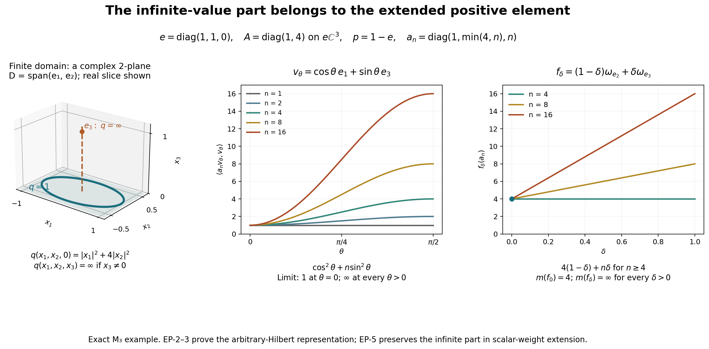

# Extended positive elements and composition with operator-valued weights

*Fresh local reconstruction, GPT-6 Astra (OpenAI), Ultra, 2026-10-04. CC0-1.0 to the extent of rights held.*

This provider constructs the extended positive cone of an arbitrary concrete von Neumann algebra \(M\subseteq B(K)\), including the projection carrying its infinite values. It then extends every normal scalar weight to that cone and proves the basic composition theorem for normal operator-valued weights. No separability, faithfulness or semifiniteness is assumed for the extended-positive construction or the scalar extension.

Actual earlier written proofs are [OA-FLOW.CF.6](OA-FLOW-CF.md#oa-flow.cf.6), [OA-FLOW.CF.7](OA-FLOW-CF.md#oa-flow.cf.7), [OA-FLOW.CF.8](OA-FLOW-CF.md#oa-flow.cf.8), [OA-FLOW.CF.10](OA-FLOW-CF.md#oa-flow.cf.10), [OA-FLOW.GNS.2.1](OA-FLOW-GNS.md#gns-lemma-2-1), [OA-FLOW.GNS.2.2](OA-FLOW-GNS.md#gns-lemma-2-2), [OA-FLOW.GNS.4.1](OA-FLOW-GNS.md#gns-theorem-4-1), [OA-FLOW.GNS.7.1](OA-FLOW-GNS.md#gns-lemma-7-1), [OA-FLOW.CP.1](OA-FLOW-CP.md#oa-flow.cp.1), [OA-FLOW.CP.2](OA-FLOW-CP.md#oa-flow.cp.2), [OA-FLOW.CP.3](OA-FLOW-CP.md#oa-flow.cp.3), [OA-FLOW.CP.4](OA-FLOW-CP.md#oa-flow.cp.4), [OA-FLOW.CP.5](OA-FLOW-CP.md#oa-flow.cp.5), [OA-FLOW.CP.6](OA-FLOW-CP.md#oa-flow.cp.6), [OA-FLOW.SF.SF0](OA-FLOW-SF.md#oa-flow.sf.sf0), [OA-FLOW.SF.SB0](OA-FLOW-SF.md#oa-flow.sf.sb0), [OA-FLOW.SF.SB1](OA-FLOW-SF.md#oa-flow.sf.sb1), [OA-FLOW.SF.SB2](OA-FLOW-SF.md#oa-flow.sf.sb2), [OA-FLOW.SF.SB3](OA-FLOW-SF.md#oa-flow.sf.sb3), [OA-FLOW.SF.SB4](OA-FLOW-SF.md#oa-flow.sf.sb4), [OA-FLOW.SF.SB5](OA-FLOW-SF.md#oa-flow.sf.sb5), [OA-FLOW.SF.SB6](OA-FLOW-SF.md#oa-flow.sf.sb6), [OA-FLOW.FF.5](OA-FLOW-FF.md#oa-flow.ff.5), [OA-FLOW.FF.6](OA-FLOW-FF.md#oa-flow.ff.6), [OA-FLOW.SC.4](OA-FLOW-SC.md#sc-04), [OA-FLOW.SC.5](OA-FLOW-SC.md#sc-05), [OA-FLOW.GW.1](OA-FLOW-GW.md#oa-flow.gw.1), [OA-FLOW.GW.2](OA-FLOW-GW.md#oa-flow.gw.2), [OA-FLOW.GW.3](OA-FLOW-GW.md#oa-flow.gw.3), [OA-FLOW.GW.4](OA-FLOW-GW.md#oa-flow.gw.4), [OA-FLOW.EW.5](OA-FLOW-EW.md#oa-flow.ew.5). GNS Lemmas 2.1–2.2 give positive-functional Cauchy–Schwarz, GNS 4.1 gives its unital norm identity, and GNS 7.1 constructs the countable Hilbert sum. CF Sections 6–8 and 10 supply bounded calculus, positivity, Hilbert–Riesz and completion. The closed-form input is FF-4 with the opening form-invariance paragraph of FF-5 (current [FF](OA-FLOW-FF.md#oa-flow.ff.5) lines 169–213); its later paragraphs are unnecessary here. CP01–06 supplies predual completeness/duality; EP-1 itself proves the positive vector-series representation. EW-5 is the current reviewed normal-minorant formula, including every infinite value.

Free author context is [Hiai, §8.1 and Proposition 8.6, printed pp.68–71](https://arxiv.org/pdf/2004.02383v1#page=68). The scalar-weight extension below uses [EW](OA-FLOW-EW.md#oa-flow.ew.5)'s actual normal-minorant formula and two interchangeable suprema; it does not import the general decomposition of a normal weight as a sum of normal functionals used in that reference. That separate decomposition theorem remains open in the present reconstruction.

## EP-1. Every positive normal functional has a positive vector series

Let \(f\in M_*^+\). CP01–06 gives square-summable vector sequences \((\xi_n),(\eta_n)\) in \(K\) such that
\[
f(a)=\sum_n\langle a\xi_n,\eta_n\rangle.
\]
For \(a\geq0\), Cauchy–Schwarz for \(a^{1/2}\) and \(2rs\leq r^2+s^2\) show
\[
0\leq f(a)\leq
g(a):=\frac12\sum_n
  \bigl(\langle a\xi_n,\xi_n\rangle+\langle a\eta_n,\eta_n\rangle\bigr).
\tag{EP1}
\]
The right side is a norm-convergent series of positive vector functionals and hence belongs to \(M_*^+\), by [CP](OA-FLOW-CP.md#oa-flow.cp.6)'s completeness and isometric inclusion. Write it as
\(g(a)=\langle a^{(\infty)}v,v\rangle\)
on the countable Hilbert sum \(K^{(\infty)}\), by putting all \(\xi_n/\sqrt2,\eta_n/\sqrt2\) among the coordinates of \(v\).

Let \(K_0=\overline{\{a^{(\infty)}v:a\in M\}}\). This is a reducing subspace for the amplified representation, and \(v\in K_0\). On its dense cyclic subspace the form
\[
F(a^{(\infty)}v,b^{(\infty)}v)=f(b^*a)
\]
is well defined and bounded. Indeed the positive-functional Cauchy–Schwarz inequality proved in [GNS Lemma2.1](OA-FLOW-GNS.md#gns-lemma-2-1) and [Lemma2.2](OA-FLOW-GNS.md#gns-lemma-2-2) and (EP1) give
\[
|f(b^*a)|^2\leq f(a^*a)f(b^*b)
\leq\|a^{(\infty)}v\|^2\|b^{(\infty)}v\|^2.
\]
[CF8 Hilbert–Riesz theorem](OA-FLOW-CF.md#oa-flow.cf.8) supplies a positive contraction \(T\) on \(K_0\) representing this form. For \(c\in M\),
\[
\langle T c^{(\infty)}a^{(\infty)}v,b^{(\infty)}v\rangle
=f(b^*ca)
=\langle T a^{(\infty)}v,c^{*(\infty)}b^{(\infty)}v\rangle.
\]
Thus \(T\) commutes with the restricted representation, as does its bounded positive square root. Set \(\zeta=T^{1/2}v\in K_0\subseteq K^{(\infty)}\). Then
\[
f(a)=\langle a^{(\infty)}\zeta,\zeta\rangle
=\sum_n\langle a\zeta_n,\zeta_n\rangle,\qquad
\sum_n\|\zeta_n\|^2=f(1)=\|f\|.
\tag{EP2}
\]
The series converges in functional norm. Zero functionals and zero Hilbert spaces are included. The same series on \(B(K)\) is a normal positive extension of \(f\) of the same norm, so this extension assertion has also been proved locally.

## EP-2. From a predual-cone functional to its complete closed form

Define \(\widehat M_+\) to consist of maps \(m:M_*^+\to[0,\infty]\) which are additive, positively homogeneous with \(0\cdot\infty=0\), and lower semicontinuous for the norm topology on \(M_*^+\). Additivity gives monotonicity in the positive-functional order. A bounded positive \(a\in M\) is embedded as \(m_a(f)=f(a)\).

For \(m\in\widehat M_+\), put \(q(\xi)=m(\omega_\xi)\), where
\(\omega_\xi(a)=\langle a\xi,\xi\rangle\).
The functional norm estimate
\[
\|\omega_\xi-\omega_\eta\|
\leq(\|\xi\|+\|\eta\|)\|\xi-\eta\|
\tag{EP3}
\]
follows by expanding the difference at every \(\|a\|\leq1\). Consequently \(q\) is norm lower semicontinuous. Also
\[
q(c\xi)=|c|^2q(\xi),\qquad
q(\xi+\eta)+q(\xi-\eta)=2q(\xi)+2q(\eta).
\tag{EP4}
\]
The latter is the parallelogram identity for vector functionals followed by additivity; it is valid with infinite values.

The finite domain \(D=\{\xi:q(\xi)<\infty\}\) is a complex linear space. For addition use
\(\omega_{\xi+\eta}\leq2\omega_\xi+2\omega_\eta\)
and monotonicity of \(m\). On \(D\), polarization gives a nonnegative sesquilinear form with diagonal \(q\):
\[
q(\xi,\eta)=\frac14\bigl(q(\xi+\eta)-q(\xi-\eta)
 +i q(\xi+i\eta)-i q(\xi-i\eta)\bigr).
\tag{EP5}
\]
Here is the elementary algebra behind this use. The real expression
\(B(\xi,\eta)=(q(\xi+\eta)-q(\xi-\eta))/4\)
is symmetric and satisfies
\(B(\xi+\zeta,\eta)+B(\xi-\zeta,\eta)=2B(\xi,\eta)\)
by two applications of the parallelogram identity. Its value at zero is zero; putting \(\zeta=\xi\) gives doubling, and substituting \(\xi=(u+v)/2,\zeta=(u-v)/2\) gives additivity. It is therefore rational linear. Positivity of \(q(u+t v)\) for rational \(t\) gives \(|B(u,v)|^2\leq q(u)q(v)\). Homogeneity of \(q\) makes \(B((t-r)u,v)\) tend to zero as rational \(r\to t\), proving real linearity. The identities \(B(iu,iv)=B(u,v)\) and \(B(iu,v)=-B(u,iv)\), directly from (EP4), make \(B(u,v)+iB(u,iv)\) complex linear in the first entry and conjugate linear in the second. This is exactly (EP5).

This form is closed, even if \(D\) is not dense in \(K\). If \((\xi_n)\) is Cauchy for \(\|\xi\|_q^2=\|\xi\|^2+q(\xi)\), it converges in \(K\) to \(\xi\). For each \(n\), lower semicontinuity gives
\[
q(\xi_n-\xi)\leq\liminf_m q(\xi_n-\xi_m).
\]
The right side becomes arbitrarily small for large \(n\); it is finite for such \(n\), so \(\xi\in D\), and the sequence converges in form norm.

[FF-4](OA-FLOW-FF.md#oa-flow.ff.5) now supplies a unique orthogonal projection \(e\), with \(eK=\overline D\), and a unique positive self-adjoint operator \(A\) on \(eK\), such that
\[
D=D(A^{1/2}),\qquad
q(\xi)=\|A^{1/2}\xi\|^2\ \ (\xi\in D),\qquad
q(\xi)=\infty\ \ (\xi\notin D).
\tag{EP6}
\]
Let \(p=1-e\). This is the infinite part, not the zero-eigenspace projection.

For a unitary \(u'\in M'\), \(\omega_{u'\xi}=\omega_\xi\), so \(q(u'\xi)=q(\xi)\). Thus \(D\), its closure \(eK\), and the form are invariant in both directions. The projection \(e\) commutes with \(M'\); the [FF](OA-FLOW-FF.md#oa-flow.ff.5) resolvent variational argument makes the resolvent and spectral projections of \(A\) commute with its restricted unitaries. The unitary test for commutants and the bicommutant property therefore give
\[
e,p\in M,\qquad 1_B(A)\text{ extended by zero belongs to }M.
\tag{EP7}
\]
Thus \(A\) is affiliated with \(eMe\), with its full spectral domains. Define, by bounded spectral calculus,
\[
a_n=(A\wedge n)e+np\in M_+,\qquad n\geq1.
\tag{EP8}
\]
These operators increase, satisfy \(\|a_n\|\leq n\), and have
\(\langle a_n\xi,\xi\rangle\uparrow q(\xi)\)
on every \(\xi\in K\), including vectors with nonzero \(p\)-component.

## EP-3. Recovery on all normal functionals, uniqueness and finite-domain tests

Let \(f=\sum_j\omega_{\zeta_j}\) be the norm-convergent positive series from [EP-1](OA-FLOW-EP.md#oa-flow.ep.1). Additivity gives
\(m(\sum_{j\leq r}\omega_{\zeta_j})=\sum_{j\leq r}q(\zeta_j)\).
Monotonicity bounds every partial sum by \(m(f)\); lower semicontinuity at the norm limit gives the reverse bound. Hence
\[
m(f)=\sum_j q(\zeta_j)
=\sup_n\sum_j\langle a_n\zeta_j,\zeta_j\rangle
=\sup_n f(a_n).
\tag{EP9}
\]
The interchange of the nonnegative countable sum and increasing limit is the [earlier monotone-convergence proof](OA-FLOW-SC.md#sc-04). Formula (EP9) is valid when either side is infinite. It also proves that the resulting value is independent of the vector-series representation.

Conversely, for any projection \(e\in M\) and any positive self-adjoint \(A\) affiliated with \(eMe\), (EP8)–(EP9) define an element of \(\widehat M_+\). The functions \(f\mapsto f(a_n)\) are continuous; their supremum is lower semicontinuous. For \(f,g\geq0\), the two increasing numerical sequences give
\(\sup_n(f(a_n)+g(a_n))=\sup_n f(a_n)+\sup_n g(a_n)\),
including infinity; this proves additivity. Homogeneity, including the zero convention, follows directly.

The pair \((e,A)\) is unique: evaluating on all vector functionals recovers \(q\), its complete finite domain, its closure \(eK\), and the unique [FF-4](OA-FLOW-FF.md#oa-flow.ff.5) operator. Equivalently, if \(E_\lambda=1_{[0,\lambda]}(A)\) extended by zero, then
\[
m(f)=\int_{[0,\infty)}\lambda\,d f(E_\lambda)+\infty\,f(p).
\tag{EP10}
\]
The integral denotes the scalar spectral integral from the proved spectral calculus; \(\infty\cdot0=0\). It follows from (EP8) by monotone convergence. The projections \(E_\lambda\) are strongly right continuous and increase to \(e\), so the infinite projection is exactly their complementary limiting projection.

Two useful full-generality tests follow. First \(m(f)>0\) for every nonzero \(f\in M_*^+\) if and only if \(1_{\{0\}}(A)=0\). If this kernel vanishes, (EP6) has no nonzero zero vector, and (EP9) gives the claim; a nonzero kernel vector disproves it in the other direction.

Second,
\[
p=0\quad\Longleftrightarrow\quad
\{f\in M_*^+:m(f)<\infty\}\text{ is norm dense in }M_*^+.
\tag{EP11}
\]
If \(p=0\), \(D(A^{1/2})\) is dense in \(K\). Truncate the positive vector series of \(f\), then approximate its finitely many vectors by vectors in this domain. Formula (EP3) proves norm convergence of the resulting finite-functional sums, whose \(m\)-values are finite. If \(p\ne0\), every finite-\(m\) functional has all vectors of any positive representation in \(D\subseteq eK\), by (EP9), so it vanishes at \(p\). A unit vector in \(pK\) defines a normal state at distance at least one from that finite cone, by evaluation at \(p\).

Finally \(m(f)\leq C\|f\|\) for every \(f\geq0\) if and only if \(m=m_a\) for a bounded positive \(a\in M\), \(\|a\|\leq C\). The forward inequality gives \(q(\xi)\leq C\|\xi\|^2\) for every vector, hence \(e=1\) and the form operator is bounded with \(0\leq A\leq C\); (EP9) identifies \(m\). The converse is the functional norm inequality.

## EP-4. Order, sums and bounded conjugation in the extended cone

Order in \(\widehat M_+\) means pointwise order on \(M_*^+\). Addition and positive scaling are pointwise. They preserve lower semicontinuity because the summands are nonnegative; for addition, a strict finite lower bound at one point persists on the intersection of two neighborhoods giving corresponding lower bounds for the summands. Infinite values are handled by choosing arbitrarily large finite bounds.

If \((m_\alpha)\) is an increasing net, its pointwise supremum \(m\) is in \(\widehat M_+\). Supremum preserves lower semicontinuity. Additivity follows because the supremum of
\(m_\alpha(f)+m_\alpha(g)\)
equals the sum of the two suprema, using a common upper index for two approximating indices. The same proof covers infinite values. In particular any family has a sum, defined by the increasing net of finite partial sums; no common bound on that family is required.

For \(b\in M\), define
\[
(b^*mb)(f)=m(f_b),\qquad f_b(x)=f(b^*xb).
\tag{EP12}
\]
[EP-1](OA-FLOW-EP.md#oa-flow.ep.1) or [CP](OA-FLOW-CP.md#oa-flow.cp.6)'s vector series proves \(f_b\in M_*^+\) and
\(\|f_b-g_b\|\leq\|b\|^2\|f-g\|\).
Thus (EP12) is again additive, homogeneous and norm lower semicontinuous. Its closed quadratic form is precisely \(\xi\mapsto q(b\xi)\), with finite domain \(\{\xi:b\xi\in D\}\). This describes the full domain even for singular \(b\); no formal unbounded product \(b^*Ab\) is presumed to be self-adjoint. The definition agrees with ordinary multiplication for bounded positive \(m\).

These operations and increasing suprema are intrinsic: a normal \*-isomorphism with normal inverse transports them through its predual map. No particular faithful representation occurs in their definition.

## EP-5. Every normal scalar weight extends, without a normal-weight sum theorem

Let \(\varphi\) be any normal weight on \(M\). [EW](OA-FLOW-EW.md#oa-flow.ew.5) proves, with no faithfulness or semifiniteness hypothesis,
\[
\varphi(a)=\sup_{f\in\mathcal F_\varphi}f(a),\qquad
\mathcal F_\varphi=\{f\in M_*^+:f\leq\varphi\},\quad a\in M_+.
\tag{EP13}
\]
For \(m\in\widehat M_+\), define
\[
\widehat\varphi(m)=\sup_{f\in\mathcal F_\varphi}m(f).
\tag{EP14}
\]
It agrees with \(\varphi\) on \(M_+\). If \(a_n\uparrow m\) is the canonical bounded sequence (EP8), two independent suprema give
\[
\widehat\varphi(m)
=\sup_f\sup_n f(a_n)
=\sup_n\sup_f f(a_n)
=\sup_n\varphi(a_n).
\tag{EP15}
\]
No directedness or additive closure of \(\mathcal F_\varphi\) is asserted or needed.

More generally (EP15) holds for any increasing net \(b_\alpha\in M_+\) representing \(m\) pointwise on normal positive functionals: the same interchange of suprema proves it. For \(m,n\in\widehat M_+\), take their canonical sequences \(a_j,b_j\). The increasing sequence \(a_j+b_j\) represents \(m+n\) pointwise, by the increasing numerical sum identity. Therefore
\[
\widehat\varphi(m+n)
=\sup_j\varphi(a_j+b_j)
=\sup_j(\varphi(a_j)+\varphi(b_j))
=\widehat\varphi(m)+\widehat\varphi(n).
\tag{EP16}
\]
Positive homogeneity follows directly, including zero. For an arbitrary increasing net \(m_\alpha\uparrow m\) in the extended cone, (EP14) gives
\[
\widehat\varphi(m)
=\sup_f\sup_\alpha m_\alpha(f)
=\sup_\alpha\widehat\varphi(m_\alpha).
\tag{EP17}
\]
Thus the extension is additive, homogeneous and order normal on the entire extended cone. It is unique with these properties, because every \(m\) has the increasing bounded approximation (EP8).

If \(\varphi\) is faithful, so is this extension: zero value in (EP15) makes \(\varphi(a_n)=0\), hence \(a_n=0\) for every \(n\), and then \(m=0\). If \(f\in M_*^+\) is itself the weight, its extension is simply \(\widehat f(m)=m(f)\): the supremum in (EP14) includes \(f\), and every smaller functional gives a smaller value by monotonicity of \(m\).

## EP-6. Operator-valued finite domains and composition

Let \(N\subseteq M\) be a unital von Neumann subalgebra. An operator-valued weight is an additive, positively homogeneous map \(T:M_+\to\widehat N_+\) satisfying
\[
T(b^*xb)=b^*T(x)b\qquad(x\in M_+,\ b\in N).
\tag{EP18}
\]
It is normal if bounded increasing positive nets are sent to pointwise increasing suprema in \(\widehat N_+\). Define
\[
F_T=\{x\in M_+:T(x)\in N_+\},\quad
N_T=\{x:T(x^*x)\in N_+\},\quad
m_T=\operatorname{span}N_T^*N_T.
\tag{EP19}
\]
Here membership in \(N_+\) means the bounded-element criterion in [EP-3](OA-FLOW-EP.md#oa-flow.ep.3), not merely that one scalar evaluation is finite.

The cone \(F_T\) is hereditary and additive: if \(0\leq a\leq b\) and \(T(b)\) is bounded, then \(0\leq T(a)\leq T(b)\leq\|T(b)\|1\), so [EP-3](OA-FLOW-EP.md#oa-flow.ep.3) makes \(T(a)\) bounded. The usual left-ideal estimate
\(x^*c^*cx\leq\|c\|^2x^*x\)
proves \(N_T\) is a left ideal of \(M\); its linearity follows from
\((x+y)^*(x+y)\leq2x^*x+2y^*y\).
Equation (EP18) also makes it a right \(N\)-module.

The purely hereditary-cone and polarization proof of [GW-1](OA-FLOW-GW.md#oa-flow.gw.1) applies verbatim to this finite cone: it uses only those two displayed inequalities, square roots of finite positive elements, and finite sums. Thus
\[
m_T=\operatorname{span}F_T,\qquad
(m_T)_+=F_T.
\tag{EP20}
\]
Both \(N_T\) and \(m_T\) are \(N\)-bimodules. On \(m_T\) there is a unique linear extension \(T_0:m_T\to N\) of the finite values. Explicitly extend on differences of finite positives, then complexify. If \(a-b=c-d\), then \(a+d=b+c\), so additivity of the finite bounded values gives
\(T(a)-T(b)=T(c)-T(d)\);
this proves well-definedness and linearity. Polarization of (EP18), followed by linearity in the finite argument, gives
\[
T_0(b_1xb_2)=b_1T_0(x)b_2
\quad(x\in m_T,\ b_1,b_2\in N).
\tag{EP21}
\]

For any normal scalar weight \(\varphi\) on \(N\), define
\(\Phi(x)=\widehat\varphi(T(x))\).
[EP-5](OA-FLOW-EP.md#oa-flow.ep.5) proves that this is a normal weight on \(M\) whenever \(T\) is normal: additivity, homogeneity and arbitrary increasing limits compose. In particular normality of \(T\) is equivalent to normality of every scalar weight \(x\mapsto T(x)(f)\), \(f\in N_*^+\), since order and suprema in \(\widehat N_+\) are pointwise and \(\widehat f(m)=m(f)\).

Suppose additionally that \(T\) is faithful, \(N_T\) is weak-operator dense in \(M\) (semifiniteness), and \(\varphi\) is faithful normal semifinite on \(N\). Then \(\Phi\) is faithful normal semifinite. Faithfulness follows from [EP-5](OA-FLOW-EP.md#oa-flow.ep.5): if \(\Phi(x^*x)=0\), then \(T(x^*x)=0\), and faithfulness of \(T\) gives \(x=0\).

For semifiniteness choose [GW](OA-FLOW-GW.md#oa-flow.gw.4)'s finite positive contractions \(u_i\in N\) with \(u_i\uparrow1\) and \(\varphi(u_i)<\infty\). For \(x\in N_T\), (EP18) and boundedness of \(T(x^*x)\) give
\[
\Phi((xu_i)^*(xu_i))
=\varphi(u_i T(x^*x)u_i)
\leq\|T(x^*x)\|\varphi(u_i^2)<\infty.
\tag{EP22}
\]
Thus \(xu_i\in N_\Phi\) and \(xu_i\to x\) strongly. The weak-operator closure of \(N_\Phi\) contains \(N_T\), hence all of \(M\). [GW](OA-FLOW-GW.md#oa-flow.gw.4)'s scalar semifiniteness criterion now proves semifiniteness of \(\Phi\).

The complete conclusions are the extended-positive spectral representation with its infinite part, positive normal-functional vector series, the unique normal scalar-weight extension, and the full basic normal/faithful/semifinite composition theorem. Modular restriction and cocycle preservation for an operator-valued weight, existence/classification of such weights, standard form and the general sum decomposition of normal scalar weights are not proved here.

## EP-7. The infinite-value part is visible in every positive normal test

The figure illustrates [EP-2](OA-FLOW-EP.md#oa-flow.ep.2) and [EP-3, equations EP6–EP11](OA-FLOW-EP.md#oa-flow.ep.3). The scalar extension retaining the same infinite values is proved in [EP-5](OA-FLOW-EP.md#oa-flow.ep.5). The [reproducible source](../assets/extended-positive/render_extended_positive.py) and [exact parameters](../assets/extended-positive/extended-positive-numerics.json) accompany it.

Work in \(M_3(\mathbb C)\) on \(\mathbb C^3\). Put
\[
e=\operatorname{diag}(1,1,0),\qquad p=1-e,\qquad
A=\operatorname{diag}(1,4)\text{ on }e\mathbb C^3.
\]
The associated closed form, with its whole finite domain, is
\[
q(\xi)=
\begin{cases}
|\xi_1|^2+4|\xi_2|^2,&\xi_3=0,\\
\infty,&\xi_3\ne0.
\end{cases}
\]
Its canonical bounded positive approximants are exactly
\[
a_n=\operatorname{diag}(1,\min(4,n),n),\qquad n=1,2,\ldots.
\]
They increase, and \(\langle a_n\xi,\xi\rangle\uparrow q(\xi)\) for every complex vector. The extended positive element is \(m(f)=\sup_n f(a_n)\). By [EP-3](OA-FLOW-EP.md#oa-flow.ep.3) this is independent of the chosen positive vector series for \(f\).

The first panel shows only the real coordinate slice of \(\mathbb C^3\): \(x_j=\operatorname{Re}\xi_j\) and all imaginary parts are set to zero. The shaded plane is its finite-domain slice \(x_3=0\), and the ellipse is exactly \(x_1^2+4x_2^2=1\), parameterized by \((\cos t,\frac12\sin t,0)\). The point \(e_3\) lies outside the finite domain and has \(q(e_3)=\infty\). Neither the plane nor the ellipse is a picture of the full complex Hilbert space.

For the unit-vector path \(v_\theta=\cos\theta\,e_1+\sin\theta\,e_3\), \(0\leq\theta\leq\pi/2\),
\[
\langle a_n v_\theta,v_\theta\rangle
=\cos^2\theta+n\sin^2\theta.
\]
At \(\theta=0\) its value is always one. At each fixed \(\theta>0\) it tends to infinity. The middle panel plots the exact first, second, fourth, eighth and sixteenth cutoffs; the infinite limit is the formula just proved, not an extrapolation from the plotted samples.

For the normal-state path \(f_\delta=(1-\delta)\omega_{e_2}+\delta\omega_{e_3}\), \(0\leq\delta\leq1\), and \(n\geq4\),
\[
f_\delta(a_n)=4(1-\delta)+n\delta.
\]
Hence \(m(f_0)=4\), while \(m(f_\delta)=\infty\) for every \(\delta>0\), however small. The right panel plots three bounded approximants, with the finite endpoint marked. Omitting \(np\) from the approximants would instead give the finite value \(4(1-\delta)\), so it would describe a different extended positive element.

More generally, in this example \(m(f)<\infty\) if and only if \(f(p)=0\). If \(f(p)>0\), then \(f(a_n)\geq n f(p)\to\infty\). If \(f(p)=0\), the term \(np\) evaluates to zero and the remaining part is bounded by \(4e\). Thus every finite-\(m\) functional vanishes on \(p\), and the normal state \(\omega_{e_3}\) is at functional-norm distance at least one from that cone. This is the obstruction in EP11.

All statements in the caption are exact matrix and scalar computations. For free author context see [Hiai, §8.1, printed pp.68–69](https://arxiv.org/pdf/2004.02383v1#page=68). This independent example, figure and reproducible source are CC0-1.0 to the extent of rights held.

[Editable original SVG](../assets/extended-positive/assets/extended-positive.svg).
