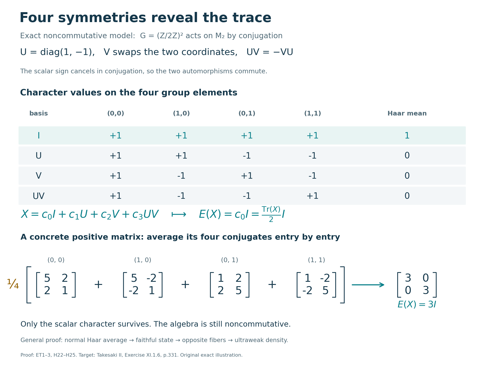

# Ergodic compact actions have a canonical trace

Averaging a compact action produces a normal conditional expectation onto its fixed algebra. When the action is ergodic, that algebra consists only of scalars, so the expectation is a faithful normal state. Abelian spectral fibers then supply the missing symmetry: each nonzero homogeneous element is a scalar multiple of a unitary, opposite fibers are one-dimensional, and the Haar state is tracial first against homogeneous elements and then on the whole algebra.

*Original expression written in Codex (OpenAI), September 2026; restoration and illustration by GPT-6 Astra (OpenAI), Ultra, 5 October 2026. Owner and independent mathematical review are complete at the exact declared inputs. Newly written original expression is dedicated under CC0-1.0 to the extent of rights held.*

Let \(G\) be a compact Hausdorff abelian group with normalized Haar measure \(ds\), let \(M\ne0\) be a von Neumann algebra, and let

$$\alpha:G\longrightarrow\operatorname{Aut}(M) \tag{H1}$$

be point-ultraweakly continuous. Assume that the action is ergodic:

$$M^\alpha
=\{x\in M:\alpha_s(x)=x\text{ for every }s\in G\}
=\mathbb C1. \tag{H2}$$

No faithfulness of \(\alpha\), sigma-finiteness of \(M\), metrizability of \(G\), or countability of \(\widehat G\) is assumed.

The exact earlier inputs are [AT3](OA-FLOW-AT.md#oa-flow.at.3) for predual norm continuity, [AT5–6](OA-FLOW-AT.md#oa-flow.at.5) for normal integrated maps and arbitrary-neighbourhood approximation, [HR6–7](OA-FLOW-HR.md#hr-06) for Haar measure and its full support, [CF5](OA-FLOW-CF.md#oa-flow.cf.5) for compact polynomial density, and [H3](OA-FLOW-HARMONIC-LATE.md#l138-h3) for separation of points by characters. [CF6–8](OA-FLOW-CF.md#oa-flow.cf.6), [CP1–6](OA-FLOW-CP.md#oa-flow.cp.1) and [ST2](OA-FLOW-ST12.md#oa-flow.st.2) supply the bounded algebra, concrete positive normal-functional and multiplication-topology facts used below. All of these are actual local proofs, not assumptions imported from a citation.

The nonzero hypothesis is essential for the word *normalized*: on the zero algebra the only weight is zero, and there is no state of value one at the identity. That case has the trivial averaging map but is outside the normalized-state assertion.

## Haar averaging gives a normalized faithful normal state

By AT3, for \(\omega\in M_*\), the predual orbit \(s\mapsto\omega\circ\alpha_s\) is norm-continuous. AT5 constructs its genuine predual Bochner integral, which defines a bounded operator

$$E_*(\omega)
=\int_G\omega\circ\alpha_s\,ds
\quad\text{on }M_*,
\qquad
\|E_*\|\le1. \tag{H3}$$

Let \(E=E_*^*:M\to M\). Then, in the ultraweak sense,

$$E(x)=\int_G\alpha_s(x)\,ds,
\qquad
\omega(E(x))
=\int_G\omega(\alpha_s(x))\,ds. \tag{H4}$$

This preadjoint construction proves normality without treating the orbit as an operator-norm Bochner integrand. Positivity follows by testing (H4) against positive normal functionals, and \(E(1)=1\). Haar invariance gives

$$\alpha_t(E(x))=E(x),
\qquad
E(\alpha_t(x))=E(x)
\quad(t\in G), \tag{H5}$$

while \(E(a)=a\) for \(a\in M^\alpha\). Hence

$$\operatorname{Ran}E=M^\alpha=\mathbb C1. \tag{H6}$$

There is consequently a unique scalar functional \(\tau\) such that

$$\boxed{E(x)=\tau(x)1
\qquad(x\in M).} \tag{H7}$$

The functional \(\tau\) is linear, positive, and normalized. It is normal because, for any normal state \(\rho\) on \(M\),

$$\tau=\rho\circ E. \tag{H8}$$

It remains to check faithfulness without assuming that \(M\) has a faithful normal state. Suppose \(x\in M_+\) is nonzero. Positive normal functionals separate \(M_+\), so choose \(\omega\in M_*^+\) with \(\omega(x)>0\). The continuous nonnegative function

$$s\longmapsto\omega(\alpha_s(x)) \tag{H9}$$

is positive at the identity and therefore on some nonempty open neighborhood. Haar measure has full support, so

$$\omega(E(x))
=\int_G\omega(\alpha_s(x))\,ds>0. \tag{H10}$$

Thus \(E(x)\ne0\), and (H7) gives \(\tau(x)>0\). We have proved that \(\tau\) is a normalized faithful normal \(\alpha\)-invariant state.

## Opposite spectral fibers force the Haar state to be tracial

For \(p\in\widehat G\), write

$$M_p
=\{x\in M:\alpha_s(x)=(s,p)x
\text{ for every }s\in G\}, \tag{H11}$$

and define the normal Fourier projection

$$P_p(y)
=\int_G\overline{(s,p)}\,\alpha_s(y)\,ds.
\tag{H12}$$

Then \(P_p(y)\in M_p\), and \(P_0=E\).

Ergodicity makes each nonzero spectral fiber one-dimensional. Indeed, if \(0\ne x\in M_p\), then

$$x^*x,\;xx^*\in M^\alpha=\mathbb C1. \tag{H13}$$

Both positive scalars equal \(\|x\|^2\), so \(u=x/\|x\|\) is unitary. If \(z\in M_{-p}\), then \(xz\in M_0=\mathbb C1\); multiplying by \(x^*\) shows that

$$M_{-p}=\mathbb Cx^*. \tag{H14}$$

Fix \(x\in M_p\) and \(y\in M\). If \(x=0\), there is nothing to prove. Otherwise, Haar averaging and (H12) give

$$\begin{aligned}
E(xy)
&=\int_G(s,p)x\alpha_s(y)\,ds
=xP_{-p}(y),\\
E(yx)
&=\int_G\alpha_s(y)(s,p)x\,ds
=P_{-p}(y)x.
\end{aligned}\tag{H15}$$

By (H14), \(P_{-p}(y)=c x^*\) for some \(c\in\mathbb C\). Since \(xx^*=x^*x=\|x\|^2 1\), the two expressions in (H15) agree. Using (H7),

$$\tau(xy)=\tau(yx)
\qquad(x\in M_p,\ y\in M). \tag{H16}$$

For completeness, we pass from homogeneous elements to arbitrary elements without a countability assumption. Let \(V\) range over identity neighbourhoods and choose AT6's nonnegative continuous bumps \(a_V\), supported in \(V\), with integral one. H3 proves that the continuous characters separate points of \(G\). Their complex span is a unital self-adjoint algebra, so the complete compact density proof CF5 gives a trigonometric polynomial \(r_{V,\varepsilon}\) with \(\|r_{V,\varepsilon}-a_V\|_\infty<\varepsilon\), where \(0<\varepsilon<1/2\). Haar measure has mass one, so this also bounds the \(L^1\) error. Put \(c_{V,\varepsilon}=\int_G r_{V,\varepsilon}(s)\,ds\) and \(k_{V,\varepsilon}=r_{V,\varepsilon}/c_{V,\varepsilon}\). Since \(|c_{V,\varepsilon}-1|<\varepsilon\), the denominator is nonzero, and direct estimates give

$$\|k_{V,\varepsilon}\|_1\le\frac{1+\varepsilon}{1-\varepsilon}<3,
\qquad
\|k_{V,\varepsilon}-a_V\|_1\le\frac{2\varepsilon}{1-\varepsilon}<4\varepsilon.
\tag{H16a}$$

Indeed the second estimate follows by writing \(r-ca_V=(r-a_V)+(1-c)a_V\), using \(\|a_V\|_1=1\), then dividing by \(|c|\). Direct the pairs \((V,\varepsilon)\) by shrinking \(V\) and decreasing \(\varepsilon\). The resulting trigonometric polynomials \(k_i\) satisfy

$$\sup_i\|k_i\|_1<\infty,
\qquad
\int_G k_i(s)\,ds=1, \tag{H17}$$

and, for every \(\omega\in M_*\),

$$\left\|
\int_G k_i(s)(\omega\circ\alpha_s)\,ds-\omega
\right\|\longrightarrow0. \tag{H18}$$

To verify (H18), AT5's integral norm estimate and AT6 give the explicit bound

$$\left\|\int_G k_{V,\varepsilon}(s)(\omega\circ\alpha_s)\,ds-\omega\right\|
\le4\varepsilon\|\omega\|+
\sup_{s\in V}\|\omega\circ\alpha_s-\omega\|\longrightarrow0.
\tag{H18a}$$

Define

$$F_i(x)=\int_G k_i(s)\alpha_s(x)\,ds. \tag{H19}$$

Each \(F_i(x)\) is a finite linear combination of the Fourier coefficients \(P_p(x)\), hence belongs to the algebraic span of the spectral fibers. Equation (H18) says that

$$F_i(x)\longrightarrow x
\quad\text{ultraweakly for every }x\in M. \tag{H20}$$

Linearity of (H16) gives \(\tau(F_i(x)y)=\tau(yF_i(x))\). Left and right multiplication by a fixed \(y\) are normal, and \(\tau\) is normal, so taking the limit in (H20) yields

$$\boxed{\tau(xy)=\tau(yx)
\qquad(x,y\in M).} \tag{H21}$$

Thus the Haar average of an ergodic compact abelian action is a normalized faithful normal trace. The tracial conclusion does not follow from invariance alone; the decisive input is the one-dimensional opposite-fiber calculation (H13)–(H16).

**Problem.** In the proof of faithfulness, why can one not simply choose a faithful normal state on \(M\)?

**Solution.** A general von Neumann algebra need not be sigma-finite, and existence of a faithful normal state is equivalent to sigma-finiteness by the complete earlier [PC7](OA-FLOW-PC.md#oa-flow.projection.pc7) proof. The argument at (H9)–(H10) instead chooses a positive normal functional adapted to the one nonzero positive element under consideration, which is always possible because the predual separates the positive cone. \(\square\)

## Four symmetries average a matrix to its trace

The abelian hypothesis concerns the acting group, not commutativity of the algebra. Here is an exact finite model. Set

$$U=\begin{pmatrix}1&0\\0&-1\end{pmatrix},\qquad
V=\begin{pmatrix}0&1\\1&0\end{pmatrix},\qquad
W=UV=\begin{pmatrix}0&1\\-1&0\end{pmatrix}.
\tag{H22}$$

Both \(U\) and \(V\) are self-adjoint unitaries, \(U^2=V^2=I\), and \(UV=-VU\). The inner automorphisms \(\operatorname{Ad}U\) and \(\operatorname{Ad}V\) therefore commute: the two possible implementers \(UV\) and \(VU\) differ by the scalar \(-1\), which cancels in conjugation. Thus

$$\alpha_{(a,b)}(X)=U^aV^bX(U^aV^b)^*,\qquad
(a,b)\in(\mathbb Z/2\mathbb Z)^2,
\tag{H23}$$

is an action. The group is finite, so all its orbits are continuous. Every matrix has the unique expansion

$$X=c_0I+c_1U+c_2V+c_3W,
\quad
c_0=\tfrac12(x_{11}+x_{22}),\quad c_1=\tfrac12(x_{11}-x_{22}),
\quad c_2=\tfrac12(x_{12}+x_{21}),\quad c_3=\tfrac12(x_{12}-x_{21}).
\tag{H24}$$

Multiplication gives \(\operatorname{Ad}U(V)=-V\), \(\operatorname{Ad}V(U)=-U\), and both conjugations send \(W\) to \(-W\). The four basis elements consequently have characters \(1,(-1)^b,(-1)^a,(-1)^{a+b}\), respectively. A fixed matrix has \(c_1=c_2=c_3=0\), so the action is ergodic. Averaging the four character values cancels the last three coefficients and retains the first:

$$E(X)=\frac14\sum_{a,b=0}^1\alpha_{(a,b)}(X)
=c_0I=\frac{\operatorname{Tr}(X)}2I.
\tag{H25}$$

This is the normalized faithful matrix trace on a noncommutative algebra. Faithfulness follows directly: a positive nonzero matrix has a positive eigenvalue, hence positive trace by the already proved finite spectral calculus. The calculation illustrates the general proof; it does not replace its arbitrary compact-group approximation net.

**Exercise.** With the above \(U,V,W\), average \(X=\begin{pmatrix}5&2\\2&1\end{pmatrix}\), and identify the coefficient of \(W\).

**Solution.** Formula (H24) gives \((c_0,c_1,c_2,c_3)=(3,2,2,0)\). Thus \(E(X)=3I\) and \(\tau(X)=3\). The four conjugations are \(\begin{pmatrix}5&2\\2&1\end{pmatrix}\), \(\begin{pmatrix}5&-2\\-2&1\end{pmatrix}\), \(\begin{pmatrix}1&2\\2&5\end{pmatrix}\) and \(\begin{pmatrix}1&-2\\-2&5\end{pmatrix}\); their average verifies the result entry by entry. The eigenvalues of \(X\) are \(3\pm2\sqrt2\), both positive, as follows from its characteristic polynomial \(t^2-6t+1\). \(\square\)

## Source and scope

The mathematical target is Takesaki, [*Theory of Operator Algebras II*, Exercise XI.1.6, printed page 331](https://doi.org/10.1007/978-3-662-10451-4), read on native page 352 in the exact approved edition. That page states the exercise without its proof. The retained local proof develops the normal preadjoint, full-support faithfulness and opposite-fiber trace calculation, followed by an explicitly bounded approximation net. The matrix example and solved calculation are local additions. The earlier free-source foundations remain actual programme proofs; the book citation replaces none of them.

This restored chapter explicitly excludes the zero algebra from its normalized-state conclusion. It assumes neither faithfulness of the action nor sigma-finiteness of the algebra, and it uses a net rather than a sequence. Owner and independent mathematical review, exact dependency bindings and illustration review are complete at the declared inputs. This chapter is placed after the lessons that prove the results it uses.

## Four characters and their average

The table and matrices are the exact finite model in [ET3](OA-FLOW-ET.md#et-3), equations (H22)–(H25). The columns are ordered \((0,0),(1,0),(0,1),(1,1)\). Each group element has Haar mass \(1/4\). The rows \(I,U,V,UV\) have characters \(1,(-1)^b,(-1)^a,(-1)^{a+b}\); their means are respectively \(1,0,0,0\). Thus averaging retains precisely the coefficient \(c_0=\operatorname{Tr}(X)/2\), despite \(UV=-VU\) and the noncommutativity of the matrix algebra.

The lower row uses the positive matrix \(X=\left(\begin{smallmatrix}5&2\\2&1\end{smallmatrix}\right)\). The outer brackets make the factor \(1/4\) apply to the entire sum of four conjugates. Their average is exactly \(3I\), so the normalized Haar trace has value \(3\) on this matrix. The renderer verifies these rational matrix identities and the four character means before drawing; no numerical approximation is used.

The figure illustrates the finite case. The complete arbitrary compact Hausdorff abelian theorem is proved in [ET1–2](OA-FLOW-ET.md#et-1): normal predual averaging, full-support faithfulness, opposite-fiber multiplication and a uniformly bounded trigonometric approximation net. The matrix calculation does not supply that general theorem or impose a countability assumption.

Human mathematical target: Takesaki, *Theory of Operator Algebras II*, Exercise XI.1.6 in the exact approved edition. This model, diagram and caption are locally authored; no source illustration is reproduced. Reproducible files: [renderer](../assets/ergodic-haar-trace/render_figure.py), [exact data](../assets/ergodic-haar-trace/assets/ergodic-haar-data.json), [SVG](../assets/ergodic-haar-trace/assets/ergodic-haar.svg) and [PNG](../assets/ergodic-haar-trace/assets/ergodic-haar.png).
