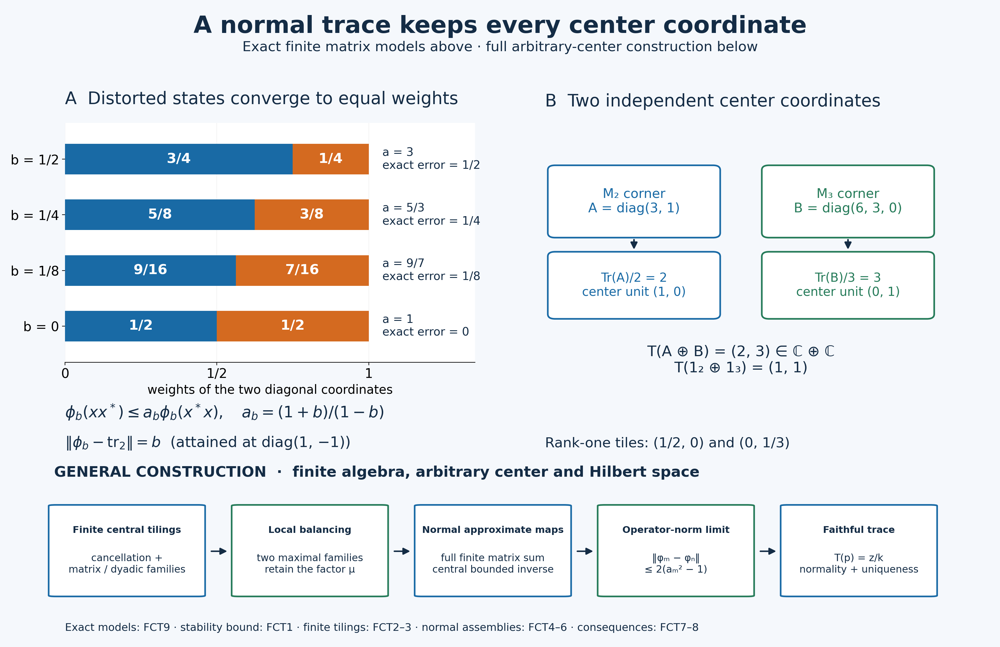

# The normalized trace with its full center retained

Let \(M\subseteq B(H)\) be a finite von Neumann algebra on an arbitrary complex Hilbert space, and put \(Z=Z(M)\). Finiteness means that an isometry in every projection corner has full final projection. Equivalently, the identity is a finite projection, since finiteness passes to subprojections by PC5. No countability, factor, separability or scalar-trace assumption is made.

We construct a unique normal positive linear map \(T:M\to Z\) such that

\[
 T(1)=1,\qquad T(zx)=zT(x),\qquad T(xy)=T(yx)
 \quad(z\in Z,\ x,y\in M).
 \tag{FCT1}
\]
It is faithful, has norm one when \(M\ne0\), and preserves all bounded increasing positive suprema. Normal here means continuous on the entire concrete ultraweak space, not just on bounded sets. For the zero algebra the map is zero; its norm is zero and its normalization is \(T(0)=0\).

The construction is quantitative: maps with trace distortion tending to one converge in operator norm. We prove that stability first, under an explicit tiling condition. We then supply the tilings, normal center-valued states and two local balancing arguments needed to produce those maps.

The earlier complete proofs used are [CF1/3–8](OA-FLOW-CF.md#oa-flow.cf.1), [SF0 and SB1–6](OA-FLOW-SF.md#oa-flow.shared-foundations.sf-0), [CP1–6](OA-FLOW-CP.md#oa-flow.cp.1), [ST1–2](OA-FLOW-ST12.md#oa-flow.st.1), and [PC1–7](OA-FLOW-PC.md#oa-flow.projection.pc1). Only the last automorphism corollary additionally uses the order-normal positive-map criterion [NF6](OA-FLOW-NF.md#oa-flow.nf.6). Each use is located below. Scalar trace existence, type-I classification, direct integrals and a fixed-point theorem are not premises.

*Original exposition and illustration: CC0-1.0 to the extent of rights held. Spot-checked in a separate AI session.*

## FCT0. Three analytic operations

For a positive functional \(f\) on a unital C-star algebra, the positive/negative decomposition of a self-adjoint element shows that \(f\) is real on self-adjoint elements, hence \(f(x^*)=\overline{f(x)}\). Positivity of \(f((x+ty)^*(x+ty))\) for all complex \(t\) proves

\[
 |f(y^*x)|^2\le f(x^*x)f(y^*y).
 \tag{FCT2}
\]
Indeed the diagonal values are nonnegative and the mixed terms are conjugates. If \(f(y^*y)>0\), minimize the scalar quadratic. If that diagonal is zero, a nonzero mixed term would make the quadratic negative by a sufficiently large scalar of the opposite phase. This also proves the zero-diagonal case. Setting \(y=1\) and using \(x^*x\le\|x\|^2 1\), from CF7, gives \(\|f\|=f(1)\), including \(f=0\).

Suppose \(F:M\to Z\) is positive and linear. Every character \(\chi\) of the commutative unital C-star algebra \(Z\) is positive, by CF6 and positive square roots. Thus \(\chi\circ F\) is positive and
\[
 |\chi(F(x))|\le \chi(F(1))\|x\|\le\|F(1)\|\|x\|.
\]
CF6 proves \(\|z\|=\sup_\chi|\chi(z)|\) for every complex \(z\in Z\). Consequently

\[
 \|F\|=\|F(1)\|.
 \tag{FCT3}
\]
This proves boundedness as well as the exact norm. It does not identify a complex image with its real part. The same argument works in a nonzero central corner, using its identity.

For completeness, a bounded increasing net \(a_j\ge0\) has its supremum as a strong limit in \(M\). Its limiting quadratic values define a bounded positive form: homogeneity and the parallelogram identity pass to the scalar limits along the directed net. Polarization and CF8's Hilbert representation theorem give a positive operator \(a\). We have \(0\le a-a_j\le C1\) for a common bound \(C\), so CF6–7 give

\[
 \|(a-a_j)\xi\|^2\le C\langle(a-a_j)\xi,\xi\rangle\longrightarrow0.
 \tag{FCT4}
\]
Strong closedness puts \(a\) in \(M\), and its quadratic values show that it is the least upper bound. CP4–6's vector-series tail estimate makes every bounded strong limit an ultraweak limit. In particular an ultraweakly continuous positive map \(F\) preserves these suprema: the bounded increasing \(F(a_j)\) have a strong supremum \(b\) by this same argument, hence an ultraweak limit \(b\), while continuity gives the ultraweak limit \(F(a)\). Uniqueness of the limit gives \(b=F(a)\).

We will also use the following complete decomposition of normal functionals. By CP4–6 every \(\omega\in M_*\) is \(\sum_j\omega_{u_j,v_j}\), with both vector sequences square summable and inner products linear in the first variable. Polarization gives

\[
 \omega_{u,v}=\frac14\sum_{k=0}^3 i^k\omega_{u+i^kv,u+i^kv}.
 \tag{FCT5}
\]
For each \(k\), the sum of these positive vector functionals is normal: \(\sum_j\|u_j+i^kv_j\|^2<\infty\). Thus every normal functional is a linear combination of four positive normal functionals. CP6 also proves that \(M_*\) is norm closed in \(M^*\). Finally \(x\mapsto axb\) is normal for bounded \(a,b\): substituting in its vector series replaces \((u_j,v_j)\) by \((bu_j,a^*v_j)\), which are still square summable. These assertions apply equally to \(Z\) and all concrete corners.

## FCT1. Quantitative stability, with the tiling premise explicit

Call a nonzero projection \(p\) a **central tile** if there are finitely many orthogonal projections

\[
 p=p_1\sim p_2\sim\cdots\sim p_k,\qquad
 p_1+\cdots+p_k=z\in Z,
 \tag{FCT6}
\]
where \(z\) is a nonzero central projection. Necessarily \(c(p)=z\), by PC2's preservation of central support under equivalence. This definition includes \(k=1\).

For this section alone assume that every projection is an arbitrary orthogonal sum of central tiles. A **normal center-valued state** is a normal positive linear \(\phi:M\to Z\) satisfying \(\phi(1)=1\) and \(\phi(zx)=z\phi(x)\). Suppose \(a_n>1\) decreases to one and such states satisfy, on all of \(M\),

\[
 \phi_n(xx^*)\le a_n\phi_n(x^*x).
 \tag{FCT7}
\]
For \(m<n\) and a central tile as in (FCT6), a partial isometry between \(p\) and \(p_i\), used in both directions in (FCT7), gives

\[
\begin{aligned}
 k\phi_n(p)&\le a_n\sum_i\phi_n(p_i)=a_nz
 =a_n\sum_i\phi_m(p_i)\\
 &\le ka_na_m\phi_m(p)\le ka_m^2\phi_m(p).
\end{aligned}
 \tag{FCT8}
\]
The last comparison uses \(\phi_m(p_i)\le a_m\phi_m(p)\). Thus \(D_{mn}=a_m^2\phi_m-\phi_n\) is nonnegative on tiles. Normality and finite partial sums extend the inequality to every projection. Bounded Borel spectral step approximation, supplied by SF's SB4–6, extends it to every positive element; boundedness permits the norm limit. Hence \(D_{mn}\) is a positive map, with \(D_{mn}(1)=(a_m^2-1)1\). By (FCT3),

\[
 \|D_{mn}\|=a_m^2-1,\qquad
 \|\phi_m-\phi_n\|\le2(a_m^2-1).
 \tag{FCT9}
\]
The maps are norm Cauchy. Completeness of \(Z\), applied at each \(x\) and then to the uniform operator bound, gives a norm limit \(T:M\to Z\). Positivity, normalization and the center-module identities pass to it. For \(\omega\in Z_*\),

\[
 \|\omega\circ T-\omega\circ\phi_n\|
 \le\|\omega\|\|T-\phi_n\|\longrightarrow0.
 \tag{FCT10}
\]
The terms belong to \(M_*\), whose norm closedness was proved in CP6. Thus \(T\) is ultraweakly continuous on its entire domain.

Taking limits in (FCT7) and interchanging \(x,x^*\) gives \(T(xx^*)=T(x^*x)\). For positive \(b\) and a unitary \(u\), apply this to \(ub^{1/2}\); it gives \(T(ubu^*)=T(b)\). Linearity gives that identity for every \(b\in M\), and replacing \(b\) by \(xu\) gives \(T(ux)=T(xu)\). Every element is a linear combination of four unitaries: split it into real and imaginary self-adjoint parts, scale each nonzero part to a contraction \(h\), and write

\[
 h=\tfrac12(u+u^*),\qquad
 u=h+i(1-h^2)^{1/2}.
 \tag{FCT11}
\]
CF6–7 verify that \(u\) is unitary. Consequently \(T(xy)=T(yx)\) for all \(x,y\). The tiling premise and the approximate states used in this conditional stability lemma are proved next, before it is applied to establish existence.

## FCT2. Finite cancellation and unitary completion

Suppose \(p\sim q\) in the finite algebra, with prescribed partial isometry \(v\) from \(p\) to \(q\). PC2 compares their complements centrally: on a central piece \(z\), there is a partial isometry from \(z(1-p)\) to a subprojection of \(z(1-q)\). Add it to \(zv\). Orthogonality of the initial and final projections makes the sum an isometry in \(zM\). Since \(z\) is finite, its final projection is all of \(z\). Therefore that complement subequivalence is an equivalence. On \(1-z\) reverse the roles and repeat. PC1 adds the two complement equivalences, proving

\[
 p\sim q\quad\Longrightarrow\quad1-p\sim1-q.
 \tag{FCT12}
\]
Adding the complementary partial isometry to the originally prescribed \(v\) extends \(v\) to a unitary. This works in every finite corner.

We need the version for different equivalent finite units. If \(e\sim f\), \(a\le e\), \(b\le f\), and \(a\sim b\), first transport \(b\) to \(eMe\) through an implementing equivalence between \(e,f\). Apply (FCT12) to the resulting two projections in that corner, then transport back. It gives \(e-a\sim f-b\). No trace is used.

A finite algebra contains no infinite orthogonal family of copies of one nonzero projection. Otherwise choose distinct copies \(p_0,p_1,\ldots\), and partial isometries from \(p_n\) onto \(p_{n+1}\). Their PC1 strong-star sum has initial projection \(P=\sum_{n\ge0}p_n\) and final projection \(P-p_0<P\). This contradicts finiteness of the subprojection \(P\).

## FCT3. Central tiles without a type-I classification

First split off the part generated by abelian projections. A projection \(e\) is abelian if \(eMe\) is commutative. Let \(z_a\) be the join in \(Z\) of the central supports of all such projections. If a nonzero projection \(p\le z_a\) had no nonzero abelian subprojection, it would have no polar bridge to any abelian projection: a nonzero bridge gives a subprojection of \(p\) equivalent to a subprojection of an abelian corner. Equivalence identifies those smaller corners, so the former is abelian. PC2 would then make \(c(p)\) orthogonal to every central support in that join, a contradiction. Thus every nonzero \(p\le z_a\) contains a nonzero abelian \(e\).

Fix such \(e\), and work on \(z=c(e)\). By PC4, every subprojection of \(e\) is \(ew\) for a central projection \(w\le z\), since \(eMe=Z(eMe)=Ze\). Construct orthogonal projections \(e_1,e_2,\ldots\) with \(e_1=e\). Set \(z_1=z\) and, after choosing \(e_1,\ldots,e_n\), put

\[
 r_n=z-\sum_{j\le n}e_j,\qquad z_{n+1}=c(r_n).
 \tag{FCT13}
\]
We can choose \(e_{n+1}\le r_n\) equivalent to \(ez_{n+1}\); if the residual is zero all later terms are zero. To see this, compare \(ez_{n+1}\) and \(r_n\). On a central piece where \(r_n\precsim ez_{n+1}\), its final subprojection of that abelian projection is \(ew\). Its central support is the full comparison piece, because \(c(r_n)=z_{n+1}\). Thus \(w\) is that piece and the subequivalence is an equivalence. On the other comparison piece \(ez_{n+1}\precsim r_n\) directly. Add the two implementations. This proves the asserted choice.

The \(z_n\) decrease. If \(z_\infty=\bigwedge_nz_n\ne0\), the orthogonal \(e_nz_\infty\) would all be equivalent to the nonzero \(ez_\infty\), contradicting FCT2. Thus \(z_\infty=0\). The central projections \(w_n=z_n-z_{n+1}\) sum to \(z\). On \(w_n\), exactly the first \(n\) constructed projections fill the unit:

\[
 w_n=\sum_{j=1}^n e_jw_n,\qquad e_jw_n\sim ew_n.
 \tag{FCT14}
\]
The equality follows because \(r_nw_n=0\), and the equivalences because \(w_n\le z_j\) for \(j\le n\). Every nonzero \(ew_n\) is therefore a central tile, and at least one is nonzero. This is an explicit finite homogeneous matrix-family construction; no classification theorem is hidden in it.

On \(M(1-z_a)\) there is no nonzero abelian projection. Every nonzero corner there contains two nonzero orthogonal equivalent projections. Indeed its algebra is not commutative. If all its projections were central, bounded spectral step approximation would make every self-adjoint element central and hence the algebra commutative. Take a noncentral projection \(r\); some off-diagonal corner \(rx(1-r)\), or its adjoint, is nonzero. PC1 polar decomposition gives the required orthogonal equivalent subprojections.

Choose a maximal family of such pairs in any nonzero central unit \(z\le1-z_a\), with all projections mutually orthogonal. A nonzero residual corner would contain another pair. Hence their sums are equivalent complementary halves of \(z\). Repeat in one half and transport its division to the other half. Induction gives, for every \(n\), a division of \(z\) into \(2^n\) orthogonal equivalent projections \(d_{n,j}\), with \(d_{n,0}\) decreasing and

\[
 d_{n,0}=d_{n+1,0}+d_{n+1,1}.
 \tag{FCT15}
\]
All their central supports are \(z\), since equivalent projections whose sum is central have that common support.

For a nonzero \(p\) in this part, work on \(z=c(p)\) and make these dyadic divisions there. Compare \(d_{n,0}\) with \(p\). If on some nonzero central piece \(w\) one has \(wd_{n,0}\precsim wp\), transport that tile to a subprojection of \(p\). FCT2 extends the transport to a unitary in \(Mw\), so conjugating the whole finite division exhibits the transported projection as a central tile. If this never occurs, central comparison gives \(p\precsim d_{n,0}\) for every \(n\). The projections \(d_{n+1,1}=d_{n,0}-d_{n+1,0}\) are mutually orthogonal and equivalent to \(d_{n+1,0}\). Thus each contains a copy of the same \(p\), contradicting FCT2.

Every nonzero projection in \(M\) now has a nonzero central-tile subprojection: cut it first by \(z_a\) or \(1-z_a\), and use the appropriate construction. A maximal orthogonal family of such tiles below any \(p\) must fill \(p\), because otherwise the residual supplies another tile. This proves exactly the tiling premise of FCT1, with arbitrary orthogonal index sets.

## FCT4. Normal center-valued states from cyclic central compressions

We first prove a cyclic abelian fact. If an abelian von Neumann algebra \(A\subseteq B(K)\) has cyclic vector \(\xi\), then \(A'=A\). Let \(R\in A'\) and \(C=\|R\|>0\). Choose \(a_n\in A\) with \(a_n\xi\to R\xi\). Put

\[
 r_n=1_{(2C,\infty)}(|a_n|),\qquad b_n=a_n(1-r_n).
 \tag{FCT16}
\]
CF6 constructs \(|a_n|\); SB4–6 puts its bounded Borel projections in \(A\). Since \(R\) commutes with \(r_n\),

\[
\begin{aligned}
 \tfrac12\|a_nr_n\xi\|
 &\le\|a_nr_n\xi\|-C\|r_n\xi\|\\
 &\le\|r_n(a_n-R)\xi\|
 \le\|(a_n-R)\xi\|.
\end{aligned}
 \tag{FCT17}
\]
The first inequality uses the spectral bound \(|a_n|\ge2C\) on \(r_n\). We have \(\|b_n\|\le2C\) and \(b_n\xi\to R\xi\). For \(a\in A\), commutation gives \(b_na\xi\to Ra\xi\). The common norm bound extends strong convergence from the dense set \(A\xi\) to every vector in \(K\). Strong closedness yields \(R\in A\). The zero operator needs no truncation. The approximation sequence concerns one vector; it does not assume that \(K\) is separable.

Apply PC7's vector-support construction to the concrete algebra \(Z\). The support of \(\omega_\xi|_Z\) is the projection onto \(\overline{Z'\xi}\), belongs to \(Z\), fixes \(\xi\), and makes the restricted vector functional faithful on that central corner. Choose a maximal orthogonal family of nonzero such central supports \(z_i\), with vectors \(\xi_i\in z_iH\). Their join is one: a nonzero remaining central corner contains a vector with a nonzero support below it.

Let \(K_i=\overline{Z\xi_i}\), and let \(q_i\) project onto \(K_i\). This subspace reduces \(Z\), so \(q_i\in Z'\) and \(q_i\le z_i\). The compression

\[
 \theta_i:Zz_i\longrightarrow B(K_i),\qquad \theta_i(z)=z|_{K_i}
 \tag{FCT18}
\]
is a unital normal representation: its vector-series tests are restrictions of the ambient tests. It is faithful because \(\theta_i(z)=0\) gives \(\|z\xi_i\|^2=0\), and the support construction makes the functional faithful on \(Zz_i\). ST2 therefore proves that its image is a von Neumann algebra and its inverse on that image is normal on the entire domain.

For \(x\in M\), the compressed operator \((q_ixq_i)|_{K_i}\) commutes with \(\theta_i(Zz_i)\), since both \(x\) and \(q_i\) commute with \(Z\). Its commutant equals that cyclic abelian algebra by the proof above. Consequently

\[
 E_i(x)=\theta_i^{-1}((q_ixq_i)|_{K_i})\in Zz_i
 \tag{FCT19}
\]
is well defined, positive and normal; \(E_i(1)=z_i\) and \(E_i(zx)=zE_i(x)\). FCT0 gives \(\|E_i\|=1\). The bounded central diagonal sum

\[
 E(x)=\sum_i E_i(x)
 \tag{FCT20}
\]
exists strongly by PC1, since the summands have orthogonal central supports and norm at most \(\|x\|\). It is a unital positive linear center-module map.

Its full normality needs an arbitrary-index check. If \(\omega\in Z_*^+\), then \(\sum_i\omega(z_i)=\omega(1)\): finite sums of the projections increase strongly to one and CP's tail estimate applies. Only countably many of these values are nonzero, since at most finitely many exceed \(1/n\). Each positive normal \(\omega\circ E_i\) has norm \(\omega(z_i)\), by FCT0. Their sum therefore converges in norm in \(M_*\), and evaluation of the bounded central sum shows that it is \(\omega\circ E\). Formula (FCT5) proves the same assertion for all \(\omega\in Z_*\). Hence \(E\) is normal, without sigma-finiteness or a direct integral of \(M\).

## FCT5. A corner with arbitrarily small trace distortion

Fix the normal center-valued state \(E\) and a number \(a>1\). We construct a nonzero projection \(p\) with \(E(p)\ne0\) such that

\[
 E(xx^*)\le aE(x^*x)\quad(x\in pMp).
 \tag{FCT21}
\]
In central inequalities, a positive element with support \(z\) is positive on its whole central support; this does not assert a uniform positive lower bound.

First choose a maximal orthogonal family of nonzero projections with zero \(E\)-value. Its sum \(q\) has \(E(q)=0\) by normality. Set \(r=1-q\); then \(E(r)=1\), and \(E\) is faithful on \(rMr\). Indeed a nonzero positive \(b\in rMr\) with zero value has a nonzero spectral projection \(e=1_{[\delta,\infty)}(b)\), and \(0\le\delta E(e)\le E(b)=0\), contradicting maximality. For \(e\le r\),

\[
 s_Z(E(e))=c_M(e).
 \tag{FCT22}
\]
One inclusion follows from the center-module identity. Conversely \(zE(e)=0\) implies \(E(ze)=0\), hence \(ze=0\) by faithfulness. This proves the reverse inclusion.

Inside \(r\), choose a maximal family of pairs \((e_i,f_i)\) with separately orthogonal initial and final families, \(e_i\sim f_i\ne0\), and

\[
 E(e_i)-E(f_i)\ge0,\qquad
 s_Z(E(e_i)-E(f_i))=c(e_i)=c(f_i).
 \tag{FCT23}
\]
Chain unions supply the maximal family. Its partial-isometry sum gives \(\sum_i e_i\sim\sum_i f_i\). Put \(e=r-\sum_i e_i\) and \(f=r-\sum_i f_i\). FCT2 gives \(e\sim f\). They are nonzero: for an empty family both equal \(r\); otherwise normality gives \(E(f)-E(e)=\sum_i(E(e_i)-E(f_i))\ge0\), with at least one nonzero positive summand. Thus \(f\ne0\), and equivalence gives \(e\ne0\).

For equivalent \(e'\le e\), \(f'\le f\), maximality forces \(E(e')\le E(f')\). If not, cut both projections by the nonzero central positive spectral support of \(E(e')-E(f')\). On this cut the difference is positive with full central support; (FCT22) and equivalence ensure nonzero matching projections. That pair would extend the family, a contradiction.

Let \(\mu\) be the infimum of the scalars \(c\in[0,1]\) such that \(E(e')\le cE(f')\) for all these equivalent pairs. The set contains one and is closed, because the positive cone is norm closed. A decreasing sequence of admissible scalars tending to its infimum proves that \(\mu\) itself is admissible. It is positive: the pair \(e,f\) and \(E(e)\ne0\) exclude zero.

Since \(\mu/a<\mu\) is not admissible, there is a matching pair \(\widetilde e\le e,\ \widetilde f\le f\) for which \(aE(\widetilde e)\not\le\mu E(\widetilde f)\). Cut by the nonzero positive central spectral support of that difference. Relabel the cuts; then they are still equivalent and

\[
 D=aE(\widetilde e)-\mu E(\widetilde f)\ge0,
 \qquad D\ne0.
 \tag{FCT24}
\]
The first matching-family bound also holds on these central cuts, since it holds for every pair below \(e,f\).

Choose a second maximal separately orthogonal matching family \((\widehat e_j,\widehat f_j)\) below \(\widetilde e,\widetilde f\) satisfying

\[
 aE(\widehat e_j)\le\mu E(\widehat f_j).
 \tag{FCT25}
\]
Let \(p=\widetilde e-\sum_j\widehat e_j\) and \(q=\widetilde f-\sum_j\widehat f_j\). FCT2 gives \(p\sim q\). They are nonzero: if \(p=0\), equivalence gives \(q=0\); normal summation of (FCT25) would contradict (FCT24). Also \(E(p)\ne0\), since \(p\le r\).

For every matching pair \(p'\le p,q'\le q\), we have \(aE(p')\ge\mu E(q')\). A nonzero negative central spectral part of their difference would cut out a new pair satisfying (FCT25). The cut is nonzero by (FCT22) and preservation of central support, so maximality rules it out. For equivalent \(p_1,p_2\le p\), transport \(p_1\) through a fixed equivalence \(p\sim q\), obtaining \(q'\le q\) equivalent to both. Therefore

\[
 E(p_1)\le\mu E(q')\le aE(p_2).
 \tag{FCT26}
\]
The factor \(\mu\) is present in both comparisons.

If \(b\in(pMp)_+\) and \(u\) is a unitary of that corner, approximate \(b\) in norm by finite nonnegative combinations of its spectral projections. Each projection and its \(u\)-conjugate are equivalent below \(p\). Applying (FCT26) term by term and taking the norm limit gives \(E(ubu^*)\le aE(b)\). For \(x\in pMp\), PC1 polar decomposition and FCT2 extend its partial isometry to a corner unitary \(u\), with \(xx^*=u(x^*x)u^*\). This proves (FCT21) on the full corner, including noninvertible \(x\).

## FCT6. Moving the corner estimate to the whole algebra

Use FCT3 to choose a nonzero central tile \(p_1\le p\), with equivalent orthogonal \(p_1,\ldots,p_k\) filling a central unit \(z_0\). It still satisfies (FCT21) on its corner, and \(E(p_1)\ne0\) by faithfulness on \(r\). Choose partial isometries

\[
 v_i^*v_i=p_i,\qquad v_iv_i^*=p_1,
 \qquad F(x)=\sum_{i=1}^kE(v_ixv_i^*)\quad(x\in Mz_0).
 \tag{FCT27}
\]
This finite sum is a normal positive center-module map. For \(x\in Mz_0\), all \(v_ixv_j^*\) belong to \(p_1Mp_1\). Thus the entire matrix calculation is

\[
\begin{aligned}
 F(xx^*)&=\sum_{i,j}E((v_ixv_j^*)(v_ixv_j^*)^*)\\
 &\le a\sum_{i,j}E((v_ixv_j^*)^*(v_ixv_j^*))\\
 &=a\sum_{i,j}E(v_jx^*p_ixv_j^*)
 =aF(x^*x).
\end{aligned}
 \tag{FCT28}
\]
Both resolutions of the identity are the actual finite sums \(\sum_i p_i=z_0\). Also \(F(z_0)=kE(p_1)\), a nonzero central positive element supported on \(z_0\), by (FCT22).

Choose \(\delta>0\) with \(w=1_{[\delta,\infty)}(F(z_0))\ne0\). On \(w\), the central inverse \(h=(F(z_0)|_w)^{-1}\) is bounded and positive by SB4–6; it is extended by zero outside \(w\). Define

\[
 \phi_w(x)=hF(x),\qquad x\in Mw.
 \tag{FCT29}
\]
It is normal and positive, is a \(Zw\)-module map, has \(\phi_w(w)=w\), and satisfies \(\phi_w(xx^*)\le a\phi_w(x^*x)\). Normality of multiplication by \(h\) follows from the vector-series substitution in FCT0. Its norm is one by (FCT3). No unbounded inverse is multiplied into a normal map.

This construction works inside every nonzero central corner of \(M\), with the same prescribed \(a>1\). Choose a maximal orthogonal family of central projections \(w_j\) carrying these maps. A nonzero remaining central corner would supply another, so \(\sum_jw_j=1\). Define

\[
 \phi_a(x)=\sum_j\phi_{w_j}(w_jx).
 \tag{FCT30}
\]
The diagonal sum exists with norm bound \(\|x\|\), by PC1. It is unital, positive and a center-module map; the distortion estimate holds on each orthogonal central component and hence globally. Its full ultraweak normality follows by the FCT4 summable-predual argument: for \(\omega\in Z_*^+\) each summand has functional norm \(\omega(w_j)\), whose total is \(\omega(1)\); use (FCT5) for general \(\omega\). This proves the normality of the whole assembly, for arbitrary index sets.

Choose, for example, \(a_n=1+2^{-n}\). FCT3 and FCT6 now verify both premises of the conditional stability lemma FCT1. It gives the normalized normal center-valued trace \(T\) in (FCT1).

## FCT7. Faithfulness, uniqueness and projection comparison

For every central tile in (FCT6), traciality and normalization give

\[
 T(p)=z/k.
 \tag{FCT31}
\]
A nonzero projection \(q\) contains a nonzero tile \(p\), so \(T(q)\ge T(p)>0\). If \(x\ge0\) is nonzero, some positive spectral cutoff \(q=1_{[\delta,\infty)}(x)\) is nonzero; the squared-integral spectral identity would otherwise make \(x=0\). Then \(T(x)\ge\delta T(q)>0\). Thus \(T\) is faithful on the entire positive cone, and \(T(x^*x)=0\) implies \(x=0\).

Any other **normal** normalized center-valued trace has the same value (FCT31) on every central tile. FCT3 decomposes each projection into tiles, and normality identifies its value with their arbitrary positive sum. Therefore the two traces agree on all projections. Uniform spectral step approximation and boundedness then give equality on all self-adjoint elements and hence all of \(M\). This is uniqueness among normal traces; it does not assume or assert normality of an arbitrary algebraic trace.

For projections, the full order criterion is

\[
 p\precsim q\ \Longleftrightarrow\ T(p)\le T(q),
 \qquad p\sim q\ \Longleftrightarrow\ T(p)=T(q).
 \tag{FCT32}
\]
The forward implication uses the implementing partial isometry and positivity. Conversely PC2 splits centrally into \(zp\precsim zq\) and \((1-z)q\precsim(1-z)p\). On the second piece, place a copy of \((1-z)q\) under \((1-z)p\). The positive residual has nonnegative trace, whereas \(T(p)\le T(q)\) makes its trace nonpositive. Faithfulness makes that residual zero, so the reverse subequivalence there is an equivalence. Add the two central implementations to get \(p\precsim q\). Equality of traces gives both subequivalences; PC3 gives equivalence. This proof includes zero projections.

The support identity is \(s_Z(T(p))=c(p)\): \(T(p)\) is supported on \(c(p)\); a central \(z\) annihilating \(T(p)\) gives \(T(zp)=0\), hence \(zp=0\) by faithfulness.

The converse existence assertion is also precise. If an arbitrary von Neumann algebra has a normal normalized center-valued trace, it is finite. Otherwise PC5 supplies a nonzero properly infinite central unit \(z\), split as \(z=r+s\) with \(r\sim s\sim z\). The trace law gives \(T(r)=T(s)=T(z)=z\), while additivity gives \(T(z)=2z\), a contradiction. After finiteness is established, the preceding construction and normal uniqueness prove that any such trace is faithful. No scalar-trace existence theorem was used to prove this implication.

## FCT8. Naturality and sigma-finiteness of the center

A unital star automorphism \(\alpha\) of a von Neumann algebra preserves positive order and its bounded increasing suprema: transport any upper bound through its inverse. It and its inverse are bounded by CF6 contractivity. The complete positive-map criterion NF6 then proves ultraweak continuity on the entire domain. The restriction preserves the center, since commutators transport through \(\alpha\).

For finite \(M\), the map \(S=\alpha^{-1}\circ T\circ\alpha\) is a normal normalized positive center-module trace. Uniqueness from FCT7 implies

\[
 T(\alpha(x))=\alpha(T(x)).
 \tag{FCT33}
\]
Thus naturality includes every unital star automorphism; the only added normality premise is the earlier proved NF6 criterion, not an assumed continuity of an algebraic map.

Use the sigma-finite convention that an algebra admits a faithful normal state; its equivalence to countable decomposability is proved in PC7. Restriction of such a state from \(M\) to \(Z\) is faithful and normal. Conversely a faithful normal state \(\omega\) on \(Z\) gives a faithful normal state \(\omega\circ T\) on \(M\): for nonzero \(x\ge0\), faithfulness of \(T\) and then of \(\omega\) give a strictly positive value. Hence

\[
 M\text{ finite}:
 \quad M\text{ sigma-finite}\ \Longleftrightarrow\ Z(M)\text{ sigma-finite}.
 \tag{FCT34}
\]
In particular every nonzero finite factor admits a faithful normal tracial state, by taking the scalar state of its center. More generally FCT4's maximal central supports \(z_i\) admit faithful normal central vector states; composition with \(T|_{Mz_i}\) makes each \(Mz_i\) sigma-finite. Their arbitrary central sum is all of \(M\). This decomposition is obtained after the trace construction, and was not a countability reduction in its proof.

Every positive normal functional \(\omega\) on \(Z\) produces a finite normal scalar trace \(\omega\circ T\). These traces separate \(M_+\): if \(T(x)>0\), some central vector functional is strictly positive on it. This states precisely the scalar consequence without presuming a faithful scalar state on an arbitrary center.

## FCT9. Exact finite models

On \(M_2(\mathbb C)\), for \(0\le b<1\), set

\[
 \phi_b(x)=\frac{1+b}{2}x_{11}+\frac{1-b}{2}x_{22},\qquad
 a_b=\frac{1+b}{1-b}.
 \tag{FCT35}
\]
Writing \(w_1=(1+b)/2\), \(w_2=(1-b)/2\), for every matrix \(x=(x_{ij})\) one has

\[
 \phi_b(xx^*)=\sum_{i,j}w_i|x_{ij}|^2
 \le a_b\sum_{i,j}w_j|x_{ij}|^2
 =a_b\phi_b(x^*x).
 \tag{FCT36}
\]
The inequality is just \(w_i\le a_bw_j\) for all four index pairs; equality is attained by \(x=e_{12}\). With \(\operatorname{tr}_2(x)=(x_{11}+x_{22})/2\),

\[
 \|\phi_b-\operatorname{tr}_2\|=b.
 \tag{FCT37}
\]
Indeed \(|b(x_{11}-x_{22})/2|\le b\|x\|\), and the contraction \(\operatorname{diag}(1,-1)\) attains the bound. The illustrated sequence \(b=1/2,1/4,1/8,0\) has exact weights \((3/4,1/4),(5/8,3/8),(9/16,7/16),(1/2,1/2)\), distortions \(3,5/3,9/7,1\), and errors \(1/2,1/4,1/8,0\). These exact errors are distinguished from the general stability bound (FCT9).

On \(M_2\oplus M_3\), the trace retains both center coordinates:

\[
 T(A\oplus B)=
 \left(\frac{\operatorname{Tr}A}{2},\frac{\operatorname{Tr}B}{3}\right)
 \in\mathbb C\oplus\mathbb C.
 \tag{FCT38}
\]
The normalized matrix traces are positive and normal (finite dimension), and \(\operatorname{Tr}(XY)=\operatorname{Tr}(YX)\) follows by interchanging the two finite indices. The displayed map is a normalized center-module trace, so FCT7 identifies it with the constructed \(T\). A rank-one projection in the first summand has value \((1/2,0)\); one in the second has value \((0,1/3)\). Two and three respective equivalent rank-one tiles fill \((1,0)\) and \((0,1)\). Collapsing these coordinates by a scalar state is a further choice, not the center-valued trace itself.

## Sources and exact conclusion

The quantitative approximate-trace mechanism is developed from Jesse Peterson, [*Notes on operator algebras*, Section 6.4, printed 102–106](https://math.vanderbilt.edu/peters10/teaching/spring2020/OperatorAlgebras.pdf#page=102). The local two-family balancing and norm-limit arguments retain that mathematical route; the full central supports, finite cancellation, matrix-family/dyadic tilings, center-state normality and arbitrary assemblies are proved here. The exposition starts with stability, then establishes its construction premises.

For a complementary standard account, Masamichi Takesaki, [*Theory of Operator Algebras I*, V.2 Theorems 2.4/2.6 and Corollaries 2.8–2.9, printed 310–314](https://doi.org/10.1007/978-1-4612-6188-9), proceeds through scalar traces and a fixed-point argument. That route is not a premise of this construction. The current programme's freely accessible comparison, spectral, predual and normal-representation proofs remain the actual earlier inputs.

The conclusion is the normalized normal faithful center-valued trace on every finite von Neumann algebra, its normal uniqueness, projection order/equivalence, automorphism naturality and the exact center sigma-finiteness criterion. No trace on a nonfinite algebra, uniqueness of nonnormal center-valued traces, type classification or modular subgroup theorem is asserted.

## Exact weights, separate center coordinates and the construction

Panel A shows the states of [FCT9](OA-FLOW-FCT.md#fct-9)
on \(M_2(\mathbb C)\):
\(\phi_b(x)=((1+b)x_{11}+(1-b)x_{22})/2\).
The four values \(b=1/2,1/4,1/8,0\) give the exact diagonal weights
\((3/4,1/4),(5/8,3/8),(9/16,7/16),(1/2,1/2)\).
The bars have total length one and their labeled segments are exact rational
weights; they are not samples from the unrestricted algebra.

For every matrix \(x\), (FCT36) proves
\(\phi_b(xx^*)\le a_b\phi_b(x^*x)\), where
\(a_b=(1+b)/(1-b)\).
The values in the figure are \(3,5/3,9/7,1\), respectively.
The matrix unit \(e_{12}\) attains that ratio when \(b>0\).
The exact functional-norm errors from (FCT37) are
\(\|\phi_b-\operatorname{tr}_2\|=b\), attained at
\(\operatorname{diag}(1,-1)\).
These errors are distinct from the general estimate
\(\|\phi_m-\phi_n\|\le2(a_m^2-1)\) in [FCT1](OA-FLOW-FCT.md#fct-1).
That estimate compares two approximate maps; the displayed error compares one
specific state with its exact trace. The diagram does not identify the bounds.

Panel B retains the full center \(\mathbb C\oplus\mathbb C\) of
\(M_2\oplus M_3\).
For the exact matrices \(A=\operatorname{diag}(3,1)\) and
\(B=\operatorname{diag}(6,3,0)\), formula (FCT38) gives
\(T(A\oplus B)=(2,3)\).
The two center units are \((1,0)\) and \((0,1)\), and
\(T(1_2\oplus1_3)=(1,1)\).
A rank-one tile in the first summand has value \((1/2,0)\);
one in the second has value \((0,1/3)\).
The two and three equivalent rank-one families fill their respective center
units, illustrating the exact rule \(T(p)=z/k\) from (FCT31).
Choosing a scalar state of the center would be a further operation.

The bottom row is a proof diagram, not a classification or a reduction to
matrices. [FCT2–3](OA-FLOW-FCT.md#fct-2) supplies cancellation
and finite matrix-family/dyadic central tilings. The two balancing families in
[FCT5](OA-FLOW-FCT.md#fct-5) retain both occurrences of \(\mu\).
[FCT4/6](OA-FLOW-FCT.md#fct-4) proves full normality of every
arbitrary central assembly by summable predual functionals.
[FCT1](OA-FLOW-FCT.md#fct-1) gives the operator-norm limit;
[FCT7–8](OA-FLOW-FCT.md#fct-7) gives faithfulness, normal
uniqueness, projection comparison and automorphism/center consequences.

The quantitative mechanism develops Peterson's
[*Notes on operator algebras*, Section 6.4, printed 102–106](https://math.vanderbilt.edu/peters10/teaching/spring2020/OperatorAlgebras.pdf#page=102).
All construction steps and the two exact models are proved locally.
[Renderer](../assets/finite-center-trace/render_finite_trace.py), [editable SVG](../assets/finite-center-trace/assets/finite-center-trace.svg)
and [exact semantic data](../assets/finite-center-trace/assets/finite-center-trace-data.json) retain the
coordinates, rational constants, proof labels and scope distinction.
