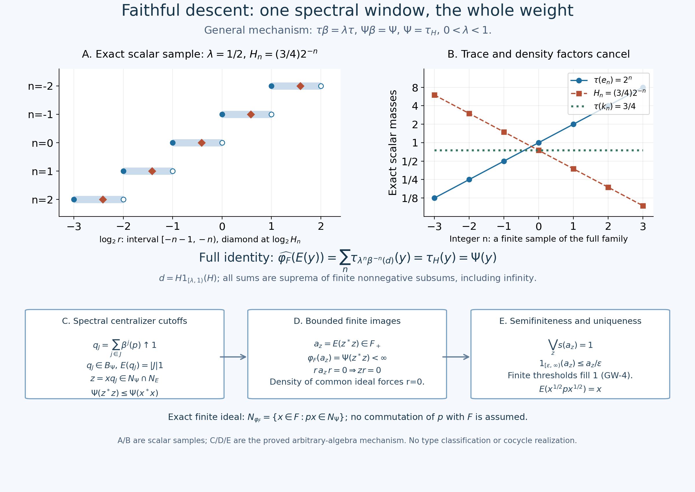

# Faithful descent through the complete counting operator-valued weight

*Original proof development, GPT-6.1 Sol (OpenAI), Ultra, 2026-10-04. CC0-1.0 to the extent of rights held.*

Let \(B\) and \(F=B^\beta\) be the actual compact crossed product and fixed algebra in [CC-3](OA-FLOW-CC.md#oa-flow.cc.3). Its faithful normal semifinite counting operator-valued weight is

\[
 E:B_+\longrightarrow\widehat F_+,\qquad
 \iota(E(y))=\sum_{n\in\mathbb Z}\beta^n(y),
 \qquad \iota(m)(f)=m(f|_F).
 \tag{FD1}
\]
The sum is the increasing net of finite nonnegative subsums, evaluated on every positive normal functional; it need not be bounded. The inclusion, all infinite parts, normality, bimodularity and bounded-value finite left ideal \(N_E\) are proved in [CC-4](OA-FLOW-CC.md#oa-flow.cc.4), [CC-5](OA-FLOW-CC.md#oa-flow.cc.5) and [CC-6](OA-FLOW-CC.md#oa-flow.cc.6) and [EP-4](OA-FLOW-EP.md#oa-flow.ep.4), [EP-5](OA-FLOW-EP.md#oa-flow.ep.5) and [EP-6](OA-FLOW-EP.md#oa-flow.ep.6). Let \(\tau\) be the faithful normal semifinite trace actually constructed in [CD-4](OA-FLOW-CD.md#oa-flow.cd.4), with

\[
 0<\lambda<1,\qquad \tau\circ\beta=\lambda\tau.
 \tag{FD2}
\]
There is no factor, separability, countable-decomposability, finite-total-weight or minimal-period hypothesis.

**The theorem.** Every faithful normal semifinite weight \(\Psi\) on \(B\) satisfying \(\Psi\circ\beta=\Psi\) has a unique faithful normal semifinite weight \(\varphi_F\) on \(F\) such that

\[
 \Psi(y)=\widehat{\varphi_F}(E(y))\qquad(y\in B_+).
 \tag{FD3}
\]
Conversely every faithful normal semifinite \(\varphi_F\) has such a composition. Thus composition is a bijection for these exact two weight classes. Through the actual normal isomorphism \(\Pi:M\to F\), the descending weight on \(M\) is \(\varphi=\varphi_F\circ\Pi\). The zero algebra has its unique zero weight and the assertion is immediate; below assume \(B\ne0\).

The proof uses the written all-normal tracial density correspondence TD-2, TD-4, TD-5, TD-6, TD-7, the centralizer finite-domain and perturbation arguments [CZ-0](OA-FLOW-CZ.md#oa-flow.cz.0), [CZ-2](OA-FLOW-CZ.md#oa-flow.cz.2), [CZ-5](OA-FLOW-CZ.md#oa-flow.cz.5), [CZ-7](OA-FLOW-CZ.md#oa-flow.cz.7), [GW-1](OA-FLOW-GW.md#oa-flow.gw.1) and [GW-4](OA-FLOW-GW.md#oa-flow.gw.4), and the complete spectral domains and transport [SF-1](OA-FLOW-SF.md#oa-flow.sf.sf1), [SB-4](OA-FLOW-SF.md#oa-flow.sf.sb4) and [SB-6](OA-FLOW-SF.md#oa-flow.sf.sb6). Bounded strong-to-ultraweak convergence is [SF-2](OA-FLOW-SF.md#oa-flow.sf.sf2). Each is an earlier actual programme proof. The freely readable human context for tracial densities is [Hiai, Theorem 5.13, Corollary 5.14 and Remark 5.15, printed pp.49–50](https://arxiv.org/pdf/2004.02383v1#page=49). This citation supplies context; the mathematical inputs are the complete local proofs just linked.

## FD-0. The unique density and its exact covariance

By TD, \(\Psi=\tau_H\) for a unique positive self-adjoint operator \(H\) affiliated with \(B\). Semifiniteness removes the infinite-domain projection and faithfulness removes the kernel. In particular \(1_{\{0\}}(H)=0\), but no positive lower bound is asserted. For \(a\in B_+\), the notation means

\[
 \tau_H(a)
 =\sup_{k\ge1}\tau((H\wedge k)^{1/2}a(H\wedge k)^{1/2})
 =\widehat\tau(a^{1/2}Ha^{1/2}).
 \tag{FD4}
\]
These are the complete extended-form sandwiches in TD-2/TD-6; there is no unverified product of unbounded operators.

For any positive affiliated density \(A\), normal spectral transport gives \(\beta^{-1}(A\wedge k)=\beta^{-1}(A)\wedge k\), including its full operator and square-root domains. Applying ([FD2](OA-FLOW-FD.md#equation-fd2)) to every bounded positive cutoff in ([FD4](OA-FLOW-FD.md#equation-fd4)) proves

\[
 \tau_A\circ\beta=\lambda\tau_{\beta^{-1}(A)}.
 \tag{FD5}
\]
TD-2 proves positive scalar homogeneity of the density map. Since \(\Psi\beta=\Psi\), its full uniqueness in TD-5 now gives \(H=\lambda\beta^{-1}(H)\), and hence

\[
 \beta(H)=\lambda H,\qquad
 \beta^n(H)=\lambda^nH\quad(n\in\mathbb Z).
 \tag{FD6}
\]
Equality means equality of the transported self-adjoint operators and their complete spectral domains. The same cutoff argument proves ([FD5](OA-FLOW-FD.md#equation-fd5)) for \(\beta^n\) with factor \(\lambda^n\), including negative integers and infinite values.

## FD-1. Restriction commutes with the entire scalar extension

We need a restriction statement before knowing that the restriction is semifinite. Let \(\rho\) be any normal weight on \(B\), and let \(\chi=\rho|_{F_+}\). This is a normal weight: bounded increasing positive nets in the concrete von Neumann subalgebra have the same strong supremum in \(F\) and \(B\).

For \(m\in\widehat F_+\), write its complete spectral pair as \((e,A)\), with infinite part \(1-e\). The canonical bounded approximants in [EP-2](OA-FLOW-EP.md#oa-flow.ep.2)/[EP-3](OA-FLOW-EP.md#oa-flow.ep.3) are

\[
 a_k=(A\wedge k)e+k(1-e)\in F_+,\qquad a_k\uparrow m.
 \tag{FD7}
\]
Their quadratic forms and their values on all positive normal functionals also increase to those of \(\iota(m)\) in \(B\): [CC-4](OA-FLOW-CC.md#oa-flow.cc.4) proves that this inclusion retains the spectral pair. [EP-5](OA-FLOW-EP.md#oa-flow.ep.5) therefore gives

\[
 \widehat\chi(m)
 =\sup_k\chi(a_k)=\sup_k\rho(a_k)
 =\widehat\rho(\iota(m)).
 \tag{FD8}
\]
Every equality includes infinity. No semifiniteness, normal-weight sum theorem, directedness of the dominated functional family, or surjectivity assertion about that family is needed. We will use this identity with a bounded-density weight \(\rho=\tau_d\).

## FD-2. One spectral window and its complete integer tiling

Put

\[
 p=1_{[\lambda,1)}(H),\qquad d=Hp,\qquad
 e_n=1_{[\lambda^{n+1},\lambda^n)}(H),\qquad k_n=He_n.
 \tag{FD9}
\]
Here \(d\) and every \(k_n\) are bounded positive elements of \(B\); \(0\le d\le p\le1\) and \(0\le k_n\le\lambda^n e_n\). The products mean bounded spectral functions on the whole Hilbert space. The half-open intervals partition \((0,\infty)\), including every endpoint exactly once. The full spectral calculus and the zero kernel thus prove

\[
 \sum_n e_n=1\ \text{strongly},\qquad
 \beta^{-n}(p)=e_n,\qquad
 \lambda^n\beta^{-n}(d)=k_n.
 \tag{FD10}
\]
For example the last equality follows by multiplying \(\beta^{-n}(H)=\lambda^{-n}H\) by
\(1_{[\lambda,1)}(\lambda^{-n}H)=e_n\); the powers and endpoints have not been reindexed ambiguously.

The projections \(p_j=\beta^j(p)=e_{-j}\) are orthogonal with strong sum \(1\). For a finite \(J\subset\mathbb Z\) put \(q_J=\sum_{j\in J}p_j\). Reindexing the entire counting sum, and testing the orthogonal strong sum on every positive normal functional, gives

\[
 E(p)=1,\qquad E(q_J)=|J|1,\qquad
 q_J\uparrow1\ \text{strongly},\qquad q_J\in N_E.
 \tag{FD11}
\]
The set \(J\) is directed by inclusion. This is the spectral sequence of one density and the given integer action; it imposes no countability condition on \(B\).

## FD-3. The complete reconstruction on every positive element

Define the normal weight

\[
 \varphi_F(x)=\tau_d(x)
 =\tau(d^{1/2}xd^{1/2})\qquad(x\in F_+).
 \tag{FD12}
\]
TD-2 proves normality of \(\tau_d\); [FD-1](OA-FLOW-FD.md#oa-flow.fd.1) proves normality of its restriction. Semifiniteness and faithfulness will be established separately below.

For \(y\in B_+\), use ([FD8](OA-FLOW-FD.md#equation-fd8)), the whole counting sum, and [EP-5](OA-FLOW-EP.md#oa-flow.ep.5) normality of the scalar extension:

\[
 \widehat{\varphi_F}(E(y))
 =\widehat{\tau_d}\!\left(\sum_n\beta^n(y)\right)
 =\sum_n\tau_d(\beta^n(y)).
 \tag{FD13}
\]
This is a supremum over finite subsets, including all infinite values. No finite partial sum in \(B\) is falsely regarded as an element of \(F\).

Trace scaling and bounded spectral transport give, for every integer \(n\),

\[
 \begin{split}
 \tau_d(\beta^n(y))
 &=\lambda^n\tau_{\beta^{-n}(d)}(y)\\
 &=\tau_{k_n}(y).
 \end{split}
 \tag{FD14}
\]
The first equality applies \(\tau\beta^n=\lambda^n\tau\) to the bounded positive
\(\beta^{-n}(d)^{1/2}y\beta^{-n}(d)^{1/2}\). The second uses the exact scalar homogeneity and ([FD10](OA-FLOW-FD.md#equation-fd10)); no finite-value cyclic manipulation is required.

For finite \(J\), \(K_J=\sum_{n\in J}k_n\) is a bounded spectral function. On the original Hilbert space, its increasing quadratic forms have supremum

\[
 \sup_J\langle K_J\xi,\xi\rangle
 =\int_{(0,\infty)}r\,d\mu_\xi^H(r),\qquad
 D_{\rm finite}=D(H^{1/2}).
 \tag{FD15}
\]
This is scalar monotone convergence on the disjoint spectral intervals, proved in SF and SC. Thus \(\sum_n k_n=H\) in the complete extended cone, on every normal positive functional by [EP-3](OA-FLOW-EP.md#oa-flow.ep.3). TD-2/TD-7 gives equality of the corresponding weights on every bounded positive element, rather than just on a dense finite algebra. Equations ([FD13](OA-FLOW-FD.md#equation-fd13))–([FD15](OA-FLOW-FD.md#equation-fd15)) prove

\[
 \widehat{\varphi_F}(E(y))
 =\sum_n\tau_{k_n}(y)=\tau_H(y)=\Psi(y)
 \qquad(y\in B_+).
 \tag{FD16}
\]
The full operator domain is \(D(H)=\{\xi:\int r^2\,d\mu_\xi^H(r)<\infty\}\); ([FD15](OA-FLOW-FD.md#equation-fd15)) identifies its square-root form domain, not this generally smaller operator domain.

## FD-4. The common finite ideal is dense for a proved reason

For the trace \(\tau\), TD-1's full closed involution is the antiunitary \(J\), and its modular operator is \(1\). Thus its centralizer is all of \(B\). The CZ unbounded perturbation weight for \(H\) is exactly \(\tau_H\): its bounded densities \(H(1+\varepsilon H)^{-1}\) increase to \(H\) in the extended cone, and TD-2 normality of the density map identifies their whole positive-cone supremum with ([FD4](OA-FLOW-FD.md#equation-fd4)). [CZ-5](OA-FLOW-CZ.md#oa-flow.cz.5) therefore gives

\[
 \sigma_t^\Psi(a)=H^{it}aH^{-it}\qquad(a\in B).
 \tag{FD17}
\]
Every spectral projection of \(H\), including \(p_j\) and \(q_J\), belongs to \(B_\Psi\).

Let \(N_\Psi=\{x\in B:\Psi(x^*x)<\infty\}\). The exact centralizer right-multiplication formula in [CZ-0](OA-FLOW-CZ.md#oa-flow.cz.0), applied to the given faithful n.s.f. \(\Psi\), gives for \(x\in N_\Psi\)

\[
 xq_J\in N_\Psi,\qquad
 \Psi((xq_J)^*xq_J)
 =\|J_\Psi\pi_\Psi(q_J)J_\Psi\Lambda_\Psi(x)\|^2
 \le\Psi(x^*x).
 \tag{FD18}
\]
Also \(xq_J\in N_E\), because \(q_J\in N_E\) and \(N_E\) is a left ideal. Since \(q_J\uparrow1\), \(xq_J\to x\) boundedly strongly and hence ultraweakly by [SF-2](OA-FLOW-SF.md#oa-flow.sf.sf2). [GW-4](OA-FLOW-GW.md#oa-flow.gw.4) proves that \(\mathfrak m_\Psi\subset N_\Psi\) is ultraweakly dense. It follows that

\[
 \mathcal I=N_\Psi\cap N_E\quad
 \text{is ultraweakly dense in }B.
 \tag{FD19}
\]
This conclusion comes from these particular centralizer cutoffs. No assertion about the intersection of arbitrary dense finite ideals has been used.

## FD-5. Support detection proves semifiniteness of the restriction

For \(z\in\mathcal I\), the element

\[
 a_z=E(z^*z)\in F_+,\qquad
 \varphi_F(a_z)=\Psi(z^*z)<\infty
 \tag{FD20}
\]
is bounded; ([FD16](OA-FLOW-FD.md#equation-fd16)) justifies its finite scalar value. Let \(s=\bigvee_{z\in\mathcal I}s(a_z)\in F\), and set \(r=1-s\). If \(r\ne0\), then \(ra_zr=0\) for every \(z\). Whole-cone bimodularity and faithfulness of \(E\) give

\[
 E((zr)^*(zr))=rE(z^*z)r=0
 \quad\Longrightarrow\quad zr=0.
 \tag{FD21}
\]
The map \(z\mapsto zr\) is ultraweakly continuous (test the defining square-summable vector coefficients). Its kernel contains the ultraweakly dense \(\mathcal I\), so it contains \(1\), giving \(r=0\). Thus \(s=1\).

For \(\epsilon>0\), the spectral threshold projection in \(F\)

\[
 f_{z,\epsilon}=1_{[\epsilon,\infty)}(a_z)
 \le\epsilon^{-1}a_z
 \tag{FD22}
\]
has finite \(\varphi_F\)-value, by positivity and heredity. As \(\epsilon\downarrow0\) these increase to \(s(a_z)\). Their supremum over \(z,\epsilon\) is consequently \(1\). The complete [GW-4](OA-FLOW-GW.md#oa-flow.gw.4) criterion proves semifiniteness. Concretely, its construction takes the entire finite positive cone \(\mathcal P_{\varphi_F}\), directed by order, and gives

\[
 u_a=a(1+a)^{-1},\quad 0\le u_a\le1,\quad
 \varphi_F(u_a)<\infty,\quad u_a\uparrow1.
 \tag{FD23}
\]
Monotonicity is the inverse-order calculation in [GW-4](OA-FLOW-GW.md#oa-flow.gw.4). Each finite threshold projection is approached by \(u_{nf}\); their ranges fill the Hilbert space, so the supremum is \(1\). For any \(b\in F\), \(u_abu_a\) belongs to the finite linear algebra and tends boundedly strongly, hence ultraweakly, to \(b\). This spells out the finite-domain density conclusion without assuming an increasing net of finite-weight projections.

## FD-6. The same window proves faithfulness and uniqueness

For \(x\in F_+\), put \(a=x^{1/2}px^{1/2}\in B_+\). By ([FD11](OA-FLOW-FD.md#equation-fd11)) and full bimodularity,

\[
 E(a)=x^{1/2}E(p)x^{1/2}=x,\qquad
 \varphi_F(x)=\Psi(x^{1/2}px^{1/2}).
 \tag{FD24}
\]
If \(\varphi_F(x)=0\), faithfulness of \(\Psi\) gives \(a=0\), so \(x=E(a)=0\). Hence \(\varphi_F\) is faithful. This argument is valid even if \(\Psi(p)\) is infinite.

If any normal weight \(\chi\) on \(F\) satisfies \(\widehat\chi E=\Psi\), the same test gives \(\chi(x)=\Psi(a)=\varphi_F(x)\) for every bounded positive \(x\). Thus uniqueness holds even among all normal weights, without first imposing faithfulness or semifiniteness on \(\chi\). Transport through \(\Pi\) preserves the whole positive cone, finite ideals and normal increasing suprema, as its inverse is also normal.

For completeness, apply bimodularity to \(x^*px\), now for arbitrary \(x\in F\). The exact finite domains and their finite extensions, supplied by [GW-1](OA-FLOW-GW.md#oa-flow.gw.1)/[GW-2](OA-FLOW-GW.md#oa-flow.gw.2), are

\[
 \begin{split}
 N_{\varphi_F}
 &=\{x\in F:px\in N_\Psi\}
  =\{x\in F:\tau(d^{1/2}x^*xd^{1/2})<\infty\},\\
 A_{\varphi_F}&=N_{\varphi_F}\cap N_{\varphi_F}^*,\qquad
 \mathfrak m_{\varphi_F}=\operatorname{span}N_{\varphi_F}^*N_{\varphi_F},\\
 (\varphi_F)_0(x^*y)&=\Psi_0(x^*py)
 \qquad(x,y\in N_{\varphi_F}).
 \end{split}
 \tag{FD25}
\]
Indeed \(E(x^*px)=x^*x\), and polarization of the resulting finite equality proves the final identity, with all four polarized square terms finite before either extension is used. Thus [GW-3](OA-FLOW-GW.md#oa-flow.gw.3)'s complete GNS has the concrete isometric identification

\[
 V\Lambda_{\varphi_F}(x)=\Lambda_\Psi(px),\qquad
 \operatorname{Ran}V
 =\overline{\{\Lambda_\Psi(px):x\in N_{\varphi_F}\}}.
 \tag{FD26}
\]
The range here is this closed subspace of \(H_\Psi\); it is not asserted to be all of \(H_\Psi\), or invariant under the whole representation of \(F\). Left multiplication remains the actual GNS representation of [GW-3](OA-FLOW-GW.md#oa-flow.gw.3). In particular no commutation of \(p\) with \(F\), or replacement of \(px\) by \(xp\) in ([FD25](OA-FLOW-FD.md#equation-fd25)), is assumed.

## FD-7. The converse uses an explicit finite-domain approximation

Let \(\varphi_F\) be faithful n.s.f. and put \(\Psi=\widehat{\varphi_F}E\). [EP-5](OA-FLOW-EP.md#oa-flow.ep.5)/[EP-6](OA-FLOW-EP.md#oa-flow.ep.6) and [CC-5](OA-FLOW-CC.md#oa-flow.cc.5) prove additivity, positive homogeneity and normality for arbitrary increasing bounded positive nets. Its faithfulness follows from faithfulness of both the entire scalar extension and \(E\). Reindexing gives \(\Psi\beta=\Psi\).

To verify semifiniteness explicitly, choose the [GW-4](OA-FLOW-GW.md#oa-flow.gw.4) finite positive contractions \(u_i\in F\) with \(u_i\uparrow1\). For \(z\in N_E\), bimodularity and the boundedness of \(E(z^*z)\) give

\[
 \Psi((zu_i)^*(zu_i))
 =\varphi_F(u_iE(z^*z)u_i)
 \le\|E(z^*z)\|\varphi_F(u_i^2)<\infty.
 \tag{FD27}
\]
The vectors \(zu_i\to z\) strongly. [CC-6](OA-FLOW-CC.md#oa-flow.cc.6) makes \(N_E\) weak-operator dense; [GW-4](OA-FLOW-GW.md#oa-flow.gw.4) now gives semifiniteness of \(\Psi\). Combined with [FD-0](OA-FLOW-FD.md#oa-flow.fd.0)–6 this proves the stated bijection. It proves no arbitrary-cocycle realization, periodic-weight existence, compact duality, factoriality, type classification or whole homogeneity theorem.

## FD-8. An exact scalar example and two full-domain exercises

Use [CD-5](OA-FLOW-CD.md#oa-flow.cd.5)'s scalar model with \(\lambda=1/2\):

\[
 B=\ell^\infty(\mathbb Z),\quad F=\mathbb C1,\quad
 (\beta b)_n=b_{n+1},\quad
 \tau(b)=\sum_n2^n b_n,\quad
 E(b)=\left(\sum_n b_n\right)1\quad(b\ge0).
 \tag{FD28}
\]
Every sum is the supremum of finite nonnegative subsums. Let \(\Psi(b)=\frac34\sum_n b_n\). Its faithful n.s.f. density is \(H_n=\frac34\,2^{-n}\). The spectral window \([1/2,1)\) contains only \(H_0\), so \(p=e_0\), \(d=\frac34e_0\), and

\[
 \varphi_F(a1)=\tfrac34a,\qquad
 \tau_{k_n}(b)=\tfrac34 b_n,\qquad
 \widehat{\varphi_F}(E(b))=\tfrac34\sum_n b_n=\Psi(b).
 \tag{FD29}
\]
Here \(e_n\) denotes the coordinate projection, and \(k_n=\frac34\,2^{-n}e_n\). The trace mass \(2^n\) exactly cancels the density mass \(2^{-n}\); numerical truncation is not the reason the entire equality holds.

**Exercise 1.** Replace the window by \([\lambda^{m+1},\lambda^m)\), for an integer \(m\), retaining \(d_m=H1_{[\lambda^{m+1},\lambda^m)}(H)\). Does the descending weight change?

**Solution.** Its translated windows still partition \((0,\infty)\). [FD-1](OA-FLOW-FD.md#oa-flow.fd.1) and the calculations ([FD14](OA-FLOW-FD.md#equation-fd14))–([FD15](OA-FLOW-FD.md#equation-fd15)) apply with this \(d_m\), after shifting the integer index, and reconstruct the same \(\Psi\). The projection has \(E(p_m)=1\). The uniqueness argument [FD-6](OA-FLOW-FD.md#oa-flow.fd.6) then proves \(\tau_{d_m}|F=\varphi_F\), including every infinite value. No finite trace of \(p_m\) is assumed.

**Exercise 2.** Describe the form and operator domains in the scalar example, and decide whether \(H\) or \(H^{-1}\) is bounded.

**Solution.** In the trace Hilbert space \(\ell^2(\mathbb Z,2^n)\), the underlying norm is \(\sum_n2^n|\xi_n|^2\). The full domains are

\[
 \begin{split}
 D(H^{1/2})&=\{\xi\in\ell^2(\mathbb Z,2^n):\sum_n|\xi_n|^2<\infty\},\\
 D(H)&=\{\xi\in\ell^2(\mathbb Z,2^n):\sum_n2^{-n}|\xi_n|^2<\infty\}.
 \end{split}
 \tag{FD30}
\]
These follow by multiplying the trace masses by \(H_n\), respectively \(H_n^2\), and discarding only positive constant factors. Finite coordinate vectors are graph cores by spectral cutoff. \(H_n\to\infty\) as \(n\to-\infty\), and \(H_n^{-1}\to\infty\) as \(n\to+\infty\), so both operators are unbounded. Their kernel is nevertheless zero.

### The spectral partition and the finite-domain descent mechanism

This original \(2400\times1700\) illustration, complete caption, [editable SVG](../assets/faithful-descent/assets/faithful-descent.svg), [exact rational data](../assets/faithful-descent/assets/faithful-descent-data.json) and [reproduction source](../assets/faithful-descent/render_faithful_descent.py) are CC0-1.0 to the extent of rights held. Panels A/B are the commutative scalar example in [FD-8](OA-FLOW-FD.md#fd-8); panels C/D/E show the general proof in [FD-2–6](OA-FLOW-FD.md#fd-2). No finite scalar plot is presented as a model of a factor or as proof of an infinite sum.

For the actual counting weight, the hypotheses are exactly \(0<\lambda<1\), \(\tau\beta=\lambda\tau\), and a faithful n.s.f. \(\Psi\) with \(\Psi\beta=\Psi\). TD supplies its nonsingular affiliated density \(H\); the full covariance argument gives \(\beta(H)=\lambda H\). The window \(p=1_{[\lambda,1)}(H)\) has \(E(p)=1\), and \(d=Hp\) is bounded. The complete reconstruction is
\[
 \widehat{\varphi_F}(E(y))
 =\sum_{n\in\mathbb Z}\tau_{\lambda^n\beta^{-n}(d)}(y)
 =\sum_n\tau_{H1_{[\lambda^{n+1},\lambda^n)}(H)}(y)
 =\tau_H(y)=\Psi(y)\quad(y\in B_+).
\]
Each sum means a supremum over finite nonnegative subsums. Intrinsic inclusion of the whole extended-positive cone, rather than a restriction only to bounded images, justifies the first equality. The last equality has the exact finite form domain \(D(H^{1/2})\); it does not replace the operator domain \(D(H)\) by that larger domain.

For panels A/B, take precisely \(B=\ell^\infty(\mathbb Z)\), \(F=\mathbb C1\), \((\beta b)_n=b_{n+1}\), \(\lambda=1/2\), \(\tau(b)=\sum_n2^n b_n\), and \(\Psi(b)=\frac34\sum_n b_n\). Then \(H_n=\frac34\,2^{-n}\), \(p=e_0\), \(d=\frac34e_0\), and \(\varphi_F(a1)=\frac34a\).

Panel A uses the logarithmic coordinate \(s=\log_2r\). The spectral interval \([2^{-n-1},2^{-n})\) is exactly \([-n-1,-n)\) in this coordinate: the left endpoint is filled and the right endpoint is hollow. The diamond is the spectral value \(s=\log_2(3/4)-n\), strictly inside that interval, associated with the coordinate projection \(e_n\). The five displayed rows \(n=-2,\ldots,2\) sample the full integer tiling. The identity \(\beta(e_n)=e_{n-1}\) concerns these actual projections; no translation law for a bounded finite matrix spectrum is asserted.

Panel B records all seven exact rational samples \(n=-3,\ldots,3\). The blue trace mass is \(2^n\), the orange density is \(\frac34\,2^{-n}\), and the green paired mass is their exact product \(3/4\). The vertical axis is logarithmic with base two. Connecting segments are visual guides only. For every bounded positive \(b\), not just a finitely supported sequence, positivity and finite-subsums give
\[
 \tau_{H e_n}(b)=\tfrac34 b_n,\qquad
 \sum_n\tau_{H e_n}(b)=\tfrac34\sum_n b_n=\Psi(b),
\]
including infinite values. The rational data therefore illustrate an identity already proved for the whole positive cone.

Panels C/D/E record the crucial general semifiniteness argument. With \(q_J=\sum_{j\in J}\beta^j(p)\), one has \(q_J\in B_\Psi\), \(E(q_J)=|J|1\), and \(q_J\uparrow1\) strongly. Thus for \(x\in N_\Psi\), the vectors \(z=xq_J\) lie in both \(N_\Psi\) and \(N_E\), with \(\Psi(z^*z)\le\Psi(x^*x)\). These particular centralizer cutoffs prove that the common ideal is ultraweakly dense; there is no theorem asserting density of arbitrary intersections of finite ideals.

The image \(a_z=E(z^*z)\) is bounded positive in \(F\), with \(\varphi_F(a_z)<\infty\). If a projection \(r\in F\) annihilates all their supports, faithfulness and bimodularity give \(E((zr)^*(zr))=0\), hence \(zr=0\) for every \(z\) in the dense common ideal. Ultraweak continuity of right multiplication then gives \(r=0\). Consequently \(\bigvee_zs(a_z)=1\). Every positive-threshold projection \(1_{[\epsilon,\infty)}(a_z)\le\epsilon^{-1}a_z\) has finite weight; [GW-4](OA-FLOW-GW.md#oa-flow.gw.4) turns their full support into the finite positive contraction net proving semifiniteness.

The lower strip distinguishes the direction of multiplication: the exact descended finite ideal is \(N_{\varphi_F}=\{x\in F:px\in N_\Psi\}\), whereas the common-ideal approximation uses \(xq_J\). No commutation of \(p\) with \(F\) is assumed. The separate equality \(E(x^{1/2}px^{1/2})=x\) for \(x\in F_+\) proves faithfulness and uniqueness, including weights for which \(\Psi(p)=\infty\).

The human trace-density context actually read is [Hiai, Theorem 5.13, Corollary 5.14 and Remark 5.15, printed pp.49–50](https://arxiv.org/pdf/2004.02383v1#page=49). The diagram follows the complete local FD proof and its actual earlier CC/CD/TD/CZ/EP/GW/SF inputs. It asserts neither periodic-weight existence, arbitrary-cocycle realization, compact duality, factoriality nor classification.
