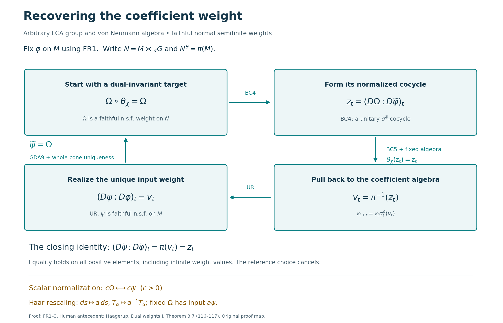

# Recognizing faithful dual weights

A weight on a crossed product can be tested for dual invariance without first knowing the weight on the coefficient algebra. The normalized cocycle then gives a concrete way to recover that input weight. The normalization matters: matching modular automorphism groups would leave a central ambiguity.

This is a consequence of the whole dual-action average, the locally proved normalized comparison of two dual weights, and the unitary modular-cocycle realization theorem. There is no separability, second-countability, sigma-compactness, or finite-state hypothesis. We first supply the existence of a reference weight on an arbitrary algebra, so choosing that reference is part of the proof.

*Self-checked by the writing AI. Original exposition and illustration: CC0-1.0.*

## FR1. A faithful normal semifinite reference weight always exists

Let \(M\ne0\) act faithfully and nondegenerately on a Hilbert space \(H\). For each unit vector \(\xi\), let \(p_\xi\) be the orthogonal projection onto \(\overline{M'\xi}\). The Hilbert projection exists by CF8. Its range and orthogonal complement are invariant under every unitary in \(M'\), so the commutant-unitary test in [SF0](OA-FLOW-SF.md#oa-flow.shared-foundations.sf-0) gives \(p_\xi\in M\). Also \(p_\xi\xi=\xi\). If \(\xi\in qH\) for a projection \(q\in M\), then \(M'\xi\subset qH\) and \(p_\xi\le q\).

The normal vector functional \(\omega_\xi(x)=\langle x\xi,\xi\rangle\) is supported on \(p_\xi\) and is faithful on \(p_\xi M p_\xi\). Indeed, for \(a\ge0\) in that corner, \(\omega_\xi(a)=0\) implies \(a^{1/2}\xi=0\). Since \(a^{1/2}\) commutes with \(M'\), it vanishes on the dense set \(M'\xi\) in \(p_\xi H\). It also vanishes on \((1-p_\xi)H\), so \(a=0\). This is the concrete support argument used in [NF2](OA-FLOW-NF.md#oa-flow.nf.2); no countability conclusion from that lemma is needed here.

By CF1's maximal principle, choose a maximal pairwise orthogonal family \((p_i)_{i\in I}\) of projections of this form and corresponding unit vectors \(\xi_i\). Its join is \(1\): otherwise a unit vector in \((1-\bigvee_i p_i)H\) would give another nonzero orthogonal support projection. Projection joins and strong convergence of their finite partial sums were proved in [NF1](OA-FLOW-NF.md#oa-flow.nf.1). The index set need not be countable.

Define, for \(a\in M_+\),

\[
\varphi(a)=\sum_{i\in I}\langle a\xi_i,\xi_i\rangle
:=\sup_{F\subset I,\ F\text{ finite}}\sum_{i\in F}\langle a\xi_i,\xi_i\rangle.
\tag{FR1}
\]
[WS1](OA-FLOW-WS.md#oa-flow.weight-sum.ws1) proves additivity, positive homogeneity and order normality for exactly this arbitrary-index sum of normal functionals. It is faithful: if its value at \(a\ge0\) is zero, every \(p_iap_i\) is zero by the preceding corner faithfulness. Hence \(a^{1/2}p_i=0\) for every \(i\); the ranges of these projections span \(H\), so \(a=0\).

For a finite \(F\subset I\), set \(p_F=\sum_{i\in F}p_i\). Orthogonality and \(\|\xi_i\|=1\) give \(\varphi(p_F)=|F|\). If \(a\in M_+\), then

\[
0\le p_Fap_F\le\|a\|p_F,
\qquad \varphi(p_Fap_F)\le\|a\||F|<\infty.
\tag{FR2}
\]
The net \(p_F\) increases strongly to \(1\), so \(p_Fap_F\to a\) strongly, with a uniform norm bound. The vector-series tail argument in ST2 gives ultraweak convergence. Therefore the finite positive cone has ultraweakly dense linear span, precisely the definition of semifiniteness in the opening conventions of [GW](OA-FLOW-GW.md). This proves that \(\varphi\) is faithful, normal and semifinite. The zero algebra has its unique zero weight.

## FR2. Recovering the input weight

Let \(G\) be any locally compact Hausdorff abelian group, let \(\alpha\) be a point-ultraweakly continuous action on \(M\), and write

\[
N=M\rtimes_\alpha G,\qquad \pi=\pi_\alpha,
\qquad \theta_\chi(\lambda_s)=\overline{\chi(s)}\lambda_s,
\qquad \theta_\chi(\pi(a))=\pi(a).
\tag{FR3}
\]
Use the Haar pair and normal regular representation of [DA](OA-FLOW-DA.md#da-setting). For a faithful normal semifinite weight \(\psi\) on \(M\), its dual is the whole-positive-cone composition

\[
\widetilde\psi(X)=\widehat{\psi\circ\pi^{-1}}(T_\alpha(X)),
\qquad X\in N_+,
\tag{FR4}
\]
where the hat means [EP5](OA-FLOW-EP.md#oa-flow.ep.5)'s actual extension to the extended positive cone. [GDA8](OA-FLOW-GDA.md#gda-8) identifies this composition with the constructed dual weight, including its full finite domains.

**Theorem.** The map \(\psi\mapsto\widetilde\psi\) is a bijection from faithful normal semifinite weights on \(M\) to faithful normal semifinite weights \(\Omega\) on \(N\) satisfying \(\Omega\circ\theta_\chi=\Omega\) for every \(\chi\in\widehat G\). Equality of weights here means equality on the entire positive cone, including infinite values.

**Proof.** [EP6](OA-FLOW-EP.md#oa-flow.ep.6) proves that (FR4) is faithful normal semifinite. [DA invariance](OA-FLOW-DA.md#da-invariant) proves that it is dual-invariant. Both statements use the same whole-cone averaging map, not an expression defined only on compact coefficients.

Conversely choose a reference \(\varphi\) by FR1, and let \(\Omega\) be a faithful normal semifinite dual-invariant weight on \(N\). Define the balanced, normalized derivative

\[
z_t=(D\Omega:D\widetilde\varphi)_t\in\mathcal U(N).
\tag{FR5}
\]
By [BC4](OA-FLOW-BC.md#oa-flow.bc.4), it is strongly* continuous and satisfies the cocycle law for \(\sigma^{\widetilde\varphi}\). Both weights are invariant under \(\theta_\chi\). Apply [BC5](OA-FLOW-BC.md#oa-flow.bc.5)'s normal-isomorphism covariance with \(\gamma=\theta_\chi\) to obtain

\[
\theta_\chi(z_t)=z_t\qquad(\chi\in\widehat G,t\in\mathbb R).
\tag{FR6}
\]
The full fixed-point theorem [DA fixed algebra](OA-FLOW-DA.md#da-fixed) gives \(z_t\in\pi(M)\). Put \(v_t=\pi^{-1}(z_t)\). The normal faithful identification and its inverse preserve bounded strong* convergence by ST2, so \(v_t\) is a strongly* continuous unitary family in \(M\). [GDA8](OA-FLOW-GDA.md#gda-8)'s modular restriction and (FR5)'s cocycle identity give

\[
\begin{aligned}
\pi(v_{t+r})
&=z_t\sigma_t^{\widetilde\varphi}(z_r)\\
&=\pi(v_t)\pi(\sigma_t^\varphi(v_r))
 =\pi(v_t\sigma_t^\varphi(v_r)).
\end{aligned}
\tag{FR7}
\]
Injectivity of \(\pi\) proves the required cocycle law on \(M\).

[UR realization](OA-FLOW-UR.md#ur-5) now supplies the unique faithful normal semifinite \(\psi\) with \((D\psi:D\varphi)_t=v_t\). Its dual satisfies the exact normalized comparison [GDA9](OA-FLOW-GDA.md#gda-9):

\[
(D\widetilde\psi:D\widetilde\varphi)_t
=\pi((D\psi:D\varphi)_t)
=\pi(v_t)=z_t
=(D\Omega:D\widetilde\varphi)_t.
\tag{FR8}
\]
Fixed-reference uniqueness in [GDA7](OA-FLOW-GDA.md#gda-7) yields \(\widetilde\psi=\Omega\) on \(N_+\). That uniqueness is itself the BC chain identity followed by MA4's two whole-cone comparison inequalities at constant cocycle \(1\), so it retains every infinite value and the weight normalization.

If \(\widetilde\psi_1=\widetilde\psi_2\), compare their derivatives against \(\widetilde\varphi\) in (FR8). Faithfulness of \(\pi\) gives equality of \((D\psi_j:D\varphi)_t\), and the same fixed-reference uniqueness on \(M\) gives \(\psi_1=\psi_2\). This proves injectivity and also proves that the recovered weight is independent of the reference \(\varphi\). The zero algebra has a single weight and gives the corresponding one-element bijection. \(\square\)

## FR3. Scalar and Haar normalizations stay visible

For \(c>0\), [BC5](OA-FLOW-BC.md#oa-flow.bc.5) gives

\[
(D(c\widetilde\psi):D\widetilde\varphi)_t
=c^{it}(D\widetilde\psi:D\widetilde\varphi)_t.
\tag{FR9}
\]
The pulled-back cocycle is therefore the derivative of \(c\psi\), so the inverse bijection takes \(c\widetilde\psi\) to \(c\psi\). This also follows from EP5's positive homogeneity in the input weight. Equal modular automorphism groups alone would not detect this scalar; the normalized derivative does.

If the Haar measure on \(G\) is replaced by \(a\,ds\), \(a>0\), the dual Haar measure becomes \(a^{-1}d\chi\). [DA Haar scaling](OA-FLOW-DA.md#da-haar) proves that the whole dual average becomes \(a^{-1}T_\alpha\). Thus, under the normal regular-model identification, the new dual of \(\psi\) is \(a^{-1}\widetilde\psi\). For a fixed target \(\Omega=\widetilde\psi\), its recovered input with the new Haar measure is exactly \(a\psi\). All equalities hold on the extended positive cone; multiplying a finite coefficient formula alone would not establish them.

## FR4. A two-point model checks the factor of two

Take counting Haar measure on \(G=\mathbb Z/2\mathbb Z\), let \(M=M_2(\mathbb C)\), and let the action be trivial. With \(\lambda=\lambda_1\), one has \(\lambda^2=1\) and \(\lambda a=a\lambda\). The map

\[
a+b\lambda\longmapsto(a+b,a-b)
\tag{FR10}
\]
is a unital star-isomorphism of the crossed product with \(M_2\oplus M_2\): multiplication and adjoints agree directly, and the inverse takes \((A,B)\) to \((A+B)/2+(A-B)\lambda/2\). The two characters diagonalize the regular two-point representation, so every regular generator has this form and the finite-dimensional algebra is already closed. Normality and that of the inverse are automatic here from finite-dimensional linear continuity. Thus \(\pi(a)=(a,a)\), and the nontrivial dual character interchanges the two entries.

The dual Haar measure gives mass \(1/2\) to each character. The actual average is therefore

\[
T(A,B)=\left(\frac{A+B}{2},\frac{A+B}{2}\right)
\qquad(A,B\ge0).
\tag{FR11}
\]
Set

\[
R=\begin{pmatrix}5&4\\4&5\end{pmatrix},\qquad
\psi(a)=\operatorname{Tr}(Ra),\qquad
\Omega(A,B)=\tfrac12\operatorname{Tr}(R(A+B)).
\tag{FR12}
\]
The vectors \((1,1)\) and \((1,-1)\) diagonalize \(R\), with eigenvalues \(9\) and \(1\). Hence \(\psi\) is faithful and finite, and \(\Omega\) is faithful, finite and invariant under the interchange. Formula (FR11) proves directly that \(\Omega=\widetilde\psi\). In particular an invariant target written as \(\operatorname{Tr}(SA)+\operatorname{Tr}(SB)\), with \(S>0\), has recovered input \(a\mapsto2\operatorname{Tr}(Sa)\). The factor two is fixed by Haar normalization.

For the reference \(\varphi=\operatorname{Tr}\), the dual reference has density \((I/2,I/2)\) in the two summands, and \(\Omega\) has density \((R/2,R/2)\). The directly proved finite-matrix derivative formula in [BC6](OA-FLOW-BC.md#oa-flow.bc.6) gives

\[
z_t=(R^{it},R^{it}),\qquad v_t=R^{it}.
\tag{FR13}
\]
The two \(1/2\) factors cancel inside each normalized derivative. The recovered weight has \(\psi(1)=10=\Omega(1,1)\), while the reference has \(\varphi(1)=2\). This finite model illustrates normalization; it does not replace the arbitrary-algebra proof.

## FR5. Two exercises with solutions

**Exercise 1. Changing the reference.** Replace \(\varphi\) by \(c\varphi\), where \(c>0\), while keeping the target \(\Omega=\widetilde\psi\) and Haar measure fixed. Find the pulled-back cocycle, and explain why the recovered input remains \(\psi\).

**Solution.** Positive homogeneity gives \(\widetilde{c\varphi}=c\widetilde\varphi\). BC4's chain law and BC5's scalar formula give

\[
(D\Omega:D(c\widetilde\varphi))_t
=c^{-it}(D\Omega:D\widetilde\varphi)_t,
\qquad
(D\psi:D(c\varphi))_t=c^{-it}(D\psi:D\varphi)_t.
\tag{FR14}
\]
Scalar factors commute with the displayed operators. Pullback by \(\pi^{-1}\) therefore gives precisely the second cocycle. UR uniqueness for the new reference recovers the same \(\psi\). The reference changes; the input determined by the target and Haar measure does not.

**Exercise 2. Why a faithful state is insufficient as a general starting point.** Let \(I\) be uncountable and \(M=\ell^\infty(I)\) act diagonally on \(\ell^2(I)\). Prove that \(\varphi(a)=\sum_{i\in I}a_i\) on the positive cone is faithful normal semifinite, but that \(M\) has no faithful state.

**Solution.** The coordinate unit vectors have commutant-cyclic supports equal to the coordinate projections \(e_i\). Formula (FR1) is exactly the stated weight. Its finite partial sums of projections increase strongly to one and have finite weight, so FR1's complete proof establishes faithfulness, normality and semifiniteness. If a state \(f\) were faithful, every \(f(e_i)\) would be strictly positive, while every finite sum of these numbers would be at most \(f(1)=1\). For each positive integer \(n\), only finitely many can satisfy \(f(e_i)\ge1/n\). Their countable union contains every \(i\), contradicting uncountability. This last argument excludes even a nonnormal faithful state; no countable extraction from an arbitrary net is used.

## FR6. The scope of the recognition theorem

The normalized cocycle is unitary because both compared weights are faithful and semifinite. Removing those hypotheses would require additional support and finite-domain arguments. FR2 therefore does not assert recognition of nonfaithful or nonsemifinite invariant weights. It also does not reconstruct a crossed product from an arbitrary covariant system. Those are separate statements, whereas FR2 starts with the already constructed normal crossed product.

Further reading: Haagerup, [*On the dual weights for crossed products of von Neumann algebras I*](https://journals.msp.org/mscand/article/view/1879), Math. Scand. 43 (1978), Theorem 3.7.

## The recovery loop and its normalization

This is the exact proof map of [FR1–3](OA-FLOW-FR.md#fr-1), valid for the arbitrary locally compact Hausdorff abelian group and arbitrary von Neumann algebra in FR2. Its four boxes are mathematical objects or families, not finite-dimensional approximations.

FR1 constructs a faithful normal semifinite reference weight \(\varphi\) using an arbitrary orthogonal family of concrete vector-functional support projections. No faithful state or countable decomposition is assumed. For a dual-invariant faithful normal semifinite \(\Omega\) on \(N=M\rtimes_\alpha G\), BC4 supplies the strongly* continuous unitary family \(z_t=(D\Omega:D\widetilde\varphi)_t\). BC5 covariance and invariance of both weights fix each \(z_t\) under every dual automorphism. The full fixed-algebra theorem gives \(z_t\in\pi(M)\), and ST2 transports its continuity to \(v_t=\pi^{-1}(z_t)\). Modular restriction gives the cocycle law for \(\sigma^\varphi\).

The bottom arrow is the full UR realization theorem. It produces a faithful normal semifinite \(\psi\) with normalized derivative \(v_t\), not merely a weight with the desired modular action. The closing arrow uses GDA9's identity
\[
(D\widetilde\psi:D\widetilde\varphi)_t
=\pi((D\psi:D\varphi)_t)=z_t
\]
and GDA7's fixed-reference uniqueness on the whole positive cone. This proves \(\widetilde\psi=\Omega\), including all infinite values, and makes the result independent of the chosen reference.

The lower formulas record two different operations. Scaling the target by \(c>0\) scales the recovered input by \(c\). Scaling the Haar measure on \(G\) by \(a>0\) instead scales the dual average by \(a^{-1}\); to represent the same fixed target weight with that new convention one uses input \(a\psi\). FR3 proves both claims. Neither changes the domains or hypotheses of the four boxes.

The diagram records the four steps proved above. Reproduce it with [render_figure.py](../assets/faithful-dual-weight-recognition/render_figure.py), using the [exact semantic data](../assets/faithful-dual-weight-recognition/assets/faithful-dual-weight-recognition-data.json), or edit the [SVG](../assets/faithful-dual-weight-recognition/assets/faithful-dual-weight-recognition.svg).
