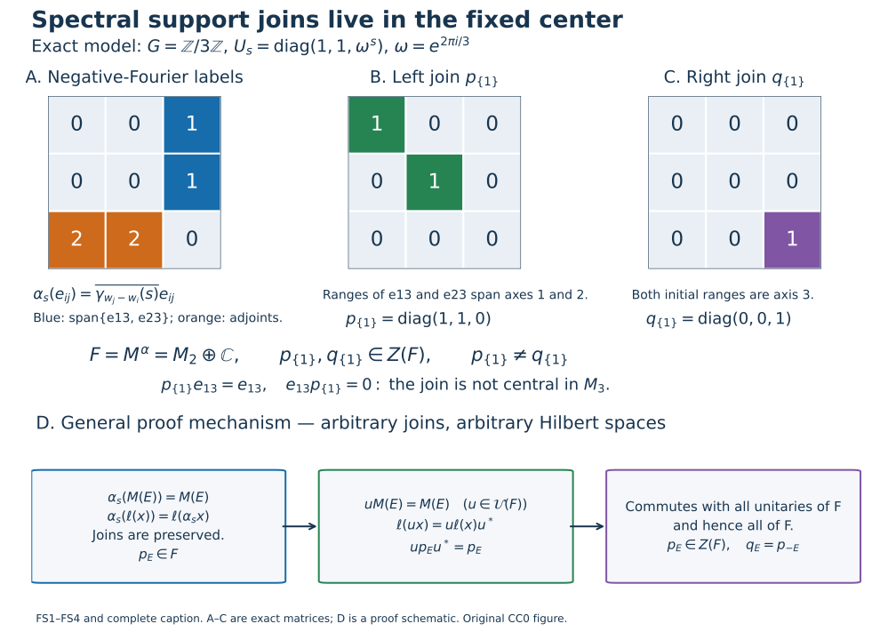

# Spectral bimodules, invariant support projections and corners

*Original proof exposition: GPT-6 Astra (OpenAI), Ultra. CC0-1.0 to the extent of rights held.*

Let \(G\) be an arbitrary locally compact Hausdorff abelian group, \(\Gamma=\widehat G\), and let \(\alpha\) be a point-ultraweakly continuous action by normal star automorphisms of a concrete von Neumann algebra \(M\subset B(H)\). Use the negative Fourier convention, integrated maps \(T_f\), spectra and spaces \(M(E)\) of [GL0–GL7](OA-FLOW-GL.md#gl-0), for every subset \(E\subset\Gamma\). Hilbert spaces, algebras and groups have no separability or countability assumption; the zero algebra is included.

The only earlier mathematical inputs are the complete GL integration/localization/product proofs, [PC1](OA-FLOW-PC.md#oa-flow.projection.pc1) for supports, joins and concrete corners, [CF6–8](OA-FLOW-CF.md#oa-flow.cf.6) for bounded continuous calculus and Hilbert tools, the concrete [CP4 vector-series convention](OA-FLOW-CP.md#oa-flow.cp.4), and [BD1 and BD4](OA-FLOW-BD.md#oa-flow.bd.4) for the bounded-density argument below. The assertions below concern the center of the fixed algebra, which can be strictly larger than the ambient center.

## FS1. Spectral spaces are bimodules over the fixed algebra

Put

\[
 F=M^\alpha=\{a\in M:\alpha_s(a)=a\text{ for all }s\in G\}.
 \tag{FS1}
\]
This is a unital star subalgebra. Each \(\alpha_s-1\) is ultraweakly continuous, so their common kernel is ultraweakly closed. To check the concrete von Neumann property, \(F\) is norm closed since norm convergence implies ultraweak convergence. BD1 and BD4 identify its bicommutant as its strong closure and approximate each contraction of that bicommutant strongly by contractions of \(F\). CP4 turns bounded strong convergence into ultraweak convergence by the square-summable-vector-series tail estimate. Ultraweak closedness therefore puts each such contraction in \(F\). Scaling proves \(F=F^{\prime\prime}\), so \(F\) is a von Neumann subalgebra. The zero algebra is immediate. For \(a\in F\), the scalar definition of the integrated maps gives

\[
 T_fa=\widehat f(0)a.
 \tag{FS2}
\]
Consequently \(\operatorname{sp}_\alpha(a)\subset\{0\}\), by GL7 (or LF1 point separation applied directly to this equation). This direction does not require singleton synthesis.

For \(a,b\in F\) and \(x\in M\), GL6 applied to the actual closed spectra, followed twice if necessary, gives

\[
 \operatorname{sp}_\alpha(axb)\subset\operatorname{sp}_\alpha(x).
 \tag{FS3}
\]
Indeed addition of \(\{0\}\) leaves the closed set \(\operatorname{sp}_\alpha(x)\) unchanged. If one of the factors is zero, the inclusion follows from the empty spectrum of zero, proved in GL2. No closure of an arbitrary chosen set \(E\) is introduced. For every subset \(E\), therefore,

\[
 F M(E) F\subset M(E),\qquad
 \alpha_s(M(E))=M(E),\qquad M(E)^*=M(-E).
 \tag{FS4}
\]
The latter two identities are GL2. Thus the bimodule assertion holds even when \(E\) is not closed; no ultraweak closedness of such a space is asserted.

## FS2. Both support joins are central in the fixed algebra

For \(x\in M\), write

\[
 \ell(x)=[\overline{xH}],\qquad r(x)=[\overline{x^*H}].
 \tag{FS5}
\]
PC1 proves that these projections belong to \(M\). The left support is the least projection \(q\) with \(qx=x\): this equation forces the closed range of \(x\) into \(qH\), and its own range projection plainly satisfies it. Taking adjoints gives the corresponding right-support characterization by \(xq=x\).

For every subset \(E\subset\Gamma\), define the joins in \(M\)

\[
 p_E=\bigvee_{x\in M(E)}\ell(x),\qquad
 q_E=\bigvee_{x\in M(E)}r(x).
 \tag{FS6}
\]
PC1 constructs arbitrary joins as projections onto the closed linear span of their ranges, so these are defined for all cardinalities, including the singleton family consisting of zero.

Every star automorphism is an order isomorphism of the projection lattice. Applying it and its inverse to the least-projection characterization shows

\[
 \alpha_s(\ell(x))=\ell(\alpha_s(x)),\qquad
 \alpha_s(r(x))=r(\alpha_s(x)).
 \tag{FS7}
\]
An order isomorphism preserves arbitrary joins: the image of a least upper bound is an upper bound, and its inverse sends any other upper bound to one dominating the original least upper bound. The invariance of \(M(E)\) in (FS4) now gives

\[
 \alpha_s(p_E)=p_E,\qquad\alpha_s(q_E)=q_E.
 \tag{FS8}
\]
Hence both projections are in \(F\).

Let \(u\) be any unitary of \(F\). Left multiplication by \(u\) permutes \(M(E)\), by (FS4) and its version with \(u^*\). Since \(\ell(ux)=u\ell(x)u^*\), the same join argument gives \(up_Eu^*=p_E\). Thus \(p_E\) commutes with every unitary of \(F\). For completeness this implies commutation with every element: if \(a=a^*\in F\) and \(\|a\|\leq1\), bounded continuous calculus gives \(c=(1-a^2)^{1/2}\in F\); the element \(u=a+ic\) is unitary and \(a=(u+u^*)/2\). Rescale arbitrary selfadjoint elements, then use the real and imaginary parts of an arbitrary element. This proves centrality of \(p_E\) without a unitary-span theorem as an external input. Taking adjoints and using (FS4) gives

\[
 q_E=p_{-E},\qquad p_E,q_E\in Z(F).
 \tag{FS9}
\]

The projections have their exact minimal meaning:

\[
 p_E x=x=xq_E\quad(x\in M(E)).
 \tag{FS10}
\]
If a projection \(z\in M\) satisfies \(zx=x\) for every such \(x\), then \(z\geq\ell(x)\) for each \(x\), hence \(z\geq p_E\). The right-handed version gives \(q_E\). In particular

\[
 E\subset D\Longrightarrow p_E\leq p_D,\ q_E\leq q_D,
 \qquad p_\varnothing=q_\varnothing=0,
 \qquad p_\Gamma=q_\Gamma=1.
 \tag{FS11}
\]
If \(0\in E\), then \(1\in M(E)\) by (FS2), so both joins are one. Conversely \(p_E=0\), \(q_E=0\) and \(M(E)=\{0\}\) are equivalent, directly from their range definitions. These statements do not identify either join with an ambient central projection.

## FS3. Restriction to an invariant corner preserves the exact spectrum

Let \(e\in F\) be a projection. PC1 makes \(eMe\) a concrete von Neumann algebra on \(eH\). Define \(\alpha_s^e(x)=\alpha_s(x)\) there. This is a star-automorphism action, since \(\alpha_s(e)=e\). It is normal and point-ultraweakly continuous: a square-summable vector-series functional on \(eH\) extends to \(M\) with the same vector series viewed in \(H\), and evaluating it on the corner action gives the original continuous coefficients. This is CP4's actual concrete predual, not an unproved extension theorem.

For \(x=exe\) and \(f\in L^1(G)\), the defining scalar integrals, paired against those vector series, give

\[
 T_f^e x=T_fx=e(T_fx)e.
 \tag{FS12}
\]
The last equality also follows by passing fixed left and right multiplication through the scalar integral as in GL0. It holds for the full \(L^1\) domain. The two convolution annihilators of \(x\), in the corner and in the ambient algebra, are therefore exactly equal, so

\[
 \operatorname{sp}_{\alpha^e}(x)=\operatorname{sp}_\alpha(x),
 \qquad (eMe)^{\alpha^e}=eFe.
 \tag{FS13}
\]
The fixed-algebra equality follows directly from the action identity. Combining spectrum equality with the bimodule statement proves, for every subset \(E\),

\[
 (eMe)(E;\alpha^e)=eM(E)e.
 \tag{FS14}
\]
Here the left side denotes the spectral subspace of the corner for the action \(\alpha^e\). Explicitly, \(exe\) has spectrum contained in that of \(x\), giving one inclusion; an element of the corner spectral space is already an element of \(M(E)\) and equals its own compression, giving the other. The zero corner is covered.

No equality of the Connes spectra of arbitrary nonzero corners is concluded. The proof establishes only the exact spectrum of each already-corner-supported element and the displayed spectral-space identity.

## FS4. An exact example with unequal left and right supports

Take \(G=\mathbb Z/3\mathbb Z\) with counting Haar, \(\omega=e^{2\pi i/3}\), and

\[
 U_s=\operatorname{diag}(1,1,\omega^s),\qquad
 \alpha_s=\operatorname{Ad}U_s\quad\text{on }M_3(\mathbb C).
 \tag{FS15}
\]
Write \(\gamma_n(s)=\omega^{ns}\), with dual labels modulo three. With weights \(w=(0,0,1)\), direct multiplication gives

\[
 \alpha_s(e_{ij})=\overline{\gamma_{w_j-w_i}(s)}e_{ij}.
 \tag{FS16}
\]
For every label \(n\), the selector \(f_n(s)=\gamma_n(s)/3\) has transform equal to one at \(n\) and zero at the other two labels. Indeed \(1+z+z^2=0\) for a nontrivial third root, since multiplication by \(1-z\) gives \(1-z^3=0\); for \(z=1\) the sum is three. Thus the finite integral \(T_{f_n}\) selects exactly the entries with \(w_j-w_i=n\). Since the three filters sum to the identity map, this calculation determines all spectral spaces, without an assumed singleton converse:

\[
 F=M(\{0\})=\left\{\begin{pmatrix} A&0\\0&c\end{pmatrix}:
 A\in M_2(\mathbb C),\ c\in\mathbb C\right\},
 \quad M(\{1\})=\operatorname{span}\{e_{13},e_{23}\},
 \quad M(\{2\})=\operatorname{span}\{e_{31},e_{32}\}.
 \tag{FS17}
\]
To justify the spectrum characterization directly, a nonzero entry of label \(n\) forces every annihilating filter's transform to vanish at \(n\). If that label is absent, its own selector annihilates the matrix and excludes \(n\) from the hull. Therefore the hull is exactly its set of nonzero entry labels.

For \(E=\{1\}\), the definitions yield

\[
 p_E=\operatorname{diag}(1,1,0),\qquad
 q_E=\operatorname{diag}(0,0,1)=p_{-E}.
 \tag{FS18}
\]
The left ranges of \(e_{13},e_{23}\) span the first two coordinate axes, whereas both right ranges are the third axis. Both joins commute with all of \(F\). They are not central in \(M_3\): for example \(p_Ee_{13}=e_{13}\) while \(e_{13}p_E=0\). This demonstrates the exact center in (FS9), and the possibility \(p_E\ne q_E\).

Related treatments of the earlier spectral and support results are Arveson, [*On groups of automorphisms of operator algebras*](https://www.isibang.ac.in/~soumyashant/misc/collected-works-of-arveson/1970s/1974_On_groups_of_automorphisms_of_operator_algebras.pdf), J. Funct. Anal. 15 (1974), §2, and [Peterson's notes, Sections 5.1–5.2](https://math.vanderbilt.edu/peters10/teaching/spring2020/OperatorAlgebras.pdf#page=83). The complete bimodule, centrality and corner arguments used here are written above; those references are not substitute proofs.

## Unequal supports in the fixed center

Panels A–C depict exactly the [FS4](OA-FLOW-FS.md#fs-4) action on \(M_3(\mathbb C)\). The physical group is \(\mathbb Z/3\mathbb Z\), with counting Haar; the compatible dual assigns mass \(1/3\) to each point. The displayed third roots, selectors and finite sums are proved directly in FS4. With weights \(w=(0,0,1)\), the cell in row \(i\), column \(j\) in panel A is the negative-Fourier label \(w_j-w_i\pmod3\). Thus the blue label-one cells are \(e_{13},e_{23}\); the orange label-two cells are their adjoints. All zero-label entries form precisely the upper \(2\times2\) block and the bottom diagonal entry, so the fixed algebra is \(F=M_2\oplus\mathbb C\).

The left support of \(e_{13}\) is \(e_{11}\), and that of \(e_{23}\) is \(e_{22}\), by their actual ranges. Every vector in the range of a linear combination lies in the first two axes. Panel B therefore shows the exact join \(p_{\{1\}}=e_{11}+e_{22}\). The two initial ranges are both the third axis, and every right range of such a combination is contained there, giving panel C's \(q_{\{1\}}=e_{33}=p_{\{2\}}\). Every entry of both matrices is displayed. These projections are different and are central in \(F\). Their failure to be central in the ambient algebra is witnessed by the exact products \(p_{\{1\}}e_{13}=e_{13}\) and \(e_{13}p_{\{1\}}=0\), written beneath them.

Panel D represents [FS2](OA-FLOW-FS.md#fs-2) for arbitrary \(G,M,H,E\). It is a schematic of the proof, not a reduction to three dimensions. PC1 supplies the actual arbitrary join \(p_E=\bigvee_{x\in M(E)}\ell(x)\). The action permutes this family of supports and preserves its least upper bound, putting \(p_E\) in \(F\). Each unitary \(u\in F\) also permutes \(M(E)\) by left multiplication. Its support formula gives \(up_Eu^*=p_E\). The continuous-calculus unitary decomposition in FS2 turns commutation with every such unitary into commutation with every element of \(F\). Taking adjoints identifies the right join with \(p_{-E}\). No commutation with all of \(M\) is asserted.

The proof covers nonclosed spectral sets using their exact definition, arbitrary joins and the zero algebra. Its invariant-corner conclusion in FS3 identifies each supported element's exact spectrum; it does not assert equality of the Connes spectra of arbitrary corners. Related treatments of the earlier spectral and projection mechanisms are Arveson, [*On groups of automorphisms of operator algebras*](https://www.isibang.ac.in/~soumyashant/misc/collected-works-of-arveson/1970s/1974_On_groups_of_automorphisms_of_operator_algebras.pdf), J. Funct. Anal. 15 (1974), §2, and [Peterson's notes, Section 5.1](https://math.vanderbilt.edu/peters10/teaching/spring2020/OperatorAlgebras.pdf#page=83). All arguments consumed here are local FS1–4 and the exact earlier GL/PC providers. Figure, caption, exact data and renderer are original CC0 material.
