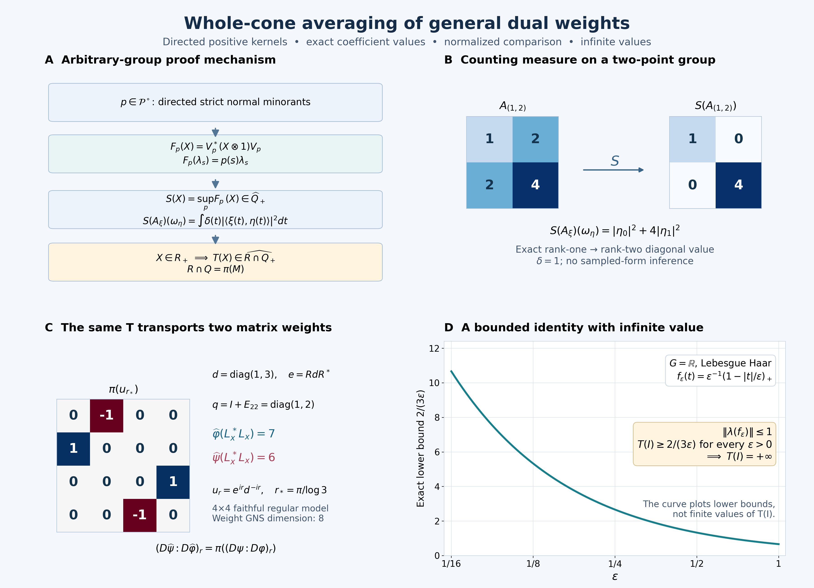

# Whole-cone averaging and comparison of general dual weights

*Independent proof development and original course-expression repair, GPT-6.1 Sol (OpenAI), Ultra, 2026-10-05. New expression: CC0-1.0 to the extent of rights held; inherited expressions retain their recorded terms.*

Let \(G\) be an arbitrary locally compact Hausdorff group with left Haar measure \(dt\) and \(\mu(Es)=\delta(s)\mu(E)\). Let \(\alpha\) be a point-ultraweak continuous normal automorphism action on an arbitrary von Neumann algebra \(M\). Scalar products are linear in the first entry. There is no countability, separability, unimodularity, invariant-weight or finite-state hypothesis. The zero algebra has the unique zero map; assume \(M\ne0\) below.

Use the actual [AT](OA-FLOW-AT.md#oa-flow.at.1), [NR](OA-FLOW-NR.md#oa-flow.nr.1), [CCM](OA-FLOW-CCM.md#ccm-4), [Haar](OA-FLOW-HR.md#hr-03), [L24](OA-FLOW-L24.md#oa-flow.grp.haarconventions), [extended-positive EP](OA-FLOW-EP.md#ep-2), [normal-weight EW](OA-FLOW-EW.md#ew-5), [full completion WH04](OA-FLOW-WH04.md#oa-flow.wh04.2), [WF](OA-FLOW-WF.md#oa-flow.wf.1), [BC](OA-FLOW-BC.md#bc-2), [OT](OA-FLOW-OT.md#ot-1), [MA](OA-FLOW-MA.md#oa-flow.ma.4), [CZ](OA-FLOW-CZ.md#cz-6), [RF5](OA-FLOW-RF.md#rf-5) and [GDW1–7](OA-FLOW-GDW.md#gdw-1) proofs. The elementary GNS, positive calculus, weak compactness and scalar convergence inputs are the earlier CF/GNS/CP/CV/SF/SC bodies. Every application below specifies its domain. The primary mathematical route is Haagerup, [*On the dual weights for crossed products of von Neumann algebras II*](https://journals.msp.org/mscand/article/view/1878), Math. Scand. 43 (1978), especially Theorem 3.1. We supply the directedness, scalar finite-domain, positive-kernel and whole-cone passages used by that route. The equal-modular-group uniqueness argument repairs the independently written original course lesson20 by binding its actual MA/CZ/RF inputs; it does not assume a new cocycle-realization theorem.

## GDA0. The complete conclusions

The exact scalar and operator preliminaries used below are CF8–10 (Hilbert–Riesz, positive calculus and weak compactness), [GNS](OA-FLOW-GNS.md#gns-theorem-4-1), [CP4–6](OA-FLOW-CP.md#oa-flow.cp.4) (normal vector-series tests and positive extensions), [SC3–5](OA-FLOW-SC.md#sc-03) (scalar approximation and convergence), [HR5](OA-FLOW-HR.md#hr-05) and [L24 Proposition4.3](OA-FLOW-L24.md#oa-flow.grp.vectorintegration) (product interchange), [SF, SB0–6](OA-FLOW-SF.md#oa-flow.sf.sb0) (full Borel domains), [NF5](OA-FLOW-NF.md#oa-flow.nf.5), [GW3–4](OA-FLOW-GW.md#oa-flow.gw.3), [EW2](OA-FLOW-EW.md#oa-flow.ew.2), [HA-R4](OA-FLOW-HA-R.md#oa-flow.ha-r.4), [NC4](OA-FLOW-NC.md#oa-flow.nc.4) and the general normal-weight [sum theorem WS](OA-FLOW-WS.md#oa-flow.weight-sum.ws5). These are earlier programme proof bodies; the dependency ledger binds each actual range and its inherited closure.

Write \(R=M\rtimes_\alpha G=\{\pi(M),\lambda(G)\}''\), in the normal regular model. We construct a faithful normal semifinite operator-valued weight

\[
T:R_+\longrightarrow\widehat{\pi(M)}_+,
\qquad
T(L_x^*L_x)=\pi\left(\int_G x(t)^*x(t)\,dt\right)
\quad(x\in\mathscr K).
\tag{GDA1}
\]
Here \(\mathscr K\) is GDW's bounded, strongly* continuous compact coefficient algebra, \(L_x=\int\lambda_t\pi(x(t))dt\). The integral in (GDA1) is bounded, with no pointwise input-weight finiteness assumption. On every positive \(X\), including infinite values,

\[
T(\lambda_sX\lambda_s^*)
=\delta(s)\lambda_sT(X)\lambda_s^*.
\tag{GDA2}
\]
For every faithful normal semifinite \(\varphi\), its already constructed GDW dual weight is exactly

\[
\widehat\varphi=\widehat{\varphi\circ\pi^{-1}}\circ T,
\qquad
(D\widehat\psi:D\widehat\varphi)_r=\pi((D\psi:D\varphi)_r).
\tag{GDA3}
\]
The outer hat on a scalar weight in the composition means EP's extension to the entire extended positive cone. The first equality subsequently defines the extension to every normal input weight, allowing zero, nonfaithful and nonsemifinite cases. For faithful n.s.f. inputs we also give the whole relative positive-operator domains. GDA0 is a forward theorem statement; its proofs are GDA1–9 and it is not an earlier proved premise.

## GDA1. The scalar group weight and every L1 coefficient

Apply GDW with \(M=\mathbb C\), trivial action and the weight \(z\mapsto z\) on \(\mathbb R_+\). It gives a faithful normal semifinite weight \(\Omega\) on \(L(G)=\lambda(G)''\), with \(L^2(G)\) as its whole GNS space. Its original algebra is \(C_c(G)\), with ordinary convolution and

\[
f^\#(t)=\delta(t)^{-1}\overline{f(t^{-1})},\qquad
\Lambda_\Omega(\lambda(f))=f\quad(f\in C_c(G)).
\tag{GDA4}
\]
Its complete finite ideal is GDW6's full left-multiplier ideal. In particular, \(\Omega(X)<\infty\) precisely when \(X^{1/2}=\lambda_\xi\) for its actual full left-bounded vector \(\xi\); the value is \(\|\xi\|_2^2\). WH04's mixed identity holds for **every** right-bounded vector, even outside its adjoint involution domain.

For \(f\in L^1(G)\), we claim the complete formula

\[
\Omega(\lambda(f)^*\lambda(f))=\int_G|f(t)|^2dt,
\tag{GDA5}
\]
where the right side may be infinite. If \(f\in L^1\cap L^2\), HR/L24 give compact continuous approximants converging in both norms. Their integrated operators converge in operator norm, and their GNS vectors converge in \(L^2\). EW2's bounded adjoint-strong GNS graph gives \(\lambda(f)\in N_\Omega\) with vector \(f\).

Conversely, finite left side means \(\lambda(f)=\lambda_\xi\) for \(\xi\in L^2\). Every \(h\in C_c(G)\) is right bounded: right convolution is the integral of right-translation unitaries, with norm at most \(\int|h(t)|\delta(t)^{-1/2}dt\). WH04.3 gives
\(f*h=\lambda(f)h=R_h\xi=\xi*h\).
Take nonnegative normalized compact bumps \(h_i\) whose supports shrink to the identity. Left convolution by \(h_i\) tends strongly to the identity; right convolution has a common bound and tends strongly to the identity too, by the continuous right-translation representation and \(\delta(t)\to1\) at the identity. Thus \(f*h_i\to f\) in \(L^1\) and \(\xi*h_i\to\xi\) in \(L^2\). On each compact finite-measure set the latter is also \(L^1\) convergence. Hence \(f=\xi\) locally almost everywhere. A countable union of compact carriers covers the finite-exponent supports of these two fields, so the equality is their global Haar class. This proves (GDA5), including its infinite case, without replacing the full multiplier test by a compact-domain test.

Conjugation by \(\lambda_s\) scales this entire scalar weight:

\[
\Omega(\lambda_sX\lambda_s^*)=\delta(s)\Omega(X)\quad(X\in L(G)_+).
\tag{GDA6}
\]
For clarity, this is a whole-domain assertion. Define \((B_s f)(t)=\delta(s)f(s^{-1}ts)\) on \(L^2(G)\). Haar change of variables gives \(\|B_s f\|_2^2=\delta(s)\|f\|_2^2\). On \(C_c(G)\), \(B_s\) is a convolution and involution automorphism, and \(\lambda(B_sf)=\lambda_s\lambda(f)\lambda_s^*\). The bounded invertible map \(B_s\) transports the entire closed involution, each bounded-vector test and its first/second dual: substitute \(B_s^{-1}a\) in the defining inequalities, and use its fixed Hilbert norm scale. It therefore transports the full multiplier ideal and satisfies \(\lambda_{B_s\xi}=\lambda_s\lambda_\xi\lambda_s^*\). Equivalently its normalized unitary is the product of left and right regular unitaries, so this equality also follows on their dense original algebra. The complete square-root criterion for \(\Omega\) now proves (GDA6), both at finite values and when the finite-ideal condition fails.

## GDA2. Directed strict normal minorants, proved locally

For any faithful n.s.f. weight \(\nu\) on any von Neumann algebra \(A\), put

\[
\mathcal F_\nu^\circ=
\{f\in A_*^+:f\leq(1-\varepsilon)\nu\text{ for some }0<\varepsilon<1\}.
\tag{GDA7}
\]
This set is directed in the positive-functional order. Let \(f_1,f_2\) belong to it. The maps \(T_j\Lambda_\nu(a)=\Lambda_{f_j}(a)\), \(a\in N_\nu\), extend to bounded intertwiners; \(R_j=T_j^*T_j\) belongs to \(\pi_\nu(A)'\) and \(0\leq R_j\leq(1-\varepsilon_j)1\). The bounded-functional GNS representation is normal by NF5. GW4's finite positive contractions tend strongly to one there, so \(\Lambda_{f_j}(N_\nu)\) is dense in its whole unital GNS space.

In the commutant define

\[
H_j=R_j(1-R_j)^{-1},\qquad H=H_1+H_2,\qquad R=H(1+H)^{-1}.
\tag{GDA8}
\]
The inverse-order inequality for positive invertible operators gives \(R\geq R_j\). Also \(R\leq(1-\varepsilon')1\) for some \(\varepsilon'>0\), since \(H\) is bounded, and \(R\leq H\leq C(R_1+R_2)\) for finite \(C\). No commutation between \(R_1,R_2\) is assumed.

Let \(\rho=f_1+f_2\), a bounded normal positive functional. The form
\(\langle R\Lambda_\nu(a),\Lambda_\nu(b)\rangle\)
is well defined and bounded on \(\Lambda_\rho(N_\nu)\), by the last inequality and Cauchy–Schwarz. This space is dense, as above. Hilbert–Riesz gives a bounded positive operator \(Q\) on \(H_\rho\). Its form identity with multiplication by \(c,c^*\in A\) makes \(Q\) commute with \(\pi_\rho(A)\). Thus

\[
f(a)=\langle Q\pi_\rho(a)\Lambda_\rho(1),\Lambda_\rho(1)\rangle
\tag{GDA9}
\]
is a bounded normal positive functional and, on every \(a\in N_\nu\),
\(f(a^*a)=\langle R\Lambda_\nu(a),\Lambda_\nu(a)\rangle\).
It follows that \(f\leq(1-\varepsilon')\nu\) on the entire cone: test a finite positive element by its square root; an infinite \(\nu\)-value imposes no further upper restriction. To see \(f\geq f_j\) on every positive \(x\), test first on \(u_i x u_i\), where \(u_i\) are the finite positive contractions. Their square roots belong to \(N_\nu\), since \(x^{1/2}u_i\in N_\nu\) and the finite cone is hereditary. The form inequality applies there, and normality of the bounded functionals passes to the bounded strong limit \(x\). Hence \(f\) is a common upper member of (GDA7).

EW5 and scaling also prove

\[
\nu(x)=\sup_{f\in\mathcal F_\nu^\circ}f(x)\quad(x\in A_+).
\tag{GDA10}
\]
Indeed every normal minorant is approached pointwise by its factors \((1-\varepsilon)f\). Directedness is used below for \(\nu=\Omega\); no directedness assertion for nonsemifinite input weights is needed.

## GDA3. Positive-definite functions and the exact scalar tests

A continuous function \(p:G\to\mathbb C\) is positive definite when all matrices \([p(s_i s_j^{-1})]\) are positive. Here is the needed representation without a cited group theorem. Complete the finite formal vectors \(v_s\) with scalar product \(\langle v_s,v_t\rangle=p(ts^{-1})\), quotienting the null space. The maps \(\rho_gv_s=v_{sg^{-1}}\) preserve this scalar product and form a unitary representation. Continuity of \(p\) makes it strongly continuous first on finite vectors, then everywhere by the common unitary bound. With \(v=v_e\),

\[
p(g)=\langle\rho_gv,v\rangle,\qquad\|v\|^2=p(e),\qquad
v_t=\rho_{t^{-1}}v.
\tag{GDA11}
\]
The finite formal vectors span densely, so \(v\) is cyclic; compact bumps approximate their group translates by continuous vector integrals.

Write \(p\preccurlyeq\delta_e\) for the test inequalities

\[
\int_G p(t)(h^\#*h)(t)dt\leq\|h\|_2^2\quad(h\in C_c(G)).
\tag{GDA12}
\]
This notation concerns the identity distribution, not the modular function \(\delta(t)\). It is equivalent to the existence of a unique \(\omega_p\in L(G)_*^+\) with

\[
\omega_p(\lambda_g)=p(g),\qquad\omega_p\leq\Omega.
\tag{GDA13}
\]
One direction follows from (GDA4). Conversely define \(Th=\rho(h)v\) on \(C_c(G)\). The integrated group product and adjoint formulas make its squared norm the left side of (GDA12), so it extends to a contraction \(T:L^2(G)\to H_\rho\). It intertwines \(\lambda_g\) with \(\rho_g\), and has dense range by cyclicity and the compact-bump limit. Its linear polar decomposition \(T=U|T|\), proved in HA-R4, therefore has \(UU^*=1\); its partial isometry intertwines the two representations, by uniqueness on the positive range. Put \(\zeta=U^*v\). It gives the normal functional \(\omega_p(X)=\langle X\zeta,\zeta\rangle\), with the required coefficients. Moreover
\(\lambda(h)\zeta=U^*\rho(h)v=|T|h\),
so \(\zeta\) is right bounded with \(\|R_\zeta\|\leq1\). For every \(X\) with finite \(\Omega(X)\), its actual square root is \(\lambda_\xi\) and WH04.3 gives

\[
\omega_p(X)=\|\lambda_\xi\zeta\|^2
=\|R_\zeta\xi\|^2\leq\|\xi\|^2=\Omega(X).
\tag{GDA14}
\]
For infinite \(\Omega(X)\), domination is automatic. Coefficients of normal functionals determine them because the linear span of \(\lambda(G)\) is ultraweakly dense. This proves the equivalence and its order correspondence.

Consequently \(\mathcal P^\circ\), the positive-definite functions corresponding to \(\mathcal F_\Omega^\circ\), is directed in the order \(p\leq q\) meaning \(q-p\) positive definite. Its corresponding functionals have supremum \(\Omega\) on every positive element. For every \(g\in L^1(G)\),

\[
\sup_{p\in\mathcal P^\circ}
\int\!\!\int p(st^{-1})g(s)\overline{g(t)}\,dsdt
=\int_G\delta(s)|g(s)|^2ds.
\tag{GDA15}
\]
The double integral is absolutely convergent for each \(p\), since \(|p|\leq p(e)\). In fact it is
\(\omega_p(\lambda(g^\#)^*\lambda(g^\#))\): substitute
\(\lambda(g^\#)=\int\overline{g(s)}\lambda_{s^{-1}}ds\)
and evaluate its squared vector norm. Formula (GDA10), followed by (GDA5), proves (GDA15); Haar inversion gives \(\|g^\#\|_2^2=\int\delta(s)|g(s)|^2ds\). This remains valid when that integral is infinite. The normalized \(L^1\) involution is essential in a nonunimodular group.

We also need a positive compact-convolution test:

\[
f\in C_c(G),\quad\lambda(f)\geq0
\quad\Longrightarrow\quad\Omega(\lambda(f))=f(e).
\tag{GDA16}
\]
Here are its finite-domain details. The continuous kernel of \(\lambda(f)\) is \(f(tu^{-1})\delta(u)^{-1}\). Localized normalized scalar bumps at finitely many points turn its positivity into positivity of the kernel matrices. Multiplying rows/columns by the positive \(\delta\)-factors shows that \(h(s)=\delta(s)^{1/2}f(s)\) is positive definite. Explicitly the kernel becomes
\(\delta(t)^{-1/2}\delta(u)^{-1/2}h(tu^{-1})\).
Use its cyclic representation from (GDA11), and on \(C_c(G)\) put

\[
Tq=\int_G\delta(t)^{-1/2}q(t)\rho_{t^{-1}}v\,dt.
\tag{GDA17}
\]
Its squared norm is \(\langle\lambda(f)q,q\rangle\). Hence \(T\) extends boundedly, with \(T^*T=\lambda(f)\), and its range is dense by compact bumps at each point. If \(r_s q(t)=\delta(s)^{1/2}q(ts)\), Haar substitution gives \(Tr_s=\rho_sT\). The polar decomposition \(T=U\lambda(f)^{1/2}\) has \(UU^*=1\) and \(U\) intertwines these representations. Thus \(\zeta=U^*v\) has \(\|\zeta\|_2^2=h(e)=f(e)\), and for \(q\in C_c(G)\),

\[
\lambda(f)^{1/2}q=U^*Tq
=\int\delta(t)^{-1/2}q(t)r_{t^{-1}}\zeta\,dt
=\zeta*q.
\tag{GDA18}
\]
Take the normalized bumps \(q_i\) from GDA1. The operators \(\lambda(f)^{1/2}\lambda(q_i)\) lie in \(N_\Omega\), are uniformly bounded, and tend boundedly strongly* to \(\lambda(f)^{1/2}\). Their GNS vectors are \(\lambda(f)^{1/2}q_i=\zeta*q_i\to\zeta\). EW2 identifies the complete GNS limit. Therefore \(\lambda(f)^{1/2}\in N_\Omega\), and its squared GNS norm proves (GDA16). No positive convolution root was merely assumed to belong to the finite ideal.

In particular, if \(f\in C_c(G)\) and \(\int p(t)f(t)dt\geq0\) for every continuous positive-definite \(p\), then \(\lambda(f)\geq0\): test the positive normal functionals of \(L(G)\), whose group coefficients are such functions. Thus (GDA10) and (GDA16) give

\[
\sup_{p\in\mathcal P^\circ}\int_Gp(t)f(t)dt=f(e).
\tag{GDA19}
\]

## GDA4. Normal Schur maps and their whole extended supremum

On \(K=L^2(G,H)\), for any continuous positive-definite \(p\), define the bounded map

\[
(V\xi)(t)=\xi(t)\otimes\rho_{t^{-1}}v,
\qquad
F_p(X)=V^*(X\otimes1)V\quad(X\in B(K)).
\tag{GDA20}
\]
The tensor/function identification is obtained first on compact continuous sections and finite tensors; their dense completions agree by the already proved vector-integration facts. The pointwise formula gives \(\|V\|^2=p(e)\). Amplification is normal: positive normal tests are vector series and finite tensors are dense, so bounded increasing nets converge strongly in each amplified vector test. Hence \(F_p\) is normal and completely positive.

Let \(D_0=1_H\otimes L^\infty(G)\), the scalar multiplication algebra, and \(Q=D_0'\). The map \(V\) intertwines every operator in \(Q\) with its amplification: on finite scalar/vector tensors this is immediate for constants and multiplication, and equivalently \(V\) is the strong sum of scalar multiplication maps along an orthonormal basis of \(H_\rho\). For detail, if \(a_i(t)=\langle\rho_{t^{-1}}v,e_i\rangle\), then \(\sum_i|a_i(t)|^2=p(e)\); finite sums increase uniformly on each compact set by compactness of the continuous feature-vector range. Thus

\[
F_p(X)=\sum_i M_{\overline{a_i}}X M_{a_i}
\tag{GDA21}
\]
with normal strong positive sums, first on positive \(X\), then linearly. The scalar multipliers commute with \(Q\), proving its bimodule identity. This argument uses only countable coordinates for each compact feature range, not a countable basis of the whole representation.

The kernel factor is \(p(tu^{-1})\). In particular

\[
F_p(\lambda_s)=p(s)\lambda_s,
\qquad F_p(aXb)=aF_p(X)b\quad(a,b\in Q).
\tag{GDA22}
\]
The multiplier and left/right regular translations generate \(B(L^2(G))\): for \(f,g\in C_c(G)\), choose a compact continuous \(h=1\) on \(\operatorname{supp}f\,\operatorname{supp}g^{-1}\). The operator \(M_f\lambda(h)M_{\delta\overline g}\) has kernel \(f(t)\overline{g(u)}\), hence is the rank-one operator \(\eta\mapsto\langle\eta,g\rangle f\). Compact scalar functions are dense, so these rank ones generate all bounded operators. Inversion conjugates left into right translation, leaving multiplication invariant. Only the commutant definition \(Q=D_0'\) is used below; no pointwise decomposition theorem for its operators is needed.

These relations determine \(F_p\) uniquely: the span of \(\lambda_s a\), \(a\in Q\), is a star algebra and contains a weakly dense algebra by the rank-one argument. Normal bimodule maps agreeing there agree everywhere. Thus \(F_{p+q}=F_p+F_q\), and positive-definite order implies completely positive order. Define

\[
S(X)(\omega)=\sup_{p\in\mathcal P^\circ}\omega(F_p(X)),
\quad X\in B(K)_+,\quad\omega\in B(K)_*^+.
\tag{GDA23}
\]
Directedness proves additivity in \(\omega\), including infinite values; a common upper index approximates both summands. It is homogeneous and norm lower semicontinuous as a supremum of bounded continuous evaluations. EP2–4 therefore give an actual element of \(\widehat{B(K)}_+\). The same common-index argument proves additivity and homogeneity in \(X\). Normality follows by interchanging the supremum over \(p\) with the supremum of a bounded increasing \(X_i\), since every \(F_p\) is normal. The \(Q\)-sandwich identity also passes to this entire extended supremum.

Its values belong to \(\widehat Q_+\). Let \(A_\xi\eta=\langle\eta,\xi\rangle\xi\) be a positive rank-one operator. For \(\eta\in K\), put \(g(t)=\langle\xi(t),\eta(t)\rangle\), which belongs to \(L^1\). Formula (GDA21) and Cauchy–Schwarz/Fubini on the actual finite-exponent carriers give

\[
S(A_\xi)(\omega_\eta)
=\sup_{p\in\mathcal P^\circ}\int\!\!\int p(st^{-1})g(s)\overline{g(t)}dsdt
=\int_G\delta(t)|\langle\xi(t),\eta(t)\rangle|^2dt.
\tag{GDA24}
\]
The first expression means the extended quadratic-form value, not a bounded-operator pairing assumed finite. The form is invariant under every unitary scalar multiplier. EP's unique closed form and full spectral projections therefore put \(S(A_\xi)\) in \(\widehat Q_+\), retaining any infinite part. Every \(X\geq0\) is the increasing sum of rank ones \(A_{X^{1/2}e_i}\) over finite subsets of an orthonormal basis. Normality of \(S\), EP4 and the spectral fixed-point test show that \(S(X)\in\widehat Q_+\). This argument never requires a common pointwise orthonormal basis of the coefficient fields.

The map \(S\) is faithful. If \(\xi\ne0\), (GDA24) at \(\eta=\xi\) is strictly positive, possibly infinite, because \(\delta>0\). Thus a zero \(S(X)\) makes every rank-one summand just used zero and forces \(X=0\).

## GDA5. The value algebra is precisely the coefficient algebra

Each regular coefficient \(\pi(a)\) commutes with scalar multiplication and hence belongs to \(Q\). Formula (GDA22) gives

\[
E_p(\lambda_s\pi(a))=p(s)\lambda_s\pi(a),\qquad E_p=F_p|_R.
\tag{GDA25}
\]
Normality and generator density imply \(F_p(R)\subset R\). Therefore \(T(X)=S(X)\), \(X\in R_+\), is an extended positive element affiliated both with \(R\) and with \(Q\). We prove \(R\cap Q=\pi(M)\), without a decomposable-field theorem.

Use NR1's strongly continuous standard implementing group \(U_s\) on \(H\); normal model independence NR4 allows this choice. The right commutant unitaries and the unitary change of coordinates are

\[
(V_s\xi)(t)=\delta(s)^{1/2}U_s\xi(ts),
\qquad (W\xi)(t)=U_t\xi(t).
\tag{GDA26}
\]
CCM gives \(V_s\in R'\); every constant \(b'\in M'\) is also in \(R'\). Direct substitution gives \(WV_sW^*=r_s\), the scalar right regular translation, and \(W\pi(a)W^*=a\otimes1\). The unitary \(W\) commutes with scalar multiplication. If \(X\in R\cap Q\), then \(WXW^*\) commutes with both right translations and multiplication. The rank-one proof in GDA4 shows that it commutes with \(1_H\otimes B(L^2(G))\), so \(WXW^*=a\otimes1\). This tensor commutant assertion follows directly by testing scalar rank ones on simple tensors, and is valid for arbitrary \(H\).

Commutation with \(W(b'\otimes1)W^*\) then tests the continuous scalar functions \(\langle[a,U_tb'U_t^*]\xi,\eta\rangle\). Compact scalar-vector tests make their integrals against every \(C_c\) test zero. Positivity of Haar measure on open sets makes each continuous function zero everywhere. At \(t=e\), this gives \([a,b']=0\) for every \(b'\in M'\), hence \(a\in M\) and \(X=\pi(a)\). The reverse inclusion was already noted.

The finite-part projection and each finite-part spectral projection of \(T(X)\) thus lie in \(R\cap Q=\pi(M)\). EP2–3 reconstruct its whole value in \(\widehat{\pi(M)}_+\), including the infinite subspace. Normality, faithfulness and \(\pi(M)\)-bimodularity follow from GDA4; a normal inclusion into \(B(K)\) preserves the extended-positive tests, since EP1 supplies positive normal extensions of every normal functional of the subalgebra. Hence

\[
T:R_+\longrightarrow\widehat{\pi(M)}_+
\tag{GDA27}
\]
is a faithful normal operator-valued weight. The normal Schur maps are intrinsic by (GDA25) and normal generator density, so NR4 transports the same entire map to every faithful normal initial regular representation.

## GDA6. Bounded compact-square values, semifiniteness and group scaling

For \(x\in\mathscr K\), let \(z=x^\#*x\). It is compact, bounded and strongly* continuous by CCM4. For \(\omega\in R_*^+\), the continuous compact scalar function
\(f_\omega(t)=\omega(\lambda_t\pi(z(t)))\)
satisfies

\[
\int p(t)f_\omega(t)dt=\omega(E_p(L_x^*L_x))\geq0
\tag{GDA28}
\]
for every continuous positive-definite \(p\). Normality of \(E_p\) and its generator formula justify passage through the compact integral. GDA3's full scalar test now gives

\[
T(L_x^*L_x)(\omega)=f_\omega(e)
=\omega\left(\pi\left(\int x(t)^*x(t)dt\right)\right).
\tag{GDA29}
\]
These values determine the bounded positive operator on the right, by EP1–3. In particular \(L(\mathscr K)\subset N_T\). This coefficient algebra is ultraweakly dense by GDW2/CCM, hence \(T\) is semifinite. EP6 supplies its actual whole ideals
\(N_T=\{X:T(X^*X)\in\pi(M)_+\}\)
and \(m_T=\operatorname{span}N_T^*N_T\), with a coefficient-algebra-valued bimodule linear extension on this finite algebra; the extension need not be norm-bounded. We have proved finiteness of the compact coefficients, not asserted that they equal those whole ideals.

For scaling, (GDA25) on generators and normality give
\(E_p(\lambda_sX\lambda_s^*)=\lambda_s E_{p^s}(X)\lambda_s^*\),
where \(p^s(t)=p(sts^{-1})\). By (GDA6), the corresponding normal-functional transformation \(\omega_p\mapsto\omega_p\circ\operatorname{Ad}\lambda_s\) is an order bijection from the strict \(\Omega\)-minorants to the strict \(\delta(s)\Omega\)-minorants. Linearity of the Schur construction and the cofinal strict family consequently give

\[
\sup_{p\in\mathcal P^\circ}E_{p^s}(X)=\delta(s)T(X).
\tag{GDA30}
\]
This is an equality in the entire extended cone, tested on every normal positive functional. Sandwiching proves (GDA2) with its stated Haar factor and nonabelian order.

## GDA7. A fully bound uniqueness lemma for the constructed weights

The central-density and finite-sandwich uniqueness route in this section has its antecedent in Takesaki, [*Theory of Operator Algebras II*, Chapter X, Lemma 1.18, printed p.250](https://doi.org/10.1007/978-3-662-10451-4). The full argument below supplies its exact earlier programme proofs and both spectral-cut cases.

We spell out the modular uniqueness needed to identify a composition. This retains the original course's useful finite-sandwich argument and replaces its unspecified injectivity premise by the actual MA4 proof.

First, if faithful n.s.f. weights \(\rho,\nu\) have identical balanced cocycle \((D\rho:D\nu)_r=1\), they are equal on the whole cone. Indeed BC4 gives the constant off-diagonal orbit \(\beta_r^{\rho,\nu}(1)=1\). It is norm-entire, with its \(-i\) and \(-i/2\) values also one. MA4, equation MA11 with \(k=1\), gives \(\rho(h)\leq\nu(h)\) and \(\nu(h)\leq\rho(h)\) for every \(h\geq0\), including infinite values. The BC chain rule proves fixed-reference injectivity as well.

If two faithful n.s.f. weights \(\Psi,\Phi\) have the same modular group, BC4 makes \(u_r=(D\Psi:D\Phi)_r\) central. The modular group fixes the center: on the finite-star GNS graph a central selfadjoint element commutes with \(S,F\), hence with their positive product and imaginary powers, as proved in NC4/MW. Thus the cocycle rule becomes \(u_{r+s}=u_ru_s\). RF5's arbitrary-Hilbert unitary-group spectral construction gives \(u_r=e^{irA}\). Its resolvents and spectral projections commute with every unitary commuting with the center, so \(A\) is affiliated with the center. Put \(h=e^A\); SF supplies its whole domains and it is positive nonsingular. CZ1–6 construct the actual faithful n.s.f. weight \(\Phi_h\), with

\[
(D\Phi_h:D\Phi)_r=h^{ir}=u_r,
\qquad
\Psi(X)=\Phi_h(X)=\sup_n\Phi(h_n^{1/2}Xh_n^{1/2}),
\quad h_n=\min(h,n).
\tag{GDA31}
\]
The first equality and the preceding fixed-reference injectivity prove the second on every positive element. For completeness, CZ uses resolvent regularizations \(h_\varepsilon=h(1+\varepsilon h)^{-1}\). The central spectral inequalities \(h_\varepsilon\leq h_n\) for \(n\geq\varepsilon^{-1}\), and \(h_n\leq(1+\varepsilon n)h_\varepsilon\), show equality of the two suprema, including infinite values. This is not an arbitrary-cocycle realization argument.

Now let \(\Phi\) be GDW's dual of a faithful n.s.f. \(\varphi\). Suppose \(\Psi\) is faithful n.s.f., has its two modular generator formulas, and has the same finite quadratic values for every \(L_x\), \(x\in\mathscr B_\varphi\). Polarization gives equality on \(L_y^*L_x\). For \(z\in\mathscr K\), the left-ideal identity \(z*x\in\mathscr B_\varphi\) gives equality on \(L_x^*L_zL_x\). The two maps

\[
Y\longmapsto\Psi(L_x^*YL_x),\qquad
Y\longmapsto\Phi(L_x^*YL_x)
\tag{GDA32}
\]
are bounded normal positive functionals on all of \(R\), by GW3/NF5. They agree on the dense integrated star algebra and on one, so they agree for every \(Y\in R\). The modular groups agree on both generator families, hence on \(R\).

Use (GDA31). For \(\varepsilon>0\), the central projection \(p_+=1_{[1+\varepsilon,\infty)}(h)\) gives finite equal values at \(Z=L_x^*p_+L_x\), and the central cutoffs imply
\(\Psi(Z)\geq(1+\varepsilon)\Phi(Z)\).
Thus \(\Phi(Z)=0\), and faithfulness implies \(p_+L_x=0\). Likewise \(p_-=1_{[0,1-\varepsilon]}(h)\), \(0<\varepsilon<1\), gives \(\Psi(Z)\leq(1-\varepsilon)\Phi(Z)\) and \(p_-L_x=0\). The algebra \(L(\mathscr D_\varphi)\subset L(\mathscr B_\varphi)\) is strongly dense, so both projections vanish. Countably many \(\varepsilon=1/n\) exclude every spectral value away from one; nonsingularity excludes the kernel. Hence \(h=1\) and

\[
\Psi=\Phi\quad\hbox{on the entire positive cone}.
\tag{GDA33}
\]
Only bounded normal sandwich functionals were extended by density; no unbounded weight was assumed continuous on a dense positive set.

## GDA8. Composition is the full GDW weight, for every faithful input

For faithful n.s.f. \(\varphi\) on \(M\), set \(\Psi_\varphi=\widehat{\varphi\circ\pi^{-1}}\circ T\). EP5–6 prove that it is faithful normal semifinite on the whole \(R_+\). OT gives
\(\sigma_r^{\Psi_\varphi}(\pi(a))=\pi(\sigma_r^\varphi(a))\).

We need the exact inner convention. For any faithful n.s.f. \(\nu\) and unitary \(v\),

\[
(D(\nu\circ\operatorname{Ad}v):D\nu)_r=v^*\sigma_r^\nu(v).
\tag{GDA34}
\]
To prove it from BC, transport \(\Theta(\nu,\nu)\) by \(\operatorname{diag}(v,1)\). Its two corner weights are \(\nu\circ\operatorname{Ad}v,\nu\). BC5 transports the modular group. On \(E_{21}\) its coefficient is \(\sigma_r^\nu(v^*)v\), as direct diagonal multiplication shows. BC4 identifies this as the reverse cocycle; take its adjoint. This proves (GDA34) with the actual weight normalization.

Equation (GDA2) gives
\(\Psi_\varphi\circ\operatorname{Ad}\lambda_s=\delta(s)\Psi_{\varphi\circ\alpha_s}\).
OT's two-composition cocycle identity, BC5's positive scalar rule and (GDA34) therefore give

\[
\sigma_r^{\Psi_\varphi}(\lambda_s)
=\delta(s)^{ir}\lambda_s\pi((D(\varphi\circ\alpha_s):D\varphi)_r).
\tag{GDA35}
\]
The coefficient stays to the right; no commutation was used. These are exactly GDW7's two modular generators.

For \(x\in\mathscr B_\varphi\), (GDA29) and GDW1's bounded normal finite-coefficient pairing give

\[
\Psi_\varphi(L_x^*L_x)
=\varphi\left(\int x(t)^*x(t)dt\right)
=\|\eta_\varphi(x)\|_2^2
=\widehat\varphi(L_x^*L_x)<\infty.
\tag{GDA36}
\]
The unbounded \(\varphi\) is not formally moved through an operator integral: write \(x\) as finite right-ideal coefficients and use exactly GDW1's bounded normal sandwich functionals. GDA7 now identifies \(\Psi_\varphi=\widehat\varphi\) on every positive element. Thus (GDA3)'s first identity has complete finite-ideal and positive-cone meaning; GDW6's actual entire ideal and GNS data remain unchanged.

For any normal \(\theta\), define its dual by this same whole composition. EP5–6 prove normality without faithfulness or semifiniteness assumptions. Its complete finite and null ideals are, exactly,

\[
N_{\widehat\theta}=\{X:\widehat{\theta\circ\pi^{-1}}(T(X^*X))<\infty\},
\quad
N^0_{\widehat\theta}=\{X:\widehat{\theta\circ\pi^{-1}}(T(X^*X))=0\}.
\tag{GDA37}
\]
Its finite algebra and quotient GNS construction are GW1–3 at these ideals. No n.s.f. or faithful relative-modular conclusion is asserted for such a general input. On compact squares its value is \(\theta(\int x(t)^*x(t)dt)\), possibly infinite. Additivity, nonnegative scalar factors including zero, and arbitrary-index sums are preserved: apply EP5's increasing bounded spectral approximations to a fixed extended value, then interchange its supremum with the finite-partial-sum supremum. This proves these laws on the whole cone, not just on coefficient tests.

## GDA9. Two dual weights and their full relative spectral domains

For faithful n.s.f. \(\varphi,\psi\), GDA8 has identified both constructed weights with their compositions with this single \(T\). OT's complete relative strip/domain theorem gives

\[
(D\widehat\psi:D\widehat\varphi)_r=\pi((D\psi:D\varphi)_r)
\quad(r\in\mathbb R).
\tag{GDA38}
\]
This is the balanced-weight normalized cocycle, not merely an intertwiner of modular automorphisms. Its chain, adjoint and scalar laws are the actual BC laws; in particular no central phase is lost.

In \(K_\varphi=L^2(G,H_\varphi)\), let \(\widehat\Delta_{\psi,\varphi}\) be BC2's whole relative positive operator for these two dual weights, and let

\[
K_t^{\psi,\varphi}=\delta(t)\Delta_{\psi\circ\alpha_t,\varphi}.
\tag{GDA39}
\]
BC3's full imaginary-power identity, GDW7 and (GDA38) give, for every real \(r\),

\[
(\widehat\Delta_{\psi,\varphi}^{ir}\xi)(t)
=(K_t^{\psi,\varphi})^{ir}\xi(t).
\tag{GDA40}
\]
Indeed the noncommutative coefficient product is
\(\alpha_{t^{-1}}((D\psi:D\varphi)_r)(D(\varphi\circ\alpha_t):D\varphi)_r
=(D(\psi\circ\alpha_t):D\varphi)_r\),
by BC5 covariance followed by BC4 chain. Relative operators are injective by BC2, so their logarithms have the full SF domains.

Here is the whole-domain passage, rather than a fiber formula on an unspecified dense class. Write \(A=\log\widehat\Delta_{\psi,\varphi}\), \(A_t=\log K_t^{\psi,\varphi}\). Its bounded resolvent is

\[
(A-i)^{-1}=i\int_0^\infty e^{-r}\widehat\Delta_{\psi,\varphi}^{-ir}dr.
\tag{GDA41}
\]
SF's scalar spectral integral verifies the identity on every vector; the integrand is a continuous norm-bounded Hilbert field and the tail is integrable. The pointwise imaginary powers are jointly strongly continuous on fixed vectors: BC chain gives \((D(\psi\circ\alpha_t):D\varphi)_r=(D(\psi\circ\alpha_t):D\psi)_r(D\psi:D\varphi)_r\); GDW7 supplies joint strong* continuity of the first factor, applied to \(\psi\), and the second factor and \(\Delta_\varphi^{ir}\) are strongly continuous in \(r\). Multiplication by \(\delta(t)^{ir}\) preserves this conclusion. Strongly measurable simple approximants to \(\xi\) therefore give joint strong measurability of the field in (GDA40). Scalar/Fubini tests on its actual countable compact carriers, with the uniform \(e^{-r}\) bound, identify (GDA41) pointwise with \((A_t-i)^{-1}\xi(t)\). Its adjoint has the analogous formula. Polynomial/uniform calculus of these resolvents, interval-projection approximations, finite intersections and countable disjoint sums give the whole Borel calculus, exactly as in GDW5; the missing point at infinity has no spectral mass. Unbounded truncation and SC monotone convergence consequently prove, for every finite complex-valued Borel function \(q\) on \((0,\infty)\),

\[
D(q(\widehat\Delta_{\psi,\varphi}))
=\left\{\xi:\xi(t)\in D(q(K_t^{\psi,\varphi}))\text{ a.e.},\ 
\int_G\|q(K_t^{\psi,\varphi})\xi(t)\|^2dt<\infty\right\},
\quad(q(\widehat\Delta_{\psi,\varphi})\xi)(t)
=q(K_t^{\psi,\varphi})\xi(t).
\tag{GDA42}
\]
The output field is strongly measurable by the same bounded-resolvent approximation and truncated norm limit. These exact domains include positive square roots, real/complex powers and logarithms; the operators have no zero eigenvector. The single-input GNS/involution domains are the already proved GDW domains, and the full relative graph and polar domains are BC2's restrictions of the complete balanced graph. No measurable disintegration or finite-state shortcut is used.

This proves the general whole-cone averaging map, all-normal-input extension, equality with every faithful n.s.f. GDW construction and the normalized comparison of two such dual weights. It does not prove arbitrary cocycle realization, induction, disintegration, normal LCA recognition, a factor classification or whole-course closure.

## Directed kernels, exact finite transport and an infinite whole-cone value

The first panel explains [GDA2–6](OA-FLOW-GDA.md#gda-2) for an arbitrary locally compact Hausdorff group and an arbitrary coefficient Hilbert space. The other three panels are exact examples with their stated Haar measures; their coordinates do not model an arbitrary group. The general case is developed in [Haagerup, *On the dual weights for crossed products of von Neumann algebras II*](https://journals.msp.org/mscand/article/view/1878), Math. Scand. 43 (1978). Every calculation below has a local proof.

### The directed construction and the value algebra

For a strict normal minorant of the scalar group weight, its continuous positive-definite coefficient \(p\) gives the normal completely positive Schur map
\[
F_p(X)=V_p^*(X\otimes1)V_p,\qquad
(V_p\xi)(t)=\xi(t)\otimes\rho_{t^{-1}}v,
\qquad F_p(\lambda_s)=p(s)\lambda_s.
\]
The strict family is directed in completely positive order by the explicitly proved commutant-resolvent construction in [GDA2](OA-FLOW-GDA.md#gda-2). Its entire extended supremum is [GDA23](OA-FLOW-GDA.md#gda-4), tested on every normal positive functional. On the positive rank one \(A_\xi\), [GDA24](OA-FLOW-GDA.md#gda-4) is
\[
S(A_\xi)(\omega_\eta)
=\int_G\delta(t)|\langle\xi(t),\eta(t)\rangle|^2dt.
\]
This equality includes infinite values. Invariance under every scalar multiplication unitary puts the full spectral projections in \(Q=(1\otimes L^\infty(G))'\). For \(X\) in the crossed product, the same projections are in \(R\), and [GDA5](OA-FLOW-GDA.md#gda-5) proves \(R\cap Q=\pi(M)\) by right commutant unitaries and scalar rank ones. Thus the supremum really has values in the coefficient algebra's extended positive cone. The arrows in the first panel represent these exact inclusions and tests, rather than a finite numerical approximation of the general supremum.

### A two-point rank one becomes a diagonal value

Take \(G=\mathbb Z/2\mathbb Z\), counting Haar measure, and the scalar coefficient Hilbert space \(H=\mathbb C\). Then \(\delta=1\). For \(\xi=(1,2)\),

\[
A_\xi=\begin{pmatrix}1&2\\2&4\end{pmatrix},\qquad
S(A_\xi)=\begin{pmatrix}1&0\\0&4\end{pmatrix}.
\tag{GDAF1}
\]
Indeed the general rank-one formula is \(|\eta_0|^2+4|\eta_1|^2\). It determines exactly the displayed diagonal operator; no sampled quadratic tests are being used to infer it. Here the scalar group weight is finite, \(\Omega(1)=1\), and the strict minorants \((1-\varepsilon)\Omega\) have coefficients \((1-\varepsilon)1_{\{0\}}\). Their Schur maps are \((1-\varepsilon)\) times diagonal compression, and their supremum gives (GDAF1). Shading records the exact nonnegative entries. The matrix is rank one before averaging and rank two afterwards.

### One averaging map, two noncommuting scalar densities

Again take counting Haar measure on \(\mathbb Z/2\mathbb Z\), but now \(M=M_2(\mathbb C)\) and

\[
v=\begin{pmatrix}0&1\\1&0\end{pmatrix},\quad
\alpha_1(a)=vav^*,\quad
d=\begin{pmatrix}1&0\\0&3\end{pmatrix},\quad
e=R d R^*=\begin{pmatrix}2&-1\\-1&2\end{pmatrix},\quad
R=2^{-1/2}\begin{pmatrix}1&-1\\1&1\end{pmatrix}.
\tag{GDAF2}
\]
Both \(\varphi(a)=\operatorname{Tr}(da)\) and \(\psi(a)=\operatorname{Tr}(ea)\) are faithful normal finite weights. They are not normalized states: each takes value \(4\) at one. The first is not action invariant, since its values on \(E_{11}\) and \(\alpha_1(E_{11})\) are \(1\) and \(3\). The second is invariant, since \(vev^*=e\). The densities do not commute: their \((1,2)\) commutator entry is \(2\).

Use the faithful regular model on \(\mathbb C^2\oplus\mathbb C^2\). Its coefficient copy is \(\pi(a)=\operatorname{diag}(a,vav^*)\), and \(\lambda_1\) swaps the two summands. For \(x(0)=I\), \(x(1)=E_{12}\), direct multiplication gives

\[
L_x=\begin{pmatrix}I&E_{21}\\E_{12}&I\end{pmatrix},\quad
L_x^*L_x=\begin{pmatrix}\operatorname{diag}(1,2)&2E_{21}\\2E_{12}&\operatorname{diag}(2,1)\end{pmatrix},\quad
T(L_x^*L_x)=\pi(q),\quad q=\operatorname{diag}(1,2).
\tag{GDAF3}
\]
The operator on the left is positive because it is an actual square. The two diagonal blocks are exchanged by \(\alpha_1\); diagonal compression therefore gives precisely the coefficient value asserted by [GDA29](OA-FLOW-GDA.md#gda-6). The same full averaging map gives

\[
\widehat\varphi(L_x^*L_x)=\varphi(q)=7,\qquad
\widehat\psi(L_x^*L_x)=\psi(q)=6.
\tag{GDAF4}
\]
These are exact finite sums, illustrating the full composition identity in [GDA8](OA-FLOW-GDA.md#gda-8).

For the normalized two-weight cocycle, put \(r_* = \pi/\log3\). The finite GNS graph has positive operator \(L_dR_{d^{-1}}\), so its imaginary powers give \(\sigma_r^\varphi(a)=d^{ir}ad^{-ir}\). Applying the same calculation to the balanced block density \(\operatorname{diag}(d,e)\) identifies the actual BC cocycle as \(u_r=e^{ir}d^{-ir}\). At \(r_*\), each density power \(e^{ir_*}\) and \(d^{-ir_*}\) has eigenvalues \(1,-1\). Their noncommuting product is the cocycle displayed below, whose characteristic polynomial is \(z^2+1\) and whose eigenvalues are \(+i,-i\). Hence

\[
u_{r_*}=\begin{pmatrix}0&-1\\1&0\end{pmatrix},\qquad
(D\widehat\psi:D\widehat\varphi)_{r_*}
=\pi(u_{r_*})=\operatorname{diag}(u_{r_*},-u_{r_*}).
\tag{GDAF5}
\]
The lower-left panel shows this exact \(4\times4\) matrix in the ordered regular basis \((e_1,e_2)\oplus(e_1,e_2)\); blue and red indicate \(1\) and \(-1\), with every zero labeled. This is a faithful regular representation of the cocycle. The weight GNS space in this example has dimension \(8\), as in GDW; the displayed \(4\times4\) matrix is not claimed to be its relative positive operator.

### A bounded identity has infinite averaging value

Take \(G=\mathbb R\), Lebesgue Haar measure, trivial scalar coefficient algebra. Its modular function is one. Put

\[
f_\varepsilon(t)=\varepsilon^{-1}(1-|t|/\varepsilon)_+\quad(\varepsilon>0).
\tag{GDAF6}
\]
Integration over \([-\varepsilon,\varepsilon]\) gives \(\|f_\varepsilon\|_1=1\) and \(\|f_\varepsilon\|_2^2=2/(3\varepsilon)\). Thus \(\|\lambda(f_\varepsilon)\|\leq1\), and [GDA5](OA-FLOW-GDA.md#gda-1) gives

\[
0\leq\lambda(f_\varepsilon)^*\lambda(f_\varepsilon)\leq I,\qquad
T(I)=\Omega(I)\geq\frac{2}{3\varepsilon}\quad(\varepsilon>0).
\tag{GDAF7}
\]
No finite number satisfies all these lower bounds, so \(T(I)=+\infty\) in \(\widehat{\mathbb C}_+\). This is the infinite-value part of an extended positive element; it is not a statement about Murray–von Neumann infinite projections. The plotted curve is the exact lower bound \(2/(3\varepsilon)\) for \(1/16\leq\varepsilon\leq1\). The theorem uses every \(\varepsilon>0\), not only this displayed interval. Its vertical axis is a finite lower bound for \(T(I)\), never a finite value assigned to \(T(I)\).

The native PNG is \(3600\times2600\). The illustration, exact rational matrix data, SVG and reproduction code are original expressions and are CC0-1.0 to the extent of rights held. [Editable SVG](../assets/general-dual-weight-averaging/assets/general-dual-weight-averaging.svg), [exact data](../assets/general-dual-weight-averaging/figure-data.json), [reproduction source](../assets/general-dual-weight-averaging/render_general_dual_weight_averaging.py).
