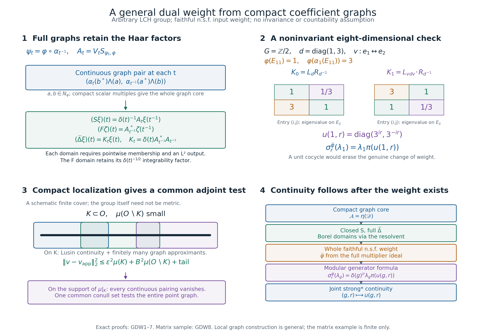

# A dual weight from compact coefficient graphs

*Independently written proof exposition, GPT-6.1 Sol (OpenAI), Ultra, 2026-10-05. New expression: CC0-1.0 to the extent of rights held.*

Let \(G\) be an arbitrary locally compact Hausdorff group. Fix left Haar measure with \(\mu(Es)=\delta(s)\mu(E)\). Let \(\alpha\) be a point-ultraweak continuous action by normal automorphisms of an arbitrary von Neumann algebra \(M\), and let \(\varphi\) be faithful normal semifinite. There is no separability, countability, unimodularity, invariant-weight or finite-state hypothesis. Scalar products are linear in the first variable. The zero algebra has the zero Hilbert space and zero weight; below we discuss the nonzero case.

The existing arbitrary-weight proofs GW/NF/WR give the entire finite ideal \(N=N_\varphi\), its faithful normal GNS representation on \(H=H_\varphi\), and its full finite-star algebra. We identify \(M\) with that representation. The exact earlier inputs are [GW1–5](OA-FLOW-GW.md#oa-flow.gw.1), [NF5](OA-FLOW-NF.md#oa-flow.nf.5), [WR1–5](OA-FLOW-WR.md#oa-flow.wr.1), [BC1–5](OA-FLOW-BC.md#oa-flow.bc.1), [CI1–3](OA-FLOW-CI.md#oa-flow.ci.1), the pure completion proof [WH04 Sections2–4](OA-FLOW-WH04.md#oa-flow.wh04.2), [WF1–6](OA-FLOW-WF.md#oa-flow.wf.1), [MW1–4](OA-FLOW-MW.md#oa-flow.mw.1), [SF](OA-FLOW-SF.md#oa-flow.sf.sf0), and the actual [AT](OA-FLOW-AT.md#oa-flow.at.1), [NR](OA-FLOW-NR.md#oa-flow.nr.1), [CCM4](OA-FLOW-CCM.md#ccm-4), [HR](OA-FLOW-HR.md#hr-03) and [L24](OA-FLOW-L24.md#oa-flow.grp.haarconventions) integration and topology proofs. The scalar Borel and regularity arguments are [SC3–5](OA-FLOW-SC.md#sc-03) and [HR3](OA-FLOW-HR.md#hr-03); the compact finite partitions are [topology H0](OA-FLOW-TOPOLOGY.md#oa-flow.hr.topology). These are written programme proofs. Historical source context is Haagerup, *Dual weights I*, printed pp.102–114, whose complete free PDF is linked in the source receipt. His joint varying-weight cocycle continuity input is replaced here by compact graph approximation and is subsequently derived from the constructed modular action.

## GDW0. What is constructed

We construct a left Hilbert algebra on \(K=L^2(G,H)\), prove its whole closed involution and adjoint domains, complete it without changing that involution, and obtain a faithful normal semifinite weight \(\widehat\varphi\) on the normal crossed product

\[
R=\{\pi(M),\lambda(G)\}'',\qquad
(\pi(a)\xi)(t)=\alpha_{t^{-1}}(a)\xi(t),\quad
(\lambda_s\xi)(t)=\xi(s^{-1}t).
\tag{GDW1}
\]
The theorem is proved in GDW1–8; this forward statement is not an earlier proved premise. Averaging operator-valued weights and comparison of dual weights for two different input weights are further statements, not conclusions inferred from this construction.

## GDW1. The compact algebra and its finite coefficient ideal

Let \(\mathscr K\) be the algebra of strongly* continuous compactly supported \(M\)-valued functions with an operator norm bound included in the definition. The already proved CCM4 formulas are

\[
\begin{aligned}
(x*y)(t)&=\int_G\alpha_u(x(tu))y(u^{-1})\,du,\\
x^\#(t)&=\delta(t)^{-1}\alpha_{t^{-1}}(x(t^{-1})^*),\\
L_x&=\int_G\lambda_s\pi(x(s))\,ds,\\
(L_x\xi)(t)&=\int_G\alpha_u(x(tu))\xi(u^{-1})\,du.
\end{aligned}
\tag{GDW2}
\]
These give \((x*y)^\#=y^\#*x^\#\), \(x^{\#\#}=x\), \(L_{x*y}=L_xL_y\), \(L_{x^\#}=L_x^*\), and \(\|L_x\|\leq\int\|x(s)\|ds\). All integrals are tested on vectors or the predual; Radon product integration is used only on the actual compact or sigma compact carriers. The tensor/function model is the completion of compact continuous vector fields.

For \(a\in M\), distinguish the pointwise right operation and the covariant left operation:

\[
(x\cdot a)(t)=x(t)a,\qquad (a\cdot x)(t)=\alpha_{t^{-1}}(a)x(t).
\tag{GDW3}
\]
Then \(L_{x\cdot a}=L_x\pi(a)\) and \(L_{a\cdot x}=\pi(a)L_x\), by substituting in (GDW2). Put

\[
\mathscr B=\operatorname{span}\{z\cdot a:z\in\mathscr K,\ a\in N\},
\qquad\mathscr D=\mathscr B\cap\mathscr B^\#.
\tag{GDW4}
\]
Every \(x\in\mathscr B\) takes values in \(N\), and

\[
\eta(x)(t)=\Lambda_\varphi(x(t))
\tag{GDW5}
\]
is a continuous compact vector field. For \(z\cdot a\), it is \(z(t)\Lambda(a)\). The left-ideal inequality and AT's strong continuity prove this assertion for each summand. Faithfulness makes \(\eta\) injective: if its \(L^2\) class is zero, continuity and positivity of Haar measure on nonempty open sets make \(\Lambda(x(t))=0\) for every \(t\), whence \(x(t)=0\).

Associativity and the right operation give \(y*(z\cdot a)=(y*z)\cdot a\); thus \(\mathscr B\) is a left ideal of \(\mathscr K\). Hence \(\mathscr D\) is a star algebra. For \(x\in\mathscr K,y\in\mathscr B\),

\[
\eta(x*y)=L_x\eta(y).
\tag{GDW6}
\]
For \(y=z\cdot a\), substitute in (GDW2) and move bounded operators through the vector integral. This gives (GDW6) with \(\Lambda(a)\). Finite linear sums finish it; no unbounded weight is passed through an operator integral.

For \(x=z\cdot a,y=w\cdot b\), direct substitution gives

\[
(y^\#*x)(e)=b^*\left(\int_G w(t)^*z(t)\,dt\right)a\in\mathfrak m_\varphi.
\tag{GDW7}
\]
The bounded functional \(c\mapsto\varphi_0(b^*ca)=\langle c\Lambda(a),\Lambda(b)\rangle\) is normal, so its passage through this integral is justified. Consequently, for all \(x,y\in\mathscr B\),

\[
\langle\eta(x),\eta(y)\rangle
=\varphi_0((y^\#*x)(e)).
\tag{GDW8}
\]

## GDW2. Density in both the Hilbert space and the represented algebra

GW4 gives positive finite contractions \(c_i\uparrow1\). They lie in \(N\cap N^*\), and converge strongly to one. For \(f\in C_c(G),a,b\in N\),

\[
x_{f,b,a}(t)=f(t)\alpha_{t^{-1}}(b^*)a
\tag{GDW9}
\]
belongs to \(\mathscr D\): it belongs to \(\mathscr B\), while

\[
x_{f,b,a}^\#(t)=\delta(t)^{-1}\overline{f(t^{-1})}\alpha_{t^{-1}}(a^*)b
\tag{GDW10}
\]
has the same right-ideal form. Its operator is \(\pi(b^*)\lambda(f)\pi(a)\), where \(\lambda(f)=\int f(s)\lambda_sds\).

In particular \(\eta(x_{f,c_i,a})=\pi(c_i)(f\Lambda(a))\to f\Lambda(a)\) in \(K\). NR3 normality and [ST2](OA-FLOW-ST12.md#oa-flow.st.2) give strong convergence of these bounded coefficient operators. Such scalar tensors span a dense subspace by L24, so \(\eta(\mathscr D)\) is dense.

Let \(W=\{L_x:x\in\mathscr D\}''\). Every operator \(\pi(c_i)\lambda(f)\pi(c_j)\) belongs to its generating algebra. First let the two finite cutoffs tend strongly to one; then \(\lambda(f)\in W\). Normalized compact bumps, and their translates, converge strongly to every \(\lambda_s\), so these group operators belong to \(W\). For any \(a\in N\), the operators \(\pi(c_i)\lambda(f)\pi(a)\) belong to \(W\); let \(i\) tend to infinity and then let a normalized bump shrink to \(e\), obtaining \(\pi(a)\in W\). GW4 gives ultraweak density of \(N\) in \(M\), and NR3 is normal, hence \(\pi(M)\subseteq W\). The reverse inclusion follows from (GDW2), so

\[
W=R.
\tag{GDW11}
\]
The generating star algebra is nondegenerate: its cutoff/bump approximants converge strongly to the identity. Its products on \(\eta(\mathscr D)\) span densely. Indeed, if \(v\) is orthogonal to every \(L_x\eta(y)\), density of \(\eta(\mathscr D)\) gives \(L_x^*v=0\) for every \(x\). Its common kernel is zero by nondegeneracy. Finally the Hilbert adjoint identity is
\(\langle\eta(x*y),\eta(z)\rangle=\langle\eta(y),\eta(x^\#*z)\rangle\), by (GDW6) and \(L_x^*=L_{x^\#}\).

## GDW3. The pointwise relative graph

For each fixed \(t\), put \(\psi_t=\varphi\circ\alpha_{t^{-1}}\). This is faithful normal semifinite: a normal isomorphism transports the whole positive cone, normal increasing suprema and the finite definition algebra. Its finite ideal is \(\alpha_t(N)\). The map

\[
V_t:H_{\psi_t}\to H,\qquad
V_t\Lambda_{\psi_t}(a)=\Lambda_\varphi(\alpha_{t^{-1}}(a))
\tag{GDW12}
\]
is a unitary by norm equality and surjectivity of the finite-ideal transport. This uses a distinct GNS space for each fixed \(t\); no measurable-field theorem is being presumed.

BC2 gives the full closed relative anti-linear operator \(S_{\psi_t,\varphi}\), the closure of \(\Lambda_\varphi(a)\mapsto\Lambda_{\psi_t}(a^*)\) on \(N_\varphi\cap N_{\psi_t}^*\). Set

\[
A_t=V_tS_{\psi_t,\varphi}.
\tag{GDW13}
\]
It is closed, densely defined, injective and has dense range. BC2 gives its full adjoint/polar domains. A graph core consists of the span of

\[
\left(\alpha_t(b^*)\Lambda(a),\ \alpha_{t^{-1}}(a^*)\Lambda(b)\right),
\qquad a,b\in N.
\tag{GDW14}
\]
To justify the product core precisely, apply WR4's finite-algebra graph-core statement to the faithful balanced weight of \(\varphi,\psi_t\). Its finite algebra has off-diagonal entries \(\operatorname{span}N_{\psi_t}^*N_\varphi\), by BC1. Project its whole graph core onto that coordinate, using BC2's reducing row/column graph projections, and apply \(V_t\). The displayed pairs result. Both coordinates in (GDW14) depend continuously on \(t\), by AT and the fixed vectors \(\Lambda(a),\Lambda(b)\).

On \(\eta(\mathscr D)\) define \(S_0\eta(x)=\eta(x^\#)\). It is well defined by injectivity of \(\eta\), and \(S_0^2=1\). Its pointwise formula is

\[
(S_0\eta(x))(t)=\delta(t)^{-1}A_t\eta(x)(t^{-1}).
\tag{GDW15}
\]
This already proves closability without a varying-weight cocycle theorem. If \(\eta(x_n)\to0\) and \(\eta(x_n^\#)\to v\) in \(L^2\), take a subsequence with summable squared errors for both convergences. Countable scalar monotone convergence on their sigma compact carriers implies pointwise convergence almost everywhere. Inversion preserves compact-local null sets, by its Haar formula and positive continuous \(\delta\). At every remaining \(t\), closedness of \(A_t\) applied to (GDW15) gives \(v(t)=0\). Thus \(v=0\). The sequence criterion for closability suffices because the graph norm ambient Hilbert space is metric. With GDW2, \(\mathcal A=\eta(\mathscr D)\) is a left Hilbert algebra.

## GDW4. Compact graph approximation without a countable field hypothesis

We prove the local field fact needed for the *entire* graph. Let \(T_t:H\supset D(T_t)\to H\) be closed anti-linear operators. Suppose a family of continuous sections of their graphs spans a graph-dense subspace at every point. Treat a graph as a complex closed subspace of \(H\oplus\overline H\). Define \(\mathfrak T\) on \(L^2(G,H)\) by the maximal condition: \(h(t)\in D(T_t)\) almost everywhere, and \(T_th(t)\) has a strongly measurable \(L^2\) representative. Its graph is closed. Indeed, take summable-error subsequences from any pair of \(L^2\) convergences, and use each closed point graph as in GDW3.

The compact continuous graph sections are a graph core. Here are the regularity details that prevent an uncountable exceptional-set shortcut. A strongly measurable \(L^2\) field \(v\) in any Hilbert space has, for every positive error, a compact subset \(K\) of a finite-measure carrier on which it is bounded and continuous, and the squared-norm integral outside \(K\) is arbitrarily small. To prove this, first truncate its norm and choose a compact carrier with small squared-norm tail, using HR's finite-exponent Radon convention. On that finite-measure set, measurable simple approximants converge uniformly outside a set of arbitrarily small measure: choose the approximants with errors exceeding \(2^{-n}\) on sets of measure at most \(\varepsilon2^{-n}\), and discard their union. Replace each of their finitely many level sets by disjoint compact subsets with total discarded measure at most \(\varepsilon2^{-n}\). On the intersection of these compact unions, each simple approximant is continuous in the relative topology; uniform convergence makes \(v\) continuous there. Boundedness turns the discarded measure into a squared-norm estimate. This proves the stated Lusin assertion from scalar regularity, without metrizability of \(G\).

Apply it to \(v(t)=(h(t),\overline{T_th(t)})\). At each point of \(K\), a finite linear combination of the given graph sections approximates \(v(t)\). Continuity on \(K\) and of that combination gives an open relative neighbourhood with the same error bound. Finitely many suffice by compactness. Fix a precompact open neighbourhood \(O_0\) of \(K\), small enough that the finitely many chosen sections remain bounded there. Outer regularity gives an open \(O\), \(K\subset O\subset O_0\), with \(\mu(O\setminus K)\) arbitrarily small. H0's compact finite partition supplies scalar continuous cutoffs supported in \(O\) and in the selected neighbourhoods, whose sum is one on \(K\) and is at most one everywhere. Their combination of the sections approximates \(v\) uniformly on \(K\). Its bound on \(O\setminus K\), the arbitrarily small measure of that set, and the original squared-norm tail give graph-norm approximation. No countable fundamental sequence of the whole Hilbert space or all point graphs is assumed.

The adjoint is also the maximal pointwise adjoint. To see the difficult direction, a vector field \(w\) orthogonal to the global graph pairs is orthogonal almost everywhere to each compact scalar multiple of each continuous graph section, by scalar test-function uniqueness from HR/L24. Take countably many Lusin compact subsets on which \(w\) is continuous, covering its finite-exponent carrier up to a null set. On one such \(K\), each pairing with a continuous graph section is continuous. Since it vanishes \(\mu|_K\)-almost everywhere, it vanishes at every point of the measure support of \(\mu|_K\): a nonzero value there would persist on a relative open set of positive measure. The complement of this support is null, by Radon regularity and finite covers of compact subsets of that open complement. Thus at every point of one *common* conull subset of \(K\), all section pairings vanish, even if the family is uncountable. Their pointwise graph density proves orthogonality to the entire point graph. The ordinary graph-orthogonal-complement formula now identifies \(\mathfrak T^*\) with the maximal pointwise \(T_t^*\), including its \(L^2\) domain. The converse follows by integration and Cauchy–Schwarz. This proves the field fact locally.

## GDW5. Full involution, adjoint and positive-operator domains

The linear inversion unitary is

\[
(Ih)(t)=\delta(t)^{-1/2}h(t^{-1}),\qquad I^*=I,\quad I^2=1.
\tag{GDW16}
\]
Its norm identity is exactly the Haar inversion formula. Apply GDW4 to \(B_t=\delta(t)^{-1/2}A_t\). Its continuous graph sections are (GDW14) with the second coordinate multiplied by \(\delta(t)^{-1/2}\). Compact scalar multiples of these sections correspond under \((Ih,S_0h)\) to the elements (GDW9): choose \(f(t^{-1})=\delta(t)^{1/2}r(t)\). Therefore the closed involution \(S=\overline{S_0}\) is exactly \(\mathfrak B I\), not merely a restriction of a pointwise operator.

Its complete domain and action are

\[
\begin{split}
D(S)&=\{\xi:\xi(t^{-1})\in D(A_t)\text{ a.e.},\ 
 t\mapsto\delta(t)^{-1}A_t\xi(t^{-1})\text{ is strongly measurable and in }L^2\},\\
(S\xi)(t)&=\delta(t)^{-1}A_t\xi(t^{-1}).
\end{split}
\tag{GDW17}
\]
GDW4 and \(S^*=I\mathfrak B^*\) give the complete adjoint:

\[
\begin{split}
D(F)&=\{\zeta:\zeta(t)\in D(A_t^*)\text{ a.e.},\ 
 t\mapsto\delta(t)^{-1/2}A_t^*\zeta(t)\text{ is strongly measurable and in }L^2\},\\
(F\zeta)(t)&=A_{t^{-1}}^*\zeta(t^{-1}),\qquad F=S^*.
\end{split}
\tag{GDW18}
\]
The disappearance of the Haar factor in the last action follows from \(\delta(t)^{-1/2}\delta(t^{-1})^{-1/2}=1\); it does not remove the domain's integrability factor. CI gives \(S^2=F^2=1\) on their exact domains.

Let \(\Delta_{\psi,\varphi}=S_{\psi,\varphi}^*S_{\psi,\varphi}\) be BC2's relative positive operator on \(H_\varphi\), and set

\[
K_t=\delta(t)A_{t^{-1}}^*A_{t^{-1}}
=\delta(t)\Delta_{\varphi\circ\alpha_t,\varphi}.
\tag{GDW19}
\]
Then \(\widehat\Delta=F S\) has the exact domain

\[
D(\widehat\Delta)=\{\xi:\xi(t)\in D(K_t)\text{ a.e.},\ 
 t\mapsto K_t\xi(t)\text{ is strongly measurable and in }L^2\},
\qquad (\widehat\Delta\xi)(t)=K_t\xi(t).
\tag{GDW20}
\]
The forward implication follows by substituting (GDW17) into (GDW18). For the converse, suppose the displayed condition holds, and put \(v(t)=K_t\xi(t)\). The already constructed positive selfadjoint operator \(\widehat\Delta=S^*S\) has the bounded everywhere-defined resolvent from CI/SF. Set \(u=(\widehat\Delta+1)^{-1}(v+\xi)\). The proved forward implication gives \((K_t+1)u(t)=v(t)+\xi(t)=(K_t+1)\xi(t)\) almost everywhere. Each positive selfadjoint \(K_t\) has injective \(K_t+1\); hence \(u=\xi\). Thus \(\xi\in D(\widehat\Delta)\). This argument proves the full reverse domain inclusion without assuming measurability of an unbounded intermediate field.

Every Borel function \(q\) has the exact spectral domain

\[
D(q(\widehat\Delta))=
\left\{\xi:\xi(t)\in D(q(K_t))\text{ a.e.},\ 
\int_G\|q(K_t)\xi(t)\|^2dt<\infty\right\},
\quad(q(\widehat\Delta)\xi)(t)=q(K_t)\xi(t).
\tag{GDW21}
\]
The fields on this domain are strongly measurable. For detail, the unique solution of \((\widehat\Delta+1)u=\xi\) from (GDW20) is \(u(t)=(K_t+1)^{-1}\xi(t)\). Hence this bounded resolvent acts pointwise. Polynomial and uniform continuous approximation on its compact spectrum give every bounded continuous function of this resolvent pointwise. Increasing continuous approximations of interval indicators give their spectral projections. The class of sets for which this pointwise spectral identity holds is closed under complements and finite intersections: use one minus a projection, and the product of two commuting spectral projections. It is closed under countable disjoint unions by the strong sums of the orthogonal projections and scalar monotone convergence. Disjointifying a general countable union with finite intersections and complements therefore makes this class a sigma algebra containing the intervals, hence every Borel set. Bounded Borel functions are uniform limits of simple functions obtained by partitioning their bounded range, so they also act pointwise. Finally truncate an arbitrary \(q\) by bounded values. SF's spectral squared-norm criterion and scalar monotone convergence give exactly (GDW21), including strong measurability of the limit. This argument concerns each individual field; it never unions exceptional sets over all Hilbert vectors.

In particular (GDW21) includes every real/complex power and the logarithm. Since each relative operator is injective, there is no zero eigenspace. For the antiunitary polar factor, write \(C_t=V_tJ_{\psi_t,\varphi}\), the antiunitary polar factor of \(A_t\) from BC2. Then

\[
(\widehat J\xi)(t)=\delta(t)^{-1/2}C_t\xi(t^{-1}),
\qquad S=\widehat J\widehat\Delta^{1/2}.
\tag{GDW22}
\]
First verify the formula on the spectral cutoffs of (GDW21), using \(A_t=C_t(A_t^*A_t)^{1/2}\), and then pass to their dense union. CI's polar factor is defined on all \(K\), and this proves the full formula and its measurability. An additional identification of \(C_t\) with a chosen canonical standard-form implementation is unnecessary here and is not being presumed.

## GDW6. The complete constructed weight and finite coefficient normalization

Apply pure WH04 Sections2–4 to \(\mathcal A\). Its full second dual \(\mathcal C\) has the same entire \(S\), graph core \(\mathcal A\), and represented algebra \(R\), by (GDW11). Let \(\mathcal E\) be its complete first right algebra. Define, on the whole \(K\),

\[
B_l=\{\xi:\eta\mapsto R_\eta\xi\text{ is bounded on all }\mathcal E\},
\qquad I_l=\{\lambda_\xi:\xi\in B_l\},\quad
\theta(\lambda_\xi)=\xi.
\tag{GDW23}
\]
[HA-R1–7](OA-FLOW-HA-R.md#oa-flow.ha-r.1) and WH04 prove injectivity of this *full* multiplier map; this is distinct from any auxiliary commutation-system map. WF1–6 now construct, on the entire positive cone of \(R\),

\[
\widehat\varphi(X)=
\begin{cases}\|\theta(X^{1/2})\|^2,&X^{1/2}\in I_l,\\
\infty,&X^{1/2}\notin I_l.
\end{cases}
\tag{GDW24}
\]
The weight is faithful, preserves arbitrary bounded increasing positive suprema, and is semifinite. These are precisely WF's proved whole-domain conclusions, not an extrapolation from compact coefficients. Its exact finite ideal is \(I_l\), its finite algebra is \(\lambda(\mathcal C^2)\), and its finite-star algebra is \(\lambda(\mathcal C)=I_l\cap I_l^*\). Its GNS unitary sends \(\Lambda_{\widehat\varphi}(\lambda_\xi)\) to \(\xi\); its entire closed involution and adjoint are (GDW17)–(GDW18). Its modular operator and powers are (GDW19)–(GDW22).

For every \(x\in\mathscr B\), \(\eta(x)\in B_l\) and \(\lambda_{\eta(x)}=L_x\). Indeed \(y_i=c_i\cdot x\) lies in \(\mathscr D\): its involution has right finite factor \(c_i\), as (GDW3) shows. The vectors \(\eta(y_i)=\pi(c_i)\eta(x)\) converge in norm to \(\eta(x)\), and the bounded multipliers \(L_{y_i}=\pi(c_i)L_x\) converge strongly to \(L_x\). For every \(\zeta\in\mathcal E\), the original mixed identity gives \(R_\zeta\eta(y_i)=L_{y_i}\zeta\). Passing to limits shows \(R_\zeta\eta(x)=L_x\zeta\). This is the whole defining test in (GDW23), not a test only on a compact subalgebra. Hence

\[
L_x\in N_{\widehat\varphi},\qquad
\Lambda_{\widehat\varphi}(L_x)\longleftrightarrow\eta(x),\qquad
\widehat\varphi(L_x^*L_x)=\|\eta(x)\|_2^2
=\varphi_0((x^\#*x)(e)).
\tag{GDW25}
\]
It is not asserted that \(L(\mathscr B)\) is the entire finite ideal; its actual entire ideal is (GDW23). The compact algebra is a graph core, not a surreptitious replacement for the full finite-star domain. NR4's normal representation-independence isomorphism transports this whole weight to the normal crossed product in any other faithful normal initial representation; its positive-cone map and inverse carry the complete finite ideals and GNS data. An implementation of \(\alpha\) on that original Hilbert space is not assumed.

## GDW7. Modular formulas and the formerly missing joint continuity

Write \(u(t,r)=(D(\varphi\circ\alpha_t):D\varphi)_r\), with BC4's balanced-weight definition. BC3's whole-Hilbert formula at entry one gives

\[
\Delta_{\varphi\circ\alpha_t,\varphi}^{ir}
=u(t,r)\Delta_\varphi^{ir}.
\tag{GDW26}
\]
Thus (GDW21) gives \((\widehat\Delta^{ir}\xi)(t)=\delta(t)^{ir}u(t,r)\Delta_\varphi^{ir}\xi(t)\). Measurability here has been proved from the full graph/resolvent, before assuming anything about joint cocycle continuity.

MW supplies the modular group of the constructed faithful n.s.f. weight. Its generator formulas are

\[
\begin{aligned}
\sigma_r^{\widehat\varphi}(\pi(a))&=\pi(\sigma_r^\varphi(a)),\\
\sigma_r^{\widehat\varphi}(\lambda_g)
&=\delta(g)^{ir}\lambda_g\pi(u(g,r)).
\end{aligned}
\tag{GDW27}
\]
For the first formula, conjugate pointwise with the relative imaginary powers in (GDW26). BC3 identifies the resulting group with \(\sigma_r^{\varphi\circ\alpha_t}\); BC5 normal-isomorphism covariance gives \(\sigma_r^{\varphi\circ\alpha_t}(\alpha_{t^{-1}}a)=\alpha_{t^{-1}}(\sigma_r^\varphi a)\). For the second, set \(s=g^{-1}t\). Pointwise the scalar ratio is \(\delta(g)^{ir}\), and the remaining factor is \(u(t,r)u(s,r)^*\). BC4's chain rule followed by BC5 covariance gives

\[
u(t,r)u(g^{-1}t,r)^*
=\alpha_{t^{-1}g}(u(g,r)).
\tag{GDW28}
\]
Indeed \(t=gs\), so the two weights on the left are \((\varphi\circ\alpha_g)\circ\alpha_s\) and \(\varphi\circ\alpha_s\), and their cocycle is \(\alpha_{s^{-1}}(u(g,r))\). This is exactly the coefficient of \(\lambda_g\pi(u(g,r))\) in the regular model. Each fixed \(g,r\) gives equality of bounded operators on all of \(K\); no common exceptional set over the whole group is required.

Finally (GDW27) proves the joint continuity originally needed in the older construction:

\[
(g,r)\longmapsto u(g,r)
\quad\text{is strongly* continuous in }M.
\tag{GDW29}
\]
Rearrange its second formula as \(\pi(u(g,r))=\delta(g)^{-ir}\lambda_g^*\sigma_r^{\widehat\varphi}(\lambda_g)\). The left regular group is strongly continuous, and the modular action is a point-ultraweak continuous normal real action. AT4 gives joint strong* continuity of that action on the unit ball, so the right side is jointly strong* continuous. The regular coefficient representation is faithful normal with normal inverse on its image, by NR3 and [ST2](OA-FLOW-ST12.md#oa-flow.st.2). Its inverse transports this bounded strong* continuity to \(M\). This argument establishes joint continuity *after* the weight construction and introduces no circular prerequisite.

## GDW8. A finite noninvariant check and the remaining statements

Take \(G=\mathbb Z/2\mathbb Z\) with counting measure, \(M=M_2(\mathbb C)\), \(\alpha_1(a)=vav^*\), \(v=\begin{pmatrix}0&1\\1&0\end{pmatrix}\), and \(\varphi(a)=\operatorname{Tr}(da)\), \(d=\operatorname{diag}(1,3)\). This weight is faithful and finite, but is not invariant: \(\varphi(E_{11})=1\), \(\varphi(\alpha_1(E_{11}))=3\). Here \(N=M\), \(\Lambda(a)=ad^{1/2}\) in Hilbert–Schmidt space, and the construction has the full eight-dimensional Hilbert space \(K=H\oplus H\).

The relative operators in (GDW19) are

\[
K_0=L_dR_{d^{-1}},\qquad K_1=L_{vdv^*}R_{d^{-1}}.
\tag{GDW30}
\]
On the matrix units \(E_{ij}\), their eigenvalues are respectively \(d_i/d_j\) and \((vdv^*)_i/d_j\): the multisets are \(\{1,1/3,3,1\}\) and \(\{3,1,1,1/3\}\). Also \(u(1,r)=\operatorname{diag}(3^{ir},3^{-ir})\), so \(\sigma_r^{\widehat\varphi}(\lambda_1)=\lambda_1\pi(u(1,r))\). Replacing this factor by one would incorrectly impose weight invariance.

For \(x(0)=a,x(1)=b\), (GDW25) reads \(\widehat\varphi(L_x^*L_x)=\operatorname{Tr}(da^*a)+\operatorname{Tr}(db^*b)\). Direct finite summation of (GDW2) gives \((x^\#*x)(0)=a^*a+b^*b\), checking the normalization. This finite example illustrates the formulas; all arbitrary-group/domain proofs are above.

The completed layer is the general dual-weight Hilbert algebra, full graph/adjoint and spectral domains, the whole faithful n.s.f. constructed weight, finite coefficient normalization, both modular generator formulas and joint varying-weight cocycle continuity. Still separate are the construction of a faithful normal semifinite operator-valued averaging map on the whole extended positive cone, equality \(\widehat\varphi=\varphi\circ T\) for all input weights with exact extended domains, and comparison of two dual weights' balanced cocycles. Nothing here claims induction, disintegration, normal LCA recognition or whole C2/course closure.

## Compact graphs, full domains and a noninvariant example

The four panels explain [GDW1–8](OA-FLOW-GDW.md#gdw-1). The group and Hilbert space in the proof are arbitrary; only the second panel is a finite numerical example. The third panel is a schematic finite cover of a compact subset, not a coordinate model or a metric assumption on the group.

For the first panel, put \(\psi_t=\varphi\circ\alpha_{t^{-1}}\), let \(V_t:H_{\psi_t}\to H_\varphi\) be the GNS unitary in (GDW12), and set \(A_t=V_tS_{\psi_t,\varphi}\). For \(a,b\in N_\varphi\), the pair
\[
\bigl(\alpha_t(b^*)\Lambda_\varphi(a),\ \alpha_{t^{-1}}(a^*)\Lambda_\varphi(b)\bigr)
\]
belongs to the graph of \(A_t\). Its span is a pointwise graph core by the balanced finite-algebra argument in [GDW3](OA-FLOW-GDW.md#gdw-3), and both coordinates vary continuously. Compact scalar multiples give a global graph core after the Haar inversion unitary. The full operators are
\[
(S\xi)(t)=\delta(t)^{-1}A_t\xi(t^{-1}),\quad
(F\zeta)(t)=A_{t^{-1}}^*\zeta(t^{-1}),\quad
(\widehat\Delta\xi)(t)=K_t\xi(t),\quad
K_t=\delta(t)A_{t^{-1}}^*A_{t^{-1}}.
\]
These are whole-domain statements: [GDW5](OA-FLOW-GDW.md#gdw-5) requires the stated pointwise domain memberships and strongly measurable square-integrable outputs. In particular, the missing scalar in the displayed action of \(F\) does **not** remove the domain requirement \(\delta(t)^{-1/2}A_t^*\zeta(t)\in L^2\). Every Borel power and logarithm has the full squared-norm domain (GDW21).

The second panel uses counting Haar measure on \(G=\mathbb Z/2\mathbb Z\), \(M=M_2(\mathbb C)\),
\[
d=\operatorname{diag}(1,3),\qquad
v=\begin{pmatrix}0&1\\1&0\end{pmatrix},\qquad
\alpha_1(a)=vav^*,\qquad \varphi(a)=\operatorname{Tr}(da).
\]
Thus \(\varphi(E_{11})=1\) whereas \(\varphi(\alpha_1(E_{11}))=3\); the faithful finite input weight is not invariant. Its GNS model is the four-dimensional Hilbert–Schmidt space with \(\Lambda_\varphi(a)=ad^{1/2}\). The crossed-product GNS space has dimension eight. The two grids display, in row/column order \((i,j)\), the exact eigenvalues on \(E_{ij}\) of
\[
K_0=L_dR_{d^{-1}},\qquad K_1=L_{vdv^*}R_{d^{-1}}:
\qquad
\begin{pmatrix}1&1/3\\3&1\end{pmatrix},\quad
\begin{pmatrix}3&1\\1&1/3\end{pmatrix}.
\]
The relative cocycle and the modular group on the flip generator are
\[
u(1,r)=\operatorname{diag}(3^{ir},3^{-ir}),\qquad
\sigma_r^{\widehat\varphi}(\lambda_1)=\lambda_1\pi(u(1,r)).
\]
These equalities hold for every real \(r\); the grid entries are exact rationals, not numerical approximations. Replacing the cocycle by one would impose a false invariance assumption. For a coefficient with values \(x(0)=a,x(1)=b\), the finite normalization is exactly
\[
\widehat\varphi(L_x^*L_x)
=\operatorname{Tr}(da^*a)+\operatorname{Tr}(db^*b)
=\varphi_0((x^\#*x)(0)).
\]
The last equality follows directly from \((x^\#*x)(0)=a^*a+b^*b\); [GDW8](OA-FLOW-GDW.md#gdw-8) explains the calculation.

For the third panel, [GDW4](OA-FLOW-GDW.md#gdw-4) first obtains a compact Lusin subset \(K\) on which a square-integrable graph field is continuous and bounded. Finitely many continuous point-graph approximants and a compact finite partition then give a global continuous graph section supported in an open precompact \(O\supset K\). Choose \(B\) to be \(\sqrt2\) times a bound for that approximating section on \(O\), and let \(\mathrm{tail}=2\int_{G\setminus K}\|v(t)\|^2dt\). An error at most \(\varepsilon\) on \(K\) gives the displayed estimate
\[
\|v-v_{\rm app}\|_2^2
\leq \varepsilon^2\mu(K)+B^2\mu(O\setminus K)+\mathrm{tail}.
\]
Regularity makes the last two terms arbitrarily small. For the adjoint, each pairing with a continuous graph section is continuous on a Lusin compact set. Scalar test-function orthogonality makes it zero almost everywhere there, hence zero at every point of the support of \(\mu|_K\). This single support is independent of the choice of section. Countably many such compact sets cover the field's finite-exponent carrier up to a null set; they therefore give a common conull set testing the whole point graph, even when the family of graph sections is uncountable.

The fourth panel records the proved logical order. The compact graph core gives the full closed involution and positive operator. The global resolvent proves the reverse positive-domain inclusion, and then the Borel functional calculus. Pure Hilbert-algebra completion and the earlier full multiplier construction produce the entire faithful normal semifinite weight. Only afterward does the modular generator identity imply joint strong* continuity of \((g,r)\mapsto(D(\varphi\circ\alpha_g):D\varphi)_r\), by [GDW7](OA-FLOW-GDW.md#gdw-7). There is no joint varying-weight continuity premise in the construction. Averaging on the whole extended positive cone and comparison of two constructed dual weights remain separate statements.

For context see Uffe Haagerup, [*On the dual weights for crossed products of von Neumann algebras I*](https://journals.msp.org/mscand/article/view/1879), Math. Scand. 43 (1978), §§2–3. The local compact-graph, common-support adjoint and global-resolvent arguments are fully proved in this chapter; the source citation replaces none of them.

Native size: 3200×2200 pixels. Editable [SVG](../assets/general-dual-weight-hilbert-algebra/assets/general-dual-weight.svg), exact [data](../assets/general-dual-weight-hilbert-algebra/assets/general-dual-weight-data.json) and [reproduction source](../assets/general-dual-weight-hilbert-algebra/render_general_dual_weight.py). New diagram, caption and code: CC0-1.0 to the extent of rights held.
