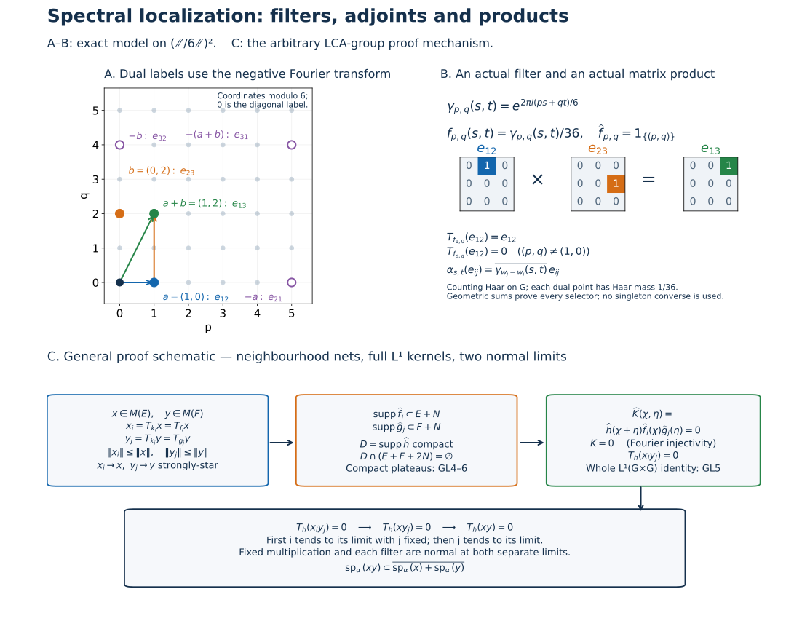

# Normal-action spectral localization on an arbitrary LCA group

Let \(G\) be an arbitrary locally compact Hausdorff abelian group, \(\Gamma=\widehat G\), and \(M\subset B(H)\) a von Neumann algebra on an arbitrary Hilbert space. Let \(\alpha_s\) be a group of ultraweakly continuous star automorphisms, with continuous scalar normal coefficients \(s\mapsto\varphi(\alpha_s(x))\).

The earlier [AT5 integrated-action theorem](OA-FLOW-AT.md#oa-flow.at.5) constructs ultraweakly continuous maps \(T_f\), \(f\in L^1(G)\), linear in \(f\), with \(\|T_f\|\leq\|f\|_1\) and

\[
 \varphi(T_f x)=\int_G f(s)\varphi(\alpha_s(x))\,dm(s).
 \tag{GL1}
\]
AT5 constructs these maps after proving predual norm continuity on arbitrary locally compact groups. The additional integration and product-topology passages needed below are proved here.

The earlier scalar inputs are [LF0–LF7](OA-FLOW-LF.md#lf-0), [HR-03/05/07](OA-FLOW-HR.md#hr-03), [L24's carriers, translations and vector integrals](OA-FLOW-L24.md#oa-flow.grp.haarconventions), [H1 Fourier injectivity](OA-FLOW-HARMONIC.md#l138-h1), and the complete [CF norm/Hilbert tools](OA-FLOW-CF.md#oa-flow.cf.1). Ultraweak topology has the concrete vector-series convention of [CP-01](OA-FLOW-CP.md#oa-flow.cp.1).

The Fourier transform is negative: \(\widehat f(\gamma)=\int f(s)\overline{\gamma(s)}\,dm(s)\). Thus an eigenoperator with action \(\alpha_s(x)=\overline{\gamma(s)}x\) has spectral label \(\gamma\). For \(G=\mathbb R\), an eigenphase \(e^{isr}\) has this chapter's label \(-r\). The earlier AL convention uses the positive scalar transform and label \(r\); the exact comparison is reflection of the label, with no change of the action.

## GL0. Integration laws and the product topology actually needed

Automorphisms are isometries: CF's star-homomorphism contractivity applied to an automorphism and its inverse gives both inequalities. In particular all orbit operators below have uniform norm bounds.

Normality permits passing an \(\alpha_r\) through (GL1). Haar substitution and the group law therefore give

\[
 \alpha_rT_f=T_f\alpha_r=T_{L_r f},
 \qquad L_r f(s)=f(s-r).
 \tag{GL2}
\]
For example testing the first expression on \(\varphi\) gives \(\int f(s)\varphi(\alpha_{r+s}(x))\,ds\), which equals both other expressions. Passing a second filter through the integral gives

\[
 T_fT_g=T_{f*g}.
 \tag{GL3}
\]
Its scalar double integral is bounded absolutely by
\(\|\varphi\|\|x\|\|f\|_1\|g\|_1\).
Choose Borel sigma compact representatives of \(f,g\). HR's qualified Radon-product Fubini and the measure-preserving shear \((s,t)\mapsto(s,s+t)\) identify the double integral with that of \(f*g\). No unrestricted product-Borel assertion occurs.

Adjoint conjugates the scalar integrator without reversing the group parameter:

\[
 (T_f x)^*=T_{\overline f}(x^*).
 \tag{GL4}
\]
Test on vector coefficients and conjugate (GL1); their separating property proves the identity. The adjoint operation is ultraweakly continuous by the same vector-series convention.

Here are the continuity details for multiplication and for later multiple integrals. A vector-series test has the form
\(\varphi(z)=\sum_n\langle z\xi_n,\eta_n\rangle\), with square-summable vector sequences. Fixed left/right multiplication is ultraweakly continuous: replace the vectors by \(b\xi_n,a^*\eta_n\) in \(\varphi(azb)\). These remain square summable. Linear combinations and restrictions to \(M\) preserve this assertion.

At every \(s_0\), every \(\xi\in H\) satisfies

\[
 \|(\alpha_s(x)-\alpha_{s_0}(x))\xi\|^2
 =\langle\alpha_s(x^*x)\xi,\xi\rangle
  +\|\alpha_{s_0}(x)\xi\|^2
  -2\operatorname{Re}\langle\alpha_s(x)\xi,\alpha_{s_0}(x)\xi\rangle
 \longrightarrow0.
 \tag{GL5}
\]
All coefficients are normal and continuous by assumption. Apply the same argument to \(x^*\). Thus each orbit is strongly-star continuous, with no separability premise.

If \(a_i\to a\), \(b_i\to b\) strongly-star and their norms are uniformly bounded, then

\[
 \|(a_i b_i-ab)\xi\|
 \leq\|a_i\|\|(b_i-b)\xi\|+\|(a_i-a)b\xi\|\longrightarrow0;
 \tag{GL6}
\]
apply the corresponding estimate to \(b_i^*a_i^*\) for the adjoints. Bounded strong convergence implies ultraweak convergence. Indeed each finite head of a vector-series test converges, and the tail, for operators of norm at most \(C\), is bounded uniformly by

\[
 C\left(\sum_{n>N}\|\xi_n\|^2\right)^{1/2}
   \left(\sum_{n>N}\|\eta_n\|^2\right)^{1/2}\longrightarrow0.
 \tag{GL7}
\]
Consequently \((s,t)\mapsto\varphi(\alpha_s(x)\alpha_t(y))\) is jointly continuous and bounded by \(\|\varphi\|\|x\|\|y\|\). The same is true after continuous substitutions in finitely many group parameters. This supplies Borel measurability for every product coefficient used later; separate ultraweak continuity alone was not substituted for this argument.

## GL1. Essentiality and a bounded compact-spectrum core

Let \(a_V\in C_c(G)_+\) be the mass-one shrinking-neighbourhood approximate identity of L24. For each \(\xi\), its vector integral is legitimate: the continuous orbit on the compact support has compact metric image, hence separable image, and is strongly measurable as in L24. Its integral equals \(T_{a_V}(x)\xi\), by testing every \(\eta\) in (GL1). Thus

\[
 \|(T_{a_V}x-x)\xi\|
 \leq\sup_{s\in V}\|(\alpha_s(x)-x)\xi\|\longrightarrow0.
 \tag{GL8}
\]
Apply this to \(x^*\), using (GL4) and the real integrator. This proves strong-star, hence ultraweak, convergence on every \(x\).

Let \(k_i=k_{V,\epsilon}\) be LF5's positive mass-one compact-frequency approximate identity. Its construction gives \(\|k_i-a_V\|_1<2\epsilon\). Therefore

\[
 \|T_{k_i}x\|\leq\|x\|,\qquad
 \|(T_{k_i}-T_{a_V})x\|\leq2\epsilon\|x\|,\qquad
 T_{k_i}x\longrightarrow x\quad\hbox{strongly-star}.
 \tag{GL9}
\]
The adjoints use (GL4) and positivity of \(k_i\). The index set is the LF5 shrinking-neighbourhood/positive-error directed set; there is no countable approximation assumption on \(G\) or \(H\). In particular \(T_f x=0\) for all \(f\) implies \(x=0\).

## GL2. Hull spectra, intersections, invariance and adjoints

Define

\[
 I_x=\{f\in L^1(G):T_f x=0\},\qquad
 \operatorname{sp}_\alpha(x)=h(I_x),\qquad
 M(E)=\{x:\operatorname{sp}_\alpha(x)\subset E\}
 \quad(E\subset\Gamma).
 \tag{GL10}
\]
Here \(h(I_x)\) is the character hull using the negative transform. \(I_x\) is a closed convolution ideal by (GL3) and the integrated norm bound. LF7 gives, for closed \(E\),

\[
 M(E)=\bigcap_{\widehat f=0\text{ on a neighbourhood of }E}\ker T_f.
 \tag{GL11}
\]
Thus \(M(E)\) is an ultraweakly closed linear space when \(E\) is closed. Empty spectrum implies \(T_f x=0\) for all \(f\) by LF6's empty-hull theorem, and hence \(x=0\) by GL1. Therefore \(M(\varnothing)=\{0\}\).

The elementary assertions for arbitrary subsets also hold:

\[
 E\subset F\Rightarrow M(E)\subset M(F),\qquad
 M\!\left(\bigcap_j E_j\right)=\bigcap_j M(E_j),\qquad
 M(\Gamma)=M.
 \tag{GL12}
\]
The empty intersection has the last convention. For linearity at an arbitrary \(E\), note
\(\operatorname{sp}_\alpha(x+y)\subset
\operatorname{sp}_\alpha(x)\cup\operatorname{sp}_\alpha(y)\).
Indeed, if a character is outside both hulls, choose \(f\in I_x\), \(g\in I_y\) whose transforms are nonzero there. Their convolution is in both ideals, hence annihilates \(x+y\), and its transform is nonzero there. Scalar multiplication gives equality of spectra for nonzero scalars, and the zero spectrum is empty. These prove linearity without assuming that \(E\) is closed. Ultraweak closedness is asserted for closed \(E\), not for every subset.

Equation (GL2) and its version for \(-s\) give \(I_{\alpha_s(x)}=I_x\). Equation (GL4) gives \(I_{x^*}=\{\overline f:f\in I_x\}\). Since
\(\widehat{\overline f}(\gamma)=\overline{\widehat f(-\gamma)}\), we obtain

\[
 \operatorname{sp}_\alpha(\alpha_s(x))=\operatorname{sp}_\alpha(x),
 \qquad
 \operatorname{sp}_\alpha(x^*)=-\operatorname{sp}_\alpha(x),
 \qquad
 \alpha_s(M(E))=M(E),\quad M(E)^*=M(-E).
 \tag{GL13}
\]
The equality of adjoint spaces follows by applying the involution twice.

## GL3. What a filter removes and what it retains

For every \(f\in L^1(G)\), \(x\in M\),

\[
 \operatorname{sp}_\alpha(x)\cap\{\widehat f\ne0\}
 \ \subset\ \operatorname{sp}_\alpha(T_f x)
 \ \subset\ \operatorname{sp}_\alpha(x)\cap\operatorname{supp}\widehat f.
 \tag{GL14}
\]
For the first upper inclusion, \(I_x\subset I_{T_f x}\) by commuting convolution filters. If \(\gamma\notin\operatorname{supp}\widehat f\), LF1 gives a compact Fourier plateau \(\widehat g\), equal to one at \(\gamma\), supported in its open complement. Then \(\widehat{g*f}=0\), and H1 injectivity gives \(g*f=0\). Hence \(g\in I_{T_f x}\), excluding \(\gamma\) from its hull. For the lower inclusion, if \(g\in I_{T_f x}\), then \(g*f\in I_x\). At a character in \(\operatorname{sp}_\alpha(x)\) where \(\widehat f\ne0\), this forces \(\widehat g=0\). This proves all of (GL14), including its precise zero-set distinction.

LF7 also gives

\[
 \widehat f=0\text{ near }\operatorname{sp}_\alpha(x)\Rightarrow T_f x=0,
 \qquad
 \widehat f=1\text{ near }\operatorname{sp}_\alpha(x)\Rightarrow T_f x=x.
 \tag{GL15}
\]
For the second assertion, every \(g\in L^1(G)\) has
\(\widehat{g-g*f}=\widehat g(1-\widehat f)\), zero near that spectrum. Thus
\(T_g(x-T_f x)=0\) for every \(g\), and GL1 proves the assertion.

Put \(K_i=\operatorname{supp}\widehat k_i\), a compact set. Equations (GL9) and (GL14) give the actual bounded core

\[
 x_i=T_{k_i}x,\qquad
 \operatorname{sp}_\alpha(x_i)\subset
       \operatorname{sp}_\alpha(x)\cap K_i,\qquad
 \|x_i\|\leq\|x\|,\qquad x_i\to x\text{ strongly-star}.
 \tag{GL16}
\]
These are compact-spectrum elements in the original algebra, with exact bounds and topology. No spectral measure for a Banach-space representation is assumed.

## GL4. Full closed-set localization by compact filters on neighbourhoods

For \(S\subset\Gamma\), let

\[
 R(S)=\overline{\operatorname{span}\{T_f z:
        z\in M,\ \operatorname{supp}\widehat f
        \text{ compact and contained in }S\}}^{\,\sigma\text{-weak}}.
 \tag{GL17}
\]
For every closed \(E\),

\[
 M(E)=\bigcap_N R(E+N),
 \tag{GL18}
\]
where \(N\) runs through compact symmetric identity neighbourhoods in \(\Gamma\).

First \(E+N\) is closed. At a point \(p\notin E+N\), the compact set \(p-N\) misses \(E\). For each \(n\in N\), choose neighbourhoods \(W_n\) of \(p\), \(U_n\) of \(n\), with \(W_n-U_n\subset\Gamma\setminus E\). Retain a finite cover of \(N\) by the \(U_n\) and intersect the corresponding \(W_n\). The resulting neighbourhood misses \(E+N\). Moreover \(\bigcap_N(E+N)=E\): if \(p\notin E\), choose a compact symmetric \(N\) so small that \(p+N\) misses \(E\). By GL3 and ultraweak closedness,
\(R(E+N)\subset M(E+N)\).
Taking intersections and (GL12) proves the inclusion from right to left in (GL18).

For the other inclusion, fix \(x\in M(E)\), \(N\), and one \(k_i\) from GL1. LF4 gives a compact Fourier plateau \(q_i\), equal to one on a neighbourhood of the compact set \(E\cap K_i\), with support inside the open set \(E+\operatorname{int}N\). Write \(q_i=\widehat g_i\).

The function \(\widehat k_i(1-q_i)\) vanishes on a neighbourhood of all of \(E\). On \(E\cap K_i\) use the open plateau neighbourhood; at every point of \(E\setminus K_i\) use \(\Gamma\setminus K_i\). Their union is an open neighbourhood of \(E\) on which that product is zero. LF7 therefore gives

\[
 T_{k_i}x=T_{k_i*g_i}x,\qquad
 \operatorname{supp}\widehat{k_i*g_i}
 \subset K_i\cap\operatorname{supp}q_i\subset E+N.
 \tag{GL19}
\]
The latter support is compact, so \(x_i\in R(E+N)\). Equation (GL16) and closedness give \(x\in R(E+N)\). Empty compact intersections use LF4's zero plateau and give the same argument. This proves (GL18).

The representation (GL19) preserves the norm bound \(\|x_i\|\leq\|x\|\), because its value is exactly \(T_{k_i}x\). A uniform \(L^1\) bound for the modified kernels \(k_i*g_i\) is not claimed or needed.

## GL5. A full-domain double convolution identity

For \(f,g,h\in L^1(G)\), define almost everywhere on \(G\times G\)

\[
 K(s,t)=\int_G h(r)f(s-r)g(t-r)\,dm(r).
 \tag{GL20}
\]
Choose Borel sigma compact representatives. Qualified Radon-product Fubini and the shears \((r,u,v)\mapsto(r,r+u,r+v)\) give

\[
 K\in L^1(G\times G),\qquad
 \|K\|_1\leq\|h\|_1\|f\|_1\|g\|_1,\qquad
 \widehat K(\chi,\eta)=\widehat h(\chi+\eta)\widehat f(\chi)\widehat g(\eta).
 \tag{GL21}
\]
The shears are compositions of HR-07's measure-preserving shears and retain sigma-finite carriers. Thus the absolute triple integral is finite and all interchanges and substitutions are licensed. Substituting \(s=r+u,t=r+v\) in the negative Fourier integral proves its sign and sum in (GL21).

The Radon product here is Haar measure on \(G\times G\). For a compact continuous test, HR-05's iterated-integral formula and invariance in each coordinate show invariance under every product translation. HR-02's uniqueness of the Radon measure representing those tests extends this identity to Borel sets. It is nonzero by testing the product of two nonzero positive compact bumps. Thus H1's Fourier injectivity applies to this actual product measure.

Every character of \(G\times G\) is \((s,t)\mapsto\chi(s)\eta(t)\): restrict it to the two coordinate copies of \(G\) and multiply those restrictions. Those restrictions are continuous characters, and their product is the original character by the group law. Thus (GL21) tests all characters, without an additional product-dual classification theorem.

For every normal \(\varphi\),

\[
 \varphi\!\left(T_h\big((T_f x)(T_g y)\big)\right)
 =\int_{G\times G}K(s,t)
       \varphi(\alpha_s(x)\alpha_t(y))\,d(m\widehat\times m)(s,t).
 \tag{GL22}
\]
To prove it, use (GL1) on \(T_h\), covariance on each factor, and then (GL1) on the two factors. Fixed multiplication is ultraweakly continuous by GL0, so each passage through an integral is valid. The result is the scalar triple integral
\[
 \iiint h(r)f(u)g(v)
       \varphi(\alpha_{r+u}(x)\alpha_{r+v}(y))\,dr\,du\,dv.
\]
GL0 proves joint continuity of its coefficient; its absolute value is bounded by
\(\|\varphi\|\|x\|\|y\||h(r)f(u)g(v)|\).
Use the same qualified Fubini and shears to obtain (GL22). No existence theorem for arbitrary operator-valued double integrals is being imported: the displayed scalar integral is identified with an already defined element on the left.

In particular if

\[
 \widehat h(\chi+\eta)\widehat f(\chi)\widehat g(\eta)=0
 \quad\text{for all }\chi,\eta,
 \tag{GL23}
\]
H1 Fourier injectivity on the LCA group \(G\times G\) gives \(K=0\). Equation (GL22) and separating vector coefficients then give
\(T_h((T_f x)(T_g y))=0\).
This is a whole \(L^1\)-domain statement, not a compact-integrator calculation without extension.

## GL6. Product spectral transfer for all closed spectral sets

For closed \(E,F\subset\Gamma\),

\[
 M(E)M(F)\subset M\!\left(\overline{E+F}\right).
 \tag{GL24}
\]
The statement concerns each product, and hence also its finite linear span. If \(E+F\) is closed, the closure in (GL24) can be omitted. In particular a compact set plus a closed set is closed by the argument of GL4.

**Proof.** Put \(S=\overline{E+F}\), take \(x\in M(E)\), \(y\in M(F)\), and fix \(\gamma_0\notin S\). LF1 gives \(\widehat h\) with compact support \(D\subset\Gamma\setminus S\) and \(\widehat h(\gamma_0)=1\).

Choose a compact symmetric identity neighbourhood \(N\) with \(D+N+N\subset\Gamma\setminus S\). The construction uses only compactness: multiplication continuity at the points of \(D\), a finite neighbourhood cover and an intersection give a common small identity neighbourhood whose two translates keep \(D\) inside that open set; shrink it to compact symmetric \(N\). Symmetry then implies

\[
 D\cap(E+F+N+N)=\varnothing.
 \tag{GL25}
\]
Indeed an intersection point \(d=e+f+n_1+n_2\) would give
\(e+f\in D-N-N=D+N+N\), contradicting its disjointness from \(S\).

Use GL4 to write the bounded cores \(x_i=T_{k_i}x\), \(y_j=T_{k_j}y\) as \(T_{f_i}x,T_{g_j}y\), with compact transform supports respectively in \(E+N,F+N\). Equation (GL25) gives (GL23) for \(h,f_i,g_j\), so
\(T_h(x_i y_j)=0\) for all indices.

Fix \(j\), pass \(x_i\to x\) ultraweakly using fixed multiplication and normality of \(T_h\), and obtain \(T_h(xy_j)=0\). Then pass \(y_j\to y\) in the same way, obtaining \(T_h(xy)=0\). These are two legitimate limits; joint ultraweak continuity of multiplication was not assumed. Since \(\widehat h(\gamma_0)=1\), this excludes \(\gamma_0\) from \(\operatorname{sp}_\alpha(xy)\). Every point outside \(S\) is excluded, proving (GL24). \(\square\)

For arbitrary \(x,y\), their spectra are closed; apply the theorem to those sets to obtain

\[
 \operatorname{sp}_\alpha(xy)\subset
 \overline{\operatorname{sp}_\alpha(x)+\operatorname{sp}_\alpha(y)}.
 \tag{GL26}
\]
For arbitrary subsets \(E,F\), the same conclusion with \(\overline{E+F}\) follows by applying (GL26) to the actual spectra. No synthesis assumption on either set appears.

## GL7. Action spectrum and the algebraic consequences at this scope

Let \(I_\alpha=\{f:T_f=0\}\) and \(\operatorname{sp}(\alpha)=h(I_\alpha)\). Then

\[
 \operatorname{sp}(\alpha)
 =\overline{\bigcup_{x\in M}\operatorname{sp}_\alpha(x)}.
 \tag{GL27}
\]
The inclusion from right to left follows from \(I_\alpha\subset I_x\). If a point is outside the displayed closed union, choose an LF1 compact plateau \(\widehat f\), nonzero there and supported in its complement. Its compact support misses each \(\operatorname{sp}_\alpha(x)\), so it vanishes on the open neighbourhood given by the support's complement. GL3 gives \(T_f x=0\) for every \(x\). Hence \(f\in I_\alpha\), excluding that point from \(h(I_\alpha)\), which proves equality.

If \(L\subset\Gamma\) is a closed subgroup, \(M(L)\) is an ultraweakly closed star subalgebra by GL2 and GL6. For nonzero \(M\) it contains the identity: \(\alpha_s(1)=1\), so \(T_f1=\widehat f(0)1\), and LF1 separates any other character from zero to prove \(\operatorname{sp}_\alpha(1)=\{0\}\).

More generally the directly given relation \(\alpha_s(x)=\overline{\gamma(s)}x\), \(x\ne0\), implies \(\operatorname{sp}_\alpha(x)=\{\gamma\}\). Equation (GL1) gives \(T_fx=\widehat f(\gamma)x\); LF1 separates every other point by an annihilating plateau. The converse singleton statement is not asserted here. In particular no identification of \(M(\{0\})\) with the fixed algebra is inferred from an unproved singleton-synthesis theorem.

## GL8. An exact two-coordinate example

Let \(G=(\mathbb Z/6\mathbb Z)^2\), with counting measure. Its characters are
\(\gamma_{p,q}(s,t)=e^{2\pi i(ps+qt)/6}\), \(p,q\) modulo six. To check that these are all characters, the images of the two generators are sixth roots of unity, and determine the character. Its paired dual Haar mass is \(1/36\), by the product of the two elementary finite geometric sums.

On \(M_3(\mathbb C)\), put

\[
 U_{s,t}=\operatorname{diag}
  \left(1,e^{2\pi is/6},e^{2\pi i(s+2t)/6}\right),
 \qquad \alpha_{s,t}=\operatorname{Ad}U_{s,t}.
 \tag{GL28}
\]
The integrated action is the actual finite sum \(T_fx=\sum_{s,t}f(s,t)\alpha_{s,t}(x)\); its normality and norm bound are immediate from the finite sum and the finite-dimensional weak topology. Thus the integrated-action theorem is also checked directly for this example.

The matrix-unit calculation gives

\[
 \alpha_{s,t}(e_{12})=\overline{\gamma_{1,0}(s,t)}e_{12},\qquad
 \alpha_{s,t}(e_{23})=\overline{\gamma_{0,2}(s,t)}e_{23},\qquad
 e_{12}e_{23}=e_{13},\qquad
 \alpha_{s,t}(e_{13})=\overline{\gamma_{1,2}(s,t)}e_{13}.
 \tag{GL29}
\]
GL7's one-way eigenoperator calculation therefore gives exact singleton spectra \((1,0),(0,2),(1,2)\) respectively. Their adjoints have the negatives of these labels. This displays the product sum and the adjoint reflection with both coordinates present.

For a dual label \((p,q)\), the exact selector

\[
 f_{p,q}(s,t)=\frac1{36}\gamma_{p,q}(s,t),\qquad
 \widehat f_{p,q}(u,v)=1_{\{(p,q)\}}(u,v)
 \tag{GL30}
\]
follows by the two geometric sums. Applied to \(e_{12}\), its filter returns \(e_{12}\) at \((p,q)=(1,0)\) and zero at all other labels. This is an actual filter calculation, independent of a singleton-synthesis converse.

Compare Arveson, [*On groups of automorphisms of operator algebras*](https://www.isibang.ac.in/~soumyashant/misc/collected-works-of-arveson/1970s/1974_On_groups_of_automorphisms_of_operator_algebras.pdf), J. Funct. Anal. 15 (1974), Definition 2.1, Proposition 2.2 and the triple-integral mechanism of Theorem 2.3. The present proof uses the complete LF local ideal results and supplies the product-kernel and normal-action topology arguments locally. General Banach-operator-space transfer, singleton synthesis and Connes-spectrum/cohomology theorems are separate obligations.

The original exposition and illustration/reproduction sources of this chapter are CC0.

## Filters, adjoints and product transfer

Panels A–B are the exact example of [GL8](OA-FLOW-GL.md#gl-8). The group is \(G=(\mathbb Z/6\mathbb Z)^2\), with counting Haar measure. Its dual labels are \((p,q)\) modulo six, and each dual point has Haar mass \(1/36\). Indeed each character is determined by the sixth-root images of the two generators, and the two finite geometric sums give
\[
 \sum_{s,t=0}^{5}\gamma_{p,q}(s,t)
       \overline{\gamma_{u,v}(s,t)}
 =36\,1_{\{(p,q)=(u,v)\}}.
\]
For a nontrivial sixth root \(z\), multiplication of \(1+z+\cdots+z^5\) by \(1-z\) gives \(1-z^6=0\), so that sum is zero; for \(z=1\) the sum is six. Apply this in the two coordinates to obtain the displayed identity. This is the exact normalization and orthogonality calculation, rather than a numerical convention.

For \(w_1=(0,0)\), \(w_2=(1,0)\), \(w_3=(1,2)\), the diagonal unitaries of (GL28) give
\[
 \alpha_{s,t}(e_{ij})
 =\gamma_{w_i-w_j}(s,t)e_{ij}
 =\overline{\gamma_{w_j-w_i}(s,t)}e_{ij}.
\]
The negative Fourier transform therefore labels \(e_{12}\) by \(a=(1,0)\), \(e_{23}\) by \(b=(0,2)\), and their actual nonzero matrix product \(e_{13}=e_{12}e_{23}\) by \(a+b=(1,2)\). The arrows in panel A depict this addition in the finite dual group. The outlined points label the adjoints \(e_{21},e_{32},e_{31}\), with negatives \((5,0),(0,4),(5,4)\). The origin labels the three diagonal matrix units. The plotted grid is a choice of residues, with all operations performed modulo six.

Panel B shows the three actual matrices, with every entry indicated. For the selector \(f_{p,q}=\gamma_{p,q}/36\), the same geometric sums prove \(\widehat f_{p,q}=1_{\{(p,q)\}}\). Thus the integrated filter returns \(e_{12}\) exactly at \((p,q)=(1,0)\) and returns zero at every other label. The finite integrated map is the sum of the 36 action values multiplied by \(f\), so it is normal and has norm at most \(\|f\|_1\). These calculations do not use the converse singleton-spectrum theorem.

Panel C is a schematic of the arbitrary-group proof in [GL4–GL6](OA-FLOW-GL.md#gl-4), not a reduction to the finite example. Start with \(x\in M(E)\), \(y\in M(F)\) for arbitrary closed spectral sets. The LF5 positive mass-one kernels give nets \(x_i=T_{k_i}x\), \(y_j=T_{k_j}y\), with their original norm bounds and strong-star convergence. GL4 supplies alternative kernels \(f_i,g_j\) with compact transform supports in \(E+N,F+N\), and exactly the same values. No uniform \(L^1\) bound for these alternative kernels is asserted.

A point outside \(\overline{E+F}\) admits an LF1 separating filter \(h\), whose compact transform support \(D\) is disjoint from that closed sum. Compactness permits one symmetric compact identity neighbourhood \(N\) for which \(D+N+N\) still misses the sum. Equivalently \(D\cap(E+F+2N)=\varnothing\). The label \(2N\) means the set sum \(N+N\), not a scalar dilation in a vector space.

For these filters, GL5 constructs the actual \(L^1(G\times G)\) kernel
\[
 K(s,t)=\int_G h(r)f_i(s-r)g_j(t-r)\,dm(r),
 \qquad
 \widehat K(\chi,\eta)
 =\widehat h(\chi+\eta)\widehat f_i(\chi)\widehat g_j(\eta)=0.
\]
The norm bound is \(\|K\|_1\leq\|h\|_1\|f_i\|_1\|g_j\|_1\). Qualified Radon-product integration on sigma compact carriers licenses the whole integral and its shears; Fourier injectivity on the actual product Haar measure makes \(K=0\). Its scalar coefficient identity then gives \(T_h(x_i y_j)=0\).

Finally fix \(j\) and take the normal limit in \(i\), then take the normal limit in \(j\). Fixed multiplication and \(T_h\) are ultraweakly continuous, giving \(T_h(xy)=0\). The separating filter excludes the original outside point and proves the spectral inclusion in the final box. The two displayed limits are separate; joint ultraweak continuity of multiplication is not assumed. The construction uses neighbourhood nets, arbitrary Hilbert spaces and arbitrary closed sets, without singleton or general closed-set synthesis.

Compare Arveson, [*On groups of automorphisms of operator algebras*](https://www.isibang.ac.in/~soumyashant/misc/collected-works-of-arveson/1970s/1974_On_groups_of_automorphisms_of_operator_algebras.pdf), J. Funct. Anal. 15 (1974), Definition 2.1, Proposition 2.2 and the multiple-integral argument in Theorem 2.3. The complete local arguments and precise sign convention are (GL1)–(GL30). The figure, caption, exact data and reproduction code are original CC0 material.
