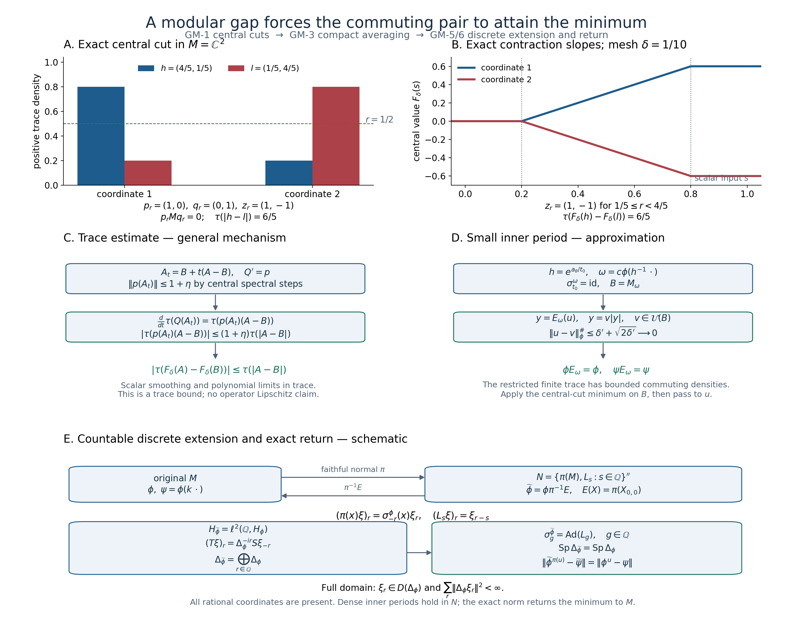

# Modular spectral gaps and the minimum distance between commuting functionals

*Original reconstruction. CC0-1.0 to the extent of rights held.*

Let \(M\) be a von Neumann algebra, let \(\phi\) be a faithful normal state, and let \(k\) belong to its centralizer with \(a1\leq k\leq b1\), where \(0

\[
 \operatorname{Sp}(\Delta_\phi)\cap(a/b,b/a)=\{1\}.
 \tag{GM1}
\]
We prove that every unitary \(u\) in \(M\) satisfies

\[
 \|\phi^u-\psi\|\geq\|\phi-\psi\|,
 \qquad\phi^u(x)=\phi(u^*xu).
 \tag{GM2}
\]
The identity unitary attains equality. No factoriality or separability of the Hilbert space is assumed. We also explain why invariance of a normal positive \(\psi\) under \(\sigma^\phi\), together with \(a\phi\leq\psi\leq b\phi\), produces precisely such a \(k\).

The free development source is the complete freely readable 26-page Connes–Haagerup–Størmer research article [Diameters of state spaces of type III factors, Theorem 3.1 and its proof, manuscript pp.10–24](http://cm2vivi2002.free.fr/AC-biblio/AC-biblio69.pdf). The finite-algebra proof below replaces the source's structural reduction by central spectral cuts and elementary trace differentiation. The remaining reductions are proved on the actual Hilbert spaces. Earlier proofs used below are central supports and projection comparison, normed and Hilbert space tools, [scalar convergence](OA-FLOW-SC.md#sc-05), [complete spectral calculus](OA-FLOW-SF.md#oa-flow.sf1.spectral-calculus), faithful weight GNS and modular domains, [the finite-state KMS identity](OA-FLOW-KT.md#kt-3), [modular uniqueness](OA-FLOW-KU.md#ku-3), [centralizer perturbation](OA-FLOW-CZ.md#oa-flow.cz.4), [bounded phase and compact averaging](OA-FLOW-PW.md#oa-flow.pw.2), [normality and the concrete predual](OA-FLOW-CP.md#oa-flow.cp.6), [normal faithful GNS](OA-FLOW-NF.md#oa-flow.nf.5), [arbitrary Hilbert sums](OA-FLOW-GNS.md#gns-lemma-7-1), and [uniqueness of the full selfadjoint generator](OA-FLOW-RF.md#oa-flow.rf.5).

## GM-1. Finite trace with bounded commuting densities

Let \(\tau\) be a faithful normal finite trace on \(M\). Let \(h\) and \(l\) be commuting bounded positive invertible elements, with \(ah\leq l\leq bh\). Set \(\phi_0=\tau(h\,\cdot)\). Assume the gap (GM1) for \(\Delta_{\phi_0}\). We first prove

\[
 \tau(|uhu^*-l|)\geq\tau(|h-l|)\qquad(u\in\mathcal U(M)).
 \tag{GM3}
\]
No existence of a trace is asserted: \(\tau\) is part of this lemma's hypotheses.

The trace GNS space has dense vectors \(\Lambda_\tau(x)\), \(x\in M\), and left and right multipliers \(L_c\Lambda_\tau(x)=\Lambda_\tau(cx)\), \(R_c\Lambda_\tau(x)=\Lambda_\tau(xc)\). Positivity and the trace identity show their norms are at most \(\|c\|\). The map \(V\Lambda_{\phi_0}(x)=\Lambda_\tau(xh^{1/2})\) is an onto isometry, since \(h^{-1/2}\) is bounded. On this space the complete finite-star involution is

\[
 S\Lambda_\tau(y)=\Lambda_\tau(h^{-1/2}y^*h^{1/2})
   =J_\tau L_{h^{1/2}}R_{h^{-1/2}}\Lambda_\tau(y),
 \qquad V\Delta_{\phi_0}V^*=L_hR_{h^{-1}}.
 \tag{GM4}
\]
All operators here are bounded and everywhere defined. Indeed \(J_\tau\Lambda_\tau(y)=\Lambda_\tau(y^*)\) is an antiunitary because \(\tau\) is tracial; the displayed expression gives the involution on a dense set and its bounded extension. Taking its adjoint product proves (GM4), including the full domain.

For \(r>0\) put \(P_r=1_{(r,\infty)}(h)\), \(Q_r=1_{(r,\infty)}(l)\), \(p_r=P_r(1-Q_r)\), \(q_r=(1-P_r)Q_r\). The projections commute. For \(\varepsilon>0\) truncate them to

\[
 p_{r,\varepsilon}=1_{[r+\varepsilon,\infty)}(h)1_{[0,r]}(l),
 \qquad q_{r,\varepsilon}=1_{[0,r]}(h)1_{[r+\varepsilon,\infty)}(l).
 \tag{GM5}
\]
On \(p\)'s range, \(r+\varepsilon\leq h\leq r/a\); on \(q\)'s range, \((r+\varepsilon)/b\leq h\leq r\). The projection \(L_pR_q\) on the trace GNS space reduces \(L_hR_{h^{-1}}\). On that subspace its lower and upper bounds are

\[
 (r+\varepsilon)/r\quad\hbox{and}\quad rb/(a(r+\varepsilon)),
 \tag{GM6}
\]
respectively. To multiply these bounds, subtract their positive lower bounds and use commutativity of \(L_h\) and \(R_{h^{-1}}\); the product of commuting positive operators is positive by its square-root expression. The interval in (GM6), if nonempty, is a compact subset of \((1,b/a)\). The spectral gap and the full spectral calculus therefore force this reducing subspace to be zero. Any \(x\in pMq\) would have \(\Lambda_\tau(x)\) in it, so \(\tau(x^*x)=0\) and \(x=0\). As \(\varepsilon\) decreases to zero, \(p_{r,\varepsilon}\) and \(q_{r,\varepsilon}\) increase strongly to \(p_r\) and \(q_r\). Bounded strong multiplication gives \(p_rMq_r=0\).

Consequently \(c(p_r)c(q_r)=0\), where \(c\) is central support. Here is the precise implication: \(pMq=0\) makes \(p\) orthogonal to \(vqv^*\) for every unitary \(v\); hence \(p\,c(q)=0\) by PC's join description of central support, and then \(c(p)c(q)=0\) because \(c(q)\) is central. Thus

\[
 z_r=c(p_r)-c(q_r)\in Z(M),\qquad z_r=z_r^*,\quad\|z_r\|\leq1,
 \qquad z_r(P_r-Q_r)=|P_r-Q_r|.
 \tag{GM7}
\]
At \(r=0\) set \(z_0=0\); both \(P_0\) and \(Q_0\) are the identity.

Choose \(R\) larger than both norms and partition \([0,R]\) with a uniform mesh \(\delta=R/N\), \(r_j=j\delta\). Define the central-coefficient continuous function

\[
 F_\delta(s)=\sum_{j=0}^{N-1}z_{r_j}
       \big((s-r_j)_+-(s-r_{j+1})_+\big).
 \tag{GM8}
\]
It is constant outside \([0,R]\) and has, away from the finitely many mesh points, derivative \(z_{r_j}\) on \((r_j,r_{j+1})\). For a selfadjoint \(A\) with spectrum in \([0,R]\), this formula defines \(F_\delta(A)\) using the proved continuous functional calculus and central coefficients.

We need its trace Lipschitz bound, not an operator Lipschitz assertion. Extend \(F_\delta\) to the whole real line as above and convolve in the scalar variable with a nonnegative smooth kernel of integral one supported in \([-\eta,\eta]\). Since \(\|F_\delta(s)-F_\delta(t)\|\leq|s-t|\), the smoothed function differs from \(F_\delta\) uniformly by at most \(\eta\). Its derivative \(g_\eta\) is a convex combination, with possibly additional zero weight, of the selfadjoint central contractions \(z_{r_j}\); hence \(\|g_\eta(s)\|\leq1\). It is a finite sum of central coefficients times scalar continuous functions. Approximate those scalar functions uniformly on \([0,R]\) by real polynomials, obtaining a central selfadjoint polynomial \(p\) with \(\|p(s)-g_\eta(s)\|\leq\eta\). Its integral \(Q\) satisfies \(\|Q(s)-(F_\eta(s)-F_\eta(0))\|\leq R\eta\).

For selfadjoint \(A\),\(B\) in \([0,R]\), put \(D=A-B\) and \(A_t=B+tD\). Cyclicity of \(\tau\), and commutation of every polynomial coefficient with \(M\), give by differentiating each finite monomial

\[
 \frac d{dt}\tau(Q(A_t))=\tau(p(A_t)D).
 \tag{GM9}
\]
Here is the required norm bound for substitution with central coefficients. For a bounded selfadjoint \(A\) in \([0,R]\), take finite spectral step approximants \(A_n=\sum_l s_l e_l\) converging in norm to \(A\), where the \(e_l\) are orthogonal spectral projections with sum \(1\). For any finite central-coefficient polynomial \(p\), centrality gives \(p(A_n)=\sum_l p(s_l)e_l\). Each range \(e_lH\) reduces every coefficient, so the squared norm on orthogonal ranges gives \(\|p(A_n)\|\leq\sup_{s\in[0,R]}\|p(s)\|\). Polynomial norm continuity passes this inequality to \(p(A)\). More generally a finite sum of central coefficients times scalar continuous functions has the same property: uniform continuity of each scalar function makes its step substitutions converge in norm. Apply this observation also to the differences between the central-valued approximants in the preceding paragraph. It proves \(\|p(A_t)\|\leq1+\eta\) and all the claimed operator-norm error bounds. For any selfadjoint \(C\) and \(D\), positivity applied to \(D_+\) and \(D_-\) gives \(|\tau(CD)|\leq\|C\|\tau(|D|)\); explicitly \(\tau(CD_\pm)=\tau(D_\pm^{1/2}CD_\pm^{1/2})\) and \(-\|C\|D_\pm\leq D_\pm^{1/2}CD_\pm^{1/2}\leq\|C\|D_\pm\). Integration of (GM9), followed by \(\eta\to0\), proves

\[
 |\tau(F_\delta(A)-F_\delta(B))|\leq\tau(|A-B|).
 \tag{GM10}
\]
All approximations are uniform in operator norm, so finiteness of \(\tau\) justifies their trace limits.

Since the coefficients are central, \(F_\delta(uhu^*)=uF_\delta(h)u^*\), and \(\tau\) is invariant under that conjugation. The scalar step approximation \(H_\delta=\delta\sum_jP_{r_j}\) differs from \(h\) by at most \(\delta\) in norm; similarly \(K_\delta=\delta\sum_jQ_{r_j}\) differs from \(l\) by at most \(\delta\). Because \(h\) and \(l\) commute, finite common spectral partitions give

\[
 \delta\sum_j|P_{r_j}-Q_{r_j}|=|H_\delta-K_\delta|,
 \qquad\big\||H_\delta-K_\delta|-|h-l|\big\|\leq2\delta.
 \tag{GM11}
\]
The last estimate is the scalar absolute-value inequality on the commuting algebra, obtained by uniform approximation by finite common spectral partitions. On each spectral value of \(h\), all terms in \(F_\delta(h)-\delta\sum_jz_{r_j}P_{r_j}\) vanish except possibly the single mesh interval containing that value; this remaining coefficient has norm at most \(\delta\). Centrality and the orthogonality of the spectral intervals give the same operator-norm bound. The corresponding bound holds for \(l\). By (GM7) and (GM11),

\[
 \tau(F_\delta(h)-F_\delta(l))\geq\tau(|h-l|)-4\delta\tau(1).
 \tag{GM12}
\]
Apply (GM10) to \(A=uhu^*\), \(B=l\), use trace invariance of \(F_\delta(h)\), and let \(\delta\to0\). This proves (GM3). The norm of the normal selfadjoint functional \(\tau(d\,\cdot)\) is \(\tau(|d|)\): the upper bound follows from the trace Cauchy–Schwarz inequality applied to \(|d|^{1/2}\) and the bounded test operator; the selfadjoint contraction \(\operatorname{sign}(d)\) attains it. Thus (GM3) is exactly the functional-norm minimum assertion in this finite-trace situation.

## GM-2. A bounded centralizer density from domination and invariance

Suppose \(\psi\) is a normal positive functional, \(a\phi\leq\psi\leq b\phi\), and \(\psi\circ\sigma_t^\phi=\psi\). On the state GNS space define the positive form

\[
 B(\Lambda_\phi(x),\Lambda_\phi(y))=\psi(y^*x).
 \tag{GM13}
\]
Its quadratic values lie between \(a\) and \(b\) times the GNS norm square. Polarization and Cauchy–Schwarz give a unique bounded positive operator \(T\) with \(aI\leq T\leq bI\) representing \(B\). For \(c\in M\) the identity \(\psi(y^*cx)=\psi((c^*y)^*x)\) proves \(T\pi(c)=\pi(c)T\). Invariance under \(\sigma^\phi\) proves \(TU_t=U_tT\), where \(U_t=\Delta_\phi^{it}\). Set \(k=J_\phi TJ_\phi\). The proved commutation theorem places \(k\) in \(M\), and the modular relations place it in \(M_\phi\); \(a1\leq k\leq b1\).

Because \(\Omega_\phi\) is fixed by \(J_\phi\) and \(\Delta_\phi\), and \(k\) is in the centralizer, the full Tomita identity gives \(J_\phi k\Omega_\phi=k\Omega_\phi\). Consequently \(T\Omega_\phi=k\Omega_\phi\) and, with inner products linear in the first variable,

\[
 \psi(x)=\langle T\Lambda_\phi(x),\Omega_\phi\rangle
        =\langle\Lambda_\phi(x),k\Omega_\phi\rangle
        =\phi(kx).
 \tag{GM14}
\]
This proves the needed density statement without an external Radon–Nikodym theorem.

## GM-3. A small inner period gives finite-centralizer approximation

Assume for this section that the set of \(t\) for which \(\sigma_t^\phi\) is inner is dense in \(\mathbb R\). We prove that for each unitary \(u\) and each \(\varepsilon>0\) there is a faithful normal state \(\omega\) obtained from \(\phi\) by a bounded positive invertible density in \(Z(M_\phi)\), such that \(u\) is within \(\varepsilon\) in the norm

\[
 \|x\|_\phi^\#=\big(\tfrac12\phi(x^*x+xx^*)\big)^{1/2}
 \tag{GM15}
\]
of a unitary \(v\in M_\omega\). Moreover \(M_\phi\subseteq M_\omega\), and the compact expectation \(E_\omega\) preserves \(\phi\) and \(\psi=\phi(k\,\cdot)\).

Choose \(\delta>0\). Strong continuity of the modular unitary on \(\Omega_\phi\) and the finite-star GNS vectors implies \(\|\sigma_t^\phi(u)-u\|_\phi^\#<\delta\) on a sufficiently short interval about zero. Choose a positive inner period \(t_0\) in that interval and a unitary \(w\) implementing \(\sigma_{t_0}^\phi\). CZ0 gives \(w\in Z(M_\phi)\). In particular \(\|wu-uw\|_\phi^\#<\delta\).

We require a branch of its phase with a controlled commutator. For \(\theta\in[0,2\pi)\), let \(A_\theta(z)\) be the argument of \(z\) in \([\theta,\theta+2\pi)\), and set \(a_\theta=A_\theta(w)\). Then

\[
 \int_0^{2\pi}\|a_\theta u-u a_\theta\|_\phi^{\#,2}\,
                 \frac{d\theta}{2\pi}
 \leq 2\pi\|wu-uw\|_\phi^\#\,\|u\|_\phi^\#.
 \tag{GM16}
\]
Here are the scalar and spectral details. First let \(w=\sum_i\zeta_i e_i\) have finite spectrum with \(e_i\in M_\phi\). The spaces \(e_iMe_j\) are mutually orthogonal for the inner product belonging to (GM15): the mixed terms vanish by \(e_ie_k=0\) or \(e_je_l=0\) and by \(\phi(ez)=\phi(ze)\) for centralizer projections. Their squared norms on \(u\) sum to \(\|u\|_\phi^{\#,2}\). If \(\zeta_i/\zeta_j=e^{is}\), \(0\leq s\leq2\pi\), then the argument difference has absolute values \(s\) and \(2\pi-s\) on arcs of relative lengths \(1-s/(2\pi)\) and \(s/(2\pi)\). Its mean square is \(s(2\pi-s)\). The elementary inequality \(s(2\pi-s)\leq4\pi\sin(s/2)=2\pi|\zeta_i-\zeta_j|\) follows, for example, by differentiating the difference and using concavity of cosine on \([0,\pi/2]\) and reflection about \(\pi\). Applying scalar Cauchy–Schwarz to the finite orthogonal sum proves (GM16).

For general \(w\) choose finite Borel step unitaries \(w_n=f_n(w)\) with \(\|w_n-w\|\to0\) and \(f_n(z)\to z\). For almost every \(\theta\), \(a_\theta(w_n)\to a_\theta(w)\) strongly on the finitely many vectors required to compute the two GNS terms in (GM15). Indeed \(a_\theta\circ f_n\to a_\theta\) except at the single cut \(e^{i\theta}\); each of those finitely many scalar spectral measures has only countably many atoms, and the bounded spectral DCT applies at every other cut. The norms of the phase commutators are uniformly bounded by \(8\pi\|u\|_\phi^\#\). Scalar dominated convergence gives (GM16). Thus one \(\theta\) satisfies \(\|[a_\theta,u]\|_\phi^{\#,2}\leq2\pi\delta\); an arbitrarily small additional tolerance can be used if the infimum is not attained. Fix such \(a=a_\theta\).

Put \(h=e^{a/t_0}\) and normalize \(\omega=\phi(h^{-1}\,\cdot)/\phi(h^{-1})\). CZ proves on the whole algebra that \(\sigma_t^\omega=h^{-it}\sigma_t^\phi(\,\cdot\,)h^{it}\); since \(h^{it_0}=w\), this group has period \(t_0\). PW gives the faithful normal compact expectation \(E_\omega\) onto \(M_\omega\) and the finite trace \(\omega|_{M_\omega}\). Since \(h\in Z(M_\phi)\), \(M_\phi\subseteq M_\omega\). Both \(\sigma^\phi\) and conjugation by \(h^{it}\) preserve \(\phi\), so \(\phi\circ E_\omega=\phi\) by ordinary bounded scalar integration. Bimodularity and \(k\in M_\phi\subseteq M_\omega\) then give \(\psi\circ E_\omega=\psi\).

For \(0\leq t\leq t_0\), the norm-integral identity for the bounded generator \(a\) yields

\[
 \|\sigma_t^\omega(u)-u\|_\phi^\#
 \leq (t/t_0)\|au-ua\|_\phi^\#+\|\sigma_t^\phi(u)-u\|_\phi^\#
 \leq\sqrt{2\pi\delta}+\delta
 \tag{GM17}
\]
up to the arbitrary phase tolerance. Left and right multiplication by a centralizer unitary, as well as \(\sigma^\phi\), are isometries for (GM15); this justifies the integral estimate in that norm. Hence \(y=E_\omega(u)\) is a contraction in \(M_\omega\) with \(\|y-u\|_\phi^\#\leq\delta'=\sqrt{2\pi\delta}+\delta\).

The polar partial isometry of \(y\) extends to a unitary \(v\) in \(M_\omega\). For clarity, this uses only the supplied faithful finite trace \(\omega|_{M_\omega}\) and PC comparison. Equivalent initial/final projections \(p\),\(q\) have equal trace after every central compression. Comparison of their complements gives a central split with one complement subequivalent to the other on each part. The trace of the unmatched remainder is zero on each part, hence it is zero by faithfulness. The complementary projections are therefore equivalent and their partial isometry completes the polar one.

Since \(y=v|y|=|y^*|v\), positivity and \((1-s)^2\leq1-s^2\) on \([0,1]\) imply

\[
 \|v-y\|_\phi^{\#,2}
 \leq1-\|y\|_\phi^{\#,2}\leq2\delta'
 \quad(\delta'\leq1).
 \tag{GM18}
\]
Thus \(\|v-u\|_\phi^\#\leq\delta'+\sqrt{2\delta'}\), which tends to zero with \(\delta\). This proves the required approximation.

## GM-4. The minimum when inner modular periods are dense

Use the \(\omega\),\(v\) supplied by [GM-3](#oa-flow.gm.3), and put \(B=M_\omega\) and \(\tau=\omega|_B\). The latter is a faithful normal finite trace. Since \(\omega=c\phi(h^{-1}\,\cdot)\), \(\phi|_B=\tau(c^{-1}h\,\cdot)\), and \(\psi|_B=\tau(c^{-1}hk\,\cdot)\). The two densities are bounded, invertible and commuting, because \(h\in Z(M_\phi)\), \(k\in M_\phi\subseteq B\). They satisfy the same bounds \(a\) and \(b\).

The action \(\sigma^\phi\) preserves \(B\): its formula commutes with \(\sigma^\omega\) because \(h\) is fixed by \(\sigma^\phi\). The restricted action preserves \(\phi|_B\) and satisfies its full finite-state KMS identity by restricting the already proved bounded strip identity on \(M\). KU therefore identifies it as the modular group of \(\phi|_B\). Its GNS space identifies with the closed subspace \(\overline{B\Omega_\phi}\) of \(H_\phi\); that subspace reduces every \(\Delta_\phi^{it}\), and the restricted modular unitaries are the restrictions there. RF5's complete generator-uniqueness proof applied to these identical strongly continuous unitary groups identifies their full selfadjoint generators, including domains, as the restriction of \(\log\Delta_\phi\). SF's full exponential functional calculus then identifies \(\Delta_{\phi|_B}\) as the restricted positive modular operator, with its entire domain. Its spectrum is contained in \(\operatorname{Sp}\Delta_\phi\): outside the latter spectrum, the bounded spectral resolvent restricts to the reducing subspace and is the full inverse. Thus the same gap holds on \(B\).

[GM-1](#oa-flow.gm.1) applies to the two bounded trace densities on \(B\) and the unitary \(v\). Because \(E_\omega\) is a unital positive projection onto \(B\) and preserves \(\phi\) and \(\psi\), it has norm one, and

\[
 \|\phi-\psi\|=\|\phi|_B-\psi|_B\|,
 \qquad\|\phi^v-\psi\|\geq\|\phi|_B^v-\psi|_B\|.
 \tag{GM19}
\]
The first equality follows from composition with \(E_\omega\) in one direction and restriction in the other. Consequently \(\|\phi^v-\psi\|\geq\|\phi-\psi\|\). Finally, for unitaries \(u\),\(v\) and \(\|x\|\leq1\), expansion of \(u^*xu-v^*xv\) and the state Cauchy–Schwarz inequality gives \(\|\phi^u-\phi^v\|\leq2\phi((u-v)^*(u-v))^{1/2}\leq2\sqrt2\|u-v\|_\phi^\#\). Let the approximation tolerance tend to zero. This proves (GM2) under the dense-inner-period hypothesis.

## GM-5. A countable discrete modular extension, with its full state GNS

Let \(G=\mathbb Q\) as an additive discrete group. On \(K=\ell^2(G,H_\phi)\) define

\[
 (\pi(x)\xi)_r=\sigma_{-r}^\phi(x)\xi_r,
 \qquad(L_s\xi)_r=\xi_{r-s},
 \qquad N=\{\pi(M),L_s:s\in G\}''.
 \tag{GM20}
\]
The complete Hilbert sum is the earlier GNS direct-sum construction. The map \(\pi\) is a faithful normal representation; normality follows on arbitrary square-summable vector coefficients by finite truncation and normality of each \(\sigma_{-r}\).

Every entry \(X_{r,s}\) of \(X\in N\) belongs to \(M\), and

\[
 X_{r+g,s+g}=\sigma_{-g}^\phi(X_{r,s}).
 \tag{GM21}
\]
To check this without a density assertion, all bounded arrays with entries in \(M\) form the von Neumann algebra commuting with the diagonal action of \(M'\); the generators in (GM20) lie in it. Also \(N\) commutes with the unitaries \((V_g\xi)_r=\Delta_\phi^{-ig}\xi_{r-g}\); this is checked directly on \(\pi(x)\) and \(L_s\). Their commutation is exactly (GM21), since \(\Delta_\phi\) implements \(\sigma^\phi\) on \(M\).

Set \(E(X)=\pi(X_{0,0})\). Entry compression is normal completely positive, so \(E\) is a normal unital completely positive map into \(\pi(M)\), fixes \(\pi(M)\), and is bimodular there. It is faithful: if \(X\geq0\) and \(X_{0,0}=0\), then all diagonal entries vanish by (GM21), and \(\|X^{1/2}(\delta_r\otimes\eta)\|^2=0\) for every \(r\),\(\eta\); these vectors span a dense subspace. Put \(\widetilde\phi=\phi\circ\pi^{-1}\circ E\) and \(\widetilde\psi=\psi\circ\pi^{-1}\circ E\). Then \(\widetilde\phi\) is a faithful normal state, and \(a\widetilde\phi\leq\widetilde\psi\leq b\widetilde\phi\).

The vector \(\widetilde\Omega=\delta_0\otimes\Omega_\phi\) represents \(\widetilde\phi\). It is cyclic because \(L_s\pi(x)\widetilde\Omega=\delta_s\otimes x\Omega_\phi\), whose span is dense; faithfulness makes it separating. We identify the complete Tomita operator, not only its finite-coordinate part. Let \(S\) be the full Tomita operator for \(\phi\). On \(K\) define the closed antilinear operator

\[
 (T\xi)_r=\Delta_\phi^{-ir}S\xi_{-r},\qquad
 \mathcal D(T)=\{\xi:\xi_r\in\mathcal D(S),\ 
                         \sum_r\|S\xi_r\|^2<\infty\}.
 \tag{GM22}
\]
Closedness follows coordinatewise followed by the square-summable output condition. For \(X\in N\), write \(x_r=X_{r,0}\in M\). Then \((X\widetilde\Omega)_r=x_r\Omega_\phi\), and (GM21) gives \((X^*\widetilde\Omega)_r=\sigma_{-r}^\phi(x_{-r}^*)\Omega_\phi=\Delta_\phi^{-ir}S(x_{-r}\Omega_\phi)\). Its output is square summable because \(X^*\) is bounded. Thus the full initial Tomita operator on \(N\widetilde\Omega\) is contained in \(T\). Conversely finite-coordinate vectors from \(M\Omega_\phi\) belong to \(N\widetilde\Omega\) and form a graph core for \(T\): first truncate the square sums of both input and output, then approximate each of the finitely many coordinates in the graph norm of \(S\) by its defining core \(M\Omega_\phi\). Therefore the closed Tomita operator of \(\widetilde\phi\) equals \(T\).

The unitaries \(\Delta_\phi^{ir}\) commute with \(S\), as follows first on \(M\Omega_\phi\) from invariance and then by graph closure; taking adjoints and replacing \(r\) by \(-r\) gives the same full-domain commutation with \(S^*\). Testing finite-coordinate vectors in the definition of the antilinear adjoint gives necessarily
\[
 (T^*\eta)_r=\Delta_\phi^{-ir}S^*\eta_{-r},\qquad
 D(T^*)=\{\eta:\eta_r\in D(S^*),\ \sum_r\|S^*\eta_r\|^2<\infty\}.
\]
Conversely these conditions make the coordinate adjoint identities summable by the square-sum Cauchy–Schwarz inequality, so they suffice for the full adjoint domain. Equivalently \(W\xi\) has coordinates \((W\xi)_r=\Delta_\phi^{-ir}\xi_{-r}\); \(W\) is a selfadjoint unitary, and \(T=W(\bigoplus S)\). The above domain commutations allow cancellation of \(W\) in \(T^*T=(\bigoplus S^*)W^*W(\bigoplus S)\), with its exact product domain. Thus

\[
 \Delta_{\widetilde\phi}=\bigoplus_{r\in G}\Delta_\phi,
 \quad
 \mathcal D(\Delta_{\widetilde\phi})=
 \{\xi:\xi_r\in\mathcal D(\Delta_\phi),\ 
                   \sum_r\|\Delta_\phi\xi_r\|^2<\infty\}.
 \tag{GM23}
\]
In passing from the adjoint-product domain to (GM23), the remaining sum \(\sum_r\|S\xi_r\|^2\) is finite by
\(\sum_r\|\Delta_\phi^{1/2}\xi_r\|^2\leq\bigl(\sum_r\|\xi_r\|^2\bigr)^{1/2}\bigl(\sum_r\|\Delta_\phi\xi_r\|^2\bigr)^{1/2}\). Conversely the adjoint product requires exactly these coordinate domains and output sum. This proves the claimed full-domain equality.

Its modular automorphisms act by \(\sigma_t^{\widetilde\phi}(\pi(x))=\pi(\sigma_t^\phi(x))\) and fix \(L_s\). At each \(g\in G\) they are \(\operatorname{Ad}L_g\), since \(G\) is abelian. Inner modular periods are therefore dense in \(\mathbb R\). Also \(\operatorname{Sp}\Delta_{\widetilde\phi}=\operatorname{Sp}\Delta_\phi\): a bounded resolvent on \(H_\phi\) gives the same uniformly bounded resolvent on the full sum, while an inverse on the sum restricts to the reducing zero-coordinate copy to give the inverse on \(H_\phi\). This includes zero and unbounded operators.

Finally \(\widetilde k=\pi(k)\) is fixed by \(\sigma^{\widetilde\phi}\), and bimodularity gives \(\widetilde\psi(X)=\widetilde\phi(\widetilde kX)\). Thus both extended functionals satisfy every hypothesis of [GM-4](#oa-flow.gm.4) with exactly the same spectral gap.

## GM-6. Descent of the minimum and its precise use

Apply [GM-4](#oa-flow.gm.4) inside \(N\) to \(\pi(u)\). Bimodularity gives

\[
 \widetilde\phi^{\pi(u)}-\widetilde\psi
    =(\phi^u-\psi)\pi^{-1}E.
 \tag{GM24}
\]
Composition with \(\pi^{-1}\circ E\) and restriction to \(\pi(M)\) show that its norm is exactly \(\|\phi^u-\psi\|\). The same argument for \(u=1\) identifies \(\|\widetilde\phi-\widetilde\psi\|\) with \(\|\phi-\psi\|\). The inequality in \(N\) is consequently precisely (GM2) in \(M\).

For a nonzero finite faithful normal positive \(\phi\), divide both functionals by \(\phi(1)\). Its modular group and modular spectrum are unchanged (the constant GNS rescaling intertwines their complete Tomita operators). Apply the state result and multiply the norm inequality back. Thus the result also holds for faithful normal positive functionals with arbitrary nonzero finite masses.

The theorem assumes an actual modular gap and an actual commuting density. It does not construct such a state from a factor's type. In particular, a type \(\mathrm{III}_0\) diameter conclusion still requires states with arbitrarily wide gaps inside that same factor, and suitable centralizer projections. That independent construction must be proved before the theorem is used for that conclusion.

### How the modular-gap minimum is proved

Panels A and B are an exact finite example. Panels C–E show the general proof mechanisms; they are schematics, not numerical tests of a von Neumann algebra or a picture of its modular spectrum. The full argument and all domains are in [GM-1–6](OA-FLOW-GM.md#oa-flow.gm.1).

**A. Central cuts separate the two signs.** Take the commutative algebra \(M=\mathbb C^2\), trace \(\tau(x_1,x_2)=x_1+x_2\), and commuting positive invertible densities
\[
h=(4/5,1/5),\qquad l=(1/5,4/5),\qquad a=1/4,\quad b=4.
\]
Then \(ah\leq l\leq bh\), both \(\tau(h\,\cdot)\) and \(\tau(l\,\cdot)\) are states, and the full modular operator is \(I\) on their two-dimensional GNS spaces. Thus the assumed gap \((a/b,b/a)=(1/16,16)\) contains only the modular spectral point \(1\). At \(r=1/2\), the strict upper spectral cuts are \(P_r=(1,0)\), \(Q_r=(0,1)\). Consequently \(p_r=(1,0)\), \(q_r=(0,1)\), their central supports are themselves, and \(z_r=(1,-1)\). They satisfy \(p_rMq_r=0\) and \(z_r(P_r-Q_r)=|P_r-Q_r|\). The signed trace distance is exactly \(\tau(|h-l|)=6/5\). This model is not a factor of type III. It displays the algebraic central-cut mechanism from [GM3–7](OA-FLOW-GM.md#equation-gm3); its inner conjugations are trivial.

**B. The central primitive has contraction slopes.** For the same model choose \(R=1\), \(N=10\), \(\delta=1/10\), and \(r_j=j/10\). At these mesh points, \(z_{r_j}=(1,-1)\) exactly when \(1/5\leq r_j<4/5\); it is zero otherwise. [GM8](OA-FLOW-GM.md#equation-gm8) therefore gives
\[
 F_\delta(s)=\bigl(f(s),-f(s)\bigr),\qquad
 f(s)=(s-1/5)_+-(s-4/5)_+.
\]
Both coordinate slopes have absolute value at most one. Substitution uses the matching coordinate of the operator and the central coefficient: \(F_\delta(h)=(3/5,0)\), \(F_\delta(l)=(0,-3/5)\). Hence \(\tau(F_\delta(h)-F_\delta(l))=6/5\) exactly. The drawn curves are this explicit piecewise-linear function, sampled for rendering; the rational data and identities are checked in the reproduction source. In general the approximation error is the proved \(4\delta\tau(1)\) in [GM12](OA-FLOW-GM.md#equation-gm12), and it tends to zero. No finite mesh is asserted to give equality in the general algebra.

**C. Differentiate only inside the finite trace.** In [GM9–10](OA-FLOW-GM.md#equation-gm9), smoothing and real polynomial approximation produce a central-coefficient polynomial \(p\) with \(\|p(A_t)\|\leq1+\eta\), where \(A_t=B+t(A-B)\), \(0\leq t\leq1\). This substitution bound is proved by finite orthogonal spectral steps and their norm limits. If \(Q'=p\), trace cyclicity gives \(\frac d{dt}\tau(Q(A_t))=\tau(p(A_t)(A-B))\). Positivity controls its absolute value by \((1+\eta)\tau(|A-B|)\). Integration and the uniform approximation limits yield the displayed trace Lipschitz estimate. This mechanism makes no assertion that \(F_\delta\) is operator Lipschitz.

**D. The finite centralizer approximates a selected unitary.** Under the dense-inner-period hypothesis, [GM-3](OA-FLOW-GM.md#oa-flow.gm.3) chooses a positive small inner period \(t_0\) and a bounded phase \(a_\theta\) whose commutator with the chosen \(u\) is small. The positive invertible \(h=e^{a_\theta/t_0}\) belongs to \(Z(M_\phi)\), and \(\omega=c\phi(h^{-1}\,\cdot)\), where \(c=1/\phi(h^{-1})\), has period \(t_0\). Compact averaging supplies the faithful normal expectation \(E_\omega:M\to B=M_\omega\) and the faithful finite trace \(\omega|_B\). It preserves both \(\phi\) and \(\psi\). The polar part of \(y=E_\omega(u)\) extends to a unitary \(v\in B\) by central projection comparison and faithfulness of that trace. The exact bound is \(\|u-v\|_\phi^\#\leq\delta'+\sqrt{2\delta'}\), with \(\delta'=\sqrt{2\pi\delta}+\delta\), up to the stated arbitrarily small phase tolerance. The two restricted densities are bounded invertible and commuting. [GM-4](OA-FLOW-GM.md#oa-flow.gm.4) applies the finite trace minimum and lets the approximation error tend to zero.

**E. Manufacture dense inner periods and return the exact norm.** For a general \(M,\phi\), [GM-5](OA-FLOW-GM.md#oa-flow.gm.5) uses the additive discrete group \(\mathbb Q\), not a countable approximation to the original Hilbert space. Every rational coordinate is present in \(\ell^2(\mathbb Q,H_\phi)\). The negative modular sign in \(\pi\), the shift convention in \(L_s\), and the phase in the complete Tomita graph \((T\xi)_r=\Delta_\phi^{-ir}S\xi_{-r}\) are as displayed. Both \(T\) and \(T^*\) have their full square-summable graph domains proved in the chapter. Their product gives exactly \(\Delta_{\widetilde\phi}=\bigoplus_r\Delta_\phi\), with the displayed whole operator domain. Resolvents give equality of the entire spectra, including zero; the group on \(N\) is inner at every rational time. Entry compression \(E(X)=\pi(X_{0,0})\) is a faithful normal expectation. Composition with \(\pi^{-1}E\) and restriction to \(\pi(M)\) give the norm equality in [GM24](OA-FLOW-GM.md#equation-gm24), so the minimum proved upstairs is exactly the desired minimum on the original algebra. No classification or existence of a gap state is inferred from this extension.

The free primary development context is [Connes–Haagerup–Størmer, Theorem 3.1 and its proof, complete manuscript pp.10–24](http://cm2vivi2002.free.fr/AC-biblio/AC-biblio69.pdf). All mechanisms used here have the local proofs just linked. Original figure, mathematical data, caption and [reproduction source](../assets/modular-gap-minimization/render_gm.py): CC0-1.0 to the extent of rights held. DejaVu glyphs retain the accompanying font license.
