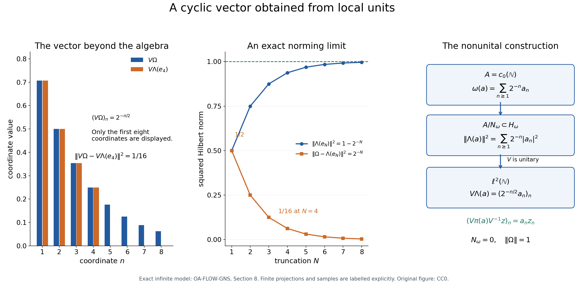

# Positive functionals and nonunital representations

*Original exposition, proofs, examples and figure: CC0-1.0.*

A positive functional records lengths and angles before a Hilbert space has been chosen. We construct that Hilbert space, show that algebra multiplication acts by bounded operators, and find the vector that recovers the functional. The algebra need not have an identity. The final construction combines all states into a faithful nondegenerate representation.

All algebras and Hilbert spaces are complex. Inner products are linear in the first variable. A representation \(\pi:A\to B(H)\) is a linear multiplicative map satisfying \(\pi(a^*)=\pi(a)^*\); continuity and nondegeneracy are not part of this definition. No separability or countability assumption is made. A positive functional on a star algebra satisfies \(\omega(a^*a)\geq0\) for every \(a\). A state on a C\* algebra is a positive functional of norm one.

## 1. Exact earlier inputs

The proof uses these earlier results. Its companion dependency map binds their written programme bodies and records the separate ancestry and programme-order checks.

- **C1: unitization and continuous calculus.** ([CF Sections 6–7](OA-FLOW-CF.md#oa-flow.cf.6) and [9](OA-FLOW-CF.md#oa-flow.cf.9)). A C\* algebra \(A\) embeds isometrically as a closed ideal in a unital C\* algebra \(A^\dagger=A\oplus\mathbb C\), with \(q(a+\lambda1)=\lambda\). This forced unitization also applies to an already unital \(A\). The continuous calculus of a normal element is an isometric star isomorphism from the continuous functions on its spectrum. It respects products, adjoints, composition and scalar inequalities. If \(a\in A\) and \(f(0)=0\), then \(f(a)\in A\). A positive element has nonnegative compact spectrum and norm equal to its maximum spectral value.
- **C2: C\* order.** ([CF Sections 7](OA-FLOW-CF.md#oa-flow.cf.7) and [9](OA-FLOW-CF.md#oa-flow.cf.9)). Positivity is equivalent to being a square \(b^*b\); the positive cone is closed and closed under sums and nonnegative scalar multiples. Conjugation preserves order. In the unitization, \(a^*a\leq\|a\|^2 1\); positive contractions satisfy \(e^2\leq e\); and \(0\leq x\leq y\) implies \(\|x\|\leq\|y\|\). Every self-adjoint \(h\in A\) has positive and negative parts \(h_\pm\in A\), with \(h=h_+-h_-\) and \(\|h_\pm\|\leq\|h\|\).
- **H1: Hilbert foundations.** ([CF Sections 8](OA-FLOW-CF.md#oa-flow.cf.8) and [10](OA-FLOW-CF.md#oa-flow.cf.10)). Inner product spaces have Hilbert completions, and bounded operators extend uniquely to those completions. Closed subspaces have orthogonal projections. Every bounded linear functional on a Hilbert space is \(\xi\mapsto\langle\xi,\eta\rangle\) for a unique \(\eta\), of the same norm. Bounded operators have adjoints, and \(B(H)\) satisfies the C\* identity.
- **HB1: complex Hahn–Banach.** ([CF Section 1](OA-FLOW-CF.md#oa-flow.cf.1)). A bounded complex linear functional on a subspace of a normed space has an extension to the whole space with the same norm.

Completeness, elementary scalar algebra and real calculus are also used. No GNS result, faithful representation theorem, state extension theorem, weak compactness theorem or measure theorem is an input. The proofs below establish the approximate identity needed here, so this foundation can precede both the group-algebra and crossed-product lessons.

## 2. Positive forms, including a zero diagonal

**Lemma 2.1.** Let \(V\) be a complex vector space and \(B\) a sesquilinear form, linear in the first variable, such that \(B(v,v)\geq0\) for every \(v\). Then
\[
B(v,u)=\overline{B(u,v)},\qquad
|B(u,v)|^2\leq B(u,u)B(v,v).
\tag{GNS-2.1}
\]
The null set \(N=\{u:B(u,u)=0\}\) is a linear subspace and equals the set of vectors orthogonal to every vector. The form descends to an inner product on \(V/N\).

**Proof.** Write \(z=B(u,v)\), \(w=B(v,u)\). Expanding the real diagonal values at \(u+v\) and \(u+iv\) shows respectively that \(z+w\) and \(i(w-z)\) are real. Their imaginary parts give \(\operatorname{Im}w=-\operatorname{Im}z\) and \(\operatorname{Re}w=\operatorname{Re}z\), hence \(w=\bar z\).

Set \(d=B(v,v)\). If \(d>0\), positivity at \(u+t v\), with \(t=-z/d\), gives
\[
0\leq B(u,u)+2\operatorname{Re}(\bar t z)+|t|^2d
=B(u,u)-|z|^2/d.
\]
If \(d=0\) and \(z\neq0\), take \(t=-Rz\) for positive real \(R\). The same diagonal is \(B(u,u)-2R|z|^2\), negative for sufficiently large \(R\). Thus \(z=0\) when \(d=0\), proving (GNS-2.1) in both cases.

A null vector is orthogonal to all vectors by this inequality. Conversely, a vector orthogonal to all vectors is orthogonal to itself and is null. The intersection of the kernels of \(u\mapsto B(u,v)\), over all \(v\), is linear. Adding a null vector to either argument does not change the form, so the quotient form is well defined. Its diagonal is zero only at the zero coset. \(\square\)

**Lemma 2.2.** For a positive functional \(\omega\) on an arbitrary, possibly nonunital, star algebra \(A\), put
\[
[a,b]_\omega=\omega(b^*a),\qquad
N_\omega=\{a:\omega(a^*a)=0\}.
\tag{GNS-2.2}
\]
This is a positive form, \(N_\omega\) is a left ideal, and \(A/N_\omega\) has the inner product \(\langle[a],[b]\rangle=\omega(b^*a)\).

**Proof.** Sesquilinearity follows from linearity of \(\omega\) and the conjugate linear involution. The diagonal is nonnegative by hypothesis, so Lemma 2.1 applies. If \(x\in N_\omega\) and \(a\in A\), then
\[
\omega((ax)^*(ax))=[x,a^*a x]_\omega=0,
\]
because \(x\) is orthogonal to every element. Thus \(ax\in N_\omega\). No norm, continuity, identity, or assertion that \(\omega\) is Hermitian on all of \(A\) has been used. \(\square\)

## 3. Local units and arbitrary representations

**Lemma 3.1.** Every C\* algebra has a positive contractive two-sided approximate identity, indexed by a directed set rather than necessarily a sequence.

**Proof.** Index by pairs \((F,n)\), where \(F\) is a finite subset of \(A\) and \(n\) is a positive integer, ordered by inclusion in \(F\) and the usual order in \(n\). This set is directed: take the union of two finite sets and the larger integer. In \(A^\dagger\) define
\[
b_F=\sum_{x\in F}(x^*x+xx^*),\qquad
e_{F,n}=1-\exp(-n b_F).
\tag{GNS-3.1}
\]
The latter notation means the continuous function \(t\mapsto1-e^{-nt}\) applied to \(b_F\), rather than an assumed exponential theorem. This function vanishes at zero, so C1 gives \(e_{F,n}\in A\). Its values on the nonnegative spectrum lie in \([0,1]\); hence it is a positive contraction.

If \(x\in F\), order conjugation and norm monotonicity give
\[
\begin{aligned}
\|(1-e_{F,n})x\|^2
&=\|(1-e_{F,n})xx^*(1-e_{F,n})\|\\
&\leq\|(1-e_{F,n})b_F(1-e_{F,n})\|\\
&=\max_{t\in\sigma(b_F)}t e^{-2nt}
\leq\frac1{2 e n}.
\end{aligned}
\tag{GNS-3.2}
\]
Here \(e\) in the denominator is the scalar number \(\exp(1)\). The scalar function has derivative \(e^{-2nt}(1-2nt)\), and maximum \(1/(2en)\) on \([0,\infty)\). The C\* identity and the isometric involution justify using \(\|yy^*\|=\|y\|^2\) in the first equality. Applying the same reasoning to \(x^*x\) gives \(\|x(1-e_{F,n})\|^2\leq1/(2en)\).

For fixed \(x\) and a prescribed error, all indices beyond a pair containing \(x\) and a sufficiently large integer satisfy both bounds. Thus \(e_{F,n}x\to x\) and \(xe_{F,n}\to x\). The net is not claimed to increase in C\* order. \(\square\)

**Lemma 3.2.** Every algebraic representation of a C\* algebra on an arbitrary Hilbert space is contractive.

**Proof.** Extend it algebraically to \(A^\dagger\) by
\[
\pi^\dagger(a+\lambda1)=\pi(a)+\lambda I_H.
\]
Expanding the product and adjoint verifies that this is a unital star homomorphism. It carries every square to an operator of the form \(T^*T\), whose quadratic form is nonnegative. Since \(\|a\|^2 1-a^*a\) is positive by C2, its image has nonnegative quadratic form. Consequently
\[
\|\pi(a)\xi\|^2\leq\|a\|^2\|\xi\|^2
\quad(a\in A,\ \xi\in H).
\tag{GNS-3.3}
\]
Taking the supremum over unit vectors proves \(\|\pi(a)\|\leq\|a\|\). For \(H=\{0\}\) the assertion is immediate. No continuity of \(\pi\) was assumed in taking the image of the square. \(\square\)

**Theorem 3.3 (essential space).** For a representation \(\pi\), define
\[
H_e=\overline{\operatorname{span}\{\pi(a)\xi:a\in A,\ \xi\in H\}},
\qquad
H_0=\bigcap_{a\in A}\ker\pi(a).
\tag{GNS-3.4}
\]
Then \(H_e^\perp=H_0\), both subspaces reduce \(\pi\), and \(\pi=\pi_e\oplus0\) on \(H=H_e\oplus H_0\). The restriction \(\pi_e\) is nondegenerate, meaning \(\overline{\pi_e(A)H_e}=H_e\).

For any bounded two-sided approximate identity \((u_i)\) of \(A\),
\[
\pi(u_i)\longrightarrow P_e\quad\hbox{strongly on }H.
\tag{GNS-3.5}
\]
In particular a positive contractive approximate identity converges strongly to \(I_H\) exactly when \(\pi\) is nondegenerate.

**Proof.** If \(\eta\perp H_e\), then \(\langle\pi(a)\xi,\eta\rangle=0\) for all \(a,\xi\), so \(\pi(a)^*\eta=\pi(a^*)\eta=0\) for all \(a\). Conversely this kernel condition makes all these inner products zero. Thus \(H_e^\perp=H_0\). Products show invariance of \(H_e\) under each \(\pi(a)\); replacing \(a\) by \(a^*\) shows invariance under the adjoints. Its orthogonal complement is therefore invariant too.

Let \(C=\sup_i\|u_i\|<\infty\). Lemma 3.2 gives \(\|\pi(u_i)\|\leq C\). For a generator \(z=\pi(a)\xi\),
\[
\|\pi(u_i)z-z\|
\leq\|u_i a-a\|\,\|\xi\|\longrightarrow0.
\]
The same holds for finite sums. For a general \(z\in H_e\), choose such a sum \(z'\) close to \(z\); the remaining error is at most \((C+1)\|z-z'\|\). Thus convergence holds on \(H_e\). On \(H_0\) every \(\pi(u_i)\) is zero, proving (GNS-3.5). The approximants \(\pi(u_i)z\) lie in \(\pi(A)H_e\), so that space is dense in \(H_e\); this proves nondegeneracy of the restriction. \(\square\)

**Corollary 3.4 (cyclic subspace and reducing restrictions).** For \(\xi\in H_e\), the closed subspace \(H_\xi=\overline{\pi(A)\xi}\) reduces \(\pi\), contains \(\xi\), and the restricted representation is nondegenerate and cyclic with cyclic vector \(\xi\). Any closed reducing subspace of a nondegenerate representation is nondegenerate under the restriction.

**Proof.** The set \(\pi(A)\xi\) is linear. Multiplication and the star property show that its closure is invariant under \(\pi(a)\) and \(\pi(a)^*\). By (GNS-3.5), \(\pi(u_i)\xi\to\xi\), hence \(\xi\in H_\xi\). The same strong limit restricts to any reducing subspace contained in \(H_e\), proving nondegeneracy there. For a reducing subspace of a nondegenerate representation, \(H_e=H\), so the last assertion follows as well. \(\square\)

These essential-space arguments also hold for a bounded representation of a normed star algebra with a bounded approximate identity: replace Lemma 3.2 by the assumed uniform operator bound. Only the C\* case has automatic contractivity here.

## 4. Positivity forces boundedness

**Theorem 4.1.** A positive functional \(\omega\) on a C\* algebra is bounded and Hermitian. For every positive contractive approximate identity \((e_i)\),
\[
\|\omega\|=\lim_i\omega(e_i),\qquad
|\omega(a)|^2\leq\|\omega\|\,\omega(a^*a).
\tag{GNS-4.1}
\]
If \(\omega,\psi\) are positive functionals and \(s,t\geq0\), then
\[
\|s\omega+t\psi\|=s\|\omega\|+t\|\psi\|.
\tag{GNS-4.2}
\]

**Proof.** By C2, positivity on squares means positivity on the whole cone \(A_+\); consequently \(\omega\) preserves order. Suppose its values on positive contractions were unbounded. For each positive integer \(k\), choose a positive contraction \(c_k\) with \(\omega(c_k)\geq2^k\), and put \(p_k=2^{-k}c_k\). The series \(p=\sum_k p_k\) converges in norm by completeness. Each finite sum and every norm limit of its positive tails is positive by the closed cone. Thus, without using continuity of \(\omega\),
\[
\omega(p)\geq\sum_{k=1}^m\omega(p_k)\geq m
\quad\hbox{for every }m.
\]
This is impossible for the finite scalar \(\omega(p)\). Hence
\(M=\sup\{\omega(c):c\geq0,\ \|c\|\leq1\}<\infty\).

For self-adjoint \(h=h_+-h_-\), both \(\omega(h_\pm)\) lie in \([0,M\|h\|]\). Therefore \(\omega(h)\) is real and \(|\omega(h)|\leq M\|h\|\). For arbitrary \(a\), write \(a=h+ik\) with \(h=(a+a^*)/2\), \(k=(a-a^*)/(2i)\), and \(\|h\|,\|k\|\leq\|a\|\). It follows that \(\omega(a^*)=\overline{\omega(a)}\) and \(|\omega(a)|\leq2M\|a\|\). Thus \(N=\|\omega\|\) is finite. If \(N=0\), all statements are immediate.

Assume \(N>0\). Applying Lemma 2.1 to \(a,e_i\) gives
\[
|\omega(e_i a)|^2
\leq\omega(e_i^2)\omega(a^*a)
\leq\omega(e_i)\omega(a^*a)
\leq N\omega(e_i)\|a\|^2.
\tag{GNS-4.3}
\]
We used \(e_i^2\leq e_i\) and boundedness of \(\omega\), now proved. If \(\|a\|\leq1\), then \(e_i a\to a\), and \(\omega(e_i a)\to\omega(a)\). For each \(\varepsilon>0\), choose such an \(a\) with \(|\omega(a)|>N-\varepsilon\). Inequality (GNS-4.3) forces
\[
\liminf_i\omega(e_i)\geq(N-\varepsilon)^2/N.
\]
Since \(0\leq\omega(e_i)\leq N\), letting \(\varepsilon\downarrow0\) proves \(\omega(e_i)\to N\). The same first inequality in (GNS-4.3), with \(\omega(e_i^2)\leq\omega(e_i)\), now gives the second statement of (GNS-4.1) by passage to the limit.

Apply the norm formula just proved to \(s\omega+t\psi\), which is positive. Linearity at each \(e_i\) gives (GNS-4.2). This uses one common net; no monotonicity or sequential approximation is assumed. \(\square\)

**Corollary 4.2 (compressed estimates).** For every \(a,b\in A\),
\[
0\leq\omega(b^*a^*ab)\leq\|a\|^2\omega(b^*b).
\tag{GNS-4.4}
\]
The functional \(\omega_b(x)=\omega(b^*xb)\) is positive and bounded, with
\[
\|\omega_b\|=\omega(b^*b).
\tag{GNS-4.5}
\]

**Proof.** Conjugate \(a^*a\leq\|a\|^2 1\) by \(b\) in \(A^\dagger\). Both resulting elements belong to \(A\), so positivity of \(\omega\) gives (GNS-4.4). Positivity of \(\omega_b\) follows because \(b^*x^*xb=(xb)^*(xb)\). Theorem 4.1 makes it bounded and gives
\(\|\omega_b\|=\lim_i\omega(b^*e_i b)=\omega(b^*b)\), since \(e_i b\to b\). \(\square\)

This direct order proof applies to the C\* specialization needed below. It makes no claim about the broader compressed-functional theorem for general Banach star algebras.

## 5. The Hilbert space and its norming vector

**Theorem 5.1 (nonunital GNS).** Let \(\omega\) be a positive functional on a C\* algebra \(A\). There exist a Hilbert space \(H_\omega\), a contractive nondegenerate representation \(\pi_\omega:A\to B(H_\omega)\), and a vector \(\Omega_\omega\) such that
\[
\overline{\pi_\omega(A)\Omega_\omega}=H_\omega,\qquad
\omega(a)=\langle\pi_\omega(a)\Omega_\omega,\Omega_\omega\rangle,\qquad
\|\Omega_\omega\|^2=\|\omega\|.
\tag{GNS-5.1}
\]
For every positive contractive approximate identity \((e_i)\), its quotient vectors satisfy
\[
\Lambda_\omega(e_i)=\pi_\omega(e_i)\Omega_\omega
\longrightarrow\Omega_\omega\quad\hbox{in Hilbert norm}.
\tag{GNS-5.2}
\]
In particular a state has a cyclic unit vector. For \(\omega=0\), the construction is the zero Hilbert space and zero vector.

**Proof.** Use the quotient inner product of Lemma 2.2 and complete it using H1. Write \(\Lambda(a)\) for the image of \(a\) in the completion. Theorem 4.1 gives
\[
\|\Lambda(a)\|^2=\omega(a^*a)\leq\|\omega\|\|a\|^2.
\tag{GNS-5.3}
\]
The null ideal is also closed in the C\* norm: if \(a_k\to a\) and \(\omega(a_k^*a_k)=0\), norm continuity of multiplication and the now bounded functional give \(\omega(a^*a)=0\).
On this dense quotient define \(\pi_\omega(a)\Lambda(b)=\Lambda(ab)\). The null set is a left ideal, so this is well defined. More precisely, (GNS-4.4) gives
\[
\|\Lambda(ab)\|^2\leq\|a\|^2\|\Lambda(b)\|^2.
\tag{GNS-5.4}
\]
Thus each operator extends uniquely to the completion with norm at most \(\|a\|\). Linearity and multiplicativity hold on every \(\Lambda(b)\), then on the completion by density. For \(b,c\in A\),
\[
\langle\Lambda(ab),\Lambda(c)\rangle
=\omega(c^*ab)
=\langle\Lambda(b),\Lambda(a^*c)\rangle.
\]
Density and continuity of the inner product give \(\pi_\omega(a)^*=\pi_\omega(a^*)\).

For a positive contractive approximate identity, \(\Lambda(e_i b)\to\Lambda(b)\) by (GNS-5.3). The operators \(\pi_\omega(e_i)\) are contractions, so approximation by the dense quotient gives \(\pi_\omega(e_i)\eta\to\eta\) for every \(\eta\in H_\omega\). Since their images lie in \(\pi_\omega(A)H_\omega\), the representation is nondegenerate.

We must now construct the cyclic vector; there is no assumed element \(\Lambda(1_A)\). Define a functional on the quotient by \(f(\Lambda(a))=\omega(a)\). The second estimate of (GNS-4.1) shows both that it is well defined and that
\[
|f(\Lambda(a))|\leq\sqrt{\|\omega\|}\,\|\Lambda(a)\|.
\]
Extend it to \(H_\omega\). By H1 there is a unique \(\Omega\) such that \(f(\eta)=\langle\eta,\Omega\rangle\). Testing against a dense quotient vector gives
\[
\begin{aligned}
\langle\pi_\omega(a)\Omega,\Lambda(b)\rangle
&=\langle\Omega,\Lambda(a^*b)\rangle\\
&=\overline{\omega(a^*b)}
=\omega(b^*a)
=\langle\Lambda(a),\Lambda(b)\rangle.
\end{aligned}
\]
We used the Hermitian property of \(\omega\) from Theorem 4.1. Therefore
\(\pi_\omega(a)\Omega=\Lambda(a)\). These vectors are dense, proving cyclicity, and their inner products with \(\Omega\) give the functional in (GNS-5.1).

The established strong convergence of \(\pi_\omega(e_i)\) gives (GNS-5.2). Finally
\[
\|\Omega\|^2
=\lim_i\langle\pi_\omega(e_i)\Omega,\Omega\rangle
=\lim_i\omega(e_i)=\|\omega\|.
\]
This proves the exact norm and completes the construction without assuming a unital extension of \(\omega\). \(\square\)

**Theorem 5.2 (uniqueness and vector norms).** If \((\rho,K,\xi)\) is another cyclic model with \(K=\overline{\rho(A)\xi}\) and \(\omega(a)=\langle\rho(a)\xi,\xi\rangle\), there is a unique unitary \(U:H_\omega\to K\) satisfying
\[
U\Omega_\omega=\xi,\qquad U\pi_\omega(a)=\rho(a)U.
\tag{GNS-5.5}
\]
For any representation \(\rho\) on \(K\) and vector \(\xi\), without cyclicity or nondegeneracy, its positive vector functional has norm \(\|P_e\xi\|^2\).

**Proof.** The assignment \(\Lambda(a)\mapsto\rho(a)\xi\) preserves inner products, since
\(\langle\rho(a)\xi,\rho(b)\xi\rangle=\omega(b^*a)\). It is well defined, extends to an isometry, and is onto by cyclicity. It intertwines multiplication on the dense quotient, hence on the whole space.

For a positive contractive approximate identity, cyclicity implies \(\xi\in K_e\): every element of \(K\) lies in the essential space by its definition. Thus \(\rho(e_i)\xi\to\xi\). Applying \(U\) to (GNS-5.2) proves \(U\Omega_\omega=\xi\). Any unitary with these properties agrees on all the dense vectors \(\pi_\omega(a)\Omega_\omega\), proving uniqueness.

For the last assertion the functional is positive because its value at \(a^*a\) is \(\|\rho(a)\xi\|^2\). Lemma 3.2 bounds it. By Theorems 3.3 and 4.1 its norm is
\[
\lim_i\langle\rho(e_i)\xi,\xi\rangle
=\langle P_e\xi,\xi\rangle=\|P_e\xi\|^2.
\]
A unit vector defines a state whenever it belongs to the essential space. The essential-space condition matters for degenerate representations. \(\square\)

**Corollary 5.3.** The formula
\[
\omega^\dagger(a+\lambda1)=\omega(a)+\lambda\|\omega\|
\tag{GNS-5.6}
\]
defines a positive bounded functional on \(A^\dagger\), of norm \(\|\omega\|\). It is the unique positive extension of \(\omega\) with that norm.

**Proof.** Extend \(\pi_\omega\) algebraically by \(\pi_\omega^\dagger(a+\lambda1)=\pi_\omega(a)+\lambda I\). As in Lemma 3.2 this is a representation of the C\* algebra \(A^\dagger\), and therefore contractive. Its vector functional at \(\Omega_\omega\) is exactly (GNS-5.6), is positive, and has norm \(\|\Omega_\omega\|^2=\|\omega\|\): its value at the unit attains that norm and contractivity gives the upper bound.

For any positive functional \(\theta\) on a unital C\* algebra, the constant net \(1\) is a positive contractive approximate identity, so Theorem 4.1 gives \(\|\theta\|=\theta(1)\). Consequently any positive extension with norm \(\|\omega\|\) must take \(1\) to \(\|\omega\|\); linearity then forces (GNS-5.6). \(\square\)

## 6. Enough states, proved without strict separation

**Lemma 6.1.** Suppose \(B\) is a nonzero unital C\* algebra and \(F\in B^*\) satisfies \(\|F\|=F(1)=1\). Then \(F\) is positive.

**Proof.** For self-adjoint \(h\) and real \(t\), the C\* identity gives
\[
|1+itF(h)|^2\leq\|1+it h\|^2
=\|1+t^2h^2\|\leq1+t^2\|h\|^2.
\tag{GNS-6.1}
\]
Writing \(F(h)=u+iv\), the left side is \(1-2tv+t^2(u^2+v^2)\). Dividing the resulting inequality by \(t\) and letting \(t\) tend to zero from both sides forces \(v=0\). Thus \(F(h)\) is real.

If \(0\leq h\leq1\), calculus gives \(\|1-h\|\leq1\). Therefore \(1-F(h)=F(1-h)\leq|F(1-h)|\leq1\), so \(F(h)\geq0\). Scaling treats every positive element. \(\square\)

**Theorem 6.2 (norming and separating states).** If \(A\neq\{0\}\), then \(S(A)\) is nonempty. For every nonzero normal \(a\in A\), some \(\varphi\in S(A)\) satisfies \(|\varphi(a)|=\|a\|\). In particular, for \(a\geq0\),
\[
\max_{\varphi\in S(A)}\varphi(a)=\|a\|.
\tag{GNS-6.2}
\]
A self-adjoint element is positive if and only if every state takes a nonnegative value on it.

**Proof.** For nonzero normal \(a\), the isometric calculus in \(A^\dagger\) identifies \(C^*(1,a)\) with \(C(\sigma(a))\). Choose a spectral point \(\lambda\) with \(|\lambda|=\|a\|\). The maximum exists by compactness and the isometric calculus. Evaluation there is a complex linear functional of norm one, takes the unit to one, and takes \(a\) to \(\lambda\). HB1 extends it to \(F\in(A^\dagger)^*\) with the same norm. Its unit value remains one, so Lemma 6.1 makes it positive.

The restriction \(\varphi=F|_A\) is positive and has norm at most one. Since \(|\varphi(a/\|a\|)|=1\), its norm is also at least one. Thus it is a state. When \(a\) is positive choose \(\lambda=\|a\|>0\); every other state's value at \(a\) is at most \(\|a\|\), proving (GNS-6.2) for nonzero positive \(a\). For \(A\neq0\), choose \(x\neq0\); the C\* identity makes \(x^*x\neq0\), so this construction already supplies a state. Equation (GNS-6.2) for \(a=0\) follows from nonemptiness.

If a self-adjoint \(h\) is not positive, its spectrum in \(A^\dagger\) contains a negative real point \(\lambda\). Extend evaluation at that point as above. Its positive restriction \(\psi\) to \(A\) is nonzero because \(\psi(h)=\lambda<0\). Theorem 4.1 makes it bounded, with positive norm; hence \(\psi/\|\psi\|\) is a state negative on \(h\). This proves the converse order test. The forward test is the definition of positivity. \(\square\)

The norming assertion is for normal elements. To control an arbitrary \(a\), use the positive element \(a^*a\); no assertion that \(\sup_\varphi|\varphi(a)|=\|a\|\) for every nonnormal \(a\) is needed.

## 7. Arbitrary direct sums and a faithful representation

**Lemma 7.1.** Given a set \(J\) and Hilbert spaces \(H_j\), the Hilbert direct sum is
\[
\bigoplus_{j\in J}H_j
=\left\{(\xi_j):\sum_{j\in J}\|\xi_j\|^2<\infty\right\},
\tag{GNS-7.1}
\]
where the sum of nonnegative numbers is the supremum of its finite subsums. Its inner product is the limit of finite sums. Finite support vectors are dense. A uniformly bounded family \(T_j\in B(H_j)\) acts diagonally, with \(\|\bigoplus_jT_j\|=\sup_j\|T_j\|\); the empty sum has norm zero.

**Proof.** On the algebraic direct sum of finite support vectors use \(\langle\xi,\eta\rangle=\sum_j\langle\xi_j,\eta_j\rangle\), a finite sum, and take its Hilbert completion by H1. Coordinate maps and finite-coordinate projections \(P_F\) are contractions and extend to that completion. If a finite support \(y\) approximates \(z\) and \(F\) contains the support of \(y\), then
\[
\|P_Fz-z\|\leq\|P_F(z-y)\|+\|z-y\|\leq2\|z-y\|.
\]
Thus \(P_Fz\to z\), and \(\|z\|^2=\sup_F\sum_{j\in F}\|z_j\|^2\). In particular the coordinates determine \(z\).

Conversely, suppose a family has total squared norm \(s<\infty\). For each positive integer \(k\), choose a finite \(F_k\) with subsum greater than \(s-k^{-2}\), and replace \(F_k\) by \(F_1\cup\cdots\cup F_k\). Every finite subsum outside \(F_k\) is at most \(k^{-2}\), so the squared norm of the whole tail is at most \(k^{-2}\). These nested truncations are a Cauchy sequence in the algebraic direct sum and hence converge in its completion. For every coordinate \(j\), either \(j\) eventually lies in \(F_k\) or \(\|\xi_j\|^2\leq k^{-2}\) for all \(k\), making that coordinate zero. The limit therefore has exactly the prescribed coordinates and norm squared \(s\). This proves both directions of (GNS-7.1).

For inner products, finite Cauchy–Schwarz gives \(\sum_{j\in F}|\langle\xi_j,\eta_j\rangle|\leq(\sum_{j\in F}\|\xi_j\|^2)^{1/2}(\sum_{j\in F}\|\eta_j\|^2)^{1/2}\). Tail bounds of the same kind prove convergence of the finite inner-product sums to the completed product. This proves completeness, density and the inner-product formula without restricting the size of \(J\).

If \(M=\sup_j\|T_j\|<\infty\), then on finite support vectors \(\sum_j\|T_j\xi_j\|^2\leq M^2\sum_j\|\xi_j\|^2\). H1 gives a diagonal extension with norm at most \(M\). Testing vectors in any one coordinate gives the reverse inequality. \(\square\)

**Lemma 7.2.** A direct sum of nondegenerate representations of a C\* algebra is nondegenerate, for an arbitrary set of summands.

**Proof.** Contractivity makes the diagonal representation well defined by Lemma 7.1, and products and adjoints hold on finite support vectors and hence everywhere. For a positive contractive approximate identity \((e_i)\), each summand satisfies \(\pi_j(e_i)\xi_j\to\xi_j\) by Theorem 3.3. On a finite support vector there are only finitely many convergence conditions, so directedness gives convergence simultaneously. For any vector, finite support approximation and the bound \(\|\bigoplus_j\pi_j(e_i)\|\leq1\) give convergence by a tail error of at most twice the approximation error. Thus the diagonal representation's approximate identity converges strongly to the identity. Theorem 3.3 proves nondegeneracy. \(\square\)

**Theorem 7.3 (faithful nondegenerate representation).** Every C\* algebra admits an isometric faithful nondegenerate representation. For \(A\neq0\), one such representation is
\[
H_u=\bigoplus_{\varphi\in S(A)}H_\varphi,\qquad
\pi_u(a)=\bigoplus_{\varphi\in S(A)}\pi_\varphi(a).
\tag{GNS-7.2}
\]
For \(A=0\), take the empty direct sum \(H_u=0\).

**Proof.** \(S(A)\) is a set of functionals on the underlying set of \(A\). Theorem 5.1 gives a definite quotient-completion model for each member, so this is a set-indexed construction. Each summand is contractive and nondegenerate; Lemmas 7.1 and 7.2 give a contractive nondegenerate diagonal representation.

For \(a\neq0\), Theorem 6.2 applied to \(a^*a\) gives a state \(\varphi\) with \(\varphi(a^*a)=\|a\|^2\). Its GNS vector is a unit vector, and
\[
\|\pi_u(a)\|
\geq\|\pi_\varphi(a)\Omega_\varphi\|
=\sqrt{\varphi(a^*a)}=\|a\|.
\tag{GNS-7.3}
\]
Contractivity gives the opposite inequality. Therefore \(\pi_u\) is isometric and injective. Its range is closed: a norm-Cauchy sequence of represented elements has a Cauchy sequence of preimages in the complete algebra and its limit is represented. For \(A=0\), the map into \(B(0)=0\) is injective and nondegenerate because the essential space is all of \(0\). \(\square\)

## 8. A nonunital norming vector and a null coordinate

Let \(A=c_0(\mathbb N)\), with pointwise operations and supremum norm. Completeness follows because a uniform limit of sequences tending to zero again tends to zero; the C\* identity is coordinatewise. There is no identity: an identity would have every coordinate equal to one.

Define
\[
\omega(a)=\sum_{n=1}^{\infty}2^{-n}a_n.
\tag{GNS-8.1}
\]
Absolute convergence gives a linear functional with \(|\omega(a)|\leq\|a\|\); nonnegative coordinates give positivity. The projections \(e_N\), equal to one in the first \(N\) coordinates and zero elsewhere, form a positive contractive approximate identity: the left and right norm errors are \(\sup_{n>N}|a_n|\to0\). Since \(\omega(e_N)=1-2^{-N}\), the functional has norm one.

Here \(N_\omega=0\), because a sum of nonnegative terms \(\sum_n2^{-n}|a_n|^2\) vanishes only when every term vanishes. The map
\[
V\Lambda(a)=(2^{-n/2}a_n)_{n\geq1}
\tag{GNS-8.2}
\]
is an isometry into the usual \(\ell^2(\mathbb N)\). Its image contains every finite support vector: divide its finitely many coordinates by \(2^{-n/2}\). These vectors are dense by Lemma 7.1, so \(V\) extends to a unitary. Multiplication becomes diagonal multiplication by \(a_n\). The cyclic vector is
\[
V\Omega=(2^{-n/2})_{n\geq1},\qquad
\|V\Omega\|^2=1,\qquad
\|\Lambda(e_N)-\Omega\|^2=2^{-N}.
\tag{GNS-8.3}
\]
The vector is not obtained from an identity in \(c_0\). Its finite truncations come from the approximate identity, and their exact tail error proves their norm convergence.

*Original CC0 figure.* The left panel displays the first eight coordinates of the infinite vector \(V\Omega\) and its truncation \(V\Lambda(e_4)\); it is a finite coordinate projection, not the full vector. The middle panel shows \(\|\Lambda(e_N)\|^2=1-2^{-N}\) and \(\|\Omega-\Lambda(e_N)\|^2=2^{-N}\) at \(N=1,\ldots,8\). The right panel shows the actual construction maps (GNS-8.2) and diagonal multiplication. All coordinates and tail constants are exact; the plotted coordinates are numerical evaluations of those exact expressions. The proof is this section and Theorem 5.1. Reproduction source: [make_gns_figure.py](../assets/gns-foundation/make_gns_figure.py).

For a null coordinate, instead take \(\eta(a)=\sum_{n\geq1}2^{-n}a_{2n}\). This is another state by the same estimates and by \(\eta(e_{2N})=1-2^{-N}\). Its null ideal consists exactly of sequences whose even coordinates vanish. The quotient and GNS representation retain only even coordinates, so that representation kills every odd-coordinate basis element and is not faithful. Theorem 7.3 remedies this: the state \(\delta_k(a)=a_k\) has norm one, is positive, and its one-dimensional GNS representation detects the \(k\)-th coordinate. The sum over all states includes these detection mechanisms. A single state need not have a faithful GNS representation.

## 9. Checks with complete solutions

**Exercise 9.1.** Why may the cyclic vector fail to belong to the represented algebra's essential space if cyclicity is defined by adjoining the vector itself to its orbit?

**Solution.** Take the zero representation of \(A\) on a nonzero one-dimensional Hilbert space and a unit vector \(\xi\). Then \(\operatorname{span}(\{\xi\}\cup\pi(A)\xi)=H\), but the essential space is zero and the vector functional is zero. Our definition of cyclicity is \(\overline{\pi(A)\xi}=H\), which excludes this example. Theorem 5.2 proves the exact norm \(\|P_e\xi\|^2\) for either convention.

**Exercise 9.2.** In the \(c_0\) example, calculate the error in approximating \(\Omega\) by \(\Lambda(e_5)\), and the quotient norm of the ninth coordinate basis element.

**Solution.** Equation (GNS-8.3) gives squared error \(2^{-5}=1/32\), hence error \(1/\sqrt{32}\). If \(d_9\) is one in coordinate nine and zero elsewhere, then \(\|\Lambda(d_9)\|^2=2^{-9}=1/512\), so its quotient norm is \(1/\sqrt{512}\), although its C\* norm is one. The completion uses the functional's norm, rather than the C\* norm.

**Exercise 9.3.** Prove that a nondegenerate representation has a nondegenerate restriction to a reducing subspace and that a direct sum can be faithful even when every summand has a kernel.

**Solution.** The restriction's approximate identity is the restriction of a strong net converging to \(I\); it converges to the identity on the subspace, proving the first claim by Theorem 3.3. For the second, the one-dimensional coordinate representations of \(c_0(\mathbb N)\) each kill all other coordinates. Their direct sum is diagonal multiplication on \(\ell^2(\mathbb N)\). Its norm is \(\sup_k|a_k|=\|a\|\) by Lemma 7.1, so its kernel is zero. Its approximate identity \(e_N\) converges strongly to \(I\), by the squared tail sums in \(\ell^2\), so the sum is also nondegenerate.

## 10. Freely accessible comparison source

Kristin Courtney, Elizabeth Gillaspy and Lara Ismert, [*Notes on C\*-algebras*, GOALS 2024](https://www.ipam.ucla.edu/wp-content/uploads/2024/07/Notes_and_Exercises_for_GOALS.pdf), Section 7, printed pages 38–41: Lemma 7.8 concerns norm-one unital functionals, Theorem 7.9 states GNS, Exercise 7.16 asks for the nonunital extension, and Lemma 7.12 supplies norming states. These are comparison locators, not substitutes for any proof above. The explicit nonunital Riesz construction, approximate-identity argument and arbitrary direct-sum proof here supply the needed arguments at C1, C2, H1 and HB1.
