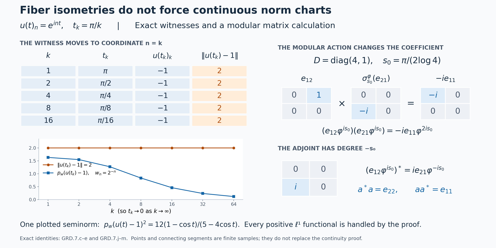

# Graded fibers and changing weight coordinates

*Self-checked by the writing AI. Original exposition and illustration sources: CC0-1.0; earlier and font components retain their recorded terms.*

The continuous core already contains the degree spaces we need: an operator has degree \(t\) when the dual flow multiplies it by \(e^{-irt}\). We first identify these entire spectral subspaces. Weight-labelled symbols then give coordinates on them, and the ordinary core product determines the order of every cocycle and modular factor. Finally we ask which topologies allow the degree to vary continuously. Bounded operator topologies and the full Mackey topology work; the norm topology has an explicit obstruction.

## Algebras, degrees and earlier constructions

Let \(M\) be an arbitrary von Neumann algebra, with predual \(M_*\). We impose no factor, separable-predual, countable-decomposability or faithful-state assumption. The [intrinsic core](OA-FLOW-CORE.md#core-7) is \(C=C(M)\), with coefficient inclusion \(j_M\), dual flow \(\theta\), and canonical trace. We identify the coefficient image with \(M\). The [full fixed-algebra theorem](OA-FLOW-DA.md#da-fixed) gives \(C^\theta=M\).

Write \(\mathcal W(M)\) for the set of faithful normal semifinite weights. It is nonempty by [FR1](OA-FLOW-FR.md#oa-flow.fr.1). In its faithful chart, a weight \(\varphi\) supplies the unitary group \(\lambda^\varphi(t)=h_\varphi^{it}\), satisfying
\[
 \theta_r(\lambda^\varphi(t))=e^{-irt}\lambda^\varphi(t),\qquad
 \lambda^\varphi(s)x\lambda^\varphi(s)^*=\sigma_s^\varphi(x).
\]
These are the actual normal crossed-product relations, with original Haar measure \(dt\), dual measure \(dr/(2\pi)\), and the displayed negative character. All weights used to label a whole fiber here are faithful. The previous [supported-weight construction](OA-FLOW-SCW.md#scw-1) retains nonfaithful weights as symbols on their support corners; they are not bijective coordinate charts on all of \(M\).

Multiplication and the adjoint on bounded operators, their norm inequalities, and weak-star continuity of fixed multipliers are established in [the C-star norm foundations](OA-FLOW-CF.md#oa-flow.cf.3) and [CP6](OA-FLOW-CP.md#oa-flow.cp.6). The additional predual compactness inputs for the Mackey topology will be specified at the point of use. A total graded space is a disjoint union: its degree is part of each element, including its zero element.

## 1. Find the complete spectral fiber in the core

For \(t\in\mathbb R\), define
\[
 E_t=\{a\in C:\theta_r(a)=e^{-irt}a\text{ for every }r\in\mathbb R\}.
 \tag{GRD.1.a}
\]
This is a linear ultraweakly closed subspace: for each \(r\), the equation is the kernel of the ultraweakly continuous linear map \(\theta_r-e^{-irt}\operatorname{id}\), and we take their intersection. The fixed-algebra theorem gives \(E_0=M\).

For any \(\varphi\in\mathcal W(M)\) the entire space, not merely a dense part, is
\[
 E_t=M\lambda^\varphi(t),\qquad
 L_{\varphi,t}:M\longrightarrow E_t,\quad x\longmapsto x\lambda^\varphi(t).
 \tag{GRD.1.b}
\]
The inclusion from right to left follows by applying \(\theta_r\) to both factors. Conversely, if \(a\in E_t\), then
\[
 \theta_r(a\lambda^\varphi(-t))
 =e^{-irt}a\,e^{irt}\lambda^\varphi(-t)
 =a\lambda^\varphi(-t).
 \tag{GRD.1.c}
\]
Thus \(a\lambda^\varphi(-t)\in M\), by the full fixed-algebra theorem, and this is the coefficient in (GRD.1.b). Right multiplication by a unitary is a linear isometry, with inverse
\[
 L_{\varphi,t}^{-1}(a)=a\lambda^\varphi(-t).
 \tag{GRD.1.d}
\]
Both maps are normal as maps of weak-star spaces: fixed bounded multiplication is ultraweakly continuous by [CP6](OA-FLOW-CP.md#oa-flow.cp.6), and the coefficient inclusion and its inverse onto \(M\) are normal by [CORE7](OA-FLOW-CORE.md#core-7). In particular each fiber is complete in its inherited norm. Transporting the predual of \(M\) along this map makes it a dual Banach space; Section 2 verifies that this transported predual does not depend on \(\varphi\).

The core operations immediately show
\[
 E_sE_t\subseteq E_{s+t},\qquad E_t^*=E_{-t},\qquad
 a^*a\in M_+,\quad \|a^*a\|=\|a\|^2\quad(a\in E_t).
 \tag{GRD.1.e}
\]
For example \(\theta_r(ab)=e^{-ir(s+t)}ab\), and taking adjoints reverses the sign of the character. The two inclusions for the adjoint give equality because the adjoint is an involution. The last statements are the positive square and norm identity in the represented C-star algebra.

Every finite-degree product and every adjoint remains inside these spaces. Moreover their union generates \(C\) as a von Neumann algebra: it contains \(E_0=M\) and each \(\lambda^\varphi(t)\in E_t\), which are the defining generators of a faithful core chart. This assertion does not identify \(C\) with a Banach direct sum of the \(E_t\). We retain the degree label in their disjoint union; all spectral fibers contain the zero operator.

## 2. Weight labels give canonical dual Banach coordinates

For faithful normal semifinite \(\varphi,\psi\), set
\[
 u_{\varphi,\psi}(t)=(D\varphi:D\psi)_t.
 \tag{GRD.2.a}
\]
The actual [balanced cocycle proof](OA-FLOW-BC.md#oa-flow.bc.4) gives strong-star continuous unitary paths and the ordered identities
\[
 \begin{aligned}
 u_{\varphi,\rho}(t)&=u_{\varphi,\psi}(t)u_{\psi,\rho}(t),\\
 u_{\varphi,\psi}(s+t)&=u_{\varphi,\psi}(s)\sigma_s^\psi(u_{\varphi,\psi}(t)),\\
 \sigma_s^\varphi&=\operatorname{Ad}(u_{\varphi,\psi}(s))\sigma_s^\psi,\\
 u_{\varphi,\varphi}(t)&=1,\qquad
 u_{\psi,\varphi}(t)=u_{\varphi,\psi}(t)^*.
 \end{aligned}
 \tag{GRD.2.b}
\]
These products are not commutative. [CORE5–7](OA-FLOW-CORE.md#core-5) identify their intrinsic meaning:
\[
 \lambda^\varphi(t)=u_{\varphi,\psi}(t)\lambda^\psi(t).
 \tag{GRD.2.c}
\]

For fixed \(t\), give the set \(M\times\mathcal W(M)\) the relation
\[
 (x,\varphi)\sim_t(y,\psi)
 \quad\Longleftrightarrow\quad
 y=xu_{\varphi,\psi}(t).
 \tag{GRD.2.d}
\]
Reflexivity follows from the identity in (GRD.2.b). Multiplication by the adjoint derivative proves symmetry. If \(y=xu_{\varphi,\psi}(t)\) and \(z=yu_{\psi,\rho}(t)\), the first ordered identity gives \(z=xu_{\varphi,\rho}(t)\), proving transitivity. Denote the quotient by \(M(t)\) and the class by \(x\varphi^{it}\). The symbol records a coordinate and a degree; it does not take a complex power of a linear functional on \(M\).

The quotient is exactly the spectral space of Section 1, through
\[
 \begin{aligned}
 j_t:M(t)&\longrightarrow E_t,\\
 j_t(x\varphi^{it})&=x\lambda^\varphi(t).
 \end{aligned}
 \tag{GRD.2.e}
\]
Indeed (GRD.2.c) proves that equivalent pairs have the same image. Conversely equality of the two core operators, multiplied on the right by \(\lambda^\psi(-t)\), gives exactly (GRD.2.d). Surjectivity is (GRD.1.b), so \(j_t\) is a bijection.

The coefficient chart for a fixed \(\psi\) is
\[
 q_{\psi,t}(x\varphi^{it})=xu_{\varphi,\psi}(t),\qquad
 q_{\psi,t}^{-1}(a)=a\psi^{it}.
 \tag{GRD.2.f}
\]
It equals \(L_{\psi,t}^{-1}j_t\). Transport addition, scalar multiplication and norm from \(M\); in one chart this says
\[
 x\varphi^{it}+y\varphi^{it}=(x+y)\varphi^{it},\qquad
 c(x\varphi^{it})=(cx)\varphi^{it},\qquad
 \|x\varphi^{it}\|=\|x\|.
 \tag{GRD.2.g}
\]
The transition from the \(\varphi\)-chart to the \(\psi\)-chart is \(x\mapsto xu_{\varphi,\psi}(t)\), a surjective linear isometry. It preserves precisely these operations, so they are independent of the chart. Completeness follows from that of \(M\). At \(t=0\) all derivatives are one, so \(M(0)=M\).

Here is the predual statement in full. Pull each normal functional \(\omega\in M_*\) back along \(q_{\varphi,t}\). This gives a Banach space of functionals on \(M(t)\), isometric to \(M_*\). Under a chart change the preadjoint is
\[
 R_u^*(\omega)(x)=\omega(xu),\qquad
 u=u_{\varphi,\psi}(t).
 \tag{GRD.2.h}
\]
It is normal by fixed-multiplier continuity, and it is an isometry because \(x\mapsto xu\) bijects the unit ball of \(M\) onto itself. Its inverse uses \(u^*\). Thus the two transported sets of functionals coincide with identical norms. Their dual pairing recovers \(M(t)\) isometrically, because this is true in any chart. The weak-star topology is therefore canonical, and \(j_t\) and its inverse onto \(E_t\) are normal isometries by (GRD.1.b)–(GRD.1.d).

The direction of (GRD.2.d) is forced by the core formula, not a convention that can be reversed while keeping the same charts. For example if \(\varphi=c\psi\), [BC5](OA-FLOW-BC.md#oa-flow.bc.5) gives \(u_{\varphi,\psi}(t)=c^{it}\), so the \(\psi\)-coefficient of \(1\varphi^{it}\) is \(c^{it}\). Section 7 computes a scalar time at which the opposite coefficient differs. The zero algebra is harmless: it has one zero space at every degree and the unique corresponding coordinate maps.

## 3. Multiplication and adjoints with their ordered coefficients

Let \(\mathcal F(M)=\bigsqcup_{t\in\mathbb R}M(t)\). Use the bijections \(j_t\) and the ordinary core operations to define multiplication from degrees \((s,t)\) to degree \(s+t\), and an adjoint from degree \(t\) to degree \(-t\). Section 1 proves that both operations have these target fibers. In any single faithful chart the resulting formulas are
\[
 \begin{aligned}
 (x\varphi^{is})(y\varphi^{it})
 &=x\sigma_s^\varphi(y)\varphi^{i(s+t)},\\
 (x\varphi^{it})^*&=\sigma_{-t}^\varphi(x^*)\varphi^{-it}.
 \end{aligned}
 \tag{GRD.3.a}
\]
For the first, move \(y\) past \(\lambda^\varphi(s)\) using covariance, then multiply the two group unitaries. For the second, move \(x^*\) past \(\lambda^\varphi(-t)\). This derivation already makes the formulas independent of the weight label. The following direct coordinate check also determines every cocycle order.

Put \(u_t=u_{\varphi,\psi}(t)\). In the \(\psi\)-chart the two coefficients are \(xu_s\) and \(yu_t\). Their product is
\[
 \begin{aligned}
 (xu_s)\sigma_s^\psi(yu_t)
 &=x\sigma_s^\varphi(y)u_s\sigma_s^\psi(u_t)\\
 &=x\sigma_s^\varphi(y)u_{s+t}.
 \end{aligned}
 \tag{GRD.3.b}
\]
This is exactly the transition of the product coefficient in (GRD.3.a). For the adjoint, the cocycle law at \((-t,t)\) gives \(\sigma_{-t}^\psi(u_t^*)=u_{-t}\). Consequently
\[
 \begin{aligned}
 \sigma_{-t}^\psi((xu_t)^*)
 &=u_{-t}\sigma_{-t}^\psi(x^*)\\
 &=\sigma_{-t}^\varphi(x^*)u_{-t},
 \end{aligned}
 \tag{GRD.3.c}
\]
the required transition at degree \(-t\).

Multiplication is bilinear on each pair of fibers. Both associations of three elements with coordinates \(x,y,z\) at degrees \(r,s,t\) have coefficient
\[
 x\sigma_r^\varphi(y)\sigma_{r+s}^\varphi(z)
 \quad\text{at degree }r+s+t.
 \tag{GRD.3.d}
\]
This proves associativity directly. The adjoint is conjugate linear within a fiber. Applying it twice returns \(x\), because \(\sigma_t^\varphi\sigma_{-t}^\varphi=\operatorname{id}\) and each automorphism preserves adjoints. The adjoint of a product in (GRD.3.a) has coefficient
\[
 \sigma_{-t}^\varphi(y^*)\sigma_{-(s+t)}^\varphi(x^*)
 \quad\text{at degree }-(s+t).
 \tag{GRD.3.e}
\]
This is also the coefficient obtained by multiplying the two adjoints in the reverse order, of degrees \(-t,-s\). Hence \((ab)^*=b^*a^*\).

Automorphisms preserve the norm and positive cone. For \(a=x\varphi^{it}\) and \(b\) in any degree, the complete norm and positivity statements are
\[
 \begin{gathered}
 \|ab\|\le\|a\|\|b\|,\qquad \|a^*\|=\|a\|,\\
 a^*a=\sigma_{-t}^\varphi(x^*x)\in M(0)_+,\qquad
 \|a^*a\|=\|a\|^2.
 \end{gathered}
 \tag{GRD.3.f}
\]
The norm inequality follows from (GRD.3.a) and the bounded-operator inequality in \(M\); the last identity is the C-star norm identity. The degree-zero identity acts as the identity on both sides. The identifications with the core preserve all these operations:
\[
 j_s(a)j_t(b)=j_{s+t}(ab),\qquad
 j_t(a)^*=j_{-t}(a^*),\qquad
 \theta_r(j_t(a))=e^{-irt}j_t(a).
 \tag{GRD.3.g}
\]
Addition is confined to a single fiber. We have defined neither a norm completion of sums across degrees nor an algebra of integrable sections at this stage; those require further constructions.

## 4. Changing degree in bounded operator topologies

The chart transition in [Section 2](OA-FLOW-GRD.md#grd-2) has a useful form independent of the cocycle law. Let \(u:\mathbb R\to\mathcal U(M)\) be any sigma-strong-star continuous unitary path, and put
\[
 T_u(x,t)=(xu(t),t),\qquad
 T_u^{-1}(x,t)=(xu(t)^*,t).
 \tag{GRD.4.a}
\]
For each \(R\ge0\), let \(B_R(M)=\{x:\|x\|\le R\}\). We claim that \(T_u\) is a homeomorphism of \(B_R(M)\times\mathbb R\), with the ordinary topology in the second coordinate, for each of the following first-coordinate topologies: weak operator, ultraweak, strong operator, sigma-strong, and their star variants.

Choose any faithful normal representation of \(M\) on a Hilbert space \(H\). The [full bounded-topology comparison](OA-FLOW-ST12.md#oa-flow.st.2) proves, for arbitrary \(H\) and arbitrary nets, that on a norm ball the weak and ultraweak topologies coincide, as do the strong and intrinsic sigma-strong topologies and their star versions. The latter intrinsic topologies use all positive normal functionals:
\[
 p_\omega(x)=\omega(x^*x)^{1/2},\qquad
 p_\omega^*(x)=\omega(x^*x+xx^*)^{1/2}
       \quad(\omega\in M_*^+).
 \tag{GRD.4.b}
\]
In particular, both \(u\) and \(u^*\) are strongly continuous in this representation. No basis or faithful normal state has been chosen.

Suppose \(t_i\to t\), \(x_i,x\in B_R(M)\), and write \(u_i=u(t_i)\), \(u=u(t)\). If \(x_i\to x\) weakly, then for every \(\xi,\eta\in H\),
\[
 \begin{aligned}
 |\langle(x_i u_i-xu)\xi,\eta\rangle|
 &\le R\|(u_i-u)\xi\|\,\|\eta\|\\
 &\quad+|\langle(x_i-x)u\xi,\eta\rangle|
 \longrightarrow0.
 \end{aligned}
 \tag{GRD.4.c}
\]
The first term uses strong continuity of the unitary path; the second is one fixed weak test. Since \(\|x_i u_i\|\le R\), the bounded-topology comparison gives the ultraweak conclusion as well. It applies whether the original convergence was stated weakly or ultraweakly.

If \(x_i\to x\) strongly, then
\[
 \|(x_i u_i-xu)\xi\|
 \le R\|(u_i-u)\xi\|
       +\|(x_i-x)u\xi\|
 \longrightarrow0
 \qquad(\xi\in H).
 \tag{GRD.4.d}
\]
This also proves sigma-strong continuity on the ball by the same comparison. For the strong-star statement, assume in addition that \(x_i^*\to x^*\) strongly. The adjoint difference is
\[
 \begin{aligned}
 (x_i u_i)^*-(xu)^*
 &=u_i^*(x_i^*-x^*)+(u_i^*-u^*)x^*,\\
 \|((x_i u_i)^*-(xu)^*)\xi\|
 &\le\|(x_i^*-x^*)\xi\|
       +\|(u_i^*-u^*)x^*\xi\|
 \longrightarrow0.
 \end{aligned}
 \tag{GRD.4.e}
\]
Thus strong-star and sigma-strong-star continuity both hold. The weak and ultraweak star variants introduce no additional condition: taking the adjoint is continuous for these topologies, as follows from conjugating vector coefficients and the [normal vector-series description](OA-FLOW-CP.md#oa-flow.cp.6).

Right multiplication by a unitary preserves the norm, so both maps in (GRD.4.a) preserve \(B_R(M)\times\mathbb R\). Repeating the proof for the path \(t\mapsto u(t)^*\) proves continuity of the inverse. This completes the homeomorphism claim. Restricting to any subset with uniformly norm-bounded coefficients gives a homeomorphism onto its image; the subset need not itself be preserved.

For a faithful weight \(\varphi\), write the full chart as
\[
 Q_\varphi:\mathcal F(M)\longrightarrow M\times\mathbb R,\qquad
 Q_\varphi(a)=\bigl(q_{\varphi,t}(a),t\bigr)
                 \quad(a\in M(t)).
 \tag{GRD.4.f}
\]
Then [the ordered chart formula](OA-FLOW-GRD.md#grd-2) gives
\[
 Q_\psi Q_\varphi^{-1}(x,t)
       =\bigl(xu_{\varphi,\psi}(t),t\bigr).
 \tag{GRD.4.g}
\]
The [balanced cocycle proof](OA-FLOW-BC.md#oa-flow.bc.4) supplies exactly the required continuous unitary path. Consequently each of the bounded-set topologies just proved is independent of the faithful weight chart. The coefficient norm bound is part of this statement; (GRD.4.c) does not assert joint continuity for arbitrary weakly convergent unbounded nets.

## 5. A chart-independent Mackey topology on the whole graded space

The whole-space argument uses weak compactness in the predual. Give \(M\) the Mackey topology \(\tau(M,M_*)\), defined here by the seminorms
\[
 p_K(x)=\sup_{\omega\in K}|\omega(x)|,
 \qquad K\subset M_*\ \text{absolutely convex and weakly compact}.
 \tag{GRD.5.a}
\]
Here “weakly” means \(\sigma(M_*,M)\), and \(p_\varnothing=0\). A set is absolutely convex if it contains every finite sum \(\sum_j c_j\omega_j\) with \(\omega_j\) in the set and \(\sum_j|c_j|\le1\). For each normal functional, its scalar disc is absolutely convex and weakly compact, and its seminorm is the absolute value of that functional. Normal functionals separate the points of \(M\), so this topology is Hausdorff.

We use two precise programme results. The [weak compactness theorem, Theorem 10.2](../../foundations-of-von-neumann-algebras/polar-decomposition-of-functionals-and-weak-compactness-in-preduals.html#OA-FND-PD-16) proves that \(S\subset M_*\) is relatively weakly compact if and only if it is norm bounded and there is \(\omega_0\in M_*^+\) such that, for every \(\varepsilon>0\), some \(\delta>0\) satisfies
\[
 \|a\|\le1,\quad
 \omega_0(a^*a+aa^*)<\delta
 \quad\Longrightarrow\quad
 \sup_{\omega\in S}|\omega(a)|<\varepsilon.
 \tag{GRD.5.b}
\]
The controlling functional need not be faithful. The [bounded-set theorem, Theorem 11.2 and Remark 11.3](../../foundations-of-von-neumann-algebras/polar-decomposition-of-functionals-and-weak-compactness-in-preduals.html#OA-FND-PD-19) proves that uniform convergence on relatively weakly compact predual sets, the Mackey topology just defined, and the sigma-strong-star topology agree on each norm-bounded subset. In particular,
\[
 \begin{gathered}
 a_i\longrightarrow0\ \text{sigma-strong-star},\qquad
 \sup_i\|a_i\|<\infty,\qquad K\subset M_*\ \text{weakly compact}\\
 \Longrightarrow\quad
 p_K(a_i)\longrightarrow0.
 \end{gathered}
 \tag{GRD.5.c}
\]
These are proved for arbitrary von Neumann algebras. We use the definition (GRD.5.a), without the further characterization of Mackey topology as the finest compatible locally convex topology.

**The compact hull needed below.** If \(S\subset M_*\) is relatively weakly compact, then
\[
 C=\overline{\operatorname{aconv}(S)}^{\,\|\cdot\|}
 \quad\text{is absolutely convex and weakly compact}.
 \tag{GRD.5.d}
\]
For \(S=\varnothing\), take \(C=\{0\}\). Otherwise Theorem 10.2 gives norm boundedness and a controlling \(\omega_0\). Given \(\varepsilon>0\), use (GRD.5.b) with error \(\varepsilon/2\). For each allowed \(a\), every absolutely convex combination \(\sum_j c_j\omega_j\) satisfies
\[
 \left|\sum_j c_j\omega_j(a)\right|
 \le\sum_j|c_j|\,|\omega_j(a)|
 \le\varepsilon/2.
 \tag{GRD.5.e}
\]
Evaluation at this fixed \(a\) is norm continuous, so the same non-strict bound holds throughout \(C\), and it is strictly less than \(\varepsilon\). The norm bound on \(S\) passes to \(C\) as well. Thus \(C\) satisfies (GRD.5.b), and Theorem 10.2 makes it relatively weakly compact. The actual [Mazur separation proof, Theorem 4.1](../../foundations-of-von-neumann-algebras/weak-topologies-tychonoff-banach-alaoglu-mazur-bipolars-krein-milman-and-eberlein-smulian.html#OA-FND-WT-04) makes a norm-closed convex subset of the Banach space \(M_*\) weakly closed. By the concrete predual duality \(M=(M_*)^*\), this is precisely the weak topology \(\sigma(M_*,M)\) used here. Therefore \(C\) is weakly compact. This proves the required hull assertion directly from the indicated foundations.

Return to any sigma-strong-star continuous unitary path \(u\), as in Section 4. Fix an absolutely convex weakly compact \(K\subset M_*\) and a compact real interval \(I\). Define
\[
 F:K\times I\longrightarrow M_*,
 \qquad F(\omega,s)(a)=\omega(a u(s)).
 \tag{GRD.5.f}
\]
For each \((\omega,s)\), this is a normal functional: the [CP6 vector-series proof](OA-FLOW-CP.md#oa-flow.cp.6) shows that right multiplication by a fixed bounded element pulls normal functionals back to normal functionals.

We prove joint continuity into the weak topology \(\sigma(M_*,M)\). Let \((\omega_i,s_i)\to(\omega,s)\) in \(K\times I\), and fix \(a\in M\). The difference at \(a\) is
\[
 \begin{aligned}
 F(\omega_i,s_i)(a)-F(\omega,s)(a)
 &=\omega_i\bigl(a(u(s_i)-u(s))\bigr)\\
 &\quad+(\omega_i-\omega)(a u(s)).
 \end{aligned}
 \tag{GRD.5.g}
\]
The second term tends to zero by weak convergence in \(M_*\). The elements
\(b_i=a(u(s_i)-u(s))\) have norm at most \(2\|a\|\) and converge sigma-strong-star to zero. Indeed, in any faithful normal representation,
\[
 \begin{aligned}
 \|b_i\xi\|&\le\|a\|\,\|(u(s_i)-u(s))\xi\|\longrightarrow0,\\
 \|b_i^*\xi\|&=\|(u(s_i)^*-u(s)^*)a^*\xi\|\longrightarrow0.
 \end{aligned}
 \tag{GRD.5.h}
\]
the bounded-topology comparison in Section 4 makes the convergence intrinsic. Equation (GRD.5.c) now gives \(p_K(b_i)\to0\), controlling the first term in (GRD.5.g) uniformly for \(\omega_i\in K\). This proves the claimed joint weak continuity.

Consequently
\[
 \begin{gathered}
 L=F(K\times I)\ \text{is weakly compact},\\
 C_{K,I}=\overline{\operatorname{aconv}(L)}^{\,\|\cdot\|}\\
 \text{is absolutely convex and weakly compact}.
 \end{gathered}
 \tag{GRD.5.i}
\]
The first assertion uses compactness of \(K\times I\) and the just-proved continuity; the second is (GRD.5.d). In particular \(p_{C_{K,I}}\) is one of the seminorms defining the Mackey topology.

**Whole-space chart theorem.** Suppose \(x_i\to x\) in \(\tau(M,M_*)\) and \(t_i\to t\) in \(\mathbb R\). Choose a compact interval \(I\) containing \(t\) in its interior. The net \(t_i\) is eventually in \(I\). For each \(K\) as above, on this tail,
\[
 \begin{aligned}
 p_K(x_i u(t_i)-xu(t))
 &\le p_K((x_i-x)u(t_i))
       +p_K(x(u(t_i)-u(t)))\\
 &\le p_{C_{K,I}}(x_i-x)
       +p_K(x(u(t_i)-u(t)))\\
 &\longrightarrow0.
 \end{aligned}
 \tag{GRD.5.j}
\]
The first term tends to zero by Mackey convergence of \(x_i\). For the second, \(x\) is fixed, so \(x(u(t_i)-u(t))\) is uniformly norm bounded and sigma-strong-star null by the calculation in (GRD.5.h). Equation (GRD.5.c) applies to this second term. No norm bound on the net \(x_i\) has been assumed or deduced.

Thus \(T_u\) is jointly continuous for the Mackey topology on all of \(M\) and the ordinary real topology. The path \(s\mapsto u(s)^*\) has the same sigma-strong-star continuity, so the same proof applies to \(T_u^{-1}\). We have proved
\[
 T_u:\bigl(M,\tau(M,M_*)\bigr)\times\mathbb R
     \longrightarrow
     \bigl(M,\tau(M,M_*)\bigr)\times\mathbb R
 \quad\text{is a homeomorphism}.
 \tag{GRD.5.k}
\]

Transport this product topology through any \(Q_\varphi\) from (GRD.4.f). Equations (GRD.4.g) and (GRD.5.k) prove that the resulting topology on
\[
 \mathcal F(M)=\bigsqcup_{t\in\mathbb R}M(t)
 \tag{GRD.5.l}
\]
is independent of \(\varphi\). On a fixed fiber it is exactly the Mackey topology associated with its canonical transported predual from Section 2. The degree projection is continuous, since it is the second coordinate in every chart. On each fixed norm ball this topology agrees with the sigma-strong-star product topology of Section 4, by the bounded-set theorem.

This constructs the common total-space topology. Its proof concerns the specified chart changes; integration of sections and Hilbert-fiber constructions require their own arguments. The norm-product topology has a separate additional condition, tested in [Section 7](OA-FLOW-GRD.md#grd-7). For the zero algebra the total space is \(\{0\}\times\mathbb R\), and every chart change above is its identity.

## 6. Normal isomorphisms transport every degree and the total topology

Let \(f:M\to N\) be a normal \(*\)-isomorphism with normal inverse, between arbitrary von Neumann algebras. For a faithful normal semifinite weight \(\varphi\) on \(M\), put
\[
 \varphi^f=\varphi\circ f^{-1}.
 \tag{GRD.6.a}
\]
This is faithful and normal because \(f^{-1}\) preserves positivity and increasing positive suprema. It is semifinite because \(f\) carries the finite positive cone of \(\varphi\), and its ultraweakly dense linear span, onto those of \(\varphi^f\). The inverse operation is transport through \(f^{-1}\). Thus transport is a bijection between the two sets of faithful normal semifinite weights.

The [balanced covariance proof](OA-FLOW-BC.md#oa-flow.bc.5), including its diagonal modular groups as spelled out in [CORE8](OA-FLOW-CORE.md#core-8), gives
\[
 \begin{aligned}
 f\bigl([D\varphi:D\psi]_t\bigr)
   &=[D\varphi^f:D\psi^f]_t,\\
 f(\sigma_t^\varphi(x))
   &=\sigma_t^{\varphi^f}(f(x)).
 \end{aligned}
 \tag{GRD.6.b}
\]
These identities preserve the normalized weights, not just their modular actions.

Write \(\mathcal F(M)=\bigsqcup_{t\in\mathbb R}M(t)\) for the graded fibers of Sections 1–5. Define
\[
 \begin{aligned}
 F_t(f):M(t)&\longrightarrow N(t),\\
 x\varphi^{it}&\longmapsto f(x)(\varphi^f)^{it},\\
 \mathcal F(f)|_{M(t)}&=F_t(f).
 \end{aligned}
 \tag{GRD.6.c}
\]
We prove that this is a well-defined graded map, a normal linear isometry on every fiber, and a homeomorphism for the entire Mackey total-space topology.

**The quotient and its dual structure.** If \(x\varphi^{it}=y\psi^{it}\), the defining ordered relation says \(y=x[D\varphi:D\psi]_t\). Applying \(f\) and (GRD.6.b) gives
\[
 f(y)=f(x)[D\varphi^f:D\psi^f]_t.
 \tag{GRD.6.d}
\]
This is exactly the relation defining equality of the two proposed target classes. Applying the same argument to \(f^{-1}\) proves both the converse and bijectivity of (GRD.6.c). In the coefficient charts of Section 2,
\[
 q^N_{\varphi^f,t}\,F_t(f)
   =f\,q^M_{\varphi,t}.
 \tag{GRD.6.e}
\]
In particular the map is complex linear, preserves the norm, and is a weak-star homeomorphism: both coefficient charts are linear isometric weak-star homeomorphisms, and \(f,f^{-1}\) are normal isometries.

Here is also the exact predual map. For \(\lambda\in N_*\), define \(f_*\lambda=\lambda\circ f\). It belongs to \(M_*\) by normality. Since \(f\) maps the closed unit ball of \(M\) onto that of \(N\),
\[
 \|f_*\lambda\|
  =\sup_{\|x\|\le1}|\lambda(f(x))|
  =\|\lambda\|.
 \tag{GRD.6.f}
\]
Its inverse is \((f^{-1})_*\), so it is onto. Writing
\(q_{\varphi,t,*}(\omega)=\omega\circ q_{\varphi,t}\)
for the transported predual chart, the preadjoint of the fiber map is
\[
 F_t(f)_*
 =q^M_{\varphi,t,*}\, f_*\,
       (q^N_{\varphi^f,t,*})^{-1}
 :N(t)_*\longrightarrow M(t)_*.
 \tag{GRD.6.g}
\]
Indeed pairing its right side with \(a\in M(t)\) gives exactly the pairing of the original functional with \(F_t(f)a\), by (GRD.6.e). This also proves independence from the chosen chart: the intrinsic functional is \(\ell\mapsto\ell\circ F_t(f)\), and its values on every \(a\) determine it. Every factor in (GRD.6.g) is an onto isometry. Thus each fiber is transported as its full dual Banach space, with an onto isometric preadjoint, rather than merely as a normed space.

**The graded operations.** Express \(a\in M(s)\) and \(b\in M(t)\) in the same faithful chart as \(a=x\varphi^{is}\) and \(b=y\varphi^{it}\). The product formula of Section 3 and (GRD.6.b) give
\[
 \begin{aligned}
 F_{s+t}(f)(ab)
 &=f\bigl(x\sigma_s^\varphi(y)\bigr)
                      (\varphi^f)^{i(s+t)}\\
 &=f(x)\sigma_s^{\varphi^f}(f(y))
                      (\varphi^f)^{i(s+t)}\\
 &=F_s(f)(a)F_t(f)(b).
 \end{aligned}
 \tag{GRD.6.h}
\]
Likewise,
\[
 \begin{aligned}
 F_{-t}(f)\bigl((x\varphi^{it})^*\bigr)
 &=f\bigl(\sigma_{-t}^\varphi(x^*)\bigr)
                       (\varphi^f)^{-it}\\
 &=\sigma_{-t}^{\varphi^f}(f(x)^*)
                       (\varphi^f)^{-it}\\
 &=\bigl(F_t(f)(x\varphi^{it})\bigr)^*.
 \end{aligned}
 \tag{GRD.6.i}
\]
The quotient proof already permits changing this common chart, so these are intrinsic identities. At degree zero \(F_0(f)=f\); in particular the unit and the positive cone of that fiber are preserved.

**The whole Mackey topology.** This step uses actual weakly compact sets in the predual and does not impose a norm bound on a convergent net. Recall that the Mackey seminorm associated to an absolutely convex weakly compact \(K\subset N_*\) is
\[
 p_K(y)=\sup_{\lambda\in K}|\lambda(y)|.
\]
Here weak compactness means compactness for \(\sigma(N_*,N)\). The map \(f_*:N_*\to M_*\) is continuous for the respective weak topologies: for every \(x\in M\), evaluation of \(f_*\lambda\) at \(x\) is evaluation of \(\lambda\) at the fixed element \(f(x)\). Therefore \(f_*(K)\) is weakly compact. It is absolutely convex because \(f_*\) is linear. Directly,
\[
 p_K(f(x))=p_{f_*(K)}(x)\qquad(x\in M).
 \tag{GRD.6.j}
\]
The right side is one of the defining Mackey seminorms of \(M\). Consequently \(f:(M,\tau(M,M_*))\to(N,\tau(N,N_*))\) is continuous on the entire space. Applying the same argument to \(f^{-1}\) proves continuity of its inverse. In fact weak continuity of both predual maps shows that they carry the collection of absolutely convex weakly compact sets bijectively onto each other. The corresponding argument with (GRD.6.g) gives the Mackey homeomorphism on each individual fiber as well.

Use the total coefficient chart
\[
 Q_\varphi^M(a)=\bigl(q^M_{\varphi,t}(a),t\bigr)
 \quad(a\in M(t)),
\]
and its counterpart for \(N\). By Section 5 these are homeomorphisms for the chart-independent total topology and the Mackey topology times the usual topology of \(\mathbb R\). Equation (GRD.6.e), in all degrees at once, becomes
\[
 Q_{\varphi^f}^N\,\mathcal F(f)\,(Q_\varphi^M)^{-1}
       =(f,\operatorname{id}_{\mathbb R}).
 \tag{GRD.6.k}
\]
The preceding seminorm argument proves that the right side and its inverse are continuous. This proves that \(\mathcal F(f)\) is a homeomorphism of the complete total spaces. Explicitly, whenever \(x_i\to x\) in the Mackey topology and \(t_i\to t\), (GRD.6.j) gives \(f(x_i)\to f(x)\) in the target Mackey topology. No norm-boundedness of \(x_i\) is used. Section 5's chart independence makes this conclusion independent of \(\varphi\).

**Compatibility with the continuous core.** Let
\(j_t^M:M(t)\to C(M)\) and \(j_t^N:N(t)\to C(N)\)
be the bounded spectral-fiber identifications of Sections 1–2. The normal isomorphism \(C(f)\) was already constructed, with its normal inverse, in [CORE8](OA-FLOW-CORE.md#core-8). Write \(\kappa_\varphi\) for a faithful core chart as in CORE7. Its chart formula gives
\[
 \begin{aligned}
 C(f)\bigl(j_t^M(x\varphi^{it})\bigr)
 &=C(f)\bigl(\kappa_\varphi^M
                  (\pi_\varphi^M(x)\lambda_\varphi^M(t))\bigr)\\
 &=\kappa_{\varphi^f}^N
                  (\pi_{\varphi^f}^N(f(x))\lambda_{\varphi^f}^N(t))\\
 &=j_t^N\bigl(F_t(f)(x\varphi^{it})\bigr).
 \end{aligned}
 \tag{GRD.6.l}
\]
Thus the following equality holds on the full fiber:
\[
 C(f)\,j_t^M=j_t^N F_t(f).
 \tag{GRD.6.m}
\]
Since the Section 1 image is the entire bounded spectral subspace with dual character \(s\mapsto e^{-ist}\), this identifies the restriction of \(C(f)\) to that entire subspace. It preserves the degree and its sign. No new core map is inferred from a possibly incomplete linear span of fibers: (GRD.6.l) uses the already proved normal isomorphism on the whole core.

**Identity and composition.** Let \(g:N\to P\) be another normal isomorphism with normal inverse. Transported weights satisfy the exact identity
\[
 (\varphi^f)^g
 =\varphi\circ f^{-1}\circ g^{-1}
 =\varphi^{g\circ f}.
 \tag{GRD.6.n}
\]
On every representative \(x\varphi^{it}\), it follows that
\[
 \begin{aligned}
 F_t(g)F_t(f)&=F_t(g\circ f),&
 F_t(\operatorname{id}_M)&=\operatorname{id}_{M(t)},\\
 \mathcal F(g)\mathcal F(f)&=\mathcal F(g\circ f),&
 \mathcal F(\operatorname{id}_M)&=\operatorname{id}_{\mathcal F(M)}.
 \end{aligned}
 \tag{GRD.6.o}
\]
These are equalities of maps, without a choice of an additional implementing unitary or scalar. Preadjoints consequently compose in reverse order. In particular \(F_t(f^{-1})\) and \(\mathcal F(f^{-1})\) are the inverses already used above. The result is a functor on the groupoid of arbitrary von Neumann algebras and normal isomorphisms, preserving their graded operations, dual Banach fibers and total Mackey topology, and intertwined with the earlier core functor by (GRD.6.m). The formula uses \(f^{-1}\); no extension to arbitrary noninvertible normal homomorphisms is asserted.

## 7. Exact tests for the topology, quotient direction and graded operations

**A norm obstruction on a commutative algebra.** Let
\[
 \begin{gathered}
 M=\ell^\infty(\mathbb N),\qquad \mathbb N=\{1,2,\ldots\},\\
 \tau(a)=\sum_{n\ge1}a_n,\qquad
 h_n=e^n,\qquad
 \varphi(a)=\tau_h(a)=\sum_{n\ge1}e^n a_n
 \quad(a\in M_+).
 \end{gathered}
 \tag{GRD.7.a}
\]
These are faithful normal semifinite weights. Faithfulness follows from the strictly positive coordinate coefficients. Normality follows by expressing the sum as the supremum of finite sums and interchanging that supremum with a bounded increasing positive net. The projections \(p_N=1_{\{1,\ldots,N\}}\) increase strongly to \(1\) and have finite value for both weights; the finite-coordinate corners therefore give dense finite domains. The operator \(h\) is the positive self-adjoint multiplication operator on \(\ell^2(\mathbb N)\) with domain
\(\{\xi:\sum_n e^{2n}|\xi_n|^2<\infty\}\). Its spectral projections belong to \(M\), and it has zero kernel. Since the algebra is commutative, its spectral projections belong to the centralizer of \(\tau\).

The actual normalized derivative theorem [CZ6](OA-FLOW-CZ.md#oa-flow.cz.6) consequently gives
\[
 u(t)=(D\varphi:D\tau)_t=h^{it},\qquad
 u(t)_n=e^{int}.
 \tag{GRD.7.b}
\]
Both modular actions are trivial, by [CZ5](OA-FLOW-CZ.md#oa-flow.cz.5), but this derivative is not the constant identity. At the exact times
\[
 t_k=\frac\pi k,\qquad
 u(t_k)_k=-1,\qquad
 \|u(t_k)-1\|=2\quad(k\ge1).
 \tag{GRD.7.c}
\]
The coordinate \(k\) supplies the lower bound \(2\); the unitary triangle inequality supplies the upper bound. Since \(t_k\to0\), the path fails norm continuity at zero.

It nevertheless converges to \(1\) in the sigma-strong-star topology. Every positive normal functional on \(\ell^\infty(\mathbb N)\) has the form
\(\omega_w(a)=\sum_nw_na_n\) for \(w\in\ell^1(\mathbb N)_+\). Indeed normality evaluates a positive sequence as the increasing supremum of its finite-coordinate truncations, so the coefficients are \(w_n=\omega_w(e_n)\), with \(\sum_nw_n=\omega_w(1)<\infty\). Conversely these sums define normal positive functionals. For each such \(w\),
\[
 \begin{aligned}
 p_w(u(t)-1)^2
 &:=\omega_w\bigl((u(t)-1)^*(u(t)-1)\bigr)\\
 &=\sum_{n\ge1}w_n|e^{int}-1|^2\longrightarrow0.
 \end{aligned}
 \tag{GRD.7.d}
\]
For a direct proof, choose a finite initial segment so that \(4\) times the remaining \(\ell^1\) tail is below the desired error. The tail is then uniformly controlled for every \(t\), while the finite initial sum tends to zero. The adjoint seminorm is identical because the algebra is commutative. This proves convergence for every positive normal functional, not just one selected state. Applying the same estimate to \(u(t)-u(t_0)\) proves sigma-strong-star continuity at every real \(t_0\).

For a plotted scalar test one may choose \(w_n=2^{-n}\). Summing the convergent geometric series gives the exact formula
\[
 \begin{aligned}
 p_w(u(t)-1)^2
 &=2-2\operatorname{Re}\frac{e^{it}}{2-e^{it}}\\
 &=\frac{12(1-\cos t)}{5-4\cos t}.
 \end{aligned}
 \tag{GRD.7.e}
\]
This formula displays one seminorm; the all-functional argument (GRD.7.d) proves the claimed topology.

The obstruction has an exact general formulation. For a unitary path \(u\), a coordinate change
\[
 T_u:M\times\mathbb R\longrightarrow M\times\mathbb R,
 \qquad T_u(x,t)=(xu(t),t)
 \tag{GRD.7.f}
\]
is continuous for the norm-product topology if and only if \(u\) is norm continuous. Sufficiency follows, for any convergent pair \((x_i,t_i)\to(x,t)\), from
\[
 \|x_i u(t_i)-xu(t)\|
   \le\|x_i-x\|+\|x\|\,\|u(t_i)-u(t)\|.
 \tag{GRD.7.g}
\]
Necessity follows by restricting to \(x_i=x=1\). If the condition holds, the inverse \((x,t)\mapsto(xu(t)^*,t)\) is continuous by the same argument. Thus every fixed-degree change can be an isometry even though the changes do not define compatible norm-product topologies as the degree varies. In (GRD.7.a), the \(\varphi\)-coordinate path \((1,t)\) becomes \((u(t),t)\) in the \(\tau\)-chart; (GRD.7.c) detects exactly this failure. The bounded operator and whole-space Mackey topologies proved earlier in this lesson retain their stated continuity.

**The scalar direction test.** On \(M=\mathbb C\), put \(\varphi_a(z)=az\) for \(a>0\) and \(z\ge0\). The normalized scalar rule in [BC5](OA-FLOW-BC.md#oa-flow.bc.5) gives
\[
 (D\varphi_a:D\varphi_b)_t=(a/b)^{it},\qquad
 (x,\varphi_a)\sim_t\bigl(x(a/b)^{it},\varphi_b\bigr).
 \tag{GRD.7.h}
\]
This direction is also forced by the core realization. The scalar density relation proved in [CORE's rescaling calculation](OA-FLOW-CORE.md#core-11) is \(h_{\varphi_b}=(b/a)h_{\varphi_a}\) in the common core. Hence
\[
 x(a/b)^{it}h_{\varphi_b}^{it}
     =x h_{\varphi_a}^{it}.
 \tag{GRD.7.i}
\]
At \(a=1\), \(b=4\), \(t=\pi/(2\log4)\), the new coefficient is \(-ix\). Reversing the derivative would give \(+ix\); for \(x=1\) its core image would be \(-h_{\varphi_1}^{it}\), not \(h_{\varphi_1}^{it}\). Fiber norms alone do not detect this sign error, since both scalar factors have modulus one.

**A matrix product and adjoint that need the modular action.** Let
\[
 D=\begin{pmatrix}4&0\\0&1\end{pmatrix},\qquad
 \varphi(x)=\operatorname{Tr}(Dx),\qquad
 s_0=\frac\pi{2\log4}.
 \tag{GRD.7.j}
\]
The finite-matrix proof in [BC6](OA-FLOW-BC.md#oa-flow.bc.6) gives
\(\sigma_s^\varphi(x)=D^{is}xD^{-is}\). Therefore
\[
 \sigma_{s_0}^\varphi(e_{12})=i e_{12},\qquad
 \sigma_{s_0}^\varphi(e_{21})=-i e_{21}.
 \tag{GRD.7.k}
\]
For the two degree-\(s_0\) elements \(a=e_{12}\varphi^{is_0}\) and \(b=e_{21}\varphi^{is_0}\), the graded rules give
\[
 \begin{aligned}
 ab&=-i e_{11}\varphi^{2is_0}\in M(2s_0),\\
 a^*&=i e_{21}\varphi^{-is_0}\in M(-s_0),\\
 a^*a&=e_{22},\qquad aa^*=e_{11}\quad\text{in }M(0).
 \end{aligned}
 \tag{GRD.7.l}
\]
The first coefficient is \(e_{12}\sigma_{s_0}^\varphi(e_{21})=-i e_{11}\); the adjoint coefficient is \(\sigma_{-s_0}^\varphi(e_{21})=i e_{21}\). In the products with the adjoint, these phases cancel through the prescribed modular action. Multiplying the original coefficients without that action would instead give \(e_{11}\), and taking only the matrix adjoint would miss the factor \(i\).

The [normal matrix Fourier model in CORE10](OA-FLOW-CORE.md#core-10) checks the same formulas inside the entire core. With \(q=-p\), it sends
\[
 j_t(x\varphi^{it})(q)=xD^{it}e^{-itq},\qquad
 (\theta_rY)(q)=Y(q+r).
 \tag{GRD.7.m}
\]
Multiplication uses \(D^{is}y=\sigma_s^\varphi(y)D^{is}\), and taking the adjoint moves \(D^{-it}\) past \(x^*\), producing \(\sigma_{-t}^\varphi(x^*)\). Translation multiplies this field by \(e^{-irt}\), with the negative spectral sign. These are bounded matrix fields; no unbounded operator products are needed for the verification.

*Figure 1.* The table samples the exact witnesses (GRD.7.c): at \(t_k=\pi/k\), coordinate \(k\) is \(-1\), so the norm distance is \(2\). The lower plot shows selected integer \(k\)'s for that norm and the single seminorm with \(w_n=2^{-n}\), evaluated from (GRD.7.e). Connecting segments only join samples. The all-functional tail estimate (GRD.7.d), not this plot, proves sigma-strong-star continuity. The right matrices show the exact coefficient calculation in (GRD.7.l), together with the actual degrees and adjoint phase; omitting the modular action changes the product. Human-source context for the graded construction is Masamichi Takesaki, *Theory of Operator Algebras II*, the graded-fiber construction on printed page 438; the direction and operations used here are proved in this lesson. Original [renderer](../assets/graded-core-fibers/render.py), [exact data](../assets/graded-core-fibers/data.json), [editable SVG](../assets/graded-core-fibers/norm-and-product.svg), and [terms](../assets/graded-core-fibers/TERMS.md) are retained.

## 8. Five diagnostics with complete solutions

**A. Do three scalar chart changes compose in the stated order?** Start with \(x\varphi_1^{it}\), pass successively to the \(\varphi_4\)- and \(\varphi_9\)-charts, and compare with the direct change. At \(t=\pi/(2\log4)\), decide which sign the first change must have.

**Solution.** The two coefficient changes are right multiplication by \((1/4)^{it}\) and then \((4/9)^{it}\). Their product is
\[
 x(1/4)^{it}(4/9)^{it}=x(1/9)^{it},
 \tag{GRD.8.a}
\]
which is exactly the direct coefficient. At the specified time, \((1/4)^{it}=-i\). The density in the new chart has imaginary power \(h_{\varphi_4}^{it}=i h_{\varphi_1}^{it}\), so the factors cancel. The opposite sign would multiply the original core image by \(-1\). Scalar commutativity does not license reversing the derivative: it is its numerator and denominator that determine this phase.

**B. Can finite coordinate truncations repair the norm discontinuity?** Define \(u^{(N)}(t)_n=e^{int}\) for \(n\le N\) and \(u^{(N)}(t)_n=1\) for \(n>N\). Prove that each path is norm continuous, but that these paths need not converge pointwise in norm to \(u\).

**Solution.** The scalar identity \(e^{iv}-e^{iw}=\int_w^v i e^{ir}\,dr\) gives
\[
 \|u^{(N)}(t)-u^{(N)}(s)\|
   \le N|t-s|.
 \tag{GRD.8.b}
\]
Thus each truncated path is norm continuous. At \(t=\pi\), infinitely many odd coordinates remain beyond any \(N\), and \(e^{in\pi}=-1\) there. Consequently
\[
 \|u^{(N)}(\pi)-u(\pi)\|=2\qquad(N\ge1).
 \tag{GRD.8.c}
\]
For each positive \(w\in\ell^1\), however,
\[
 p_w(u^{(N)}(t)-u(t))^2
    \le4\sum_{n>N}w_n\longrightarrow0,
 \tag{GRD.8.d}
\]
uniformly in real \(t\), and the adjoint estimate is the same. These finite-coordinate approximations converge in precisely the tested operator seminorms, without giving the missing norm convergence.

**C. How does the adjoint rule enforce positivity at degree zero?** For arbitrary real \(t\), let \(a=e_{12}\varphi^{it}\) with the matrix weight (GRD.7.j). Compute \(a^*a\). What happens at \(t=s_0\) if one uses the uncorrected coefficient \(e_{21}\) for the adjoint?

**Solution.** Since \(\sigma_{-t}^\varphi(e_{21})=4^{it}e_{21}\),
\[
 \begin{aligned}
 a^*&=4^{it}e_{21}\varphi^{-it},\\
 a^*a&=4^{it}e_{21}\sigma_{-t}^\varphi(e_{12})
       =4^{it}e_{21}\,4^{-it}e_{12}=e_{22}.
 \end{aligned}
 \tag{GRD.8.e}
\]
Thus \(a^*a\) is positive in \(M(0)=M\), with norm \(1=\|a\|^2\). At \(t=s_0\), the incorrectly chosen degree-\(-s_0\) element \(e_{21}\varphi^{-is_0}\) instead produces
\[
 (e_{21}\varphi^{-is_0})(e_{12}\varphi^{is_0})
       =-i e_{22},
 \tag{GRD.8.f}
\]
which is not even self-adjoint. The modular correction is therefore required by the adjoint and positivity identities, not merely by a notation convention.

**D. How does one recover the coefficient from a bounded spectral vector?** Suppose \(z\in C(M)\) satisfies \(\theta_r(z)=e^{-irt}z\) for every real \(r\). Recover its degree-\(t\) coefficient in a faithful \(\varphi\)-chart, and show that distinct real degrees have zero intersection inside the core.

**Solution.** The inverse power is bounded and unitary, and
\[
 \theta_r(zh_\varphi^{-it})
   =(e^{-irt}z)(e^{irt}h_\varphi^{-it})
   =zh_\varphi^{-it}.
 \tag{GRD.8.g}
\]
The full dual fixed-algebra theorem, used in [Section 1](#grd-1) and proved in [DA](OA-FLOW-DA.md#da-fixed), puts \(x=zh_\varphi^{-it}\) in the coefficient algebra \(M\). Hence \(z=j_t(x\varphi^{it})\), uniquely, and \(\|x\|=\|z\|\). Using the opposite power would not cancel the phase. If a vector lies in both degrees \(s\ne t\), then
\((e^{-irs}-e^{-irt})z=0\) for every \(r\). Choosing \(r=\pi/(s-t)\) makes the two phases negatives of each other and forces \(z=0\). This identifies individual spectral fibers; it does not express every core element as a norm-convergent sum of homogeneous terms.

**E. Does an isomorphism preserve the matrix phase?** Let \(S=\begin{pmatrix}0&1\\1&0\end{pmatrix}\), \(\rho(x)=SxS^*\), and \(\varphi'=\varphi\circ\rho^{-1}\). Transport the two elements \(a,b\) of (GRD.7.l) and verify their product and the adjoint of \(a\).

**Solution.** The transported density is \(D'=SDS^*=\operatorname{diag}(1,4)\), so \(\varphi'(x)=\operatorname{Tr}(D'x)\). The fiber map sends
\[
 a\longmapsto e_{21}(\varphi')^{is_0},\qquad
 b\longmapsto e_{12}(\varphi')^{is_0}.
 \tag{GRD.8.h}
\]
Now \(\sigma_{s_0}^{\varphi'}(e_{12})=-i e_{12}\), and therefore their product is
\[
 -i e_{22}(\varphi')^{2is_0},
 \tag{GRD.8.i}
\]
the image of \(-i e_{11}\varphi^{2is_0}\). Also
\(\sigma_{-s_0}^{\varphi'}(e_{12})=i e_{12}\), so the adjoint of the first transported element is \(i e_{12}(\varphi')^{-is_0}\), the image of \(a^*\). These computations verify the degree and order in the normal-isomorphism functor of [Section 6](#grd-6); its core counterpart is the actual normal map in [CORE8](OA-FLOW-CORE.md#core-8). They change neither the derivative direction nor the negative spectral sign.

## Reading and the next constructions

Masamichi Takesaki, *Theory of Operator Algebras II*, Lemmas XII.6.1–6.3, Remark XII.6.4 and Definition XII.6.5, printed pages 438–440, develop the weight-labelled graded spaces and their topology. Our construction starts with the full dual-action spectral subspaces of the already constructed core, and uses them to determine the quotient, multiplication and adjoint. The complete bounded-topology and Mackey arguments appear above with their actual earlier predual foundations.

There is a coordinate-direction issue in the printed opening relation on page 438: it writes \(x=y(D\varphi:D\psi)_t\), whereas its following coefficient chart and addition calculation use the opposite placement. The core transition and (GRD.2.d) give \(y=x(D\varphi:D\psi)_t\). The explicit scalar-weight test in Section 7 distinguishes them, so the direction here is fixed throughout by the actual core operators.

The norm-topology obstruction is calculated explicitly, including a coordinate witnessing norm distance two and the positive-functional proof of strong-star convergence. This does not obstruct the Mackey topology constructed above. Building the Banach algebra of integrable sections and its intrinsic Hilbert-space representations requires further integration and representation proofs; the individual Banach fibers are not those Hilbert fibers.
