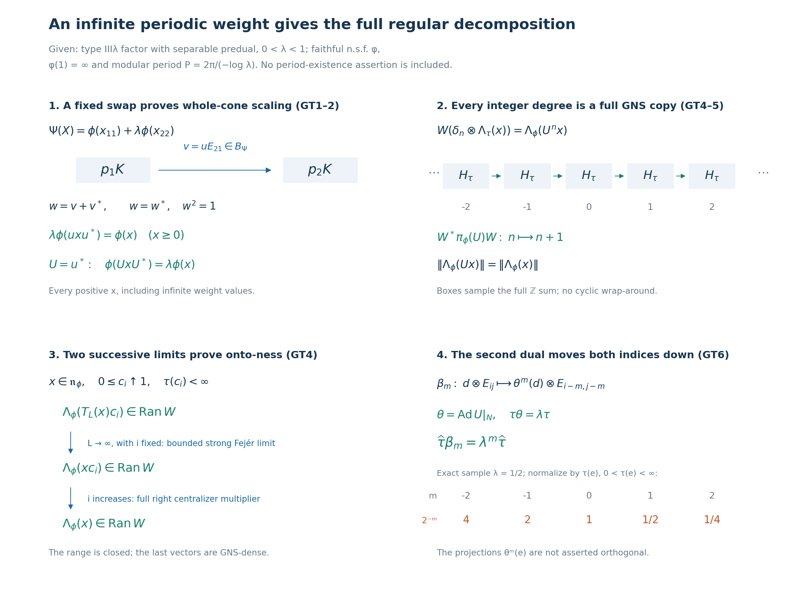

# A spectral unitary and discrete decomposition from an infinite periodic weight

*Fresh reconstruction, GPT-6 Astra (OpenAI), Ultra, 2026-10-04. CC0-1.0 to the extent of rights held.*

Let \(M\) be a nonzero type III factor with separable predual, let \(0<\lambda<1\), and assume

\[
 S(M)=\{0\}\cup\lambda^{\mathbb Z},\qquad a=-\log\lambda,\qquad
 P=2\pi/a.
 \tag{GT1}
\]
Here \(S(M)\) is the intersection of the full modular-operator spectra over all faithful normal semifinite weights. An actual faithful normal semifinite weight \(\phi\) is given with

\[
 \sigma_P^\phi=\mathrm{id},\qquad \phi(1)=\infty .
 \tag{GT2}
\]
Put \(N=M_\phi\), \(\tau=\phi|_{N_+}\), and \(\alpha_t=\sigma_t^\phi\). We construct a unitary \(U\in M\) with \(\alpha_t(U)=\lambda^{it}U\) and prove \(\phi(UxU^*)=\lambda\phi(x)\) on the entire positive cone. With \(\theta=\operatorname{Ad}U|_N\), we identify \(M\) normally with the actual regular \(N\rtimes_\theta\mathbb Z\), and identify its compact modular crossed product, its full trace and its second dual scaling. No implication from the type assumption to existence of the weight in ([GT2](OA-FLOW-GT.md#equation-gt2)) is used.

The earlier local proofs used here are [PW4–5](OA-FLOW-PW.md#pw-4), especially the full-cone and finite-extension equalities PW26–PW29; [PF1–7](OA-FLOW-PF.md#pf-1), especially the qualified infinite-trace projection comparison [PF6](OA-FLOW-PF.md#oa-flow.pf.6); [BC1–5](OA-FLOW-BC.md#oa-flow.bc.1) for full balanced weights, closed domains and scalar modular factors; [CZ0](OA-FLOW-CZ.md#oa-flow.cz.0) for right centralizer multipliers and whole-weight invariance; [CT1 and CT3](OA-FLOW-CT.md#oa-flow.ct.1) for all-weight graph transport and the actual finite matrix isomorphism; [GW1–4](OA-FLOW-GW.md#oa-flow.gw.1), [NF5](OA-FLOW-NF.md#oa-flow.nf.5), ST2, and MW4 for exact GNS domains, normal representations and bounded topology; [CP6](OA-FLOW-CP.md#oa-flow.cp.6), [SF3](OA-FLOW-SF.md#oa-flow.sf.sf3) and [GNS7.1](OA-FLOW-GNS.md#gns-lemma-7-1) for vector-series tests, bounded integration and Hilbert direct sums. The complete discrete/compact normal duality and tensor trace are [VD0–6](OA-FLOW-VD.md#vd-discrete-regular), including VD's proved tensor commutant and onto Fourier/shear map.

The human development source actually read is [Connes, Theorem 4.3.2 and Corollary 4.3.3, original printed pp.220–222](https://numdam.org/article/ASENS_1973_4_6_2_133_0.pdf#page=89). The balanced-centralizer comparison is reconstructed below with the local full-cone unitary invariance theorem. The source's existence, general comparison and subsequent classification assertions are not imported. The regular GNS surjectivity and exact double-dual identification are supplied by the written arguments below and VD, rather than inferred from generation alone.

## GT-1. Balanced projections and a unitary in the exact modular degree

[PW4](OA-FLOW-PW.md#oa-flow.pw.4)–5 and PF prove that \(E:M\to N\), the normalized period average, is a faithful normal conditional expectation,

\[
 \phi(x)=\tau(E(x))\quad(x\in M_+),\qquad
 \phi_0(z)=\tau_0(E(z))\quad(z\in\mathfrak m_\phi).
 \tag{GT3}
\]
Here \(N\) is a countably decomposable type \(\mathrm{II}_\infty\) factor and \(\tau\) is a faithful normal semifinite trace. The type conclusion uses [PF5](OA-FLOW-PF.md#oa-flow.pf.5)'s proved finite-projection/finite-trace criterion, not merely \(\tau(1)=\infty\). The exact restriction domains are

\[
 \mathfrak n_\tau=\mathfrak n_\phi\cap N,\qquad
 \mathfrak m_\tau=\mathfrak m_\phi\cap N .
 \tag{GT4}
\]

On \(B=M_2(M)\), let \(p_i=E_{ii}\), and use BC's actual balanced weight

\[
 \Psi(X)=\phi(x_{11})+\lambda\phi(x_{22})\quad(X\in B_+).
 \tag{GT5}
\]
It is faithful normal semifinite on every positive matrix. [BC1](OA-FLOW-BC.md#oa-flow.bc.1) gives the complete finite left ideal: all four entries belong to \(\mathfrak n_\phi\). Its finite-star domain consists of matrices over \(\mathfrak n_\phi\cap\mathfrak n_\phi^*\), since multiplication of the base weight by the positive scalar \(\lambda\) changes no finite ideal. [BC2](OA-FLOW-BC.md#oa-flow.bc.2) and [BC5](OA-FLOW-BC.md#oa-flow.bc.5) identify the full closed modular operators in the four GNS components, and give

\[
 \sigma_t^\Psi(X)=
 \begin{pmatrix}
 \alpha_t(x_{11})&\lambda^{-it}\alpha_t(x_{12})\\
 \lambda^{it}\alpha_t(x_{21})&\alpha_t(x_{22})
 \end{pmatrix}.
 \tag{GT6}
\]
Equivalently this follows from [CZ6](OA-FLOW-CZ.md#oa-flow.cz.6) with the bounded nonsingular density \(\operatorname{diag}(1,\lambda)\). In particular the scalar factors are fixed by the balanced weight itself.

Since \(\lambda^{iP}=e^{-2\pi i}=1\), the action ([GT6](OA-FLOW-GT.md#equation-gt6)) has period \(P\). [CT3](OA-FLOW-CT.md#oa-flow.ct.3) is a normal isomorphism \(M_2(M)\cong M\), with normal inverse, so \(B\) has separable predual, is type III and has precisely the intersection ([GT1](OA-FLOW-GT.md#equation-gt1)). For separability, pulling back normal functionals through this isomorphism and its inverse is an isometric Banach-space isomorphism of preduals. PF therefore applies to \(\Psi\). Its centralizer \(B_\Psi\) is a countably decomposable type \(\mathrm{II}_\infty\) factor, with trace \(\Psi|_{(B_\Psi)_+}\). Both projections \(p_1,p_2\) are fixed by ([GT6](OA-FLOW-GT.md#equation-gt6)), and

\[
 \Psi(p_1)=\Psi(p_2)=\infty .
 \tag{GT7}
\]
[PF6](OA-FLOW-PF.md#oa-flow.pf.6) now gives a partial isometry \(v\in B_\Psi\) with \(v^*v=p_1\), \(vv^*=p_2\). These identities imply \(v=p_2vp_1\): the norm of \(v(1-p_1)\xi\) is zero for every \(\xi\), and similarly \((1-p_2)v=0\). Hence \(v=uE_{21}\) for one \(u\in M\), with

\[
 u^*u=uu^*=1,\qquad \alpha_t(u)=\lambda^{-it}u .
 \tag{GT8}
\]
The last identity is precisely the lower-left entry of \(\sigma_t^\Psi(v)=v\). Define \(U=u^*\). Then

\[
 U^*U=UU^*=1,\qquad
 \alpha_t(U)=\lambda^{it}U=e^{-iat}U .
 \tag{GT9}
\]
No finite-weight assertion about this unitary or its adjoint is made; indeed their squared norms in the weight would both be \(\phi(1)=\infty\).

## GT-2. Full positive-cone scaling and the exact finite domains

Because \(p_1p_2=0\), one has \(v^2=(v^*)^2=0\). Thus

\[
 w=v+v^*=w^*,\qquad w^2=p_1+p_2=1_B,\qquad w\in B_\Psi .
 \tag{GT10}
\]
Apply [CZ0](OA-FLOW-CZ.md#oa-flow.cz.0)'s complete unitary-invariance statement to this actual unitary and to \(\operatorname{diag}(x,0)\), for any \(x\in M_+\). Matrix multiplication gives

\[
 w\operatorname{diag}(x,0)w^*=\operatorname{diag}(0,uxu^*),
 \qquad \lambda\phi(uxu^*)=\phi(x).
 \tag{GT11}
\]
This identity includes infinite values. Substituting \(x=UyU^*\) proves

\[
 \boxed{\ \phi(UyU^*)=\lambda\phi(y)\quad(y\in M_+).\ }
 \tag{GT12}
\]
There is no attempt to deduce ([GT12](OA-FLOW-GT.md#equation-gt12)) by applying the initial Tomita involution to a vector of infinite weight.

Conjugation by \(U\) commutes with every \(\alpha_t\), since its scalar eigencharacter cancels against the character of \(U^*\). It therefore preserves \(N\), in both directions. Set

\[
 \theta=\operatorname{Ad}U|_N .
 \tag{GT13}
\]
This is a normal automorphism with normal inverse, and ([GT12](OA-FLOW-GT.md#equation-gt12)) gives \(\tau\theta=\lambda\tau\) on all of \(N_+\). Iteration and substitution through the inverse give, for every integer \(r\),

\[
 \phi(U^r yU^{-r})=\lambda^r\phi(y),\qquad
 \tau(\theta^r(d))=\lambda^r\tau(d)
 \quad(y\in M_+,\ d\in N_+).
 \tag{GT14}
\]
Multiplication by each finite positive constant is taken in \([0,\infty]\); no infinite values are subtracted.

Write \(F_\phi=\{y\in M_+:\phi(y)<\infty\}\), \(A_\phi=\mathfrak n_\phi\cap\mathfrak n_\phi^*\), and \(\mathfrak m_\phi=\operatorname{span}\mathfrak n_\phi^*\mathfrak n_\phi\). Equation ([GT14](OA-FLOW-GT.md#equation-gt14)), applied to positive elements and to \(x^*x\), proves

\[
 \operatorname{Ad}(U^r)(F_\phi)=F_\phi,\quad
 \operatorname{Ad}(U^r)(\mathfrak n_\phi)=\mathfrak n_\phi,\quad
 \operatorname{Ad}(U^r)(A_\phi)=A_\phi,\quad
 \operatorname{Ad}(U^r)(\mathfrak m_\phi)=\mathfrak m_\phi .
 \tag{GT15}
\]
The inverse inclusions follow by replacing \(r\) with \(-r\). On the finite linear algebra uniqueness of the extension from its finite positive cone gives

\[
 \phi_0(U^r zU^{-r})=\lambda^r\phi_0(z)
 \quad(z\in\mathfrak m_\phi).
 \tag{GT16}
\]
The same conclusions hold for \(\tau,\theta^r\) in \(N\).

There are also exact one-sided domain statements:

\[
 U^r\mathfrak n_\phi=\mathfrak n_\phi,\qquad
 \mathfrak n_\phi U^r=\mathfrak n_\phi,\qquad
 \|\Lambda_\phi(U^r x)\|=\|\Lambda_\phi(x)\|,\qquad
 \|\Lambda_\phi(xU^r)\|=\lambda^{-r/2}\|\Lambda_\phi(x)\|.
 \tag{GT17}
\]
For the left identities \((U^r x)^*U^r x=x^*x\). For the right identities use
\(\phi(U^{-r}x^*xU^r)=\lambda^{-r}\phi(x^*x)\); the reverse inclusions use \(-r\). Adjointing these identities proves two-sided invariance of \(A_\phi\). For \(\mathfrak m_\phi\), left multiplication sends \(y^*x\) to \((yU^{-r})^*x\), and right multiplication sends it to \(y^*(xU^r)\); all factors remain in the finite left ideal. Applying ([GT16](OA-FLOW-GT.md#equation-gt16)) to \(zU^r\) consequently gives the valid finite-domain relation

\[
 \phi_0(U^r z)=\lambda^r\phi_0(zU^r)
 \quad(z\in\mathfrak m_\phi).
 \tag{GT18}
\]
These statements specify the domains before any complex-valued finite extension is evaluated.

## GT-3. Every degree and the entire generated algebra

Use the Fourier maps and degree spaces proved in [PF1](OA-FLOW-PF.md#oa-flow.pf.1):

\[
 P_n(x)=\frac1P\int_0^P e^{iant}\alpha_t(x)\,dt,\qquad
 M_n=\{x:\alpha_t(x)=e^{-iant}x\text{ for all }t\}.
 \tag{GT19}
\]
The integral is the bounded vector integral, \(P_n(M)=M_n\), and \(P_0=E\). Equation ([GT9](OA-FLOW-GT.md#equation-gt9)) puts \(U\) in degree one. If \(y\in M_n\), then \(U^{-n}y\) and \(yU^{-n}\) are fixed; conversely every \(U^n d\) or \(dU^n\), \(d\in N\), has degree \(n\). Therefore

\[
 M_n=U^n N=NU^n,\qquad
 E(U^n)=
 \begin{cases}1&n=0,\\0&n\ne0.\end{cases}
 \tag{GT20}
\]
This also shows \(E(U^n d)=0\) for \(n\ne0\) and \(E(d)=d\). More generally \(E(UxU^*)=UE(x)U^*\): conjugation commutes with \(\alpha_t\), and bounded multiplication passes through the vector integral.

[PF1](OA-FLOW-PF.md#oa-flow.pf.1) proves, for every \(x\in M\),

\[
 T_L(x)=\sum_{|n|<L}(1-|n|/L)P_n(x),\qquad
 \|T_L(x)\|\leq\|x\|,\qquad T_L(x)\longrightarrow x
 \text{ strongly-* in the faithful GNS representation.}
 \tag{GT21}
\]
Its positive Fejér kernels and vector continuity give this limit on every vector; no finite-weight hypothesis on \(x\) is required. Equations ([GT20](OA-FLOW-GT.md#equation-gt20))–([GT21](OA-FLOW-GT.md#equation-gt21)) show

\[
 M=(N\cup\{U\})'' .
 \tag{GT22}
\]
The equality also holds in the faithful normal \(\phi\)-GNS image, either by the same bounded Fejér proof or by ST2's bounded topology transport. Generation alone will not be used as a crossed-product isomorphism theorem.

## GT-4. The onto regular GNS unitary

Let \((H_\tau,\pi_\tau,\Lambda_\tau)\) and \((H_\phi,\pi_\phi,\Lambda_\phi)\) be the actual GNS constructions. [GW3](OA-FLOW-GW.md#oa-flow.gw.3)–4 and [NF5](OA-FLOW-NF.md#oa-flow.nf.5) prove that both representations are faithful normal and unital. ST2 makes their images von Neumann algebras and gives ultraweakly continuous inverses. These assertions apply to the infinite weights here; neither \(\Lambda_\tau(1)\) nor \(\Lambda_\phi(1)\) is used.

On the algebraic direct sum of copies of \(\Lambda_\tau(\mathfrak n_\tau)\), define

\[
 W(\delta_n\otimes\Lambda_\tau(x))=\Lambda_\phi(U^n x)
 \quad(n\in\mathbb Z,\ x\in\mathfrak n_\tau).
 \tag{GT23}
\]
The right side is defined by ([GT4](OA-FLOW-GT.md#equation-gt4)) and the left-ideal property. For \(x,y\in\mathfrak n_\tau\), first-variable-linear inner products, ([GT3](OA-FLOW-GT.md#equation-gt3)) and the \(N\)-bimodule property of \(E\) give

\[
 \begin{split}
 \langle\Lambda_\phi(U^n x),\Lambda_\phi(U^m y)\rangle
 &=\phi_0(y^*U^{\,n-m}x)\\
 &=\tau_0\big(y^*E(U^{\,n-m})x\big)
 =\delta_{nm}\tau_0(y^*x).
 \end{split}
 \tag{GT24}
\]
The first product lies in \(\mathfrak m_\phi\), because both \(U^n x,U^m y\) belong to \(\mathfrak n_\phi\). Thus the use of ([GT3](OA-FLOW-GT.md#equation-gt3)) is within its exact domain. The expression in the last line belongs to \(\mathfrak m_\tau\). Consequently \(W\) is well defined and isometric on the algebraic direct sum, and extends to an isometry

\[
 W:\ell^2(\mathbb Z,H_\tau)\longrightarrow H_\phi .
 \tag{GT25}
\]
Its range is closed. We prove that it is the entire space.

[GW4](OA-FLOW-GW.md#oa-flow.gw.4) applied to the faithful normal semifinite trace on \(N\) gives positive contractions \(c_i\in N\), with \(\tau(c_i)<\infty\), increasing strongly to \(1\). Since \(c_i^2\leq c_i\), these elements belong to \(\mathfrak n_\tau\), hence to \(\mathfrak n_\phi\). For every \(x\in\mathfrak n_\phi\), [CZ0](OA-FLOW-CZ.md#oa-flow.cz.0) gives the exact right-multiplier identity

\[
 xc_i\in\mathfrak n_\phi,\qquad
 \Lambda_\phi(xc_i)=J_\phi\pi_\phi(c_i)J_\phi\Lambda_\phi(x)
 \longrightarrow\Lambda_\phi(x).
 \tag{GT26}
\]
Normality of \(\pi_\phi\) preserves the increasing supremum of \(c_i\); the bounded positive convergence proof gives \(\pi_\phi(c_i)\to I\) strongly. Antiunitarity of \(J_\phi\) gives the displayed vector limit.

Fix \(i\). For each \(L\), the left-ideal property gives \(T_L(x)c_i\in\mathfrak n_\phi\), and ([GT21](OA-FLOW-GT.md#equation-gt21)) gives

\[
 \begin{split}
 \|\Lambda_\phi(T_L(x)c_i)-\Lambda_\phi(xc_i)\|
 &=\|\pi_\phi(T_L(x)-x)\Lambda_\phi(c_i)\|
 \longrightarrow0 .
 \end{split}
 \tag{GT27}
\]
For each of its finitely many degrees, put \(z_n=U^{-n}P_n(x)c_i\). The first factor \(U^{-n}P_n(x)\) belongs to \(N\) by ([GT20](OA-FLOW-GT.md#equation-gt20)). Thus \(z_n\in\mathfrak n_\tau\) by its left-ideal property, and

\[
 \Lambda_\phi(T_L(x)c_i)
 =W\!\left(\sum_{|n|<L}(1-|n|/L)
                   \delta_n\otimes\Lambda_\tau(z_n)\right).
 \tag{GT28}
\]
Closedness of the range and ([GT27](OA-FLOW-GT.md#equation-gt27)) put \(\Lambda_\phi(xc_i)\) in the range; ([GT26](OA-FLOW-GT.md#equation-gt26)) then puts \(\Lambda_\phi(x)\) there. The full GNS range of \(\mathfrak n_\phi\) is dense, so \(W\) is onto and hence unitary. These are two successive vector limits; no assertion that an unbounded GNS map commutes with an operator integral or an uncontrolled joint limit is needed.

## GT-5. The full normal discrete crossed-product isomorphism

For \(d\in N\), on the dense elementary vectors of ([GT23](OA-FLOW-GT.md#equation-gt23)),

\[
 \begin{split}
 W^*\pi_\phi(d)W(\delta_n\otimes\Lambda_\tau(x))
 &=\delta_n\otimes
       \pi_\tau(\theta^{-n}(d))\Lambda_\tau(x),\\
 W^*\pi_\phi(U)W(\delta_n\otimes\eta)
 &=\delta_{n+1}\otimes\eta .
 \end{split}
 \tag{GT29}
\]
The first equality uses \(dU^n=U^n\theta^{-n}(d)\) and the finite left ideal; the second first holds for \(\eta=\Lambda_\tau(x)\), then for every \(\eta\in H_\tau\) by density. Boundedness extends both formulas to the whole Hilbert sum.

Identify \(N\) with its faithful normal image \(A=\pi_\tau(N)\), and write \(\widetilde\theta=\pi_\tau\theta\pi_\tau^{-1}\). [VD0](OA-FLOW-VD.md#oa-flow.vd.0) constructs, on \(\ell^2(\mathbb Z,H_\tau)\), the actual regular crossed product \(C\), with generators

\[
 (\pi(d)\xi)_n=\pi_\tau(\theta^{-n}(d))\xi_n,\qquad
 (s\xi)_n=\xi_{n-1},\qquad
 C=(\pi(N)\cup\{s\})''.
 \tag{GT30}
\]
Here \(\pi(d)\) denotes the regular representation of \(d\), not \(\pi_\tau(d)\) acting on one coordinate. [VD0](OA-FLOW-VD.md#oa-flow.vd.0) proves its full normality and the normal inverse onto its diagonal image.

Equations ([GT22](OA-FLOW-GT.md#equation-gt22)) and ([GT29](OA-FLOW-GT.md#equation-gt29)), together with the onto unitary \(W\), give

\[
 WCW^*=\pi_\phi(M),\qquad
 \Xi=\pi_\phi^{-1}\operatorname{Ad}W:
 N\rtimes_\theta\mathbb Z\xrightarrow{\ \cong\ }M,
 \qquad \Xi(\pi(d))=d,\quad\Xi(s)=U .
 \tag{GT31}
\]
This is an isomorphism on the complete von Neumann algebras. Unitary conjugation and the normal GNS isomorphism are ultraweakly continuous in both directions by the actual vector-series/ST2 proofs; hence \(\Xi\) and its inverse are normal on their entire domains. The notation \(N\rtimes_\theta\mathbb Z\) in ([GT31](OA-FLOW-GT.md#equation-gt31)) uses the specified faithful trace-GNS representation, so no representation-independence theorem is tacit.

The regular compact action in [VD0](OA-FLOW-VD.md#oa-flow.vd.0) is \(\gamma_z(\pi(d))=\pi(d)\), \(\gamma_z(s)=\overline z\,s\). Let

\[
 \kappa_{e^{iat}}=\sigma_t^\phi .
 \tag{GT32}
\]
It is well defined by the period \(P\), and is pointwise strongly continuous on the circle in the faithful GNS representation by MW4. On the generators, ([GT9](OA-FLOW-GT.md#equation-gt9)) gives \(\Xi\gamma_{e^{iat}}\Xi^{-1}=\sigma_t^\phi\). The maps agree everywhere: they are normal, agree on all finite Laurent polynomials, and the bounded Fejér approximants converge ultraweakly to each element. Therefore

\[
 \Xi\gamma_z\Xi^{-1}=\kappa_z\quad(z\in\mathbb T).
 \tag{GT33}
\]
In particular the modular action uses the negative compact-dual convention. Its normalized average is exactly \(E\), since \(z=e^{iat}\) transports \(dt/P\) to normalized circle measure.

## GT-6. Compact double dual, all matrix units and full trace scaling

Form the actual regular compact crossed product \(D=M\rtimes_\kappa\mathbb T\) using the faithful normal representation \(\pi_\phi\): on \(L^2(\mathbb T,H_\phi)\) its generators are

\[
 (j(x)f)(z)=\pi_\phi(\kappa_{z^{-1}}(x))f(z),\qquad
 (\ell(w)f)(z)=f(w^{-1}z).
 \tag{GT34}
\]
The pointwise unitary \(f(z)\mapsto Wf(z)\) from \(L^2(\mathbb T,\ell^2(\mathbb Z,H_\tau))\) onto \(L^2(\mathbb T,H_\phi)\) transports VD's regular second representation to ([GT34](OA-FLOW-GT.md#equation-gt34)), by ([GT31](OA-FLOW-GT.md#equation-gt31))–([GT33](OA-FLOW-GT.md#equation-gt33)). It preserves strong measurability and the \(L^2\) norm first on simple functions, then on the completed spaces; its inverse is pointwise \(W^*\). Thus VD applies to this actual \(D\), not to an unspecified abstract completion.

Write \(S\delta_k=\delta_{k+1}\), \(d_w\delta_k=w^{-k}\delta_k\) on \(\ell^2(\mathbb Z)\), and let \(E_{ij}\) be its matrix units. [VD1](OA-FLOW-VD.md#oa-flow.vd.1)–3 prove a normal onto isomorphism with normal inverse

\[
 \Phi:D\xrightarrow{\ \cong\ }N\bar\otimes B(\ell^2(\mathbb Z))
 \tag{GT35}
\]
with the exact formulas

\[
 \Phi(j(d))=\sum_k\theta^{-k}(d)\otimes E_{kk},\qquad
 \Phi(j(U))=1\otimes S,\qquad \Phi(\ell(w))=1\otimes d_w .
 \tag{GT36}
\]
The tensor algebra is taken on \(H_\tau\otimes\ell^2(\mathbb Z)\), identifying \(N\) with \(\pi_\tau(N)\). [VD2](OA-FLOW-VD.md#oa-flow.vd.2) proves that it consists of exactly the bounded arrays with entries in this concrete \(N\); its finite-corner norm and positivity tests and its tensor commutant are proved there. The sum in ([GT36](OA-FLOW-GT.md#equation-gt36)) is the full bounded strong-star diagonal sum.

For clarity its complete coefficient and matrix-unit embeddings are

\[
 \begin{aligned}
 q_k&=\int_{\mathbb T}w^k\ell(w)\,dm(w),&
 f_{ij}&=j(U)^i q_0j(U)^{-j},\\
 \iota(d)&=\sum_k j(\theta^k(d))q_k,&
 \Phi(f_{ij})&=1\otimes E_{ij},&
 \Phi(\iota(d))&=d\otimes1 .
 \end{aligned}
 \tag{GT37}
\]
The integral is a bounded strong-vector integral in \(D\), and the sum is bounded strong-star, as proved in [VD3](OA-FLOW-VD.md#oa-flow.vd.3). The \(f_{ij}\) satisfy the matrix-unit relations, with \(\sum_i f_{ii}=1\) strongly. The embedding \(\iota\) generally differs from \(j|_N\); the \(\theta^k\) correction in its definition cancels the \(\theta^{-k}\) in ([GT36](OA-FLOW-GT.md#equation-gt36)). All indices range over \(\mathbb Z\).

The second negative dual action \(\beta_m\), \(m\in\mathbb Z\), is implemented in ([GT34](OA-FLOW-GT.md#equation-gt34)) by scalar multiplication by \(z^{-m}\). [VD4](OA-FLOW-VD.md#oa-flow.vd.4) gives, on the full algebras,

\[
 \beta_m(j(x))=j(x),\qquad
 \beta_m(\ell(w))=w^{-m}\ell(w),\qquad
 \Phi\beta_m\Phi^{-1}=\theta^m\bar\otimes\operatorname{Ad}(S^{-m}).
 \tag{GT38}
\]
In particular it sends \(\iota(d)\) to \(\iota(\theta^m(d))\) and \(f_{ij}\) to \(f_{i-m,j-m}\). This fixes the sign without appeal to a choice of unnamed dual convention.

On every bounded positive array \(X=(X_{jk})\) in the target of ([GT35](OA-FLOW-GT.md#equation-gt35)), define

\[
 \mathcal T(X)=\sum_{k\in\mathbb Z}\tau(X_{kk})
             =\sup_{J\subset\mathbb Z\ \mathrm{finite}}
                         \sum_{k\in J}\tau(X_{kk}).
 \tag{GT39}
\]
[VD5](OA-FLOW-VD.md#oa-flow.vd.5) proves that this is a faithful normal semifinite trace on its entire positive cone, including infinite values. Its proof uses arbitrary-net normality, complete positive row/column sums, and finite below-\(X\) cutoffs; it does not rely only on finite matrices. Its exact domains are

\[
 \begin{split}
 \mathfrak n_{\mathcal T}
 &=\left\{Y\in N\bar\otimes B(\ell^2\mathbb Z):
               \sum_{j,k}\tau(Y_{jk}^*Y_{jk})<\infty\right\},\\
 A_{\mathcal T}&=\mathfrak n_{\mathcal T}\cap\mathfrak n_{\mathcal T}^*,
 \qquad
 \mathfrak m_{\mathcal T}
 =\operatorname{span}\mathfrak n_{\mathcal T}^*\mathfrak n_{\mathcal T}.
 \end{split}
 \tag{GT40}
\]
Every array here must first be a bounded operator; ([GT40](OA-FLOW-GT.md#equation-gt40)) asserts no membership for a merely formal array. The trace on \(D\) is \(\widehat\tau=\mathcal T\circ\Phi\), and its domains are the inverse images of ([GT40](OA-FLOW-GT.md#equation-gt40)). Its normalization is

\[
 \widehat\tau(\iota(d)f_{kk})=\tau(d)\quad(d\in N_+),\qquad
 \widehat\tau(1)=\infty .
 \tag{GT41}
\]
For every \(X\geq0\) and integer \(m\), ([GT14](OA-FLOW-GT.md#equation-gt14)), ([GT38](OA-FLOW-GT.md#equation-gt38)) and reindexing the nonnegative finite subsums give

\[
 \begin{split}
 \mathcal T\big((\theta^m\bar\otimes\operatorname{Ad}S^{-m})(X)\big)
 &=\sum_k\tau(\theta^m(X_{k+m,k+m}))\\
 &=\lambda^m\sum_k\tau(X_{k+m,k+m})
 =\lambda^m\mathcal T(X).
 \end{split}
 \tag{GT42}
\]
Consequently \(\widehat\tau\beta_m=\lambda^m\widehat\tau\) on all of \(D_+\). The finite ideals and finite-star/finite linear domains are preserved by \(\beta_m\), by applying this full-cone identity and its inverse to \(Y^*Y\) and to finite products; the finite linear extension scales by the same factor. Finally PF proves that \(N\) is a nonzero semifinite factor without minimal projections. [VD6](OA-FLOW-VD.md#oa-flow.vd.6)'s explicit center, minimal-corner and proper-isometry proofs therefore make \(D\) a type \(\mathrm{II}_\infty\) factor.

The conclusions establish a scaling spectral unitary, exact finite domains, the full regular discrete representation, and its compact double dual and trace, under ([GT1](OA-FLOW-GT.md#equation-gt1))–([GT2](OA-FLOW-GT.md#equation-gt2)). They do not construct an infinite periodic weight from a finite one, produce a period or inner period from the type parameter, compare arbitrary generalized traces, prove a converse classification theorem, or assert general \(S/\Gamma\) or LCA duality results.

### A balanced swap, a complete regular space, and the direction of scaling

The diagram explains [GT1–2](OA-FLOW-GT.md#gt-1), [GT4–5](OA-FLOW-GT.md#gt-4), and [GT6](OA-FLOW-GT.md#gt-6). Its hypotheses are exactly a nonzero separable-predual type III factor with \(S(M)=\{0\}\cup\lambda^{\mathbb Z}\), \(0<\lambda<1\), and a given faithful normal semifinite \(\phi\) with \(\phi(1)=\infty\) and \(\sigma_{2\pi/(-\log\lambda)}^\phi=\mathrm{id}\). The Hilbert spaces need not be separable. This is an operator proof diagram, not a finite-dimensional model of a type III factor.

The first panel takes the balanced weight \(\Psi(X)=\phi(x_{11})+\lambda\phi(x_{22})\). Its fixed diagonal projections \(p_1,p_2\) have infinite trace in the countably decomposable factor \(B_\Psi\). PF's proved comparison supplies \(v\in B_\Psi\), \(v^*v=p_1\), \(vv^*=p_2\). The arrow between the two projection ranges denotes this partial isometry, whose only matrix entry is \(u\) in position \((2,1)\). The entry identities imply that \(u\) is unitary in \(M\).

For \(U=u^*\), the complete matrix calculations are
\[
 v=\begin{pmatrix}0&0\\u&0\end{pmatrix},\qquad
 w=v+v^*=\begin{pmatrix}0&u^*\\u&0\end{pmatrix},\qquad
 w=w^*,\quad w^2=1,\quad w\in B_\Psi .
\]
Hence [CZ0](OA-FLOW-CZ.md#oa-flow.cz.0) applies to a genuine fixed unitary. For every positive \(x\), including infinite weight values,
\[
 \Psi\!\left(w\begin{pmatrix}x&0\\0&0\end{pmatrix}w^*\right)
 =\Psi\!\begin{pmatrix}x&0\\0&0\end{pmatrix},
 \qquad \lambda\phi(uxu^*)=\phi(x).
\]
Substitution through \(U=u^*\) yields \(\phi(UxU^*)=\lambda\phi(x)\), while the fixed lower-left block of the modular action yields \(\sigma_t^\phi(U)=\lambda^{it}U\). The scaling proof never assigns a finite GNS vector to \(U\): its squared weight norm would be \(\phi(1)=\infty\).

The second panel shows the exact regular Hilbert space. Each box labelled \(H_\tau\) is one copy of the complete trace GNS space, and the displayed five boxes are a finite window of the full \(\mathbb Z\)-indexed sum. The map is
\[
 W:\ell^2(\mathbb Z,H_\tau)\longrightarrow H_\phi,\qquad
 W(\delta_n\otimes\Lambda_\tau(x))=\Lambda_\phi(U^n x)
 \quad(x\in\mathfrak n_\tau).
\]
[GT24](OA-FLOW-GT.md#equation-gt24) proves orthogonality and norm preservation using \(\phi_0=\tau_0E\) only on the proved finite linear algebra. The horizontal arrows record \(W^*\pi_\phi(U)W:\delta_n\otimes\eta\mapsto\delta_{n+1}\otimes\eta\). They do not insert a factor \(\lambda^{1/2}\), because left multiplication by a unitary preserves the GNS norm. The distinct right multiplication norm factor is \(\|\Lambda_\phi(xU)\|=\lambda^{-1/2}\|\Lambda_\phi(x)\|\), as proved in [GT17](OA-FLOW-GT.md#equation-gt17).

The third panel explains why the isometry \(W\) is onto. For \(x\in\mathfrak n_\phi\), take the increasing positive contractions \(c_i\in N\), with \(\tau(c_i)<\infty\), and then hold \(i\) fixed. The bounded Fejér sums give
\[
 \Lambda_\phi(T_L(x)c_i)\ \longrightarrow\
 \Lambda_\phi(xc_i)\ \longrightarrow\ \Lambda_\phi(x).
\]
The first limit is \(L\to\infty\) at fixed \(i\), by evaluating bounded strong operator convergence at \(\Lambda_\phi(c_i)\). Each vector on the left belongs to \(\operatorname{Ran}W\), since each coefficient is \(U^n z_n\) with
\[
 z_n=U^{-n}P_n(x)c_i\in\mathfrak n_\tau .
\]
The second limit is the net limit in \(i\), by the full identity \(\Lambda_\phi(xc_i)=J_\phi\pi_\phi(c_i)J_\phi\Lambda_\phi(x)\). Closedness of the isometric range gives the middle and then the last vector. Density of the complete GNS range proves surjectivity. The two arrows denote successive limits, not an unproved joint convergence or interchange of an unbounded map with integration.

The final panel fixes all dual signs. With \(\theta=\operatorname{Ad}U|_N\), the negative compact dual sends the regular degree-one unitary to \(\overline z\,U\). Thus \(z=e^{iat}\), \(a=-\log\lambda\), gives the modular action. In the full compact double crossed product, the proved tensor map has
\[
 \Phi(j(d))=\sum_k\theta^{-k}(d)\otimes E_{kk},\qquad
 \Phi(j(U))=1\otimes S,\qquad S\delta_k=\delta_{k+1}.
\]
The second negative dual action is
\[
 \Phi\beta_m\Phi^{-1}
 =\theta^m\bar\otimes\operatorname{Ad}(S^{-m}),\qquad
 d\otimes E_{ij}\longmapsto\theta^m(d)\otimes E_{i-m,j-m}.
\]
For \(m=1\), the figure shows both indices moving down by one. This does not change the infinite index set or impose cyclic wrap-around.

The tensor trace is \(\mathcal T(X)=\sum_k\tau(X_{kk})\) on every bounded positive array, with each sum the supremum of its finite nonnegative subsums. Therefore
\[
 \widehat\tau\beta_m=\lambda^m\widehat\tau,\qquad
 \widehat\tau=\mathcal T\Phi .
\]
The small numerical row chooses only \(\lambda=1/2\). For any nonzero finite-trace projection \(e\in N\), the displayed exact ratios are
\[
 \frac{\tau(\theta^m(e))}{\tau(e)}=2^{-m},\qquad
 (m=-2,-1,0,1,2),\quad (2^{-m}=4,2,1,1/2,1/4).
\]
PF supplies such an \(e\). Its iterates are not asserted to be orthogonal, and the row is not a finite truncation used to define the trace. It illustrates the scalar direction of the full-cone identity.

The balanced-projection mechanism is attributed to [Connes, Theorem 4.3.2 and Corollary 4.3.3, original printed pp.220–222](https://numdam.org/article/ASENS_1973_4_6_2_133_0.pdf#page=89). The entire local proof, including full finite domains and the actual normal crossed-product identification, is [GT1](OA-FLOW-GT.md#oa-flow.gt.1)–6 with its precise preceding providers. Period existence and finite-to-infinite weight amplification remain separate from this diagram and theorem.

[Editable SVG](../assets/generalized-trace/assets/generalized-trace-mechanism.svg), [exact data](../assets/generalized-trace/FIGURE_DATA.json), and [reproduction source](../assets/generalized-trace/render_generalized_trace.py). The original diagram, data, caption and reconstruction are CC0-1.0 to the extent of rights held. Planar projection boxes and integer-indexed arrows display the actual mechanism without introducing unnecessary geometry.
