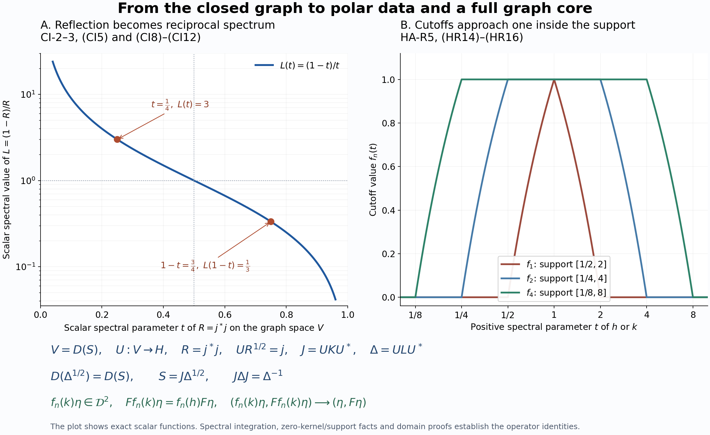

# Bounded vectors, affiliated multipliers and the complete dual Hilbert algebra

*Fresh local proof by GPT-6 Astra (OpenAI), Ultra, 2026-10-04. CC0-1.0 to the extent of rights in this exposition.*

The Hilbert space is arbitrary. Inner products are linear in the first variable. The inputs are [CI-1–3](OA-FLOW-CI.md#oa-flow.ci.1), [BD-1–4](OA-FLOW-BD.md#oa-flow.bd.1), their exact spectral inputs, and only the closed-form representation proved in [FF-4](OA-FLOW-FF.md#oa-flow.ff.5). In particular the Fourier and modular parts of those later applications are not inputs here. The earlier Hilbert facts are [SF-0](OA-FLOW-SF.md#oa-flow.shared-foundations.sf-0) and [SB-0](OA-FLOW-SF.md#OA-FLOW.SF.SB0); the full spectral-domain proof is [SB-1–SB-6](OA-FLOW-SF.md#OA-FLOW.SF.SB1). Scalar spectral convergence uses [SC-04–05](OA-FLOW-SC.md#sc-04).

A free human development route is [Boey's institutional thesis, Definitions 4.1/4.3 and Lemmas 4.6–4.10, printed pp.25–31](https://dspacemainprd01.lib.uwaterloo.ca/server/api/core/bitstreams/245c2a41-48ee-4c8d-ad38-95a8353dc3d1/content#page=31). The proof below supplies the graph-core, closed-range-support, cutoff membership and full-domain arguments needed by the modular application. 

## HA-R1. The initial algebra and its bounded right vectors

Let \(\mathcal A\) be a dense complex algebra in \(H\), with a conjugate-linear involution \(a\mapsto a^\#\), such that \(\mathcal A^2\) is dense, each left multiplication \(\lambda_a b=ab\) is bounded in the Hilbert norm, \(\langle ab,c\rangle=\langle b,a^\#c\rangle\), and the involution is closable. Here \(\mathcal A^2\) means the linear span of products. Then
\(\lambda_{ab}=\lambda_a\lambda_b\) and \(\lambda_{a^\#}=\lambda_a^*\). The representation is nondegenerate because the span of its ranges contains \(\mathcal A^2\). It is faithful: if \(\lambda_a=0\), then \(b^\#a^\#=0\) for all \(b\); nondegeneracy makes the common kernel zero, hence \(a^\#=a=0\).

Let \(M=\lambda(\mathcal A)''\), \(N=M'\), \(S=\overline{\#}\) and \(F=S^*\). CI proves that both \(S,F\) are closed densely defined conjugate-linear involutions. Call \(\eta\in H\) right bounded when the map \(a\mapsto\lambda_a\eta\) on \(\mathcal A\) is bounded in \(\|a\|_H\); denote its extension by \(R_\eta\). Write \(B_r\) for these vectors. Associativity on \(\mathcal A\) gives \(R_\eta\in N\). The map \(\eta\mapsto R_\eta\) is injective, because \(R_\eta=0\) implies \(\lambda_a\eta=0\) for every \(a\). For \(x\in N\),
\[
x\eta\in B_r,\qquad R_{x\eta}=xR_\eta.
\tag{HR1}
\]
Consequently \(I=\{R_\eta:\eta\in B_r\}\) is a linear left ideal of \(N\).

## HA-R2. Adjoint products and the candidate dual algebra

For \(\eta,\zeta\in B_r\), one has
\[
R_\eta^*\zeta\in D(F),\qquad F(R_\eta^*\zeta)=R_\zeta^*\eta.
\tag{HR2}
\]
Indeed for \(a\in\mathcal A\),
\[
\langle R_\eta^*\zeta,Sa\rangle
=\langle\zeta,\lambda_{a^\#}\eta\rangle
=\langle\lambda_a\zeta,\eta\rangle
=\langle a,R_\zeta^*\eta\rangle.
\]
Since \(\mathcal A\) is a graph core for \(S\), the identity extends to \(D(S)\) and is exactly the conjugate-linear adjoint criterion. By (HR1), this vector is also right bounded, with multiplier \(R_\eta^*R_\zeta\).

Put \(\mathcal D=B_r\cap D(F)\). For \(\eta\in\mathcal D\), the identity
\(\langle R_\eta a,b\rangle=\langle\eta,a^\#b\rangle
=\langle b^\#a,F\eta\rangle=\langle a,\lambda_bF\eta\rangle\)
shows that
\[
F\eta\in B_r,\qquad R_{F\eta}=R_\eta^*.
\tag{HR3}
\]
Thus \(\mathcal D\) is invariant under the involution \(F\). Define
\[
\eta\zeta=R_\zeta\eta\quad(\eta,\zeta\in\mathcal D),\qquad
R_{\eta\zeta}=R_\zeta R_\eta.
\tag{HR4}
\]
Membership in \(\mathcal D\) follows before any involution calculation: the vector is \(R_{F\zeta}^*\eta\), to which (HR2) applies. That formula then gives
\[
F(\eta\zeta)=R_\eta^*F\zeta=(F\zeta)(F\eta).
\tag{HR5}
\]
Associativity follows either by applying the bounded multipliers or by their injective reversed representation. Right multiplication is bounded, and its adjoint is right multiplication by \(F\zeta\), by (HR3). Also
\[
I^*I\subseteq R(\mathcal D).
\tag{HR6}
\]
Here and below products of linear operator spaces denote finite sums of products. Density and the core assertion will be proved, rather than included in the definition of \(\mathcal D\).

## HA-R3. The closed multiplier associated to any adjoint-domain vector

For \(\eta\in D(F)\), define \(T_\eta^0a=\lambda_a\eta\) on \(\mathcal A\). The same adjoint pairing as above gives
\[
\mathcal A\subseteq D((T_\eta^0)^*),\qquad
(T_\eta^0)^*a=\lambda_aF\eta.
\tag{HR7}
\]
Thus \(T_\eta^0\) is closable. Write \(T_\eta=\overline{T_\eta^0}\). Then
\[
\mathcal A\subseteq D(T_\eta)\cap D(T_\eta^*),\qquad
T_\eta a=\lambda_a\eta,\quad T_\eta^*a=\lambda_aF\eta.
\tag{HR8}
\]
The second formula uses equality of the adjoints of an operator and its closure. It does not assert that \(\mathcal A\) is a core for \(T_\eta^*\), or that \(T_{F\eta}=T_\eta^*\).

The graph of \(T_\eta^0\), and then its closure, is invariant under every \(\lambda_b\oplus\lambda_b\), by associativity and boundedness. It is invariant under their adjoints as well. Hence its orthogonal projection has all four entries in \(N\). It therefore commutes with \(x\oplus x\) for \(x\in M\). For every unitary \(x\in M\),
\[
xD(T_\eta)=D(T_\eta),\qquad T_\eta x=xT_\eta.
\tag{HR9}
\]
This is affiliation with \(N\). Taking adjoints gives the corresponding statement for \(T_\eta^*\).

BD-1 supplies a net \(\lambda_{a_i}\to I\) strongly; no norm bound is needed here. Testing only the fixed vectors \(\eta,F\eta\) in (HR8) gives
\[
T_\eta a_i\longrightarrow\eta,\qquad
T_\eta^*a_i\longrightarrow F\eta.
\tag{HR10}
\]
Thus \(\eta\in\overline{\operatorname{Ran}T_\eta}\) and
\(F\eta\in\overline{\operatorname{Ran}T_\eta^*}\). Actual range membership is neither proved nor used.

## HA-R4. Closed linear polar decomposition with its domains

We supply the precise unbounded linear polar result needed next. Let \(T\) be any closed densely defined linear operator on \(H\). Its closed form \(q(v,w)=\langle Tv,Tw\rangle\) on \(D(T)\) has, by FF-4, a positive self-adjoint representative \(A\) with
\[
D(A^{1/2})=D(T),\qquad
\langle Tv,Tw\rangle=\langle A^{1/2}v,A^{1/2}w\rangle.
\tag{HR11}
\]
The representative satisfies \(v\in D(A)\) exactly when \(v\in D(A^{1/2})\) and there is \(z\in H\) such that \(q(v,w)=\langle z,w\rangle\) for every \(w\in D(A^{1/2})\), and then \(Av=z\). To check the nontrivial implication directly, test on each spectral subspace \(E_A([0,n])H\). One obtains \(E_A([0,n])z=A E_A([0,n])v\). These norms are bounded by \(\|z\|\); spectral monotone convergence gives \(v\in D(A)\) and \(Av=z\). Applied to \(q\), this criterion is exactly \(Tv\in D(T^*)\), with \(z=T^*Tv\). Hence \(A=T^*T\) on the full product domain.

Set \(h=A^{1/2}\). The rule \(u(hv)=Tv\) defines an isometry from \(\operatorname{Ran}h\) onto \(\operatorname{Ran}T\), extends to their closures, and is set to zero on \(\ker h\). The resulting partial isometry has initial space \((\ker T)^\perp\) and final space \(\overline{\operatorname{Ran}T}\). The adjoint pairing gives
\[
T=uh,\qquad T^*=hu^*,\qquad
D(T^*)=\{w:u^*w\in D(h)\}.
\tag{HR12}
\]
Write \(p=u^*u,q=uu^*\). Transport \(h|_{pH}\) by the unitary \(u:pH\to qH\), and set it equal to zero on \(q^\perp H\). This defines a positive self-adjoint \(k\). Direct substitution in (HR12) shows \(k^2=TT^*\), with the full product domain, so \(k=(TT^*)^{1/2}\). It also proves
\[
T=ku,\qquad u f(h)=f(k)u
\tag{HR13}
\]
for Borel functions with \(f(0)=0\), including equality of the transported domains. The first equality has domain \(\{v:uv\in D(k)\}=D(h)=D(T)\); the kernel summands cause no loss.

If \(T\) is affiliated with \(N\), every unitary of \(N'\) commutes with \(T,T^*\), their positive products and their spectral projections. Uniqueness of the isometry defined on \(\operatorname{Ran}h\) makes it commute with \(u\) as well. The commutant-unitary test proved in SF-0 then gives \(u,p,q\in N\), and \(h,k\) are affiliated with \(N\).

## HA-R5. Cutoffs, their actual algebra membership and the graph core

Apply HA-R4 to \(T=T_\eta\), where \(\eta\in D(F)\). Let \(f\in C_c((0,\infty))\), extended to be zero at zero. All bounded functions of \(h,k\) used below lie in \(N\). For \(a\in\mathcal A\), commutation with \(\lambda_a\), (HR8), and (HR13) give
\[
\begin{split}
\lambda_a f(k)\eta&=k f(k)u a,\\
\lambda_a f(h)F\eta&=h f(h)u^*a.
\end{split}
\qquad
\begin{split}
R_{f(k)\eta}&=k f(k)u,\\
R_{f(h)F\eta}&=h f(h)u^*.
\end{split}
\tag{HR14}
\]
The left formulas are first tested on \(\mathcal A\); the boundedness of the right operators proves the asserted right boundedness and then their equality everywhere. No identity between two unbounded adjoints beyond (HR8) is assumed.

It follows that \(hf(h)=u^*R_{f(k)\eta}\) and \(kf(k)=uR_{f(h)F\eta}\) belong to \(I\). Choose \(g\in C_c((0,\infty))\) with \(g(t)=1/t\) on \(\operatorname{supp}f\). Then \(f(h)=g(h)hf(h)\in I\), and likewise \(f(k)\in I\). Choose real \(f_1\in C_c((0,\infty))\) equal to one on \(\operatorname{supp}f\), and write \(f=\overline{f_1}f_2\), \(f_2=f\). The factors \(f_j(h)\) and \(f_j(k)\) lie in \(I\), so
\(f(h),f(k)\in I^*I\subseteq R(\mathcal D)\).
Factoring once more, with the two factors already in the \*-algebra \(R(\mathcal D)\), also puts them in \(R(\mathcal D^2)\).

The vector membership needed for the involution formula is equally essential. Factor \(f=\overline{f_1}f_2\) as above. By (HR14),
\(R_{f(h)F\eta}=f_1(h)^*R_{f_2(h)F\eta}\in I^*I\).
Injectivity of \(R\) therefore gives \(f(h)F\eta\in\mathcal D\), and the same argument gives \(f(k)\eta\in\mathcal D\). Repeat the factorization, now with the vector factor already in \(\mathcal D\) and the operator factor in \(R(\mathcal D)\). The product convention (HR4) then yields
\(f(h)F\eta,f(k)\eta\in\mathcal D^2\).
For real \(f\), taking adjoints in (HR14), using (HR13), and then (HR3) proves
\[
F(f(k)\eta)=f(h)F\eta.
\tag{HR15}
\]
All vectors in this formula have already been proved to lie in its domains.

Define \(g(t)=1\) for \(0<t\leq1\), \(g(t)=2-t\) for \(1\leq t\leq2\), and \(g(t)=0\) for \(t\geq2\). Let \(f_n(t)=g(t/n)g(1/(nt))\). Then \(f_n\in C_c((0,\infty))\), with support in \([1/(2n),2n]\); \(0\leq f_n\leq1\), and \(f_n(t)\uparrow1\) for every \(t>0\). Formula (HR10) says exactly that the relevant vectors have zero spectral mass at zero. Spectral dominated convergence and (HR15) give
\[
f_n(k)\eta\longrightarrow\eta,\qquad
F(f_n(k)\eta)=f_n(h)F\eta\longrightarrow F\eta.
\tag{HR16}
\]
The approximants lie in \(\mathcal D^2\). Thus both \(\mathcal D^2\) and \(\mathcal D\) are graph cores for \(F\). In particular they are dense in \(H\). No separability of \(H\) was used: the single sequence is constructed separately for each \(\eta\) by scalar functional calculus.

## HA-R6. The represented dual generates the whole commutant

The algebra \(\mathcal D\), with its involution \(F\), is now a right Hilbert algebra: all its algebra/adjoint axioms were proved in HA-R2, its products are dense by HA-R5, and its involution has closure \(F\). Its right representation is nondegenerate. BD-3 gives positive contractions \(c_i\in R(\mathcal D)\) converging strongly to \(I\). For \(x\in N_+\), (HR1) gives \(x^{1/2}c_i\in I\), so
\[
c_i x c_i=(x^{1/2}c_i)^*(x^{1/2}c_i)\in I^*I\subseteq R(\mathcal D).
\tag{HR17}
\]
The common bound on \(c_i\) makes \(c_i x c_i\to x\) strongly. Every element of \(N\) is a complex linear combination of four positive elements, by the positive/negative spectral parts of its real and imaginary parts. The reverse inclusion was established in HA-R1. Hence
\[
R(\mathcal D)''=N=M'.
\tag{HR18}
\]

## HA-R7. The original product core and the full adjoint intersection

We still need the graph core of the original products; using only their Hilbert density would be insufficient. Fix \(a\in\mathcal A\), rescaling so that \(\|\lambda_a\|\leq1\). Let \(p\in M\) be the projection onto \(\overline{\operatorname{Ran}\lambda_a}\). For \(d\in\mathcal D\), \(R_da=\lambda_a d\in pH\). Since \(p\) commutes with \(R_d\), this implies \(R_d(pa-a)=0\) for every \(d\). Nondegeneracy of \(R(\mathcal D)\) makes its common kernel zero, so \(pa=a\). Applying the same argument to \(a^\#\) gives the corresponding support statement for \(\lambda_a^*\).

Put \(p_n(t)=1-(1-t)^n\) on \([0,1]\). These polynomials vanish at zero and increase to one on \((0,1]\). Algebraic expansion gives
\[
a_n=p_n(\lambda_a\lambda_a^*)a\in\mathcal A^2,\qquad
a_n^\#=p_n(\lambda_a^*\lambda_a)a^\#.
\tag{HR19}
\]
For the second identity, a monomial on the left is \((aa^\#)^j a\); its involution is \(a^\#(aa^\#)^j=(a^\#a)^j a^\#\). The support statements and spectral dominated convergence show \(a_n\to a\), \(a_n^\#\to a^\#\). As \(\mathcal A\) itself is a core for \(S\), a diagonal choice of these approximants proves that \(\mathcal A^2\) is a graph core for \(S\).

Suppose \(\eta,\zeta\in B_r\) and \(R_\eta^*=R_\zeta\). For \(b,c\in\mathcal A\),
\[
\langle\eta,b^\#c\rangle
=\langle R_\eta b,c\rangle
=\langle b,R_\zeta c\rangle
=\langle c^\#b,\zeta\rangle.
\tag{HR20}
\]
Set \(a=c^\#b\); linearity extends this to the span \(\mathcal A^2\). The preceding graph core extends it to all \(a\in D(S)\), proving \(\eta\in D(F)\) and \(F\eta=\zeta\). Together with (HR3), this gives the exact operator-space equality
\[
R(\mathcal D)=I\cap I^*.
\tag{HR21}
\]

## HA-R8. Exact modular uses and the arbitrary-weight boundary

HA-R1–2 and HA-R7 supply the bounded-vector ideal, adjoint-product and adjoint-intersection inputs previously taken from HA-05, HA-08 and RD-07. HA-R3–6 supply the affiliated multiplier, its test-domain adjoint formulas, both polar decompositions, cutoff involution identity, graph-core density and commutant-generation inputs previously taken from RD-02–06. The opposite-algebra version has the same proof with left and right exchanged; it uses the same arbitrary Hilbert space and no countability assumption.

In the later application, the WH-04 proof supplies the second-dual fullness statement and equality of its closed involution with \(S\). Applied to a full left Hilbert algebra, HA-R3–5 give precisely the closed left-multiplier and cutoff identities needed in MF-06's resolvent argument; CI supplies its polar and imaginary-power facts. Thus the replacement preserves the general Hilbert-algebra scope of those analytic inputs. It does not replace the MF-06 resolvent/Gaussian proof itself.

These constructions do not assert that an arbitrary n.s.f. weight's finite-star GNS algebra satisfies the initial Hilbert-algebra axioms, do not reconstruct a weight from a full left Hilbert algebra, and do not prove the order/ultraweak characterization of arbitrary normal weights. The later [WF construction and domain transport](OA-FLOW-WF.md#oa-flow.wf.6), [all-weight normality](OA-FLOW-EW.md#ew-5) and [faithful finite-star closability](OA-FLOW-WR.md#wr-3)–[reverse/opposite finite-cone correspondence](OA-FLOW-WR.md#wr-6) supply these separate branches. They are not premises of this pure Hilbert-algebra provider.

Original CC0 illustration. The left panel shows the reciprocal scalar spectrum in CI-2–3; the right panel shows the exact compact cutoff functions of HA-R5, HR14–HR16. The bottom row retains both Hilbert spaces and the full graph-domain identities. The sampled curves illustrate the proved formulas. [Reproduction source](../assets/modular-ancestry/render_graph_polar_cutoff.py) and [editable SVG](../assets/modular-ancestry/assets/graph-polar-cutoff.svg).
