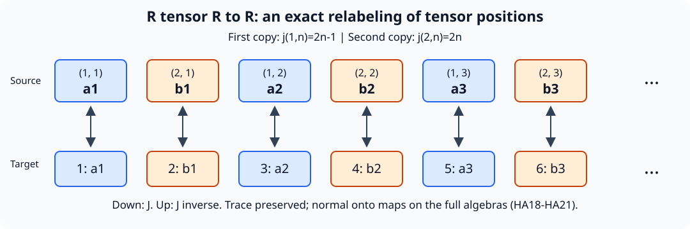

# The same hyperfinite factor from different return systems

## 1. The assertion and its exact scope

Let \(R\) be the tracial infinite tensor product of countably many copies of \(M_2(\mathbb C)\), and put \(R_\infty=R\bar\otimes B(\ell^2(\mathbb N))\). Let \(T_0x=x+\alpha\) on the circle with normalized Lebesgue measure, where \(\alpha\notin\mathbb Q\). Let \((T_1x)_j=x_{j+1}\) on \(\{0,1\}^{\mathbb Z}\) with the fair product probability. Write these standard probability spaces as \((X_i,\mu_i)\), and set
\[
 D_i=L^\infty(X_i,\mu_i),\quad \beta_i(f)=f\circ T_i^{-1},\quad
 N_i=R_\infty\bar\otimes D_i,\quad
 \alpha_i=\operatorname{id}_{R_\infty}\bar\otimes\beta_i.
 \tag{HA1}
\]

**Theorem.** Each \(N_i\) has separable predual, is of type \(\mathrm{II}_\infty\), has nonatomic full center \(D_i\), and \(\alpha_i\) acts ergodically on that center. There are normal onto star isomorphisms with normal inverses
\[
 (N_i\rtimes_{\alpha_i}\mathbb Z,\widetilde\tau_i)
       \cong (R_\infty,\tau_R\otimes\operatorname{Tr}),\qquad i=0,1,
 \tag{HA2}
\]
where the traces are specified below. Nevertheless, for every pair of nonzero central projections \(e_i\in Z(N_i)\), the induced coefficient systems \(((N_i)_{e_i},(\alpha_i)_{e_i})\) are not conjugate. Neither \(N_i\) admits a faithful normal semifinite trace contracted uniformly by \(\alpha_i\) with a constant strictly below one.

These systems satisfy the three assumptions in the literal wider induced-corner assertion: type \(\mathrm{II}_\infty\), separable predual, and ergodic action on a nonatomic center. They refute its converse. They are outside the trace-contraction hypothesis of the repaired type \(\mathrm{III}_0\) classification. The repaired classification and the forward implication from induced conjugacy remain intact.

The construction combines injectivity of an amenable crossed product with finite-factor classification. Sections 3 and 4 identify the earlier programme proofs used for these two steps. It gives a second realization of the obstruction in [the induced-corner lesson](OA-FLOW-IC.md#ic-obstruction), whose infinite-tensor absorption argument also remains available.

The table shows the objects and maps of the complete argument, with exact proof locators.

| Object or map | Mathematical role |
|---|---|
| \(D_i\subset A_i=D_i\rtimes_{\beta_i}\mathbb Z\) | The faithful normal coefficient expectation gives a normalized trace; (HA4)–(HA8). |
| Abelian injectivity and an invariant mean on \(\mathbb Z\) | Make \(A_i\) injective; the retraction can be singular; Section 3. |
| \(\gamma_i:A_i\to R\) | Finite injective-factor classification, exact dyadic containment and a trace-GNS unitary; (HA13)–(HA15). |
| \(J:R\bar\otimes R\to R\) | First input occupies odd tensor positions, second occupies even positions; the inverse separates them; (HA16)–(HA19). |
| \(N_i\rtimes\mathbb Z\to R_\infty\) | Regular tensor rearrangement, \(\gamma_i\) and \(J\), retaining the matrix leg; (HA20)–(HA23). |
| Induced center transformation on \(E_i\) | Normalized entropy is \(0\) or \(\log2/\mu_1(E_1)>0\); (HA24)–(HA25). |

The displayed six positions are a finite window of the bijection (HA16); the dots continue through all positive integers. The diagram displays tensor positions, not a spatial projection of an operator. Equations (HA17)–(HA19) prove that the reversible local rule extends to the full normal trace-preserving isomorphism. The [editable SVG](../assets/hyperfinite-output/tensor-interleaving.svg) is the complete figure source; it uses no human source image.

## 2. The systems and their finite crossed products

[OA-FLOW-IE, Section 8](OA-FLOW-IE.md#IE-examples) proves that both \(T_i\) are invertible, probability preserving, ergodic, essentially free and nonatomic. It constructs the Bernoulli probability from its finite cylinder values. Rotation ergodicity uses the dense cyclic subgroup and continuity of translation in \(L^2\); shift ergodicity follows from cylinder independence and mixing. It proves
\[
 h_{\mu_0}(T_0)=0,\qquad h_{\mu_1}(T_1)=\log2.
 \tag{HA3}
\]

Represent \(D_i\) on \(H_i=L^2(X_i,\mu_i)\). On \(\ell^2(\mathbb Z)\otimes H_i\), define
\
 [\pi_i(f)\xi=\beta_i^{-k}(f)\xi(k),\qquad
 u_i\xi=\xi(k-1),\qquad A_i=\{\pi_i(D_i),u_i\}''.
 \tag{HA4}
\]
The normality and representation-independence theorem [NR3–4](OA-FLOW-NR.md#oa-flow.nr.3) applies, including its arbitrary-net proof. In the discrete case normality also follows entry by entry from the normal automorphisms \(\beta_i^{-k}\).

Compression to coordinate zero defines \(E_i:A_i\to D_i\). Its range assertion follows by bounded strong-star approximation by covariant polynomials, whose zero entries lie in the ultraweakly closed multiplication algebra. It is normal, positive, unital and \(D_i\)-bimodular. For \(X\in A_i\), put \(\widehat X(n)=E_i(Xu_i^{-n})\). Calculation on polynomials followed by normality gives
\[
 X_{k,l}=\beta_i^{-k}(\widehat X(k-l)).
 \tag{HA5}
\]
Thus all coefficients determine \(X\). If \(X\ge0\) and \(E_i(X)=0\), every diagonal entry vanishes. The square root \(X^{1/2}\) kills all coordinate vectors, so \(X=0\). This proves faithfulness without requiring convergence of a Fourier series.

The state
\[
 \tau_i(X)=\int_{X_i}E_i(X)\,d\mu_i
 \tag{HA6}
\]
is faithful and normal. It is tracial: for words \(fu_i^n\) and \(gu_i^m\), both expectations vanish if \(n+m\ne0\); when \(m=-n\), invariance gives
\(\int f\beta_i^n(g)\,d\mu_i=\int\beta_i^{-n}(f)g\,d\mu_i\).
Fix one word and use normality to extend equality to every second argument, then extend in the first variable. Hence the state is tracial on the full algebra.

If \(X\) commutes with \(D_i\), bimodularity gives
\[
 (d-\beta_i^n(d))\widehat X(n)=0\qquad(d\in D_i).
 \tag{HA7}
\]
A countable Borel separating family of indicators forces the support of \(\widehat X(n)\), for \(n\ne0\), into the null fixed-point set of \(T_i^n\). Equation (HA5) gives \(X=E_i(X)\in D_i\). Consequently
\[
 D_i'\cap A_i=D_i,\qquad Z(A_i)=D_i^{\beta_i}=\mathbb C1.
 \tag{HA8}
\]
The diffuse algebra \(D_i\) cannot embed in a finite-dimensional algebra, since it has arbitrarily large finite families of nonzero orthogonal projections. Thus the finite factor \(A_i\) is \(\mathrm{II}_1\). Its regular Hilbert space is separable, and restriction of trace-class functionals gives a separable predual. These verify the hypotheses of the finite-factor theorem apart from injectivity, which we prove next.

## 3. Injectivity from finite partitions and averaging

**Abelian case without countability restrictions.** Let \(D\subset B(H)\) be any faithfully normally represented nonzero abelian von Neumann algebra. Direct its finite partitions \(\mathcal P=(p_1,\ldots,p_m)\) of the identity by refinement, omitting zero pieces. Choose unit vectors \(\xi_j\in p_jH\) and put
\[
 F_{\mathcal P}(x)=\sum_j\langle x\xi_j,\xi_j\rangle p_j\qquad(x\in B(H)).
 \tag{HA9}
\]
The inner product is linear in its first variable. Each coordinate is a vector state, so this map is ucp and fixes \(D_{\mathcal P}=\operatorname{span}\{p_j\}\). Contractivity gives
\[
 \|F_{\mathcal P}(d)-d\|\le2\inf_{b\in D_{\mathcal P}}\|d-b\|\qquad(d\in D).
 \tag{HA10}
\]
Joint finite spectral partitions approximate each finite family in \(D\) in norm, and finer partitions retain the approximants. Hence \(F_{\mathcal P}(d)\to d\) in norm for every \(d\in D\). Product ultraweak compactness of the norm balls of \(D\) supplies a subnet converging at every \(x\in B(H)\). Its limit is linear, unital and completely positive, since matrix positive cones are ultraweakly closed. It has range in \(D\) and fixes \(D\). The ucp retraction criterion in [Finite models of a von Neumann algebra](../../OA-APPROX/semidiscrete-finite-models.html#4-the-finite-models-give-an-extension-property), Proposition 4.1, proves injectivity. There was no separability or faithful scalar state assumption. The limiting retraction need not be normal.

This independently proves the abelian case of [Averaging, crossed products, and injectivity](../../OA-APPROX/averaging-crossed-products-injectivity.html#3-the-regular-crossed-product), Proposition 5.3. Its more general type I conclusion is not required here.

The states
\[
 m_n(f)=\frac1{2n+1}\sum_{k=-n}^n f(k)\qquad(f\in\ell^\infty(\mathbb Z))
 \tag{HA11}
\]
have a weak-star cluster point. For each integer \(r\),
\( |m_n(f(\cdot+r))-m_n(f)|\le2|r|\|f\|_\infty/(2n+1)\).
The bound follows from the symmetric difference of the finite intervals. Every cluster point is therefore an invariant positive normalized mean, proving amenability of \(\mathbb Z\).

The crossed-product conclusion is Corollary 3.1 of [Averaging, crossed products, and injectivity](../../OA-APPROX/averaging-crossed-products-injectivity.html#3-the-regular-crossed-product). Its proof proceeds as follows. If an injective \(P\subset B(K)\) is normalized by an amenable unitary representation \(v\), its commutant \(P'\) is injective by the lesson's full commutant theorem. For \(Q=\{P,v(G)\}''\),
\[
 Q'=(P')^{\operatorname{Ad}v}.
 \tag{HA12}
\]
An invariant mean defines a ucp retraction \(B:P'\to Q'\) by
\(\omega(Bx)=m_g\omega(v_gxv_g^*)\), \(\omega\in(P')_*\).
Matrix positivity follows by averaging positive scalar tests. Left invariance and normality of each conjugation put the range in the fixed algebra; every fixed element is fixed by the map. Composing with a retraction onto \(P'\) gives injectivity of \(Q'\), and commutant permanence gives injectivity of \(Q\). The commutant proof supplies its amplification, corner, opposite-algebra and normal-representation arguments; singular retractions are explicitly allowed.

Apply this to \(P=\pi_i(D_i)\), \(v_n=u_i^n\). Discreteness supplies continuity automatically. The faithful normal regular generators give \(Q=A_i\), so both \(A_i\) are injective. The crossed-product theorem retains arbitrary von Neumann algebras and amenable locally compact Hausdorff groups with point-ultraweakly continuous actions; this application only needs its discrete specialization.

## 4. The finite-factor theorem and its normal maps

We use the proved statement of [Unitary couplings and finite injective factors](../../OA-APPROX/unitary-couplings-and-finite-injective-factors.html#5-injective-finite-factors-are-locally-afd), Theorem 5.1: every injective \(\mathrm{II}_1\) factor is locally approximately finite dimensional; with separable predual it is normally isomorphic to \(R\). Here is the chain of earlier proofs:

1. [Hypertraces and finite injective algebras](../../OA-APPROX/hypertraces-finite-injectivity.html#2-a-hypertrace-with-a-prescribed-trace), Sections 1–5, starts with a prescribed faithful normal tracial state. A bimodular retraction gives a hypertrace with exactly that restriction. Trace-controlled finite-rank densities retain both the trace and approximate commutation. Finite product vectors give explicit normal ucp incoming matrix maps and cpc reconstruction maps, using the bounded correction \(w\mapsto\max(w,1)^{-1/2}\). This proves semidiscreteness directly in the finite tracial case; no continuous-core classification is needed.
2. [Trace-preserving finite models](../../OA-APPROX/trace-preserving-finite-models.html#1-rationalizing-a-density-without-losing-positivity), Sections 1–4, with [Tracial adjoints and rational matrix models](../../OA-APPROX/tracial-adjoints-and-rational-matrix-models.html#1-the-trace-adjoint-stays-completely-positive), Sections 1–3, perturbs the reconstruction density to strictly positive rational spectrum, realizes the rational weights by finite dimensions, and replaces contractions modeling prescribed unitaries by matrix unitaries. The weighted Hilbert adjoint uses a two-sided density sandwich. Both exact trace identities are retained.
3. [Balancing Kraus families and unitary couplings](../../OA-APPROX/balancing-kraus-families-and-unitary-couplings.html#1-filling-two-positive-defects), Lemma 1.1, Theorem 3.1 and Corollary 4.2, fills two positive defects with equal center-valued traces and supplies coupled matrix unitaries. The internal Kraus formula is Lemma 4.1 of [Properly infinite injective algebras and dyadic approximation](../../OA-APPROX/properly-infinite-injective-algebras-and-dyadic-approximation.html#4-a-finite-cp-reconstruction-is-one-compression): its finite Kraus conclusion requires no proper infiniteness.
4. [Unitary couplings](../../OA-APPROX/unitary-couplings-and-finite-injective-factors.html#1-sampling-a-countable-coupling), Sections 1–4, samples and clips the coupling, uses a faithfully tracial von Neumann ultrapower, tests every central projection in the intertwiner algebra, and compares its two diagonal projections. It produces one unitary \(w\) with all \(\|u_k-wv_kw^*\|_2\) small. The ultrapower is proved to be a von Neumann algebra in [Multiplier ultraproducts and normal embeddings](../../OA-APPROX/multiplier-ultraproducts-and-normal-embeddings.html#3-completeness-on-two-cyclic-vectors), Theorem 3.2. In the tracial case every bounded sequence is a multiplier. The proof does not assume that the ultrapower is a factor.
5. [Hyperfinite finite factors](../../OA-APPROX/hyperfinite-finite-factors.html#4-making-containment-exact), Lemmas 3.1 and 4.1 and Theorem 5.1, converts finite approximants into increasing dyadic matrix algebras with exact containment and constructs the normal trace-GNS isomorphism. Only the countable generating step requires separable predual.

The normalization in step 1 deserves an explicit check. If \(S\) is the normal ucp incoming map and \(T\) is cpc, replace \(T(y)\) by
\(T(y)+\omega(y)(1-T(1))\), where \(\omega\) is a matrix state. This is ucp. The cpc Schwarz inequality upgrades \(TS\to\operatorname{id}\) from ultraweak to \(\sigma\)-strong-star convergence; in particular \(T(1)=TS(1)\to1\). The correction tends to zero in those seminorms. Thus the subsequent arguments receive genuinely unital maps; exact trace preservation is then constructed in step 2, not presumed initially.

The finite expectations and bounded trace topology used by the dyadic argument can also be obtained directly. Write a unital finite-dimensional subalgebra as \(B=\bigoplus_r M_{d_r}\), with matrix units \(f_{ij}^{(r)}\), and put \(t_r=\tau(f_{11}^{(r)})>0\). Its expectation is
\[
 E_B(x)=\sum_{r,i,j}t_r^{-1}\tau(f_{ji}^{(r)}x)f_{ij}^{(r)}.
 \tag{HAF1}
\]
For positivity at every matrix level, compress to the matrix of entries \(f_{1i}^{(r)}xf_{j1}^{(r)}\) and apply the positive functional \(\tau/t_r\) on the corner. Positivity of its matrix amplifications follows by testing scalar finite column vectors; the same argument with block columns proves complete positivity. Traciality identifies the resulting coefficients with those in (HAF1). Matrix multiplication shows that \(E_B\) fixes \(B\), is bimodular and is unital. The coefficient functionals are normal, so the finite sum is normal. Summing diagonal coefficients gives \(\tau E_B=\tau\). Finally \(\tau(b^*(x-E_Bx))=0\) for every \(b\in B\); hence this is the orthogonal trace-Hilbert projection and supplies precisely the nearest-point estimates used in the dyadic containment proof.

For the bounded topology, the normal functionals \(\psi_b(x)=\tau(bx)\), \(b\in M\), have norm-dense span in \(M_*\). Otherwise separation and the exact predual duality [CP6](OA-FLOW-CP.md#oa-flow.cp.6) give a nonzero \(x\in M\) with \(\tau(bx)=0\) for every \(b\); taking \(b=x^*\) contradicts faithfulness. Given a positive normal \(\psi\), choose \(b\) with \(\|\psi-\psi_b\|<\eta\). For \(\|x\|\le C\), positivity of the sandwiched trace functional gives
\[
 \psi(x^*x),\ \psi(xx^*)
 \le\|b\|\,\|x\|_2^2+\eta C^2.
 \tag{HAF2}
\]
Thus bounded convergence in trace \(2\)-norm implies convergence in every intrinsic strong-star seminorm, for arbitrary nets. Conversely the trace is one such test. These two constructions provide the exact finite-expectation and topology inputs used in Sections 3–5 of the dyadic-factor proof.

Here is how the local theorem supplies the maps in this alternative. For \(A=A_i\), choose a countable \(2\)-norm dense set of its unit ball. Exact dyadic containment supplies matrix factors \(B_n\subset B_{n+1}\), \(B_n\cong M_{2^{k_n}}\), whose union generates \(A\). Insert the successive \(M_2\) factors of their relative matrix commutants, obtaining
\[
 C_m\cong M_{2^m},\quad C_m\subset C_{m+1},\quad
 C_m'\cap C_{m+1}\cong M_2,\quad (\bigcup_m C_m)''=A.
 \tag{HA13}
\]
A unital inclusion \(M_a\subset M_b\) has \(b=ar\) and multiplicity commutant \(M_r\), by its decomposition into defining finite-dimensional modules. Here all multiplicities are powers of two. These are exact insertions; approximating an \(M_3\) by dyadic algebras would not put \(M_3\) inside a dyadic matrix level exactly.

Choose compatible matrix identifications of \(C_m\) with the first \(m\) tensor factors of \(R\). They preserve normalized trace. Their union \(\gamma_i^0\) therefore defines an isometry
\[
 V_i\Lambda_{\tau_i}(a)=\Lambda_{\tau_R}(\gamma_i^0(a)).
 \tag{HA14}
\]
Both sets of local vectors are dense, so it extends to a unitary of the full trace Hilbert spaces. It intertwines every local left multiplication with its image. Passing to the generated von Neumann algebras gives
\[
 \gamma_i:A_i\longrightarrow R,\quad
 \gamma_i(X)=V_iXV_i^*,\qquad \gamma_i^{-1}(Y)=V_i^*YV_i.
 \tag{HA15}
\]
These formulas hold in the faithful normal trace representations. Both directions are normal for arbitrary nets and onto. Transport out of those representations preserves these properties. Since the trace vectors correspond, \(\tau_R\gamma_i=\tau_i\) exactly. This supplies a full normal isomorphism, not merely an identification of algebraic unions or of their norm completions.

## 5. Tensor absorption with the full inverse

Start with the local algebra \(\mathcal D=\bigcup_n M_2^{\otimes n}\), inclusions obtained by adjoining the identity, and its product trace. Let \(R\) be the generated left algebra on its trace Hilbert completion. Right local multiplication commutes with it and has the trace vector \(\Omega\) cyclic. Thus \(\Omega\) is separating for the left algebra. Its vector state is faithful and normal, and is tracial by checking local elements and extending successively by bounded density and normality. The trace expectations to the first \(n\) tensor factors are the \(L^2\) projections onto the local vectors, and converge in \(2\)-norm to the identity. For central \(x\), each such expectation commutes with its full matrix level, hence equals \(\tau_R(x)1\). Convergence and separation give \(x=\tau_R(x)1\). Arbitrarily large matrix levels exclude finite type I. Thus this is a separable \(\mathrm{II}_1\) factor, agreeing with the \(R\) of (HA14).

Label the positions of the two inputs by \((1,n)\), \((2,n)\), \(n\ge1\), and define
\[
 j(1,n)=2n-1,\qquad j(2,n)=2n.
 \tag{HA16}
\]
Place the first finite tensor in odd positions and the second in even positions. Different positions commute, so this defines a star homomorphism \(J_0:\mathcal D\odot\mathcal D\to\mathcal D\). Regrouping a finite target tensor into odd and even positions gives a two-sided algebraic inverse. The product traces give
\[
 \tau_R(J_0(z)^*J_0(z))=(\tau_R\otimes\tau_R)(z^*z).
 \tag{HA17}
\]
After polarization, the map
\[
 W(\Lambda_R(a)\otimes\Lambda_R(b))=\Lambda_R(J_0(a\otimes b))
 \tag{HA18}
\]
is an isometry on a dense span with dense range. It extends to a unitary \(L^2(R)\otimes L^2(R)\to L^2(R)\) and intertwines local left multiplication. Consequently
\[
 J:R\bar\otimes R\longrightarrow R,\quad J(X)=WXW^*,\qquad
 J^{-1}(Y)=W^*YW
 \tag{HA19}
\]
is normal, onto, and has a normal inverse. On a target local tensor that inverse is precisely odd/even regrouping. The unitary formulas define it on the entire von Neumann algebra. Since \(W(\Omega\otimes\Omega)=\Omega\), the normalized trace is preserved. This independently completes the absorption also stated in [Hyperfinite finite factors](../../OA-APPROX/hyperfinite-finite-factors.html#4-making-containment-exact), Exercise 8.

Put \(K=\ell^2(\mathbb N)\). Reordering Hilbert factors and applying (HA15), (HA19) gives
\[
 \Psi_i:(R\bar\otimes B(K))\bar\otimes A_i\longrightarrow R\bar\otimes B(K),\qquad
 \Psi_i(r\otimes b\otimes a)=J(r\otimes\gamma_i(a))\otimes b.
 \tag{HA20}
\]
Its inverse applies \(J^{-1}\) to the \(R\) leg, \(\gamma_i^{-1}\) to the resulting even-position leg, and the opposite flip to restore the order \(R,B(K),A_i\). Each operation is implemented by a Hilbert unitary in the indicated faithful normal representations. This is a full normal inverse, not only a prescription on generators.

For a positive operator, the semifinite traces are
\[
 (\tau_R\otimes\operatorname{Tr})(X)=\sum_j\tau_R(X_{jj}),\qquad
 (\tau_R\otimes\operatorname{Tr}\otimes\tau_i)(Y)
       =\sum_j(\tau_R\otimes\tau_i)(Y_{jj}).
 \tag{HA21}
\]
These are suprema of nonnegative finite sums. Faithfulness follows from diagonal compression; normality follows by interchanging suprema. If \(p_n\) is the first \(n\) matrix coordinates, \(Xp_n\) lies in the finite left ideal and tends strongly to \(X\), proving semifiniteness. Traciality follows by comparing the two nonnegative double sums of \(\tau(x_{kj}^*x_{kj})\) and \(\tau(x_{kj}x_{kj}^*)\). They agree also at infinity. The map (HA20) fixes the matrix index and preserves each finite coefficient trace, so it preserves (HA21) on the full positive cone, with no unspecified scalar multiplier.

## 6. Full coefficient systems and their regular products

Represent \(R_\infty\) faithfully normally on \(H_\infty\). Use the regular representation of \(N_i\) on \(\ell^2(\mathbb Z)\otimes H_\infty\otimes H_i\). The unitary
\[
 U(\delta_k\otimes\eta\otimes\xi)=\eta\otimes\delta_k\otimes\xi
 \tag{HA22}
\]
sends a coefficient \(r\otimes f\) to \(r\otimes\pi_i(f)\) and the integer shift to \(1\otimes u_i\). Its generator images contain \(R_\infty\otimes1\) and \(1\otimes A_i\), and belong to their spatial tensor product. They therefore generate exactly that tensor product. Hence
\[
 \Theta_i:N_i\rtimes_{\alpha_i}\mathbb Z\longrightarrow R_\infty\bar\otimes A_i,\quad
 \Theta_i(X)=UXU^*,\qquad \Theta_i^{-1}(Y)=U^*YU
 \tag{HA23}
\]
is a normal onto star isomorphism with normal inverse. NR4 gives the same canonical generator map for any other initial faithful normal coefficient representation. The isomorphism in (HA2) is \(\Psi_i\Theta_i\).

The trace on \(N_i\) is \(\tau_R\otimes\operatorname{Tr}\otimes\mu_i\), defined on its whole positive cone by (HA21) with finite coefficient trace \(\tau_R\otimes\mu_i\). It is invariant under \(\alpha_i\). Define \(\widetilde\tau_i\) as the pullback by \(\Theta_i\) of \(\tau_R\otimes\operatorname{Tr}\otimes\tau_i\). Equivalently it is the invariant product trace composed with the discrete coefficient expectation. To verify the latter equality on more than words, cut by a finite matrix projection. On that finite-trace corner separate normality extends equality on covariant words to the entire corner. Summing the diagonal values gives equality on the full positive cone. This fixes the scale in (HA2).

Commutation with all matrix units reduces \(Z(R_\infty)\) to \(Z(R)\otimes1=\mathbb C1\). Its rank-one matrix corner is \(R\), so \(R_\infty\) is of type \(\mathrm{II}_\infty\). The constant-field algebra \(N_i\) has full center \(1\otimes D_i\). Directly, all normal slices of a central element against the second leg lie in \(Z(R_\infty)\). Subtract \(1\otimes(\rho\otimes\operatorname{id})(X)\), for a normal state \(\rho\) of \(R_\infty\); every product normal slice then vanishes, hence the difference is zero. The rank-one matrix corner is the constant type \(\mathrm{II}_1\) field \(R\bar\otimes D_i\); countably many equivalent matrix diagonals sum to one. Thus \(N_i\) is type \(\mathrm{II}_\infty\) on every nonzero central summand. This uses the full center and central type conventions of the induced-corner lesson; it does not call \(N_i\) a factor. All Hilbert factors can be chosen separable, and the center is the nonatomic \(D_i\). Its action is exactly the ergodic \(\beta_i\).

For completeness, the full constant-field assertion used here has an elementary proof in this separable setting. Choose a countable orthonormal basis of the faithful representation space of a von Neumann algebra \(C\). Every operator commuting with the scalar multiplication algebra has matrix coefficients commuting with that scalar algebra on \(L^2(X)\). That scalar algebra is maximal abelian: an operator commuting with all multipliers sends \(1\) to a function \(g\), sends every bounded \(f\) to \(fg\), and boundedness tested on indicator functions gives \(|g|\le\|T\|\) almost everywhere. Hence all matrix coefficients are measurable functions. Tests on the countable rational finite vectors, after a single null-set deletion, give a measurable operator field with the same essential norm bound. Conversely such a field defines the original bounded operator by integration. Commutation with a countable strong-star dense subset of the unit ball of \(C'\) forces the fiber values into \(C''=C\). A countable dense subset exists because the unit ball of \(B(H)\) has a second-countable strong-star topology when \(H\) is separable, and its subspaces inherit second countability.

Every bounded measurable \(C\)-valued field belongs to \(C\bar\otimes L^\infty(X)\): approximate it on the first \(n\) basis vectors and adjoint vectors by the first suitable element of a countable strong-star dense subset of a fixed norm ball of \(C\). The choices define a countably valued measurable field. Its countable disjoint projection sum belongs to the spatial product by strong closure; bounded dominated convergence gives strong-star convergence to the original field. This proves equality with the **whole** field algebra. In particular any nonzero projection field \(p\) in the constant \(R_\infty\) field is nonabelian. At each point where \(p(x)\ne0\), the corner \(p(x)R_\infty p(x)\) is nonabelian. Some pair from a fixed countable strong-star dense family of constants has nonzero compressed commutator there. The countable union of these detection sets contains the nonzero support of \(p\), so one pair gives a nonzero global commutator in \(pN_ip\). Thus there are no nonzero abelian projections. The product trace gives semifiniteness, and the odd/even matrix isometries give proper infiniteness on every central cut. These facts establish the claimed type \(\mathrm{II}_\infty\) without leaving fiber-to-global type transfer implicit.

## 7. No positive central sections give conjugate systems

A nonzero central projection is \(e_i=1\otimes1_{E_i}\), with \(a_i=\mu_i(E_i)>0\). IE, Section 1, proves that, after an invariant null-set deletion, every orbit meeting \(E_i\) has infinitely many visits in both directions. The first-return function \(r_i\) is measurable and finite almost everywhere. The return map \(S_i=(T_i)_{E_i}\) is invertible and ergodic and preserves \(\nu_i=\mu_i|_{E_i}/a_i\). Its mean return time is \(1/a_i\); no bounded-return assumption occurs.

The induced coefficient algebra is \(R_\infty\bar\otimes L^\infty(E_i)\). On the source piece \(E_{i,n}=\{r_i=n\}\), the \(n\)-step action leaves the \(R_\infty\) coordinate unchanged. The range pieces \(T_i^nE_{i,n}\) partition \(E_i\), so its center map is exactly
\[
 f\longmapsto f\circ S_i^{-1}.
 \tag{HA24}
\]
A normal conjugacy of the full induced coefficient systems would restrict to a normal center conjugacy.

This conclusion can be used on probability measure algebras, without an additional point-realization theorem. Transport \(\nu_0\) through the center isomorphism to a faithful normal probability \(\rho\) on the second center. It is equivalent to \(\nu_1\) and invariant under \(S_1\). The scalar Radon–Nikodym argument in IE, Section 7, gives \(\rho=f\nu_1\). Invariance gives \(f=f\circ S_1^{-1}\); ergodicity makes its rational upper-level sets trivial, so \(f\) is constant. Its integral one makes it one. Thus the isomorphism preserves the **normalized** section probabilities. Finite measurable partitions correspond to finite central projection partitions, and all probabilities of their orbit joins are preserved. Entropy is preserved in both directions.

The complete unbounded-return theorem IE3 and calculations IE50–54 contradict this:
\[
 h_{\nu_0}(S_0)=0/a_0=0,\qquad
 h_{\nu_1}(S_1)=\log2/a_1>0.
 \tag{HA25}
\]
This covers every positive measurable section, including unbounded return times. It assumes neither equal section mass, preservation of unnormalized restrictions, nor existence of a finite generator. IE retains infinite entropy as well, although these two base values are finite.

There is also no alternative trace restoring contraction. Let \(\tau\) be the invariant product trace. The full density and uniqueness theorem [TD4–6](OA-FLOW-TD.md#oa-flow.td.4) writes any other faithful normal semifinite trace as \(\tau_b\), with positive affiliated density having zero kernel and no infinite-value part. Inner invariance of both traces and uniqueness force each spectral projection of \(b\) to be central. Thus \(b\) is a scalar measurable function on \(X_i\), finite and strictly positive almost everywhere. Invariance and the convention \(\beta_i(f)=f\circ T_i^{-1}\) give
\[
 \tau_b\circ\alpha_i=\tau_{b\circ T_i}.
 \tag{HA26}
\]
If \(\tau_b\circ\alpha_i\le c\tau_b\), \(0<c<1\), order reflection in TD5 gives \(b(T_i x)\le cb(x)\) almost everywhere. Delete every integer translate of its exceptional set. Some band \(B_m=\{1/m\le b\le m\}\) has positive probability. Recurrence gives arbitrarily large positive return times \(n\) to that band; iteration then gives \(1/m\le c^n m\), impossible for large \(n\). This proves the last assertion for all faithful normal semifinite traces, however unbounded their densities.

## 8. Six solved checks

**1. Is the invariant-mean retraction normal?** In general it is not. For the shift on \(\ell^\infty(\mathbb Z)\), invariance assigns the same mean value \(t\) to every singleton projection. The inequalities \(nt\le1\) force \(t=0\). Every finite-interval projection has mean zero, though these projections increase to one. This proves failure of normality. Injectivity permits such a retraction. Every isomorphism in (HA15), (HA19), (HA20) and (HA23) is normal for the separately proved unitary reason.

**2. Where does a four-position tensor go?** For inputs \(a_1\otimes a_2\) and \(b_1\otimes b_2\), interleaving gives \(a_1\otimes b_1\otimes a_2\otimes b_2\). The inverse extracts positions \(1,3\) and \(2,4\). Its normalized trace is the product of the four normalized matrix traces, exactly the product of the two input traces. Interleaving introduces no factor of two.

**3. Does the infinite trace hide the normalization?** Let \(p,q\) be rank-one projections in the first \(M_2\) positions of the two copies of \(R\), and let \(e\in B(K)\) have rank \(k\). Before absorption the trace of \(p\otimes e\otimes q\) is \(k/4\). After absorption \(J(p\otimes q)\) has normalized trace \(1/4\), so its tensor with \(e\) again has trace \(k/4\). These finite tests and (HA21) fix the scale despite infinite trace of the unit.

**4. Can different section masses defeat the entropy argument?** If \(a_0=1/3\), \(a_1=1/4\), the normalized return entropies are \(0\) and \(4\log2\). In a point realization a hypothetical conjugacy carries the first unnormalized restriction to \((a_0/a_1)\mu_1|_{E_1}=(4/3)\mu_1|_{E_1}\). It preserves the normalized probabilities, so the entropy contradiction persists. Equal section mass was never required.

**5. Does a copy of \(R\) inside \(A_i\) suffice?** No. Containment does not say that copy generates \(A_i\). The provider approximates every finite subset, then uses exact containment of successive dyadic approximants to a dense sequence. This makes the union in (HA13) generate the entire algebra. That density makes \(V_i\) onto and transports the whole left algebra in (HA15). A bare embedded hyperfinite subfactor would leave the decisive step unproved.

**6. Could an unbounded density restore contraction?** The bands \(\{1/m\le b\le m\}\) exhaust almost all the probability space for every finite strictly positive measurable \(b\). One has positive measure, and recurrence there alone contradicts \(1/m\le c^n m\). There is no global bound assumption. The density in (HA26) is \(b\circ T_i\), not \(b\circ T_i^{-1}\): change variables in \(\int b(x)f(T_i^{-1}x)\,d\mu_i(x)\).

## 9. Earlier proofs and attribution

The finite injective-factor theorem is due to Connes. The earlier [finite-factor lesson](../../OA-APPROX/unitary-couplings-and-finite-injective-factors.html#5-injective-finite-factors-are-locally-afd) proves it through Haagerup's unitary-coupling method; its exact dyadic containment and normal trace-GNS conclusion are supplied by [the hyperfinite-factor lesson](../../OA-APPROX/hyperfinite-finite-factors.html#4-making-containment-exact). The arbitrary finite projection comparisons used there are proved in [PC1–7](OA-FLOW-PC.md#oa-flow.projection.pc1), with the full center-valued trace in [FCT0–8](OA-FLOW-FCT.md#oa-flow.fct.0). These are earlier programme proofs, including their nonfactor and arbitrary-cardinality statements.

The return-entropy identity is Abramov's formula, proved with unbounded returns and both infinite-entropy suprema in [IE](OA-FLOW-IE.md#IE-setting). Its irrational-rotation and Bernoulli examples provide the two exact entropy values used here. Every positive central section is covered by the normalized probability argument in Section 7.

This lesson proves the common-output alternative at its stated separable example scope. The separate [induced-corner theorem](OA-FLOW-IC.md#ic-continuous) retains its faithful semifinite whole-cone contraction hypothesis and its full normal maps and inverses.

Original exposition and the vector diagram are dedicated to CC0-1.0 to the extent of rights held. Earlier human sources and software retain their own terms.
