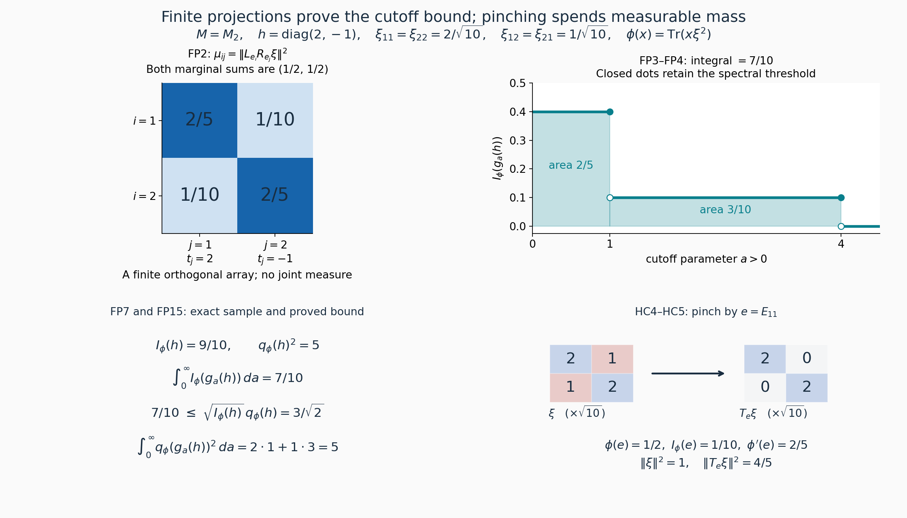
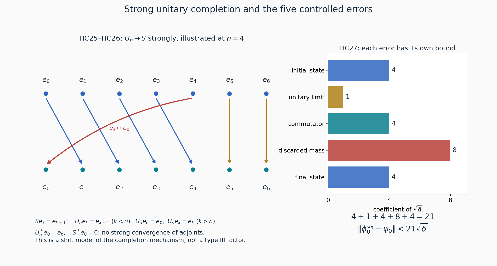

# Approximate unitary homogeneity of normal states

*Original reconstruction by GPT-6 Astra (OpenAI), Ultra, 2026-10-04. CC0-1.0 to the extent of rights held.*

Let \(M\ne0\) be a type \(\mathrm{III}_1\) factor with separable predual. Given normal states \(\phi_0,\psi_0\) and \(\varepsilon>0\), we prove that some unitary \(u\in M\) satisfies

\[
\|\phi_0^u-\psi_0\|<\varepsilon,\qquad
\phi_0^u(x)=\phi_0(u^*xu).
\tag{HC1}
\]
The norm is the predual norm, the supremum on the operator-norm unit ball. No faithfulness assumption on the two states occurs in the conclusion.

The freely accessible primary source is Connes and Størmer, [*Homogeneity of the State Space of Factors of Type III₁*](http://cm2vivi2002.free.fr/AC-biblio/AC-biblio35.pdf), printed pp.187–196. The proof below reconstructs the maximal-extension method on pp.193–196, supplies all limit and domain passages, and proves its own cutoff and error constants. The preliminary cutoff argument is the complete [finite-partition proof FP1–FP5](OA-FLOW-FP.md#oa-flow.fp.1); its scalar inequality and discontinuous-cutoff limit replace the joint-measure import.

The earlier mathematical inputs are the actual [NC1–NC5](OA-FLOW-NC.md#oa-flow.nc.1), [CR1–CR9](OA-FLOW-CR.md#oa-flow.cr.1), and [MC1–MC5](OA-FLOW-MC.md#oa-flow.mc.1) standard-form constructions; [RF1–RF5](OA-FLOW-RF.md#oa-flow.rf.1) and [AL1–AL6](OA-FLOW-AL.md#oa-flow.al.1) for real spectral localization; [TS1–TS3](OA-FLOW-TS.md#oa-flow.ts.1) for the direct type-\(\mathrm{III}_1\) implication; [CT](OA-FLOW-CT.md#oa-flow.ct.1) for corners and finite matrix type transport; PC1, PC2, PC5, PC7, PC8 for projections and their strong sums; and [CZ0, CZ5](OA-FLOW-CZ.md#oa-flow.cz.0) for centralizers and modular restriction. Scalar convergence and bounded spectral calculus are the SC/SF proofs specified in FP. The maximal principle is CF1. These are complete earlier written proofs, not replacements by literature citations.

Type \(\mathrm{III}_1\) here means that the defining intersection \(S(M)\) of the spectra of all faithful normal semifinite modular operators is \([0,\infty)\). TS deduces the needed full invariant-corner spectrum directly from this definition and CT/CZ. The general identification of \(S(M)\) with an exponential Connes spectrum is not used.

Exact individual earlier proof locators: [OA-FLOW.AL.5](OA-FLOW-AL.md#oa-flow.al.5), [OA-FLOW.AL.6](OA-FLOW-AL.md#oa-flow.al.6), OA-FLOW.CF.1, OA-FLOW.CF.8, [OA-FLOW.CP.1](OA-FLOW-CP.md#oa-flow.cp.1), [OA-FLOW.CP.6](OA-FLOW-CP.md#oa-flow.cp.6), [OA-FLOW.CR.1](OA-FLOW-CR.md#oa-flow.cr.1), [OA-FLOW.CR.3](OA-FLOW-CR.md#oa-flow.cr.3), [OA-FLOW.CR.4](OA-FLOW-CR.md#oa-flow.cr.4), [OA-FLOW.CR.8](OA-FLOW-CR.md#oa-flow.cr.8), [OA-FLOW.CR.9](OA-FLOW-CR.md#oa-flow.cr.9), [OA-FLOW.CT.1](OA-FLOW-CT.md#oa-flow.ct.1), [OA-FLOW.CT.2](OA-FLOW-CT.md#oa-flow.ct.2), [OA-FLOW.CT.3](OA-FLOW-CT.md#oa-flow.ct.3), [OA-FLOW.CZ.0](OA-FLOW-CZ.md#oa-flow.cz.0), [OA-FLOW.CZ.5](OA-FLOW-CZ.md#oa-flow.cz.5), [OA-FLOW.GNS.4.1](OA-FLOW-GNS.md#gns-theorem-4-1), [OA-FLOW.MC.1](OA-FLOW-MC.md#oa-flow.mc.1), [OA-FLOW.MC.2](OA-FLOW-MC.md#oa-flow.mc.2), [OA-FLOW.MC.3](OA-FLOW-MC.md#oa-flow.mc.3), [OA-FLOW.MC.4](OA-FLOW-MC.md#oa-flow.mc.4), [OA-FLOW.NC.4](OA-FLOW-NC.md#oa-flow.nc.4), OA-FLOW.PC.1, OA-FLOW.PC.7, OA-FLOW.PC.8, [OA-FLOW.SC.4](OA-FLOW-SC.md#sc-04), [OA-FLOW.SF.SF1](OA-FLOW-SF.md#oa-flow.sf.sf1), [OA-FLOW.SF.SF2](OA-FLOW-SF.md#oa-flow.sf.sf2), [OA-FLOW.TS.1](OA-FLOW-TS.md#oa-flow.ts.1), [OA-FLOW.TS.2](OA-FLOW-TS.md#oa-flow.ts.2), [OA-FLOW.TS.3](OA-FLOW-TS.md#oa-flow.ts.3).

## HC2. Cone vectors, compression, and loss under pinching

Use the standard form \((M,H,J,P)\) and the FP1 notation \(R_x=Jx^*J\), \(\xi x=R_x\xi\), \(c_\phi,I_\phi,q_\phi\), and \(s_\phi=q_\phi/\sqrt2\). By CR8 every normal positive functional has its unique cone vector. MC gives the same assertions for all finite matrices, including nonfaithful diagonal functionals. Inner products are linear in the first entry.

The commuting left and right actions give

\[
xy\xi-\xi xy=x(y\xi-\xi y)+(x\xi-\xi x)y,\qquad
c_\phi(xy)\le\|x\|c_\phi(y)+\|y\|c_\phi(x).
\tag{HC2}
\]
For arbitrary vectors \(h,k\) in the normal representation, expanding their vector functionals on \(\|x\|\le1\) gives

\[
\|\omega_h-\omega_k\|\le(\|h\|+\|k\|)\|h-k\|.
\tag{HC3}
\]

For a projection \(e\), the two vectors \(e\xi(1-e)\) and \((1-e)\xi e\) are orthogonal, and \(J\) exchanges them. Hence

\[
I_\phi(e)=\|e\xi(1-e)\|^2.
\tag{HC4}
\]
Define
\[
T_e=L_eR_e+L_{1-e}R_{1-e},\qquad \xi'=T_e\xi,\qquad \phi'=\omega_{\xi'}.
\]
The summands are orthogonal projections, so \(T_e\) is an orthogonal projection. Each summand preserves \(P\) by NC4. Consequently \(\xi'\in P\), \(\|\xi'\|\le\|\xi\|\), and \(e\xi'=\xi'e\). Decomposing \(e\xi=e\xi e+e\xi(1-e)\) orthogonally proves

\[
\phi'(e)=\phi(e)-I_\phi(e).
\tag{HC5}
\]
If \(x\) commutes with \(e\), both \(L_x\) and \(R_x\) commute with \(T_e\). Their commutator on \(\xi'\) is therefore the image under \(T_e\) of their commutator on \(\xi\), so

\[
I_{\phi'}(x)\le I_\phi(x).
\tag{HC6}
\]
Also, if a projection \(a\) satisfies \(a\xi=\xi a\) and \(ae=0\), then

\[
aT_e\xi=a\xi,\qquad (T_e\xi)a=\xi a.
\tag{HC7}
\]
For example \(a\xi e=R_ea\xi=R_eR_a\xi=0\), while \(ae=0\); insert these identities in the definition of \(T_e\). This proves both preservation of the old commuting relation and preservation of the old mass \(\phi'(a)=\phi(a)\).

If \(e\xi=\xi e\), then \(\phi(ex)=\phi(xe)\) for all \(x\in M\), by moving the selfadjoint \(L_e\) to the other entry and then using the commuting \(R_e\). Thus both mixed functionals \(\phi(ex(1-e))\) and \(\phi((1-e)xe)\) vanish. In particular

\[
\phi(x)=\phi(exe)+\phi((1-e)x(1-e)),
\quad
\phi-\phi_e\ge0,\quad
\|\phi-\phi_e\|=\phi(1-e),\qquad \phi_e(x)=\phi(exe).
\tag{HC8}
\]
The norm identity is GNS Theorem 4.1 for a positive functional. For a faithful finite functional, CZ0 identifies this commuting relation with membership in its modular centralizer. For a nonfaithful functional we use HC8 directly, or apply CZ0 only on its faithful support corner.

Two corner details will be needed. If \(p=s(\phi)\), then \(\xi=p\xi p\), and CR3 realizes the standard form of \(pMp\) on \(pR_pH\). Its left and right actions on \(\xi\) are the restrictions of the original actions, so every \(I\) and \(q\) for \(x\in pMp\) is unchanged. Second, if \(\omega_{\xi_0}\) is faithful and \(e\ne0\), then \(e\xi_0e\) represents a faithful functional on \(eMe\). Indeed, if a projection \(0\ne q\le e\) annihilated this vector on the left, then \(q\xi_0q=0\). CR1's block-zero lemma gives \(q\xi_0=0\), contradicting faithfulness. If a positive element rather than a projection had zero functional value, a nonzero spectral projection above a positive threshold would have zero value, so the projection criterion suffices. This uses the actual corner cone and requires no cyclic-vector existence theorem.

## HC3. A small partial isometry between prescribed centralizer corners

Let \(\phi\) be faithful and finite on a type \(\mathrm{III}_1\) factor with separable predual, with cone vector \(\xi\). Let \(e',f'\) be nonzero projections fixed by \(\sigma^\phi\). The complete TS/AL argument provides, for every \(h>0\), a nonzero

\[
x\in f'Me',\qquad \operatorname{Sp}_{\sigma^\phi}(x)\subset[-h,h],
\qquad
I_\phi(x)\le\tfrac12(e^{h/2}-1)^2q_\phi(x)^2.
\tag{HC9}
\]
For clarity, its construction localizes a nonzero \(y\in f'Me'\) near a frequency \(r\), forms the invariant join \(p\) of the initial supports of all translates of \(y\), and chooses \(z\in pMp\) near frequency \(-r\). TS gives full spectrum on \(pMp\); some translate of \(y\) has nonzero product with \(z\), and AL's proved product rule puts this product near zero. AL20 transports its frequency support to the spectral band \([e^{-h},e^h]\) of \(\Delta_\phi\). The full-domain identity \(R_x\xi=\Delta_\phi^{1/2}x\xi\) gives HC9. In particular the spectral assertion includes its vector-domain premise.

Faithfulness makes \(q_\phi(x)>0\). FP5 therefore gives a nonzero polar cutoff \(u\in f'Me'\) with \(c_\phi(u)\le\zeta s_\phi(u)\), for any prescribed \(\zeta>0\), by first taking \(\eta<\zeta^4/64\) and then \(h\) small enough in HC9. Its initial projection \(e=u^*u\) lies below \(e'\) and its final projection \(f=uu^*\) below \(f'\).

Take \(0<\zeta\le1/3\), \(p=\phi(e)>0\), \(r=\phi(f)>0\). FP2 and the reverse triangle inequality give
\[
|\sqrt p-\sqrt r|\le c_\phi(u),\qquad
c_\phi(e),c_\phi(f)\le2c_\phi(u).
\]
Since \(s_\phi(u)^2=(p+r)/2\), Cauchy–Schwarz implies \(|p-r|\le\zeta(p+r)\). Therefore \(1/2\le p/r\le2\), and

\[
I_\phi(u)\le\tfrac14\zeta^2(p+r),\qquad
I_\phi(e)\le\zeta^2(p+r)\le3\zeta^2p,\qquad
I_\phi(f)\le3\zeta^2r.
\tag{HC10}
\]
For any \(\tau>0\), choose \(0<\zeta\le\min(1/3,\sqrt{\tau/3})\). The preceding construction then proves

\[
I_\phi(u)\le\tau q_\phi(u)^2,\qquad
I_\phi(u^*u)\le\tau\phi(u^*u),\qquad
I_\phi(uu^*)\le\tau\phi(uu^*).
\tag{HC11}
\]
This reparameterization is part of the proof. No membership of \(u\) in the centralizer is asserted.

The same statement holds for a finite positive \(\phi\) on its faithful support, provided \(e',f'\le s(\phi)\) and their restrictions commute with the restricted functional. HC2 gives the unchanged cone norms, CZ0 puts the projections in that restricted modular centralizer, and CT makes the nonzero support corner a type \(\mathrm{III}_1\) factor with separable predual. These facts justify application of the faithful case. TS3 and MC give the identical statement in every required balanced \(2\times2\) matrix corner.

## HC4. Maximal compatible partial isometries

For now let \(\phi_0,\psi_0\) be faithful normal states, with unit cone vectors \(\xi_0,\eta_0\). Fix \(0<\delta<1/16\). Consider triples \((w,\alpha,\beta)\) with \(w\in M\) a partial isometry, \(a=w^*w\), \(b=ww^*\), and

\[
\begin{gathered}
a\alpha=\alpha,\quad b\beta=\beta,\qquad
\|\alpha\|^2\le\delta\phi_0(a),\quad
\|\beta\|^2\le\delta\psi_0(b),\\
\xi=\xi_0-\alpha-J\alpha\in P,\quad
\eta=\eta_0-\beta-J\beta\in P,\quad
\|\xi\|,\|\eta\|\le1,\\
a\xi=\xi a,\quad b\eta=\eta b,\qquad
\tfrac12\|w\xi-\eta w\|^2
\le\delta\bigl(\phi(a)+\psi(b)\bigr),
\quad \phi=\omega_\xi,\quad\psi=\omega_\eta .
\end{gathered}
\tag{HC12}
\]
The zero triple qualifies. Order these triples by requiring \(w'=w+v\), where \(v\) is a partial isometry with initial \(a'-a\) and final \(b'-b\), and

\[
\begin{gathered}
(a'-a)(\alpha'-\alpha)=\alpha'-\alpha,\quad
\|\alpha'-\alpha\|^2\le\delta\phi_0(a'-a),\\
(b'-b)(\beta'-\beta)=\beta'-\beta,\quad
\|\beta'-\beta\|^2\le\delta\psi_0(b'-b).
\end{gathered}
\tag{HC13}
\]
In particular \(a\le a'\), \(b\le b'\). This is a partial order: two successive increments have orthogonal initial and final projections, and their vector increments have orthogonal left supports. Thus squared vector norms and state budgets add, proving transitivity. If both directions hold then the supports coincide, the partial-isometry increment is zero, and both norm budgets are zero; the triples coincide.

Here is the full chain argument. Along a chain, strict extension strictly increases \(\phi_0(a)\): equality of these numbers gives \(a=a'\) by faithfulness, hence equality of triples. If a nonempty chain has no maximum, write \(s\) for the supremum of its numbers and choose successively an increasing sequence of chain elements with numbers larger than \(s-1/n\); take the larger of the preceding choice and the new choice at each step. Every chain element has number strictly below \(s\), since an element attaining \(s\) would be a maximum. The sequence is therefore cofinal.

For this sequence \(a_n\uparrow a\), \(b_n\uparrow b\) strongly by PC1, and for \(m\ge n\),

\[
\|(w_m-w_n)h\|^2=\|(a_m-a_n)h\|^2,\qquad
\|(w_m^*-w_n^*)h\|^2=\|(b_m-b_n)h\|^2 .
\tag{HC14}
\]
Thus \(w_n\to w\) and \(w_n^*\to w^*\) strongly, with \(w\in M\), \(w^*w=a\), \(ww^*=b\). The bounded strong product passage follows, for example, by adding and subtracting \(w_n^*wh\); \(M\) is strongly closed. Normality in HC13 makes \(\alpha_n,\beta_n\) norm Cauchy. Let their limits be \(\alpha,\beta\). Norm-closedness of \(P\), strong convergence of the bounded left actions and \(R_{w_n}=Jw_n^*J\), and the vector norm estimates pass every line of HC12 to the limit. The budgets use \(\phi_0(a_n)\uparrow\phi_0(a)\) and its analogue for \(b_n\).

For each fixed index the same limits in HC13 prove that this limit triple dominates that index. Cofinality and transitivity then dominate the whole chain. A chain with a maximum already has an upper bound, and the empty chain is bounded by the zero triple. CF1's maximal principle supplies a maximal triple.

## HC5. Both residual corners cannot survive

Suppose the maximal triple has \(e=1-a\ne0\) and \(f=1-b\ne0\). Since \(e\alpha=0\) and \((J\alpha)e=J(e\alpha)=0\), its residual vectors satisfy

\[
e\xi e=e\xi_0e,\qquad f\eta f=f\eta_0f.
\tag{HC15}
\]
They are faithful on \(eMe,fMf\) by HC2. Since \(a\xi=\xi a\), also \(e\xi=\xi e=e\xi e\), and similarly for \(f\).

In \(N=M_2(M)\) use the diagonal cone vector \(\Omega=\operatorname{diag}(\xi,\eta)\) of \(\Theta=\phi\oplus\psi\). Put
\[
E_0=\operatorname{diag}(e,f),\quad
E_1=\operatorname{diag}(e,0),\quad
E_2=\operatorname{diag}(0,f).
\]
The restricted functional on \(E_0NE_0\) is faithful: zero value of a positive matrix forces both positive diagonal entries to vanish, by the just-proved faithfulness. Its off-diagonal entry is then zero too, since for a positive operator \(X\), a diagonal vector of zero quadratic value is killed by \(X^{1/2}\). Its representing vector in the corner standard form is \(E_0\Omega E_0\). This corner functional, extended by compression to \(N\), has support exactly \(E_0\); no such support claim is made about \(\Theta\) on all of \(N\).

The projections \(E_1,E_2\) commute with this corner vector, so CZ0 makes them centralizer projections for the faithful restriction. CT makes the corner a type \(\mathrm{III}_1\) factor with separable predual. Apply HC11 there with
\[
\tau=\frac{\delta}{2(1+\delta)}.
\]
We obtain \(U=u\otimes E_{21}\ne0\), with \(u\in fMe\), \(e_1=u^*u\le e\), \(f_1=uu^*\le f\), and

\[
I_\Theta(U)\le\tau q_\Theta(U)^2,\quad
I_\phi(e_1)\le\tau\phi(e_1),\quad
I_\psi(f_1)\le\tau\psi(f_1).
\tag{HC16}
\]
These are the original ambient quantities. Indeed \(E_0\Omega=\Omega E_0\), so both vectors in the commutator of an element of \(E_0NE_0\) lie in \(E_0R_{E_0}H^{2\times2}\) and are unchanged upon replacing \(\Omega\) by \(E_0\Omega E_0\). The diagonal instances give the last two inequalities.

Define

\[
w'=w+u,\qquad
\alpha'=\alpha+e_1\xi(1-e_1),\qquad
\beta'=\beta+f_1\eta(1-f_1).
\tag{HC17}
\]
The initial and final supports of \(w'\) are \(a+e_1,b+f_1\). Since \(J\) exchanges the two off-diagonal vector blocks, the new cone vectors are precisely \(\xi'=T_{e_1}\xi\), \(\eta'=T_{f_1}\eta\). HC2 gives their cone membership, norm bound, and commuting relations with both old and new supports. The increments have left supports \(e_1,f_1\), orthogonal to the old supports. Moreover

\[
\|\alpha'-\alpha\|^2=I_\phi(e_1)
\le\tau\phi(e_1)\le\delta\phi_0(e_1).
\tag{HC18}
\]
For the final inequality, \(e_1\xi=e_1\xi_0e\), so
\(\phi(e_1)=\|e_1\xi_0e\|^2\le\|e_1\xi_0\|^2=\phi_0(e_1)\), and \(\tau\le\delta\). The identical argument handles \(\beta\). Orthogonality adds these bounds to the old budgets.

It remains to check the last line of HC12 without losing the new mass. Let \(W=w\otimes E_{21}\), \(E=\operatorname{diag}(e_1,f_1)\), and \(\Theta'=\phi'\oplus\psi'\). MC's right-action formula gives, for every \(z\in M\),

\[
I_\Theta(z\otimes E_{21})=\tfrac12\|z\xi-\eta z\|^2,\qquad
q_\Theta(z\otimes E_{21})^2=\phi(z^*z)+\psi(zz^*).
\tag{HC19}
\]
There is one off-diagonal entry here, unlike FP14's two-entry selfadjoint matrix.

Pinching \(\Omega\) by \(E\) gives \(\operatorname{diag}(\xi',\eta')\). Both \(W\) and \(U\) commute with \(E\): more precisely \(W=(1-E)W(1-E)\) and \(U=EUE\). HC6 contracts each of their commutators. After pinching these two commutators lie in the orthogonal Hilbert ranges of \(L_{1-E}R_{1-E}\) and \(L_ER_E\), respectively. HC7 preserves the old masses, whereas HC5 and HC16 give
\[
q_{\Theta'}(W)^2=q_\Theta(W)^2,\qquad
q_{\Theta'}(U)^2\ge(1-\tau)q_\Theta(U)^2.
\]
Orthogonality of initial and final projections also adds the \(q^2\) masses. Consequently

\[
\begin{aligned}
I_{\Theta'}(W+U)
&=I_{\Theta'}(W)+I_{\Theta'}(U)\\
&\le\delta q_{\Theta'}(W)^2+
\frac{\tau}{1-\tau}q_{\Theta'}(U)^2
\le\delta q_{\Theta'}(W+U)^2,
\end{aligned}
\tag{HC20}
\]
because \(\tau/(1-\tau)=\delta/(2+\delta)\le\delta\). Thus HC17 is an admissible strict extension satisfying HC13, a contradiction. A maximal triple has \(a=1\) or \(b=1\).

## HC6. The defect mass and strong unitary completion

Assume first \(a=1\). Then \(w\) is an isometry. From HC12 and the unit-vector normalization,

\[
\|\xi_0-\xi\|,\|\eta_0-\eta\|\le2\sqrt\delta,\qquad
\|w\xi-\eta w\|\le2\sqrt\delta.
\tag{HC21}
\]
Indeed \(\phi(1)+\psi(b)\le2\). Therefore
\[
\sqrt{\psi(b)}=\|\eta w\|
\ge\|w\xi\|-2\sqrt\delta
=\|\xi\|-2\sqrt\delta
\ge1-4\sqrt\delta.
\]
The last number is positive because \(\delta<1/16\). Since \(\psi(1)\le1\),

\[
\psi(1-b)\le1-(1-4\sqrt\delta)^2\le8\sqrt\delta.
\tag{HC22}
\]
The relation \(b\eta=\eta b\) allows HC8 to be applied even if \(\psi\) is nonfaithful. For \(\psi_b(x)=\psi(bxb)\) it proves

\[
\psi-\psi_b\ge0,\qquad
\|\psi-\psi_b\|=\psi(1-b)\le8\sqrt\delta.
\tag{HC23}
\]
This uses the defect mass itself. No square root of the bound in HC22 is taken.

The vectors \(w\xi\) and \(\eta w\) represent \(\phi^w\) and \(\psi_b\), respectively. For the latter, the commuting right action satisfies \(R_w^*R_w=R_{ww^*}=R_b\); thus its vector functional is \(\langle xR_b\eta,\eta\rangle=\psi(xb)=\psi(bxb)\). Their norms are at most \(1\). HC3 and HC21 imply

\[
\|\phi^w-\psi_b\|\le4\sqrt\delta,\qquad
\|\phi_0-\phi\|,\|\psi_0-\psi\|\le4\sqrt\delta.
\tag{HC24}
\]

PC7 makes \(M\) countably decomposable, and PC8 gives nonzero projections \(e_n\downarrow0\) strongly and equivalence of any two nonzero projections. Put \(f_n=1-b+we_nw^*\), a nonzero projection, and choose \(v_n\in M\) with \(v_n^*v_n=e_n\), \(v_nv_n^*=f_n\). Then

\[
u_n=w(1-e_n)+v_n
\tag{HC25}
\]
is unitary: its two initial projections are \(1-e_n,e_n\), and its two final projections are \(b-we_nw^*,1-b+we_nw^*\). Each pair is orthogonal and sums to \(1\). For every \(h\in H\),

\[
\|(u_n-w)h\|\le2\|e_nh\|\longrightarrow0 .
\tag{HC26}
\]
Only strong convergence is used. A proper isometry cannot be a strong-adjoint limit of unitaries, and no such limit is needed: HC3 applied to \(u_n\xi,w\xi\) gives \(\|\phi^{u_n}-\phi^w\|\to0\).

Choose \(n\) making this last error smaller than \(\sqrt\delta\). Insert \(\phi^{u_n},\phi^w,\psi_b,\psi\) between \(\phi_0^{u_n}\) and \(\psi_0\). Unitary conjugation is an isometry of the predual, so HC23–HC24 give

\[
\|\phi_0^{u_n}-\psi_0\|
<(4+1+4+8+4)\sqrt\delta=21\sqrt\delta .
\tag{HC27}
\]
If \(b=1\) instead, exchange \((w,\alpha,\beta,\xi,\eta)\) with \((w^*,\beta,\alpha,\eta,\xi)\). HC12 is preserved, because applying \(J\) to its commutator changes its sign and adjoints it as in FP2. The isometry case yields \(v\) with \(\|\psi_0^v-\phi_0\|<21\sqrt\delta\). Conjugation by \(v^*\) gives HC27 with \(u=v^*\). Taking \(\delta<\min(1/16,(\varepsilon/21)^2)\) proves HC1 for faithful states.

## HC7. All normal states and the exact orbit space

A nonzero von Neumann algebra with separable predual has a faithful normal state. Here is an explicit construction. Its normal state space is norm separable as a subspace of the separable metric space \(M_*\); choose a dense sequence \((\omega_n)\) and set \(\omega=\sum_{n\ge1}2^{-n}\omega_n\). The series converges in the predual norm and is a normal state. Every nonzero positive element has positive value in a normal vector state of a faithful representation, hence in some \(\omega_n\) by norm density; its value in \(\omega\) is positive.

More generally the same existence assertion holds on every sigma-finite algebra: choose a maximal orthogonal family of supports of normal states. Its join is \(1\), because a unit vector in a nonzero complementary projection gives another supported normal state. Sigma-finiteness makes the family countable. A strictly positive summable convex combination is faithful: zero value at \(x\ge0\) forces \(x^{1/2}\) to annihilate each support, whose join is \(1\). PC7 gives the same construction with exact support conventions.

For arbitrary normal states \(\phi_0,\psi_0\) and \(0<r<1\), define

\[
\phi_r=(1-r)\phi_0+r\omega,\qquad
\psi_r=(1-r)\psi_0+r\omega .
\tag{HC28}
\]
Both are faithful and \(\|\phi_r-\phi_0\|,\|\psi_r-\psi_0\|\le2r\). Thus faithful normal states are norm dense whenever a faithful normal state exists. For HC1 choose \(0<r<\min(1,\varepsilon/4)\), and apply the faithful result with error \(\varepsilon-4r\); two triangle inequalities finish the proof. The homogeneity theorem retains its separable-predual type-\(\mathrm{III}_1\) hypotheses.

For any nonzero von Neumann algebra let \(S_*(M)\) be its normal state space and \(\mathcal O_\phi=\{\phi^u:u\in\mathcal U(M)\}\). Define

\[
d(\phi,\psi)=\inf_{u\in\mathcal U(M)}\|\phi^u-\psi\|,
\qquad
D(M)=\sup_{\phi,\psi\in S_*(M)}d(\phi,\psi).
\tag{HC29}
\]
Inverse unitaries prove symmetry, and composition plus the norm triangle inequality proves the triangle inequality for \(d\). It is Lipschitz in each variable, because the conjugations are predual isometries. Consequently it is constant on an orbit and on its norm closure. If \(d(\phi,\psi)=0\), each state lies in the other's closed orbit. Applying the continuous unitary action to this inclusion, and then taking closures, proves equality of the two closed orbits. Conversely equal closures give zero distance. Thus \(d\) is a metric on the set of norm-closed unitary orbits, with values in \([0,2]\), and \(D(M)\) is exactly its diameter. HC1 gives \(D(M)=0\) in the factors under consideration.

Finally, if a nonzero \(M\) is not a factor, a nonscalar selfadjoint central element has a spectral projection \(0<z<1\), by SF. Choose normal states on the two nonzero central summands and extend them by compression to states \(\phi,\psi\) of \(M\), with \(\phi(z)=1,\psi(z)=0\). Every unitary fixes \(z\), so testing on the norm-one element \(2z-1\) gives

\[
\|\phi^u-\psi\|\ge|(\phi^u-\psi)(2z-1)|=2.
\tag{HC30}
\]
The universal upper bound \(2\) then proves \(D(M)=2\). These statements concern bounded normal states and the predual norm. They assert neither an arbitrary-weight orbit metric nor a diameter formula for the other type-\(\mathrm{III}\) parameters.

### The cutoff, pinching and unitary-completion mechanisms

These original illustrations accompany [FP1–FP5](OA-FLOW-FP.md#oa-flow.fp.1) and [HC2, HC5–HC6](OA-FLOW-HC.md#oa-flow.hc.2). The finite-matrix and shift models demonstrate the local operations. Neither model is claimed to be a type \(\mathrm{III}_1\) factor or a finite-dimensional example of the homogeneity theorem.

**Figure 1.** Use the Hilbert–Schmidt standard form of \(M_2\), with \(J\xi=\xi^*\) and positive-matrix cone, and
\[
h=\begin{pmatrix}2&0\\0&-1\end{pmatrix},\qquad
\xi=\frac1{\sqrt{10}}\begin{pmatrix}2&1\\1&2\end{pmatrix},\qquad
\phi(x)=\operatorname{Tr}(x\xi^2).
\]
The eigenvalues of \(\xi\) are \(1/\sqrt{10}\) and \(3/\sqrt{10}\), so this is a positive cone vector of Hilbert–Schmidt norm \(1\). For \(e_1=E_{11},e_2=E_{22}\), left-right compression selects its matrix entries. Thus the exact finite array in FP5 is
\[
\bigl(\|e_i\xi e_j\|^2\bigr)_{i,j}
=\begin{pmatrix}2/5&1/10\\1/10&2/5\end{pmatrix}.
\]
Both marginals are \((1/2,1/2)\). FP6 then gives \(I_\phi(h)=9/10\), while \(q_\phi(h)^2=2\phi(h^2)=5\).

For \(0<a\le1\), \(g_a(h)=\operatorname{diag}(1,-1)\), so its commutator information is \(2/5\). For \(1<a\le4\), \(g_a(h)=\operatorname{diag}(1,0)\), and the value is \(1/10\). For \(a>4\), both are zero. The closed dots at the higher values at \(a=1,4\) implement precisely the interval \([a,\infty)\); open dots indicate excluded endpoints of the next step. Their areas sum to \(7/10\), below the proved upper bound \(3/\sqrt2\). The squared symmetric masses are \(2,1,0\) on the same intervals, so their integral is \(5\). This verifies the finite-array mechanism in FP2; FP3, rather than this numerical example, proves its arbitrary bounded-spectrum limit.

Pinching by \(e=E_{11}\) removes the two off-diagonal cone-vector entries and gives \(T_e\xi=\operatorname{diag}(2,2)/\sqrt{10}\). Consequently \(\phi(e)=1/2\), \(I_\phi(e)=1/10\), and the new mass is \(\phi'(e)=2/5\), exactly HC5. The full vector norm squared drops from \(1\) to \(4/5\); this is twice the one-sided mass loss because the two discarded blocks have equal norm. The matrices drawn at bottom right are multiplied by \(\sqrt{10}\), as labelled.

**Figure 2.** On \(\ell^2(\mathbb N_0)\), let \(S e_k=e_{k+1}\). For every integer \(n\ge1\), let \(U_n\) cyclically permute \(e_0,\ldots,e_n\) and fix all later basis vectors:
\[
U_ne_k=e_{k+1}\ (k<n),\quad U_ne_n=e_0,\quad U_ne_k=e_k\ (k>n).
\]
This is a unitary permutation. The drawing shows \(n=4\): the red arrow closes the finite cycle and the ochre arrows fix the tail. For each fixed basis vector \(e_k\), \(U_ne_k=Se_k\) eventually. Since both operators have norm \(1\), finite-support approximation proves \(U_n\to S\) strongly on every vector. Equivalently, with \(e_n^{\rm tail}\) the projection onto the span of \(\{e_k:k\ge n\}\), one has
\[
\|(U_n-S)h\|\le2\|e_n^{\rm tail}h\|\longrightarrow0.
\]
This is precisely the estimate HC26. However \(U_n^*e_0=e_n\), whereas \(S^*e_0=0\); the adjoints do not converge strongly. The example explains why the proof uses fixed-vector convergence and HC3, rather than a stronger operator topology.

The bar chart is a theorem budget, not numerical state data. Its five coefficients correspond, in order, to
\[
\|\phi_0^{u_n}-\phi^{u_n}\|,\quad
\|\phi^{u_n}-\phi^w\|,\quad
\|\phi^w-\psi_b\|,\quad
\|\psi_b-\psi\|,\quad
\|\psi-\psi_0\|.
\]
HC23–HC27 bound them by \(4,1,4,8,4\) times \(\sqrt\delta\), with the second strict. The sum is therefore strictly below \(21\sqrt\delta\). In particular the discarded-mass bar uses positivity of \(\psi-\psi_b\) and its mass, not the square root of a mass estimate.

The historical human source for the cutoff and extension mechanisms is Connes and Størmer, [the complete freely readable primary paper](http://cm2vivi2002.free.fr/AC-biblio/AC-biblio35.pdf), printed pp.188–191 and 193–196. The finite-array replacement and the displayed constants are proved in the present FP/HC texts. The projection and cone mechanisms have the exact local providers linked there.

Reproduction: [Python source](../assets/homogeneity/render_homogeneity.py), [Figure 1 SVG](../assets/homogeneity/finite-partition-and-pinching.svg), [Figure 2 SVG](../assets/homogeneity/strong-unitary-and-error-budget.svg). All coordinates, endpoints and bounds are deterministic. SVG uses a fixed hash salt and no Date metadata; JSON and SVG are written as UTF-8 with LF newlines. Original expression and code are CC0-1.0 to the extent of rights held; Matplotlib's DejaVu font glyphs retain their own licence. A three-dimensional scene would add no geometric information to these finite arrays and operator arrows.
