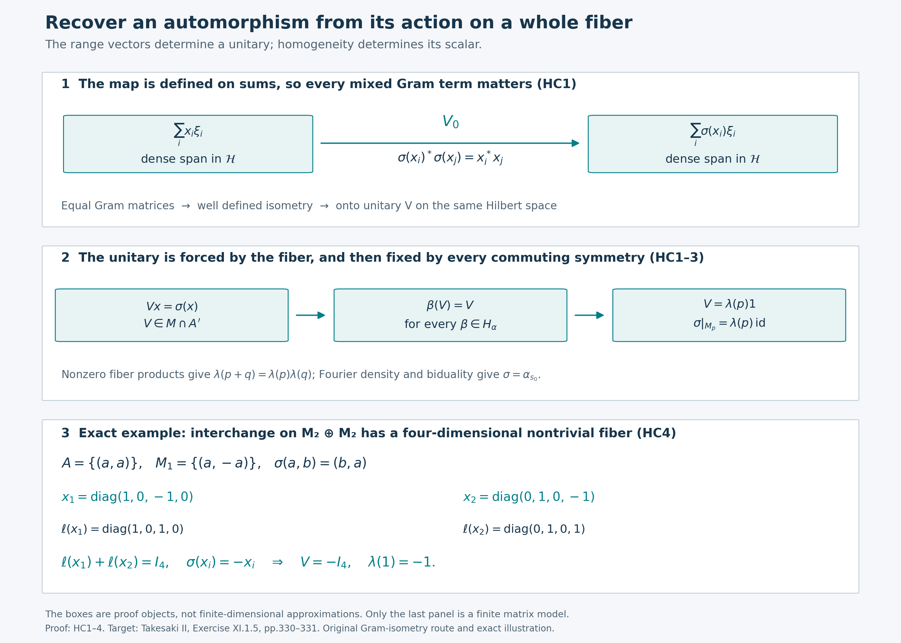

# A Gram isometry recovers the compact action

The key object in this proof is an operator on the existing Hilbert space. If an automorphism fixes the inner products of a spectral fiber, it gives an isometry on the span of that fiber's ranges. Full aggregate support makes the isometry unitary; homogeneity makes it scalar. Fourier density then recovers the automorphism on the whole algebra.

*Independent local proof written by GPT-6 Astra (OpenAI), Ultra, 5 October 2026. New expression and illustration are dedicated under CC0-1.0 to the extent of rights held. Spot-checked by GPT-6.1 Sol in a separate session.*

Let \(G\) be a compact Hausdorff abelian group, and let \(\alpha\) be a point-ultraweakly continuous action on a nonzero von Neumann algebra \(M\). Automorphisms in this lesson are normal. Define

\[
 A=M^\alpha,\qquad
 H_\alpha=\{\beta\in\operatorname{Aut}(M):\beta\alpha_s=\alpha_s\beta\ (s\in G)\}.
\tag{HC1}
\]
Assume \(M^{H_\alpha}=\mathbb C1\). We prove that every automorphism \(\sigma\) commuting with \(H_\alpha\) and fixing \(A\) pointwise belongs to \(\alpha(G)\). No sigma-finiteness or countability hypothesis on \(M\) is imposed. If \(M=0\), there is only one automorphism and the conclusion holds separately.

The precise earlier inputs are [Hilbert completion and bounded extension](OA-FLOW-CF.md#oa-flow.cf.10), [scalar and choice conventions](OA-FLOW-CF.md#oa-flow.cf.1), [Hilbert projections](OA-FLOW-CF.md#oa-flow.cf.8), [compact approximation](OA-FLOW-CF.md#oa-flow.cf.5), [bounded square roots](OA-FLOW-CF.md#oa-flow.cf.7), [the concrete commutant test](OA-FLOW-SF.md#oa-flow.shared-foundations.sf-0), [projection joins](OA-FLOW-NF.md#oa-flow.nf.1), [Haar finiteness and positivity](OA-FLOW-HR.md#hr-06), [normal integrated actions](OA-FLOW-AT.md#oa-flow.at.5), [normal-functional duality](OA-FLOW-CP.md#oa-flow.cp.6), [compact quotient topology](OA-FLOW-QF.md#qf-1), and the complete [topological biduality proof](OA-FLOW-HARMONIC-LATE.md#l138-h3). They supply actual proofs, rather than bibliography substitutes. The exact source and range ledger is separate from this chapter.

## HC1. Preserved Gram matrices determine a unitary

Here is the Hilbert-space lemma we will use. Let \(M\subset B(\mathcal H)\) be a faithful nondegenerate concrete von Neumann algebra, let \(A\subset M\) be a unital subalgebra, and let \(X\subset M\) be a linear subspace satisfying

\[
 AX\subset X,\qquad X^*X\subset A,\qquad
 \overline{\operatorname{span}\{x\xi:x\in X,\ \xi\in\mathcal H\}}=\mathcal H.
\tag{HC2}
\]
Suppose that \(\sigma\in\operatorname{Aut}(M)\) fixes \(A\) pointwise and maps \(X\) onto \(X\). Then there is a unique unitary \(V\in M\cap A'\) such that

\[
 Vx=\sigma(x)\qquad(x\in X).
\tag{HC3}
\]

On the algebraic span in (HC2), set

\[
 V_0\Big(\sum_{i=1}^n x_i\xi_i\Big)
       =\sum_{i=1}^n\sigma(x_i)\xi_i.
\tag{HC4}
\]
For every pair \(i,j\),

\[
 \sigma(x_i)^*\sigma(x_j)=\sigma(x_i^*x_j)=x_i^*x_j.
\tag{HC5}
\]
Thus the two sums in (HC4) have equal squared norms, by expanding their Gram matrices. Applying the same statement to a difference of two presentations proves that \(V_0\) is well defined. It is linear and isometric. Hilbert completion extends it uniquely to an isometry \(V\) on \(\mathcal H\). Since \(\sigma(X)=X\), its range contains the dense span in (HC2). The range of an isometry is closed: a convergent sequence of image vectors has a Cauchy sequence of preimages. Therefore \(V\) is onto and unitary.

For \(b\in M'\), both \(x\) and \(\sigma(x)\) commute with \(b\). Formula (HC4) gives \(Vb(x\xi)=bV(x\xi)\), first on the dense span and hence everywhere. Consequently \(V\in(M')'=M\). If \(a\in A\), then \(ax\in X\), and

\[
 Va(x\xi)=\sigma(ax)\xi=a\sigma(x)\xi=aV(x\xi).
\tag{HC6}
\]
Density yields \(Va=aV\). Uniqueness in (HC3) follows from the same density. This proves the lemma without choosing a unitary element of \(X\).

There is a useful equivariance consequence. If \(\beta\in\operatorname{Aut}(M)\) maps \(X\) onto itself and commutes with \(\sigma\), then

\[
 \beta(V)\beta(x)=\beta(\sigma(x))
                 =\sigma(\beta(x))=V\beta(x).
\tag{HC7}
\]
The ranges of \(\beta(X)=X\) span densely, so \(\beta(V)=V\). No spatial implementation of \(\beta\) or \(\sigma\) has been assumed.

## HC2. Homogeneity supplies the dense ranges

For \(p\in\widehat G\), let

\[
 M_p=\{x\in M:\alpha_s(x)=p(s)x\ (s\in G)\},\qquad
 S=\{p:M_p\ne0\}.
\tag{HC8}
\]
Products and adjoints give \(M_pM_q\subset M_{p+q}\), \(M_p^*=M_{-p}\), and \(M_0=A\). In particular, \(AM_p\subset M_p\) and \(M_p^*M_p\subset A\).

Write \(\ell(x)\) and \(r(x)\) for the projections onto the closures of the ranges of \(x\) and \(x^*\), respectively. They belong to \(M\): their ranges and orthogonal complements are invariant under every unitary in \(M'\), so the earlier commutant test applies. Equivalently they are the support projections of \(xx^*\) and \(x^*x\). Their joins exist by NF1's closed-range-span construction. Define

\[
 L_p=\bigvee_{x\in M_p}\ell(x),\qquad
 R_p=\bigvee_{x\in M_p}r(x).
\tag{HC9}
\]
Normal automorphisms preserve these supports and joins. For supports this follows from their characterization as the least projection \(e\) with \(ex=x\), or \(xe=x\); an order isomorphism preserves the least such projection and arbitrary existing suprema. Every \(\beta\in H_\alpha\) permutes \(M_p\), so it fixes \(L_p,R_p\). Homogeneity makes both scalar projections. For \(p\in S\), a nonzero element gives nonzero support, whence

\[
 L_p=R_p=1\qquad(p\in S).
\tag{HC10}
\]
The first equality is exactly the dense-range hypothesis (HC2). It concerns the whole fiber, not each individual operator.

The set \(S\) is a subgroup. It contains zero because \(1\in A\), and is closed under negation by adjoints. Given \(p,q\in S\) and \(0\ne y\in M_q\), suppose \(xy=0\) for every \(x\in M_p\). Then \(x\ell(y)=0\), since the range of \(y\) is dense in that support. The kernel of \(x\) is the orthogonal complement of \(r(x)\mathcal H\), so \(r(x)\ell(y)=0\). Taking joins gives \(R_p\ell(y)=0\), contrary to (HC10). Some product \(xy\ne0\) therefore belongs to \(M_{p+q}\), proving closure under addition.

Because \(G\) is abelian, \(\alpha_s\in H_\alpha\). The hypothesis on \(\sigma\) implies that it preserves every \(M_p\). Apply HC1 to \(X=M_p\) for \(p\in S\). It gives \(V_p\in M\cap A'\). Formula (HC7) fixes \(V_p\) under all of \(H_\alpha\), hence homogeneity gives \(V_p=\lambda(p)1\), where \(|\lambda(p)|=1\). Thus

\[
 \sigma(x)=\lambda(p)x\qquad(x\in M_p).
\tag{HC11}
\]
The scalar is unique because \(M_p\ne0\). The nonzero product just constructed shows

\[
 \lambda(p+q)xy=\sigma(xy)=\lambda(p)\lambda(q)xy,
 \qquad\lambda(0)=1.
\tag{HC12}
\]
It follows that \(\lambda:S\to\mathbb T\) is a group character. No properly infinite corner, projection comparison, or amplification enters this construction.

## HC3. Fourier density identifies the group element

Normalize Haar measure to total mass one. Compact finiteness and nonzero Haar mass justify this normalization. For \(p\in\widehat G\), AT5 supplies the normal bounded map

\[
 P_p(x)=\int_G\overline{p(s)}\alpha_s(x)\,ds.
\tag{HC13}
\]
The integral means the adjoint of the predual Bochner integral proved there. Haar substitution gives \(\alpha_t(P_px)=p(t)P_px\), so its range is \(M_p\); if \(x\in M_p\), the integral equals \(x\).

The linear span of the fibers is ultraweakly dense. Indeed, if \(\omega\in M_*\) annihilates this span, all Fourier coefficients of the continuous scalar function \(f_x(s)=\omega(\alpha_s(x))\) vanish. The characters separate points by H3, contain constants, and are closed under products and conjugation. CF5 gives their uniform density in \(C(G)\). Approximate \(\overline{f_x}\) uniformly by character polynomials and use Haar mass one; then \(\int_G|f_x|^2=0\). Haar positivity on nonempty open sets and continuity force \(f_x=0\), in particular \(\omega(x)=0\) for every \(x\).

Here the annihilator argument for density can also be seen directly. If the span were not ultraweakly dense, some \(x\) would be separated by finitely many normal evaluations \(\omega_1,\ldots,\omega_n\). The image of the span in \(\mathbb C^n\) is a linear subspace and hence closed. Orthogonal projection in \(\mathbb C^n\) gives a linear combination of these evaluations that vanishes on the span but not on \(x\), contradicting the preceding paragraph.

Let \(K=\ker\alpha\). It is closed because all scalar orbit functions are continuous and separate algebra elements. The quotient \(G/K\) is compact Hausdorff abelian: the quotient map is open, and distinct cosets can be separated since \(K\) is closed. The action \(\bar\alpha_{sK}=\alpha_s\) is faithful and point-ultraweakly continuous by the quotient topology. It has exactly the same image, fixed algebra and commuting automorphism group. Thus HC1–2 apply to that quotient. We may first identify the group element for a faithful action.

For a faithful action, HC2's subgroup \(S\subset\widehat G\) is the whole dual. An element \(s\in G\) annihilating every \(p\in S\) fixes every fiber; normality and the density just proved give \(\alpha_s=\operatorname{id}\), hence \(s=0\). To see that this forces \(S=\widehat G\), note first that \(\widehat G\) is discrete: the compact-open neighborhood \(\sup_{s\in G}|p(s)-1|<1\) contains only the trivial character. For the elementary circle assertion, choose a nonzero value with principal argument \(0<|t|\le\pi\). If \(|t|\ge\pi/3\), its distance from \(1\) is at least one. Otherwise the least positive integer \(n\) with \(n|t|\ge\pi/3\) satisfies \(\pi/3\le n|t|<2\pi/3\), so the \(n\)th power has distance at least one. Evaluating the character at the corresponding multiple of the group element proves that no nontrivial character lies in the stated neighborhood.

If \(S\) were proper, choose a nonzero element of the discrete abelian quotient \(\widehat G/S\). H3's injectivity, applied to this discrete locally compact group, gives a character nontrivial on that element. Pull it back to a character of \(\widehat G\) trivial on \(S\). H3's surjectivity for \(G\) writes it as evaluation at some \(s\in G\). It is nontrivial, so \(s\ne0\), while it annihilates \(S\), a contradiction. This proves the needed annihilator implication from the actual earlier biduality theorem.

Consequently \(\lambda\) in (HC12) is a character of the discrete group \(\widehat G\), and is automatically continuous. H3 now supplies \(s_0\in G\) with

\[
 \lambda(p)=p(s_0)\quad(p\in\widehat G).
\tag{HC14}
\]
Equations (HC11) and (HC14) show that \(\sigma\) and \(\alpha_{s_0}\) agree on every fiber. Their normality and ultraweak density give

\[
 \sigma=\alpha_{s_0}.
\tag{HC15}
\]
For the original possibly nonfaithful action, apply this conclusion to \(G/K\) and choose a representative of the resulting coset. This completes the asserted theorem. Uniqueness of the coset is exactly the definition of \(K\).

## HC4. A fiber with matrix-valued coefficients

Take \(M=M_2(\mathbb C)\oplus M_2(\mathbb C)\), and let \(G=\mathbb Z/2\) act by interchange. The fixed algebra is \(A=\{(a,a):a\in M_2\}\), and the nontrivial fiber is \(X=\{(a,-a):a\in M_2\}\), of complex dimension four. The system is homogeneous. Indeed, common conjugations \((a,b)\mapsto(uau^*,ubu^*)\) commute with interchange. A matrix fixed by every such conjugation is scalar: commuting with diagonal unitaries kills off-diagonal entries, and commuting with the swap matrix equalizes the two diagonal entries. Their common fixed algebra in \(M\) is therefore \(\mathbb C\oplus\mathbb C\); interchange reduces it to \(\mathbb C1\). These automorphisms belong to \(H_\alpha\), so its fixed algebra is scalar too.

On \(\mathcal H=\mathbb C^2\oplus\mathbb C^2\), set

\[
 x_1=(e_{11},-e_{11}),\quad x_2=(e_{22},-e_{22}),\qquad
 \ell(x_1)+\ell(x_2)=1.
\tag{HC16}
\]
Neither \(x_i\) is unitary. Nevertheless their ranges span \(\mathcal H\). For \(\sigma\) equal to interchange, \(\sigma(x_i)=-x_i\), so (HC4) directly gives

\[
 V=-I_{\mathcal H},\qquad\lambda(0)=1,\quad\lambda(1)=-1.
\tag{HC17}
\]
The character is evaluation at the nonzero group element. This illustrates the dense-range mechanism even though the original action is not ergodic: its fixed algebra is the full matrix algebra \(M_2\).

**Exercise.** Why does equality of the separate norms \(\|\sigma(x_i)\xi_i\|=\|x_i\xi_i\|\) not suffice to define (HC4)?

**Solution.** A vector can have different presentations as a sum of range vectors. Its norm includes every mixed term \(x_i^*x_j\). Equality of the entire Gram matrix (HC5) proves equality for the sum and for differences of presentations, so a zero presentation has zero image. Separate norms give no such conclusion.

**Exercise.** Does HC1 imply that the fiber contains a unitary?

**Solution.** HC1 constructs \(V\in M\) satisfying \(Vx=\sigma(x)\); it does not put \(V\) in \(X\). In the action setting, (HC7) makes \(V\) fixed under the action as well, so it belongs to \(A\). A nontrivial fiber intersects \(A\) only at zero. The theorem needs the scalar action on the fiber, not a unitary lying in it.

## HC5. Source and retained work

The target is the homogeneous centralizer theorem in Takesaki, [*Theory of Operator Algebras II*](https://doi.org/10.1007/978-3-662-10451-4), Exercise XI.1.5, printed330–331. Its proposed route uses twisted two-by-two matrix fixed points, properly infinite projection comparison, a calculation with a unitary fiber generator, and stabilization under a sigma-finiteness hypothesis. Those mathematical antecedents are credited here.

The present proof is organized around the densely defined Gram isometry (HC4). It supplies scalar action on a fiber directly and does not consume those matrix-comparison or stabilization steps. Its arbitrary-algebra scope follows from that independently reviewed proof at its exact earlier inputs; it is not inferred from the source's restricted statement. Not all ancillary results of those historical works are reproved here.

## The fiber determines its Gram isometry

The first two panels show the actual objects and maps of [HC1–3](OA-FLOW-HCR.md#hc-1). For a nonzero spectral fiber \(M_p\subset M\subset B(\mathcal H)\), its range vectors span a dense subspace of the existing Hilbert space \(\mathcal H\). The map \(V_0:\sum_i x_i\xi_i\mapsto\sum_i\sigma(x_i)\xi_i\) is defined on that span. The identities \(\sigma(x_i)^*\sigma(x_j)=x_i^*x_j\) for every pair \(i,j\) prove that it is independent of the presentation of a vector and isometric. Its extension is an onto unitary \(V_p:\mathcal H\to\mathcal H\), not a unitary chosen inside the fiber.

Uniqueness on all range vectors and commutation with \(\sigma\) make every \(\beta\in H_\alpha\) fix \(V_p\). Homogeneity therefore makes it the scalar \(\lambda(p)1\). The nonzero-product argument in HC2 gives the character law on the occurring fibers. HC3 proves Fourier density and the faithful-quotient argument, then uses the earlier complete biduality theorem to identify the group element. The boxes denote those algebraic objects and implications; their widths carry no mathematical data.

The last panel is precisely the finite model [HC4](OA-FLOW-HCR.md#hc-4), represented on \(\mathbb C^2\oplus\mathbb C^2\). The nontrivial fiber consists of \((a,-a)\), so it has dimension four. The two displayed diagonal operators have orthogonal range supports summing to \(I_4\), although neither is unitary. Interchange negates each one, and the resulting Gram isometry is \(V=-I_4\). The scalar character takes values \(1,-1\) at \(0,1\in\mathbb Z/2\). The fixed algebra is \(M_2\), so this example is homogeneous without being ergodic.

The [exact data](../assets/homogeneous-centralizer/assets/homogeneous-gram-data.json) include all four fiber basis matrices; the [renderer](../assets/homogeneous-centralizer/render_figure.py) checks all sixteen Gram pairs by integer arithmetic. The [editable SVG](../assets/homogeneous-centralizer/assets/homogeneous-gram.svg) and native 2800 × 2000 PNG are reproducible. Human mathematical target: Takesaki, [*Theory of Operator Algebras II*](https://doi.org/10.1007/978-3-662-10451-4), Exercise XI.1.5. The book's staged matrix-comparison and stabilization route is distinct from the Gram-isometry proof displayed here; no source figure is reproduced.

Original figure and caption by GPT-6 Astra (OpenAI), Ultra, 5 October 2026. CC0-1.0 to the extent of rights held; third-party font terms remain applicable.
