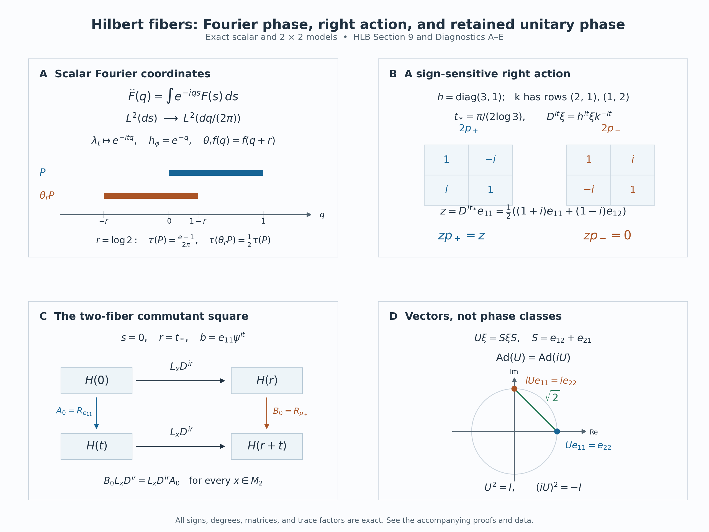

# Hilbert fibers and the represented core

*Self-checked by the writing AI. Original exposition and illustration sources: CC0-1.0; earlier and font components retain their recorded terms.*

A left operator and a right operator can act on the same vector without a preferred weight. The difficulty is keeping that statement true when vectors and operators have degrees, and when a weight changes the coordinates. We construct the vector spaces from unitary coordinate changes, characterize their left and right operators by an exact commutation test, and then integrate these operators. This produces the core on a Hilbert space together with its entire commutant.

## The two algebras and the grading

Let \(M\subset B(H)\) be a faithful normal unital representation of a von Neumann algebra. The Hilbert space is arbitrary. Set
\[
 N=(M')^{\mathrm{op}},\qquad R(y)\xi=\xi y=y^{\mathrm{op}}\xi
       \quad(y\in N,\ \xi\in H).
\tag{HLB0.a}
\]
Here the ordinary opposite map is **complex linear**, preserves adjoints and reverses products. Consequently
\[
 R(yz)=R(z)R(y),\qquad (\xi y)z=\xi(yz).
\tag{HLB0.b}
\]
The abstract right algebra \(N\) and the concrete left-acting algebra \(M'\) will therefore have different modular signs.

The [graded-fiber construction](OA-FLOW-GRD.md#grd-2) provides \(M(t)\) and \(N(t)\), their dual Banach-space structures and their weight coordinates. The [sectional algebra](OA-FLOW-SEC.md#sec-5) provides the complete involutive algebras \(\Gamma^1(\mathcal F(M))\) and \(\Gamma^1(\mathcal F(N))\), using completed Lebesgue measure \(dt\). Their coefficients are locally Mackey-Lusin and have integrable scalar norm; operator-norm Bochner measurability is not required.

Weights denoted by \(\varphi,\rho\) on \(M\), or \(\psi,\chi\) on \(N\), are faithful normal semifinite. They exist by [the weight-existence theorem](OA-FLOW-FR.md#oa-flow.fr.1). Write
\[
 u_{\omega\nu}(t)=[D\omega:D\nu]_t.
\tag{HLB0.c}
\]
The ordered chain and cocycle identities are those proved in [BC4](OA-FLOW-BC.md#oa-flow.bc.4). Inner products are linear in their first variable. For the zero algebra a unital representation has \(H=0\), all spaces and algebras below are zero, and every assertion has that immediate interpretation. The proof may thus be read with \(M\ne0\). No factor, faithful-state, countability or separability assumption is made.

## 1. Moving a weight through a vector

The operator that compares the two sides of a vector is the spatial derivative
\[
 D_{\varphi,\psi}=\frac{d\varphi}{d\psi^{\mathrm{op}}}
       \quad\hbox{on }H,\qquad
 \psi^{\mathrm{op}}(y^{\mathrm{op}})=\psi(y)\quad(y\geq0).
\tag{HLB1.a}
\]
The [closed spatial form and its relative-map identification](../../OA-MOD/OA-MOD-SI.html#the-relative-map-has-exactly-the-coefficient-form) construct this positive self-adjoint operator on the given representation. [The two modular actions](../../OA-MOD/OA-MOD-SI.html#the-two-modular-actions-and-the-relative-conjugation) prove that its kernel is zero. Its imaginary powers are therefore an everywhere-defined strongly continuous unitary group. We abbreviate it to \(D^{it}\) only when both weights have been fixed.

We first fix the opposite convention at the level of weights. For any faithful normal semifinite weight \(\omega\) on an algebra \(B\),
\[
 \sigma_t^{\omega^{\mathrm{op}}}(b^{\mathrm{op}})
       =\bigl(\sigma_{-t}^{\omega}(b)\bigr)^{\mathrm{op}}.
\tag{HLB1.b}
\]
Here is how the [opposite-weight theorem](../../OA-MOD/OA-MOD-SI.html#the-opposite-weight-and-its-modular-data) gives precisely this formula for the ordinary opposite. In the faithful GNS representation of \(\omega\), the normal isomorphism from \(B^{\mathrm{op}}\) onto \(B'\) is
\(b^{\mathrm{op}}\mapsto Jb^*J\). On positive elements it transports \(\omega^{\mathrm{op}}\) to the opposite weight, whose modular operator is \(\Delta^{-1}\). Its modular action is thus
\[
 \Delta^{-it}(Jb^*J)\Delta^{it}
     =J\bigl(\Delta^{-it}b^*\Delta^{it}\bigr)J.
\]
The equality uses \(J\Delta^{is}=\Delta^{is}J\), which follows from the antiunitary spectral calculus and \(J\Delta J=\Delta^{-1}\). The right side is the image of \((\sigma_{-t}^{\omega}(b))^{\mathrm{op}}\). Modular transport through this normal weight-preserving isomorphism follows by transporting the entire GNS finite-star domain and its closed Tomita operator, as in [SI14](../../OA-MOD/OA-MOD-SI.html#the-balanced-matrix-cocycle-is-independent-of-the-reference). This proves (HLB1.b).

Applying the two spatial modular identities to \(M\) and \(M'\), then using (HLB1.b), gives
\[
 \begin{aligned}
 D_{\varphi,\psi}^{it}xD_{\varphi,\psi}^{-it}
       &=\sigma_t^\varphi(x),\\
 D_{\varphi,\psi}^{it}(\xi y)
       &=(D_{\varphi,\psi}^{it}\xi)\sigma_t^\psi(y).
 \end{aligned}
\tag{HLB1.c}
\]
The second equation is an identity of vectors with an abstract right action; the corresponding action on \(M'\) has time \(-t\).

There are two distinct changes of weight:
\[
 \begin{aligned}
 D_{\varphi_1,\psi}^{it}
       &=u_{\varphi_1\varphi_2}(t)D_{\varphi_2,\psi}^{it},\\
 D_{\varphi,\psi_1}^{it}\xi
       &=(D_{\varphi,\psi_2}^{it}\xi)u_{\psi_2\psi_1}(t).
 \end{aligned}
\tag{HLB1.d}
\]
The numerator formula is the spatial product formula in [SI14](../../OA-MOD/OA-MOD-SI.html#the-balanced-matrix-cocycle-is-independent-of-the-reference). To prove the denominator formula, including the order of its factors, we give the opposite-cocycle computation.

On \(M_2(N)\), let \(\Psi=\psi_1\oplus\psi_2\). The ordinary opposite is identified with \(M_2(N^{\mathrm{op}})\) by the complex-linear anti-isomorphism
\[
 [a_{ij}]\longmapsto[a_{ji}^{\mathrm{op}}].
\]
It carries the diagonal weight to \(\psi_1^{\mathrm{op}}\oplus\psi_2^{\mathrm{op}}\). The balanced-matrix definition in SI14 says that the \(21\) coefficient of \(\sigma_t^\Psi(E_{21})\) is \(u_{\psi_2\psi_1}(t)\). Passing to the opposite transposes this corner and reverses modular time by (HLB1.b); taking the adjoint corner gives
\[
 \begin{aligned}
 v(t)&=[D\psi_2^{\mathrm{op}}:D\psi_1^{\mathrm{op}}]_t\\
     &=\bigl(u_{\psi_2\psi_1}(-t)^*\bigr)^{\mathrm{op}}\\
     &=\bigl(\sigma_{-t}^{\psi_1}
                   (u_{\psi_2\psi_1}(t))\bigr)^{\mathrm{op}}.
 \end{aligned}
\tag{HLB1.e}
\]
The last step is the cocycle identity at \((-t)+t=0\); it uses no analytic continuation.

By [reciprocity on the original Hilbert space](../../OA-MOD/OA-MOD-SI.html#reversing-the-two-corners-proves-reciprocity),
\(E_j=d\psi_j^{\mathrm{op}}/d\varphi=D_{\varphi,\psi_j}^{-1}\).
The numerator formula applied on \(M'\) gives \(E_2^{it}=v(t)E_1^{it}\). Taking adjoints and rearranging only bounded unitaries yields
\[
 D_{\varphi,\psi_1}^{it}=D_{\varphi,\psi_2}^{it}v(t).
\]
Put \(u=u_{\psi_2\psi_1}(t)\). The right side applied to \(\xi\), by (HLB1.c) and (HLB1.e), is
\[
 (D_{\varphi,\psi_2}^{it}\xi)
       \sigma_t^{\psi_2}\bigl(\sigma_{-t}^{\psi_1}(u)\bigr)
       =(D_{\varphi,\psi_2}^{it}\xi)u,
\]
since \(\sigma_t^{\psi_2}=\operatorname{Ad}u\circ\sigma_t^{\psi_1}\).
This proves the denominator formula. In particular, the argument does not multiply unbounded derivatives or assume that their reciprocals are bounded.

## 2. Vectors of a prescribed degree

A vector of degree \(t\) will have unitary coordinates in \(H\), but its left and right weight labels may differ. Start with quadruples
\((r,\varphi,\xi,\psi)\), where \(r\in\mathbb R\), \(\xi\in H\), and the weights are as above. For a fixed right reference weight \(\chi\), assign the coordinate
\[
 Q_{\chi,t}(r,\varphi,\xi,\psi)
       =(D_{\varphi,\psi}^{ir}\xi)u_{\psi\chi}(t).
\tag{HLB2.a}
\]
Declare two quadruples equivalent when these coordinates agree. The definition is independent of \(\chi\): for another reference \(\kappa\), the ordered chain rule gives
\[
 Q_{\kappa,t}=Q_{\chi,t}u_{\chi\kappa}(t).
\tag{HLB2.b}
\]
Multiplication on the right by this unitary is invertible. Thus equality for one reference is equality for every reference. Equivalently the relation is
\[
 D_{\varphi_1,\psi_1}^{ir_1}\xi_1
       =(D_{\varphi_2,\psi_2}^{ir_2}\xi_2)
                          u_{\psi_2\psi_1}(t).
\tag{HLB2.c}
\]
Equality of coordinates proves reflexivity, symmetry and transitivity at once.

Denote the quotient by \(H(t)\), and denote its element by
\(\varphi^{ir}\xi\psi^{i(t-r)}\). This is a class symbol, not a product of three operators on \(H\). The induced map
\[
 q_{\chi,t}:H(t)\longrightarrow H
\tag{HLB2.d}
\]
is injective by the definition and onto because \((0,\varphi_0,\eta,\chi)\) has coordinate \(\eta\) for every \(\eta\in H\). Transport addition, complex scalars and inner product through this bijection. Equation (HLB2.b) shows that another reference gives exactly the same Hilbert structure, since \(R(u_{\chi\kappa}(t))\) is unitary. Completeness follows from the onto isometry to \(H\), not from a further completion of the set of symbols.

There are two useful onto unitary charts:
\[
 V_\psi(t)\eta=\eta\psi^{it},\qquad
 U_\varphi(t)\xi=\varphi^{it}\xi,\qquad
 q_{\psi,t}U_\varphi(t)=D_{\varphi,\psi}^{it}.
\tag{HLB2.e}
\]
For \(V_\psi\), use a representative with \(r=0\); the numerator is irrelevant. For \(U_\varphi\), use \(r=t\); its denominator is irrelevant by (HLB1.d). Every class has the two expressions
\[
 \varphi^{ir}\xi\psi^{i(t-r)}
   =V_\psi(t)D_{\varphi,\psi}^{ir}\xi
   =U_\varphi(t)D_{\varphi,\psi}^{i(r-t)}\xi.
\tag{HLB2.f}
\]
In particular \(V_\psi(t)^*U_\varphi(t)=D_{\varphi,\psi}^{it}\). Degree zero has a canonical identification with \(H\), because all right transitions are \(u_{\psi\chi}(0)=1\), and both charts at zero are that same identification.

The elementary changes of labels contain the entire equivalence relation. To see this without imposing extra formal relations, replace any symbol by its first expression in (HLB2.f), change the right weight through (HLB2.b), and compare its coordinate in one fixed \(V_\chi\) chart. Two symbols are equivalent precisely when the resulting vectors are equal. Numerator changes use the first formula of (HLB1.d), denominator changes use the second, and sliding a power from one side of a vector to the other uses (HLB2.f). Each such operation preserves \(q_{\chi,t}\).

Give the disjoint union \(\mathcal H=\bigsqcup_{t\in\mathbb R}H(t)\) the topology transported from \(\mathbb R\times H\) by a \(V_\psi\) chart. It is independent of the reference. Indeed, for \(w_t=u_{\psi\chi}(t)\),
\[
 \|\eta w_t-\eta_0w_{t_0}\|
 \leq\|\eta-\eta_0\|+\|\eta_0(w_t-w_{t_0})\|.
\tag{HLB2.g}
\]
The cocycle is strongly continuous in the faithful normal right representation, so the second term tends to zero. The reverse transition satisfies the same estimate. The \(U_\varphi\) charts give the same topology because \(D_{\varphi,\psi}^{it}\) is a strongly continuous unitary group, and the same two-term estimate applies. Thus every chart is a homeomorphism of the entire Hilbert bundle. No countable basis or separability assertion about \(H\) entered the construction.

## 3. Operators between fibers and the commutation test

For \(a=x\varphi^{ir}\in M(r)\), \(b=y\psi^{it}\in N(t)\), and \(\zeta\in H(s)\), define left and right actions by
\[
 \begin{aligned}
 q_{\psi,r+s}(a\zeta)
       &=xD_{\varphi,\psi}^{ir}q_{\psi,s}(\zeta),\\
 q_{\psi,s+t}(\zeta b)
       &=q_{\psi,s}(\zeta)\sigma_s^\psi(y).
 \end{aligned}
\tag{HLB3.a}
\]
The target degree is part of each definition.

First check all coordinate choices. Changing the numerator \(\varphi\) of \(a\) to \(\rho\) changes \(x\) to \(xu_{\varphi\rho}(r)\); the first formula of (HLB1.d) keeps \(xD_{\varphi,\psi}^{ir}\) unchanged. For a change of right weight \(\psi\) to \(\chi\), put \(w_v=u_{\psi\chi}(v)\) and \(\eta=q_{\psi,s}(\zeta)\). The new vector coordinate is \(\eta w_s\). The denominator identity and spatial covariance give
\[
 \begin{aligned}
 D_{\varphi,\chi}^{ir}(\eta w_s)
  &=(D_{\varphi,\psi}^{ir}\eta)
                   \sigma_r^\psi(w_s)w_r\\
  &=(D_{\varphi,\psi}^{ir}\eta)w_{r+s}.
 \end{aligned}
\tag{HLB3.b}
\]
For the last equality, use
\(\sigma_r^\psi=\operatorname{Ad}w_r\circ\sigma_r^\chi\) and then
\(w_r\sigma_r^\chi(w_s)=w_{r+s}\). This is exactly the transition in the target fiber of the left action. For the right action the new coefficient of \(b\) is \(yw_t\), and
\[
 (\eta w_s)\sigma_s^\chi(yw_t)
       =\eta\sigma_s^\psi(y)w_{s+t}.
\tag{HLB3.c}
\]
This is its target transition. These checks cover both changes of graded-element coordinates and changes of vector coordinates. They prove that the actions are well-defined. Complex multilinearity follows in any fixed chart.

The three associativity assertions are
\[
 (ac)\zeta=a(c\zeta),\qquad
 (\zeta b)d=\zeta(bd),\qquad
 (a\zeta)b=a(\zeta b).
\tag{HLB3.d}
\]
For the first, use a common left weight, write \(a=x\varphi^{ir}\), \(c=z\varphi^{iu}\), and compute
\[
 xD^{ir}zD^{iu}\eta
       =x\sigma_r^\varphi(z)D^{i(r+u)}\eta.
\]
This is the coefficient of the graded product from [GRD3](OA-FLOW-GRD.md#grd-3). For the second, with \(d=z\psi^{iv}\), the two right coefficients at source degree \(s\) are equal because
\[
 \sigma_s^\psi(y)\sigma_{s+t}^\psi(z)
       =\sigma_s^\psi(y\sigma_t^\psi(z)).
\]
For the mixed identity, \(D^{ir}(\eta\sigma_s^\psi(y))
=(D^{ir}\eta)\sigma_{r+s}^\psi(y)\) by (HLB1.c), and \(x\) commutes with the right action. This gives both expressions in the common target chart.

Let \(L_a^s:H(s)\to H(s+r)\) and \(R_b^s:H(s)\to H(s+t)\) denote these bounded maps. Since every chart and \(D^{ir}\) are unitary, and the concrete representations of \(M,N\) are faithful,
\[
 \|L_a^s\|=\|a\|,\qquad \|R_b^s\|=\|b\|.
\tag{HLB3.e}
\]
Their adjoints have the exact types
\[
 \begin{aligned}
 (L_a^s)^*&=L_{a^*}^{s+r}:H(s+r)\longrightarrow H(s),\\
 (R_b^s)^*&=R_{b^*}^{s+t}:H(s+t)\longrightarrow H(s).
 \end{aligned}
\tag{HLB3.f}
\]
For the left formula, the coordinate adjoint is
\(D^{-ir}x^*=\sigma_{-r}^\varphi(x^*)D^{-ir}\), the coordinate of
\(a^*=\sigma_{-r}^\varphi(x^*)\varphi^{-ir}\).
For the right formula, the adjoint of \(R(\sigma_s^\psi(y))\) is
\(R(\sigma_s^\psi(y^*))\). Acting at degree \(s+t\) with
\(b^*=\sigma_{-t}^\psi(y^*)\psi^{-it}\) gives exactly this operator.

We now characterize all operators satisfying a two-fiber commutation test. Fix \(r,s,t\in\mathbb R\) and bounded maps
\[
 A:H(s)\longrightarrow H(s+t),\qquad
 B:H(r+s)\longrightarrow H(r+s+t).
\tag{HLB3.g}
\]
Then the following two assertions hold.

**Left commutation.** The identity
\[
 B(z\zeta)=z(A\zeta)
       \quad(z\in M(r),\ \zeta\in H(s))
\tag{HLB3.h}
\]
holds if and only if a unique \(b\in N(t)\) satisfies
\(A\zeta=\zeta b\) and \(B\eta=\eta b\) on their respective source fibers.

**Right commutation.** The identity
\[
 B(\zeta z)=(A\zeta)z
       \quad(z\in N(r),\ \zeta\in H(s))
\tag{HLB3.i}
\]
holds if and only if a unique \(a\in M(t)\) satisfies
\(A\zeta=a\zeta\) and \(B\eta=a\eta\).

**Proof of left commutation.** Fix \(\varphi,\psi\), write \(D=D_{\varphi,\psi}\), and transport the maps to \(H\):
\[
 A_0=V_\psi(s+t)^*AV_\psi(s),\qquad
 B_0=V_\psi(r+s+t)^*BV_\psi(r+s).
\tag{HLB3.j}
\]
Equation (HLB3.h) becomes \(B_0xD^{ir}=xD^{ir}A_0\) for every \(x\in M\).
At \(x=1\) it gives \(B_0=D^{ir}A_0D^{-ir}\). Substitution now gives
\(B_0x=xB_0\), so \(B_0\in M'\). Spatial covariance normalizes \(M'\), whence also \(A_0\in M'\). There is a unique \(y_s\in N\) with \(A_0=R(y_s)\). Moreover
\[
 B_0=R(\sigma_r^\psi(y_s)).
\]
The single element
\[
 b=\sigma_{-s}^\psi(y_s)\psi^{it}\in N(t)
\tag{HLB3.k}
\]
acts at degree \(s\) as \(A_0\) and at degree \(r+s\) as \(B_0\), by (HLB3.a).
Faithfulness proves uniqueness, and (HLB3.e) gives
\(\|A\|=\|B\|=\|b\|\).

**Proof of right commutation.** In the same coordinates, (HLB3.i) is
\[
 B_0R(\sigma_s^\psi(y))
       =R(\sigma_{s+t}^\psi(y))A_0\qquad(y\in N).
\tag{HLB3.l}
\]
At \(y=1\) it gives \(B_0=A_0\). Multiplying by \(D^{-it}\) on the left and using (HLB1.c) shows that \(D^{-it}A_0\) commutes with every
\(R(\sigma_s^\psi(y))\). These operators run through \(M'\); hence
\(D^{-it}A_0\in(M')'=M\). Write this element as \(x\). Then
\[
 A_0=B_0=D^{it}x=\sigma_t^\varphi(x)D^{it},
\]
and
\[
 a=\sigma_t^\varphi(x)\varphi^{it}\in M(t)
\tag{HLB3.m}
\]
has exactly the two required left actions. Faithfulness again gives uniqueness and
\(\|A\|=\|B\|=\|a\|\). The converses of both statements follow from the mixed associativity in (HLB3.d). This completes both proofs.

The types in (HLB3.g) matter: the expression on the right of (HLB3.i) uses \(A\zeta\), whose input has degree \(s\). It cannot use \(B\zeta\), since the domain of \(B\) is \(H(r+s)\). The same discipline will identify the adjoints after integration.

## 4. Square-integrable sections and the integrated actions

Write \(\mathscr H=\Gamma^2(H(\cdot))=L^2(\mathcal H)\) for the space of sections \(\zeta(t)\in H(t)\) whose coefficient in one Hilbert chart is strongly measurable and satisfies
\[
 \|\zeta\|_2^2=\int_{\mathbb R}\|\zeta(t)\|^2\,dt<\infty,
 \qquad
 \langle\zeta,\nu\rangle=\int_{\mathbb R}
                  \langle\zeta(t),\nu(t)\rangle\,dt .
 \tag{HLB4.a}
\]
Sections are identified almost everywhere. The inner product is linear in its first variable. Strong measurability means almost-everywhere convergence of finite-valued measurable vector functions. In particular each field has a separable essential range; the ambient \(H\) need not be separable. The [arbitrary-H vector integration theorem](OA-FLOW-L24.md#oa-flow.grp.vectorintegration) uses exactly this definition.

**Charts and completeness.** The unitary transition fields from [Section 2](OA-FLOW-HLB.md#hlb-2) preserve strong measurability. Indeed, the orbit of each fixed vector under a strongly continuous unitary field has separable range: exhaust \(\mathbb R\) by compact intervals and take finite metric nets in each compact image. A finite-valued measurable vector function therefore remains strongly measurable after a transition. Apply this to a sequence of simple approximants. Their images have a common separable closed linear span, and pointwise norm convergence proves the assertion for the original field. The inverse transition has the same property. Consequently
\[
 \begin{aligned}
 \mathbb V_\psi:L^2(\mathbb R,H)&\longrightarrow\mathscr H,
       &(\mathbb V_\psi\eta)(t)&=V_\psi(t)\eta(t),\\
 \mathbb U_\varphi:L^2(\mathbb R,H)&\longrightarrow\mathscr H,
       &(\mathbb U_\varphi F)(t)&=U_\varphi(t)F(t)
 \end{aligned}
 \tag{HLB4.b}
\]
are onto isometries, preserving the inner products.

Here is the completeness argument on the entire function space. From a Cauchy sequence choose \(F_{n_j}\) with
\(\sum_j\|F_{n_{j+1}}-F_{n_j}\|_2<\infty\), and set
\(d_j(t)=\|F_{n_{j+1}}(t)-F_{n_j}(t)\|\).
The scalar \(L^2\) triangle inequality, obtained from Cauchy–Schwarz, and monotone convergence give
\[
 \left\|\sum_{j\ge k}d_j\right\|_2
       \le\sum_{j\ge k}\|F_{n_{j+1}}-F_{n_j}\|_2 .
 \tag{HLB4.c}
\]
One first applies the inequality to finite sums and then increases their length. The sum for \(k=1\) is finite almost everywhere. Completeness of \(H\) gives a pointwise limit \(F\) there; set it to zero on the exceptional set. All the fields involved have their ranges in one separable closed subspace after a null modification. Pointwise limits and simple approximation therefore make \(F\) strongly measurable. Its difference from \(F_{n_k}\) is bounded by the tail in (HLB4.c), which proves \(L^2\) convergence and then convergence of the original Cauchy sequence. Thus \(\mathscr H\) is a Hilbert space.

Finite sums \(f_j(t)\xi_j\), with \(f_j\in C_c(\mathbb R)\) and \(\xi_j\in H\), are dense in \(L^2(\mathbb R,H)\). Truncate support and norm, use simple approximation, and approximate each scalar indicator in \(L^2\) by the [compact continuous cutoffs](OA-FLOW-FF.md#oa-flow.ff.2). This also proves
\[
 \|F(\,\cdot-h)-F\|_2\longrightarrow0\quad(h\to0):
 \tag{HLB4.d}
\]
first use uniform continuity and a common compact support for those finite sums, then density and the translation isometry. This is the full regular Hilbert space of L24, rather than a chosen separable part of it.

**Define both integrals.** Use bold letters for graded sections and ordinary letters for their coefficients:
\(\mathbf a(r)=a(r)\varphi^{ir}\) and
\(\mathbf b(r)=b(r)\psi^{ir}\).
Use the notation \(\mathcal L^1(M(\cdot))=\Gamma^1(\mathcal F(M))\), and similarly for \(N\). Take
\(\mathbf a\in\mathcal L^1(M(\cdot))\),
\(\mathbf b\in\mathcal L^1(N(\cdot))\), the complete section algebras of [SEC](OA-FLOW-SEC.md#sec-4), and abbreviate \(D_{\varphi,\psi}\) to \(D\).
The typed fiber actions of [Section 3](OA-FLOW-HLB.md#hlb-3) prescribe, in the \(\mathbb V_\psi\) chart,
\[
 \begin{aligned}
 (\mathbb V_\psi^*L_{\mathbf a}\mathbb V_\psi\eta)(t)
    &=\int_{\mathbb R}a(r)D^{ir}\eta(t-r)\,dr,\\
 (\mathbb V_\psi^*R_{\mathbf b}\mathbb V_\psi\eta)(t)
    &=\int_{\mathbb R}
          \eta(t-r)\sigma_{t-r}^{\psi}(b(r))\,dr .
 \end{aligned}
 \tag{HLB4.e}
\]
These will be Bochner integrals in \(H\). No operator-norm Bochner integral of \(a\) or \(b\) is used.

We first prove joint strong measurability. In the variables \((r,v)\), the two fields before substitution are
\[
 a(r)D^{ir}\eta(v),\qquad
       \eta(v)\sigma_v^\psi(b(r)).
 \tag{HLB4.f}
\]
By [SEC1](OA-FLOW-SEC.md#sec-1), there are countably many compact coefficient restrictions covering almost all of the \(r\)-line, on each of which the coefficient is bounded and strong-star continuous. For each fixed \(\xi\in H\), the corresponding fields in (HLB4.f) with \(\eta(v)\) replaced by \(\xi\) are norm continuous on the product of such a compact and a compact \(v\)-interval. This follows from strong continuity of \(D^{ir}\), [bounded joint modular continuity](OA-FLOW-AT.md#oa-flow.at.4), and
\(\|A_i\xi_i-A\xi\|\le\|A_i\|\|\xi_i-\xi\|+\|(A_i-A)\xi\|\).
Their compact metric images are separable.

Approximate \(\eta(v)\) pointwise by finite-valued measurable functions. For their countably many vector values, the preceding countable compact covers supply one separable closed subspace containing all the resulting images outside a product null set. The operator norm bounds at each \(r\) allow passage to the pointwise limit. This proves joint strong measurability of (HLB4.f). Substitution \(v=t-r\) preserves it: Borel representatives compose with this continuous affine map, while the inverse images of the one-variable exceptional sets are null on bounded rectangles by scalar Fubini. The same observation handles completed-measure representatives. No intersection of exceptional sets over all vectors of \(H\) has occurred.

Put \(A(r)=\|a(r)\|\), \(B(r)=\|b(r)\|\), and \(E(v)=\|\eta(v)\|\). Weighted scalar Cauchy–Schwarz gives
\[
 \begin{gathered}
 (A*E)(t)^2\le \|A\|_1\int_{\mathbb R}A(r)E(t-r)^2\,dr,\\
 \|A*E\|_2\le\|A\|_1\|E\|_2 .
 \end{gathered}
 \tag{HLB4.g}
\]
The zero-kernel case is immediate; otherwise apply Cauchy–Schwarz with measure \(A(r)\,dr\), and use [nonnegative Fubini](OA-FLOW-FF.md#scalar-interchange). The identical statement holds for \(B\). Thus both norm integrals in (HLB4.e) are finite outside scalar null sets, and their Bochner integrals exist.

Their output fields are strongly measurable. On every bounded interval \(J\) of output times,
\[
 \int_J\int_{\mathbb R}A(r)E(t-r)\,dr\,dt
       \le |J|^{1/2}\|A\|_1\|\eta\|_2<\infty .
 \tag{HLB4.h}
\]
Apply [vector Fubini](OA-FLOW-L24.md#oa-flow.grp.vectorintegration) to the already strongly measurable joint field on \(J\times\mathbb R\). Its proof by \(L^1\) simple approximation gives a strongly measurable parameter integral. A countable exhaustion by \(J\)'s proves the assertion on the line; the right field has the same proof. We have obtained bounded linear operators with
\[
 \|L_{\mathbf a}\|\le\|\mathbf a\|_1,\qquad
 \|R_{\mathbf b}\|\le\|\mathbf b\|_1 .
 \tag{HLB4.i}
\]
Changing a representative only changes the integrands on scalar null sets or their translated inverse images. Hence these operators are defined on almost-everywhere classes. For each fixed output \(t\), a change of Hilbert chart is one fixed unitary on \(H(t)\), which passes through its vector integral. The fiber actions and the coefficient sections are already chart independent, so (HLB4.e) defines intrinsic operators on \(\mathscr H\).

**Products, mixed commutation and adjoints.** The needed integrability estimates precede the algebraic rearrangements. For nonnegative \(A,B\in L^1(\mathbb R)\), \(E,V\in L^2(\mathbb R)\), scalar Cauchy–Schwarz in \(t\) gives
\[
 \begin{aligned}
 &\iiint_{\mathbb R^3}
       A(r)B(u)E(t-r-u)V(t)\,dt\,du\,dr\\
 &\hspace{1cm}\le
       \|A\|_1\|B\|_1\|E\|_2\|V\|_2 .
 \end{aligned}
 \tag{HLB4.j}
\]
Tonelli justifies this calculation for the nonnegative majorant. Also
\[
 G(t)=\iint A(r)B(u)E(t-r-u)\,du\,dr,\qquad
 \|G\|_2\le\|A\|_1\|B\|_1\|E\|_2 .
 \tag{HLB4.k}
\]
For the latter inequality use weighted Cauchy–Schwarz with the finite measure \(A(r)B(u)\,dr\,du\), then integrate in \(t\). Thus \(\{G=\infty\}\) is one scalar null set independent of all Hilbert functional tests.

The three-variable vector fields obtained by applying two coefficient actions to \(\eta(v)\) are jointly strongly measurable by the proof of (HLB4.f): restrict both coefficient variables to their countable Lusin compact covers, restrict \(v\) to a compact interval, and first treat a fixed vector value. The bounded actions and their compositions are jointly norm continuous there. Simple approximation of \(\eta\), then \(v=t-r-u\), gives the assertion. On each bounded output interval their norm is integrable by (HLB4.k) and Cauchy–Schwarz. Vector Fubini is therefore available, including the passage to parameter integrals. Null sets from intermediate outputs pull back to null sets under the translations used here, by scalar Fubini.

Now the typed associativities in Section 3 identify the two integrands in each of
\[
 L_{\mathbf a}L_{\mathbf c}=L_{\mathbf a*\mathbf c},
 \qquad
 R_{\mathbf b}R_{\mathbf d}=R_{\mathbf d*\mathbf b},
 \qquad
 L_{\mathbf a}R_{\mathbf b}=R_{\mathbf b}L_{\mathbf a}.
 \tag{HLB4.l}
\]
For example, the first iterated fiber value is
\(\mathbf a(r)(\mathbf c(u)\zeta(t-r-u))
 =(\mathbf a(r)\mathbf c(u))\zeta(t-r-u)\).
Integrate along \(r+u=w\), using only successive real translations and scalar Fubini. At fixed \(w\), the convolution of the two graded factors is the weak-star integral in \(M(w)\). Its action on the fixed vector \(\zeta(t-w)\) agrees with the vector integral by [SEC3's comparison](OA-FLOW-SEC.md#sec-3), tested against normal vector functionals in that fiber chart. The common bound (HLB4.k) justifies this passage almost everywhere. For the right product,
\((\zeta\,\mathbf d(u))\mathbf b(r)
 =\zeta(\mathbf d(u)\mathbf b(r))\);
hence the order in (HLB4.l). The mixed identity uses the commuting typed fiber actions. Alternatively every pairing with \(\nu\in\mathscr H\) is absolutely integrable by (HLB4.j), with \(V(t)=\|\nu(t)\|\), and scalar Fubini gives the same identities. The exceptional sets are selected from the scalar norm bounds before these tests; no uncountable union of test-dependent null sets is required.

For adjoints the two-variable bound is
\[
 \iint A(r)E(s)V(s+r)\,ds\,dr
       \le\|A\|_1\|E\|_2\|V\|_2 .
 \tag{HLB4.m}
\]
Use the fiber adjoint from Section 3 at its actual source degree:
\[
 \begin{aligned}
 \langle\mathbf a(r)\zeta(s),\nu(s+r)\rangle
    &=\langle\zeta(s),\mathbf a(r)^*\nu(s+r)\rangle,\\
 \langle\zeta(s)\mathbf b(r),\nu(s+r)\rangle
    &=\langle\zeta(s),\nu(s+r)\mathbf b(r)^*\rangle .
 \end{aligned}
 \tag{HLB4.n}
\]
In the integrated formulas put \(t=s+r\), then \(u=-r\).
Since the section adjoints are
\(\mathbf a^*(u)=\mathbf a(-u)^*\) and
\(\mathbf b^*(u)=\mathbf b(-u)^*\), (HLB4.m) proves
\[
 L_{\mathbf a}^*=L_{\mathbf a^*},\qquad
 R_{\mathbf b}^*=R_{\mathbf b^*}.
 \tag{HLB4.o}
\]
These equations hold on the complete \(\mathscr H\). The left action is a contractive star representation and the right action is a contractive star antirepresentation.

## 5. The ordinary opposite preserves degree

Let \(y\mapsto y^{\mathrm{op}}\) be the ordinary complex-linear anti-isomorphism from \(N\) onto \(M'\). The [opposite modular sign and cocycle identity](OA-FLOW-HLB.md#hlb-1) determine the map between their graded fibers:
\[
 \begin{aligned}
 j_t:N(t)&\longrightarrow M'(t),\\
 j_t(y\psi^{it})
   &=(\psi^{\mathrm{op}})^{it}y^{\mathrm{op}}\\
   &=\bigl(\sigma_{-t}^{\psi}(y)\bigr)^{\mathrm{op}}
                  (\psi^{\mathrm{op}})^{it}.
 \end{aligned}
 \tag{HLB5.a}
\]
Its degree is \(t\).

We check the reference weight explicitly. Put
\(u(t)=[D\psi:D\chi]_t\).
The section \(y\psi^{it}\) has coefficient \(yu(t)\) in the \(\chi\)-chart. Section 1 gives
\[
 [D\psi^{\mathrm{op}}:D\chi^{\mathrm{op}}]_t
    =\bigl(u(-t)^*\bigr)^{\mathrm{op}},
 \qquad
 u(-t)^*=\sigma_{-t}^{\chi}(u(t)).
 \tag{HLB5.b}
\]
Accordingly the coefficient of the last line of (HLB5.a) in the \(\chi^{\mathrm{op}}\)-chart is
\[
 \begin{aligned}
 &\bigl(\sigma_{-t}^{\psi}(y)\bigr)^{\mathrm{op}}
                         \bigl(u(-t)^*\bigr)^{\mathrm{op}}\\
 &\quad=\bigl(u(-t)^*\sigma_{-t}^{\psi}(y)\bigr)^{\mathrm{op}}\\
 &\quad=\bigl(\sigma_{-t}^{\chi}(y\,u(t))\bigr)^{\mathrm{op}} .
 \end{aligned}
 \tag{HLB5.c}
\]
The last equality uses
\(\sigma_{-t}^{\psi}
 =\operatorname{Ad}u(-t)\,\sigma_{-t}^{\chi}\).
This is exactly the result of applying (HLB5.a) to the \(\chi\)-coefficient. Thus \(j_t\) is well defined on the whole fiber quotient.

For \(z=x\psi^{is}\) and \(w=y\psi^{it}\), the coefficient of \(j_{s+t}(zw)\) is
\[
 \bigl(\sigma_{-(s+t)}^\psi(x)\,
                  \sigma_{-t}^\psi(y)\bigr)^{\mathrm{op}} .
 \tag{HLB5.d}
\]
The coefficient of \(j_t(w)j_s(z)\) is
\[
 \bigl(\sigma_{-t}^\psi(y)\bigr)^{\mathrm{op}}\,
 \sigma_t^{\psi^{\mathrm{op}}}
       \bigl((\sigma_{-s}^\psi(x))^{\mathrm{op}}\bigr),
\]
which equals (HLB5.d) by the opposite modular sign and reversal of multiplication. Therefore \(j(zw)=j(w)j(z)\).

For \(z=y\psi^{it}\), the coefficient of \(j_{-t}(z^*)\) in degree \(-t\) is \((y^*)^{\mathrm{op}}\). Indeed
\(z^*=\sigma_{-t}^{\psi}(y^*)\psi^{-it}\), and the two modular times cancel in (HLB5.a). The [graded adjoint formula](OA-FLOW-GRD.md#grd-3) gives the same coefficient for \(j_t(z)^*\). Applying the construction a second time, identifying the double opposite with \(N\), also cancels the modular times. We have proved
\[
 j(z^*)=j(z)^*,\qquad j^2=\operatorname{id},
 \qquad \|j_t(z)\|=\|z\|.
 \tag{HLB5.e}
\]
At each fixed degree \(j_t\) is a complex-linear normal isometry with normal inverse: its coefficient map is a normal automorphism followed by the normal ordinary opposite map.

On bounded coefficient sets the total map is strong-star continuous. The modular action is jointly continuous there by [AT4](OA-FLOW-AT.md#oa-flow.at.4); taking the opposite preserves the two strong-star seminorm families, interchanging the \(x^*x\) and \(xx^*\) tests. [GRD5](OA-FLOW-GRD.md#grd-5) identifies this bounded topology with Mackey topology. Every Lusin compact image is norm bounded by SEC1, so pointwise application of \(j_t\) preserves the local Lusin condition. It preserves the integral norm and respects almost-everywhere equality.

At a fixed output degree \(t\), normality of \(j_t\) permits its passage through SEC3's weak-star convolution integral. Antimultiplicativity and the substitution \(s=t-r\) give
\[
 \begin{gathered}
 j(\mathbf b*\mathbf d)=j(\mathbf d)*j(\mathbf b),\qquad
 j(\mathbf b^*)=j(\mathbf b)^*,\\
 j:\mathcal L^1(N(\cdot))
       \longrightarrow\mathcal L^1(M'(\cdot))
       \quad\hbox{is an isometric star anti-isomorphism}.
 \end{gathered}
 \tag{HLB5.f}
\]
The section variable is unchanged. Combining this map with (HLB4.l) gives the ordinary left representation
\(j(\mathbf b)\mapsto R_{\mathbf b}\) of the commutant's section algebra.

**An exact obstruction to reversing the degree.** Let
\[
 h=\begin{pmatrix}2&0\\0&1\end{pmatrix},\qquad
 \psi(y)=\operatorname{Tr}(hy),\qquad
 y=e_{12},\qquad s=\frac{\pi}{2\log2}.
 \tag{HLB5.g}
\]
Then \(\sigma_s^\psi(y)=iy\). Consider instead the proposed rule
\(j_-(x\psi^{it})=(\psi^{\mathrm{op}})^{-it}x^{\mathrm{op}}\).
Since \(\psi^{is}y=iy\psi^{is}\), its two purported antiproduct values, expressed in the \(-s\) chart, are
\[
 \begin{aligned}
 j_-(\psi^{is}y)
       &=-y^{\mathrm{op}}(\psi^{\mathrm{op}})^{-is},\\
 j_-(y)\,j_-(\psi^{is})
       &= y^{\mathrm{op}}(\psi^{\mathrm{op}})^{-is}.
 \end{aligned}
 \tag{HLB5.h}
\]
For the first coefficient use
\(\sigma_{-s}^{\psi^{\mathrm{op}}}((iy)^{\mathrm{op}})
 =(\sigma_s^\psi(iy))^{\mathrm{op}}=-y^{\mathrm{op}}\).
The norm of the difference is exactly \(2\). With (HLB5.a), both coefficients are \(y^{\mathrm{op}}\) in degree \(s\). This calculation fixes the convention for the complex-linear ordinary opposite; the [reading note](OA-FLOW-HLB.md#hlb-reading) gives its source context.

## 6. The regular algebras and their entire commutants

On \(\mathscr H\), let \(\mathrm L(x)\) and \(\mathrm R(y)\) denote the degree-zero coefficient actions, and define the homogeneous degree shifts by
\[
 \begin{aligned}
 (\Lambda_\varphi(r)\zeta)(s)
       &=\varphi^{ir}\zeta(s-r),\\
 (G_\psi(r)\zeta)(s)
       &=\zeta(s-r)\psi^{ir}.
 \end{aligned}
 \tag{HLB6.a}
\]
The bounds and adjoints in Section 3 make these bounded operators; the shifts are unitaries with inverses at \(-r\). These homogeneous operators are distinct from the integrated operators of Section 4: a single degree is not an \(L^1\) point mass.

Use the left chart \(\mathbb U_\varphi\) to work on
\(K_0=L^2(\mathbb R,H)\). In the following formulas, \(R(y)\) is constant multiplication by the concrete commutant operator \(y^{\mathrm{op}}\):
\[
 \begin{aligned}
 (\pi_\varphi(x)F)(s)&=\sigma_{-s}^\varphi(x)F(s),&
 (\lambda_rF)(s)&=F(s-r),\\
 (R(y)F)(s)&=y^{\mathrm{op}}F(s),&
 (g_rF)(s)&=D^{-ir}F(s-r).
 \end{aligned}
 \tag{HLB6.b}
\]
These are respectively the coordinates of
\(\mathrm L(x),\Lambda_\varphi(r),\mathrm R(y),G_\psi(r)\).
To verify the signs, the relation between the right and left Hilbert charts is
\(\eta(s)=D^{is}F(s)\). Substituting it in the typed actions gives the coefficient conjugation
\(D^{-is}xD^{is}=\sigma_{-s}^\varphi(x)\).
For the right shift, the cancellation is
\(D^{-is}D^{i(s-r)}=D^{-ir}\).
The degree-zero right coefficient commutes past this same spatial power using its covariance, leaving the constant \(y^{\mathrm{op}}\). The fields in (HLB6.b) define operators on all of \(K_0\) by the strong-measurability argument of Section 4.

Both unitary groups in (HLB6.b) are strongly continuous. For \(\lambda\) use (HLB4.d); for \(g\) also use strong continuity of \(D^{ir}\), first on finite scalar tensors and then by density. In particular
\[
 \begin{gathered}
 \pi_\varphi(x)^*=\pi_\varphi(x^*),\quad
 R(y)^*=R(y^*),\quad
 \lambda_r^*=\lambda_{-r},\quad g_r^*=g_{-r},\\
 v_\psi(r):=g_{-r}=D^{ir}\mathcal R_r,\qquad
       (\mathcal R_rF)(s)=F(s+r).
 \end{gathered}
 \tag{HLB6.c}
\]
Here \(v_\psi(r)\) represents right multiplication by \(\psi^{-ir}\), whereas \(g_r\) represents right multiplication by \(\psi^{ir}\).

The exact integrated formulas, with their order retained, are
\[
 \begin{aligned}
 \mathbb U_\varphi^*L_{\mathbf a}\mathbb U_\varphi
       &=\int_{\mathbb R}\pi_\varphi(a(r))\lambda_r\,dr,\\
 \mathbb U_\varphi^*R_{\mathbf b}\mathbb U_\varphi
       &=\int_{\mathbb R}D^{-ir}R(b(r))\lambda_r\,dr\\
       &=\int_{\mathbb R}g_rR(b(r))\,dr .
 \end{aligned}
 \tag{HLB6.d}
\]
For the left identity, (HLB4.e) gives
\(D^{-is}a(r)D^{ir}D^{i(s-r)}
 =\sigma_{-s}^\varphi(a(r))\).
For the right identity it gives
\[
 D^{-is}R(\sigma_{s-r}^\psi(b(r)))D^{i(s-r)}
       =D^{-ir}R(b(r)).
\]
The translations commute with constant operators, which gives the last order in (HLB6.d). All these equalities first identify the almost-everywhere vector integrals; the estimates of Section 4 then identify bounded operators.

**The left generated algebra.** Set
\[
 \mathcal K=W^*(L_{\mathbf a}:\mathbf a\in\mathcal L^1(M(\cdot))),
 \qquad C_\varphi=\{\pi_\varphi(M),\lambda(\mathbb R)\}'' .
 \tag{HLB6.e}
\]
The regular representation is faithful and normal, with the stated concrete coefficient map, by [NR3](OA-FLOW-NR.md#oa-flow.nr.3). We prove
\[
 \mathbb U_\varphi^*\mathcal K\mathbb U_\varphi=C_\varphi .
 \tag{HLB6.f}
\]

For the first inclusion, each integrand in the first line of (HLB6.d) belongs to \(C_\varphi\). On every compact Lusin restriction of \(a\), its coefficient image is bounded and strong-star continuous. Normality of \(\pi_\varphi\), [ST2](OA-FLOW-ST12.md#oa-flow.st.2), and strong continuity of \(\lambda\) make the operator integrand strong-star continuous there. Therefore its value on each fixed vector in \(K_0\) is strongly measurable by the countable compact-image argument. Its norm is bounded by \(A(r)\). Vector-series normal functionals are measurable as well, with integrable bound \(\|\omega\|A(r)\); their countable series and this bound justify passage through the integral. Thus [SEC3](OA-FLOW-SEC.md#sec-3), applied to \(B(K_0)\), defines a weak-star integral. Its vector comparison and (HLB4.h) identify it with the first operator in (HLB6.d).

If \(\omega\in B(K_0)_*\) annihilates \(C_\varphi\), it annihilates each integrand and hence this integral. The [preannihilator equality](OA-FLOW-CP.md#oa-flow.cp.5) for a weak-star closed subspace therefore puts the integral in \(C_\varphi\). This argument uses the full predual, not only a chosen collection of matrix entries.

For the reverse inclusion use the explicit nonnegative triangular kernels
\[
 f_\varepsilon(r)=\varepsilon^{-1}
                 (1-|r|/\varepsilon)_+,\qquad
 \int_{\mathbb R}f_\varepsilon(r)\,dr=1.
 \tag{HLB6.g}
\]
Their support is \([-\varepsilon,\varepsilon]\). Strong continuity gives
\[
 \begin{aligned}
 \lambda(f_\varepsilon)F
      &=\int f_\varepsilon(r)\lambda_rF\,dr
              \longrightarrow F,\\
 \int f_\varepsilon(r-t)\lambda_rF\,dr
      &\longrightarrow\lambda_tF .
 \end{aligned}
 \tag{HLB6.h}
\]
For example, the first error is at most
\(\sup_{|r|\le\varepsilon}\|\lambda_rF-F\|\); the translated formula has the same proof. The legitimate \(L^1\) coefficients \(a(r)=f_\varepsilon(r)x\) give
\(\pi_\varphi(x)\lambda(f_\varepsilon)\to\pi_\varphi(x)\) strongly. The coefficients \(f_\varepsilon(r-t)1\) give the second line of (HLB6.h). The operators are uniformly bounded by \(\|x\|\) and \(1\), respectively, so their strong limits lie in the generated von Neumann algebra. It contains both generating families of \(C_\varphi\), proving (HLB6.f). Taking \(x=1\) also proves nondegeneracy of the integrated left action.

**The right generated algebra and its spatial gauge.** Put
\[
 \mathcal P=W^*(R_{\mathbf b}:
                   \mathbf b\in\mathcal L^1(N(\cdot))),\qquad
 P_0=\{R(N),g(\mathbb R)\}'' .
 \tag{HLB6.i}
\]
The second integrand in (HLB6.d) is in \(P_0\), is locally Lusin in the bounded strong-star topology, and has norm at most \(B(r)\). The same weak-star integration and preannihilator argument gives membership of its integral in \(P_0\). The coefficients \(b(r)=f_\varepsilon(r)y\) give
\(\int f_\varepsilon(r)g_rR(y)\,dr\to R(y)\) strongly; the translated scalar coefficients give \(g_t\). The same common bounds justify the closure step. Hence
\[
 \mathbb U_\varphi^*\mathcal P\mathbb U_\varphi=P_0,
 \tag{HLB6.j}
\]
and the right action is nondegenerate.

Take \(\beta=\sigma^{\psi^{\mathrm{op}}}\) on \(M'\). Spatial covariance from Section 1 says
\(\beta_r(z)=D^{-ir}zD^{ir}\).
Define the unitary
\[
 (TF)(s)=D^{is}F(s),\qquad
             (T^*F)(s)=D^{-is}F(s).
 \tag{HLB6.k}
\]
The chart-transition proof in Section 4 shows that both formulas preserve strong measurability; pointwise unitarity and the displayed inverse prove that \(T\) is an onto unitary on the complete \(K_0\). Direct cancellation gives
\[
 \begin{aligned}
 (TR(y)T^*F)(s)&=\beta_{-s}(y^{\mathrm{op}})F(s),\\
 (Tg_rT^*F)(s)&=F(s-r).
 \end{aligned}
 \tag{HLB6.l}
\]
Consequently \(TP_0T^*\) is exactly the faithful normal regular crossed product \(M'\rtimes_\beta\mathbb R\). Unitary conjugation gives normality of this identification and of its inverse for arbitrary ultraweak nets. Under this gauge the right integrated operator becomes
\(\int\lambda_r\pi_\beta(b(r)^{\mathrm{op}})\,dr\).
By covariance this equals
\(\int\pi_\beta(\beta_r(b(r)^{\mathrm{op}}))\lambda_r\,dr\), precisely the coefficient formula for the section \(j(\mathbf b)\) in (HLB5.a).

Finally the [proved covariant commutant theorem, CCM7](OA-FLOW-CCM.md#ccm-7), applies to the original faithful normal representation \(M\subset B(H)\) and the strongly continuous implementation \(D^{ir}\) of \(\sigma_r^\varphi\). For the additive unimodular group \(\mathbb R\), its right generators are \(D^{ir}\mathcal R_r=g_{-r}\). It therefore gives the entire commutant:
\[
 C_\varphi'
      =\{R(N),D^{ir}\mathcal R_r:r\in\mathbb R\}''
      =P_0 .
 \tag{HLB6.m}
\]
This is the reverse inclusion supplied by CCM7 as well as the elementary commuting inclusion. Transferring to \(\mathscr H\) and taking bicommutants proves
\[
 \boxed{\ \mathcal K'=\mathcal P,\qquad
                  \mathcal P'=\mathcal K.\ }
 \tag{HLB6.n}
\]
Every Hilbert multiplicity is allowed. The implementation needed by CCM7 was obtained on the given \(H\); no standard-form or faithful-state replacement has been made.

## 7. Dual characters, full positive averages and the canonical core

For \(q\in\mathbb R\), define a unitary on the section Hilbert space by
\[
 (C_q\zeta)(t)=e^{-iqt}\zeta(t).
 \tag{HLB7.a}
\]
It preserves strong measurability. Dominated convergence, with bound \(4\|\zeta(t)\|^2\), proves strong continuity in \(q\). The scalar multiplier is the same in every Hilbert chart. Substitution in the fiber or integrated formulas gives
\[
 \begin{aligned}
 C_q\mathrm L(x)C_q^*&=\mathrm L(x),&
 C_q\Lambda_\varphi(r)C_q^*
       &=e^{-iqr}\Lambda_\varphi(r),\\
 C_qL_{\mathbf a}C_q^*&=L_{\mathbf a_q},&
       \mathbf a_q(r)&=e^{-iqr}\mathbf a(r).
 \end{aligned}
 \tag{HLB7.b}
\]
The identical calculation gives
\(C_q\mathrm R(y)C_q^*=\mathrm R(y)\),
\(C_qG_\psi(r)C_q^*=e^{-iqr}G_\psi(r)\), and
\(C_qR_{\mathbf b}C_q^*=R_{\mathbf b_q}\).
Thus conjugation restricts to a point-ultraweakly continuous normal action
\(\theta_q\) on \(\mathcal K\), and to the regular dual action on \(\mathcal P\) after the gauge \(T\).

Under (HLB6.f), the first two formulas in (HLB7.b) are exactly the real dual-action generators. The [full fixed-algebra theorem](OA-FLOW-DA.md#da-fixed), applied to this faithful normal regular model, proves
\[
 \mathcal K^\theta=\mathrm L(M).
 \tag{HLB7.c}
\]
Its reverse-inclusion proof tests continuous scalar matrix coefficients on the given Hilbert space, so its conclusion concerns the entire algebra at arbitrary multiplicity. It does not require a simultaneous conull set for every vector.

**The whole operator-valued weight.** The degree variable has measure \(dt\); its dual measure is \(dq/(2\pi)\). For \(X\in\mathcal K_+\), first form the bounded normal compact averages
\[
 A_R(X)=\int_{-R}^{R}\theta_q(X)\,\frac{dq}{2\pi},
 \qquad
 I_\theta(X)=\sup_{R>0}A_R(X)
                 \quad\hbox{in }\widehat{\mathcal K}_+ .
 \tag{HLB7.d}
\]
The first integral is the normal weak-star integral constructed in [DA's compact-average proof](OA-FLOW-DA.md#da-compact); the second is an increasing extended-positive supremum. Explicitly, for every \(\omega\in\mathcal K_*^+\),
\[
 I_\theta(X)(\omega)
       =\int_{\mathbb R}\omega(\theta_q(X))\,\frac{dq}{2\pi}.
 \tag{HLB7.e}
\]
Infinity is allowed. Translation invariance of this nonnegative integral makes its value fixed by the extended action. By (HLB7.c), its finite-part spectral projections and infinite-part projection belong to \(\mathrm L(M)\). The [extended-cone construction](OA-FLOW-DA.md#da-positive) therefore regards \(I_\theta(X)\) as a unique element of \(\widehat{\mathrm L(M)}_+\).

For clarity, normality on arbitrary increasing nets follows from the compact normal maps, not from an unqualified net version of dominated convergence:
\[
 I_\theta(\sup_iX_i)(\omega)
    =\sup_R\sup_i\omega(A_R(X_i))
    =\sup_i I_\theta(X_i)(\omega)
 \tag{HLB7.f}
\]
for bounded \(X_i\uparrow X\). Additivity, nonnegative homogeneity and
\[
 I_\theta(\mathrm L(x)^*X\mathrm L(x))
      =\mathrm L(x)^*I_\theta(X)\mathrm L(x)
 \tag{HLB7.g}
\]
follow by the same positive-functional tests and fixedness of coefficients. If \(I_\theta(X)=0\), the continuous nonnegative function
\(q\mapsto\omega(\theta_q(X))\) has zero integral for every \(\omega\ge0\). It vanishes everywhere, hence at zero, so \(X=0\). These are the normality, bimodularity and faithfulness arguments of [DA](OA-FLOW-DA.md#da-normal).

Semifiniteness has an explicit bounded-output domain. For a bounded compactly supported strong-star continuous \(f:\mathbb R\to M\), put
\[
 B_f=\int_{\mathbb R}\Lambda_\varphi(r)\mathrm L(f(r))\,dr.
\]
This is an integrated section operator: in the left coefficient order its coefficient is \(\sigma_r^\varphi(f(r))\), which is a legitimate compactly supported Lusin coefficient. The [compact-square average](OA-FLOW-DA.md#da-squares) gives
\[
 I_\theta(B_f^*B_f)
       =\mathrm L\!\left(\int_{\mathbb R}f(r)^*f(r)\,dr\right).
 \tag{HLB7.h}
\]
In particular take \(f(r)=f_\varepsilon(r)1\), with the probability kernels of (HLB6.g). Then
\(B_f=\Lambda_\varphi(f_\varepsilon)\to1\) strongly, and (HLB7.h) puts each \(B_f\) in the finite-output left ideal. For every \(X\in\mathcal K\),
\[
 I_\theta((XB_f)^*(XB_f))
       \le\|X\|^2 I_\theta(B_f^*B_f)\in\mathrm L(M)_+ .
\]
Thus \(XB_f\) is in that ideal and converges strongly to \(X\), with common norm bound \(\|X\|\). It consequently converges ultraweakly as well. This proves density of the finite-output ideal itself and hence semifiniteness. We have a faithful normal semifinite operator-valued weight onto \(\mathrm L(M)\). Its identification with the previously constructed dual operator-valued weight on **every** positive element follows from [DA's whole-cone equality](OA-FLOW-DA.md#da-equality), whose bounded-average supremum comparison applies here. Equality on compact squares alone is not used to infer that equality.

Its entire bounded-output ideal has the concrete test
\[
 \begin{aligned}
 \mathfrak n_{I_\theta}
   &=\{Z\in\mathcal K:I_\theta(Z^*Z)\in\mathrm L(M)_+\}\\
   &=\left\{Z:\sup_{R>0}\|A_R(Z^*Z)\|<\infty\right\}.
 \end{aligned}
 \tag{HLB7.i}
\]
Indeed a bounded extended value bounds all its compact averages; conversely the common bound makes the positive predual functional a bounded element by the extended-cone bounded-value criterion. This is the [full finite-output test](OA-FLOW-DA.md#da-domains), rather than a restriction to compact coefficients.

For any normal weight \(\rho\) on \(M\), define on the whole positive cone
\[
 \Phi_\rho(X)
     =\widehat{\rho\circ\mathrm L^{-1}}\bigl(I_\theta(X)\bigr),
       \qquad X\in\mathcal K_+.
 \tag{HLB7.j}
\]
The hat on the outer weight denotes its extension to the extended positive cone. [GDA8](OA-FLOW-GDA.md#gda-8) identifies this with the full normal dual weight, including nonfaithful or nonsemifinite inputs and infinite values. Its exact finite and null ideals are
\[
 \begin{aligned}
 \mathfrak n_{\Phi_\rho}
      &=\{Z:\widehat{\rho\circ\mathrm L^{-1}}
                       (I_\theta(Z^*Z))<\infty\},\\
 \mathfrak n^0_{\Phi_\rho}
      &=\{Z:\widehat{\rho\circ\mathrm L^{-1}}
                       (I_\theta(Z^*Z))=0\}.
 \end{aligned}
 \tag{HLB7.k}
\]
When \(\rho\) is faithful normal semifinite, so is \(\Phi_\rho\); these hypotheses are required for the modular assertions that follow.

In particular, for the reference \(\varphi\), the [two modular-generator formulas](OA-FLOW-GDW.md#gdw-7) specialize to
\[
 \begin{aligned}
 \sigma_r^{\Phi_\varphi}(\mathrm L(x))
       &=\mathrm L(\sigma_r^\varphi(x)),\\
 \sigma_r^{\Phi_\varphi}(\Lambda_\varphi(t))
       &=\Lambda_\varphi(t).
 \end{aligned}
 \tag{HLB7.l}
\]
Here \(\varphi\circ\sigma_t^\varphi=\varphi\), the real group is unimodular, and the self-cocycle is \(1\). Conjugation by \(\Lambda_\varphi(r)\) has these same generator values. The normal automorphisms therefore agree on the generated algebra:
\[
 \sigma_r^{\Phi_\varphi}
              =\operatorname{Ad}\Lambda_\varphi(r).
 \tag{HLB7.m}
\]

**The exact identification with the intrinsic core.** Write
\(\kappa_\varphi:C_\varphi\to C(M)\) for the faithful chart of the [glued core](OA-FLOW-CORE.md#core-7), and let
\[
 \iota_\varphi:C_\varphi\longrightarrow\mathcal K,\qquad
             \iota_\varphi(X)=\mathbb U_\varphi X\mathbb U_\varphi^* .
 \tag{HLB7.n}
\]
Equation (HLB6.f) makes this an onto normal star isomorphism with normal inverse. [NR4](OA-FLOW-NR.md#oa-flow.nr.4) supplies the same normal generator comparison if \(C_\varphi\) was initially realized in a different faithful normal representation.

For another faithful normal semifinite weight \(\rho\) on \(M\), the graded weight relation and the coefficient action give
\[
 \Lambda_\rho(t)
     =\mathrm L([D\rho:D\varphi]_t)\Lambda_\varphi(t).
 \tag{HLB7.o}
\]
Thus the two represented charts have exactly the generator relation of [CORE5](OA-FLOW-CORE.md#core-5):
\(\iota_\rho=\iota_\varphi J_{\rho,\varphi}\).
Both maps are normal, so this equality on coefficients and translations holds on the entire crossed product. The formula
\[
 \Xi:C(M)\longrightarrow\mathcal K,\qquad
       \Xi(\kappa_\varphi(X))=\iota_\varphi(X)
 \tag{HLB7.p}
\]
is consequently independent of the chart. It is an onto normal star isomorphism with normal inverse, determined by the coefficient algebra and all labeled homogeneous unitaries.

It intertwines the dual flows by (HLB7.b). It also transports the entire operator-valued weight: commute each normal chart map with the bounded averages in (HLB7.d), then take the extended supremum and test on all positive normal functionals. Composing with the extended scalar weight proves the same statement for (HLB7.j), with every infinite value retained. This is the whole-cone comparison of [CORE6](OA-FLOW-CORE.md#core-6).

Finally transport the [normalized core trace and affiliated generators](OA-FLOW-CORE.md#core-2) through \(\Xi\). Denote the resulting trace by \(\tau\) and the positive nonsingular generator labeled by \(\varphi\) by \(h_\varphi\). Then
\[
 \begin{gathered}
 h_\varphi^{it}=\Lambda_\varphi(t),\qquad
 \Phi_\varphi=\tau_{h_\varphi},\qquad
 \tau=(\Phi_\varphi)_{h_\varphi^{-1}},\\
 \tau\circ\theta_q=e^{-q}\tau .
 \end{gathered}
 \tag{HLB7.q}
\]
These are full positive-cone identities with the fixed Haar normalization. In particular the inverse-density expression means the [bounded-resolvent formula](OA-FLOW-CORE.md#core-3)
\[
 \tau(X)=\sup_{\varepsilon>0}
   \Phi_\varphi\!\left(
     (h_\varphi+\varepsilon)^{-1/2}
      X(h_\varphi+\varepsilon)^{-1/2}\right),
       \qquad X\in\mathcal K_+.
 \tag{HLB7.r}
\]
All sandwiches in this formula are bounded. Normal spectral transport carries the full domains of the affiliated generators, and [CORE4](OA-FLOW-CORE.md#core-4) proves the scaling sign in (HLB7.q). The trace is independent of the weight label by CORE6's normalized-cocycle argument.

The operator \(D_{\varphi,\psi}\) acts on the original \(H\), while \(h_\varphi\) acts on the section Hilbert space \(\mathscr H\). The former implements the two spatial modular actions; the latter generates degree translations. Their connection is (HLB6.b), not an equality of these operators. The represented algebra, its flow, its full dual weights and its normalized trace are precisely the intrinsic core data under \(\Xi\). When \(M=0\), the faithful unital representation has \(H=0\), and all the spaces, algebras, maps and weights above have their unique zero interpretation.

## 8. Unitary transport, with the implementing phase retained

Let \(M_i\subseteq B(H_i)\), \(i=1,2\), be faithful normal unital representations, and put \(N_i=(M_i')^{\mathrm{op}}\). Suppose that a specified unitary
\(U:H_1\to H_2\) satisfies \(UM_1U^*=M_2\). It induces normal isomorphisms
\[
 \begin{aligned}
 \rho:M_1&\longrightarrow M_2,& \rho(x)&=UxU^*,\\
 \nu:N_1&\longrightarrow N_2,&
       \nu(y)^{\mathrm{op}}&=Uy^{\mathrm{op}}U^*.
 \end{aligned}
 \tag{HLB8.a}
\]
The second map is multiplicative because both passages between an algebra and its ordinary opposite reverse the order. Both maps and their inverses are normal: unitary conjugation preserves every bounded increasing positive supremum. The right actions satisfy
\[
 U(\xi y)=(U\xi)\nu(y).
 \tag{HLB8.b}
\]
Transport both faithful normal semifinite weights by
\(\varphi^\rho=\varphi\circ\rho^{-1}\) and
\(\psi^\nu=\psi\circ\nu^{-1}\). Their complete finite left ideals are the images of the original ideals, so normality, faithfulness and semifiniteness all transport. No assumption about a standard or separable representation is involved.

**The spatial operators and their full domains.**
The [unitary transport theorem for spatial forms](../../OA-MOD/OA-MOD-SI.html#unitary-and-antiunitary-changes-of-representation) applies on these actual Hilbert spaces. To see exactly how its two weights enter, put \(\chi=\psi^{\mathrm{op}}\) on \(M_1'\) and \(\chi_2=(\psi^\nu)^{\mathrm{op}}\) on \(M_2'\). Then \(\chi_2=\chi\circ\operatorname{Ad}U^*\). The map
\[
 G\Lambda_\chi(z)=\Lambda_{\chi_2}(UzU^*)
 \tag{HLB8.c}
\]
extends to an onto GNS unitary: its norm identity is the weight-transport formula, and every vector from the target finite left ideal occurs. The defining bounded-vector tests give
\[
 D_{\chi_2}=UD_\chi,\qquad
 R_{\chi_2}(U\xi)=UR_\chi(\xi)G^*,\qquad
 \theta_{\chi_2}(U\xi)=U\theta_\chi(\xi)U^*.
 \tag{HLB8.d}
\]
For example, apply the middle identity to \(G\Lambda_\chi(z)\); both sides are \(Uz\xi\). The converse follows with \(U^*\), proving equality of the bounded-vector domains rather than just inclusion.

Applying \(\varphi^\rho\) to the last identity gives equality of the initial spatial energies. The same map preserves their form-completion norms. The full closed-form construction and uniqueness in the cited theorem therefore give
\[
 \begin{gathered}
 D_{\varphi^\rho,\psi^\nu}=UD_{\varphi,\psi}U^*,\\
 D(D_{\varphi^\rho,\psi^\nu}^{1/2})
       =U D(D_{\varphi,\psi}^{1/2}),\qquad
 \|D_{\varphi^\rho,\psi^\nu}^{1/2}U\xi\|
       =\|D_{\varphi,\psi}^{1/2}\xi\|.
 \end{gathered}
 \tag{HLB8.e}
\]
The energy identity is an equality on the complete form domains. In particular it does not identify two operators merely because they agree on some convenient vectors.

The spectral projections satisfy \(E_2(B)=UE_1(B)U^*\). Consequently, for every finite complex-valued Borel function \(f\) on \((0,\infty)\),
\[
 \begin{aligned}
 D(f(D_{\varphi^\rho,\psi^\nu}))
       &=U D(f(D_{\varphi,\psi})),\\
 f(D_{\varphi^\rho,\psi^\nu})U\xi
       &=Uf(D_{\varphi,\psi})\xi
       \quad\bigl(\xi\in D(f(D_{\varphi,\psi}))\bigr).
 \end{aligned}
 \tag{HLB8.f}
\]
Indeed the two spectral norm integrals are identical. This includes the full operator domain, the reciprocal and its square root, and the logarithm. For imaginary powers it reads
\[
 D_{\varphi^\rho,\psi^\nu}^{it}U
       =UD_{\varphi,\psi}^{it}.
 \tag{HLB8.g}
\]
Here \(U\) is complex linear; no reversal of \(t\) occurs.

**The entire Hilbert bundle.**
Let \(H_i(t)\) denote the Hilbert fibers of Section 2 for the \(i\)-th represented algebra. On the symbols used there define
\[
 \begin{aligned}
 \mathcal U_t:H_1(t)&\longrightarrow H_2(t),\\
 \varphi^{ir}\xi\psi^{i(t-r)}
   &\longmapsto
     (\varphi^\rho)^{ir}(U\xi)(\psi^\nu)^{i(t-r)}.
 \end{aligned}
 \tag{HLB8.h}
\]
We check all representatives. Fix a faithful reference \(\psi_0\) on \(N_1\), and use the paired references \(\psi_0,\psi_0^\nu\). The normalized cocycle covariance in the [balanced spatial construction](../../OA-MOD/OA-MOD-SI.html#the-balanced-matrix-cocycle-is-independent-of-the-reference), or [BC5](OA-FLOW-BC.md#oa-flow.bc.5), gives
\[
 \nu(u_{\psi\psi_0}(t))
       =u_{\psi^\nu\psi_0^\nu}(t).
\]
The chart formula from Section 2, (HLB8.b), and (HLB8.g) now give
\[
 \begin{aligned}
 &q^{(2)}_{\psi_0^\nu,t}
   \bigl((\varphi^\rho)^{ir}(U\xi)
                    (\psi^\nu)^{i(t-r)}\bigr)\\
 &\hspace{1em}
 =D_{\varphi^\rho,\psi^\nu}^{ir}U\xi\,
                      u_{\psi^\nu\psi_0^\nu}(t)
 =U\bigl(D_{\varphi,\psi}^{ir}\xi\,
                      u_{\psi\psi_0}(t)\bigr).
 \end{aligned}
 \tag{HLB8.i}
\]
Thus equality in the defining quotient is carried to equality in the target quotient. The construction with \(U^*\) gives the inverse, and every fiber chart is onto. Each \(\mathcal U_t\) is consequently an onto complex-linear unitary. In the two kinds of charts its exact formulas are
\[
 \begin{aligned}
 \mathcal U_t V^{(1)}_\psi(t)
       &=V^{(2)}_{\psi^\nu}(t)U,\\
 \mathcal U_t U^{(1)}_\varphi(t)
       &=U^{(2)}_{\varphi^\rho}(t)U .
 \end{aligned}
 \tag{HLB8.j}
\]
The second equality follows either directly from (HLB8.h) with \(r=t\), or from (HLB8.g) and the transition between the two charts. At \(t=0\), \(\mathcal U_0=U\) on the original Hilbert spaces.

In paired right charts the total bundle map is simply \((t,\xi)\mapsto(t,U\xi)\), with inverse \((t,\eta)\mapsto(t,U^*\eta)\). It is a homeomorphism for the complete norm-bundle topologies, independent of the chosen paired charts by (HLB8.i).

Write \(\rho_r:M_1(r)\to M_2(r)\) and
\(\nu_t:N_1(t)\to N_2(t)\) for the already constructed [graded maps](OA-FLOW-GRD.md#grd-6). For \(a\in M_1(r)\), \(\zeta\in H_1(s)\), and \(b\in N_1(t)\), the fully typed intertwining identities are
\[
 \begin{aligned}
 \mathcal U_{r+s}(a\zeta)
       &=\rho_r(a)\mathcal U_s(\zeta),\\
 \mathcal U_{s+t}(\zeta b)
       &=\mathcal U_s(\zeta)\nu_t(b).
 \end{aligned}
 \tag{HLB8.k}
\]
For the first, put \(a=x\varphi^{ir}\) and take paired right charts. Its source coefficient is \(xD_{\varphi,\psi}^{ir}q_{\psi,s}(\zeta)\); (HLB8.a) and (HLB8.g) send it to the target coefficient. For the second, put \(b=y\psi^{it}\). Its source coefficient is \(q_{\psi,s}(\zeta)\sigma_s^\psi(y)\). Formula (HLB8.b) and modular covariance
\(\nu\sigma_s^\psi=\sigma_s^{\psi^\nu}\nu\) give precisely the target coefficient. These computations cover every fiber element, since each coefficient chart is onto.

**The complete Hilbert space of sections.**
Put
\(\mathcal K_i=\Gamma^2(H_i(\cdot))\). Define
\[
 (\widehat U\zeta)(t)=\mathcal U_t(\zeta(t)).
 \tag{HLB8.l}
\]
In paired right charts this is the constant map
\(L^2(\mathbb R,H_1)\to L^2(\mathbb R,H_2)\),
\(F(t)\mapsto UF(t)\). If \(F\) is an almost-everywhere limit of finite-valued measurable functions, their images under \(U\) give such a sequence for \(UF\). The image of an essential separable range is again separable. Thus this map acts on every strongly measurable section, with no separability assumption on the ambient spaces. Pointwise norm equality gives
\(\|\widehat U\zeta\|_2=\|\zeta\|_2\); the construction with \(U^*\) proves surjectivity. It respects almost-everywhere equivalence and hence is an onto unitary of the entire completed section spaces.

Let \(\Gamma^1(\rho)\) and \(\Gamma^1(\nu)\) be the [section-algebra isomorphisms](OA-FLOW-SEC.md#sec-6). Then
\[
 \begin{aligned}
 \widehat U L_a\widehat U^*
       &=L_{\Gamma^1(\rho)a},\\
 \widehat U R_b\widehat U^*
       &=R_{\Gamma^1(\nu)b}.
 \end{aligned}
 \tag{HLB8.m}
\]
To prove the first identity, fix an output degree \(t\) outside the scalar exceptional set in Section 4's Young estimate. The integrand \(a(r)\zeta(t-r)\) is strongly measurable and has integrable norm in the fixed Hilbert fiber \(H_1(t)\). Its image under the bounded linear map \(\mathcal U_t\) may be passed through its Bochner integral, by simple-function approximation. Formula (HLB8.k) identifies that image with
\(\rho_r(a(r))\mathcal U_{t-r}(\zeta(t-r))\), the target integrand. The scalar norm majorant is unchanged. This proves equality almost everywhere and therefore in \(\mathcal K_2\). The right identity follows from the second formula of (HLB8.k) in exactly the same fixed-output-fiber integral. The estimates of Section 4 apply to every \(a,b\in\Gamma^1\) and every \(\zeta\in\mathcal K_1\), so (HLB8.m) is not restricted to compact or simple sections.

**The normal algebras, fixed points and extended weights.**
Let
\[
 \mathcal C_i=\{L_a:a\in\Gamma^1(M_i(\cdot))\}'',
 \qquad
 \mathcal P_i=\{R_b:b\in\Gamma^1(N_i(\cdot))\}''.
\]
Section 6 identifies these full algebras and proves
\(\mathcal P_i=\mathcal C_i'\). Since the two section maps in (HLB8.m) are onto, unitary conjugation gives normal isomorphisms with normal inverses
\[
 F_U:\mathcal C_1\longrightarrow\mathcal C_2,\quad
       F_U(X)=\widehat U X\widehat U^*,
 \qquad
 \operatorname{Ad}\widehat U:\mathcal P_1\longrightarrow\mathcal P_2.
 \tag{HLB8.n}
\]
They preserve all bounded increasing positive suprema, which also verifies normality directly.

Let \(\jmath_i:M_i\to\mathcal C_i\) be the coefficient embeddings of Section 7, and let \(\theta^{(i)}\) be their dual flows. In paired left regular charts, (HLB8.j) makes \(\widehat U\) the constant fiber map \(U\). Modular covariance and the translation formula give
\[
 \begin{aligned}
 F_U(\pi_\varphi(x))
      &=\pi_{\varphi^\rho}(\rho(x)),\\
 F_U(\lambda_\varphi(t))
      &=\lambda_{\varphi^\rho}(t),\\
 F_U\jmath_1&=\jmath_2\rho .
 \end{aligned}
 \tag{HLB8.o}
\]
Here the first two lines use the regular identifications of Section 6. They identify \(F_U\) with the intrinsic normal core map \(C(\rho)\) of [CORE8](OA-FLOW-CORE.md#core-8): both normal maps have exactly these generating images.

For the character unitaries \(C_q^{(i)}\zeta(t)=e^{-iqt}\zeta(t)\), degree preservation gives
\[
 \widehat U C_q^{(1)}=C_q^{(2)}\widehat U,\qquad
 F_U\theta_q^{(1)}=\theta_q^{(2)}F_U .
 \tag{HLB8.p}
\]
It follows that \(F_U\) carries the entire fixed algebra
\(\mathcal C_1^{\theta^{(1)}}=\jmath_1(M_1)\) onto
\(\mathcal C_2^{\theta^{(2)}}=\jmath_2(M_2)\), with the stated coefficient map. It also carries the centers onto one another and intertwines their restricted flows.

Let \(T_i:(\mathcal C_i)_+\to\widehat{\jmath_i(M_i)}_+\) be the full operator-valued weights of Section 7, using the same dual measure \(dq/(2\pi)\), and put
\(\bar\rho=\jmath_2\rho\jmath_1^{-1}\). Normal isomorphisms have the complete extended-positive transport used in [CORE6](OA-FLOW-CORE.md#core-6). Then
\[
 T_2(F_U(X))=\widehat{\bar\rho}(T_1(X))
       \qquad(X\in(\mathcal C_1)_+).
 \tag{HLB8.q}
\]
Indeed, by (HLB8.p) and normality, \(F_U\) commutes with each bounded average over \([-R,R]\). Take their increasing supremum in the extended positive cone. The resulting values belong to the coefficient algebras by Section 7, so the ambient extended map restricts to \(\widehat{\bar\rho}\). This proves (HLB8.q) on every positive element, including infinite values; no finiteness of an averaged element was assumed.

For any normal weight \(\eta\) on \(M_1\), with neither faithfulness nor semifiniteness required, put \(\eta^\rho=\eta\circ\rho^{-1}\). Write \(\mathcal D_i(\eta)=\Phi_\eta\) for the full dual defined in Section 7 in the \(i\)-th representation. These full duals satisfy
\[
 \mathcal D_2(\eta^\rho)(F_U(X))
       =\mathcal D_1(\eta)(X)
       \qquad(X\in(\mathcal C_1)_+).
 \tag{HLB8.r}
\]
To verify this, compose (HLB8.q) with
\(\widehat{\eta^\rho\circ\jmath_2^{-1}}\). Extension of a normal weight to an extended value commutes with transport: an increasing bounded spectral approximation is transported to such an approximation of the image, and the two values agree at every bounded stage. Their suprema agree as well. This is the whole-cone argument of CORE6, and includes the zero weight and every infinite value. In particular, for the chosen faithful weights,
\(\Phi_2\circ F_U=\Phi_1\), where
\(\Phi_1=\mathcal D_1\varphi\) and
\(\Phi_2=\mathcal D_2(\varphi^\rho)\).

Let \(h_1=h_\varphi\) and \(h_2=h_{\varphi^\rho}\) be their affiliated core densities. Formula (HLB8.o) transports every imaginary power, so the uniqueness of the positive generator in [CORE1](OA-FLOW-CORE.md#core-1) gives
\[
 h_2=\widehat U h_1\widehat U^*,\qquad
 D(f(h_2))=\widehat U D(f(h_1))
 \tag{HLB8.s}
\]
for the Borel spectral functions considered above. These are operators on \(\mathcal K_i\), distinct from the original spatial derivatives on \(H_i\).

The canonical traces are transported with their exact normalization:
\[
 \tau_2(F_U(X))=\tau_1(X)
       \qquad(X\in(\mathcal C_1)_+).
 \tag{HLB8.t}
\]
For an explicit proof put \(a_{i,\varepsilon}=(h_i+\varepsilon)^{-1}\), \(\varepsilon>0\). Spectral transport gives
\(F_U(a_{1,\varepsilon})=a_{2,\varepsilon}\). The full inverse-perturbation and cutoff formula in [CORE2](OA-FLOW-CORE.md#core-2) and [CORE8](OA-FLOW-CORE.md#core-8) yields
\[
 \begin{aligned}
 \tau_2(F_U(X))
 &=\sup_{\varepsilon>0}
       \Phi_2\!\left(
        a_{2,\varepsilon}^{1/2}F_U(X)a_{2,\varepsilon}^{1/2}
                    \right)\\
 &=\sup_{\varepsilon>0}
       \Phi_1\!\left(
        a_{1,\varepsilon}^{1/2}Xa_{1,\varepsilon}^{1/2}
                    \right)
 =\tau_1(X).
 \end{aligned}
 \tag{HLB8.u}
\]
This takes suprema of nonnegative values and covers infinity. It fixes the trace itself, rather than a positive scalar multiple having the same modular automorphisms.

There is also full density naturality for the normal inputs in (HLB8.r). By [TD4–5](OA-FLOW-TD.md#td-4), each \(\mathcal D_i\eta\) has a unique extended-positive density \(m_i(\eta)\) relative to \(\tau_i\), without a faithfulness or semifiniteness hypothesis. Then
\[
 m_2(\eta^\rho)=\widehat{F_U}(m_1(\eta)).
 \tag{HLB8.v}
\]
To prove it, take increasing bounded spectral cutoffs of \(m_1(\eta)\). Transport their bounded trace sandwiches using (HLB8.t) and then take the supremum, as in [TD2](OA-FLOW-TD.md#td-2). The resulting density weight equals the transported dual in (HLB8.r) on the entire positive cone. TD5's complete-form uniqueness proves (HLB8.v). For a semifinite dual, [TD6](OA-FLOW-TD.md#td-6) makes this an ordinary positive self-adjoint density with its exact kernel and domain; the extended formulation also retains infinite-energy directions for general normal inputs.

**Identity, composition and phase.**
Suppose that a second specified unitary \(V:H_2\to H_3\) carries \(M_2\) onto \(M_3\), and put \(W=VU\). Weight transport composes exactly, and applying the two symbol maps in (HLB8.h) gives
\[
 \mathcal W_t=\mathcal V_t\mathcal U_t,\qquad
 \widehat W=\widehat V\,\widehat U,\qquad
 F_W=F_VF_U .
 \tag{HLB8.w}
\]
Here \(\mathcal W_t\) is the fiber map constructed from the single unitary \(W\). The identity unitary gives the identity on every symbol, every fiber, the entire \(L^2\) space, and both represented algebras. These are literal equalities, not equalities up to scalar.

Finally \(e^{ic}U\) induces the same \(\rho,\nu\), but its map (HLB8.h) has the vector \(e^{ic}U\xi\). Therefore
\[
 \mathcal U_t^{\,e^{ic}U}
       =e^{ic}\mathcal U_t^{\,U},\qquad
 \widehat{\,e^{ic}U\,}=e^{ic}\widehat U,\qquad
 F_{e^{ic}U}=F_U .
 \tag{HLB8.x}
\]
Thus the Hilbert-space functor remembers the specified implementing unitary and its phase, while the induced conjugation of the core depends only on \(\rho\). If one of the represented algebras is zero, unitality makes its Hilbert space zero; a unitary as above makes both spaces zero. All the displayed constructions then have their unique zero interpretation.

## 9. Fourier coordinates, two matrix actions, and a visible phase

The scalar model fixes the Fourier convention. A matrix model then distinguishes the two spatial actions, while a specified unitary shows what the Hilbert construction remembers beyond algebra conjugation. These are examples in the arbitrary-representation framework; their finite-dimensional hypotheses are local to the computations.

**The scalar Hilbert bundle.** Take \(M=N=\mathbb C\), \(H=\mathbb C\), and the two weights \(\varphi(z)=\psi(z)=z\) on nonnegative scalars. The spatial coefficient form is \(|\xi|^2\), so \(D_{\varphi,\psi}=1\). The charts \(U_\varphi(t)\) and \(V_\psi(t)\) coincide. In this chart every fiber is \(\mathbb C\), the complete Hilbert section space is \(L^2(\mathbb R,ds)\), and both degree-\(t\) unit coefficients act by
\[
 (\lambda_tF)(s)=F(s-t).
 \tag{HLB9.a}
\]
For \(F\in L^1\cap L^2\), use the negative-phase Fourier transform
\[
 (\mathscr F_-F)(q)=\int_{\mathbb R}e^{-iqs}F(s)\,ds,
 \qquad
 \mathscr F_-:L^2(\mathbb R,ds)\longrightarrow
 L^2\!\left(\mathbb R,\frac{dq}{2\pi}\right).
 \tag{HLB9.b}
\]
It extends to an onto unitary by [FF's full Fourier theorem](OA-FLOW-FF.md#oa-flow.ff.3): multiplying its Lebesgue-to-Lebesgue normalized transform by \(\sqrt{2\pi}\) gives exactly (HLB9.b) with the displayed target measure. A substitution in the integral, followed by \(L^2\) density, proves
\[
 \begin{aligned}
 \mathscr F_-\lambda_t\mathscr F_-^*&=M_{e^{-itq}},\\
 \mathscr F_-C_r\mathscr F_-^*\widehat F(q)&=\widehat F(q+r),
 \qquad (C_rF)(s)=e^{-irs}F(s).
 \end{aligned}
 \tag{HLB9.c}
\]
Here \(M_f\) denotes multiplication by \(f\). Fourier uniqueness makes the span of the characters ultraweakly dense in \(L^\infty(\mathbb R)\), by [ND's character-density proof](OA-FLOW-ND.md#nd-weyl-proof). Thus the whole left algebra, and also the whole right algebra, is the multiplier algebra in these coordinates. Its commutant is itself: if \(T\) commutes with all multipliers, put \(f_n=T1_{[-n,n]}\). Commutation with measurable subinterval projections, or with any measurable subset \(E\subset[-n,n]\), gives \(T1_E=1_Ef_n\) and
\[
 \int_E|f_n|^2\,\frac{dq}{2\pi}
 \le\|T\|^2\frac{|E|}{2\pi}.
\]
Consequently \(|f_n|\le\|T\|\) almost everywhere; compatibility on nested intervals gives a single \(f\in L^\infty\). Density of finite-support simple functions gives \(T=M_f\). This is the real-line case of [ND's full multiplier-commutant argument](OA-FLOW-ND.md#nd-multiplication), not merely a verification that the generators commute.

Let \(h_\varphi\) denote the core density on the Hilbert section space. Equations (HLB9.a)–(HLB9.c), and the whole-cone Fourier formulas of [CORE9](OA-FLOW-CORE.md#core-9) with \(q=-p\), give
\[
 \begin{gathered}
 h_\varphi(q)=e^{-q},\qquad
 (\theta_rf)(q)=f(q+r),\\
 \Phi(f)=\int_{\mathbb R}f(q)\,\frac{dq}{2\pi},\qquad
 \tau(f)=\int_{\mathbb R}e^qf(q)\,\frac{dq}{2\pi}
 \quad(f\in L^\infty_+).
 \end{gathered}
 \tag{HLB9.d}
\]
Infinite values are included. In particular, scalar substitution gives \(\tau(\theta_rf)=e^{-r}\tau(f)\). The original spatial derivative is the identity on \(H=\mathbb C\); the affiliated core density is multiplication by \(e^{-q}\) on the Fourier section space. Their imaginary powers act on different Hilbert spaces and are different operators.

There is also a simple scale test before integration. If \(\varphi_a(z)=az\) and \(\psi_b(z)=bz\), with \(a,b>0\), the denominator GNS norm is \(\sqrt b\,|z|\), so the coefficient operator for \(\xi\) has squared norm \(|\xi|^2/b\). Its numerator energy is \(a|\xi|^2/b\). Hence
\[
 D_{\varphi_a,\psi_b}=a/b,\qquad
 V_{\psi_b}(t)^*U_{\varphi_a}(t)=(a/b)^{it}.
 \tag{HLB9.e}
\]
This detects the order of the denominator even though every scalar modular automorphism group is trivial.

**A noncommuting matrix pair.** Now let \(H=M_2(\mathbb C)\) with Hilbert–Schmidt inner product \(\langle\xi,\eta\rangle=\operatorname{Tr}(\xi\eta^*)\). Represent \(M=M_2(\mathbb C)\) by \(L_x\xi=x\xi\). Its concrete commutant consists exactly of \(R_y\xi=\xi y\): if \(T\) commutes with every \(L_x\), then \(T(x)=xT(I)\), so \(T=R_{T(I)}\). Conversely every such right multiplier commutes with the left action. Thus \(N=(M')^{\mathrm{op}}\) is identified with the ordinary matrix algebra by \(y^{\mathrm{op}}=R_y\). Notice \(R_yR_z=R_{zy}\).

Use the positive invertible matrices and faithful finite weights
\[
 h=\begin{pmatrix}3&0\\0&1\end{pmatrix},\qquad
 k=\begin{pmatrix}2&1\\1&2\end{pmatrix},\qquad
 \varphi(x)=\operatorname{Tr}(hx),\quad
 \psi(y)=\operatorname{Tr}(ky).
 \tag{HLB9.f}
\]
Their commutator is \(hk-kh=\begin{pmatrix}0&2\\-2&0\end{pmatrix}\). Although these two matrices do not commute, their left and right multiplication operators do.

We calculate the spatial derivative from its normalized coefficient form. On the concrete commutant, \(\psi^{\mathrm{op}}(R_y)=\operatorname{Tr}(ky)\) for \(y\ge0\). Its entire GNS space is Hilbert–Schmidt space with
\[
 \Lambda_{\psi^{\mathrm{op}}}(R_y)=k^{1/2}y,
 \qquad \pi_{\psi^{\mathrm{op}}}(R_z)\eta=\eta z.
 \tag{HLB9.g}
\]
Indeed \((R_y)^*R_y=R_{yy^*}\), whose weight is \(\|k^{1/2}y\|_{\mathrm{HS}}^2\); multiplication verifies the representation formula. All finite ideals and bounded-vector domains here are the entire matrix spaces, since the dimension is finite and \(k\) is invertible. The coefficient operator sends \(k^{1/2}y\) to \(\xi y\), and therefore equals \(L_{\xi k^{-1/2}}\). Its coefficient in \(M\) is \(L_{\xi k^{-1}\xi^*}\). The [spatial coefficient construction](../../OA-MOD/OA-MOD-SC.html#finite-energy-and-its-hilbert-space-closure) consequently gives
\[
 \begin{aligned}
 q[\xi]&=\operatorname{Tr}(h\xi k^{-1}\xi^*)
       =\|h^{1/2}\xi k^{-1/2}\|_{\mathrm{HS}}^2,\\
 D\xi&=h\xi k^{-1},\qquad
 D^{it}\xi=h^{it}\xi k^{-it},\qquad D=D_{\varphi,\psi}.
 \end{aligned}
 \tag{HLB9.h}
\]
The positive operators \(L_h\) and \(R_{k^{-1}}\) commute, so diagonalizing each on the left and right proves the last two formulas, with full domain \(H\). The form already is bounded and closed; [the exact closed-form representation](../../OA-MOD/OA-MOD-SC.html#the-representing-operator-and-its-domains) identifies its operator. Thus no undetermined scalar has been left in \(D\).

The [finite-matrix modular calculation](OA-FLOW-BC.md#oa-flow.bc.6) gives \(\sigma_t^\varphi(x)=h^{it}xh^{-it}\) and \(\sigma_t^\psi(y)=k^{it}yk^{-it}\). Substitution in (HLB9.h) verifies both signs in [the spatial modular theorem](../../OA-MOD/OA-MOD-SI.html#the-two-modular-actions-and-the-relative-conjugation):
\[
 \begin{aligned}
 D^{it}L_xD^{-it}&=L_{\sigma_t^\varphi(x)},\\
 D^{it}R_yD^{-it}&=R_{\sigma_t^\psi(y)}
                 =\sigma_{-t}^{\psi^{\mathrm{op}}}(R_y),\\
 D^{it}(\xi y)&=(D^{it}\xi)\sigma_t^\psi(y).
 \end{aligned}
 \tag{HLB9.i}
\]
The concrete commutant uses negative modular time; the abstract right algebra uses positive modular time. The opposite map itself is complex linear.

For a sign-sensitive exact value, put
\[
 t_*={\pi\over2\log3},\qquad
 P_\pm={1\over2}\begin{pmatrix}1&\pm1\\\pm1&1\end{pmatrix}.
\]
Then \(k=3P_++P_-\), \(k^{it_*}=iP_++P_-\), and \(h^{it_*}=\operatorname{diag}(i,1)\). Direct multiplication gives
\[
 \begin{gathered}
 k^{it_*}e_{11}k^{-it_*}
 ={1\over2}\begin{pmatrix}1&-i\\i&1\end{pmatrix}=:p_+,\qquad
 k^{-it_*}e_{11}k^{it_*}
 ={1\over2}\begin{pmatrix}1&i\\-i&1\end{pmatrix}=:p_-,\\
 D^{it_*}e_{11}
 ={1\over2}\begin{pmatrix}1+i&1-i\\0&0\end{pmatrix}=:z,
 \qquad zp_+=z,\qquad zp_-=0.
 \end{gathered}
 \tag{HLB9.j}
\]
Both \(p_\pm\) are rank-one projections and \(p_++p_-=I\). In particular, (HLB9.i) applied to \(\xi=y=e_{11}\) gives \(z=zp_+\); reversing the right modular sign gives zero instead.

The two graded actions are equally explicit. In the right \(\psi\)-chart, at source degree \(s\),
\[
 \begin{aligned}
 L_{x\varphi^{ir}}^s(\eta)&=xh^{ir}\eta k^{-ir}
       &&\text{in degree }s+r,\\
 R_{y\psi^{it}}^s(\eta)&=\eta k^{is}yk^{-is}
       &&\text{in degree }s+t.
 \end{aligned}
 \tag{HLB9.k}
\]
These are the typed formulas of [Section 3](#hlb-3), obtained from (HLB9.h) and (HLB9.i). For example applying left then right gives
\(xh^{ir}\eta k^{is}y k^{-is}k^{-ir}\), the same expression as applying right then left with its correctly shifted source degree. Also \(\|L_x\|=\|R_x\|=\|x\|\): the upper bound is the Hilbert–Schmidt inequality and equality follows by choosing a rank-one matrix whose column, or row, is a unit vector attaining the matrix norm. Thus both action norms in (HLB9.k) are exact.

One can see the entire matrix core in this model. In the left chart define the multiplication unitary \((\mathcal WF)(s)=h^{is}F(s)\), and then apply (HLB9.b) to each of the four scalar entries. In the resulting Fourier coordinates,
\[
 \begin{aligned}
 \pi_\varphi(x)&\longmapsto L_x,\qquad
 \lambda_t\longmapsto L_{h^{it}}M_{e^{-itq}},\\
 K&\longmapsto L(M_2)\,\overline\otimes\,L^\infty(\mathbb R),\qquad
 h_\varphi(q)=e^{-q}L_h.
 \end{aligned}
 \tag{HLB9.l}
\]
The first line follows by substitution; multiplying the second generator by \(L_{h^{-it}}\) recovers every scalar character. The character-density argument proves equality with the entire displayed algebra. Its full commutant is \(R(M_2)\overline\otimes L^\infty(\mathbb R)\): write an operator as a four-by-four matrix of operators on scalar \(L^2\). Commutation with scalar multipliers puts each entry in \(L^\infty\) by the proof following (HLB9.c). Commutation with the finitely many left matrix units then gives pointwise right multiplication, by the finite commutant calculation above. No uncountable intersection of exceptional sets occurs. Unitary conjugation makes both algebra identifications normal with normal inverses.

For every bounded positive matrix field \(Y(q)\), [CORE10's whole-cone computation](OA-FLOW-CORE.md#core-10), with the reflected Fourier coordinate, gives
\[
 \Phi(Y)=\int\operatorname{Tr}(hY(q))\,{dq\over2\pi},\qquad
 \tau(Y)=\int e^q\operatorname{Tr}(Y(q))\,{dq\over2\pi}.
 \tag{HLB9.m}
\]
Here a matrix field means the operator \(L_{Y(q)}\). The multiplicity from Hilbert–Schmidt space introduces no factor of \(2\): these are the algebraic weight and canonical trace, not the Hilbert-space operator trace. The same cutoff proof applies to the present positive invertible \(h\): cyclicity replaces the cutoff integrand by \(\operatorname{Tr}(h(e^{-q}h+\varepsilon I)^{-1}Y(q))\), which increases to \(e^q\operatorname{Tr}(Y(q))\). Scalar monotone convergence includes infinite values.

**A unitary whose phase survives.** Let \(S=\begin{pmatrix}0&1\\1&0\end{pmatrix}\) and let \(U:H\to H\) be \(U\xi=S\xi S\). It is unitary, induces \(\rho(x)=SxS\) and \(\nu(y)=SyS\), and transports the densities to \(h'=ShS\), \(k'=SkS=k\). Formula (HLB9.h) verifies \(D_{\varphi^\rho,\psi^\nu}=UDU^*\) on all of \(H\), consistent with [SI's full unitary transport](../../OA-MOD/OA-MOD-SI.html#unitary-and-antiunitary-changes-of-representation). Replace \(U\) by \(U_\alpha=e^{i\alpha}U\). The two algebra conjugations and transported weights are unchanged, but the paired charts of [Section 8](#hlb-8) give, in every degree,
\[
 \widetilde U_{\alpha,t}=e^{i\alpha}\widetilde U_t,
 \qquad
 \|(\widetilde U_{\alpha,t}-\widetilde U_t)\zeta\|
   =|e^{i\alpha}-1|\,\|\zeta\|.
 \tag{HLB9.n}
\]
For \(\alpha=\pi/2\), the coordinate \(e_{11}\) is sent to \(e_{22}\) by \(U\) and to \(ie_{22}\) by \(U_\alpha\); their distance is \(\sqrt2\). On the complete \(L^2\) section space the maps also differ by the constant scalar \(i\). Their conjugations on both represented algebras agree, since the scalar cancels with its adjoint. Thus the represented Hilbert functor retains more information than the induced core isomorphism.

The diagram displays exact identities (HLB9.b)–(HLB9.d), (HLB9.j), (HLB9.k), and (HLB9.n). In the scalar panel, a spectral projection supported on \([0,1]\) moves to \([-r,1-r]\) under \(\theta_r\); its weighted trace changes by \(e^{-r}\). In the matrix panel, the quarter-period \(t_*=\pi/(2\log3)\) distinguishes \(p_+\) from \(p_-\) through \(zp_+=z\) and \(zp_-=0\). The paired-fiber panel writes all four source and target degrees; its commutation square is justified in Diagnostic C below. The final panel records actual vectors \(e_{22}\) and \(ie_{22}\), not rays. These are exact coordinate diagrams, with no sampled limit used as a proof. For human-source context see [Further reading](#hlb-reading). Original diagram, data and renderer: CC0-1.0 to the extent of rights held; font terms are retained separately. [Editable SVG](../assets/hilbert-graded-core/hilbert-graded-core.svg), [exact data](../assets/hilbert-graded-core/data.json), [renderer](../assets/hilbert-graded-core/render.py), and [font terms](../assets/hilbert-graded-core/FONT-LICENSE.txt) are included.

## 10. Five solved diagnostics

**Diagnostic A: Fourier phase and trace scale.** In the scalar model, compute the transform of \(F=1_{[0,1]}\), the transform of its degree translation, and the canonical trace of \(P=1_{[0,1]}\) as a spectral multiplier. Distinguish the two uses of the interval.

**Solution.** The \(L^1\cap L^2\) integral gives
\[
 \widehat F(q)=
 \begin{cases}(1-e^{-iq})/(iq),&q\ne0,\\1,&q=0.
 \end{cases}
 \qquad
 \widehat{\lambda_tF}(q)=e^{-itq}\widehat F(q).
 \tag{HLB10.a}
\]
The value at zero is the limit, or directly the integral of \(F\). Here \(\|F\|_2^2=1\), and (HLB9.b) gives \(\int|\widehat F(q)|^2dq/(2\pi)=1\). The multiplier \(P\) is instead a projection in the core. Its trace and translated trace are
\[
 \tau(P)={e-1\over2\pi},\qquad
 \theta_rP=1_{[-r,1-r]},\qquad
 \tau(\theta_rP)=e^{-r}{e-1\over2\pi}.
 \tag{HLB10.b}
\]
These follow by integrating \(e^q\) over the indicated intervals. At \(r=\log2\), the trace is halved. The vector Fourier transform in (HLB10.a) is not the spectral projection \(P\).

**Diagnostic B: which right modular sign is correct?** In (HLB9.f), take \(\xi=y=e_{11}\) and \(t=t_*\). Evaluate \(D^{it}(\xi y)\), then test both \((D^{it}\xi)\sigma_t^\psi(y)\) and \((D^{it}\xi)\sigma_{-t}^\psi(y)\).

**Solution.** Since \(\xi y=e_{11}\), the first expression is the matrix \(z\) of (HLB9.j). The next two are \(zp_+=z\) and \(zp_-=0\). For example the top-left entry of \(zp_+\) is
\[
 {1\over4}\bigl((1+i)+i(1-i)\bigr)={1+i\over2},
\]
whereas the corresponding entry of \(zp_-\) is zero; the other entries follow in the same way. Also \(\|z\|_{\mathrm{HS}}^2=(|1+i|^2+|1-i|^2)/4=1\). The wrong sign therefore produces an error of norm \(1\). The concrete formula remains \(\operatorname{Ad}D^{it}(R_y)=\sigma_{-t}^{\psi^{\mathrm{op}}}(R_y)\): its negative sign already includes passage from \(N\) to \(M'\).

**Diagnostic C: recover the right multiplier from two different fibers.** Fix real \(r,s,t\) in the matrix model. Let \(A:H(s)\to H(s+t)\) and \(B:H(r+s)\to H(r+s+t)\). Suppose
\[
 B(a\zeta)=a(A\zeta)\qquad(a\in M(r),\ \zeta\in H(s)).
 \tag{HLB10.c}
\]
Determine both maps from one right graded multiplier; then check the special case \(s=0,r=t_*,A_0=R_{e_{11}}\), where a subscript zero means right-chart coordinates.

**Solution.** Formula (HLB9.k) turns the hypothesis into
\[
 B_0L_xD^{ir}=L_xD^{ir}A_0\quad(x\in M_2).
 \tag{HLB10.d}
\]
Putting \(x=I\) gives \(B_0=D^{ir}A_0D^{-ir}\). Substituting this equality back and cancelling \(D^{ir}\) shows \(B_0L_x=L_xB_0\). The full finite commutant proof preceding (HLB9.f) gives \(B_0=R_c\). Since \(D\) normalizes right multipliers, \(A_0=R_d\) with \(c=k^{ir}dk^{-ir}\). Set
\[
 y=k^{-is}dk^{is},\qquad b=y\psi^{it}.
 \tag{HLB10.e}
\]
Then (HLB9.k) says \(R_b^s=A\) and \(R_b^{r+s}=B\), and faithfulness makes \(b\) unique. Their norms equal \(\|d\|=\|y\|\). In the special case \(b=e_{11}\psi^{it}\) and \(B_0=R_{p_+}\). The operators \(A_0\) and \(B_0\) generally differ: at \(I\in H\), they have values \(e_{11}\) and \(p_+\). Their shifted source degrees account for the difference. The square never applies \(B\) directly to a vector in \(H(s)\).

**Diagnostic D: arbitrary Hilbert space does not mean arbitrary weakly measurable sections.** Let \(H=\ell^2([0,1])\), with orthonormal vectors \(e_u\), and in any chosen Hilbert chart define \(F(s)=e_s\) for \(s\in[0,1]\), and \(F(s)=0\) otherwise. Does the integral \(\int\|F(s)\|^2ds=1\) put this field in the Hilbert section space?

**Solution.** No. Every vector of \(H\) has countable support: for each positive integer \(n\), only finitely many coordinates can have modulus at least \(1/n\), and the support is their countable union. Consequently, for each fixed \(\eta\in H\), the scalar function \(\langle F(s),\eta\rangle\) is supported on a countable set and is measurable and zero almost everywhere. But \(F\) has no essentially separable range. Indeed every separable subspace of \(H\) is contained in \(\ell^2(J)\) for a countable \(J\subset[0,1]\): take the union of the supports of a countable dense set. The vector \(e_s\) lies outside that subspace whenever \(s\notin J\). A conull subset of \([0,1]\) cannot be contained in \(J\).

An almost-everywhere norm limit of finite-valued measurable vector fields lies in the closed span of their countably many values. Hence \(F\) is not strongly measurable, even after a null-set modification, and does not define an element of the \(L^2\) space of [Section 4](#hlb-4). This distinguishes scalar measurability from the actual vector measurability used in [SEC3](OA-FLOW-SEC.md#sec-3). It places no separability restriction on the ambient \(H\): every legitimate strongly measurable section carries its own separable essential range.

**Diagnostic E: equal algebra morphisms and unequal Hilbert morphisms.** For the matrix unitary \(U\xi=S\xi S\), compare the Hilbert transports for \(U\), \(iU\), and their second iterates. Give a nonzero complete \(L^2\) section on which the first two transports differ.

**Solution.** The scalar \(i\) cancels in conjugation, so the two induced maps on \(M\), \(N\), and the cores coincide. Their Hilbert maps differ by \(i\) in every paired chart, by (HLB9.n). Take
\[
 \zeta(s)=1_{[0,1]}(s)V_\psi(s)e_{11}.
 \tag{HLB10.f}
\]
It is strongly measurable in the right chart and has \(L^2\) norm \(1\). Its two transported fields have target coordinates \(1_{[0,1]}e_{22}\) and \(i1_{[0,1]}e_{22}\), so their \(L^2\) distance is \(\sqrt2\). Finally \(U^2=I_H\), while \((iU)^2=-I_H\). Exact composition in [Section 8](#hlb-8) therefore gives the identity and negative identity on every Hilbert fiber and on the complete \(L^2\) space. Both second iterates induce the identity algebra conjugation. Quotienting the specified unitary by phase would erase this literal composition information.

## Further reading

M. Takesaki, *Theory of Operator Algebras II*, Chapter XII, §6, printed pp. 441–448, develops Hilbert fibers, their two actions, the represented core and its functoriality (Lemmas 6.7–6.8 and Theorems 6.10–6.11). The present construction fixes the ordinary complex-linear opposite convention explicitly. The matrix test in Section 5 distinguishes the degree-preserving anti-isomorphism used here from a degree-reflected candidate.

For the spatial operator, its actual domains and the reference-independent cocycle, see [Spatial energy as a corner of a modular operator](../../OA-MOD/OA-MOD-SI.html#conventions-and-exact-inputs). The [integrable section algebra](OA-FLOW-SEC.md#sec-5), [complete regular commutant theorem](OA-FLOW-CCM.md#ccm-7) and [normalized intrinsic core](OA-FLOW-CORE.md#core-8) supply the earlier proved results used above.
