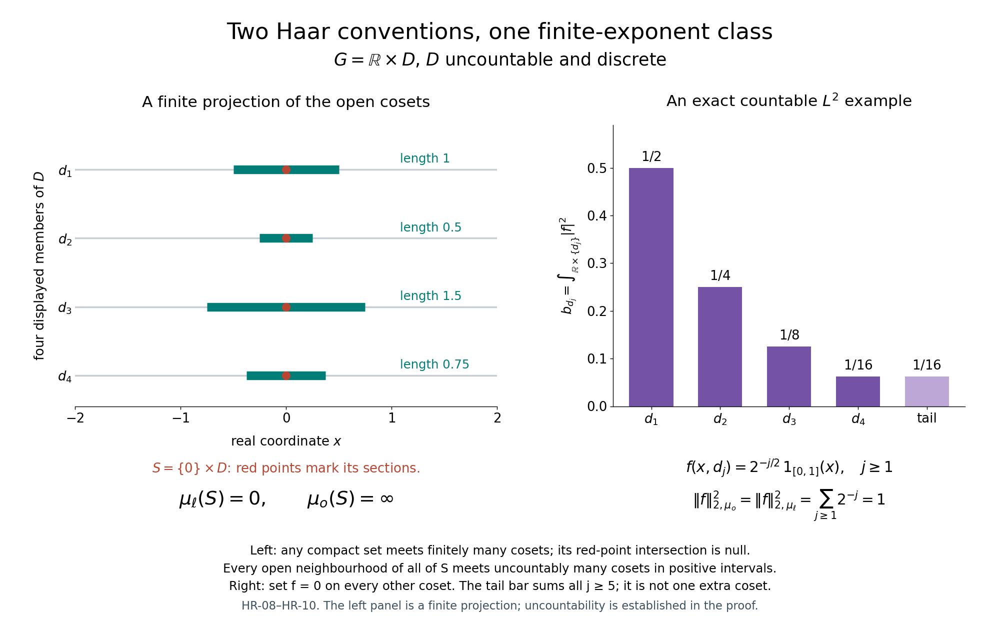

# Radon representation, qualified products and Haar measure

*This original exposition and its original figures and reproduction code are dedicated under CC0.*

All spaces below are locally compact Hausdorff, abbreviated LCH. Groups are arbitrary LCH topological groups. No second countability, separability, sigma compactness or unimodularity is assumed. A measure takes values in \([0,\infty]\). Integrals, sequential scalar convergence, completion and \(L^p\) use [SC-01](OA-FLOW-SC.md#sc-01) and [SC-03](OA-FLOW-SC.md#sc-03), [SC-04](OA-FLOW-SC.md#sc-04), [SC-05](OA-FLOW-SC.md#sc-05), [SC-06](OA-FLOW-SC.md#sc-06), [SC-07](OA-FLOW-SC.md#sc-07). Choice and compactness of arbitrary products use CF Section 1 and CF Section 4. The elementary topology used here is the separately proved [H0.1](OA-FLOW-TOPOLOGY.md#l138-h0)–[H0.2](OA-FLOW-TOPOLOGY.md#l138-h0): compact cutoffs, finite subordinate partitions and compact shrinking. Product approximation uses [H0](OA-FLOW-TOPOLOGY.md#l138-h0) and CF Section 5. These parts of [H0](OA-FLOW-TOPOLOGY.md#l138-h0) have no Haar or crossed-product input and must precede this foundation.

A **Radon measure in the outer regular convention** is a Borel measure finite on compact sets, outer regular on every Borel set, and inner regular on open sets. Its completion adds subsets of its Borel null sets. We construct it directly. The complete locally determined convention is addressed separately in [HR-09](OA-FLOW-HR.md#hr-09). Neither convention imposes inner regularity on every Borel set in the outer regular version.

Write \(f\prec U\) when \(f\in C_c(X)\), \(0\leq f\leq1\), and \(\operatorname{supp}f\subset U\). All functionals on complex function spaces are complex linear. Positivity means a nonnegative real value on every nonnegative function.

## HR-01. From an open valuation to an outer regular measure

**Lemma [HR-01](OA-FLOW-HR.md#hr-01).** Suppose \(v\) is defined on open subsets of \(X\), is monotone, is zero at the empty set, is countably subadditive on open unions, and is additive on two disjoint open sets. Suppose it is locally finite, and, for every open \(U\) and \(a<v(U)\) with \(a\geq0\), there is a compact \(K\subset U\) such that
\[
 v(W)>a\quad\text{for every open }W\supset K.
 \tag{HR-01a}
\]
Then
\[
 \mu^*(E)=\inf_{U\supset E,\ U\ {\rm open}}v(U)
 \tag{HR-01b}
\]
is an outer measure; its Borel restriction \(\mu\) is Radon in the outer regular convention. Moreover
\[
 \mu(U)=v(U),\qquad
 \mu(U)=\sup_{K\subset U,\ K\ {\rm compact}}\mu(K).
 \tag{HR-01c}
\]

**Proof.** Monotonicity and the empty-set value are immediate. For countable subadditivity it suffices to treat a finite sum of individual outer measures or a convergent infinite sum. Given \(\epsilon>0\), choose open \(U_j\supset E_j\) with \(v(U_j)<\mu^*(E_j)+\epsilon2^{-j}\). The valuation estimate on their union gives subadditivity on letting \(\epsilon\) decrease to zero. When the sum is infinite, the claimed inequality is automatic. If \(U\) is open, monotonicity gives \(\mu^*(U)=v(U)\).

We verify the splitting criterion of [SC-01](OA-FLOW-SC.md#sc-01) for an arbitrary open \(V\). Take a subset \(A\) with \(\mu^*(A)<\infty\), and open \(U\supset A\) with \(v(U)<\mu^*(A)+\epsilon\). If \(v(U\cap V)=0\), monotonicity gives
\(\mu^*(A\cap V)+\mu^*(A\setminus V)\leq v(U)\).
Otherwise choose \(a\geq0\), \(a<v(U\cap V)\), within \(\epsilon\) of that finite value, and a compact \(K\subset U\cap V\) satisfying (HR-01a). Shrinking gives an open \(W\) with
\(K\subset W\subset\overline W\subset U\cap V\).
The two disjoint open subsets \(W\) and \(U\setminus\overline W\) of \(U\) give
\[
 \begin{aligned}
 v(U)&\geq v(W)+v(U\setminus\overline W)\\
 &>v(U\cap V)-\epsilon+\mu^*(A\setminus V)\\
 &\geq\mu^*(A\cap V)+\mu^*(A\setminus V)-\epsilon.
 \end{aligned}
\]
Let \(\epsilon\) decrease to zero. [SC-01](OA-FLOW-SC.md#sc-01) proves that every open set, and hence every Borel set, is measurable for \(\mu^*\); it also proves countable additivity and completeness on the full splitting domain. Our measure \(\mu\) is its Borel restriction. Local finiteness of \(v\) and a finite neighbourhood cover make every compact set finite.

For \(K\) in (HR-01a), \(\mu(K)=\inf_{W\supset K}v(W)\geq a\). Taking the supremum of such \(a\) gives the inner regularity in (HR-01c). The reverse inequality follows from monotonicity. Formula (HR-01b) is precisely Borel outer regularity. \(\square\)

The splitting measure can have additional measurable sets besides the completion of the Borel measure. We use the Borel measure and its completion, without identifying those two sigma algebras.

## HR-02. The general Riesz representation construction

**Theorem [HR-02](OA-FLOW-HR.md#hr-02).** Every positive functional \(I:C_c(X)\to\mathbb C\) is represented by a unique outer regular Radon measure:
\[
 I(f)=\int_X f\,d\mu\quad(f\in C_c(X)).
 \tag{HR-02a}
\]
There is no global supremum-norm boundedness assumption on \(I\). Its exact regularity formulae are
\[
 \mu(U)=\sup_{f\prec U}I(f),\qquad
 \mu(K)=\inf_{\substack{g\in C_c(X)\\1_K\leq g}}I(g).
 \tag{HR-02b}
\]
The second infimum is over nonnegative real functions; \(1_K\leq g\) includes nonnegativity off \(K\).

**Proof.** A real compact continuous function is the difference of its positive and negative parts. Thus its image under \(I\) is real, and positivity implies order preservation. If \(g\in C_c(X)\) is one on a fixed compact \(L\), then
\[
 |I(f)|\leq I(|f|)\leq\|f\|_\infty I(g)
 \quad(\operatorname{supp}f\subset L).
 \tag{HR-02c}
\]
For the first inequality, multiply \(I(f)\) by a scalar of modulus one making it nonnegative real, take the real part of the same scalar times \(f\), and use its pointwise bound by \(|f|\).

Define \(v(U)=\sup_{f\prec U}I(f)\), including the zero function. It is monotone and zero on the empty set. For a relatively compact open \(U\), take \(g=1\) on \(\overline U\); (HR-02c) gives \(v(U)\leq I(g)<\infty\).

If \(f\prec\bigcup_jU_j\), a finite subfamily covers its compact support. [H0.2](OA-FLOW-TOPOLOGY.md#l138-h0) gives nonnegative compact functions \(h_j\) subordinate to that subfamily, with sum one there. Then \(f=\sum_jfh_j\), each \(fh_j\prec U_j\), and \(I(f)\leq\sum_jv(U_j)\). Taking the supremum proves countable open subadditivity. If \(U,V\) are disjoint, sums of functions subordinate to them are still bounded by one, so \(v(U\cup V)\geq v(U)+v(V)\); subadditivity proves equality, including infinite values.

For \(a<v(U)\), choose \(f\prec U\) with \(I(f)>a\). Its compact support \(K\) satisfies (HR-01a), because \(f\prec W\) for every open \(W\supset K\). [HR-01](OA-FLOW-HR.md#hr-01) constructs the desired Radon measure and the open-set formula in (HR-02b).

We first establish the compact formula without assuming representation. If \(g\geq1_K\) and \(0<\eta<1\), then \(V=\{g>1-\eta\}\) contains \(K\). For every \(h\prec V\), \((1-\eta)h\leq g\), so
\[
 \mu(K)\leq v(V)\leq I(g)/(1-\eta).
\]
Letting \(\eta\) decrease to zero gives \(\mu(K)\leq I(g)\). Conversely, an open neighbourhood \(U\supset K\) has a cutoff \(g\prec U\) equal to one on \(K\). Thus \(I(g)\leq v(U)\). Infima over \(U\) prove the compact formula.

Now let \(f\geq0\) have compact support \(K\), choose \(g\in C_c(X)\), \(0\leq g\leq1\), one on \(K\), and fix \(\delta>0\). Choose a positive integer \(N\) with \(N\delta\geq\|f\|_\infty\). For each \(1\leq j\leq N\), functions \(h_j\prec\{f>j\delta\}\) satisfy \(\delta\sum_jh_j\leq f\). Taking their individual functional suprema gives
\[
 I(f)\geq\delta\sum_{j=1}^N\mu(\{f>j\delta\}).
 \tag{HR-02d}
\]
The scalar simple function on the right differs below \(f\) by at most \(\delta1_K\), so \(I(f)\geq\int f-\delta\mu(K)\).

For the upper bound, each \(K_j=\{f\geq j\delta\}\) is compact. By the compact formula choose \(0\leq k_j\leq1\), one on \(K_j\), with \(I(k_j)\leq\mu(K_j)+\eta/N\). Such bounded cutoffs suffice for the infimum: starting with an open neighbourhood whose valuation is close to \(\mu(K_j)\) gives one. Pointwise,
\(f\leq\delta g+\delta\sum_jk_j\).
Also \(\delta\sum_j1_{K_j}\leq f\). Consequently
\[
 I(f)\leq\delta I(g)+\delta\sum_j\mu(K_j)+\delta\eta
 \leq\delta I(g)+\int f+\delta\eta.
\]
Let \(\eta,\delta\) decrease to zero. Representation follows for nonnegative \(f\), then for real and complex \(f\) by linearity. A representing Radon measure has the same open formula, because compact cutoffs give the lower bound and inner open regularity gives equality. Outer regularity then determines it on every Borel set. This proves uniqueness. \(\square\)

Every positive functional \(I:C_0(X)\to\mathbb C\) is automatically bounded. Indeed, positivity gives \(|I(f)|\leq I(|f|)\) as in (HR-02c). If it were unbounded, choose nonnegative \(f_n\in C_0(X)\) with \(\|f_n\|_\infty\leq2^{-n}\) and \(I(f_n)\geq1\). Their uniformly convergent sum \(f\) belongs to \(C_0(X)\): uniform limits are continuous, and the sets where a limit has modulus at least \(\epsilon\) lie in the compact corresponding level set of a sufficiently close approximant. Since \(f\geq\sum_{n=1}^Nf_n\), positivity would give \(I(f)\geq N\) for every \(N\), a contradiction.

Restriction to \(C_c(X)\) therefore gives a finite measure, since \(\mu(X)=\sup_{f\prec X}I(f)\leq\|I\|\). Compact cutoffs show \(C_c(X)\) uniformly dense in \(C_0(X)\): cut off a function on the compact set where its modulus is at least \(\epsilon\). Boundedness and finite-measure integration extend (HR-02a) to \(C_0(X)\). The same cutoffs and the bound \(|I(f)|\leq\int|f|\) show
\[
 \|I\|=\mu(X).
 \tag{HR-02e}
\]
Thus arbitrary positive functionals on \(C_0(X)\), without an assumed continuity hypothesis, correspond exactly to finite positive outer regular Radon measures, with the displayed norm/mass identity.

## HR-03. Finite-set regularity, densities and \(L^p\) approximation

**Proposition [HR-03](OA-FLOW-HR.md#hr-03).** An outer regular Radon measure is inner regular on every Borel set of finite measure, and on every sigma-finite Borel set. Each sigma-finite Borel set is a countable union of compact sets modulo a Borel null set. The same approximation conclusions hold for its completion.

**Proof.** Let \(E\) be Borel with finite measure. Choose open \(U\supset E\) with \(\mu(U)<\mu(E)+\epsilon\), compact \(K\subset U\) with \(\mu(K)>\mu(U)-\epsilon\), and open \(V\supset U\setminus E\) with \(\mu(V)<\mu(U\setminus E)+\epsilon\). The compact \(C=K\setminus V\) lies in \(E\), and
\[
 \mu(C)\geq\mu(K)-\mu(V)>\mu(E)-2\epsilon.
 \tag{HR-03a}
\]
Finite subtraction is valid because \(\mu(U)<\infty\). This proves finite-set inner regularity. A sigma-finite set is an increasing union of finite-measure Borel sets; SC-04's measure continuity and compact approximations prove its inner regularity. For each finite piece choose countably many compact subsets with errors tending to zero and take their union. Their union is contained in the original set, and the remaining Borel set is null. A completed measurable set differs from a Borel set by a subset of a Borel null set; a Borel subset with the same measure is obtained by removing that null superset, so the same conclusions follow.

SC-07 supplies simple functions of finite-measure sets approximating any \(L^p\) function, \(1\leq p<\infty\). For a finite-measure Borel \(E\), choose compact \(K\subset E\subset U\) with \(\mu(U\setminus K)<\epsilon\), and a compact cutoff \(h=1\) on \(K\), subordinate to \(U\). Then
\[
 |1_E-h|^p\leq1_{U\setminus K}.
 \tag{HR-03b}
\]
This proves density of \(C_c(X)\) in finite-exponent \(L^p(\mu)\). Completion gives Borel representatives of measurable functions: replace the sets in a sequence of simple approximants by Borel sets and discard the countable union of their null discrepancies. SC-07's finite level sets and the first paragraph show that every finite-exponent class has a Borel representative with a sigma compact carrier.

We also need the exact finite-density statement. If \(w\geq0\) is Borel and \(\int w\,d\mu<\infty\), then \(\nu(E)=\int_Ew\,d\mu\) is a finite outer regular Radon measure. Approximate \(w\) in \(L^1(\mu)\) by nonnegative simple functions \(\sum_jc_j1_{E_j}\) with \(\mu(E_j)<\infty\), using SC-07. Each restricted finite measure \(\mu(E_j\cap\,\cdot\,)\) is inner regular by the finite-set result. To see its outer regularity at a Borel \(B\), choose compact \(C\subset E_j\setminus B\) whose measure is close to that finite set's measure; \(X\setminus C\) contains \(B\), with arbitrarily small excess in the restricted measure. Finite sums retain both approximations. The \(L^1\) error bounds the difference of the two measures on every Borel set uniformly; transferring compact and open approximants with this bound proves regularity of \(\nu\). This argument does not assert outer regularity for arbitrary nonintegrable densities.

If \(w\) is continuous and strictly positive, possibly nonintegrable, \(w\,\mu\) is also outer regular Radon. It is finite on compact sets. If its value at \(E\) is finite, partition \(E\) into countably many Borel level pieces on which \(w\) is bounded below and above. Each piece is \(\mu\)-finite, so it has open supersets, inside the corresponding open upper-bound region for \(w\), with weighted excess less than \(\epsilon2^{-j}\). Their union proves weighted outer regularity; when the value is infinite it is automatic. Finite-set compact approximation on these pieces gives inner regularity on finite sets. For an open \(U\), the integral of \(w1_U\) is the supremum of the integrals over finite unions of such finite-measure pieces lying in compact subsets: truncate \(w\), and use compact approximation of the open sets \(\{w>t\}\cap U\) at finitely many positive levels as in (HR-02d). This proves inner regularity on open sets. \(\square\)

## HR-04. A compact-content construction

**Lemma [HR-04](OA-FLOW-HR.md#hr-04).** Suppose a nonnegative finite function \(c\) on compact subsets of \(X\) is zero on the empty set, monotone, subadditive on finite unions, and additive on disjoint compact unions. Suppose \(c\) is bounded on the compact subsets of some neighbourhood of each point. Define
\[
 v(U)=\sup_{K\subset U,\ K\ {\rm compact}}c(K).
 \tag{HR-04a}
\]
Then [HR-01](OA-FLOW-HR.md#hr-01) applies and gives an outer regular Radon measure. Its compact values satisfy
\[
 \mu(K)=\inf_{U\supset K,\ U\ {\rm open}}\ 
              \sup_{L\subset U,\ L\ {\rm compact}}c(L)\geq c(K).
 \tag{HR-04b}
\]
No countable additivity of \(c\) is assumed.

**Proof.** A compact \(K\) covered by finitely many opens \(U_j\) is covered by compact subsets \(K_j\subset K\cap U_j\): shrink a finite neighbourhood refinement inside the \(U_j\), and intersect its compact closures with \(K\). Thus \(c(K)\leq\sum_jc(K_j)\leq\sum_jv(U_j)\). Every compact subset of a countable open union has such a finite subcover, proving countable subadditivity of \(v\). For disjoint opens, disjoint compact approximants and finite disjoint additivity of \(c\) prove the reverse inequality, so \(v\) is additive there. The local boundedness gives local finiteness. If \(c(K)>a\), every open \(W\supset K\) has \(v(W)\geq c(K)>a\); this proves (HR-01a). [HR-01](OA-FLOW-HR.md#hr-01) gives the measure and the formula. \(\square\)

## HR-05. The Radon product, without a product-Borel assumption

**Theorem [HR-05](OA-FLOW-HR.md#hr-05).** If \(\mu,\nu\) are outer regular Radon measures on \(X,Y\), there is a unique such measure \(\pi=\mu\widehat\times\nu\) on the full Borel sigma algebra of \(X\times Y\) such that, for \(F\in C_c(X\times Y)\),
\[
 \int F\,d\pi=\int_X\!\int_Y F(x,y)\,d\nu(y)\,d\mu(x)
            =\int_Y\!\int_X F(x,y)\,d\mu(x)\,d\nu(y).
 \tag{HR-05a}
\]

**Proof.** The compact support has compact coordinate projections. The inner integral is continuous, has compact support in the first projection, and satisfies a supremum-norm estimate using the finite measure of the second projection. Continuity follows from a finite product-neighbourhood cover of a compact set: the slices of a continuous function change uniformly there when the first coordinate changes. Thus the first iterated integral defines a positive linear functional on \(C_c(X\times Y)\). Compact-support product approximation from [H0](OA-FLOW-TOPOLOGY.md#l138-h0) proves equality with the second iterated integral: equality holds for finite sums of products, and the errors are bounded by their uniform error times the product of two finite compact measures. [HR-02](OA-FLOW-HR.md#hr-02) supplies \(\pi\), and its uniqueness proves symmetry. No claim about the equality of sigma algebras is used.

Two scalar approximation facts will be useful. For nonnegative lower semicontinuous \(h\),
\[
 \int h\,d\mu=\sup\left\{\int f\,d\mu: f\in C_c(X),\ 0\leq f\leq h\right\}.
 \tag{HR-05b}
\]
Indeed, at finitely many positive levels \(j\delta\), choose cutoffs subordinate to \(\{h>j\delta\}\) whose integrals approach the measures of those open sets. Their sum times \(\delta\) lies below \(h\). The resulting lower sums approach the integral by SC-04 and SC-05; truncation handles infinite integrals. Conversely, if \(h\) is bounded, nonnegative, upper semicontinuous and supported in a compact \(K\), then there are nonnegative \(f\in C_c(X)\), \(f\geq h\), whose integrals approach \(\int h\). The positive-level sets \(\{h\geq j\delta\}\) are compact. Choose cutoffs one on each, with integrals close to their measures by (HR-02b), and add \(\delta g\) with \(g=1\) on \(K\). The same upper-sum argument as [HR-02](OA-FLOW-HR.md#hr-02) proves the assertion. All cutoffs can be chosen in a fixed relatively compact neighbourhood of \(K\).

For open \(W\subset X\times Y\), the function \(h(x)=\nu(W_x)\) is lower semicontinuous. If \(h(x)>a\), choose compact \(L\subset W_x\) with measure exceeding \(a\); finitely many rectangles in \(W\) give a neighbourhood \(V\) of \(x\) with \(V\times L\subset W\). We claim
\[
 \pi(W)=\int\nu(W_x)\,d\mu(x).
 \tag{HR-05c}
\]
The inequality from left to right follows by integrating every \(F\prec W\) in (HR-05a) and taking its supremum. For the reverse inequality, take \(0\leq f\in C_c(X)\), \(f\leq h\), and its compact support \(K\). At each point \(x\in K\), choose \(g_x\prec W_x\) with \(\int g_x\,d\nu>f(x)-\epsilon\), using the open formula of [HR-02](OA-FLOW-HR.md#hr-02). If \(f(x)=0\), the zero function suffices. Compactness of \(\operatorname{supp}g_x\) gives a neighbourhood \(V_x\) where all these slices remain inside \(W\); shrink \(V_x\) further so that \(f(z)<f(x)+\epsilon\). A finite subordinate partition \((a_j)\), with sum one on \(K\) and at most one everywhere, gives
\(F(z,y)=\sum_ja_j(z)g_{x_j}(y)\prec W\).
Its inner integral is at least \(f(z)-2\epsilon\) on \(K\), and nonnegative elsewhere. Therefore \(\pi(W)\geq\int f-2\epsilon\mu(K)\). Use (HR-05b) and let \(\epsilon\) decrease to zero.

For compact \(C\subset X\times Y\), the function \(h_C(x)=\nu(C_x)\) is upper semicontinuous, bounded and compactly supported. To prove upper semicontinuity at \(x\), choose an open \(O\supset C_x\) with \(\nu(O)\) arbitrarily close to \(\nu(C_x)\). The projection of the compact set \(C\setminus(X\times O)\) is closed and omits \(x\); nearby slices are therefore contained in \(O\). The assertion outside the compact first projection follows in the same way. Each slice is compact, so its value is finite.

If \(F\in C_c(X\times Y)\) and \(F\geq1_C\), (HR-05a) gives \(\int h_C\,d\mu\leq\int F\,d\pi\). The compact formula of [HR-02](OA-FLOW-HR.md#hr-02) gives \(\int h_C\,d\mu\leq\pi(C)\).
For the other inequality take \(f\in C_c(X)\), \(f\geq h_C\), with integral within \(\epsilon\) of that of \(h_C\). At each \(x\) in the first projection \(K\) of \(C\), choose an open relatively compact \(O_x\supset C_x\) with \(\nu(O_x)<h_C(x)+\delta\), and a cutoff \(g_x=1\) on a smaller open neighbourhood of \(C_x\), with support in \(O_x\). Compact projection separation gives a neighbourhood \(V_x\) such that \(g_x=1\) on \(C_z\) for \(z\in V_x\). Shrink it so that \(f(z)>f(x)-\delta\). Choose all \(V_x\) within a fixed relatively compact neighbourhood \(P\) of \(K\). A finite partition \((a_j)\) yields \(F(z,y)=\sum_ja_j(z)g_{x_j}(y)\), equal to one on \(C\), and
\[
 \int F(z,y)\,d\nu(y)\leq f(z)+2\delta1_{\overline P}(z).
\]
The estimate follows from \(\int g_{x_j}\leq h_C(x_j)+\delta\leq f(x_j)+\delta<f(z)+2\delta\) wherever \(a_j(z)\neq0\), and \(\sum a_j\leq1\). Hence
\(\pi(C)\leq\int h_C+\epsilon+2\delta\mu(\overline P)\).
Let \(\epsilon,\delta\) decrease to zero. We have proved
\[
 \pi(C)=\int\nu(C_x)\,d\mu(x).
 \tag{HR-05d}
\]

Now let \(E\) be Borel and \(\pi(E)<\infty\). Choose increasing compact \(C_n\subset E\) and decreasing open \(W_n\supset E\), with
\(\pi(C_n)\to\pi(E)\) and \(\pi(W_n)\to\pi(E)\).
Their section measures are Borel by the preceding semicontinuity arguments. MCT applies to the compact sequence and DCT to the open sequence, whose first member has integrable section measure. Thus
\[
 \nu\!\left(\bigcup_n(C_n)_x\right)
 \leq\nu(E_x)\leq\lim_n\nu((W_n)_x)
\]
has equal outer bounds for \(\mu\)-almost every \(x\). Every \(E_x\) is Borel, because the slice inclusion is continuous. It follows that its measure agrees almost everywhere with a Borel function and
\[
 \pi(E)=\int\nu(E_x)\,d\mu(x).
 \tag{HR-05e}
\]
In particular a \(\pi\)-null Borel set has null slices almost everywhere. A sigma-finite Borel \(E\) is a disjoint countable union of finite-measure Borel sets, so section additivity and MCT extend (HR-05e) to it.

For a nonnegative Borel function \(F\) vanishing off a sigma-finite Borel carrier, apply (HR-05e) to its simple approximants on a countable finite-measure partition of that carrier, and then apply MCT twice. This proves Tonelli and measurability of its section integrals modulo a Borel null set. For a complex integrable function, SC-07 puts its nonzero set on a sigma-finite carrier; apply the nonnegative result to its absolute value and the positive and negative parts of its real and imaginary parts. The slices are integrable almost everywhere, their integrals are integrable, and (HR-05a) follows. Completion introduces no new obstruction: replace a completed function by a Borel representative; the null-slice conclusion just proved handles the discrepancy.

For finite-measure Borel \(A,B\), open supersets with measures decreasing to their finite values and compact subsets with measures increasing to them give
\(\pi(A\times B)=\mu(A)\nu(B)\).
For compact products the equality follows directly from (HR-05d); for open products it follows from (HR-05c). Countable disjoint finite-measure decompositions extend the rectangle formula to sigma-finite \(A,B\), including \(0\cdot\infty=0\), and prove that such rectangles are sigma finite for \(\pi\). These are the qualified rectangles used later. \(\square\)

This proof includes open and compact section formulae even without a sigma-finite support assumption. Its general Borel Tonelli statement requires the stated carrier, and it does not replace the Radon product by an unrestricted ordinary product.

**Corollary [HR-05](OA-FLOW-HR.md#hr-05).1 (scalar Hilbert tensor).** There is a unitary
\[
 L^2(X,\mu)\otimes L^2(Y,\nu)\longrightarrow L^2(X\times Y,\pi),
 \qquad f\otimes g\longmapsto[(x,y)\mapsto f(x)g(y)].
 \tag{HR-05f}
\]
Here both factor measures and the product may be completed. First define the rule on compact continuous functions. Formula (HR-05a) factors their inner products, so [H0.3](OA-FLOW-TOPOLOGY.md#l138-h0) and CF Hilbert completion give an isometry. [HR-03](OA-FLOW-HR.md#hr-03) makes those functions dense in each factor and in the product's \(L^2\) space. Compact-support product approximation from [H0](OA-FLOW-TOPOLOGY.md#l138-h0), with its common compact support and finite product measure, makes their finite products dense in the latter space. Hence the isometry is onto. For arbitrary \(L^2\) representatives, their sigma-finite carriers have a sigma-finite product by the qualified rectangle result. Tonelli applied to \(|f(x)g(y)|^2\), and null-slice independence of representatives, give the same formula and norm as the continuous approximation. This proves the stated identification without a product-Borel equality.

## HR-06. Haar existence from normalized finite covers

**Theorem [HR-06](OA-FLOW-HR.md#hr-06).** Every LCH group has a nonzero outer regular Radon left Haar measure.

**Proof.** Fix a relatively compact open neighbourhood \(V_0\) of the identity. For an open identity neighbourhood \(U\) and a relatively compact set \(A\), let \(N(A,U)\) be the smallest number of left translates of \(U\) covering \(A\). This is a finite integer: translates cover the compact closure of \(A\), and compactness gives a finite subcover. It is zero exactly for the empty set. Covering \(A\) by translates of \(V_0\), then covering \(V_0\) by translates of \(U\), gives
\[
 N(A,U)\leq N(A,V_0)N(V_0,U).
 \tag{HR-06a}
\]
The functions
\[
 c_U(A)=\frac{N(A,U)}{N(V_0,U)}
 \tag{HR-06b}
\]
are monotone, invariant under left translation, finitely subadditive, and bounded by \(N(A,V_0)\); \(c_U(V_0)=1\).

Let the identity neighbourhoods be directed by reverse inclusion. Their tails have the finite-intersection property. CF Section 4 extends their filter to an ultrafilter \(\mathcal U\). Every bounded scalar family \(c_U(A)\) has an ultrafilter limit in its compact interval; put \(c(A)=\lim_{\mathcal U}c_U(A)\). Scalar sums, inequalities and constants pass to such limits by continuity and their elementary closedness. Thus \(c\) retains monotonicity, subadditivity, translation invariance, \(c(V_0)=1\), and the same bound.

It is additive on disjoint compact sets. Given disjoint compact \(K,L\), the compact \(K^{-1}L\) omits the identity. Choose an identity neighbourhood \(W\) with \(W^{-1}W\cap K^{-1}L=\varnothing\), using continuity of multiplication and inversion. No left translate of \(U\subset W\) meets both \(K\) and \(L\). In any minimal finite cover of \(K\cup L\) by such translates, assign the members meeting \(K\) and those meeting \(L\) to their respective sets; these subfamilies are disjoint and cover them. Consequently
\[
 N(K\cup L,U)=N(K,U)+N(L,U)\quad(U\subset W).
 \tag{HR-06c}
\]
The ultrafilter contains this tail. Its limit gives disjoint compact additivity.

On the compact subsets of a relatively compact open \(O\), the common bound \(N(O,V_0)\) gives local boundedness. [HR-04](OA-FLOW-HR.md#hr-04) now constructs an outer regular Radon measure \(\mu\). The compact content, the resulting open valuation, and its outer measure are all left invariant, because left multiplication is a homeomorphism permuting compact and open approximants. Thus \(\mu\) is left invariant on every Borel set. Also
\(\mu(\overline V_0)\geq c(\overline V_0)\geq c(V_0)=1\),
so it is nonzero.

Every nonempty open set has positive measure. Otherwise finitely many translates of a null open set would cover every compact set; all compact sets would be null. Inner regularity on open sets would then force \(\mu(G)=0\), a contradiction. This also proves that every nonzero nonnegative compact continuous function has a strictly positive integral: it exceeds a positive constant on a nonempty open subset. Haar measure can therefore be normalized by prescribing such a function's integral. Completing \(\mu\) preserves invariance, since translates preserve Borel null sets. \(\square\)

## HR-07. Haar uniqueness on arbitrary groups

**Theorem [HR-07](OA-FLOW-HR.md#hr-07).** Two nonzero outer regular Radon left Haar measures \(\mu,\nu\) on the same LCH group are positive scalar multiples.

**Proof.** Fix a nonempty relatively compact open set \(E\), so both \(\mu(E)\) and \(\nu(E)\) are finite and positive. For \(\epsilon\in(0,1)\), inner regularity gives a compact \(K\subset E\) with \(\mu(K)>(1-\epsilon)\mu(E)\). Compactness and multiplication continuity give an open \(H\supset K\) and a symmetric relatively compact identity neighbourhood \(V\) with \(HV\subset E\): for each point of \(K\) take product neighbourhoods inside \(E\), retain finitely many, and intersect their identity neighbourhoods with their inverses.

For every symmetric identity neighbourhood \(U\subset V\), consider the open set
\[
 W=\{(x,y)\in E\times E:x^{-1}y\in U\}.
 \tag{HR-07a}
\]
Its Radon product measure is finite, and [HR-05](OA-FLOW-HR.md#hr-05) permits both iterated integrals. For \(x\in H\), its \(y\)-section contains \(xU\). For \(y\in E\), its \(x\)-section is contained in \(yU\), since \(U=U^{-1}\). Left invariance gives
\[
 (1-\epsilon)\mu(E)\nu(U)
 \leq \mu(H)\nu(U)
 \leq(\mu\widehat\times\nu)(W)
 \leq\mu(U)\nu(E).
 \tag{HR-07b}
\]
Interchanging the measures gives, on a possibly smaller symmetric identity neighbourhood,
\[
 (1-\epsilon)\frac{\mu(E)}{\nu(E)}
 \leq\frac{\mu(U)}{\nu(U)}
 \leq\frac{1}{1-\epsilon}\frac{\mu(E)}{\nu(E)}.
 \tag{HR-07c}
\]
Both denominators are positive. Thus the net of these neighbourhood ratios has limit \(\mu(E)/\nu(E)\). The net is independent of \(E\), so all nonempty relatively compact opens have the same ratio \(c>0\).

For any open \(O\), every compact \(K\subset O\) lies in a relatively compact open \(E\subset O\), by finite shrinking. The already proved equality on \(E\), together with inner regularity, gives \(\mu(O)\leq c\nu(O)\). Interchanging the measures gives equality, including infinite values. Borel outer regularity gives \(\mu=c\nu\) on every Borel set, and their completions correspond. No sequence of neighbourhoods or countable exhaustion of the group was used. \(\square\)

The inversion image \(E\mapsto\mu(E^{-1})\) is a right Haar measure: inversion is a homeomorphism and \((Es)^{-1}=s^{-1}E^{-1}\). Right Haar uniqueness follows by applying left Haar uniqueness to these inversion images. The modular function and its normalization identities are then derived in the later [L24 Section 3](OA-FLOW-L24.md#oa-flow.grp.translations) from this theorem. For an abelian group, right and left translates coincide, so that modular function is identically one.

**Corollary [HR-07](OA-FLOW-HR.md#hr-07).1 (product changes of variables).** A homeomorphism \(T:X\to Y\) transports an outer regular Radon measure to another such measure: inverse images preserve Borel sets and compactness, and homeomorphisms transport open and compact approximants. Its integrals obey substitution, first for indicators, then simple functions and SC convergence. In particular, for left Haar measure on \(G\), both
\[
 (s,t)\longmapsto(s,st),\qquad (s,t)\longmapsto(st,t)
 \tag{HR-07d}
\]
are homeomorphisms of \(G\times G\); the first preserves \(\mu\widehat\times\mu\). Indeed, for \(F\in C_c(G\times G)\), left invariance in the second variable gives
\(\int F(s,st)\,dt\,ds=\int F(s,u)\,du\,ds\).
[HR-02](OA-FLOW-HR.md#hr-02) uniqueness for the transported Radon measure proves equality on all Borel sets. Its inverse and finite iterates preserve sigma-finite carriers. For abelian \(G\), the second map is also measure preserving, by left invariance in the first variable. For nonabelian \(G\), its weighted right-translation formula is derived using the later [L24 continuous modular function](OA-FLOW-L24.md#oa-flow.grp.translations); no unweighted assertion for that second map is made. Coordinate flips preserve the symmetric Radon product by (HR-05a) and uniqueness.

## HR-08. Open sigma compact cosets and the outer regular convention

Choose a compact symmetric identity neighbourhood \(C\), and let \(H=\bigcup_{n\geq1}C^n\). Finite compact products and continuity give compact \(C^n\); symmetry makes \(H\) a subgroup. It is open because it contains an identity neighbourhood and its translates around every point, and closed because its complement is a union of open cosets. Its left cosets \(D\) are open, closed and sigma compact. A compact subset meets only finitely many cosets, by their open cover.

Restriction of \(\mu_o=\mu\) to a coset is sigma finite and Radon there. Borel subsets of a coset are Borel in \(G\), because the coset is open and closed. Any Borel subset \(E\) meeting uncountably many cosets has \(\mu_o(E)=\infty\). Indeed, an open \(U\supset E\) has a positive-measure open section in every such coset. Among uncountably many positive section measures there are arbitrarily large finite families bounded below by a common \(1/n\): otherwise their union over \(n\) would be countable. Finite additivity gives \(\mu_o(U)=\infty\), and outer regularity gives the assertion for \(E\).

It follows that an outer-measure finite or sigma-finite Borel set lies in countably many cosets. Conversely every Borel subset of countably many cosets is sigma finite. On such a set the measure is the countable sum of the section measures. Hence
\[
 G\text{ is sigma compact}
 \ \Longleftrightarrow\ \mu_o\text{ is sigma finite}
 \ \Longleftrightarrow\ \text{there are countably many cosets}.
 \tag{HR-08a}
\]
For the forward implication, compact sets have finite measure and meet finitely many cosets; the reverse implication uses the countable compact covers of the cosets. These statements concern the outer regular convention.

## HR-09. Complete locally determined Haar measure and finite-exponent classes

Complete the sigma-finite restriction on each coset \(D\), obtaining \(\mu_D\). Define a sigma algebra and a measure by
\[
 \Sigma_\ell=\{E\subset G:E\cap D\text{ is }\mu_D\text{-measurable for every }D\},
 \qquad
 \mu_\ell(E)=\sup_{J\ {\rm finite}}\sum_{D\in J}\mu_D(E\cap D).
 \tag{HR-09a}
\]
Countable additivity follows because the two suprema in a sum of nonnegative numbers over cosets and integers commute: any finite collection of pairs is contained in a product of finite subsets, and products are finite collections. Coset completeness proves completeness. It is locally determined: if a subset meets every measurable finite-measure set in a measurable set, intersect it with a countable compact exhaustion of each coset to prove its coset sections measurable. Left translation permutes cosets and preserves their completed measures, so preserves \(\Sigma_\ell\) and \(\mu_\ell\).

The measure is finite on compact sets and agrees with \(\mu_o\) on compact sets, open sets, and outer-regular sigma-finite Borel sets. For the open sets, compact inner approximation and finite coset subsums prove equality. Completed coset inner regularity and finite subsums also prove compact inner regularity on every set in \(\Sigma_\ell\). In particular
\[
 \mu_\ell(E)=\sup_{K\ {\rm compact}}\mu_o(E\cap K)
 \quad(E\in\Sigma_\ell),
 \tag{HR-09b}
\]
where compact intersections are measured in the completed finite Radon restriction. The reverse inequality is monotonicity; for the forward one, approximate a finite collection of coset sections by compact subsets and take their finite union.

The convention is intrinsic. A set belongs to \(\Sigma_\ell\) exactly when its intersection with every compact set is measurable in that compact's completed Radon restriction. One direction follows because a compact set meets finitely many cosets; the other follows by countable compact exhaustion on each coset. Similarly a set is \(\mu_\ell\)-null exactly when all its compact intersections are \(\mu_o\)-null. Thus changing \(H\) leaves the sigma algebra, measure and compact-local null ideal unchanged.

For \(1\leq p<\infty\), restriction of globally completed Borel representatives defines an isometric bijection
\[
 L^p(G,\mu_o)\cong L^p(G,\mu_\ell).
 \tag{HR-09c}
\]
To see that it is well defined, every globally integrable function has a sigma compact carrier modulo a global null set by [HR-03](OA-FLOW-HR.md#hr-03). The measures agree on that carrier, and every global null set is null on each coset. Its section integrals therefore have the same finite sum and norm. Apply this also to differences to obtain injectivity.

Conversely, for \(f\in L^p(\mu_\ell)\), the sum of the nonnegative coset integrals of \(|f|^p\) is finite. Only countably many are positive: for each \(n\), only finitely many can be at least \(1/n\). On those countably many cosets choose Borel representatives, available by completion, and set the function to zero elsewhere. The resulting function is globally Borel, is supported in a sigma compact open union of cosets, and differs from \(f\) by a \(\mu_\ell\)-null function. Its integral for \(\mu_o\) is the same, proving surjectivity.

For \(L^\infty(\mu_\ell)\), measurable representatives and essential bounds are taken coset by coset, modulo compact-local null sets. We do not identify this space with global \(L^\infty(\mu_o)\). The present proof also makes no duality or von Neumann-algebra claim requiring Radon–Nikodym.

## HR-10. Exact scope illustrations and free reading

For \(G=\mathbb R\times D\) with an uncountable discrete additive group \(D\), use Lebesgue measure on each open coset \(\mathbb R\times\{d\}\). They give the unique Haar normalization whose integral on a compact scalar function is the finite sum of its line integrals. The closed set \(S=\{0\}\times D\) has null intersections with every compact set, since a compact set meets finitely many cosets. Hence \(\mu_\ell(S)=0\).

Every open neighbourhood of \(S\) contains a positive-length interval on each of uncountably many lines. Arbitrarily many of these have lengths bounded below by a common \(1/n\), so its measure is infinite. Outer regularity gives \(\mu_o(S)=\infty\). A finite-exponent \(\mu_\ell\) class nevertheless uses only countably many nonzero coset classes; (HR-09c) sends it to a global Borel representative on those cosets. This is an exact general example, not a countable model of the theorem.

For the right-hand example in the figure choose countably many distinct \(d_j\in D\), and set
\[
 f(x,d_j)=2^{-j/2}1_{[0,1]}(x)\quad(j\geq1),\qquad
 f=0\quad\text{on all other cosets}.
 \tag{HR-10a}
\]
The countable union of these interval sections is Borel and sigma compact. Both measures give its squared norm \(\sum_{j\geq1}2^{-j}=1\): the first \(n\) terms sum to \(1-2^{-n}\), and MCT gives the limit. The tail from \(j=5\) has squared mass \(1/16\). It is an aggregate of infinitely many cosets, rather than one extra coset.

The left panel displays four cosets only. The green sample intervals have lengths \(1,1/2,3/2,3/4\); they illustrate positive open sections, and the uncountability conclusion is proved above. The right panel gives exactly (HR-10a). Reproduction source: [render_figure.py](../assets/haar-reconstruction/render_figure.py); [editable SVG](../assets/haar-reconstruction/figures/haar-conventions.svg).

Free primary comparison sources are D. H. Fremlin's [author's freely accessible copyleft text](https://www1.essex.ac.uk/maths/people/fremlin/mt.htm): [Chapter 43, 436J](https://www1.essex.ac.uk/maths/people/fremlin/chap43.pdf), positive \(C_c\) representation; [Chapter 41, 416I–416M and 417](https://www1.essex.ac.uk/maths/people/fremlin/chap41.pdf), compact regularity and Radon products; and [Chapter 44, 441C–441E and 442A–442C](https://www1.essex.ac.uk/maths/people/fremlin/chap44.pdf), finite covers, existence and uniqueness of invariant measures. Fremlin's Radon convention is complete and locally determined. [HR-01](OA-FLOW-HR.md#hr-01)–[HR-09](OA-FLOW-HR.md#hr-09) explicitly construct the outer regular Borel convention and its separate locally determined version, rather than conflating their raw measurable sets. All intermediate measure constructions, representation, carrier qualifications and normalization arguments used here are proved above; the citations do not replace programme proofs.
