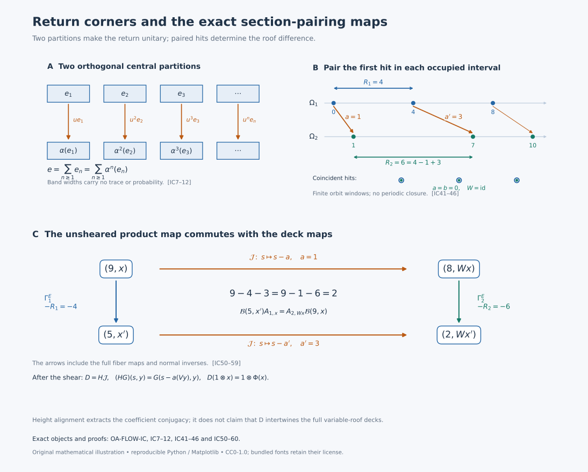

# Changing the return section without changing the crossed product

## The three algebras and the classification statement

Let \(N\ne0\) have separable predual and be of type II\(_\infty\), and let \(\alpha\in\operatorname{Aut}(N)\) act ergodically on a nonatomic center. Here type II\(_\infty\) allows a nonfactor: the algebra is semifinite, has no nonzero abelian projection, and has no nonzero finite central summand. Put
\[
 M=N\rtimes_\alpha\mathbb Z,\qquad
 [\pi(x)\xi](k)=\alpha^{-k}(x)\xi(k),\qquad
 [u\xi](k)=\xi(k-1).
 \tag{IC1}
\]
A faithful normal representation of each coefficient is understood in this formula. Thus \(uxu^*=\alpha(x)\). The full normal independence of the representation is [NR3–4](OA-FLOW-NR.md#oa-flow.nr.3).

For a nonzero central projection \(e\in N\), distinguish the coefficient corner \(Ne\), the crossed-product corner \(eMe\), and the original algebra \(M\). We will construct the first-return automorphism \(\alpha_e\) and inverse normal isomorphisms
\[
 Ne\rtimes_{\alpha_e}\mathbb Z
 \ \xrightarrow{\ K_e\ }\ eMe
 \ \xrightarrow{\ L_e\ }\ M.
 \tag{IC2}
\]
The first map fixes \(Ne\) and sends its integer generator to an explicitly constructed unitary \(w\). The second uses a partial isometry between \(e\) and \(1\). In particular conjugacy of induced coefficient systems implies isomorphism of the original crossed products.

The reverse implication fails with just the hypotheses in the first paragraph. We will construct an example by absorbing two specific finite factors into one infinite tensor product. Under the additional full-positive-cone hypotheses
\[
 \tau_i\alpha_i\le c_i\tau_i,\qquad 0<c_i<1,
 \tag{IC3}
\]
for faithful normal semifinite traces, the reverse implication is true:
\[
 N_1\rtimes_{\alpha_1}\mathbb Z\cong N_2\rtimes_{\alpha_2}\mathbb Z
 \quad\Longleftrightarrow\quad
 (N_1e_1,(\alpha_1)_{e_1})
       \cong (N_2e_2,(\alpha_2)_{e_2})
 \text{ for some }0\ne e_i\in Z(N_i).
 \tag{IC4}
\]
The conjugacy in (IC4) is an onto normal coefficient isomorphism, with normal inverse, intertwining the actual induced automorphisms. It does not assert preservation of the originally chosen traces or uniqueness of the conjugating map. All algebras in this theorem have separable predual.

## 1. First returns produce two different partitions

Realize \(Z(N)=L^\infty(\Omega,\mu)\) on a nonzero standard sigma-finite space, with
\(\alpha(f)=f\circ T^{-1}\). The map \(T\) is a nonsingular ergodic Borel automorphism. Equivalent replacement of \(\mu\) by a probability changes none of the assertions about null sets.

First, there is no positive wandering set. If the sets \(T^nW\), \(n\in\mathbb Z\), were disjoint and \(W\) had positive measure, nonatomicity would split \(W\) into two positive pieces. Their disjoint integer saturations would contradict ergodicity. For a positive Borel set \(E\), the points of \(E\) with no positive return form a wandering set: equality between two of its distinct translates would give a positive return to \(E\). This set is null. A point with finitely many positive returns has its last visit there and therefore belongs to a countable union of null translates. Apply the same proof to \(T^{-1}\). The saturation of \(E\) is conull. Deleting all integer translates of these exceptions gives an invariant conull Borel space on which every orbit visits \(E\) infinitely often in both directions.

For \(x\in E\), denote its signed visit times by \(q_j(x)\), where
\[
 \cdots<q_{-1}(x)<q_0(x)=0<q_1(x)<q_2(x)<\cdots.
 \tag{IC5}
\]
Their level sets are countable Boolean combinations of \(T^{-k}E\), so all these functions are Borel. Put \(r_E=q_1\), \(T_Ex=T^{r_E(x)}x\), and
\[
 e_n=1_{\{x\in E:r_E(x)=n\}}
     =\left(e-\sum_{j<n}e_j\right)\alpha^{-n}(e),
 \qquad e=1_E.
 \tag{IC6}
\]
Each point of \(E\) has exactly one next visit. Each target point of \(E\) also has exactly one previous visit, and the intervening segment is a first-return segment. These two observations give the two orthogonal central partitions
\[
 \sum_{n\ge1}e_n=e,\qquad
 \sum_{n\ge1}\alpha^n(e_n)=e.
 \tag{IC7}
\]
The second partition is not a consequence of the first without backward recurrence. Their sums converge strongly; they also prove that \(T_E\) is a nonsingular Borel automorphism, with inverse its previous-visit map.

Define on the entire corner
\[
 \begin{aligned}
 \alpha_e(x)&=\sum_{n\ge1}\alpha^n(xe_n),\\
 \alpha_e^{-1}(y)&=
   \sum_{n\ge1}e_n\alpha^{-n}\!\bigl(y\alpha^n(e_n)\bigr).
 \end{aligned}
 \tag{IC8}
\]
Both sums converge strongly-star and have norm at most that of their argument, because their respective range supports form the two orthogonal central partitions. Products and adjoints are computed separately on each piece. Substitution gives the identity in both orders, and (IC7) gives the corner unit \(e\). They are inverse star and order isomorphisms. Any bounded positive supremum is characterized by its upper bounds; an order isomorphism and its inverse carry that characterization to the target. Hence both maps are normal for arbitrary increasing nets. This proves that \(\alpha_e\) is an automorphism, rather than a partially defined restriction of \(\alpha\).

## 2. The discrete coefficient expectation determines every matrix entry

We give the normal realization needed for (IC2). In the regular representation (IC1), the \((0,0)\) entry of every element of \(M\) belongs to the represented \(N\). Indeed this holds on finite sums of covariant words \(xu^n\); those words form a unital star algebra whose bounded strong-star closure is \(M\). Matrix compression is normal and the represented \(N\) is ultraweakly closed. Remove its faithful normal representation to define
\[
 E:M\longrightarrow N,\qquad E(X)=X_{0,0}.
 \tag{IC9}
\]
This is positive, normal, unital and \(N\)-bimodular. It fixes \(N\). Write \(\widehat X(n)=E(Xu^{-n})\). Calculation on \(xu^n\), followed by normality of each matrix-entry map, gives for every \(X\in M\)
\[
 X_{k,l}=\alpha^{-k}\!\bigl(\widehat X(k-l)\bigr).
 \tag{IC10}
\]
Here the right side is represented on the coefficient Hilbert space. Thus vanishing of all coefficients implies \(X=0\), by its matrix entries. If \(X\ge0\) and \(E(X)=0\), every diagonal entry vanishes. For each coordinate vector \(\xi\), this says \(\|X^{1/2}\xi\|^2=0\). Such vectors span a dense subspace, so \(X=0\). Therefore \(E\) is faithful. These arguments prove a faithful normal expectation and coefficient uniqueness without assuming convergence of a raw Fourier series.

A normal equivariant coefficient isomorphism \(\phi:(N,\alpha)\to(N',\alpha')\) gives a normal isomorphism of the actual regular crossed products fixing the integer label. To see normality and faithfulness, represent \(N'\) faithfully normally on \(H\) and represent \(N\) through \(\phi\) on the same \(H\). Equivariance makes their regular coefficient fields agree after relabeling, and the integer translations agree. The concrete generated algebras are the same. Transport through NR4 gives the stated map, with inverse constructed from \(\phi^{-1}\).

## 3. A return unitary and the entire corner

Inside \(eMe\) put
\[
 w=\sum_{n\ge1}u^ne_n.
 \tag{IC11}
\]
The initial supports of the summands are \(e_n\), and their final supports are \(\alpha^n(e_n)\). By (IC7) both families are orthogonal and fill \(e\). The sum and its adjoint converge strongly, and
\[
 w^*w=ww^*=e,\qquad wxw^*=\alpha_e(x)\quad(x\in Ne).
 \tag{IC12}
\]
Thus \(w\) is a unitary of the corner.

The whole corner is generated by \(Ne\) and \(w\). For fixed integers \(k,j\), let \(p_{k,j}\) be the central projection of
\(\{x\in E:q_j(x)=k\}\). These projections, as \(j\) varies, partition \(e\alpha^{-k}(e)\). If \(k>0\), only \(1\le j\le k\) occur; if \(k<0\), only \(k\le j\le-1\) occur; if \(k=0\), only \(j=0\) occurs. Iterating (IC11), including its adjoint for negative visits, gives
\[
 w^jp_{k,j}=u^kp_{k,j},\qquad
 e x u^k e=\sum_j e x w^jp_{k,j}\quad(x\in N).
 \tag{IC13}
\]
For example the initial support of \(eu^ke\) is \(e\alpha^{-k}(e)\), explaining why these pieces exhaust the compressed word. The sum is finite for fixed \(k\). Every finite compressed covariant word therefore belongs to \(\{Ne,w\}''\). Normal compression and bounded density give
\[
 eMe=\{Ne,w\}''.
 \tag{IC14}
\]

Covariance alone does not yet identify this algebra with the regular induced crossed product. Restrict (IC9) to obtain the faithful normal expectation \(E_e:eMe\to Ne\). For \(j\ne0\), the return expansion of \(w^j\) involves only strictly positive original exponents when \(j>0\), and only strictly negative ones when \(j<0\). Finite partial products have zero zeroth coefficient; bounded strong-star limits and normality give \(E_e(w^j)=0\). Consequently
\[
 E_e\bigl((xw^j)^*yw^\ell\bigr)=
 \begin{cases}
   \alpha_e^{-j}(x^*y),&j=\ell,\\
   0,&j\ne\ell .
 \end{cases}
 \tag{IC15}
\]
Choose a faithful normal state \(\varphi\) on \(Ne\), using the [separable-predual construction](OA-FLOW-DS.md#ds-2): a weighted sum of a countable norm-dense family of normal states is normal, has mass one, and annihilates a positive element only when every normal state does. Apply the construction of Section 2 to the regular algebra \(B_e=Ne\rtimes_{\alpha_e}\mathbb Z\), with expectation \(E^{\rm reg}_e\) and generator \(v_e\). The states \(\varphi E^{\rm reg}_e\) and \(\varphi E_e\) are faithful and normal. Formula (IC15) shows that
\[
 x v_e^j\Omega_{\rm reg}\longmapsto xw^j\Omega_{\rm cor}
 \tag{IC16}
\]
preserves all finite-word inner products. The word vectors are dense in both GNS spaces: bounded density in the generated algebra and normality of GNS vector functionals make them weakly total, hence their linear span is norm dense. Thus (IC16) extends to an onto unitary \(U_e\).

For completeness, GNS representations of the states just used are faithful and normal. Faithfulness follows from \(\|\pi_\psi(x)\Omega_\psi\|^2=\psi(x^*x)\). On dense vectors \(a\Omega_\psi,b\Omega_\psi\), the matrix coefficient is \(x\mapsto\psi(b^*xa)\), a normal functional. Norm approximation of arbitrary vectors, using the uniform bound on the represented unit ball, makes every vector coefficient normal. Vector-series tests give full normality. A faithful normal representation has normal inverse onto its von Neumann image.

On finite-word vectors \(U_e\) intertwines left multiplication by \(Ne\) and \(v_e\) with left multiplication by \(Ne\) and \(w\). Their normal closures, together with (IC14), prove
\[
 K_e:B_e\longrightarrow eMe,\qquad
 K_e(x)=x,\quad K_e(v_e)=w.
 \tag{IC17}
\]
Explicitly \(K_e=\pi_{\rm cor}^{-1}\operatorname{Ad}(U_e)\pi_{\rm reg}\); its inverse is
\(\pi_{\rm reg}^{-1}\operatorname{Ad}(U_e^*)\pi_{\rm cor}\).
This supplies the entire normal onto map, its normal inverse, and its generator values.

## 4. Fullness, countability and the tower alternative

The saturation \(\bigvee_{k\in\mathbb Z}\alpha^k(e)\) is invariant and nonzero, hence is \(1\). If a central projection of \(M\) is orthogonal to \(e\), it is orthogonal to every \(u^keu^{-k}\), hence is zero. Thus \(c_M(e)=1\).

The unit \(e\) of \(Ne\) is properly infinite: its corner has no nonzero finite central summand, and [PC5](OA-FLOW-PC.md#oa-flow.pc.5) supplies the halving and countable-copy construction. These same partial isometries lie in \(M\). The faithful normal state \(\varphi_0E\), with \(\varphi_0\) any faithful normal state on \(N\), makes \(1_M\) countably decomposable. The exact comparison in [PC7](OA-FLOW-PC.md#oa-flow.pc.7) therefore gives \(1_M\precsim e\). The reverse subequivalence is inclusion. [PC3](OA-FLOW-PC.md#oa-flow.pc.3) gives a partial isometry \(v\in M\) with \(v^*v=1\), \(vv^*=e\). The inverse normal maps are
\[
 L_e:eMe\to M,\quad L_e(y)=v^*yv,\qquad
 L_e^{-1}(x)=vxv^*.
 \tag{IC18}
\]
Normality follows directly from vector coefficients or bounded increasing positive suprema.

The comparison used only proper infiniteness of \(e\), full central support in \(M\), and countable decomposability of the source \(1_M\). Full support by itself is insufficient: a nonzero finite projection in a II\(_\infty\) factor has full support, but its II\(_1\) corner is not isomorphic to the original factor. Equations (IC17)–(IC18), with the equivariant regular transport of Section 2, prove the right-to-left implication of (IC4) without (IC3).

There is also a complete reconstruction of the coefficient system. Form the integer tower
\[
 \widehat\Omega=\{(x,j):x\in E,\ 0\le j<r_E(x)\},\qquad
 \rho(x,j)=T^jx.
 \tag{IC19}
\]
For \(y\in\Omega\), take its last visit to \(E\) at or before time zero, say at time \(-j\); then \(\rho^{-1}(y)=(T^{-j}y,j)\). These are inverse Borel maps on the retained model. Each of their countably many level pieces is a restriction of a nonsingular integer power of \(T\), so they identify the measure class on \(\Omega\) with that of counting measure in the tower levels over \(\mu|_E\).

Use the full central field supplied by [OA-MOD DC](../../OA-MOD/OA-MOD-DC.html#existence-over-any-specified-central-abelian-subalgebra) and [L41](OA-FLOW-L41.md#oa-flow.cstd.transport). Choose the fiber maps \(\alpha_x^{(j)}:N_x\to N_{T^jx}\) on a common invariant conull base, possible because all integer products and relations are countable. A bounded tower field \(F(x,j)\in N_x\) is carried to the whole coefficient field by
\[
 (\mathcal R F)(T^jx)=\alpha_x^{(j)}(F(x,j)).
 \tag{IC20}
\]
Its inverse uses \(\rho^{-1}\) and \(\alpha_{T^jx}^{(-j)}\). Measurability, the common essential norm bound, and both null-set directions show that these maps act on every bounded measurable field and are inverse star isomorphisms. Their inverse order-isomorphism property proves normality for nets.

The tower automorphism moves \((x,j)\) to \((x,j+1)\) with identity fiber map until the top. At the top it moves to \((T_Ex,0)\) with fiber map \((\alpha_e)_x=\alpha_x^{(r_E(x))}\). The integer cocycle identities show that \(\mathcal R\) intertwines this automorphism with \(\alpha\). Thus the induced system together with its integer roof recovers the full original coefficient system. This alternative explains the return construction without replacing the normal GNS corner proof.

We also record factoriality, used in the example below. The transformation \(T\) is essentially free. For \(k\ne0\), the set fixed by \(T^k\) is invariant. If conull, its finite orbits have a Borel representative chosen by the least value of a Borel real coding. This is an orbit-constant map. Ergodicity forces its pushforward probability to be a point mass: in a countable separating family every set has measure zero or one, and their conull intersection has at most one point. The original measure would then be concentrated on one finite orbit, contradicting nonatomicity. Delete the countably many fixed sets.

If \(X\in Z(N)'\cap M\), coefficient bimodularity gives
\[
 (d-\alpha^k(d))\widehat X(k)=0
 \qquad(d\in Z(N),\ k\in\mathbb Z).
 \tag{IC21}
\]
For \(k\ne0\), a countable point-separating central family confines the central support of \(\widehat X(k)\) to the fixed set of \(T^k\). To justify the support assertion, \(a\widehat X(k)=0\) for a central \(a\) implies that every spectral projection \(1_{\{|a|>\varepsilon\}}\) annihilates \(\widehat X(k)\), hence is orthogonal to its central support. Freeness therefore forces \(\widehat X(k)=0\). By (IC10), \(X=\widehat X(0)\in N\). The reverse inclusion is immediate, so
\[
 Z(N)'\cap M=N,\qquad Z(M)=Z(N)^\alpha=\mathbb C1.
 \tag{IC22}
\]

## 5. Entropy under passage to a return section

For an invertible ergodic probability-preserving transformation \(T\) of a probability space and any measurable \(E\) of measure \(a>0\), the first-return map \(T_E\) is invertible, ergodic, and preserves \(\nu=a^{-1}\mu|_E\). The complete earlier [entropy induction proof](OA-FLOW-IE.md#IE-stopped) gives
\[
 h_\nu(T_E)=a^{-1}h_\mu(T)\quad\text{in }[0,\infty].
 \tag{IC23}
\]
Its [two tower partitions](OA-FLOW-IE.md#IE-tower) prove recurrence, invariance and the mean return. The [conditional-information convergence](OA-FLOW-IE.md#IE-convergence) treats countable finite-entropy partitions, and the stopped-word proof establishes both entropy inequalities after taking suprema. No bounded-return-time, finite-generator, nonatomicity or finite-total-entropy hypothesis is needed. The same proof treats every positive integer roof of finite mean.

For the two systems used below, the [complete model calculations](OA-FLOW-IE.md#IE-examples) give entropy zero for an irrational circle rotation and \(\log2\) for the fair two-sided binary shift. The [normalization argument](OA-FLOW-IE.md#IE-normalization) proves that a measure-class conjugacy of ergodic probability-preserving return maps preserves their normalized invariant probabilities: an equivalent invariant probability has an invariant Radon–Nikodym density, whose rational level sets make it constant; mass one fixes the constant. Entropy is then invariant by transport of finite partitions. Thus every positive rotation section has entropy zero, while every positive binary-shift section has strictly positive entropy. These earlier complete proofs supply precisely the scalar input to the obstruction below.

## 6. An explicit absorbing factor disproves the unrestricted reverse implication

Let \(T_0\) be an irrational rotation of the circle with Haar probability, and let \(T_1\) be the shift on \(\{0,1\}^{\mathbb Z}\) with fair product probability. These are nonatomic standard probability spaces. The rotation is ergodic: its invariant \(L^2\) functions are invariant under a dense cyclic subgroup, then under all translations by \(L^2\)-continuity, and integration makes them constant. It has no periodic points. Separated cylinder events for the shift are independent. Approximation by cylinders extends mixing to all events, so an invariant event has probability equal to its square. The points fixed by a nonzero power are finitely many periodic sequences and have measure zero. Thus both transformations are ergodic and essentially free.

Put
\[
 A_i=L^\infty(\Omega_i)\rtimes_{T_i}\mathbb Z,\qquad
 \tau_i=\mu_i\circ E_i.
 \tag{IC24}
\]
The expectation of Section 2 makes \(\tau_i\) faithful and normal. It is a tracial state. On two covariant words both product orders have expectation zero unless the exponents sum to zero. In that case
\(\int f\,\alpha^n(g)\,d\mu=\int\alpha^{-n}(f)\,g\,d\mu\)
by invariance. For a fixed word, normality extends this equality to every other argument; then normality in the first variable extends it to the whole algebra. The proof of (IC22), which used no type II assumption, makes \(A_i\) a factor. A finite factor containing the diffuse coefficient algebra cannot be a finite matrix algebra. Hence \(A_i\) is II\(_1\). It has separable predual, since its standard coefficient representation and countable regular representation are on separable Hilbert spaces.

Construct the tracial infinite tensor product explicitly:
\[
 P=\overline{\bigotimes_{(i,n)\in\{0,1\}\times\mathbb N}(A_i,\tau_i)}
       ^{\ \rm GNS},
 \qquad D=P\bar\otimes B(\ell^2\mathbb N).
 \tag{IC25}
\]
Start with finite tensors with identity in all other coordinates and their product trace. Its GNS completion is a separable Hilbert space. Left multiplication by a local tensor is bounded, and the local right multiplication operators commute with it. The trace vector has dense right-local orbit. It is therefore separating for the von Neumann algebra generated by the left local tensors: an operator killing the vector kills that dense right orbit. Its vector state is faithful and normal. Local traciality extends to the whole algebra by the two separate normal extensions just used for (IC24), so \(P\) is finite with a faithful normal trace.

For a finite set of tensor coordinates \(F\), the Hilbert space splits into the tensor GNS space for \(F\) and that of its complement. The represented algebra is the spatial tensor product of the two generated algebras, since their local generators generate it. Slice the second factor by its trace vector. This defines a normal positive unital \(P_F\)-bimodular expectation \(E_F:P\to P_F\). Its trace inner products show that \(E_F\) is the orthogonal projection in \(L^2(P)\) onto \(L^2(P_F)\). The union of local tensor vectors is dense, hence \(E_F(x)\to x\) in \(L^2\).

Every finite product \(P_F\) is a factor. For two factors this follows from normal slices: centrality forces every slice in the first factor to be scalar, placing the operator in \(1\otimes B\); its commutation with the second factor then makes it scalar. Product normal functionals separate the spatial tensor product. Induction treats any finite product. If \(z\in Z(P)\), bimodularity makes \(E_F(z)\) central in \(P_F\), hence \(E_F(z)=\tau(z)1\). Its \(L^2\) limit proves \(z=\tau(z)1\). The diffuse subfactor \(A_0\) excludes finite matrix type. Thus \(P\) is a separable II\(_1\) factor. The same slice argument shows that \(D=P\bar\otimes B(\ell^2)\) is a factor. The sum of its diagonal \(P\)-trace slices is a faithful normal trace, finite on finite matrix corners; those corners increase strongly to one, proving semifiniteness. Matrix isometries make its unit properly infinite. Its rank-one corner \(1\otimes e_{11}\) is \(P\). If \(D\) had a nonzero abelian projection, its full central support and [the polar bridge argument](OA-FLOW-PC.md#oa-flow.pc.2) would carry a nonzero abelian subprojection into that rank-one corner, contradicting the type II property of \(P\). Therefore \(D\) is II\(_\infty\).

For each \(i\), there is a specified trace-preserving normal isomorphism
\[
 P\bar\otimes A_i\cong P.
 \tag{IC26}
\]
Send the extra \(A_i\) to the first copy in its infinite list and move each old copy one place to the right; leave the other list fixed. On finite tensors this permutation preserves the product trace and every GNS inner product. It extends to an onto unitary of the tensor GNS spaces, carrying the local generators onto the local generators and hence their full von Neumann algebras onto each other. Its inverse takes the first copy out as the extra factor and moves the remaining copies one place left. Unitary conjugation supplies normality and the normal inverse. No classification or general tensor-absorption assertion is used.

Now define
\[
 N_i=D\bar\otimes L^\infty(\Omega_i),\qquad
 \alpha_i=\mathrm{id}_D\bar\otimes(f\mapsto f\circ T_i^{-1}).
 \tag{IC27}
\]
The full center is \(1\otimes L^\infty(\Omega_i)\). The algebras are separable-predual type II\(_\infty\), with centrally ergodic automorphisms and nonatomic centers. The constant factor \(D\) supplies proper infiniteness on every central part; its type II fibers exclude an abelian projection. Regrouping the actual regular Hilbert representation gives inverse normal maps
\[
 N_i\rtimes_{\alpha_i}\mathbb Z
 \cong D\bar\otimes A_i
 \cong D .
 \tag{IC28}
\]
The first map fixes the constant \(D\) factor and is the identity on the displayed regular generators in the other coordinates. Its inverse regroups those coordinates back. The second uses (IC26) and moves \(B(\ell^2)\) to the last tensor position. Thus the two outputs are explicitly isomorphic.

Suppose two nonzero central induced corners were conjugate. The restriction of their coefficient isomorphism to the full centers would give a measure-class conjugacy of \((T_0)_{E_0}\) and \((T_1)_{E_1}\). Each return map preserves its normalized section probability, by the range partition (IC7) and invariance of the original probability. Each is ergodic, since extending an invariant section set along its tower gives an invariant original set. A measure-class conjugacy pushes the first normalized probability to an invariant probability equivalent to the second. Its Radon–Nikodym density is invariant, hence constant by ergodicity, and its integral one makes that constant one. The conjugacy is therefore probability preserving. The entropy theorem (IC23) gives
\[
 h((T_0)_{E_0})=0,\qquad
 h((T_1)_{E_1})=\frac{\log2}{\mu_1(E_1)}>0.
 \tag{IC29}
\]
Conjugacy is impossible. This proves the obstruction for every pair of nonzero central inducing projections.

The example admits no uniformly contracting faithful n.s.f. trace hidden behind a different choice. Its displayed product trace \(\tau\) is invariant. By [TD4–6](OA-FLOW-TD.md#oa-flow.td.4), any other faithful n.s.f. trace is \(\tau_b\) with a finite strictly positive affiliated density. The density is central: inner invariance of both traces and uniqueness of their density make each of its spectral projections commute with every unitary. Thus \(b=b(\omega)\). The assumed inequality \(\tau_b\alpha_i\le c\tau_b\) would give
\[
 b(T_i\omega)\le c\,b(\omega)\quad\text{a.e.},\qquad 0<c<1.
 \tag{IC30}
\]
Remove all integer translates of this exceptional set. Some band \(\{1/m\le b\le m\}\) has positive probability. Recurrence gives arbitrarily large positive returns \(n\) to that band, but (IC30) gives \(1/m\le c^n m\), a contradiction. The missing contraction hypothesis is therefore precisely absent in these systems.

## 7. Contracting systems have a common full continuous coefficient system

Now assume (IC3). The density theorem gives
\[
 \tau_i\alpha_i=(\tau_i)_{h_i},\qquad
 0<h_i\le c_i1,\qquad
 r_i=-\log h_i\ge\delta_i:=-\log c_i>0.
 \tag{IC31}
\]
The densities are finite and nonsingular almost everywhere; remove all integer translates of the exceptional sets. Use the full standard central fields and their countably strict integer transports as in Section 4.

We need the full continuous systems, not only their center flows. The actual [ZDC suspension](OA-FLOW-ZDC.md#zdc-5) is
\[
 \begin{gathered}
 A_i=L^\infty(\mathbb R)\bar\otimes N_i,\qquad
 (\Gamma_iF)(s-r_i(x),T_ix)=(\alpha_i)_x(F(s,x)),\\
 \widetilde N_i=A_i^{\Gamma_i},\qquad
 \Theta^i_t=\ell_t|_{\widetilde N_i},\qquad
 \ell_tF(s)=F(s-t).
 \end{gathered}
 \tag{IC32}
\]
Restriction to the half-open strip \(0\le s<r_i(x)\) has inverse
\(\sum_{n\in\mathbb Z}\Gamma_i^n\) on that strip's central corner. The disjoint central supports prove that these are inverse normal maps of all bounded measurable fields. Thus the entire center is the scalar suspension
\[
 S^i_t(u,x)=(u+t-r_{i,n}(x),T_i^nx),\quad
 r_{i,n}(x)\le u+t<r_{i,n+1}(x),
 \tag{IC33}
\]
where \(r_{i,n}\) denotes the signed roof sum. The algebra transport on that piece is \((\alpha_i^{(n)})_x\).

The [whole-cone trace construction](OA-FLOW-ZDC.md#zdc-6) uses \(e^{-u}du\) and proves
\(\widetilde\tau_i\Theta^i_t=e^{-t}\widetilde\tau_i\).
Its fundamental-domain argument covers negative times, arbitrary numbers of crossings and infinite values. The [normal double-crossing comparison](OA-FLOW-ZDC.md#zdc-7), using [SR's actual regular maps](OA-FLOW-SR.md#sr-cross), gives
\[
 M_i\cong\widetilde N_i\rtimes_{\Theta^i}\mathbb R
 \quad\text{as type III}_0\text{ factors}.
 \tag{IC34}
\]
These isomorphisms have normal inverses: the double regular coordinate flip, translation model and cocycle-removal unitary each have an explicit inverse, and the countable type III corner comparison removes the amplification. In particular these are specified trace-scaling systems in the hypotheses of [CDEC4–5](OA-FLOW-CDEC.md#cdec-4).

Suppose \(M_1\cong M_2\). Identify their outputs in (IC34) with a common algebra \(M\). CDEC4 gives normal equivariant maps \(F_i:\widetilde N_i\to C(M)\) with normal inverses. Therefore
\[
 J=F_2^{-1}F_1:\widetilde N_1\to\widetilde N_2,\qquad
 J^{-1}=F_1^{-1}F_2,\qquad J\Theta^1_t=\Theta^2_tJ.
 \tag{IC35}
\]
This is an isomorphism of the full continuous coefficient algebras. Its stronger content than a center-flow conjugacy is essential for the argument below.

## 8. A center conjugacy defined at every time

Write \(Y_i\) for the standard suspension space in (IC33). The center restriction of \(J\) is induced by a Borel measure-class isomorphism \(\kappa:Y_1\to Y_2\) modulo null sets, with
\[
 \kappa S^1_t=S^2_t\kappa\quad\text{a.e. for each fixed }t.
 \tag{IC36}
\]
The passage from a normal center isomorphism to this Borel map includes an inverse: the coordinate-function construction in [OA-MOD DC11](../../OA-MOD/OA-MOD-DC.html#change-of-base-and-the-square-root-density-in-general-uniqueness) applies the isomorphism and its inverse to real Borel coordinates, extends their functional-calculus identities to indicators, and deletes the two inverse failure sets. It proves both null-set directions. This also explains why \(\kappa\) initially need not be defined on a prescribed zero-height section.

The map
\[
 p_i:\mathbb R\times\Omega_i\to Y_i,\qquad
 p_i(s,x)=S^i_s(0,x)
 \tag{IC37}
\]
is nonsingular for product measure, in both the null-set and essential-image senses. Partition its domain by the signed integer \(n\) in (IC33). On that piece it is the change
\((s,x)\mapsto(s-r_{i,n}(x),T_i^nx)\).
Scalar Lebesgue substitution and nonsingularity of \(T_i^n\) prove the null-set implication on each piece; the countable union proves it for the full cover. The zero-th strip already covers \(Y_i\), proving the converse implication. These are also the exact signed-cover measure classes of [L38](OA-FLOW-L38.md#oa-flow.suspension.measure).

Extend \(\kappa\) to a Borel map on any discarded null points by an arbitrary target value and form
\[
 c(s,x)=S^2_{-s}\kappa(p_1(s,x)).
 \tag{IC38}
\]
For each fixed \(t\), (IC36) and nonsingularity of the cover give
\(c(s+t,x)=c(s,x)\) for almost every \((s,x)\).
There is a measurable point \(c_0(x)\) such that \(c(s,x)=c_0(x)\) almost everywhere. Here is a direct construction that uses no evaluation at a prescribed height. Use [the explicit real Borel code](OA-FLOW-L75.md#oa-flow.kernel.coding) \(q:Y_2\to[0,1]\), with Borel image and inverse, and a strictly positive probability density \(w\) on \(\mathbb R\). Fubini in \((s,t,x)\), followed by \(v=s+t\), gives
\(q(c(s,x))=q(c(v,x))\) for almost every triple. For almost every \(x\), its height variance is zero. Its mean
\[
 m(x)=\int_{\mathbb R}w(s)q(c(s,x))\,ds
\]
is Borel by [parameter integration](OA-FLOW-L75.md#oa-flow.kernel.integration), and is then attained for almost every height, so belongs to \(q(Y_2)\). The variance-zero event and this membership are Borel. Set \(c_0(x)=q^{-1}(m(x))\) there, with an arbitrary value on its null complement. This is measurable and has the claimed identity. Equivalently one may recover the point from the Dirac probability kernel of the height section.

The two cover presentations \(p_1(s,T_1x)=p_1(s+r_1(x),x)\) give
\[
 c_0(T_1x)=S^2_{r_1(x)}c_0(x)\quad\text{a.e.}
 \tag{IC39}
\]
Indeed the corresponding identity holds for \(c\); both changes \((s,x)\mapsto(s,T_1x)\) and \((s,x)\mapsto(s+r_1(x),x)\) are nonsingular product changes. Hence they preserve the almost-everywhere identity with \(c_0\), even though the roof is variable. Intersect all integer translates of its conull domain. There (IC39) and its iterates hold for every integer and every retained base point. Define
\[
 \kappa^\sharp(p_1(s,x))=S^2_s c_0(x).
 \tag{IC40}
\]
The half-open strip gives one initial definition; (IC39) makes all other presentations agree. The signed roof identities then prove equivariance for every real time at every retained point. It equals \(\kappa\) almost everywhere in the whole suspension.

Repeat this construction for the center map of \(J^{-1}\), obtaining an exactly equivariant \(\lambda^\sharp\). Restrict both invariant conull domains so that each map lands in the other's domain. This removes only null sets, because the maps agree almost everywhere with the original measure-class maps. The two composition-failure sets are Borel, invariant under every real time, and null; delete them and their corresponding inverse images. We obtain inverse Borel bijections on invariant conull sets, exactly intertwining the flows.

These deletions retain conull transverse sections. If an invariant null set \(F\subset Y_i\) met \(\Omega_i\) in \(B\), its strip would contain \(\{(u,x):x\in B,\ 0\le u<r_i(x)\}\). Product measure and \(r_i>0\) would make this nonnull whenever \(B\) were transverse-nonnull. Thus \(B\) is transverse-null. Identify the first section with its \(\kappa^\sharp\)-image in the second flow space. We now have one free strict Borel flow \(S\), two actual sections \(\Omega_1,\Omega_2\) with their transverse measure classes, and gaps at least \(\delta_1,\delta_2\). Every orbit under consideration meets each section in a locally finite bi-infinite set.

## 9. Pair occupied half-open intervals, allowing coincidences

For \(x\in\Omega_1\) and \(y\in\Omega_2\), define
\[
 a(x)=\min\{t\ge0:S_tx\in\Omega_2\},\qquad
 b(y)=\min\{t\ge0:S_{-t}y\in\Omega_1\}.
 \tag{IC41}
\]
These functions are finite and Borel. In the second suspension chart, a point \(x\) has coordinates \((u,z)\); its \(a\)-value is zero when \(u=0\) and \(r_2(z)-u\) otherwise. In the first chart the height coordinate of \(y\) is precisely \(b(y)\). Thus no measurability assertion about an uncountable infimum is required.

Put
\[
 \begin{aligned}
 E_1&=\{x:b(S_{a(x)}x)=a(x)\},&
 W(x)&=S_{a(x)}x,\\
 E_2&=\{y:a(S_{-b(y)}y)=b(y)\},&
 V(y)&=S_{-b(y)}y .
 \end{aligned}
 \tag{IC42}
\]
For \(x\in E_1\), \(V(Wx)=x\); for \(y\in E_2\), \(W(Vy)=y\). Hence these are inverse Borel maps.

Their geometry proves more. On a fixed orbit let \(A,B\subset\mathbb R\) be the first and second hit sets. If \(u<u'\) are consecutive \(A\)-hits and \([u,u')\) meets \(B\), assign the pair
\[
 \bigl(u,\min(B\cap[u,u'))\bigr).
 \tag{IC43}
\]
The non-strict zero convention in (IC41) makes these exactly the pairs in (IC42). In particular a hit at \(u'\) belongs to the next interval, and a common hit at \(u\) pairs to itself. Since \(B\) is locally finite and unbounded in both directions, infinitely many distinct \(A\)-intervals are occupied in each direction. Their pairs are ordered the same way in the two hit sets. Thus both \(E_i\) meet every retained orbit infinitely often, and their integer \(T_i\)-saturations are all of the retained \(\Omega_i\). Nonsingularity makes each \(E_i\) have positive transverse measure.

We verify both null-set directions for \(W\). Take \(0<\varepsilon<\delta_2/3\). The map
\[
 (-\varepsilon,\varepsilon)\times E_2\to Y,\qquad
 (q,y)\mapsto S_qy
 \tag{IC44}
\]
is injective. Equality of two images would put two section hits within \(2\varepsilon<\delta_2\); if the hits coincide, freeness gives equality of the times. Its Borel image and inverse follow from [the injective Borel image theorem, Theorem 4.3(5)](../../NCG-FOLIATIONS/companions/polish-spaces-and-standard-borel-spaces.html#oa-fnd-pb-06). It has the product measure class: positive heights use the given second strip; for negative heights use its preceding base point \(T_2^{-1}y\) and height \(r_2(T_2^{-1}y)+q\). This is a nonsingular base change and a variable Lebesgue translation, so the same product class holds.

If \(F\subset E_2\) is transverse-null, its tube (IC44) is null in the whole flow space. Pull it back through the first full cover and then make the product substitution \(s=a(x)+q\). Lebesgue measure in \(s\) is invariant under this variable translation, by Fubini. For \(x\in W^{-1}F\) all \(|q|<\varepsilon\) satisfy \(S_{a(x)+q}x=S_qWx\) in that null tube. Thus
\((-\varepsilon,\varepsilon)\times W^{-1}F\) is null and \(\mu_1(W^{-1}F)=0\).
The same argument with \(V\), the inverse displacement \(-b(y)\), and a tube of width less than \(\delta_1/3\) proves the converse. Consequently
\[
 W:(E_1,[\mu_1|_{E_1}])\longrightarrow(E_2,[\mu_2|_{E_2}])
 \quad\text{is a measure-class Borel isomorphism}.
 \tag{IC45}
\]

Let \(T_i^E\) be the first return of \(T_i\) to \(E_i\), and let \(R_i(x)>0\) be its total *real* roof time. If \(x'=T_1^Ex\), the next ordered pair is \((x',Wx')\), so
\[
 T_2^EW=WT_1^E,\qquad
 R_2(Wx)=R_1(x)-a(x)+a(x').
 \tag{IC46}
\]
Indeed \(S_{R_1(x)}x=x'\) and \(Wx=S_{a(x)}x\); the real time from \(Wx\) to \(Wx'\) is exactly the difference in (IC46). The order of the pairs makes it the first \(E_2\)-return and strictly positive.

## 10. Recover the coefficient conjugacy from full products

It remains to conjugate the full induced coefficient algebras. A base return-map conjugacy alone does not prove that claim. Nor may one evaluate an arbitrary disintegrated operator map at the null section or at a variable real time.

First disintegrate the specified global normal isomorphism \(J\), rather than choose abstract fiber isomorphisms. Apply the [L41 fixed-normalizer construction](OA-FLOW-L41.md#oa-flow.cstd.normalizer) to the flip automorphism
\[
 (x,y)\longmapsto(J^{-1}y,Jx)
 \quad\text{of }\widetilde N_1\oplus\widetilde N_2.
 \tag{IC47}
\]
Its canonical standard implementation is a unitary. On the two specified standard direct-integral models, factor that unitary into the Borel base change with its square-root measure density and an operator commuting with all scalar multiplications. [OA-MOD DC10–11](../../OA-MOD/OA-MOD-DC.html#uniqueness-over-the-same-diagonal-structure) proves that the latter is the integral of a measurable unitary field, with its inverse field obtained from the adjoint. Its countable-generator argument, applied in both directions, gives onto maps of the *entire* fiber algebras. The density cancels in operator conjugation. We obtain normal isomorphisms
\[
 j_z:(\widetilde N_1)_z\longrightarrow
          (\widetilde N_2)_{\kappa^\sharp z}
 \quad\text{for a.e. whole-model }z,
 \qquad (JX)(\kappa^\sharp z)=j_z(X(z)).
 \tag{IC48}
\]
The inverse field implements \(J^{-1}\). If a standard-field realization was changed in this construction, DC10's same-diagonal unitary identifies it back with the original strip field. Thus (IC48) concerns the specified suspension fibers. It makes no assertion at individual section points.

For \(x\in E_i\) and \(s\in\mathbb R\), let \(n_i(s,x)\) be the unique signed integer with
\(r_{i,n_i}(x)\le s<r_{i,n_i+1}(x)\).
Define the actual integer transport
\[
 C_i(s,x)=(\alpha_i^{(n_i(s,x))})_x:
  (N_i)_x\longrightarrow
  (\widetilde N_i)_{p_i(s,x)}.
 \tag{IC49}
\]
All its pieces and inverses are measurable, because only the countably many strict integer fiber maps are used. The cover restricted to \(\mathbb R\times E_i\) is nonsingular and has full essential image. The previous proof for (IC37) applies to its countable strips, now with bases \(T_i^nE_i\); their union is conull by the saturation proved in Section 9. Therefore pulling the almost-everywhere field \(j\) back along these covers is legitimate.

The points \(p_1(s,x)\) and \(p_2(s-a(x),Wx)\) correspond under \(\kappa^\sharp\). Set
\[
 \mathcal B(s,x)=
 C_2(s-a(x),Wx)^{-1}\,
 j_{p_1(s,x)}\,C_1(s,x):
 (N_1)_x\longrightarrow(N_2)_{Wx}.
 \tag{IC50}
\]
This is a measurable field of full normal isomorphisms for almost every \((s,x)\). Its inverse is the reverse composition of the three inverse maps. Use it to define
\[
 (\mathcal JF)(s-a(x),Wx)=\mathcal B(s,x)F(s,x),
 \qquad
 \mathcal J:L^\infty(\mathbb R)\bar\otimes N_1e_1
       \longrightarrow L^\infty(\mathbb R)\bar\otimes N_2e_2,
 \tag{IC51}
\]
where \(e_i=1_{E_i}\).

Here is the inverse on every bounded measurable target field \(G\):
\[
 (\mathcal J^{-1}G)(s,x)
     =\mathcal B(s,x)^{-1}G(s-a(x),Wx).
 \tag{IC52}
\]
Equivalently, from target coordinates \((t,y)\), take \(x=Vy\) and \(s=t+a(Vy)\). Both coordinate maps preserve null sets: use (IC45) and Fubini for the height translations. Both field maps preserve the essential norm bound and take all measurable bounded sections to such sections. Substitution proves inverse identities, multiplicativity and preservation of adjoints and order. Hence \(\mathcal J\) and its inverse are normal by the order-supremum argument. This proof does not try to choose a pointwise version of an uncountable increasing supremum.

For a fixed real \(t\), disintegrate the equality \(J\Theta^1_t=\Theta^2_tJ\). Its suspension transports on the cover are
\[
 C_i(s+t,x)C_i(s,x)^{-1}.
\]
Indeed the two integer labels differ by precisely the signed number of roofs crossed from \(s\) to \(s+t\). In the second cover replace \(s\) by \(s-a(x)\). Inserting this equality in (IC50) cancels the integer transports and gives
\[
 \mathcal B(s+t,x)=\mathcal B(s,x)
 \quad\text{a.e. for this fixed }t.
 \tag{IC53}
\]
A common countable generating family first gives equality on the entire fibers outside one product-null set for that \(t\); normal closure extends it to the full maps. There is no intersection over all real times and no substitution of the variable \(a(x)\) into a fixed-parameter exceptional set. Since the coordinate map in (IC51) also commutes with height translation, (IC53) proves that \(\mathcal J\) commutes with every fixed bare translation.

Align the two height coordinates by the normal shear
\[
 (HG)(s,y)=G(s-a(Vy),y),\qquad
 (H^{-1}G)(t,y)=G(t+a(Vy),y),\qquad D=H\mathcal J.
 \tag{IC54}
\]
The two formulas are inverse on all bounded measurable fields, preserve product null classes by Fubini, and commute with bare translation. Equations (IC51) and (IC54) give
\[
 (DF)(s,Wx)=\mathcal B(s,x)F(s,x).
 \tag{IC55}
\]
Thus \(D,D^{-1}\) commute with translations and fix every scalar height multiplier.

The translation fixed algebra of \(L^\infty(\mathbb R)\bar\otimes B\), for any separable-predual \(B\) here, is exactly \(1\otimes B\). A proof avoiding point evaluation is useful. Take a bounded field and apply every functional from a countable norm-dense subset of \(B_*\). The scalar Fubini translation argument in [SR](OA-FLOW-SR.md#sr-iw) makes each scalar field height-independent. Integrate the operator field ultraweakly against a fixed height probability density to obtain \(b\in B\). The separating countable tests show that the field equals \(b\) almost everywhere. Constant fields are plainly fixed. Consequently restriction gives inverse normal isomorphisms
\[
 D(1\otimes x)=1\otimes\Phi(x),\qquad
 \Phi:N_1e_1\longrightarrow N_2e_2,
 \quad
 \Phi^{-1}\text{ obtained from }D^{-1}.
 \tag{IC56}
\]
Its center map is \(W\). Every value is recovered by a normal height slice, not by a value at height zero. Since \(D\) fixes height multipliers and agrees with \(1\otimes\Phi\) on constants, normal generation also gives \(D=\mathrm{id}\bar\otimes\Phi\) on the whole product.

We finally check the induced automorphisms, including the order of the maps. Write \(A_{i,x}=(\alpha_i)_{e_i,x}\), the integer transport from \(x\) to \(T_i^Ex\). On these covers the induced deck maps are
\[
 (\Gamma_i^EF)(s-R_i(x),T_i^Ex)=A_{i,x}(F(s,x)).
 \tag{IC57}
\]
The integer cocycle law gives the gluing identity
\[
 C_i(s-R_i(x),T_i^Ex)A_{i,x}=C_i(s,x).
 \tag{IC58}
\]
For \(x'=T_1^Ex\), \(y=Wx\), \(y'=Wx'=T_2^Ey\), put \(t=s-a(x)\). Equation (IC46) gives
\(s-R_1(x)-a(x')=t-R_2(y)\).
The two presentations \(p_1(s,x)\) and \(p_1(s-R_1(x),x')\) are the same point. Thus the \(j\)-map is the same in their (IC50) formulas. Inserting (IC58) on both sides yields, with composition in the indicated order,
\[
 \mathcal B(s-R_1(x),x')A_{1,x}
     =A_{2,Wx}\mathcal B(s,x)
 \quad\text{a.e. on the whole product}.
 \tag{IC59}
\]
In particular the unsheared \(\mathcal J\) intertwines the two full deck maps. The variable-height substitutions in this calculation are nonsingular product changes on countably many integer-return pieces. They do not evaluate \(j\) at a null section.

For any constant coefficient field \(a\in N_1e_1\), (IC55)–(IC56) identify \(\mathcal B(s,x)a(x)\) with \(\Phi(a)(Wx)\) almost everywhere. Apply this fact also to \((\alpha_1)_{e_1}(a)\), and make the nonsingular change \((s,x)\mapsto(s-R_1(x),x')\) in its equality. Equation (IC59) then gives
\[
 \Phi\bigl((\alpha_1)_{e_1}(a)\bigr)
   =(\alpha_2)_{e_2}\bigl(\Phi(a)\bigr).
 \tag{IC60}
\]
These are identities in the full normal algebras for every \(a\). Together with the normal inverse in (IC56), this proves the left-to-right implication of (IC4). Notice that the shear \(D\) need not intertwine the two variable-roof deck actions on every field; (IC59) is proved for \(\mathcal J\), and its consequence for the *constant* fields is exactly (IC60).

## 11. The coordinates in one exact diagram

The first panel separates the two partitions in (IC7): the band widths carry no trace or probability information, and the final band represents all further return indices. The second panel is a finite window of two locally finite hit sets, with pairs \(0\mapsto1\) and \(4\mapsto7\). It has \(a=1\), \(a'=3\), \(R_1=4\), \(R_2=6\), so (IC46) reads \(6=4-1+3\). The coincident-hit row uses displacement zero. These are orbit samples, not finite-orbit models of a type III zero flow.

The last panel uses \(s=9\). The upper point map in (IC51) sends \((9,x)\) to \((8,Wx)\). The two deck maps send these to \((5,x')\) and \((2,Wx')\); the lower point map subtracts \(a'=3\), again giving \(2\). Its fiber identity is exactly (IC59). The shear aligns heights only when extracting the constant coefficient map in (IC56); no false whole-deck conjugacy by \(D\) is drawn. [Reproduction source](../assets/induced-corners/render.py), [exact data and checks](../assets/induced-corners/data.json) and asset terms accompany the figure.

## 12. Eight checks on the hypotheses and signs

1. **Coincident sections.** If \(\Omega_1=\Omega_2\), (IC41) gives \(a=b=0\), and (IC42) gives \(E_i=\Omega_i\), \(W=V=\mathrm{id}\). A rule demanding that a strictly positive next hit of one section precede the next hit of the other would instead discard every point. The half-open rule includes the common hit.

2. **The roof-difference sign.** For paired times \(x=0,Wx=1,x'=4,Wx'=7\), the displacement grows from \(1\) to \(3\). Thus \(R_2=R_1-a+a'=4-1+3=6=7-1\). The sign is forced by the two actual endpoints.

3. **One return can use three old steps.** On \(e_3\), (IC11) gives \(we_3=u^3e_3\). Its adjoint travels back from \(\alpha^3(e_3)\), the preceding-visit part of the second partition. A restriction of \(\alpha\) to \(Ne\) need not preserve that corner; the sum (IC8) is indispensable.

4. **A covariant image is not yet the regular algebra.** The pair \((Ne,w)\) proves covariance and, by (IC13), onto generation of \(eMe\). The faithful expectation and (IC15) separately prove that its integrated map is faithful and normal. The unitary (IC16) and its adjoint give the normal inverse.

5. **Zero and positive entropy remain separated.** For section probabilities \(a_0,a_1>0\), the entropy interface (IC23) gives \(0/a_0=0\) and \((\log2)/a_1>0\). Section 6 explains why a measure-class conjugacy here preserves the normalized probabilities, even though the original section masses need not match. Meanwhile (IC28) gives an explicit normal isomorphism of the output factors.

6. **Variable displacement requires the inverse sign.** For nonconstant \(a\), \(HG(s,y)=G(s-a(Vy),y)\) and \(H^{-1}G(t,y)=G(t+a(Vy),y)\). Substitution in either order gives the identity. Fubini proves their null-class preservation even if \(a\) is unbounded. Normal probability slices recover the constant coefficient map; no zero-height value is used.

7. **Full support does not remove every corner.** A finite nonzero corner in a II\(_\infty\) factor is II\(_1\), so cannot be isomorphic to the original algebra. In (IC18) proper infiniteness of \(e\), full support, and countability of the source projection are all verified before comparison is used.

8. **Trace and deck conventions agree.** The point deck map is \((s,x)\mapsto(s-r(x),Tx)\), with inverse \((t,y)\mapsto(t+r(T^{-1}y),T^{-1}y)\). The suspension trace uses \(e^{-s}ds\). On a finite-trace test whose support crosses no roof,
\(\int e^{-s}f(s-t)ds=e^{-t}\int e^{-u}f(u)du\).
Unweighted height integration would be locally invariant and could not supply (IC3)'s continuous scaling.

## 13. Discrete associated systems

For a nonzero separable-predual type III\(_0\) factor, a **discrete associated system** is a presentation \(M\cong N\rtimes_\alpha\mathbb Z\) with the entire existence package of [ZDC](OA-FLOW-ZDC.md#zdc-setting): type II\(_\infty\) coefficient algebra, nonatomic center, centrally ergodic automorphism, and a faithful n.s.f. trace uniformly contracted on the whole positive cone. Equation (IC4) proves uniqueness up to conjugacy after inducing on nonzero central corners. The definition retains contraction.

## 14. Sources

The antecedent is Takesaki, *Theory of Operator Algebras II*, Theorem XII.3.7(iii) and Definition XII.3.8, printed pp.394–397, [book DOI](https://doi.org/10.1007/978-3-662-10451-4). The opening of XII.3 on printed p.384 imposes separability. The literal list (a), (b), (c) in (iii) omits the trace condition used in its reverse proof. Section 6 gives a concrete obstruction to that wider conclusion; Sections 7–10 prove the reverse implication with uniform contraction. The pairing permits coincident hits, and the proof transports whole coefficient algebras through nonsingular products.

The entropy identity and its attribution are developed in [Entropy at return times](OA-FLOW-IE.md#IE-sources); its full proof supplies Section 5. The discrete associated system records the entire coefficient algebra and its automorphism, including the contracting trace hypothesis used by the reverse classification.

Original exposition, figure, data and renderer are dedicated to CC0-1.0 to the extent of rights held. Cited works and bundled font components retain their own terms.
