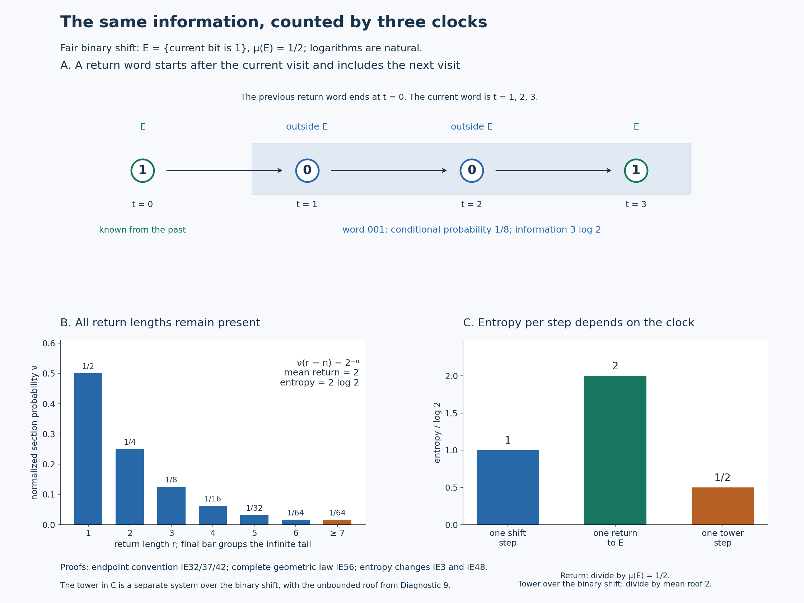

# Entropy at return times

The entropy produced by one return to a set must be compared with the mean number of original steps in that return. Keeping the terminal symbol of each return word makes that comparison exact, even when return times are unbounded.

## The return theorem and its scope

Let \((X,\Sigma,\mu)\) be a probability space and let \(T\) be an invertible bimeasurable probability-preserving transformation. Assume it is ergodic: every measurable set invariant modulo null sets has measure zero or one. Let \(E\in\Sigma\) have measure \(a>0\). On the recurrent conull part of \(E\), write
\[
 r(x)=\min\{n\ge1:T^nx\in E\},\qquad
 Sx=T^{r(x)}x,\qquad
 \nu(B)=\frac{\mu(B)}a\quad(B\subseteq E).
 \tag{IE1}
\]
All sigma algebras below are completed for their indicated measures. All logarithms are natural, and \(0\log0=0\).

For a finite measurable partition \(\mathcal P\), define
\[
 \begin{aligned}
 H_\mu(\mathcal P)&=-\sum_{P\in\mathcal P}\mu(P)\log\mu(P),\\
 h_\mu(T,\mathcal P)&=\lim_{n\to\infty}\frac1n
       H_\mu\!\left(\bigvee_{j=0}^{n-1}T^{-j}\mathcal P\right),\\
 h_\mu(T)&=\sup_{\mathcal P\ {\rm finite}}h_\mu(T,\mathcal P).
 \end{aligned}
 \tag{IE2}
\]
The limit is proved below. Here \(T^{-j}\mathcal P\) records the label \(\mathcal P(T^jx)\).

**Theorem.** The induced map \(S\) is an invertible ergodic probability-preserving transformation of \((E,\nu)\), and
\[
 \boxed{\quad h_\nu(S)=\frac{h_\mu(T)}{\mu(E)}
             \quad\text{in }[0,\infty].\quad}
 \tag{IE3}
\]
Neither nonatomicity nor aperiodicity is required. The return time is finite almost everywhere and has mean \(1/a\), but need not be bounded. No finite generating partition is assumed. The scalar integration and Hilbert-space inputs are proved in [SC2–7](OA-FLOW-SC.md#sc-02), [CF8](OA-FLOW-CF.md#oa-flow.cf.8) and [HR2–5](OA-FLOW-HR.md#hr-02). The proof works on the stated probability spaces; the standard probability spaces needed for the classification application are included.

The induction identity is due to L. M. Abramov. We prove it here from scalar integration, Hilbert projection and finite probability tables. In particular no ergodic theorem for time averages, entropy generator theorem, martingale convergence theorem, or factor-classification theorem is used as an unproved input.

## 1. The entire probability tower

Let \(F\subseteq E\) be the set of points with no positive return to \(E\). The sets \(T^nF\), \(n\in\mathbb Z\), are disjoint: an equality between two such translates would give a positive return from one point of \(F\) to another point of \(E\). They all have the same measure, so finite total measure forces \(\mu(F)=0\). A point of \(E\) with only finitely many future visits has its last visit in \(F\); all such points lie in a countable union of null translates. Apply this argument to \(T^{-1}\) for past visits.

The integer saturation of \(E\) is invariant and has positive measure, hence is conull. Remove from it all integer translates of the preceding exceptional sets. The resulting invariant conull set has infinitely many visits to \(E\) in both time directions. Return times, their level sets and all the maps used below are measurable because they are defined by countably many integer membership tests. Statements on this set determine the completed probability systems.

Put \(E_n=\{x\in E:r(x)=n\}\). The sets
\[
 \{T^jE_n:n\ge1,\ 0\le j<n\}
 \quad\text{and}\quad
 \{T^jE_n:n\ge1,\ 1\le j\le n\}
 \tag{IE4}
\]
are each partitions of \(X\) modulo null sets. For the first partition, take the last visit at or before the current time; the elapsed integer time is smaller than that visit's next return time. This recovers exactly one pair \((n,j)\) and its source point. Apply \(T\) to that whole partition to obtain the second. The same argument restricted to target points in \(E\) gives the range partition
\[
 E=\bigsqcup_{n\ge1}T^nE_n
 \quad\text{modulo null sets}.
 \tag{IE5}
\]
The last strictly earlier visit supplies the measurable inverse of \(S\).

For any nonnegative measurable \(F\), invariance and nonnegative countable summation now give
\[
 \begin{aligned}
 \int_E\sum_{j=1}^{r(x)}F(T^jx)\,d\mu(x)
 &=\sum_{n\ge1}\sum_{j=1}^n\int_{E_n}F(T^jx)\,d\mu(x)\\
 &=\sum_{n\ge1}\sum_{j=1}^n\int_{T^jE_n}F\,d\mu
 =\int_XF\,d\mu.
 \end{aligned}
 \tag{IE6}
\]
This includes infinite values. In particular,
\[
 \int_Er\,d\mu=1,\qquad \int_Er\,d\nu=\frac1a.
 \tag{IE7}
\]
There is also the same identity with the indices \(0\le j<r(x)\), from the first partition in (IE4).

For \(f\ge0\) on \(E\), (IE5) yields
\[
 \int_E f(Sx)\,d\nu(x)
   =\frac1a\sum_{n\ge1}\int_{T^nE_n}f\,d\mu
   =\int_E f\,d\nu.
 \tag{IE8}
\]
Thus \(S\) preserves the normalized measure, and its inverse does too.

If \(A\subseteq E\) is \(S\)-invariant modulo null sets, remove the integer \(S\)-translates of its invariance failures. Extend its indicator to \(X\) by assigning the same value to every level above a point of \(E\) in the first tower (IE4). Moving one \(T\)-step leaves this value unchanged, including at the top because \(A\) is \(S\)-invariant. The extension is therefore \(T\)-invariant modulo null sets. Ergodicity makes it zero or one almost everywhere; its intersection with \(E\) has \(\nu\)-measure zero or one. This proves ergodicity of \(S\).

## 2. Conditional probabilities and their exact information

We first construct the conditional expectations needed in this proof. For a completed sub-sigma-algebra \(\mathscr F\), \(L^2(\mathscr F)\) is a closed subspace of \(L^2(\Sigma)\): its inclusion is isometric and its source is complete. These completeness assertions are [SC7](OA-FLOW-SC.md#sc-07). The orthogonal projection theorem is proved in [CF8](OA-FLOW-CF.md#oa-flow.cf.8).

For a bounded real \(f\), let \(\mathbb E_\mu(f\mid\mathscr F)\) be that projection. It is real by uniqueness under conjugation, and its orthogonality gives
\[
 \int_B\mathbb E_\mu(f\mid\mathscr F)\,d\mu=\int_B f\,d\mu
 \qquad(B\in\mathscr F).
 \tag{IE9}
\]
If \(0\le f\le1\), testing the sets where the projection is negative or exceeds one proves \(0\le\mathbb E_\mu(f\mid\mathscr F)\le1\). More explicitly, the integral of a strictly negative function over its negative set cannot equal the integral of a nonnegative function there; apply this also to \(1-f\). Scaling and translating gives boundedness for every bounded real \(f\).

The characterization (IE9) determines the conditional expectation uniquely: the difference of two real \(\mathscr F\)-measurable candidates can be tested on its positive and negative sets. Testing first simple \(\mathscr F\)-measurable functions and then bounded limits proves the module identity
\(\mathbb E_\mu(gf\mid\mathscr F)=g\mathbb E_\mu(f\mid\mathscr F)\)
for bounded \(\mathscr F\)-measurable \(g\). The same characterization proves the tower identity for nested sigma algebras. If \(f_n\uparrow f\le1\), their conditional expectations increase to the expectation of \(f\), by (IE9) and monotone convergence.

Two covariance statements will be used explicitly. For an invertible probability-preserving \(U\), testing transformed sets proves
\[
 \mathbb E_\mu(f\circ U\mid U^{-1}\mathscr F)
      =\mathbb E_\mu(f\mid\mathscr F)\circ U.
 \tag{IE10}
\]
If \(E\in\mathscr F\), conditional probabilities for \(\nu=\mu|_E/a\) obey
\[
 \mathbb E_\nu(1_{A\cap E}\mid\mathscr F|_E)
      =\mathbb E_\mu(1_A\mid\mathscr F)|_E.
 \tag{IE11}
\]
Indeed, on each test set \(B\in\mathscr F\) contained in \(E\), the two integrals in (IE9) are both divided by the same number \(a\). There is no extra factor \(a\) in the conditional probability.

For a countable measurable partition \(\mathcal Q=(Q_i)\), let
\[
 q_i=\mathbb E_\mu(1_{Q_i}\mid\mathscr F),\qquad
 H_\mu(\mathcal Q\mid\mathscr F)
     =\int\sum_i\eta(q_i)\,d\mu,\qquad
 \eta(t)=-t\log t,\ \eta(0)=0.
 \tag{IE12}
\]
The function \(\eta\) is continuous also at zero: for \(u\ge1\),
\(\log u=\int_1^u x^{-1}\,dx\le\int_1^u x^{-1/2}\,dx=2(\sqrt u-1)\).
Consequently \(0\le-t\log t\le2\sqrt t\) for \(0<t\le1\), which tends to zero. The elementary compact-interval facts in [CF1](OA-FLOW-CF.md#oa-flow.cf.1) make \(\eta\) bounded and uniformly continuous on \([0,1]\).

The probabilities \(q_i\) are nonnegative and sum to one almost everywhere, by the monotone statement after (IE9). On \(Q_i\), define the conditional information
\[
 I_\mu(\mathcal Q\mid\mathscr F)(x)=-\log q_i(x).
 \tag{IE13}
\]
The exceptional event \(Q_i\cap\{q_i=0\}\) is null, because its measure is \(\int_{\{q_i=0\}}q_i\,d\mu=0\). Set the information to zero on the countable union of these null events. Thus it is finite and nonnegative almost everywhere, although its integral may be infinite.

For every nonnegative \(\mathscr F\)-measurable \(g\), (IE9), simple approximation and monotone convergence give \(\int_{Q_i}g\,d\mu=\int q_ig\,d\mu\). Apply this to the bounded truncations of \(-\log q_i\), then sum:
\[
 \int I_\mu(\mathcal Q\mid\mathscr F)\,d\mu
       =H_\mu(\mathcal Q\mid\mathscr F).
 \tag{IE14}
\]
All sums are nonnegative, so no undefined difference involving infinite entropy has occurred.

## 3. Chain rules, conditioning and countable tails

The logarithm and its derivative are constructed in [SC0](OA-FLOW-SC.md#sc-00). For \(t>0\), the function \(t-1-\log t\) vanishes at one and has derivative \(1-1/t\), negative below one and positive above one. The mean value theorem therefore proves \(\log t\le t-1\).

For finite probability vectors \(p=(p_i)\), \(q=(q_i)\),
\[
 \sum_i p_i\log\frac{p_i}{q_i}\ge0,
 \tag{IE15}
\]
with zero \(p_i\)-terms omitted and a term \(+\infty\) when \(p_i>0=q_i\). When all relevant \(q_i>0\), the scalar inequality \(\log t\le t-1\), applied to \(q_i/p_i\), gives
\(\sum_{p_i>0}p_i\log(q_i/p_i)\le\sum_{p_i>0}q_i-1\le0\).
This proves (IE15), including the remaining cases. In particular a probability distribution on at most \(m\) points has entropy at most \(\log m\), by comparison with the uniform vector.

Let \(\mathcal A=(A_i)\), \(\mathcal B=(B_j)\) be finite or countable partitions. Put \(p_{ij}=\mathbb E_\mu(1_{A_i\cap B_j}\mid\mathscr F)\) and \(p_i=\sum_jp_{ij}\). On \(A_i\), the conditional probability of \(B_j\) given \(\mathscr F\vee\sigma(\mathcal A)\) is \(p_{ij}/p_i\), assigning any value on its null zero-denominator part. To prove this, test \(A_i\cap C\), \(C\in\mathscr F\), and use
\[
 \int_{A_i\cap C}\frac{p_{ij}}{p_i}\,d\mu
    =\int_C p_i\frac{p_{ij}}{p_i}\,d\mu
    =\int_Cp_{ij}\,d\mu
    =\mu(A_i\cap B_j\cap C).
 \tag{IE16}
\]
The apparent quotient is bounded by one. All sets in \(\mathscr F\vee\sigma(\mathcal A)\) are, modulo completion, countable disjoint unions of sets \(A_i\cap C_i\), \(C_i\in\mathscr F\): those unions form a sigma algebra containing the generators. Thus the tests prove the full conditional-probability identity.

On an actual atom \(A_i\cap B_j\) outside the null exceptions, all the probabilities being divided are positive. Taking logarithms gives the pointwise information chain rule, and then (IE14) gives the entropy chain rule:
\[
 \begin{aligned}
 I_\mu(\mathcal A\vee\mathcal B\mid\mathscr F)
   &=I_\mu(\mathcal A\mid\mathscr F)
      +I_\mu(\mathcal B\mid\mathscr F\vee\sigma(\mathcal A)),\\
 H_\mu(\mathcal A\vee\mathcal B\mid\mathscr F)
   &=H_\mu(\mathcal A\mid\mathscr F)
      +H_\mu(\mathcal B\mid\mathscr F\vee\sigma(\mathcal A)).
 \end{aligned}
 \tag{IE17}
\]
These equalities hold for countable partitions as equalities of nonnegative quantities, including infinity. Repeated application proves the finite ordered chain rules. In particular a refinement has entropy at least that of the partition it refines.

Conditioning on a larger sigma algebra decreases entropy. First suppose \(\mathcal Q\) is finite and \(\mathscr F\subseteq\mathscr G\). Write \(p_i=\mathbb E(1_{Q_i}\mid\mathscr G)\), \(q_i=\mathbb E(1_{Q_i}\mid\mathscr F)\). The tower property gives \(\mathbb E(p_i\mid\mathscr F)=q_i\), and \(p_i=0\) almost everywhere on \(\{q_i=0\}\). Truncating the nonnegative \(\mathscr F\)-measurable function \(-\log q_i\) proves
\(\int p_i(-\log q_i)=\int q_i(-\log q_i)\).
Both total entropies are at most \(\log|\mathcal Q|\). Consequently
\[
 H_\mu(\mathcal Q\mid\mathscr F)-H_\mu(\mathcal Q\mid\mathscr G)
     =\int\sum_i p_i\log\frac{p_i}{q_i}\,d\mu\ge0.
 \tag{IE18}
\]
The displayed subtraction is between finite quantities; (IE15) proves the inequality.

For a countable \(\mathcal Q=(Q_i)_{i\ge1}\), let \(\mathcal Q_m\) retain its first \(m\) atoms and merge the rest into one tail atom. For every conditioning algebra,
\[
 H_\mu(\mathcal Q_m\mid\mathscr F)
    \uparrow H_\mu(\mathcal Q\mid\mathscr F).
 \tag{IE19}
\]
To see this directly, its conditional entropy density is
\(\sum_{i\le m}\eta(q_i)+\eta(\sum_{i>m}q_i)\).
Splitting one probability into two increases entropy, so these densities increase. The tail probability tends to zero, and continuity of \(\eta\) at zero identifies the limit with \(\sum_i\eta(q_i)\). Monotone convergence proves (IE19). Thus (IE18) extends to countable partitions by applying it to \(\mathcal Q_m\), with no subtraction of infinities.

Write \(H_\mu(\mathcal Q)=H_\mu(\mathcal Q\mid\{\varnothing,X\})\). If \(H_\mu(\mathcal Q)<\infty\), the chain rule and conditioning inequality give the uniform tail estimate
\[
 \begin{aligned}
 0&\le H_\mu(\mathcal Q\mid\mathscr F)
        -H_\mu(\mathcal Q_m\mid\mathscr F)
       \le H_\mu(\mathcal Q\mid\sigma(\mathcal Q_m))\\
   &=H_\mu(\mathcal Q)-H_\mu(\mathcal Q_m)
       \longrightarrow0.
 \end{aligned}
 \tag{IE20}
\]
Every entropy in this display is finite. In particular the estimate is uniform in \(\mathscr F\). It supplies the countable-tail control that mere convergence of individual atom probabilities would not provide.

## 4. Increasing conditioning: entropy and information converge

Let \(\mathscr F_n\) increase and put
\(\mathscr F_\infty=\sigma(\bigcup_n\mathscr F_n)\), completed.
For \(f\in L^2(\mu)\), denote its orthogonal projections onto \(L^2(\mathscr F_n)\) by \(P_nf\). If \(m\ge n\), orthogonality and nested ranges give
\[
 \|P_mf-P_nf\|_2^2=\|P_mf\|_2^2-\|P_nf\|_2^2.
 \tag{IE21}
\]
The squared norms increase and are bounded by \(\|f\|_2^2\). Hence \(P_nf\) converges in \(L^2\), to the projection onto the closed span of their ranges.

That span is all \(L^2(\mathscr F_\infty)\). Here is the needed density argument. In a probability space, if a set algebra \(\mathscr A\) generates a sigma algebra, the sets approximable in measure by members of \(\mathscr A\) form a sigma algebra: complements and finite unions preserve the approximation; a countable union is first approximated by a finite subunion using continuity of measure, then each of its finitely many sets is approximated. This also includes all completed sets. Apply it to the algebra \(\bigcup_n\mathscr F_n\). Its indicators are dense in \(L^2(\mathscr F_\infty)\), using simple approximation and \(\|1_A-1_B\|_2^2=\mu(A\triangle B)\). Therefore
\[
 \mathbb E_\mu(f\mid\mathscr F_n)
    \longrightarrow\mathbb E_\mu(f\mid\mathscr F_\infty)
       \quad\text{in }L^2.
 \tag{IE22}
\]
For bounded \(f\) these are the already constructed conditional expectations. No martingale theorem has been used.

If \(\mathcal Q\) is finite, apply (IE22) to its atom indicators. Uniform continuity and boundedness of \(\eta\) on \([0,1]\) imply convergence of the integrals of \(\eta(q_{i,n})\). For example, split into \(|q_{i,n}-q_{i,\infty}|\le\delta\) and its complement, bounding the latter's measure by its \(L^2\) error divided by \(\delta^2\). Finite summation proves conditional-entropy convergence. For countable \(\mathcal Q\) of finite entropy, apply the uniform estimate (IE20) before passing to the limit in \(n\), then let \(m\to\infty\). Thus
\[
 H_\mu(\mathcal Q\mid\mathscr F_n)
       \downarrow H_\mu(\mathcal Q\mid\mathscr F_\infty)
       \qquad(H_\mu(\mathcal Q)<\infty).
 \tag{IE23}
\]

There is also convergence of the actual information, needed to clarify the scope of this limiting argument:
\[
 I_\mu(\mathcal Q\mid\mathscr F_n)
     \longrightarrow I_\mu(\mathcal Q\mid\mathscr F_\infty)
     \quad\text{in }L^1
     \qquad(H_\mu(\mathcal Q)<\infty).
 \tag{IE24}
\]
To prove it, first fix an atom \(Q_i\). Its limiting conditional probability \(q_i\) is positive almost everywhere on \(Q_i\). More quantitatively,
\(\mu(Q_i\cap\{q_i<\delta\})=\int_{\{q_i<\delta\}}q_i\,d\mu\le\delta\).
On the complementary part \(q_i\ge\delta\), convergence of \(q_{i,n}\) in probability and continuity of \(-\log\) away from zero imply convergence of the information in probability. Restrict to finitely many \(Q_i\)'s with total measure as close to one as desired to obtain the same convergence on \(X\).

Write these nonnegative information functions as \(I_n,I\). Their means converge by (IE14) and (IE23), and \(I\) is integrable. Moreover \((I-I_n)_+\to0\) in probability and is dominated by \(I\). Its integrals tend to zero: on \(\{I\le M\}\) split at a difference threshold \(\varepsilon\) to get a bound \(\varepsilon+M\mu((I-I_n)_+>\varepsilon)\), and on \(\{I>M\}\) use the tail integral of \(I\). Let \(n\to\infty\), then \(\varepsilon\downarrow0\), then \(M\to\infty\). Finally
\(\|I_n-I\|_1=\int I_n+\int I-2\int\min(I_n,I)\to0\).
This proves (IE24) without claiming that the information is pointwise bounded or pointwise monotone.

## 5. Entropy rate and finite approximations

Let \(U\) be any invertible probability-preserving transformation and let \(\mathcal Q\) be countable with \(H_\mu(\mathcal Q)<\infty\). Its strict past is
\[
 \mathscr F_{\mathcal Q}^{-}
    =\sigma\{\mathcal Q(U^{-j}x):j\ge1\}.
 \tag{IE25}
\]
All block entropies are finite, bounded by \(nH_\mu(\mathcal Q)\). Apply (IE17) to the ordered labels at times \(0,\ldots,n-1\), and move each term back to time zero by invariance and (IE10):
\[
 H_\mu\!\left(\bigvee_{j=0}^{n-1}U^{-j}\mathcal Q\right)
   =\sum_{k=0}^{n-1}
       H_\mu\!\left(\mathcal Q\mid
          \sigma\{\mathcal Q(U^{-j}x):1\le j\le k\}\right).
 \tag{IE26}
\]
For \(k=0\) the conditioning algebra is trivial. By (IE23), these summands decrease to \(H_\mu(\mathcal Q\mid\mathscr F_{\mathcal Q}^{-})\). Their Cesaro averages converge to the same number: a finite initial segment has vanishing average contribution, and the remaining terms are within any fixed tolerance of the limit. Hence the block limit exists and
\[
 h_\mu(U,\mathcal Q)
       =H_\mu(\mathcal Q\mid\mathscr F_{\mathcal Q}^{-}).
 \tag{IE27}
\]
This proves the limit in (IE2) and also defines the rate of a countable finite-entropy partition.

For partitions \(\mathcal P,\mathcal Q\) each of finite entropy, use (IE17) on their two \(n\)-blocks, and then condition each \(\mathcal P\)-symbol on at least its corresponding \(\mathcal Q\)-symbol. This gives
\[
 \begin{aligned}
 H_\mu(\mathcal P^{[0,n)})&\le
 H_\mu(\mathcal Q^{[0,n)})
     +\sum_{j=0}^{n-1}H_\mu(U^{-j}\mathcal P\mid\sigma(U^{-j}\mathcal Q))\\
 &=H_\mu(\mathcal Q^{[0,n)})+nH_\mu(\mathcal P\mid\sigma(\mathcal Q)).
 \end{aligned}
 \tag{IE28}
\]
The notation in the first line abbreviates the joins in (IE2). Divide by \(n\):
\[
 h_\mu(U,\mathcal P)\le h_\mu(U,\mathcal Q)
                       +H_\mu(\mathcal P\mid\sigma(\mathcal Q)).
 \tag{IE29}
\]
Refinement increases every block entropy and therefore increases rate.

The finite coarsenings \(\mathcal Q_m\) of a countable finite-entropy partition satisfy, by (IE20) and (IE29),
\[
 h_\mu(U,\mathcal Q_m)\le h_\mu(U,\mathcal Q)
  \le h_\mu(U,\mathcal Q_m)+H_\mu(\mathcal Q)-H_\mu(\mathcal Q_m).
 \tag{IE30}
\]
Thus \(h_\mu(U,\mathcal Q)=\lim_m h_\mu(U,\mathcal Q_m)\le h_\mu(U)\). This proves that introducing such countable partitions does not enlarge the supremum over finite partitions.

We will also use a finite-label approximation estimate. Suppose \(\mathcal P\) has \(m\) labels and a \(\mathcal Q\)-measurable prediction of its label is wrong on a set of probability \(\varepsilon\). Let \(D\) be that error indicator. Applying the chain rule with \(D\), conditioning reduction, and the entropy bound for at most \(m\) labels gives
\[
 H_\mu(\mathcal P\mid\sigma(\mathcal Q))
   \le H_2(\varepsilon)+\varepsilon\log m,\qquad
 H_2(t)=-t\log t-(1-t)\log(1-t).
 \tag{IE31}
\]
Indeed, when \(D=0\) the label is determined by \(\mathcal Q\); when \(D=1\) its entropy is at most \(\log m\); and \(H(D\mid\mathcal Q)\le H(D)=H_2(\varepsilon)\). This proves the estimate, including its limit zero as \(\varepsilon\to0\).

## 6. The stopped word contains exactly one return's information

Choose a finite partition \(\mathcal P\) of \(X\) refining \(\{E,X\setminus E\}\), and suppose it has \(m\) atoms. For \(x\in E\), record the word
\[
 \mathcal R(x)=
  \bigl(\mathcal P(Tx),\ldots,\mathcal P(T^{r(x)}x)\bigr).
 \tag{IE32}
\]
This defines a countable partition of \(E\). The initial symbol at time zero is excluded; the symbol at the next visit is included. The latter has an \(E\)-label, and every preceding symbol in the word has an outside label.

The word partition has finite entropy, even when \(r\) is unbounded. Under \(\nu\), put \(p_n=\nu(r=n)\). If \(0<a<1\), compare its finite coarsening \((p_1,\ldots,p_N,\sum_{n>N}p_n)\) with the corresponding coarsening of
\[
 q_n=a(1-a)^{n-1},\qquad \sum_{n>N}q_n=(1-a)^N.
 \tag{IE33}
\]
The finite inequality (IE15) bounds the coarse entropy by its cross entropy. For \(n>N\), \(-\log((1-a)^N)\le-\log q_n\). Therefore every such coarse entropy is bounded by
\[
 \sum_{n\ge1}p_n[-\log a-(n-1)\log(1-a)]
   =-\log a-(a^{-1}-1)\log(1-a)<\infty,
 \tag{IE34}
\]
using (IE7). Let \(N\to\infty\) and apply (IE19) with trivial conditioning. This proves the same bound for \(H_\nu(r)\). If \(a=1\), \(r\ge1\) and its mean is one, so \(r=1\) almost everywhere and \(H_\nu(r)=0\).

The length \(r\) is determined by the word. Given \(r=n\), there are at most \(m^n\) possible words. The countable chain rule (IE17), proved before any finite-entropy assumption, and (IE15) consequently give
\[
 H_\nu(\mathcal R)=H_\nu(r)+H_\nu(\mathcal R\mid\sigma(r))
       \le H_\nu(r)+\frac{\log m}{a}<\infty.
 \tag{IE35}
\]
This establishes finiteness before using the rate formula for \(\mathcal R\).

Let
\[
 \mathscr G_0=\sigma\{\mathcal P(T^kx):k\le0\}.
 \tag{IE36}
\]
The strict \(S\)-past of the word partition is exactly
\[
 \sigma\{\mathcal R(S^{-j}x):j\ge1\}
       =\mathscr G_0|_E
       \quad\text{modulo }\nu\text{-null sets}.
 \tag{IE37}
\]
For the first inclusion, the full nonpositive \(\mathcal P\)-name locates all past visits, because \(\mathcal P\) detects \(E\), and reads each intervening word. For the reverse inclusion, concatenate the past return words. The most recent one ends at time zero and supplies its \(\mathcal P\)-label. Their lengths locate the preceding word boundaries; backward recurrence makes their cumulative lengths tend to infinity. Every fixed nonpositive integer coordinate is therefore read after finitely many words. Both reconstructions are measurable: the needed stopping index has countably many measurable integer level sets, and every finite word belongs to a countable alphabet. This proves equality of the generated sigma algebras, not merely an informal coding correspondence.

Let
\[
 p_i=\mathbb E_\mu(1_{P_i}\mid\mathscr F_{\mathcal P}^{-}),\qquad
 I(x)=I_\mu(\mathcal P\mid\mathscr F_{\mathcal P}^{-})(x).
 \tag{IE38}
\]
Then \(I\ge0\), \(I\) is finite almost everywhere, and
\(\int_X I\,d\mu=h_\mu(T,\mathcal P)\), by (IE14) and (IE27).
For a positive integer \(j\), the information at step \(j\) conditioned on the original past and the preceding prefix is
\[
 -\log\mathbb E_\mu\!\left(
      1_{\{\mathcal P(T^jx)=P_i\}}
        \,\middle|\,
      \mathscr G_0\vee
           \sigma\{\mathcal P(T^kx):1\le k<j\}\right)
     =-\log p_i(T^jx).
 \tag{IE39}
\]
Indeed the conditioning algebra on the left is exactly
\(\sigma\{\mathcal P(T^kx):k\le j-1\}=(T^j)^{-1}\mathscr F_{\mathcal P}^{-}\).
Formula (IE10) proves the conditional probability identity. On the actual \(i\)-label this is \(I(T^jx)\).

We now justify stopping this chain at \(r\); stopping is not an extra independence assumption. Fix an admissible word \(\mathbf v=(v_1,\ldots,v_n)\) ending in an \(E\)-label and having all earlier labels outside \(E\). Write
\[
 C_{\mathbf v}=\{x:\mathcal P(T^jx)=v_j,\ 1\le j\le n\}.
 \tag{IE40}
\]
On \(E\), this is precisely the event that the next return word is \(\mathbf v\), since its labels already specify the first positive return. By the pointwise chain rule in (IE17), iterated for the finite prefix, on \(C_{\mathbf v}\)
\[
 -\log\mathbb E_\mu(1_{C_{\mathbf v}}\mid\mathscr G_0)
      =\sum_{j=1}^n I(T^jx)
 \quad\text{almost everywhere}.
 \tag{IE41}
\]
For precision, the conditional probability of the \(j\)-th actual symbol is the ratio of the conditional probability of its length-\(j\) prefix to that of the preceding prefix, as proved in (IE16). Multiplying these ratios telescopes to the conditional probability of \(C_{\mathbf v}\). Equation (IE39) identifies each factor. The zero denominators occur only on null parts of their actual prefix events.

Since \(E\in\mathscr G_0\), (IE11) says that the conditional probability on the left of (IE41), restricted to \(E\), is the probability of this return-word atom under \(\nu\) given \(\mathscr G_0|_E\). There is no starting factor \(\nu(E)\), and no extra stopping probability: the starting event is already in the conditioning algebra, and the stopping event is encoded by the final label.

There are countably many finite admissible words, and countably many integer translates of the atom null exceptions in (IE38)–(IE39). Remove their union. Almost every point of \(E\) has one finite word, and (IE37)–(IE41) prove the exact information identity
\[
 I_\nu(\mathcal R\mid\mathscr F_{\mathcal R}^{-})(x)
      =\sum_{j=1}^{r(x)}I(T^jx)
      \quad\text{for }\nu\text{-almost every }x.
 \tag{IE42}
\]
This is a finite sum at each such point; its integrated treatment remains nonnegative and does not require a bounded return time.

Combine finite word entropy (IE35), the rate formula (IE27), and the tower integral (IE6):
\[
 \begin{aligned}
 h_\nu(S,\mathcal R)
 &=\int_E I_\nu(\mathcal R\mid\mathscr F_{\mathcal R}^{-})\,d\nu\\
 &=\frac1a\int_E\sum_{j=1}^{r(x)}I(T^jx)\,d\mu(x)\\
 &=\frac1a\int_X I\,d\mu
 =\frac1a h_\mu(T,\mathcal P).
 \end{aligned}
 \tag{IE43}
\]
This equality concerns each finite \(\mathcal P\) refining \(E\), and its countable finite-entropy word partition.

For the first supremum inequality, let \(\mathcal P_0\) be any finite partition of \(X\) and put \(\mathcal P=\mathcal P_0\vee\{E,X\setminus E\}\). Since countable finite-entropy rates are bounded by the full entropy, (IE30) and (IE43) give
\[
 h_\nu(S)\ge h_\nu(S,\mathcal R)
       =a^{-1}h_\mu(T,\mathcal P)
       \ge a^{-1}h_\mu(T,\mathcal P_0).
 \tag{IE44}
\]
Taking all finite \(\mathcal P_0\) proves \(h_\nu(S)\ge h_\mu(T)/a\). If the latter is infinite, this already proves both sides of (IE3) are infinite.

For the opposite inequality, let \(\mathcal Q\) be any finite partition of \(E\), and extend it to \(X\) by adding \(X\setminus E\) as one atom. Call this partition \(\mathcal P\). The final symbol of its word \(\mathcal R(x)\) is the \(\mathcal Q\)-label of \(Sx\). Hence \(\mathcal R\) refines \(S^{-1}\mathcal Q\). Invariance makes the entropy rates of \(\mathcal Q\) and \(S^{-1}\mathcal Q\) identical, because all finite block distributions are shifted together. Therefore
\[
 h_\nu(S,\mathcal Q)
   \le h_\nu(S,\mathcal R)
   =a^{-1}h_\mu(T,\mathcal P)
   \le a^{-1}h_\mu(T).
 \tag{IE45}
\]
Taking all finite \(\mathcal Q\) proves the other inequality and completes (IE3). Every finite-partition calculation involved finite entropy; the final suprema are allowed to be infinite.

### The inverse construction: an arbitrary integrable integer roof

Let \((Y,\nu,S)\) be any invertible ergodic probability-preserving system and let \(\ell:Y\to\{1,2,\ldots\}\) be measurable, with finite mean \(R=\int_Y\ell\,d\nu\). No bound on \(\ell\) is assumed. Define
\[
 Z=\{(y,j):y\in Y,\ 0\le j<\ell(y)\},\qquad
 \int_Z F\,d\mu=\frac1R\int_Y\sum_{j=0}^{\ell(y)-1}F(y,j)\,d\nu(y)
 \quad(F\ge0).
 \tag{IE46}
\]
Use the measurable disjoint-union sigma algebra, completed for \(\mu\). This is a probability measure by nonnegative countable summation, because its value on \(Z\) is \(R/R=1\). The tower transformation and its inverse are
\[
 \begin{aligned}
 V(y,j)&=\begin{cases}(y,j+1),&j+1<\ell(y),\\(Sy,0),&j+1=\ell(y),\end{cases}\\
 V^{-1}(y,j)&=\begin{cases}(y,j-1),&j>0,\\(S^{-1}y,\ell(S^{-1}y)-1),&j=0.\end{cases}
 \end{aligned}
 \tag{IE47}
\]
These maps are measurable inverses by their countably many measurable level formulas. Integrating \(F\circ V\) replaces the sum of levels \(0,\ldots,\ell(y)-1\) by levels \(1,\ldots,\ell(y)-1\) and the term \(F(Sy,0)\). The last integral equals the integral of \(F(y,0)\) by invariance of \(\nu\), so \(V\) preserves \(\mu\). Its inverse preserves \(\mu\) as well, and the maps therefore extend to the completions.

An invariant indicator is constant along each finite tower, after removing the countably many translates of its null invariance failures. Its bottom-level indicator is \(S\)-invariant, hence is zero or one almost everywhere. The nonnegative tower sum then makes the original indicator zero or one almost everywhere on \(Z\). Thus \(V\) is ergodic.

The bottom section \(E=Y\times\{0\}\) has mass \(1/R\). Its normalized restriction is exactly \(\nu\), its return time is exactly \(\ell\), and its return map is exactly \(S\). Applying the theorem gives
\[
 h_\mu(V)=\frac{h_\nu(S)}R\qquad\text{in }[0,\infty].
 \tag{IE48}
\]
This is the finite-mean, possibly unbounded-roof formulation. Multiplying or dividing infinity by the finite positive number \(R\) is unambiguous. An infinite-mean roof would not define the probability measure (IE46), and is outside this probability theorem.

## 7. Equivalent invariant probabilities have the same normalization

Suppose \(U\) is ergodic and preserves a probability \(\eta\), and \(\rho\) is another \(U\)-invariant probability with \(\rho\) equivalent to \(\eta\). The [finite Radon–Nikodym construction](../../OA-MOD/OA-MOD-DC.html#a-finite-radon-nikodym-density-from-hilbert-representation) supplies a unique finite positive density \(f\) with \(\rho=f\eta\).

For completeness, its construction uses only Hilbert representation: with \(\lambda=\eta+\rho\), the functional \(g\mapsto\int g\,d\rho\) is bounded on \(L^2(\lambda)\). Its representing density \(v\) satisfies \(0\le v\le1\), by indicator tests, and \(\rho=v\lambda,\ \eta=(1-v)\lambda\). Absolute continuity removes \(\{v=1\}\). Thus \(f=v/(1-v)\) has the stated properties; simple approximation proves the integral identity, and testing sets where two densities differ proves uniqueness.

Invariance and change of variables give \(f=f\circ U^{-1}\) almost everywhere. Each set \(\{f>q\}\), \(q\in\mathbb Q\), is therefore invariant modulo null sets and has measure zero or one. These nested rational tests force \(f\) to be constant almost everywhere: their common threshold determines its value, with finiteness ensured by \(\int f=1\). Its integral then makes that constant one. Consequently \(\rho=\eta\).

In particular, suppose \(W:E_1\to E_2\) is an invertible measure-class map conjugating induced transformations from two ergodic probability systems. Write \(a_i=\mu_i(E_i)>0\), \(\nu_i=\mu_i|_{E_i}/a_i\). The pushforward \(W_*\nu_1\) is invariant and equivalent to \(\nu_2\); induced ergodicity and the preceding argument give
\[
 W_*\nu_1=\nu_2,\qquad
 W_*(\mu_1|_{E_1})=\frac{a_1}{a_2}\,\mu_2|_{E_2}.
 \tag{IE49}
\]
Thus it is the normalized induced probabilities that are preserved. Pulling back finite partitions by \(W\) preserves their probabilities and all their orbit-join probabilities. It follows directly from (IE2), in both directions, that \(h_{\nu_1}(S_1)=h_{\nu_2}(S_2)\), including infinite entropy.

## 8. The two entropy values needed for the obstruction

**Irrational rotation.** On \(\mathbb T=\mathbb R/\mathbb Z\), let \(T_\alpha x=x+\alpha\) with \(\alpha\) irrational, and use normalized Lebesgue measure. [SC2](OA-FLOW-SC.md#sc-02) constructs this measure and proves translation invariance; passage through the endpoint uses its two half-open interval pieces.

A partition \(\mathcal Q\) into finitely many arcs has only finitely many endpoints, say at most \(L\) with \(L\ge1\). Its \(n\)-fold refinement has at most \(nL\) atoms, since all endpoints are among \(n\) translates of those endpoints. Thus
\[
 H_\mu(\mathcal Q^{[0,n)})\le\log(nL),\qquad
 h_\mu(T_\alpha,\mathcal Q)=0.
 \tag{IE50}
\]
Finite unions of rational-endpoint arcs form an algebra generating the completed Lebesgue sigma algebra in measure, by the approximation argument in Section 4. Given any finite partition \(\mathcal P=(P_i)_{i=1}^m\) and \(0<\varepsilon<1/2\), approximate its atoms by sets \(A_i\) from this algebra with total symmetric-difference error below \(\varepsilon\). Predict the label by the first \(A_i\) containing the point, with a fixed default if none contains it. Outside the union of the errors this is the correct label. A finite arc partition \(\mathcal Q\) containing all their endpoints determines this prediction. Equations (IE29), (IE31), and (IE50) give
\[
 0\le h_\mu(T_\alpha,\mathcal P)
      \le H_2(\varepsilon)+\varepsilon\log m.
 \tag{IE51}
\]
Letting \(\varepsilon\downarrow0\) proves \(h_\mu(T_\alpha)=0\).

This rotation is ergodic and free. For ergodicity, translations are continuous on \(L^2(\mathbb T)\): for finite arc indicators the symmetric-difference measure tends to zero, and their linear span is dense by the same set approximation, so isometry extends continuity to every vector. The cyclic subgroup generated by an irrational \(\alpha\) is dense. One elementary proof uses the pigeonhole principle to find arbitrarily small nonzero distances of its elements from zero; after a sign change, integer multiples of such a positive distance approximate every circle point to within that distance. An invariant indicator for \(T_\alpha\) is therefore invariant in \(L^2\) under every circle translation. Choose a Borel representative for its set \(A\), as SC2 permits. Lebesgue measure on the compact circle is Radon: enlarge its interval covers to open arcs with arbitrarily small added length, and apply complements to obtain compact inner approximations. The finite product integration theorem [HR5](OA-FLOW-HR.md#hr-05) therefore gives
\[
 0=\int_{\mathbb T}\!\int_{\mathbb T}
       |1_A(x+t)-1_A(x)|^2\,dx\,dt
      =2\mu(A)(1-\mu(A)).
 \tag{IE52}
\]
Hence \(\mu(A)\) is zero or one. No nonzero power of the rotation fixes a point, by irrationality. Lebesgue measure is nonatomic: its partitions into \(k\) equal arcs have maximum cell mass \(1/k\), whereas a positive atom would have to lie modulo null sets in one cell of every such finite partition.

**Binary Bernoulli shift.** Let \(X=\{0,1\}^{\mathbb Z}\), let \(T x\) have coordinates \((Tx)_j=x_{j+1}\), and give all coordinates independent fair probabilities. This probability can be constructed from the actual [HR2 representation theorem](OA-FLOW-HR.md#hr-02): average a cylinder function over its finite coordinate set. These positive averages are consistent, of norm one, and extend to \(C(X)\).

Here \(X\) is compact metrizable: enumerate its coordinates and use the metric \(\sum_{k\ge1}2^{-k}|x_{j_k}-y_{j_k}|\). A diagonal subsequence fixes every finite coordinate list and converges. The countable cylinder base gives a countable subcover from any open cover; if it had no finite subcover, points outside its first \(n\) members would contradict that subsequence property. Continuous functions are uniformly approximable by cylinder functions: finitely many sufficiently small cylinders cover \(X\), and refining their coordinate sets makes the oscillation on each cylinder arbitrarily small. HR2 therefore gives a unique Borel probability with the finite fair cylinder values, and its completion gives the claimed probability space. The shift preserves it by its finite-coordinate permutation, first on cylinder functions and then by uniqueness of the representing measure.

Let \(\mathcal P_0\) be the coordinate-zero partition. Independence gives \(2^n\) equally likely atoms in its \(n\)-block, so its entropy is \(n\log2\). Thus \(h_\mu(T)\ge\log2\). Let \(\mathcal Q_m\) record the coordinates \(-m,\ldots,m\). Its \(n\)-block records \(n+2m\) independent coordinates, and hence
\[
 H_\mu(\mathcal Q_m^{[0,n)})=(n+2m)\log2,\qquad
 h_\mu(T,\mathcal Q_m)=\log2.
 \tag{IE53}
\]
The finite cylinder algebra generates the Borel sigma algebra and approximates every completed measurable set in measure by Section 4. For any finite partition \(\mathcal P\), predict its labels with arbitrarily small error using finitely many coordinate tests, all contained in some \(\mathcal Q_m\). Equations (IE29) and (IE31) give \(h_\mu(T,\mathcal P)\le\log2\). Taking the supremum proves
\[
 h_\mu(T)=\log2.
 \tag{IE54}
\]

The shift is mixing, hence ergodic. Two cylinder events with finite coordinate sets are independent after a sufficiently large shift separates those sets. Approximate arbitrary events \(A,B\) by cylinder events \(A',B'\). Invariance bounds the difference of the intersection probabilities by \(\mu(A\triangle A')+\mu(B\triangle B')\), and the difference of their product probabilities by the same bound. Let the errors tend to zero to obtain \(\mu(A\cap T^{-n}B)\to\mu(A)\mu(B)\). For an invariant event \(A\), this forces \(\mu(A)=\mu(A)^2\). The partition specifying any \(k\) different coordinates has maximum cell mass \(2^{-k}\). A positive atom would have to lie modulo null sets in one cell, so no positive atom exists. In particular each point is null. The fixed points of a nonzero \(k\)-th power are the finitely many binary sequences of period dividing \(|k|\); each is null. Thus the action is essentially free.

It follows from (IE3) and (IE49) that no positive-measure induced map of this Bernoulli shift can be measure-class conjugate to a positive-measure induced map of the irrational rotation. Their normalized entropies are respectively
\[
 \frac{\log2}{\mu_{\rm B}(E_{\rm B})}>0
 \quad\text{and}\quad 0.
 \tag{IE55}
\]
This is exactly the measured obstruction required before constructing the coefficient-factor absorption example.

## 9. Exact diagnostics with solutions

*The timeline uses the exact word convention in (IE32), (IE37) and (IE42). For the fair binary shift, the bars show the first six return probabilities and a separate tail with mass 1/64; the distribution remains infinite. The third panel compares entropy per step in three different clocks, from (IE3), (IE48) and (IE56). [Vector figure](../assets/entropy-return-times/entropy-returns.svg) · [Reproduction and terms](../assets/entropy-return-times/TERMS.md).*

**1. The full set has no time change.** If \(E=X\) modulo null sets, then \(a=1\), \(r=1\) almost everywhere, and \(S=T\). The word (IE32) is the single label \(\mathcal P(Tx)\). Its strict return past includes the original time-zero label, in agreement with (IE37). Formula (IE3) becomes \(h_\mu(T)=h_\mu(T)\); the geometric estimate is replaced by \(H(r)=0\), not by an expression containing \(\log0\).

**2. An atomic system is allowed.** Take the uniform three-cycle \(0\mapsto1\mapsto2\mapsto0\) and \(E=\{0,2\}\). Then \(a=2/3\), \(r(0)=2,\ r(2)=1\), and the normalized induced measure assigns mass \(1/2\) to each point. Thus \(\int r\,d\nu=3/2=1/a\), and \(S\) swaps the two points. Every original block partition has entropy at most \(\log3\), and every induced block partition at most \(\log2\), so both entropy rates vanish. This checks the theorem without an aperiodicity or nonatomicity hypothesis.

**3. An unbounded return time with an exact mean and information.** In the fair binary shift let \(E=\{x:x_0=1\}\). Then \(a=1/2\), and for \(n\ge1\),
\[
 \nu(r=n)=2^{-n},\qquad
 \int r\,d\nu=\sum_{n\ge1}n2^{-n}=2,\qquad
 H_\nu(r)=2\log2.
 \tag{IE56}
\]
The sum for the mean follows from nonnegative rearrangement:
\(\sum_{n\ge1}n2^{-n}=\sum_{j\ge1}\sum_{n\ge j}2^{-n}=2\).
The next word is \(0^{\,n-1}1\), with conditional probability \(2^{-n}\) given the entire past through time zero, by independence of future bits. Its information is \(n\log2\), the sum of its \(n\) one-step informations. Equation (IE3) gives \(h_\nu(S)=2\log2\). In fact consecutive gaps have joint probability \(2^{-(n_1+\cdots+n_k)}\); this independently checks the word probability and the absence of an additional stopping factor. No truncation of \(r\) is part of the theorem.

**4. Conditional information can be unbounded at every finite stage.** Let a partition \((Q_n)_{n\ge1}\) have probabilities \(2^{-n}\), and let \(\mathscr F_m\) distinguish \(Q_1,\ldots,Q_m\) and their remaining tail. On the first \(m\) atoms the conditional information is zero; on \(Q_n\), \(n>m\), it is \((n-m)\log2\). Therefore
\[
 \begin{aligned}
 H(\mathcal Q)&=2\log2,\\
 H(\mathcal Q_m)&=(2-2^{1-m})\log2,\\
 \|I(\mathcal Q\mid\mathscr F_m)-0\|_1
   &=2^{1-m}\log2\longrightarrow0.
 \end{aligned}
 \tag{IE57}
\]
The limiting conditioning algebra knows the whole partition, so its information is zero. Every finite-stage information is nevertheless unbounded, since all \(Q_n\) have positive measure. Thus (IE24) is a convergence statement with finite-entropy tail control, not a bounded-information assertion.

**5. Infinite entropy remains infinite after induction.** Take independent fair bits indexed by \(\mathbb Z\times\mathbb N\), and shift the first coordinate. The same compact cylinder construction and mixing proof apply. The finite partition recording the first \(m\) bits at time zero has \(n\)-block entropy \(mn\log2\), so \(h_\mu(T)=\infty\). For \(E=\{x:x_{0,1}=1\}\), the first-coordinate return time still has the geometric law in (IE56), of finite mean two. The lower supremum inequality (IE44) gives \(h_\nu(S)\ge2m\log2\) for every \(m\), and therefore \(h_\nu(S)=\infty\). Finite mean return does not imply finite entropy.

**6. The terminal symbol determines the normalization of the past.** If the next visit is three steps away, the timeline used in this proof is

| Original time | \(0\) | \(1\) | \(2\) | \(3=r(x)\) |
|---|---|---|---|---|
| Membership | \(E\) | outside \(E\) | outside \(E\) | \(E\) |
| Current return word | excluded | first symbol | second symbol | included terminal symbol |
| Information summed in (IE42) | none | \(I(Tx)\) | \(I(T^2x)\) | \(I(T^3x)\) |

The preceding return word ends at time zero and therefore supplies the current \(E\)-label to the return past. This is why that past is \(\mathscr G_0|_E\), and why (IE11) applies with \(E\) already known. A different word convention needs its corresponding past identity to be proved again.

**7. A measure-class conjugacy need not preserve the unnormalized restrictions.** If two positive sections have masses \(a_1=1/3\), \(a_2=1/5\), a conjugacy of their ergodic return maps must preserve their normalized invariant probabilities. Equation (IE49) then gives \(W_*(\mu_1|_{E_1})=(5/3)\mu_2|_{E_2}\). The total masses on both sides are \(1/3\). Entropy comparison is made for the probability measures, not for the raw restrictions.

**8. The obstruction survives every positive choice of section.** For rotation section mass \(b>0\) the induced entropy is zero. For Bernoulli section mass \(c>0\) it is \((\log2)/c\), which is finite and strictly positive because \(c\le1\). A measure-class conjugacy would preserve the normalized probabilities by Section 7, and then preserve these entropies. The unequal values exclude it for every such pair of sections.

**9. A prescribed unbounded roof has the expected tower entropy.** On the binary Bernoulli base \((Y,\nu,S)\), take \(\ell(y)=\min\{n\ge1:y_n=1\}\), assigning value one on the null event with no such bit. Then \(\nu(\ell=n)=2^{-n}\), \(R=2\), and the tower (IE46) has level masses
\(\mu(Y\times\{j\}\cap Z)=\nu(\ell>j)/2=2^{-(j+1)}\).
They sum to one. Its bottom mass is \(1/2\), its induced probability and transformation are exactly \((\nu,S)\), and (IE48) gives \(h_\mu(V)=(\log2)/2\). The roof depends on future base coordinates; the proof never assumes that it is independent of the base dynamics.

## 10. Sources and prerequisites

The return-time identity is Abramov's induction formula. Its historical attribution is recorded in reference 1 of [Tim Austin, *Measure concentration and the weak Pinsker property*, Publications Mathématiques de l’IHÉS 128 (2018), 1–119](https://www.numdam.org/articles/10.1007/s10240-018-0098-3/).

The proofs here start from [scalar integration and L² completeness, SC2–7](OA-FLOW-SC.md#sc-02), [Hilbert projection and representation, CF8](OA-FLOW-CF.md#oa-flow.cf.8), and [compact Radon measure construction and finite product integration, HR2–5](OA-FLOW-HR.md#hr-02). The scalar density argument in Section 7 is also proved in [OA-MOD's finite Radon–Nikodym lemma](../../OA-MOD/OA-MOD-DC.html#a-finite-radon-nikodym-density-from-hilbert-representation). The conditional information, stopping identity and both entropy inequalities are proved in this lesson.
