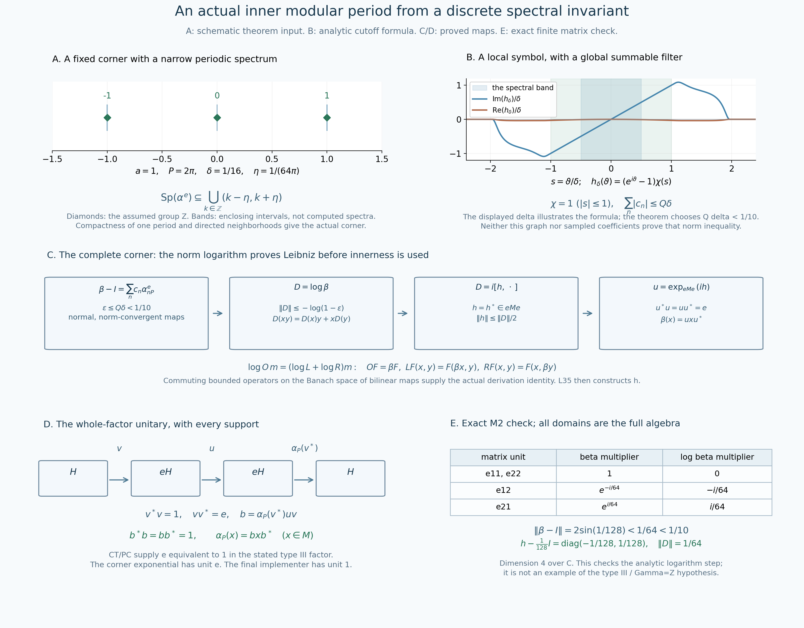

# From a discrete modular spectral invariant to an actual inner period

*Independent proof reconstruction, GPT-6.1 Sol (OpenAI), Ultra, 2026-10-04. CC0-1.0 to the extent of rights held.*

Let \(M\ne0\) be a type III factor with separable predual. Suppose

\[
 S(M)=\{0\}\cup\lambda^{\mathbb Z},\qquad
 0<\lambda<1,\qquad a=-\log\lambda>0,\qquad P=2\pi/a.
 \tag{IP1}
\]
For every given faithful normal semifinite weight \(\psi\) on \(M\), the modular automorphism \(\sigma_P^\psi\) is inner: there is a unitary \(b\in M\) such that \(\sigma_P^\psi(x)=bxb^*\) for every \(x\in M\). This is an actual whole-algebra identity. No periodic-weight existence or classification theorem is a premise or conclusion of this chapter.

The actual earlier inputs are the complete [CS-3/4 corner and spectral-translation proofs](OA-FLOW-CS.md), the precisely scoped [MG-4 positive \(S/\Gamma\) comparison](OA-FLOW-MG.md), [RF-1](OA-FLOW-RF.md#oa-flow.rf.1) and [AL-1–3](OA-FLOW-AL.md#oa-flow.al.1) for real filters, Fourier uniqueness and element-hull detection, [CF-1](OA-FLOW-CF.md#oa-flow.cf.1) for compact integrals and Banach differentiation, the already bounded star-derivation construction in [L35 Sections2–6](OA-FLOW-L35.md#oa-flow.gi.fourier), and [CT-2](OA-FLOW-CT.md#oa-flow.ct.2)/[PC-7](OA-FLOW-PC.md#oa-flow.projection.pc7)/[PC-8](OA-FLOW-PC.md#oa-flow.projection.pc8) for the actual type III corner equivalence. The modular action's normality and pointwise continuity are proved on full n.s.f. domains in [MW-4](OA-FLOW-MW.md#oa-flow.mw.4). Exact individual proof ranges, scalar prerequisites and earlier order are recorded separately. Automatic boundedness is not needed: the derivation below is explicitly a norm-convergent bounded operator series.

The human primary source actually read is [Connes (1973), Lemmas2.3.5–2.3.10 and the proof of Theorem2.3.1, printed179–182](https://numdam.org/article/ASENS_1973_4_6_2_133_0.pdf#page=48). Its small-corner route motivates the construction. The complete circle-filter bound and norm-logarithm proof below supply the needed innerness step locally, rather than importing its cited near-spectrum theorem.

## IP-0. Exact real-action hypotheses and the modular reduction

More generally, the analytic construction below starts with a normal real action \(\alpha\) on a factor, pointwise continuous on normal scalar coefficients, whose Connes spectrum is \(a\mathbb Z\), \(a>0\). It first constructs a nonzero \(\alpha\)-fixed projection \(e\) for which \(\alpha_P|_{eMe}\) is inner. If this \(e\) is equivalent to \(1\), [IP-6](OA-FLOW-IP.md#oa-flow.ip.6) extends that innerness to all of \(M\).

For the stated modular theorem put \(\alpha=\sigma^\psi\). [MG-4](OA-FLOW-MG.md#oa-flow.mg.4) gives

\[
 \Gamma(\alpha)=\log\bigl(S(M)\cap(0,\infty)\bigr)=a\mathbb Z.
 \tag{IP2}
\]
The last equality uses \((\log\lambda)\mathbb Z=(-\log\lambda)\mathbb Z\); no sign of \(P\) is reversed. [CS-3](OA-FLOW-CS.md#oa-flow.cs.3)/4 prove, for every nonzero fixed projection \(q\),

\[
 \operatorname{Sp}(\alpha^q)+a\mathbb Z=\operatorname{Sp}(\alpha^q),\qquad
 \mathcal F=\{\operatorname{Sp}(\alpha^q)+[-\varepsilon,\varepsilon]:
        q\ne0,\ q\in\operatorname{Proj}(M^\alpha),\ \varepsilon>0\}
 \tag{IP3}
\]
is a downward-directed family of closed sets with intersection \(a\mathbb Z\). These are the actual real annihilator-hull spectra; closedness and the directed family are part of the earlier [CS-3](OA-FLOW-CS.md#oa-flow.cs.3) proof. Each member's periodicity follows from the first equality.

## IP-1. Compactness produces a narrow periodic corner spectrum

Fix \(0<\eta<a/2\), and put \(K=[-a/2,-\eta]\cup[\eta,a/2]\). It is compact and disjoint from \(a\mathbb Z=\bigcap\mathcal F\). Hence for each \(r\in K\) some \(F_r\in\mathcal F\) excludes \(r\). The open complements \(\mathbb R\setminus F_r\) cover \(K\); [CF-1](OA-FLOW-CF.md#oa-flow.cf.1)'s compactness proof gives a finite subcover. Downward directedness, applied finitely many times, produces one \(F\in\mathcal F\) contained in all the corresponding finitely many sets. Therefore \(F\cap K=\varnothing\).

Write this actual \(F\) as \(\operatorname{Sp}(\alpha^e)+[-\varepsilon,\varepsilon]\), with \(e\ne0\) fixed. Translate any \(r\in F\) by an integer multiple of \(a\) into \([-a/2,a/2]\). Periodicity keeps the representative in \(F\); avoidance of \(K\) forces it into \((-\eta,\eta)\). Consequently

\[
 \operatorname{Sp}(\alpha^e)\subseteq
       \bigcup_{k\in\mathbb Z}(ka-\eta,ka+\eta).
 \tag{IP4}
\]
No compactness of the full real spectrum, quotient-space spectral theorem, eigenvector, finite-weight projection or countable approximation was used.

## IP-2. Absolutely summable discrete filters have the required support rule

Temporarily let \(\alpha\) be any such normal real action on a von Neumann algebra. For \(c=(c_n)_{n\in\mathbb Z}\in\ell^1(\mathbb Z)\), define

\[
 A_c=\sum_{n\in\mathbb Z}c_n\alpha_{nP}\quad\hbox{in operator norm},\qquad
 g_c(r)=\sum_{n\in\mathbb Z}c_ne^{inPr},\qquad
 \|A_c\|\le\sum_n|c_n|.
 \tag{IP5}
\]
Each action map has norm one. Thus the two-sided finite-subset sums are norm Cauchy. Their preadjoints also converge in the complete Banach predual, with the same bound, so their adjoint limit is a normal map and is exactly \(A_c\). The scalar series converges uniformly and is \(a\)-periodic when \(P=2\pi/a\). All real action filters commute with \(A_c\).

If \(g_c\) vanishes on an open neighborhood of \(\operatorname{Sp}_\alpha(x)\), then

\[
 A_cx=0.
 \tag{IP6}
\]
To prove this, every real filter annihilating \(x\) also annihilates \(A_cx\), by commutation and norm convergence. Hence \(\operatorname{Sp}_\alpha(A_cx)\subseteq\operatorname{Sp}_\alpha(x)\). For a point \(r\) in the latter spectrum, choose [RF-1](OA-FLOW-RF.md#oa-flow.rf.1)'s compact smooth bump \(\chi\) with \(\chi(r)=1\) and support contained in the open zero set of \(g_c\). Let \(k_\chi\) be its inverse real transform. The series

\[
 k(t)=\sum_n c_n k_\chi(t-nP)
 \tag{IP7}
\]
converges absolutely in \(L^1\), with norm at most \(\|c\|_1\|k_\chi\|_1\). Termwise scalar integration gives \(\widehat k(r')=g_c(r')\chi(r')=0\) for every \(r'\). [RF-1](OA-FLOW-RF.md#oa-flow.rf.1)'s actual Fourier uniqueness gives \(k=0\) in \(L^1\). Its filter is \(T_{k_\chi}A_c\): in each term the substitution \(t=s+nP\) gives \(T_{k_\chi(\,\cdot-nP)}=\alpha_{nP}T_{k_\chi}\), with precisely the positive-transform sign.

Therefore \(T_{k_\chi}(A_cx)=0\). Since \(\widehat{k_\chi}(r)=1\), the element hull excludes this \(r\). All other real points were already excluded by the first inclusion. Thus \(A_cx\) has empty spectrum and [AL-2](OA-FLOW-AL.md#oa-flow.al.2)/3's nonzero-element detection makes it zero. This also handles \(x=0\).

In particular two absolutely summable periodic multipliers agreeing on an open neighborhood of the action spectrum give the same maps on the whole algebra. The support of each element is contained in the action spectrum, directly from the two annihilator definitions. No theorem about arbitrary finite measures or their spectra is used in ([IP6](OA-FLOW-IP.md#equation-ip6)).

## IP-3. A complete elementary circle Fourier argument and its small bound

Choose once for all a real smooth function \(\chi\) equal to one on \([-1,1]\) and zero for \(|s|\ge2\). [RF-1](OA-FLOW-RF.md#oa-flow.rf.1) constructs such cutoffs by integrating its explicit bump and taking translates and dilates. Its derivatives are compactly supported, and

\[
 C_j=\int_{\mathbb R}|\chi^{(j)}(s)|\,ds\quad(j=0,1,2),\qquad
 A=C_0/\pi,\qquad C=(C_0+2C_1+2C_2)/(2\pi),\qquad Q=5A+2C
 \tag{IP8}
\]
are finite. Here \(C_0\ge2\), so \(Q>0\).

For \(0<\delta<\pi/4\), set on \([-\pi,\pi]\)

\[
 h_\delta(\theta)=(e^{i\theta}-1)\chi(\theta/\delta),\qquad
 c_n=\frac1{2\pi}\int_{-\pi}^{\pi}h_\delta(\theta)e^{-in\theta}\,d\theta.
 \tag{IP9}
\]
Extend the function periodically. It is smooth because it vanishes on a neighborhood of both endpoints. Twice integration by parts, with zero periodic boundary terms, gives \(|c_n|\le\|h_\delta''\|_1/(2\pi n^2)\) for \(n\ne0\). Thus its Fourier series is absolutely and uniformly convergent. We justify identification with the original function, without assuming a circle inversion theorem.

For \(N\ge1\) define

\[
 F_N(\theta)=\frac1N\left|\sum_{j=0}^{N-1}e^{ij\theta}\right|^2
    =\sum_{|n|<N}\left(1-\frac{|n|}{N}\right)e^{in\theta}.
 \tag{IP10}
\]
The finite expansion proves nonnegativity and \((2\pi)^{-1}\int_{-\pi}^{\pi}F_N=1\), by elementary integration of the exponentials. The finite geometric sum gives \(F_N(\theta)\le1/[N\sin^2(\theta/2)]\) away from zero modulo \(2\pi\). Hence its normalized mass outside any fixed neighborhood of zero tends to zero. Uniform continuity of a continuous periodic \(v\), splitting its convolution into that neighborhood and its complement, proves \(F_N*v\to v\) uniformly; the normalization of convolution is \(1/(2\pi)\). The finite expansion expresses this convolution as its Cesàro Fourier polynomial.

A continuous periodic function with all Fourier coefficients zero therefore vanishes. The uniformly convergent series \(\sum_n c_ne^{in\theta}\) has the same coefficients as \(h_\delta\), by termwise integration. Their continuous difference has zero coefficients, so

\[
 h_\delta(\theta)=\sum_n c_ne^{in\theta}\quad\hbox{uniformly}.
 \tag{IP11}
\]
This proves precisely the circle statement needed here.

On the support of \(h_\delta\), \(|\theta|\le2\delta\) and \(|e^{i\theta}-1|\le|\theta|\), the latter following by integrating \(ie^{it}\). Substitution in ([IP9](OA-FLOW-IP.md#equation-ip9)) gives

\[
 \|h_\delta\|_1\le2C_0\delta^2,\qquad
 h_\delta''=-e^{i\theta}\chi(\theta/\delta)
 +2ie^{i\theta}\delta^{-1}\chi'(\theta/\delta)
 +(e^{i\theta}-1)\delta^{-2}\chi''(\theta/\delta),
 \quad
 \|h_\delta''\|_1\le \delta C_0+2C_1+2C_2.
 \tag{IP12}
\]
For \(\delta\le1\), therefore \(|c_n|\le A\delta^2\) for every \(n\), and \(|c_n|\le C/n^2\) for \(n\ne0\). Take \(N=\lceil1/\delta\rceil\). The scalar integral bound \(\sum_{n>N}n^{-2}\le\int_N^\infty t^{-2}dt=1/N\) and \(N\le1/\delta+1\) imply

\[
 \sum_n|c_n|
 \le(2N+1)A\delta^2+2C/N
 \le(5A+2C)\delta=Q\delta.
 \tag{IP13}
\]
Every constant is attached to the one fixed cutoff. This estimate, rather than a mere containment of a Banach spectrum near one, will control the norm of an automorphism.

## IP-4. The period automorphism is within one tenth of identity in a fixed corner

Choose

\[
 0<\delta<\min\{\pi/4,1,(10Q)^{-1}\},\qquad
 \eta=\delta/(2P)<a/2.
 \tag{IP14}
\]
Use [IP-1](OA-FLOW-IP.md#oa-flow.ip.1) with this \(\eta\), and let \(e\ne0\) be its actual fixed projection. In ([IP4](OA-FLOW-IP.md#equation-ip4)), \(Pr\) modulo \(2\pi\) has absolute value less than \(\delta/2\). On the open periodic set where that absolute value is less than \(\delta\), \(\chi(\theta/\delta)=1\). Thus \(h_\delta(Pr)=e^{iPr}-1\) on an open neighborhood of \(\operatorname{Sp}(\alpha^e)\).

The right multiplier is the finite discrete-filter multiplier of \(\beta-I\), where \(\beta=\alpha_P|_{eMe}\); its coefficients are \(1\) at \(n=1\), \(-1\) at \(n=0\). By [IP-2](OA-FLOW-IP.md#oa-flow.ip.2) and ([IP11](OA-FLOW-IP.md#equation-ip11)),

\[
 \beta-I=\sum_n c_n(\alpha^e)_{nP},\qquad
 \epsilon:=\|\beta-I\|\le Q\delta<1/10.
 \tag{IP15}
\]
The complete corner is the domain of every map and series. Neither norm continuity of \(t\mapsto\alpha_t\) nor a bounded generator of the original real action is assumed.

## IP-5. The norm logarithm is a bounded star derivation, with proof

We prove a local general lemma for any unital \(C^*\)-algebra \(B\) and star automorphism \(\beta\) with \(\|\beta-I\|=\epsilon<1/10\). If \(\epsilon=0\), use \(D=0\). Otherwise the series

\[
 D=\log\beta=\sum_{n\ge1}\frac{(-1)^{n+1}}n(\beta-I)^n,\qquad
 \|D\|\le\sum_{n\ge1}\epsilon^n/n=-\log(1-\epsilon)
 \tag{IP16}
\]
converges in the complete bounded-operator space. It is complex linear, annihilates \(1\), and commutes with star, since all its coefficients are real.

For completeness, \(\exp D=\beta\) follows without an imported analytic functional calculus. Put \(X=\beta-I\) and \(Z(s)=\log(I+sX)\), \(0\le s\le1\). The logarithm and derivative series converge uniformly because \(\|sX\|\le\epsilon<1\). Their termwise derivative is \(Z'(s)=X(I+sX)^{-1}\), by the geometric series; it commutes with \(Z(s)\). Differentiating the norm-convergent exponential on this compact path gives \((e^{Z(s)})'=e^{Z(s)}Z'(s)\). Differentiating the inverse by its inverse identity gives \(((I+sX)^{-1})'=-(I+sX)^{-1}X(I+sX)^{-1}\). The product \(e^{Z(s)}(I+sX)^{-1}\) consequently has derivative zero, and equals \(I\) at zero. [CF-1](OA-FLOW-CF.md#oa-flow.cf.1)'s Banach fundamental theorem makes it constant. At \(s=1\) this proves \(\exp D=\beta\).

The Leibniz identity is a separate issue. Let \(\mathcal E\) be the Banach space of bounded complex bilinear maps \(B\times B\to B\), with norm \(\sup_{\|x\|,\|y\|\le1}\|F(x,y)\|\). It is complete: a norm-Cauchy sequence converges uniformly on the two unit balls, its pointwise limits are bilinear, and the norm bounds extend by scaling. Write \(m(x,y)=xy\), and define bounded operators on \(\mathcal E\) by

\[
 OF=\beta\circ F,\qquad
 LF(x,y)=F(\beta x,y),\qquad RF(x,y)=F(x,\beta y).
 \tag{IP17}
\]
They commute pairwise, as direct substitution shows; each is within \(\epsilon\) of \(I\). Multiplicativity of \(\beta\) gives \(Om=LRm\). Commutation then gives \((O-I)^nm=(LR-I)^nm\) for every \(n\): factor the difference of these two powers and apply \(O-LR\) to \(m\). Since \(\|LR-I\|\le2\epsilon+\epsilon^2<1\), the convergent logarithm series imply

\[
 (\log O)m=(\log(LR))m.
 \tag{IP18}
\]

Here is a full proof of the needed sum identity. Put \(X_1=L-I\), \(Y_1=R-I\), so \(X_1Y_1=Y_1X_1\), and \(H(s)=(I+sX_1)(I+sY_1)\). The series for \(\log H(s)\) and its derivative converge uniformly because \(\|H(s)-I\|\le2\epsilon+\epsilon^2<1\). Its commuting derivative is

\[
 \frac d{ds}\log H(s)
 =H'(s)H(s)^{-1}
 =X_1(I+sX_1)^{-1}+Y_1(I+sY_1)^{-1}.
 \tag{IP19}
\]
The last equality follows by expanding \(H'=X_1(I+sY_1)+(I+sX_1)Y_1\) and multiplying the two commuting inverses. Integrate from zero to one using [CF-1](OA-FLOW-CF.md#oa-flow.cf.1); the individual logarithm derivatives are the two terms. All three logarithms vanish at zero. Therefore \(\log(LR)=\log L+\log R\).

The series applied to \(m\) have explicit values:

\[
 ((\log O)m)(x,y)=D(xy),\quad
 ((\log L)m)(x,y)=D(x)y,\quad
 ((\log R)m)(x,y)=xD(y).
 \tag{IP20}
\]
For example \((L-I)^nm(x,y)=((\beta-I)^nx)y\), by induction; the other identities are identical norm-series verifications. Equations ([IP18](OA-FLOW-IP.md#equation-ip18))–([IP20](OA-FLOW-IP.md#equation-ip20)) prove \(D(xy)=D(x)y+xD(y)\). Thus \(D\) is a bounded star derivation on all of \(B\), not an unbounded generator on a preliminary smooth domain.

Apply this lemma to \(B=eMe\). L35 Sections2–6's complete bounded-star-derivation construction gives a selfadjoint \(h\in eMe\) with

\[
 D(x)=i[h,x],\qquad
 \|h\|\le\|D\|/2,\qquad
 u=\exp_{eMe}(ih),\quad u^*u=uu^*=e.
 \tag{IP21}
\]
No automatic-boundedness theorem is used at this application. The exponential is the corner exponential, whose constant term is \(e\), not the ambient unit \(1\).

To identify \(\exp D\) with this implementer on the complete corner, \(F(t)=\exp_{eMe}(ith)x\exp_{eMe}(-ith)\) is norm differentiable by its absolutely convergent series and satisfies \(F'(t)=D(F(t))\), \(F(0)=x\). Differentiating \(e^{-tD}F(t)\) gives zero; [CF-1](OA-FLOW-CF.md#oa-flow.cf.1) again makes it constant. Hence \(e^{tD}(x)=F(t)\), and at \(t=1\),

\[
 \alpha_P(x)=uxu^*\quad(x\in eMe).
 \tag{IP22}
\]

## IP-6. An equivalent fixed corner gives an explicit whole-algebra implementer

Assume \(v\in M\) satisfies \(v^*v=1\), \(vv^*=e\). Since \(e\) is \(\alpha\)-fixed, \(\alpha_P(v)\) has the same initial and final projections. Define

\[
 b=\alpha_P(v^*)uv.
 \tag{IP23}
\]
This is a unitary of \(M\), as the complete support computations give

\[
 b^*b=v^*u^*\alpha_P(v)\alpha_P(v^*)uv=v^*u^*euv=1,\qquad
 bb^*=\alpha_P(v^*)uvv^*u^*\alpha_P(v)=\alpha_P(v^*)e\alpha_P(v)=1.
 \tag{IP24}
\]
For every \(x\in M\), \(vxv^*\in eMe\). Equation ([IP22](OA-FLOW-IP.md#equation-ip22)) gives

\[
 \alpha_P(v)\alpha_P(x)\alpha_P(v^*)=uvxv^*u^*.
 \tag{IP25}
\]
Multiply on the left by \(\alpha_P(v^*)\) and on the right by \(\alpha_P(v)\); their initial-projection identities reduce this to \(\alpha_P(x)=bxb^*\), on all of \(M\).

For the stated type III factor with separable predual, [CT-2](OA-FLOW-CT.md#oa-flow.ct.2) supplies exactly such a \(v\), by the actual [PC-7](OA-FLOW-PC.md#oa-flow.projection.pc7)/8 countability/comparison proof. Its countability input is proved there: vector states of an orthogonal family of nonzero projections have mutual predual norm distance at least one; balls of radius one third centered in a countable dense subset can each contain at most one, so the family is countable. [PC-8](OA-FLOW-PC.md#oa-flow.projection.pc8) then makes every nonzero projection equivalent to \(1\). No finite-projection, trace-existence or factor-classification theorem is used. Applying ([IP23](OA-FLOW-IP.md#equation-ip23)) completes the theorem in ([IP1](OA-FLOW-IP.md#equation-ip1)).

The conclusion is innerness at the specified \(P\). It does not assert a least positive inner period, a fixed-centralizer implementer, or that the given weight already has period \(P\).

## IP-7. An exact matrix check of the logarithm and the norm statement

The finite example checks the analytic step, not the type III hypothesis. In \(M_2(\mathbb C)\), take \(\theta=1/64\), \(h=\operatorname{diag}(0,\theta)\), and \(\beta=\operatorname{Ad}(e^{ih})\). On \(e_{12},e_{21}\), \(\beta\) has multipliers \(e^{-i\theta},e^{i\theta}\), while it fixes the diagonal. The exact norm is

\[
 \|\beta-I\|=2\sin(\theta/2)=2\sin(1/128)<1/64<1/10.
 \tag{IP26}
\]
For the upper bound let \(s=\operatorname{diag}(1,-1)\), \(P_{\rm off}=(I-\operatorname{Ad}s)/2\), a contraction onto the off-diagonal matrices. On its range, \(\beta-I\) is \(2\sin(\theta/2)\) times the composition of conjugation by \(\operatorname{diag}(e^{-i\theta/4},e^{i\theta/4})\) and left multiplication by the unitary \(\operatorname{diag}(-i,i)\). Both have norm one. The unit matrix \(e_{12}\) attains the bound. Positivity and \(\sin t<t\) for \(t>0\) follow by integrating \(1-\cos t>0\) on this interval.

The scalar logarithm series of \(e^{\pm i\theta}\) equals \(\pm i\theta\): along \(0\le t\le\theta\) its derivative is \(\pm i\) and its value at zero is zero, since \(|e^{\pm it}-1|<1\) throughout. Therefore

\[
 (\log\beta)(e_{12})=-i\theta e_{12},\quad
 (\log\beta)(e_{21})=i\theta e_{21},\quad
 D=i[h,\,\cdot\,],\quad \|D\|=\theta.
 \tag{IP27}
\]
The norm equality follows by the same off-diagonal contraction and evaluation on \(e_{12}\). The centered implementer \(h-(\theta/2)1\) has norm \(1/128\), exactly \(\|D\|/2\). Its exponential implements the same automorphism. All spaces and domains in this example are the full four-dimensional matrix algebra.

**Exercise1.** Why does merely knowing the Banach spectrum of \(\beta\) lies near one not give ([IP15](OA-FLOW-IP.md#equation-ip15))? **Solution.** A spectral set alone bounds no operator norm of \(\beta-I\). Here ([IP15](OA-FLOW-IP.md#equation-ip15)) follows from equality with an explicit absolutely summable discrete-filter series and its norm bound, ([IP5](OA-FLOW-IP.md#equation-ip5)) and ([IP13](OA-FLOW-IP.md#equation-ip13)). The proof never makes the unsupported inference from spectral radius to norm.

**Exercise2.** Where is the type III separable-predual hypothesis used after ([IP2](OA-FLOW-IP.md#equation-ip2))? **Solution.** All steps through ([IP22](OA-FLOW-IP.md#equation-ip22)) use the factor's already proved directed fixed-corner spectra and normal real action, with \(\Gamma=a\mathbb Z\). The final extension uses the actual equivalence \(e\sim1\). [CT-2](OA-FLOW-CT.md#oa-flow.ct.2) and [PC-7](OA-FLOW-PC.md#oa-flow.projection.pc7)/8 supply that equivalence at the stated hypothesis. Without a proved such equivalence, this chapter asserts only corner innerness.

**Exercise3.** Why is \(u\) not claimed to be a unitary of the ambient algebra? **Solution.** Its exact products are \(u^*u=uu^*=e\). It is a unitary in \(eMe\). Formula ([IP23](OA-FLOW-IP.md#equation-ip23)), together with \(v^*v=1\), converts it to the actual ambient unitary \(b\). Replacing the corner exponential's constant term by \(1\) would obscure this support calculation.

### The inner-period construction, from frequency bands to a unitary

This is a proof illustration with three different scopes. Panel A schematizes the assumed discrete spectral invariant and its proved enclosing bands. Panel B evaluates an explicit analytic cutoff formula. Panels C and D give the actual general maps in the proof. Panel E is an exact finite-matrix check of the logarithm argument; it is not a type III example. The complete argument is [IP-0–7](OA-FLOW-IP.md).

#### A. One compact period controls the entire real spectrum

The displayed coordinate choice is \(a=1\), \(P=2\pi\), \(\delta=1/16\), and \(\eta=\delta/(2P)=1/(64\pi)\). The green diamonds at \(-1,0,1\) indicate three members of the hypothesized group \(\Gamma(\alpha)=\mathbb Z\). The blue bands are the exact open enclosing intervals \((k-\eta,k+\eta)\); their displayed height carries no mathematical coordinate. They do not assert that every point in a band is an actual spectral point. The diagram shows only one finite part of the infinite periodic family.

[IP-1](OA-FLOW-IP.md#oa-flow.ip.1) applies compactness to
\[
 K=[-1/2,-1/(64\pi)]\cup[1/(64\pi),1/2].
\]
The closed, downward-directed spectral thickenings have intersection \(\mathbb Z\). A finite cover of this \(K\) by their open complements gives one actual thickening disjoint from \(K\). Its period-one invariance forces the whole spectrum of its nonzero fixed corner into the indicated bands. No compactness of the full spectrum or choice of eigenvectors is assumed.

#### B. The plotted function is local, but its discrete filter is norm summable

For this illustration put
\[
 q(t)=\begin{cases}e^{-1/t},&t>0,\\0,&t\le0,\end{cases}\qquad
 \chi(s)=\frac{q(4-s^2)}{q(4-s^2)+q(s^2-1)}.
\]
The denominator is positive for every real \(s\): inside \(|s|\le1\) its first summand is positive; outside \(|s|\ge2\) its second is positive; in between both are positive. The exponential and all its derivatives tend to zero at the joining point, by the same elementary exponential-dominates-powers argument used in [RF-1](OA-FLOW-RF.md#oa-flow.rf.1). Thus this is a smooth cutoff, equal to one for \(|s|\le1\) and zero for \(|s|\ge2\), meeting the exact hypothesis of [IP-3](OA-FLOW-IP.md#oa-flow.ip.3).

The horizontal coordinate is \(s=\vartheta/\delta\), and the two curves are
\[
 \delta^{-1}\operatorname{Im}h_\delta(\delta s),\qquad
 \delta^{-1}\operatorname{Re}h_\delta(\delta s),\qquad
 h_\delta(\vartheta)=(e^{i\vartheta}-1)\chi(\vartheta/\delta).
\]
They are values of this formula at 1201 evenly spaced coordinates in \([-12/5,12/5]\), joined for display. The dark blue strip \(|s|<1/2\) encloses the real-action spectrum modulo a period; the lighter green strip \(|s|\le1\) is the region where \(\chi=1\). Hence the two periodic multipliers agree on an open neighborhood of the spectrum, with a strict margin.

The complete Fejér-kernel proof and twice-integration-by-parts estimate in [IP-3](OA-FLOW-IP.md#oa-flow.ip.3) give
\[
 \sum_n|c_n|\le Q\delta,\qquad
 C_j=\int|\chi^{(j)}|,\quad
 Q=5C_0/\pi+(C_0+2C_1+2C_2)/\pi.
\]
The displayed \(\delta=1/16\) illustrates the formula and the band margin. The theorem separately chooses \(\delta<\min\{\pi/4,1,(10Q)^{-1}\}\). Neither the plotted samples nor any approximate coefficient computation certifies the inequality \(Q\delta<1/10\) for the displayed value; the proof's exact constant and its smaller choice supply that bound.

#### C. The derivation identity is established before invoking innerness

All boxes concern the complete corner algebra \(eMe\), with \(\beta=\alpha_P|_{eMe}\). [IP-2/4](OA-FLOW-IP.md#oa-flow.ip.2) give the actual map identity and norm estimate
\[
 \beta-I=\sum_{n\in\mathbb Z}c_n(\alpha^e)_{nP},\qquad
 \epsilon=\|\beta-I\|\le Q\delta<1/10.
\]
The series converges in operator norm and has a norm-convergent preadjoint, so its map is normal. [IP-5](OA-FLOW-IP.md#oa-flow.ip.5) constructs the bounded logarithm \(D\), proves \(\exp D=\beta\), and establishes Leibniz on the full Banach space of bounded bilinear maps. The commuting operators \(O,L,R\) are precisely those printed under the boxes. Their logarithm identity applied to the multiplication map \(m\) gives \(D(xy)=D(x)y+xD(y)\); the real logarithm coefficients give preservation of star.

Only then does the earlier full bounded-star-derivation proof in L35 supply \(h=h^*\in eMe\), \(D=i[h,\,\cdot\,]\), and the centered bound \(\|h\|\le\|D\|/2\). The unitary \(u=\exp_{eMe}(ih)\) has \(u^*u=uu^*=e\); its corner unit is \(e\). Norm differentiation proves \(\beta(x)=uxu^*\). No automatic-boundedness theorem, norm continuity of the original real action, or inference from a spectral radius to an operator norm is used.

#### D. The maps carry the corner unit to the ambient unit

The arrows are the actual Hilbert-space maps
\[
 H\xrightarrow{\ v\ }eH\xrightarrow{\ u\ }eH
 \xrightarrow{\ \alpha_P(v^*)\ }H.
\]
Here \(v^*v=1\), \(vv^*=e\), and the \(\alpha\)-fixedness of \(e\) gives the same initial and final supports for \(\alpha_P(v)\). Each arrow is a unitary between its displayed Hilbert spaces, although \(v\) and \(u\) are not asserted to be ambient unitaries. Their composite \(b=\alpha_P(v^*)uv\) is the actual unitary of \(M\). The complete products in [IP-6](OA-FLOW-IP.md#oa-flow.ip.6) prove \(b^*b=bb^*=1\), and compression of every \(x\in M\) gives \(\alpha_P(x)=bxb^*\). These spaces may have arbitrary Hilbert dimension; no finite-dimensional labels are attached to them. CT/PC supply \(e\sim1\) at the stated separable-predual type III factor hypothesis.

#### E. Every sign and norm in the finite check is exact

For \(M_2(\mathbb C)\), \(\theta=1/64\), \(h=\operatorname{diag}(0,\theta)\), and \(\beta=\operatorname{Ad}(e^{ih})\), [IP-7](OA-FLOW-IP.md#oa-flow.ip.7) proves the complete displayed matrix-unit table. The off-diagonal frequencies are row energy minus column energy, \(-1/64\) and \(1/64\). The diagonal units are fixed.
\[
 \|\beta-I\|=2\sin(1/128)<1/64<1/10,\qquad
 \log\beta=i[h,\,\cdot\,],\quad
 \|\log\beta\|=1/64,\qquad
 \left\|h-\frac1{128}I\right\|=1/128.
\]
The off-diagonal contraction and evaluation on \(e_{12}\) prove the exact operator norms. All domains are the full matrix algebra, of complex dimension four. This finite sample tests [IP-5](OA-FLOW-IP.md#oa-flow.ip.5) and the sign convention, not the type III spectral premise or a periodic-weight-existence theorem.

The human primary ancestry is [Alain Connes (1973), printed179–182](https://numdam.org/article/ASENS_1973_4_6_2_133_0.pdf#page=48). The complete linked local proofs supply every asserted mechanism. This original figure and caption are CC0-1.0 to the extent of rights held, with DejaVu font terms retained. The native PNG is 3200×2500 pixels; [editable SVG](../assets/inner-period/assets/inner-period.svg), [coordinates, formulas and numerical display data](../assets/inner-period/assets/inner-period-data.json), and [reproduction source](../assets/inner-period/render_inner_period.py) are retained.
