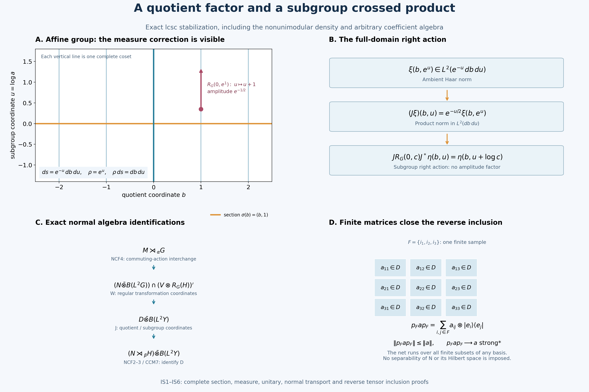

# Stabilization of a normal induced crossed product

*Self-checked by the writing AI. Original exposition and illustration: CC0-1.0; accompanying font terms retained.*

The quotient contributes a full operator factor. The subgroup contributes its own crossed product. The proof keeps the exact measures and the right action while these two factors are separated.

Throughout, \(G\) is a locally compact Hausdorff group with a countable base, \(H\leq G\) is closed, and \(\beta:H\to\operatorname{Aut}(N)\) is point-ultraweakly continuous on an arbitrary von Neumann algebra. No separability of \(N\), its predual or its standard Hilbert space is assumed. We use left Haar measures and

\[
 \int_G F(sr)\,ds=\Delta_G(r)^{-1}\int_G F(s)\,ds,\qquad
 \int_H f(hr)\,dh=\Delta_H(r)^{-1}\int_H f(h)\,dh. \tag{IS1}
\]

The zero coefficient algebra gives zero on both sides of the theorem. We henceforth take \(N\ne0\). The earlier inputs are [Quotient topology and compact integration, QF1–3](OA-FLOW-QF.md#qf-1), [Quotient measures and their translation cocycle](OA-FLOW-L43.md#oa-flow.qm.rho), [Compact neighborhoods and continuous cutoffs](OA-FLOW-TOPOLOGY.md#l138-h0), [Haar measure and integration, HR2–5](OA-FLOW-HR.md#hr-02), [Haar conventions and vector integration, Sections 3–4](OA-FLOW-L24.md#oa-flow.grp.translations), [Continuity of von Neumann algebra actions, AT1–6](OA-FLOW-AT.md#oa-flow.at.1), [Normal regular crossed products, NR1–4](OA-FLOW-NR.md#oa-flow.nr.1), [The crossed-product commutant, CCM7–8](OA-FLOW-CCM.md#ccm-7), and [Norm-controlled density, BD1/4/5](OA-FLOW-BD.md#oa-flow.bd.1). The earlier [NCF1–3 fixed-algebra and normal tensor proof](OA-FLOW-NCF.md#ncf-1) and [NCF4 commuting-action interchange](OA-FLOW-NCF.md#ncf-4) supply the actual normal identifications. IS1–IS6 prove every additional coordinate, section and tensor-factor step used here.

## IS0. The theorem and its concrete maps

Put \(Y=G/H\). Choose the strictly positive continuous \(\rho\) and the quotient Radon measure \(\mu_\rho\) from L43, so

\[
 \rho(sh)=\Delta_G(h)^{-1}\Delta_H(h)\rho(s),\qquad
 \int_G f(s)\rho(s)\,ds=\int_Y\int_H f(sh)\,dh\,d\mu_\rho(sH).
 \tag{IS2}
\]

The second formula is initially for \(f\in C_c(G)\). IS2 proves its complete Borel extension and the coordinate unitary. Define the induced algebra and the left action intrinsically by

\[
 B=N\bar\otimes L^\infty(G),\quad M=B^{\Theta(H)},\quad
 \Theta_h=\beta_h\otimes\rho_h,\quad \rho_h f(s)=f(sh),\quad
 \alpha_g=({\rm id}_N\otimes\lambda_g)|_M,\quad \lambda_g f(s)=f(g^{-1}s).
 \tag{IS3}
\]

There is a normal unital isomorphism

\[
 \boxed{M\rtimes_\alpha G\ \cong\
 (N\rtimes_\beta H)\bar\otimes B(L^2(Y,\mu_\rho)).}
 \tag{IS4}
\]

Here \(N\rtimes_\beta H\) is its faithful normal regular crossed product. This is an existence and stabilization theorem for the system defined in (IS3). It does not assert a converse from an arbitrary central quotient embedding or a classification of inducing systems.

The proof gives the maps, not only the abstract isomorphism class. Represent \(N\) in standard form on \(K\), with the strongly continuous canonical implementation \(V_h\) from NR1. The first normal isomorphism sends the regular coefficient generator of \(m\in M\subseteq B(K\otimes L^2G)\) to that same operator \(m\) on \(K\otimes L^2G\), and sends the group generator to \(1_K\otimes L_g\). The second is conjugation by \(1_K\otimes J_\sigma\), followed by reordering the \(K,H,Y\) factors, where

\[
 (J_\sigma\xi)(y,h)=\rho(\sigma(y)h)^{-1/2}\xi(\sigma(y)h),\qquad
 J_\sigma:L^2(G)\longrightarrow L^2(Y,\mu_\rho)\otimes L^2(H).
 \tag{IS5}
\]

IS1 constructs the Borel section \(\sigma\); IS2 proves that (IS5) is a unitary on the entire Hilbert space. No evaluation of a general nonseparable operator-valued field at \(\sigma(y)\) is part of the definition of these maps. The forward statement (IS4) is proved in IS3–IS6 and is not an earlier premise.

## IS1. A complete metric and a Borel coset section

A finite-word length gives a complete compatible metric. Let \((B_n)\) be a decreasing countable identity-neighborhood base. Put \(V_0=G\); choose a symmetric open \(V_1\subseteq B_1\) with compact closure. Continuity of multiplication and local compactness allow a recursive choice of symmetric open neighborhoods such that

\[
 V_{n+1}^3\subseteq V_n,\qquad V_{n+1}\subseteq B_{n+1}\quad(n\ge1).
 \tag{IS8}
\]

For \(x\in G\), let

\[
 \ell(x)=\inf\left\{\sum_{j=1}^m2^{-n_j}:
 x=x_1\cdots x_m,\ x_j\in V_{n_j},\ n_j\ge0\right\}.
 \tag{IS9}
\]

The empty word represents \(e\). \(V_0=G\) makes the length finite; reversal gives \(\ell(x^{-1})=\ell(x)\), and concatenating near-minimizing words gives \(\ell(xy)\le\ell(x)+\ell(y)\).

The essential word estimate is

\[
 \sum_j2^{-n_j}<2^{-n}\quad\Longrightarrow\quad x_1\cdots x_m\in V_n.
 \tag{IS10}
\]

Induct on word length simultaneously for all \(n\ge0\). For a longer word of cost \(S<2^{-n}\), take the letter whose cost interval contains \(S/2\). The costs strictly before and after it are at most \(S/2<2^{-(n+1)}\). Induction puts each shorter product in \(V_{n+1}\); the middle letter also has index at least \(n+1\). Their threefold product lies in \(V_n\) by (IS8); when \(n=0\), \(V_0=G\) gives the conclusion directly. The empty and one-letter cases are immediate. No factors are reordered.

Consequently \(\ell(x)<2^{-n}\) implies \(x\in V_n\), while \(x\in V_n\) implies \(\ell(x)\le2^{-n}\). The intersection of the \(V_n\)'s is \(\{e\}\). It follows that

\[
 d(x,y)=\ell(x^{-1}y),\qquad
 V_{n+1}\subseteq\{x:d(e,x)<2^{-n}\}\subseteq V_n
 \tag{IS11}
\]

is a compatible left-invariant metric. If a sequence is \(d\)-Cauchy, a tail lies in \(x_jV_1\), hence in its compact closure. To see the required compact-metric subsequence fact directly, an infinite sequence in a compact metric space has a cluster point: otherwise each point would have a neighborhood containing only finitely many sequence indices, and a finite subcover would give only finitely many indices in total. From a cluster point select successively later indices at distance below \(1/k\). This is a convergent subsequence. The Cauchy inequality then makes the entire sequence converge to that same point. Thus \(d\) is complete. A point selected in each nonempty basis member gives a countable dense set.

QF1 proves that \(q:G\to Y\) is open and continuous, \(Y\) is LCH, and its fibers are nonempty and closed. The images of a countable basis of \(G\) form a basis of \(Y\): if \(y\in O\subseteq Y\), choose a representative in the open inverse image of \(O\) and a basis neighborhood inside that inverse image. In particular \(Y\) has a countable base. Both \(G\) and \(Y\), and their open subspaces, have countable compact covers whose interiors cover the space. Indeed cover by relatively compact open neighborhoods and extract a countable subcover using the basis; finite unions of their compact closures give the cover. The same countable-base and local-compactness facts hold for the closed subgroup \(H\).

Choose a countable basis \((U_j)\) of nonempty relatively compact open subsets of \(G\) with arbitrarily small \(d\)-diameter and closure refinement. To obtain it, inside each member of an initial countable basis take small metric neighborhoods with compact closure contained in that member; for each integer diameter bound extract a countable subcover. Fix \(a_j\in U_j\). For \(y\in Y\) take \(j_1(y)\) to be the least \(j\) with \(y\in q(U_j)\) and \(\operatorname{diam}_d U_j<1/2\). Recursively take the least \(j=j_{k+1}(y)\) for which

\[
 y\in q(U_j),\qquad \overline U_j\subseteq U_{j_k(y)},\qquad
 \operatorname{diam}_d U_j<2^{-(k+1)}.
 \tag{IS12}
\]

There is always such a neighborhood around a point of the preceding open set in the closed fiber. The hitting condition \(y\in q(U_j)\) is open. Closure inclusion and the diameter bound are tests on fixed basis members. Partition by the countably many values of the preceding index and take the first admissible index. Induction shows that every \(j_k\), and hence every \(y\mapsto a_{j_k(y)}\), is Borel.

For fixed \(y\), later points lie in each preceding \(U_{j_k(y)}\). Their pairwise distances are below \(2^{-k}\), so they converge by completeness. Write their limit as \(\sigma(y)\). Alternatively the nested compact closures inside \(\overline U_{j_1(y)}\), with diameters tending to zero, give the same limit without requiring the metric's completeness. Each selected set meets the closed fiber; a point of that fiber in the set has distance below \(2^{-k}\) from \(a_{j_k(y)}\). Hence \(\sigma(y)\in q^{-1}(y)\).

The limit is Borel. For a nonempty closed \(F\subseteq G\), distance to \(F\) is continuous and

\[
 \sigma(y)\in F\quad\Longleftrightarrow\quad
 \lim_k d(a_{j_k(y)},F)=0,
 \tag{IS13}
\]

a countable Borel condition; the empty \(F\) is immediate. Closed sets generate the Borel sets of a metric space. Thus \(q\sigma={\rm id}_Y\) and \(\sigma\) is a Borel section. This proof needs no analytic separation, general uniformization or direct-integral generation theorem.

The map

\[
 \Phi_\sigma:Y\times H\longrightarrow G,\quad (y,h)\longmapsto\sigma(y)h,\qquad
 \Phi_\sigma^{-1}(s)=(q(s),\sigma(q(s))^{-1}s)
 \tag{IS14}
\]

is a Borel bijection with the displayed Borel inverse. The second inverse coordinate lies in \(H\). Products of these countably based spaces have the product Borel sigma-algebra: their open sets are countable unions of basis rectangles. This checks the measurability needed for the ensuing scalar product integrals directly.

## IS2. The whole measure identity and the right-subgroup unitary

The quotient measure \(\mu_\rho\) is locally finite and Radon by L43. Its countable compact cover, and the analogous cover of \(H\), make both measures sigma-finite. Form their product by HR5, patching finite compact portions; SC's countable monotone convergence makes the result independent of the exhaustion. Define a Borel measure on \(G\) by

\[
 \nu(E)=\int_Y\int_H1_E(\sigma(y)h)\,dh\,d\mu_\rho(y).
 \tag{IS15}
\]

Measurability follows from (IS14); positive scalar product integration gives countable additivity. For \(f\in C_c(G)\), the inner integral is \(Qf(y)\), independently of the chosen representative, so L43 (Q9) gives \(\nu(f)=\int_G f\rho\,ds\). Every compact \(C\subseteq G\) has a nonnegative compact continuous majorant equal to one on \(C\), by H0; consequently \(\nu(C)<\infty\). In fact \(\nu\) is locally finite, since every point has a relatively compact neighborhood.

Here is the regularity step that permits passage from continuous tests to all Borel sets. A finite Borel measure on a metric space is approximable between closed and open sets. For an open \(O\ne X\), the closed sets \(\{d(x,X\setminus O)\ge1/n\}\) increase to \(O\); for a closed \(F\), its open \(1/n\)-neighborhoods decrease to \(F\). Finite-measure continuity gives both approximations. The sets admitting, for every \(\epsilon>0\), closed \(F\subseteq E\subseteq O\) with measure of \(O\setminus F\) below \(\epsilon\) form a sigma-algebra. Complements preserve the condition. For a countable union choose open errors below \(\epsilon2^{-j-2}\), then use a sufficiently large finite initial union and its closed approximations to make the remaining measure below \(\epsilon/2\). Thus all Borel sets have this property. The case \(O=X\), and the empty closed set, are immediate.

For clarity this local argument suffices for \(\nu\) without assuming a complete metric on the quotient. Decompose \(G\) into a countable Borel partition \(E_j\), with each \(E_j\) contained in a relatively compact open set \(O_j\). Apply the finite metric-measure argument to the restriction on \(O_j\). Intersect its closed inner approximants with a countable compact exhaustion of \(O_j\) to make them compact. For any Borel \(E\), finite unions of these compact approximants give inner regularity of \(\nu(E)\). To obtain an open outer approximant when \(\nu(E)<\infty\), approximate each \(E\cap E_j\) by an open set relative to \(O_j\), with excess below \(\epsilon2^{-j}\). Their union is open in \(G\), contains \(E\), and has excess at most \(\epsilon\). Infinite-measure sets need no outer approximation. This proves that \(\nu\) is Radon in the conventions used here.

Radon uniqueness in HR2 now identifies \(\nu\) with \(\rho\,ds\). Simple functions followed by SC monotone convergence give

\[
 \int_G F(s)\rho(s)\,ds
 =\int_Y\int_H F(\sigma(y)h)\,dh\,d\mu_\rho(y)
 \qquad(F\ge0\text{ Borel}),
 \tag{IS16}
\]

including infinite values. The completions also agree under the Borel bijection: a Borel null set on one side has null inverse image, and each completed null subset lies in such a Borel null set. Thus these coordinate changes act on completed \(L^2\) spaces and their whole domains.

Apply (IS16) to \(F=|\xi|^2/\rho\). It proves that (IS5) is isometric. Its inverse on all square-integrable classes is

\[
 (J_\sigma^*\eta)(\sigma(y)h)
 =\rho(\sigma(y)h)^{1/2}\eta(y,h).
 \tag{IS17}
\]

The Borel inverse (IS14) and the equality of completed null ideals make this well-defined. The expressions are inverses, so \(J_\sigma\) is onto. Simple functions and L24's Hilbert tensor identification give the same unitary after tensoring with any Hilbert space \(K\); no separability of that extra factor is used.

For \(r\in H\), the density law in (IS2) gives

\[
 \begin{aligned}
 (J_\sigma R_G(r)\xi)(y,h)
 &=\Delta_G(r)^{1/2}\rho(\sigma(y)h)^{-1/2}\xi(\sigma(y)hr)\\
 &=\Delta_G(r)^{1/2}
 \left(\frac{\rho(\sigma(y)hr)}{\rho(\sigma(y)h)}\right)^{1/2}
 (J_\sigma\xi)(y,hr)\\
 &=\Delta_H(r)^{1/2}(J_\sigma\xi)(y,hr).
 \end{aligned}
 \tag{IS18}
\]

It follows on the entire Hilbert space that

\[
 J_\sigma R_G(r)J_\sigma^*=1_{L^2Y}\otimes R_H(r),\qquad
 (R_H(r)\eta)(h)=\Delta_H(r)^{1/2}\eta(hr).
 \tag{IS19}
\]

For completeness, put \(\kappa(g,y)=\sigma(gy)^{-1}g\sigma(y)\in H\). It is Borel and

\[
 \kappa(g_1g_2,y)=\kappa(g_1,g_2y)\kappa(g_2,y),\qquad
 (J_\sigma L_gJ_\sigma^*\eta)(y,h)
 =\left(\frac{\rho(g^{-1}\sigma(y))}{\rho(\sigma(y))}\right)^{1/2}
 \eta(g^{-1}y,\kappa(g^{-1},y)h).
 \tag{IS20}
\]

Substitute (IS17); the right-\(H\) density factors in numerator and denominator cancel. This is the image of the group generator in (IS4), with the factor reordering of IS6. Its unitarity and full domain follow from \(J_\sigma L_gJ_\sigma^*\).

## IS3. The induced system and its forward central quotient

On \(L^2G\) write

\[
 (L_g\xi)(s)=\xi(g^{-1}s),\qquad
 (R_r\xi)(s)=\Delta_G(r)^{1/2}\xi(sr).
 \tag{IS6}
\]

The Haar identities prove unitarity. Continuity on \(C_c(G)\), a common compact support near the identity, and the \(L^2\)-density in L24 prove strong continuity; unitarity extends it to all vectors. Left and right translations commute. On \(K\otimes L^2G\), \(\Theta_h\) is implemented by \(V_h\otimes R_h\), while \({\rm id}\otimes\lambda_g\) is implemented by \(1_K\otimes L_g\). Conjugation agrees with (IS3) on elementary tensors and hence on their spatial von Neumann closure. These are normal automorphisms. Their implementing unitaries are strongly continuous, so all vector coefficients of their bounded orbits are continuous. CP's square-summable-vector series, with a uniformly small tail, give point-ultraweak continuity. AT then supplies the corresponding predual-norm and bounded strong-star continuity statements.

The \(\Theta_h\)'s commute with \({\rm id}\otimes\lambda_g\). Their fixed algebra is ultraweakly closed and closed under adjoints and products; it contains the identity. It is therefore a von Neumann algebra. The left action restricts normally and continuously to it. This constructs the normal induced system for arbitrary \(N\), using no decomposable-field theorem.

IS2 identifies multiplication by \(F\circ q\), \(q(s)=sH\), with multiplication by \(F(y)\) on \(L^2(Y)\otimes L^2H\). Thus

\[
 L^\infty(Y,\mu_\rho)\longrightarrow Z(M),\qquad
 F\longmapsto1_N\otimes M_{F\circ q}
 \tag{IS7}
\]

is a faithful normal unital embedding: in those coordinates it is the usual scalar tensor amplification, whose normality follows by the vector-series test. Right translation fixes \(F\circ q\), so it belongs to \(M\); it is central already in \(B\). Left translation sends it to \(F(g^{-1}sH)\). This proves the forward central-quotient assertion, without making any converse or uniqueness assertion. The coordinate fact used in this paragraph is proved in IS2; no conclusion of IS3 is an input to that proof.

## IS4. The regular transformation calculation

On \(L^2(G_s\times G_t)\), the faithful regular representation of \(L^\infty(G)\rtimes G\) has

\[
 (\Pi(f)\zeta)(s,t)=f(ts)\zeta(s,t),\qquad
 (\Lambda_g\zeta)(s,t)=\zeta(s,g^{-1}t).
 \tag{IS21}
\]

Define

\[
 (W\zeta)(s,t)=\Delta_G(t)^{-1/2}\zeta(t,st^{-1}),\qquad
 (W^*\zeta)(s,t)=\Delta_G(s)^{1/2}\zeta(ts,s).
 \tag{IS22}
\]

These are inverse Borel changes of variables. For fixed \(t\), set \(r=st^{-1}\), so \(s=rt\) and \(ds=\Delta_G(t)\,dr\). Scalar product integration gives

\[
 \int_{G^2}\Delta_G(t)^{-1}|\zeta(t,st^{-1})|^2\,ds\,dt
 =\int_{G^2}|\zeta(t,r)|^2\,dr\,dt.
 \tag{IS23}
\]

Thus \(W\) is unitary on all \(L^2\), with the stated inverse. Tensoring with \(K\) gives the corresponding unitary for arbitrary \(K\); L24 Section4 verifies the tensor identification and density passages. Direct substitution yields

\[
 W\Pi(f)W^*=M_f\otimes1,\qquad
 W\Lambda_gW^*=L_g\otimes1,\qquad
 W(R_h\otimes1)W^*=R_h\otimes R_h.
 \tag{IS24}
\]

The last operator is \(\zeta(s,t)\mapsto\Delta_G(h)\zeta(sh,th)\); both right regular square roots are present. In the first two formulas the \(W,W^*\) factors cancel, leaving \(s\) and \(g^{-1}s\) respectively. Boundedness extends the identities from compact continuous tests to all vectors.

Here is the full scalar generation argument. Haar measure on \(G\) is sigma-finite by its countable compact cover. Partition \(G\) into countably many Borel sets \(E_n\) of finite measure. If \(A\in B(L^2G)\) commutes with every multiplication operator, it preserves \(L^2(E_n)\). Put \(k_n=A1_{E_n}\). For bounded \(f\) supported on \(E_n\), \(Af=fk_n\). Testing indicators of \(\{|k_n|>\|A\|+\epsilon\}\cap E_n\) gives \(|k_n|\le\|A\|\) almost everywhere. Simple functions, truncation and the countable partition show \(A=M_k\), where \(k\) has restrictions \(k_n\). Null partition members cause no issue.

If \(M_k\) also commutes with all \(L_g\), then \(k(g^{-1}s)=k(s)\) almost everywhere for each fixed \(g\). Choose a bounded Borel representative and \(a\in C_c(G)_+\) with \(\int a=1\). Scalar product integration gives

\[
 F(s)=\int_G a(g)k(g^{-1}s)\,dg=k(s)\quad\text{for almost every }s.
 \tag{IS25}
\]

This uses sigma-finite Fubini with the finite compact support of \(a\), not a common exceptional set for all \(g\). Substitution \(g=uv\) gives

\[
 |F(us)-F(s)|\le\|k\|_\infty\,\|a(u\,\cdot)-a\|_1.
 \tag{IS26}
\]

The last norm tends to zero by L24, so \(F\) is continuous. For each fixed \(u\), its almost-everywhere equality with \(k\) gives \(F(us)=F(s)\) almost everywhere. Both sides are continuous and every nonempty open set has positive Haar measure by HR7. Therefore equality holds everywhere. This holds for each \(u\); taking \(u=s^{-1}\) makes \(F\) constant. The common commutant is \(\mathbb C1\). BD1's bicommutant theorem yields

\[
 (M_{L^\infty G}\cup L(G))''=B(L^2G),\qquad
 W(L^\infty(G)\rtimes G)W^*=B(L^2G)\otimes1.
 \tag{IS27}
\]

## IS5. From the transformation algebra to the subgroup commutant

The complete [NCF4 interchange proof](OA-FLOW-NCF.md#ncf-4), applied to the commuting actions \(\Theta\) and \({\rm id}\otimes\lambda\) on \(B\), gives the natural normal isomorphism

\[
 M\rtimes_\alpha G\ \cong\ (B\rtimes_{{\rm id}\otimes\lambda}G)^{\widetilde\Theta(H)}.
 \tag{IS28}
\]

Its generator map includes the regular coefficient operators and fixes the group generators. It uses the complete CCM commutant and normal finite-matrix slice proofs, rather than an average over \(H\). In particular it holds when \(H\) has infinite Haar measure. NCF4 proves this equality in the common regular representation with precisely these generator maps. Its arbitrary-group scope includes the present lcsc groups.

Represent \(B\rtimes G\) on \(K\otimes L^2(G_s)\otimes L^2(G_t)\). Its elementary coefficient generator is \(x\otimes\Pi(f)\); its group generator is \(1_K\otimes\Lambda_g\). Normality of the coefficient map is NR3. The generated algebra is \(N\bar\otimes(L^\infty G\rtimes G)\): it contains \(N\otimes1\) and the scalar transformation generators, and BD4/5 extends from elementary tensors by bounded strong-star approximation. The extended \(\Theta_h\) is implemented on this regular space by \(V_h\otimes R_h\otimes1\). It sends \(x\otimes\Pi(f)\) to \(\beta_h(x)\otimes\Pi(f(\,\cdot\,h))\) and fixes \(\Lambda_g\). This identifies the action on the entire generated algebra.

Conjugating by \(1_K\otimes W\), (IS24) and (IS27) give

\[
 (1_K\otimes W)(B\rtimes G)(1_K\otimes W)^*
 =N\bar\otimes B(L^2G)\otimes1_{L^2G},
 \tag{IS29}
\]

and the right unitary becomes \(V_h\otimes R_h\otimes R_h\). Its fixed algebra is therefore \(\mathcal A_G\otimes1\), where

\[
 \mathcal A_G=(N\bar\otimes B(L^2G))\cap
 \{V_h\otimes R_G(h):h\in H\}'.
 \tag{IS30}
\]

Removing the spectator identity factor is a faithful normal isomorphism: vector coefficients of \(a\otimes1\) are sums of those of \(a\), and a single unit vector in the spectator factor gives a normal inverse slice. This is not asserted to be a unitary identification of unamplified Hilbert spaces.

For general \(m\in M\), its coefficient image after \(W\) is \(m\otimes1\). This holds first on elementary tensors of \(B\), then on the whole \(B\) by the normal coefficient map and BD's bounded ultraweak approximation. The group image is \(1_K\otimes L_g\otimes1\). This proves the first generator map in IS0 without pointwise field evaluation.

## IS6. The tensor factor and the full normal isomorphism

Conjugate (IS30) by \(1_K\otimes J_\sigma\), and reorder \(K,Y,H\) to \(K,H,Y\). By (IS19), it becomes

\[
 \bigl(N\bar\otimes B(L^2H)\bar\otimes B(L^2Y)\bigr)
 \cap\{V_h\otimes R_H(h)\otimes1:h\in H\}'.
 \tag{IS31}
\]

Put

\[
 D=(N\bar\otimes B(L^2H))\cap\{V_h\otimes R_H(h):h\in H\}'.
 \tag{IS32}
\]

We prove that (IS31) equals \(D\bar\otimes B(L^2Y)\). Choose an orthonormal basis \((e_i)_{i\in I}\) of \(L^2Y\); the proof works even for an arbitrary index set. If \(a\) is in (IS31), its normal matrix slices \(a_{ij}\) belong to \(N\bar\otimes B(L^2H)\). To check this membership, approximate \(a\) in the bounded strong-star topology by elementary tensors of the displayed spatial algebra. A slice is compression between fixed coordinate isometries, so it preserves strong convergence and norm bounds; the first-factor algebra is strongly closed. Testing the commutation on those same vectors gives \((V_h\otimes R_H(h))a_{ij}=a_{ij}(V_h\otimes R_H(h))\), so \(a_{ij}\in D\). For finite \(F\subset I\),

\[
 (1\otimes p_F)a(1\otimes p_F)
 =\sum_{i,j\in F}a_{ij}\otimes |e_i\rangle\langle e_j|
 \in D\bar\otimes B(L^2Y).
 \tag{IS33}
\]

Over all finite subsets, \(p_F\to1\) strongly because finite basis spans are dense. These compressions have norm at most \(\|a\|\) and converge strongly, together with their adjoints, to \(a\). Strong closedness gives one inclusion. Conversely every elementary tensor from \(D\otimes B(L^2Y)\) belongs to (IS31), and commutation and membership persist in the bounded strong limits defining its spatial closure. This gives the other inclusion. No separability of \(K\) or \(N\) was used.

NR1 makes \(V_h\) strongly continuous. [NCF2–3](OA-FLOW-NCF.md#ncf-2), deduced from the full CCM7 theorem and applied to \((N,H,\beta)\), gives in the faithful normal regular model

\[
 D=N\rtimes_\beta H,\qquad
 [\pi_\beta(x)\eta](h)=\beta_{h^{-1}}(x)\eta(h),\qquad
 [\lambda^H_r\eta](h)=\eta(r^{-1}h).
 \tag{IS34}
\]

The hypotheses match arbitrary \(N\); no faithful state or separable standard representation is substituted. Combining (IS28)–(IS34) proves (IS4) and its maps in IS0. The identifications have normal inverses: explicit unitary conjugation, the spectator slice and the spatial tensor membership just proved. NR4 removes dependence on the initial faithful normal representation in the abstract crossed products.

## IS7. Changes of coordinates and exact examples

For a second Borel section \(\sigma'\), the map \(k(y)=\sigma(y)^{-1}\sigma'(y)\in H\) is Borel and \(\sigma'(y)=\sigma(y)k(y)\). Direct substitution gives

\[
 J_{\sigma'}=T_kJ_\sigma,\qquad (T_k\eta)(y,h)=\eta(y,k(y)h).
 \tag{IS35}
\]

Left Haar invariance makes \(T_k\) unitary; left multiplication by \(k(y)\) commutes with every right translation \(R_H(r)\). Measurability follows from (IS14), and the norm calculation extends to completed classes by (IS16). Changing the section conjugates the stabilization by a unitary normalizing the subgroup commutant.

If \(\rho'\) is a second strictly positive continuous density with the same law, then \(\rho'=(b\circ q)\rho\) for continuous \(b>0\) on \(Y\), and L43 gives \(\mu_{\rho'}=b\mu_\rho\). Multiplication by \(b^{-1/2}\) is a unitary \(L^2(Y,\mu_\rho)\to L^2(Y,\mu_{\rho'})\). Formula (IS5) shows that it carries \(J_\sigma^\rho\) to \(J_\sigma^{\rho'}\). Exact numerical measures control this coordinate change.

Here is the scalar parameter passage used in both examples below. For a bounded Borel function \(k(x,y)\) invariant almost everywhere under every fixed translation of \(x\), smooth in that variable with one \(a\in C_c(\mathbb R)_+\), \(\int a=1\). Product Fubini gives \(F=k\) almost everywhere jointly, as in (IS25). The translated-kernel estimate (IS26) makes \(F(\cdot,y)\) continuous for every \(y\) after choosing a globally bounded representative. For each rational \(r\), invariance gives \(F(x+r,y)=F(x,y)\) almost everywhere jointly. Fubini and a countable intersection in \(r\) give a conull set of \(y\)'s on which these equalities hold for almost every \(x\). Continuity extends them to every \(x\), and density of the rational translations makes the function constant in \(x\). Its constant value \(F(0,y)\) is Borel. Thus invariant multipliers are precisely the functions of \(y\), without an uncountable exceptional-set intersection.

For \(G=\mathbb R_x\times\mathbb R_y\), \(H=\mathbb R_x\times\{0\}\), \(N=\mathbb C\) with trivial action, take \(\sigma(y)=(0,y)\), \(\rho=1\), \(\mu_\rho=dy\). The induced algebra is \(L^\infty(\mathbb R_y)\). Indeed the multiplier-invariance proof of IS4, applied to the horizontal coordinate and scalar Fubini, makes each invariant multiplier independent of that coordinate almost everywhere. Then

\[
 M\rtimes G\cong\operatorname{VN}(\mathbb R_x)\bar\otimes B(L^2(\mathbb R_y)).
 \tag{IS36}
\]

The horizontal subgroup acts trivially on the quotient; the vertical translation crossed product is the full operator algebra by IS4. The subgroup is closed, noncompact and not open.

For a nonunimodular check, use the affine group

\[
 G=\{(b,a):b\in\mathbb R,\ a>0\},\qquad
 (b,a)(c,r)=(b+ac,ar),\qquad
 ds=\frac{db\,da}{a^2},\qquad \Delta_G(b,a)=a^{-1}.
 \tag{IS37}
\]

For a fixed left multiplier \((b_0,a_0)\), the map \((b,a)\mapsto(b_0+a_0b,a_0a)\) has determinant \(a_0^2\), which cancels the factor \((a_0a)^2\) in the Haar denominator. Thus the stated measure is left invariant. Right multiplication by \((c,r)\) maps \((b,a)\) to \((b+ac,ar)\), with determinant \(r\). The measure of the image of a Borel set is therefore \(r^{-1}\) times its measure. Equivalently, integrating a function composed with that right multiplication multiplies its integral by \(r\). This is exactly (IS1) with \(\Delta_G(c,r)=r^{-1}\). The change formulas hold first on nonnegative Borel functions and hence on every integrable function; no unimodularity convention is suppressed. These identities can alternatively be checked by successive one-variable substitutions from [SC8](OA-FLOW-SC.md#sc-08), first in \(b\) at fixed \(a\), then in \(a\). For the left map their two scalar factors are \(a_0^{-1}\) and \(a_0\); for the right composition they are \(1\) and \(r\). Thus no general multivariable change-of-variables theorem is imported.

Let \(H=\{(0,r):r>0\}\), \(dh=dr/r\), \(\Delta_H=1\). Right multiplication by \((0,r)\) fixes \(b\) and multiplies \(a\) by \(r\). Thus \(Y=\mathbb R_b\), \(\sigma(b)=(b,1)\), \(\rho(b,a)=a\), \(\mu_\rho=db\), and

\[
 \rho\,ds=db\,\frac{da}{a},\qquad
 (J\xi)(b,r)=r^{-1/2}\xi(b,r),\qquad
 JR_G(0,c)J^*\eta(b,r)=\eta(b,rc).
 \tag{IS38}
\]

The ambient factor \(c^{-1/2}\) cancels the density ratio \(c^{1/2}\). For \(N=\mathbb C\) with trivial action, the induced algebra is \(L^\infty(\mathbb R_b)\). In \(u=\log a\) coordinates it is the multiplier algebra fixed by every translation of \(u\); IS4's smoothing argument and scalar Fubini prove independence of \(u\) almost everywhere. Its left action is \(F(b)\mapsto F((b-b_0)/a_0)\). Thus

\[
 L^\infty(\mathbb R)\rtimes G\cong
 \operatorname{VN}(\mathbb R_{>0})\bar\otimes B(L^2(\mathbb R)).
 \tag{IS39}
\]

Here \(\operatorname{VN}\) is the subgroup's left regular algebra; no Fourier classification is being used.

## IS8. Exercises with solutions

**Exercise1.** Replace \(r^{-1/2}\) in (IS38)'s \(J\) by \(1\). What fails?

**Solution.** The product measure is \(db\,dr/r\), while ambient Haar is \(db\,dr/r^2\). The unweighted map has squared norm \(\int|\xi(b,r)|^2db\,dr/r\), rather than the Haar squared norm. It is not isometric. Its conjugated right translation also retains the incorrect scalar \(c^{-1/2}\); the correct \(H\) action has \(\Delta_H=1\).

**Exercise2.** Why can IS6 use an uncountable basis without intersecting an uncountable family of conull sets?

**Solution.** The slices are bounded operators rather than pointwise field representatives. Each finite matrix compression belongs to the algebra, and the net of all finite compressions converges strongly. No exceptional set is selected or intersected.

**Exercise3.** Does (IS7) prove that every system with a central quotient embedding is induced?

**Solution.** No. It is a forward property of the already defined fixed algebra (IS3). Recovering fibers from an arbitrary embedding requires a separate recognition theorem with exact measurable generation and representation-independence hypotheses. That converse is not used in (IS28)–(IS34).

Further reading: M. Takesaki, [*Theory of Operator Algebras II*](https://doi.org/10.1007/978-3-662-10451-4), Definition X.4.10 and Theorem X.4.12, pp.301 and 303–305.

## What the stabilization separates

[Native figure](../assets/induced-stabilization/assets/induced-stabilization.png), [editable SVG](../assets/induced-stabilization/assets/induced-stabilization.svg), [reproduction source](../assets/induced-stabilization/render_induced_stabilization.py), [exact coordinate data](../assets/induced-stabilization/figure-data.json).

**A. The ambient and quotient coordinates.** The plotted example is the affine group of [IS7](OA-FLOW-IS.md#is-7), with \(N=\mathbb C\), trivial subgroup action and

\[
 (b,a)(c,r)=(b+ac,ar),\qquad H=\{(0,r):r>0\},\quad Y=\mathbb R_b.
 \tag{ISF1}
\]
The plane is drawn in coordinates \((b,u)\), \(u=\log a\), not in the Euclidean coordinates \((b,a)\). Left Haar measure and the chosen quotient density are

\[
 ds=e^{-u}\,db\,du,\qquad \Delta_G(b,e^u)=e^{-u},\qquad
 \rho(b,e^u)=e^u,\qquad \rho\,ds=db\,du.
 \tag{ISF2}
\]
The vertical lines are windows in complete cosets. The line \(b=0\) is \(H\); the horizontal line \(u=0\) is the actual section \(\sigma(b)=(b,1)\). The arrow has \(b=1\), starts at \(u=0.35\), and ends at \(u=1.35\). It is right multiplication by \((0,\exp(1))\). The geometric coordinate rises by one; the ambient right regular operator has the separate amplitude \(\exp(-1/2)\). This amplitude is a Hilbert norm correction, not a length assigned to the arrow.

**B. The unitary and its entire domain.** Identifying \(L^2(H,dr/r)\) with \(L^2(\mathbb R,du)\) by \(r=e^u\), [IS2](OA-FLOW-IS.md#is-2) gives

\[
 J:L^2(G,db\,da/a^2)\longrightarrow L^2(\mathbb R^2,db\,du),
 \qquad (J\xi)(b,u)=e^{-u/2}\xi(b,e^u).
 \tag{ISF3}
\]
The inverse is \((J^*\eta)(b,a)=a^{1/2}\eta(b,\log a)\). Both maps are defined on all square-integrable classes, including their completed null ideals. Their norm equality is

\[
 \int |J\xi(b,u)|^2\,db\,du
 =\int |\xi(b,e^u)|^2e^{-u}\,db\,du.
 \tag{ISF4}
\]
For every \(c>0\), substitution gives

\[
 JR_G(0,c)J^*\eta(b,u)=\eta(b,u+\log c).
 \tag{ISF5}
\]
The scalar \(c^{-1/2}\) of \(R_G\) is canceled by the density ratio \(c^{1/2}\). The subgroup is unimodular, so its own right action has no amplitude. This calculation proves the labels in B without a unimodularity assumption on \(G\).

**C. The normal isomorphisms.** The ladder is the general theorem at its stated lcsc scope, rather than a dimension count for the plotted example. Let \(N\) be arbitrary, let \(V_h\) be its canonical standard implementation, and let \(M\) be the actual induced fixed algebra of [IS3](OA-FLOW-IS.md#is-3). [NCF4](OA-FLOW-NCF.md#ncf-4) passes its commuting right action through the regular crossing. The full unitary \(W\), its Haar scalar and the spectator slice are proved in [IS4–5](OA-FLOW-IS.md#is-4). They identify the crossing with

\[
 (N\bar\otimes B(L^2G))\cap\{V_h\otimes R_G(h):h\in H\}'.
 \tag{ISF6}
\]
The whole-domain \(J_\sigma\) of IS2 turns \(R_G(h)\) into \(1\otimes R_H(h)\). Reordering factors gives

\[
 D\bar\otimes B(L^2Y),\qquad
 D=(N\bar\otimes B(L^2H))\cap\{V_h\otimes R_H(h):h\in H\}'.
 \tag{ISF7}
\]
[NCF2–3](OA-FLOW-NCF.md#ncf-2), using the entire CCM commutant theorem, gives \(D=N\rtimes_\beta H\). No Haar average over a noncompact subgroup, decomposable-field theorem or central-embedding converse is used.

**D. Why the factorization has both inclusions.** [IS6](OA-FLOW-IS.md#is-6) slices by any orthonormal basis \((e_i)\) of \(L^2Y\). For an operator \(a\) commuting with \(V_h\otimes R_H(h)\otimes1\), each slice \(a_{ij}\) belongs to \(D\). For every finite set \(F\) of basis indices,

\[
 (1\otimes p_F)a(1\otimes p_F)
 =\sum_{i,j\in F}a_{ij}\otimes|e_i\rangle\langle e_j|,
 \qquad \|(1\otimes p_F)a(1\otimes p_F)\|\le\|a\|.
 \tag{ISF8}
\]
The figure suppresses the identity in the first factor in its \(p_Fap_F\) notation. The compressions converge strongly together with their adjoints over the directed set of **all** finite \(F\)'s. Strong closedness gives one inclusion; elementary tensors of \(D\) and \(B(L^2Y)\) give the other. The displayed \(3\times3\) array is a symbolic sample for \(F=\{i_1,i_2,i_3\}\), with \(a_{jk}\) abbreviating \(a_{i_j i_k}\). It is not a numerical operator, an assertion that the Hilbert space has three basis vectors, or a countability assumption on the coefficient algebra.

In the affine example the final algebra is \(\operatorname{VN}(\mathbb R_{>0})\bar\otimes B(L^2(\mathbb R_b))\). For the separate additive-plane example \(G=\mathbb R_x\times\mathbb R_y\), \(H=\mathbb R_x\times\{0\}\), it is \(\operatorname{VN}(\mathbb R_x)\bar\otimes B(L^2(\mathbb R_y))\). Both subgroups are closed, noncompact and not open. The theorem applies to the induced system defined in IS3.

The classical mathematical source is M. Takesaki, [*Theory of Operator Algebras II*](https://doi.org/10.1007/978-3-662-10451-4), Theorem X.4.12, pp.303–305. This original figure and its code/data are CC0-1.0 to the extent of rights held. The native PNG is \(3600\times2400\); the editable SVG and reproduction source above retain all coordinates and labels.
