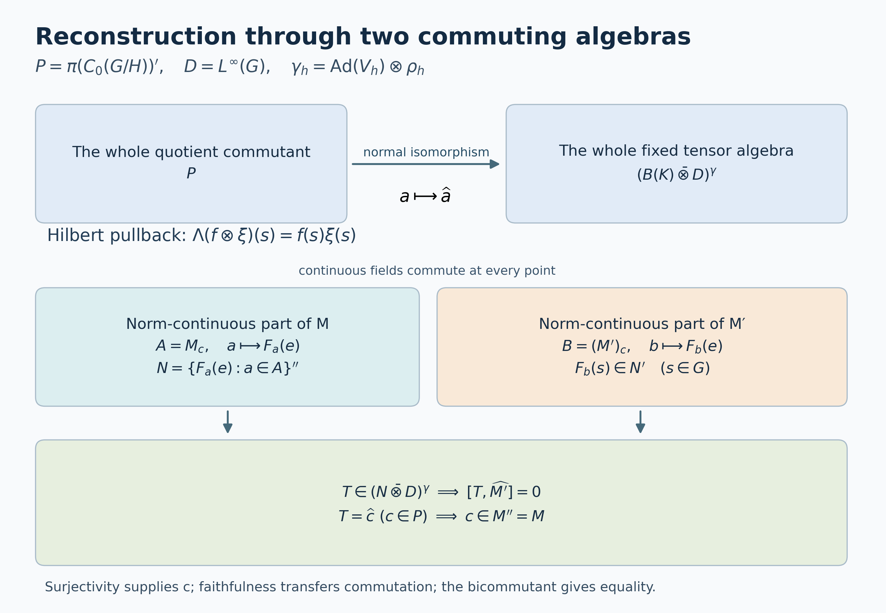

# Pulling a central quotient back to the group

*Self-checked by the writing AI.*

Let \(G\) be a locally compact Hausdorff group, \(H\subseteq G\) a closed subgroup, and \(Y=G/H\). Suppose a nonzero von Neumann algebra \(M\) carries a point-ultraweakly continuous action \(\alpha\) by normal automorphisms and a specified normal faithful unital embedding
\[
 \iota:L^\infty(Y)\longrightarrow Z(M),\qquad
 \alpha_t(\iota(F))=\iota(F(t^{-1}\,\cdot)).
 \tag{IW1}
\]
We prove that there are a von Neumann algebra \(N\), a point-ultraweakly continuous \(H\)-action \(\beta\), and a normal isomorphism, with normal inverse,
\[
 \Theta:M\longrightarrow
 \bigl(N\bar\otimes L^\infty(G)\bigr)^{\beta_h\otimes\rho_h,\ h\in H},
 \qquad(\rho_h f)(s)=f(sh),
 \tag{IW2}
\]
which carries \(\alpha\) to left translation and carries the specified \(\iota(F)\) to \(1_N\otimes(F\circ q)\), where \(q(s)=sH\).

There is no countability or multiplicity restriction. We construct \(N\) after fixing a faithful normal spatial representation of \((M,\alpha)\), and describe exactly how it is recovered there. No uniqueness statement comparing different central embeddings is part of this theorem.

The measure conventions are those of [Quotient measure and the subgroup modular correction](OA-FLOW-L43.md#oa-flow.qm.setting): inner-regular Haar and quotient measures, with local null sets and their completions. For \(L^\infty\), use the canonical bounded locally measurable classes of [HR9](OA-FLOW-HR.md#hr-09), equivalently the scalar multiplication von Neumann algebra proved below. On an arbitrary disjoint union of open sigma-compact pieces this is the bounded product of the piecewise \(L^\infty\) spaces. It is not a claim about an arbitrary outer-regular global Borel extension.

Our main earlier inputs are the arbitrary-Hilbert-space [induced representation](OA-FLOW-L44.md#oa-flow.ind.setting), its [converse](OA-FLOW-L45.md#oa-flow.impr.setting), and its [continuous evaluation vectors](OA-FLOW-L46.md#oa-flow.iint.smooth). [QF1–7](OA-FLOW-QF.md#qf-1) supply compact extension, finite partitions, quotient averaging and finite-carrier integration. The elementary operator inputs are [Hilbert projections and completion](OA-FLOW-CF.md#oa-flow.cf.8), [the concrete predual and its vector series](OA-FLOW-CP.md#oa-flow.cp.4), [bounded strong density](OA-FLOW-BD.md#oa-flow.bd.1), [the normal-image theorem](OA-FLOW-ST12.md#oa-flow.st.2), and [the arbitrary matrix-entry tensor proof](OA-FLOW-NCF.md#ncf-1). [AT3](OA-FLOW-AT.md#oa-flow.at.3) turns point-ultraweak action continuity into norm continuity of every predual orbit, and [NR1](OA-FLOW-NR.md#oa-flow.nr.1) then supplies a faithful normal representation with strongly continuous implementing unitaries.

The proof has two main constructions. A Hilbert-space pullback identifies every operator commuting with quotient multiplication with a right-\(H\)-fixed tensor operator over \(G\). Scalar convolution then makes norm-action-continuous operators into genuine continuous functions. Applying both constructions to \(M\) and to \(M'\) proves the reverse inclusion in (IW2).

## Scalar multiplication at arbitrary cardinality

We first establish the scalar algebra needed for the pullback. Let \(X\) be a topological disjoint union of open-and-closed sigma-compact locally compact spaces \(X_j\), carrying a locally finite inner-regular measure. This includes \(G\) and \(Y\) by [QF3](OA-FLOW-QF.md#qf-3). Write
\[
 L^2(X)=\bigoplus_j L^2(X_j),\qquad
 D_X=\prod_j L^\infty(X_j)
 \tag{IW3}
\]
as multiplication operators. Every vector has at most countably many nonzero components: for each positive integer \(n\), only finitely many component norms can exceed \(1/n\). The inner-regular integral agrees with this Hilbert direct sum, first for compactly supported functions and then by completion.

**Scalar multiplier lemma.** Multiplication by \(C_0(X)\) generates \(D_X\), and \(D_X'=D_X\) on \(L^2(X)\). Its concrete predual is
\[
 (D_X)_*=L^1(X)=\bigoplus\nolimits_j^{\,1}L^1(X_j).
 \tag{IW4}
\]

Here are proofs of all three assertions. On one sigma-compact piece choose a measurable function \(w>0\) everywhere with \(w\in L^2\): a compact exhaustion gives a countable measurable partition into finite-measure sets; put a sufficiently small positive constant on each set. Empty or null pieces are harmless. The measure \(|w|^2\,d\mu\) is finite and regular by [QF7](OA-FLOW-QF.md#qf-7).

For any measurable set \(E\), its indicator is a strong limit of compact continuous multipliers bounded between zero and one. To see this on finitely many \(L^2\) vectors \(\xi_1,\ldots,\xi_n\), use the finite regular measure
\(\nu=\sum_r|\xi_r|^2\mu\). Choose compact \(K\subset E\) and open \(O\supset E\) with both \(\nu(E\setminus K)\) and \(\nu(O\setminus E)\) small. A compact bump \(b\), equal to one on \(K\) and supported in \(O\), satisfies
\[
 \sum_r\|(b-1_E)\xi_r\|_2^2
 \le \nu(E\setminus K)+\nu(O\setminus E).
 \tag{IW5}
\]
Completed measurable sets are treated after discarding a Borel null superset. Directing the finite vector tests and the errors proves the asserted strong approximation. The same regularity proof shows that \(C_c(X_j)w\) is dense in \(L^2(X_j)\): bounded simple functions are dense in \(L^2(|w|^2\mu)\), their indicators have the just-described continuous approximants, and truncating \(u/w\) approximates any \(u\in L^2(\mu)\).

If \(T\) commutes with the compact continuous multipliers on \(X_j\), it therefore commutes with every \(1_E\). Set \(g=(Tw)/w\). For every \(E\),
\[
 \int_E|g|^2|w|^2\,d\mu
 =\|1_ETw\|_2^2
 =\|T1_Ew\|_2^2
 \le\|T\|^2\int_E|w|^2\,d\mu.
 \tag{IW6}
\]
Applying this to \(\{|g|>\|T\|+\varepsilon\}\) gives \(|g|\le\|T\|\) almost everywhere. On the dense set \(C_c(X_j)w\), commutation gives \(T(fw)=fgw\). Hence \(T\) is multiplication by \(g\).

On the whole space, the projection onto \(L^2(X_j)\) is a strong limit of compact cutoffs supported in \(X_j\); the density argument above proves this on each vector. Every operator commuting with \(C_0(X)\) must therefore preserve every such summand. The one-piece result makes it a bounded family of scalar multipliers. Conversely every such family commutes with \(C_0(X)\). Consequently \(C_0(X)'=D_X\). Since \(D_X\) is abelian and contains \(C_0(X)\), its commutant equals itself, and \(C_0(X)''=D_X\).

Finally CP4–6 describes every normal functional on \(D_X\) by a vector series. Its density is
\[
 h=\sum_n \xi_n\overline{\eta_n}\in L^1(X),\qquad
 \|h\|_1\le
 \left(\sum_n\|\xi_n\|_2^2\right)^{1/2}
 \left(\sum_n\|\eta_n\|_2^2\right)^{1/2}.
 \tag{IW7}
\]
Conversely every \(h\in L^1(X)\) factors as \(\xi\overline\eta\), with
\(\eta=|h|^{1/2}\), \(\xi=(h/|h|)|h|^{1/2}\), and zero values where \(h=0\). It gives a vector functional. Testing against the bounded phase \(\overline h/|h|\) shows that its functional norm is \(\|h\|_1\). Thus (IW4) is an onto isometric identification with the actual concrete predual. This proves the \(L^\infty\)-\(L^1\) dual convention without importing a non-sigma-finite Radon–Nikodym theorem.

The locally measurable convention can also be given Borel representatives when needed: [QF6](OA-FLOW-QF.md#qf-6) performs the simultaneous compact Lusin construction on the open-and-closed pieces. We use the product algebra (IW3), rather than assuming that an arbitrary uncountable union of chosen Borel representatives is Borel.

For any Hilbert space \(K\), the matrix-entry proof in NCF1, with the tensor factors exchanged, now gives
\[
 (1_K\otimes D_X)'=B(K)\bar\otimes D_X.
 \tag{IW8}
\]
Explicitly, entries of an operator in a basis of \(K\) commute with \(D_X\), hence belong to \(D_X\) by the scalar lemma. Finite matrix compressions belong to the spatial tensor product, are bounded by the original norm, and converge strongly-star. This proves (IW8) at arbitrary basis cardinality.

We will also need the normal quotient pullback. With the positive continuous \(\rho\) and \(\mu_\rho\) from L43, set
\[
 P f=Q(f/\rho),\qquad f\in C_c(G).
 \tag{IW9}
\]
The quotient formula gives \(\|Pf\|_{L^1(Y)}\le\|f\|_{L^1(G)}\), since \(|Q(f/\rho)|\le Q(|f|/\rho)\). Compact continuous functions are dense in \(L^1(G)\): an integrable density has a countable compact carrier by QF7, and finite regularity and compact bumps approximate simple functions there. Thus \(P\) extends to a contraction \(L^1(G)\to L^1(Y)\). Its dual is the normal unital homomorphism
\[
 J:L^\infty(Y)\longrightarrow D_G,\qquad J(F)=F\circ q.
 \tag{IW10}
\]
The formula follows first on continuous compact tests from L43 and then on bounded measurable functions by uniqueness of the finite pushed-forward Radon measures. Local classes follow by the preceding piecewise convention. It is multiplicative by the pullback formula, and faithful by L43's exact null-set equivalence \(E\) null in \(Y\) if and only if \(q^{-1}(E)\) is locally Haar-null. All normality in (IW10) follows from the explicit preadjoint \(P\).

## Continuous representatives from scalar convolution

Put \(\mathcal T=B(K)\bar\otimes D_G\), acting on \(K\otimes L^2(G)=L^2(G,K)\). On this Hilbert space set
\[
 (\ell_t\zeta)(s)=\zeta(t^{-1}s),\qquad
 \tau_t=\operatorname{Ad}(1_K\otimes\ell_t).
 \tag{IW11}
\]
Left translation is strongly continuous by L24. Consequently \(\tau\) is point-ultraweakly continuous. The predual orbit of every vector functional is norm continuous: move both vectors by the implementing unitary and use
\(\|\omega_{\xi,\eta}-\omega_{\xi',\eta'}\|
\le\|\xi-\xi'\|\|\eta\|+\|\xi'\|\|\eta-\eta'\|\).
CP4's vector-series tail estimate gives the same conclusion for every normal functional.

For \(T\in\mathcal T\) and \(f\in C_c(G)\), the ultraweak integral
\[
 T_f=\int_G f(t)\tau_t(T)\,dt,\qquad
 \|T_f\|\le\|f\|_1\|T\|,
 \tag{IW12}
\]
exists by predual duality. It defines a normal map of \(T\), because its preadjoint is the Bochner integral of the norm-continuous predual orbit on a compact set. The compact image is separable, so L24's vector integration applies without separability of the whole predual. Moreover
\(\tau_r(T_f)=T_{L_rf}\), whence
\[
 \|\tau_r(T_f)-T_f\|\le\|L_rf-f\|_1\|T\|.
 \tag{IW13}
\]

The important point is that \(T_f\) has a genuine operator-norm-continuous representative. For \(s\in G\), define the scalar \(L^1\) kernel and the slice
\[
 k_s(r)=f(sr^{-1})\Delta_G(r)^{-1},\qquad
 F_f(s)=(\operatorname{id}\otimes\omega_{k_s})(T),
 \quad \omega_k(g)=\int_G k(r)g(r)\,dr.
 \tag{IW14}
\]
The slice needs no measurable operator-field theorem. For finite \(K\)-matrix entries it integrates their scalar \(L^\infty(G)\) functions. The resulting matrices have norm at most \(\|T\|\|k\|_1\): factor \(k\) into two scalar \(L^2\) vectors as in (IW7), and test the corresponding vector compression of \(T\). These compatible bounded forms define a unique operator on \(K\) by CF8. This also proves linearity in \(k,T\), normality in \(T\) by vector compressions, and
\[
 \|(\operatorname{id}\otimes\omega_k)(T)\|
 \le \|k\|_1\|T\|.
 \tag{IW15}
\]

Inversion and left Haar substitution give \(\|k_s\|_1=\|f\|_1\). The map \(s\mapsto k_s\) is \(L^1\)-norm continuous: for \(s\) in a compact neighborhood all kernels have one compact \(r\)-support, and uniform continuity of \(f\) there bounds the integral of their difference. Thus \(F_f\) is bounded and operator-norm continuous.

Every bounded norm-continuous \(F:G\to B(K)\) defines multiplication \(M_F\) on \(L^2(G,K)\). On a compact set its image is a compact metric set, hence separable; multiplying a strongly measurable vector by \(F\) remains strongly measurable. The bound \(\|M_F\|\le\sup_s\|F(s)\|\) follows by integration. Equality holds: choose a unit \(\eta\in K\) with \(\|F(s_0)\eta\|\) near \(\|F(s_0)\|\); continuity keeps this lower bound on a neighborhood of \(s_0\). A nonzero compactly supported scalar \(L^2\) function in that neighborhood tests the same lower bound. Haar positivity supplies such a function. Hence
\[
 \|M_F\|=\sup_s\|F(s)\|.
 \tag{IW16}
\]
This also proves uniqueness of a continuous representative. No simultaneous exceptional set for an uncountable family of vectors is required.

In the present case,
\[
 T_f=M_{F_f}.
 \tag{IW17}
\]
On \(a\otimes g\) with scalar \(g\in L^\infty(G)\), this is the ordinary substitution \(r=t^{-1}s\) in \(\int f(t)g(t^{-1}s)\,dt\). Matrix coefficients between compact scalar tensors use only a compact portion of \(G\times G\); HR5's finite Radon Fubini proves the equality there.

To pass to all \(T\), both sides of (IW17) are normal maps. The left side was treated above. For the right side, test vectors \(\eta\otimes u,\zeta\otimes v\) with \(u,v\in C_c(G)\). Its pullback is the normal slice corresponding to the \(L^1\) Bochner integral
\[
 \int_G u(s)\overline{v(s)}\,k_s\,ds.
 \tag{IW18}
\]
This integral exists because the kernel is norm continuous and the scalar weight has compact support. The equality of the coefficient and that slice follows directly by bounded linearity of the slice. Finite sums of these test vectors are dense. Their approximation error is uniform on \(\|T\|\le1\), by (IW12), (IW15) and (IW16); [CP6](OA-FLOW-CP.md#oa-flow.cp.6) makes the limiting pullback functional normal. CP4 then treats every normal vector series. Thus the right side is normal on the whole tensor algebra. Elementary tensors are ultraweakly dense by its definition and bounded strong density, so (IW17) follows.

If \(T\) has norm-continuous \(\tau\)-orbit, choose nonnegative normalized compact kernels supported in shrinking identity neighborhoods. Equations (IW12)–(IW13) and the orbit continuity give \(T_f\to T\) in norm. Equation (IW16) makes the continuous fields \(F_f\) uniformly Cauchy. Completeness of \(C_b(G,B(K))\) gives their bounded norm-continuous limit \(F_T\), and \(T=M_{F_T}\). For all \(r,s\),
\[
 F_{\tau_r(T)}(s)=F_T(r^{-1}s).
 \tag{IW19}
\]
The formula follows from multiplication and uniqueness of continuous representatives.

Two further facts will be useful. First, normalized kernels give \(T_f\to T\) ultraweakly for every \(T\), by point-ultraweak orbit continuity; they stay bounded by \(\|T\|\). Secondly, if a bounded norm-continuous \(F\) takes values in a von Neumann subalgebra \(B\subseteq B(K)\), then
\[
 M_F\in B\bar\otimes D_G.
 \tag{IW20}
\]
Indeed multiply \(F\) by a compact continuous cutoff. On its compact support finite partitions subordinate to norm-continuity neighborhoods approximate this product uniformly by finite sums \(b_jg_j(s)\), with \(b_j\in B\) and \(g_j\in C_c(G)\). The corresponding multipliers belong to \(B\bar\otimes D_G\). Taking the norm limit gives the cutoff product, and increasing compact cutoffs converge strongly to \(M_F\), with a common norm bound. This last assertion follows first on compact scalar tensors and then by density. Strong closedness proves (IW20).

## The Hilbert-space pullback

Let \(V:H\to\mathcal U(K)\) be any strongly continuous representation and let
\((\mathcal H,\pi,U)=\operatorname{Ind}_H^G(K,V)\) be the complete induced system of L44. Its fields satisfy
\[
 \xi(sh)=\chi(h)^{-1/2}V_h^*\xi(s),\qquad
 \chi(h)=\Delta_G(h)/\Delta_H(h),
 \tag{IW21}
\]
locally almost everywhere for each fixed \(h\). Set
\[
 P=\pi(C_0(Y))'\subseteq B(\mathcal H).
 \tag{IW22}
\]

On \(C_c(G)\odot\mathcal H\) use the positive form
\[
 \left\langle\sum_i f_i\otimes\xi_i,\sum_j g_j\otimes\eta_j\right\rangle_{\!q}
 =\sum_{i,j}
   \langle\pi(Q(f_i\overline{g_j}))\xi_i,\eta_j\rangle.
 \tag{IW23}
\]
The quotient integration identity of L44 gives the same expression as
\[
 \int_G
 \left\langle\sum_i f_i(s)\xi_i(s),
              \sum_j g_j(s)\eta_j(s)\right\rangle_K\,ds.
 \tag{IW24}
\]
Local \(L^2\) control in L44 makes every term integrable. Quotienting by the null space and completing therefore gives a Hilbert space \(\mathcal E\) and an isometry
\[
 \Lambda:\mathcal E\longrightarrow L^2(G,K),\qquad
 \Lambda(f\otimes\xi)(s)=f(s)\xi(s).
 \tag{IW25}
\]

This isometry is onto. The continuous elementary induced fields evaluate densely in \(K\) at each \(s\). At \(e\) this is proved by extending compact approximate-identity kernels from \(H\) to \(G\), exactly as in [L46, equation N9](OA-FLOW-L46.md#oa-flow.iint.recovery); translation proves it at any \(s\). Fix \(f\in C_c(G)\), \(\eta\in K\), and \(\varepsilon>0\). For each point of \(\operatorname{supp}f\), choose a continuous induced field whose value is within \(\varepsilon\) of \(\eta\). Continuity gives neighborhoods where the same estimate holds. Finitely many suffice on this compact set. A finite subordinate partition \((b_j)\), with sum one on \(\operatorname{supp}f\), gives
\[
 \left\|\sum_j f b_j\,\xi_j-f\eta\right\|_{L^2(G,K)}
 \le\varepsilon\|f\|_2.
 \tag{IW26}
\]
The left expression is in the range of \(\Lambda\). Compact scalar tensors \(f\eta\) have dense span in \(K\otimes L^2(G)\), so its closed range is the whole space. Only a finite cover for one compact set and one vector was used.

For \(a\in P\), define on the algebraic quotient
\[
 \widehat a(f\otimes\xi)=f\otimes a\xi.
 \tag{IW27}
\]
This is bounded by \(\|a\|\). To check the bound for a finite sum, the form (IW23) is the quadratic form of a positive matrix whose entries belong to \(\pi(C_0(Y))\). Positivity follows either from (IW24), for arbitrary vectors \((\xi_i)\), or from positivity of the scalar Gram matrix under \(Q\). This matrix commutes with the diagonal operator \(\operatorname{diag}(a,\ldots,a)\). Its positive square root also commutes, by [continuous calculus](OA-FLOW-CF.md#oa-flow.cf.6). Applying the diagonal norm bound after that square root gives
\[
 \left\|\sum_i f_i\otimes a\xi_i\right\|_q
 \le\|a\|\left\|\sum_i f_i\otimes\xi_i\right\|_q.
 \tag{IW28}
\]
Thus null vectors stay null. Equations (IW23) and (IW27) also give
\(\widehat{ab}=\widehat a\,\widehat b\),
\(\widehat{a^*}=\widehat a^*\), and \(\widehat1=1\).
We transport these operators by \(\Lambda\) and keep the same notation.

The representation is faithful. If \(\widehat a=0\), then \(f(s)(a\xi)(s)=0\) locally almost everywhere for every \(f\in C_c(G)\). A compact cutoff equal to one on any prescribed compact set makes \(a\xi\) locally zero there. L44's local-zero criterion gives \(a\xi=0\) in \(\mathcal H\), for every \(\xi\). Hence \(a=0\).

It is normal on the whole of \(P\). Matrix coefficients between the elementary vectors in (IW23) pull back to finite sums of
\[
 a\longmapsto
 \langle\pi(Q(f\overline g))a\xi,\eta\rangle,
 \tag{IW29}
\]
which are normal concrete vector functionals. Approximate arbitrary vectors of \(\mathcal E\) in norm by elementary vectors and use (IW28); the pullbacks converge in functional norm. CP6's predual norm closure and then CP4's vector-series tests prove normality. The [faithful normal-image theorem ST2](OA-FLOW-ST12.md#oa-flow.st.2) now shows that the map is isometric, its range is ultraweakly closed, and its inverse onto its range is normal.

Multiplication by \(g\in C_c(G)\) on \(\mathcal E\) is \(f\otimes\xi\mapsto gf\otimes\xi\), so it commutes with every \(\widehat a\). The scalar lemma and (IW8) therefore put
\[
 \widehat P\subseteq B(K)\bar\otimes D_G.
 \tag{IW30}
\]

Left translations act on the elementary tensors by
\[
 f\otimes\xi\longmapsto (L_tf)\otimes U_t\xi.
 \tag{IW31}
\]
Under \(\Lambda\) this is ordinary left translation on \(L^2(G,K)\). Consequently
\[
 \widehat{U_taU_t^*}=\tau_t(\widehat a).
 \tag{IW32}
\]
The normalizer property \(U_tPU_t^*=P\) follows from covariance of \(\pi\).

For \(h\in H\), the operator
\[
 f\otimes\xi\longmapsto
 \Delta_H(h)^{1/2}f(\,\cdot\,h)\otimes\xi
 \tag{IW33}
\]
is unitary: right translation under \(Q\) multiplies (IW23) by \(\Delta_H(h)^{-1}\), which its two square-root factors cancel. It commutes with \(\widehat P\). By (IW21), its image under \(\Lambda\) is
\[
 (\mathcal R_h\zeta)(s)=\Delta_G(h)^{1/2}V_h\zeta(sh).
 \tag{IW34}
\]
Indeed \(\Delta_G(h)^{1/2}\chi(h)^{-1/2}=\Delta_H(h)^{1/2}\). Therefore, writing
\(\gamma_h=\operatorname{Ad}V_h\otimes\rho_h\), we have
\[
 \widehat P\subseteq
 \mathcal T^\gamma
 :=\bigl(B(K)\bar\otimes D_G\bigr)^{\gamma_h,\ h\in H}.
 \tag{IW35}
\]
The powers and signs in (IW33)–(IW34) are essential even when the induced left translation has no visible scalar factor.

## Every right-fixed tensor comes from the quotient commutant

The inclusion (IW35) is an equality. Let \(T\in\mathcal T^\gamma\). Left and right translations commute, so every convolution \(T_f\) in (IW12) remains in \(\mathcal T^\gamma\). It has norm-continuous representative \(F_f\) by (IW17). Fixedness and uniqueness of continuous representatives imply the pointwise identity
\[
 F_f(sh)=V_h^*F_f(s)V_h
 \qquad(s\in G,\ h\in H).
 \tag{IW36}
\]
This is an identity at every point for every fixed \(h\), not a choice of representatives on an uncountable common conull set.

Any bounded norm-continuous \(F\) satisfying (IW36) acts on the original induced Hilbert space by
\[
 (a_F\xi)(s)=F(s)\xi(s).
 \tag{IW37}
\]
It preserves local measurability: on a compact set the continuous operator field has separable norm range, and \(\xi\) has essentially separable strongly measurable range. Finite simple approximations of the two ranges make their product strongly measurable; QF6 supplies the equivalent local convention. It preserves the covariance (IW21) by (IW36). Its pointwise norm bound and the cutoff norm of L44 give
\(\|a_F\xi\|_{\mathrm{ind}}\le\sup_s\|F(s)\|\,\|\xi\|_{\mathrm{ind}}\).
The same argument for \(F^*\) proves the adjoint formula, and multiplication by \(F(sH)\) for scalar quotient functions commutes with (IW37). Thus \(a_F\in P\).

On the dense elementary tensors of (IW25),
\(\widehat{a_F}\) is precisely \(M_F\). Applying this to \(F_f\) shows \(T_f\in\widehat P\). Normalized compact kernels converge to \(T\) ultraweakly. The range \(\widehat P\) is ultraweakly closed by the faithful normal-image theorem already applied. Hence
\[
 P\ \xrightarrow[\text{normal inverse}]{\,a\mapsto\widehat a\,}\
 \bigl(B(K)\bar\otimes D_G\bigr)^{\operatorname{Ad}V_h\otimes\rho_h,\ h\in H}
 \tag{IW38}
\]
is an onto normal isomorphism.

This proof does not assign a measurable \(B(K)\)-valued field to an arbitrary operator of \(P\). It assigns genuine continuous fields to its norm-action-continuous elements, and obtains the whole algebra by normal closure.

For \(F\in C_0(Y)\), equations (IW25) and (IW27) give
\[
 \widehat{\pi(F)}=1_K\otimes(F\circ q).
 \tag{IW39}
\]
Whenever \(\pi\) comes from a normal representation of \(L^\infty(Y)\), both sides of (IW39) are normal maps of that algebra: the left side by the pullback theorem, the right side by (IW9)–(IW10). Since \(C_0(Y)\) is ultraweakly dense by the scalar lemma, (IW39) then holds for every \(F\in L^\infty(Y)\).

## Recovering the inducing algebra by using both commutants

Return to the data (IW1). Apply AT3 and then NR1 to fix a faithful normal representation \(M\subseteq B(\mathcal L)\) with strongly continuous unitaries \(U_t\) implementing \(\alpha_t\). The restriction
\(\pi=\iota|_{C_0(Y)}\) is nondegenerate. Indeed \(C_0(Y)\) is ultraweakly dense in \(L^\infty(Y)\); normality and unitality of \(\iota\) make its represented support one. More explicitly, a vector perpendicular to \(\pi(C_0(Y))\mathcal L\) gives a positive normal coefficient vanishing on \(C_0(Y)\), hence on \(1\), so it is zero.

The arbitrary-cardinality converse in L45 provides \(K,V\) and a unitary identifying
\((\mathcal L,\pi,U)\) with the induced system of Section 3. Work in those coordinates. Since \(\iota(L^\infty(Y))\subseteq Z(M)\), both \(M\) and \(M'\) lie in \(P=\pi(C_0(Y))'\). We can therefore apply the same faithful normal pullback to both.

Let
\[
 A=\{a\in M:\|\alpha_t(a)-a\|\longrightarrow0\text{ as }t\to e\},
 \qquad
 A'_{\!c}=\{b\in M':\|U_tbU_t^*-b\|\longrightarrow0\}.
 \tag{IW40}
\]
These are unital invariant C*-subalgebras, by the isometric action, the product inequality and continuity under adjoints. They are ultraweakly dense in \(M,M'\), respectively. Namely the compact convolutions belong to the respective algebras by (IW13), and normalized shrinking kernels converge ultraweakly by orbit continuity. For \(M'\), orbit continuity follows from the strongly continuous implementation on \(\mathcal L\), just as in Section 2.

Section 2 gives bounded norm-continuous representatives \(F_a\) and \(F_b\) for \(\widehat a,\widehat b\), whenever \(a\in A,b\in A'_{\!c}\). Define the concrete von Neumann algebra
\[
 N=\{F_a(e):a\in A\}''\subseteq B(K).
 \tag{IW41}
\]
The evaluation values form a unital star algebra: multiplication and adjoints agree pointwise for continuous representatives, and evaluation is linear. Moreover
\[
 F_a(s)=F_{\alpha_{s^{-1}}(a)}(e)\in N.
 \tag{IW42}
\]
Thus (IW20) puts \(\widehat A\) in \(N\bar\otimes D_G\), and ultraweak density and normality put \(\widehat M\) there too.

The right covariance (IW36), now for each \(F_a\), makes \(N\) invariant under \(\operatorname{Ad}V_h\). In detail,
\[
 V_h^*F_a(e)V_h
 =F_a(h)
 =F_{\alpha_{h^{-1}}(a)}(e);
 \tag{IW43}
\]
using \(h^{-1}\) gives equality of the evaluation algebras in both directions. Unitary conjugation then preserves their generated von Neumann algebra. Set
\(\beta_h=\operatorname{Ad}V_h|_N\).
Strong continuity of \(V\) proves point-ultraweak continuity of this normal action, using vector coefficients and the CP vector-series tail bound. We have proved
\[
 \widehat M\subseteq
 \bigl(N\bar\otimes D_G\bigr)^{\beta_h\otimes\rho_h,\ h\in H}.
 \tag{IW44}
\]

The reverse inclusion is where the second commutant matters. For \(a\in A\) and \(b\in A'_{\!c}\), the operators \(\widehat a\) and \(\widehat b\) commute. Their continuous fields therefore commute at every point. To justify the pointwise conclusion, their commutator is a norm-continuous field representing the zero multiplication operator; (IW16) makes its supremum norm zero. In particular \(F_b(e)\) commutes with every \(F_a(e)\), so \(F_b(e)\in N'\). Translating \(b\) and using (IW19) gives \(F_b(s)\in N'\) at every \(s\). Equation (IW20) now yields
\[
 \widehat{A'_{\!c}}\subseteq N'\bar\otimes D_G.
 \tag{IW45}
\]

Let \(T\) lie in the right side of (IW44). Elementary tensors from \(N\bar\otimes D_G\) commute with those from \(N'\bar\otimes D_G\), since \(D_G\) is abelian. Extending this commutation first in one variable and then in the other by normality of multiplication gives commutation for the whole two tensor algebras. Thus \(T\) commutes with \(\widehat{A'_{\!c}}\). The ultraweak density of \(A'_{\!c}\), normality of the pullback, and normality of multiplication imply that \(T\) commutes with all of \(\widehat{M'}\).

By the onto statement (IW38), \(T=\widehat c\) for some \(c\in P\). For every \(b\in M'\),
\(\widehat{cb-bc}=0\). Faithfulness of the pullback gives \(cb=bc\), hence \(c\in M''=M\). This reverses (IW44):
\[
 \widehat M=
 \bigl(N\bar\otimes D_G\bigr)^{\beta_h\otimes\rho_h,\ h\in H}.
 \tag{IW46}
\]
The restriction of the pullback has normal inverse, by (IW38) or ST2. Equation (IW32) identifies the \(G\)-actions, and (IW39), extended normally, identifies the specified central quotient. This proves (IW2).

## Exact scope of the reconstruction

The inducing Hilbert space \(K\) and representation \(V\) come from L45 applied to the specified represented covariant system \((\iota|_{C_0(Y)},U)\). Once those coordinates are fixed, (IW41) determines \(N\) exactly, and (IW43) determines its \(H\)-action. Changing the induced-coordinate unitary for that same covariant Hilbert-space system conjugates \(N\) by the corresponding subgroup intertwiner: [L46](OA-FLOW-L46.md#oa-flow.iint.recovery) says that a unitary intertwining both quotient multiplication and the \(G\)-representation is induced by one unitary \(w:K_1\to K_2\) intertwining \(V_1,V_2\). Equation (IW27), or the continuous field formula, then gives \(F_a^{(2)}(s)=wF_a^{(1)}(s)w^*\), so \(N_2=wN_1w^*\).

This is the exact coordinate-independence proved here. The existence theorem above needs only this coordinate-independence; it does not use a comparison of different faithful normal representations or of different central embeddings.

**Problem.** At which point is central inclusion stronger than having the quotient multiplication algebra merely in \(M'\)?

**Solution.** Quotient multiplication in \(M'\) puts \(M\) in \(P\), so the pullback and the first inclusion (IW44) are available. The reverse inclusion also needs \(M'\subseteq P\). That second containment follows because the quotient algebra lies inside \(M\). Together the two containments are exactly what central inclusion supplies. The final use of \(M''=M\) therefore replaces a measurable fiber-generation theorem.

**Problem.** Why does the proof not require a common conull set for all operators, all vectors or all subgroup elements?

**Solution.** General operators are handled inside spatial tensor algebras and by normal closure. Point values are used only for norm-continuous operator fields, whose representative is unique by Haar positivity and (IW16). Their right covariance and their commutation identities consequently hold pointwise after each operator identity has been established. The induced vector fields retain L44's local, fixed-\(h\) almost-everywhere convention; every multiplication and pullback respects that convention.

The classical recognition statement is Masamichi Takesaki, [*Theory of Operator Algebras II*](https://doi.org/10.1007/978-3-662-10451-4), Definition X.4.10 and Proposition X.4.11. The proof above uses a Hilbert-space pullback, scalar convolution and two commutants to establish the converse for arbitrary locally compact Hausdorff groups and arbitrary von Neumann multiplicity. The exact earlier induction and operator-topology proofs are linked at their points of use.

Original exposition is dedicated to the public domain under CC0-1.0 to the extent of any rights held. Cited works retain their own terms.

## How the two commutants force equality

The upper arrow is the onto normal isomorphism [IW38](#iw-4), whose Hilbert-space construction is [IW23–IW29](#iw-3). Both algebras $M$ and $M'$ lie in its domain because quotient multiplication is central in $M$. The middle row evaluates only norm-action-continuous elements, never arbitrary measurable representatives. Their continuous fields commute at each point, yielding the value algebra $N$ and the inclusion $F_b(s)\in N'$ from [IW41–IW45](#iw-5). The bottom implication is [IW46](#iw-5): surjectivity produces $c$, faithfulness transfers its commutation relations, and $M''=M$ proves the reverse inclusion.

Here $D=L^\infty(G)$ and $\gamma_h=\operatorname{Ad}V_h\otimes\rho_h$. All spaces and algebras may have arbitrary multiplicity; the boxes represent maps and containments, not finite-dimensional approximations. [Diagram data](../assets/induced-system-recognition/pullback/data.json), [editable SVG](../assets/induced-system-recognition/pullback/pullback-commutants.svg), and [reproduction source](../assets/induced-system-recognition/pullback/render.py) are provided. The diagram and code are CC0-1.0; [font terms](../assets/induced-system-recognition/pullback/FONT-LICENSE.txt) accompany the labels.
