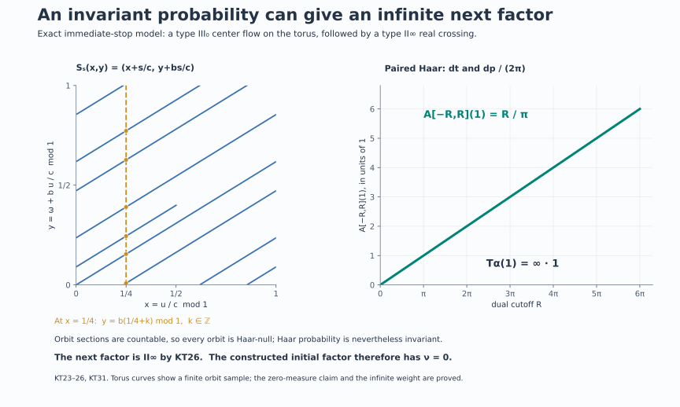

# Krieger's tower and its stopping invariant

Start with a nonzero factor \(M_0\) of type \(\mathrm{III}_0\) with separable predual. The center flow of \(M_0\) is a complete input for another crossed-product construction, even though the resulting factor need not have type \(\mathrm{III}_0\). This observation leads to a tower with an intrinsic stopping rule.

## 1. The construction and the statement

For a faithful normal semifinite weight \(\varphi\) on an algebra \(P\), write
\[
 K_\varphi(P)=P\rtimes_{\sigma^\varphi}\mathbb R,\qquad
 C_\varphi(P)=Z(K_\varphi(P)),\qquad
 \theta^\varphi_s=\widehat{\sigma^\varphi}_s|_{C_\varphi(P)}.
 \tag{KT1}
\]
The dual convention is
\(\widehat{\sigma^\varphi}_s(u_\varphi(t))=e^{-ist}u_\varphi(t)\).
The [normal chart theorem](OA-FLOW-CORE.md#core-5) and [core functor](OA-FLOW-CORE.md#core-8) give the intrinsic center flow independently of \(\varphi\).

Choose \(\varphi_n\) whenever \(M_n\) has been reached. As long as \(M_n\) is type \(\mathrm{III}_0\), set
\[
 (C_n,\theta^n)=(C_{\varphi_n}(M_n),\theta^{\varphi_n}),\qquad
 M_{n+1}=C_n\rtimes_{\theta^n}\mathbb R.
 \tag{KT2}
\]
Stop after forming the first \(M_{n+1}\) which is not type \(\mathrm{III}_0\).

**Theorem.** Every next algebra in (KT2) is a factor with separable predual, of type \(\mathrm{II}_\infty\) or type \(\mathrm{III}\). The reached factors and their center flows are independent, up to normal isomorphism and flow conjugacy, of all weight and representation choices. The number
\[
 \nu(M_0)=
 \sup\{n\in\mathbb N_0:M_0,\ldots,M_n
                         \text{ are type }\mathrm{III}_0\}
 \in\mathbb N_0\cup\{\infty\}
 \tag{KT3}
\]
depends only on the normal isomorphism class of \(M_0\).

The [type III-zero center-flow theorem](OA-FLOW-ZDC.md#zdc-2) says that the center flow of every factor in the stated scope is properly ergodic on a standard measure-class space. The [separated suspension theorem](OA-FLOW-L38.md#oa-flow.suspension.theorem) gives a free invariant conull point model. Neither a nonzero flow kernel nor a formal stabilizer argument is substituted for these proved statements.

Separable predual is preserved. A separable-predual algebra has a faithful normal representation on a separable Hilbert space; this is the [faithful-state GNS and topology result proved in DS2](OA-FLOW-DS.md#ds-2). Its real regular crossing acts on the separable space \(L^2(\mathbb R,H)\). Every von Neumann subalgebra of \(B(L^2(\mathbb R,H))\) has separable predual, since its predual is a quotient of the separable trace class. The same applies to its center and to the next crossing. This also verifies that the stated standard-model prerequisites remain available at every finite stage.

We prove the type assertion in a form that also explains its alternatives.

## 2. The full diagonal in a free real crossing

Let \(F\) be a strict free ergodic nonsingular real flow on a standard sigma-finite space \((X,\mu)\). Put
\[
 A=L^\infty(X,\mu),\qquad \alpha_s(f)=f\circ F_s,\qquad
 B=A\rtimes_\alpha\mathbb R.
 \tag{KT4}
\]
On \(L^2(\mathbb R\times X,dt\,d\mu)\) its actual regular generators are
\[
 [\pi(f)\xi](t,x)=f(F_{-t}x)\xi(t,x),\qquad
 [\lambda_s\xi](t,x)=\xi(t-s,x).
 \tag{KT5}
\]
We claim
\[
 \pi(A)'\cap B=\pi(A),\qquad Z(B)=\pi(A^\alpha)=\mathbb C1.
 \tag{KT6}
\]

Here is a proof specialized to the real line. Source multipliers
\([q(f)\xi](t,x)=f(x)\xi(t,x)\) commute with \(B\). If \(Y\in\pi(A)'\cap B\), it therefore commutes with both source and orbit-position multiplication. The map
\[
 (t,x)\longmapsto(x,F_{-t}x)
 \tag{KT7}
\]
is Borel and injective by freeness. The [Borel-image and inverse theorem](../../NCG-FOLIATIONS/companions/src/polish-spaces-and-standard-borel-spaces.md#4-borel-maps-between-souslin-spaces) implies that its coordinate functions generate the source Borel sigma algebra. Indeed a countable separating family on \(X\), pulled back through both coordinates, generates it. Thus \(\pi(A)\vee q(A)\) is the entire product multiplication algebra. Its commutant on this \(L^2\) space is itself, so \(Y=M_G\) for some bounded measurable \(G(t,x)\).

For a fixed \(s\), let \(j_s=d((F_{-s})_*\mu)/d\mu\), the positive Radon–Nikodym density making
\(v(x)\mapsto j_s(x)^{1/2}v(F_sx)\) unitary. Then
\[
 [R_s\xi](t,x)=j_s(x)^{1/2}\xi(t+s,F_sx)
 \tag{KT8}
\]
commutes with each \(\lambda_r\) and \(\pi(f)\): in the coefficient computation,
\(F_{-(t+s)}F_sx=F_{-t}x\). Hence
\(G(t+s,F_sx)=G(t,x)\) almost everywhere for every fixed \(s\).

Let \(H(t,y)=G(t,F_ty)\). This substitution preserves the product measure class, by nonsingularity in each fiber and Fubini. The last identity becomes
\(H(t+s,y)=H(t,y)\) almost everywhere. Intersect only the countably many good sets for rational \(s\). For almost every \(y\), convolution of \(H(\cdot,y)\) with a continuous compactly supported approximate identity is continuous and invariant under rational translation, hence constant. Local \(L^1\) convergence of these convolutions makes \(H(\cdot,y)\) essentially constant. Its value is the measurable bounded function
\(f(y)=\int_0^1H(t,y)\,dt\). Consequently \(G(t,x)=f(F_{-t}x)\) almost everywhere, proving the first equality in (KT6). Commutation with the \(\lambda_s\) and ergodicity prove the second.

There is also a general locally compact route: [the full free-action diagonal theorem, Theorem 3.1](../../OA-ERGODIC/src/free-actions-and-the-crossed-product-diagonal.md#3-maximal-abelianness-and-the-centre), proves (KT6) for the corresponding regular algebra. Its point-action convention is inverted; use \(s\cdot x=F_{-s}x\). The specialized argument above identifies exactly the source and orbit-position coordinates in the present convention.

## 3. Semifiniteness, including unbounded densities

For the algebra in (KT4),
\[
 B\text{ is semifinite}
 \quad\Longleftrightarrow\quad
 [\mu]\text{ contains an invariant sigma-finite measure}.
 \tag{KT9}
\]
All weights in this section are evaluated on the whole positive cone, allowing infinity.

If \(\nu\sim\mu\) is invariant and sigma-finite, its integration weight \(\kappa\) on \(A\) is faithful normal semifinite. [GDW's full dual-weight construction](OA-FLOW-GDW.md#gdw-6) gives \(\widehat\kappa\); its [generator formula](OA-FLOW-GDW.md#gdw-7) is
\[
 \sigma_t^{\widehat\kappa}(\pi(f))=\pi(f),\qquad
 \sigma_t^{\widehat\kappa}(\lambda_s)
       =\lambda_s\pi((D(\kappa\alpha_s):D\kappa)_t).
 \tag{KT10}
\]
The normalized derivative is on the right. Invariance makes it \(1\). Normality extends triviality of the modular group from these generators to all of \(B\). The [whole-cone trace criterion](../../OA-MOD/src/inner-flow-and-weight-rigidity.md#nonvacuous-weights-and-the-meaning-of-a-trivial-flow) then makes \(\widehat\kappa\) a faithful normal semifinite trace.

Conversely, suppose \(B\) has a faithful normal semifinite trace \(\tau\). Replace the coefficient measure by an equivalent probability \(m\), and write \(\Phi=\widehat m\). The [faithful trace-density theorem](../../OA-MOD/src/invariant-weight-densities.md#radonnikodym-densities-relative-to-a-semifinite-trace) and the [unbounded perturbation formula](../../OA-MOD/src/centralizers-and-perturbations.md#recover-modular-time-on-the-support) give a positive injective self-adjoint affiliated operator \(h\) with
\[
 \Phi=\tau_h,\qquad \sigma_t^\Phi=\operatorname{Ad}(h^{it}).
 \tag{KT11}
\]
This is an equality of weights, not just a description of one modular group. Since (KT10) fixes \(\pi(A)\), every \(h^{it}\) belongs to \(\pi(A)'\cap B=\pi(A)\). Resolvents of \(\log h\) are strong integrals of its unitary group on the two half-lines; spectral calculus then puts every spectral projection in \(\pi(A)\). Thus \(h\) is multiplication by a function with \(0<h(x)<\infty\) almost everywhere.

We give two complete ways to recover the measure.

**Direct density cancellation.** Let
\[
 r_s=\frac{d((F_s)_*m)}{dm}.
\]
The weight \(m\alpha_s\) has this density. On an abelian algebra its normalized derivative relative to \(m\) is \(r_s^{it}\). Comparing (KT10) and (KT11), with both coefficients on the right, gives
\[
 \lambda_s\pi(r_s^{it})
   =h^{it}\lambda_s h^{-it}
   =\lambda_s\pi\!\left(
                  (h\circ F_{-s})^{it}h^{-it}\right).
\]
For each fixed \(s\), faithfulness and equality at rational \(t\), followed by continuity of scalar characters, yield
\[
 r_s(y)=\frac{h(F_{-s}y)}{h(y)}
 \quad\text{almost everywhere}.
 \tag{KT12}
\]
Set \(d\nu=h^{-1}dm\). It is equivalent and sigma-finite: the sets \(\{h^{-1}\le n\}\) exhaust \(X\) and have \(\nu\)-measure at most \(n\). Its pushforward density is
\[
 \frac{d((F_s)_*\nu)}{d\nu}(y)
       =r_s(y)\frac{h(y)}{h(F_{-s}y)}=1.
 \tag{KT13}
\]
Hence \(\nu\) is invariant. The argument does not restrict \(\tau\) to the diagonal; that restriction need not be semifinite.

**Dual-invariant trace recognition.** This route retains the normalized weight-recovery mechanism. Any two faithful normal semifinite traces on the factor \(B\) are scalar multiples. Indeed write a second trace as \(\tau_g\) by the same density theorem. Triviality of its modular group makes all \(g^{it}\) central, so \(g=c1\). Dense definition and injectivity force \(0<c<\infty\).

Let \(\beta\) be the dual action. Therefore \(\tau\beta_p=c_p\tau\) for \(c_p>0\). The dual action fixes the affiliated diagonal density \(h\). The full perturbation covariance formula, proved first on bounded spectral truncations and then by normality, gives
\[
 \Phi\beta_p=(\tau_h)\beta_p=c_p\Phi.
 \tag{KT14}
\]
But the dual weight \(\Phi\) is dual-invariant by [DA's whole averaging construction](OA-FLOW-DA.md#da-invariant). A nonzero faithful semifinite weight has a positive element of finite strictly positive weight; evaluating there gives \(c_p=1\). Thus \(\tau\) itself is dual-invariant.

The [full faithful-weight recognition theorem FR2](OA-FLOW-FR.md#oa-flow.fr.2) produces a faithful normal semifinite \(\kappa\) on \(A\) with \(\tau=\widehat\kappa\). Apply (KT10). Since \(\tau\) is tracial,
\[
 1=\lambda_s^*\sigma_t^\tau(\lambda_s)
   =\pi((D(\kappa\alpha_s):D\kappa)_t).
 \tag{KT15}
\]
Normalized fixed-reference derivative uniqueness, included in FR2's proof, implies \(\kappa\alpha_s=\kappa\) on every positive element. Relative to \(m\), the abelian trace-density theorem writes \(\kappa(f)=\int f g\,dm\) with \(0<g<\infty\) almost everywhere. The measure \(g\,m\) is equivalent, sigma-finite on \(\{g\le n\}\), and invariant. This proves (KT9) a second way without replacing equality of weights by equality of modular groups.

The general locally compact counterpart is [OA-ERGODIC's type-criteria Theorem 4.2](../../OA-ERGODIC/src/type-criteria-for-locally-compact-free-actions.md#4-semifiniteness-is-exactly-cancellation-of-the-densities). It uses the twisted equation \(s_*\nu=\Delta_G(s)\nu\). For the real group \(\Delta_G=1\), so it is exactly (KT9).

## 4. Type I and the orbit relation

For the same free ergodic real action,
\[
 B\text{ is type I}
       \quad\Longleftrightarrow\quad
       \text{one orbit is conull}.
 \tag{KT16}
\]

If an orbit is conull, freeness identifies it Borel isomorphically with \(\mathbb R\). Its measure class is Lebesgue's. To see the last assertion, transport an equivalent probability \(m\) to \(\mathbb R\), choose a bounded strictly positive integrable Gaussian \(q\), and average:
\[
 \bar m(E)=\int_{\mathbb R}q(s)m(E-s)\,ds.
 \tag{KT17}
\]
This measure has everywhere positive finite Lebesgue density
\(\int q(y-x)\,dm(x)\). Every translate of \(m\) is equivalent to \(m\). Thus \(m(E)=0\) implies \(\bar m(E)=0\); conversely \(\bar m(E)=0\) makes \(m(E-s)=0\) for almost every \(s\), and one such \(s\) implies \(m(E)=0\). So the classes agree.

After the corresponding density unitary, the regular algebra acts on \(L^2(\mathbb R_t\times\mathbb R_x)\). The measure-preserving substitution \(y=x-t,\ z=x\) sends coefficient functions to \(f(y)\) and \(\lambda_s\) to \(\xi(y,z)\mapsto\xi(y+s,z)\). On the \(y\)-space, an operator commuting with all multipliers is a multiplier; commuting also with translations makes its function constant by convolution. The bicommutant theorem gives
\[
 B\cong B(L^2(\mathbb R_y))\otimes1_{L^2(\mathbb R_z)}.
 \tag{KT18}
\]
This is an onto normal spatial identification; the inverse is conjugation by the inverse coordinate and density unitaries. The identity multiplicity has not been mistaken for an additional algebra factor.

For the converse assume \(B\) is type I. Section 3 gives an equivalent invariant sigma-finite measure \(\nu\), and its dual trace \(\tau_\nu\) is faithful normal semifinite. Choose a bounded Borel injection
\[
 b(x)=\sum_{j\ge1}2\,3^{-j}1_{E_j}(x)
 \tag{KT19}
\]
from a countable Borel separating family \((E_j)\). Its image and inverse are Borel by the same Borel-image theorem. Freeness makes
\[
 \mathcal R=\{(b(F_{-s}x),b(x)):s\in\mathbb R,\ x\in X\}
 \subset[0,1]^2
 \tag{KT20}
\]
a Borel set: its parametrization is an injective Borel map. If no orbit were conull, every orbit would be null, since it is Borel and invariant. Fubini would make \(\mathcal R\) null for the product of any probability measure equivalent to the two copies of \(b_*\nu\).

The [onto dual GNS theorem GDW6](OA-FLOW-GDW.md#gdw-6) identifies
\[
 L^2(B,\tau_\nu)=L^2(\mathbb R\times X,ds\,d\nu).
 \tag{KT21}
\]
On its dense finite coefficient core \(F(f)=\int\lambda_s\pi(f(s))\,ds\), left and right multiplication by \(d\in A\) act as
\[
 L_{\pi(d)}f(s,x)=d(F_{-s}x)f(s,x),\qquad
 R_{\pi(d)}f(s,x)=d(x)f(s,x).
 \tag{KT22}
\]
Covariance proves the formulas on that core; trace boundedness extends them to the full GNS space. Consequently the commuting self-adjoint operators \(L_{\pi(b)},R_{\pi(b)}\) have joint spectral projection \(1\) on \(\mathcal R\).

A type I factor is \(B(K)\), and scalar uniqueness of faithful semifinite traces identifies the same trace GNS space with the Hilbert–Schmidt space \(K\otimes\overline K\), up to a scalar norm unitary. On a rank-one vector \(|\xi\rangle\langle\eta|\), the joint spectral measure of left and right multiplication by the self-adjoint \(\pi(b)\) is the product of its scalar spectral measures at \(\xi,\eta\). This follows first on rectangles by the two spectral projections and then on all Borel sets by the monotone-class theorem. Normality of these vector functionals on the faithful diagonal makes both measures absolutely continuous with respect to \(b_*\nu\). Their product therefore assigns zero to \(\mathcal R\). The projection annihilates every rank-one vector, hence is zero, since finite-rank vectors are total.

The two onto trace GNS identifications intertwine left and right multiplication and their spectral calculus. The same projection cannot be both zero and one. An orbit must be conull, proving (KT16).

A different complete route, retained in [OA-ERGODIC Theorems 1.2 and 2.2](../../OA-ERGODIC/src/type-criteria-for-locally-compact-free-actions.md#2-why-a-type-i-factor-forces-one-orbit), uses the normal tensor representation of a type I factor and its commutant. Restricted to source and target diagonals, normality makes product measure supported on the Borel orbit relation; Fubini gives a conull orbit. That route avoids trace GNS coordinates. The present argument explains the same obstruction through an explicit joint spectral projection.

## 5. The infinite alternative and the tower's next step

Fix primal Haar measure \(dt\), with paired dual Haar measure \(dp/(2\pi)\). The [full averaging theorem DA](OA-FLOW-DA.md#da-positive) gives, for compact dual intervals,
\[
 A_{[-R,R]}(1)
   =\int_{-R}^{R}\beta_p(1)\,\frac{dp}{2\pi}
   =\frac R\pi\,1.
 \tag{KT23}
\]
Its whole-cone identity \(A=T_\alpha\), proved in [DA's equality theorem](OA-FLOW-DA.md#da-equality), implies
\[
 T_\alpha(1)=+\infty\,1.
 \tag{KT24}
\]
If \(\nu\) is a nonzero invariant sigma-finite measure, the extended integration weight therefore gives
\[
 \widehat\nu(1)=\nu(T_\alpha(1))=\infty.
 \tag{KT25}
\]
The factor \(R/\pi\) is forced by the paired Haar convention.

For a semifinite factor, an infinite value of this trace at the identity rules out finiteness: a finite factor has a finite faithful trace, and the scalar uniqueness proved in Section 3 would make every faithful normal semifinite trace a finite scalar multiple of it. Thus the identity here is infinite. Equivalently, [the free-action finite criterion, Theorem 5.3](../../OA-ERGODIC/src/free-actions-and-the-crossed-product-diagonal.md#5-a-continuous-orbit-with-a-transverse-parameter), excludes a finite crossed product for a free nondiscrete group action.

The complete coarse classification for (KT4) is now
\[
 \begin{array}{c|l}
 \mathrm I_\infty & \text{an orbit is conull},\\
 \mathrm {II}_\infty&
 \text{every orbit is null and an equivalent invariant sigma-finite measure exists},\\
 \mathrm {III}&\text{no equivalent invariant sigma-finite measure exists}.
 \end{array}
 \tag{KT26}
\]
The first row always has an invariant measure by the line model. The other two rows are disjoint and exhaustive by (KT9), (KT16), and the [full-corner trace construction in L18, Section 6](OA-FLOW-L18.md#l18-6): a factor with a nonzero finite projection has a faithful normal semifinite trace; a factor without one is type III. No \(\mathrm{II}_1\) row occurs for this free real action. No finer subtype is inferred from the third row.

For the center flow of a type \(\mathrm{III}_0\) factor, proper ergodicity excludes the first row. Hence every \(M_{n+1}\) in (KT2) is \(\mathrm{II}_\infty\) or \(\mathrm{III}\), as asserted.

## 6. All choices give normally isomorphic stages

We record actual maps, including their normal inverses. On a fixed algebra \(P\), let
\[
 c_t=(D\psi:D\varphi)_t.
\]
The normalized cocycle equations give
\(\sigma_t^\psi=\operatorname{Ad}(c_t)\sigma_t^\varphi\) and
\(c_{t+s}=c_t\sigma_t^\varphi(c_s)\).
In a common faithful normal representation of \(P\), define
\[
 [W\xi](r)=c_{-r}^*\xi(r)
 \quad\text{on }L^2(\mathbb R,H).
 \tag{KT27}
\]
The field and its adjoint act as inverse unitaries. Strong continuity verifies their definition on compact tensors, and density extends them to the whole Hilbert space. Direct computation gives
\[
 \begin{aligned}
 W\pi_\psi(x)W^*&=\pi_\varphi(x),\\
 W\lambda_\psi(t)W^*&=\pi_\varphi(c_t)\lambda_\varphi(t).
 \end{aligned}
 \tag{KT28}
\]
For the second equation the multiplier is
\(c_{-r}^*c_{t-r}=\sigma^\varphi_{-r}(c_t)\), in that order.

The image contains all coefficients and all
\(\lambda_\varphi(t)=\pi_\varphi(c_t^*)W\lambda_\psi(t)W^*\).
It is therefore onto. Unitary conjugation supplies both normality and the normal inverse. The [regular representation-independence theorem NR4](OA-FLOW-NR.md#oa-flow.nr.4) transports these generator formulas to any other faithful normal realizations. The multiplication \(e^{-isr}\) implementing the dual action commutes with \(W\), so the map restricts to a normal conjugacy of the full centers and their flows.

For three weights the [ordered chain law in CORE5](OA-FLOW-CORE.md#core-5) gives
\[
 J_{\psi,\varphi}J_{\omega,\psi}=J_{\omega,\varphi},
 \qquad J_{\psi,\varphi}^{-1}=J_{\varphi,\psi}.
 \tag{KT29}
\]
These are equalities on the whole normal algebras, since their ordered generator formulas agree on the generated star algebra.

A normal flow conjugacy \(f:(C,\theta)\to(D,\eta)\) has an equally concrete crossed-product extension:
\[
 \widetilde f(\pi_C(x))=\pi_D(f(x)),\qquad
 \widetilde f(\lambda_C(t))=\lambda_D(t).
 \tag{KT30}
\]
Represent \(D\) faithfully on \(H\) and \(C\) through that representation composed with \(f\). On \(L^2(\mathbb R,H)\), the two coefficient fields agree because
\(f(\theta_{-r}x)=\eta_{-r}(f(x))\), and the translations agree. This identifies the two entire regular algebras. It proves normality and onto-ness, and the same construction for \(f^{-1}\) is the normal inverse. NR4 handles a change from these convenient representations to any chosen ones.

Finally, if \(g:P\to Q\) is a normal isomorphism, transport \(\varphi\) to \(\varphi\circ g^{-1}\). Its GNS unitary is
\(\Lambda_\varphi(x)\mapsto\Lambda_{\varphi\circ g^{-1}}(g(x))\).
Equality of the entire weights makes it an onto isometry; it intertwines the closed Tomita operators and hence the modular groups. The regular construction just used extends \(g\) to the cores and their dual flows. This is [CORE8's normal functor](OA-FLOW-CORE.md#core-8), with inverse induced by \(g^{-1}\).

Inductively apply these maps to (KT2). At each finite stage they transport the full chosen weight, the core center, its action, and the next regular crossed product. Thus all presentations give the same type at that stage and normally isomorphic reached objects.

## 7. Stopping cases and exact models

If the first next factor is not \(\mathrm{III}_0\), the set in (KT3) is \(\{0\}\), so \(\nu=0\). If a last type \(\mathrm{III}_0\) stage is \(M_N\), then \(M_{N+1}\) exists, has another type, and \(\nu=N\). If every finite stage has type \(\mathrm{III}_0\), the set is unbounded and \(\nu=\infty\). Nothing in this definition constructs an algebra at a stage labeled \(\infty\).

The finite-stage normal identifications preserve a first failure, and preserve the assertion of no finite failure. This proves the theorem's invariance statement. A star isomorphism between von Neumann algebras is automatically normal: it and its inverse are order isomorphisms, so preserve every existing bounded increasing supremum. Thus the conclusion also applies when normality is not separately stated for a star isomorphism.

The sequence of reached center flows is called **Krieger's tower**. This definition and invariance theorem do not assert completeness of the invariant or existence of a factor with every prescribed finite or infinite stopping value.

**An exact immediate-stop model.** Put \(c=\log2\) and choose irrational \(b\). [ZDC's coefficient construction](OA-FLOW-ZDC.md#zdc-8) gives a separable \(\mathrm{II}_\infty\) factor \(D\) and a trace-halving automorphism \(\gamma\). On \(L^\infty(\mathbb T)\bar\otimes D\), let
\((\alpha X)(\omega+b)=\gamma(X(\omega))\).
The [full type III-zero converse](OA-FLOW-ZDC.md#zdc-7) makes its integer crossing a \(\mathrm{III}_0\) factor \(M_0\), whose center flow has constant roof \(c\) over the irrational rotation. Coordinates
\[
 x=u/c\pmod1,\qquad y=\omega+b\,u/c\pmod1
 \tag{KT31}
\]
turn the suspension point map into \(S_s(x,y)=(x+s/c,y+bs/c)\). The center automorphism is \(\theta_s f=f\circ S_{-s}\), as in ZDC36; to use the convention of (KT4), take \(F_s=S_{-s}\). Haar probability is invariant. The characters \(e^{-2\pi i(mx+ny)}\) have center-flow frequencies \(2\pi(m+bn)/c\); only constants have frequency zero. The action is therefore ergodic. It is free since \(s/c\) and \(bs/c\) cannot both be integers unless \(s=0\).

Every orbit is Haar-null. At each fixed first coordinate its second-coordinate section is countable, since admissible times differ by integer multiples of \(c\); Fubini gives the claim. Thus this is a properly ergodic invariant flow. Formula (KT26) makes \(M_1\) type \(\mathrm{II}_\infty\), and its tower has \(\nu(M_0)=0\).

**Finite base mass does not make the crossing finite.** In this model the coefficient integration weight has value \(1\) at \(1\), whereas its dual trace has value \(\infty\), by (KT23)–(KT25). The operator-valued weight lies between these two evaluations. Omitting it would incorrectly predict type \(\mathrm{II}_1\).

**Flow kernel is not a coarse-type test.** The irrational torus flow is faithful and has kernel \(\{0\}\), yet its own crossed product here is semifinite because it preserves Haar measure. A flow kernel computes the modular invariant of a factor when it is that factor's center flow; it does not replace the invariant-measure criterion for crossing that flow once more.

**The index counts retained type III-zero stages.** A hypothetical sequence with \(M_0,M_1,M_2\) of type \(\mathrm{III}_0\) and \(M_3\) of another type has \(\nu=2\), not \(3\). This is an indexing diagnostic, not an existence claim for that stopping pattern.

**A scalar error in the chart cocycle changes the map.** The factors in (KT28) use the normalized derivative. Replacing \(c_t\) by \(e^{iat}c_t\) multiplies the translation image by a scalar character. It still defines a flow-equivariant isomorphism, but it is not the normalized chart map in (KT29). Exact normalization is what makes the chosen canonical compositions agree.

## 8. Geometry behind the first stopping decision

The orbit in the unit square is a finite sample of the exact translation in (KT31), with opposite edges identified. The displayed vertical section consists of orbit times \(s/c=x_0+k\); its countability, rather than a finite picture, proves zero product measure. The average graph is exactly \(R\mapsto R/\pi\), with no truncation interpreted as the full weight. Together these panels explain the proved immediate-stop case \(\mathrm{III}_0\to\mathrm{II}_\infty\). Section 7 distinguishes this concrete model from conditional finite or infinite stopping patterns.

## Further reading

M. Takesaki, *Theory of Operator Algebras II*, Exercise XII.3.2, printed pp. 402–403, introduces this recursive construction and its choice independence. The general locally compact diagonal and type criteria are proved in the linked OA-ERGODIC lessons. The two real-line density proofs and the trace-GNS orbit-relation proof above preserve useful alternative routes while retaining full positive-cone and normality statements.

