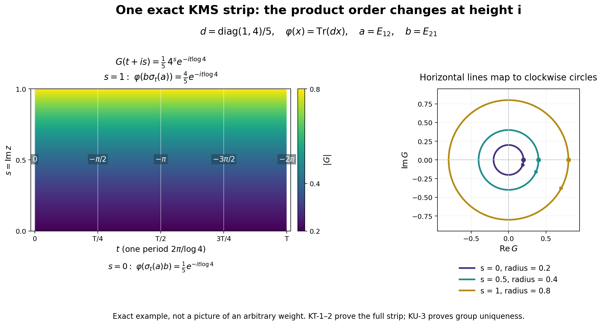

# Uniqueness of the modular group from the finite-star KMS condition

*Fresh local reconstruction, GPT-6 Astra (OpenAI), Ultra, 2026-10-04. CC0-1.0 to the extent of rights held.*

Let \(\varphi\) be a faithful normal semifinite weight on an arbitrary von Neumann algebra \(M\). Suppose \((\alpha_t)_{t\in\mathbb R}\) is a group of normal \*-automorphisms, pointwise ultraweakly continuous, preserving \(\varphi\) on \(M_+\). Assume the following KMS condition on the entire algebra \(A=\mathfrak n_\varphi\cap\mathfrak n_\varphi^*\): for every \(a,b\in A\) there is a bounded continuous function on \(0\leq\operatorname{Im}z\leq1\), holomorphic inside, with boundary values
\[
K^\alpha_{a,b}(t)=\varphi_0(\alpha_t(a)b),\qquad
K^\alpha_{a,b}(t+i)=\varphi_0(b\alpha_t(a)).
\tag{KU1}
\]
We prove \(\alpha_t=\sigma_t^\varphi\) for every real \(t\). For a faithful normal state, invariance follows from (KU1), as proved in [KU-4](OA-FLOW-KU.md#ku-4); it need not be separately assumed in that case.

Actual inputs are [GW-1–5](OA-FLOW-GW.md#oa-flow.gw.1), [WR-1–4](OA-FLOW-WR.md#wr-3), [MW-4](OA-FLOW-MW.md#mw-4), [EW-2–3](OA-FLOW-EW.md#ew-2) with [the required normality hypothesis](OA-FLOW-EW.md#ew-2), [CP01–06](OA-FLOW-CP.md#oa-flow.cp.1), [SF-3–4](OA-FLOW-SF.md#oa-flow.sf.sf0), [FF-1](OA-FLOW-FF.md#oa-flow.ff.2), and the complete local [KT-1–4](OA-FLOW-KT.md#kt-1). The free author context is [Hiai, §2.2, printed pp.17–19, and §7.1(C), p.64](https://arxiv.org/pdf/2004.02383v1). The periodic scalar-pairing idea is used here with all arbitrary-weight GNS, integral and finite-domain steps proved; no Stone theorem, three-lines theorem, Schwarz reflection theorem or unproved uniqueness theorem is imported.

Actual earlier proof ranges: [OA-FLOW.GW.1](OA-FLOW-GW.md#oa-flow.gw.1), [OA-FLOW.GW.2](OA-FLOW-GW.md#oa-flow.gw.2), [OA-FLOW.GW.3](OA-FLOW-GW.md#oa-flow.gw.3), [OA-FLOW.GW.4](OA-FLOW-GW.md#oa-flow.gw.4), [OA-FLOW.GW.5](OA-FLOW-GW.md#oa-flow.gw.5), [OA-FLOW.WR.1](OA-FLOW-WR.md#oa-flow.wr.1), [OA-FLOW.WR.2](OA-FLOW-WR.md#oa-flow.wr.2), [OA-FLOW.WR.3](OA-FLOW-WR.md#oa-flow.wr.3), [OA-FLOW.WR.4](OA-FLOW-WR.md#oa-flow.wr.4), [OA-FLOW.WR.5](OA-FLOW-WR.md#oa-flow.wr.5), [OA-FLOW.MW.4](OA-FLOW-MW.md#oa-flow.mw.4), [OA-FLOW.NF.5](OA-FLOW-NF.md#oa-flow.nf.5), [OA-FLOW.EW.2](OA-FLOW-EW.md#oa-flow.ew.2), [OA-FLOW.EW.3](OA-FLOW-EW.md#oa-flow.ew.3), [OA-FLOW.EW.5](OA-FLOW-EW.md#oa-flow.ew.5), [OA-FLOW.CP.1](OA-FLOW-CP.md#oa-flow.cp.1), [OA-FLOW.CP.2](OA-FLOW-CP.md#oa-flow.cp.2), [OA-FLOW.CP.3](OA-FLOW-CP.md#oa-flow.cp.3), [OA-FLOW.CP.4](OA-FLOW-CP.md#oa-flow.cp.4), [OA-FLOW.CP.5](OA-FLOW-CP.md#oa-flow.cp.5), [OA-FLOW.CP.6](OA-FLOW-CP.md#oa-flow.cp.6), [OA-FLOW.SF.SF0](OA-FLOW-SF.md#oa-flow.sf.sf0), [OA-FLOW.SF.SB0](OA-FLOW-SF.md#oa-flow.sf.sb0), [OA-FLOW.SF.SB1](OA-FLOW-SF.md#oa-flow.sf.sb1), [OA-FLOW.SF.SB2](OA-FLOW-SF.md#oa-flow.sf.sb2), [OA-FLOW.SF.SB3](OA-FLOW-SF.md#oa-flow.sf.sb3), [OA-FLOW.SF.SB4](OA-FLOW-SF.md#oa-flow.sf.sb4), [OA-FLOW.SF.SB5](OA-FLOW-SF.md#oa-flow.sf.sb5), [OA-FLOW.SF.SB6](OA-FLOW-SF.md#oa-flow.sf.sb6), [OA-FLOW.SF.SF3](OA-FLOW-SF.md#oa-flow.sf.sf3), [OA-FLOW.SF.SF4](OA-FLOW-SF.md#oa-flow.sf.sf4), [OA-FLOW.FF.1](OA-FLOW-FF.md#oa-flow.ff.1), [OA-FLOW.FF.2](OA-FLOW-FF.md#oa-flow.ff.2), [OA-FLOW.CF.1](OA-FLOW-CF.md#oa-flow.cf.1), [OA-FLOW.CF.6](OA-FLOW-CF.md#oa-flow.cf.6), [OA-FLOW.CF.7](OA-FLOW-CF.md#oa-flow.cf.7), [OA-FLOW.CF.8](OA-FLOW-CF.md#oa-flow.cf.8), [OA-FLOW.SC.4](OA-FLOW-SC.md#sc-04), [OA-FLOW.SC.5](OA-FLOW-SC.md#sc-05), [OA-FLOW.SC.8](OA-FLOW-SC.md#sc-08), [OA-FLOW.SC.9](OA-FLOW-SC.md#sc-09), [OA-FLOW.KT.1](OA-FLOW-KT.md#kt-1), [OA-FLOW.KT.2](OA-FLOW-KT.md#kt-2), [OA-FLOW.KT.3](OA-FLOW-KT.md#kt-3), [OA-FLOW.KT.4](OA-FLOW-KT.md#kt-4). The spectral domains, continuous-vector integrals, Gaussian scalar interchange and rectangle/circle complex-analysis arguments are complete in those earlier readers.

## KU-1. The implementing group is strongly continuous on the full GNS space

Invariance implies \(\alpha_t(N)=N\), \(\alpha_t(A)=A\), and
\[
V_t\Lambda(x)=\Lambda(\alpha_t(x))\qquad(x\in N)
\tag{KU2}
\]
defines a unitary group on the GNS completion. It implements \(\alpha_t\):
\[
V_t\pi(a)V_{-t}=\pi(\alpha_t(a))\qquad(a\in M).
\tag{KU3}
\]
Indeed both sides applied to \(\Lambda(x)\) give \(\Lambda(\alpha_t(a)x)\). The GNS range is dense, so this proves the operator identity.

Pointwise ultraweak continuity of \(\alpha_t\) does not by itself allow application of the unbounded map \(\Lambda\). Here is the required independent continuity argument. [WR-1](OA-FLOW-WR.md#oa-flow.wr.1)–2 supplies vectors \(\eta_j\) with bounded right multipliers \(R_{\eta_j}\), where
\[
R_{\eta_j}\Lambda(x)=\pi(x)\eta_j\quad(x\in N),\qquad
R_{\eta_j}\to I\text{ strongly},
\]
and the \(R_{\eta_j}\) are positive contractions. For every \(x\in N\) and \(v\in H_\varphi\),
\[
\langle V_t\Lambda(x),R_{\eta_j}^*v\rangle
=\langle\pi(\alpha_t(x))\eta_j,v\rangle
\tag{KU4}
\]
is continuous in \(t\), because \(\pi\) is normal. The linear span of these test vectors is dense: each \(v\) is the norm limit of \(R_{\eta_j}^*v=R_{\eta_j}v\). Unitary uniform boundedness extends continuity first to every test vector, then from \(\Lambda(N)\) to every initial vector. Thus \(V_t\) is weakly continuous. The identity
\[
\|(V_t-V_s)\xi\|^2
=2\|\xi\|^2-2\operatorname{Re}\langle V_{t-s}\xi,\xi\rangle
\]
makes it strongly continuous, without a spectral theorem for arbitrary unitary groups.

The action \(\alpha_t\) is also pointwise strongly* continuous in a concrete representation. At zero expand
\[
(\alpha_t(a)-a)^*(\alpha_t(a)-a)
=\alpha_t(a^*a)-\alpha_t(a)^*a-a^*\alpha_t(a)+a^*a.
\]
Every vector evaluation tends to zero by ultraweak continuity, since multiplication by a fixed bounded operator preserves vector-coefficient continuity. Apply the same argument to \(a^*\), and use the group property at other real parameters.

## KU-2. Entire elements for the competing action stay in the finite-star domain

For \(x\in A\), define
\[
a_{n,x}(z)=\sqrt{\frac n\pi}
 \int_{\mathbb R}e^{-n(t-z)^2}\alpha_t(x)\,dt
\tag{KU5}
\]
as the CP ultraweak integral. The operator norm bound, norm-entire dependence, real-translation rule and adjoint rule are exactly the scalar-kernel arguments of [KT-3](OA-FLOW-KT.md#kt-3), applied now to the pointwise strongly* continuous action \(\alpha\):
\[
\|a_{n,x}(z)\|\leq e^{n(\operatorname{Im}z)^2}\|x\|,\qquad
\alpha_s(a_{n,x}(z))=a_{n,x}(z+s),\qquad
a_{n,x}(z)^*=a_{n,x^*}(\bar z).
\tag{KU6}
\]
That argument uses only the explicit Gaussian kernel and normality of the maps, not modularity.

[KU-1](OA-FLOW-KU.md#ku-1) gives the previously missing continuous GNS integrand. The bounded-graph argument of [KT-3](OA-FLOW-KT.md#kt-3), with \(V_t\) replacing \(U_t\), proves
\[
a_{n,x}(z)\in A,\qquad
\Lambda(a_{n,x}(z))
=\sqrt{\frac n\pi}\int_{\mathbb R}e^{-n(t-z)^2}V_t\Lambda(x)\,dt.
\tag{KU7}
\]
The same assertion for \(x^*\), together with (KU6), proves the star-domain part. Compact Riemann sums stay uniformly bounded in operator norm; their GNS vectors converge in norm; [EW-3](OA-FLOW-EW.md#oa-flow.ew.3) identifies their limit. Thus no boundedness of \(\Lambda\) on an operator ball is presumed.

The right side is entire as a Hilbert-valued function: the first two kernel derivatives have an integrable local bound, so the same integral remainder estimate used in [KT-3](OA-FLOW-KT.md#kt-3) works in Hilbert norm. Moreover
\[
\|\Lambda(a_{n,x}(z))\|
\leq e^{n(\operatorname{Im}z)^2}\|\Lambda(x)\|.
\tag{KU8}
\]
At \(z=0\), these vectors converge to \(\Lambda(x)\); their star vectors converge to \(\Lambda(x^*)\), by the Gaussian approximate identity and strong continuity of \(V_t\).

For \(a=a_{n,x}(0)\), use \(\alpha_z(a)=a_{n,x}(z)\) for its entire orbit. This is consistent with complex shifts by (KU6) and the scalar identity theorem. The spaces spanned by \(\Lambda(a)\) and by \(\Lambda(a^*)\), as \(x\in A,n\geq1\) vary, are dense in \(H_\varphi\), since \(\Lambda(A)\) is dense and the preceding limits hold. We need no unproved analytic-vector theorem for a generator of \(V_t\).

## KU-3. A bounded periodic entire pairing identifies the two groups

Choose \(a\) of the Gaussian type from [KU-2](OA-FLOW-KU.md#ku-2) and \(b\) of the Gaussian type for \(\sigma\) from [KT-3](OA-FLOW-KT.md#kt-3). Define
\[
f(z)=\varphi_0(\alpha_z(a)\sigma_z(b))
=\langle\Lambda(\sigma_z(b)),\Lambda(\alpha_z(a)^*)\rangle.
\tag{KU9}
\]
The product belongs to the finite algebra for every \(z\), because each factor lies in \(A\). The first GNS vector is entire, and the second is anti-entire, by the exact adjoint rules. With the linear-first convention, their inner product is entire. This follows directly from their norm difference quotients and the bounded bilinear estimate.

We record the analytic shift identity with all domains checked. For fixed \(c\in A\), the function
\(h(z)=\varphi_0(\alpha_z(a)c)\)
is entire by the same GNS pairing. On the real edge it agrees with \(K^\alpha_{a,c}\). [KT-1](OA-FLOW-KT.md#kt-1)'s local zero-edge uniqueness identifies the two on the upper strip; equivalently reflect the variable in its lower-strip statement. Consequently
\[
\varphi_0(\alpha_{t+i}(a)c)=\varphi_0(c\alpha_t(a))
\qquad(t\in\mathbb R).
\]
Both sides have entire continuations in \(t\); the identity theorem yields
\[
\varphi_0(\alpha_z(a)c)=\varphi_0(c\alpha_{z-i}(a))
\qquad(z\in\mathbb C,\ c\in A).
\tag{KU10}
\]
The same argument, using KT's already proved KMS condition, gives
\[
\varphi_0(\sigma_z(b)d)=\varphi_0(d\sigma_{z-i}(b))
\qquad(z\in\mathbb C,\ d\in A).
\tag{KU11}
\]
In (KU10) put \(c=\sigma_t(b)\), then in (KU11) put \(d=\alpha_{t-i}(a)\). Both belong to \(A\). For real \(t\),
\[
f(t)=\varphi_0(\sigma_t(b)\alpha_{t-i}(a))
=\varphi_0(\alpha_{t-i}(a)\sigma_{t-i}(b))
=f(t-i).
\]
The identity theorem makes \(f(z)=f(z-i)\) on the entire plane.

This periodic entire function is bounded. Indeed write \(z=t+is\), \(0\leq s\leq1\). Real invariance of both weights and the real-translation rules give
\[
|f(t+is)|
\leq
\|\Lambda(\sigma_{is}(b))\|
\|\Lambda(\alpha_{-is}(a^*))\|.
\tag{KU12}
\]
The right side is continuous and finite on the compact interval of \(s\), by [KT-3](OA-FLOW-KT.md#kt-3) and [KU-2](OA-FLOW-KU.md#ku-2), independently of \(t\). Periodicity therefore bounds the function on every horizontal strip, with one common bound. [SF-4](OA-FLOW-SF.md#oa-flow.sf.sf4)'s circle Cauchy coefficient estimate proves Liouville's conclusion directly: at any center the derivative has modulus at most this bound divided by any radius \(R\); letting \(R\to\infty\) makes it zero. Hence \(f\) is constant.

For real \(t\), constancy and (KU9) say
\[
\langle U_t\Lambda(b),V_t\Lambda(a^*)\rangle
=\langle\Lambda(b),\Lambda(a^*)\rangle.
\tag{KU13}
\]
The two vector families are independently dense by [KT-3](OA-FLOW-KT.md#kt-3) and [KU-2](OA-FLOW-KU.md#ku-2). Boundedness extends the identity to all pairs of Hilbert vectors, so \(V_t^*U_t=I\), or \(V_t=U_t\). Formula (KU3), MW's implementation formula, and faithfulness of \(\pi\) now give
\[
\alpha_t=\sigma_t^\varphi\qquad(t\in\mathbb R).
\tag{KU14}
\]
This proves uniqueness for the stated arbitrary faithful normal semifinite weight, without a countability reduction.

## KU-4. For a faithful normal state, KMS alone forces invariance

Let \(\omega\) be a faithful normal state satisfying (KU1) for a pointwise ultraweakly continuous normal automorphism group, without assuming invariance. Here \(A=M\), so take \(b=1\). The two boundary values of \(K^\alpha_{a,1}\) are the same scalar function \(t\mapsto\omega(\alpha_t(a))\).

Translate this closed-strip function vertically by integer multiples of \(i\), identifying its equal values on the seams. This defines a continuous bounded function \(H\) on \(\mathbb C\), holomorphic away from the horizontal integer lines. It is holomorphic across each seam as well: for a small rectangle crossing just one seam, cut at distance \(\varepsilon\) on either side. The two rectangle integrals vanish by [SF-4](OA-FLOW-SF.md#oa-flow.sf.sf4)'s Cauchy theorem; the intervening parallel-edge integrals cancel in the limit by continuity, and the short joining edges tend to zero. Thus the full rectangle integral is zero. The local rectangular Morera criterion makes \(H\) holomorphic across the seam.

The same elementary Liouville argument as [KU-3](OA-FLOW-KU.md#ku-3) makes \(H\) constant. In particular
\(\omega(\alpha_t(a))=\omega(a)\) for every \(a\in M\). [KU-1](OA-FLOW-KU.md#ku-1)–3 then apply and give \(\alpha_t=\sigma_t^\omega\). The argument also works for a nonzero faithful finite normal positive functional after rescaling.

The arbitrary-weight theorem above includes weight invariance among its hypotheses, exactly as stated at the start. Nothing in this proof drops faithfulness, identifies a natural cone, or asserts an operator-valued weight theorem. Those are separate obligations.

## KU-5. An exact KMS strip in two matrix dimensions

This image illustrates [KT-1, equations KT1–KT4](OA-FLOW-KT.md#kt-1) and [KT-2, equations KT5–KT7](OA-FLOW-KT.md#kt-2). The uniqueness argument uses the separately proved periodic pairing [KU-3, equations KU9–KU14](OA-FLOW-KU.md#ku-3); the image itself does not prove uniqueness. The [reproducible plotting source](../assets/kms-reconstruction/render_kms_strip.py) and [exact numerical parameters](../assets/kms-reconstruction/kms-figure-numerics.json) accompany it.

Let \(M=M_2(\mathbb C)\), \(d=\operatorname{diag}(1,4)/5\), and \(\varphi(x)=\operatorname{Tr}(dx)\). Its GNS space can be represented as \(M_2(\mathbb C)\) with inner product \(\langle X,Y\rangle=\operatorname{Tr}(Y^*X)\), left multiplication representation, and \(\Lambda(x)=xd^{1/2}\). The full involution and its polar factors are
\[
S(X)=d^{-1/2}X^*d^{1/2},\qquad
J(X)=X^*,\qquad
\Delta^{1/2}(X)=d^{1/2}Xd^{-1/2}.
\]
Indeed \(S\Lambda(x)=\Lambda(x^*)\), and \(J\Delta^{1/2}=S\). In the orthonormal matrix-unit basis the displayed \(\Delta^{1/2}\) is positive, with positive diagonal eigenvalues \(\sqrt{d_i/d_j}\), while \(J\) is antiunitary. Thus these are the actual polar factors. Consequently
\[
\Delta^{it}(X)=d^{it}Xd^{-it},\qquad
\sigma_t(x)=d^{it}xd^{-it}.
\]
Take \(a=E_{12}\), \(b=E_{21}\), and \(q=\log4\). Then
\[
\sigma_z(a)=4^{-iz}E_{12},\qquad
G(z)=\varphi(\sigma_z(a)b)=\frac15\,4^{-iz}.
\]
These are entire functions in this finite-dimensional example. For \(z=t+is\),
\[
G(t+is)=\frac15\,4^s e^{-it\log4},\qquad
|G(t+is)|=\left(\frac15\right)^{1-s}
          \left(\frac45\right)^s.
\]
At the two edges,
\[
G(t)=\varphi(\sigma_t(a)b)=\frac15e^{-it\log4},\qquad
G(t+i)=\varphi(b\sigma_t(a))=\frac45e^{-it\log4}.
\]
Thus the two product orders and the plus-\(i\) shift agree exactly with KT6. The interpolation bound is attained throughout this strip; it is not merely a numerical fit.

The left panel shows \(0\leq t\leq T=2\pi/\log4\) and \(0\leq s\leq1\). Colors encode the exact modulus. White labels give the continuous unwrapped phase \(-t\log4\), which is allowed to pass below \(-\pi\); they are not labels for a principal argument. The right panel maps each horizontal line at \(s=0,\frac12,1\) to the complex coefficient plane. Their respective radii are \(\frac15,\frac25,\frac45\), and increasing \(t\) moves clockwise. The dots mark \(t=0\).

All coordinates, constants, signs and identities here are proved by the displayed matrix calculation. For free author context on the KMS strip see [Hiai, §2.2, printed pp.17–19](https://arxiv.org/pdf/2004.02383v1#page=17). This independent example, figure and reproducible source are CC0-1.0 to the extent of rights held.

[Editable SVG](../assets/kms-reconstruction/assets/kms-strip.svg).
