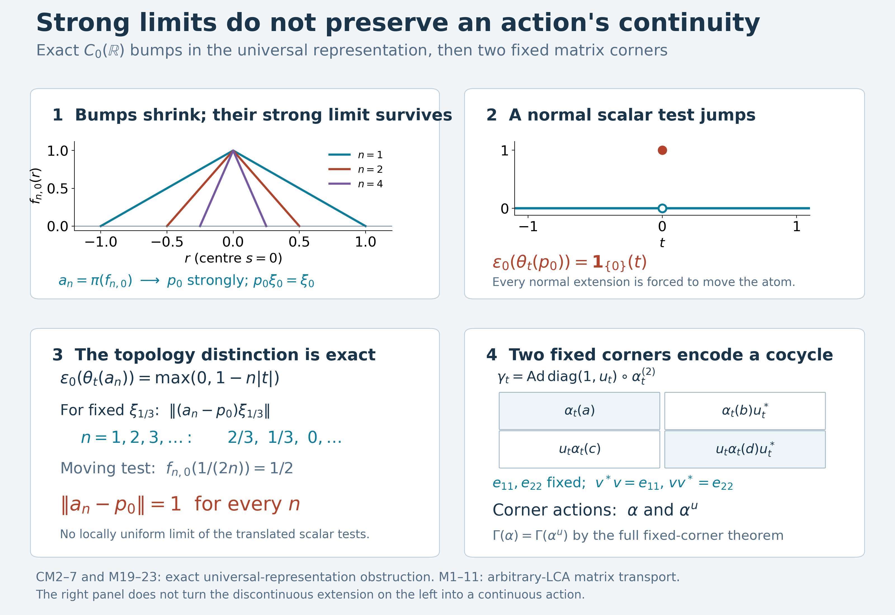

# Cocycle matrix actions and the representation continuity test

A norm-continuous action on a C\*-algebra need not become a continuous normal action in every representation. We first state that representation test and prove a concrete obstruction in the universal representation of \(C_0(\mathbb R)\). Shrinking bumps converge strongly to nonzero atomic projections, but translating the limiting projection makes a normal vector functional jump.

The final construction puts a unitary cocycle into a \(2\times2\) matrix action. Its two fixed diagonal corners carry the original and perturbed actions; the general equivalent-fixed-corner theorem then transfers their Connes spectra. Continuity of this action is proved directly in the concrete predual.

*Restored local proof, 5 October 2026. Spot-checked in a separate AI session. The concluding Connes-spectrum application uses the exact earlier canonical GCC proof. Original exposition, new proofs and illustration are CC0-1.0 to the extent of rights held.*

## Exact earlier setting and conventions

The C\*-representation statements use arbitrary nonunital C\*-algebras, arbitrary Hilbert spaces and arbitrary LCH groups. Only the cocycle/Connes part imposes the original LCA hypothesis. Representations are nondegenerate where stipulated. Von Neumann automorphisms are normal, meaning ultraweakly continuous. Strong convergence is vectorwise convergence; every use of strong-to-ultraweak convergence below has an explicit uniform operator bound.

The exact earlier proofs are [GNS5.1](OA-FLOW-GNS.md#gns-theorem-5-1), [GNS7.1](OA-FLOW-GNS.md#gns-lemma-7-1), [GNS7.3](OA-FLOW-GNS.md#gns-theorem-7-3), the concrete predual [CP4–6](OA-FLOW-CP.md#oa-flow.cp.4), bounded bicommutant density [BD4–5](OA-FLOW-BD.md#oa-flow.bd.4), and finite normal tensor transport [NCF1](OA-FLOW-NCF.md#ncf-1). [PC1](OA-FLOW-PC.md#oa-flow.projection.pc1) supplies arbitrary projection joins; [CF6–9](OA-FLOW-CF.md#oa-flow.cf.6) supplies the C\*, Hilbert norm and forced-unitization facts. Complete integration and action-continuity alternatives in AT and the free-source GNS development remain available. No abstract bidual W* construction is used.

The current general spectral framework has negative labels: an eigenphase \(e^{-it\lambda}\) has label \(\lambda\), by [SS3](OA-FLOW-SS.md#ss-3). The historical displays M1–M23 are retained, except that M21 now states the proved concrete summand \(zP\) rather than an unproved abstract-bidual identification.

## A full predual continuity estimate

Let \(Q\subseteq B(\mathcal H)\) be a concrete von Neumann algebra, and let \(V_t\) be a strongly continuous unitary family normalizing \(Q\): \(V_tQV_t^*=Q\) for every \(t\). There is no group-law requirement for the following estimate; the choice \(Q=B(\mathcal H)\) is automatic. Its adjoints are strongly continuous, since

\[
 \|V_t^*\xi-V_s^*\xi\|=\|\xi-V_tV_s^*\xi\|\longrightarrow0.
 \tag{CM1}
\]
Conjugation is normal: in CP6's vector-series tests, evaluating \(VXV^*\) replaces the two square-summable vector sequences by their unitary images. With \(\omega_{\xi,\eta}(X)=\langle X\xi,\eta\rangle\), the two-vector difference gives

\[
 \|\omega_{\xi,\eta}\circ\operatorname{Ad}(V_t)
       -\omega_{\xi,\eta}\circ\operatorname{Ad}(V_s)\|
 \leq \|V_t^*\xi-V_s^*\xi\|\,\|\eta\|
       +\|\xi\|\,\|V_t^*\eta-V_s^*\eta\|.
 \tag{CM8}
\]
Indeed split \(\langle XV_t^*\xi,V_t^*\eta\rangle-\langle XV_s^*\xi,V_s^*\eta\rangle\) into the first-vector and second-vector differences, and take the supremum over \(\|X\|\leq1\). CP6 represents every normal functional by a series whose tail norm is bounded by \(\sum_{n>N}\|\xi_n\|\,\|\eta_n\|\to0\). Unitary conjugation preserves functional norms, so truncate that series, use (CM8) on its finite part, and bound the two remaining tails uniformly. This proves the full predual norm continuity in (M6), on arbitrary Hilbert spaces.

This proves point-ultraweak continuity of an inner action implemented by a strongly continuous unitary representation, since \(|\omega(V_tXV_t^*-V_sXV_s^*)|\) is bounded by the proved predual norm difference times \(\|X\|\). It does not assert operator-norm continuity of the implementing unitaries.

## Norm-continuous C-star covariant systems

A **C\*-covariant system** is a triple \((A,G,\alpha)\) consisting of a C\*-algebra \(A\), a locally compact group \(G\), and a homomorphism

$$\alpha:G\longrightarrow\operatorname{Aut}(A) \tag{M12}$$

such that every orbit is norm continuous:

$$\lim_{s\to t}\|\alpha_s(a)-\alpha_t(a)\|=0,
\qquad a\in A,\quad t\in G. \tag{M13}$$

Continuity at the identity suffices. Indeed

$$\|\alpha_s(a)-\alpha_t(a)\|
=\|\alpha_t(\alpha_{t^{-1}s}(a)-a)\|
=\|\alpha_{t^{-1}s}(a)-a\|. \tag{M14}$$

No commutativity of \(G\) is needed for this definition.

The equality in (M14) uses isometry, including nonunital algebras. CF9 constructs the forced unitization \(A^\dagger=A\oplus\mathbb C1_{\mathrm{new}}\) with its isometric inclusion of \(A\). An automorphism extends by \(\alpha^\dagger(a+\lambda1_{\mathrm{new}})=\alpha(a)+\lambda1_{\mathrm{new}}\); its multiplication and involution formulas immediately make this a unital star homomorphism with the similarly extended inverse. CF6's unital contractivity applied in both directions gives isometry on \(A^\dagger\), hence on \(A\). Likewise an algebraic star representation into nonzero \(B(\mathcal H)\) extends by \(a+\lambda1_{\mathrm{new}}\mapsto\pi(a)+\lambda I\), so CF6 proves its contractivity; the zero Hilbert space case is immediate. No abelian group hypothesis or pre-existing continuity of the algebraic homomorphism is used.

## A representation must carry a continuous von Neumann action

Let \(\pi:A\to B(\mathcal H)\) be a nondegenerate representation and put

$$P=\pi(A)''. \tag{M15}$$

The representation is an **\(\alpha\)-representation** when there is a point-ultraweakly continuous action

$$\widetilde\alpha:G\longrightarrow\operatorname{Aut}(P) \tag{M16}$$

satisfying

$$\widetilde\alpha_t(\pi(a))
=\pi(\alpha_t(a)),
\qquad a\in A,\quad t\in G. \tag{M17}$$

Such an action is unique if it exists: \(\pi(A)\) is ultraweakly dense in \(P\), and every \(\widetilde\alpha_t\) is normal. In particular, (M17) forces \(\ker\pi\) to be \(\alpha\)-invariant. Kernel invariance alone does not supply the continuity in (M16).

If a strongly continuous unitary representation \(U:G\to\mathcal U(\mathcal H)\) implements the covariance,

$$U_t\pi(a)U_t^*=\pi(\alpha_t(a)), \tag{M18}$$

then \(\widetilde\alpha_t=\operatorname{Ad}(U_t)|_P\) supplies (M16). The earlier predual-norm estimate, also used in (M6), proves its point-ultraweak continuity.

Here is the exact density and topology argument. Nondegeneracy puts the essential support at \(1_{\mathcal H}\). BD4 gives, for each \(x\in P\), a uniformly bounded strong-star net from \(\pi(A)\) converging to \(x\), and BD5/CP4 turns it into an ultraweakly convergent net. Thus two normal extensions agreeing on \(\pi(A)\) agree on all of \(P\). Applying an extension and its inverse to \(\pi(a)=0\) proves invariance of the kernel.

For (M18), unitary conjugation carries \(\pi(A)\) onto itself and hence carries its bicommutant onto itself: conjugating a commutation equation gives the corresponding commutation equation. The earlier full predual estimate supplies its normality and continuity on all of \(P\), not only on the C\*-generators.

## The obstruction inside the concrete universal representation

The universal representation does not automatically satisfy (M16). Let

$$A=C_0(\mathbb R),\qquad
(\alpha_t f)(s)=f(s-t). \tag{M19}$$

This is a C\*-covariant system. To include its elementary premises, \(C_0(\mathbb R)\), with pointwise operations, conjugation and the supremum norm, is a C\*-algebra. A uniform Cauchy sequence has a uniform limit; the usual local epsilon estimate proves continuity of that limit. Approximation by one sequence member makes the limit vanish at infinity. Thus it is complete, and \(\|f^*f\|_\infty=\|f\|_\infty^2\). A nonnegative member has its continuous square root in \(C_0\), so positivity is exactly pointwise nonnegativity.

Translation preserves the operations, norm and vanishing at infinity, with inverse translation by \(-t\). It also preserves \(C_c(\mathbb R)\). For \(f\in C_c\) and \(|t|\leq1\), both translated supports lie in one fixed compact interval. Uniform continuity there gives \(\|\alpha_t f-f\|_\infty\to0\). To prove that continuity uniformly, for each point \(r\) choose \(\delta_r>0\) such that \(|f(q)-f(r)|<\varepsilon/2\) when \(|q-r|<2\delta_r\). A finite subcover of the intervals \((r-\delta_r,r+\delta_r)\) covers the compact interval. If two points are closer than the minimum of its finitely many \(\delta_r\), select a covering interval for the first; both points are within \(2\delta_r\) of its centre. The triangle inequality gives variation less than \(\varepsilon\). Every \(f\in C_0\) is uniformly approximable by compactly supported \(f\chi_R\), where \(\chi_R=1\) on \([-R,R]\), decreases linearly to zero on each of \([R,2R]\) and \([-2R,-R]\), and is zero outside \([-2R,2R]\). Indeed \(\|f-f\chi_R\|_\infty\leq\sup_{|r|>R}|f(r)|\to0\). Translation is isometric, so approximation proves (M13) on all of \(C_0\).

Use GNS7.3's direct sum of the GNS representations of all states, denoted \(\pi\) on \(\mathcal H_u\), and put \(P=\pi(A)''\). The representation is faithful, isometric and nondegenerate. Evaluation at \(s\) is a state: it is positive, bounded by the supremum norm, and the compact bump below has value and norm one. Its GNS summand supplies a unit vector \(\xi_s\). GNS5.1 gives

\[
 \pi(f)\xi_s=f(s)\xi_s\quad(f\in C_0(\mathbb R)).
 \tag{CM2}
\]
For example the squared norm of the difference is
\(\operatorname{ev}_s(|f|^2)-2|f(s)|^2+|f(s)|^2=0\).
No identification with \(A^{**}\) is asserted.

For \(n\geq1\) and \(s\in\mathbb R\) define

\[
 f_{n,s}(r)=\max\{0,1-n|r-s|\},\qquad a_{n,s}=\pi(f_{n,s}).
 \tag{CM3}
\]
These positive contractions decrease with \(n\). They have a strong limit. To prove this directly, for \(m\geq n\) put \(d=a_{n,s}-a_{m,s}=\pi(f_{n,s}-f_{m,s})\). The scalar function \(h=f_{n,s}-f_{m,s}\) satisfies \(0\leq h\leq1\); the function \(\sqrt{h-h^2}\) is in \(C_0\). Therefore \(d-d^2\geq0\), and

\[
 \|(a_{n,s}-a_{m,s})\eta\|^2
 \leq\langle(a_{n,s}-a_{m,s})\eta,\eta\rangle.
 \tag{CM4}
\]
The scalar forms \(\langle a_{n,s}\eta,\eta\rangle\) decrease to a finite nonnegative limit, so (CM4) makes the vector sequence Cauchy. Its vectorwise limit is a bounded linear operator \(p_s\), with \(\|p_s\|\leq1\). Positivity, self-adjointness and \(p_s\leq a_{n,s}\) pass to the limit by forms. Since \(P\) is a commutant and each \(a_{n,s}\) commutes with every member of \(\pi(A)'\), passing the commutation equation to the strong limit gives \(p_s\in P\).

For each \(f\in C_0\), continuity at \(s\) gives

\[
 \|(f-f(s))f_{n,s}\|_\infty
 \leq \sup_{|r-s|\leq1/n}|f(r)-f(s)|\longrightarrow0.
 \tag{CM5}
\]
Isometry of \(\pi\) and the strong limit give
\(\pi(f)p_s=f(s)p_s\). Apply this first with \(f=f_{m,s}\); then let \(m\to\infty\) strongly to obtain \(p_s^2=p_s\). Equation (CM2) gives \(p_s\xi_s=\xi_s\), so this is a nonzero projection.

The algebra \(P\) is abelian, without a bidual theorem. Since \(\pi(A)\) is abelian, \(P\subset\pi(A)'\); every element of \(P=(\pi(A)')'\) commutes with every element of that larger commutant, hence with every element of \(P\). For \(r\ne s\), choose \(f\in C_c\) with \(f(r)\ne f(s)\). The scalar relations for \(p_r,p_s\), together with commutation, give
\((f(r)-f(s))p_rp_s=0\). Thus the projections \(p_s\) are pairwise orthogonal. PC1 supplies their arbitrary join

$$z=\bigvee_{s\in\mathbb R}p_s. \tag{M20}$$

It is central in \(P\). In fact each \(p_sP=\mathbb Cp_s\). Every bounded operator on \(p_s\mathcal H_u\), extended by zero on its perpendicular complement, commutes with \(\pi(A)\): the restriction of \(\pi(f)\) there is the scalar \(f(s)\), and \(p_s\) reduces it. Thus every \(x\in P\) commutes with all of these operators. Commuting with each rank-one projection makes every nonzero vector an eigenvector for the restriction of \(x\); applying this to the sum of two independent vectors makes their eigenvalues equal. The restriction is scalar, proving the assertion, including arbitrary dimension.

The atomic summand is the proved concrete von Neumann algebra

$$zP\cong\ell^\infty(\mathbb R). \tag{M21}$$

Here is the full map and its topology. For bounded \(F:\mathbb R\to\mathbb C\), the finite sums \(\sum_{s\in S}F(s)p_s\), indexed by finite subsets \(S\), have norm at most \(\|F\|_\infty\). On each vector their squared tail is bounded by \(\|F\|_\infty^2\sum_{s\notin S}\|p_s\eta\|^2\). Orthogonality bounds the total scalar sum by \(\|\eta\|^2\); its definition as the supremum of finite subsums makes the tails tend to zero. Consequently the finite sums have a strong limit \(\Phi(F)\in zP\). Its adjoint is \(\Phi(\overline F)\), by the same argument. It satisfies \(\Phi(F)p_s=F(s)p_s\), so testing \(\xi_s\) gives \(\|\Phi(F)\|=\|F\|_\infty\). These identities prove linearity, multiplicativity and preservation of adjoints, since an operator in \(zP\) vanishing on every \(p_s\mathcal H_u\) vanishes on their closed span \(z\mathcal H_u\). Conversely \(xp_s=F(s)p_s\), with \(|F(s)|\leq\|x\|\), for \(x\in zP\), and \(x=\Phi(F)\). Thus \(\Phi\) is an onto isometric star isomorphism.

For completeness it and its inverse are normal. Realize \(\ell^\infty(\mathbb R)\) diagonally on the arbitrary Hilbert direct sum \(\ell^2(\mathbb R)\) of GNS7.1. This is a concrete von Neumann algebra: it is the commutant of the one-coordinate rank-one projections. An operator commuting with each such projection takes each basis vector to a scalar multiple of itself; boundedness bounds the coefficients, and finite-coordinate density makes it exactly the associated diagonal operator. PC1 makes \(zP\) a concrete corner on \(z\mathcal H_u\), so CP6 applies on both sides. A vector test of \(\Phi(F)\) is

\[
 \langle\Phi(F)\eta,\zeta\rangle
 =\sum_s F(s)\langle p_s\eta,p_s\zeta\rangle,\qquad
 \sum_s|\langle p_s\eta,p_s\zeta\rangle|
 \leq\|\eta\|\,\|\zeta\|.
 \tag{CM6}
\]
The bound is finite Cauchy--Schwarz followed by the supremum over finite sets. An absolutely summable scalar family \(c_s\) has countable support, since each set \(\{|c_s|\geq1/k\}\) is finite. Its functional \(\sum_s c_sF(s)\) is a normal vector test of the diagonal algebra: choose coordinates \(a_s=\sqrt{|c_s|}\) and \(b_s=\overline{c_s}/\sqrt{|c_s|}\), with both zero when \(c_s=0\). They lie in \(\ell^2\) and \(\langle Fa,b\rangle=\sum_s c_sF(s)\). CP6's vector-series description and norm closure now make the pullback of every normal functional on \(zP\) normal. Conversely every normal test of the diagonal algebra is such an absolutely summable coefficient family, by applying the same Cauchy--Schwarz estimate to its CP6 vector series. Under \(\Phi^{-1}\), it pulls back to the norm-convergent sum \(\sum_s c_s\langle x\xi_s,\xi_s\rangle\), a normal functional on \(zP\) by CP6. This proves normality in both directions on the entire spaces, rather than only on bounded convergent nets.

Suppose a normal automorphism \(\theta_t\) of \(P\) extends the translation \(\alpha_t\) on \(\pi(A)\). Bounded strong convergence is ultraweak convergence by CP6's finite-series/tail estimate, so

\[
 \theta_t(p_s)
 =\lim_n\theta_t(\pi(f_{n,s}))
 =\lim_n\pi(f_{n,s+t})=p_{s+t}.
 \tag{CM7}
\]
Here each limit is justified ultraweakly, and the last also exists strongly by the proved construction. Normality is used on the whole algebra; no existence of a normal extension has been assumed or supplied. An automorphism preserves joins by the order inverse, so \(\theta_t(z)=z\). On the concrete summand its forced formula is exactly

$$(\widetilde\alpha_tF)(s)=F(s-t). \tag{M22}$$

In this formula \(\widetilde\alpha_t=\Phi^{-1}\theta_t\Phi\) is merely the transported hypothetical normal extension; it is not presumed continuous. Indeed multiplying \(\theta_t\Phi(F)\) by \(p_s=\theta_t(p_{s-t})\) gives \(F(s-t)p_s\), which proves (M22) on every coordinate.

Take \(q=p_0\) in \(P\), identified under \(\Phi^{-1}\) with the indicator of \(\{0\}\). The functional \(\varepsilon_0(x)=\langle x\xi_0,\xi_0\rangle\) is normal on all of \(P\) by CP6 and restricts under \(\Phi\) to coordinate evaluation at \(0\). Write \(\varepsilon_0\) for this vector functional as well as its coordinate restriction. In the following display \(\widetilde\alpha_t\) denotes \(\theta_t\) on \(P\) as well as its transported restriction, and the two identified scalar evaluations coincide. Therefore every such extension satisfies

$$\varepsilon_0(\widetilde\alpha_t(q))
=
\begin{cases}
1,&t=0,\\
0,&t\ne0.
\end{cases} \tag{M23}$$

In (M23) the same notation denotes the normal extension on \(P\) and its restriction under \(\Phi\); both scalar evaluations are identical by construction. The orbit of \(q\) is not ultraweakly continuous at \(0\). Thus no family of normal extensions satisfying (M17) can satisfy (M16), and the universal representation is not an \(\alpha\)-representation.

**Additional problem.** Do the shrinking bumps \(a_{n,s}\to p_s\) converge in operator norm?

**Solution.** No; \(\|a_{n,s}-p_s\|=1\) for every \(n\). Positivity and \(p_s\leq a_{n,s}\leq1\) give the upper bound. For \(r\ne s\), orthogonality gives \(p_s\xi_r=0\), whereas \(a_{n,s}\xi_r=f_{n,s}(r)\xi_r\). As \(r\to s\) through distinct points this value approaches one, proving the lower bound. Strong convergence tests one fixed vector at a time; the norm takes the supremum over all of these vectors. Moreover, for fixed \(t\), \(\varepsilon_0(\pi(f_{n,t}))=\max\{0,1-n|t|\}\) converges to the discontinuous scalar in (M23), so the convergence is not locally uniform in \(t\). This identifies the exact continuity failure.

## A cocycle produces a matrix action

Let \(\alpha:G\to\operatorname{Aut}(M)\) be a point-ultraweakly continuous action of a locally compact abelian group, written additively, and let \(u:G\to\mathcal U(M)\) be a strongly continuous unitary \(\alpha\)-cocycle:

$$u_{s+t}=u_s\alpha_s(u_t),\qquad s,t\in G. \tag{M1}$$

On \(M_2=M\mathbin{\overline\otimes}M_2(\mathbb C)\), put

$$D_t=
\begin{pmatrix}1&0\\0&u_t\end{pmatrix},
\qquad
\gamma_t=\operatorname{Ad}(D_t)\circ(\alpha_t\otimes\operatorname{id}). \tag{M2}$$

Entrywise,

$$
\gamma_t
\begin{pmatrix}x_{11}&x_{12}\\x_{21}&x_{22}\end{pmatrix}
=
\begin{pmatrix}
\alpha_t(x_{11})&
\alpha_t(x_{12})u_t^*\\
u_t\alpha_t(x_{21})&
u_t\alpha_t(x_{22})u_t^*
\end{pmatrix}. \tag{M3}
$$

The cocycle identity is exactly the group-law calculation:

$$D_s(\alpha_s\otimes\operatorname{id})(D_t)
=
\begin{pmatrix}1&0\\0&u_s\alpha_s(u_t)\end{pmatrix}
=D_{s+t}. \tag{M4}$$

Therefore

$$\gamma_s\gamma_t
=\operatorname{Ad}\!\left(D_s(\alpha_s\otimes\operatorname{id})(D_t)\right)
\circ(\alpha_{s+t}\otimes\operatorname{id})
=\gamma_{s+t}. \tag{M5}$$

The action is point-ultraweakly continuous. Indeed \(t\mapsto D_t\) is strong-star continuous. Finite sums of vector functionals are norm dense in the predual, so every normal functional \(\omega\) satisfies

$$\|\omega\circ\operatorname{Ad}(D_t)
-\omega\circ\operatorname{Ad}(D_s)\|\longrightarrow0
\qquad(t\to s). \tag{M6}$$

Split a matrix coefficient of \(\gamma_t(X)-\gamma_s(X)\) into the change of the predual functional in (M6) and the fixed-functional evaluation of
\((\alpha_t^{(2)}-\alpha_s^{(2)})(X)\). The first tends to zero in norm and the second by point-ultraweak continuity of the amplification. This proves the required continuity without claiming operator-norm continuity of \(t\mapsto D_t\).

NCF1 constructs \(M\bar\otimes M_2\) as concrete two-by-two entries and gives the normal amplification of every \(\alpha_t\). Its point-ultraweak continuity follows on finite matrix vector tests from the continuity of each entry; CP6's norm-dense finite tests extend it to every normal functional, using \(\|\alpha_t^{(2)}X\|=\|X\|\). Normality of conjugation is the square-summable vector substitution proved above. Thus \(\gamma_t\) is a normal automorphism, and (M4)–(M5) give an action. The cocycle identity at zero gives \(u_0=1\), so \(\gamma_0=\operatorname{id}\); the group law gives the inverse. There is no operator-norm continuity requirement on \(u\).

## The two fixed corners encode cocycle perturbation

Let

$$e_{11}=\begin{pmatrix}1&0\\0&0\end{pmatrix},
\qquad
e_{22}=\begin{pmatrix}0&0\\0&1\end{pmatrix}. \tag{M7}$$

Formula (M3) gives

$$e_{11},e_{22}\in\operatorname{Proj}(M_2^\gamma). \tag{M8}$$

Under the canonical identifications \(e_{ii}M_2e_{ii}\cong M\), the two reduced actions are

$$\gamma^{e_{11}}=\alpha,
\qquad
\gamma^{e_{22}}=\alpha^u,
\qquad
\alpha_t^u=\operatorname{Ad}(u_t)\circ\alpha_t. \tag{M9}$$

The standard matrix unit

$$v=\begin{pmatrix}0&0\\1&0\end{pmatrix}$$

satisfies \(v^*v=e_{11}\) and \(vv^*=e_{22}\). Thus the two fixed projections are equivalent in the ambient matrix algebra. If the algebra is zero, both reduced algebras are zero and the literal Connes intersections are the same empty intersection, so the conclusion below is immediate. Otherwise apply the complete general [equivalent-fixed-corner theorem](OA-FLOW-GCC.md#gcc-equivalence). Its application to these two corners gives

$$\boxed{\Gamma(\alpha)=\Gamma(\alpha^u).} \tag{M10}$$

Notice what the matrix construction accomplishes. The partial isometry \(v\) need not be fixed by \(\gamma\); equivalence in the ambient algebra is enough. The cocycle is stored in the off-diagonal action so that both corner units themselves are fixed.

**Problem.** Take \(M=\mathbb C\), the trivial action of \(\mathbb R\), and \(u_t=e^{it\lambda}\) with \(\lambda\in\mathbb R\). Compute \(\gamma_t\) on \(M_2(\mathbb C)\).

**Solution.** Formula (M3) becomes

$$\gamma_t
\begin{pmatrix}a&b\\c&d\end{pmatrix}
=
\begin{pmatrix}
a&e^{-it\lambda}b\\
e^{it\lambda}c&d
\end{pmatrix}. \tag{M11}$$

The two scalar diagonal corners both carry the trivial action even though the off-diagonal phases are \(-\lambda\) and \(\lambda\). With the declared negative spectral convention their labels are \(\lambda\) and \(-\lambda\), respectively. This is the finite-dimensional model of (M9). \(\square\)

The general Connes-spectrum application uses neither an ambient factor hypothesis nor a fixed implementing partial isometry. The corner identifications intertwine all normal Fourier filters, hence their hull spectra and fixed-projection intersections. This last assertion follows by pulling the scalar tests through the normal isomorphisms; fixed projections correspond bijectively. The displayed conclusion (M10) consumes the actual accepted GCC proof body, not its introductory statement. Its exact current canonical ranges and earlier position are bound in this consumer's dependency ledger. BC, OT or a real-action specialization cannot replace that full-group theorem.

## Sources and finite scope

The matrix construction and representation-continuity definition correspond to Takesaki, *Theory of Operator Algebras II*, [XI.2 Lemma 2.3, Definition 2.4 and following warning, printed 333](https://doi.org/10.1007/978-3-662-10451-4). The concrete shrinking-bump proof replaces the historical unsupported abstract-bidual sentence while preserving its universal-representation counterexample and atomic-summand conclusion. The new order begins with the continuity test and obstruction, then uses the matrix construction as the concluding transport application.

The existing free-source GNS/CP development and normal-action alternatives are retained. Arveson, [*On groups of automorphisms of operator algebras*](https://www.isibang.ac.in/~soumyashant/misc/collected-works-of-arveson/1970s/1974_On_groups_of_automorphisms_of_operator_algebras.pdf), J. Funct. Anal. 15 (1974), §1, provides a primary account of the distinction between weak integration and actual continuity hypotheses. The complete local providers, rather than these citations, prove every premise used here.

This chapter proves the arbitrary-Hilbert continuity test and its concrete failure, the full atomic summand and both normal inverse maps, and the normal matrix action at the stated LCA cocycle hypotheses. M10 is the explicit general application of the separately accepted, earlier canonical GCC proof. It asserts no whole C3/C1–C6 completion or general recognition/integrability theorem.

## Strong limits and the normal-action continuity test

The left panels illustrate the complete concrete universal-representation proof in [CM2–7 and M19–23](OA-FLOW-L112.md#cm-obstruction). Here \(A=C_0(\mathbb R)\), \((\alpha_t f)(r)=f(r-t)\), and \(\pi\) is the nondegenerate direct sum of all state GNS representations. The plotted functions are the exact scalar bumps

\[
 f_{n,0}(r)=\max(0,1-n|r|),\qquad n=1,2,4.
 \tag{CMF1}
\]
The vertices \((-1/n,0),(0,1),(1/n,0)\) determine these piecewise-linear graphs exactly. Raster display uses numerical coordinates, but their semantic data retains the rational vertices. The curves are not graphs of operator-norm convergence.

The proof gives positive contractions \(a_n=\pi(f_{n,0})\) converging strongly to a nonzero projection \(p_0\). The evaluation summand has a unit vector \(\xi_0\) with \(p_0\xi_0=\xi_0\). Every hypothetical normal extension of translation is forced to satisfy \(\theta_t(p_s)=p_{s+t}\), and the actual normal vector functional \(\varepsilon_0(x)=\langle x\xi_0,\xi_0\rangle\) gives

\[
 \varepsilon_0(\theta_t(p_0))=\mathbf1_{\{0\}}(t),\qquad
 \varepsilon_0(\theta_t(a_n))=\max(0,1-n|t|).
 \tag{CMF2}
\]
Panel 2 uses an open dot at \((0,0)\) and a filled dot at \((0,1)\); there is no vertical segment in the function graph. Thus the forced scalar orbit is discontinuous. The normal extensions are hypothetical, not a claimed continuous action. Each bump test is continuous, and their pointwise limit is not locally uniform in \(t\).

Panel 3 compares actual tests: for the fixed vector \(\xi_{1/3}\), \(\|(a_n-p_0)\xi_{1/3}\|=\max(0,1-n/3)\), giving \(2/3,1/3,0,\ldots\). The moving vector at \(r_n=1/(2n)\) has bump value \(1/2\). The complete proof gives the stronger exact norm assertion \(\|a_n-p_0\|=1\) for every \(n\), by taking the supremum of evaluations at distinct points tending to zero. No uniform strong-convergence rate on all unit vectors is asserted.

Panel 4 shows a separate general construction from [M1–M11](OA-FLOW-L112.md#cm-matrix). Its group is arbitrary LCH abelian, its algebra and Hilbert space are arbitrary, and its cocycle is strongly continuous:

\[
 u_{s+t}=u_s\alpha_s(u_t),\qquad
 \gamma_t=\operatorname{Ad}\operatorname{diag}(1,u_t)\circ\alpha_t^{(2)}.
 \tag{CMF3}
\]
The four drawn entries are exactly M3. The fixed diagonal projections have reduced actions \(\alpha\) and \(\alpha^u\), and the lower-left matrix unit implements their ambient equivalence. It need not be fixed. The full separately accepted [general fixed-corner theorem](OA-FLOW-GCC.md#gcc-equivalence) gives \(\Gamma(\alpha)=\Gamma(\alpha^u)\); this application uses the exact earlier canonical GCC theorem. Neither a real-action factor specialization nor the discontinuous extension of the left panels replaces that input.

The normality and full predual-norm continuity estimate are proved in the earlier [local predual section](OA-FLOW-L112.md#cm-predual). With the negative Fourier convention, the scalar example \(u_t=e^{it\lambda}\) has upper-right phase \(e^{-it\lambda}\) and label \(\lambda\), and lower-left phase \(e^{it\lambda}\) and label \(-\lambda\). Those phases are not silently interchanged in the diagram.

The source antecedent for the matrix construction and continuity warning is Takesaki, *Theory of Operator Algebras II*, [XI.2 Lemma 2.3, Definition 2.4 and following warning, printed 333](https://doi.org/10.1007/978-3-662-10451-4). The shrinking-bump construction, concrete atomic-summand proof, exact topology checks and combined figure are original here; the actual source page contains no corresponding model or illustration. Earlier free GNS/CP/AT contributions are retained.

[Editable SVG](../assets/cocycle-matrix-continuity/assets/continuity-corners.svg), [exact semantic data](../assets/cocycle-matrix-continuity/assets/continuity-corners-data.json), and [reproduction source](../assets/cocycle-matrix-continuity/render_continuity.py) accompany the native 3200×2200 PNG. Fonts use the installed DejaVu Sans family; no font file is redistributed. Original illustration and caption: GPT-6.1 Sol (OpenAI), Ultra, 5 October 2026, CC0-1.0 to the extent of rights held.
