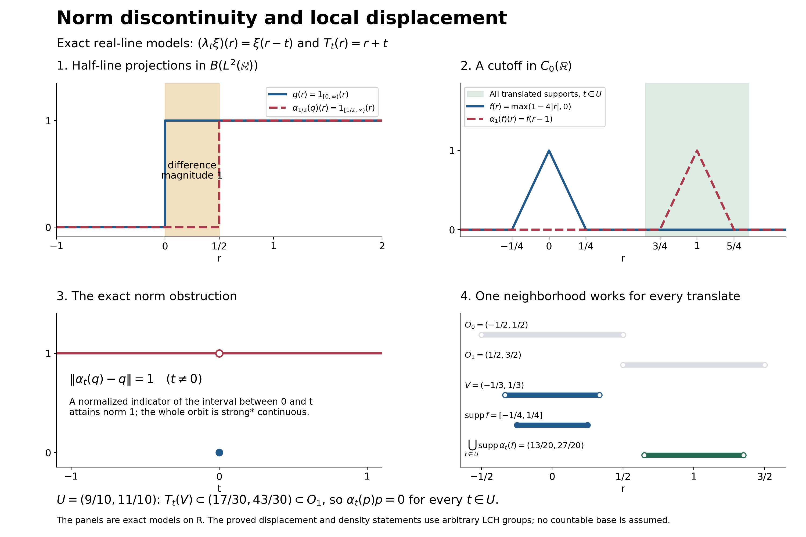

# Local displacement and the continuous C-star part

A normal action can have norm-discontinuous elements even though compact averages of every element have norm-continuous orbits. We first construct this continuous C-star part and prove its density. A translation model then separates that density statement from norm continuity of the whole algebra. Only afterwards do we identify the spectrum visible to a represented commutative system and use a cutoff to obtain a locally orthogonal projection.

*Preserved historical original argument with independently written completion and teaching organization by GPT-6.1 Sol (OpenAI), Ultra, 5 October 2026. CC0-1.0 to the extent of rights held; historical and prerequisite terms remain intact. Spot-checked in a separate AI session.*

## Exact earlier inputs and scope

The group is always locally compact Hausdorff and may be nonabelian, nonunimodular, non-sigma-compact or non-second-countable; Hilbert spaces and von Neumann algebras are arbitrary. The two settings are stated separately below. For the normal action we use [AT1](OA-FLOW-AT.md#oa-flow.at.1), [AT5](OA-FLOW-AT.md#oa-flow.at.5) and the retained complete alternative [AT6](OA-FLOW-AT.md#oa-flow.at.6), with [ST2](OA-FLOW-ST12.md#oa-flow.st.2) for bounded topology comparisons. [L24 translations](OA-FLOW-L24.md#oa-flow.grp.translations), [vector integration](OA-FLOW-L24.md#oa-flow.grp.vectorintegration) and [Haar conventions](OA-FLOW-L24.md#oa-flow.grp.haarconventions) supply the actual scalar and vector integrals. [CP6](OA-FLOW-CP.md#oa-flow.cp.6) supplies all concrete normal functional tests; fixed multiplication is checked locally below. The [CF3 norm facts](OA-FLOW-CF.md#oa-flow.cf.3), [CF4 character bounds](OA-FLOW-CF.md#oa-flow.cf.4), [CF7 positivity](OA-FLOW-CF.md#oa-flow.cf.7), [CF8 arbitrary-Hilbert tools and quadratic positivity](OA-FLOW-CF.md#oa-flow.cf.8), and [HR6 positive Haar normalization](OA-FLOW-HR.md#hr-06) are the exact additional earlier inputs.

The nonunital bridge uses exactly [CF6](OA-FLOW-CF.md#oa-flow.cf.6), [CF9](OA-FLOW-CF.md#oa-flow.cf.9), the full [C-star quotient/closed-image proof](OA-FLOW-L24.md#oa-flow.grp.cstarquotients), and [QF1](OA-FLOW-QF.md#qf-1). Compact cutoffs come from [H0](OA-FLOW-TOPOLOGY.md#l138-h0). [PC1](OA-FLOW-PC.md#oa-flow.projection.pc1) supplies bounded supports and the concrete bicommutant proof; [BD4](OA-FLOW-BD.md#oa-flow.bd.4) and [BD5](OA-FLOW-BD.md#oa-flow.bd.5) supply the bounded strong-star-to-ultraweak density passage. Every citation to the external antecedent is credit, not a replacement for these proofs.

## Norm-continuous elements form an invariant C-star algebra

Now let \(\alpha:G\to\operatorname{Aut}(M)\) be a point-ultraweakly continuous action of an arbitrary locally compact group on a von Neumann algebra. Define its norm-continuous part by

$$M_{\mathrm c}
=
\left\{x\in M:
\lim_{t\to e}\|\alpha_t(x)-x\|=0\right\}. \tag{D14}$$

This is a norm-closed unital star subalgebra: sums and scalar multiples follow from the triangle inequality, and the unit is fixed. It includes the zero algebra with its zero unit. For products,

$$\|\alpha_t(xy)-xy\|
\le
\|\alpha_t(x)-x\|\,\|y\|
+\|x\|\,\|\alpha_t(y)-y\|. \tag{D15}$$

Adjoints preserve the norm difference, and every \(\alpha_t\) is isometric. If \(x_n\in M_{\mathrm c}\) and \(\|x_n-x\|\to0\), then \(\|\alpha_t(x)-x\|\le2\|x-x_n\|+\|\alpha_t(x_n)-x_n\|\). First choose one sufficiently close \(x_n\), then a group neighbourhood for its orbit. This proves norm closure without any first-countability assumption on the group.

The algebra is globally invariant. If \(x\in M_{\mathrm c}\) and \(r\in G\), then

$$\|\alpha_t(\alpha_r(x))-\alpha_r(x)\|
=
\|\alpha_{r^{-1}tr}(x)-x\|
\longrightarrow0
\qquad(t\to e). \tag{D16}$$

The restricted action is norm continuous at the identity by definition and therefore at every group point. Thus

$$(M_{\mathrm c},G,\alpha|_{M_{\mathrm c}}) \tag{D17}$$

is a C\*-covariant system.

## Compact smoothing lands in the continuous part

Fix left Haar measure on \(G\). For \(f\in C_c(G)\) and \(x\in M\), define the ultraweak integral

$$x_f=\int_G f(s)\alpha_s(x)\,ds. \tag{D18}$$

AT5 defines the integral by its genuine predual adjoint and proves its normality. It satisfies

$$\|x_f\|\le\|f\|_1\|x\|. \tag{D19}$$

With

$$(\lambda_tf)(r)=f(t^{-1}r), \tag{D20}$$

left invariance of Haar measure gives

$$\alpha_t(x_f)=x_{\lambda_tf}. \tag{D21}$$

Consequently

$$\|\alpha_t(x_f)-x_f\|
\le
\|\lambda_tf-f\|_1\|x\|
\longrightarrow0
\qquad(t\to e). \tag{D22}$$

The full L24 translation theorem proves this \(L^1(G)\) limit for arbitrary groups and both recorded Haar conventions. Hence

$$x_f\in M_{\mathrm c}. \tag{D23}$$

The estimate is an operator-norm statement even though the original orbit of \(x\) was assumed only ultraweakly continuous.

## Positive local averages are strong-star dense

Direct the relatively compact identity neighborhoods \(U\) by reverse inclusion. Choose

$$f_U\in C_c(G),\qquad
f_U\ge0,\qquad
\int_G f_U(s)\,ds=1,\qquad
\operatorname{supp}f_U\subset U. \tag{D24}$$

H0 supplies a nonnegative cutoff equal to one near the identity and compactly supported in any such \(U\). Haar measure has full support and is finite on compact sets by L24, so division by its strictly positive finite integral supplies (D24). This net is directed by all relatively compact identity neighbourhoods, rather than by an assumed countable base.

Set \(x_U=x_{f_U}\in M_{\mathrm c}\), with \(\|x_U\|\le\|x\|\). We prove

$$x_U\longrightarrow x
\quad\text{in the sigma-strong-star topology}. \tag{D25}$$

Let \(\varphi\) be a normal positive functional and put
\(z_U=x_U-x\). Here is the complete positive-average estimate. Put \(b_s=\alpha_s(x)-x\), \(f=f_U\), and \(z=\int f(s)b_s\,ds=z_U\). For every vector \(\xi\), AT1 and the compact support of \(f\) make \(s\mapsto f(s)b_s\xi\) a Bochner-integrable vector field by L24. Its coefficients are the AT5 coefficients, so its integral is exactly \(z\xi\). The vector triangle inequality and scalar probability inequality yield

\[
 \|z\xi\|^2\le\left(\int f(s)\|b_s\xi\|\,ds\right)^2
 \le\int f(s)\|b_s\xi\|^2\,ds.
 \tag{LD1}
\]

For the last inequality, set \(c=\int f(s)\|b_s\xi\|\,ds\). Expanding the nonnegative integral \(\int f(s)(\|b_s\xi\|-c)^2\,ds\) and using \(\int f=1\) gives the claim. All quantities are finite, since \(\|b_s\|\le2\|x\|\). No operator-norm measurability of the original orbit is asserted.

The bounded positive operator integral is explicitly

\[
 R=T_f(x^*x)-T_f(x^*)x-x^*T_f(x)+x^*x
   =\int f(s)b_s^*b_s\,ds.
 \tag{LD2}
\]

The first expression belongs to \(M\) by AT5. Testing fixed multiplication \(a y b\) against a CP6 vector series replaces its square-summable vectors by \((b\xi_n,a^*\eta_n)\); this proves normality and every scalar integral identity in the second expression. Its vector tests are \(\int f\|b_s\xi\|^2\), so the CF8 positivity criterion makes \(R\ge0\). Formula (LD1) gives \(R-z^*z\ge0\). Applying the finite normal positive functional \(\varphi\), and then its defining AT5 integral identity, proves

$$\varphi(z_U^*z_U)
\le
\int_G f_U(s)
\varphi\!\left((\alpha_s(x)-x)^*(\alpha_s(x)-x)\right)\,ds. \tag{D26}$$

The scalar integrand tends to zero as \(s\to e\). Indeed, after expansion it is a sum of evaluations of
\(\alpha_s(x^*x)\), \(\alpha_s(x^*)x\), \(x^*\alpha_s(x)\), and \(x^*x\), each ultraweakly continuous at the identity. Given any positive error, continuity provides an identity neighbourhood on which this nonnegative integrand is below that error. Every sufficiently late \(U\) is contained there; hence its supremum on \(\operatorname{supp}f_U\) tends to zero. Apply the identical argument to \(x^*\); since \(f_U\) is real, its averaged difference is \(z_U^*\). This controls \(z_Uz_U^*\) as well as its opposite product and proves both intrinsic seminorm estimates, hence (D25). The averages are uniformly norm bounded, so ST2 also identifies this convergence with concrete bounded strong-star convergence in every faithful normal representation. Indeed an operator commuting with every element of \(M_{\mathrm c}\) commutes with each bounded strong limit \(x\in M\), and conversely \(M_{\mathrm c}\subset M\). Their commutants agree, and the PC1 bicommutant characterization of the concrete von Neumann algebra gives (D27). This written scalar-positive-average proof complements the direct vector/predual proof already available in AT6.

Thus \(M_{\mathrm c}\) is sigma-strong-star dense, hence ultraweakly dense, in \(M\):

$$M_{\mathrm c}''=M \tag{D27}$$

in every faithful normal representation. The inclusion
\(M_{\mathrm c}\hookrightarrow M\), together with the original action on \(M\), is therefore an \(\alpha|_{M_{\mathrm c}}\)-representation.

## A proper continuous part on the real line

The continuous part can be proper. On \(\mathcal H=L^2(\mathbb R)\), let
\(\lambda_t\) be the left regular translation \((\lambda_t\xi)(r)=\xi(r-t)\), with Lebesgue Haar measure, and let

$$\alpha_t=\operatorname{Ad}(\lambda_t)
\quad\text{on }B(\mathcal H). \tag{D28}$$

The L24 \(L^2\) translation theorem makes \(t\mapsto\lambda_t\xi\) strongly continuous for every \(\xi\). For fixed \(a\in B(\mathcal H)\), expanding \(\lambda_t a\lambda_t^*\xi-a\xi\) into the change of \(\lambda_t^*\xi\) and the change of \(\lambda_t\) on the fixed vector \(a\xi\) proves point-strong continuity; repeating for \(a^*\) proves strong-star continuity. BD5 therefore gives point-ultraweak continuity of this uniformly bounded orbit, as required for the normal action.

For \(\theta_{\xi,\eta}v=\langle v,\eta\rangle\xi\), Hilbert Cauchy–Schwarz and testing at \(\eta/\|\eta\|\) give \(\|\theta_{\xi,\eta}\|=\|\xi\|\|\eta\|\), including a zero vector by continuity. Conjugation sends this rank-one operator to \(\theta_{\lambda_t\xi,\lambda_t\eta}\). The two-term estimate

\[
 \|\theta_{\lambda_t\xi,\lambda_t\eta}-\theta_{\xi,\eta}\|
 \le\|\lambda_t\xi-\xi\|\|\eta\|+\|\xi\|\|\lambda_t\eta-\eta\|
 \longrightarrow0
 \tag{LD3}
\]

proves norm continuity of every finite-rank orbit. Every compact operator is their norm limit: a finite error-net for the image of the unit ball lies in a finite-dimensional space \(E\), and orthogonal projection \(p_E\) gives \(\|a-p_Ea\|\) below that error. Norm closure of \(M_{\mathrm c}\) therefore proves the entire compact-operator assertion. But if \(q\) is multiplication by \(1_{[0,\infty)}\), then

$$\|\alpha_t(q)-q\|=1\qquad(t\ne0), \tag{D29}$$

To see the exact norm, \(\alpha_t(q)\) multiplies by \(1_{[t,\infty)}\). The difference has magnitude at most one everywhere and exactly one on the interval between \(0\) and \(t\), which has positive finite measure. Its normalized characteristic vector gives the lower bound one. Thus \(q\notin M_{\mathrm c}\). This gives a concrete proper, strongly dense continuous C\*-part.

## The nonunital Gelfand and hull-quotient bridge

Let \(A\) be any commutative C-star algebra. CF9 supplies the forced unitization \(A^\dagger=A\oplus\mathbb C\), even when \(A\) already has a unit. The scalar map \(q(a,\lambda)=\lambda\) is a character and \(A=\ker q\). Apply CF6 to \(A^\dagger\), with compact Hausdorff character space \(X\). Under its onto Gelfand isomorphism, \(A\) is exactly the continuous functions vanishing at the point \(q\). Put \(\Omega=X\setminus\{q\}\), an open LCH subspace.

Restricting such a function to \(\Omega\) puts it in \(C_0(\Omega)\): every nonzero level set is compact in \(X\) and avoids \(q\). Conversely, if \(g\in C_0(\Omega)\), extension by zero at \(q\) is continuous. For each positive error the compact set \(\{|g|\ge\epsilon\}\subset\Omega\) is closed in \(X\); its complement is a neighbourhood of \(q\) on which the extension is small. This proves the isometric star identification \(A=C_0(\Omega)\), including its topology and all products.

Every nonzero character \(\chi\) of \(A\) extends uniquely to \(\chi^\dagger(a,\lambda)=\chi(a)+\lambda\). Direct multiplication verifies the character identity, and the unital character bounds and star property proved in CF3–6 apply to this extension. Conversely a character of \(A^\dagger\) other than \(q\) restricts nontrivially, since vanishing on \(A\) forces it to equal \(q\). The coordinate topology is unchanged because the added scalar coordinate is constant at each character. Thus this \(\Omega\) is precisely the usual nonzero character spectrum. For an already unital \(A\), its internal unit has Gelfand value one at every point of \(\Omega\) and zero at \(q\), so \(q\) is isolated and \(\Omega\) is compact; the forced extra scalar point causes no loss. For \(A=0\), \(X=\{q\}\), \(\Omega=\varnothing\); the subsequent nonidentity represented-action hypothesis is impossible.

Let \(I\) be a norm-closed star ideal in \(C_0(\Omega)\), and let \(F\) be its common zero set. It is closed. We prove that \(I\) consists exactly of the functions vanishing on \(F\). Only the reverse inclusion needs proof. For such a \(g\) and \(\epsilon>0\), put \(K=\{|g|\ge\epsilon\}\). If \(K\) is empty then \(g\) is already within \(\epsilon\) of zero in \(I\). Otherwise \(K\) is compact and disjoint from \(F\). Each point of \(K\) has some \(a\in I\) nonzero there. A finite cover gives \(a_1,\ldots,a_m\in I\) such that \(h=\sum_j|a_j|^2\) is strictly positive on \(K\); compactness supplies \(\delta>0\) with \(h\ge\delta\) there. For \(\eta>0\),

\[
 g_\eta=g\,h/(h+\eta)\in I,\qquad
 \|g-g_\eta\|\le\max\{\epsilon,\|g\|\eta/\delta\}.
 \tag{LD4}
\]

Indeed \(g/(h+\eta)\) is continuous and vanishes at infinity, with norm at most \(\|g\|/\eta\); multiplying it by \(h\in I\) stays in the ideal. Outside \(K\) the error is below \(\epsilon\); on \(K\) it is at most \(\|g\|\eta/\delta\). Choosing \(\eta\) sufficiently small and then arbitrary \(\epsilon\), closedness gives \(g\in I\).

Restriction \(C_0(\Omega)\to C_0(F)\) is a star homomorphism with this kernel. The target is a C-star algebra: zero extension identifies it with the closed ideal of continuous functions on its one-point compactification vanishing at infinity, as above. L24 Section10 makes the restriction range closed and its induced quotient map isometric. QF1 extends every \(C_c(F)\) function to \(C_c(\Omega)\). These functions are dense in \(C_0(F)\): multiply any \(g\) by an H0 compact cutoff equal to one on its compact nonzero level set; the uniform error is below the chosen level. Hence the restriction range is onto, and

\[
 A/I\ \cong\ C_0(F)
 \tag{LD5}
\]

is the required isometric star isomorphism. This proof covers empty \(F\), unital \(A\), arbitrary nonunital \(A\), and spaces without any countable exhaustion.

## A nontrivial represented action moves a visible point

Let \((A,G,\alpha)\) be a norm-continuous C-star covariant system with \(A\) abelian. Let \(\pi:A\to B(\mathcal H)\) be a star representation and suppose a point-ultraweakly continuous normal action \(\widetilde\alpha\) on \(\pi(A)''\) satisfies \(\widetilde\alpha_t\pi(a)=\pi(\alpha_ta)\). This is the represented-action hypothesis; its existence is not inferred for every representation. The represented extension implements the original action \(\alpha\). Degenerate representations are allowed. Write

$$P=\pi(A)'',\qquad I=\ker\pi. \tag{D1}$$

The ideal \(I\) is \(\alpha\)-invariant. If \(a\in I\), covariance gives \(\pi(\alpha_ta)=0\), and applying the inverse action gives \(\alpha_t(I)=I\). Contractivity of the star representation makes \(I\) norm closed. Put

$$\Omega=\operatorname{Spec}(A),\qquad
F=h(I)=\{\omega\in\Omega:a(\omega)=0\text{ for every }a\in I\}. \tag{D2}$$

The complete preceding hull bridge gives \(A/I\cong C_0(F)\). Kernel invariance makes \(F\) invariant: composing a character annihilating \(I\) with \(\alpha_{t^{-1}}\) still annihilates it. Define the induced action on \(\Omega\) by

$$T_t\omega=\omega\circ\alpha_{t^{-1}}. \tag{D3}$$

Thus

$$(\alpha_ta)(\omega)=a(T_{t^{-1}}\omega). \tag{D4}$$

The map \((t,\omega)\mapsto T_t\omega\) is continuous. To check this directly, let
\((t_i,\omega_i)\to(t,\omega)\). For every \(a\in A\),

$$\begin{aligned}
\bigl|a(T_{t_i}\omega_i)-a(T_t\omega)\bigr|
&=
\bigl|\omega_i(\alpha_{t_i^{-1}}a)-\omega(\alpha_{t^{-1}}a)\bigr|\\
&\le
\|\alpha_{t_i^{-1}}a-\alpha_{t^{-1}}a\|
+\bigl|\omega_i(\alpha_{t^{-1}}a)-\omega(\alpha_{t^{-1}}a)\bigr|
\longrightarrow0.
\end{aligned} \tag{D5}$$

The Gelfand topology is the weakest topology making all these functions continuous, so (D5) proves joint continuity.

Assume that \(\widetilde\alpha_s\ne\operatorname{id}_P\). We must detect this on the quotient even if \(\pi\) is degenerate. The unital algebra \(B=\pi(A)+\mathbb C I_{\mathcal H}\) is the closed star image of the forced unitization by L24 Section10, and \(B''=P\). BD4 gives bounded strong-star approximation of every contraction in \(P\) by elements of \(B\), and BD5 turns it into ultraweak approximation. If the normal unital map \(\widetilde\alpha_s\) fixed \(\pi(A)\) pointwise, it would fix \(B\), then all of \(P\), a contradiction. Thus the induced automorphism on \(A/I\) is nontrivial. If it fixed every point of \(F\), the isomorphism with \(C_0(F)\) would make it the identity on the quotient. This is impossible. Hence some

$$\omega_0\in F\qquad\text{satisfies}\qquad
T_s\omega_0\ne\omega_0. \tag{D6}$$

This restriction to \(F\) matters: points outside \(F\) are invisible to the representation.

## A Gelfand cutoff gives a locally disjoint projection

Choose disjoint neighborhoods \(O_0\ni\omega_0\) and
\(O_1\ni T_s\omega_0\). Joint continuity supplies a neighborhood \(U\) of \(s\) and a relatively compact open neighborhood \(V\) of \(\omega_0\) such that

$$V\subset O_0,\qquad
T_t(V)\subset O_1\quad(t\in U). \tag{D7}$$

In particular,

$$T_t(V)\cap V=\varnothing,\qquad t\in U. \tag{D8}$$

Choose \(f\in C_c(\Omega)\) with

$$0\le f\le1,\qquad f(\omega_0)=1,\qquad
\operatorname{supp}f\subset V, \tag{D9}$$

and let \(p=s(\pi(f))\) be the support projection of \(\pi(f)\) in the abelian von Neumann algebra \(P\). Because \(\omega_0\in F\), the function \(f\) does not belong to \(I\); hence

$$p\ne0. \tag{D10}$$

By (D4), \(\operatorname{supp}(\alpha_t f)\subset T_t(V)\). Equations (D8)--(D9) give

$$\alpha_t(f)f=0,\qquad t\in U. \tag{D11}$$

Normal automorphisms preserve support projections, so

$$\widetilde\alpha_t(p)
=s\!\left(\pi(\alpha_t f)\right).
\tag{D12}$$

Here are both support steps explicitly. For a bounded positive operator \(a\), PC1 puts the projection onto \(\overline{a\mathcal H}\) in \(P\); it is the least projection \(r\) with \(ra=a\). Normal automorphisms preserve this characterization, proving (D12). If bounded positive \(a,b\) have \(ab=0\), then \(b\mathcal H\subset\ker a=(\overline{a\mathcal H})^\perp\); taking closures makes their range projections orthogonal. Apply this to \(a=\pi(\alpha_tf)\) and \(b=\pi(f)\), whose product is zero by (D11). We have proved

$$\boxed{\widetilde\alpha_t(p)p=0
\qquad(t\in U)}. \tag{D13}$$

No commutativity of \(G\) was used. Commutativity was required only for the coefficient algebra \(A\), so that points and disjoint open sets in its Gelfand spectrum can be used.

## The paired real-line models and solved checks

The two examples use the same left regular convention but answer different questions. The discontinuous element is the half-line projection \(q\) in \(B(L^2(\mathbb R))\). For \(t=1/2\), its difference from \(\alpha_t(q)\) has magnitude one on \([0,1/2)\), so (D29) is exact, not an estimate approaching zero.

For the displacement example take \(A=C_0(\mathbb R)\), represented by multiplication on \(L^2(\mathbb R)\), and \(\alpha_t f(r)=f(r-t)\). This representation is faithful: a nonzero continuous function is bounded away from zero on an open interval of positive Haar measure, and a characteristic vector detects its nonzero multiplication operator. For a compactly supported continuous function, uniform continuity on a compact interval enlarged by one makes its uniform translation difference tend to zero; outside that interval both translates vanish for small \(t\). H0 gives uniform \(C_c\) approximation of every \(C_0\) function, so the isometric three-term estimate proves norm continuity of the action on \(C_0\). Its normal extension is the restriction of the already checked conjugation action on \(B(L^2)\): covariance is direct substitution, and conjugation preserves the generated bicommutant by transporting commutants. Here \(T_t(r)=r+t\), \(F=\Omega=\mathbb R\), and choose

\[
 s=1,\quad U=(9/10,11/10),\quad V=(-1/3,1/3),\quad
 O_0=(-1/2,1/2),\quad O_1=(1/2,3/2),\quad
 f(r)=\max(1-4|r|,0).
 \tag{LD6}
\]

Then \(f(0)=1\), \(\operatorname{supp}f=[-1/4,1/4]\subset V\). For every \(t\in U\), \(T_t(V)\subset(17/30,43/30)\subset O_1\); it is disjoint from \(V\). The support projection is multiplication by \(1_{(-1/4,1/4)}\). Its translate is multiplication by \(1_{(t-1/4,t+1/4)}\), so their product is exactly zero for every \(t\in U\). No numerical sampling is used to prove this neighbourhood statement.

**Problem 1.** Can point-ultraweak continuity of a normal action be replaced by an assertion that every orbit is norm continuous?

**Solution.** Norm continuity would imply point-ultraweak continuity since each normal functional is bounded, but it is a stronger hypothesis. In (D28), all orbits are strong-star and ultraweak continuous, while (D29) gives a norm-discontinuous orbit. The continuous part is strongly dense and proper, and contains every compact operator. This distinction is the reason for smoothing rather than assuming \(M_{\mathrm c}=M\).

**Problem 2.** Why must the cutoff point lie in the represented closed set \(F\), and does a degenerate representation spoil the argument?

**Solution.** At a point outside \(F\), nonzero functions can lie in the kernel; their image and support projection can vanish. At \(\omega_0\in F\), \(f(\omega_0)=1\) forces \(f\notin I\) and gives (D10). Degeneracy only prevents claiming that \(\pi(A)\) itself fills the unital bicommutant; the proved density of \(\pi(A)+\mathbb C I\) and unitality of the normal extension give the same nonidentity test. No faithful-state or nondegeneracy assumption is added.

## Human antecedent and bounded conclusion

The two targets and the common smoothing/cutoff mechanisms occur in Takesaki, [*Theory of Operator Algebras II*, Definition XI.2.4 and Lemma XI.2.5, printed333–334](https://doi.org/10.1007/978-3-662-10451-4). This restored teaching order begins with the continuous part and its properness model, then supplies the nonunital spectrum/ideal quotient proof before the represented displacement application. The exact Jensen and degenerate-image density passages are written here. The earlier free-source AT construction and its complete arbitrary-group approximation proof remain available and unchanged. A source citation does not supply a missing internal proof.

The bounded conclusions are the invariant norm-continuous C-star part with bounded sigma-strong-star density in every faithful normal realization, and local orthogonal-projection displacement for represented commutative systems, with arbitrary LCH group, arbitrary coefficient algebra/Hilbert space and the stated representation hypothesis. No integrable-action eigenoperator theorem, general homogeneity result or whole C3 completion is asserted.

## The paired displacement illustration

Both models use Lebesgue left Haar measure on \(\mathbb R\), \((\lambda_t\xi)(r)=\xi(r-t)\), and conjugation by \(\lambda_t\). The displayed coordinate functions are exact step or piecewise-linear functions; their finite drawing coordinates are not a sampled proof of continuity or orthogonality.

In the upper-left panel, \(q\) is multiplication by \(1_{[0,\infty)}\), and its translate at \(t=1/2\) is multiplication by \(1_{[1/2,\infty)}\). The shaded interval \([0,1/2)\) has difference magnitude one. For every nonzero \(t\), the interval between \(0\) and \(t\) has positive finite measure; its normalized indicator vector proves \(\|\alpha_t(q)-q\|=1\). At zero the norm is zero, represented by the blue point in the lower-left panel; the open red point excludes zero from the constant-one branch. Endpoint choices for these multipliers differ only on Lebesgue-null points. This is the exact [D28–29 model](OA-FLOW-L113.md#l113-translation-model), whose orbit is nevertheless strong-star continuous.

The upper-right panel uses \(A=C_0(\mathbb R)\) in its faithful multiplication representation and \(T_t(r)=r+t\). The blue cutoff is \(f(r)=\max(1-4|r|,0)\), with closed function support \([-1/4,1/4]\) and positive set \((-1/4,1/4)\). Thus its operator support projection is multiplication by \(1_{(-1/4,1/4)}\). The red dashed curve is the exact translate at \(t=1\). The green region is the union of closed function supports for all \(t\in U=(9/10,11/10)\), namely the open interval \((13/20,27/20)\); openness comes from the open parameter interval.

The lower-right intervals retain \(V=(-1/3,1/3)\), \(O_0=(-1/2,1/2)\), and \(O_1=(1/2,3/2)\). Open endpoint circles denote open intervals; the filled endpoints denote the closed support of \(f\). For every \(t\in U\),

\[
 T_t(V)=(t-1/3,t+1/3)\subset(17/30,43/30)\subset O_1,
 \qquad \operatorname{supp}f\subset V\subset O_0.
\]

Consequently \(\alpha_t(p)p=0\) on this entire neighborhood. The figure's exact rational coordinates and endpoint conventions are retained in the [data](../assets/local-displacement-continuous-part/assets/paired-displacement-data.json); see the complete [LD6 model](OA-FLOW-L113.md#l113-model) and [D7–13 proof](OA-FLOW-L113.md#l113-displacement).

These are real-line explanatory models. The written density theorem concerns arbitrary LCH group actions on arbitrary von Neumann algebras/Hilbert spaces; the displacement theorem concerns arbitrary LCH groups with a commutative coefficient algebra and the stated represented normal action. Neither diagram changes these hypotheses. The common mechanisms have the human antecedent Takesaki, [*Theory of Operator Algebras II*, Lemma XI.2.5, printed333–334](https://doi.org/10.1007/978-3-662-10451-4); the paired geometry and exact model are drawn independently here.

Native PNG dimensions are \(3000\times2000\). The [editable SVG](../assets/local-displacement-continuous-part/assets/paired-displacement.svg) and [reproduction source](../assets/local-displacement-continuous-part/render_displacement.py) preserve the complete figure. Original diagram/code/data are CC0-1.0 to the extent of rights held; DejaVu font terms remain separate.
