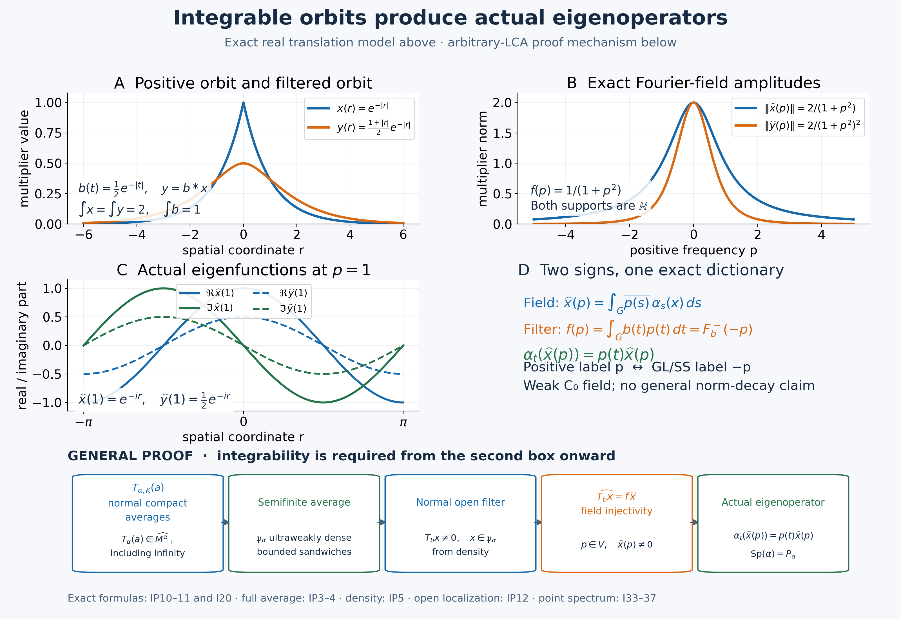

# Integrable actions: orbit averages, filters and actual eigenoperators

An integrable orbit has a weak Fourier field. The proof starts with the entire positive orbit average and its bounded domain, then proves a uniform coefficient estimate and the exact filter multiplier. Those steps identify the field support and show why an integrable action detects actual eigenoperators in every nonzero open localization.

The arbitrary LCH abelian group and arbitrary von Neumann algebra are retained. Weak C0 decay is distinguished from operator-norm decay. The real translation example is a separate exact model; it is not a countable reduction of the group.

*Restored local proof, 5 October 2026. Spot-checked in a separate AI session. Original expression and illustration are CC0-1.0 to the extent of rights held; earlier component terms remain their own.*

## Earlier proofs and two Fourier conventions

The complete normal integration theorem is [AT3–5](OA-FLOW-AT.md#oa-flow.at.3); [CP4–6](OA-FLOW-CP.md#oa-flow.cp.4) supplies the concrete quotient predual and its vector series. The full extended cone, including its infinite part, is [EP2–4](OA-FLOW-EP.md#oa-flow.ep.2), with normal spectral transport in [FF-5](OA-FLOW-FF.md#oa-flow.ff.6). [EP6](OA-FLOW-EP.md#oa-flow.ep.6) supplies the operator-valued finite ideals; [GW4](OA-FLOW-GW.md#oa-flow.gw.4) proves the hereditary-cone density mechanism. Bounded monotone limits are the purely operator-theoretic [WF2](OA-FLOW-WF.md#oa-flow.wf.2), and [PC1](OA-FLOW-PC.md#oa-flow.projection.pc1) supplies arbitrary projection joins.

Use the actual arbitrary-group Haar conventions [HR3/5/7–9](OA-FLOW-HR.md#hr-03). Finite-exponent classes have Borel representatives on sigma compact carriers. Product integration uses the Radon product with its qualified carrier theorem, not an unrestricted product-Borel identification. The scalar [H1](OA-FLOW-HARMONIC.md#oa-flow.xgaps.cstar.h1) proves Fourier injectivity and C0 regularity; [LF1](OA-FLOW-LF.md#lf-1), [GL1–3/7](OA-FLOW-GL.md#gl-1) and [SS3](OA-FLOW-SS.md#ss-3) supply local plateaus, exact hull/filter laws and singleton synthesis.

Throughout, \(G\) is LCH abelian, \(H=\widehat G\), \(M\) is a nonzero von Neumann algebra, and \(\alpha\) is a point-ultraweakly continuous normal action. The retained I-formulas use positive spectral labels. Write \(p\mapsto-p\) for inversion of characters. For the same \(b\in L^1(G)\), put

\[
 F_b^-(p)=\int b(t)\overline{p(t)}\,dt,\qquad
 f_b^+(p)=\int b(t)p(t)\,dt=F_b^-(-p),\qquad Rf(p)=f(-p).
 \tag{IP1}
\]
Inversion of an abelian group preserves the fixed Haar measure: its image is a left Haar measure, so HR7 makes it \(c\,ds\); applying inversion twice gives \(c^2=1\), hence \(c=1\). Thus \(b(t)\mapsto b(-t)\) is an isometric involution on \(L^1\), and its negative transform is \(f_b^+\). The positive and negative Fourier algebras are the same set of functions, with the same norm; \(R\) is an isometric algebra involution.

Let \(T_b\) be the actual normal AT5 filter. The positive-label annihilator is \(\{f_b^+:T_bx=0\}=R\{F_b^-:T_bx=0\}\). Taking hulls gives, directly,

\[
 \operatorname{Sp}_\alpha(x)=-\operatorname{sp}_\alpha(x),\qquad
 M_\alpha(E)=M_{\mathrm{GL}}(-E),\qquad
 \operatorname{Sp}(\alpha)=-\operatorname{sp}(\alpha).
 \tag{IP2}
\]
The same reflection transports all filter supports, ideals and their hulls. An eigenphase \(p(t)\) has the GL/SS label \(-p\), hence the retained positive label \(p\). The open filter span with positive supports in \(V\) is the negative-support span for \(-V\). Every GL/SS use below is through this dictionary; no sign is silently identified.

## The bounded integrability domain

Let \(G\) be a locally compact abelian group, let \(H=\widehat G\), and write

$$ (s,p)=p(s),\qquad s\in G,\ p\in H. \tag{I1}$$

Fix Haar measure \(ds\) and a point-ultraweakly continuous action

$$\alpha:G\longrightarrow\operatorname{Aut}(M) \tag{I2}$$

on a nonzero von Neumann algebra.  For \(a\in M_+\) and compact \(K\subset G\), put

$$T_{\alpha,K}(a)=\int_K\alpha_s(a)\,ds. \tag{I3}$$

The positive integrability domain and its complex span are

$$\begin{aligned}
\mathcal P_\alpha^+
&=\left\{a\in M_+:\sup_{K\Subset G}\|T_{\alpha,K}(a)\|<\infty\right\},\\
\mathfrak p_\alpha&=\operatorname{span}_{\mathbb C}\mathcal P_\alpha^+.
\end{aligned} \tag{I4}$$

For \(a\in\mathcal P_\alpha^+\), monotone completeness gives the bounded positive orbit integral

$$T_\alpha(a)=\sup_{K\Subset G}T_{\alpha,K}(a)\in M_+. \tag{I5}$$

Here is the full operator-valued weight behind this bounded domain. Put \(N=M^\alpha\). Each automorphism is normal, so its fixed-point kernel is ultraweakly closed; the intersection is a unital star subalgebra, hence a concrete von Neumann algebra. AT3 gives norm-continuous predual orbits. For compact \(K\), AT5 with \(1_K\in L^1(G)\) constructs a normal positive map \(T_{\alpha,K}\) on all of \(M\), with norm at most \(|K|\). Equivalently its preadjoint is the Bochner integral of the predual orbit on \(K\); compact norm image supplies its finite simple approximants.

For every \(a\in M_+\), define first in \(\widehat M_+\)

\[
 \mathcal T(a)=\sup_{K\Subset G}T_{\alpha,K}(a),\qquad
 \mathcal T(a)(\omega)=\sup_K\int_K\omega(\alpha_s(a))\,ds
 =\int_G\omega(\alpha_s(a))\,ds\quad(\omega\in M_*^+).
 \tag{IP3}
\]
Finite unions direct the compact sets. EP4 gives the entire increasing supremum, including infinite values; equivalently it is an additive homogeneous lower semicontinuous functional on \(M_*^+\), since each compact evaluation is norm continuous. The last equality is the Radon compact-inner formula for a continuous nonnegative function, including infinity (HR5). Directedness likewise proves additivity in \(a\), using one common compact upper bound for two lower approximations; \(0\cdot\infty=0\).

Haar translation of the compacts gives \(\alpha_t(\mathcal T(a))=\mathcal T(a)\) and \(\mathcal T(\alpha_t(a))=\mathcal T(a)\). In the EP2–3 intrinsic spectral pair, its finite-part projection and every finite-part spectral projection are consequently fixed, by uniqueness and FF-5 normal spectral transport. They belong to \(N\). The same pair therefore reconstructs a unique value \(T_\alpha(a)\in\widehat N_+\), whose normal inclusion into \(\widehat M_+\) is \(\mathcal T(a)\). This includes a zero finite part and a nonzero infinite-part projection; it is not just a bounded fixed element. To see affiliation explicitly, every unitary in \(N'\) commutes with those projections, hence with their bounded spectral truncations and the full closed form. EP3 reconstructs its value on every positive normal test. FF-5 supplies the faithful inclusion's order reflection and preservation of increasing suprema.

For a bounded increasing net \(a_i\uparrow a\), normality of each compact map gives

\[
 \mathcal T(a)(\omega)=\sup_K\sup_i\omega(T_{\alpha,K}(a_i))
 =\sup_i\sup_K\omega(T_{\alpha,K}(a_i))
 =\sup_i\mathcal T(a_i)(\omega).
 \tag{IP4}
\]
These are the same two directed suprema; no arbitrary-net measurable monotone convergence is invoked. The inclusion reflects this identity in \(\widehat N_+\), proving normality. For \(b\in N\), fixedness gives \(T_{\alpha,K}(b^*ab)=b^*T_{\alpha,K}(a)b\). Test the supremum at \(\omega_b(z)=\omega(b^*zb)\), which is normal positive by CP6, and use EP4/FF-5 transport to obtain \(T_\alpha(b^*ab)=b^*T_\alpha(a)b\) in the entire extended cone. Thus \(T_\alpha\) is an operator-valued weight.

It is faithful. If its value at \(a\) is zero, every continuous nonnegative scalar orbit \(s\mapsto\omega(\alpha_s(a))\) has integral zero. A nonzero value would persist on a nonempty open set of positive Haar measure, a contradiction. Its value at the identity is \(\omega(a)\); positive vector tests separate \(M_+\), so \(a=0\).

The bounded-output criterion is exactly (I4). A uniform norm bound on the compact averages gives their bounded strong supremum by WF2, hence a bounded value by EP3; conversely a bounded extended value dominates every compact average, giving the same norm bound. The value is in \(N_+\), and its inclusion is precisely (I5).

## Integrability and a controlled dense bounded domain

Write \(F=\mathcal P_\alpha^+\), \(\mathcal N_T=\{x:T_\alpha(x^*x)\in N_+\}\), and \(\mathfrak m_T=\operatorname{span}\mathcal N_T^*\mathcal N_T\). EP6 proves that \(F\) is additive and hereditary, that \(\mathcal N_T\) is a left ideal, and that \(\mathfrak m_T=\operatorname{span}F=\mathfrak p_\alpha\subset\mathcal N_T\). These are operator-valued bounded-value statements, not scalar finiteness.

The action is **integrable** when this operator-valued weight is semifinite, meaning \(\mathcal N_T\) is weak-operator dense. This is equivalent to ultraweak density of \(\mathfrak p_\alpha\). Here is the full GW4 hereditary-cone argument with its hypotheses checked.

If \(\mathfrak p_\alpha\) is ultraweakly dense, its inclusion in \(\mathcal N_T\) gives weak-operator density. Conversely let \(q\) be the join of all projections belonging to \(F\), using PC1. For \(a\in F\), its bounded spectral projection \(p_\epsilon=1_{[\epsilon,\infty)}(a)\leq\epsilon^{-1}a\) belongs to \(F\) by heredity. As \(\epsilon\downarrow0\), these projections increase strongly to \(s(a)\), so \(s(a)\leq q\). If \(x\in\mathcal N_T\), apply this to \(x^*x\); then \(x(1-q)=0\). That equation defines a weak-operator closed space. Density makes it contain \(1\), so \(q=1\).

Direct the entire cone \(F\) by operator order, which is directed because \(a+b\) is an upper bound. Put \(e_a=a(1+a)^{-1}\). Bounded functional calculus gives \(0\leq e_a\leq1\) and \(e_a\leq a\), so \(e_a\in F\). The inverse inequality is justified as in GW4: if \(0<A\leq B\) are invertible, \(C=A^{-1/2}BA^{-1/2}\geq1\), hence \(C^{-1}\leq1\) and \(B^{-1}=A^{-1/2}C^{-1}A^{-1/2}\leq A^{-1}\). Thus \(a\leq b\) implies \(e_a\leq e_b\). WF2 supplies their increasing strong supremum \(E\leq1\). For every projection \(p\in F\), \(np\in F\) and \(e_{np}=n(1+n)^{-1}p\), so \(E\geq p\) and \(E\) is identity on \(p\mathcal H\). Since their join is \(1\), \(E=1\).

Finally \(e_a^2\leq e_a\) gives \(e_a\in\mathcal N_T\); the left ideal gives \(xe_a\in\mathcal N_T\) for every \(x\in M\). Therefore

\[
 e_a x e_a\in\mathfrak m_T=\mathfrak p_\alpha,\qquad
 \|e_a x e_a\|\leq\|x\|,\qquad
 e_a x e_a\longrightarrow x\quad\hbox{strongly and ultraweakly}.
 \tag{IP5}
\]
Strong convergence follows by splitting the two factors with their common bound. CP6's finite-vector and series-tail estimate proves ultraweak convergence of this bounded net. This proves the converse density implication with actual controlled approximants; it never turns an unbounded weak-operator approximation into an ultraweak one.

## A norm-controlled coefficient estimate

The domain provides more than separate scalar integrability.  For \(x\in\mathfrak p_\alpha\), define the finite gauge

$$q_\alpha(x)=\inf\left\{
\sum_{j=1}^n|c_j|\,\|T_\alpha(a_j)\|:
x=\sum_{j=1}^n c_ja_j, a_j\in\mathcal P_\alpha^+
\right\}. \tag{I6}$$

We first supply the quotient-norm detail for every normal functional, without invoking an unproved norm-controlled positive decomposition. For \(\delta>0\), CP5–6 give a lift \(u\in E_{\mathcal H}\) of \(\omega\) with \(\|u\|<\|\omega\|+\delta/3\). Improve the CP4 telescoping construction using [CP2's projective-cost norm](OA-FLOW-CP.md#oa-flow.cp.2): choose algebraic \(v_k\) with errors \(\epsilon_k>0\), \(\sum_k\epsilon_k<\delta/6\), and represent \(d_1=v_1,d_k=v_k-v_{k-1}\) by finite tensor sums with additional total cost less than \(\delta/3\). The norm cost of the blocks is at most
\(\|u\|+\epsilon_1+\sum_{k\geq2}(\epsilon_k+\epsilon_{k-1})
=\|u\|+2\sum_k\epsilon_k\).
Thus listing all blocks yields a vector series

\[
 \omega(z)=\sum_j\langle z\xi_j,\eta_j\rangle,\qquad
 \sum_j\|\xi_j\|\,\|\eta_j\|<\|\omega\|+\delta.
 \tag{IP6}
\]
The summability makes the series absolutely norm convergent. Positive reciprocal rescaling balances each pair, if desired, giving both square-summable sequences with total squared norms equal to this cost. Zero terms are discarded.

For \(a\in F\) and \(B=\|T_\alpha(a)\|\), normality on the bounded compact supremum and the Radon formula already proved in (IP3) give
\(\int\langle\alpha_s(a)\xi,\xi\rangle\,ds\leq B\|\xi\|^2\).
The bounded positive square root gives pointwise Cauchy–Schwarz

\[
 |\langle\alpha_s(a)\xi,\eta\rangle|
 \leq \langle\alpha_s(a)\xi,\xi\rangle^{1/2}
        \langle\alpha_s(a)\eta,\eta\rangle^{1/2}.
 \tag{IP7}
\]
Scalar integral Cauchy–Schwarz and countable nonnegative monotone convergence, valid on arbitrary measure spaces, therefore bound the absolute integral of the series in (IP6) by \(B(\|\omega\|+\delta)\). Let \(\delta\downarrow0\). For a finite decomposition \(x=\sum c_ja_j\) take the triangle inequality and then its infimum in (I6). This proves the stronger constant-one bound

\[
 \int_G|\omega(\alpha_s(x))|\,ds\leq q_\alpha(x)\|\omega\|,
 \tag{IP8}
\]
and in particular preserves the original weaker bound

$$\int_G|\omega(\alpha_s(x))|\,ds
\le 2q_\alpha(x)\|\omega\|. \tag{I7}$$

Indeed, for \(a\in\mathcal P_\alpha^+\) and \(\varphi\in M_*^+\),

$$\int_G\varphi(\alpha_s(a))\,ds
=\varphi(T_\alpha(a))
\le\|\varphi\|\,\|T_\alpha(a)\|, \tag{I8}$$

and the actual near-norm vector-series argument above, followed by a finite positive decomposition of \(x\), yields (I7).  This uniform estimate is what makes the operator-valued Fourier coefficient below an element of \(M=(M_*)^*\); scalar \(L^1\)-membership by itself would not suffice.

## Weak Fourier coefficients are eigenoperators

For \(x\in\mathfrak p_\alpha\) and \(p\in H\), define \(\widehat x(p)\in M\) by

$$\boxed{
\omega(\widehat x(p))
=\int_G\overline{(s,p)}\,\omega(\alpha_s(x))\,ds
\qquad(\omega\in M_*).} \tag{I9}$$

Estimate (I7) proves that the right side is a bounded linear functional of \(\omega\), uniformly in \(p\), so (I9) really does define an element of \(M\).  For \(t\in G\), Haar translation and the group law give

$$\begin{aligned}
\omega(\alpha_t(\widehat x(p)))
&=\int_G\overline{(s,p)}\,
       \omega(\alpha_{t+s}(x))\,ds\\
&=(t,p)\int_G\overline{(r,p)}\,
       \omega(\alpha_r(x))\,dr.
\end{aligned} \tag{I10}$$

Normal functionals separate \(M\), hence

$$\boxed{\alpha_t(\widehat x(p))=(t,p)\widehat x(p).} \tag{I11}$$

Thus every nonzero value of the Fourier field is a \(p\)-eigenoperator.  By the complete [SS3](OA-FLOW-SS.md#ss-3) singleton theorem and the proved reflection dictionary,

$$\widehat x(p)\ne0
\quad\Longrightarrow\quad
0\ne\widehat x(p)\in M_\alpha(\{p\}). \tag{I12}$$

For each \(\omega\in M_*\), the scalar function

$$p\longmapsto\omega(\widehat x(p)) \tag{I13}$$

is the negative-sign Fourier transform of the \(L^1(G)\)-function
\(s\mapsto\omega(\alpha_s(x))\).  Reflection preserves the Fourier algebra, so (I13) belongs to \(A(H)\subset C_0(H)\).  Consequently \(p\mapsto\widehat x(p)\) is ultraweakly continuous and vanishes at infinity after every normal-functional pairing.  This is weak \(C_0\)-decay, not convergence to zero in operator norm.

## Scalar regularity and field injectivity

Define the support of the \(M\)-valued field by

$$E_x=\operatorname{supp}\widehat x
=H\setminus\bigcup\{U\subset H:U\text{ is open and }
\widehat x|_U=0\}. \tag{I14}$$

We first record injectivity on the integrable domain.  If \(y\in\mathfrak p_\alpha\) and \(\widehat y(p)=0\) for every \(p\in H\), then Fourier uniqueness applied to each

$$s\longmapsto\omega(\alpha_s(y))\in L^1(G) \tag{I15}$$

makes that scalar function zero almost everywhere.  It is continuous by point-ultraweak continuity, so it is zero everywhere.  At \(s=0\), this says \(\omega(y)=0\) for every \(\omega\in M_*\), and therefore \(y=0\).

## Filtering preserves the domain and multiplies the field

Let \(f=\mathcal Fb\in A(H)\), using the positive Fourier sign

$$f(p)=\int_Gb(t)(t,p)\,dt. \tag{I16}$$

The normal AT5 filter, in the retained positive-label convention, is

$$\alpha_f(x)=\int_Gb(t)\alpha_t(x)\,dt. \tag{I17}$$

We first verify the domain statement needed to take its Fourier field.  If \(a\in\mathcal P_\alpha^+\) and \(b\ge0\), then \(y=T_b(a)\) is a bounded positive element by AT5. For each positive normal test, the qualified product calculation described below gives

$$T_\alpha(y)=\left(\int_Gb(t)\,dt\right)T_\alpha(a). \tag{I18}$$

The equality is first tested after inclusion in the full extended cone; its right side is bounded, so EP3 makes its left side bounded too. Thus \(y\in\mathcal P_\alpha^+\).  Decomposing a complex \(b\) into four nonnegative functions and \(x\) into integrable positive elements proves

$$\alpha_f(\mathfrak p_\alpha)\subset\mathfrak p_\alpha. \tag{I19}$$

Scalar Fubini, justified by (I7) and \(b\in L^1(G)\), now gives

$$\widehat{\alpha_f(x)}(p)=f(p)\widehat x(p). \tag{I20}$$

Here are all measure and domain qualifications for (I18) and (I20). Let \(c(r)=\omega(\alpha_r(x))\). It is continuous and belongs to \(L^1(G)\) by the proved coefficient estimate; for (I18) take \(x=a\) and a positive \(\omega\). HR3/8–9 provide Borel representatives of \(b,c\) on sigma compact carriers. For the actual continuous coefficient, its nonzero set lies in a countable union of the open sigma compact cosets from HR8: a nonzero value on a coset gives a positive integral of \(|c|\) on a nonempty relatively compact open subset, and only countably many cosets can have positive integral. Thus one may take an actual sigma compact carrier for \(c\), not change its continuous values.

On coordinates \((r,t)\), \(|c(r)b(t)|\) has a sigma-finite Radon-product carrier by HR5's qualified rectangle theorem. The homeomorphism \((s,t)\mapsto(s+t,t)\) preserves this Radon product by HR7 and carries that carrier to a sigma-finite one. HR5 Tonelli/Fubini therefore gives

\[
 \iint |b(t)c(s+t)|\,ds\,dt=\|b\|_1\|c\|_1<\infty.
 \tag{IP9}
\]
The same argument controls changes of a Borel representative of \(b\): a null subset in its sigma compact carrier times the coefficient carrier is a null Radon rectangle, and the shear preserves it. Completed representatives are handled by HR5's null-slice statement. No unrestricted product-Borel equality, global sigma-finiteness, or countable exhaustion of \(G\) is claimed.

For positive \(a,b,\omega\), normality permits
\(\omega(\alpha_s(T_ba))=\int b(t)\omega(\alpha_{s+t}(a))\,dt\).
Tonelli on that carrier and \(r=s+t\) give (I18) on every positive normal test; translation invariance makes its inner integral independent of \(t\). For complex inputs the four nonnegative parts of the scalar \(b\) and the finite positive decomposition of \(x\) give (I19); countable scalar convergence and the bound (IP9) justify the complex Fubini passage. Finally \(\overline{p(s)}=\overline{p(r)}p(t)\), so the two scalar factors are \(f(p)\) and \(\omega(\widehat x(p))\). This proves (I20) on every normal test of \(M\), with the exact positive sign of (I16).

## The field support is exactly the positive-label vector spectrum

Equations (I19)--(I20), field injectivity, and continuity now yield the exact annihilator formula

$$\alpha_f(x)=0
\quad\Longleftrightarrow\quad
f|_{E_x}=0. \tag{I21}$$

For the forward implication, \(f\widehat x=0\), so the closed zero set of \(f\) contains the nonzero set of \(\widehat x\) and hence its support.  For the reverse implication, (I20) makes the Fourier field of \(\alpha_f(x)\) identically zero, and injectivity applies because of (I19).

Therefore the annihilator ideal of \(x\) is exactly \(I(E_x)\).  Fourier-algebra regularity gives \(h(I(E_x))=E_x\), and the reflected GL2 hull definition proves

$$\boxed{\operatorname{Sp}_\alpha(x)=\operatorname{supp}\widehat x
\qquad(x\in\mathfrak p_\alpha).} \tag{I22}$$

For completeness, the regularity step is only point separation. If \(p\notin E_x\), LF1 gives a compact plateau equal to one at \(p\) and supported in \(H\setminus E_x\); it belongs to \(I(E_x)\). Thus \(p\notin h(I(E_x))\). Every function of \(I(E_x)\) vanishes on \(E_x\), giving the other inclusion. This proves the exact hull equality without asserting arbitrary closed-set synthesis.

## Fourier filters multiply the field exactly

The support inclusion valid for arbitrary vectors becomes a full pointwise formula on \(\mathfrak p_\alpha\):

$$\boxed{
\widehat{\alpha_f(x)}=f\widehat x,\qquad
\operatorname{Sp}_\alpha(\alpha_f(x))
=\operatorname{supp}(f\widehat x).} \tag{I23}$$

There is still no general equality

$$\operatorname{supp}(f\widehat x)
=\operatorname{supp}f\cap\operatorname{supp}\widehat x; \tag{I24}$$

zeros of \(f\) can remove spectral points.  Formula (I23) identifies the exact mechanism rather than replacing the always-valid inclusion by (I24).

As a concrete sign check, take \(G=\mathbb R\), \(M=L^\infty(\mathbb R)\), and

$$(\alpha_t x)(r)=x(r-t). \tag{I25}$$

For \(x\in L^1(\mathbb R)\cap L^\infty(\mathbb R)\), equations (I9) and a change of variables give

$$\widehat x(p)(r)
=e^{-irp}\int_{\mathbb R}e^{iup}x(u)\,du. \tag{I26}$$

The factor \(e^{-irp}\) satisfies
\(\alpha_t(e^{-irp})=e^{itp}e^{-irp}\), exactly as (I11) requires.  Hence the operator-valued support in (I22) is the support of the ordinary scalar Fourier transform in (I26).

The translation model is an actual integrable normal action. The full real-frequency character identification and its compact-uniform dual topology are proved in [AF4](OA-FLOW-AF.md#af-4). Realize \(L^\infty(\mathbb R)\) by multiplication on \(L^2(\mathbb R,dr)\), the concrete multiplication algebra of [ND's multiplier proof](OA-FLOW-ND.md#nd-multiplication). The translation unitaries are strongly continuous by L24's translation theorem and HR3 density; their conjugations implement (I25), are normal by CP6 and continuous by AT1. For \(a\geq0\), qualified scalar Tonelli (here the real product is sigma finite) gives

\[
 T_\alpha(a)=\left(\int_{\mathbb R}a(r)\,dr\right)1,
 \quad\text{including }\infty\,1,\qquad
 F=L^1(\mathbb R)_+\cap L^\infty(\mathbb R).
 \tag{IP10}
\]
Indeed the vector test \(\int ds\int dr\,a(r-s)|\xi(r)|^2\) is
\((\int a)\|\xi\|_2^2\), also when the first factor is infinite; this identifies the full extended pair, not just its finite vectors. The bounded-domain cutoffs \(1_{[-n,n]}\) and their sandwiches approximate every multiplier strongly with a common bound. Thus \(\mathfrak p_\alpha=L^1\cap L^\infty\) is ultraweakly dense and the action is integrable. Formula (I26) follows on each normal test by the same integrable carrier calculation with \(u=r-s\); equality of the bounded multipliers follows because their normal tests separate. It is independent of the chosen measurable representative.

Its fixed algebra consists of constants. If a multiplier \(x\) is fixed, choose a continuous compactly supported scalar \(b\geq0\) of integral one. The representative \(b*x\) is bounded continuous: translation in \(L^1\) of \(b\) bounds its difference by \(\|x\|_\infty\|L_hb-b\|_1\). AT5 makes it equal to \(x\). Its continuous representative is translation invariant, since equality of two continuous representatives almost everywhere is everywhere by Haar full support. Hence it is constant.

An exact figure model uses

\[
 x(r)=e^{-|r|},\quad b(t)=\tfrac12e^{-|t|},\quad
 f(p)=\frac1{1+p^2},\quad
 \widehat x(p)(r)=\frac{2e^{-irp}}{1+p^2},\quad
 \alpha_f(x)(r)=\frac{1+|r|}{2}e^{-|r|}.
 \tag{IP11}
\]
For clarity, the elementary complex exponential calculus used in this exact model follows from its series: \(\sum_{n\geq0}(zu)^n/n!\) and its derivative series converge uniformly on each bounded real interval. Integrating the derivative series termwise using CF1's norm integral and then its fundamental theorem proves \((e^{zu})'=ze^{zu}\). The absolutely convergent Cauchy product gives \(e^{zu}e^{wu}=e^{(z+w)u}\); conjugation gives \(|e^{ipu}|=1\) for real \(p,u\). For \(u\geq0\), \(e^u\geq1+u\), so \(e^{-u}\to0\). Its primitive gives \(\int_0^R e^{-u}\,du=1-e^{-R}\uparrow1\); SC8 identifies these finite-interval integrals with Lebesgue integrals and SC4 passes to the nonnegative infinite limit.

These are bounded integrable functions. Split the exponential integral at zero:
\(\int_0^\infty e^{-(1-ip)u}\,du=(1-ip)^{-1}\),
as its elementary primitive and the vanishing endpoint give; add its reflected conjugate to obtain \(2/(1+p^2)\). This is a finite-interval fundamental-theorem calculation followed by the absolutely integrable limit. It proves \(f\) and the field in (IP11) at Lebesgue normalization, with no missing \(2\pi\) factor. For \(r\geq0\), splitting \(b*x\) into \((-\infty,0)\), \((0,r)\), \((r,\infty)\) gives respectively \(e^{-r}/4\), \(re^{-r}/2\), \(e^{-r}/4\); reflection gives the displayed formula for every \(r\). Consequently its Fourier field is exactly \(2e^{-irp}/(1+p^2)^2\) by (I20). All supports here are \(\mathbb R\); this example shows attenuation rather than a strict support cut and makes no general norm-decay assertion.

## Open spectral localization detects an eigenfrequency

Assume for this section and the next that \(\alpha\) is integrable. For open \(V\subset H\), define the actual positive-label open filter span:

$$M_0^\alpha(V)
=\overline{\operatorname{span}\{\alpha_f(y):
f\in A(H),\ \operatorname{supp}f\subset V,\ y\in M\}}^{\,uw}. \tag{I27}$$

This is the space denoted \(M^\alpha(V)\) in the source statement.  We prove

$$\boxed{
M_0^\alpha(V)\ne\{0\}
\quad\Longleftrightarrow\quad
V\text{ contains }p\text{ with }M_\alpha(\{p\})\ne\{0\}.} \tag{I28}$$

Suppose first that \(0\ne y\in M_\alpha(\{p\})\) for some \(p\in V\).  Singleton synthesis gives \(\alpha_ty=(t,p)y\).  Choose \(f\in A_c(H)\) with

$$\operatorname{supp}f\subset V,\qquad f(p)=1. \tag{I29}$$

Then \(\alpha_f(y)=f(p)y=y\), so \(y\in M_0^\alpha(V)\).

A direct converse exhibits the mechanism without first passing to a closed spectral space. If (I27) is nonzero, one of its generators \(T_b(y)=\alpha_f(y)\) is nonzero. The normal map \(T_b\) has an ultraweakly closed proper kernel. The proved density of \(\mathfrak p_\alpha\) therefore gives \(x\in\mathfrak p_\alpha\) with \(T_b(x)\ne0\). By (I19) this filtered element belongs to \(\mathfrak p_\alpha\); injectivity of its field gives some \(q\) with

\[
 0\ne\widehat{\alpha_f(x)}(q)=f(q)\widehat x(q).
 \tag{IP12}
\]
Thus \(q\in\{f\ne0\}\subset\operatorname{supp}f\subset V\) and \(\widehat x(q)\ne0\). Equations (I11)–(I12) give the required nonzero \(q\)-eigenoperator. This proves the converse directly with a normal filter and actual dense integrable inputs.

**Retained closed-space alternative.** For the converse, assume that \(M_\alpha(\{p\})=\{0\}\) for every \(p\in V\).  Equation (I12) gives

$$\widehat x(p)=0
\qquad(x\in\mathfrak p_\alpha,\ p\in V). \tag{I30}$$

By (I22),

$$\mathfrak p_\alpha\subset M_\alpha(H\setminus V). \tag{I31}$$

The right side is an ultraweakly closed spectral space, while integrability makes \(\mathfrak p_\alpha\) ultraweakly dense.  Hence

$$M=M_\alpha(H\setminus V). \tag{I32}$$

If \(f\) is supported in \(V\), the reflected GL3 filter-support inclusion puts every \(\alpha_f(y)\) simultaneously in the spectra \(\operatorname{supp}f\) and \(H\setminus V\).  Its spectrum is empty, so it is zero.  All generators in (I27) vanish, proving \(M_0^\alpha(V)=\{0\}\).  This establishes (I28) without any countability or metrizability assumption on \(G\) or \(H\).

## The action spectrum is the closed point spectrum

Let

$$P_\alpha=\{p\in H:M_\alpha(\{p\})\ne\{0\}\},\qquad
E=\overline{P_\alpha}. \tag{I33}$$

For \(x\in\mathfrak p_\alpha\), every nonzero value \(\widehat x(p)\) is a \(p\)-eigenoperator.  Thus its nonzero set lies in \(P_\alpha\), and (I22) gives

$$\operatorname{Sp}_\alpha(x)\subset E. \tag{I34}$$

Equivalently, \(\mathfrak p_\alpha\subset M_\alpha(E)\).  This closed spectral space contains an ultraweakly dense subspace, so it is all of \(M\).  The reflected GL7 action-spectrum formula then yields

$$\operatorname{Sp}(\alpha)\subset E. \tag{I35}$$

Conversely, a nonzero \(p\)-eigenoperator has vector spectrum \(\{p\}\), hence

$$P_\alpha\subset\operatorname{Sp}(\alpha). \tag{I36}$$

The action spectrum is closed.  Taking closures in (I36) and combining with (I35) proves

$$\boxed{
\operatorname{Sp}(\alpha)
=\overline{\{p\in H:M_\alpha(\{p\})\ne\{0\}\}}.} \tag{I37}$$

For the translation action (I25), every character \(r\mapsto e^{-irp}\) is a nonzero \(p\)-eigenoperator.  Formula (I37) therefore gives \(\operatorname{Sp}(\alpha)=\mathbb R\), while (I26) shows how each individual integrable element can have a much smaller spectrum.

**Problem.** Let \(x\in\mathfrak p_\alpha\) and suppose \(\widehat x\) is nonzero at \(p\).  Show directly, without invoking (I28), that every neighborhood \(V\ni p\) has \(M_0^\alpha(V)\ne\{0\}\).

**Solution.** Ultraweak continuity of \(\widehat x\) supplies a point \(q\in V\) with \(\widehat x(q)\ne0\); one may take \(q=p\).  Equation (I11) makes \(\widehat x(q)\) a nonzero \(q\)-eigenoperator.  Choose the cutoff in (I29).  The eigenvector calculation gives \(\alpha_f(\widehat x(q))=\widehat x(q)\), which is a nonzero generator of \(M_0^\alpha(V)\). \(\square\)

## Sources and bounded conclusion

The integrable-action spectral assertions correspond to Takesaki, *Theory of Operator Algebras II*, [XI.2 Lemma 2.6, printed 334–335](https://doi.org/10.1007/978-3-662-10451-4). The complete local normal/extended average, controlled density, near-norm vector-series estimate, qualified product integrations and direct open-localization argument supply the steps required here. The historical I1–I37 displays, translation model and original problem/solution are retained.

The earlier freely accessible Haar, Fourier and normal-action developments remain in use. Arveson, [*On groups of automorphisms of operator algebras*](https://www.isibang.ac.in/~soumyashant/misc/collected-works-of-arveson/1970s/1974_On_groups_of_automorphisms_of_operator_algebras.pdf), J. Funct. Anal. 15 (1974), Section 1, is a primary account of integration with explicit continuity hypotheses; LF/GL/SS supply the actual complete scalar and normal-action proofs used here. Citations do not replace programme premises.

The bounded conclusion is the full normal faithful orbit-integration operator-valued weight, its exact bounded domain and semifiniteness criterion; the integrable-domain Fourier field and exact multiplier/support formula; and, for an integrable action, open eigenfrequency detection and the closed point-spectrum theorem. No recognition, dual-system integrability, Connes subgroup or whole C3/C1–C6 conclusion is inferred.

## An exact orbit field and the integrability mechanism

The first three panels show exact functions for the normal translation action
\(\alpha_t(x)(r)=x(r-t)\) on \(L^\infty(\mathbb R,dr)\). The fourth panel fixes
the sign dictionary. The bottom row is a proof diagram for the arbitrary LCH
abelian-group theorem, conditional on integrability where explicitly marked.
It is not a representation of a general group by the real line.

In panel A, \(x(r)=e^{-|r|}\), \(b(t)=\tfrac12e^{-|t|}\), and
\(y=T_bx=b*x=\tfrac12(1+|r|)e^{-|r|}\).
Both positive functions have integral \(2\), while \(\int b=1\).
Thus their full orbit averages are \(T_\alpha(x)=T_\alpha(y)=2\,1\).
The convolution calculation and all finite/infinite domain conventions are
proved in [IP10–11](OA-FLOW-L114.md#ip-filtered-support).

Panel B plots the exact multiplier norms
\(\|\widehat x(p)\|_\infty=2/(1+p^2)\) and
\(\|\widehat y(p)\|_\infty=2/(1+p^2)^2\).
The filter is \(f(p)=1/(1+p^2)\), and
\(\widehat y(p)(r)=f(p)\widehat x(p)(r)\), with
\(\widehat x(p)(r)=2e^{-irp}/(1+p^2)\).
Every displayed frequency amplitude is positive; both supports are all of
\(\mathbb R\). This exact example shows attenuation, not a strict support cut.
Its norm decay is a fact of these functions, not a general Fourier-field claim.

Panel C gives the real and imaginary parts of the actual \(p=1\) eigenfunctions:
\(\widehat x(1)(r)=e^{-ir}\) and \(\widehat y(1)(r)=\tfrac12e^{-ir}\).
Translation gives \(\alpha_t(\widehat x(1))=e^{it}\widehat x(1)\).
The positive frequency is \(1\), whereas the earlier negative-label GL/SS
frequency is \(-1\). These are continuous representatives of multipliers;
point evaluation is not used as a normal functional on \(L^\infty\).

Panel D records the two transforms and their reflection:
the coefficient field uses \(\overline{p(s)}\), while the scalar filter
uses \(p(t)\). [IP1–2](OA-FLOW-L114.md#ip-inputs)
proves the reflected spectra and spaces; (I11) proves the positive eigenphase.

The bottom row starts with normal compact averages and their entire extended
positive supremum, including infinity. [The averaging proof](OA-FLOW-L114.md#ip-average)
places it in the fixed algebra's extended cone. [The density proof](OA-FLOW-L114.md#ip-density)
uses bounded sandwiches with a common norm bound, rather than an unbounded
weak-operator approximation. For an integrable action, normality of a nonzero
open filter and this density give a nonzero filtered integrable element.
The multiplier formula and field injectivity then produce \(p\in V\) with
\(\widehat x(p)\ne0\). It is an actual \(p\)-eigenoperator.
[The direct open proof](OA-FLOW-L114.md#ip-open)
retains the separate closed-space alternative; [the final proof](OA-FLOW-L114.md#ip-point)
gives \(\operatorname{Sp}(\alpha)=\overline{P_\alpha}\).

Plot samples illustrate exact formulas already proved in the lesson; they are
not numerical evidence for the general theorem. The renderer and JSON retain
the sample coordinates, formulas, positive/negative labels and mass identities.
The independent exact example and proof organization accompany the spectral
conclusions of Takesaki, [*Theory of Operator Algebras II*, XI.2 Lemma 2.6,
printed 334–335](https://doi.org/10.1007/978-3-662-10451-4). Earlier freely accessible
Haar, Fourier and action proofs remain the actual programme inputs.
