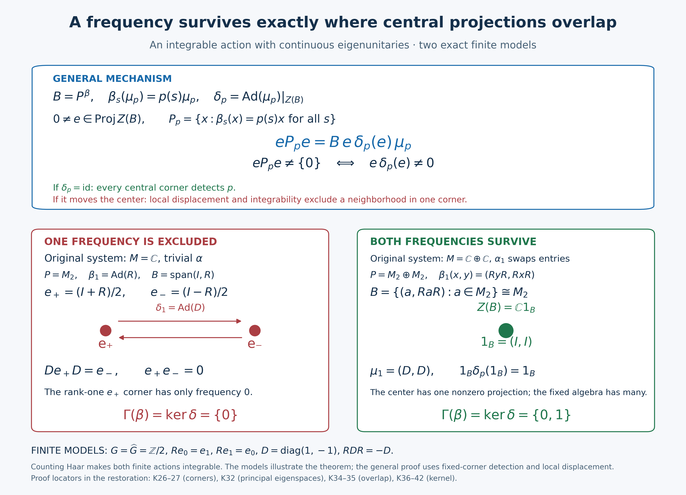

# The dual-center kernel through central overlap

A frequency survives every fixed corner precisely when the corresponding dual automorphism fixes the crossed-product center. We first prove a general overlap theorem for an integrable action with eigenunitaries. We then construct that setting by regular stabilization, check its full normal maps and bounded orbit domain, and transport the conclusion back. The direct absorption proof \(\Gamma(\alpha)+\operatorname{Sp}(\alpha)=\operatorname{Sp}(\alpha)\) and its closed-subgroup deduction form a separate retained route.

The group is arbitrary locally compact Hausdorff abelian and the von Neumann algebra and representation Hilbert spaces are arbitrary. There is no countability, separability, factor, finite-Haar or original-action integrability assumption.

*Restored local proof candidate, GPT-6.1 Sol (OpenAI), Ultra, 5 October 2026. Spot-checked in a separate AI session. New expression is CC0-1.0 to the extent of rights held; original and prerequisite component terms retain their own terms.*

## Earlier proofs, definition and the reflected labels

The complete fixed-corner definition, restriction and local detection are [GCC SETTING/DEFINITION](OA-FLOW-GCC.md#gcc-setting); its [TOOLS](OA-FLOW-GCC.md#gcc-tools), [CENTRAL](OA-FLOW-GCC.md#gcc-central) and [INTERSECTION](OA-FLOW-GCC.md#gcc-intersection) give arbitrary support joins and the reduction to central fixed corners. The actual arbitrary-LCA cocycle-invariance proof is [L112's matrix and corner arguments](OA-FLOW-L112.md#cm-matrix), including [its completed corner conclusion](OA-FLOW-L112.md#cm-corners). The tensor action, full fixed-algebra realization and generator-preserving normal transport are [NCF1–3](OA-FLOW-NCF.md#ncf-1). None of these inputs is replaced by a real-action specialization.

The normal integrated maps and concrete predual tests are [AT1/3/5](OA-FLOW-AT.md#oa-flow.at.1) and [CP6](OA-FLOW-CP.md#oa-flow.cp.6). Local Fourier plateaus and hull/filter/product rules are [LF1](OA-FLOW-LF.md#lf-1), [GL1–3/6–7](OA-FLOW-GL.md#gl-1) and [SS3](OA-FLOW-SS.md#ss-3). The scalar and arbitrary-Hilbert integration conventions are [L24's Haar, translation and tensor proofs](OA-FLOW-L24.md#oa-flow.grp.haarconventions), [HR3/5/7–9](OA-FLOW-HR.md#hr-03), [H0 compact-neighborhood shrinking](OA-FLOW-TOPOLOGY.md#l138-h0), [H1 compact-open dual topology](OA-FLOW-HARMONIC.md#l138-h1), [BD4–5 normal generation and bounded strong limits](OA-FLOW-BD.md#oa-flow.bd.4) and [the normal multiplier algebra](OA-FLOW-ND.md#nd-multiplication). The full extended-positive values and normal positive vector tests are [EP1–3](OA-FLOW-EP.md#oa-flow.ep.1).

The full orbit operator-valued weight, exact bounded-domain/semifiniteness criterion and open eigenfrequency detection are the actual completed [L114 average and density proofs](OA-FLOW-L114.md#ip-average) and [L114 open localization](OA-FLOW-L114.md#ip-open). The continuous abelian part and local projection displacement are the complete [L113 continuous-part proof](OA-FLOW-L113.md#l113-continuous) and [L113 displacement proof](OA-FLOW-L113.md#l113-displacement). L113 and L114 are accepted earlier canonical proofs at the exact source ranges recorded for this candidate. The links locate their complete bodies; the opening descriptions are not proof premises.

Throughout let \(G\) be LCH abelian, let \(M\ne0\) be a von Neumann algebra and let \(\alpha:G\to\operatorname{Aut}(M)\) be a point-ultraweakly continuous action by normal automorphisms. Put \(F=M^\alpha\). The reduced action on a fixed corner \(eMe\) is denoted \(\alpha^e\); \(\Gamma(\alpha)\) is the intersection of its action spectra over every nonzero \(e\in\operatorname{Proj}(F)\), at exactly the GCC definition. Put \(H=\widehat G\), write its group law additively, and use \(p(s)=(s,p)\). For this lesson the retained K-formulas have **positive eigenfrequency labels**: \(\alpha_s(x)=p(s)x\) has label \(p\). More precisely, with the same actual AT5 map \(T_bx=\int b(s)\alpha_s(x)\,ds\), put

\[
 f_b^+(p)=\int_G b(s)p(s)\,ds,\qquad
 F_b^-(p)=\int_G b(s)\overline{p(s)}\,ds,\qquad
 f_b^+(p)=F_b^-(-p).
 \tag{DK1}
\]
The positive-label annihilator is the reflection of the GL annihilator. The complete L114 reflection argument consequently gives

\[
 \operatorname{Sp}_\alpha(x)=-\operatorname{sp}_{\mathrm{GL},\alpha}(x),
 \qquad M_\alpha(E)=M_{\mathrm{GL},\alpha}(-E).
 \tag{DK2}
\]
The Fourier algebra and its norm are unchanged by reflection. Thus every local plateau, filter law, closedness and spectral product theorem below is the reflected version of its exact earlier proof. Each corner action spectrum is symmetric by adjoint reflection, as already proved in GCC DEFINITION, so its positive-label action spectrum equals its negative-label action spectrum. Their intersections give the same \(\Gamma\). This explains why the unchanged K1 and the current GCC definition agree; it does not assert symmetry of an individual vector spectrum.

For any nonzero action \(\beta\), local detection says that \(p\in\operatorname{Sp}(\beta)\) if and only if every neighborhood \(U\ni p\) contains the compact spectrum of a nonzero element. To see the stronger compact formulation, a positive-label plateau \(f\in A_c(H)\), supported inside \(U\) and nonzero at \(p\), has \(\beta_f\ne0\) by the hull definition. A nonzero \(\beta_f(y)\) has spectrum in \(\operatorname{supp}f\subset U\). Conversely a neighborhood disjoint from the closed action spectrum contains no nonzero vector spectrum, by GL2/7 and the empty-spectrum criterion. All neighborhoods are nets; no countable base is presumed.

## Fixed-corner compression retains integrability

Let \(\beta:G\to\operatorname{Aut}(P)\) be a normal continuous action, let \(e\in P^\beta\) be a projection, and put \(F_\beta=\mathcal P_\beta^+\) for L114's bounded positive orbit domain. For \(a\in F_\beta\) and every compact \(C\subset G\), normal compression of the actual compact integral gives

\[
 T_{\beta^e,C}(eae)=eT_{\beta,C}(a)e,\qquad
 \|T_{\beta^e,C}(eae)\|\le\|T_\beta(a)\|.
 \tag{DK3}
\]
The equality is tested against every normal functional on \(ePe\): its extension \(z\mapsto\omega(eze)\) is normal, by CP6's vector-series substitution. Its scalar integral is exactly the defining corner integral. The bound follows from \(0\le T_{\beta,C}(a)\le T_\beta(a)\). Thus \(eae\in F_{\beta^e}\), and bounded monotone limits give \(T_{\beta^e}(eae)=eT_\beta(a)e\). No Bochner integrability of an operator orbit is being assumed.

If \(\beta\) is integrable, L114's full density theorem makes \(\mathfrak p_\beta=\operatorname{span}_{\mathbb C}F_\beta\) ultraweakly dense in \(P\). For any \(x\in ePe\), choose a net \(x_i\in\mathfrak p_\beta\) tending ultraweakly to \(x\). Normal compression gives \(ex_ie\to x\). Each compression is a finite complex linear combination of positive elements of \(F_{\beta^e}\), by (DK3). Hence \(\mathfrak p_{\beta^e}\) is ultraweakly dense in \(ePe\), and the same complete density criterion makes \(\beta^e\) integrable. The zero corner is harmless: its bounded domain and its whole algebra are both zero. The later Connes intersections concern nonzero corners only.

## An abstract integrable principal-eigenspace theorem

**Theorem.** Let \(\beta\) be an integrable normal point-ultraweakly continuous action of \(G\) on a nonzero von Neumann algebra \(P\). Let \(\mu:H\to\mathcal U(P)\) be a strongly continuous unitary representation satisfying

\[
 \beta_s(\mu_p)=p(s)\mu_p\qquad(s\in G,\ p\in H).
 \tag{DK4}
\]
Put \(B=P^\beta\) and \(\delta_p=\operatorname{Ad}(\mu_p)|_{Z(B)}\). Then

\[
 \Gamma(\beta)=\{p\in H:\delta_p=\operatorname{id}_{Z(B)}\}.
 \tag{DK5}
\]
The claim does not assume that the eigenunitaries belong to \(B\).

**Proof.** For \(b\in B\), the scalar factors in
\(\beta_s(\mu_p b\mu_p^*)\) cancel. Thus \(\mu_p\) normalizes \(B\), and also \(Z(B)\). Conjugation is normal by the vector-series test in CP6. The representation law gives an action \(\delta\) of \(H\). It is point-ultraweakly continuous: for a vector functional of \(\mu_p z\mu_p^*\), split the difference into the two changing vectors \(\mu_p^*\xi,\mu_p^*\eta\); strong continuity and the bound \(\|z\|\) control both terms. A summable normal vector series has a uniformly small tail, so the conclusion holds for every normal functional. The center is a von Neumann algebra, since commutation with each fixed bounded element is an ultraweakly closed condition. Consequently the complete L113 normal abelian-action theorem applies to this center and its actual norm-continuous part.

Write \(P_p=\{x:\beta_s(x)=p(s)x\text{ for all }s\}\). The product \(x\mu_p^*\) is fixed whenever \(x\in P_p\); conversely \(b\mu_p\in P_p\) for \(b\in B\). Fixed multiplication is ultraweakly continuous, with inverse multiplication by \(\mu_p^*\). Thus

\[
 P_p=B\mu_p
 \quad\hbox{as ultraweakly closed linear spaces}.
 \tag{DK6}
\]
The reflected singleton theorem SS3 identifies this actual eigenoperator space with the positive-label singleton spectral space, including its zero element.

For a nonzero central projection \(e\in Z(B)\), the corner's \(p\)-eigenspace is precisely \(eP_pe=P_p\cap ePe\): fixed compression preserves the eigenphase, and an element already in the corner is its own compression. Since \(e\) and \(\delta_p(e)\) are central in \(B\),

\[
 eP_pe=B e\delta_p(e)\mu_p,\qquad
 eP_pe\ne\{0\}\ \Longleftrightarrow\ e\delta_p(e)\ne0.
 \tag{DK7}
\]
Indeed \(\mu_pe=\delta_p(e)\mu_p\). If \(k=e\delta_p(e)=0\), the entire right-hand space is zero. If \(k\ne0\), then \(k\mu_p=e(k\mu_p)e\) is an actual \(p\)-eigenoperator; unitarity gives \(\|k\mu_p\|=\|k\|=1\). This proves both nonzero implications.

If \(\delta_p\) fixes the center, every nonzero central \(e\) has \(e\delta_p(e)=e\). Its corner therefore detects \(p\). GCC's complete central-corner intersection puts \(p\) in \(\Gamma(\beta)\).

If \(\delta_p\ne\operatorname{id}\), L113 displacement supplies \(0\ne e\in\operatorname{Proj}(Z(B))\) and an open neighborhood \(U\ni p\) such that \(e\delta_q(e)=0\) for all \(q\in U\). Formula (DK7) makes every such corner eigenspace zero. The compression proof above makes \(\beta^e\) integrable. The direct open-localization theorem of L114 then gives \((ePe)_0^{\beta^e}(U)=0\), where the subscript means the ultraweakly closed span of filters with positive Fourier support in \(U\). Choose a compactly supported plateau \(f\) with \(f(p)=1\) and support in \(U\). Every \((\beta^e)_f(y)\) belongs to that zero space, so \(f\) is in the action annihilator while \(f(p)=1\). Its hull therefore omits \(p\). Thus \(p\notin\operatorname{Sp}(\beta^e)\), hence \(p\notin\Gamma(\beta)\). This proves (DK5). \(\square\)

The open-localization step is essential: the absence of one eigenoperator alone would not exclude a limit frequency from an arbitrary action spectrum.

## Stabilization preserves the Connes spectrum

Let \(\mathcal K=L^2(G)\), and define the right regular representation and its conjugation action by

$$
(R_s\xi)(r)=\xi(r+s),\qquad
\rho_s=\operatorname{Ad}R_s. \tag{K15}
$$

On

$$
\overline M=M\ \overline\otimes\ B(\mathcal K) \tag{K16}
$$

consider

$$
\overline\alpha_s=\alpha_s\otimes\operatorname{id},
\qquad
\widetilde\alpha_s=\alpha_s\otimes\rho_s. \tag{K17}
$$

The normal tensor action exists on the entire spatial tensor product by NCF1/3. In a faithful standard representation, the implementation from NCF2 makes it point-ultraweakly continuous; NCF3 transports that property normally to every faithful representation. The original Hilbert space need not itself implement \(\alpha\). The fixed algebra of \(\overline\alpha\) is

$$
\overline M^{\overline\alpha}
=F\ \overline\otimes\ B(\mathcal K),\qquad
Z(\overline M^{\overline\alpha})=Z(F)\otimes1. \tag{K18}
$$

NCF1 proves the first identity in (K18) by all matrix entries, at arbitrary Hilbert dimension. Here is the center calculation. An element central in \(F\bar\otimes B(\mathcal K)\) commutes with every second-factor matrix unit. Commutation with each diagonal matrix unit makes all off-diagonal entries zero; commutation with \(|e_i\rangle\langle e_j|\) makes all diagonal entries equal to some \(z\in F\). Thus the element is \(z\otimes1\). Commutation with \(a\otimes1\), for \(a\in F\), makes \(z\in Z(F)\). Conversely every such tensor is central, proving the second identity. A basis exists by the earlier Hilbert proof used in NCF1; it is not presumed countable. Also \(\mathcal K\ne0\): a nonzero compact Haar bump has positive finite squared norm by HR3/6.

For every nonzero \(c\in\operatorname{Proj}(Z(F))\), the action on the corresponding central corner is
\(\alpha^c\otimes\operatorname{id}\).  Its Fourier filter is
\((\alpha^c)_f\otimes\operatorname{id}\), so its action annihilator and spectrum equal those of \(\alpha^c\).  For precision, the normal filter identity is checked entrywise against matrix vector tests: AT5 makes each entry the filtered entry, so all entries agree. A bounded matrix slice is normal by CP6; NCF1 constructs the normal tensor automorphisms, and AT5 constructs their normal integrated filter. No tensor extension of an arbitrary bounded map is presumed. If the base filter vanishes, every matrix entry of its amplification vanishes, so the amplified filter is zero. If it does not vanish, test a nonzero base output tensored with a rank-one projection. The two action annihilators are equal, hence their hull spectra are equal. Since central fixed corners suffice by the earlier GCC proof,

$$
\Gamma(\overline\alpha)=\Gamma(\alpha). \tag{K19}
$$

Equivalently, a rank-one projection on the second tensor factor is fixed, has central support one in (K18), and cuts the stabilized action back to \(\alpha\).

The unitaries

$$
u_s=1\otimes R_s \tag{K20}
$$

are strongly continuous and form an \(\overline\alpha\)-cocycle. In the abelian case the Haar modular function is one, and \(R_s=L_{-s}\); L24 gives strong continuity. The tensor unitaries are strongly continuous first on elementary vectors and then on all vectors by finite tensor approximation and their common norm one. Since \(\overline\alpha_s(1\otimes R_t)=1\otimes R_t\), their group law is exactly the cocycle identity. Moreover

$$
\operatorname{Ad}(u_s)\circ\overline\alpha_s
=\widetilde\alpha_s. \tag{K21}
$$

The cocycle-invariance theorem proved in [L112's complete matrix-corner theorem](OA-FLOW-L112.md#cm-corners) therefore gives

$$
\boxed{\Gamma(\widetilde\alpha)
=\Gamma(\overline\alpha)
=\Gamma(\alpha).} \tag{K22}
$$

Here is the transport used for cocycle conjugacy. If \(\Phi\) is an equivariant normal star isomorphism with normal inverse, scalar predual tests give \(\Phi(T_bx)=T_b\Phi(x)\) for every \(b\in L^1(G)\). The corresponding action filters vanish simultaneously, and element annihilators and hull spectra agree. Fixed projections correspond bijectively under \(\Phi\), and the same integral identity holds in each corner. Thus the intersections defining \(\Gamma\) agree. Applying this transport after the complete L112 cocycle theorem proves invariance under cocycle conjugacy, at exactly these normality and strong-cocycle hypotheses.

## The regular tensor action is integrable

Use the complete locally determined Haar convention of HR8–9 for \(L^\infty(G)\), and the canonical finite-exponent \(L^2(G)\) comparison with the outer regular Radon convention. The multiplier representation on \(\mathcal K\) is the actual ND multiplication-algebra proof. No global-null-set identification of the two raw measures is asserted.  Formula (K15) gives

$$
\rho_s(M_h)=M_{h(s+\,\cdot\,)}. \tag{K23}
$$

If \(0\le h\in L^1(G)\cap L^\infty(G)\), then

$$
\int_G\rho_s(M_h)\,ds
=\left(\int_Gh(r)\,dr\right)1. \tag{K24}
$$

The integral in (K24) is an extended-positive orbit value, not an operator-norm Bochner integral. For a vector \(\xi\in L^2(G)\), choose Borel representatives of \(h\) and \(|\xi|^2\) on their sigma compact carriers, supplied by HR3/9. The nonnegative function \(h(r+s)|\xi(r)|^2\) has a sigma-finite Radon-product carrier: the shear \((s,r)\mapsto(r+s,r)\) sends it into the product of those two carriers. HR5 gives its two iterated integrals, and HR7 gives the exact measure-preserving shear and Haar change. Therefore

\[
 \int_G\langle\rho_s(M_h)\xi,\xi\rangle\,ds
 =\int_G\int_G h(r+s)|\xi(r)|^2\,dr\,ds
 =\left(\int_Gh\right)\|\xi\|_2^2.
 \tag{DK8}
\]
Changing representatives changes only null sections on this carrier. L114 constructs the full extended value; EP2–3 identifies it from all its vector quadratic forms. The displayed common bound makes that value precisely the bounded scalar operator in (K24). EP1's positive normal vector series gives the same equality on every normal positive functional. This verifies both the full-cone meaning and the asserted bounded domain.

Thus these positive multipliers belong to the bounded integrability domain. Write \(q_K=M_{1_K}\) for a compact subset \(K\Subset G\). For each \(\xi\in L^2(G)\) and error \(\epsilon>0\), HR3 gives \(g\in C_c(G)\) with \(\|\xi-g\|_2<\epsilon\). Whenever \(K\) contains \(\operatorname{supp}g\), \(\|(1-q_K)\xi\|_2\le\epsilon\). Thus \(q_K\to1\) strongly along the directed net of all compact subsets; finite unions give its upper bounds. This proof uses no compact exhaustion of the entire group, and (K24) gives \(T_\rho(q_K)=m(K)1\). For every \(a\in B(\mathcal K)_+\), heredity of the integrable positive cone gives

$$0\le q_Ka q_K\le\|a\|q_K,
\qquad T_\rho(q_Ka q_K)\le\|a\|m(K)1.
\tag{K24a}$$

These bounded positive compressions converge strongly to \(a\), so their span is ultraweakly dense and \(\rho\) is integrable.

The same projections in the invariant subalgebra

$$
1\otimes L^\infty(G)\subset\overline M \tag{K25}
$$

give an explicit density proof for \(\widetilde\alpha=\alpha\otimes\rho\). Put \(Q_K=1\otimes q_K\). The operators \(Q_K\) converge strongly to one: this is first the preceding \(L^2\) limit on elementary tensors and then finite tensor approximation with the norm bound one. The compact orbit averages of \(Q_K\) are \(1\otimes T_{\rho,C}(q_K)\), by the elementary tensor action and normal vector tests. Those averages are uniformly bounded by \(m(K)1\); their bounded increasing strong supremum is \(m(K)1\), by NCF1's normal matrix entries or by all elementary vector quadratic forms and polarization. Its orbit integral is \(m(K)1\), and for every \(a\in\overline M_+\),

$$\begin{aligned}
0\le Q_KaQ_K&\le\|a\|Q_K,\\
T_{\widetilde\alpha}(Q_KaQ_K)&\le\|a\|m(K)1,\\
Q_KaQ_K&\longrightarrow a\quad\text{strongly}.
\end{aligned}\tag{K25a}$$

Therefore positive integrable elements have ultraweakly dense linear span in \(\overline M\). [L114's completed full operator-valued-weight density criterion](OA-FLOW-L114.md#ip-density) yields integrability of \(\widetilde\alpha\), regardless of whether \(\alpha\) is integrable.

We also need integrability after taking a fixed corner.  Let \(\beta\) be an integrable action on \(P\), let \(e\in P^\beta\), and let \(a\ge0\) have bounded positive orbit integral.  Then

$$
\int_G\beta_s^e(eae)\,ds
=e\left(\int_G\beta_s(a)\,ds\right)e. \tag{K26}
$$

By the actual L114 density criterion, \(\mathfrak p_\beta=\operatorname{span}_{\mathbb C}\mathcal P_\beta^+\) is ultraweakly dense in \(P\). The normal map \(x\mapsto exe\) has range \(ePe\), so \(e\mathfrak p_\beta e\) is ultraweakly dense in that corner. Every positive generator \(eae\), with \(a\in\mathcal P_\beta^+\), has bounded orbit integral by (K26). Their linear span is precisely \(e\mathfrak p_\beta e\), proving integrability of the reduced action without selecting an unexplained approximate unit. Hence

$$
\boxed{\beta\text{ integrable and }e\in P^\beta
\quad\Longrightarrow\quad
\beta^e\text{ integrable on }ePe.} \tag{K27}
$$

All compact compressions in (K24a) and (K25a) are positive bounded-domain elements because L114's full orbit weight is positive and hereditary on its bounded-output cone. Their strong convergence has the common bound \(\|a\|\), hence is ultraweak convergence by CP6's vector-series tail estimate. This proves the two density claims with controlled approximants. Formula (K26) follows from the compact-average identity (DK3) and its bounded increasing supremum. That also verifies the corner continuity and normality before applying the criterion, including a zero corner. No finite Haar measure or conditional expectation is used.

## The crossed product is fixed and its eigenspaces are principal

Put

$$
B=\overline M^{\widetilde\alpha}. \tag{K28}
$$

The complete arbitrary-group fixed-algebra realization [NCF2–3](OA-FLOW-NCF.md#ncf-2) gives a normal identification

$$
B\cong N:=M\rtimes_\alpha G. \tag{K29}
$$

In a spatial standard model the identification is NCF2's concrete equality with the regular crossed product generated by

\[
 (\pi(a)\zeta)(r)=\alpha_{-r}(a)\zeta(r),\qquad
 (\lambda_s\zeta)(r)=\zeta(r-s).
 \tag{DK9}
\]
For every faithful normal representation, NCF3 supplies the generator-preserving normal isomorphism and its normal inverse. Thus no narrower lcsc induction result or representation-independence slogan is being used.

Under this identification, the course's dual action
\(\theta:H\to\operatorname{Aut}(N)\) is spatial on \(B\).  Let

$$
v_p=M_{\overline{(\,\cdot\,,p)}}\in1\otimes L^\infty(G),
\qquad
\mu_p=v_{-p}=M_{(\,\cdot\,,p)}. \tag{K30}
$$

Then

$$
\theta_p=\operatorname{Ad}(v_p)|_B,\qquad
\widetilde\alpha_s(\mu_p)=(s,p)\mu_p,\qquad
\operatorname{Ad}(\mu_p)|_B=\theta_{-p}. \tag{K31}
$$

For completeness all generator and continuity checks are as follows. Multiplication by \(v_p(r)=\overline{p(r)}\) commutes with \(\pi(a)\), and direct substitution gives

\[
 v_p\lambda_sv_p^*=\overline{p(s)}\lambda_s.
 \tag{DK10}
\]
Both coefficient and translation generators belong to \(B\) by NCF2. The scalar relation \(\widetilde\alpha_s(v_p)=\overline{p(s)}v_p\) makes conjugation by \(v_p\) preserve \(B\), with a normal inverse. Normality and normal generation identify this automorphism on the entire algebra from the two generator formulas; it is the course's dual action. Likewise \(\widetilde\alpha_s(\mu_p)=p(s)\mu_p\) follows from (K23). The map \(p\mapsto\mu_p\) is strongly continuous. On \(g\in C_c(G)\), its difference is bounded in \(L^2\) by \(\sup_{\operatorname{supp}g}|p-p_0|\|g\|_2\), tending to zero by the compact-uniform dual topology. L24 density and the unitary bound extend this to every \(L^2\) vector, and finite tensor approximation extends it to the whole representation space. This also proves point-ultraweak continuity of its conjugation on \(B\) and \(Z(B)\).

The inverse sign in the last formula comes from the convention
\(\theta_p(\lambda_s)=\overline{(s,p)}\lambda_s\).

Write \(\overline M_{\widetilde\alpha}(\{p\})\) for the \(p\)-eigenspace.  If \(x\) lies in that space, then \(x\mu_p^*\) is fixed; conversely \(b\mu_p\) has frequency \(p\) for every \(b\in B\).  Therefore

$$
\boxed{
\overline M_{\widetilde\alpha}(\{p\})
=B\mu_p.} \tag{K32}
$$

The preceding theorem's two inverse fixed-multiplication maps prove ultraweak closedness, and SS3 with the reflected labels identifies the eigenspace with the singleton spectral space. This is an equality of ultraweakly closed linear spaces. It is not a claim that \(\mu_p\) belongs to the fixed algebra.

## Central corners are measured by the dual action

Let \(0\ne e\in\operatorname{Proj}(Z(B))\).  Since

$$
\mu_pe\mu_p^*=\theta_{-p}(e), \tag{K33}
$$

formula (K32) gives

$$
\begin{aligned}
e\,\overline M_{\widetilde\alpha}(\{p\})\,e
&=eB\mu_pe\\
&=B\,e\,\theta_{-p}(e)\,\mu_p.
\end{aligned} \tag{K34}
$$

The product \(e\theta_{-p}(e)\) is a central projection of \(B\).  Hence

$$
\boxed{
\overline M_{\widetilde\alpha}(\{p\})\cap e\overline M e
\ne\{0\}
\quad\Longleftrightarrow\quad
e\theta_{-p}(e)\ne0.} \tag{K35}
$$

This formula converts a spectral question in the stabilized algebra into a projection-overlap question in the center of the crossed product.

The corner eigenspace is exactly its ambient eigenspace intersection, because \(e\) is fixed; normal compression commutes with every filter. Put \(k=e\theta_{-p}(e)\). Both factors are central projections in \(B\), hence their product is a central projection. If \(k\ne0\), \(k\mu_p\) is the explicit norm-one element of the left side in (K35); if \(k=0\), (K34) makes that entire space zero. This is the concrete instance of (DK7), with \(\delta_p=\theta_{-p}|_{Z(B)}\).

## The dual-center kernel is exactly the Connes spectrum

Define

$$
K_\theta
=\{p\in H:\theta_p(z)=z\text{ for every }z\in Z(B)\}. \tag{K36}
$$

Suppose \(p\in K_\theta\).  Then \(\theta_{-p}\) also fixes \(Z(B)\), and every nonzero central projection \(e\) satisfies

$$
e\theta_{-p}(e)=e\ne0. \tag{K37}
$$

By (K35), the \(e\)-corner contains a nonzero \(p\)-eigenoperator.  Thus
\(p\in\operatorname{Sp}(\widetilde\alpha^e)\) for every nonzero central fixed projection \(e\).  Central corners suffice by the full GCC INTERSECTION proof, so

$$
p\in\Gamma(\widetilde\alpha). \tag{K38}
$$

Conversely, suppose \(p\notin K_\theta\).  The inverse action

$$
\delta_q=\theta_{-q}|_{Z(B)} \tag{K39}
$$

is nontrivial at \(p\).  Apply the local-displacement theorem from [L113's completed local-displacement proof](OA-FLOW-L113.md#l113-displacement) to this abelian von Neumann system and its norm-continuous C\*-part.  It produces a nonzero projection \(e\in Z(B)\) and an open neighborhood \(U\ni p\) such that

$$
e\theta_{-q}(e)=0
\qquad(q\in U). \tag{K40}
$$

Equations (K35) and (K40) say that the reduced action on \(e\overline M e\) has no nonzero \(q\)-eigenoperator for any \(q\in U\).  The action
\(\widetilde\alpha^e\) is integrable by (K27).  The integrable spectral-detection theorem in [L114's completed open-localization proof](OA-FLOW-L114.md#ip-open) therefore gives

$$
(e\overline M e)_0^{\widetilde\alpha^e}(U)=\{0\}. \tag{K41}
$$

Local detection now excludes \(p\) from
\(\operatorname{Sp}(\widetilde\alpha^e)\), and hence from
\(\Gamma(\widetilde\alpha)\).  Together with (K38),

$$
\Gamma(\widetilde\alpha)=K_\theta. \tag{K42}
$$

Finally use (K22) and the identification (K29):

$$
\boxed{
\Gamma(\alpha)
=\ker\!\left(
\widehat\alpha:H\longrightarrow
\operatorname{Aut}Z(M\rtimes_\alpha G)
\right).} \tag{K43}
$$

For the trivial action on \(M=\mathbb C\), the crossed product is the abelian group von Neumann algebra.  Indeed, the regular unitaries \(\lambda_s\) commute because \(G\) is abelian, so their generated algebra \(VN(G)\) is abelian: the algebraic generators commute, and separate ultraweak continuity of multiplication extends commutation to the generated von Neumann algebra. If a character \(p\ne0\), then \(p(s)\ne1\) for some \(s\) by the definition of a nontrivial character. The unitary \(\lambda_s\ne0\) is multiplied by \(\overline{p(s)}\ne1\), so that dual automorphism is not the identity on this center. Thus its kernel is exactly \(\{0\}\), without an additional identification of \(VN(G)\) with a function algebra. The dual action on its center is faithful, so (K43) gives \(\Gamma(\alpha)=\{0\}\), as the fixed-corner definition does.

The intrinsically defined center is carried to \(Z(N)\) by the actual normal isomorphism (K29): a star isomorphism preserves exactly the elements commuting with every element, and its inverse gives the converse. The two signs in (K31) differ by \(p\mapsto-p\). For every group action the kernel is inverse invariant, since \(\theta_{-p}=\theta_p^{-1}\). Thus (DK5) applied to the verified regular system gives exactly (K42)–(K43), rather than a statement for a different-sign dual action. It also verifies the individual premises of the retained direct argument (K36)–(K41).

## Connes frequencies absorb the action spectrum

Let \(G\) be a locally compact abelian group, \(H=\widehat G\), and let
\(\alpha:G\to\operatorname{Aut}(M)\) be a point-ultraweakly continuous action on a nonzero von Neumann algebra.  Put \(F=M^\alpha\).  Recall from [GCC's complete definition](OA-FLOW-GCC.md#gcc-definition) that

$$
\Gamma(\alpha)
=\bigcap_{\substack{0\ne e\in\operatorname{Proj}(F)}}
\operatorname{Sp}(\alpha^e). \tag{K1}
$$

We prove

$$
\boxed{\Gamma(\alpha)+\operatorname{Sp}(\alpha)
=\operatorname{Sp}(\alpha).} \tag{K2}
$$

The inclusion from right to left follows from \(0\in\Gamma(\alpha)\).  For the other inclusion, take

$$
p\in\Gamma(\alpha),\qquad q\in\operatorname{Sp}(\alpha), \tag{K3}
$$

and let \(U\) be any open neighborhood of \(p+q\).  Continuity of addition first supplies neighborhoods \(V_0\ni p,W_0\ni q\) with \(V_0+W_0\subset U\). The actual LCH compact-neighborhood shrinking proved in H0 gives \(V\ni p\) and \(W\ni q\) with compact closures contained in those neighborhoods. Consequently

$$
\overline V+\overline W\subset U. \tag{K4}
$$

Local spectral detection supplies a nonzero \(x\in M\) satisfying

$$
\operatorname{Sp}_\alpha(x)\subset\overline W. \tag{K5}
$$

Let \(s_r(a)\) denote the right support of \(a\), and form

$$
e=\bigvee_{t\in G}s_r(\alpha_t(x)). \tag{K6}
$$

The join is nonzero, and translation merely reindexes its terms.  Hence

$$
0\ne e\in F. \tag{K7}
$$

Because \(p\in\operatorname{Sp}(\alpha^e)\), local detection inside \(eMe\) gives

$$
0\ne y\in eMe,\qquad
\operatorname{Sp}_\alpha(y)\subset\overline V. \tag{K8}
$$

Some translate of \(x\) acts nontrivially on \(y\).  Indeed, if
\(\alpha_t(x)y=0\) for every \(t\), then
\(s_r(\alpha_t(x))y=0\) for every \(t\).  GCC TOOLS proves both support implications: \(ab=0\) if and only if \(s_r(a)b=0\), and the join projects onto the closed span of the support ranges. The range of \(y\) is perpendicular to each such range, hence to their closed span. Thus the join in (K6) gives
\(ey=0\), contrary to \(ey=y\ne0\).  Choose \(t\) with

$$
z=\alpha_t(x)y\ne0. \tag{K9}
$$

The support join is fixed because automorphisms preserve the least right-support characterization and projection joins, and the group translation permutes the terms; these are precisely GCC TOOLS. The nonzero \(y\) is supplied by the compact local-detection formulation in the opening, inside the normal reduced action. Orbit invariance of vector spectra and the reflected GL6 product theorem yield

$$
\operatorname{Sp}_\alpha(z)
\subset\overline W+\overline V
\subset U. \tag{K10}
$$

The sum of the two compact closures in (K10) is compact, so GL6's general closure causes no extra term here. The spectrum of \(z\ne0\) is nonempty by GL2 essentiality and LF6's empty-hull theorem. Thus every neighborhood of \(p+q\) contains the spectrum of a nonzero vector.  The local detection criterion gives \(p+q\in\operatorname{Sp}(\alpha)\), proving (K2).

## The Connes spectrum is a closed subgroup

The set \(\Gamma(\alpha)\) is closed because it is an intersection of closed action spectra.  It contains \(0\): the unit of every nonzero fixed corner is a nonzero zero-frequency vector.  It is symmetric because

$$
\operatorname{Sp}_\alpha(x^*)
=-\operatorname{Sp}_\alpha(x), \tag{K11}
$$

so every reduced action spectrum in (K1) is symmetric.

It remains to prove closure under addition.  Fix \(p,r\in\Gamma(\alpha)\) and a nonzero \(e\in\operatorname{Proj}(F)\).  Every nonzero projection fixed by \(\alpha^e\) is also fixed by \(\alpha\), so

$$
p\in\Gamma(\alpha^e),\qquad
r\in\operatorname{Sp}(\alpha^e). \tag{K12}
$$

Apply (K2) to the reduced action:

$$
p+r\in\operatorname{Sp}(\alpha^e). \tag{K13}
$$

Since \(e\) was arbitrary, (K1) puts \(p+r\) in \(\Gamma(\alpha)\).  Therefore

$$
\boxed{\Gamma(\alpha)\text{ is a closed subgroup of }H.} \tag{K14}
$$

The same proof works without a countability or separability assumption.  Neighborhoods and support joins are nets and arbitrary joins, respectively.

**Problem.** In the proof of (K14), why is it insufficient to use (K2) only for the original action?

**Solution.** From \(p,r\in\Gamma(\alpha)\subset\operatorname{Sp}(\alpha)\), the original absorption law gives only \(p+r\in\operatorname{Sp}(\alpha)\).  Membership in \(\Gamma(\alpha)\) requires membership in every reduced action spectrum.  Applying the same absorption law to each \(\alpha^e\), as in (K12)--(K13), supplies exactly those cornerwise conclusions. \(\square\)

## Antecedents and the bounded conclusion

The theorem corresponds to Takesaki, [*Theory of Operator Algebras II*, XI.2 Theorem 2.7, printed335–336](https://doi.org/10.1007/978-3-662-10451-4). The local proof first isolates an integrable principal-eigenspace/central-overlap theorem, then verifies all hypotheses in the regular stabilized system. The complete absorption and subgroup route, scalar example and solved problem are retained independently. Full normality, arbitrary-Hilbert tensor slices, qualified Haar carriers, compact-projection nets and the explicit overlap witness are supplied here or in the exact earlier proof bodies.

The earlier free-source normal-action, scalar Fourier and spectral-space developments remain substantive premises and retain their complete alternative proofs. Arveson, [*On groups of automorphisms of operator algebras*](https://www.isibang.ac.in/~soumyashant/misc/collected-works-of-arveson/1970s/1974_On_groups_of_automorphisms_of_operator_algebras.pdf), J. Funct. Anal. 15 (1974), Section 1, is one primary antecedent to that framework; the actual programme inputs are AT, LF, GL and SS at their recorded full hypotheses. External citations identify mathematical antecedents and do not replace any internal proof.

The conclusions are spectral absorption, the closed subgroup property, amplification and strongly continuous cocycle-conjugacy invariance, regular tensor and fixed-corner integrability, and the full dual-center kernel formula for the given arbitrary-LCA normal action. No general dual-system recognition, modular cocycle realization, classification, state-orbit diameter or whole C1–C6 completion is inferred.

## Frequencies and central projection overlap

The upper panel concerns an arbitrary locally compact Hausdorff abelian group \(G\), its dual \(H\), and an integrable point-ultraweakly continuous action \(\beta\) on a nonzero von Neumann algebra \(P\). A strongly continuous unitary representation \(p\mapsto\mu_p\) of \(H\) satisfies \(\beta_s(\mu_p)=p(s)\mu_p\). Put \(B=P^\beta\) and \(\delta_p=\operatorname{Ad}(\mu_p)|_{Z(B)}\). For the positive eigenfrequency convention and a nonzero central projection \(e\) of \(B\), the complete local argument gives

\[
 P_p=B\mu_p,\qquad eP_pe=B e\delta_p(e)\mu_p,\qquad
 eP_pe\ne\{0\}\ \Longleftrightarrow\ e\delta_p(e)\ne0.
 \tag{OKF1}
\]

If the overlap projection \(k=e\delta_p(e)\) is nonzero, \(k\mu_p\) is an explicit nonzero corner eigenoperator of norm one. If it is zero, the whole corner eigenspace vanishes. Thus a parameter fixing the center survives every central-corner test. For a parameter moving the center, the complete local-displacement proof supplies one \(e\) whose overlaps vanish throughout a neighborhood. Integrability of the reduced action and open spectral detection then exclude that neighborhood. These are the mechanisms behind \(\Gamma(\beta)=\ker\delta\), rather than a claim that point spectra are always closed. The full local proof is [fixed-corner integrability](OA-FLOW-L115.md#dk-corner-integrability) and [the principal-eigenspace/central-overlap theorem](OA-FLOW-L115.md#dk-overlap), especially (DK3)–(DK7). The verified regular model is [K26–27](OA-FLOW-L115.md#dk-regular-integrability) and [K32](OA-FLOW-L115.md#dk-principal), with [K34–35 and K36–42](OA-FLOW-L115.md#dk-concrete-overlap).

Both lower panels use \(G=H=\mathbb Z/2\), the character pairing \((-1)^{sp}\), counting Haar, and

\[
 R=\begin{pmatrix}0&1\\1&0\end{pmatrix},\qquad
 D=\begin{pmatrix}1&0\\0&-1\end{pmatrix},\qquad RDR=-D.
 \tag{OKF2}
\]

Finite counting Haar makes every positive orbit average bounded: \(T_\beta(a)=a+\beta_1(a)\le2\|a\|1\). Thus these particular actions are integrable without an additional measure argument.

In the left model the original action on \(\mathbb C\) is trivial. Its stabilized algebra is \(P=M_2\), the action is \(\beta_1=\operatorname{Ad}R\), and \(B=\operatorname{span}(I,R)\). Solving \(RX=XR\) directly gives this two-dimensional fixed algebra. Its two minimal central projections are \(e_\pm=(I\pm R)/2\). The eigenunitary \(\mu_1=D\) interchanges them, so \(e_+\delta_1(e_+)=e_+e_-=0\). The rank-one \(e_+\) corner is scalar and fixed, hence its only frequency is zero. Every nonzero fixed corner contains its fixed unit, so zero survives all corners and \(\Gamma(\beta)=\{0\}\).

In the right model the original action on \(\mathbb C\oplus\mathbb C\) swaps the two entries. The stabilized action is \(\beta_1(x,y)=(RyR,RxR)\) on \(P=M_2\oplus M_2\). Its fixed algebra is exactly \(B=\{(a,RaR):a\in M_2\}\), a copy of \(M_2\). Commutation with the two diagonal matrix units and either off-diagonal matrix unit makes its center \(\mathbb C(I,I)\). The eigenunitary \(\mu_1=(D,D)\) therefore fixes this center. Its only nonzero central projection is \(1_B\), whose overlap is one at both frequencies. The general central-corner theorem gives \(\Gamma(\beta)=\{0,1\}\). Independently, the original system has only one nonzero fixed projection, and \((1,1)\) and \((1,-1)\) give both original eigenfrequencies; the complete stabilization theorem identifies the same Connes spectrum. The fixed algebra nevertheless has many noncentral projections: the single green point depicts its center only.

The source antecedent for the general kernel theorem is Takesaki, [*Theory of Operator Algebras II*, Theorem XI.2.7, printed335–336](https://doi.org/10.1007/978-3-662-10451-4). The existing free-source spectral framework and complete local prerequisites are retained. The two matrix models, diagram and explanatory organization here are original to this restoration. A source citation does not replace any internal proof.

[Editable SVG](../assets/dual-center-kernel/assets/central-overlap.svg), exact semantic data and reproduction source accompany the PNG. The source uses exact symbolic matrix checks, deterministic SVG identifiers and date-free output. DejaVu Sans is used locally; no font file is redistributed. Original figure, caption and source: GPT-6 Astra (OpenAI), Ultra, 5 October 2026. New expression is CC0-1.0 to the extent of rights held; applicable third-party font terms are retained separately.
