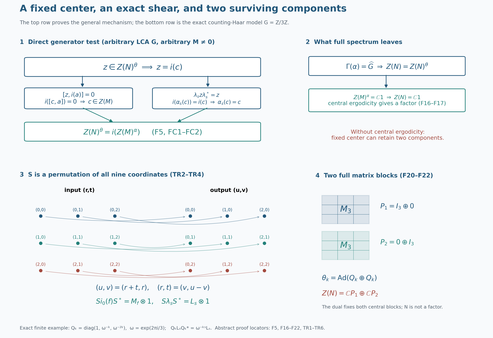

# The fixed center and the factor criterion

The coefficient algebra can carry many central operators while its crossed product has only scalar center. The exact obstruction is the invariant center of the coefficient algebra, together with the action of the dual group on the crossed-product center. We identify the first obstruction directly from the regular generators, prove the factor criterion, and retain a complete bidual proof of the same identity. A two-component translation system then shows why central ergodicity is necessary.

*Original restored programme proof, GPT-6.1 Sol (OpenAI), Ultra, 5 October 2026. Original programme expression is dedicated to CC0-1.0 to the extent of rights held; genuine prerequisite and component terms remain separate. The complete L115 input is bound to its earlier accepted canonical proof. Spot-checked in a separate AI session.*

## The two centers and the actual inputs

Throughout, \(G\) is an arbitrary locally compact Hausdorff abelian group, \(H=\widehat G\), and \(M\ne0\) is a von Neumann algebra. The action \(\alpha:G\to\operatorname{Aut}(M)\) is point-ultraweakly continuous and its automorphisms are normal and unital. Neither group countability nor a separability or sigma-finiteness condition on \(M\) or its representation space is assumed. Put

\[
N=M\rtimes_\alpha G,
\qquad \theta=\widehat\alpha:H\to\operatorname{Aut}(N). \tag{F1}
\]

Write \(i:M\to N\) for the faithful normal coefficient inclusion and \(\lambda_s\) for the regular unitaries. Their covariance is \(\lambda_s i(a)\lambda_s^*=i(\alpha_s(a))\). The dual convention is \(\theta_p(i(a))=i(a)\) and \(\theta_p(\lambda_s)=\overline{p(s)}\lambda_s\). The full coefficient inclusion, covariance and normal representation comparison are [NR3](OA-FLOW-NR.md#oa-flow.nr.3) and [NR4](OA-FLOW-NR.md#oa-flow.nr.4); [DA ACTION](OA-FLOW-DA.md#da-action) proves this continuous normal dual action. Fixed multiplication and compression are ultraweakly continuous by the full vector-series predual proof [CP6](OA-FLOW-CP.md#oa-flow.cp.6); [CP5](OA-FLOW-CP.md#oa-flow.cp.5) proves the preannihilator separation used below.

We call the action **centrally ergodic** when

\[
Z(M)^\alpha
=\{c\in Z(M):\alpha_s(c)=c\text{ for every }s\in G\}
=\mathbb C1. \tag{F2}
\]

This concerns the action on \(Z(M)\). It does not require \(M^\alpha=\mathbb C1\), and does not require \(M\) itself to be a factor. The theorem is

\[
\boxed{
Z(M)^\alpha=\mathbb C1
\quad\Longrightarrow\quad
\bigl[\Gamma(\alpha)=H
\ \Longleftrightarrow\
M\rtimes_\alpha G\text{ is a factor}\bigr].} \tag{F3}
\]

Its spectral input is the complete L115 dual-center kernel proof, with its precise arbitrary-LCA setting:

\[
\Gamma(\alpha)
=\ker\!\left(\theta:H\to\operatorname{Aut}Z(N)\right). \tag{F4}
\]

That input is a separately owned full proof, not a citation to an external theorem. Our direct bridge uses the entire [DA FIXED proof](OA-FLOW-DA.md#da-fixed). The alternative uses the full [ND construction](OA-FLOW-ND.md#nd-construction) and [normal inverse](OA-FLOW-ND.md#nd-inverse), not its opening theorem announcement. The [NCF1 matrix-entry proof](OA-FLOW-NCF.md#ncf-1), [BD1 bicommutant density](OA-FLOW-BD.md#oa-flow.bd.1), [BD4 bounded approximation](OA-FLOW-BD.md#oa-flow.bd.4) and [BD5 bounded strong-to-ultraweak limit](OA-FLOW-BD.md#oa-flow.bd.5) justify the generator and arbitrary-basis passages. CF1 choice, CF8 Hilbert projections, CF10 completion and the [H0 tensor construction](OA-FLOW-TOPOLOGY.md#l138-h0) give arbitrary Hilbert tensor spaces and bases.

For the translation model below we use the actual [ND multiplication/predual proof](OA-FLOW-ND.md#nd-multiplication) and [concrete Weyl proof](OA-FLOW-ND.md#nd-weyl-proof), including its full translation-invariant-multiplier conclusion. The exact Haar and vector conventions are [L24 HAAR](OA-FLOW-L24.md#oa-flow.grp.haarconventions), [TRANSLATIONS](OA-FLOW-L24.md#oa-flow.grp.translations) and [VECTORINTEGRATION](OA-FLOW-L24.md#oa-flow.grp.vectorintegration), [HR3](OA-FLOW-HR.md#hr-03), [HR5 Radon product and Hilbert tensor corollary](OA-FLOW-HR.md#hr-05), [HR6 Haar positivity](OA-FLOW-HR.md#hr-06) and [HR7 changes of variables](OA-FLOW-HR.md#hr-07). [AT1](OA-FLOW-AT.md#oa-flow.at.1) and ST2 supply the whole normal-action and normal-image topologies. The earlier free-source action, Haar and Fourier developments remain intact.

## A direct test of the fixed center

**Proposition.** For every action in the stated setting,

\[
\boxed{Z(N)^\theta=i\bigl(Z(M)^\alpha\bigr).} \tag{F5}
\]

**Proof.** Take \(z\in Z(N)^\theta\). Since \(N^\theta=i(M)\) by the complete DA FIXED theorem, there is a unique \(c\in M\) with \(z=i(c)\). For every \(a\in M\),

\[
 0=[z,i(a)]=i(ca-ac).
 \tag{FC1}
\]
Faithfulness of \(i\) gives \(c\in Z(M)\). For each \(s\in G\), centrality of \(z\) and covariance give

\[
 i(\alpha_s(c))=\lambda_s z\lambda_s^*=z=i(c),
 \tag{FC2}
\]
so \(c\in Z(M)^\alpha\). This proves one inclusion without using biduality.

Conversely, let \(c\in Z(M)^\alpha\). It commutes with \(i(M)\), and

\[
\lambda_s i(c)\lambda_s^*
=i(\alpha_s(c))
=i(c) \qquad(s\in G). \tag{F6}
\]

Thus it also commutes with all \(\lambda_s\) and their adjoints. Their unital star algebra is strongly dense in \(N\) by BD1. Commutation with each fixed bounded operator is strongly closed: apply both products to each vector and pass to the strong limit. Therefore \(i(c)\) commutes with all of \(N\). The dual action fixes every coefficient, so \(i(c)\in Z(N)^\theta\). This proves (F5). The restriction \(i:Z(M)^\alpha\to Z(N)^\theta\) is a normal star isomorphism with a normal inverse: the full coefficient map is faithful and normal by NR3, and ST2 supplies its normal inverse onto its image; restriction preserves those properties. \(\square\)

## Full Connes spectrum and factoriality

Assume central ergodicity and \(\Gamma(\alpha)=H\). The kernel identity (F4) says that every dual automorphism fixes every central element. Hence

\[
Z(N)=Z(N)^\theta. \tag{F16}
\]

The direct proposition and (F2) now give

\[
Z(N)
=i\bigl(Z(M)^\alpha\bigr)
=\mathbb C1. \tag{F17}
\]

Thus \(N\) is a factor. The spectral hypothesis alone controlled the action on \(Z(N)\); central ergodicity identifies the residual fixed center as scalars.

Conversely, if \(N\) is a factor, any unital complex-linear automorphism fixes its scalar center, and therefore

\[
\ker\!\left(\theta:H\to\operatorname{Aut}Z(N)\right)=H. \tag{F18}
\]

Using (F4) gives

\[
\boxed{\Gamma(\alpha)=H.} \tag{F19}
\]

This reverse implication does not need central ergodicity. In fact factoriality also forces central ergodicity: (F5) and injectivity of \(i\) imply \(Z(M)^\alpha=\mathbb C1\). Consequently, at these exact inputs, the two conditions \(Z(M)^\alpha=\mathbb C1\) and \(\Gamma(\alpha)=H\) together are equivalent to factoriality. This adds no recognition or classification conclusion.

## The center of an arbitrary Hilbert amplification

We give the tensor-center proof before using it in the alternative argument. Let \(A\subset B(E)\) be a nonzero concrete von Neumann algebra and let \(K\ne0\) be any Hilbert space. Choose an orthonormal basis \((e_j)_{j\in J}\) of \(K\); the index set need not be countable. To justify the basis at our exact inputs, CF1 gives a maximal orthonormal set. The orthogonal-projection proof in CF8 says that a proper closed span has a nonzero orthogonal vector, which could be normalized and adjoined. Maximality therefore makes the span dense. This gives the basis without a cardinality restriction. Put \(V_j\xi=\xi\otimes e_j\) and \(E_{ij}=|e_i\rangle\langle e_j|\).

If \(z\in Z(A\bar\otimes B(K))\), all coefficients \(z_{ij}=V_i^*zV_j\) belong to \(A\), by the full NCF1 matrix-entry criterion. Commuting with \(1\otimes E_{kk}\) makes \(z_{ij}=0\) for \(i\ne j\): apply that equality between \(V_i^*\) and \(V_j\) and take \(k=i\). Commuting with \(1\otimes E_{ij}\) makes \(z_{ii}=z_{jj}\), by the corresponding \((i,j)\) coefficient. There is therefore one \(c\in A\) such that every diagonal entry is \(c\) and every off-diagonal entry is zero.

For every finite-coordinate vector \(\sum_j\xi_j\otimes e_j\), these equalities give \(z\xi=(c\otimes1)\xi\). Such vectors are dense, and both operators are bounded, so \(z=c\otimes1\) on all of \(E\otimes K\). Commutation with \(a\otimes1\) for every \(a\in A\) gives \([c,a]\otimes1=0\); testing a unit vector of \(K\) gives \([c,a]=0\). Thus \(c\in Z(A)\). Conversely, \(c\in Z(A)\) makes \(c\otimes1\) commute with every elementary tensor generator and hence with their von Neumann algebra, by the same strong-closure argument. We have proved

\[
 Z(A\bar\otimes B(K))=Z(A)\otimes1.
 \tag{FC3}
\]

The identification is injective and normal on the whole algebra, with normal inverse on its image. For injectivity and \(\|c\otimes1\|=\|c\|\), test \(\xi\otimes e\) for a fixed unit vector \(e\in K\), and use the tensor norm bound for the other inequality. To prove normality directly, expand each vector in the arbitrary basis. Every individual Hilbert vector has at most countably many nonzero coordinates, because its sum of squared coordinate norms is finite. A vector pairing on \(c\otimes1\) becomes the absolutely summable series \(\sum_j\langle c\xi_j,\eta_j\rangle\), which is a normal functional by CP6. A summable target vector series gives a summable double series of this kind, again normal. This proves full ultraweak continuity, including arbitrary unbounded convergent nets. The inverse is \(T\mapsto V_e^*TV_e\), restricted to the image, and is normal by the same vector-series substitution. No state or countable basis has been used.

In the application \(K=L^2(G)\), this space is nonzero. Choose a nonzero compactly supported continuous bump using H0. Its squared absolute value has a finite, strictly positive Haar integral by HR6, so it is a nonzero \(L^2\) vector.

## The retained bidual proof of the fixed-center identity

This second proof of (F5) retains the original generator and surviving-action argument in full. The inclusion \(i(Z(M)^\alpha)\subset Z(N)^\theta\) was already proved by (F6). For the other inclusion, take \(z\in Z(N)^\theta\) and form

\[
P=N\rtimes_\theta H. \tag{F7}
\]

Let \(j:N\to P\) be the faithful normal coefficient inclusion for this second action, and let \(\ell_p\) be its regular unitaries. NR3 applies to this action as well: DA ACTION supplied its point-ultraweak continuity. Centrality of \(z\) gives

\[
j(z)j(n)=j(n)j(z) \qquad(n\in N), \tag{F8}
\]

and covariance for the dual-fixed element gives

\[
\ell_pj(z)\ell_p^*
=j(\theta_p(z))
=j(z) \qquad(p\in H). \tag{F9}
\]

The same strong-closed commutation argument for the two generating families yields

\[
j(z)\in Z(P). \tag{F10}
\]

Apply the complete ND normal isomorphism and its compatible surviving action:

\[
\Phi:P\overset{\cong}{\longrightarrow}
M\,\overline\otimes\,B(L^2(G)),
\qquad
\Phi\delta_s\Phi^{-1}
=\alpha_s\otimes\operatorname{Ad}R_s. \tag{F11}
\]

Here \((R_s\xi)(t)=\xi(t+s)\); since \(G\) is abelian its modular function is one. Both maps in the isomorphism have their full von Neumann domains and are normal, by the completed ND construction and inverse. The tensor-center lemma just proved gives exactly

\[
Z\!\left(M\,\overline\otimes\,B(L^2(G))\right)
=Z(M)\otimes1. \tag{F12}
\]

Consequently there is a unique \(c\in Z(M)\) such that

\[
\Phi(j(z))=c\otimes1. \tag{F13}
\]

The bidual action fixes \(j(N)\) pointwise. Its value on \(j(z)\), transported by the second formula in (F11), therefore gives

\[
\alpha_s(c)\otimes1
=(\alpha_s\otimes\operatorname{Ad}R_s)(c\otimes1)
=c\otimes1. \tag{F14}
\]

The nonzero tensor factor makes amplification injective, so \(\alpha_s(c)=c\) for all \(s\). Finally, the actual ND coefficient formula is the orbit field \(t\mapsto\alpha_{-t}(c)\), rather than a constant tensor for arbitrary \(c\). For this invariant \(c\), every value of that field is \(c\); testing compact elementary vectors, then using Hilbert density, gives

\[
\Phi(j(i(c)))=c\otimes1. \tag{F15}
\]

Comparison with (F13), followed by injectivity of \(\Phi\) and \(j\), yields \(z=i(c)\). This proves the reverse inclusion in (F5) again. The surviving-action formula is essential: the algebra isomorphism alone would not show that \(c\) is invariant.

## A complete regular translation model

Put \(K=L^2(G)\) and \(M_0=L^\infty(G)\), using the complete locally determined Haar convention of L24. For finite exponents the canonical comparison with outer regular Radon Haar is exactly the proved one; it does not identify the two raw null ideals. The full ND multiplication proof gives a faithful normal representation \(f\mapsto M_f\) on \(K\), whose predual pairings are exactly \(\int fg\) for \(g\in L^1(G)\). Its range is a maximal abelian von Neumann algebra.

Define \(\beta_s f(r)=f(r-s)\). On \(K\), this is \(L_sM_fL_s^*\). Thus it preserves the multiplier algebra, has normal inverse \(\beta_{-s}\), and is a normal action. L24 proves strong continuity of \(L_s\) on all of \(K\). A vector coefficient of \(L_sM_fL_s^*\) is continuous by splitting its two changing vectors; CP6's summable series and uniform tail bound give continuity for every normal functional. Hence \(\beta\) is point-ultraweakly continuous, and AT1 gives its stated strong-star orbit topology. This works for arbitrary \(G\), without a countable exhaustion.

The actual regular model of \(M_0\rtimes_\beta G\) acts on \(K_r\otimes K_t\). L24's arbitrary-Hilbert tensor identification and HR5's scalar Radon-product tensor corollary identify that space with the completed \(L^2(G_r\times G_t)\) at the required finite-exponent convention. Its generators are

\
 [i_0(f)\xi=f(r+t)\xi(r,t),\qquad
 \lambda_s\xi=\xi(r,t-s).
 \tag{TR1}
\]
These are NR3's exact coefficient and translation formulas: \(\beta_{-t}f(r)=f(r+t)\). For a merely locally determined multiplier, the field formula means the bounded operator defined on compact tensors and extended to the whole space, as in NR3. It is not an assertion about an unqualified product-Borel representative.

On compact continuous functions in the Radon-product model define

\
 [S\xi=\xi(v,u-v),\qquad
 S^*\zeta=\zeta(r+t,r).
 \tag{TR2}
\]
Both coordinate maps are inverse homeomorphisms and transport compact supports to compact supports. Their squared-norm equality is an actual finite-support integral calculation:

\[
 \int_G\!\int_G|\xi(v,u-v)|^2\,du\,dv
 =\int_G\!\int_G|\xi(v,t)|^2\,dt\,dv
 =\|\xi\|_2^2.
 \tag{TR3}
\]
HR5 permits these iterated integrals for compact continuous functions, and Haar translation in \(u\) gives the substitution for each \(v\). Its Hilbert tensor corollary, compact-support product approximation and HR3 density give a dense common domain. The displayed inverse satisfies the same equality. The two inverse isometries therefore extend to mutually inverse unitaries on the entire Hilbert space. In particular the map is defined even when \(G\) is not sigma compact.

For \(f\in C_c(G)\), direct substitution on that dense compact domain gives

\[
 Si_0(f)S^*=M_f\otimes1_{K_v},\qquad
 S\lambda_sS^*=L_s\otimes1_{K_v}.
 \tag{TR4}
\]
Here \(u\) is the active coordinate and \(v\) is unchanged. The first identity extends to every \(f\in L^\infty(G)\) by normality of both coefficient representations and ultraweak density of \(C_c(G)\). To justify that density at the exact Haar convention, if \(g\in L^1(G)\) annihilates \(C_c(G)\), use the finite-exponent representative comparison and HR3 to approximate the measurable function \(h=\overline g/|g|\) (set \(h=0\) when \(g=0\)) in \(L^1(|g|\,ds)\) by compact continuous functions for that finite Radon measure. The integrals then tend to \(\int|g|\); they are all zero, so \(g=0\). CP5 separation and the ND predual identification give the density. Equivalently the same finite-density proof is contained in HR3 and the full ND multiplier argument. The second identity already holds on a dense domain for every fixed \(s\), so boundedness extends it to all vectors.

All character multipliers \(Q_p=M_{\overline{p}}\) are among the \(M_f\). ND's full concrete Weyl proof shows that the \(M_f\) and \(L_s\) generate \(B(K_u)\). It follows that

\[
 S(M_0\rtimes_\beta G)S^*=B(K_u)\otimes1_{K_v}.
 \tag{TR5}
\]
For the equality, the right-hand algebra is strongly closed and contains the transferred generators; conversely bounded strong-star approximants from their unital star algebra converge to each \(T\in B(K_u)\) by BD4, and amplification preserves their strong limit on elementary tensors and then all vectors by the uniform bound. Thus every \(T\otimes1\) lies in the generated algebra. The normal amplification and compression argument in the tensor-center section applies with \(A=B(K_u)\). Choose a unit vector \(e\in K_v\); the map \(T\otimes1\mapsto V_e^*(T\otimes1)V_e=T\) is its normal inverse. Together with conjugation by \(S\), this proves a faithful normal isomorphism

\[
 M_0\rtimes_\beta G\cong B(L^2(G))
 \tag{TR6}
\]
on the whole algebras. NR4 supplies the same named crossing in any other faithful normal coefficient representation. No hidden spatial multiplicity or merely algebraic inverse remains.

## Two components retain two central projections

**Original problem.** Show that deleting central ergodicity invalidates the forward implication in (F3).

**Solution.** Take two copies of the preceding translation system:

\[
(M,\alpha)=
\bigl(L^\infty(G)\oplus L^\infty(G),\,\beta\oplus\beta\bigr). \tag{F20}
\]

Represent them faithfully normally on \(K\oplus K\). The regular Hilbert space splits into two regular summands. Let \(p_1=(1,0)\), \(p_2=(0,1)\). These are nonzero fixed central coefficient projections, orthogonal and summing to one. Their regular images \(P_j=i(p_j)\) commute with both coefficient and translation generators, hence are central in the entire crossed product by the generator closure proof. They split it into \(P_1NP_1\oplus P_2NP_2\).

Each corner has exactly the generators of its own single-system crossing. In detail \(P_ji(f_1,f_2)\) isolates \(i_0(f_j)\) in that summand, and \(P_j\lambda_s\) isolates its translation unitary. Their normal generator closures therefore contain each independently chosen single-system operator. The opposite inclusion follows because every common regular generator is the direct sum of its two single-system generators. Applying the two copies of (TR6) gives the full normal direct-sum identity

\[
M\rtimes_\alpha G
\cong B(L^2(G))\oplus B(L^2(G)). \tag{F21}
\]

The center of \(B(K)\) is scalar: the arbitrary-basis matrix-unit argument above, with \(A=\mathbb C\), proves it. Thus \(Z(N)=\mathbb CP_1\oplus\mathbb CP_2\). The dual action fixes both \(P_j\), because they are coefficients; it fixes this entire center pointwise. The full L115 kernel identity therefore gives \(\Gamma(\alpha)=H\), whereas \(N\) is not a factor: its nonzero proper central projection \(P_1\) is explicit.

Finally \(Z(M)=M\) in this commutative example. A translation-invariant element of one \(L^\infty(G)\) summand is scalar by the complete convolution/approximate-identity passage in ND's Weyl proof, performed separately for each translate rather than on a simultaneous conull set. It follows that

\[
Z(M)^\alpha=\mathbb C\oplus\mathbb C, \tag{F22}
\]

This proves every assertion of the counterexample for arbitrary LCA \(G\), including the trivial group. The failure is the two surviving central components, not a restriction on group size. \(\square\)

## An exact finite picture and two additional exercises

For the drawing only, let \(G=\mathbb Z/3\mathbb Z\), with counting Haar measure. Then \(K=\mathbb C^3\), and \((L_s\xi)_r=\xi_{r-s}\), all coordinates taken modulo three. The shear (TR2) permutes nine coordinate basis vectors according to \((r,t)\mapsto(u,v)=(r+t,r)\); its inverse is \((r,t)=(v,u-v)\). For \(\omega=e^{2\pi i/3}\), put \(Q_k=\operatorname{diag}(1,\omega^{-k},\omega^{-2k})\). Direct calculation gives \(Q_kL_sQ_k^*=\omega^{-ks}L_s\). Thus the single-system dual action after (TR6) is \(\operatorname{Ad}Q_k\), and the doubled action is \(\operatorname{Ad}(Q_k\oplus Q_k)\) on \(M_3\oplus M_3\). Its nonzero proper fixed central projections are exactly the displayed block projections \(P_1=I_3\oplus0\), \(P_2=0\oplus I_3\). This finite model illustrates the unrestricted proof; it does not provide its missing generality.

**Exercise 1.** In the tensor-center proof, what goes wrong if \(K=0\)?

**Solution.** Every amplification is zero, so it cannot be injective when \(A\ne0\). The coefficient \(c\) is no longer determined uniquely and no unit-vector compression exists. In our actual crossing \(K=L^2(G)\ne0\), the compact Haar bump proved that the obstruction cannot occur.

**Exercise 2.** Verify the two-summand construction explicitly for the finite drawing. Are off-diagonal \(3\times3\) blocks present?

**Solution.** The regular coefficient and translation generators preserve each of the two summands. Hence the crossed product is block diagonal and has no off-diagonal intertwiners as algebra elements. In each corner, the coordinate diagonal projections \(E_{rr}\) and the cycle shifts give every matrix unit: \(E_{rr}L_{r-t}E_{tt}=E_{rt}\). Consequently the algebra is exactly \(M_3\oplus M_3\), not all of \(M_6\). Conjugation by \(Q_k\oplus Q_k\) preserves each scalar block, so its center kernel is the whole dual \(\mathbb Z/3\mathbb Z\). Meanwhile invariant functions on each transitive three-point orbit are constant, giving \(\mathbb C\oplus\mathbb C\) as in (F22).

## Source and conclusion

Takesaki, [*Theory of Operator Algebras II*, Corollary XI.2.8, printed336](https://doi.org/10.1007/978-3-662-10451-4), gives the factor criterion and the bidual-center route. The direct generator proof of (F5) leads this treatment; the arbitrary-basis tensor-center calculation, exact regular shear and complete two-component example expose the normality, multiplicity and countability issues. The earlier free-source AT, Haar and concrete Fourier/Weyl developments are substantive complete proof inputs and remain retained. The reference supplies historical credit and proof comparison, rather than a substitute for the written internal proofs.

The conclusions are the fixed-center identity, both implications of the factor criterion at the complete dual-center input, the full normal translation model and its unrestricted two-component counterexample. No general action recognition, integrability criterion, homogeneity theorem, classification or whole C1–C6 completion follows merely from these center calculations.

## Fixed-center test and a doubled translation system

The upper panels record the proof for every nonzero von Neumann algebra and every locally compact Hausdorff abelian group in [the setting](OA-FLOW-L116.md#fc-setting). For \(z\in Z(N)^\theta\), the full dual-fixed-algebra theorem writes \(z=i(c)\). Faithfulness of \(i\) turns \(i([c,a])=0\) into \(c\in Z(M)\); covariance turns \(i(\alpha_s(c))=i(c)\) into \(\alpha_s(c)=c\). The converse checks both generating families and their strong closure. This proves exactly \(Z(N)^\theta=i(Z(M)^\alpha)\), [F5 and FC1–FC2](OA-FLOW-L116.md#fc-direct). Full Connes spectrum makes the entire center dual-fixed by the complete earlier kernel proof. Central ergodicity then gives \(Z(N)=\mathbb C1\), [F16–F17](OA-FLOW-L116.md#fc-factor). The diagram does not replace either proof or its separately bound L115 input.

The lower panels specialize only the drawing to \(G=\mathbb Z/3\mathbb Z\) with counting Haar measure. Thus \(K=L^2(G)=\mathbb C^3\), the regular tensor space has dimension \(9\), and the shear \((r,t)\mapsto(u,v)=(r+t,r)\) is a permutation of all nine coordinate vectors. Its inverse is \((r,t)=(v,u-v)\), with all coordinates reduced modulo three. The color identifies the retained coordinate \(v=r\); the curved arrows and their lengths are layout choices, not a metric on the group. The actual unitary is \(S\xi=\xi(v,u-v)\), and its [full unrestricted proof](OA-FLOW-L116.md#fc-translation) first uses compact continuous Radon-product functions before extending to the whole Hilbert space.

In the active coordinate \(u\), \(Si_0(f)S^*=M_f\otimes1\) and \(S\lambda_sS^*=L_s\otimes1\), where \((L_s\xi)_r=\xi_{r-s}\). The second tensor coordinate is multiplicity, so the represented single-system crossing is \(B(K)\otimes1\), normally isomorphic to \(B(K)\) by unit-vector compression. For \(\omega=e^{2\pi i/3}\) and \(Q_k=\operatorname{diag}(1,\omega^{-k},\omega^{-2k})\), the exact character convention gives \(Q_kL_sQ_k^*=\omega^{-ks}L_s\). The renderer checks all nine pairs; the floating matrix check is an illustration check, while the scalar identity proves the sign exactly.

The doubled coefficient system has \(P_1=I_3\oplus0\), \(P_2=0\oplus I_3\), with \(P_1P_2=0\) and \(P_1+P_2=I_6\). Its algebra is \(M_3\oplus M_3\), not \(M_6\): there are no off-diagonal algebra blocks, and the isolated translations and diagonal coordinate projections produce every matrix unit inside each block. The dual action is \(\theta_k=\operatorname{Ad}(Q_k\oplus Q_k)\), so it fixes \(\mathbb CP_1\oplus\mathbb CP_2\) pointwise. This is the exact finite model of [F20–F22](OA-FLOW-L116.md#fc-two-components): \(\Gamma(\alpha)=\widehat G\) while the crossing has a two-dimensional center and is not a factor. The body proves the same counterexample for arbitrary LCA \(G\); finite coordinates illustrate that conclusion without imposing a countability hypothesis on it.

Historical source: Takesaki, [*Theory of Operator Algebras II*, Corollary XI.2.8, printed336](https://doi.org/10.1007/978-3-662-10451-4). The direct test, arbitrary-basis tensor calculation and translation shear are fully written in the linked programme proof. Native image: \(3200\times2200\). Editable [SVG](../assets/factor-criterion/assets/factor-criterion.svg), [exact coordinate and matrix data](../assets/factor-criterion/assets/factor-criterion-data.json), and [renderer](../assets/factor-criterion/render_figure.py). Original figure, caption, data and renderer: CC0-1.0 to the extent of rights held; DejaVu has its retained [font terms](../assets/factor-criterion/assets/FONT-LICENSE.txt).
