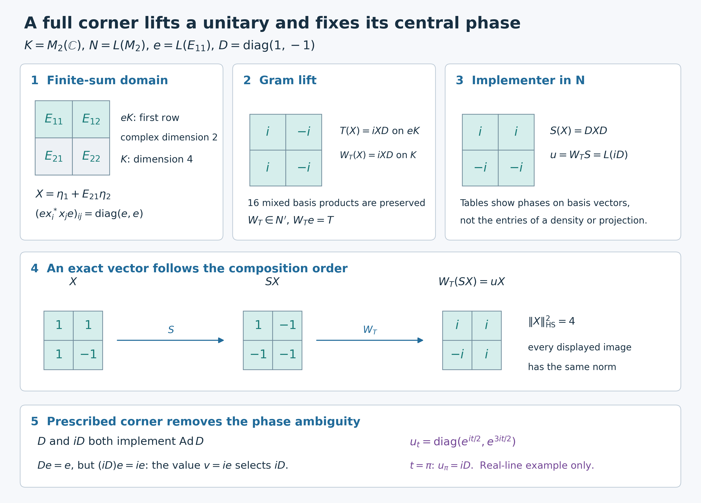

# Lifting innerness and cocycles from a full corner

The corner value carries more information than an implementing automorphism: it also fixes the central phase. We begin with a concrete map on finite sums and prove that its inner-product preservation produces a unique whole-space commutant unitary. Its continuity then supplies the topological input for lifting an entire family. Only after these constructions do we use prescribed-corner uniqueness to obtain the cocycle law.

*Restored historical programme proof with independently written completion and exact model, GPT-6.1 Sol (OpenAI), Ultra, 5 October 2026. Original added expression is CC0-1.0 to the extent of rights held; prior terms remain intact. Spot-checked in a separate AI session.*

## Exact setting and earlier proofs

Algebras and Hilbert spaces are arbitrary. The acting group is any locally compact Hausdorff group and may be nonabelian or lack any countable base. Automorphisms are normal star automorphisms. A faithful normal concrete representation is used on its identity subspace, where the algebra unit is the Hilbert-space identity; ST2 proves this reduction and transports all bounded topology statements. In particular no unused complement of a degenerate representation is included in the full-corner density assertion.

The exact earlier proofs are CF8 for Hilbert projections and operator facts, CF10 for bounded extension from a dense inner-product space, PC1 for corner and bicommutant facts, and [CP6](OA-FLOW-CP.md#oa-flow.cp.6) for normal vector-series tests. [CR9](OA-FLOW-CR.md#oa-flow.cr.9) supplies a faithful n.s.f. weight and hence a standard form for every algebra. [MC1](OA-FLOW-MC.md#oa-flow.mc.1) supplies canonical implementation of each normal isomorphism in that form. For two actions, the complete [AT3](OA-FLOW-AT.md#oa-flow.at.3) converts point-ultraweak continuity into predual norm continuity, and [NR1](OA-FLOW-NR.md#oa-flow.nr.1) supplies their strongly continuous implementations on the same chosen form. These are written proofs, rather than an external spatiality or faithful-state assumption.

## A full corner determines the commutant

First assume that $N\ne0$. The zero algebra is handled separately below. Let $N\subseteq B(K)$ be a faithfully and normally represented von Neumann algebra, and let $e\in\operatorname{Proj}(N)$ have central support

$$
z_N(e)=1. \tag{L1}
$$

The closed subspace $[NeK]$ is the object in (L2). Here and below $NeK$ denotes the **algebraic finite linear span** of the vectors $xe\xi$, not just the set of single products; square brackets denote its Hilbert closure. More explicitly, put $\mathcal D=\{\sum_{i=1}^n x_i\eta_i:x_i\in N,\ \eta_i\in eK,\ n<\infty\}$. Let $p$ be the orthogonal projection onto $\overline{\mathcal D}$, supplied by CF8. The space is invariant under every $x\in N$ and its adjoint, so $p\in N'$. It is also invariant under every $y\in N'$ and its adjoint: $y(x\eta)=xy\eta$, and $y\eta\in eK$ because $ye=ey$. Thus $p\in(N')'=N$ by PC1. It is a central projection containing $eK$. If a central projection $z$ dominates $e$, then $z(x\eta)=xz\eta=x\eta$ on every such summand, so $p\le z$. Consequently $p$ is exactly the least central projection dominating $e$, namely $z_N(e)$. This proves, rather than assumes, that (L1) is equivalent to

$$
[NeK]=K. \tag{L2}
$$

Compression gives a normal injective homomorphism

$$
\kappa:N'\longrightarrow(eNe)',
\qquad \kappa(y)=ye|_{eK}. \tag{L3}
$$

Here the commutant on the right is taken in $B(eK)$.  Injectivity follows immediately from (L2): if $ye=0$ and $y\in N'$, then

$$
y(xe\xi)=xye\xi=0 \qquad(x\in N,\ \xi\in K), \tag{L4}
$$

so $y=0$ on a dense subspace. The remaining compression claims also have direct proofs. Every $y\in N'$ commutes with $e$, so it preserves $eK$; compression commutes with products and adjoints and maps $1$ to the corner identity. It commutes there with every $exe$, $x\in N$, and is contractive. A normal functional on the target commutant has a CP6 square-summable-vector-series representation with vectors in $eK$. Regarding those same vectors as vectors of $K$ makes its pullback exactly a normal vector-series functional on $N'$. This proves ultraweak continuity, hence normality of the star homomorphism $\kappa$, on arbitrary nets. No sigma-finiteness or assertion of a bounded-operator inverse has been used.

We need the inverse explicitly for unitaries.  Let $T\in\mathcal U((eNe)')$.  On the dense subspace $NeK$ define

$$
W_T\!\left(\sum_{i=1}^n x_i\eta_i\right)
=\sum_{i=1}^n x_iT\eta_i,
\qquad x_i\in N,\quad \eta_i\in eK. \tag{L5}
$$

For two such finite sums, every entry of the Gram matrix

$$
\bigl[\langle x_i\eta_i,x_j\eta_j\rangle\bigr]_{i,j}
\quad\text{is governed by}\quad
e x_i^*x_j e\in eNe. \tag{L6}
$$

The corner map $T$ is used on each summand; only commutation of $T$ with the corner algebra is needed. In particular the governing operators are $e x_i^*x_j e$ in (L6). Use inner products linear in their first variable. For different expressions $\zeta=\sum_i x_i\eta_i$ and $\theta=\sum_j y_j\xi_j$, the complete mixed Gram calculation is

\[
 \begin{aligned}
 \left\langle\sum_i x_iT\eta_i,\sum_jy_jT\xi_j\right\rangle
 &=\sum_{i,j}\langle T\eta_i,(ex_i^*y_je)T\xi_j\rangle\\
 &=\sum_{i,j}\langle T\eta_i,T(ex_i^*y_je)\xi_j\rangle
 =\sum_{i,j}\langle\eta_i,(ex_i^*y_je)\xi_j\rangle
 =\langle\zeta,\theta\rangle.
 \end{aligned}
 \tag{IC1}
\]

A zero expression therefore has zero image. Subtracting any two expressions of the same vector proves independence of the chosen finite sum, and the formula is then linear. Taking $\theta=\zeta$ proves isometry. CF10 extends it uniquely from $\mathcal D$ to $K$.  The construction with $T^*$ gives $W_{T^*}$. Both compositions are the identity on $\mathcal D$: their values on $\sum_i x_i\eta_i$ insert $T^*T$ or $TT^*$ into each $\eta_i$. Continuity makes the identities hold on all of $K$. Thus the extension is onto, with inverse $W_{T^*}=W_T^*$, and is a unitary $W_T$.  Formula (L5) also gives

$$
W_Tx=xW_T \qquad(x\in N), \tag{L7}
$$

and hence $W_T\in N'$, with $W_Te=T$.  Uniqueness follows from injectivity in (L3).  We have proved the unitary form of the full-corner commutant theorem:

$$
\boxed{
\mathcal U(N')\longrightarrow\mathcal U((eNe)'),
\quad W\longmapsto We,
\text{ is a bijection}.} \tag{L8}
$$

The inverse respects strong continuity.  If $r\mapsto T_r$ is a strongly continuous unitary family on $eK$, then for every vector $xe\xi$ in the dense subspace from (L2),

$$
W_{T_r}(xe\xi)=xT_re\xi \tag{L9}
$$

depends continuously on $r$.  The uniform bound $\|W_{T_r}\|=1$ holds for all parameters. The same statement first holds on every finite sum in $\mathcal D$. For a general vector $\xi$ and $\zeta=\sum_i x_i\eta_i\in\mathcal D$,

\[
 \|(W_{T_r}-W_{T_{r_0}})\xi\|
 \le2\|\xi-\zeta\|+\sum_i\|x_i\|\|(T_r-T_{r_0})\eta_i\|.
 \tag{IC2}
\]

Choose $\zeta$ before a parameter neighborhood, using density, and then use the finitely many corner-vector continuities. This proves strong continuity on all of $K$ for arbitrary parameter nets. The uniformly bounded unitary family is essential to this passage; no separable dense subset is selected. Thus $r\mapsto W_{T_r}$ is strongly continuous.

We will also use two elementary continuity rules. If $R_r,S_r$ are strongly continuous unitary families, then

\[
 \begin{aligned}
 \|(R_r^*-R_{r_0}^*)\xi\|
 &=\|(R_{r_0}-R_r)R_{r_0}^*\xi\|,\\
 \|(R_rS_r-R_{r_0}S_{r_0})\xi\|
 &\le\|(S_r-S_{r_0})\xi\|+
 \|(R_r-R_{r_0})S_{r_0}\xi\|.
 \end{aligned}
 \tag{IC3}
\]

The first identity follows by left multiplication by the unitary $R_r$; the second is the two-term expansion and the norm-one bound. Both right sides tend to zero on arbitrary nets. The same statements hold on a fixed corner space; extending corner operators by zero makes them strongly continuous on the whole space as well.

## Innerness lifts uniquely with its prescribed corner

Let $\sigma\in\operatorname{Aut}(N)$, suppose $\sigma(e)=e$ and $z_N(e)=1$, and assume

$$
\sigma|_{eNe}=\operatorname{Ad}v
\qquad\text{for some }v\in\mathcal U(eNe). \tag{L10}
$$

CR9 and the standard-form construction allow us to choose a faithful normal standard representation of $N$, without assuming a faithful normal state. MC1 applied through $\sigma$ gives the standard unitary $S$ with $SxS^*=\sigma(x)$. ST2 identifies this normal realization with the abstract algebra. Since $SeS^*=e$, multiplication by $S$ gives $Se=eS$; hence $S$ and $S^*$ restrict to inverse unitaries on $eK$. The corner unitary $v$ has $v^*v=vv^*=e$. On $eK$ put

$$
T=vS^*|_{eK}. \tag{L11}
$$

For $a\in eNe$, equation (L10) gives $\sigma^{-1}(a)=v^*av$, and therefore

$$
Ta=vS^*a
=v\sigma^{-1}(a)S^*
=avS^*=aT. \tag{L12}
$$

The product in (L11) is a unitary on $eK$, because both factors are, and (L12) proves its commutation with the whole corner algebra. Thus $T\in\mathcal U((eNe)')$.  Let $W\in\mathcal U(N')$ be its unique lift from (L8), and set

$$
u=WS. \tag{L13}
$$

Because $W$ commutes with $N$, $\operatorname{Ad}u=\operatorname{Ad}S=\sigma$, and

$$
ue=WeS=vS^*eS=v. \tag{L14}
$$

It remains to show that the spatial implementer $u$ actually belongs to $N$.  Since $u$ normalizes $N$, it also normalizes $N'$.  For $y\in N'$, use $ue=eu=v$ to compute

$$
(uyu^*)e
=uyv^*
=uv^*y
=ey
=ye. \tag{L15}
$$

Both $uyu^*$ and $y$ lie in $N'$.  Injectivity of compression in (L3) gives $uyu^*=y$.  Hence $u\in(N')'=N$.

For uniqueness, suppose $w\in\mathcal U(N)$ also implements $\sigma$ and satisfies $we=ew=v$.  Then

$$
c=w^*u\in Z(N),
\qquad ce=e. \tag{L16}
$$

The centrality in (L16) follows by comparing the two implementing identities: $w^*u$ commutes with every $x\in N$. Its corner is $w^*ue=w^*v=e$. The equality $(c-1)e=0$ therefore holds. Since $c-1$ commutes with $N$ and vanishes on $eK$, it vanishes on every finite sum in $\mathcal D$, and hence on $K$. Thus $c=1$. This is the full-support step in uniqueness, with no implicit central decomposition or countability input.  We have proved

$$
\boxed{
\sigma|_{eNe}=\operatorname{Ad}v
\quad\Longrightarrow\quad
\text{there is a unique }u\in\mathcal U(N)
\text{ with }\sigma=\operatorname{Ad}u, ue=eu=v.} \tag{L17}
$$

The corner value is part of the conclusion.  Innerness alone would determine an implementer only up to a central unitary.

## Continuous corner implementers have continuous global lifts

First assume that $M\ne0$. Let $Q$ be a locally compact group; commutativity is not assumed.  Let

$$
\alpha,\beta:Q\longrightarrow\operatorname{Aut}(M) \tag{L18}
$$

be point-ultraweakly continuous actions.  Suppose that $e$ is fixed by both actions, $z_M(e)=1$, and that $v:Q\to\mathcal U(eMe)$ is a strongly continuous $\alpha^e$-cocycle satisfying

$$
v_{st}=v_s\alpha_s(v_t),
\qquad
\beta_t^e=\operatorname{Ad}(v_t)\circ\alpha_t^e. \tag{L19}
$$

Choose one standard form. AT3 verifies NR0 for each of the two actions, and NR1 then constructs both strongly continuous standard implementations $A_t$ and $B_t$ for $\alpha_t$ and $\beta_t$ on this same space. Their invariance of $e$ gives $A_te=eA_t$ and $B_te=eB_t$. The assumed strong continuity of the corner family is unchanged in this realization by ST2, since the family consists of corner unitaries and is uniformly bounded. No countability of the group or standard Hilbert space enters.  The unitary

$$
C_t=B_tA_t^* \tag{L20}
$$

implements $\beta_t\alpha_t^{-1}$ and commutes with $e$.  Its restriction to $eMe$ is $\operatorname{Ad}v_t$.  Repeating (L11)--(L13), define

$$
T_t=v_tC_t^*|_{eK}\in\mathcal U((eMe)'),
\qquad
W_te=T_t,
\qquad
u_t=W_tC_t. \tag{L21}
$$

Formula (IC3) proves strong continuity of $A_t^*$, $C_t=B_tA_t^*$, its adjoint and the product $v_tC_t^*$ on $eK$. Thus every $T_t$ is the unitary from (L11) for the fixed-corner automorphism $\beta_t\alpha_t^{-1}$, and $t\mapsto T_t$ is strongly continuous.  Equations (L8)--(L9) make $t\mapsto W_t$ strongly continuous, and therefore $t\mapsto u_t$ is strongly continuous.  The inner-lifting theorem gives

$$
u_t\in\mathcal U(M),
\qquad
\beta_t=\operatorname{Ad}(u_t)\circ\alpha_t,
\qquad
u_te=eu_t=v_t. \tag{L22}
$$

This is the topological step that cannot be obtained merely by choosing an implementer separately for each $t$.

## Uniqueness forces the global cocycle law

For $s,t\in Q$, the action laws and (L22) show that both unitaries

$$
u_{st}
\quad\text{and}\quad
u_s\alpha_s(u_t) \tag{L23}
$$

implement $\beta_{st}\alpha_{st}^{-1}$. Here is the full order calculation for the second unitary, in the group of automorphisms:

\[
 \begin{aligned}
 \operatorname{Ad}(u_s\alpha_s(u_t))
 &=\operatorname{Ad}u_s\circ\alpha_s\circ\operatorname{Ad}u_t\circ\alpha_s^{-1}\\
 &=(\beta_s\circ\alpha_s^{-1})\circ\alpha_s\circ
       (\beta_t\circ\alpha_t^{-1})\circ\alpha_s^{-1}\\
 &=\beta_s\circ\beta_t\circ\alpha_t^{-1}\circ\alpha_s^{-1}
 =\beta_{st}\circ\alpha_{st}^{-1}.
 \end{aligned}
 \tag{IC4}
\]

No two different actions have been commuted. Their prescribed corner values agree because

$$
u_s\alpha_s(u_t)e
=v_s\alpha_s^e(v_t)
=v_{st}
=u_{st}e. \tag{L24}
$$

Apply uniqueness in (L17) to the automorphism $\beta_{st}\alpha_{st}^{-1}$.  It gives

$$
\boxed{u_{st}=u_s\alpha_s(u_t).} \tag{L25}
$$

Thus $u$ is a strongly continuous $\alpha$-cocycle and

$$
\boxed{\beta=\operatorname{Ad}(u)\circ\alpha.} \tag{L26}
$$

The order in (L25) is the nonabelian cocycle order. No commutativity of $Q$ entered the proof. At the group identity $1_Q$, (L19) gives $v_{1_Q}=v_{1_Q}^2$, hence $v_{1_Q}=e$. The identity automorphism has the implementer $1_M$ with this corner, so uniqueness gives $u_{1_Q}=1_M$. Applying (L25) to $s,s^{-1}$ also gives $u_{s^{-1}}=\alpha_{s^{-1}}(u_s^*)$. All families of unitaries have bound one; (IC3) and ST2 therefore show that the strong continuity just proved is the same intrinsic sigma-strong-star continuity in every faithful normal realization. For $M=0$, use the zero Hilbert space and its unique zero unitary; all algebraic identities and lifting conclusions hold trivially, with norm zero; the norm-one estimates above apply to the nonzero case. For $M\ne0$, central support one forces $e\ne0$.

**Problem.** Where is the full-central-support hypothesis used twice in the proof of (L17)?

**Solution.** It first makes $NeK$ dense and thereby makes compression of the commutant injective and every corner-commutant unitary lift uniquely.  It is used again in (L16): a central unitary equal to one on $e$ must equal one globally.  The first use constructs an implementer; the second proves its uniqueness. $\square$

## An exact matrix model and solved checks

Use the Hilbert–Schmidt space $K=M_2(\mathbb C)$ with $\langle X,Y\rangle=\operatorname{Tr}(Y^*X)$, and let $N=L(M_2)$ act by left multiplication. The representation is faithful, normal and unital; all matrix coordinates are finite-dimensional. The projection $e=L(E_{11})$ selects the first row, so $eK$ has complex dimension two although $E_{11}$ has rank one in the coefficient algebra. The center of $M_2$ consists of scalar matrices: commutation with $E_{11},E_{22}$ forces diagonal form, and with $E_{12}$ forces equal diagonal entries. Therefore $z_N(e)=1$.

Every $X$ is the sum of its first-row matrix $\eta_1$ and $E_{21}\eta_2$, where $\eta_2$ is its second row placed in the first row. Thus the finite-sum domain already equals all four-dimensional $K$. For $x_1=I,x_2=E_{21}$, the four corner Gram operators are $e,e$ on the diagonal and zero off the diagonal. If a bounded operator commutes with all left matrix units, its restriction to the first row determines its action on the second by commuting with $E_{21}$; the restriction is a unique right matrix multiplication. This also verifies the model's whole commutant directly.

Put $D=\operatorname{diag}(1,-1)$ and $\sigma(a)=DaD$. The standard implementer is $S(X)=DXD$: it implements $\sigma$, commutes with $J(X)=X^*$ and preserves the positive cone. Choose the prescribed corner $v=iE_{11}$, whose conjugation is the identity on $E_{11}M_2E_{11}$. Formula (L11) gives $T(X)=iXD$ on the first row. Its lift is $W_T(X)=iXD$ on all of $K$, which commutes with left multiplication. Consequently $u=W_TS=L(iD)$. Both $D$ and $iD$ implement $\sigma$ in the coefficient algebra, but their corner values are $E_{11}$ and $iE_{11}$ respectively. The prescribed value selects exactly the second.

The same example lies in a continuous family:

\[
 D_t=\operatorname{diag}(1,e^{it}),\quad
 \alpha_t=\operatorname{id},\quad\beta_t=\operatorname{Ad}D_t,\quad
 v_t=e^{it/2}E_{11},\quad
 u_t=e^{it/2}D_t=\operatorname{diag}(e^{it/2},e^{3it/2}).
 \tag{IC5}
\]

Indeed $S_t=L_{D_t}R_{D_t^*}$, $T_t=e^{it/2}R_{D_t}|_{eK}$, and $W_t=e^{it/2}R_{D_t}$, so (L21) gives the displayed $u_t$. Each matrix entry is continuous, $v_{s+t}=v_sv_t$ and $u_{s+t}=u_su_t$. The sample above is $t=\pi$. This real-line illustration is not a reduction of the arbitrary nonabelian-group theorem.

**Problem 2.** For $X=\begin{pmatrix}1&1\\1&-1\end{pmatrix}$, compute the Gram lift, standard implementation and whole implementer, and verify their norms.

**Solution.** Direct multiplication gives $W_TX=\begin{pmatrix}i&-i\\i&i\end{pmatrix}$, $SX=\begin{pmatrix}1&-1\\-1&-1\end{pmatrix}$ and $uX=\begin{pmatrix}i&i\\-i&i\end{pmatrix}$. Every matrix has Hilbert–Schmidt norm squared four. The equality for all mixed inner products, not merely these three norms, is (IC1); in this model it is also immediate from the unitary right or left factors.

**Problem 3.** Show that a prescribed corner does not force uniqueness when its central support is smaller than one.

**Solution.** In $M=M_2\oplus M_2$, put $e=(E_{11},0)$ and $\sigma=\operatorname{id}\oplus\operatorname{Ad}D$. Its central support is $(I,0)$. Both $(I,D)$ and $(I,-D)$ implement $\sigma$ and have the same corner value $e$, but they differ globally. This does not contradict (L17): the unused central summand prevents both dense full-span detection and the final central-phase test.

## Source antecedent and precise conclusion

The ordinary human source is Takesaki, [*Theory of Operator Algebras II*, Lemmas XI.2.10–11 and Remark XI.2.12, printed337–338](https://doi.org/10.1007/978-3-662-10451-4). Its common spatial-commutant mechanism informs the mathematics. This lesson retains the historical alternative order: construct the finite-sum Gram inverse and its continuity before constructing the inner lift, then calculate the family and finally use prescribed-corner uniqueness to obtain its nonabelian cocycle law. Compression normality, the dense-span projection, the mixed Gram identity, identity cases and the exact matrix family are proved here, with actual earlier standard-form and action-topology inputs.

The established local scope is unique innerness with a prescribed full-corner unitary and unique strongly continuous cocycle lifting for arbitrary LCH groups and arbitrary von Neumann algebras/Hilbert spaces.

## Exact Gram lift, composition and central phase

The space is $K=M_2(\mathbb C)$ with the linear-first inner product $\langle X,Y\rangle=\operatorname{Tr}(Y^*X)$. The algebra $N=L(M_2)$ acts on the left. The projection $e=L(E_{11})$ has rank two on the four-dimensional Hilbert space, although $E_{11}$ has rank one in the coefficient algebra. Its range is the first row. The two shaded first-row basis vectors span $eK$; the lower row is generated by $E_{21}eK$. Thus $X=\eta_1+E_{21}\eta_2$ for every $X$, with both $\eta_i\in eK$. The operators $x_1=I,x_2=E_{21}$ have corner Gram matrix $\operatorname{diag}(e,e)$, with zero off-diagonal entries. This is the exact finite-dimensional instance of the [finite-sum domain and mixed Gram proof](OA-FLOW-L117.md#l117-gram), not an approximation to its arbitrary-Hilbert-space argument.

Put $D=\operatorname{diag}(1,-1)$, $\sigma=\operatorname{Ad}D$, and prescribe $v=iE_{11}$. The standard implementer is $S(X)=DXD$. On $eK$ the corner-commutant unitary is $T(X)=iXD$; its unique whole-space lift is $W_T(X)=iXD$. The middle table records the phases $i,-i$ on the two columns of the four basis matrices. All sixteen mixed basis inner products are verified exactly in the reproduction data. Composing in the order $u=W_TS$ yields $u=L(iD)$, whose phases are instead $i,-i$ on the rows. These tables record an operator's action on basis vectors; they are neither the entries of the projection nor a density matrix. The membership and uniqueness proof is [the prescribed-corner innerness theorem](OA-FLOW-L117.md#l117-inner).

For the displayed sample $X=\begin{pmatrix}1&1\\1&-1\end{pmatrix}$, the central row of the figure follows $X\mapsto SX=\begin{pmatrix}1&-1\\-1&-1\end{pmatrix}\mapsto W_T(SX)=uX=\begin{pmatrix}i&i\\-i&i\end{pmatrix}$. All three squared Hilbert–Schmidt norms equal four. The distinct unitary matrices $D$ and $iD$ induce the same automorphism, while $DE_{11}=E_{11}$ and $(iD)E_{11}=iE_{11}$: the prescribed corner removes this phase ambiguity. The purple formula gives the exact continuous real-line family $u_t=\operatorname{diag}(e^{it/2},e^{3it/2})$; its value at $t=\pi$ is $iD$. Its corner is $v_t=e^{it/2}E_{11}$ and $u_{s+t}=u_su_t$. This model illustrates, without restricting, the [arbitrary nonabelian-group cocycle theorem](OA-FLOW-L117.md#l117-cocycle). All sample calculations and solved checks are in [the matrix model](OA-FLOW-L117.md#l117-model).

The human source antecedent for the general theorem is Takesaki, [*Theory of Operator Algebras II*, Lemmas XI.2.10–11 and Remark XI.2.12, printed337–338](https://doi.org/10.1007/978-3-662-10451-4). The independently organized Gram proof, matrix example and original illustration are supplied here. The numerical example has exactly the finite matrix dimensions stated above and makes no numerical claim about a general group or algebra.

Native dimensions are 3200×2300. [Editable SVG](../assets/inner-corner-cocycle/assets/corner-lift.svg), [exact matrix and mixed-Gram data](../assets/inner-corner-cocycle/assets/corner-lift-data.json), and [reproduction source](../assets/inner-corner-cocycle/render_corner_lift.py) accompany the image. The original illustration/code/data are CC0-1.0 to the extent of rights held; the embedded DejaVu glyphs retain their [font terms](../assets/inner-corner-cocycle/FONT-LICENSE.txt).
