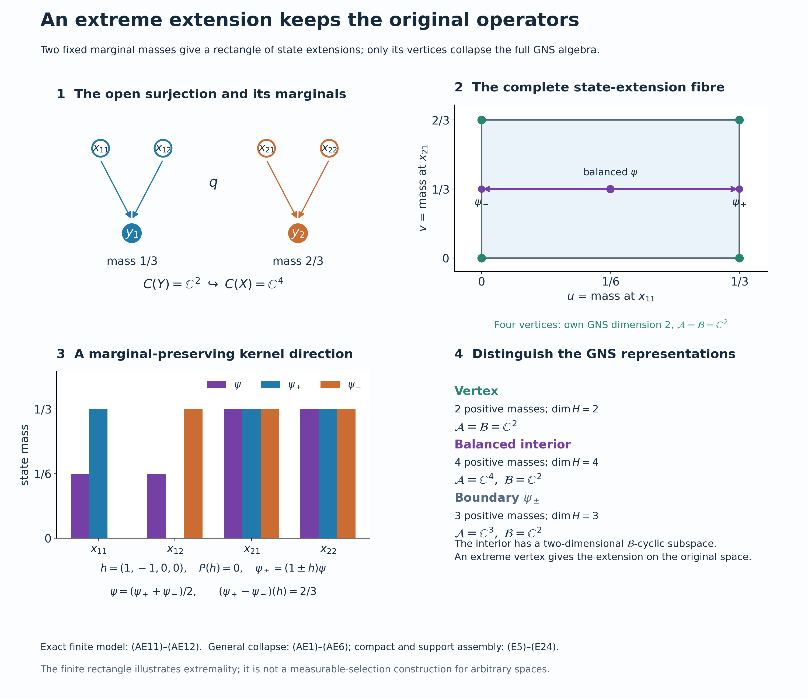

# Extending abelian representations inside their original closure

A representation extension should preserve its measurable operators, not merely its continuous functions. We first construct the finite-state expectation which detects an unwanted extra operator. Its kernel gives a direct perturbation of a state extension. An extreme extension therefore has exactly the original weak closure. Compact carriers handle one finite measure, and support corners then put the construction back into an arbitrary original representation. A separate topological dual-map proof applies the result to closed subgroups of arbitrary locally compact abelian groups.

*Restored historical programme mathematics with independent completion and a new exact model, GPT-6.1 Sol (OpenAI), Ultra, 5 October 2026. Added original expression is CC0-1.0 to the extent of rights held; historical terms and separate font terms remain intact. Spot-checked in a separate AI session.*

## Setting and earlier proofs

Spaces are locally compact Hausdorff, representations are on arbitrary complex Hilbert spaces, and every group in the final application is arbitrary LCA. There is no countability, measurable-selection or finite-multiplicity hypothesis. Inner products are linear in their first variable. The zero Hilbert space has its unique zero representation and extension. If $Y$ is empty, surjectivity forces $X$ empty and nondegeneracy forces that zero case; all conclusions then hold. In the proof involving a unit vector or state, the Hilbert space is nonzero.

The actual earlier proofs are [CF1](OA-FLOW-CF.md#oa-flow.cf.1) and [CF4](OA-FLOW-CF.md#oa-flow.cf.4) for Hahn–Banach, choice and compactness, [CF8](OA-FLOW-CF.md#oa-flow.cf.8) and [CF10](OA-FLOW-CF.md#oa-flow.cf.10) for Hilbert operators and completion, [GNS3.1](OA-FLOW-GNS.md#gns-lemma-3-1) and [GNS5.1](OA-FLOW-GNS.md#gns-theorem-5-1) for approximate identities and cyclic representations, [HR2](OA-FLOW-HR.md#oa-flow.hr.2) and [HR3](OA-FLOW-HR.md#oa-flow.hr.3) for finite Radon measures and continuous $L^2$ density, and [QF1](OA-FLOW-QF.md#qf-1) for compact lifting and continuous extension from a closed subspace. The expectation uses the complete [TD4](OA-FLOW-TD.md#oa-flow.td.4), [TD5](OA-FLOW-TD.md#oa-flow.td.5), [TD8](OA-FLOW-TD.md#oa-flow.td.8), [EP3](OA-FLOW-EP.md#oa-flow.ep.3) and [NF1](OA-FLOW-NF.md#oa-flow.nf.1) and [NF6](OA-FLOW-NF.md#oa-flow.nf.6) proofs. Normal representation transport uses [CP6](OA-FLOW-CP.md#oa-flow.cp.6), [NF5](OA-FLOW-NF.md#oa-flow.nf.5), [ST2](OA-FLOW-ST12.md#oa-flow.st.2) and [BD4](OA-FLOW-BD.md#oa-flow.bd.4) and [BD5](OA-FLOW-BD.md#oa-flow.bd.5). Bounded spectral projections and normal-vector convergence are proved in [SB6](OA-FLOW-SF.md#oa-flow.sf.sb6), [SF1](OA-FLOW-SF.md#oa-flow.shared-foundations.sf-1) and [SF2](OA-FLOW-SF.md#oa-flow.shared-foundations.sf-2). The final dual argument uses [H1](OA-FLOW-HARMONIC.md#oa-flow.xgaps.cstar.h1), [H3](OA-FLOW-HARMONIC-LATE.md#oa-flow.xgaps.cstar.h3), and [L24 integration](OA-FLOW-L24.md#oa-flow.grp.integration) and [recovery](OA-FLOW-L24.md#oa-flow.grp.recovery). Exact individual scopes, including these grouped links, are recorded in the proof ledger; a citation is not a replacement for a proof.

## The extension to be constructed

Let $X$ and $Y$ be locally compact Hausdorff spaces and let

$$
q:X\longrightarrow Y \tag{E1}
$$

be a continuous open surjection.  Put

$$
A=C_0(X),\qquad B=C_0(Y). \tag{E2}
$$

Pullback along $q$ is a nondegenerate injective homomorphism

$$
q^*:B\longrightarrow M(A)=C_b(X),
\qquad q^*(b)=b\circ q. \tag{E3}
$$

We will prove that every nondegenerate representation $\pi:B\to B(K)$ has a nondegenerate representation $\rho:A\to B(K)$ whose multiplier extension satisfies

$$
\widetilde\rho(q^*b)=\pi(b)\quad(b\in B),
\qquad
\rho(A)''=\pi(B)''. \tag{E4}
$$

## Multipliers on the same Hilbert space

The function algebras here have their pointwise operations and supremum norm. A uniformly Cauchy sequence has a uniform continuous limit; for $C_0(X)$ that limit vanishes at infinity because its large level sets lie in those of one approximant. Thus these algebras are complete, the norm identity $\|a^*a\|=\|a\|^2$ holds pointwise, and $C_0(X)$ is an ideal in $C_b(X)$. Here is the full meaning of $M(A)=C_b(X)$ in (E3). A bounded left multiplier $L$ satisfies $L(ab)=L(a)b$. Commutativity also gives $L(a)b=L(b)a$. At $x\in X$, choose a compactly supported cutoff $a_x$ of norm one with $a_x(x)=1$, using HR's topological cutoff proof. Put $h(x)=L(a_x)(x)$. The displayed equality proves independence of the cutoff, and then $L(a)(x)=h(x)a(x)$ for every $a\in C_0(X)$. The bound $|h(x)|\le\|L\|$ holds at every point. Near a point where $a_x$ is nonzero, $h=L(a_x)/a_x$ is continuous. Thus $h\in C_b(X)$. The balanced right multiplier agrees; conversely multiplication by such an $h$ is a bounded two-sided multiplier, with norm $\|h\|$. This establishes the stated identification without an assumed multiplier representation theorem.

For a nondegenerate representation $\pi$ of $C_0(X)$, let $(u_i)$ be the positive contractive approximate identity of GNS3.1. The operators $\pi(hu_i)$ have bound $\|h\|$ and, on a generating vector $\pi(a)\eta$, converge to $\pi(ha)\eta$. The same holds on every finite sum of generating vectors. That domain is dense by nondegeneracy. Given an arbitrary vector, approximate it on that domain before choosing $i$; the common operator bound proves strong convergence everywhere to a bounded operator $\widetilde\pi(h)$. Products, adjoints and the identity can be checked against the generating vectors and their pairings, then extended by density. Hence $\widetilde\pi$ is a unital star homomorphism extending $\pi$, with

\[
 \widetilde\pi(h)\pi(a)\eta=\pi(ha)\eta,
 \qquad\widetilde\pi(h)\in\pi(C_0(X))''.
 \tag{AE7}
\]

The last membership follows because every $\pi(hu_i)$ lies in the algebra and commutation passes through bounded strong limits. The action on the dense generating domain also proves uniqueness. Pullback is isometric and injective because $q$ is onto. For $a\in C_0(X)$ and $\varepsilon>0$, the set $F=\{|a|\ge\varepsilon\}$ is compact. A positive cutoff $b\in C_c(Y)$, $b=1$ on $q(F)$, gives $\|(b\circ q)a-a\|\le\varepsilon$. This proves nondegeneracy of (E3), including when pullback is not in $C_0(X)$ itself.

## The finite-state expectation

Let $\mathcal B\subseteq\mathcal A$ be unital abelian von Neumann algebras with the same identity, and let $\psi$ be a faithful normal state on $\mathcal A$. Put $\tau=\psi|_{\mathcal B}$. Commutativity makes $\tau$ a trace; it is normal and faithful, and every positive element has finite value. Thus it has exactly the faithful normal semifinite trace hypotheses of TD. Only TD4's bounded-normal-functional branch is consumed.

### Density, boundedness and all-net normality

For $x\in\mathcal A_+$, define $f_x(b)=\psi(xb)$ for $b\in\mathcal B$. Since the two algebras commute, $xb=x^{1/2}bx^{1/2}\ge0$ for $b\ge0$. Moreover

\[
 0\le f_x(b)\le\|x\|\tau(b)\qquad(b\in\mathcal B_+).
 \tag{AE1}
\]

The functional is normal on the whole algebra. Indeed CP6 writes $\psi(a)=\sum_n\langle a\xi_n,\eta_n\rangle$ with both vector sequences square summable. Its restriction after multiplication by $x$ is $\sum_n\langle b\xi_n,x^*\eta_n\rangle$, a normal vector series on $\mathcal B$. This verifies full ultraweak continuity, rather than merely sequential continuity on positives.

TD4 supplies the unique extended-positive density $m_x$ with $\Phi_{m_x}=f_x$ relative to $\tau$. The density $\|x\|1$ gives the functional $\|x\|\tau$. By TD5, (AE1) implies $m_x\le m_{\|x\|1}$ on every positive normal functional, not only on a dense finite algebra. For $g\in\mathcal B_*^+$ this reads $m_x(g)\le\|x\|g(1)=\|x\|\|g\|$, with the last equality proved in NF1. EP3's bounded-element criterion consequently puts $m_x=m_{H_x}$ for an actual bounded element $H_x\in\mathcal B_+$ with $H_x\le\|x\|1$. The order bound is thus justified through the complete extended cone. In particular no unbounded density is simply relabelled as bounded.

Define $P(x)=H_x$ on $\mathcal A_+$. TD8's finite trace pairing, or its bounded special case, gives

\[
 \tau(P(x)b)=\psi(xb)\qquad(b\in\mathcal B).
 \tag{AE2}
\]

All products here are bounded; $\tau$ is finite, so their pairings require no unspecified unbounded product domain. These equations determine $P(x)$ uniquely: if $c\in\mathcal B$ pairs to zero against every $b\in\mathcal B$, take $b=c^*$ to obtain $\tau(cc^*)=0$, whence $c=0$ by faithfulness. Thus the equality of the scalar pairings proves additivity and nonnegative homogeneity of $P$ on positives. Also $P(1)=1$ and $P(b)=b$ for $b\in\mathcal B_+$.

For a self-adjoint $z=a-b$ with $a,b\ge0$, define $P(z)=P(a)-P(b)$. If also $z=a'-b'$, then $a+b'=a'+b$; positive additivity gives $P(a)-P(b)=P(a')-P(b')$. This proves decomposition independence. Addition and real scalar multiplication follow by combining positive decompositions and interchanging them for a negative scalar. Every $z$ has a unique decomposition $z=z_1+iz_2$ into self-adjoint parts; define $P(z)=P(z_1)+iP(z_2)$. It is complex linear, positive and star preserving. Formula (AE2) now holds for every $z\in\mathcal A$, and $P|_{\mathcal B}$ is the identity.

For $b_1,b_2,b\in\mathcal B$, (AE2) and commutativity show

\[
 \tau(P(b_1zb_2)b)=\psi(zb_2bb_1)
 =\tau(P(z)b_2bb_1)=\tau((b_1P(z)b_2)b).
 \tag{AE3}
\]

The preceding faithful pairing test proves bimodularity. It also gives $P^2=P$. Taking $b=1$ proves $\psi\circ P=\psi$; hence $P$ is faithful on positives. Positivity and bimodularity give a sharp norm estimate without importing a positive-map norm theorem:

\[
 0\le P((z-P(z))^*(z-P(z)))
   =P(z^*z)-P(z)^*P(z),
 \qquad \|P(z)\|^2\le\|P(z^*z)\|\le\|z\|^2.
 \tag{AE4}
\]

The final inequality is the already established positive bound. Thus $P$ is contractive and has norm one, since the state hypothesis makes the common identity nonzero.

Finally suppose $0\le x_i\uparrow x$ is an arbitrary bounded increasing net in $\mathcal A$. Then $P(x_i)$ increases and is bounded above by $\|x\|1$; let $y$ be its supremum in $\mathcal B$. For $b\in\mathcal B_+$, multiplication makes $a\mapsto\psi(ab)$ a normal positive functional by the same CP6 argument as above. NF6's already proved order/topology equivalence for that scalar positive map, and normality of $\tau$, imply

\[
 \tau(yb)=\sup_i\tau(P(x_i)b)
          =\sup_i\psi(x_i b)=\psi(xb)=\tau(P(x)b).
 \tag{AE5}
\]

Linearity extends this equality from positive $b$ to every $b$, and the faithful pairing test gives $y=P(x)$. Hence $P$ preserves all bounded increasing positive suprema. NF6 now proves ultraweak continuity of $P$ on all of $\mathcal A$, including arbitrary unbounded ultraweakly convergent nets. This completes the faithful normal state-preserving conditional expectation.

## One finite measure and its compact carriers

Begin with a cyclic representation and a unit cyclic vector. Its vector functional is a state: GNS3.3's positive approximate identity tends strongly to the identity, so its values tend to one. HR2 represents this functional by a probability Radon measure $\nu$ on $Y$. The map $\pi(b)\xi\mapsto b$ preserves inner products because their common value is $\int b\overline c\,d\nu$. HR3 proves $C_c(Y)$ dense in $L^2(Y,\nu)$; CF10 therefore extends this map to an onto unitary, and multiplication on the dense functions identifies the representation as

$$
K=L^2(Y,\nu),
\qquad
\pi(b)\xi=b(y)\xi(y). \tag{E5}
$$

Inner regularity gives compact sets carrying all but arbitrarily small measure. Choose increasing compact $K_n$ with $\nu(Y\setminus K_n)\to0$, replacing a chosen sequence by its finite unions. Put $K_0=\varnothing$ and $E_n=K_n\setminus K_{n-1}$. They are disjoint measurable pieces covering modulo a null set. The restrictions $\nu|_{E_n}$ are finite Radon measures by HR3's restriction/regularity proof and have support in $K_n$. Discard the pieces of zero mass and write $p_n=\nu(E_n)$, $\nu_n=p_n^{-1}\nu|_{E_n}$. Multiplication by $\sqrt{p_n}$ identifies $L^2(E_n,\nu|_{E_n})$ with $L^2(K_n,\nu_n)$. This is a countable decomposition of one finite measure, not a sigma-compactness assertion about $Y$.

For completeness the associated projections belong to the original closure. HR3 gives, for every measurable set $E$, compact/open approximations and continuous cutoffs $0\le a_m\le1$ with $\|a_m-1_E\|_2\to0$. On each bounded vector the multiplier difference tends to zero by that $L^2$ bound; bounded vectors are dense by scalar truncation, and the multiplier differences have bound two. Thus $M_{a_m}\to M_{1_E}$ strongly on all of $L^2$. Hence every measurable multiplication projection lies in $\pi(C_0(Y))''$, as does every bounded measurable multiplier by uniform simple approximation. This full multiplication algebra is its own commutant: an operator $T$ commuting with all these multipliers obeys $T f=f T1$ for every bounded measurable $f$. Testing indicators gives $\int_E|T1|^2\,d\nu\le\|T\|^2\nu(E)$, so $|T1|\le\|T\|$ almost everywhere. Bounded functions are dense, whence $T=M_{T1}$. Consequently the original closure is exactly $L^\infty(Y,\nu)$. The projections $M_{1_{E_n}}$ reduce it, and the compact-support solutions reassemble inside that same multiplication algebra. This proves the reduction required by (E5).

Fix one compact carrier $C=K_n$ of a nonzero piece and relabel its normalized probability measure $\nu_n$ as $\nu$ for the entire compact construction. For every $y\in C$, choose $x_y\in q^{-1}(y)$ and a relatively compact open neighborhood $V_y$ of $x_y$.  Openness makes $q(V_y)$ a neighborhood of $y$.  A finite subcover gives

$$
L_0=\bigcup_{j=1}^n\overline{V_{y_j}},
\qquad
L=L_0\cap q^{-1}(C),
\qquad L\Subset X,
\qquad q(L)=C. \tag{E6}
$$

After replacing $Y$ by $C$, $X$ by $L$, and restricting $q$, the cyclic problem becomes the unital inclusion

$$
C(C)\hookrightarrow C(L),
\qquad b\longmapsto b\circ q, \tag{E7}
$$

where $q:L\to C$ is onto.

The restricted $q:L\to C$ need not be open. Continuity and surjectivity suffice for (E7); openness has already done its work in producing (E6). QF1 extends every function in $C(L)$ and $C(C)$ to a compactly supported function on the surrounding space. A cutoff equal to one on $L$ will make the resulting representation of $C_0(X)$ nondegenerate. No selection on all fibres is made.

## The extreme fibre and its full cyclic transport

Let $\varphi$ be the state on $C(C)$ defined by $\nu$.  The set

$$
\mathcal S_\varphi
=\{\psi\in S(C(L)):\psi|_{C(C)}=\varphi\} \tag{E8}
$$

is nonempty by positive Hahn--Banach extension, convex, and weak* compact. Here are the required proofs. On the unital isometric copy of $C(C)$, CF1 extends $\varphi$ with unchanged norm one to a functional $f$ on $C(L)$, with $f(1)=1$. It is positive: for a real continuous $h$,

\[
 |1+it f(h)|^2\le\|1+it h\|^2\le1+t^2\|h\|^2\quad(t\in\mathbb R)
 \tag{AE8}
\]

forces the imaginary part of $f(h)$ to vanish by taking both signs of small $t$. If $0\le h\le1$, then $|1-f(h)|\le\|1-h\|\le1$, so $f(h)\ge0$. Scaling proves positivity for every positive $h$. The fibre is a closed subset of the product of discs $\prod_{a\in C(L)}\{z:|z|\le\|a\|\}$: linearity, positivity, the value at one and the prescribed restrictions are closed coordinate conditions. CF4's complete arbitrary-product compactness proof therefore gives weak-star compactness.

Order the nonempty closed faces of this compact convex fibre by reverse inclusion. Every chain has a nonempty compact intersection by the finite-intersection property; it is a face because the defining implication for a proper convex combination holds in every face in the chain. CF1's maximal principle gives a minimal nonempty closed face. If it had two different points, some real or imaginary coordinate evaluation would distinguish them. Its attained maximum defines a proper nonempty closed face of that face, hence of the original fibre: a proper convex combination attains the maximum only if both coordinates do. This contradicts minimality. The face is therefore a singleton, whose point is extreme. Choose that extreme point $\psi$ and use the complete GNS5.1 construction to obtain

$$
(\rho,H,\xi) \tag{E9}
$$

be its cyclic GNS representation.  Write

$$
\mathcal A=\rho(C(L))'',
\qquad
\mathcal B=\rho(C(C))''. \tag{E10}
$$

Both algebras are abelian and $\mathcal B\subseteq\mathcal A$. Indeed a commuting represented algebra $D$ satisfies $D\subseteq D'$, hence $D''\subseteq D'$; every element of $D''$ commutes with $D'$, so in particular with every other element of $D''$.  The vector state of $\xi$ is faithful on $\mathcal A$: in an abelian von Neumann algebra a cyclic vector is separating.  Its restriction is therefore faithful on $\mathcal B$ as well.

The closed subspace $H_0=\overline{\mathcal B\xi}$ carries the GNS representation of $\varphi$.  The orthogonal projection onto $H_0$ commutes with $\mathcal B$, because the subspace is invariant under it and its adjoints. Compression identifies $\mathcal B$ normally and faithfully with its action on $H_0$: if $b|_{H_0}=0$, then $b\xi=0$, and separatingness gives $b=0$. CP6 proves normality by regarding every square-summable target vector series as that same series in $H$. ST2's full faithful-normal-representation proof then proves that the compression image is ultraweakly closed and that its inverse onto that image is normal. Its compact-unit-ball step and bounded density are essential; injectivity alone would not prove this.

The image is exactly the bicommutant of the compressed copy of $C(C)$. Closedness of the image gives one inclusion. For the other, BD4 approximates each bounded $b\in\mathcal B$ by a uniformly bounded net from the original unital represented algebra; compression and BD5 put its limit in the compressed bicommutant. The map $g\mapsto\rho(g\circ q)\xi$ has the original $\varphi$ inner product and dense range in $H_0$, by the same bounded approximation. It extends from $C(C)$ to the original cyclic $L^2(C,\nu)$ unitary. Thus the original cyclic representation has already been recovered inside (E9), with a full normal inverse, not just an injective compressed algebra.

There is a normal $\psi$-preserving conditional expectation

$$
P:\mathcal A\longrightarrow\mathcal B. \tag{E11}
$$

This is precisely the finite-state expectation constructed above: its finite trace is $\psi|_{\mathcal B}$, and (AE1)–(AE5) prove its bounded density, linearity, bimodularity and all-net normality. It is faithful because $\psi\circ P=\psi$ and $\psi$ is faithful. No measure-theoretic conditional-expectation theorem is imported.

## A direct kernel test for collapse

Suppose $\mathcal A$ is the von Neumann algebra generated by a unital represented abelian C\* algebra $D$, and $\mathcal B$ is generated by a unital subalgebra $D_0\subseteq D$. Assume that $\psi|_D$ is an extreme state among extensions of its restriction to $D_0$. If $\mathcal A\ne\mathcal B$, some self-adjoint $z\in\mathcal A$ is not in $\mathcal B$: otherwise the real and imaginary parts put every element of $\mathcal A$ in $\mathcal B$. Then $z-P(z)\ne0$. Scale this difference to a nonzero self-adjoint $h$ with $\|h\|\le1$ and $P(h)=0$. Define normal functionals on $\mathcal A$ by

\[
 \psi_\pm(a)=\psi((1\pm h)a).
 \tag{AE6}
\]

Commutativity makes them positive, since $1\pm h\ge0$. Their value at the identity is $1\pm\psi(h)=1$, because $\psi(h)=\psi(P(h))=0$. Thus they are states. Normality follows from CP6's vector-series multiplication test. For $b\in\mathcal B$, bimodularity gives $\psi(hb)=\psi(P(h)b)=0$, so they agree with $\psi$ on $\mathcal B$. They average to $\psi$, yet their difference at $h$ is $2\psi(h^2)>0$ by faithfulness.

Their restrictions to $D$ remain distinct. If their normal difference vanished on $D$, its ultraweak continuity would make it vanish on the ultraweak closure $\mathcal A$, contrary to the test on $h$. Pulling the restrictions back to the original unital C\* algebra therefore gives two distinct state extensions of the same $D_0$ state, averaging to the original extreme extension. This contradiction proves $\mathcal A=\mathcal B$.

## The retained projection alternative

Suppose that a projection $p\in\mathcal A$ has $P(p)$ nonprojective.  The bounded Borel calculus of SB6/SF1 puts $r=1_{[2\lambda,1-2\lambda]}(P(p))$ in $\mathcal B$ for sufficiently small $\lambda>0$, with $r\ne0$: otherwise the increasing union of those interior intervals would have zero spectral projection, and $P(p)$ would have spectrum supported on $\{0,1\}$, hence would be a projection. In particular the historical weaker inequalities remain

$$
\lambda r\le P(p),
\qquad
\lambda r\le1-P(p)=P(1-p). \tag{E12}
$$

Define contractions $a,b\in\mathcal B_+$, supported on $r$, by

$$
aP(p)=\lambda r,
\qquad
bP(1-p)=\lambda r. \tag{E13}
$$

For example, use $a=\lambda r/P(p)$ and $b=\lambda r/(1-P(p))$ on that spectral region, taking zero off the projection $r\in\mathcal B$. These are the bounded inverses of $P(p)r$ and $P(1-p)r$ on that corner. The denominators are at least $2\lambda$ there, so $0\le a,b\le r/2$ and each is at least $\lambda r$. The bounded Borel definition and these inequalities verify both inverses and positivity without an unspecified domain.  Since all algebras here are abelian, the elements

$$
\begin{aligned}
c&=(1-a)p+(1+b)(1-p),\\
d&=(1+a)p+(1-b)(1-p)
\end{aligned} \tag{E14}
$$

are positive.  Equations (E13) give

$$
P(c)=P(d)=1,
\qquad
\frac{c+d}{2}=1. \tag{E15}
$$

Consequently

$$
\psi_1(x)=\psi(cx),
\qquad
\psi_2(x)=\psi(dx) \tag{E16}
$$

are states on $C(L)$ after restriction from $\mathcal A$.  For $g\in C(C)$, bimodularity and (E15) imply

$$
\psi_i(\rho(g))
=\psi(P(c_i\rho(g)))
=\psi(\rho(g)), \tag{E17}
$$

so both states extend $\varphi$.  They are distinct because $c\ne d$. Indeed if their difference vanished, multiplication by $p$ and $1-p$ would give $ap=0$ and $b(1-p)=0$. The lower bounds $a,b\ge\lambda r$ force $rp=r(1-p)=0$, contrary to $r\ne0$. The normal functionals differ on $c-d$, since their difference there is $\psi((c-d)^2)>0$. If their restrictions to $\rho(C(L))$ coincided, their normal difference would vanish on its ultraweak closure $\mathcal A$, a contradiction. Thus the restrictions in (E16) really are distinct state extensions, while

$$
\psi=\frac{\psi_1+\psi_2}{2}. \tag{E18}
$$

This contradicts the extremality of $\psi$.  Therefore $P(p)$ is a projection for every projection $p\in\mathcal A$.

For such a projection put $r=P(p)$.  Bimodularity gives

$$
P((p-r)^2)
=P(p)-2rP(p)+r^2
=r-2r^2+r^2
=0. \tag{E19}
$$

Faithfulness of $P$ yields $p=r\in\mathcal B$.  Bounded spectral step functions approximate each bounded self-adjoint element in norm; their projections lie in the algebra by SB6/SF1. This proves that projections generate a von Neumann algebra, so

$$
\boxed{\mathcal A=\mathcal B.} \tag{E20}
$$

The GNS vector is cyclic for $\mathcal A$ and hence, by (E20), for $\mathcal B$.  Thus $H_0=H$, and the explicit unitary $U:L^2(C,\nu)\to H$, initially $Ug=\rho(g\circ q)\xi$, is onto. On the original Hilbert space define $\rho^{\rm comp}(a)=U^*\rho(a|_L)U$ for $a\in C_0(X)$. A cutoff equal to one on $L$ represents the identity, proving nondegeneracy. QF1's surjectivity of restriction gives the full compact algebra, so its weak closure is exactly the original multiplication closure. For $b\in C_0(Y)$, its action on this space is multiplication by $b|_C$; the multiplier uniqueness in (AE7) gives precisely (E4). Reassembling the countably many compact carriers on their reducing multiplication projections gives the cyclic extension for the original $\nu$, still inside its original closure.

## Arbitrary multiplicity stays inside the original algebra

Return to an arbitrary nondegenerate representation $\pi$ of $B$, and put

$$
\Sigma=\pi(B)''. \tag{E21}
$$

Decompose the identity of the abelian von Neumann algebra $\Sigma$ into mutually orthogonal projections $(z_j)$ such that every $z_j\Sigma$ has a faithful normal state.  Here is the complete support argument. For a positive normal functional $f$ on the abelian $\Sigma$, its null projections have null finite joins, because $p\vee q\le p+q$. Their finite joins form an increasing net; its strong supremum is null by normality. Thus their arbitrary join $n_f$ is null. The complementary support $s_f=1-n_f$ makes $f$ faithful on $s_f\Sigma$: if a positive element has zero value, each of its spectral projections above $1/m$ is null and hence below $n_f$; SF1's spectral cutoffs force the element to vanish on $s_f$. This is also the precise NF1 support proof.

Choose a maximal orthogonal family of nonzero such supports, using CF1. If its join were smaller than one, take a unit vector in the nonzero remainder and its normal vector state. Its support is nonzero, since its value at the identity is one, and is below that remainder, since its value off the remainder is zero. This contradicts maximality. The join is therefore one. Each support functional has finite nonzero value and can be normalized to a faithful normal state on its corner. The family $(z_j)$ may be uncountable.

For each $j$, apply the cyclic construction to the state obtained by composing a faithful normal state of $z_j\Sigma$ with $b\mapsto z_j\pi(b)$.  Its state on $C_0(Y)$ has norm one by GNS3.3 and the normal state test. To justify the required identification with the actual corner, first take the GNS representation of the faithful normal state on the unital algebra $z_j\Sigma$. It is normal by NF5, and faithful: if its operator value at $x$ vanishes, testing on the cyclic unit vector gives the faithful value of $x^*x$ equal to zero. ST2 proves weak-closed image and a normal inverse. The restricted $C_0(Y)$ copy is cyclic there. Indeed BD4 approximates each corner element by uniformly bounded elements from $z_j\pi(C_0(Y))$ (or its unitalization, whose identity is itself the strong limit of the approximate identity); SF2's normal-functional test shows convergence of the corresponding vectors. Thus this is exactly the cyclic state representation already treated. Equation (E20) identifies its resulting weak closure with $z_j\Sigma$, including that normal inverse. Transporting the extension through this identification gives a representation

$$
\rho_j:A\longrightarrow z_j\Sigma \tag{E22}
$$

whose multiplier extension agrees with $z_j\pi$ on $B$ and whose range generates $z_j\Sigma$.

The orthogonal sum

$$
\rho(a)=\sum_j\rho_j(a) \tag{E23}
$$

converges strongly, since $\|\rho_j(a)\|\le\|a\|$. More precisely, for every finite subset $F$ of the index set and every vector $\eta$,

\[
 \Big\|\sum_{j\notin F}\rho_j(a)z_j\eta\Big\|^2
 \le\|a\|^2\sum_{j\notin F}\|z_j\eta\|^2,
 \tag{AE9}
\]

where the sums mean the supremum of their finite partial sums. Orthogonality and $\sum_jz_j=1$ make the tails tend to zero along the finite subsets. This constructs the strong sum with bound $\|a\|$. On every $z_jK$, products and adjoints are those of $\rho_j$; testing all the orthogonal components proves the same identities for $\rho$. Each sum is in the strongly closed $\Sigma$.

The representation is nondegenerate. For a finite set of vector components, each corner representation is nondegenerate because its normal unital transport sends a strong approximate identity to the corner identity (test $1-e_i$ and $(1-e_i)^2$ against every normal vector functional). A compact cutoff on $X$ can be chosen to be one on any finite union of the compact carriers needed to approximate those finitely many vectors. Equivalently the common contractive approximate identity converges on each of these corner vectors. Choose the finite set before using its finitely many convergence conditions, and then use the tail bound two on the omitted components. This proves strong convergence to the identity on every vector, without a countable family of corners.

Multiplier agreement holds on each component by (AE7); the two bounded operators are therefore equal on all of $K$. In particular its multiplier extension contains $\pi(B)$, and (AE7) puts these operators in $\rho(A)''$, while its range is contained in $\Sigma$.  Hence

$$
\pi(B)''\subseteq\rho(A)''\subseteq\Sigma=\pi(B)'', \tag{E24}
$$

which proves (E4).  This assembly avoids choosing unrelated extensions on equivalent multiplicity summands.

## The restriction map on dual groups, including its topology

For any LCA group $T$ and closed subgroup $N$, QF1 makes $T/N$ locally compact Hausdorff, and its quotient map $p$ is open. Group operations are continuous: products of open quotient maps are open quotient maps, and the lifted multiplication and inverse are continuous. Character pullback identifies $\widehat{T/N}$ with the annihilator $N^\perp\subseteq\widehat T$ as sets. A character trivial on $N$ factors to a continuous character on the quotient, by its defining quotient topology; every pulled-back character is trivial on $N$. It is also a topological identification for the compact-open topologies. Pullback continuity uses the compact image $p(F)$ of every compact $F\subseteq T$. Conversely each compact $C\subseteq T/N$ has a compact lift $L\subseteq T$ with $p(L)=C$, by QF1; testing uniform character convergence on $L$ gives exactly the required uniform convergence on $C$. This proves both directions on arbitrary nets.

For this and the following section, let $G$ be an arbitrary locally compact abelian group and $K$ its closed subgroup. Now take $\Gamma=\widehat G$, $N=K^\perp$ and $Q=\Gamma/N$. The subgroup $N$ is closed, being the intersection of the kernels of the continuous evaluation maps at $k\in K$. H3's topological biduality uses the positive evaluation $j_G(g)(\chi)=\chi(g)$. Under it, $N^\perp=K$: inclusion of $K$ is immediate; if $g\notin K$, H3's injectivity on the LCA quotient $G/K$ supplies a character detecting $g+K$. Its pullback belongs to $N$ and is not one at $g$, so $g\notin N^\perp$.

The preceding quotient-dual identification and $j_G$ therefore give a topological group isomorphism

\[
 t:K\longrightarrow\widehat Q,\qquad
 t(k)(\chi+N)=\chi(k).
 \tag{AE10}
\]

Dualizing a topological isomorphism again gives a topological isomorphism: both maps take compact sets to compact sets, so their dual pullbacks are continuous in both directions by the compact-open tests. Compose the dual of $t$ with H3's $j_Q$. The resulting isomorphism $Q\to\widehat K$ sends $\chi+N$ to $\chi|_K$, as evaluation at every $k$ in (AE10) verifies. Thus restriction is the open quotient $\Gamma\to Q$ followed by a homeomorphism. This proves the full open-surjection assertion, without a countable open-mapping or character-extension theorem.

## Subgroup representations with unchanged generated operators

Let $K$ be a closed subgroup of a locally compact abelian group $G$.  The complete preceding argument gives a continuous open surjection

$$
r:\widehat G\longrightarrow\widehat K,
\qquad r(\chi)=\chi|_K. \tag{E25}
$$

Under the Fourier identifications

$$
C^*(G)\cong C_0(\widehat G),
\qquad
C^*(K)\cong C_0(\widehat K), \tag{E26}
$$

H1 identifies the algebras using the negative-character Fourier convention $\widehat f(\chi)=\int f(s)\overline{\chi(s)}\,ds$. The relevant multiplier at $g\in G$ is $h_g(\chi)=\overline{\chi(g)}$. Indeed $h_g\widehat f=\widehat{L_gf}$, with $L_gf(s)=f(g^{-1}s)$. L24 recovery acts by this translation identity on its dense integrated-vector domain; the multiplier uniqueness of (AE7) makes the recovered unitary exactly $\widetilde\rho(h_g)$. Under the same convention the multiplier at $k\in K$ pulls back to this identical $h_k$ on $\widehat G$. This is the precise meaning of the homomorphism induced by $K\hookrightarrow G$ as pullback along $r$ into $M(C^*(G))$.

Let $v:K\to\mathcal U(H_v)$ be a strongly continuous unitary representation and let $\pi_v$ be its integrated representation of $C^*(K)$.  Apply (E4) to obtain $\rho:C^*(G)\to B(H_v)$.  The integrated-form correspondence supplies a strongly continuous unitary representation

$$
w:G\longrightarrow\mathcal U(H_v) \tag{E27}
$$

whose restriction to $K$ is $v$. Explicitly, (E4)'s multiplier agreement extends from $C_0(\widehat K)$ to every $h\in C_b(\widehat K)$: both operator sides have the same action on every $\pi_v(b)\eta$, by multiplication with $b$, and these vectors span a dense domain. Taking $h(\gamma)=\overline{\gamma(k)}$ proves $w_k=v_k$ with the correct character sign.

Both equalities of generated closures have direct proofs. Every recovered $w_g$ belongs to $\rho(C^*(G))''$ by (AE7). Conversely, an operator commuting with every $w_g$ and $w_g^*$ commutes with each integrated $L^1$ operator: test its bounded vector integral from L24 and pass it through that integral. Norm completion then gives commutation with all $\rho(C^*(G))$. Taking commutants gives the opposite inclusion. The same proof applies to $v$ and $K$. Finally,

$$
\boxed{
W^*(w(G))
=\rho(C^*(G))''
=\pi_v(C^*(K))''
=W^*(v(K)).} \tag{E28}
$$

Thus the extension introduces group parameters but no new generated operators.

**Problem.** Why is an arbitrary extension of each character in the spectral support of $v$ insufficient to prove (E28)?

**Solution.** Pointwise choices need not vary measurably, and different choices on multiplicity copies can separate those copies and enlarge the generated von Neumann algebra.  The extreme-state construction produces a measurable representation whose weak closure already equals the old multiplication algebra; the assembly in (E21)--(E24) keeps that equality on every central summand. $\square$

## An exact extension rectangle

Let $Y=\{y_1,y_2\}$ have masses $1/3,2/3$, and let $X=\{x_{11},x_{12},x_{21},x_{22}\}$ with $q(x_{ij})=y_i$. All functions are continuous, and this finite map is open and onto. Every state extension has weights

\[
 \big(u,\tfrac13-u,v,\tfrac23-v\big),
 \qquad 0\le u\le\tfrac13,\quad0\le v\le\tfrac23.
 \tag{AE11}
\]

The fibre is exactly this rectangle, by positivity and the two fixed marginal sums. Its four vertices are extreme: a proper convex combination equal to a vertex forces equality in each endpoint coordinate for both summands. Any other point is not extreme, since at least one coordinate admits two distinct feasible perturbations. At a vertex precisely one point in each fibre has positive mass. Its GNS space is two-dimensional; $\mathcal A=\mathcal B=\mathbb C^2$ there. The extension on the original $L^2(Y,\nu)$ simply chooses the corresponding two coordinates of a function on $X$. Its generated algebra stays the original diagonal $\mathbb C^2$.

At the balanced point $(u,v)=(1/6,1/3)$, the weights are $(1/6,1/6,1/3,1/3)$. Its own GNS space is $\mathbb C^4$ with inner product $\sum_\ell w_\ell\xi_\ell\overline{\eta_\ell}$. Here $\mathcal A=\mathbb C^4$, whereas $\mathcal B=\{(a,a,b,b):a,b\in\mathbb C\}\cong\mathbb C^2$, and $H_0$ has dimension two. The state-preserving expectation averages within each fibre. Thus

\[
 h=(1,-1,0,0),\quad P(h)=0,\quad\|h\|=1,
 \qquad
 \psi_+:(\tfrac13,0,\tfrac13,\tfrac13),\quad
 \psi_-:(0,\tfrac13,\tfrac13,\tfrac13).
 \tag{AE12}
\]

Both new states keep the marginals, average to the balanced one, and differ at $h$ by $2/3$. Each has three-point support, so its own generated algebra is $\mathbb C^3$; these horizontal boundary points must not be labelled as vertices with $\mathbb C^2$. This example displays the kernel mechanism and the change of GNS space. It supplies no measurable choice of representatives for general fibres.

**Problem 2.** Verify the state difference and the expectation in this model.

**Solution.** On the first two coordinates $P$ sends $(a_1,a_2)$ to $((a_1+a_2)/2,(a_1+a_2)/2)$, and does the same on the last two. Hence $P(h)=0$. The balanced state has $\psi(h^2)=1/3$, so $(\psi_+-\psi_-)(h)=2\psi(h^2)=2/3$. Multiplying the balanced weights by $1+h$ and $1-h$ gives the two weights in (AE12), which are positive and total one. Their fibre sums are still $1/3,2/3$.

**Problem 3.** Why does the compact-carrier proof not assume that $Y$ is sigma compact?

**Solution.** The increasing compact sets exhaust the mass of one finite Radon measure, not the space. Their complement may be large but is null for this representation. A different state may need different compact carriers. The final family of support corners can be uncountable; (AE9) uses finite subsets and each vector's square-norm tails, not a countable decomposition of the algebra.

## Source antecedent and established scope

Takesaki, [*Theory of Operator Algebras II*, Lemma XI.2.13, printed338–339](https://doi.org/10.1007/978-3-662-10451-4), is the human source for the unchanged-closure extension theorem and its retained projection perturbation. The local finite-density expectation and kernel test precede that alternative here; compact measure and compressed normal-inverse proofs, arbitrary support-corner assembly, and compact-open quotient duality are written out separately. The assigned earlier freely accessible programme constructions remain actual proof inputs.

The conclusion is exactly (E4) for every continuous open onto map of arbitrary LCH spaces and every nondegenerate representation, and (E27)–(E28) for every closed subgroup of an arbitrary LCA group. No uniqueness of the extension, continuous section, measurable selection theorem, nonabelian subgroup-extension result, or whole-course closure is asserted.

## The extension fibre and its operator algebras

The map is $q(x_{ij})=y_i$, with fixed marginal masses $1/3,2/3$. Its state-extension fibre has weights $(u,1/3-u,v,2/3-v)$ and the exact rectangle $[0,1/3]\times[0,2/3]$ in (AE11). Each of its four vertices has two positive masses, one per fibre, so its own GNS space is two-dimensional and $\mathcal A=\mathcal B=\mathbb C^2$. The extension obtained at a vertex acts on the original two-dimensional marginal representation.

The balanced interior point has weights $(1/6,1/6,1/3,1/3)$. On its own weighted four-dimensional GNS space, $\mathcal A=\mathbb C^4$, while $\mathcal B$ consists of the fibre-constant vectors $(a,a,b,b)$ and its cyclic subspace has dimension two. Its expectation averages each pair. The exact direction $h=(1,-1,0,0)$ has $P(h)=0$ and norm one; multiplying by $1\pm h$ gives the plotted states with weights $(1/3,0,1/3,1/3)$ and $(0,1/3,1/3,1/3)$. They average to the balanced state and differ on $h$ by $2/3$, as proved in (AE12). These boundary states have three positive masses and their own algebra $\mathbb C^3$; they are not vertices.

This is an exact finite example of the kernel perturbation (AE6), not a numerical approximation or a measurable-section construction for arbitrary spaces. The complete expectation and general collapse are proved in [the finite-state argument](OA-FLOW-L118.md#l118-expectation) and [the kernel argument](OA-FLOW-L118.md#l118-kernel); the arbitrary representation is restored by (E5)–(E24). The human theorem antecedent is Takesaki, [*Theory of Operator Algebras II*, Lemma XI.2.13, printed338–339](https://doi.org/10.1007/978-3-662-10451-4).

The native image is $3000\times2600$. Its [editable SVG](../assets/abelian-representation-extension/assets/extension-rectangle.svg), [exact data](../assets/abelian-representation-extension/assets/extension-rectangle-data.json) and [reproduction source](../assets/abelian-representation-extension/render_extension_rectangle.py) are retained. Original illustration and added caption expression are CC0-1.0 to the extent of rights held; [DejaVu font terms](../assets/abelian-representation-extension/FONT-LICENSE.txt) remain separate.
