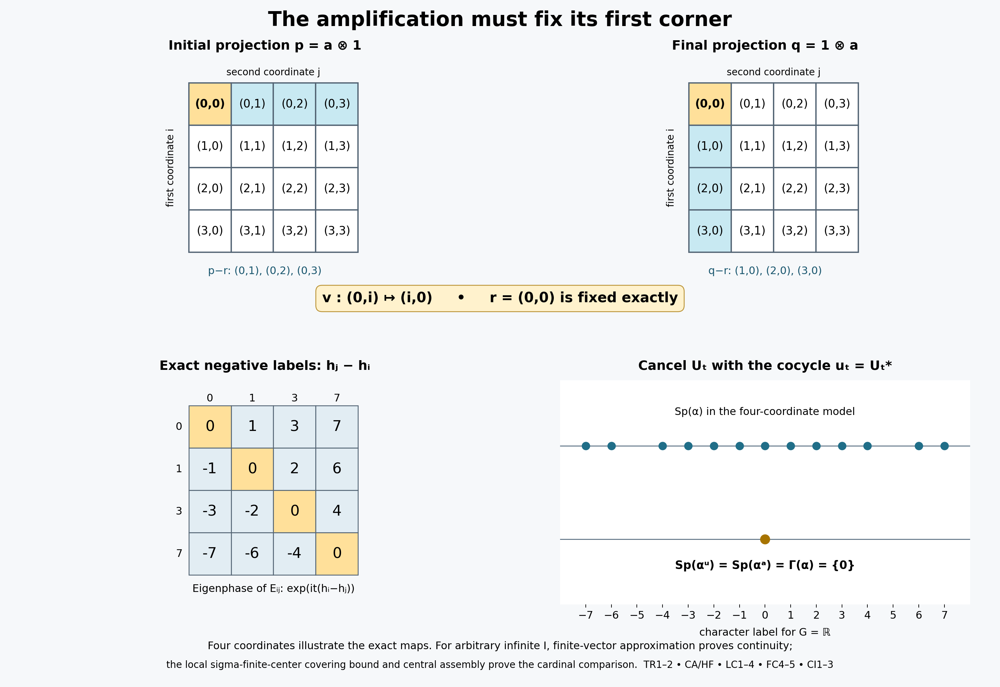

# Transport a fixed corner, then assemble its local cardinal

The spectrum intersection is governed by one construction: amplify a fixed corner, identify the amplification with the ambient algebra while fixing its first corner exactly, and lift the two agreeing corner actions to a continuous cocycle. We prove the spectral and topological transport before constructing the matrix families. A normal-state covering bound supplies the cardinal comparison when the algebra is too large to have a faithful normal state.

*Independent L120 restoration, GPT-6.1 Sol (OpenAI), Ultra, 5 October 2026. Sound earlier programme arguments and the owner's four proof developments are retained and checked at the exact inputs below. Added original exposition, illustration and code are CC0-1.0 to the extent of rights held; existing components retain their recorded terms. Spot-checked in a separate AI session.*

## The setting and the actual proof inputs

Throughout the main theorem, \(M\ne0\) is an arbitrary concrete von Neumann algebra on a Hilbert space \(\mathcal H\), \(G\) is an arbitrary locally compact Hausdorff abelian group, and \(\alpha:G\to\operatorname{Aut}(M)\) is a point-ultraweakly continuous action by normal unital star automorphisms. Assume \(Z(M)^\alpha=\mathbb C1\), and put \(F=M^\alpha\). No separability, countable basis, sigma-compact group, sigma-finite algebra or faithful normal scalar state is assumed. Local projection lemmas expressly allow general algebras and dispense with this action. A sigma-finite projection means that its corner has a faithful normal state, as proved equivalent to countable decomposability in PC7. A sigma-finite central piece refers to its **center**, and need not make the whole piece sigma-finite.

Use the negative Fourier convention of the actual GCC setting: \(\widehat b(\chi)=\int_G b(t)\overline{\chi(t)}\,dt\). The ordinary action spectrum is the character hull of \(\{b\in L^1(G):T_b=0\}\), as in GL7. The Connes spectrum is the intersection of the ordinary spectra of all nonzero fixed corners, from GCC DEFINITION. Thus equality of the same \(L^1\) filter-annihilator ideals gives equality of spectra. Whole action spectra are symmetric, so the positive convention in the reviewed L119 input yields the same action spectrum and intersection; no individual vector spectrum is silently reflected.

The exact earlier complete projection mechanisms are [PC0–7](OA-FLOW-PC.md#pc-0), with [CF1](OA-FLOW-CF.md#oa-flow.cf.1) for choice, [CF6–8](OA-FLOW-CF.md#oa-flow.cf.6) for continuous calculus, positivity and Hilbert facts, [CP4–6](OA-FLOW-CP.md#oa-flow.cp.4) for full vector-series normal tests and norm closure of the predual, and [NF1](OA-FLOW-NF.md#oa-flow.nf.1) for support and faithfulness. The actual [NCF1 matrix proof](OA-FLOW-NCF.md#ncf-1), [AT1/3/5](OA-FLOW-AT.md#oa-flow.at.1), [L117 continuity and cocycle proofs](OA-FLOW-L117.md#oa-flow.fullcorner.continuity) and L112 cocycle invariance are earlier canonical inputs. Opening paragraphs, source commentary and figures are context; they are never earlier proved premises.

The two complete earlier inputs are now canonically installed. The [full FCT trace proof](OA-FLOW-FCT.md#oa-flow.fct.8) constructs the unique faithful normal normalized center-valued trace on every finite algebra, its projection comparison and its naturality; the [full L119 proof](OA-FLOW-L119.md#oa-flow.minfix.cancel) constructs a continuous \(M\)-valued cocycle realizing the Connes spectrum whenever the fixed algebra has a nonzero minimal projection. The complete internal proofs supply the strictly earlier premises here; introductions, sources and figures remain context.

## TR1. Amplification preserves the entire action spectrum

Let \(A\subseteq B(K)\) be a nonzero von Neumann algebra, let \(G\) be an arbitrary locally compact Hausdorff abelian group, and let \(\gamma\) be a point-ultraweakly continuous action by normal automorphisms of \(A\). Let \(L\ne0\) be any Hilbert space, choose an orthonormal basis \((e_i)_{i\in I}\), and write \(X_{ij}\) for the entries of \(X\in A\bar\otimes B(L)\). The full NCF1 proof constructs the normal automorphisms

\[
 \widetilde\gamma_t=\gamma_t\bar\otimes\mathrm{id},\qquad
 (\widetilde\gamma_tX)_{ij}=\gamma_t(X_{ij}).
 \tag{TR1}
\]
Entrywise multiplication of the maps gives their group law and their inverse. Each has norm one because its inverse is contractive too.

These maps form a point-ultraweakly continuous action. For finite-coordinate vectors \(\xi,\eta\), the coefficient \(\langle\widetilde\gamma_t(X)\xi,\eta\rangle\) is a finite sum of continuous coefficients of \(\gamma_t(X_{ij})\). For general vectors choose finite-coordinate approximations \(\xi_F,\eta_F\). Uniformly in \(t\), their coefficient error is at most

\[
 \|X\|\bigl(\|\xi-\xi_F\|\,\|\eta\|
       +\|\xi_F\|\,\|\eta-\eta_F\|\bigr).
 \tag{TR2}
\]
Thus every vector coefficient is continuous. For a concrete ultraweak test \(\sum_n\langle Y\xi_n,\eta_n\rangle\), CP4–6 give square-summable vector sequences. The coefficient tail is uniformly bounded by
\(\|X\|(\sum_{n>N}\|\xi_n\|^2)^{1/2}(\sum_{n>N}\|\eta_n\|^2)^{1/2}\).
It tends to zero, so the whole scalar test is continuous. This proves full point-ultraweak continuity without assuming countability of \(I\) or a spatial implementation of \(\gamma\) on \(K\).

For \(b\in L^1(G)\), AT5 gives the normal integrated maps \(T_b^\gamma\) and \(T_b^{\widetilde\gamma}\). Normality of entry compression and the defining scalar integrals give

\[
 (T_b^{\widetilde\gamma}X)_{ij}=T_b^\gamma(X_{ij}).
 \tag{TR3}
\]
For full detail, test the left side on a vector pair in the \(i,j\) coordinates. Its defining scalar integral is exactly the integral defining the right side; vector pairs separate operators. The AT5 norm bounds and normality already establish these maps on every bounded \(X\), so this is not an interchange of an unproved uncountable sum with an integral.

If \(T_b^\gamma=0\), all entries in (TR3) vanish; density of finite-coordinate vectors makes \(T_b^{\widetilde\gamma}=0\). Conversely test \(X=a\otimes|e_{i_0}\rangle\langle e_{i_0}|\) for one index \(i_0\). Its \(i_0,i_0\) entry is \(T_b^\gamma a\), so vanishing of the amplified map implies vanishing of the original. Their annihilator ideals in \(L^1(G)\) therefore coincide. The actual GL7 and GCC definition of action spectrum gives

\[
 \operatorname{Sp}(\widetilde\gamma)=\operatorname{Sp}(\gamma).
 \tag{TR4}
\]
This uses neither quotient Fourier synthesis nor separability.

If \(\Theta:A\bar\otimes B(L)\to M\) is a normal unital star isomorphism with normal inverse, transport to \(\beta_t=\Theta\widetilde\gamma_t\Theta^{-1}\). Composing a normal functional with \(\Theta\) proves continuity of each orbit. Testing scalar integrals proves
\(T_b^\beta\Theta=\Theta T_b^{\widetilde\gamma}\).
Invertibility of \(\Theta\) gives equality of annihilator ideals, hence the same spectrum as in (TR4).

## TR2. A fixed first corner makes the transport a cocycle perturbation

Let \(\alpha\) be an action as above on \(M\), and let \(0\ne a\in M^\alpha\) have ambient central support one. Suppose \(L\) has a specified unit vector \(e_0\), \(E_{00}\) is its rank-one projection, and a normal isomorphism with normal inverse satisfies

\[
 \Theta:aMa\bar\otimes B(L)\longrightarrow M,
 \qquad \Theta(x\otimes E_{00})=x\quad(x\in aMa).
 \tag{TR5}
\]
Transport \(\alpha^a\bar\otimes\mathrm{id}\) through \(\Theta\). TR1 proves all normality, continuity and spectral assertions for the resulting \(\beta\). The element \(a\otimes E_{00}\) is fixed and maps to \(a\); furthermore \(\beta_t(x)=\alpha_t(x)\) for every \(x\in aMa\). Thus both actions fix \(a\), and their reduced actions agree exactly, rather than merely being isomorphic.

Apply the complete earlier L117 continuity and cocycle theorems to \(\alpha,\beta,a\) and the constant corner cocycle \(v_t=a\). They give a strongly continuous unitary \(\alpha\)-cocycle \(u\) in \(M\), with \(u_ta=au_t=a\), such that

\[
 \beta_t=\operatorname{Ad}(u_t)\alpha_t,
 \qquad \operatorname{Sp}(\beta)=\operatorname{Sp}(\alpha^a).
 \tag{TR6}
\]
If \(a\le e\) for another fixed projection, the fixed-corner filter restriction proved immediately below makes the right side a subset of \(\operatorname{Sp}(\alpha^e)\). This is the common mechanism for finite and arbitrary-cardinal amplifications. Fullness and the fixed first-corner identity are explicit hypotheses, not consequences of an arbitrary algebra isomorphism.

A subcorner has a smaller action spectrum. For fixed \(0\ne a\le e\), GCC SETTING proves \(T_b^{\alpha^a}(x)=T_b^{\alpha^e}(x)\) on \(aMa\). Thus the annihilator of the larger corner is contained in the annihilator of the smaller one. Taking character hulls reverses inclusion, proving \(\operatorname{Sp}(\alpha^a)\subseteq\operatorname{Sp}(\alpha^e)\). This is the exact GCC/GL input to TR6 and every subsequent containment; no equivalent-corner theorem or quotient spectral synthesis is being substituted.

## An elementary transport when the whole unit fits in the corner

If a fixed \(e\sim1\), the normal isomorphism \(x\mapsto vxv^*\) transports an action explicitly. Retain the historical orientation \(v^*v=1,\ vv^*=e\); its coboundary and complete identities are:

Here \(\Phi:M\to eMe\) is \(\Phi(x)=vxv^*\). The equations establish unitarity, the correctly ordered cocycle law and exact intertwining.

\[
v^*v=1,
\qquad vv^*=e, \tag{C6}
\]

\[
u_t=v^*\alpha_t(v). \tag{C7}
\]

\[
u_t^*u_t
=\alpha_t(v^*)e\alpha_t(v)=1,
\qquad
u_tu_t^*
=v^*ev=1. \tag{C8}
\]

\[
u_{s+t}
=v^*\alpha_s(e\alpha_t(v))
=v^*\alpha_s(v)\alpha_s(v^*\alpha_t(v))
=u_s\alpha_s(u_t). \tag{C9}
\]

\[
\Phi(\alpha^u_t(x))
=v u_t\alpha_t(x)u_t^*v^*
=\alpha_t(vxv^*)
=\alpha_t^e(\Phi(x)). \tag{C10}
\]

\[
\operatorname{Sp}(\alpha^u)
=\operatorname{Sp}(\alpha^e), \tag{C11}
\]

AT1 proves that \(t\mapsto\alpha_t(v)\) is strong-star continuous on its uniformly bounded orbit. Fixed multiplication by \(v^*\) gives strong continuity of \(u_t\); its adjoint is continuous by the same bounded product estimate. The corner isomorphism and its inverse are normal by CP6's vector substitutions. Pulling every scalar Fourier integral through them proves equality of the filter-annihilator ideals, hence (C11). This is the elementary alternative to the first-corner amplification, with no new countability assumption.

Equivalently write \(s=v\). The same computation retains the owner development identity:

\[
 u_t^*u_t=\alpha_t(s^*)e\alpha_t(s)=1,
 \qquad u_tu_t^*=s^*\alpha_t(e)s=1.
 \tag{FC10}
\]

## Minimal fixed projections give an independent normalization route

If \(F\) has a nonzero minimal projection, the complete accepted earlier canonical L119 theorem applies at these exact hypotheses and supplies a strongly continuous unitary \(\alpha\)-cocycle satisfying:

The full L119 conclusion is the following equality; its proof includes ambient fullness, the whole normal crossed-product corner, the prescribed continuous subgroup implementers and extension inside the original fixed algebra.

\[
\operatorname{Sp}(\alpha^u)=\Gamma(\alpha). \tag{C12}
\]

The GCC definition makes \(\Gamma(\alpha)\subseteq\operatorname{Sp}(\alpha^e)\) for every nonzero fixed \(e\). Therefore this single cocycle works for all prescribed fixed corners in the atomic branch. This route applies whether \(M\) is finite or properly infinite and whether the prescribed \(e\) is minimal. The remaining branches below provide a separate cocycle for each corner and require no simultaneous realization claim.

## FD1. Exact splitting in a diffuse algebra with a faithful normal trace

Let \(F\) be a von Neumann algebra without nonzero minimal projections and let \(\tau\) be a faithful normal finite positive trace. Suppose \(e\in\operatorname{Proj}(F)\) and \(0\le t\le\tau(e)\). There is a projection \(a\le e\) with \(\tau(a)=t\).

If \(t=0\), take zero; if \(t=\tau(e)\), take \(e\). First observe that every nonzero projection \(r\) has nonzero subprojections with arbitrarily small positive trace. Since \(r\) is not minimal, choose \(0<s<r\). Both \(s\) and \(r-s\) are nonzero, and faithfulness makes their traces strictly positive. The smaller trace is at most \(\tau(r)/2\). Repeat within that smaller projection. After \(n\) steps its trace is positive and at most \(2^{-n}\tau(r)\), which is as small as required. All these corners remain diffuse because a minimal subprojection in a corner would be a minimal projection of \(F\).

Order orthogonal families \(\mathcal E\) of nonzero subprojections of \(e\) satisfying \(\sum_{p\in\mathcal E}\tau(p)\le t\) by inclusion. The empty family is permitted. Every chain has an upper bound given by its union: any finite subset of that union lies in one member of the chain, so its trace sum is at most \(t\). CF1 supplies a maximal such family. Put \(a=\sum_{p\in\mathcal E}p\), using PC1's arbitrary orthogonal sum. Normality gives \(\tau(a)=\sum_{p\in\mathcal E}\tau(p)\le t\), since the finite partial sums increase to \(a\).

If \(\tau(a)<t\), then \(r=e-a\) has positive trace, hence is nonzero. The preceding small-projection construction supplies \(0<b\le r\) with \(0<\tau(b)\le t-\tau(a)\). It is orthogonal to the entire family and can be added, contradicting maximality. Thus \(\tau(a)=t\). This proof covers arbitrary Hilbert realizations; it does not assume that the ambient algebra has a faithful normal state.

## FD2. Central ergodicity converts the finite trace into the needed scalar trace

Assume \(M\) is finite, \(Z(M)^\alpha=\mathbb C1\), and \(F=M^\alpha\) has no nonzero minimal projection. Suppose the complete FCT theorem has supplied a faithful normal normalized center-valued trace \(T:M\to Z(M)\), its automorphism naturality, and its projection order/equivalence criterion. These are the three explicit FCT premises; citing a trace-existence theorem is not a substitute for installing that proof.

For every \(x\in F\), naturality gives \(\alpha_t(T(x))=T(\alpha_t(x))=T(x)\). Hence \(T(x)=\tau(x)1\) for a unique complex scalar \(\tau(x)\). Linearity, positivity, normalization and traciality pass from \(T\) to \(\tau\). It is faithful because \(T\) is. It is normal: evaluate \(T(x)\) in any fixed unit vector of the nonzero representation space; that vector functional is normal and takes \(\tau(x)1\) to \(\tau(x)\). Restriction to the fixed algebra remains normal. Thus \(\tau\) is a faithful normal tracial state on \(F\), even when no faithful scalar state was initially assumed on \(M\).

For a nonzero fixed projection \(e\), write \(T(e)=\lambda1\), with \(\lambda>0\) by faithfulness. Choose a positive integer \(n\) with \(1/n\le\lambda\). FD1 gives a fixed projection \(a\le e\) with

\[
 T(a)=\frac1n1.
 \tag{FD1}
\]
Its central support is one. Indeed a central projection \(z\) annihilating \(a\) would give \(0=T(za)=z/n\); hence \(z=0\).

Construct \(a_1=a,a_2,\ldots,a_n\) successively, orthogonal and equivalent to \(a\). Suppose the first \(k<n\) have been chosen. Their residual \(r=1-\sum_{j=1}^k a_j\) has \(T(r)=(n-k)1/n\ge T(a)\). The FCT projection-order criterion gives \(a\precsim r\). Choose its implementing partial isometry and let its final projection be \(a_{k+1}\). It lies under \(r\), is equivalent to \(a\), and has trace \(1/n\). After \(n\) steps the residual has zero trace, so faithfulness makes it zero. We have

\[
 1=\sum_{j=1}^n a_j,\qquad a_j\sim a.
 \tag{FD2}
\]
Only \(a\) is required to be fixed. The other matrix corners need not be \(\alpha\)-invariant.

Choose \(s_j^*s_j=a\), \(s_js_j^*=a_j\), with \(s_1=a\). Orthogonal ranges imply \(s_j^*s_k=0\) for \(j\ne k\) and \(s_j^*s_j=a\). Hence

\[
 E_{ij}=s_is_j^*,\qquad E_{ij}E_{k\ell}=\delta_{jk}E_{i\ell},
 \qquad E_{ij}^*=E_{ji},\qquad\sum_iE_{ii}=1.
 \tag{FD3}
\]
The alternative expression \(s_i^*s_j\) only equals \(\delta_{ij}a\), so does not form the required matrix factor.

The map

\[
 U:a\mathcal H\otimes\mathbb C^n\longrightarrow\mathcal H,
 \qquad U(\xi\otimes e_j)=s_j\xi
 \tag{FD4}
\]
is isometric on finite sums, since the squared norm is \(\sum_j\|\xi_j\|^2\). It is onto: \(\eta=\sum_ja_j\eta=\sum_js_j(s_j^*\eta)\). Thus it is unitary. Conjugation gives

\[
 \Theta:aMa\bar\otimes M_n\longrightarrow M,
 \qquad\Theta(x\otimes|e_i\rangle\langle e_j|)=s_ixs_j^*.
 \tag{FD5}
\]
It has exactly the stated range. The displayed images lie in \(M\); conversely every \(y\in M\) has the finite expansion
\(y=\sum_{i,j}s_i(s_i^*ys_j)s_j^*\), with \(s_i^*ys_j\in aMa\).
Unitary conjugation and its inverse are normal by CP6 vector-series substitution, so no unproved finite-matrix normality assertion remains. With \(s_1=a\), it fixes the first corner exactly: \(\Theta(x\otimes E_{11})=x\).

TR2 applies and supplies a strongly continuous cocycle satisfying

\[
 \operatorname{Sp}(\operatorname{Ad}(u)\alpha)
 =\operatorname{Sp}(\alpha^a)
 \subseteq\operatorname{Sp}(\alpha^e).
 \tag{FD6}
\]
This proves the complete diffuse finite branch at the exact accepted earlier canonical FCT theorem and the actual earlier canonical inputs. It retains full group and Hilbert-space generality. The atomic fixed-algebra and properly infinite cardinal constructions are the other branches of L120; they are not inferred from this module.

The original finite-case notation is \(e_1=a\), with \(e_j=a_j\) and \(s_j\) as constructed above. Its numbered displays are retained exactly. Here \(T\) is the full reviewed finite trace, \(\tau\) is its scalar restriction to \(F\), and \(T(e)=\lambda1\) defines the positive scalar; these symbols have all the proved properties in FD1–2:

\[
T:M\longrightarrow Z(M) \tag{C13}
\]

\[
T(\alpha_t(x))=\alpha_t(T(x)). \tag{C14}
\]

\[
T(f)=\tau(f)1 \tag{C15}
\]

\[
T(e)=\lambda1,
\qquad \lambda>0, \tag{C16}
\]

\[
e_1\in\operatorname{Proj}(M^\alpha),
\qquad e_1\le e,
\qquad T(e_1)=\frac1n1. \tag{C17}
\]

\[
e_1,e_2,\ldots,e_n,
\qquad
\sum_{i=1}^n e_i=1. \tag{C18}
\]

\[
s_i^*s_i=e_1,
\qquad s_is_i^*=e_i,
\qquad s_1=e_1. \tag{C19}
\]

\[
E_{ij}=s_is_j^*. \tag{C20}
\]

\[
E_{ij}E_{k\ell}
=s_i(s_j^*s_k)s_\ell^*
=\delta_{jk}E_{i\ell}. \tag{C21}
\]

\[
\Theta:e_1Me_1\,\overline\otimes\,M_n
\longrightarrow M,
\qquad
\Theta(x\otimes e_{ij})=s_ixs_j^* \tag{C22}
\]

\[
\operatorname{Sp}(\beta)
=\operatorname{Sp}(\alpha^{e_1})
\subseteq\operatorname{Sp}(\alpha^e). \tag{C23}
\]

\[
\beta=\alpha^u
\quad\text{for some }u\in Z^1_\alpha(G,M). \tag{C24}
\]

In (C22) the lower-case \(e_{ij}\) are the standard matrices on \(\mathbb C^n\), while \(E_{ij}=s_is_j^*\) are their images in \(M\). With \(s_1=e_1\), the map is exactly the identity on its first corner. The transported action fixes every \(E_{ij}\), and TR1 proves (C23) on full normal tests. TR2 supplies (C24). The subcorner spectrum containment just proved finishes the finite diffuse branch.

## CA1. The cardinal square, with the induction written out

Use CF1's proved well-ordering consequence of choice. Identify cardinals with initial ordinals. We prove that every infinite cardinal \(\kappa\) satisfies \(|\kappa\times\kappa|=\kappa\). Suppose some infinite cardinal fails. Among the failing cardinals up to one chosen witness, take the least, called \(\lambda\).

Order the pairs \((\alpha,\beta)\in\lambda\times\lambda\) by the lexicographic order of the triples

\[
  (\max\{\alpha,\beta\},\alpha,\beta).
  \tag{CA1}
\]
This is a well-order: in a nonempty set of pairs first take the least maximum coordinate that occurs, then the least first coordinate in that layer, and finally the least second coordinate. Fix a pair whose maximum coordinate is \(\gamma<\lambda\). All its predecessors lie in \((\gamma+1)\times(\gamma+1)\).

If \(\gamma\) is finite, that square is finite and has cardinal less than the infinite \(\lambda\). If \(\gamma\) is infinite, PC0's proved one-point shift gives \(|\gamma+1|=|\gamma|=\nu<\lambda\). Minimality of the failing cardinal gives \(|\nu\times\nu|=\nu\). Transport a bijection of \(\gamma+1\) with \(\nu\) in both coordinates; the predecessor set therefore has cardinal at most \(\nu<\lambda\).

Let \(\theta\) be the order type of (CA1). If \(\theta>\lambda\), its element at ordinal position \(\lambda\) would have exactly \(\lambda\) predecessors. The preceding bound rules this out. Thus \(\theta\le\lambda\), giving an injection \(\lambda\times\lambda\to\lambda\). The map \(\alpha\mapsto(\alpha,\alpha)\) is an injection in the other direction. PC0's fully proved set Schröder–Bernstein construction gives a bijection, contradicting failure. This includes \(\lambda=\aleph_0\): in that case every \(\gamma<\lambda\) is finite, so the finite predecessor argument already applies.

If \(\kappa,\mu\) are infinite cardinals, put \(\nu=\max\{\kappa,\mu\}\). The product injects into \(\nu\times\nu\), whose cardinal is \(\nu\), while the larger factor injects into the product by fixing a point of the smaller factor. PC0 gives

\[
 |\kappa\times\mu|=\max\{\kappa,\mu\},\qquad
 |\kappa\times\mathbb N|=\kappa.
 \tag{CA2}
\]
For a nonzero finite cardinal \(n\), the injections \(\kappa\to\kappa\times n\to\kappa\times\mathbb N\) give \(|\kappa\times n|=\kappa\). A product with an empty set is empty. A disjoint union of two infinite sets of cardinals \(\kappa,\mu\) injects into \(\nu\times\{0,1\}\), while it contains a copy of \(\nu\); PC0 or the just-proved finite product gives cardinal \(\nu\). These statements include adding finitely or countably many points to an infinite set.

A bijection \(b:I\times\mathbb N\to I\) for an infinite set \(I\) yields a partition into \(|I|\) countably infinite blocks \(b(\{i\}\times\mathbb N)\). These blocks are disjoint by injectivity, countably infinite by restriction to each fiber, and cover by surjectivity. Removing a specified point first leaves an equipotent set by PC0, so the same assertion holds for \(I\setminus\{i_0\}\). No cardinal arithmetic beyond the proved steps is being assumed.

## HF1. Absorbing a residual after central comparison

Let \(N\) be a nonzero von Neumann algebra and let \((e_i)_{i\in I}\) be an infinite orthogonal family of mutually equivalent projections, each with central support \(1_N\). Its strong sum is a projection \(P\le1_N\), by PC1. Write \(r=1_N-P\), and fix \(i_0\in I\). Suppose first that \(r\precsim e_{i_0}\).

PC0 supplies a bijection \(\sigma:I\to I\setminus\{i_0\}\). Choose a partial isometry from \(e_i\) onto \(e_{\sigma(i)}\) for every \(i\). PC1 adds them to a partial isometry \(v\) with

\[
 v^*v=P,\qquad vv^*=P-e_{i_0}.
 \tag{HF1}
\]
Choose \(u\) with \(u^*u=r\) and \(uu^*\le e_{i_0}\). The initial projections of \(v,u\) are orthogonal, and so are their final projections. Consequently

\[
 (v+u)^*(v+u)=1_N,\qquad
 (v+u)(v+u)^*\le P.
 \tag{HF2}
\]
We have \(1_N\precsim P\) and \(P\precsim1_N\). PC3 gives a partial isometry \(w\) with \(w^*w=P\), \(ww^*=1_N\). The projections \(f_i=we_iw^*\) are orthogonal, have sum \(1_N\), and satisfy \(f_i\sim e_i\), implemented by \(we_i\). Thus they form a filling family with the same index set. This transport generally moves its original members; no pointwise preservation is asserted. Every assertion remains valid after restriction to a nonzero central projection, with that projection as the new identity.

## HF2. Obtaining the comparison piece and exhausting the center

Fix a full projection \(h\in N\) for which an infinite orthogonal family of copies of \(h\) already exists. Order the orthogonal families of projections equivalent to \(h\) that contain the chosen initial family by inclusion. Chain unions are upper bounds, so CF1 supplies a maximal family \((e_i)_{i\in I}\). Its cardinal \(\kappa=|I|\) is infinite and may exceed the cardinal of the initial family. Each member is full because PC2 proves that equivalence preserves central support.

Put \(P=\sum_i e_i\) and \(r=1_N-P\). PC2 compares \(r\) with one fixed \(e_{i_0}\): for a central projection \(z\),

\[
 zr\precsim ze_{i_0},\qquad
 (1-z)e_{i_0}\precsim(1-z)r.
 \tag{HF3}
\]
If \(z=0\), the second subequivalence supplies a further copy of \(h\) inside \(r\), orthogonal to the maximal family, a contradiction. Hence \(z\ne0\). On \(z\), each \(ze_i\) is nonzero and has central support \(z\). The restriction of HF1 absorbs \(zr\) and transports this entire restricted family into a filling family of \(Nz\), with \(\kappa\) members equivalent to \(zh\).

Now consider central projections \(z\ne0\) on which there is some infinite filling homogeneous family of copies of \(zh\). Take a maximal orthogonal collection of such central projections, choosing a witnessing family on each. If their central sum left a nonzero residual \(t\), the original infinite family of copies of \(h\), compressed by \(t\), would still be an infinite orthogonal family of full copies of \(th\). The preceding maximal-family argument in \(Nt\) would produce another nonzero central piece with a filling family. This contradicts maximality. Thus these central pieces sum to \(1_N\).

The filling cardinals can differ between these pieces. Their grouping and uniqueness require the separate normal-state covering bound in L120; neither follows from HF2 alone. In particular HF2 does not claim that a countable initial family fills an arbitrarily large properly infinite algebra after a countability-preserving transport.

## LC1. A full sigma-finite projection on a sigma-finite central piece

Let \(p\) be a nonzero full projection of \(M\), and suppose \(Z(M)\) has a faithful normal state. Work first in \(N=pMp\), with identity \(p\). PC4 identifies its center normally with \(Z(M)\), in both directions; transporting that state gives a faithful normal state \(\rho\) on \(Z(N)\).

For every unit vector \(\xi\in p\mathcal H\), the normal vector state on \(N\) has the support \(r_\xi\) constructed in NF1. It is faithful on \(r_\xi Nr_\xi\). These supports join to \(p\). Indeed, if their join left a nonzero projection \(r\), a unit vector \(\xi\in r\mathcal H\) would have \(\langle r\xi,\xi\rangle=1\), whereas the support identity for its state and \(rr_\xi=0\) give zero. Their central supports therefore also join to \(p\).

The finite joins of \(c_N(r_\xi)\) increase to \(p\). Normality of \(\rho\) lets us select finite collections whose central joins have values greater than \(1-2^{-n}\), for each positive integer \(n\). Their countable union is a nonempty finite or countable collection \((r_j)\) whose central supports still join to \(p\): the complement of that join has \(\rho\)-value zero and hence is zero by faithfulness. Choose the corresponding normal states \(\omega_j\) and positive numbers \(c_j\) summing to one. The norm-convergent functional series

\[
 \omega=\sum_j c_j\omega_j
 \tag{LC1}
\]
is a normal state, since CP6 proves norm closure of the predual. Its support \(h_0\) equals \(\bigvee_j r_j\). For one inclusion, every \(\omega_j\) vanishes on the complement of the join, so \(\omega\) does too. For the other, \(\omega(p-h_0)=0\) and positivity of each coefficient force \(\omega_j(p-h_0)=0\) for every \(j\). The support minimality in NF1 gives \(r_j\le h_0\). Thus \(c_N(h_0)=p\), and \(\omega|_{h_0Nh_0}\) is faithful and normal by NF1. In the ambient algebra, \(c_M(h_0)=1\), by the PC4 center identification. This constructs the required full sigma-finite subprojection of \(p\).

If \(p\) is properly infinite, it has a full sigma-finite properly infinite subprojection as well. PC5 supplies countably many orthogonal copies \(p_n\sim p\) inside \(p\), with partial isometries \(v_n^*v_n=p\), \(v_nv_n^*=p_n\). Set

\[
 h_n=v_nh_0v_n^*,\qquad h=\sum_{n\ge1}h_n.
 \tag{LC2}
\]
All \(h_n\) are equivalent, sigma-finite and full in \(N\); their sum is a projection by PC1. For positive \(x\in hNh\), define

\[
 \varphi(x)=\sum_{n\ge1}2^{-n}\omega(v_n^*xv_n).
 \tag{LC3}
\]
Each term is normal by CP6's bounded vector substitutions; their norm-summable sum is normal. The value at \(h\) is one. If \(\varphi(x)=0\), faithfulness on each \(h_n\) gives \(h_nxh_n=0\), hence \(x^{1/2}h_n=0\). The ranges of the \(h_n\) span the range of \(h\), so \(x=0\). This proves sigma-finiteness of \(h\).

Partition the positive integers into two infinite subsets. Bijections with each subset and the equivalences of the \(h_n\), summed by PC1, give two orthogonal subprojections of \(h\), each equivalent to \(h\), whose sum is \(h\). Their compression by every nonzero central projection remains nonzero, because all \(h_n\) are full. Thus \(h\) is properly infinite, either by the two-copy characterization in PC5 or directly by the isometry onto one of these two proper subprojections on each nonzero central part. No faithful state on all of \(M\) has been assumed or obtained.

## LC2. A filling family supplies an intrinsic covering bound

Suppose \((h_i)_{i\in I}\) is an orthogonal family of nonzero sigma-finite projections with sum \(p\), where \(I\) has infinite cardinal \(\kappa\). Choose a faithful normal state \(\varphi_i\) on \(h_iMh_i\), and extend it to \(pMp\) by compression:

\[
 \widetilde\varphi_i(x)=\varphi_i(h_ixh_i).
 \tag{LC4}
\]
These are normal states. They detect every nonzero projection \(q\le p\). If all values at \(q\) were zero, faithfulness would give \(h_iqh_i=0\) for every \(i\). Since \(q\) is positive, \(q^{1/2}h_i=0\); the filling sum forces \(q=0\).

Let \((q_j)_{j\in J}\) be any orthogonal family of nonzero projections below \(p\). For fixed \(i\), only countably many \(j\) have \(\widetilde\varphi_i(q_j)>0\). For each positive integer \(n\), at most \(n\) members can have value at least \(1/n\), since every finite sum of the projections is at most \(p\), whose state value is one. The union of these finite sets contains every strictly positive value.

Well-order \(I\) by CF1 and assign each \(j\) to its first detecting index. Each resulting fiber is countable. Choice supplies injections of the fibers into \(\mathbb N\), and hence an injection \(J\to I\times\mathbb N\). The complete CA1 proof gives \(|I\times\mathbb N|=\kappa\). Consequently

\[
 |J|\le\kappa.
 \tag{LC5}
\]
The original family attains this bound. In particular any two infinite filling families of sigma-finite projections have the same cardinal.

If each \(h_i\) is full in \(pMp\), then for every nonzero central projection \(z\) all \(zh_i\) are nonzero. They remain sigma-finite: restrict \(\varphi_i\) to their nonzero corners and divide by its positive value at \(zh_i\). Their sum is \(zp\), so the same bound and attainment hold on every such central compression. Homogeneity and proper infiniteness are not required for the bound itself.

## LC3. Constructing the partition and checking all its restrictions

Let \(p\) be full and properly infinite in \(M\). First suppose the center is sigma-finite. LC1 gives a full sigma-finite properly infinite \(h\le p\). PC5 gives countably many orthogonal copies of \(p\) in \(p\); transporting \(h\) into them gives an infinite initial family of full copies of \(h\) in \(pMp\). The complete HF2 proof enlarges that family as necessary, obtains a nonzero central comparison piece, and uses HF1 to absorb the residual. Maximal central assembly then partitions the identity into pieces on which \(p\) is a filling homogeneous sum of equivalent copies of the corresponding compression of \(h\). The family cardinal can increase during maximal enlargement. The transported members need not be the original projections.

All members on a piece are sigma-finite, properly infinite and full relative to that piece. Equivalence preserves sigma-finiteness by normal partial-isometry conjugation and preserves proper infiniteness by conjugating the defining isometries. Central restriction preserves the same properties, as the explicit compressed faithful states and compressed two-copy isometries show. The family cardinal on each nonzero restriction is intrinsic by LC2.

For arbitrary center, partition it into nonzero sigma-finite central projections first. To prove existence of this partition, take a maximal orthogonal family of nonzero central projections whose corners have faithful normal states. If a central remainder \(z\) were nonzero, a unit vector in \(z\mathcal H\) would give a nonzero normal positive functional on the abelian algebra \(Z(M)z\). NF1 gives a nonzero support in that algebra and a faithful normal state after normalization on the support. This is an additional central projection of the required type, a contradiction. CF1 justifies maximality, and PC1 gives the central sum.

Apply the preceding sigma-finite-center construction on each part. We obtain an orthogonal central partition \((z_j)_{j\in J}\) and, on each part, a filling family of \(\kappa_j\) equivalent sigma-finite properly infinite projections of central support \(z_j\), where \(\kappa_j\) is infinite. Group equal cardinals:

\[
 z_\kappa=\sum_{\{j:\kappa_j=\kappa\}}z_j.
 \tag{LC6}
\]
This is a set-indexed partition: the original chosen families and their index sets are sets, so only a set of cardinals occurs. Zero terms may be omitted.

We now verify the asserted property on every nonzero sigma-finite central projection \(w\le z_\kappa\), rather than just on the originally chosen pieces. Let \(\rho\) be a faithful normal state on \(Z(M)w\). The nonzero intersections \(w_j=wz_j\) form a countable nonempty partition of \(w\), because their positive \(\rho\)-values have finite subsums at most one. Index their original compressed families by a common set \(I\) of cardinal \(\kappa\), writing \((h_{ji})_{i\in I}\). Put

\[
 k_i=\sum_{j:w_j\ne0}h_{ji}\qquad(i\in I).
 \tag{LC7}
\]
These projections are orthogonal and sum to \(pw\). For the latter equality, a vector annihilated by all of them is annihilated by all \(h_{ji}\), and hence by every \(pw_j\); their central sum is \(pw\). Each \(k_i\) has central support \(w\), since its part on every \(w_j\) is full there.

Choose faithful normal states on the countably many corners \(h_{ji}Mh_{ji}\). A strictly positive summable weighted sum, extended by compression, is a normal state on \(k_iMk_i\). Zero value on a positive element forces its square root to annihilate every \(h_{ji}\), and hence the filling range of \(k_i\); it is faithful. Thus \(k_i\) is sigma-finite. Sum the two-copy isometries on the orthogonal central pieces to prove that \(k_i\) is properly infinite. For indices \(i,i'\), sum partial isometries from \(h_{ji}\) to \(h_{ji'}\) over \(j\). PC1 gives a partial isometry from \(k_i\) to \(k_{i'}\), so the family is homogeneous. Every member is nonzero. LC2 proves that its cardinal is exactly the largest possible cardinal of an orthogonal nonzero family below \(pw\), namely \(\kappa\).

## LC4. Uniqueness, invariance and comparison of full projections

Suppose two proposed central partitions for \(p\) have nonzero overlapping pieces labelled \(\kappa\) and \(\lambda\). The central-support-state construction in LC3 supplies a nonzero sigma-finite central projection \(w\) inside that overlap. Both defining homogeneous families exist on \(pw\). Each attains its own bound from LC2 and is bounded by the other, giving \(\kappa\le\lambda\) and \(\lambda\le\kappa\). Thus the labels agree. Intersecting one piece with the complete other partition shows equality of every corresponding piece. The partition (LC6) is therefore unique.

A normal automorphism carrying \(p\) to itself transports this partition to another with the same defining property. It preserves central support, normal faithful states, equivalence, proper infiniteness and the cardinal of each indexed family. It also maps a sigma-finite central projection to one of that kind by composing its faithful state with the inverse. Uniqueness gives invariance of each \(z_\kappa\).

Finally suppose \(p,q\) are full properly infinite projections in the same \(M\) and have the same labelled partition. Refine that partition by sigma-finite central pieces \(w\) as in LC3. On each piece choose the two filling families with their common cardinal and match their index sets by a bijection. Corresponding members are sigma-finite properly infinite projections with the same central support \(w\). PC7 applies in \(M\) to embed either member into the other; PC3 turns mutual subequivalence into equivalence. Sum the matched partial isometries using PC1 to obtain

\[
 v_w^*v_w=pw,\qquad v_wv_w^*=qw.
 \tag{LC8}
\]
The arbitrary orthogonal central sum \(v=\sum_wv_w\) then satisfies \(v^*v=p\), \(vv^*=q\). Thus \(p\sim q\). Conversely an equivalence gives a normal star isomorphism of the corners by partial-isometry conjugation, respecting their ambient central compressions. It transports all defining families, so uniqueness gives equality of the partitions.

This is the required unrestricted local cardinal lemma. Its covering bound is always asserted on pieces with sigma-finite center. No bound on all orthogonal projections across a nonsigma-finite center has been claimed. The complement calculations, finite-corner use of FCT, and first-corner-preserving amplification remain subsequent steps of the L120 proof.

## Central ergodicity and fixed complements

Every nonzero fixed projection is full in \(M\). An automorphism transports the least central projection dominating \(e\) to that dominating \(\alpha_t(e)\), by PC2. Hence its nonzero central support is \(\alpha\)-fixed. Central ergodicity makes it the identity:

This fullness is always relative to the ambient algebra, rather than only the fixed algebra:

\[
0\ne f\in M^\alpha
\quad\Longrightarrow\quad z_M(f)=1. \tag{C5}
\]

## FC1. Central ergodicity makes the cardinal a single invariant

The intrinsic finite/properly-infinite central decomposition in PC5 is preserved by automorphisms. Its finite central part is therefore zero or one. Thus \(M\) is either finite or properly infinite. For now suppose it is properly infinite.

For a full properly infinite fixed projection \(p\), LC1–4 gives its unique central partition by infinite local homogeneous cardinals. Each part is \(\alpha\)-invariant, by LC4 applied to each \(\alpha_t\). A central invariant projection is zero or one; since the partition sums to one, exactly one label occurs. Denote it by \(d(p)\), and put \(\kappa=d(1)\). On any nonzero sigma-finite central piece, a filling family for \(p\) is an orthogonal family below the unit. LC2 applied to the filling family for the unit gives

\[
 d(p)\le\kappa.
 \tag{FC1}
\]
If equality holds, the labelled partitions for \(p\) and \(1\) agree, so LC4 gives \(p\sim1\). Conversely such an equivalence preserves the partitions. These comparisons require no faithful normal state on the whole algebra.

## FC2. Removing a finite full fixed projection

Suppose \(f\ne0\) is finite and fixed, and put \(q=1-f\). It is full. Otherwise the nonzero central projection \(1-c_M(q)\) would lie under the finite \(f\), hence would be a finite central summand of \(M\), contrary to proper infiniteness. The projection \(q\) is properly infinite. Indeed, if \(qMq\) had a nonzero finite central part, PC4, using fullness of \(q\), would express that part as \(qz\) for a nonzero central \(z\in M\). Both \(qz\) and \(fz\) would be finite. PC6 says their finite orthogonal join \(z\) is finite, again impossible. PC5 now gives proper infiniteness.

Since \(q\) is fixed, FC1 gives one cardinal \(\mu=d(q)\). Choose a nonzero sigma-finite central piece \(w\). The finite corner \(fwMfw\) has sigma-finite center: PC4 identifies its center with \(Z(M)w\), because \(f\) is full. The complete FCT theorem, applied to this finite corner, supplies its faithful normal normalized center-valued trace. Composing it with a faithful normal state of the identified center gives a faithful normal state on \(fwMfw\). Thus \(fw\) is sigma-finite. This is the exact place where general finite trace existence is used.

A filling \(\mu\)-family for \(qw\), together with the one projection \(fw\), is an orthogonal filling family of sigma-finite projections below \(w\). CA1 gives \(\mu+1=\mu\). LC2, which does not require this enlarged family to be homogeneous, bounds every orthogonal family below \(w\) by \(\mu\). The unit's homogeneous \(\kappa\)-family therefore gives \(\kappa\le\mu\). Conversely the \(\mu\)-family for \(qw\) is bounded by the unit's covering bound \(\kappa\). Hence

\[
 d(1-f)=\kappa.
 \tag{FC2}
\]

## FC3. Removing a smaller properly infinite fixed projection

Suppose \(e\) is properly infinite and fixed but \(e\not\sim1\). Put \(\lambda=d(e)\). FC1 and its equality criterion give \(\lambda<\kappa\). Set \(q=1-e\).

The complement is full. If its central support were not one, a nonzero central \(z\) would satisfy \(ez=z\). Select a nonzero sigma-finite central \(w\le z\), by LC3. The same projection \(ew=w\) would have the intrinsic covering cardinals \(\lambda\) and \(\kappa\), contradicting LC2.

Nor can \(qMq\) have a nonzero finite central part. By fullness and PC4 it would have the form \(qz\), with nonzero central \(z\). Select a nonzero sigma-finite central \(w\le z\). As in FC2, FCT on the finite corner \(qwMqw\), with its identified sigma-finite center, gives a faithful normal state; hence \(qw\) is sigma-finite. A homogeneous \(\lambda\)-family for \(ew\), together with \(qw\), is a filling family of sigma-finite projections below \(w\) of cardinal \(\lambda\). LC2 would give \(\kappa\le\lambda\), a contradiction. PC5 shows that \(q\) is properly infinite.

It is fixed and full, so it has one cardinal \(\mu=d(q)\). On a nonzero sigma-finite central piece \(w\), take the filling families for \(ew\) and \(qw\). Their union is orthogonal and fills \(w\); every member is sigma-finite, properly infinite, and has central support \(w\). Any two members, including members from different families, are equivalent by PC7 and PC3. The union therefore has cardinal \(\max\{\lambda,\mu\}\), by CA1, and LC2 identifies this with \(\kappa\). Since \(\lambda<\kappa\), it follows that

\[
 d(1-e)=\mu=\kappa.
 \tag{FC3}
\]

In the following retained displays, \(p\) in (C25a) means a nonzero **full properly infinite fixed** projection. Only such a projection has the single \(d(p)\) just defined; the display does not assign one cardinal to an arbitrary projection. In (C25b), \(f\) is nonzero finite and fixed; in (C25c), \(e\) is properly infinite, fixed and not equivalent to \(1\):

\[
p\le1\quad\Longrightarrow\quad d(p)\le\kappa,
\qquad
d(p)=\kappa\quad\Longrightarrow\quad p\sim1.
\tag{C25a}
\]

\[
d(1-f)=d(1)=\kappa.
\tag{C25b}
\]

\[
\kappa=\max\{\lambda,\mu\},\qquad d(1-e)=\mu=\kappa.
\tag{C25c}
\]

## FC4. The two complementary projections have the same cardinal

Take \(a=f\) in FC2 or \(a=e\) in FC3. Let \(I\) have cardinal \(\kappa\), choose \(i_0\in I\), put \(L=\ell^2(I)\), and write \(E_{ij}\) for its matrix units. In \(A=M\bar\otimes B(L)\), define

\[
 p=a\otimes1,\qquad q=1\otimes E_{i_0i_0},\qquad
 r=a\otimes E_{i_0i_0}.
 \tag{FC4}
\]
The center of \(A\) is exactly \(Z(M)\otimes1\). Indeed the NCF1 matrix-entry construction shows that commutation with every \(1\otimes E_{ij}\) forces an operator to have identical diagonal entries and zero off-diagonal entries. Commutation with every \(x\otimes1\) then makes that common entry central in \(M\). The reverse inclusion is immediate on generators and extends by normality. Compression to one diagonal entry and amplification are normal by CP6 and NCF1, so this identification and its inverse transport faithful normal states of central corners.

Both \(p-r=a\otimes(1-E_{i_0i_0})\) and \(q-r=(1-a)\otimes E_{i_0i_0}\) are full in \(A\). A central \(z\otimes1\) annihilating the first must satisfy \(za=0\), since \(I\setminus\{i_0\}\ne\varnothing\); fullness of \(a\) makes \(z=0\). For the second, use the fullness of \(1-a\) proved in FC2 or FC3. The second corner is normally isomorphic to \((1-a)M(1-a)\), with its ambient center identification unchanged. It is properly infinite and has constant local cardinal \(\kappa\), by FC2 or FC3.

For \(p-r\), first suppose \(a\) is properly infinite, with \(d(a)=\lambda\le\kappa\). On a nonzero sigma-finite central piece \(w\), let \((h_j)_{j\in J}\) be a filling \(\lambda\)-family of sigma-finite properly infinite projections in \(awMaw\), all of central support \(w\). Then

\[
 \{h_j\otimes E_{ii}:j\in J,\ i\in I\setminus\{i_0\}\}
 \tag{FC5}
\]
fills \((p-r)(w\otimes1)\). Each member has a corner normally isomorphic to \(h_jMh_j\), so is sigma-finite and properly infinite. The center calculation makes its central support \(w\otimes1\). The members are mutually equivalent: combine an implementing partial isometry in \(M\) with the matrix unit between the chosen coordinates. CA1 gives \(\lambda\kappa=\kappa\), including removal of \(i_0\). Thus this is a full homogeneous \(\kappa\)-family.

If \(a=f\) is finite, FCT supplies sigma-finiteness of \(fw\) as in FC2. CA1 partitions \(I\setminus\{i_0\}\) into \(\kappa\) countably infinite blocks. For a block \(B\), let \(P_B\) be its coordinate projection. The projection \(fw\otimes P_B\) is full on \(w\otimes1\) by the center calculation. To check sigma-finiteness, enumerate the block and let \(\tau\) be a faithful normal state on \(fwMfw\). For its positive corner matrices define

\[
 \psi(X)=\sum_{n\ge1}2^{-n}\tau(X_{b_nb_n}).
 \tag{FC6}
\]
The entry maps are normal and the series converges in functional norm, so CP6 makes \(\psi\) normal. Its value at the corner unit is one. Zero value on \(X\ge0\) forces every positive diagonal entry to vanish. Then \(X^{1/2}\) annihilates every coordinate subspace, since \(\|X^{1/2}(\xi\otimes e_{b_n})\|^2=\langle X_{b_nb_n}\xi,\xi\rangle=0\); their span is dense, so \(X=0\). Thus the state is faithful.

Split the countably infinite block into two infinite subsets. The two coordinate shifts give two orthogonal copies of its whole corner unit, proving proper infiniteness also after every nonzero central compression. Bijections between blocks give equivalence of their projections. These \(\kappa\) blocks fill \((p-r)(w\otimes1)\). This proves exactly the same homogeneous-cardinal assertion in the finite case.

For completeness \(p-r\) is properly infinite globally: a partition of the infinite set \(I\setminus\{i_0\}\) into two equipotent subsets gives two isometries on that coordinate space; tensoring with \(a\) gives two orthogonal copies of \(p-r\) on every nonzero central part. We have consequently verified all hypotheses of LC4 in \(A\). Both full properly infinite projections \(p-r,q-r\) have the identical constant partition with label \(\kappa\). Hence they are equivalent.

## FC5. Fixing the first corner exactly

Choose a partial isometry \(v_0\in A\) with \(v_0^*v_0=p-r\), \(v_0v_0^*=q-r\), and put \(v=r+v_0\). The identity \(v_0=(q-r)v_0(p-r)\) gives \(rv_0=v_0r=0\). Orthogonality therefore proves

\[
 v^*v=p,\qquad vv^*=q,\qquad vr=rv=r.
 \tag{FC7}
\]
Conjugation by \(v\) is a normal star isomorphism \(pAp\to qAq\), with normal inverse conjugation by \(v^*\), by CP6's bounded vector-series substitutions. NCF1's matrix description identifies \(pAp=aMa\bar\otimes B(L)\); compression to the \(i_0\) coordinate identifies \(qAq\) normally with \(M\). Their composite \(\Theta\) satisfies

\[
 \Theta(x\otimes E_{i_0i_0})=x\qquad(x\in aMa),
 \tag{FC8}
\]
because \(x\otimes E_{i_0i_0}\in rAr\) and \(v\) is the identity on \(r\). Thus the first-corner identity required by TR2 is proved, not inferred from an arbitrary amplification isomorphism.

Transport \(\alpha^a\bar\otimes\mathrm{id}\) by \(\Theta\). TR1 proves full point-ultraweak continuity and equality of action spectra, for the arbitrary index set \(I\). TR2 then applies the actual complete L117 cocycle lift to the two actions which agree on the full fixed first corner. It supplies a strongly continuous unitary \(\alpha\)-cocycle \(u\) with

\[
 \operatorname{Sp}(\operatorname{Ad}(u)\alpha)
 =\operatorname{Sp}(\alpha^a)
 \subseteq\operatorname{Sp}(\alpha^e)
 \tag{FC9}
\]
whenever the chosen \(a\le e\) is fixed. This finishes the properly infinite construction for FC2 and FC3.

The original notation \(e_{i_0i_0}\) in the following equations is the same rank-one matrix as \(E_{i_0i_0}\) above. The choices \(a=f\) or \(a=e\) have precisely the proved full complements. The first-corner identity, not just equivalence of the two amplification projections, yields the action agreement used by TR2:

\[
p=a\otimes1,\qquad q=1\otimes e_{i_0i_0},
\qquad r=a\otimes e_{i_0i_0}.
\tag{C25d}
\]

\[
v^*v=p,\qquad vv^*=q,\qquad vr=rv=r.
\tag{C25e}
\]

\[
\operatorname{Sp}(\alpha^u)
=\operatorname{Sp}(\alpha^a)
\subseteq\operatorname{Sp}(\alpha^e).
\tag{C26}
\]

## Exhaust the fixed corners and take the intersection

PC5's intrinsic finite/properly-infinite central decomposition is preserved by every automorphism. Central ergodicity makes \(M\) finite or properly infinite. In finite \(M\), either the fixed algebra has a minimal projection and the atomic normalization applies, or it has none and FD1–2 gives the diffuse construction for every fixed \(e\).

In properly infinite \(M\), if \(e\sim1\), the explicit equivalent-corner coboundary applies. If \(e\) is properly infinite but not equivalent to \(1\), FC3–5 gives the prescribed first-corner transport with \(a=e\). Otherwise the finite central part of \(eMe\) in PC5 is nonzero. It is fixed under the restricted action because the decomposition is intrinsic. This gives a nonzero finite fixed \(f\le e\), and its fullness follows from (C5). FC2 and FC4–5 apply with \(a=f\). These cases cover every nonzero fixed projection, including projections with mixed intrinsic central types. They prove the following retained reduction:

Here \(Z^1_\alpha(G,M)\) denotes the strongly continuous unitary cocycles, and the full L112 matrix-corner proof gives \(\Gamma(\alpha^u)=\Gamma(\alpha)\). The GCC definition includes the identity corner, giving the general containment in (C2):

\[
\alpha^u_t=\operatorname{Ad}(u_t)\circ\alpha_t. \tag{C1}
\]

\[
\Gamma(\alpha)
=\Gamma(\alpha^u)
\subseteq\operatorname{Sp}(\alpha^u) \tag{C2}
\]

\[
\Gamma(\alpha)
\subseteq
\bigcap_{u\in Z^1_\alpha(G,M)}
\operatorname{Sp}(\alpha^u). \tag{C3}
\]

\[
\begin{gathered}
0\ne e\in\operatorname{Proj}(M^\alpha)\\
\Longrightarrow\quad
\text{there is }u\in Z^1_\alpha(G,M)
\text{ with }
\operatorname{Sp}(\alpha^u)
\subseteq\operatorname{Sp}(\alpha^e).
\end{gathered} \tag{C4}
\]

For every fixed \(e\), choose its constructed \(u_e\). An element belonging to all perturbed ordinary spectra belongs to \(\operatorname{Sp}(\alpha^{u_e})\subseteq\operatorname{Sp}(\alpha^e)\). It therefore belongs to the intersection defining \(\Gamma(\alpha)\). The converse is (C2) for each cocycle. The full conclusion is:

Both inclusions now hold for the arbitrary algebra, group and Hilbert space declared above:

The two inclusions, with the separately constructed cocycle for each corner, can also be written in one chain:

\[
 \Gamma(\alpha)\subseteq
 \bigcap_{u\in Z^1_\alpha(G,M)}\operatorname{Sp}(\operatorname{Ad}(u)\alpha)
 \subseteq\bigcap_{0\ne e\in\operatorname{Proj}(F)}\operatorname{Sp}(\alpha^e)
 =\Gamma(\alpha).
 \tag{FC11}
\]

\[
\boxed{
\Gamma(\alpha)
=\bigcap_{u\in Z^1_\alpha(G,M)}
\operatorname{Sp}(\operatorname{Ad}(u)\alpha).
}
\tag{C29}
\]

This theorem is proved relative to the exact earlier canonical proofs, including the complete FCT and L119 proofs installed strictly earlier.

## The retained matrix-unit problem

**Problem.** Why would using the printed expression $s_i^*s_j$ in place of (C20) break the amplification proof?

**Solution.** Orthogonality of the range projections gives $s_i^*s_j=0$ for $i\ne j$, while $s_i^*s_i=e_1$.  Thus the printed family is only the diagonal scalar family $\delta_{ij}e_1$ and cannot generate $M_n$.  The orientation $s_is_j^*$ has the multiplication law (C21) and generates the required matrix factor. $\square$

## An exact coordinate model for the prescribed first corner

The full [caption and reproduction links](OA-FLOW-L120.md#oa-flow.l120.figure) identify this finite illustration and its unrestricted proof locators.

Let \(I\) be any infinite set with distinguished \(0\), \(K=\ell^2(I)\), \(M=B(K)\), \(a=E_{00}\), and \(G=\mathbb R\). Choose any real family \((h_i)_{i\in I}\), without a uniform bound. Define

\[
 U_t e_i=e^{it h_i}e_i,\qquad \alpha_t=\operatorname{Ad}U_t.
 \tag{CI1}
\]

Each \(U_t\) is unitary and \(U_{s+t}=U_sU_t\). On each finite coordinate span its orbit is continuous. For any \(\xi\), choose a finite-coordinate \(\xi_F\); then \(\|(U_t-U_s)\xi\|\le2\|\xi-\xi_F\|+\|(U_t-U_s)\xi_F\|\). This proves strong continuity for arbitrary \(I\) and unbounded \(h_i\). Adjoints obey the same estimate. Expansion of \(U_t xU_t^*-U_sxU_s^*\), followed by CP6's finite sums and summable tails, proves point-ultraweak continuity. The center is scalar, so the action is centrally ergodic. It fixes \(a\) and its corner action is trivial.

In \(K\otimes K\), set \(p=a\otimes1\), \(q=1\otimes a\), \(r=a\otimes a\). The rule

\[
 v(e_0\otimes e_i)=e_i\otimes e_0,\qquad
 v=0\text{ on }(p(K\otimes K))^\perp,\qquad
 v^*v=p,\ vv^*=q,\ vr=rv=r
 \tag{CI2}
\]

extends isometrically on its initial space by Hilbert completion. It is a partial isometry in \(B(K\otimes K)=M\bar\otimes B(K)\), the latter equality being NCF1 with \(M'= \mathbb C1\). Its complementary initial and final coordinate sets are both indexed by \(I\setminus\{0\}\), whose cardinal is \(|I|\) by PC0. Conjugation by \(v\), followed by the \(q\)-corner identification, sends \(a\otimes X\) to \(X\): verify the action on basis vectors first and then use continuity on their dense finite spans. It fixes \(a\otimes E_{00}\) exactly. This is a concrete instance of FC7–8; the corner action amplified by the identity transports to the trivial action on \(M\).

The prescribed-corner cocycle is \(u_t=e^{it h_0}U_t^*\), so \(u_ta=au_t=a\). The commuting diagonal operators are fixed by \(\alpha_s\), and multiplication gives \(u_s\alpha_s(u_t)=e^{i(s+t)h_0}U_{s+t}^*=u_{s+t}\). Strong continuity follows from that of \(U\), and \(\operatorname{Ad}(u_t)\alpha_t=\mathrm{id}\). The scalar phase does not change that perturbed action. When \(h_0=0\), this is simply \(U_t^*\), as in the finite drawing; without that normalization, \(U_t^*\) alone still cancels the action but is not the prescribed-corner lift. For a nonzero algebra with trivial action, \(T_b=(\int b)\mathrm{id}\); GL7 proves its spectrum is just the trivial character, written \(0\) for \(\widehat{\mathbb R}\). Thus

\[
 \operatorname{Sp}(\operatorname{Ad}(u)\alpha)
 =\operatorname{Sp}(\alpha^a)=\Gamma(\alpha)=\{0\}.
 \tag{CI3}
\]

The last equality uses that every nonzero fixed corner contains its fixed unit, whose spectrum is \(\{0\}\), while the \(a\)-corner has no other frequency. For a finite illustration take four coordinates with \((h_0,h_1,h_2,h_3)=(0,1,3,7)\). Its matrix units have eigenphases \(e^{it(h_i-h_j)}\), so their **negative** labels are \(h_j-h_i\). The exact action spectrum is \(\{0,\pm1,\pm2,\pm3,\pm4,\pm6,\pm7\}\), by the spanning matrix units and GL7. After cancellation only zero remains. This finite coordinate restriction illustrates the maps and sign convention; it does not prove or replace the arbitrary-cardinal covering argument.

## Source context and the independent teaching order

Takesaki, [*Theory of Operator Algebras II*, Theorem XI.2.9(i), printed336 and339–340](https://doi.org/10.1007/978-3-662-10451-4), states the unrestricted cocycle spectral intersection and explicitly restricts its displayed proof to the sigma-finite case. The exact approved registered copy was checked and the actual relevant pages compared. The source's four-case sequence is not the teaching order here: this lesson proves the common normal transport first, retains the elementary equivalent-corner and atomic alternatives, supplies the diffuse finite construction, and then builds the intrinsic covering cardinal from elementary arithmetic through central assembly before comparing complements.

The original September programme's arbitrary-cardinal route, all C1–24, C25a–e, C26 and C29 display bodies, and its solved orientation problem are retained. The completed CA/HF, LC and FC arguments correct maximal-family enlargement and fill the state-support, weighted-state, central grouping and first-corner details. The free Peterson/Nelson projection development in PC and the free Peterson quantitative trace construction in FCT remain actual mathematical inputs and useful alternatives; source approval does not replace them. Exact ordinary source citations and component terms are retained in those providers. The current proof does not copy source prose, figures or exercise sequencing; SOURCE_DEVELOPMENT.md records the bounded actual comparison and its limits.

## The first corner is a prescribed part of the transport

The model in [CI1–3](OA-FLOW-L120.md#ci-model) is \(M=B(\ell^2(I))\), \(a=E_{00}\), \(G=\mathbb R\), with \(U_te_i=e^{it h_i}e_i\). The two upper panels use four coordinates of the tensor basis, ordered as \((i,j)\). Blue squares mark \(p-r\) or \(q-r\), and the shared gold square is \(r=a\otimes a\). The exact rule \(v(e_0\otimes e_i)=e_i\otimes e_0\) sends the indicated row to the indicated column and fixes the gold square. Exact integer matrices verify \(v^*v=p\), \(vv^*=q\), \(vr=rv=r\).

For arbitrary infinite \(I\), the same basis rule extends by Hilbert completion and \(|I\setminus\{0\}|=|I|\), using the complete PC0 shift. The finite drawing is a coordinate illustration, not a proof of the unrestricted cardinal comparison. That proof is [CA/HF](OA-FLOW-L120.md#ci-cardinal), [LC1–4](OA-FLOW-L120.md#ci-local-cardinal), and [FC4–5](OA-FLOW-L120.md#ci-first-corner), on pieces with sigma-finite center and with full central assembly. The [TR1–2](OA-FLOW-L120.md#ci-transport) normal transport applies without countability of the tensor basis.

The lower-left panel uses exactly \((h_0,h_1,h_2,h_3)=(0,1,3,7)\). Its entry in row \(i\), column \(j\), is the **negative** character label \(h_j-h_i\) of the eigenphase \(e^{it(h_i-h_j)}\). The lower-right panel shows the exact finite-coordinate action spectrum \(\{0,\pm1,\pm2,\pm3,\pm4,\pm6,\pm7\}\). With \(u_t=U_t^*\), the perturbed action is trivial, so its spectrum and the rank-one corner spectrum are \(\{0\}\). Every nonzero fixed corner contains its fixed unit, proving that the Connes intersection is also exactly \(\{0\}\). These are finite exact spectra, rather than samples of an unknown spectrum.

The standard theorem antecedent is Takesaki, [*Theory of Operator Algebras II*, XI.2 Theorem2.9(i), printed336 and339–340](https://doi.org/10.1007/978-3-662-10451-4). The source has no corresponding coordinate illustration. The actual local proof uses the earlier free-source PC construction and the complete normal matrix and action-topology proofs. The figure explains the first-corner condition that makes the cocycle lift apply; it does not supply a missing theorem.

[Reproduction source](../assets/arbitrary-cardinality-cocycle-intersection/render_figure.py), [editable SVG](../assets/arbitrary-cardinality-cocycle-intersection/first-corner.svg), and [exact integer semantic data](../assets/arbitrary-cardinality-cocycle-intersection/first-corner-data.json) are retained. Original figure and caption: GPT-6.1 Sol (OpenAI), Ultra, 5 October 2026, CC0-1.0 to the extent of rights held. The renderer uses the installed DejaVu Sans font; no font file is redistributed.
