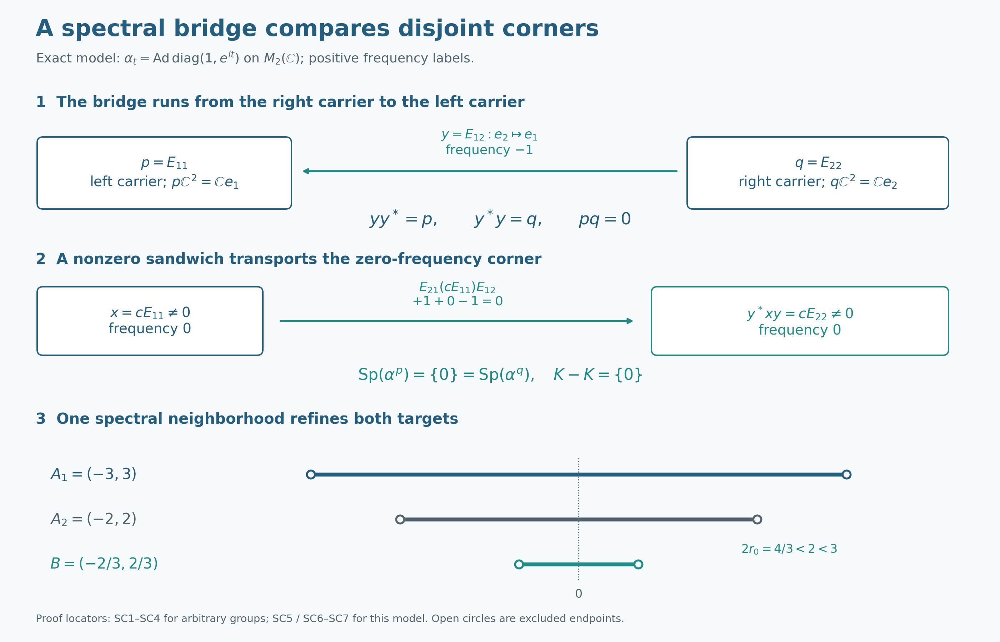

# Mutual corner approximation through a family of spectral bridges

Two corners can have disjoint ranges and still have the same action spectrum. The useful object is a family of operators linking their ranges. We first prove a comparison theorem for any such family with bounded frequency support. Central ergodicity will then supply the family, and the comparison will give one refinement of two thickened corner spectra.

*Original expression and the original diagram are CC0-1.0 to the extent of rights held; earlier components and the figure font retain their recorded terms.*

## Setting and exact earlier proofs

Throughout, \(G\) is an arbitrary locally compact Hausdorff abelian group, \(H=\widehat G\) has its additive dual-group law, \(M\ne0\) is a von Neumann algebra on an arbitrary Hilbert space \(\mathcal H\), and \(\alpha:G\to\operatorname{Aut}(M)\) is a point-ultraweakly continuous action by normal automorphisms. Put \(F=M^\alpha\). No separability, countability, sigma-finiteness or factor hypothesis is assumed. SC0–SC2 require no central ergodicity; SC3–SC4 additionally assume \(Z(M)^\alpha=\mathbb C1\), exactly where stated.

The fixed algebra is an ultraweakly closed unital star subalgebra: it is the intersection of the kernels of the normal maps \(\alpha_t-\mathrm{id}\). We use the notation

\[
D=Z(M^\alpha).
\tag{D1}
\]

The reduced action \(\alpha^e\) acts on \(eMe\) for a fixed projection \(e\). A vector spectrum is the closed annihilator hull of that vector, and the action spectrum is the hull of the action annihilator. The ambient and reduced vector spectra agree on \(eMe\): fixed compression commutes with every filter, and normal tests on \(e\mathcal H\) extend to tests on \(\mathcal H\). This is the complete [GCC SETTING](OA-FLOW-GCC.md#oa-flow.gcc.setting) proof, with the concrete normal topology of [CP6](OA-FLOW-CP.md#oa-flow.cp.6). It also proves that a point of the corner action spectrum can be detected by a nonzero element with spectrum in any prescribed open neighborhood.

### Frequency labels and filters

Use the **positive eigenfrequency convention** of [L115 CONVENTIONS](OA-FLOW-L115.md#oa-flow.l115.conventions): \(\alpha_t(x)=\chi(t)x\), for \(x\ne0\), has label \(\chi\). If \(b\in L^1(G)\), set \(h(\chi)=\int_G b(t)\chi(t)\,dt\) and \(\alpha_h=T_b\), where \(T_b\) is the actual normal integrated action. Thus \(h(\chi)=\widehat b(-\chi)\) for the negative transform in GL. The vector spectrum here is the reflection of the GL vector spectrum, and every GL/LF formula below is transported by that reflection. Adjoint reflection makes each whole action spectrum symmetric, so the positive and negative action spectra agree. This does not make the spectrum of an individual vector symmetric. Write \(A_c(H)\) for the compactly supported elements of the Fourier algebra \(A(H)\), with closed support.

The remaining complete earlier proofs used below are [GL0](OA-FLOW-GL.md#gl-0), [GL1](OA-FLOW-GL.md#gl-1), [GL2](OA-FLOW-GL.md#gl-2), [GL3](OA-FLOW-GL.md#gl-3), [GL6](OA-FLOW-GL.md#gl-6), [GL7](OA-FLOW-GL.md#gl-7), [LF1](OA-FLOW-LF.md#lf-1), [PC1](OA-FLOW-PC.md#oa-flow.pc.1), [PC2](OA-FLOW-PC.md#oa-flow.pc.2), [GCC TOOLS](OA-FLOW-GCC.md#gcc-tools), and [H0](OA-FLOW-TOPOLOGY.md#l138-h0). These provide filters, nonempty spectra, product bounds with their proper closure, local plateaus, supports, central-support comparison, unitary tests and local compact shrinking. External citations at the end credit the sources of the mathematics; the exact earlier proofs and the arguments below supply the proof premises.

## SC0. Compact errors do not require closing the spectral sum

If \(S\subset H\) is closed and \(K\subset H\) is compact, then \(S+K\) is closed. To prove this directly, fix \(x\notin S+K\). For every \(k\in K\), the point \(x-k\) is outside \(S\). Continuity of addition gives a symmetric open identity neighborhood \(U_k\) with \(x-k+U_k+U_k\) disjoint from \(S\). Finitely many sets \(k_j+U_{k_j}\) cover \(K\). Put \(N=\bigcap_j U_{k_j}\). If \(t\in x+N\) and \(k\in K\), choose \(j\) with \(k\in k_j+U_{k_j}\). Then
\[
t-k\in x-k_j+N-U_{k_j}\subset x-k_j+U_{k_j}+U_{k_j},
\]
so \(t-k\notin S\). Thus \(x+N\) misses \(S+K\), proving closedness. Empty sets cause no exception.

Consequently, if \(a,b\) have spectra in a fixed compact \(K\) and \(x\) has closed spectrum \(S\), the complete GL6 product theorem, reflected by L115 CONVENTIONS, gives

\[
\operatorname{Sp}_\alpha(a^*xb)\subset -K+S+K. \tag{SC1}
\]
Here each intermediate sum is closed by the proved compact-plus-closed fact. The actual spectra of \(a\) and \(b\) are closed subsets of \(K\), hence compact, so this also follows by applying GL6 to the actual spectra twice. If \(S\subset V\) for an arbitrary open \(V\), (SC1) is contained in \(V+(K-K)\). This argument does not incorrectly apply an unclosed product formula to arbitrary open spectral sets.

## SC1. A family of ranges detects both sides of an operator

Let \(\mathcal B\subset M\), with

\[
p=\bigvee_{a\in\mathcal B}s_\ell(a),\qquad q=\bigvee_{a\in\mathcal B}s_r(a).
\tag{SC2}
\]
The complete PC1 support and projection-lattice construction applies on an arbitrary faithful normal Hilbert realization. In particular \(p\mathcal H\) is the closed linear span of all \(a\mathcal H\), and \(q\mathcal H\) is the closed linear span of all \(a^*\mathcal H\). Every \(a\) satisfies \(a=paq\).

If \(0\ne x\in pMp\), then some \(a,b\in\mathcal B\) satisfy \(a^*xb\ne0\). Otherwise
\[
\langle xb\xi,a\eta\rangle=0
\]
for all \(a,b,\xi,\eta\). Linearity, continuity and density make \(x(p\mathcal H)\) orthogonal to \(p\mathcal H\), and \(x=pxp\) then forces \(x=0\). The same proof applied to \(\mathcal B^*\) gives the reverse assertion for \(qMq\). No member of the family is required to have dense range by itself.

## SC2. Fixed central carriers and a general spectral comparison

Assume \(\mathcal B\) contains a nonzero element, \(\alpha_t(\mathcal B)=\mathcal B\) for every \(t\), and

\[
u\mathcal B=\mathcal B,\qquad \mathcal B u=\mathcal B\qquad(u\in\mathcal U(F)).
\tag{SC3}
\]
Then the projections \(p,q\) in (SC2) are nonzero and belong to \(Z(F)\). Automorphisms carry left and right supports to the supports of their images, by their least-projection characterization, and preserve arbitrary joins by order and the inverse automorphism. Translation therefore fixes \(p,q\). Left multiplication by \(u\) carries \(s_\ell(a)\) to \(u s_\ell(a)u^*\), while right multiplication by \(u^*\) carries \(s_r(a)\) to \(u s_r(a)u^*\). The two equalities in (SC3) make \(p,q\) commute with every unitary in \(F\). GCC TOOLS proves that this gives commutation with all of \(F\): differentiate commutation with \(e^{itb}\) at zero for each bounded self-adjoint \(b\in F\), then decompose arbitrary elements into their real and imaginary parts. Thus \(p,q\in Z(F)\). Nonzeroness follows from the supports of the chosen nonzero member.

Suppose in addition that \(K\subset H\) is compact and every member of \(\mathcal B\) has vector spectrum contained in \(K\). If \(C\) is any compact symmetric set containing \(K-K\), then

\[
\operatorname{Sp}(\alpha^p)\subset\operatorname{Sp}(\alpha^q)+C,
\qquad
\operatorname{Sp}(\alpha^q)\subset\operatorname{Sp}(\alpha^p)+C.
\tag{SC4}
\]
Indeed fix \(\chi\in\operatorname{Sp}(\alpha^p)\) and any open neighborhood \(V\) of \(\chi\). GCC SETTING gives \(0\ne x\in pMp\) whose ambient spectrum is contained in \(V\); ambient and reduced spectra agree by its full normal compression/filter proof. SC1 gives \(a,b\in\mathcal B\) with \(y=a^*xb\ne0\). The support identities put \(y\in qMq\), and SC0 puts its spectrum in \(V+C\). GL2 makes this vector spectrum nonempty. Any of its points belongs both to \(\operatorname{Sp}(\alpha^q)\) and to \(V+C\), and symmetry of \(C\) implies
\[
V\cap\bigl(\operatorname{Sp}(\alpha^q)+C\bigr)\ne\varnothing.
\]
The set in parentheses is closed by SC0 and closedness of the action hull. As this holds for every \(V\), it contains \(\chi\). Apply exactly the same argument to \(\mathcal B^*\): its carriers are \(q,p\), it has spectra in \(-K\), satisfies (SC3), and \((-K)-(-K)=K-K\). This proves both inclusions for the same two carriers. Central ergodicity was not assumed in this reusable comparison theorem.

## SC3. Central ergodicity constructs the comparison family

Assume now \(Z(M)^\alpha=\mathbb C1\). We construct a family satisfying SC2 for any prescribed nonzero central fixed corners and any identity neighborhood. The retained equations (D2)–(D23) make every step explicit.

### Localize a nonzero operator between the prescribed corners

Fix nonzero \(e_1,e_2\in\operatorname{Proj}(D)\) and a neighborhood \(U\) of \(0\) in \(H\).  The ambient central support \(z_M(e_i)\) is fixed by \(\alpha\): fixedness of \(e_i\) and uniqueness of central support give

\[
\alpha_t(z_M(e_i))=z_M(\alpha_t(e_i))=z_M(e_i).
\tag{D2}
\]

Central ergodicity therefore gives

\[
z_M(e_1)=z_M(e_2)=1.
\tag{D3}
\]

The complete PC2 central-support proof says \(e_1Me_2=\{0\}\) exactly when \(z_M(e_1)z_M(e_2)=0\).  Hence (D3) supplies

\[
0\ne x=e_1xe_2\in e_1Me_2.
\tag{D4}
\]

Choose a symmetric compact neighborhood \(C\) of \(0\) contained in \(U\). To justify this for an arbitrary identity neighborhood, first take a relatively compact open neighborhood whose closure lies in the interior of \(U\), using H0, and intersect its closure with its negative.  The nonzero vector \(x\) has nonempty spectrum, so choose \(q\in\operatorname{Sp}_\alpha(x)\).  Local compactness and the group topology give a relatively compact neighborhood \(W\) of \(q\) such that

\[
\overline W-\overline W\subset C.
\tag{D5}
\]

The reflected LF1 plateau theorem gives a local Fourier cutoff \(h\in A_c(H)\) with \(h(q)\ne0\) and \(\operatorname{supp}(h)\subset W\). Set

\[
y=\alpha_h(x),
\qquad K=\operatorname{supp}(h).
\tag{D6}
\]

If \(y\) were zero, then \(h\) would belong to the annihilator ideal of \(x\) and would vanish at \(q\), contrary to the choice of \(h\).  Thus \(y\ne0\).  Because \(e_1,e_2\) are fixed, normality of fixed multiplication (CP6 and GL0) lets it pass through the scalar filter integrals. GL3 supplies the spectral support bound, so filtering (D4) gives

\[
y=e_1ye_2,
\qquad
\operatorname{Sp}_\alpha(y)\subset K,
\qquad
K-K\subset C\subset U.
\tag{D7}
\]

### Build central fixed support carriers

For \(a\in M\), write \(s_\ell(a)\) and \(s_r(a)\) for its left and right support projections.  Saturate \(y\) under translation and multiplication by the fixed algebra:

\[
\mathcal B
=\{z_1\alpha_t(y)z_2:
t\in G,\ z_1,z_2\in M^\alpha\}.
\tag{D8}
\]

Define the support carriers

\[
f_1=\bigvee_{a\in\mathcal B}s_\ell(a),
\qquad
f_2=\bigvee_{a\in\mathcal B}s_r(a).
\tag{D9}
\]

These are the carriers \(p=f_1\), \(q=f_2\) of SC1–SC2. Translation permutes \(\mathcal B\), and support projections transform equivariantly:

\[
\alpha_s(s_\ell(a))=s_\ell(\alpha_s(a)),
\qquad
\alpha_s(s_r(a))=s_r(\alpha_s(a)).
\tag{D10}
\]

Thus \(f_1,f_2\in M^\alpha\).  If \(v\in\mathcal U(M^\alpha)\), then \(v\mathcal B=\mathcal B\) and \(\mathcal Bv^*=\mathcal B\).  Consequently

\[
vf_1v^*
=\bigvee_{a\in\mathcal B}s_\ell(va)=f_1,
\qquad
vf_2v^*
=\bigvee_{a\in\mathcal B}s_r(av^*)=f_2.
\tag{D11}
\]

The exponential differentiation argument in SC2 shows that an element commuting with every unitary of \(M^\alpha\) lies in its center, so \(f_1,f_2\in D\).  Equation (D7), together with centrality of \(e_1,e_2\) inside \(M^\alpha\), shows that every \(a\in\mathcal B\) belongs to \(e_1Me_2\).  Since \(y\in\mathcal B\) is nonzero,

\[
0\ne f_1\le e_1,
\qquad
0\ne f_2\le e_2.
\tag{D12}
\]

### A support-density lemma produces a nonzero spectral sandwich

This is the SC1 density argument specialized to (D9), retained here in the historical notation.  If \(0\ne b\in f_1Mf_1\), then there are \(a_0,a_1\in\mathcal B\) such that

\[
a_0^*ba_1\ne0.
\tag{D13}
\]

Indeed, represent \(M\) faithfully and normally on a Hilbert space.  The closed linear span of the ranges of all \(a\in\mathcal B\) is \(f_1\mathcal H\).  If every expression in (D13) vanished, then

\[
\langle ba_1\xi,a_0\eta\rangle=0
\tag{D14}
\]

for all \(a_0,a_1,\xi,\eta\).  Density would make \(b(f_1\mathcal H)\) orthogonal to \(f_1\mathcal H\).  Since \(b=f_1bf_1\), this would force \(b=0\), a contradiction.

Now take \(p\in\operatorname{Sp}(\alpha^{f_1})\), where \(p\) in (D15)–(D20) denotes a frequency rather than the carrier notation of SC1–SC2, and take a neighborhood \(V\) of that frequency. Apply the GCC SETTING detection criterion to an open neighborhood contained in \(V\). It gives a nonzero \(x_1\in f_1Mf_1\) with

\[
\operatorname{Sp}_\alpha(x_1)\subset V.
\tag{D15}
\]

Choose \(a_0,a_1\in\mathcal B\) as in (D13) and put

\[
x_2=a_0^*x_1a_1.
\tag{D16}
\]

Each member of \(\mathcal B\) has left support at most \(f_1\), right support at most \(f_2\), and spectrum contained in \(K\): GL7 gives the spectrum \(\{0\}\) for a nonzero fixed multiplier, GL2 preserves vector spectra under translation, and GL6 applies with compact sums \(\{0\}+K\). Zero multipliers have empty spectrum, so they cause no exception.  Therefore

\[
0\ne x_2\in f_2Mf_2
\tag{D17}
\]

and SC0 makes the following exact product bound legitimate. Indeed \(\operatorname{Sp}_\alpha(a_0^*)\) and \(\operatorname{Sp}_\alpha(a_1)\) are compact; the actual middle spectrum \(\operatorname{Sp}_\alpha(x_1)\) is closed. The sum of the first two is closed by SC0. Apply GL6 to their product, then apply it again with the last compact spectrum. Both closures can therefore be removed before enlarging the middle spectrum to \(V\). This proves

\[
\begin{aligned}
\operatorname{Sp}_\alpha(x_2)
&\subset
\operatorname{Sp}_\alpha(a_0^*)
+\operatorname{Sp}_\alpha(x_1)
+\operatorname{Sp}_\alpha(a_1)\\
&\subset -K+V+K
=V+(K-K)
\subset V+C.
\end{aligned}
\tag{D18}
\]

### Mutual approximation follows in both directions

The nonzero vector \(x_2\) has a spectral point belonging to both \(\operatorname{Sp}(\alpha^{f_2})\) and \(V+C\).  Since \(C=-C\), this says

\[
V\cap\bigl(\operatorname{Sp}(\alpha^{f_2})+C\bigr)\ne\varnothing
\tag{D19}
\]

for every neighborhood \(V\) of \(p\).  The action spectrum is a closed hull, and SC0 proves that its sum with the compact set \(C\) is closed.  Hence

\[
p\in\operatorname{Sp}(\alpha^{f_2})+C.
\tag{D20}
\]

Since \(p\) was arbitrary,

\[
\operatorname{Sp}(\alpha^{f_1})
\subset
\operatorname{Sp}(\alpha^{f_2})+C.
\tag{D21}
\]

For the reverse inclusion use the same two carriers, as required by SC2. Apply the argument to \(y^*\) with \(e_2,e_1\) interchanged.  The corresponding bimodule is \(\mathcal B^*\); its left-support join is \(f_2\), its right-support join is \(f_1\), and its spectral support lies in \(-K\), whose difference set is again \(K-K\).  Thus

\[
\operatorname{Sp}(\alpha^{f_2})
\subset
\operatorname{Sp}(\alpha^{f_1})+C.
\tag{D22}
\]

Because \(C\subset U\), (D12), (D21), and (D22) prove Lemma XI.2.15 in the form

\[
\boxed{
\begin{gathered}
0\ne f_i\in\operatorname{Proj}(D),\quad f_i\le e_i,\\
\operatorname{Sp}(\alpha^{f_1})
\subset\operatorname{Sp}(\alpha^{f_2})+U,\\
\operatorname{Sp}(\alpha^{f_2})
\subset\operatorname{Sp}(\alpha^{f_1})+U.
\end{gathered}}
\tag{D23}
\]

Using the compact intermediate neighborhood \(C\) is what makes the closure step from (D19) to (D20) valid; no closedness is asserted for a sum with an arbitrary noncompact neighborhood.

## SC4. One refinement of two thickened corner spectra

Retain the full arbitrary-group setting and central ergodicity of SC3. Let \(\mathcal W\) be the neighborhood system of \(0\) in \(H\) and define

\[
\mathscr F
=\{\operatorname{Sp}(\alpha^e)+U:
0\ne e\in\operatorname{Proj}(D),\ U\in\mathcal W\}.
\tag{D24}
\]

Take two members

\[
A_i=\operatorname{Sp}(\alpha^{e_i})+U_i
\qquad(i=1,2).
\tag{D25}
\]

Choose a symmetric neighborhood \(U_0\) of \(0\) so small that

\[
U_0+U_0\subset U_1\cap U_2.
\tag{D26}
\]

Apply (D23) with \(U_0\) and obtain \(f_i\le e_i\).  Use the single member

\[
B=\operatorname{Sp}(\alpha^{f_1})+U_0\in\mathscr F.
\tag{D27}
\]

By the identical restricted filters of GCC SETTING, a filter annihilating the larger corner action annihilates its subcorner action. The annihilator ideal therefore increases and its hull decreases. Thus restriction to a fixed subcorner cannot enlarge the action spectrum. Since \(U_0\subset U_1\), we obtain

\[
B
\subset\operatorname{Sp}(\alpha^{e_1})+U_1
=A_1.
\tag{D28}
\]

The first mutual inclusion in (D23), followed by \(f_2\le e_2\), gives

\[
\begin{aligned}
B
&\subset
\operatorname{Sp}(\alpha^{f_2})+U_0+U_0\\
&\subset
\operatorname{Sp}(\alpha^{e_2})+U_2
=A_2.
\end{aligned}
\tag{D29}
\]

Thus \(B\subset A_1\cap A_2\), proving

\[
\boxed{\mathscr F\text{ is downward directed under inclusion}.}
\tag{D30}
\]

This proof does not produce a nonzero projection below both \(e_1\) and \(e_2\).  The two support carriers can be disjoint; their spectra, rather than the projections themselves, are joined by the narrow bimodule bridge.

Every member of \(\mathscr F\) contains \(0\): the identity of its nonzero corner is a nonzero fixed vector, with spectrum \(\{0\}\) by GL7, and each identity neighborhood contains \(0\). The directedness proof needs neither an empty corner nor a common subprojection.

## SC5. Disjoint carriers and the exact two-dimensional model

**Problem.** Give a centrally ergodic example in which \(e_1,e_2\in\operatorname{Proj}(D)\) are nonzero and orthogonal, and explain why this does not obstruct (D30).

**Solution.** Let \(M=M_2(\mathbb C)\) and let \(\mathbb R\) act by \(\alpha_t=\operatorname{Ad}(\operatorname{diag}(1,e^{it}))\).  Since \(Z(M)=\mathbb C1\), the action is centrally ergodic.  Its fixed algebra is the diagonal algebra, so \(D=M^\alpha\cong\mathbb C^2\) and the two rank-one diagonal projections are nonzero and orthogonal.  Each corner is one-dimensional with trivial action, hence both corner spectra are \(\{0\}\).  Their spectral thickenings have common refinements even though the projections have no nonzero common subprojection. \(\square\)

On \(M_2(\mathbb C)\) set \(\alpha_t=\operatorname{Ad}\operatorname{diag}(1,e^{it})\), \(t\in\mathbb R\). The matrix-unit calculation is

\[
\alpha_t(E_{11})=E_{11},\quad\alpha_t(E_{22})=E_{22},\quad
\alpha_t(E_{12})=e^{-it}E_{12},\quad\alpha_t(E_{21})=e^{it}E_{21}.
\tag{SC6}
\]
Commutation with \(E_{11}\) first makes a central matrix diagonal, and commutation with \(E_{12}\) then makes its two diagonal entries equal. Thus the center of \(M_2\) is scalar and this action is centrally ergodic. Its group law and norm continuity follow from the displayed continuous matrix entries and the multiplicative exponential identity. Each conjugation is normal by the fixed-multiplication calculation in CP6. Comparing the off-diagonal entries for all \(t\) makes \(F\) exactly the diagonal algebra. For \(y=E_{12}\), the family (D8) is \(\mathbb CE_{12}\); its left carrier is \(p=E_{11}\), its right carrier \(q=E_{22}\), and \(pq=0\). The two corner actions are trivial on one-dimensional algebras, so their spectra are both \(\{0\}\), while the bridge has positive-label spectrum \(\{-1\}\) by the direct eigenvector computation in GL7 and its stated reflection. One may take \(K=\{-1\}\) in SC2, and \(K-K=\{0\}\), giving exact comparison without an error neighborhood.

For \(a=z_0E_{12},b=z_1E_{12}\) and \(x=cE_{11}\), multiplication gives

\[
a^*xb=\overline{z_0}cz_1E_{22}. \tag{SC7}
\]
Thus the support-density step is visible on actual matrix units, with frequencies \(+1+0-1=0\). For identity neighborhoods \(U_i=(-r_i,r_i)\subset\mathbb R\), \(r_i>0\), choose \(r_0=\min(r_1,r_2)/3\). Then \(B=(-r_0,r_0)\subset A_1\cap A_2\) and \(U_0+U_0\subset U_1\cap U_2\). This finite example illustrates the exact mechanism; SC0–SC4, rather than the example, prove the arbitrary-group theorem.

## Source development and scope

Masamichi Takesaki, *Theory of Operator Algebras II*, Theorem XI.2.9(ii), printed pages 337 and 341, and Lemma XI.2.15 are the historical mathematical source for mutual approximation and directedness. Its lemma uses a Fourier-localized bridge and two support joins; its theorem deduces directedness. The present organization instead proves a reusable family-of-ranges comparison before constructing a centrally ergodic example of that family. SC0 proves the needed compact-plus-closed statement; SC1 proves both range-detection implications; SC2 proves both carrier invariances and both spectral inclusions; SC3 supplies the Fourier family with complete general-group internal premises. SC4 chooses and checks one refinement, and SC5 proves the finite model used in the diagram. Shared mathematical mechanisms are credited; no book prose, illustration, or exercise sequence is reproduced.

The preserved free-source foundation route remains in the earlier PC, CP, Fourier and topology proofs, including the Peterson and Nelson comparison contributions recorded by PC. Those proofs and their inherited source histories remain earlier inputs; this lesson makes no new claim of reading their entire external source editions. All D1–D30 displays and the historical solved problem are retained exactly in mathematical content. The original SC5 family display is the same mathematical family as (D8), with \(F=M^\alpha\); its content is incorporated there. The new general comparison is valid without central ergodicity. Nothing here proves the later compactness, kernel or cocycle conclusions of other parts of Theorem XI.2.9.

The original [spectral-carrier figure and full caption](OA-FLOW-L121.md#l121-figure) display an exact finite illustration, with reproducible matrix and rational-interval checks. They are explanatory evidence, not premises in the arbitrary-group proof.

## A spectral bridge compares disjoint corners

For the exact action \(\alpha_t=\operatorname{Ad}\operatorname{diag}(1,e^{it})\) on \(M_2(\mathbb C)\), the fixed algebra is diagonal. The bridge \(y=E_{12}\) maps the right carrier \(q\mathbb C^2=\mathbb Ce_2\) onto the left carrier \(p\mathbb C^2=\mathbb Ce_1\), where \(p=E_{11}\), \(q=E_{22}\), and \(pq=0\). Its positive eigenfrequency is \(-1\), while \(y^*=E_{21}\) has frequency \(+1\). The exact identity \(y^*(cE_{11})y=cE_{22}\) transports a nonzero element between the one-dimensional fixed corners; both corner spectra are \(\{0\}\). These statements are proved in [SC5](OA-FLOW-L121.md#sc5), equations [SC6](OA-FLOW-L121.md#equation-sc6)–[SC7](OA-FLOW-L121.md#equation-sc7); the general support-density and spectral comparison proofs are [SC1–SC3](OA-FLOW-L121.md#sc1).

The bottom row uses \(U_1=(-3,3)\), \(U_2=(-2,2)\) and \(U_0=(-2/3,2/3)\). Thus \(U_0+U_0=(-4/3,4/3)\subset U_1\cap U_2\) and the single family member \(B=\{0\}+U_0\) is contained in both targets. Open circles mark excluded endpoints. [SC4](OA-FLOW-L121.md#sc4) proves this directedness for arbitrary LCA groups; the drawing is an exact finite example, not a proof by numerical approximation. Disjoint carrier projections cause no contradiction because the comparison concerns their spectra.

The renderer retains exact symbolic matrix checks and rational radius data. Original local diagram, code, caption and proof supplement are CC0-1.0 to the extent of rights held; DejaVu font terms remain separate. The mathematical antecedent is Takesaki, *Theory of Operator Algebras II*, Lemma XI.2.15 (printed340–341/native361–362) and Theorem XI.2.9(ii) (statement printed337/native358; proof printed341/native362). The original book contains no figure for this lemma; no source image is used.
