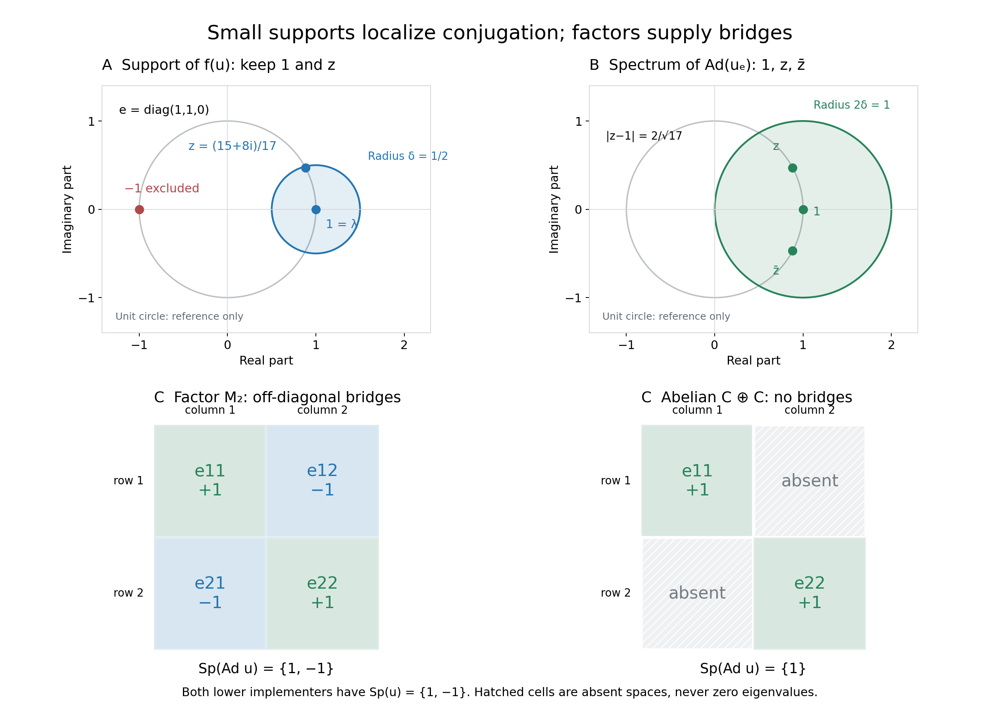

# Small fixed corners, inner spectra and annihilating times

A globally fixed unitary can implement an action at a time only if every Connes frequency evaluates to one there. The mechanism is a nonzero fixed corner on which conjugation is arbitrarily close to the identity in operator norm. We construct that corner first, so this application does not depend on the later product-spectrum theorem. We then prove the universal quotient bound and explain exactly how a factor supplies the missing lower bound.

Throughout, \(M\ne0\) is a von Neumann algebra on an arbitrary complex Hilbert space \(\mathcal H\), and \(u\in\mathcal U(M)\). For the action statements, \(G\) is an arbitrary locally compact Hausdorff abelian group, \(H=\widehat G\), and \(\alpha:G\to\operatorname{Aut}(M)\) is point-ultraweakly continuous with normal unital star automorphisms. Write \(N=M^\alpha\). There is no separability, sigma-finiteness, countability, finite-Haar, central-ergodicity or factor hypothesis unless it is explicitly introduced.

The ordinary complex spectrum in the algebra \(M\), or in the Banach algebra of bounded operators on \(M\), will be denoted by \(\sigma\) or \(\operatorname{Sp}\) with the algebra shown. The action spectrum is a closed subset of \(H\). These are different objects. The positive frequency convention is the exact earlier L115 convention: \(p(s)=(s,p)\). The earlier GCC negative-label spectrum reflects vector labels, but adjoint reflection makes each whole corner action spectrum symmetric. Its positive and negative versions, and their Connes intersections, consequently agree. No individual vector spectrum is assumed symmetric.

*Self-checked by the writing AI. Original exposition and illustrations: CC0-1.0 to the extent of rights held; existing component and font terms apply.*

## Exact earlier proof inputs

The eleven direct earlier scopes are CF1 (choice and maximality), CF2 (Banach spectrum and geometric series), CF4 (characters), CF6 (isometric continuous calculus and automorphism contractivity), PC1 (corners, supports and polar decomposition), PC2 (central support and nonzero bridges), GCC SETTING, GCC TOOLS, GCC DEFINITION, L115 CONVENTIONS, and [OPSP FORMULA](OA-FLOW-L89.md#oa-flow.opsp.formula).

For OPSP the scope includes its full source setting and proof O1–O9, the actual [AF0](OA-FLOW-AF.md#af-0) specified-dual hypotheses, and the full [AT1–3](OA-FLOW-AT.md#oa-flow.at.3) bridge. Those contexts are necessary: mere ultraweak continuity must be connected to norm continuity of every orbit in the actual predual. They are complete inherited contexts within the eleven-root closure, not extra direct proof roots. Opening descriptions, source comparisons and illustrations are never proof providers.

## Construct a nonzero small spectral support

Choose \(\lambda\in\sigma_M(u)\) and \(\delta>0\). Such a point exists by CF2. Its spectrum is a compact nonempty subset of \(\mathbb T\): for \(|z|>1\), the norm-convergent geometric series in \(u/z\) inverts \(u-z\); for \(|z|<1\), use \(u-z=u(1-zu^*)\). These arguments use \(\|u\|=\|u^*\|=1\).

Define the following continuous function on this actual compact spectrum and apply CF6:

\[
f(z)=\max(\delta-|z-\lambda|,0)\quad(z\in\sigma_M(u)),\qquad a=f(u).
\tag{IA1}
\]

The operator \(a\) is positive: the nonnegative function \(f\) is the square of its continuous square root. It is nonzero since isometry of the calculus gives \(\|a\|=\|f\|_\infty\ge f(\lambda)=\delta\). PC1 constructs \(e=s(a)\), the orthogonal projection onto \(\overline{a\mathcal H}\), in \(M\). It is nonzero. Both \(u\) and \(u^*\) commute with \(a\), hence preserve this closed range. Its orthogonal complement is also invariant, so \(eu=ue\).

The continuous scalar function
\(\delta^2 f(z)^2-|z-\lambda|^2f(z)^2\) is nonnegative. Its continuous square root and the star homomorphism give
\[
a(u^*-\overline\lambda)(u-\lambda)a\le\delta^2a^2.
\]
Testing this positive-operator inequality at \(\xi\) gives
\(\|(u-\lambda)a\xi\|\le\delta\|a\xi\|\). Density in the support range now gives

\[
\|(u-\lambda)e\|\le\delta. \tag{IA2}
\]

Compression \(u_e=eue\) is a unitary in the nonzero unital algebra \(eMe\), whose unit is \(e\). If \(|z-\lambda|>\delta\), write
\[
u_e-ze=(\lambda-z)\left(e+(u_e-\lambda e)/(\lambda-z)\right).
\]
The second factor is invertible by its geometric series. Unitarity excludes points off the circle by the same first argument. Thus

\[
\sigma_{eMe}(u_e)\subset\{z\in\mathbb T:|z-\lambda|\le\delta\}.
\tag{IA3}
\]

We can also identify the open spectral projection used in the alternative proof without assuming an entire bounded Borel calculus. For \(g_n(t)=t/(t+1/n)\), \(t\ge0\), continuous calculus gives positive contractions \(g_n(a)\). They annihilate \(\ker a\), and the scalar estimate \(t/(nt+1)\le1/n\) gives
\(\|g_n(a)a-a\|\le1/n\). Hence \(g_n(a)\to1\) strongly on \(a\mathcal H\), then on its closure by the contraction bound, and it is zero on the orthogonal complement. Its strong limit is \(e\). The functions \(g_n(f(z))\) approach one precisely where \(|z-\lambda|<\delta\), and zero elsewhere. In this lesson the notation
\(1_{\{|z-\lambda|<\delta\}}(u)\) denotes this explicitly constructed support projection. It has every property used below; a general unproved Borel theorem is unnecessary.

If \(u\in N\), then \(a\in N\). Indeed a star automorphism and its inverse are contractive by CF6, so they are isometric; they fix star polynomials in \(u\) and therefore their continuous-calculus limits. For positive \(a\), \(s(a)\) is the least projection \(q\) satisfying \(aq=a\), by GCC TOOLS. Apply the automorphism and its inverse to this characterization: \(s(\alpha_s(a))=\alpha_s(s(a))\). It follows that \(e\in N\). This avoids an invalid passage of a strong limit through an unspecified topology.

## A fixed implementer gives a direct norm bound

Assume that at a particular \(t\in G\) the action has a globally fixed unitary implementer:

$$
\alpha_t=\operatorname{Ad}(u)
\qquad\text{for some }u\in\mathcal U(M^\alpha).
\tag{I10}
$$

For every \(\delta>0\) choose the preceding \(0\ne e\in\operatorname{Proj}(N)\). The reduced action on \(eMe\) is well defined, and
\(\alpha_t^e=\operatorname{Ad}(u_e)\). For \(x\in eMe\),
\[
u_e x u_e^*-x
=(u_e-\lambda e)x u_e^*
 +\lambda x(u_e^*-\overline\lambda e).
\]
Since \(|\lambda|=1\), \(\|u_e\|=1\), and
\(\|u_e^*-\overline\lambda e\|=\|u_e-\lambda e\|\le\delta\), taking the supremum over \(\|x\|\le1\) yields

\[
\|\alpha_t^e-\mathrm{id}_{eMe}\|\le2\delta. \tag{IA4}
\]

If a bounded operator \(T\) on any nonzero complex Banach space satisfies \(\|T-1\|\le2\delta\), then for \(|z-1|>2\delta\) the factorization
\(T-z=(1-z)(1+(T-1)/(1-z))\) and its geometric series give a bounded two-sided inverse. Therefore
\(\sigma(T)\subset\{z:|z-1|\le2\delta\}\). This proves the required complex disc bound directly for \(T=\alpha_t^e\).

The full OPSP hypotheses apply here. GCC SETTING makes \(eMe\) a concrete von Neumann algebra on \(e\mathcal H\), with the actual concrete predual and normal, point-ultraweakly continuous restricted action. Its automorphisms are isometries, so both-sign uniform bounds hold with constant one. AT1–3 applied to this algebra gives norm-continuous orbits in \((eMe)_*\); it uses only arbitrary LCH group, normality and point-ultraweak continuity. Thus AF0's specified-dual setting holds. GCC SETTING also proves that corner scalar filters are restrictions of the original filters. OPSP and the reflected convention give

\[
\sigma_{\mathcal L(eMe)}(\alpha_t^e)
=\overline{\{\chi(t):\chi\in\operatorname{Sp}(\alpha^e)\}}.
\tag{IA5}
\]

The closure is in the complex plane. It cannot in general be omitted. In particular every \(p\in\operatorname{Sp}(\alpha^e)\) has \(p(t)\in\sigma_{\mathcal L(eMe)}(\alpha_t^e)\). By GCC DEFINITION, each \(p\in\Gamma(\alpha)\) lies in the spectrum of every nonzero fixed corner. Consequently \(|p(t)-1|\le2\delta\) for every \(\delta>0\). If this distance were positive, take \(\delta<|p(t)-1|/2\), a contradiction. Hence

\[
\alpha_t=\operatorname{Ad}(u),\quad u\in\mathcal U(M^\alpha)
\quad\Longrightarrow\quad t\in\Gamma(\alpha)^\perp.
\tag{IA6}
\]

Here \(\Gamma(\alpha)^\perp=\{t\in G:p(t)=1\text{ for all }p\in\Gamma(\alpha)\}\). The projection and even its size may depend on \(\delta\); the definition is an intersection over all of them, so this dependence causes no problem. No factor, central ergodicity or centrality of \(u\) within \(N\) has entered the proof.

## Commuting products: use an inverse-closed algebra

We next prove the Banach-algebra fact used by the universal inner-spectrum bound. If \(a,b\) commute in a nonzero complex unital Banach algebra \(B\), then

\[
\sigma_B(ab)\subset\sigma_B(a)\sigma_B(b). \tag{IA7}
\]

If the original Banach-algebra norm does not have \(\|1\|=1\), use the equivalent norm \(\|x\|'=\|L_x\|_{\mathcal L(B)}\). Indeed \(\|x\|'\le\|x\|\) by submultiplicativity, while \(\|x\|\le\|x\|'\|1\|\) by testing \(L_x\) at \(1\). This is a complete submultiplicative norm, since \(L_{xy}=L_xL_y\), with \(\|1\|'=1\). Algebraic invertibility and spectra are unchanged; equivalence also preserves closed subalgebras. Thus CF4's normalized unital hypotheses hold without narrowing (IA7). In the application \(B=\mathcal L(M)\) its original operator norm already has this normalization.

Order the commutative unital subalgebras of \(B\) containing \(a,b\) by inclusion. The algebra generated by \(1,a,b\) is one such subalgebra. The union of a chain is again one: any two of its elements lie together in one member. CF1 therefore gives a maximal member \(D\). Norm continuity of multiplication makes its closure a commutative unital subalgebra containing it. Maximality forces \(D\) to be closed, so it is itself a Banach algebra with the inherited norm.

If \(d\in D\) has inverse in \(B\), that inverse commutes with each \(c\in D\): multiply \(dc=cd\) on the two sides by \(d^{-1}\). The algebra generated by \(D\) and \(d^{-1}\) is commutative and unital. Maximality puts \(d^{-1}\) in \(D\). Thus \(D\) is inverse closed in \(B\), and
\(\sigma_D(d)=\sigma_B(d)\) for every \(d\in D\). This equality is essential; a small norm-closed algebra generated by \(a,b\) alone need not be inverse closed.

For \(z\in\sigma_B(ab)\), the equality puts \(z\) in \(\sigma_D(ab)\). CF4 supplies a unital character \(\varphi:D\to\mathbb C\) with \(\varphi(ab)=z\). Character values belong to the spectra, so
\(\varphi(a)\in\sigma_D(a)=\sigma_B(a)\) and
\(\varphi(b)\in\sigma_D(b)=\sigma_B(b)\).
Multiplicativity gives \(z=\varphi(a)\varphi(b)\), proving (IA7). The actual application is \(B=\mathcal L(M)\), whose unit has norm one; CF4 applies with its precise unital Banach-algebra hypotheses.

## Multiplication operators and the universal upper bound

Define the two bounded maps on \(M\):

$$
L_u(x)=ux,
\qquad
R_{u^*}(x)=xu^*.
\tag{I1}
$$

For any \(a\) in a unital Banach algebra, invertibility of \(a-z\) gives a bounded inverse multiplication map \(L_{(a-z)^{-1}}\). Conversely, if \(L_{a-z}\) is invertible, surjectivity supplies \(b\) with \((a-z)b=1\). Injectivity gives

$$
(a-z)\bigl(b(a-z)-1\bigr)=0
\quad\Longrightarrow\quad
b(a-z)=1.
\tag{I2}
$$

Thus \(b\) is its two-sided inverse. For right multiplication, surjectivity gives \(b(a-z)=1\), and injectivity applied to
\(((a-z)b-1)(a-z)=0\) gives \((a-z)b=1\). This proves both exact multiplication-spectrum identities. Taking adjoints in both inverse equations proves
\(\sigma_M(u^*)=\overline{\sigma_M(u)}\). We obtain

$$
\operatorname{Sp}_{\mathcal L(M)}(L_u)=\operatorname{Sp}_M(u),
\qquad
\operatorname{Sp}_{\mathcal L(M)}(R_{u^*})
=\operatorname{Sp}_M(u^*)
=\overline{\operatorname{Sp}_M(u)}.
\tag{I3}
$$

The bar means complex conjugation. For a unitary it equals pointwise inversion on the circle. Associativity also gives the commuting product

$$
\operatorname{Ad}(u)=L_uR_{u^*}.
\tag{I4}
$$

Apply the already complete product lemma in \(\mathcal L(M)\):

\[
\sigma_{\mathcal L(M)}(\operatorname{Ad}(u))
\subset\{\lambda\overline\mu:\lambda,\mu\in\sigma_M(u)\}.
\tag{IA8}
\]

Equivalently, retaining the equivalent formulation,

$$
\boxed{
\operatorname{Sp}_{\mathcal L(M)}(\operatorname{Ad}(u))
\subseteq
\{\lambda\overline\mu:
\lambda,\mu\in\operatorname{Sp}_M(u)\}.}
\tag{I5}
$$

This is an upper bound for every nonzero \(M\). It concerns complex Banach-operator spectra; it makes no statement about a Fourier action spectrum without the earlier OPSP bridge.

## A factor supplies a nonzero off-diagonal bridge

Now, and only in this section, suppose \(M\) is a factor. For \(\lambda,\mu\in\sigma_M(u)\) and \(\varepsilon>0\), the support construction with radius \(\varepsilon/2\) gives nonzero projections \(e_1,e_2\) with

$$
\|(u-\lambda)e_1\|<\varepsilon,
\qquad
\|(u-\mu)e_2\|<\varepsilon.
\tag{I6}
$$

Their central supports are one: the center of a factor is scalar, and a central support dominating a nonzero projection cannot be zero. PC2's exact criterion
\(pMq=\{0\}\Longleftrightarrow c(p)c(q)=0\)
therefore gives \(e_1Me_2\ne\{0\}\). Choose a nonzero \(x\) in that space. PC1's bounded polar decomposition \(x=v|x|\) has final support at most \(e_1\) and initial support at most \(e_2\). Since \(x\ne0\), \(v^*v\) is a nonzero orthogonal projection. The C-star identity gives \(\|v\|^2=\|v^*v\|=1\). Thus

$$
vv^*\le e_1,
\qquad
v^*v\le e_2,
\qquad
\|v\|=1.
\tag{I7}
$$

Using \(e_1v=v=ve_2\), unitarity and \(|\lambda|=|\mu|=1\), we have the complete norm calculation

\[
\begin{aligned}
\|uvu^*-\lambda\overline\mu v\|
&=\|uv-\lambda\overline\mu vu\|\\
&\le\|(u-\lambda)e_1v\|+\|\lambda\overline\mu\,ve_2(\mu-u)\|<2\varepsilon.
\end{aligned}\tag{IA9}
\]

The same calculation in the corresponding display is

$$
\begin{aligned}
\|uvu^*-\lambda\overline\mu v\|
&=\|uv-\lambda\overline\mu vu\|\\
&\le
\|(u-\lambda)e_1v\|
+\|\lambda\overline\mu\,ve_2(\mu-u)\|\\
&<2\varepsilon.
\end{aligned}
\tag{I8}
$$

If \(T=\operatorname{Ad}(u)-\lambda\overline\mu\,1_{\mathcal L(M)}\) were invertible, let \(C=\|T^{-1}\|\). For every \(\varepsilon>0\) the above construction would yield
\(1=\|v\|\le C\|Tv\|<2C\varepsilon\).
Taking \(\varepsilon<1/(2C)\) contradicts this inequality. Thus every quotient is in the operator spectrum. Combined with the universal inclusion, this proves

$$
\boxed{
M\text{ a factor}
\quad\Longrightarrow\quad
\operatorname{Sp}_{\mathcal L(M)}(\operatorname{Ad}(u))
=\operatorname{Sp}_M(u)\operatorname{Sp}_M(u)^{-1}.}
\tag{I9}
$$

The argument constructs an approximate eigenvector for each tolerance. It does not claim a single exact eigenvector for arbitrary \(\lambda,\mu\). The sole factor input is the nonzero bridge; neither a finite trace nor a countable decomposition is used.

## The sharper quotient route to the annihilator

There is also a complete route through the universal spectrum inclusion, which is now proved. Under (I10), fix \(\lambda\in\sigma_M(u)\) and \(\varepsilon>0\). The earlier support construction, with the displayed notation interpreted by its actual support limit, gives

$$
e=1_{\{z\in\mathbb T:|z-\lambda|<\varepsilon\}}(u)
\tag{I11}
$$

The projection is nonzero and fixed by the preceding norm-calculus and least-support argument. The reference to bounded Borel calculus is thus replaced by a full construction of the particular projection actually needed. Its compressed unitary and spectral containment are

$$
\alpha_t^e=\operatorname{Ad}(eue),
\qquad
\operatorname{Sp}_{eMe}(eue)
\subseteq\{z\in\mathbb T:|z-\lambda|\le\varepsilon\}.
\tag{I12}
$$

For \(z_1,z_2\) in that spectral set,

$$
|z_1\overline{z_2}-1|
=|z_1-z_2|
\le2\varepsilon.
\tag{I13}
$$

Apply (I5) to \(eMe\). We get

$$
\operatorname{Sp}_{\mathcal L(eMe)}(\alpha_t^e)
\subseteq
\{z\in\mathbb C:|z-1|\le2\varepsilon\}.
\tag{I14}
$$

The same exact normality, predual continuity and sign checks made in the direct route justify

$$
\operatorname{Sp}_{\mathcal L(eMe)}(\alpha_t^e)
=\overline{\{(t,p):p\in\operatorname{Sp}(\alpha^e)\}}.
\tag{I15}
$$

GCC's full fixed-corner definition gives

$$
\Gamma(\alpha)\subseteq\operatorname{Sp}(\alpha^e).
\tag{I16}
$$

Therefore, for every \(p\in\Gamma(\alpha)\),

$$
|(t,p)-1|\le2\varepsilon.
\tag{I17}
$$

The argument holds for every positive \(\varepsilon\), though its nonzero projection varies. It follows that

$$
(t,p)=1
\qquad(p\in\Gamma(\alpha)).
\tag{I18}
$$

and the conclusion is:

$$
\boxed{
\alpha_t=\operatorname{Ad}(u),\ u\in\mathcal U(M^\alpha)
\quad\Longrightarrow\quad
t\in\Gamma(\alpha)^\perp.}
\tag{I19}
$$

The stronger converse in Takesaki XI.2.9(iii), including a central fixed implementer under additional hypotheses, is not a conclusion of this lesson. Our implication requires only a globally fixed implementer and the stated normal LCA action.

## Solved example: why the factor hypothesis matters

**Problem.** Why can the factor equality (I9) fail for a nonfactor?

**Solution.** Let $M=\mathbb C\oplus\mathbb C$ and $u=(1,-1)$.  Then $\operatorname{Sp}_M(u)=\{1,-1\}$, so the quotient set is $\{1,-1\}$.  The algebra is abelian, however, and every inner automorphism is the identity.  Hence $\operatorname{Sp}_{\mathcal L(M)}(\operatorname{Ad}(u))=\{1\}$, making (I5) strict. $\square$

For comparison, let \(u=\operatorname{diag}(1,-1)\) in the factor \(M_2(\mathbb C)\). On the four matrix units, \(u e_{ij}u^*=\lambda_i\overline{\lambda_j}e_{ij}\). The diagonal units have eigenvalue one; the two off-diagonal units have eigenvalue minus one. They form a basis, so the operator spectrum is exactly \(\{1,-1\}\): outside this set, divide each coordinate by its nonzero eigenvalue minus the proposed spectral parameter to obtain a bounded inverse. The off-diagonal bridge is present in the factor and absent in the abelian direct sum. Figure C shows precisely those spaces, with the same implementing spectral values.

## An exact finite model of the small corner

For a second model take

\[
M=M_3(\mathbb C),\qquad
u=\operatorname{diag}(1,z,-1),\qquad
z=\frac{15+8i}{17},\qquad
\lambda=1,\quad\delta=\frac12.
\tag{IS1}
\]
Since \(15^2+8^2=17^2\), \(z\in\mathbb T\). Its distance to one is \(2/\sqrt{17}<1/2\), while the distance of minus one is two. The function \(f\) of (IA1) has positive values at the first two coordinates and zero at the third. Its support is therefore exactly

\[
e=\operatorname{diag}(1,1,0),\qquad
u_e=\operatorname{diag}(1,z),\qquad
\sigma(\operatorname{Ad}(u_e))=\{1,z,\overline z\}.
\tag{IS2}
\]
The last equality follows directly on the four corner matrix units, not by sampling a curve. Their eigenvalues are one on the diagonal and \(\overline z,z\) on \(e_{12},e_{21}\). In the operator norm induced by the matrix norm, the general direct estimate is
\(\|\operatorname{Ad}(u_e)-1\|\le2\delta=1\).
Each of the three exact spectral points has distance at most \(2/\sqrt{17}<1\) from one. The picture shows the proved upper bound, without asserting that this estimate equals the exact operator norm.

The spectral model is finite, but the support proof and the annihilator theorem apply to arbitrary cardinality. For actions the illustrated object is the ordinary spectrum of one corner operator; a continuous drawing of a circle is a geometric reference, not a claim that every point of that circle lies in the model's spectrum.

The full [figure caption](OA-FLOW-L122.md#oa-flow.l122.figure) locates the support construction, direct norm estimate, factor bridge and exact finite spectra.

## Further reading

Masamichi Takesaki, *Theory of Operator Algebras II*, Lemma XI.2.16, pp. 341–342.

## Small support and the missing off-diagonal bridge

**A. The constructed support.** In the exact [finite model](OA-FLOW-L122.md#ia-model), \(u=\operatorname{diag}(1,z,-1)\), \(z=(15+8i)/17\), \(\lambda=1\), and \(\delta=1/2\). The blue disc has center one and radius \(\delta\). The spectrum consists of the three marked points; the circle is a geometric reference. The support of \(f(u)\), \(f(w)=\max(\delta-|w-1|,0)\), selects exactly the first two coordinates: \(|z-1|=2/\sqrt{17}<1/2\), while \(|-1-1|=2\). Thus \(e=\operatorname{diag}(1,1,0)\). This is a finite instance of the full [continuous-calculus support construction](OA-FLOW-L122.md#ia-support), (IA1)–(IA3).

**B. The proved conjugation bound.** In \(eMe\cong M_2(\mathbb C)\), the exact spectrum of \(\operatorname{Ad}(u_e)\) is \(\{1,z,\overline z\}\), from its four matrix-unit eigenvalues. The green disc has center one and radius \(2\delta=1\). It is the [direct norm bound](OA-FLOW-L122.md#ia-direct-annihilator), (IA4), followed by the geometric-series resolvent argument. Its boundary is a proved spectral bound, not a spectral set and not a claim of the exact operator norm. The two off-diagonal values are at distance \(2/\sqrt{17}\) from one.

**C. Exact factor and nonfactor comparison.** For \(u=\operatorname{diag}(1,-1)\in M_2(\mathbb C)\), diagonal matrix units have conjugation eigenvalue \(+1\) and off-diagonal units have eigenvalue \(-1\). In \(\mathbb C\oplus\mathbb C\) with \(u=(1,-1)\), only the two diagonal coordinate spaces exist; grey hatched cells mark absent spaces, not zero eigenvalues. Both implementers have spectrum \(\{1,-1\}\), but conjugation has spectrum \(\{1,-1\}\) in the factor and \(\{1\}\) in the abelian algebra. The full [factor bridge proof](OA-FLOW-L122.md#ia-factor), (I6)–(I9), and [solved example](OA-FLOW-L122.md#ia-problem) explain the distinction.

For an arbitrary normal LCA action with a globally fixed implementer, small fixed supports exist for every positive tolerance. OPSP applied with its actual specified-predual hypotheses and the Connes fixed-corner intersection force \(p(t)=1\) for every \(p\in\Gamma(\alpha)\), as proved at (IA6) and (I19). The figure does not replace that proof or suggest a countability hypothesis.

Mathematical reference: Takesaki, *Theory of Operator Algebras II*, Lemma XI.2.16, pp. 341–342. The figure uses the exact rational coordinates and matrix-unit spectra described above.
