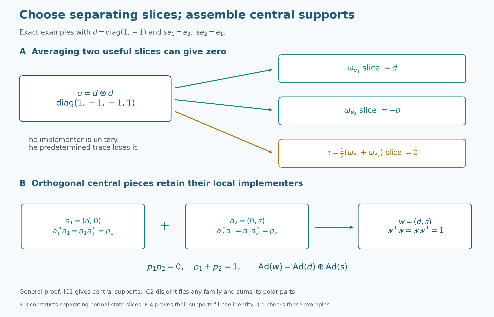

# From an intertwiner family to tensor-product innerness

A single normal state can send a tensor unitary to zero. A family of separating states keeps the information we need: its slice intertwiners have central carriers whose join is the identity. We first construct the actual tensor product and normal maps, then show how any family of intertwiners assembles a largest inner central part. Constructed normal slices will supply a family with full support. The maximal-remainder argument gives a second complete proof.

Throughout, \(M_i\ne0\) is a concrete von Neumann algebra on an arbitrary complex Hilbert space \(H_i\), with identity \(1_{H_i}\), and \(\sigma_i\) is an algebraic unital star automorphism of \(M_i\). Thus \(H_i\ne0\). For the single-algebra statements, \(N\ne0\) is a concrete von Neumann algebra on an arbitrary Hilbert space \(K\), with automorphism \(\sigma\). Inner products are linear in the first variable. An automorphism is inner if it has the form \(x\mapsto v x v^*\) for a unitary \(v\) in the actual algebra. A central corner \(zN\) has identity \(z\); its implementing unitary satisfies \(v^*v=vv^*=z\). There is no factor, separability, countability, sigma-finiteness or faithful-normal-state assumption. Arbitrary orthogonal sums below mean nets over finite subsets.

*Self-checked by the writing AI. Original exposition and illustrations: CC0-1.0 to the extent of rights held; existing component and font terms apply.*

## Exact earlier inputs

The thirteen direct proofs are [CF1](OA-FLOW-CF.md#oa-flow.cf.1), [CF6](OA-FLOW-CF.md#oa-flow.cf.6), [CF8](OA-FLOW-CF.md#oa-flow.cf.8), [CP1](OA-FLOW-CP.md#oa-flow.cp.1), [CP2](OA-FLOW-CP.md#oa-flow.cp.2), [CP4](OA-FLOW-CP.md#oa-flow.cp.4), [CP6](OA-FLOW-CP.md#oa-flow.cp.6), [PC1](OA-FLOW-PC.md#oa-flow.pc.1), GCC TOOLS, [NCF1](OA-FLOW-NCF.md#ncf-1), [BD4](OA-FLOW-BD.md#oa-flow.bd.4), [BD5](OA-FLOW-BD.md#oa-flow.bd.5), and [NF4](OA-FLOW-NF.md#oa-flow.nf.4).

NF4 concerns a bounded positive functional preserving bounded increasing positive suprema on an arbitrary concrete von Neumann algebra; its full source setting is included. BD4 applies to the actual nondegenerate elementary tensor algebra, and BD5 turns uniformly bounded strong nets into ultraweak nets. NCF1's matrix argument is for an arbitrary auxiliary Hilbert space and a normal homomorphism with the actual concrete preduals; no group theorem from its surrounding lesson is a tensor-map premise. CP2 supplies the algebraic quotient by bilinearity. Its projective norm is not the Hilbert tensor norm: we construct the latter next. The general commutation and support arguments in GCC TOOLS are used at their stated bounded-operator scope, without a group action assumption.

## Construct the Hilbert tensor and its normal automorphisms

An algebraic unital star homomorphism of C\*-algebras is contractive by CF6's inverse-preservation and spectral-radius argument. Applying this to an automorphism and its inverse shows that both are isometric. Positive square roots from CF6/CF8 show that an automorphism is an order isomorphism, so it preserves every bounded increasing positive supremum. A positive concrete predual functional preserves those suprema by NF4's converse. Its pullback through the automorphism is therefore bounded, positive and order normal, and NF4 puts the pullback in the actual predual.

Here is the positive decomposition needed to handle every predual functional, and later the state-selection argument. By CP4/CP6 it has a vector-series expression \(\varphi(x)=\sum_n\langle x\xi_n,\eta_n\rangle\), with both vector sequences square summable. Expansion, using our linear-first convention, gives

\[
\varphi(x)=\frac14\sum_{j=0}^3 i^j\varphi_j(x),\qquad
\varphi_j(x)=\sum_n\langle x(\xi_n+i^j\eta_n),\xi_n+i^j\eta_n\rangle.
\tag{NS1}
\]
Each new vector sequence has squared-norm sum at most \(2\sum_n\|\xi_n\|^2+2\sum_n\|\eta_n\|^2\). Thus \(\varphi_j\) is a bounded positive member of the concrete predual. Pulling each one back proves that every predual functional pulls back to a predual functional. This is ultraweak continuity of the automorphism on its whole algebra. The same proof applies to its inverse. Normality is consequently proved rather than imposed as an additional restriction on \(\sigma_i\).

For \(H_1,H_2\), use CP2's free-vector-space quotient by bilinearity, now for the two Hilbert spaces themselves. Define
\(\langle h\otimes k,h'\otimes k'\rangle=\langle h,h'\rangle\langle k,k'\rangle\).
The form respects every bilinearity relation in the first entry and its conjugate relation in the second, hence descends to the quotient. Any finite tensor uses finite-dimensional spans of its two lists of factors. Successively subtracting previous orthogonal components and normalizing each nonzero residual produces orthonormal bases of those spans. The tensor has an expansion \(\sum_{i,j}c_{ij}e_i\otimes f_j\). Bilinear coordinate tests recover its coefficients, and its squared norm is \(\sum_{i,j}|c_{ij}|^2\). Thus the form is positive definite. CP1's completion is the Hilbert tensor product \(H_1\otimes H_2\), and finite tensors are dense.

For a finite tensor written \(\xi=\sum_j h_j\otimes f_j\) with orthonormal \(f_j\),
\(\|(A\otimes1)\xi\|^2=\sum_j\|Ah_j\|^2\le\|A\|^2\sum_j\|h_j\|^2\).
The analogous first-factor expansion bounds \(1\otimes B\). CP1 extends both to the completion; their commuting product is \(A\otimes B\). Product and adjoint identities follow by testing elementary vectors and using density. This constructs the concrete elementary tensor operators and their norm bounds.

Let \(M_1\bar\otimes M_2\) be the von Neumann algebra they generate. NCF1 constructs the normal isomorphism \(\sigma_1\bar\otimes\mathrm{id}\) on \(M_1\bar\otimes B(H_2)\), with normal inverse. Its restriction maps \(M_1\bar\otimes M_2\) onto itself: BD4 gives uniformly bounded strong-star approximants from finite elementary tensors, BD5 makes them ultraweak approximants, and the image of each approximant stays in the elementary tensor algebra. Normality places every image in the generated algebra. Apply the inverse for equality.

The flip \(h\otimes k\mapsto k\otimes h\) preserves the constructed inner product; completion gives a unitary with the reverse flip as inverse. Conjugation by this unitary is normal, since CP6 vector-series tests pull back by replacing both vector sequences with their unitary inverse images. Flipping the preceding construction gives \(\mathrm{id}\bar\otimes\sigma_2\). The two maps commute on elementary tensors, and then on the full algebra by normality and BD4/BD5. Their composition is the unique normal automorphism specified by

\[
(\sigma_1\bar\otimes\sigma_2)(x\otimes y)=\sigma_1(x)\otimes\sigma_2(y).
\tag{IC1}
\]

These steps also prove that two normal maps agreeing on elementary tensors agree everywhere. All later uses of the tensor automorphism refer to this construction.

## An intertwiner produces an invariant central carrier

For an automorphism of \(N\), form

\[
\mathcal I_\sigma=\{a\in N:ax=\sigma(x)a\text{ for every }x\in N\}.
\tag{IC2}
\]

If \(0\ne a\in\mathcal I_\sigma\), PC1 gives its polar decomposition \(a=vh\), where \(h=|a|\), \(e=v^*v=s(h)\), and \(f=vv^*\). For a unitary \(x\), the intertwining identity gives
\(x^*h^2x=(ax)^*(ax)=a^*a=h^2\).
Uniqueness of the positive square root, by continuous calculus, gives \(x^*hx=h\). Hence \(h\) commutes with every unitary. The bounded unitary-commutation test of GCC TOOLS applies to \(h\): for self-adjoint \(b\), differentiate its commutation with the norm exponential \(e^{itb}\) at zero, then use self-adjoint decomposition. Thus \(h\in Z(N)\). Every unitary and its adjoint preserve \(hK\) and its closure, so the support projection \(e\) is central as well.

Centrality of \(h\) reduces the intertwining identity to \((vx-\sigma(x)v)h=0\). Its left factor vanishes on the dense range of \(h\) in \(eK\). It also vanishes on \((1-e)K\), because \(v=ve\) and \(e\) commutes with \(x\). Therefore

\[
vx=\sigma(x)v\quad(x\in N),\qquad x v^*=v^*\sigma(x).
\tag{IC3}
\]

Apply the first identity to \(x^*\) and take adjoints for the second. They imply that \(f\) commutes with \(\sigma(x)\) for every \(x\); surjectivity makes \(f\) central. The two equivalent central projections coincide: \(e=v^*fv=fe\) and \(f=vev^*=ef\).

For central \(z\), multiplying (IC3) by \(v^*\) gives \(ze=\sigma(z)e\). With \(z=e\) it yields \(e\le\sigma(e)\); with \(z=\sigma^{-1}(e)\) it yields \(e\le\sigma^{-1}(e)\). Apply \(\sigma\) to the second inequality to obtain \(\sigma(e)\le e\). We have proved

\[
e\in\operatorname{Proj}(Z(N)),\quad \sigma(e)=e,\quad v^*v=vv^*=e,
\qquad \sigma(x)=vxv^*\quad(x\in eN).
\tag{IC4}
\]

The implementation statement follows by multiplying (IC3) by \(v^*\) and using \(\sigma(e)=e\). Both support inequalities have been obtained from the same intertwiner. The adjoint-intertwiner route is retained in the alternative proof below.

## Disjointify the carriers and construct the largest inner central part

Take any set \(\mathcal A\subseteq\mathcal I_\sigma\). Well-order its nonzero members by CF1, and choose the polar parts and carriers \(v_j,e_j\) just proved. Form the following PC1 joins:

\[
e=\bigvee_j e_j,\qquad q_j=\bigvee_{k<j}e_k,\qquad p_j=e_j(1-q_j).
\tag{IC5}
\]

Every join is central: its closed span of ranges reduces every unitary of \(N\). Every join is also \(\sigma\)-invariant, because an order isomorphism preserves arbitrary least upper bounds. The differences \(p_j\) are pairwise orthogonal. Their join equals \(e\). Indeed let \(r=e-\bigvee_jp_j\). If \(r\ne0\), some \(re_j\ne0\), since otherwise all \(e_j\le1-r\) would force \(e\le1-r\). Choose the least such \(j\). The earlier \(e_k\) are orthogonal to \(r\), so their join \(q_j\) is too. Thus \(rp_j=re_j\ne0\), contradicting \(r\perp p_j\).

Set \(w_j=v_jp_j\). Centrality gives \(w_j^*w_j=w_jw_j^*=p_j\). For finite subsets \(F\) the sums \(w_F=\sum_{j\in F}w_j\) have norm at most one, and

\[
\Big\|\sum_{j\in F}w_j\xi\Big\|^2=\sum_{j\in F}\|p_j\xi\|^2,
\qquad
\Big\|\sum_{j\in F}w_j^*\xi\Big\|^2=\sum_{j\in F}\|p_j\xi\|^2.
\tag{IC6}
\]

For each vector the supremum of these nonnegative finite sums is at most its squared norm. Choose a finite subsum within \(\varepsilon^2\) of that supremum; every complementary finite vector sum has norm at most \(\varepsilon\). To obtain a limit using Hilbert completeness, choose successively larger finite sets making that vector's tails smaller than \(2^{-n}\). Their sums are a Cauchy sequence, and the same tail bound shows that the entire finite-subset net converges to its limit. Applying this separately to each vector, the uniform operator bound makes the pointwise limit a bounded linear operator. Do this for both \(w_F\) and \(w_F^*\). Passing to pairings identifies them as \(w,w^*\). They commute with \(N'\), so PC1's bicommutant characterization places them in \(N\). No single countable subset of the carrier family is being chosen for all vectors.

Uniformly bounded strong products converge strongly: expand
\(A_FB_F\xi-AB\xi=A_F(B_F-B)\xi+(A_F-A)B\xi\).
As \(w_F^*w_F=w_Fw_F^*=\sum_{j\in F}p_j\), passage to the limit gives \(w^*w=ww^*=e\). Since each \(p_j\) is central and invariant, \(w_jx=\sigma(x)w_j\). Taking strong limits gives \(wx=\sigma(x)w\). Thus \(w\) implements \(\sigma\) on \(eN\).

Apply this construction to the entire set \(\mathcal I_\sigma\), and denote the resulting carrier by \(e_\sigma\). It is the largest invariant central projection on which \(\sigma\) is inner. To prove maximality, let \(z\) be invariant and central and let \(t\in zN\) be a unitary implementing the restriction. For every \(x\in N\),
\(tx=t(zx)=\sigma(zx)t=\sigma(x)t\).
Thus \(t\in\mathcal I_\sigma\), and its carrier \(z\) lies below \(e_\sigma\). In particular,

\[
\sigma\text{ is inner}\quad\Longleftrightarrow\quad
\bigvee_{a\in\mathcal I_\sigma}s(|a|)=1.
\tag{IC7}
\]

For an empty family the construction gives \(e=0,w=0\); it makes no claim that the automorphism of the nonzero algebra is inner. No countable subfamily or faithful normal state was used.

## Construct normal slices and prove that states separate

For \(X\in M_1\bar\otimes M_2\) and \(\xi,\eta\in H_2\), use the Hilbert form

\[
\langle S_{\xi,\eta}(X)h,k\rangle
=\langle X(h\otimes\xi),k\otimes\eta\rangle,
\qquad
\|S_{\xi,\eta}(X)\|\le\|X\|\,\|\xi\|\,\|\eta\|
\tag{IC8}
\]

Its bound follows from the tensor norm already constructed. CF8/CP1 represents it by a unique bounded operator on \(H_1\). This operator lies in \(M_1\). For \(b'\in M_1'\), the operator \(b'\otimes1\) commutes with all elementary tensors and hence with their generated von Neumann algebra. Substituting this commutation in (IC8) gives
\(\langle S_{\xi,\eta}(X)b'h,k\rangle=\langle S_{\xi,\eta}(X)h,b'^*k\rangle=\langle b'S_{\xi,\eta}(X)h,k\rangle\).
So the slice commutes with \(M_1'\), and PC1's bicommutant identity proves membership.

The slice is normal on the full concrete tensor algebra. A CP6 test \(\sum_n\langle Yh_n,k_n\rangle\) pulls back to the vector series with vectors \(h_n\otimes\xi,k_n\otimes\eta\). Their squared-norm sums are the original sums multiplied by \(\|\xi\|^2,\|\eta\|^2\). Direct substitution in the form also proves

\[
S_{\xi,\eta}((b\otimes1)X(c\otimes1))=bS_{\xi,\eta}(X)c,
\qquad S_{\xi,\eta}(b\otimes d)=\langle d\xi,\eta\rangle b.
\tag{IC9}
\]

If all these slices vanish, all pairings of \(X\) between elementary tensor vectors vanish. By linearity they vanish on the dense finite spans, and continuity gives \(X=0\). Diagonal vector slices already suffice. Expansion of the four diagonals gives, with the linear-first convention,

\[
S_{\xi,\eta}(X)=\frac14\sum_{k=0}^{3}i^kS_{\xi+i^k\eta,\xi+i^k\eta}(X).
\tag{IC10}
\]

For \(\zeta\ne0\), \(\omega_\zeta(d)=\langle d\zeta,\zeta\rangle/\|\zeta\|^2\) is a positive normal functional with value one at \(1\). Its norm is one by the operator-norm estimate and evaluation at \(1\). Its slice is \(S_{\zeta,\zeta}/\|\zeta\|^2\). Thus every nonzero tensor operator has a nonzero normal state slice, with no general slice theorem assumed.

For completeness the normal slices in the alternative proof can be constructed for every normal functional. Write \(\omega(d)=\sum_n\langle d\xi_n,\eta_n\rangle\) by CP4/CP6 and set \(S_\omega(X)=\sum_n S_{\xi_n,\eta_n}(X)\). The series converges in operator norm, uniformly on a bounded set of \(X\), because \(\sum_n\|\xi_n\|\|\eta_n\|<\infty\). Its values lie in \(M_1\). Its bimodule identity passes through the series. Each predual test pulled back by this map is the norm limit of the normal pullbacks of its finite sums; CP6's norm closure of the concrete predual proves normality. On elementary tensors it equals \(\omega(d)b\); this also proves independence of the chosen vector-series representation, since two normal maps agreeing on the elementary tensor algebra agree everywhere by BD4/BD5.

Formula (NS1) expresses every normal functional as a linear combination of four positive normal ones. If a positive functional \(\psi\) is nonzero, positivity of \(\psi((x+\lambda y)^*(x+\lambda y))\) as a quadratic polynomial proves its Cauchy–Schwarz inequality. Taking \(y=1\), and using \(x^*x\le\|x\|^2 1\), gives \(|\psi(x)|\le\psi(1)\|x\|\); equality at \(1\) proves \(\|\psi\|=\psi(1)>0\). Dividing by that value yields a normal state. Therefore every normal functional is a linear combination of normal states, exactly as used in the retained proof.

## The slice family fills the identity

Suppose a unitary \(u\in M_1\bar\otimes M_2\) implements the tensor automorphism constructed in IC0. For each nonzero \(\zeta\in H_2\), put \(a_\zeta=S_{\omega_\zeta}(u)\). The identity
\(u(x\otimes1)=(\sigma_1(x)\otimes1)u\)
and the proved bimodule property give \(a_\zeta x=\sigma_1(x)a_\zeta\). Thus every slice is an intertwiner.

Let \(e\) be the join of the carriers of its nonzero members, and put \(r=1-e\). IC1 makes all these carriers central and invariant, and \(ra_\zeta=0\). Applying the slice bimodule identity and diagonal-state separation gives

\[
S_{\zeta,\zeta}((r\otimes1)u)=0\ (\zeta\in H_2)
\quad\Longrightarrow\quad (r\otimes1)u=0
\quad\Longrightarrow\quad r=0.
\tag{IC11}
\]

The last implication multiplies by \(u^*\), then tests \(r\otimes1\) at \(h\otimes\zeta\), with \(\zeta\ne0\). Since \(\|rh\otimes\zeta\|=\|rh\|\|\zeta\|\), it forces \(r=0\). Hence this one family has full carrier. IC2 assembles a unitary implementing \(\sigma_1\). Flip the tensor factors and apply the same proof to the flipped implementing unitary to obtain innerness of \(\sigma_2\).

Conversely, \(u_1\otimes u_2\) is a unitary if both factors are, and its conjugation agrees with the tensor automorphism on every elementary tensor. Both maps are normal, so IC0's density argument extends the equality to the whole tensor product. Therefore

\[
\sigma_1\bar\otimes\sigma_2\text{ inner}
\quad\Longleftrightarrow\quad
\sigma_1\text{ inner and }\sigma_2\text{ inner}.
\tag{IC12}
\]

This full-support argument uses one separating family. The later alternative applies separation anew on a maximal family's nonzero remainder; it proves the same theorem.

## Exact cancellation and central assembly

Let \(d=\operatorname{diag}(1,-1)\) and \(u=d\otimes d\) in \(M_2(\mathbb C)\bar\otimes M_2(\mathbb C)\). Tensor multiplication gives \(u^*u=uu^*=1\), and it implements \(\operatorname{Ad}(d)\bar\otimes\operatorname{Ad}(d)\). The normalized trace \(\tau(y)=(y_{11}+y_{22})/2\) is the average of the two diagonal vector states, so it is normal. Reading the diagonal entries in the second tensor factor gives

\[
(\mathrm{id}\bar\otimes\tau)(u)=0,
\qquad(\mathrm{id}\bar\otimes\omega_{e_1})(u)=d,
\qquad(\mathrm{id}\bar\otimes\omega_{e_2})(u)=-d.
\tag{IC13}
\]

The nonzero slices cancel under their average. A zero prescribed slice therefore does not imply that the implementing unitary is zero.

For assembly use the direct sum \(N=M_2(\mathbb C)\oplus M_2(\mathbb C)\), put \(s=\begin{pmatrix}0&1\\1&0\end{pmatrix}\), and take \(\sigma=\operatorname{Ad}(d)\oplus\operatorname{Ad}(s)\). Block multiplication proves that \(a_1=(d,0)\), \(a_2=(0,s)\) intertwine \(\sigma\), with central carriers \(p_1=(1,0)\), \(p_2=(0,1)\). They are orthogonal and sum to one. Thus \(w=a_1+a_2=(d,s)\) is a unitary implementing \(\sigma\), since \(d^*d=s^*s=1\). The direct-sum algebra here is different from the first example's tensor product.

The [exact diagram](OA-FLOW-L123.md#l123-figure) shows both mechanisms. IC2 first disjointifies an arbitrary, possibly overlapping, carrier family before taking its bounded strong sum. This finite example illustrates that operation without replacing its arbitrary-index proof.

## Maximal-remainder proof: tensor-product innerness from slice intertwiners

If a tensor product of two automorphisms is inner, each factor automorphism is inner.  The reverse implication is immediate; the content is extracting a nonzero intertwiner from an implementing tensor unitary, turning its polar part into a unitary on an invariant central summand, and patching all such summands without a countability assumption.

Let $M_1,M_2$ be nonzero von Neumann algebras, let $\sigma_i\in\operatorname{Aut}(M_i)$, and put

$$
M=M_1\,\overline\otimes\,M_2,
\qquad
\sigma=\sigma_1\,\overline\otimes\,\sigma_2.
\tag{T1}
$$

### Tensor implementers give the easy implication

If $\sigma_i=\operatorname{Ad}(u_i)$ with $u_i\in\mathcal U(M_i)$, then

$$
\sigma
=\operatorname{Ad}(u_1\otimes u_2).
\tag{T2}
$$

Thus innerness of both factor automorphisms implies innerness of their tensor product.  We now prove the converse without assuming that either algebra is a factor or sigma-finite.

The tensor unitary acts on elementary tensors by the stated automorphisms. Both conjugation and the tensor map are normal by IC0; bounded elementary density from BD4/BD5 proves equality on the entire generated algebra.

### A nonzero normal slice produces an intertwiner

Suppose

$$
\sigma=\operatorname{Ad}(u)
\qquad(u\in\mathcal U(M)).
\tag{T3}
$$

Normal slice maps separate $M_1\overline\otimes M_2$.  Since $u\ne0$, some normal state $\omega$ on $M_2$ has

$$
a=(\operatorname{id}\,\overline\otimes\,\omega)(u)\ne0.
\tag{T4}
$$

To justify the choice of a state, first use separation by the predual to obtain a nonzero normal slice; every normal functional is a linear combination of normal states, so one of those state slices is nonzero.

For $x\in M_1$, identify $x$ with $x\otimes1$.  From $ux=\sigma_1(x)u$ and the $M_1$-bimodule property of the slice map,

$$
ax
=(\operatorname{id}\overline\otimes\omega)(ux)
=(\operatorname{id}\overline\otimes\omega)(\sigma_1(x)u)
=\sigma_1(x)a.
\tag{T5}
$$

An arbitrary predetermined slice of $u$ may vanish; separation is what supplies a useful one.

The normal-functional slice, its bimodule property and the decomposition into normal states were constructed in IC3. In particular diagonal vector states already separate. This justifies both the nonzero-state choice and every displayed slice identity without importing an expectation theorem.

### The polar part implements an invariant central summand

Write the polar decomposition in $M_1$ as

$$
a=vh,
\qquad h=|a|,
\qquad e=v^*v=s(h).
\tag{T6}
$$

For a unitary $x\in M_1$, equation (T5) gives

$$
x^*h^2x
=(ax)^*(ax)
=(\sigma_1(x)a)^*(\sigma_1(x)a)
=h^2.
\tag{T7}
$$

Hence $h$, and therefore $e$, belongs to $Z(M_1)$.  Since $h$ has dense range on $e$ and commutes with $x$, equation (T5) implies

$$
vx=\sigma_1(x)v
\qquad(x\in M_1).
\tag{T8}
$$

The final support $f=vv^*$ is central as well: (T8) and its adjoint show that $f$ commutes with every element in the range of $\sigma_1$, which is all of $M_1$.  The central projections $e$ and $f$ are Murray–von Neumann equivalent through $v$, so they are equal.  Explicitly, centrality gives

$$
e=v^*fv=fe,
\qquad
f=vev^*=ef.
\tag{T9}
$$

Thus $e=f$.  Setting $x=e$ in (T8) gives $e\le\sigma_1(e)$.  Applying the same polar-support argument to $a^*$, which intertwines $\sigma_1^{-1}$, gives $e\le\sigma_1^{-1}(e)$.  Therefore

$$
\sigma_1(e)=e.
\tag{T10}
$$

Now $v$ is a unitary in $eM_1$ and (T8) yields

$$
\sigma_1^e=\operatorname{Ad}(v)
\quad\text{on }eM_1.
\tag{T11}
$$

For the adjoint argument explicitly, taking adjoints of the intertwining identity and replacing the variable by its inverse image gives \(a^*y=\sigma_1^{-1}(y)a^*\). Its positive part has support equal to the already central final support of \(a\), hence equal to \(e\). Applying the support inequality to this inverse automorphism gives \(e\le\sigma_1^{-1}(e)\), as used in (T10). IC1 supplies the same conclusion by two central substitutions.

Every nonzero slice therefore produces a nonzero invariant central summand on which $\sigma_1$ is inner.

### Maximal central patching proves both factors inner

Choose, by Zorn's lemma, a maximal orthogonal family $(e_i)_{i\in I}$ of nonzero projections in $Z(M_1)$ such that

$$
\sigma_1(e_i)=e_i,
\qquad
\sigma_1^{e_i}=\operatorname{Ad}(v_i)
\quad\text{for some }v_i\in\mathcal U(e_iM_1).
\tag{T12}
$$

The maximal-family step is a set-theoretic one: order orthogonal families of pairs \((e_i,v_i)\) by inclusion. A chain has its union as an upper bound. CF1 supplies a maximal family. Its joined projection is invariant because an automorphism is an order isomorphism, and it is central because all of its ranges reduce every unitary.

Put $e=\sum_{i\in I}e_i$, where the sum is the strong supremum.  It is central and $\sigma_1$-invariant.  If $r=1-e$ were nonzero, then $r\otimes1$ would be fixed by $\sigma=\operatorname{Ad}(u)$, hence commute with $u$.  The corner unitary

$$
u_r=u(r\otimes1)
\in\mathcal U\bigl((rM_1)\overline\otimes M_2\bigr)
\tag{T13}
$$

would implement $\sigma_1^r\overline\otimes\sigma_2$.  Normal slices separate this nonzero tensor corner, so the construction in (T4)–(T11) would produce a nonzero invariant central projection $e_0\le r$ on which $\sigma_1$ is inner.  This contradicts maximality.  Hence

$$
\sum_{i\in I}e_i=1.
\tag{T14}
$$

Here are the tensor-corner and remainder details used in that contradiction. With \(R=r\otimes1\), compression of a finite tensor gives \(R(x\otimes y)R=(rxr)\otimes y\). Compressing BD4/BD5 approximants therefore proves \(R(M_1\bar\otimes M_2)R=(rM_1)\bar\otimes M_2\) on \(rH_1\otimes H_2\); conversely its elementary generators belong to that corner, which is a von Neumann algebra by PC1. The construction of this Hilbert tensor and the restriction of the automorphism are those of IC0. Under the nonzero-remainder assumption both Hilbert factors are nonzero. Since \(\sigma_1(r)=r\), the unitary \(u\) commutes with \(R\); its compression has both supports equal to the corner identity \(R\).

Applying IC3 and IC1 in this concrete corner produces the required nonzero carrier \(e_0\). Centrality in \(rM_1\) extends to centrality in \(M_1\): an element supported by the central \(r\) commutes with \((1-r)M_1\) automatically, and centrality handles \(rM_1\). The restricted invariance is the same identity \(\sigma_1(e_0)=e_0\). Thus the new pair really can be added to the original maximal family.

The bounded orthogonal strong sum

$$
v=\sum_{i\in I}v_i
\tag{T15}
$$

is a unitary in $M_1$, even when $I$ is uncountable.  On every central summand $e_iM_1$, it implements $\sigma_1$, so

$$
\sigma_1=\operatorname{Ad}(v).
\tag{T16}
$$

The arbitrary-index convergence is the finite-subset net proved in IC2 (or PC1): orthogonal initial and final carriers bound every partial sum by one and make both vector tails Cauchy. Its adjoint has the corresponding strong limit, and bounded strong multiplication gives \(v^*v=vv^*=\sum_i e_i=1\). On each central carrier the intertwining identity holds, and its strong sum therefore holds on the whole Hilbert space.

Exchanging the two tensor factors gives $\sigma_2\in\operatorname{Int}(M_2)$.  Together with (T2), this proves

$$
\boxed{
\sigma_1\overline\otimes\sigma_2\text{ is inner}
\quad\Longleftrightarrow\quad
\sigma_1\text{ and }\sigma_2\text{ are inner}.}
\tag{T17}
$$

**Problem.** Where would the converse proof fail if one fixed a normal state $\omega$ before seeing the implementing unitary $u$?

**Solution.** The slice $(\operatorname{id}\overline\otimes\omega)(u)$ can be zero even though $u$ is unitary.  The polar argument then has no nonzero support from which to build an inner central summand.  One must use separation by all normal slices and then choose a state with nonzero slice; the same choice is repeated on any nonzero central remainder. $\square$

Further reading: Takesaki, *Theory of Operator Algebras II*, Lemma XI.2.17.  Equations (T3)–(T5) extract the slice intertwiner, (T6)–(T11) establish central invariant supports and local innerness, and (T12)–(T16) perform arbitrary-index central patching.  This also makes explicit the nonzero-remainder choice compressed in the printed proof.

The carrier construction IC1–IC2 and the maximal-remainder argument T1–T17 give two ways to assemble the inner implementer. IC3 constructs the separating normal state slices used by both routes.

## Separating slices and central assembly

In panel A, \(d=\operatorname{diag}(1,-1)\) and \(u=d\otimes d\) is a unitary on \(\mathbb C^2\otimes\mathbb C^2\). The second-factor vector states at \(e_1,e_2\) give slices \(d,-d\). Their equally weighted average is the normalized trace, whose slice is zero. Thus a fixed state can erase the implementer, while the family of all vector states separates it. [IC3](OA-FLOW-L123.md#ic3), equations IC8–IC10, constructs and proves separation for arbitrary concrete tensor products; [IC5](OA-FLOW-L123.md#ic5), equation IC13, proves these exact values.

In panel B, \(N=M_2(\mathbb C)\oplus M_2(\mathbb C)\), \(s=\begin{pmatrix}0&1\\1&0\end{pmatrix}\), and the intertwiners \((d,0),(0,s)\) have the central supports \(p_1=(1,0),p_2=(0,1)\). Their sum \(w=(d,s)\) is a unitary implementing \(\operatorname{Ad}(d)\oplus\operatorname{Ad}(s)\). These are direct sums of algebras, distinct from panel A's tensor product. [IC1–IC2](OA-FLOW-L123.md#ic1) prove the general central-support and arbitrary-index assembly statements; [IC4](OA-FLOW-L123.md#ic4) shows why the slice supports of a tensor implementer exhaust the identity.

Mathematical reference: Takesaki, *Theory of Operator Algebras II*, Lemma XI.2.17, p. 342. Original diagram and code: CC0-1.0 to the extent of rights held; DejaVu fonts retain their accompanying terms.
