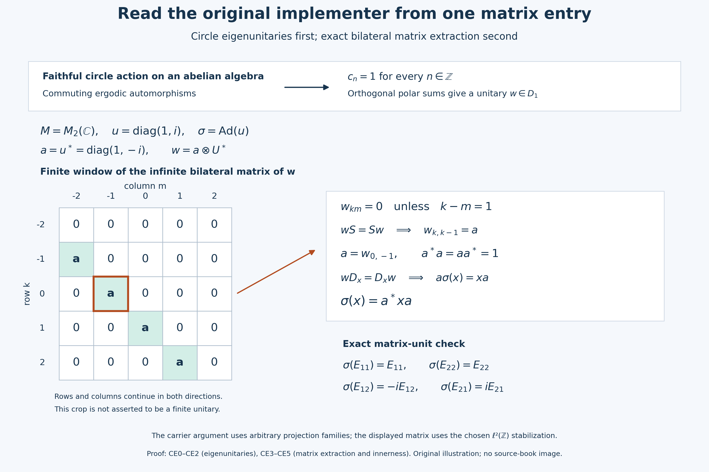

# Read an inner implementer from a circle eigenunitary

Trivial Connes spectrum acquires force when the commuting automorphisms are ergodic on the center. The mechanism has two parts: a faithful circle action on an abelian algebra admits a unitary of degree one, and a central degree-one unitary in the cyclic stabilization has a matrix coefficient that implements the original automorphism. We prove the circle statement first and construct the matrix descent before applying the Connes-spectrum hypothesis.

*Self-checked by the writing AI. Original exposition and illustrations: CC0-1.0 to the extent of rights held; existing component and font terms apply.*

## The setting and earlier proof bodies

Throughout, \(M\ne0\) is an arbitrary concrete von Neumann algebra on an arbitrary Hilbert space, and \(\sigma\) is a star automorphism of \(M\). The cyclic action is \(j\mapsto\sigma^j\), with discrete group \(\mathbb Z\) and multiplicative dual \(\mathbb T\); its Connes spectrum is the intersection of the spectra of all nonzero fixed corners at the exact L115 conventions. We will prove algebraic automorphisms normal. Circle parameters are modulo \(2\pi\), and circle integrals use \(d\theta/(2\pi)\).

Our complete earlier inputs are the scalar circle measure and Fejér estimates of [CC0](OA-FLOW-CC.md#oa-flow.cc.0), the summable vector-series and predual-duality proofs [CP4](OA-FLOW-CP.md#oa-flow.cp.4) and [CP6](OA-FLOW-CP.md#oa-flow.cp.6), the maximal principle CF1, the arbitrary projection joins, bounded polar decomposition and orthogonal sums PC1, the bounded positive functional theorem [NF4](OA-FLOW-NF.md#oa-flow.nf.4), the entire normal amplification and matrix-entry proof [NCF1](OA-FLOW-NCF.md#ncf-1), and L115's complete stabilization and dual-center kernel bodies.

Only CC0's scalar measure and finite polynomial estimates are used; its modular-weight setting is not a hypothesis here. PC1's bounded polar and arbitrary-sum proof is used without the countable-decomposability hypothesis of its later classification sections. NF4 proves a theorem about functionals; the next paragraph supplies the passage to automorphisms. The tensor-descent alternative uses the earlier L123 proof.

## CE0. Construct the Fourier means in the predual pairing

First an algebraic star automorphism \(\alpha\) is automatically ultraweakly normal. Positivity follows from square roots; \(\alpha\) and \(\alpha^{-1}\) are order isomorphisms. If a bounded increasing positive net has supremum \(x\), applying the order isomorphism and its inverse to upper bounds proves that the image net has supremum \(\alpha(x)\). A positive vector functional is order normal by NF4's converse. Its composition with \(\alpha\) is therefore a bounded order-normal positive functional, which NF4 places in the concrete predual. Boundedness uses \(\|\alpha(x)\|=\|x\|\): positivity applied to \(x^*x\leq\|x\|^2 1\) gives the inequality, and the inverse gives equality.

For the linear-first inner product, the precise polarization identity is

\[
\langle x\xi,\eta\rangle
=\frac14\sum_{j=0}^3 i^j
 \langle x(\xi+i^j\eta),\xi+i^j\eta\rangle.
\tag{CN1}
\]
Expansion cancels the two diagonal terms and the reversed mixed coefficient. Thus every mixed vector functional pulls back into the predual. CP4 and CP6 express every predual functional as a norm-convergent series of mixed coefficients. Isometry lets us pull back this series in norm, and CP6 makes its limit normal. This proves normality on the full ultraweak topology, including arbitrary nets; the inverse is treated in exactly the same way.

Let \(D\) now be any von Neumann algebra and let \(\delta:\mathbb T\to\operatorname{Aut}(D)\) be point-ultraweakly continuous. For \(x\in D\), define the Fourier mean by its evaluations:

$$\omega(E_nx)=\frac1{2\pi}\int_0^{2\pi}e^{-in\theta}\omega(\delta_\theta(x))\,d\theta\qquad(\omega\in D_*)\tag{CE1}$$

The right side is a bounded linear functional on \(D_*\), of norm at most \(\|x\|\). CP6's isometric duality \(D=(D_*)^*\) supplies a unique element \(E_nx\). Testing its translate with \(\omega\circ\delta_s\), and substituting \(t=s+\theta\), gives \(\delta_s(E_nx)=e^{ins}E_nx\). Conversely integration fixes each element of
\(D_n=\{x:\delta_s(x)=e^{ins}x\ \text{for every }s\}\). Hence \(\operatorname{ran}E_n=D_n\), which is ultraweakly closed because each defining map is normal.

The scalar finite geometric sum is the Fejér kernel:

$$F_N(\theta)=\frac1N\left|\sum_{j=0}^{N-1}e^{ij\theta}\right|^2=\sum_{|n|<N}(1-|n|/N)e^{in\theta},\qquad F_N\geq0,\qquad\int F_N=1.\tag{CE2}$$

Here \(\int F_N=1\) uses normalized measure. Symmetry of its coefficients under \(n\mapsto-n\) gives, despite the negative sign in the Fourier mean,

$$x_N=\int F_N(\theta)\delta_\theta(x)\,d\theta=\sum_{|n|<N}(1-|n|/N)E_nx,\qquad\|x_N\|\leq\|x\|.\tag{CE3}$$

To prove convergence, fix \(\omega\in D_*\). The function \(g(\theta)=\omega(\delta_\theta x)\) is continuous. Choose a neighborhood \(V\) of zero with \(|g(\theta)-g(0)|<\varepsilon\) on \(V\). Its complement has \(c_V=\min_{\theta\notin V}|1-e^{i\theta}|>0\); the geometric sum gives \(F_N\leq4/(Nc_V^2)\) there. Splitting the integral proves

\[
|\omega(x_N-x)|\leq\varepsilon+
\frac{8\|\omega\|\|x\|}{Nc_V^2}.
\tag{CN2}
\]
If the complement is empty the second term is unnecessary. First choose \(V\), then \(N\). Thus \(x_N\to x\) ultraweakly and the span of the \(D_n\) is ultraweakly dense. There is no countability assumption on \(D\), its Hilbert space or its predual, and no appeal to a compact-action decomposition theorem.

## CE1. Ergodicity fills the carrier in every degree

Assume \(D\ne0\) is abelian. Let \(\mathcal B\) be any group of automorphisms commuting with \(\delta\), with \(D^{\mathcal B}=\mathbb C1\). No topology on \(\mathcal B\) is required. A normal element \(x\) in an abelian algebra has equal initial and range supports by PC1; write this common projection \(s(x)\). It is the least projection \(p\) with \(px=x\). An automorphism sends such least projections to such least projections, and multiplication by a nonzero scalar preserves the support. Consequently \(s(x)\) is fixed by \(\delta\) whenever \(x\in D_n\). Set

$$c_n=\bigvee_{x\in D_n}s(x),\qquad S=\{n\in\mathbb Z:D_n\ne0\}.\tag{CE4}$$

Projection joins exist at arbitrary cardinality by PC1. Each \(\beta\in\mathcal B\) permutes \(D_n\), hence its supports and their join. A scalar projection is either zero or one; ergodicity therefore makes \(c_n=1\) precisely when \(D_n\ne0\).

The set \(S\) contains zero and is closed under negatives by adjoints. If \(n,m\in S\), choose \(0\ne x\in D_n\). Were \(xy=0\) for every \(y\in D_m\), \(x\) would vanish on every closed range \(s(y)H\), hence on their closed span \(c_mH=H\), a contradiction. Thus a nonzero product in \(D_{n+m}\) exists, and \(S\) is a subgroup of \(\mathbb Z\).

Now suppose \(\delta\) is faithful. \(S=\{0\}\) would make all Fourier means fixed, and CE0 would make the whole action trivial on the nonzero algebra. Otherwise choose the least positive \(k\in S\); division with remainder proves \(S=k\mathbb Z\). If \(k>1\), \(\delta_{2\pi/k}\) fixes every \(D_n\); normality and CE0 make it the identity on \(D\), contradicting faithfulness. We have proved

$$S=\mathbb Z,\qquad c_n=1\quad(n\in\mathbb Z).\tag{CE5}$$

## CE2. Assemble a unitary without restricting the index set

For a fixed \(n\) with \(c_n=1\), consider families of nonzero \(x_i\in D_n\) with pairwise orthogonal supports \(p_i\). Chain unions remain families, so CF1 gives a maximal family. Each \(p_i\) is fixed by \(\delta\); normality, or the order-isomorphism property, fixes their join \(p\) and \(q=1-p\). If \(q\ne0\), the support join \(c_n=1\) yields \(qx\ne0\) for some \(x\in D_n\). Its support lies below \(q\), so it extends the family, a contradiction. Hence \(\bigvee_i p_i=1\).

PC1 constructs \(x_i=w_i|x_i|\) with \(w_i^*w_i=w_iw_i^*=p_i\). The modulus is fixed by \(\delta\). The polar isometry is unique on the closure of \(|x_i|H\), where it sends \(|x_i|\xi\) to \(x_i\xi\), and is zero on its orthogonal complement. Applying \(\delta_s\) therefore gives \(\delta_s(w_i)=e^{ins}w_i\).

For finite \(J\subset I\), put \(w_J=\sum_{i\in J}w_i\). Orthogonality gives \(\|w_J\|\leq1\) and
\(\|\sum_{i\in J}w_i\xi\|^2=\sum_{i\in J}\|p_i\xi\|^2\). These nonnegative finite sums are bounded by \(\|\xi\|^2\); choose a finite set within any prescribed error of their supremum. All complementary finite vector sums are then small. This proves strong convergence of the finite-subset net and, by the same estimate, its adjoint net. The limits belong to \(D\), and expanding products of bounded strong limits proves

$$w^*w=ww^*=\lim_J\sum_{i\in J}p_i=1,\qquad\delta_s(w)=e^{ins}w.\tag{CE6}$$

For the eigenvalue equality, bounded strong convergence is ultraweak: in a CP4 vector series keep finitely many terms first, then control the remaining absolutely summable coefficients uniformly by the common bound. Normality of \(\delta_s\) passes through this limit. This is an arbitrary-index construction, not a countable sum chosen from the support family.

## CE3. A matrix coefficient descends the implementer

Work on \(H\otimes\ell^2(\mathbb Z)\), with standard vectors \(e_m\). Define
\(U\xi(k)=\xi(k+1)\), \(V_\theta\xi(k)=e^{ik\theta}\xi(k)\),
\(\widetilde M=M\bar\otimes B(\ell^2(\mathbb Z))\),
\(\widetilde\sigma=\sigma\bar\otimes\operatorname{Ad}U\), and
\(\delta_\theta=\operatorname{Ad}(1\otimes V_\theta)\).
Normal amplification on the entire tensor product is constructed by NCF1 and L115 STABILIZATION. The diagonal unitaries are strongly continuous first on finite-coordinate vectors and then by their common norm one. Conjugating a fixed bounded \(X\) is continuous on vector coefficients; the uniform bound and CP4/6 summable tails make \(\delta\) point-ultraweakly continuous.

Notice the directions: \(Ue_m=e_{m-1}\) and \(U^*e_m=e_{m+1}\). The bounded diagonal
\(D_x=\sum_k\sigma^{-k}(x)\otimes e_{kk}\) is a strong limit of finite diagonals of norm at most \(\|x\|\), hence lies in \(\widetilde M\); its zero entry gives the reverse norm inequality. With \(S=1\otimes U\), direct entry calculation gives

$$\widetilde\sigma(D_x)=D_x,\qquad\widetilde\sigma(S)=S,\qquad\delta_\theta(D_x)=D_x,\qquad\delta_\theta(S)=e^{-i\theta}S.\tag{CE7}$$

Let \(N=\widetilde M^{\widetilde\sigma}\). Suppose \(w\in Z(N)\) is a unitary with \(\delta_\theta(w)=e^{i\theta}w\). NCF1 places every normal vector compression \(w_{km}\) in \(M\). Its circle transform is \(e^{i(k-m)\theta}w_{km}\), so the eigencondition forces \(w_{km}=0\) unless \(k-m=1\): for each other integer difference choose a circle parameter with unequal characters.

Write \(a_k=w_{k,k-1}\). Centrality and \(S\in N\) give \(wS=Sw\). Their \((k,k)\) entries are \(a_k\) and \(a_{k+1}\); all \(a_k\) therefore equal \(a=w_{0,-1}\). Equality on finite-coordinate vectors, followed by density and boundedness, gives

$$w=a\otimes U^*,\qquad a^*a=aa^*=1.\tag{CE8}$$

The unitarity identities follow by compressing \(w^*w=ww^*=1\) to a diagonal entry. Commutation with \(D_x\) has \((k,k-1)\) entry
\(a\sigma^{-(k-1)}(x)=\sigma^{-k}(x)a\).
At \(k=0\) this reads \(a\sigma(x)=xa\), and therefore

$$\sigma(x)=a^*xa\quad(x\in M).\tag{CE9}$$

This conclusion requires no tensor-product innerness theorem. The illustration shows this entry calculation in an exact \(M_2(\mathbb C)\) example, distinguishing the finite crop from the whole bilateral matrix.

## CE4. Verify the fixed realization and both circle signs

An element \(X\) of \(N\) satisfies \(X_{km}=\sigma(X_{k+1,m+1})\). The Weyl identity \(V_\theta U V_\theta^*=e^{-i\theta}U\) makes \(\delta\) commute with \(\widetilde\sigma\). Thus normality and the integral construction in CE0 make each \(E_nX\) fixed by \(\widetilde\sigma\). Its only nonzero entries have \(k-m=n\), and its \((0,-n)\) entry is \(X_{0,-n}\). Iterating the fixed-entry recurrence forward and backward gives \(X_{k,k-n}=\sigma^{-k}(X_{0,-n})\). Consequently, with \(x=X_{0,-n}\),

$$E_nX=D_x S^{-n}.\tag{CE10}$$

All these components belong to \(W^*(D_x,S:x\in M)\). CE0 approximates \(X\) ultraweakly by finite linear combinations of them; conversely CE7 fixes the generators, and normality closes the fixed algebra. We have established \(N=W^*(D_x,S:x\in M)\).

This is the regular cyclic crossed product itself: its coefficient representation is \(x\mapsto D_x\), and its translation at \(1\) is \(\lambda_1=S^{-1}\). It satisfies \(\lambda_1D_x\lambda_1^*=D_{\sigma(x)}\). The course's negative dual action multiplies \(\lambda_1\) by \(e^{-i\theta}\), whereas \(\delta_\theta(\lambda_1)=e^{i\theta}\lambda_1\). Thus our circle action has the inverse parameter. Every action kernel is inverse invariant, since the inverse parameter acts by the inverse automorphism. Applying the exact L115 CENTERKERNEL proof at this normal discrete cyclic action gives

$$\ker(\delta|_{Z(N)})=\Gamma(\sigma).\tag{CE11}$$

This equality does not assume a symmetry of an individual vector spectrum; it uses inverse invariance of the kernel. L115 CONVENTIONS also proves that the fixed-corner action spectra agree at the reflected labels.

For the larger generating algebra, the ultraweak integral
\(\int e^{-ik\theta}(1\otimes V_\theta)\,d\theta/(2\pi)\) is \(p_k=1\otimes e_{kk}\) by its entries. It belongs to the generated von Neumann algebra: finite Riemann sums converge on each vector coefficient and on CP4 series by uniform tail bounds. Then
\(p_kD_{\sigma^k(x)}p_k=x\otimes e_{kk}\) and
\(p_kS^{m-k}p_m=1\otimes e_{km}\); their product is \(x\otimes e_{km}\).
Every \(X\in\widetilde M\) has entries in \(M\) by NCF1, and its finite compressions \(P_JXP_J\) are sums of these tensors, of norm at most \(\|X\|\). They converge strongly by
\(P_JXP_J\xi-X\xi=P_JX(P_J-1)\xi+(P_J-1)X\xi\).
Therefore

$$W^*(N,1\otimes V_\theta:\theta\in\mathbb T)=\widetilde M.\tag{CE12}$$

A central element of \(\widetilde M\) commutes with each \(p_k\), hence is diagonal; commutation with every \(1\otimes e_{km}\) makes its diagonal a constant \(z\in M\). Commutation with \(x\otimes e_{00}\) forces \(z\in Z(M)\). Conversely \(z\otimes1\) is central for every such \(z\), by finite compressions and bounded limits. This proves \(Z(\widetilde M)=Z(M)\otimes1\) at arbitrary Hilbert dimension.

## CE5. Centralizer ergodicity completes the theorem

Assume \(\Gamma(\sigma)=\{1\}\) and
\(Z(M)^{\operatorname{Aut}_\sigma(M)}=\mathbb C1\), where
\(\operatorname{Aut}_\sigma(M)=\{\beta:\beta\sigma=\sigma\beta\}\).
Let \(\mathcal A\) be the group of automorphisms of \(\widetilde M\) commuting with \(\widetilde\sigma\) and every \(\delta_\theta\). All these automorphisms are normal by CE0. They preserve \(N\) and \(D=Z(N)\). The Weyl relation shows that each \(\delta_\theta\) belongs to \(\mathcal A\). NCF1 constructs \(\beta\bar\otimes\mathrm{id}\), also in \(\mathcal A\), for every \(\beta\in\operatorname{Aut}_\sigma(M)\).

If \(d\in D^{\mathcal A}\), it commutes with \(N\) and, by \(\delta\)-invariance, every \(1\otimes V_\theta\). CE12 then puts it in \(Z(\widetilde M)=Z(M)\otimes1\). Invariance under all the lifted \(\beta\) makes it scalar. Hence \(D^{\mathcal A}=\mathbb C1\). The nonzero unital algebra \(N\) has a nonzero abelian center. CE11 and the assumed trivial Connes spectrum make the circle action on \(D\) faithful. CE1–CE2 provide a unitary \(w\in D_1\); CE3 reads its coefficient \(a=w_{0,-1}\) and proves \(\sigma=\operatorname{Ad}(a^*)\).

The complete conclusion is the conclusion (E25) below. The deliberately introduced coordinate space \(\ell^2(\mathbb Z)\) is countable; neither \(M\), its Hilbert representation nor the family of carrier projections has been restricted by that choice.

## Stabilization and tensor-descent argument

CE0–CE5 provide the Fourier, normality, matrix and arbitrary-family facts used below. The concluding tensor descent uses [From an intertwiner family to tensor-product innerness](OA-FLOW-L123.md#oa-flow.l123.ic4); CE3 also gives a direct matrix-coefficient descent.

## Trivial Connes spectrum and centralizer ergodicity force innerness

Trivial Connes spectrum does not by itself make an automorphism inner.  The missing rigidity comes from the automorphisms commuting with it: if that centralizer acts ergodically on the center, stabilization turns the problem into a faithful circle action on an abelian center.  Its degree-one spectral space contains a unitary, and that unitary implements the stabilized automorphism.

Let $M$ be a nonzero von Neumann algebra and $\sigma\in\operatorname{Aut}(M)$.  Regard $\sigma$ as the action $n\mapsto\sigma^n$ of $\mathbb Z$, whose dual is written multiplicatively as $\mathbb T$.  Put

$$
\operatorname{Aut}_\sigma(M)
=\{\beta\in\operatorname{Aut}(M):\beta\sigma=\sigma\beta\}.
\tag{E1}
$$

Assume

$$
\Gamma(\sigma)=\{1\},
\qquad
Z(M)^{\operatorname{Aut}_\sigma(M)}=\mathbb C1.
\tag{E2}
$$

There is no separability, sigma-finiteness, or countability hypothesis.

### Stabilize the cyclic action and expose its dual circle

On $\ell^2(\mathbb Z)$ define

$$
(U\xi)(n)=\xi(n+1),
\qquad
(V_\theta\xi)(n)=e^{in\theta}\xi(n)
\quad(0\le\theta<2\pi).
\tag{E3}
$$

Set

$$
\widetilde M=M\overline\otimes B(\ell^2(\mathbb Z)),
\qquad
\widetilde\sigma=\sigma\overline\otimes\operatorname{Ad}(U),
\qquad
\delta_\theta=\operatorname{Ad}(1\otimes V_\theta).
\tag{E4}
$$

The Weyl relation is

$$
V_\theta U V_\theta^*=e^{-i\theta}U.
\tag{E5}
$$

Thus $\delta$ commutes with $\widetilde\sigma$ as an automorphism action.  The fixed algebra

$$
N=\widetilde M^{\widetilde\sigma}
\tag{E6}
$$

is the regular crossed-product realization proved in [CE4](OA-FLOW-L124.md#ce4). With the course's negative dual convention, \(\delta_\theta|_N\) is the dual circle action at the inverse parameter \(-\theta\). This inversion leaves its kernel unchanged. The generating relation is

$$
W^*(N,1\otimes V_\theta:\theta\in\mathbb R)=\widetilde M.
\tag{E7}
$$

To prove (E7), write \(p_n=1\otimes e_{nn}\) and \(S=1\otimes U\). For \(x\in M\), define the bounded diagonal operator below.

$$\begin{aligned}
D_x&=\sum_{n\in\mathbb Z}\sigma^{-n}(x)\otimes e_{nn},\\
p_n&=\frac1{2\pi}\int_0^{2\pi}e^{-in\theta}
          (1\otimes V_\theta)\,d\theta,\\
\widetilde\sigma(D_x)&=D_x,\qquad
\widetilde\sigma(S)=S.
\end{aligned}\tag{E7a}$$

The diagonal sum defines an element of \(\widetilde M\) of norm \(\|x\|\); its entries are uniformly bounded because automorphisms are isometric. Shifting its matrix indices by one and applying \(\sigma\) verifies the fixedness in (E7a), so \(D_x,S\in N\). The integral for \(p_n\) is ultraweak and follows by applying it to each standard basis vector. Thus every \(p_n\) belongs to the von Neumann algebra generated by the \(1\otimes V_\theta\).

The two generating families now supply every matrix coefficient:

$$\begin{aligned}
p_nD_{\sigma^n(x)}p_n&=x\otimes e_{nn},\\
p_n S^{m-n}p_m&=1\otimes e_{nm},\\
(p_nD_{\sigma^n(x)}p_n)(p_n S^{m-n}p_m)
 &=x\otimes e_{nm}.
\end{aligned}\tag{E7b}$$

For any \(a\in\widetilde M\), its finite matrix compressions \(P_FaP_F\), with \(P_F=\sum_{n\in F}p_n\), are finite sums of such coefficients. They are uniformly bounded and converge strongly to \(a\) as finite \(F\subset\mathbb Z\) increase. This proves (E7) on the entire algebra.

### The commuting automorphism group is ergodic on the fixed center

Let $\mathcal A$ be the group of automorphisms of $\widetilde M$ commuting with both $\widetilde\sigma$ and every $\delta_\theta$.  It contains

$$
\beta\overline\otimes\operatorname{id}
\qquad(\beta\in\operatorname{Aut}_\sigma(M))
\tag{E8}
$$

and it also contains every $\delta_\theta$.  It preserves $N$ and its center

$$
D=Z(N).
\tag{E9}
$$

Suppose $d\in D$ is fixed by $\mathcal A$.  Since all $\delta_\theta$ belong to $\mathcal A$, $d$ commutes with every $1\otimes V_\theta$.  It already commutes with $N$ because $d\in Z(N)$.  Equation (E7) therefore gives

$$
d\in Z(\widetilde M)=Z(M)\overline\otimes\mathbb C1.
\tag{E10}
$$

The invariance under (E8) and the second assumption in (E2) force $d$ to be scalar.  Hence

$$
D^{\mathcal A}=\mathbb C1.
\tag{E11}
$$

The group $\mathcal A$ acts ergodically on the abelian algebra $D$ and commutes with the dual circle action there.

### Faithfulness forces every integer degree to occur

The dual-center kernel theorem from lesson 115 gives

$$
\ker(\delta|_D)=\Gamma(\sigma)=\{1\}.
\tag{E12}
$$

Thus the circle action on $D$ is faithful.  For $n\in\mathbb Z$, let

$$
D_n=\{x\in D:\delta_\theta(x)=e^{in\theta}x
\text{ for every }\theta\},
\qquad
c_n=\bigvee_{x\in D_n}s(x).
\tag{E13}
$$

Because $D$ is abelian, $s(x)$ is the common left and right support.  The space $D_n$ is invariant under $\mathcal A$, so $c_n$ is $\mathcal A$-invariant.  Ergodicity (E11) yields

$$
c_n\in\{0,1\}.
\tag{E14}
$$

Let $S=\{n:D_n\ne\{0\}\}$.  If $n,m\in S$, then $c_n=c_m=1$.  Given nonzero $x\in D_n$, the support join $c_m=1$ supplies $y\in D_m$ with $xy\ne0$, so $n+m\in S$.  Also $D_n^*=D_{-n}$, whence

$$
S\le\mathbb Z.
\tag{E15}
$$

Write $S=k\mathbb Z$ for some $k\ge0$.  Fejér approximation for a circle action makes the linear span of the $D_n$ ultraweakly dense in $D$.  The case $k=0$ would make the whole circle act trivially.  If $k>1$, then $\delta_{2\pi/k}$ fixes every $D_n$ and hence all of $D$.  Both alternatives contradict (E12).  Therefore

$$
S=\mathbb Z,
\qquad
c_1=1.
\tag{E16}
$$

### Patch the degree-one supports into a unitary

Choose a maximal family $(x_i)_{i\in I}$ of nonzero elements of $D_1$ with mutually orthogonal support projections $p_i=s(x_i)$.  Maximality and $c_1=1$ imply

$$
\sum_{i\in I}p_i=1.
\tag{E17}
$$

Indeed, a nonzero remainder would meet the support of some degree-one element, whose compression would extend the family.  In the polar decomposition $x_i=w_i|x_i|$, abelianness gives

$$
w_i^*w_i=w_iw_i^*=p_i,
\qquad
\delta_\theta(w_i)=e^{i\theta}w_i.
\tag{E18}
$$

The bounded orthogonal strong sum

$$
w=\sum_{i\in I}w_i
\tag{E19}
$$

is therefore a unitary in $D_1$, with

$$
\delta_\theta(w)=e^{i\theta}w.
\tag{E20}
$$

No countability of $I$ is needed.

### The degree-one unitary implements the stabilized automorphism

Since $w\in D=Z(N)$,

$$
\operatorname{Ad}(w^*)(x)=x
\qquad(x\in N).
\tag{E21}
$$

Equation (E20) is equivalent to

$$
w^*(1\otimes V_\theta)w
=e^{i\theta}(1\otimes V_\theta).
\tag{E22}
$$

On the other hand, (E3) gives

$$
\widetilde\sigma(1\otimes V_\theta)
=1\otimes U V_\theta U^*
=e^{i\theta}(1\otimes V_\theta),
\tag{E23}
$$

while $\widetilde\sigma$ fixes $N$ by definition.  The generating relation (E7) now proves

$$
\widetilde\sigma=\operatorname{Ad}(w^*).
\tag{E24}
$$

Thus $\widetilde\sigma=\sigma\overline\otimes\operatorname{Ad}(U)$ is inner.  The second tensor factor is already inner, so [lesson 123](OA-FLOW-L123.md#oa-flow.tensorinner.patch) implies that $\sigma$ is inner.  We have proved Lemma XI.2.18:

$$
\boxed{
\Gamma(\sigma)=\{1\},\quad
Z(M)^{\operatorname{Aut}_\sigma(M)}=\mathbb C1
\quad\Longrightarrow\quad
\sigma\in\operatorname{Int}(M).}
\tag{E25}
$$

**Problem.** Why does faithfulness of $\delta|_D$ rule out $S=k\mathbb Z$ for $k>1$?

**Solution.** For $n=kj$, the element $e^{in(2\pi/k)}$ equals one.  Hence $\delta_{2\pi/k}$ fixes every spectral space $D_n$.  Fejér approximation makes their span ultraweakly dense, and normality then makes $\delta_{2\pi/k}$ the identity on $D$.  This is a nontrivial kernel element when $k>1$, contradicting (E12). $\square$

Further reading: Takesaki, *Theory of Operator Algebras II*, Lemma XI.2.18.  Equations (E3)–(E7) set up the stabilized crossed-product realization, (E8)–(E12) prove ergodicity and faithfulness on its center, (E13)–(E20) construct a degree-one central unitary, and (E21)–(E25) identify the implementing automorphism and descend innerness through the tensor factor.

The equality (E24) is complete locally: both normal automorphisms agree on \(N\) and all \(1\otimes V_\theta\), and equality extends from their generated star algebra by ultraweak continuity and CE12. The last inference through L123 uses the earlier tensor-product innerness theorem. Independently, the same unitary already satisfies CE3, so \(a=w_{0,-1}\) proves the entire conclusion (E25) directly.

## Further reading

Masamichi Takesaki, *Theory of Operator Algebras II*, Lemma XI.2.18, pp. 342–343; [bibliographic record](https://doi.org/10.1007/978-3-662-10451-4).

The figure is an exact \(M_2(\mathbb C)\) model with a labeled crop of an infinite bilateral matrix; its full [caption and proof links](OA-FLOW-L124.md#l124-figure), reproducible renderer and font terms accompany the proof.

## A coefficient of the bilateral matrix is the implementer

The top strip is a proof map for CE0–CE2: a faithful circle action on an abelian von Neumann algebra, with a commuting group acting ergodically, has full support in every integer degree; an arbitrary orthogonal family of polar partial isometries then gives an eigenunitary. It is a statement at the proved general hypotheses, not a sampling argument.

The lower panel is an exact example of CE3–CE5 with $M=M_2(\mathbb C)$, $u=\operatorname{diag}(1,i)$, $\sigma=\operatorname{Ad}(u)$ and $a=u^*=\operatorname{diag}(1,-i)$. The unitary $w=a\otimes U^*$ acts on $\mathbb C^2\otimes\ell^2(\mathbb Z)$. Only rows and columns $-2,-1,0,1,2$ of its infinite matrix are drawn. Every green cell denotes the same entire $2\times2$ block $a$; a zero cell denotes the zero block. The omitted rows and columns continue the subdiagonal in both directions. The finite crop itself is not unitary and is not used as an approximation in the proof. With the row index $k$ and column index $m$, the nonzero rule is $k-m=1$, precisely the positive circle degree.

The outlined cell is $w_{0,-1}=a$. Commutation with $S=1\otimes U$ forces all subdiagonal blocks to be equal. Commutation with the fixed diagonal $D_x$ gives $a\sigma(x)=xa$, so the original algebra's implementer is $a^*$, with the adjoint exactly as displayed. The four matrix-unit equations are checked symbolically in the reproducible [renderer](../assets/centralizer-ergodicity-innerness/render_matrix_descent.py) and [exact model data](../assets/centralizer-ergodicity-innerness/figure/matrix-descent-data.json). They test this finite example; the complete arbitrary-algebra proof is CE3. The [editable SVG](../assets/centralizer-ergodicity-innerness/figure/matrix-descent.svg) carries the same diagram.

Original exposition, model, illustration and renderer: CC0-1.0 to the extent of rights held. DejaVu glyph components retain the accompanying [font terms](../assets/centralizer-ergodicity-innerness/figure/FONT-LICENSE.txt). The contextual human source is Takesaki, *Theory of Operator Algebras II*, Lemma XI.2.18, printed342–343,. All mathematical assertions refer to the complete local proofs CE0–CE5 and their exact earlier programme inputs.

Exact proof locators: [CE0 Fourier means](OA-FLOW-L124.md#ce0), [CE1 carriers](OA-FLOW-L124.md#ce1), [CE2 arbitrary polar sums](OA-FLOW-L124.md#ce2), [CE3 the coefficient and adjoint](OA-FLOW-L124.md#ce3), [CE4 the fixed realization](OA-FLOW-L124.md#ce4), and [CE5 the centralizer hypotheses](OA-FLOW-L124.md#ce5).
