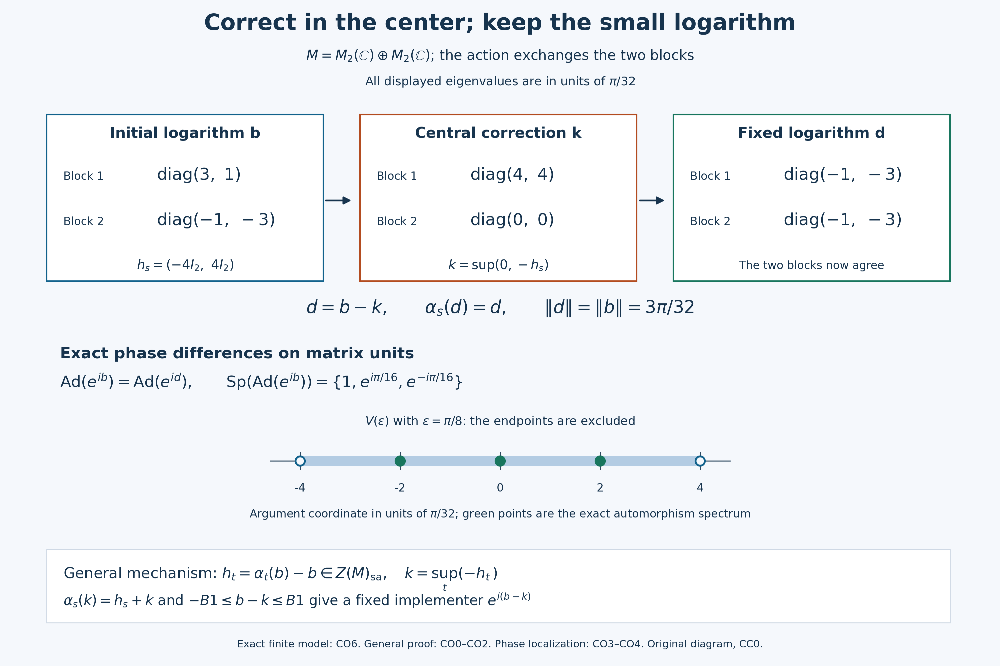

# A central order correction fixes the implementer and retains its bound

An inner automorphism with small Banach-operator spectrum has an implementer with a small principal logarithm. A commuting group can then be removed from that implementer by a central correction. We first prove the order construction that makes this correction possible for an arbitrary group. We next construct the small logarithm by spectral separation. The independent compact convex argument for a general abelian bounded cocycle and the entire earlier P argument remain available as alternative routes.

*Self-checked by the writing AI. Original exposition and illustrations: CC0-1.0 to the extent of rights held; existing component and font terms apply.*

## Full hypotheses and earlier proofs

Throughout, \(M\ne0\) is a concrete von Neumann algebra on an arbitrary complex Hilbert space. The center is \(Z(M)\). A group action \(\alpha:G\to\operatorname{Aut}(M)\) uses multiplicative notation. The central order results impose no topology, commutativity or amenability on \(G\). The separate general noncentral cocycle theorem requires \(G\) abelian. When continuity is mentioned it means point-ultraweak continuity, and cocycle continuity uses the ultraweak topology.

For a unitary \(v\), the notation \(S=\operatorname{Ad}(v)\) denotes a bounded linear isometry of the Banach space \(M\), with isometric inverse. Its \(\operatorname{Sp}(S)\) is the ordinary Banach-operator spectrum; \(\operatorname{Sp}_M(v)\) is the spectrum of the unitary in its algebra. These are not action spectra. We use \(V(r)=\{e^{it}:|t|<r\}\), with angular distance on the circle, and the principal argument with values in \((-\pi,\pi)\) wherever its branch is defined.

The exact complete earlier inputs are CF1 compactness, choice and norm series, CF2 Banach inverses and resolvent continuity, CF4 product compactness, CF6 continuous calculus, CF7 positive order, CF8 arbitrary Hilbert operators, [SF0 commutant-unitary test](OA-FLOW-SF.md#oa-flow.sf.sf0), [SB3 complete unitary Borel calculus](OA-FLOW-SF.md#oa-flow.sf.sb3), [CP6 concrete predual](OA-FLOW-CP.md#oa-flow.cp.6), [NF6 normal positive maps](OA-FLOW-NF.md#oa-flow.nf.6), PC1 corners and arbitrary joins, and PC2 central supports.

SB3 constructs the unitary calculus for an arbitrary cyclic family. PC1–2 apply without restrictions on dimension or cardinality.

## CO0. Construct the bounded order supremum

Begin with any increasing positive net \(0\leq x_i\leq C1\) in \(M\). For \(j\geq i\), the positive difference is between zero and \(C1\). Continuous calculus gives \((x_j-x_i)^2\leq C(x_j-x_i)\), hence

\[
\|(x_j-x_i)\xi\|^2\leq C\langle(x_j-x_i)\xi,\xi\rangle.
\tag{CO1}
\]

For each \(\xi\), the quadratic values have a finite scalar supremum. Once they are close to it, comparison with a common upper index makes both vector differences small by CO1 and the triangle inequality. Thus \(x_i\xi\) is a Cauchy net. To obtain a limit from Hilbert completeness, choose increasing indices after which its errors are below \(2^{-n}\); their sequence converges, and the same errors make the entire net converge to that limit. The vector limits define a linear bounded positive operator of norm at most \(C\). Strong convergence puts it in the weakly closed algebra \(M\). Passing each quadratic order inequality to the limit shows that this operator dominates the net and is below every selfadjoint upper bound. It is its supremum. Adding a scalar reduces uniformly bounded increasing selfadjoint nets to this case.

In an abelian von Neumann algebra \(D\), commuting selfadjoint elements have the pointwise maximum

\[
a\vee b=\tfrac12(a+b+|a-b|).
\tag{CO2}
\]

CF6 identifies the commutative algebra generated by \(a,b\) with continuous scalar functions. If another selfadjoint element of \(D\) bounds both, it commutes with them and the same scalar comparison in the enlarged commutative algebra makes it bound their displayed maximum. This is a least upper bound in \(D\), not a lattice assertion for noncommuting operators.

For any uniformly bounded selfadjoint family in \(D\), finite maxima form a uniformly bounded increasing net. The preceding limit constructs its supremum in \(D\). Addition of a fixed selfadjoint element translates all upper bounds, so commutes with this supremum. A star automorphism is an order isomorphism; applying it and its inverse to the defining upper-bound inequalities proves that it carries a supremum to the supremum of the image family. This particular assertion uses order, without a continuity assumption on the map. Infima follow by changing signs.

## CO1. Solve a central bounded cocycle for any group

Let \(G\) be any group, let \(\alpha\) be an automorphism action, and let the uniformly bounded family \(h_s\in Z(M)_{\rm sa}\) satisfy

\[
h_{st}=h_s+\alpha_s(h_t).
\tag{CO3}
\]

Putting \(s=t=e\) gives \(h_e=0\). Its bounded central transfer is

\[
k=\sup_{t\in G}(-h_t).
\tag{CO4}
\]

It is constructed from maxima over finite subsets containing \(e\); these maxima are positive and uniformly bounded. Since each \(\alpha_s\) preserves the center, CO0 and the bijection \(t\mapsto st\) give

\[
\alpha_s(k)=\sup_t(-\alpha_s(h_t))
=\sup_t(h_s-h_{st})=h_s+k.
\tag{CO5}
\]

Thus \(h_s=\alpha_s(k)-k\). This construction uses central selfadjoint values; it asserts no order supremum or transfer for general noncentral cocycles of nonabelian groups. Neither an invariant mean nor amenability is a premise.

## CO2. Correct the logarithm without increasing its norm

Suppose \(v\) implements an automorphism \(\sigma\) commuting with every \(\alpha_s\), and suppose its principal argument is

\[
v=e^{ib},\qquad b=b^*,\qquad B:=\|b\|<\pi/2.
\tag{CO6}
\]

The equality \(\operatorname{Ad}(\alpha_s(v))=\operatorname{Ad}(v)\) implies \(a_s=v^*\alpha_s(v)\in\mathcal U(Z(M))\): multiply the equality of conjugations on the left by \(v^*\) and on the right by \(\alpha_s(v)\) to get \(a_sx=xa_s\). Conversely a central unitary quotient makes the conjugations equal.

Now \(\alpha_s(v)=va_s\) commutes with \(v\). Their principal arguments commute because continuous calculus commutes with every commuting normal generator. A star automorphism is isometric, by CF6's contractivity applied also to its inverse, and transports continuous calculus by polynomial approximation and uniqueness. Therefore \(\alpha_s(b)\) is the principal argument of \(\alpha_s(v)\). Set

\[
h_s=\alpha_s(b)-b,\qquad \|h_s\|\leq2B<\pi.
\tag{CO7}
\]

Commuting norm-convergent exponential series give \(e^{ih_s}=a_s\). The strict bound \(2B<\pi\) confines \(\operatorname{Sp}(h_s)\) to an injectivity interval of the exponential. The composition rule of CF6 then gives \(h_s=\operatorname{Arg}(a_s)\), which is central and selfadjoint. This is a proved branch statement, not an unrestricted logarithm-of-product rule. Subtracting \(b\) directly proves CO3.

Choose the CO1 transfer and put \(d=b-k\). CO5 yields \(\alpha_s(d)=d\). Because \(h_e=0\), \(k\geq0\). The more useful upper comparison is

\[
-h_t=b-\alpha_t(b)\leq b+B1.
\tag{CO8}
\]

For each finite set of central \(-h_t\), their maximum can be compared with \(b+B1\) in the commutative C\*-algebra generated by those elements and \(b\). Passing the quadratic inequality to the strong limit gives \(k\leq b+B1\). This step is essential: the rough estimate \(\|k\|\leq2B\) alone would not preserve the original logarithm bound. Consequently

\[
-B1\leq b-k\leq b\leq B1.
\tag{CO9}
\]

The output \(u=e^{id}\) is fixed, and \(e^{-ik}\) is central. Continuous spectral mapping gives

\[
u\in\mathcal U(M^\alpha),\qquad
\operatorname{Ad}(u)=\operatorname{Ad}(v),\qquad
\operatorname{Sp}_M(u)\subset\{e^{it}:|t|\leq B\}.
\tag{CO10}
\]

The strict initial bound \(B<\pi/2\) is retained. Point-ultraweak continuity of \(\alpha\), if present, makes \(h_s=\alpha_s(b)-b\) continuous; it is not needed for the order construction.

## CO3. Resolve separated phase corners uniformly

Let \(v\in\mathcal U(M)\) and write \(P(E)=1_E(v)\) for a Borel subset of \(\mathbb T\). SB3 constructs these projections on arbitrary Hilbert spaces and proves their uniqueness. Each unitary in \(M'\) fixes the continuous calculus and therefore the unique Borel calculus; SF0 puts \(P(E)\) in \(M\). If \(E\) is contained in an angular \(r\)-arc about \(e^{i\theta}\), the squared-integral identity SB12 and \(|e^{it}-1|\leq|t|\) give

\[
\|(v-e^{i\theta})P(E)\|\leq r.
\tag{CO11}
\]

The algebra of bounded linear maps on the Banach space \(M\) is complete: a norm-Cauchy sequence has pointwise limits in \(M\), giving a bounded linear limit, and its Cauchy bound passes to a uniform bound on the unit ball. This supplies the unital Banach algebra in which CF2 applies. For \(S=\operatorname{Ad}(v)\), \(\|S\|=\|S^{-1}\|=1\). If \(|\lambda|>1\), invert \(S-\lambda\) by a geometric series in \(S/\lambda\); if \(|\lambda|<1\), factor it as \(S(1-\lambda S^{-1})\). Thus \(\operatorname{Sp}(S)\subset\mathbb T\). For any \(\lambda\) outside this spectrum and any norm-one \(x\in M\),

\[
1\leq\|(S-\lambda)^{-1}\|\,\|(S-\lambda)x\|.
\tag{CO12}
\]

Take a norm-one \(x\in P(E)MP(F)\), with \(E,F\) in \(r\)-arcs about \(z,w\). Right multiplication by \(v\) is isometric and rewrites the defect as \(vx-zw^{-1}xv\). Split it into \((v-z)x+zw^{-1}x(w-v)\) and use CO11:

\[
\|(S-zw^{-1})x\|\leq 2r.
\tag{CO13}
\]

If \(zw^{-1}\) is outside the spectrum, choosing \(2r\|(S-zw^{-1})^{-1}\|<1\) rules out this norm-one corner element. A nonzero corner could always be rescaled, so the corner vanishes. PC2 then makes its two central supports orthogonal.

The compact-set form requires a uniform choice. For nonempty compact \(E,F\) with \(EF^{-1}\cap\operatorname{Sp}(S)=\varnothing\), inverse continuity from CF2 and compactness from CF1 give

\[
L=\max_{\lambda\in EF^{-1}}\|(S-\lambda)^{-1}\|<\infty.
\tag{CO14}
\]

Choose \(r>0\) with \(2Lr<1\). Cover \(E\) and \(F\) by finitely many open \(r\)-arcs whose centers belong to the respective compact sets. Disjointify each cover by subtracting all earlier sets; these are Borel pieces contained in the chosen arcs. A nonzero corner between any two pieces would contradict CO12–CO14. Finite additivity of the spectral projections then gives \(P(E)MP(F)=0\), and PC2 yields

\[
z(P(E))z(P(F))=0.
\tag{CO15}
\]

Empty compact sets give zero projections immediately. This supplies the exact uniform resolvent estimate behind the retained phase-subdivision argument.

## CO4. Localize centrally, then apply the order correction

Assume \(\operatorname{Sp}(S)\subset V(\varepsilon)\), with \(0<\varepsilon<\pi/2\). Choose \(0<\delta<\varepsilon\), so \(\delta+\varepsilon<\pi\). Let \(E\) be the closed \(\delta\)-arc about \(e^{i\theta}\), and \(c=z(P(E))\). For \(\eta>0\), put

\[
F_\eta=\{w:d_{\mathbb T}(w,e^{i\theta})\geq\delta+\varepsilon+\eta\}
\tag{CO16}
\]

The triangle inequality for angular distance shows that every quotient from \(E F_\eta^{-1}\) is at distance at least \(\varepsilon+\eta\) from 1, hence outside \(V(\varepsilon)\). CO3 gives \(cP(F_\eta)=0\). The increasing union of \(F_{1/n}\) is the set of points strictly farther than \(\delta+\varepsilon\). Strong countable additivity of SB3 therefore gives

\[
c\leq P(\{w:d_{\mathbb T}(w,e^{i\theta})\leq\delta+\varepsilon\}).
\tag{CO17}
\]

On a nonzero central corner \(cM\), the spectrum of \(vc\) lies in that closed arc. To verify this as an actual algebra-spectrum statement, for a \(\lambda\) outside the arc use the bounded Borel reciprocal \((z-\lambda)^{-1}\) there, extended by zero elsewhere. Its calculus, compressed by \(c\), is a two-sided inverse for \(vc-\lambda c\). Zero central corners are simply omitted. The intermediate radius is \(\delta+\varepsilon\), not \(\varepsilon\).

Choose finitely many closed \(\delta\)-arcs covering the circle, with centers \(e^{i\theta_j}\) and central supports \(c_j\). Their spectral projections join to 1, so the central supports do too. Define

\[
q_1=c_1,\qquad q_j=c_j\prod_{i<j}(1-c_i),\qquad
w=\sum_j e^{-i\theta_j}q_j.
\tag{CO18}
\]

All \(q_j\) are central and orthogonal. Induction gives \(\sum_{j\leq m}q_j=1-\prod_{j\leq m}(1-c_j)\), whose final product is zero. Thus they sum to 1 and \(w\) is a central unitary. Each \(q_j\leq c_j\) inherits the corner spectral bound, and multiplication by \(e^{-i\theta_j}\) rotates it to the identity. The finitely many corner inverses for a point outside the common arc assemble by summation. Hence \(v_0=vw\) satisfies

\[
\operatorname{Ad}(v_0)=S,\qquad
\operatorname{Sp}_M(v_0)\subset\overline{V(\delta+\varepsilon)}\subset V(2\varepsilon).
\tag{CO19}
\]

If \(0<\varepsilon<\pi/4\), its principal argument \(b\) is defined by continuous calculus on that closed arc and has \(B=\|b\|\leq\delta+\varepsilon<2\varepsilon<\pi/2\). CO2 applies to any group action commuting with \(S\) and produces
\[
u\in\mathcal U(M^\alpha),\qquad
S=\operatorname{Ad}(u),\qquad
\operatorname{Sp}_M(u)\subset
\{e^{it}:|t|\leq\delta+\varepsilon\}\subset V(2\varepsilon).
\]
The final implementer is fixed and retains the spectral bound. No abelian or amenability hypothesis on this commuting group has been used.

## CO5. Keep the separate general abelian cocycle theorem

Here \(G\) is abelian, \(\alpha\) is point-ultraweakly continuous and \(h:G\to M\) is ultraweakly continuous and uniformly norm bounded, satisfying CO3. Its values need not be central or selfadjoint.

First construct weak-star compactness of each radius-\(R\) ball. Evaluation embeds the ball of \(M=(M_*)^*\) into the product of discs \(|z_f|\leq R\|f\|\), indexed by \(f\in M_*\). CF4 proves product compactness. Complex linearity equations define a closed subset; the bounds make its members exactly the bounded linear functionals of norm at most \(R\). CP6 identifies that subset with the ball and its product topology with the ultraweak topology.

Each star automorphism and its inverse is positive and isometric, and preserves existing bounded increasing suprema by order isomorphism. NF6 therefore proves its full ultraweak continuity. Define \(T_sx=\alpha_s(x)-h_s\). CO3 gives \(h_e=0\) and \(T_sT_t=T_{st}\); these affine continuous maps commute because \(G\) does. They permute the orbit of zero. Its closed convex hull \(K\) is compact, nonempty, invariant and contained in the radius-\(C\) ball, where \(C=\sup_s\|h_s\|\).

For a finite list \(s_1,\ldots,s_m\) and \(x\in K\), form

\[
x_N=N^{-m}\sum_{0\leq j_1,\ldots,j_m<N}
 T_{s_1}^{j_1}\cdots T_{s_m}^{j_m}(x)
\tag{CO20}
\]

Affineness makes \(x_N\in K\). Applying \(T_{s_i}\) and telescoping the \(i\)th coordinate leaves the difference of two averages of points of \(K\), each with norm at most \(C\); the prefactor is \(1/N\). Thus \(\|T_{s_i}x_N-x_N\|\leq2C/N\). The closures in \(K\) of all sequence tails have the finite-intersection property, so compactness gives a common tail-cluster point \(y\).

To justify fixedness without sequential compactness, test a predual functional \(f\). The scalar map \(x\mapsto f(T_{s_i}x-x)\) is continuous. If its value at \(y\) were nonzero, a neighborhood would keep its modulus above a positive constant, whereas every sufficiently late \(x_N\) has modulus at most \(2C\|f\|/N\). This contradicts membership of \(y\) in every tail closure. Hence all these scalar values vanish at \(y\), and the predual separates operators, so \(T_{s_i}y=y\). Fixed-point subsets of \(K\) are closed; what we proved for every finite list gives their finite-intersection property. Compactness supplies a common fixed point \(k\), with \(h_s=\alpha_s(k)-k\).

The same finite averaging proves the commuting affine fixed-point statement used below for the orbit of any \(x\): replace \(C\) by its bound \(\|x\|+C\). No black-box fixed-point theorem remains. For selfadjoint values in an invariant von Neumann subalgebra, run the construction there and replace \(k\) by \((k+k^*)/2\); for central values run it in \(Z(M)\). This route does not promise the additional logarithm norm bound, which CO1–CO2 prove separately.

## CO6. Inspect an exact central correction in two blocks

Let \(M=M_2(\mathbb C)\oplus M_2(\mathbb C)\) and let the two-element group exchange the blocks. In units of \(\pi/32\), take

\[
b=(\operatorname{diag}(3,1),\operatorname{diag}(-1,-3))\,\pi/32.
\tag{CO21}
\]

The two block logarithms differ by the central scalar \(4\pi/32\), so their exponentials implement the same matrix conjugation and this inner automorphism commutes with block exchange. Subtracting the logarithms for the nontrivial swap gives

\[
h_s=(-4I_2,4I_2)\,\pi/32,\quad
k=(4I_2,0)\,\pi/32,\quad
d=(\operatorname{diag}(-1,-3),\operatorname{diag}(-1,-3))\,\pi/32.
\tag{CO22}
\]

Here \(k\) is the componentwise maximum of \(0\) and \(-h_s\), exactly the CO1 order supremum. Both blocks of \(d\) agree, its difference from \(b\) is central, and \(\|d\|=\|b\|=3\pi/32\). In fact \(\|k\|=4\pi/32>B\), illustrating why the relative order comparison CO8 matters.

On the eight matrix units of the two summands, \(\operatorname{Ad}(e^{ib})\) has multipliers \(1,1,e^{i\pi/16},e^{-i\pi/16}\) in each block. These exhaust the finite-dimensional Banach spectrum. The three distinct angular coordinates \(-2,0,2\) in units of \(\pi/32\) lie strictly between the excluded endpoints \(-4,4\) of \(V(\pi/8)\). The fixed implementer's two angles \(-1,-3\) lie in \(V(\pi/4)\). The original exact diagram and full [caption](OA-FLOW-L125.md#l125-figure) show these operators and bounds; a finite example does not prove the arbitrary-algebra results.

## Phase localization and abelian fixed-point route

CO3 supplies the uniform compact-set subdivision used below, CO5 supplies the complete commuting affine fixed-point proof, and CO2 proves the precise logarithm branch. In P12–P13 take \(\delta+\varepsilon<\pi\), as in CO4; a radius at least \(\pi\) gives the whole circle and needs no \(V(r)\) notation outside its defined range. Its group hypotheses remain those actually stated, even though the central order route works for a larger group class.

## Phase localization and fixed small-spectrum implementers

A small operator spectrum for an inner automorphism can be converted into a
small spectrum for one of its implementing unitaries.  If the automorphism also
commutes with an abelian action, a central logarithmic correction makes that
implementer fixed by the action.  The proof has two delicate points: the
central spectral pieces must form an actually orthogonal partition, and the
principal logarithm may be made additive only after a strict branch estimate.

Let $M$ be a nonzero von Neumann algebra.  For $0<r<\pi$, write

$$
V(r)=\{e^{it}:|t|<r\}\subset\mathbb T,
\tag{P1}
$$

and let $d_{\mathbb T}$ denote circular angular distance.  For a unitary
$u\in M$, put

$$
p(\theta,r)
=1_{\{z\in\mathbb T:d_{\mathbb T}(z,e^{i\theta})\le r\}}(u).
\tag{P2}
$$

The symbol $\operatorname{Sp}(\operatorname{Ad}(u))$ below denotes the
ordinary Banach-operator spectrum of $\operatorname{Ad}(u)$ on $M$; it is not
the dual-group spectrum of an action.

### Separated phase slices have orthogonal central supports

Let $u\in\mathcal U(M)$ and $\sigma=\operatorname{Ad}(u)$.  Choose
$-\pi\le\theta_1,\theta_2<\pi$ and assume

$$
e^{i(\theta_1-\theta_2)}\notin\operatorname{Sp}(\sigma).
\tag{P3}
$$

We claim that, for some $r>0$, the projections
$p_j=p(\theta_j,r)$ satisfy

$$
z(p_1)z(p_2)=0.
\tag{P4}
$$

Recall the central-support criterion

$$
z(e)z(f)=0
\quad\Longleftrightarrow\quad
eMf=\{0\}
\tag{P5}
$$

for projections $e,f\in M$.  Suppose (P4) failed for every $r>0$.
By (P5), for each $r$ we could choose

$$
x_r\in p(\theta_1,r)Mp(\theta_2,r),
\qquad \lVert x_r\rVert=1.
\tag{P6}
$$

Functional calculus and $|e^{is}-1|\le |s|$ give

$$
\lVert (u-e^{i\theta_1})p(\theta_1,r)\rVert\le r,
\qquad
\lVert (u-e^{i\theta_2})p(\theta_2,r)\rVert\le r.
\tag{P7}
$$

Since $p(\theta_j,r)$ commutes with $u$, equations (P6)–(P7) imply

$$
\begin{aligned}
\lVert \sigma(x_r)-e^{i(\theta_1-\theta_2)}x_r\rVert
&=\lVert ux_r-e^{i(\theta_1-\theta_2)}x_ru\rVert\\
&\le
\lVert (u-e^{i\theta_1})x_r\rVert
+\lVert e^{i(\theta_1-\theta_2)}x_r(u-e^{i\theta_2})\rVert\\
&\le 2r.
\end{aligned}
\tag{P8}
$$

Thus the phase in (P3) belongs to the approximate point spectrum of $\sigma$,
hence to $\operatorname{Sp}(\sigma)$, a contradiction.  Therefore sufficiently
narrow spectral slices have orthogonal central supports.  This proves Lemma
XI.2.19, including the equivalence between central orthogonality and the
vanishing corner used in its proof.

The same argument has a compact-set form that will be useful below.  If closed
sets $E,F\subset\mathbb T$ satisfy

$$
EF^{-1}\cap\operatorname{Sp}(\sigma)=\varnothing,
\tag{P9}
$$

then finite subdivision into narrow arcs and (P4) give

$$
z(1_E(u))z(1_F(u))=0.
\tag{P10}
$$

### Central phase localization produces a small implementer

Assume now that

$$
\operatorname{Sp}(\sigma)\subset V(\varepsilon),
\qquad 0<\varepsilon<\frac{\pi}{2}.
\tag{P11}
$$

Fix $\theta$ and $\delta>0$.  Compare the closed $\delta$-arc about
$e^{i\theta}$ with points at angular distance at least
$\delta+\varepsilon+\eta$, where $\eta>0$.  Every quotient of a point in the
first set by a point in the second lies outside $V(\varepsilon)$.  Equations
(P9)–(P10), followed by $\eta\downarrow0$, yield

$$
c(\theta,\delta):=z(p(\theta,\delta))
\le p(\theta,\delta+\varepsilon).
\tag{P12}
$$

Consequently the spectrum of $u$ on the central corner
$c(\theta,\delta)M$ lies in the arc of radius
$\delta+\varepsilon$ about $e^{i\theta}$:

$$
\operatorname{Sp}_{c(\theta,\delta)M}
\bigl(uc(\theta,\delta)\bigr)
\subset e^{i\theta}\overline{V(\delta+\varepsilon)}.
\tag{P13}
$$

The term $\delta$ in (P13) is essential; it cannot be dropped from this
intermediate estimate.

Choose $0<\delta<\varepsilon$ with
$\delta+\varepsilon<\pi$, and choose finitely many phases
$\theta_1,\ldots,\theta_m$ whose closed $\delta$-arcs cover $\mathbb T$.
Put

$$
c_j=c(\theta_j,\delta).
\tag{P14}
$$

Since the projections $p(\theta_j,\delta)$ join to one, so do their central
supports:

$$
\bigvee_{j=1}^m c_j=1.
\tag{P15}
$$

Turn this central cover into a disjoint partition by defining

$$
q_1=c_1,
\qquad
q_j=c_j\left(1-\sum_{k<j}q_k\right)
=c_j\prod_{k<j}(1-c_k)
\quad(2\le j\le m).
\tag{P16}
$$

Then the $q_j$ are central, mutually orthogonal, and

$$
\sum_{j=1}^m q_j=1.
\tag{P17}
$$

Removing only the immediately preceding $q_{j-1}$ would not prove pairwise
orthogonality; (P16) removes every earlier piece.

Define central and ordinary unitaries

$$
w=\sum_{j=1}^m e^{-i\theta_j}q_j,
\qquad
v=uw.
\tag{P18}
$$

Because $w\in\mathcal U(Z(M))$,

$$
\operatorname{Ad}(v)=\operatorname{Ad}(u)=\sigma.
\tag{P19}
$$

On $q_jM$, equations (P13) and (P18) rotate the relevant arc to the identity:

$$
\operatorname{Sp}_{q_jM}(vq_j)
\subset\overline{V(\delta+\varepsilon)}
\subset V(2\varepsilon).
\tag{P20}
$$

There are only finitely many central summands, so

$$
\boxed{
\sigma=\operatorname{Ad}(v),
\qquad
\operatorname{Sp}_M(v)\subset V(2\varepsilon).}
\tag{P21}
$$

This is Lemma XI.2.20 with the corrected central partition and the full
$\delta+\varepsilon$ localization bound.

### Additive cocycles and coboundaries

Let $G$ be a locally compact group and let
$\alpha:G\to\operatorname{Aut}(M)$ be point-ultraweakly continuous.  In
multiplicative notation, an **additive one-cocycle** is an ultraweakly
continuous map $h:G\to M$ satisfying

$$
h(st)=h(s)+\alpha_s(h(t))
\qquad(s,t\in G).
\tag{P22}
$$

It is a **coboundary** if one element $k\in M$ satisfies

$$
h(s)=\alpha_s(k)-k
\qquad(s\in G).
\tag{P23}
$$

These definitions make sense for nonabelian $G$.  The bounded-cocycle result
proved next uses the standing abelian hypothesis, because its affine maps must
commute.

### Bounded additive cocycles for abelian actions are coboundaries

Assume throughout this section that $G$ is abelian, and suppose

$$
C:=\sup_{s\in G}\lVert h(s)\rVert<\infty.
\tag{P24}
$$

For $s\in G$, define the ultraweakly continuous affine isometry

$$
T_s(x)=\alpha_s(x)-h(s).
\tag{P25}
$$

The cocycle identity gives

$$
T_sT_t(x)
=\alpha_{st}(x)-\alpha_s(h(t))-h(s)
=T_{st}(x).
\tag{P26}
$$

Thus the $T_s$ commute.  The orbit of any $x\in M$ is norm bounded, since

$$
\lVert T_s(x)\rVert\le\lVert x\rVert+C.
\tag{P27}
$$

Let $K$ be its ultraweakly closed convex hull.  The closed ball of $M$, viewed
as the dual of its predual, is ultraweakly compact; hence $K$ is a nonempty
compact convex set.  Moreover

$$
T_s\{T_t(x):t\in G\}=\{T_r(x):r\in G\},
\tag{P28}
$$

so every $T_s$ preserves $K$.  The Markov–Kakutani fixed-point theorem supplies
a common fixed point $k\in K$:

$$
T_s(k)=k
\quad\Longleftrightarrow\quad
h(s)=\alpha_s(k)-k.
\tag{P29}
$$

Therefore every norm-bounded additive cocycle for the standing locally compact
abelian action is a coboundary.  If the cocycle takes selfadjoint values in an
$\alpha$-invariant von Neumann subalgebra $A$, the argument may be run in $A$
and $k$ replaced by $(k+k^*)/2$.  In particular, a central selfadjoint cocycle
has a central selfadjoint transfer element.

### A strict logarithm branch turns the central unitary cocycle additive

Return to the locally compact abelian covariant system $(M,G,\alpha)$.  Let
$\sigma\in\operatorname{Int}(M)$ commute with every $\alpha_s$, and assume

$$
\operatorname{Sp}(\sigma)\subset V(\varepsilon),
\qquad 0<\varepsilon<\frac{\pi}{4}.
\tag{P30}
$$

By (P21), choose $v\in\mathcal U(M)$ such that

$$
\sigma=\operatorname{Ad}(v),
\qquad
\operatorname{Sp}_M(v)\subset V(2\varepsilon).
\tag{P31}
$$

Since $\sigma$ commutes with $\alpha_s$,

$$
\operatorname{Ad}(v)
=\alpha_s\operatorname{Ad}(v)\alpha_s^{-1}
=\operatorname{Ad}(\alpha_s(v)).
\tag{P32}
$$

Two unitaries implement the same inner automorphism exactly when their quotient
is central.  Hence

$$
a_s=v^*\alpha_s(v)\in\mathcal U(Z(M)),
\qquad
a_{st}=a_s\alpha_s(a_t).
\tag{P33}
$$

Let $b=\operatorname{Arg}(v)$ on the principal branch.  Compactness of
$\operatorname{Sp}_M(v)$ inside the open arc in (P31) gives

$$
b=b^*,
\qquad
v=e^{ib},
\qquad
\lVert b\rVert<2\varepsilon.
\tag{P34}
$$

Equation (P33) says $\alpha_s(v)=va_s$, so $v$ and $\alpha_s(v)$ commute.
Their principal arguments $b$ and $\alpha_s(b)$ therefore commute.  Put

$$
d_s=\alpha_s(b)-b.
\tag{P35}
$$

Then

$$
\lVert d_s\rVert<4\varepsilon<\pi,
\qquad
a_s=e^{-ib}e^{i\alpha_s(b)}=e^{id_s}.
\tag{P36}
$$

The strict norm bound keeps the spectrum of $d_s$ inside the injectivity
interval of the exponential.  Consequently

$$
h(s):=\operatorname{Arg}(a_s)=d_s=\alpha_s(b)-b.
\tag{P37}
$$

Because $a_s$ is central, functional calculus makes $h(s)$ central and
selfadjoint.  Equation (P37), rather than a false global rule that logarithms
turn arbitrary products into sums, gives directly

$$
h(st)
=\alpha_{st}(b)-b
=h(s)+\alpha_s(h(t)).
\tag{P38}
$$

Thus $h:G\to Z(M)_{\mathrm{sa}}$ is an ultraweakly continuous additive
cocycle, bounded by $4\varepsilon$.

### A central correction makes the implementer fixed

Apply (P29) inside the abelian von Neumann algebra $Z(M)$.  There is a central
selfadjoint $k$ such that

$$
h(s)=\alpha_s(k)-k
\qquad(s\in G).
\tag{P39}
$$

Set

$$
w=e^{ik}\in\mathcal U(Z(M)),
\qquad
u=vw^*.
\tag{P40}
$$

The correction is central, so

$$
\operatorname{Ad}(u)=\operatorname{Ad}(v)=\sigma.
\tag{P41}
$$

Using $\alpha_s(v)=va_s$, (P37), and (P39), we obtain

$$
\begin{aligned}
\alpha_s(u)
&=va_s e^{-i\alpha_s(k)}\\
&=v e^{i(\alpha_s(k)-k)}e^{-i\alpha_s(k)}\\
&=ve^{-ik}=u.
\end{aligned}
\tag{P42}
$$

Therefore $u\in\mathcal U(M^\alpha)$, and Lemma XI.2.22(ii) is proved:

$$
\boxed{
\begin{gathered}
\sigma\in\operatorname{Int}(M),
\qquad \sigma\alpha_s=\alpha_s\sigma\quad(s\in G),\\
\operatorname{Sp}(\sigma)\subset V(\varepsilon),
\qquad 0<\varepsilon<\dfrac{\pi}{4},\\
\Longrightarrow\quad
\sigma=\operatorname{Ad}(u)
\text{ for some }u\in\mathcal U(M^\alpha).
\end{gathered}}
\tag{P43}
$$

**Problem.** Why must the bounded-cocycle theorem be applied inside $Z(M)$
rather than merely inside $M$ in the last step?

**Solution.** A transfer element obtained in $M$ need not be central.  Its
exponential could then change the implemented inner automorphism when it is
multiplied into $v$.  Since (P37) takes values in the invariant algebra $Z(M)$,
the fixed-point proof runs there and supplies $k\in Z(M)$.  Thus $w=e^{ik}$ is
central, which gives (P41), while (P39) gives the fixedness calculation (P42).
$\square$

Further reading: Takesaki, *Theory of Operator Algebras II*, Lemmas
XI.2.19–XI.2.22.  Equations (P3)–(P10) prove central
orthogonality, (P11)–(P21) construct the corrected small-spectrum implementer,
(P22)–(P29) establish the additive-cocycle fixed-point theorem for the standing
abelian action, and (P30)–(P43) give the branch-controlled central logarithm and
fixed implementer.

The general noncentral bounded-cocycle theorem above and the P24–P29 argument require an abelian group. In the innerness application the cocycle is central selfadjoint, so CO1–CO4 give the additional arbitrary-group route and the preserved small-spectrum bound.

## Further reading

Masamichi Takesaki, *Theory of Operator Algebras II*, Lemmas XI.2.19–XI.2.22, pp. 343–345; [bibliographic record](https://doi.org/10.1007/978-3-662-10451-4).

## Central order correction with the exact logarithm bound

The algebra is $M_2(\mathbb C)\oplus M_2(\mathbb C)$ and the nontrivial action exchanges its blocks. Every matrix entry in the top panel is in units of $\pi/32$. CO6 gives $b=(\operatorname{diag}(3,1),\operatorname{diag}(-1,-3))\pi/32$, $h_s=(-4I_2,4I_2)\pi/32$, the central transfer $k=(4I_2,0)\pi/32$, and $d=b-k=(\operatorname{diag}(-1,-3),\operatorname{diag}(-1,-3))\pi/32$. The two corrected blocks agree, so $d$ is fixed; centrality of $b-d$ leaves the implemented automorphism unchanged.

The lower angular axis shows exactly the three spectrum arguments $-2,0,2$ in the same units, strictly between the excluded endpoints $-4,4$ of $V(\pi/8)$. It is an argument coordinate, not a chord or a numerical spectral approximation. Both logarithms have norm $3\pi/32$. CO0–CO2 prove the general central order and norm-preserving correction for arbitrary group actions; CO3–CO4 prove the small-spectrum localization. The finite example illustrates these mechanisms without replacing their proofs.

All block entries and all eight matrix-unit phase differences are checked exactly in the reproducible renderer. Mathematical source context: Takesaki, *Theory of Operator Algebras II*, Lemmas XI.2.19–XI.2.22; CO0–CO4 prove the general central-order route. Original expression and diagram are CC0-1.0 to the extent of rights held; the retained DejaVu font notice has separate terms.

Exact local proofs: [CO0 order suprema](OA-FLOW-L125.md#co0), [CO1 central cocycles](OA-FLOW-L125.md#co1), [CO2 the preserved logarithm bound](OA-FLOW-L125.md#co2), [CO3 resolvent separation](OA-FLOW-L125.md#co3), [CO4 phase localization](OA-FLOW-L125.md#co4), [CO5 the distinct abelian route](OA-FLOW-L125.md#co5), and [CO6 the exact model](OA-FLOW-L125.md#co6). [Renderer](../assets/fixed-implementer-central-order/render_central_order.py), [exact data](../assets/fixed-implementer-central-order/figure/central-order-data.json), [editable SVG](../assets/fixed-implementer-central-order/figure/central-order.svg), and [font terms](../assets/fixed-implementer-central-order/figure/FONT-LICENSE.txt) are preserved.
