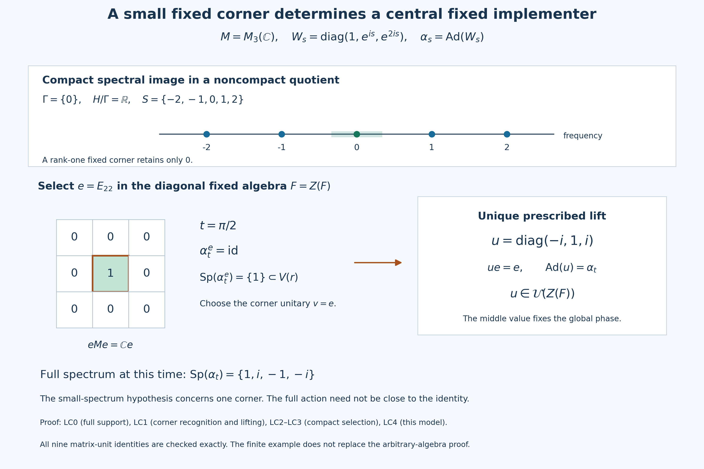

# Compact spectral images and central fixed implementers

A small cyclic spectrum in one fixed corner is enough to recognize a central fixed implementer. We first prove this local criterion, using the centralizer theorem inside the corner and then lifting the prescribed implementer. Compactness of the spectral image supplies the required corner. A second proof uses full-corner invariance of the Connes spectrum to establish global innerness first.

*Self-checked by the writing AI.*

Let $M\ne0$ be a concrete von Neumann algebra on an arbitrary Hilbert space, let $G$ be a locally compact Hausdorff abelian group, and let $\alpha:G\to\operatorname{Aut}(M)$ be a normal point-ultraweakly continuous action. Suppose $Z(M)^\alpha=\mathbb C1$. Write $H=\widehat G$, $F=M^\alpha$, $D=Z(F)$ and $\Gamma=\Gamma(\alpha)$. Frequencies have the positive L115 convention. For $0<r<\pi$ put $V(r)=\{e^{i\theta}:|\theta|<r\}$. An ordinary operator spectrum on a corner is distinguished throughout from the action spectrum in $H$.

The earlier proofs used below are [Projection comparison and the countably decomposable type III case, PC2 and PC4](OA-FLOW-PC.md#oa-flow.pc.2) for central supports and corner centers; [Lifting innerness and cocycles from a full corner](OA-FLOW-L117.md#oa-flow.fullcorner.inner) for the unique prescribed lift; [The dual-center kernel through central overlap](OA-FLOW-L115.md#oa-flow.connes.absorption) for absorption and the subgroup property; [Connes spectrum through fixed corners](OA-FLOW-GCC.md#oa-flow.gcc.setting) for reduced actions and their intersection; and [Mutual corner approximation through a family of spectral bridges](OA-FLOW-L121.md#oa-flow.l121.sc0) for closed thickenings and their directedness. The operator-spectrum formula in [The spectrum of one action operator](OA-FLOW-L89.md#oa-flow.opsp.formula) uses the specified-predual hypotheses of [Inputs for action frequencies and norm continuity](OA-FLOW-AF.md#af-0), supplied by [General normal actions: predual continuity and the integrated maps](OA-FLOW-AT.md#oa-flow.at.3) and the reduced-action setting just cited. [Small fixed corners, inner spectra and annihilating times](OA-FLOW-L122.md#oa-flow.l122.directannihilator) supplies the reverse annihilator inclusion. [Compact topology and the Hilbert tensor construction, H0](OA-FLOW-TOPOLOGY.md#l138-h0) supplies compact-neighborhood shrinking, compact images and finite products. The innerness criterion is proved in [Read an inner implementer from a circle eigenunitary, CE0–CE5](OA-FLOW-L124.md#ce0), with its conclusion at [Read an inner implementer from a circle eigenunitary — CE5](OA-FLOW-L124.md#ce5). The fixed small-spectrum theorem is proved in [A central order correction fixes the implementer and retains its bound, CO0–CO4](OA-FLOW-L125.md#co0), with the precise bound at [A central order correction fixes the implementer and retains its bound — CO4](OA-FLOW-L125.md#co4).

## LC0. Central ergodicity passes to every nonzero fixed corner

Let $0\ne e\in\operatorname{Proj}(F)$. Its ambient central support is the least central projection dominating it. Each $\alpha_s$ permutes such projections, so

\[
\alpha_s(z_M(e))=z_M(\alpha_s(e))=z_M(e).
\tag{LC1}
\]
Central ergodicity makes this nonzero invariant central projection equal to $1$. [Projection comparison and the countably decomposable type III case — PC4](OA-FLOW-PC.md#oa-flow.pc.4) now supplies the bijection

\[
Z(M)\longrightarrow Z(eMe),\qquad z\longmapsto ze.
\tag{LC2}
\]
It is equivariant because $e$ is fixed. If $ze$ is fixed, then $(\alpha_s(z)-z)e=0$ for every $s$; injectivity in (LC2) makes $z$ fixed. Thus

\[
Z(eMe)^{\alpha^e}=\mathbb Ce.
\tag{LC3}
\]
The corner action is normal and point-ultraweakly continuous by the complete compression and predual argument in [Connes spectrum through fixed corners — GCC SETTING](OA-FLOW-GCC.md#oa-flow.gcc.setting). Neither $e\in Z(F)$ nor $e\in Z(M)$ was required.

## LC1. A small cyclic spectrum supplies a central fixed lift

Fix $t\in G$ and put $\sigma=\alpha_t$. Suppose there exist a nonzero fixed projection $e$ and a radius $0<r<\pi/4$ with

\[
\operatorname{Sp}_{\mathcal L(eMe)}(\sigma^e)\subset V(r).
\tag{LC4}
\]
The discrete cyclic action $n\mapsto(\sigma^e)^n$ meets the actual dual-Banach hypotheses: its maps are normal isometries and its predual orbit maps are continuous because $\mathbb Z$ is discrete. Applying [The spectrum of one action operator](OA-FLOW-L89.md#oa-flow.opsp.formula) at the generator $1$ identifies its action spectrum in $\widehat{\mathbb Z}=\mathbb T$ with the operator spectrum in (LC4); the former is closed, so taking its closure changes nothing. [The dual-center kernel through central overlap — L115 SUBGROUP](OA-FLOW-L115.md#oa-flow.connes.subgroup) makes its Connes spectrum a subgroup contained in this spectrum.

No subgroup of $\mathbb T$ except $\{1\}$ is contained in $\{z:\operatorname{Re}z>0\}$. Indeed, for $z\ne1$ choose a principal argument of absolute value $a\in(0,\pi]$ and replace $z$ by $z^{-1}$ if needed. If $a\ge\pi/2$, $z$ already has nonpositive real part. Otherwise, the least integer $n$ with $na\ge\pi/2$ has $\pi/2\le na<\pi/2+a<\pi$, so $z^n$ has nonpositive real part. Consequently

\[
\Gamma(\sigma^e)=\{1\}.
\tag{LC5}
\]
Every $\alpha_s^e$ commutes with $\sigma^e$. By (LC3), any element of $Z(eMe)$ fixed by the full automorphism centralizer of $\sigma^e$ is scalar. The criterion in [Read an inner implementer from a circle eigenunitary — L124 criterion](OA-FLOW-L124.md#ce5) therefore applies to the nonzero algebra $eMe$ itself and makes $\sigma^e$ inner. The fixed small-spectrum theorem in [A central order correction fixes the implementer and retains its bound — L125 fixed small-spectrum theorem](OA-FLOW-L125.md#co4), applied to this inner automorphism and its commuting reduced action, gives

\[
v\in\mathcal U(eFe),\qquad \sigma^e=\operatorname{Ad}v,
\qquad \operatorname{Sp}_{eMe}(v)\subset V(2r).
\tag{LC6}
\]
Because $e$ is fixed, $(eMe)^{\alpha^e}=eFe$: a fixed element of $eMe$ belongs to $F$, and every $exe$ with $x\in F$ is fixed. Thus the unitary in (LC6) is fixed by every reduced automorphism, without assuming $e\in Z(F)$.
The spectral bound is recorded although the remaining lift only needs fixedness. LC0 gives $z_M(e)=1$, and $\sigma(e)=e$. [Lifting innerness and cocycles from a full corner — L117 INNER](OA-FLOW-L117.md#oa-flow.fullcorner.inner) thus gives the unique unitary $u\in M$ with

\[
\sigma=\operatorname{Ad}u,\qquad ue=eu=v.
\tag{LC7}
\]
For any $s\in G$, commutation of the actions makes $\alpha_s(u)$ another implementer of $\sigma$, and $\alpha_s(u)e=\alpha_s(ue)=v$. Uniqueness in (LC7) yields $\alpha_s(u)=u$. Thus $u\in F$. Since $\sigma=\alpha_t$ fixes $F$ pointwise, $ux=xu$ for every $x\in F$. We have proved the local criterion

\[
\boxed{\text{(LC4) for one nonzero fixed corner}
\quad\Longrightarrow\quad
\alpha_t=\operatorname{Ad}u\text{ for some }u\in\mathcal U(Z(F)).}
\tag{LC8}
\]
This argument does not use the global equality $\Gamma(\sigma)=\Gamma(\sigma^e)$ or a prior assertion that $\sigma$ is inner. It constructs the required global innerness and fixedness together from the corner.

## LC2. Compact saturated thickenings select a corner

Now assume precisely

\[
S=\pi(\operatorname{Sp}(\alpha))\text{ is compact},
\qquad \pi:H\longrightarrow H/\Gamma.
\tag{LC9}
\]
The whole quotient is not assumed compact. Here $\Gamma$ is closed by [The dual-center kernel through central overlap — L115 SUBGROUP](OA-FLOW-L115.md#oa-flow.connes.subgroup). The quotient map is open, since $\pi^{-1}\pi(O)=\bigcup_{\gamma\in\Gamma}(O+\gamma)$ is open for every open $O$. The quotient is Hausdorff: if $x-y\notin\Gamma$, choose an identity neighborhood $W$ with $x-y+W-W$ disjoint from the closed set $\Gamma$; then $\pi(x+W)$ and $\pi(y+W)$ are disjoint open neighborhoods. The induced addition and inverse are continuous by their lifts and openness of $\pi$; for addition the product quotient map is open on basic rectangles, so the same quotient-topology test applies.

For every $0\ne e\in\operatorname{Proj}(D)$, every fixed subcorner of $eMe$ is also fixed in $M$, whence $\Gamma\subset\Gamma(\alpha^e)$. [The dual-center kernel through central overlap — L115 ABSORPTION](OA-FLOW-L115.md#oa-flow.connes.absorption) applied inside $eMe$ gives

\[
\operatorname{Sp}(\alpha^e)+\Gamma=\operatorname{Sp}(\alpha^e).
\tag{LC10}
\]
Let $U$ range over compact neighborhoods of $0$ in $H$ and set

\[
A_{e,U}=\operatorname{Sp}(\alpha^e)+U,
\qquad K_{e,U}=\pi(A_{e,U}).
\tag{LC11}
\]
[Mutual corner approximation through a family of spectral bridges — L121 SC0](OA-FLOW-L121.md#oa-flow.l121.sc0) proves $A_{e,U}$ closed. Equation (LC10) makes it saturated, so $\pi^{-1}(K_{e,U})=A_{e,U}$, and the quotient topology makes $K_{e,U}$ closed. [Connes spectrum through fixed corners — GCC SETTING](OA-FLOW-GCC.md#oa-flow.gcc.setting)'s restricted filters show $\operatorname{Sp}(\alpha^e)\subset\operatorname{Sp}(\alpha)$: an annihilator of the whole action also annihilates its restriction, and taking the hull reverses ideal inclusion. Hence

\[
K_{e,U}\subset S+\pi(U).
\tag{LC12}
\]
[Compact topology and the Hilbert tensor construction — H0](OA-FLOW-TOPOLOGY.md#l138-h0) gives compactness of the finite product $S\times\pi(U)$ and its continuous sum image. A closed subset of that compact set is compact by the open-cover definition. Thus every $K_{e,U}$ is compact. It is nonempty and contains the zero coset, since the unit of every nonzero corner has zero frequency.

[Mutual corner approximation through a family of spectral bridges — L121 DIRECTED.THICKENING](OA-FLOW-L121.md#oa-flow.directed.thickening) proves downward directedness when all identity neighborhoods are allowed. Given two members with compact neighborhoods, apply that theorem to find a refining member $\operatorname{Sp}(\alpha^f)+W$. [Compact topology and the Hilbert tensor construction — H0](OA-FLOW-TOPOLOGY.md#l138-h0) supplies a compact identity neighborhood $U'\subset W$. Then $A_{f,U'}$ still refines both. Thus the compact-neighborhood family, and its image family, are downward directed.

[Connes spectrum through fixed corners — GCC INTERSECTION](OA-FLOW-GCC.md#oa-flow.gcc.intersection) states that the intersection of all central fixed-corner spectra is $\Gamma$. If $p\notin\Gamma$, choose such a corner with $p\notin\operatorname{Sp}(\alpha^e)$. Closedness gives an identity neighborhood $W$ with $p-W$ disjoint from that spectrum; shrink to a compact identity neighborhood $U\subset W$. Then $p\notin A_{e,U}$. Conversely (LC10) and zero frequency imply $\Gamma\subset A_{e,U}$ for all pairs. Thus

\[
\bigcap_{e,U} A_{e,U}=\Gamma,
\qquad
\pi^{-1}\!\left(\bigcap_{e,U}K_{e,U}\right)=\Gamma,
\qquad
\bigcap_{e,U}K_{e,U}=\{0+\Gamma\}.
\tag{LC13}
\]
The middle equality uses saturation and inverse images; it is not an unqualified interchange of an image with an infinite intersection.

For every open neighborhood $O$ of the zero coset, some $K_{e,U}$ is contained in $O$. To prove this, fix one member $K_0$. If none were contained in $O$, the closed subsets $K_0\cap K\cap O^c$ of the compact space $K_0$ would have the finite-intersection property: a common directed refinement of $K_0,K_1,\ldots,K_n$ has a point outside $O$. Their full intersection would be nonempty, since otherwise their open complements would have a finite subcover. This contradicts (LC13). We conclude

\[
\boxed{\text{For every }O\ni0+\Gamma\text{ open, some }0\ne e\in\operatorname{Proj}(D)
\text{ satisfies }\pi(\operatorname{Sp}(\alpha^e))\subset O.}
\tag{LC14}
\]

## LC3. The annihilator is exactly the centrally implemented times

Take $t\in\Gamma^\perp$. The continuous character $p\mapsto(t,p)$ is constant on $\Gamma$-cosets, so the quotient topology supplies a continuous character $\chi_t:H/\Gamma\to\mathbb T$. Choose radii

\[
0<a<b<\pi/4,
\qquad O=\chi_t^{-1}(V(a)).
\tag{LC15}
\]
LC2 supplies a nonzero central fixed projection $e$ whose action spectrum evaluates inside $V(a)$. The reduced action has the actual concrete predual by [Connes spectrum through fixed corners — GCC SETTING](OA-FLOW-GCC.md#oa-flow.gcc.setting), and [General normal actions: predual continuity and the integrated maps — AT1–3](OA-FLOW-AT.md#oa-flow.at.3) give norm-continuous predual orbits. Thus the full specified-dual hypotheses of [The spectrum of one action operator](OA-FLOW-L89.md#oa-flow.opsp.formula) hold, with both-sign power bounds equal to one. Its formula gives

\[
\operatorname{Sp}_{\mathcal L(eMe)}(\alpha_t^e)
=\overline{\{(t,p):p\in\operatorname{Sp}(\alpha^e)\}}
\subset\{e^{i\theta}:|\theta|\le a\}
\subset V(b).
\tag{LC16}
\]
The strict gap $a<b$ accounts explicitly for the closure. Applying LC1 with $r=b$ yields a central fixed implementer. Conversely, [Small fixed corners, inner spectra and annihilating times — L122 DIRECTANNIHILATOR](OA-FLOW-L122.md#oa-flow.l122.directannihilator) applies to any globally fixed implementing unitary, so it applies in particular to one in $Z(F)$. Therefore

\[
\boxed{\Gamma(\alpha)^\perp
=\{t\in G:\alpha_t=\operatorname{Ad}u
\text{ for some }u\in\mathcal U(Z(M^\alpha))\}.}
\tag{LC17}
\]
Only LC2 uses compactness of $S$; the one-corner recognition lemma LC1 does not. No topology of a parameterized choice $t\mapsto u_t$ is asserted: (LC17) is a pointwise existence statement. Constructing an actual continuous cocycle is a later theorem.

## LC4. An exact finite example and the meaning of the chosen phase

Let $M=M_3(\mathbb C)$, $G=\mathbb R$, and

\[
W_s=\operatorname{diag}(1,e^{is},e^{2is}),\qquad
\alpha_s=\operatorname{Ad}(W_s),\qquad e=E_{22}.
\tag{LC18}
\]
The center of $M$ is scalar, so the action is centrally ergodic. Entrywise,
$\alpha_s(E_{ij})=e^{i(\lambda_i-\lambda_j)s}E_{ij}$ for $(\lambda_1,\lambda_2,\lambda_3)=(0,1,2)$. The fixed algebra is exactly the diagonal matrices: every off-diagonal entry has a nonzero integer frequency and is moved by some $s$. Each nonzero scalar corner $E_{ii}ME_{ii}$ is fixed pointwise. Zero belongs to every fixed-corner spectrum, while that scalar corner has spectrum $\{0\}$; hence $\Gamma=\{0\}$. The finite action spectrum is $\{-2,-1,0,1,2\}$: Fourier filtering multiplies each matrix unit by the transform at its displayed frequency, and the scalar frequency-separating tests in [Connes spectrum through fixed corners — GCC SETTING](OA-FLOW-GCC.md#oa-flow.gcc.setting) identify precisely these five values. Thus $S$ is compact although $H/\Gamma=\mathbb R$ is not.

At $t=\pi/2$, the corner automorphism is the identity and its chosen corner implementer is $v=e$. The unique lift prescribed by (LC7) is

\[
u=e^{-it}W_t=\operatorname{diag}(-i,1,i),
\quad ue=e,
\quad\operatorname{Ad}u=\alpha_t,
\quad u\in\mathcal U(Z(F)).
\tag{LC19}
\]
The scalar phase makes the middle entry exactly one; $W_t$ by itself has middle entry $i$ and fails that prescribed value. For all nine matrix units, conjugation by $u$ has the same factor $e^{i(\lambda_i-\lambda_j)t}$ as conjugation by $W_t$. The corner operator spectrum is $\{1\}$ and lies in every $V(r)$. The full automorphism still has spectrum $\{1,i,-1,-i\}$, showing why the theorem searches for a small corner rather than requiring a small full spectrum.

## Reading and the strict arc bound

The mathematical antecedent is Takesaki, *Theory of Operator Algebras II*, Theorem XI.2.9(iii), with hypotheses on page 336, the statement on page 337 and the proof on page 345. The related centralizer criterion is Lemma XI.2.18. Both proofs in this lesson use the full earlier programme results linked above.

The second proof makes the tolerance explicit: $0<\varepsilon<1-1/\sqrt2$ and a strictly larger open-arc radius are needed when passing from a closed spectral estimate to an open arc. The two-radius formulation LC15–LC16 expresses the same distinction without an inverse-cosine constant.

Original lesson exposition, model, figure, caption and renderer: CC0-1.0 to the extent of rights held. DejaVu glyph components retain the accompanying font terms.

## A prescribed corner fixes the global phase

In LC4's exact model, the action on $M_3(\mathbb C)$ has frequencies $\{-2,-1,0,1,2\}$ and Connes spectrum $\{0\}$. Its compact spectral image lies in the noncompact quotient $\mathbb R$. The upper line is the real frequency axis; its points are exact spectral values. The pale interval around zero only illustrates a neighborhood thickening of the rank-one corner spectrum. Its endpoints and length are schematic and are not a bound used in the theorem.

The selected projection is $e=E_{22}$ in the diagonal fixed algebra. At $t=\pi/2$, the reduced automorphism is the identity on $eMe=\mathbb Ce$, so its operator spectrum is $\{1\}$ and $v=e$ is a fixed corner implementer. LC0 gives full ambient central support; LC1 and the earlier full-corner theorem give a unique global implementer with this prescribed value. Here it is exactly $u=\operatorname{diag}(-i,1,i)$, not the unnormalized $W_t=\operatorname{diag}(1,i,-1)$ whose middle value is $i$. The arrow denotes lifting a prescribed implementer, not a linear map on all corner elements. The fixed algebra is abelian in this example, so its center is itself.

The full automorphism's spectrum is $\{1,i,-1,-i\}$; the small arc condition is imposed on the selected corner. All nine matrix-unit conjugation identities and $ue=e$ are checked symbolically in the renderer. LC0–LC3 contain the full arbitrary-algebra proof; the diagram is a finite example. The reader must not interpret pointwise implementer existence as a continuous choice of implementers over the group.

The model and diagram accompany the complete proofs [LC0](#lc0), [LC1](#lc1), [LC2](#lc2), [LC3](#lc3) and [LC4](#lc4). [Renderer](../assets/compact-spectral-image-fixed-implementers/render_corner_lift.py), [exact model data](../assets/compact-spectral-image-fixed-implementers/figure/corner-lift-data.json), [editable SVG](../assets/compact-spectral-image-fixed-implementers/figure/corner-lift.svg) and font terms.

## A second proof through full-corner Connes equality

We now prove the same conclusion by first transferring the trivial cyclic Connes spectrum from the chosen corner to the whole algebra. This route uses the full-corner theorem in Cancel an inner subgroup, then detect the exact spectrum, followed by the same innerness criterion and fixed small-spectrum theorem.

For a centrally ergodic action, a time annihilating the Connes spectrum is not
merely inner when the reduced spectrum is compact modulo the Connes spectrum.
It has an implementing unitary in the center of the fixed algebra.  The proof
first squeezes one central fixed corner into a small phase arc, then combines
cyclic Connes-spectrum rigidity, a fixed-implementer correction, and unique
full-corner lifting.

Throughout, $G$ is a locally compact Hausdorff abelian group,
$H=\widehat G$, $M$ is a nonzero von Neumann algebra, and
$\alpha:G\to\operatorname{Aut}(M)$ is point-ultraweakly continuous and
centrally ergodic.  Put

$$
\Gamma=\Gamma(\alpha),
\qquad
D=Z(M^\alpha),
\qquad
\pi:H\longrightarrow H/\Gamma.
\tag{Q1}
$$

Assume the precise compactness hypothesis

$$
S:=\pi(\operatorname{Sp}(\alpha))
\text{ is compact in }H/\Gamma.
\tag{Q2}
$$

The whole quotient $H/\Gamma$ need not be compact.  No separability,
sigma-finiteness, second-countability, or countable-multiplicity assumption is
made.

### Compact quotient thickenings shrink to the identity coset

For $0\ne e\in\operatorname{Proj}(D)$, the reduced spectrum absorbs
$\Gamma$:

$$
\operatorname{Sp}(\alpha^e)+\Gamma
=\operatorname{Sp}(\alpha^e).
\tag{Q3}
$$

Indeed, every nonzero fixed projection in $eMe$ is also a nonzero fixed
projection in $M$, so

$$
\Gamma(\alpha)\subseteq\Gamma(\alpha^e).
\tag{Q4}
$$

Apply the Connes-spectrum absorption law of
[The dual-center kernel through central overlap](OA-FLOW-L115.md#oa-flow.connes.absorption) to $\alpha^e$;
(Q3) follows from (Q4).

Let $U$ range over compact neighborhoods of $0$ in $H$, and set

$$
A_{e,U}=\operatorname{Sp}(\alpha^e)+U,
\qquad
K_{e,U}=\pi(A_{e,U}).
\tag{Q5}
$$

The sets $A_{e,U}$ are closed: the sum of a closed set and a compact set is
closed in a Hausdorff topological group.  Equation (Q3) makes them
$\Gamma$-saturated, so

$$
\pi^{-1}(K_{e,U})=A_{e,U}.
\tag{Q6}
$$

The quotient topology and (Q6) make $K_{e,U}$ closed.  Moreover,

$$
K_{e,U}
\subseteq S+\pi(U),
\tag{Q7}
$$

and the right side is compact by (Q2).  Hence every $K_{e,U}$ is compact.

The directed-thickening theorem in
[Mutual corner approximation through a family of spectral bridges](OA-FLOW-L121.md#oa-flow.directed.thickening)
shows that the $A_{e,U}$, and therefore the $K_{e,U}$, are downward directed
under inclusion.  Restricting to compact neighborhoods loses nothing: inside
any prescribed neighborhood of zero there is a compact neighborhood small
enough for the same refinement argument.

Their intersection is the identity coset.  First,
$\Gamma\subseteq A_{e,U}$ for every pair $(e,U)$.  Conversely, if
$p\notin\Gamma$, the central-corner formula for the Connes spectrum supplies
$0\ne e\in\operatorname{Proj}(D)$ with
$p\notin\operatorname{Sp}(\alpha^e)$.  Closedness of that spectrum supplies a
compact neighborhood $U$ of zero such that

$$
p\notin\operatorname{Sp}(\alpha^e)+U.
\tag{Q8}
$$

Thus

$$
\bigcap_{e,U}A_{e,U}=\Gamma.
\tag{Q9}
$$

Because every member is saturated, inverse images commute with this
intersection without losing representatives:

$$
\pi^{-1}\!\left(\bigcap_{e,U}K_{e,U}\right)
=\bigcap_{e,U}\pi^{-1}(K_{e,U})
=\Gamma.
\tag{Q10}
$$

Consequently

$$
\boxed{\bigcap_{e,U}K_{e,U}=\{0+\Gamma\}.}
\tag{Q11}
$$

This saturation step is what justifies passing the infinite intersection to
the quotient.

### Select a central corner with a small time spectrum

Fix

$$
t\in\Gamma^\perp
=\{s\in G:(s,p)=1\text{ for every }p\in\Gamma\}.
\tag{Q12}
$$

The character $p\mapsto(t,p)$ is constant on cosets of $\Gamma$, and hence
descends to a continuous character $\chi_t$ of $H/\Gamma$.  Choose

$$
0<\varepsilon<1-\frac1{\sqrt2},
\tag{Q12a}
$$

and define

$$
O_\varepsilon
=\{q\in H/\Gamma:\operatorname{Re}\chi_t(q)>1-\varepsilon\},
\qquad
U_\varepsilon=\pi^{-1}(O_\varepsilon).
\tag{Q13}
$$

We use a compact directed-family lemma.  If a downward-directed family of
nonempty compact sets has intersection contained in an open set $O$, then one
member is contained in $O$.  To see this, fix one member $K_0$.  If no member
lay in $O$, directedness would make the compact sets

$$
K_0\cap K\cap O^c
\tag{Q14}
$$

nonempty with the finite-intersection property.  Their intersection would give
a point in the total intersection outside $O$, a contradiction.

Apply this lemma to (Q11) and $O_\varepsilon$.  For some
$0\ne e\in\operatorname{Proj}(D)$ and compact neighborhood $U$ of zero,

$$
K_{e,U}\subset O_\varepsilon.
\tag{Q15}
$$

Since $\operatorname{Sp}(\alpha^e)\subset A_{e,U}$, equations
(Q6), (Q13), and (Q15) give the desired spectral corner:

$$
\boxed{
\operatorname{Sp}(\alpha^e)\subset U_\varepsilon
=\{p\in H:\operatorname{Re}(t,p)>1-\varepsilon\}.}
\tag{Q16}
$$

Only compactness of the image $S$ in (Q2) was used to make the quotient
thickenings compact.

### The small cyclic spectrum forces global innerness

Set

$$
\sigma=\alpha_t.
\tag{Q17}
$$

The projection $e$ in (Q16) is fixed by $\sigma$.  The individual-operator
spectrum formula from [The spectrum of one action operator](OA-FLOW-L89.md#oa-flow.opsp.formula),
applied inside $eMe$, gives

$$
\operatorname{Sp}_{\mathcal L(eMe)}(\sigma^e)
=\overline{\{(t,p):p\in\operatorname{Sp}(\alpha^e)\}}.
\tag{Q18}
$$

It is the action spectrum $\operatorname{Sp}(\alpha^e)$ that belongs on the
right side of (Q18).  Equation (Q16) yields

$$
\operatorname{Sp}_{\mathcal L(eMe)}(\sigma^e)
\subseteq
\{z\in\mathbb T:\operatorname{Re}z\ge1-\varepsilon\}.
\tag{Q19}
$$

Regard $\sigma^e$ as the action of $\mathbb Z$ on $eMe$.  Its action spectrum
is the operator spectrum in (Q18), and its Connes spectrum is a subgroup of
$\mathbb T$ contained in that spectrum.  The choice (Q12a) has
$0<\varepsilon<1$, so the closed arc on the right of (Q19) is contained in a
proper open semicircle.  No
nontrivial subgroup of $\mathbb T$ can be contained in such an arc: the powers
of any nonidentity element eventually leave it.  Therefore

$$
\Gamma(\sigma^e)=\{1\}.
\tag{Q20}
$$

Central ergodicity makes $e$ full in $M$.  Indeed, its ambient central support
$z_M(e)$ is a nonzero $\alpha$-invariant central projection, so

$$
z_M(e)=1.
\tag{Q21}
$$

The full fixed-corner theorem from
Cancel an inner subgroup, then detect the exact spectrum now
gives

$$
\Gamma(\sigma)=\Gamma(\sigma^e)=\{1\}.
\tag{Q22}
$$

Every $\alpha_s$ commutes with $\sigma$ because $G$ is abelian.  Hence
$\alpha(G)\subseteq\operatorname{Aut}_\sigma(M)$, and the action of
$\operatorname{Aut}_\sigma(M)$ on $Z(M)$ is ergodic.  Applying the
centralizer-ergodicity theorem from
[Read an inner implementer from a circle eigenunitary](OA-FLOW-L124.md#ce5)
to (Q22) proves

$$
\boxed{\sigma\in\operatorname{Int}(M).}
\tag{Q23}
$$

The centralizer-ergodicity criterion applies to the whole algebra here.

### Choose consistent constants and fix the corner implementer

The tolerance chosen in (Q12a) satisfies

$$
0<\varepsilon<1-\frac1{\sqrt2}.
\tag{Q24}
$$

Put

$$
\theta_0=\arccos(1-\varepsilon).
\tag{Q25}
$$

Then $0<\theta_0<\pi/4$. Choose a strictly larger open-arc radius

$$
\theta_0<\delta<\frac\pi4.
\tag{Q26}
$$

Equations (Q19), (Q25), and (Q26) give

$$
\operatorname{Sp}_{\mathcal L(eMe)}(\sigma^e)
\subseteq\{e^{ir}:|r|\le\theta_0\}
\subset V(\delta).
\tag{Q27}
$$

The strict enlargement in (Q26) is needed because (Q19) is a closed spectral
bound.

By (Q23), $\sigma^e$ is inner.  It commutes with the reduced action
$\alpha^e$.  The fixed small-spectrum implementer theorem from
[A central order correction fixes the implementer and retains its bound](OA-FLOW-L125.md#co4),
applied with the radius $\delta<\pi/4$, supplies

$$
v\in\mathcal U((eMe)^{\alpha^e})
=\mathcal U(eM^\alpha e),
\qquad
\sigma^e=\operatorname{Ad}(v).
\tag{Q28}
$$

Thus the corner implementer is fixed by the entire reduced action, not merely
by $\sigma^e$.

### Full-corner uniqueness puts the lift in the fixed center

Equations (Q21) and (Q28) meet the hypotheses of the unique inner-lifting
theorem from
[Lifting innerness and cocycles from a full corner](OA-FLOW-L117.md#oa-flow.fullcorner.inner).
There is a unique $u\in\mathcal U(M)$ such that

$$
\sigma=\operatorname{Ad}(u),
\qquad
ue=eu=v.
\tag{Q29}
$$

For $s\in G$, the unitary $\alpha_s(u)$ also implements $\sigma$, because
$\alpha_s$ commutes with $\sigma$.  Since $e$ and $v$ are fixed,

$$
\alpha_s(u)e
=\alpha_s(ue)
=\alpha_s(v)
=v.
\tag{Q30}
$$

Uniqueness in (Q29) forces

$$
\alpha_s(u)=u
\qquad(s\in G),
\tag{Q31}
$$

so $u\in M^\alpha$.  Finally, $\sigma=\alpha_t$ fixes every element of
$M^\alpha$ pointwise.  Equation (Q29) therefore gives

$$
uxu^*=x
\qquad(x\in M^\alpha).
\tag{Q32}
$$

Together, (Q31)–(Q32) show

$$
\boxed{u\in\mathcal U(Z(M^\alpha)).}
\tag{Q33}
$$

### Identify the annihilator exactly

We have proved the difficult inclusion

$$
\Gamma^\perp
\subseteq
\{s\in G:\alpha_s=\operatorname{Ad}(u)
\text{ for some }u\in\mathcal U(Z(M^\alpha))\}.
\tag{Q34}
$$

For the reverse inclusion, a central fixed implementer is in particular a
fixed implementer.  The fixed-implementer annihilator theorem from
[Small fixed corners, inner spectra and annihilating times](OA-FLOW-L122.md#oa-flow.l122.directannihilator) gives

$$
\alpha_s=\operatorname{Ad}(u),\quad
u\in\mathcal U(Z(M^\alpha))
\quad\Longrightarrow\quad
s\in\Gamma^\perp.
\tag{Q35}
$$

This proves Theorem XI.2.9(iii):

$$
\boxed{
\begin{aligned}
\Gamma(\alpha)^\perp
=\{s\in G:\ &\alpha_s=\operatorname{Ad}(u)\\
&\text{for some }u\in\mathcal U(Z(M^\alpha))\}.
\end{aligned}}
\tag{Q36}
$$

**Problem.** Where does compactness of
$\pi(\operatorname{Sp}(\alpha))$ enter, and why is compactness of all of
$H/\Gamma$ unnecessary?

**Solution.** It enters only in (Q7): each closed quotient thickening lies in
the compact set $S+\pi(U)$.  This makes every member of the directed family
compact, so the finite-intersection argument leading to (Q15) applies.  No
point of the quotient outside the compact spectral image and its compact
thickenings occurs in the proof. $\square$

Further reading: Takesaki, *Theory of Operator Algebras II*, Theorem
XI.2.9(iii).
Equations (Q3)–(Q16) give the saturated compact-quotient selection, (Q17)–(Q23)
deduce global innerness from the corrected cyclic-spectrum argument,
(Q24)–(Q28) make the tolerance and open-arc estimates consistent, and
(Q29)–(Q36) use unique full-corner lifting to obtain and characterize the
central fixed implementer.

### Pointwise existence

The conclusion constructs an implementing unitary for each annihilating time. It does not assert that these choices form a continuous family or satisfy a cocycle identity. Those additional properties require a separate argument.

