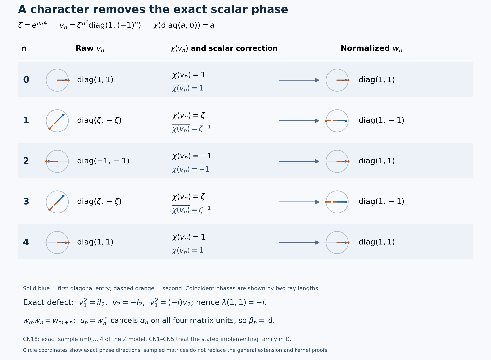

# Read the scalar phase, normalize, and obtain the exact kernel

A unitary can implement the right automorphism while carrying an arbitrary scalar phase. A character of the commutative fixed center reads that phase consistently. Dividing by its value produces an exact representation, with a unique normalized implementer for that character. We construct this operation first, then verify the discrete topology that makes its arbitrary initial choices continuous, and finally extend and cancel the representation. The abstract circle-extension construction and a second reverse-kernel argument remain complete alternatives.

*Self-checked by the writing AI.*

## Setting and earlier proofs

Let \(M\ne0\) be a concrete von Neumann algebra on an arbitrary complex Hilbert space \(\mathcal H\). Let \(G\) be locally compact Hausdorff abelian and let \(\alpha:G\to\operatorname{Aut}(M)\) be a normal point-ultraweakly continuous action. Assume central ergodicity, \(Z(M)^\alpha=\mathbb C1\). Put \(F=M^\alpha\), \(D=Z(F)\), \(H=\widehat G\), \(\Gamma=\Gamma(\alpha)\), and \(K=\Gamma^\perp\). The pairing is \((s,p)=p(s)\), with the exact positive-label The dual-center kernel through central overlap — L115 convention. Whole corner spectra and their Connes intersection agree with the reflected negative convention; individual vector spectra need not be symmetric. The main application assumes the entire quotient \(H/\Gamma\) compact. There is no countability, separability, factor, finite-Haar or sigma-finiteness assumption.

[Compact spectral images and central fixed implementers, LC3](OA-FLOW-L126.md#oa-flow.l126.lc3) supplies a unitary in \(D\) implementing each \(\alpha_s\), \(s\in K\), whenever the spectral image in \(H/\Gamma\) is compact. This is a pointwise existence theorem. The character normalization, discreteness, circle splitting and continuity arguments below turn those choices into a strongly continuous cocycle, and both kernel arguments identify its exact kernel.

The earlier proofs are [Continuous calculus, positivity and Hilbert spaces](OA-FLOW-CF.md#oa-flow.cf.1), specifically [Continuous calculus, positivity and Hilbert spaces — CF4 characters](OA-FLOW-CF.md#oa-flow.cf.4), [Continuous calculus, positivity and Hilbert spaces — CF6 calculus](OA-FLOW-CF.md#oa-flow.cf.6) and [Continuous calculus, positivity and Hilbert spaces — CF8 arbitrary Hilbert operators](OA-FLOW-CF.md#oa-flow.cf.8); [Concrete preduals from Hilbert tensors: the bounded CP-01–06 provider — Concrete preduals and normal functionals, CP6](OA-FLOW-CP.md#oa-flow.cp.6); The dual-center kernel through central overlap, for absorption and the The dual-center kernel through central overlap — subgroup theorem; Connes spectrum through fixed corners, for the action setting and Connes spectrum through fixed corners — Connes intersection; [Reduced Fourier norms, biduality and the returned measure, H3](OA-FLOW-HARMONIC-LATE.md#l138-h3); [Extending abelian representations inside their original closure](OA-FLOW-L118.md#l118-dual-map), for the dual map and [Extending abelian representations inside their original closure — complete group extension](OA-FLOW-L118.md#l118-group); Cocycle matrix actions and the representation continuity test — L112 matrix action and Cocycle matrix actions and the representation continuity test — cocycle invariance; [The spectrum of one action operator](OA-FLOW-L89.md#oa-flow.opsp.formula); [General normal actions: predual continuity and the integrated maps, AT3](OA-FLOW-AT.md#oa-flow.at.3); and [Small fixed corners, inner spectra and annihilating times](OA-FLOW-L122.md#oa-flow.l122.directannihilator).

The representation extension used here is L118's complete GROUP theorem, including equality of the generated von Neumann algebras. The individual-time spectrum formula uses the [Inputs for action frequencies and norm continuity — specified-dual setting](OA-FLOW-AF.md#af-0), CP6 and AT1–3; point-ultraweak continuity is accompanied by the proved norm continuity of the predual orbits.

## CN0. Obtain a character without asserting its normality

Each fixed-point space is the ultraweakly closed kernel of the normal linear map \(\alpha_s-\mathrm{id}\). Their intersection \(F\) is closed, unital and closed under products and adjoints because all \(\alpha_s\) are star automorphisms. For each fixed \(a\in F\), the equation \(xa=ax\) is ultraweakly closed: CP6 proves that fixed left and right multiplication transform square-summable vector-series tests into such tests. Hence \(D=F\cap F'\) is a commutative ultraweakly closed unital star algebra. It is norm closed, since norm convergence implies convergence on every bounded normal functional. CF8 gives the C*-identity and completeness of the containing operator algebra, so \(D\) is a nonzero unital commutative C*-algebra.

CF4 constructs a unital character \(\chi:D\to\mathbb C\) by the complete maximal-ideal argument. CF6 proves adjoint preservation of characters on a commutative C*-algebra. Consequently, for every unitary \(v\in D\),

\[
|\chi(v)|^2=\chi(v^*)\chi(v)=\chi(1)=1.
\tag{CN1}
\]

Its norm continuity is proved by CF4. We make no normality or strong-operator continuity claim about \(\chi\). The later selected family is evaluated only on the discrete parameter group \(K\).

## CN1. Normalize a family and prove uniqueness

Temporarily take an abstract abelian group \(J\) indexing part of an automorphism action on \(M\). Suppose that each indexed automorphism has an implementing unitary \(v_j\in D\); choose \(v_0=1\). The products \(v_jv_k\) and \(v_{j+k}\) implement the same automorphism. Comparing their conjugations shows that their quotient commutes with every element of \(M\). Since it also belongs to \(D\subset F\),

\[
v_jv_kv_{j+k}^*\in Z(M)\cap F=\mathbb C1.
\tag{CN2}
\]

The equality \(Z(M)\cap F=Z(M)^\alpha\) is the definition of fixedness; every element of that intersection also commutes with \(F\), so it lies in \(D\). Thus \(Z(M)\cap D=\mathbb C1\), even when \(D\) itself is large. There is a unique \(\lambda(j,k)\in\mathbb T\) with \(v_jv_k=\lambda(j,k)v_{j+k}\). Evaluate this identity:

\[
\chi(v_j)\chi(v_k)=\lambda(j,k)\chi(v_{j+k}).
\tag{CN3}
\]

The correction is

\[
w_j=\overline{\chi(v_j)}v_j.
\tag{CN4}
\]

Equation CN1 gives unitarity and \(\chi(w_j)=1\). Multiplying two corrected terms and using CN3 cancels precisely the scalar \(\lambda(j,k)\), giving

\[
w_jw_k=w_{j+k},\qquad w_0=1,\qquad
\operatorname{Ad}w_j=\operatorname{Ad}v_j=\alpha_j.
\tag{CN5}
\]

Associating \(v_jv_kv_l\) in both ways also gives the normalized two-cocycle identity; commutativity of \(D\) gives its symmetry. Neither calculation requires continuity of the selected family.

If \(v'_j\in D\) implements the same automorphism, then \(v'_jv_j^*\in Z(M)\cap D\). Write \(v'_j=a_jv_j\), with \(a_j\in\mathbb T\). Its correction is \(\overline{a_j\chi(v_j)}a_jv_j=w_j\). In particular any implementing unitary with character value one is \(w_j\). Uniqueness is for the fixed character \(\chi\); we do not claim independence of the character itself.

## CN2. Check the compact quotient topology first

L115 SUBGROUP proves that \(\Gamma\) is a closed subgroup. Its annihilator \(K\) is closed, being the intersection of the kernels of the continuous characters \(p\in\Gamma\). Apply the general quotient-dual portion of L118 DUAL-MAP with \(T=H\), \(N=\Gamma\), and then H3's positive topological biduality \(G\cong\widehat H\). This gives

\[
K\cong\widehat{H/\Gamma}
\tag{CN6}
\]

The isomorphism sends \(s\) to the character \(p+\Gamma\mapsto p(s)\). Both compact-open directions are part of the earlier proof, including compact lifts of compact quotient sets. This is a topological identification, not only an algebraic one.

For a compact LCA group \(Q\), its compact-open identity neighborhood

\[
\{\eta\in\widehat Q:|\eta(q)-1|<1\text{ for every }q\in Q\}
\tag{CN7}
\]

contains no nontrivial character. Its image would be a subgroup of the circle contained in the open right half-plane, since \(|z-1|<1\) implies \(\operatorname{Re}z>0\). For a nontrivial \(e^{ia}\), take its inverse if needed so \(0

### Verify the compact spectral-image hypothesis

Let \(\pi:H\to H/\Gamma\). Absorption makes the closed action spectrum saturated: \(\operatorname{Sp}(\alpha)+\Gamma=\operatorname{Sp}(\alpha)\). Therefore \(\pi^{-1}\pi(\operatorname{Sp}(\alpha))=\operatorname{Sp}(\alpha)\), and the defining quotient topology makes its image closed. It is a closed subset of the compact quotient, hence compact. Mere containment in a compact space would not suffice without closedness.

The LC3 theorem in [Compact spectral images and central fixed implementers](OA-FLOW-L126.md#oa-flow.l126.lc3) therefore applies at precisely its compact-image hypothesis. It supplies \(v_s\in\mathcal U(D)\) implementing \(\alpha_s\) for every \(s\in K\). Choice selects one such unitary at each time, with \(v_0=1\). CN1 normalizes it. Every map on discrete \(K\) is continuous for any target topology, so

\[
w:K\longrightarrow\mathcal U(D)
\quad\text{is a strongly continuous unitary representation.}
\tag{CN8}
\]

No strong continuity of the character has been assumed. Only this implementer-existence step uses LC3.

## CN3. Extend with the same operators and choose the cancelling adjoint

The completed L118 GROUP theorem applies to the strongly continuous representation \(w\) of the closed subgroup \(K\) on the original arbitrary Hilbert space. It constructs

\[
r|_K=w,\qquad W^*(r(G))=W^*(w(K))\subset D.
\tag{CN9}
\]

Because \(D\) is a von Neumann algebra containing \(w(K)\), it contains their generated algebra and every \(r_s\). Put \(u_s=r_s^*\). Its strong continuity follows from \(r_s^*=r_{-s}\). The group is abelian and every \(r_t\) is fixed by \(\alpha\), so

\[
u_{s+t}=r_{s+t}^*=r_s^*r_t^*
=u_s\alpha_s(u_t).
\tag{CN10}
\]

Thus \(u\) is a strongly continuous unitary \(\alpha\)-cocycle with \(u_0=1\). Define

\[
\beta_s(x)=r_s^*\alpha_s(x)r_s.
\tag{CN11}
\]

Direct substitution of the cocycle law gives the group law for \(\beta\) and \(\beta_0=\mathrm{id}\). The following separate continuity proof supplies the normal action hypotheses needed for the two kernel arguments.

### CT. A strong unitary family gives the full normal continuity estimate

For this proof \(r:G\to\mathcal U(M)\) may be any strongly continuous family; it need not be a representation, fixed by \(\alpha\), or contained in \(D\). Its adjoints are strongly continuous, since
\(\|r_s^*\xi-r_{s_0}^*\xi\|=\|\xi-r_sr_{s_0}^*\xi\|\to0\).
Conjugation by each fixed unitary is normal: in a CP6 vector-series functional, replace both square-summable vector sequences by their unitary images. Composing with the normal \(\alpha_s\) makes each \(\beta_s\) normal. For fixed \(x\) and vectors, the actual coefficient identity is

\[
\langle\beta_s(x)\xi,\eta\rangle
=\langle\alpha_s(x)r_s\xi,r_s\eta\rangle.
\tag{CN12}
\]

Replace the two moving vectors separately by \(r_{s_0}\xi,r_{s_0}\eta\). The two errors are bounded by \(\|x\|\) times the corresponding norm differences and fixed vector norms. They tend to zero. The remaining coefficient converges by point-ultraweak continuity of \(\alpha\).

Every normal functional is a CP6 series of these coefficients with square-summable vector families. The uniformly bounded orbit, \(\|\beta_s(x)\|=\|x\|\), gives the tail estimate

\[
\|x\|\left(\sum_{n>N}\|\xi_n\|^2\right)^{1/2}
\left(\sum_{n>N}\|\eta_n\|^2\right)^{1/2},
\tag{CN13}
\]

It tends to zero uniformly in \(s\). Truncate first, use continuity of the finite sum, then remove the tail. This proves point-ultraweak continuity on arbitrary converging nets. If \(u=r^*\) is an \(\alpha\)-cocycle, the direct cocycle multiplication also proves that \(\beta\) is an action. CT therefore supplies all required normal-action hypotheses for every strongly continuous unitary cocycle.

## CN4. Prove both inclusions in the exact kernel

For \(s\in K\), the exact extension agrees with the normalized implementer, and

\[
\beta_s=\operatorname{Ad}(w_s^*)\operatorname{Ad}(w_s)
=\mathrm{id}.
\tag{CN14}
\]

For the reverse inclusion suppose \(\beta_s=\mathrm{id}\). CN11 gives \(\alpha_s=\operatorname{Ad}(r_s)\). This implementer is globally fixed because \(r_s\in D\subset F\). Apply the L122 DIRECTANNIHILATOR theorem to the original action and this fixed unitary; it requires neither a factor nor central ergodicity. It concludes \(s\in\Gamma(\alpha)^\perp=K\). Therefore

\[
\boxed{\ker\beta=\Gamma(\alpha)^\perp.}
\tag{CN15}
\]

The two inclusions use different information: extension and cancellation give the first; the independent fixed-implementer implication gives the second. No desired kernel equality is used as a premise.

## CK. The distinct cocycle-invariance route is also complete

For any strongly continuous unitary \(\alpha\)-cocycle \(u\) on the same nonzero algebra and LCA group, set \(\beta=\operatorname{Ad}(u)\alpha\). CT, with \(r=u^*\), proves that this is a normal point-ultraweakly continuous action. The exact L112 matrix ACTION and CORNERS proofs therefore apply: its fixed diagonal matrix corners carry \(\alpha,\beta\), and the earlier general equivalent-fixed-corner theorem proves \(\Gamma(\beta)=\Gamma(\alpha)\). Reflection of both whole-action conventions preserves that equality.

Apply AT1–3 to this actual action on the CP6 predual. It has norm-continuous predual orbits and both-sign operator bounds one, so AF0's full specified-dual hypotheses of OPSP hold. If \(\beta_s=\mathrm{id}\), its ordinary spectrum on nonzero \(M\) is exactly \(\{1\}\): for \(z\ne1\), \((1-z)^{-1}\mathrm{id}\) is the inverse; at \(z=1\) the zero map is not invertible. OPSP gives

\[
\overline{\{p(s):p\in\operatorname{Sp}(\beta)\}}=\{1\},
\qquad
\Gamma(\beta)=\Gamma(\alpha)
\quad\Longrightarrow\quad s\in\Gamma(\alpha)^\perp.
\tag{CK1}
\]

Every \(p\in\Gamma(\beta)\) lies in \(\operatorname{Sp}(\beta)\) by GCC DEFINITION, so this implication is exact. This proves the reverse inclusion without requiring central ergodicity of the perturbed action or its identification in advance. Combining it with the earlier cancellation gives a separate proof of CN15 under the same compact-quotient hypothesis.

## CN5. Split an abstract circle extension

Let \(L\) be any LCA group containing a subgroup \(C\) topologically isomorphic to the circle. Compactness of \(C\) and the Hausdorff property make it closed. Choose an isomorphism \(f:C\to\mathbb T\). The full open-surjection portion of L118 DUAL-MAP extends the continuous character \(f\) to \(g:L\to\mathbb T\). The map \(\rho=f^{-1}g\) is a continuous retraction onto \(C\). Its closed kernel \(C'\) gives the factorization

\[
L\longrightarrow C\times C',\quad
x\longmapsto\bigl(\rho(x),x-\rho(x)\bigr)
\tag{CN16}
\]

Its continuous inverse is \((c,c')\mapsto c+c'\). This supplies the entire topological circle-summand argument, with no countable character-extension theorem.

Now let \(J\) be any discrete abelian group and let \(\lambda:J^2\to\mathbb T\) be a normalized symmetric two-cocycle. On \(E=\mathbb T\times J\) use
\((a,j)(b,k)=(ab\lambda(j,k),j+k)\).
The cocycle identity proves associativity by comparing the two scalar coefficients in a triple product; normalization gives identity \((1,0)\). Both inverse products equal the identity for
\((a^{-1}\lambda(j,-j)^{-1},-j)\);
symmetry makes the displayed product commutative. The group operations are continuous because \(J\) is discrete and the scalar operations are continuous on each open fiber. The product is Hausdorff, and each circle fiber is an open compact neighborhood, so \(E\) is LCA.

Split its closed circle subgroup by the preceding retraction. The second-coordinate quotient restricts to a bijection \(C'\to J\): each element factors uniquely into a circle element and a complement element, and the intersection of the two subgroups is trivial. Its complement is discrete, because its intersection with each open circle fiber is a singleton. Thus this restriction and its inverse are continuous. Write the inverse section as \(j\mapsto(c(j),j)\). Multiplying two section values gives

\[
c(j)c(k)\lambda(j,k)=c(j+k).
\tag{CN17}
\]

It follows that \(c(j)v_j\) is an exact representation whenever the original projective family exists. For our particular family in \(D\), CN3 explicitly supplies \(c(j)=\overline{\chi(v_j)}\). The abstract splitting theorem remains useful when a symmetric scalar cocycle was not initially obtained from operators in such an algebra.

## CN6. Display exact phases and a nontrivial defect

Take \(G=\mathbb Z\), \(M=M_2(\mathbb C)\), \(W_n=\operatorname{diag}(1,(-1)^n)\) and \(\alpha_n=\operatorname{Ad}(W_n)\). Every map on \(\mathbb Z\) is continuous, and finite matrix coefficients prove normality directly. Commuting with all matrix units forces a central matrix to be scalar, so this action is centrally ergodic. At \(n=1\) both off-diagonal matrix units change sign, whereas both diagonal units are fixed. Hence \(F=D\) is exactly the diagonal algebra.

For a nonzero fixed corner with unit \(e\), a filter \(a\in\ell^1(\mathbb Z)\) sends \(e\) to \((\sum_n a_n)e\). Every annihilating filter consequently has positive transform zero at the trivial character, which puts that character in every corner spectrum. On the scalar \(E_{11}\) corner this condition is also sufficient for annihilation. For every \(z\ne1\), the filter \(\delta_1-\delta_0\) annihilates that scalar action and its transform is \(z-1\ne0\). Its action spectrum is therefore exactly \(\{1\}\), and the GCC intersection is \(\Gamma=\{1\}\). Every character of \(\mathbb Z\) has the form \(n\mapsto z^n\), determined by its value \(z\) at one, and every \(z\in\mathbb T\) gives such a character. Compact subsets of \(\mathbb Z\) are finite, so convergence at one is exactly compact-open convergence. Thus \(\widehat{\mathbb Z}=\mathbb T\) topologically, \(H/\Gamma=\mathbb T\) is compact, and \(K=\mathbb Z\).

With \(\zeta=e^{i\pi/4}\), choose \(v_n=\zeta^{n^2}W_n\). Evaluation at the first diagonal entry is a character of \(D\), and

\[
v_mv_n=\zeta^{-2mn}v_{m+n},\quad
\chi(\operatorname{diag}(a,b))=a,\quad
\chi(v_n)=\zeta^{n^2},\quad
w_n=\overline{\chi(v_n)}v_n=W_n.
\tag{CN18}
\]

The multiplier is the exact exponent identity \(m^2+n^2-(m+n)^2=-2mn\). For \(m=n=1\), \(v_1^2=i1\), \(v_2=-1\), and the multiplier is \(-i\); indeed \((-i)(-1)=i\). Normalization changes the first entry to one and the second to \((-1)^n\). Here no proper-subgroup extension is needed, since \(G=K\). Taking \(r_n=W_n\) and \(u_n=r_n^*\) cancels \(\alpha_n\) on every matrix unit, so \(\beta\) is trivial with kernel all of \(\mathbb Z\).

The [figure below](#l127-figure) displays the selected \(n=0,1,2,3,4\), the raw and corrected entries, the character values and their inverse phases, and the defect \(\lambda(1,1)=-i\). These are exact integer exponents modulo eight. The finite display does not prove the arbitrary-group or proper-subgroup extension theorem.

## Exact character normalization on five integer parameters

The model is \(M=M_2(\mathbb C)\), \(G=\mathbb Z\), \(\alpha_n=\operatorname{Ad}(W_n)\), and \(W_n=\operatorname{diag}(1,(-1)^n)\). Its fixed center \(D\) consists of diagonal matrices and the chosen character is \(\chi(\operatorname{diag}(a,b))=a\). Set \(\zeta=e^{i\pi/4}\). The raw implementer is \(v_n=\operatorname{diag}(\zeta^{n^2},(-1)^n\zeta^{n^2})\). The figure displays the exact values at \(n=0,1,2,3,4\), their character values \(\zeta^{n^2}\), the scalar corrections \(\overline{\chi(v_n)}\), and the resulting \(w_n=W_n\).

Every phase is recorded as an integer exponent modulo eight in units of \(\pi/4\); the circle coordinates show those exact phase directions. Solid blue and dashed orange rays represent the first and second diagonal entries. Distinct ray lengths make coincident phases visible and do not represent different moduli: every entry has modulus one.

The displayed defect is exact: \(v_1^2=iI_2\), \(v_2=-I_2\), and \(v_1^2=(-i)v_2\), so \(\lambda(1,1)=-i\). In general the exponent calculation gives \(\lambda(m,n)=\zeta^{-2mn}\). Character evaluation and its inverse phase cancel it, giving \(w_mw_n=w_{m+n}\). In this example \(K=G=\mathbb Z\), so the extension is already \(r_n=W_n\); its adjoint cancels the original action on all four matrix units. A proper subgroup still needs the complete extension theorem.

The full proofs are [CN0 the character algebra](#cn0), [CN1 exact normalization and uniqueness](#cn1), [CN2 the topology](#cn2-topology), [CN3 the extension](#cn3), [CT full normal continuity](#ct), [CN4 both kernel inclusions](#cn4), and [CN6 the exact model](#cn6).

The [renderer](../assets/character-normalization-exact-cocycle-kernel/render_character_normalization.py), [exact data](../assets/character-normalization-exact-cocycle-kernel/figure/character-normalization-data.json), [editable SVG](../assets/character-normalization-exact-cocycle-kernel/figure/character-normalization.svg), and [font notice](../assets/character-normalization-exact-cocycle-kernel/figure/FONT-LICENSE.txt) accompany the diagram. The example and all integer phase identities are proved in CN6.

## A second proof through the circle extension

We now organize the argument around the symmetric scalar multiplier and its twisted circle group. CN2 gives the discreteness argument, CT gives the action-continuity estimate, CN5 gives the topological splitting, and CK gives the cocycle-invariance proof of the reverse kernel inclusion. This route also includes a solved problem on the role of central ergodicity.

### Splitting central multipliers and exact cocycle kernels

When the full dual quotient by the Connes spectrum is compact, its annihilator
is discrete.  The preceding theorem implements every element of that
annihilator by a unitary in the center of the fixed algebra, but arbitrary
choices need not multiply exactly.  Their defect is a symmetric scalar
two-cocycle.  Splitting the associated circle extension removes that defect;
an extension of the corrected representation then produces a cocycle
perturbation whose kernel is exactly the annihilator.

Throughout, $G$ is a locally compact Hausdorff abelian group,
$H=\widehat G$, $M$ is a nonzero von Neumann algebra, and
$\alpha:G\to\operatorname{Aut}(M)$ is point-ultraweakly continuous and
centrally ergodic.  Put

$$
\Gamma=\Gamma(\alpha),
\qquad
K=\Gamma^\perp,
\qquad
D=Z(M^\alpha),
\tag{R1}
$$

and assume

$$
H/\Gamma\text{ is compact}.
\tag{R2}
$$

No separability, sigma-finiteness, second-countability, or countability
hypothesis is imposed.

### Every circle subgroup of an LCA group splits topologically

We first prove the circle-splitting lemma. Let $L$ be a locally compact Hausdorff abelian
group and let $C\le L$ be a subgroup topologically isomorphic to $\mathbb T$.
The subgroup $C$ is compact and therefore closed.  Choose a topological group
isomorphism

$$
f:C\longrightarrow\mathbb T.
\tag{R3}
$$

The Pontryagin character-extension theorem says that restriction

$$
\widehat L\longrightarrow\widehat C
\tag{R4}
$$

is surjective for a closed subgroup.  Regard $f$ as a character of $C$ and
choose a continuous character $g:L\to\mathbb T$ extending it:

$$
g|_C=f.
\tag{R5}
$$

Define

$$
r=f^{-1}\circ g:L\longrightarrow C.
\tag{R6}
$$

Then $r$ is a continuous homomorphism and $r|_C=\operatorname{id}_C$.  Put
$C'=\ker r$.  Every $x\in L$ has the unique factorization

$$
x=r(x)+\bigl(x-r(x)\bigr),
\qquad
r(x)\in C,\quad x-r(x)\in C'.
\tag{R7}
$$

Both the factorization and its inverse depend continuously on $x$.  Hence

$$
\boxed{L\cong C\times C'\text{ as a topological group}.}
\tag{R8}
$$

The topological hypothesis in Lemma XI.2.23 is essential: (R4) extends a
continuous character on the closed circle subgroup.

### Compact dual quotient makes the annihilator discrete

Pontryagin duality identifies

$$
K=\Gamma^\perp\cong\widehat{H/\Gamma}.
\tag{R9}
$$

The dual of a compact LCA group is discrete, so $K$ is a closed discrete
subgroup of $G$.  The hypothesis of
[Compact spectral images and central fixed implementers, LC3](OA-FLOW-L126.md#oa-flow.l126.lc3)
is automatic under (R2) for a reason beyond mere containment in a compact
space. The absorption identity
$\operatorname{Sp}(\alpha)+\Gamma=\operatorname{Sp}(\alpha)$ makes this
closed spectrum $\Gamma$-saturated. Its image under the quotient map is
therefore closed, by the definition of the quotient topology, and hence
compact in $H/\Gamma$. Therefore, for every $t\in K$, there is a
unitary $v_t\in D$ with

$$
\alpha_t=\operatorname{Ad}(v_t).
\tag{R10}
$$

Choose $v_0=1$.  Since $K$ is discrete, any such family is continuous as a map
from $K$ into $\mathcal U(D)$; continuity imposes no compatibility between the
choices.

### Central implementers have a symmetric scalar multiplier

For $s,t\in K$, the unitaries $v_sv_t$ and $v_{s+t}$ both implement
$\alpha_{s+t}$.  Thus their quotient is central in $M$.  It also belongs to
$D$, so

$$
v_sv_tv_{s+t}^*
\in Z(M)\cap D
=Z(M)^\alpha
=\mathbb C1.
\tag{R11}
$$

The last equality is central ergodicity.  It does not say that $D$ itself is
scalar.  Define $\lambda:K\times K\to\mathbb T$ by

$$
v_sv_t=\lambda(s,t)v_{s+t}.
\tag{R12}
$$

The normalization $v_0=1$ gives

$$
\lambda(s,0)=\lambda(0,s)=1.
\tag{R13}
$$

Associativity of three implementers yields the scalar two-cocycle identity

$$
\lambda(s,t)\lambda(s+t,r)
=\lambda(t,r)\lambda(s,t+r).
\tag{R14}
$$

All $v_t$ lie in the abelian algebra $D$, so $v_sv_t=v_tv_s$.  Consequently

$$
\lambda(s,t)=\lambda(t,s).
\tag{R15}
$$

Thus the multiplier is normalized and symmetric.

### Split the twisted circle extension and remove the multiplier

On the product space

$$
E=\mathbb T\times K
\tag{R16}
$$

define

$$
(a,s)(b,t)
=\bigl(ab\lambda(s,t),s+t\bigr).
\tag{R17}
$$

Equations (R13)–(R14) give an identity and associativity; inverses are

$$
(a,s)^{-1}
=\bigl(a^{-1}\lambda(s,-s)^{-1},-s\bigr).
\tag{R18}
$$

Equation (R15) makes the product commutative.  With its product topology,
$E$ is therefore an LCA group: $K$ is discrete, and every point has a compact
neighborhood obtained from the compact circle fiber over one point of $K$.

The subgroup

$$
C=\{(a,0):a\in\mathbb T\}
\tag{R19}
$$

is topologically a circle.  By (R8), choose a closed complement $C'$ with
$E=C\times C'$.  The second-coordinate quotient map

$$
q:E\longrightarrow K
\tag{R20}
$$

has kernel $C$, and its restriction to $C'$ is a topological isomorphism.
Let $j:K\to C'$ be its inverse.  There is a function $c:K\to\mathbb T$ such
that

$$
j(s)=(c(s),s).
\tag{R21}
$$

Since $j$ is a homomorphism, (R17) gives

$$
c(s)c(t)\lambda(s,t)=c(s+t),
\qquad
\lambda(s,t)=\frac{c(s+t)}{c(s)c(t)}.
\tag{R22}
$$

Correct the chosen implementers by central scalars:

$$
w_s=c(s)v_s
\qquad(s\in K).
\tag{R23}
$$

Equations (R12) and (R22) give

$$
w_sw_t=w_{s+t}.
\tag{R24}
$$

Thus $w:K\to\mathcal U(D)$ is a strongly continuous unitary representation,
and scalar correction preserves

$$
\alpha_s=\operatorname{Ad}(w_s)
\qquad(s\in K).
\tag{R25}
$$

### Extend the corrected representation without adding operators

Represent $M$ faithfully and normally.  Apply the closed-subgroup extension
theorem from
[Extending abelian representations inside their original closure](OA-FLOW-L118.md#l118-group)
to $w$.  It supplies a strongly continuous unitary representation

$$
r:G\longrightarrow\mathcal U(\mathcal H),
\qquad
r|_K=w,
\tag{R26}
$$

with

$$
W^*(r(G))=W^*(w(K))\subseteq D.
\tag{R27}
$$

In particular every $r_s$ belongs to $D\subseteq M^\alpha$.  Define

$$
u_s=r_s^*.
\tag{R28}
$$

The map $u$ is strongly continuous.  Since $r_t$ is fixed by $\alpha$ and the
range of $r$ is abelian,

$$
u_{s+t}
=r_{s+t}^*
=r_s^*r_t^*
=u_s\alpha_s(u_t).
\tag{R29}
$$

Therefore $u\in Z_\alpha^1(G,M)$ is an $\alpha$-cocycle.  Its adjoint sign in
(R28) is the sign that cancels the implementers on $K$.

### The cocycle perturbation has exactly the annihilator as kernel

Let

$$
\beta_s=\operatorname{Ad}(u_s)\circ\alpha_s
=\operatorname{Ad}(r_s^*)\circ\alpha_s.
\tag{R30}
$$

For $t\in K$, equations (R25)–(R28) give

$$
\beta_t
=\operatorname{Ad}(w_t^*)\circ\operatorname{Ad}(w_t)
=\operatorname{id},
\tag{R31}
$$

so

$$
K\subseteq\ker\beta.
\tag{R32}
$$

For the converse, cocycle invariance of the Connes spectrum, proved in
Cocycle matrix actions and the representation continuity test — Cocycle invariance through matrix corners,
gives

$$
\Gamma(\beta)=\Gamma(\alpha)=\Gamma.
\tag{R33}
$$

If $s\in\ker\beta$, then $\beta_s=\operatorname{id}$.  The individual-time
spectrum formula applied to $\beta$ shows that

$$
(s,p)=1
\qquad(p\in\operatorname{Sp}(\beta)),
\tag{R34}
$$

and hence for every $p\in\Gamma(\beta)$.  By (R1) and (R33), $s\in K$.
Together with (R32),

$$
\boxed{
\ker(\operatorname{Ad}(u)\alpha)
=\Gamma(\alpha)^\perp.}
\tag{R35}
$$

This proves Theorem XI.2.9(iv), including the reverse kernel inclusion that is
not supplied merely by the cancellation calculation.

**Problem.** Why does central ergodicity make the multiplier scalar without
forcing every chosen implementer $v_t\in D$ to be scalar?

**Solution.** The multiplier belongs simultaneously to $D=Z(M^\alpha)$ and
to $Z(M)$ because it is the quotient of two implementers of the same
automorphism.  Their intersection is
$Z(M)\cap M^\alpha=Z(M)^\alpha=\mathbb C1$.  An individual $v_t$ lies in $D$
but need not lie in $Z(M)$, so central ergodicity does not make it scalar.
$\square$

Further reading: Takesaki, *Theory of Operator Algebras II*, Lemma
XI.2.23 and Theorem XI.2.9(iv).  Equations
(R3)–(R8) prove the circle-summand lemma, (R9)–(R15) produce the normalized
symmetric scalar multiplier, (R16)–(R25) split its twisted extension,
(R26)–(R29) extend the corrected representation with the required adjoint
sign, and (R30)–(R35) prove both inclusions in the exact-kernel statement.

## Further reading and component terms

The mathematical antecedents are Takesaki, *Theory of Operator Algebras II*, Theorem XI.2.9(iv), stated on page 337 and proved on page 346, and Lemma XI.2.23 on pages 345–346; [bibliographic DOI](https://doi.org/10.1007/978-3-662-10451-4). The preceding Theorem XI.2.9(iii) concerns the pointwise implementer theorem proved in [Compact spectral images and central fixed implementers](OA-FLOW-L126.md#oa-flow.l126.lc3).

Character normalization and topological circle splitting both remove the symmetric scalar multiplier. The exact-kernel conclusion has two proofs: the fixed-implementer implication in CN4 and the cocycle-invariance argument in CK. Both use the complete earlier proofs linked in the setting.

Original lesson exposition and diagram: CC0-1.0 to the extent of rights held. Mathematical exposition by Codex (OpenAI), with character-normalization exposition and illustration by GPT-6.1 Sol (OpenAI). DejaVu font components retain their accompanying [font terms](../assets/character-normalization-exact-cocycle-kernel/figure/FONT-LICENSE.txt).
