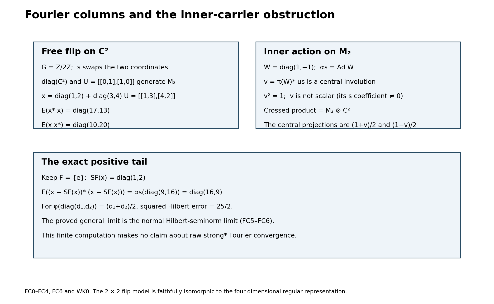
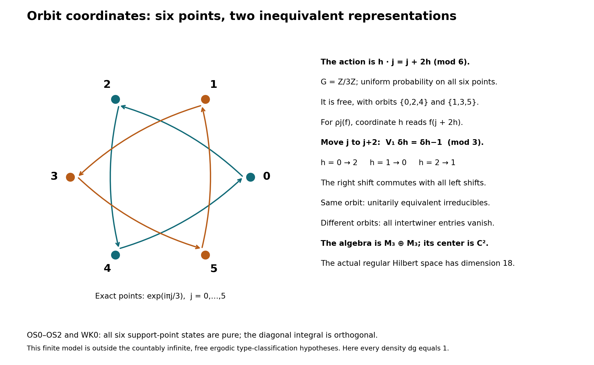

# Discrete Fourier columns, finite corners and orbit MASAs

*Self-checked by the writing AI.*

## Setting and earlier results

The Fourier and inner-carrier theorem concerns an arbitrary discrete group \(G\), an arbitrary complex Hilbert space \(H\), and normal automorphisms of a nonzero von Neumann algebra \(M\subseteq B(H)\). A normal automorphism \(\beta\) is **free** if \(ca=\beta(a)c\) for every \(a\in M\) forces \(c=0\). An action is free if each nonidentity automorphism is free. It is **ergodic** on an algebra if its fixed algebra consists of the scalars.

The trace classification adds abelian coefficients, a countably infinite group, freeness and ergodicity. The maximal abelian subalgebra (MASA) and compact-space orbit constructions state their additional hypotheses where needed. Inner products are linear in the first variable. A nonnegative indexed sum is the supremum of its finite subsums.

We use the earlier proofs in [Continuous calculus, positivity and Hilbert spaces](OA-FLOW-CF.md), CF1, 4, 6–8 and 10; [Scalar measure, convergence and calculus](OA-FLOW-SC.md), SC1–7; [Radon representation, qualified products and Haar measure](OA-FLOW-HR.md), HR2, 3 and 5; and [Operator foundations: spectral domains, normal topology and scalar analysis](OA-FLOW-SF.md), SB4–6. For operator topology and finite corners the inputs are [Concrete preduals from Hilbert tensors](OA-FLOW-CP.md), CP1–6; [Projection comparison and the countably decomposable type III case](OA-FLOW-PC.md), PC1–6; [Norm-controlled density on arbitrary Hilbert spaces](OA-FLOW-BD.md), BD1, 4 and 5; [Order-normal positive functionals and ultraweak continuity](OA-FLOW-NF.md), NF4 and 6; and [The normalized trace with its full center retained](OA-FLOW-FCT.md#fct-6), FCT6–7. None of these uses a countability hypothesis in the unrestricted parts below.

The remaining inputs are the scalar circle Fourier calculation CC0 in [A periodic compact crossed product and its full counting weight](OA-FLOW-CC.md#cc-0), the full commutant theorem CCM7 in [The normal crossed-product commutant for arbitrary locally compact groups](OA-FLOW-CCM.md#ccm-7), and normal regular-model transport NCF3 in [A normal crossed product as a fixed algebra](OA-FLOW-NCF.md#ncf-3). Only the scalar circle calculation from CC0 is needed here; its later modular hypotheses are not imposed on this lesson.

## RT0. The concrete regular algebra is independent of the faithful representation

[NCF3](OA-FLOW-NCF.md#ncf-3) applies to any normal action of a locally compact group and any faithful normal representation, whether spatially implemented on that representation or not. Specialize it to discrete \(G\), whose Haar measure is counting and whose modular function is one. Its normal generator-preserving tensor transport carries precisely \(\pi(a)\) and \(u_s\) to their counterparts in every faithful normal representation. Thus the matrix definition in FC0 is the normal crossed product. All our compression formulas concern this actual regular model; transport and its inverse are normal on their entire ultraweak domains. We do not assert that an arbitrary original \(H\) carries implementers.

## FC0. A single column determines every matrix entry

Let a discrete group \(G\), of arbitrary cardinality, act normally by \(\alpha\) on a nonzero concrete von Neumann algebra \(M\subset B(H)\). On \(\mathcal K=\ell^2(G,H)\) set
\
 [\pi(a)\xi=\alpha_{r^{-1}}(a)\xi(r),\qquad
 u_s\xi=\xi(s^{-1}r),\qquad
 N=(\pi(M)\cup\{u_s:s\in G\})''.
 \tag{FC1}
\]
Write \(J_r:H\to\mathcal K\) for coordinate inclusion and \(x_{r,t}=J_r^*xJ_t\). The finite sums \(\sum_s\pi(a_s)u_s\) form a unital star algebra, by covariance. The bounded-density proofs [BD1 and BD4–5](OA-FLOW-BD.md#oa-flow.bd.1) apply: the norm-closed algebra has bounded strong* approximants, hence ultraweak approximants by the CP vector-series tail estimate. Finite polynomials are norm dense in that algebra, so the polynomial algebra is ultraweak dense in \(N\). Coordinate compression and each normal automorphism are ultraweakly continuous, so its identities pass to its ultraweak closure \(N\).

In particular \(E(x)=x_{e,e}\) belongs to \(M\). Define \(a_s=E(xu_s^*)=x_{e,s^{-1}}\). Direct multiplication on the finite sums, followed by that continuity, gives for every \(x\in N\)
\[
 x_{r,t}=\alpha_{r^{-1}}(a_{rt^{-1}}),\qquad
 a_s=\alpha_s(x_{s,e}). \tag{FC2}
\]
Thus the identity column, or equivalently the coefficients \(a_s\), determines every entry and hence the bounded operator. The last implication follows by testing finitely supported vectors, which are dense in \(\mathcal K\). This proof never rearranges an infinite Fourier series.

## FC1. Positivity and both square sums come from columns

Compression gives \(\|E(x)\|\le\|x\|\), and \(E(1)=1\) gives \(\|E\|=1\). It also makes \(E\) completely positive: the matrix amplification is compression by the direct sum of the coordinate inclusions. It is normal because each normal vector-series functional on \(M\) pulls back to the same series on \(\mathcal K\); absolute summability is unchanged. The diagonal action of \(\pi(M)\) gives
\[
 E(\pi(a)x\pi(b))=aE(x)b,
 \qquad E(u_sxu_s^*)=\alpha_s(E(x)). \tag{FC3}
\]
For the second equality one may either use the finite algebra and normality or (FC2) at \((s^{-1},s^{-1})\). Also \(E(\pi(a))=a\). Identifying \(M\) with \(\pi(M)\), it is a normal conditional expectation.

If \(x\ge0\) and \(E(x)=0\), then all diagonal entries are zero by (FC2). Consequently \(\|x^{1/2}J_r\xi\|^2=0\) for every \(r,\xi\), and density gives \(x=0\). Thus \(E\) is faithful.

For a finite subset \(F\subset G\), let \(P_F=\sum_{r\in F}J_rJ_r^*\). These projections increase strongly to one. Compressing \(x^*P_Fx\) and \(xP_Fx^*\) to coordinate \(e\), and using (FC2), proves the bounded increasing sums
\[
 E(x^*x)=\sum_{s\in G}\alpha_{s^{-1}}(a_s^*a_s),
 \qquad E(xx^*)=\sum_{s\in G}a_sa_s^*.
 \tag{FC4}
\]
The sums are nets over finite subsets in the positive cone. They converge strongly and ultraweakly to the indicated bounded positive operators. In the second formula the column index is inverted, a bijection of \(G\); there is no conditional rearrangement.

## FC2. The precise Fourier convergence is a positive tail identity

Let \(S_F(x)=\sum_{s\in F}\pi(a_s)u_s\). Its identity column agrees with that of \(x\) exactly on the coordinates in \(F\) and vanishes on the others. Applying the first compression calculation above to their difference gives
\[
 E\big((x-S_F(x))^*(x-S_F(x))\big)
 =E(x^*x)-\sum_{s\in F}\alpha_{s^{-1}}(a_s^*a_s).
 \tag{FC5}
\]
For every normal positive functional \(\varphi\in M_*^+\), normality applied to the positive sums makes the right side tend to zero after applying \(\varphi\). Hence
\[
 \|x-S_F(x)\|_{2,\varphi\circ E}\longrightarrow0.
 \tag{FC6}
\]
This is exactly the finite-subset-net Hilbert-seminorm conclusion. It does not assert strong, strong-star or operator-norm convergence of the raw Fourier partial sums.

In the GNS Hilbert space of \(\varphi\circ E\), the fibers \(\pi(M)u_s\) are mutually orthogonal: for \(s\ne t\), compression of \(u_s^*\pi(b^*a)u_t\) is zero. Formula (FC5) shows that the \(s\)-component of the vector of \(x\) is the vector of \(\pi(a_s)u_s\), and (FC6) shows that the closed span of the fibers is the whole GNS space. This identifies all the Hilbert components without requiring boundedness of the Fourier partial sums. An orthogonal family has only countably many nonzero coordinates in each one vector: for each positive integer \(n\) there are finitely many squared coordinate norms at least \(1/n\), and their countable union contains every nonzero coordinate.

## FC3. The intertwiner is a unitary on a central piece

Let \(\beta\) be a normal automorphism of \(M\), and suppose \(0\ne c\in M\) satisfies \(ca=\beta(a)c\) for all \(a\in M\). Taking adjoints shows that \(c^*c\) and \(cc^*\) commute with \(M\); both belong to its center. Write \(c=v|c|\), with support projections \(p=v^*v\) and \(q=vv^*\). These supports are central. Since a central projection commutes with \(v\),
\[
 q=vpv^*=pvv^*=pq,\qquad p=v^*qv=qp,
\]
so \(p=q\ne0\).

For a spectral cutoff \(p_n=1_{[1/n,\infty)}(|c|)\), the inverse of \(|c|\) is bounded on \(p_n\). Multiplying the intertwiner equation on the right by that inverse, then taking the increasing strong limit, gives \(va=\beta(a)v\). Substituting \(a=p\) yields \(p\le\beta(p)\), because \(v\) is unitary in \(Mp\). Substituting \(a=\beta^{-1}(p)\) yields \(p\le\beta^{-1}(p)\), so also \(\beta(p)\le p\). Consequently
\[
 \beta(p)=p,\qquad \beta(a)p=v(ap)v^* \quad(a\in M).
 \tag{FC7}
\]
Conversely any invariant nonzero central \(p\) and unitary \(v\in Mp\) satisfying (FC7) give \(va=\beta(a)v\) for every \(a\). Therefore freeness is equivalent to having no nonzero invariant central piece on which the automorphism is inner. Only bounded polar decomposition, spectral cutoffs and multiplication on supports were used.

There is a largest such central piece. Choose a maximal pairwise orthogonal family \((p_i)\) of invariant central projections with inner restrictions, and implementing unitaries \(v_i\in Mp_i\). Their strong orthogonal sums give a projection \(p\) and a unitary \(v\in Mp\) implementing \(\beta|_{Mp}\). If another invariant central inner piece \(q\) had \(q(1-p)\ne0\), restriction to that piece would enlarge the family. Thus \(q\le p\), proving maximality independent of the choice of family. Every automorphism commuting with \(\beta\) preserves this largest piece, since it transports both the projection and its implementer. If that commuting group acts ergodically on \(Z(M)\), the largest piece is either zero or one: \(\beta\) is respectively free or inner.

## FC4. Relative commutation is exactly the obstruction in FC3

For \(a\in M\), bimodularity and covariance give
\[
 (\pi(a)x)(s)=aa_s,\qquad (x\pi(a))(s)=a_s\alpha_s(a).
 \tag{FC8}
\]
Uniqueness in FC0 then implies
\[
 x\in\pi(M)'\cap N
 \quad\Longleftrightarrow\quad
 aa_s=a_s\alpha_s(a)\quad(a\in M,s\in G).
 \tag{FC9}
\]
If every nonidentity \(\alpha_s\) is free, its adjoint intertwiner equation in (FC9) forces \(a_s=0\) for \(s\ne e\). The remaining coefficient is central and \(x=\pi(a_e)\).

Conversely, a nonzero \(c\) with \(ca=\alpha_s(a)c\), \(s\ne e\), gives \(y=\pi(c)u_s^*\). Substitution of \(\alpha_{s^{-1}}(a)\) in that equation proves that \(y\) commutes with \(\pi(a)\). Its coefficient at \(s^{-1}\) equals \(c\), so it cannot lie in \(\pi(M)\). We have proved, at arbitrary Hilbert-space and group cardinality,
\[
 \alpha\text{ free}\quad\Longleftrightarrow\quad
 \pi(M)'\cap N=\pi(Z(M)). \tag{FC10}
\]
Equivalently, every nonidentity time has zero largest inner central piece. In this case \(Z(N)=\pi(Z(M)^\alpha)\): an element of the center is first in the relative commutant, and then commuting with all \(u_s\) is exactly invariance of its coefficient. Conversely such coefficients commute with both generating families and hence with their bicommutant.

## FC5. Faithfulness is required for the abelian ergodicity shortcut

When \(M\) is abelian, inner automorphisms are identities, so FC3 says that freeness is the absence of a nonzero absolutely invariant projection. Suppose \(G\) is also abelian and its action on \(M\) is ergodic and faithful as a group homomorphism. For \(s\ne e\), every \(\alpha_t\) commutes with \(\alpha_s\) and preserves its largest absolutely invariant projection. Ergodicity makes it zero or one, while faithfulness excludes one. The action is free. Faithfulness cannot be dropped: a nontrivial group acting trivially on \(\mathbb C\) is ergodic and has no free nonidentity times.

## FC6. Two finite models distinguish the obstruction

For the flip of \(\mathbb C^2\) by \(\mathbb Z/2\mathbb Z\), represent the crossed product on \(\mathbb C^2\) by diagonal coefficients and the flip matrix \(U=\left(\begin{smallmatrix}0&1\\1&0\end{smallmatrix}\right)\). The algebraic crossed product is four-dimensional: its four Fourier basis elements are linearly independent by FC0, and this finite-dimensional algebra is already weakly closed in the regular representation. Their proposed images, the four products \(e_iU^s\), are the four matrix units. Covariance verifies multiplication and adjoints, and linear independence makes the resulting map an isomorphism onto \(M_2(\mathbb C)\). Its diagonal algebra has diagonal relative commutant, exactly as (FC10) predicts. For an intertwiner vector \(d=(d_1,d_2)\), testing the two coordinate projections in \(ad=d\alpha(a)\) forces \(d_1=d_2=0\).

For contrast, let \(M=M_2(\mathbb C)\), \(W=\operatorname{diag}(1,-1)\), and let the generator act by \(\operatorname{Ad}W\). The central inner piece is one. In its crossed product, \(v=\pi(W)^*u\) commutes with \(\pi(M)\), has \(v^2=1\), and has a nonzero nonidentity coefficient. It is not scalar. Indeed the crossed product is \(M_2(\mathbb C)\overline\otimes\mathbb C^2\), by the two mutually inverse maps sending \(\pi(a)\) to \(a\otimes1\) and \(u\) to \(W\otimes(1,-1)\), and recovering the two central projections \((1\pm v)/2\). The two models have the same finite acting group and opposite inner-carrier behavior.

The first figure below records these matrix algebras and the positive-tail calculation. The algebra in the four-dimensional regular representation of the flip is isomorphic to the displayed two-dimensional matrix algebra; the two representations have different multiplicities.

## TC0. A finite factor has a unique normalized normal trace

[FCT6–7](OA-FLOW-FCT.md#fct-6) gives a faithful normal center-valued trace on any finite von Neumann algebra, with value one on its unit. The center of a nonzero corner of a factor is scalar by PC4. Thus, for any nonzero finite projection \(e\) in a factor \(Q\), the theorem gives a faithful normalized finite normal scalar trace \(t\) on \(eQe\). Its uniqueness and the criterion
\[
 p\precsim q\quad\Longleftrightarrow\quad t(p)\le t(q)
 \qquad(p,q\text{ projections in }eQe)
 \tag{TC1}
\]
are the exact FCT7 conclusions. No countability or separability is imposed.

## TC1. An arbitrary family of partial isometries extends the trace

Choose a maximal family \((v_i)_{i\in I}\) with \(v_i^*v_i\le e\), pairwise orthogonal final projections \(r_i=v_iv_i^*\), and with \(v_0=e\). Such a family exists by the maximal principle. Its final projections sum strongly to one. Otherwise the nonzero remainder and \(e\), which have overlapping central carriers in a factor, admit a nonzero partial isometry between subprojections, by PC2. That partial isometry enlarges the family. Notice that the initial projections \(p_i=v_i^*v_i\) need not be orthogonal.

For \(x\in Q_+\) put
\[
 T(x)=\sum_{i\in I}t(v_i^*xv_i), \tag{TC2}
\]
where a sum of nonnegative real numbers means the supremum of its finite subsums. Each summand is a bounded normal positive functional on \(Q\), so the sum is additive, positively homogeneous and normal. Interchanging two suprema over finite subsets is legitimate: both are the supremum over all finite subsets of the product index set. The same observation interchanges this sum with an increasing bounded positive net, proving normality explicitly.

For \(x\in Q\), insertion of \(\sum_jr_j=1\) and normality of \(t\) give
\[
 \begin{aligned}
 T(x^*x)&=\sum_{i,j}t\big((v_j^*xv_i)^*(v_j^*xv_i)\big),\\
 T(xx^*)&=\sum_{i,j}t\big((v_j^*xv_i)(v_j^*xv_i)^*\big).
 \end{aligned}\tag{TC3}
\]
All the middle operators belong to \(eQe\). The trace identity for \(t\) makes the two nonnegative double sums equal, including the value infinity. Thus \(T\) is a trace. If \(T(x)=0\), faithfulness of \(t\) gives \(x^{1/2}v_i=0\) for every \(i\); their ranges span the space, so \(x=0\). It is faithful.

For a finite \(F\subset I\), let \(R_F=\sum_{i\in F}r_i\). Orthogonality gives
\[
 T(R_F)=\sum_{i\in F}t(p_i)\le |F|. \tag{TC4}
\]
The positive elements \(x^{1/2}R_Fx^{1/2}\) increase to \(x\), are bounded by \(x\), and have trace at most \(\|x\|T(R_F)\), by the trace identity and \(R_FxR_F\le\|x\|R_F\). Thus \(T\) is semifinite. Since the family contains \(v_0=e\), all other \(r_i\) are orthogonal to \(e\), and (TC2) restricts exactly to \(t\) on \((eQe)_+\).

## TC2. This extension is the only trace, up to scale

Let \(\rho\) be another faithful normal semifinite trace on \(Q\). Its restriction to \(eQe\) is semifinite: any positive finite-weight element below an element supported by \(e\) is again supported by \(e\). Choose a nonzero projection \(q\le e\) with \(\rho(q)<\infty\); a nonzero positive finite-weight element and a nonzero positive spectral cutoff produce such a projection. Set \(a=t(q)>0\).

There is a finite orthogonal partition of \(e\) into projections each subequivalent to \(q\). To construct it, as long as the remaining projection has \(t\)-value at least \(a\), remove a subprojection equivalent to \(q\), using (TC1). After at most \(\lfloor1/a\rfloor\) removals the remaining value is less than \(a\), unless it is zero. The last remainder is subequivalent to \(q\) by (TC1). Therefore
\[
 0<\rho(e)\le (\lfloor1/a\rfloor+1)\rho(q)<\infty. \tag{TC5}
\]
The normalized restriction of \(\rho\) is a finite normal trace on \(eQe\). By TC0 it equals \(t\), so \(\rho|_{eQe}=c t\) with \(c=\rho(e)>0\).

For the same \(R_F\) as above, normality and trace symmetry yield
\[
 \rho(x)=\sup_F\rho(x^{1/2}R_Fx^{1/2})
 =\sum_i\rho(v_i^*xv_i)=cT(x)\quad(x\ge0). \tag{TC6}
\]
This proves global uniqueness without an imported unbounded Radon–Nikodym theorem or an unproved extension theorem. In particular, on a finite factor every faithful normal semifinite trace is finite, because TC0 already supplies its normalized finite trace.

## TC3. The factor type alternatives needed here

A projection with finite value under a faithful trace is finite in the Murray–von Neumann sense: if \(w^*w=p\), \(ww^*\le p\), equality of the two traces and faithfulness force \(ww^*=p\). Conversely TC1 constructs a faithful normal semifinite trace on any factor having a nonzero finite projection. Hence a factor has such a trace if and only if it has a nonzero finite projection. Existence in the forward direction also follows directly by semifiniteness and a nonzero finite-trace spectral cutoff.

If a factor has a nonzero minimal projection \(e\), then \(eQe=\mathbb Ce\). The family in TC1 has \(p_i=e\) for every nonzero \(v_i\), and \(v_iv_j^*\) are full matrix units with strong sum of diagonal units one. The unitary
\[
 \ell^2(I)\otimes eH\longrightarrow H,
 \qquad\delta_i\otimes\xi\longmapsto v_i\xi \tag{TC7}
\]
identifies \(Q\) with \(B(\ell^2(I))\otimes1\): each matrix coefficient lies in \(eQe\), hence is scalar, and finite matrix compressions recover every bounded scalar matrix strongly. In a factor an abelian nonzero corner is already scalar, by PC4, so this is also the usual type-I condition. Its unit is finite exactly when \(I\) is finite. If \(I\) is infinite, a countably infinite subset provides the proper shift isometry, extended by the identity on its complement.

The remaining factors with nonzero finite projections have type II, with the subscript1 when the unit is finite and infinity when it is infinite. Factors with no nonzero finite projections have type III. The TC1 construction from a rank-one corner in \(B(\ell^2(I))\) is precisely the canonical trace \(\operatorname{Tr}(x)=\sum_{i\in I}\langle x\delta_i,\delta_i\rangle\) for \(x\ge0\), with arbitrary finite-subset sums. A finite-trace projection is finite by the earlier partial-isometry argument. If its range were infinite-dimensional, its corner would admit the proper shift isometry just constructed, a contradiction. Thus such a projection has finite rank. A finite-rank projection has trace its rank, by unitary invariance and finite additivity. This supplies the complete canonical trace criterion used in TY0. Thus the classification needed below follows from these definitions, the matrix construction and TC1–TC2. In particular a finite infinite-dimensional factor is type \(\mathrm{II}_1\).

## TC4. Norm-one projections onto abelian algebras are bimodular

Let \(A\subset Q\) be a unital abelian von Neumann subalgebra and let \(P:Q\to A\) be a linear norm-one projection. It fixes one. If \(\omega\) is a state on \(A\), then \(f=\omega P\) has norm and value at one both equal to one. For selfadjoint \(h\),
\[
 f(e^{ith})=1+itf(h)+O(t^2),\qquad
 |f(e^{ith})|^2=1-2t\operatorname{Im}f(h)+O(t^2)\le1.
\]
Both signs of \(t\) show that \(f(h)\) is real. For \(0\le x\le1\), the real number \(f(1-x)\) is at most one, so \(f(x)\ge0\). Scaling proves positivity. States detect positivity in \(A\), so \(P\) is positive.

Take a character \(\chi\) of \(A\) and \(a\in A\). Since \(P\) fixes \(A\), the positive functional \(f=\chi P\) satisfies
\[
 f((a-\chi(a)1)^*(a-\chi(a)1))=0
 =f((a-\chi(a)1)(a-\chi(a)1)^*).
\]
The scalar positive-functional Cauchy–Schwarz inequality implies
\(f(ax)=\chi(a)f(x)\) and \(f(xa)=f(x)\chi(a)\). That inequality follows by expanding \(f((z+tw)^*(z+tw))\ge0\) for complex \(t\). Characters separate elements of \(A\), by the complete CF character theorem. Applying this to all \(\chi\) proves
\[
 P(axb)=aP(x)b\quad(a,b\in A,x\in Q). \tag{TC8}
\]
This proof needs neither a citation to the multiplicative-domain theorem nor a finite-dimensional restriction.

Complete positivity is also available when needed. If \([x_{ij}]\ge0\) in \(M_n(Q)\), then \([\chi P(x_{ij})]\) is a positive scalar matrix for every \(\chi\), by positivity of \(\chi P\). Under the proved commutative Gelfand representation, a selfadjoint matrix over \(A\) whose character matrices are positive has a square root in \(M_n(A)\): approximate the scalar square-root function uniformly on an interval containing all those matrix spectra by polynomials, apply the polynomials to the matrix, and use entrywise uniform convergence. Entrywise convergence implies convergence in the matrix algebra norm by the bound \(\|[b_{ij}]\|\le n\max_{ij}\|b_{ij}\|\). Their limit squares to the original matrix. Thus \([P(x_{ij})]\ge0\).

## TC5. Expected maximal abelian algebras inherit the full trace

Assume now that \(A\) is maximal abelian, \(P\) is normal, and \(\tau\) is a faithful normal semifinite trace on \(Q\). We prove both semifiniteness of \(\tau|_A\) and \(\tau P=\tau\), including infinite values.

For a finite \(F\subset\mathcal U(A)\) and positive integer \(n\), compose the commuting maps
\[
 C_{u,n}(x)=\frac1n\sum_{j=0}^{n-1}u^jxu^{-j},\qquad
 B_{F,n}=\prod_{u\in F}C_{u,n}. \tag{TC9}
\]
Each is a finite average of inner conjugations, and (TC8) gives \(P B_{F,n}=P\). Telescoping shows
\(\|uB_{F,n}(x)u^*-B_{F,n}(x)\|\le2\|x\|/n\) when \(u\in F\). Direct \((F,n)\) by inclusion and increase. For the needed compactness, CP6 identifies \(Q\) with its predual dual. Its closed norm ball embeds by evaluation into the product of scalar closed discs \(\{z:|z|\le C\|\omega\|\}\), indexed by \(\omega\in Q_*\). Linearity and the norm bound are closed conditions there, so CF4's proved arbitrary-product compactness makes this ball compact; CP6 identifies its coordinate topology with the full ultraweak topology. Fixed multiplication is continuous by the CP vector-series substitution. These facts imply that any cluster point commutes with \(\mathcal U(A)\), hence lies in \(A\). Here unitaries span \(A\), since a selfadjoint contraction is the real part of \(a+i(1-a^2)^{1/2}\). Normality of \(P\) forces every cluster point to be \(P(x)\). Compactness and uniqueness of cluster points give \(B_{F,n}(x)\to P(x)\) ultraweakly. The same averages also prove uniqueness of a normal norm-one projection onto \(A\).

Choose increasing finite-trace projections \(q_i\uparrow1\). They exist by a maximal orthogonal family of nonzero finite-trace projections: any nonzero remainder contains such a projection by semifiniteness and a spectral cutoff. For \(x\ge0\),
\[
 \tau(x)=\sup_i\tau(q_i xq_i)
 =\sup_i\tau(x^{1/2}q_i x^{1/2}). \tag{TC10}
\]
Each \(x\mapsto\tau(q_i xq_i)\) is bounded positive and normal. Its boundedness follows from \(\tau(q_i)<\infty\), and normality follows from increasing-net normality of the trace followed by the complete NF positive-functional normality theorem. Thus \(\tau\) is ultraweakly lower semicontinuous on the positive cone. Since finite averages preserve \(\tau\), their limit gives \(\tau(P(x))\le\tau(x)\).

Normality yields \(P(q_i)\uparrow1\). Their positive spectral projections \(r_{i,m}=1_{[1/m,\infty)}(P(q_i))\) belong to \(A\) and have trace at most \(m\tau(q_i)\). Their supremum is one. Finite joins still have finite trace, because they commute and the trace of a join is at most the sum of the individual traces. These finite joins form an increasing net \(r_j\uparrow1\) in \(A\). Hence \(\tau|_A\) is semifinite: for \(a\in A_+\), \(ar_j\uparrow a\) and \(\tau(ar_j)\le\|a\|\tau(r_j)<\infty\).

For each \(j\), the bounded normal functional \(x\mapsto\tau(r_jxr_j)\) is invariant under conjugation by \(\mathcal U(A)\). Apply it to (TC9) and the ultraweak limit, then take the supremum in (TC10). This proves
\[
 \tau(P(x))=\tau(x)\qquad(x\in Q_+). \tag{TC11}
\]
If \(x\ge0\) and \(P(x)=0\), then \(\tau(x)=\tau(P(x))=0\), hence \(x=0\). Thus \(P\) is faithful as well. Its existence was a hypothesis; the argument proves trace preservation and uniqueness whenever such a normal norm-one projection exists.

## OR0. The commutant of scalar multiplication

Let \((X,\mu)\) be a probability space. If a bounded operator \(T\) on \(L^2(X,\mu)\) commutes with every multiplication operator \(M_f\), \(f\in L^\infty\), put \(b=T1\in L^2\). For bounded \(f\), \(Tf=fb\). Taking \(f=1_E\) gives
\[
 \int_E|b|^2\,d\mu\le\|T\|^2\mu(E). \tag{OR1}
\]
If \(|b|>\|T\|+\varepsilon\) on a positive-measure set, this inequality fails there. Thus \(b\in L^\infty\) with \(\|b\|_\infty\le\|T\|\). Density of bounded functions in \(L^2\), proved by truncation, now gives \(T=M_b\). This proves that the multiplication algebra is maximal abelian.

For a compact metrizable \(X\) with a finite Radon measure, the same conclusion holds if \(T\) commutes only with \(C(X)\). For a Borel set \(E\), regularity gives a compact \(K\subset E\) and open \(U\supset E\) with \(\mu(U\setminus K)\) arbitrarily small. A continuous function between zero and one, equal to one on \(K\) and zero off \(U\), follows from the distance functions in a compact metric space (the empty cases are constant). It approximates \(1_E\) in \(L^2\). The corresponding uniformly bounded multipliers converge strongly: first test bounded functions, then use their \(L^2\) density. Hence \(T\) commutes with \(M_{1_E}\), and then with all bounded multipliers by simple approximation. Completed measurable sets give the same multiplication operators modulo null sets. This also proves that continuous functions are dense in \(L^2\), since indicators and simple functions are dense.

## OR1. A separable maximal abelian algebra has a cyclic vector

Let \(A\subset B(H)\) be a unital maximal abelian von Neumann algebra, with \(H\ne0\) separable. For \(\xi\in H\), the closure of \(A\xi\) reduces \(A\), because \(A\) is a star algebra. Its orthogonal projection belongs to \(A'=A\). Choose a maximal orthogonal family of nonzero cyclic reducing subspaces. It is finite or countable: an orthonormal choice of one unit vector from each subspace is countable in a separable Hilbert space, as disjoint small balls must meet distinct points of a countable dense set. Their direct sum is all of \(H\), since a nonzero orthogonal remainder would provide another cyclic subspace.

Let \(\xi_n\) be cyclic unit vectors for these subspaces and \(p_n\in A\) their projections. A normalized positive summable combination \(\xi=c\sum_n2^{-n}\xi_n\) is cyclic for \(A\), because \(p_n\xi=c2^{-n}\xi_n\), and hence the closure of \(A\xi\) contains every cyclic summand. A cyclic vector for an abelian algebra is separating: if \(a\xi=0\), then \(ab\xi=ba\xi=0\) for every \(b\in A\), so \(a=0\).

The unit ball of \(B(H)\), with its strong operator topology, embeds into \(\prod_{n\ge1}H\) by its values on a countable dense set of vectors. The uniform norm bound makes that product topology exactly the strong operator topology on the ball. The countable product is a second-countable metric space; every subspace is second countable and has a countable dense subset, obtained by choosing a point in each nonempty basic open set. Choose such a subset of the unit ball of \(A\), and let \(D\) be the unital C* algebra it generates. Then \(D\) is separable and its strong closure is \(A\). It is abelian.

By CF6, \(D=C(K)\) for its compact character space \(K\). This \(K\) is metrizable: evaluations on a countable norm-dense subset of \(D\) separate characters, and the sum of their bounded coordinate distances with weights \(2^{-n}\) defines a metric inducing the compact topology. The positive functional \(f\mapsto\langle f\xi,\xi\rangle\) has, by the complete HR2 construction, a Radon probability measure \(\mu\) on \(K\). The map
\[
 C(K)\longrightarrow H,\qquad f\longmapsto f\xi \tag{OR2}
\]
preserves the \(L^2(\mu)\) inner product. Its range is dense: the strong density of the chosen generators gives \(\overline{D\xi}=\overline{A\xi}=H\). OR0 gives density of \(C(K)\) in \(L^2(\mu)\), so (OR2) extends to a unitary. It identifies \(D\) with the continuous multipliers; OR0 then identifies \(A=D''\) with all \(L^\infty(K,\mu)\) multipliers. No measurable field decomposition has been invoked.

## MD0. Finite-measure uniqueness and change of variables

Suppose two finite positive measures agree on a family \(\mathcal P\) containing the whole space, closed under finite intersections and generating the sigma algebra. Then they agree on every measurable set.

A lambda system contains the whole space and is closed under differences of nested members and countable disjoint unions. Let \(\mathcal L\) be the smallest lambda system containing \(\mathcal P\). For \(A\in\mathcal P\), the sets \(B\in\mathcal L\) for which \(A\cap B\in\mathcal L\) form a lambda system: its whole-space condition uses \(A\in\mathcal L\), while differences and disjoint unions pass through intersection. It contains \(\mathcal P\), so equals \(\mathcal L\). Now fix \(B\in\mathcal L\) and apply the same argument to the sets \(A\in\mathcal L\) with \(A\cap B\in\mathcal L\). The first conclusion shows this family contains \(\mathcal P\); hence it too equals \(\mathcal L\). Thus \(\mathcal L\) is closed under intersections. Complements follow from nested differences, and disjointification now gives arbitrary countable unions. It is therefore the generated sigma algebra.

The sets on which the two measures agree form a lambda system: their common finite total mass permits subtraction for nested differences, and countable additivity gives disjoint unions. This lambda system contains \(\mathcal P\), proving the assertion. On \([0,1]\) it is enough to test the intervals \([0,t]\): differences give \((a,b]\), and countable rational unions generate the open sets.

For a measurable map, the pushforward change-of-variables identity holds for indicators by definition, for nonnegative simple functions by additivity, and for arbitrary nonnegative functions by monotone convergence. Four positive parts give the identity for integrable complex functions. These conclusions also hold for the completed measures, modulo null sets.

## MD1. A positive scalar density from one Hilbert space

Let \(\mu,\eta\) be equivalent nonzero finite positive measures on one sigma algebra, and set \(\nu=\mu+\eta\). Integration against \(\eta\) is a bounded linear functional on \(L^2(\nu)\), since scalar Cauchy–Schwarz gives
\[
 \left|\int f\,d\eta\right|
 \le \eta(X)^{1/2}\left(\int|f|^2\,d\eta\right)^{1/2}
 \le \eta(X)^{1/2}\|f\|_{L^2(\nu)}.
 \tag{MD1}
\]
The null-set condition makes the functional well defined on equivalence classes. By CF8's Hilbert Riesz theorem there is a representing vector. Conjugating that vector to follow the linear-first inner-product convention gives an integrable \(h\) with
\[
 \int f\,d\eta=\int fh\,d\nu\qquad(f\in L^2(\nu)).
 \tag{MD2}
\]
All indicators lie in \(L^2(\nu)\). Testing them first shows \(h\) is real: an integrable real function with zero integral on every measurable set vanishes, by testing the sets where it exceeds \(1/n\) or is less than \(-1/n\). Apply this to the imaginary part. Positivity of \(\eta\) gives \(h\ge0\) by the same sign tests. The inequality \(\eta(E)\le\nu(E)\), tested on \(\{h>1+1/n\}\), gives \(h\le1\). Hence
\[
 \eta(E)=\int_Eh\,d\nu,\qquad
 \mu(E)=\int_E(1-h)\,d\nu.
 \tag{MD3}
\]
On \(\{h=0\}\), the measure \(\eta\) vanishes, so equivalence makes \(\mu\), and then \(\nu\), vanish there. Reversing the measures treats \(\{h=1\}\). Thus \(0<h<1\) almost everywhere. Put \(d=h/(1-h)\) on this conull set and assign a positive finite value on its null complement. Change of measure on indicators, then on simple functions and monotone limits, gives
\[
 \int f\,d\eta=\int fd\,d\mu\quad(f\ge0),
 \qquad 0<d<\infty\quad\mu\text{-almost everywhere}.
 \tag{MD4}
\]
Infinite integrals are included. The density is unique almost everywhere: two nonnegative densities defining the finite measure \(\eta\) are integrable, and their difference has zero integral on every measurable set; the same sign tests make it zero. This is a scalar finite-measure construction.

## OR2. Atomless coordinates without a Borel-inverse theorem

If \(A\) has no minimal projections, this measure has no atoms. For an atom \(E\), each member of a countable point-separating Borel family is constant almost everywhere on \(E\). Intersect their selected full-measure sides with \(E\). The countable intersection still has the positive measure \(\mu(E)\) and contains at most one point. Its indicator would be a minimal projection in \(L^\infty\), a contradiction.

Take a countable open base \((U_n)\) of \(K\), which separates points, and put
\[
 b(x)=\sum_{n\ge1}2\,3^{-n}1_{U_n}(x),\qquad
 \nu=b_*\mu. \tag{OR3}
\]
The function \(b\) is Borel and injective. Distinct zero/two ternary digit strings have distinct sums: the first difference is \(2\,3^{-n}\), while the sum of every later possible difference is only \(3^{-n}\). Each digit is a Borel function of the real value (indeed continuous on the ternary Cantor set at a fixed coordinate). Therefore \(\sigma(b)\) contains every \(U_n\) and equals the Borel sigma algebra of \(K\).

Pullback by \(b\) is an isometry \(L^2([0,1],\nu)\to L^2(K,\mu)\) with closed range. The collection of sets of the form \(b^{-1}(E)\), \(E\) Borel in \([0,1]\), is already a sigma algebra and contains the open base. Thus it contains every Borel subset of \(K\). The isometry's range contains every indicator, hence every \(L^2\) function by simple approximation. The same argument with bounded simple approximants identifies the full multiplication algebras. No assertion that \(b(K)\) is Borel, or an inverse on that image, is needed. The measure \(\nu\) has no point atoms, since every fiber of \(b\) has at most one point.

Define
\[
 F(t)=\nu([0,t]),\qquad
 q(s)=\inf\{t\in[0,1]:F(t)\ge s\}\quad(0<s<1). \tag{OR4}
\]
The atomless probability makes \(F\) continuous with \(F(0)=0\), \(F(1)=1\). Assign arbitrary values to \(q(0)\) and \(q(1)\) when extending the quantile to the endpoints. Its restriction to \((0,1)\) is measurable, and continuity gives \(F(q(s))=s\). Also \(\{s:q(s)\le t\}\) has Lebesgue measure \(F(t)\); the complete finite-measure uniqueness proof MD0 shows that these interval identities determine the measure, so \(q_*ds=\nu\). The identity \(q(F(q(s)))=q(s)\) implies \(q(F(t))=t\) for \(\nu\)-almost every \(t\), by that pushforward equality. Thus the pullbacks by \(F\) and \(q\) are inverse unitaries identifying \(L^2(\nu)\) with \(L^2([0,1],ds)\) and their full multiplication algebras. Endpoints have zero measure; this is equally the circle probability space.

Every circle rotation is a normalizing unitary for this multiplication algebra. An operator commuting with all normalizers commutes first with its coefficient unitaries, hence is a multiplier by OR0; commutation with all rational rotations makes that multiplier constant by the following complete continuous-convolution argument. The commutant of the normalizers is scalar, and their bicommutant is \(B(H)\). Together with the explicit atomic matrix-unit proof below, this proves all the stated regularity conclusions for atomic or diffuse maximal abelian subalgebras of separable \(B(H)\).

If $f\in L^\infty$ is invariant under the indicated dense translation subgroup, convolve it with the normalized interval/arc averaging kernels $\psi_\varepsilon=(2\varepsilon)^{-1}1_{[-\varepsilon,\varepsilon]}$, using a circle coordinate with $\varepsilon<1/4$ when needed. The function $f*\psi_\varepsilon$ is continuous, because its translation increments are bounded by $\|f\|_\infty$ times the $L^1$ translation increments of $\psi_\varepsilon$. It is invariant under the dense subgroup, hence under all translations by continuity, and so is constant. Also $f*\psi_\varepsilon\to f$ ultraweakly: for a test function $h\in L^1$, move the convolution to $h$ and use its $L^1$ approximate-identity convergence. The latter follows first for finite interval step functions, where small translations change only short endpoint intervals, and then for all $L^1$ functions by their density and the norm-one convolution bound. On the circle the same argument uses arc step functions. The subspace of constant functions is ultraweakly closed, as is seen by testing against all integral-zero $L^1$ functions. Therefore $f$ is constant. This proves ergodicity, including for arbitrary bounded measurable representatives modulo null sets.

The change of integration order in this convolution pairing uses the complete HR5 Radon-product theorem. Its carrier hypothesis holds here: both the real line with Lebesgue measure and the circle probability space are sigma finite, and their product is sigma finite by HR5's rectangle proof. The integrable pairing has absolute iterated integral at most \(\|f\|_\infty\|h\|_1\|\psi_\varepsilon\|_1\); the nonnegative HR5 formula proves this bound before the complex Fubini identity is used. Thus no unrestricted product-Borel assertion or unproved Fubini theorem is hidden in the convolution proof.

## HT0. The unique central point of a finite-factor unitary hull

Let \(Q\) be a factor with a faithful normalized finite normal trace \(t\). For \(x\in Q\), form the trace Hilbert space by \(\langle a,b\rangle_2=t(b^*a)\) and completion. The scalar positive-functional Cauchy–Schwarz inequality makes this a preinner product, faithfulness removes its kernel, and the complete Hilbert construction gives the completion. Conjugation by any unitary is an isometry since the finite trace is cyclic. Cyclicity follows by polarization of \(t(a^*a)=t(aa^*)\).

Let \(C\) be the norm-closed convex hull in this Hilbert space of the vectors \(uxu^*\). It has a unique vector \(k\) of least norm. To see existence without a fixed-point theorem, choose \(c_n\in C\) with norms tending to the infimum \(d\). The parallelogram identity and \((c_n+c_m)/2\in C\) give

\[
 \|c_n-c_m\|_2^2
 \le 2\|c_n\|_2^2+2\|c_m\|_2^2-4d^2\longrightarrow0.
 \tag{HT1}
\]

Completeness gives \(k\in C\). The same identity applied to two minimizers proves uniqueness. Conjugation preserves \(C\) and norms, so it fixes \(k\).

Finite convex combinations of \(uxu^*\) all have operator norm at most \(\|x\|\). Choose such combinations \(a_n\) converging in Hilbert norm to \(k\). Their operator norm ball is ultraweakly compact by the complete predual/compactness proofs. A subnet has ultraweak limit \(y\in Q\). For each \(z\in Q\), the functional \(a\mapsto t(z^*a)\) is normal: bounded multiplication is normal, followed by the finite normal trace. Its evaluations on \(a_n\) converge to the Hilbert pairing with \(k\). Thus the Hilbert vector of \(y\) equals \(k\), because the vectors of \(Q\) are dense and all these pairings agree.

Conjugation invariance of \(k\) and faithfulness imply \(uyu^*=y\) for every unitary \(u\). The unitaries linearly span \(Q\) by continuous square-root calculus, so \(y\) is central and therefore scalar. Normality of \(t\) and constancy of \(t\) on the finite convex combinations yield \(y=t(x)1\). This scalar lies in the ultraweakly closed convex hull of the original orbit. Any other central member of that hull is scalar and has the same \(t\)-value, again by normality, so is the same element.

Every finite normal trace \(\sigma\) is constant on that hull. Consequently \(\sigma(x)=\sigma(1)t(x)\). This is a Hilbert-space proof of finite-factor trace proportionality. TC1–TC2 extends proportionality to faithful normal semifinite traces by comparing a finite corner and then summing its translated compressions.

## HT1. A nonzero invariant semifinite coefficient trace is faithful

Let \(A\) be an abelian von Neumann algebra, let a group act ergodically by normal automorphisms, and let \(\phi\) be a nonzero normal semifinite invariant trace on \(A\). Take the supremum \(z\) of all projections \(p\) with \(\phi(p)=0\). Finite joins of these commuting projections still have weight zero, by the positive inequality \(p\vee q\le p+q\). Their increasing net has supremum \(z\); normality gives \(\phi(z)=0\).

Invariance permutes the zero-weight projections, so \(z\) is invariant. It cannot equal one, since \(\phi(1)=0\) would force zero weight on every bounded positive element. Ergodicity therefore gives \(z=0\). If \(a\ge0\) and \(\phi(a)=0\), each cutoff \(1_{[1/n,\infty)}(a)\) has weight at most \(n\phi(a)=0\). Every cutoff is zero; their supremum is the support of a, so \(a=0\). Thus \(\phi\) is faithful.

The support construction uses arbitrary nets and does not insert a countability or finite-value hypothesis. TY0 will extend such a trace to the crossed product and apply TC2 to prove proportionality.

## TY0. Traces classify free ergodic abelian crossed products

For this subsection only, assume that the coefficient algebra $A=M$ is abelian, that $G$ is countably infinite and discrete, and that $\alpha$ is **free and ergodic**. Put $N=A\rtimes_\alpha G$. The preceding center calculation makes $N$ a factor and $A$ a maximal abelian subalgebra. Fourier uniqueness makes the family $(u_g)_{g\in G}$ linearly independent, so $N$ is infinite dimensional. These additional hypotheses govern every assertion in this subsection; the earlier relative-commutant theorem retains its unrestricted discrete-group scope.

The precise classification is:

1. $N$ has type I if and only if $A$ contains a minimal projection $p$ with $\sum_{g\in G}\alpha_g(p)=1$. In this case $N\cong B(\ell^2(G))$ and has type $\mathrm I_\infty$.
2. $N$ has type $\mathrm{II}_1$ if and only if $A$ has a faithful finite normal $\alpha$-invariant trace.
3. $N$ has type $\mathrm{II}_\infty$ if and only if $A$ has no minimal projections and has a faithful normal semifinite $\alpha$-invariant trace $\varphi$ with $\varphi(1)=\infty$.
4. $N$ has type III if and only if $A$ has no faithful normal semifinite $\alpha$-invariant trace.

For an ergodic action, the existence of one minimal projection makes the algebra atomic by its orbit, as the proof below shows. Thus the absence of minimal projections in (3) is precisely the nonatomic alternative here.

#### Extending and restricting invariant traces

Suppose $\varphi$ is a faithful normal semifinite $\alpha$-invariant trace on $A$. Define, for $x\in N_+$,

$$\tau(x)=\varphi(E(x)).$$

The expectation makes $\tau$ normal and faithful. For a general $x\in N$, write $a_g=E(xu_g^*)$. The bounded increasing positive-sum identities proved in FC1 are

$$
E(x^*x)=\sum_{g\in G}\alpha_g^{-1}(a_g^*a_g),
\qquad
E(xx^*)=\sum_{g\in G}a_ga_g^*.
$$

Applying normality and invariance of $\varphi$ to the finite-subset nets, and using that $A$ is abelian, gives $\tau(x^*x)=\tau(xx^*)$, including infinite values. This is the trace identity. Semifiniteness requires a separate check. Choose finite-$\varphi$ projections $p_i\in A$ increasing to one, using the finite-trace projection construction in TC5. For $x\in N_+$ the elements

$$y_i=x^{1/2}p_i x^{1/2}\le x$$

increase to $x$, and

$$\tau(y_i)=\tau(p_i x p_i)\le\|x\|\tau(p_i)=\|x\|\varphi(p_i)<\infty.$$

Thus $\tau$ is semifinite. It is finite precisely when $\varphi$ is finite, since $\tau(1)=\varphi(1)$.

Conversely, if $N$ is semifinite, TC1–TC3 supplies a faithful normal semifinite trace $\tau$ on $N$. The preceding maximal-abelian projection lemma, applied to the normal norm-one projection $E$, gives

$$\varphi=\tau|_A\text{ semifinite},\qquad \tau=\varphi\circ E.$$

For $a\in A_+$,

$$\varphi(\alpha_g(a))=\tau(u_gau_g^*)=\tau(a)=\varphi(a).$$

Hence $N$ is semifinite exactly when such an invariant trace on $A$ exists. In particular, restriction is semifinite because the projection lemma proves it; restriction of an arbitrary semifinite weight to a subalgebra would not justify this step.
#### Atoms give the type I case in both directions

Let $p$ be minimal in $A$. Two translates $\alpha_g(p)$ and $\alpha_h(p)$ either are orthogonal or coincide, since they are minimal projections in an abelian algebra. If they coincide, $\alpha_{h^{-1}g}$ fixes $p$ and acts identically on $Ap=\mathbb Cp$: for $a\in A$, applying the automorphism to $ap$ shows $\alpha_{h^{-1}g}(a)p=ap$. Freeness forces $g=h$. Thus the translates are pairwise orthogonal. Their supremum is a nonzero invariant projection, hence equals one by ergodicity.

For $x\in pNp$ and $a\in A$, write $ap=\lambda(a)p$. Then $ax=\lambda(a)x=xa$. The maximal-abelian conclusion gives $pNp\subset A$, so $pNp=\mathbb Cp$. Put

$$v_g=u_gp,\qquad e_{g,h}=v_gv_h^*.$$

These are matrix units: $v_g^*v_h=\delta_{g,h}p$, $e_{g,g}=\alpha_g(p)$, and $\sum_g e_{g,g}=1$ strongly. Each block of an element of $N$ is scalar times $e_{g,h}$, because $pNp=\mathbb Cp$. Finite block compressions converge strongly to the element. Writing \(K\) for the Hilbert space on which \(N\) acts, the unitary \(\ell^2(G)\otimes pK\to K\), \(\delta_g\otimes\xi\mapsto v_g\xi\), identifies \(N\) with \(B(\ell^2(G))\otimes1_{pK}\). This proves the stated type $\mathrm I_\infty$ conclusion and the orbit condition.

Conversely, if $N$ is type I, TC3 identifies it with some $B(K)$. Transport its faithful normal semifinite canonical trace $\operatorname{Tr}$ to $N$. The maximal-abelian projection lemma makes $\operatorname{Tr}|_A$ semifinite. There is consequently a nonzero positive $a\in A$ of finite trace, and a nonzero spectral projection $q=1_{[1/m,\infty)}(a)\in A$ of finite trace. In $B(K)$ such a projection has finite rank. Among nonzero projections in $A$ below $q$, choose one of least positive integer rank. It cannot have a proper nonzero subprojection in $A$, so it is minimal in $A$. The preceding orbit argument applies. This proves (1) without a separability assumption on the initial representation.

#### The finite, infinite semifinite and purely infinite cases

If $A$ has a faithful finite normal invariant trace, its extension $\tau$ is finite and faithful. For a partial isometry with $v^*v=p$ and $vv^*=q\le p$, trace symmetry gives $\tau(p-q)=0$, hence $p=q$. Thus $N$ is finite. As an infinite-dimensional factor it has type $\mathrm{II}_1$. Conversely a type $\mathrm{II}_1$ factor has a faithful finite normal trace by FCT6–7 specialized to the factor; its restriction to $A$ is the required trace. This proves (2).

For (3), a faithful normal semifinite invariant trace with infinite value on one extends to an infinite faithful normal semifinite trace on $N$. If $A$ has no minimal projections, (1) excludes type I. If $N$ were finite, proportionality to its faithful finite normal trace would make this trace finite, a contradiction. The factor type partition now gives type $\mathrm{II}_\infty$. Conversely, a type $\mathrm{II}_\infty$ factor has a faithful normal semifinite trace by TC1–TC3. Its value on one is infinite, since a faithful finite trace would make the factor finite by the partial-isometry argument. Its restriction to $A$ is invariant and semifinite. There are no minimal projections in $A$, by (1).

Finally the factor type partition and the proved semifiniteness equivalence give (4). A nonzero normal semifinite invariant trace on $A$ is automatically faithful here: HT1 proves faithfulness directly from its invariant null-projection supremum. Two such traces extend to faithful normal semifinite traces on the factor $N$, hence are proportional by TC2, and restriction gives proportionality on $A$.

To see the role of freeness, the trivial $\mathbb Z$-action on $\mathbb C$ is ergodic and preserves its finite trace, but its crossed product is $L(\mathbb Z)=L^\infty(\mathbb T)$, by the complete CC0 Fourier identification followed by OR0. That abelian algebra is not a type $\mathrm{II}_1$ factor. It shows why the freeness hypothesis is needed.

## TY1. Four complete separable factor constructions

Here are explicit instances of the preceding classification. All actions on functions use the convention $\alpha_g(f)=f\circ g^{-1}$.

#### Freeness and ergodicity of the translation actions

For Lebesgue measure on $\mathbb R$ and Haar probability measure on $\mathbb T=\mathbb R/\mathbb Z$, translations by $\mathbb Q$ and $\mathbb Q/\mathbb Z$, respectively, are free and ergodic. Freeness follows directly from the earlier absolutely invariant projection test. A countable family of rational interval indicators on $\mathbb R$, or rational arc indicators on $\mathbb T$, separates points. If a projection $1_B$ is an absolutely invariant part for a transformation $g$, equality $\alpha_g(f)1_B=f1_B$ for this countable family implies $g^{-1}x=x$ for almost every $x\in B$: discard the union of the corresponding null exceptional sets and then use separation. A nonidentity translation has no fixed points. Thus $B$ is null. This argument also applies to a nonidentity affine transformation of $\mathbb R$, whose fixed set has at most one point.

If $f\in L^\infty$ is invariant under the indicated dense translation subgroup, convolve it with the normalized interval/arc averaging kernels $\psi_\varepsilon=(2\varepsilon)^{-1}1_{[-\varepsilon,\varepsilon]}$, using a circle coordinate with $\varepsilon<1/4$ when needed. The function $f*\psi_\varepsilon$ is continuous, because its translation increments are bounded by $\|f\|_\infty$ times the $L^1$ translation increments of $\psi_\varepsilon$. It is invariant under the dense subgroup, hence under all translations by continuity, and so is constant. Also $f*\psi_\varepsilon\to f$ ultraweakly: for a test function $h\in L^1$, move the convolution to $h$ and use its $L^1$ approximate-identity convergence. The latter follows first for finite interval step functions, where small translations change only short endpoint intervals, and then for all $L^1$ functions by their density and the norm-one convolution bound. On the circle the same argument uses arc step functions. The subspace of constant functions is ultraweakly closed, as is seen by testing against all integral-zero $L^1$ functions. Therefore $f$ is constant. This proves ergodicity, including for arbitrary bounded measurable representatives modulo null sets. The qualified Fubini and carrier check is the complete one already given in OR2.

Both coefficient algebras have no minimal projections. Every positive-measure set contains a positive finite-measure bounded part, and that part can be split into two positive-measure pieces by moving an interval endpoint: the cumulative measure is continuous and takes all values between zero and the total measure. The same argument works in a circle coordinate.

#### Type I and the two type II cases

For type $\mathrm I_\infty$, take $A=\ell^\infty(\mathbb Z)$ and the translation action of $G=\mathbb Z$. The action is free by point separation and is ergodic because an invariant bounded sequence is constant. The minimal projection $p=1_{\{0\}}$ has translates partitioning one. The matrix-unit proof above gives $A\rtimes\mathbb Z\cong B(\ell^2(\mathbb Z))$.

For type $\mathrm{II}_1$, take $A=L^\infty(\mathbb T)$ and $G=\mathbb Q/\mathbb Z$ acting by rotations. Integration against Haar probability is a faithful finite normal invariant trace. The proved free ergodic action and classification give type $\mathrm{II}_1$.

For type $\mathrm{II}_\infty$, take $A=L^\infty(\mathbb R)$ and $G=\mathbb Q$ acting by translations. Lebesgue integration $\nu$ is faithful, normal, invariant and semifinite: the finite-measure projections $1_{[-n,n]}$ increase to one. Its value on one is infinite. The algebra has no minimal projections, so the classification gives type $\mathrm{II}_\infty$.

#### Type III from an affine dilation

Let $G=\mathbb Q\rtimes 2^{\mathbb Z}$ be the countably infinite group of transformations

$$x\longmapsto 2^n x+b\qquad(b\in\mathbb Q,\ n\in\mathbb Z).$$

Composition is $(b,n)(c,m)=(b+2^n c,n+m)$. SC2's affine scaling formula shows that each transformation preserves the Lebesgue measure class. More explicitly,
\[
 (V_{b,n}\xi)(x)=2^{-n/2}\xi\bigl(2^{-n}(x-b)\bigr)
\]
is a unitary on \(L^2(\mathbb R)\): substitution in its squared norm gives \(\|V_{b,n}\xi\|_2=\|\xi\|_2\), and the inverse affine map gives its inverse. The composition formula above gives the representation law. Conjugation by \(V_{b,n}\) carries \(M_f\) to \(M_{f\circ(b,n)^{-1}}\), proving that the action on \(A=L^\infty(\mathbb R)\) is normal. Every nonidentity transformation has an empty or singleton fixed set, so the preceding projection test proves freeness. Its rational translation subgroup already acts ergodically, so the whole action is ergodic.

Suppose a faithful normal semifinite trace $\varphi$ on $A$ were invariant under this group. It is invariant under $\mathbb Q$, so both $\varphi\circ E_{\mathbb Q}$ and $\nu\circ E_{\mathbb Q}$ are faithful normal semifinite traces on the factor $A\rtimes\mathbb Q$. Their proportionality, proved above, gives $\varphi=c\nu$ on $A$ for some $c>0$. For the dilation $d(x)=2x$ and the interval projection $a=1_{[0,1]}$,

$$\varphi(\alpha_d(a))=c\nu(1_{[0,2]})=2c\ne c=\varphi(a).$$

This contradicts invariance. Thus no such invariant trace exists, and $A\rtimes G$ has type III. The argument uses the actual trace uniqueness on the translation factor, so it does not assume a Radon–Nikodym formula for an arbitrary weight.

Finally these are factors on separable Hilbert spaces. The coefficient representations are multiplication on $\ell^2(\mathbb Z)$, $L^2(\mathbb T)$ or $L^2(\mathbb R)$; they are faithful and normal. These spaces are separable, with finite rational interval or arc step functions and rational complex coefficients giving countable dense subsets in the latter two cases. All four groups are countable. The regular crossed-product representation on the tensor product of the coefficient Hilbert space with $\ell^2(G)$ is therefore faithful, normal and separable. The type I example has type $\mathrm I_\infty$; finite-dimensional type I factors also act on separable spaces, but fall outside the standing infinite-group free ergodic hypothesis.

## MA0. Atomic and diffuse regularity in separable B(H)

Let \(H\ne0\) be separable and let \(A\subset B(H)\) be a unital maximal
abelian von Neumann algebra. Write
\[
\mathcal N(A)=\{v\in\mathcal U(H):vAv^*=A\}.
\tag{VE1}
\]
We call \(A\) regular if \(\mathcal N(A)''=B(H)\), and singular if
\(\mathcal N(A)\subset A\).

Suppose first that \(A\) is atomic. Every minimal projection \(p\in A\)
has rank one. Indeed \(ap\) is scalar on \(pH\) for every \(a\in A\),
so an arbitrary operator on \(pH\), extended by zero, commutes with \(A\).
Maximal abelianness puts it in \(A\), and \(pAp=\mathbb Cp\) makes
\(B(pH)=\mathbb Cp\). The atoms form a finite or countable orthogonal
family with sum one, and give an orthonormal basis in which \(A\) is
the full diagonal algebra. Every permutation of this basis normalizes
\(A\). For distinct indices \(i,j\), its transposition \(V_{ij}\) gives
\[
p_iV_{ij}p_j=e_{ij}.
\tag{VE2}
\]
The algebra generated by the normalizers contains \(A\): every
unitary of \(A\) is a normalizer, and those unitaries linearly span \(A\).
Thus it contains every matrix unit. Finite matrix compressions converge
strongly to any bounded operator, proving regularity, including the
one-dimensional case.

For the diffuse case, OR1–OR2 gives inverse pullback unitaries identifying \(A\subseteq B(H)\) with scalar multiplication on the circle probability space, without a measurable-field or Borel-image theorem. The completed convolution argument in OR2 proves that an operator commuting with all coefficient unitaries and all rational rotation normalizers is scalar. Their bicommutant is therefore \(B(H)\). This proves diffuse regularity with the same normalizer definition (VE1).

The distribution and quantile in this construction are
\[
 F(t)=\nu([0,t]),\qquad q(s)=\inf\{t:F(t)\ge s\},\quad 0<s<1. \tag{VE3}
\]
The inverse objects used are the pullback operators proved onto in OR2. No measurable inverse of an unspecified Borel image is assumed.

## FG0. A singular maximal abelian algebra in the free-group factor

Let \(G=\langle a,b\rangle\) be the free group on two generators,
\(M=L(G)\) its left group von Neumann algebra on \(\ell^2(G)\), and
\[
A=\{u_a\}''=L(\langle a\rangle),\qquad H_0=\langle a\rangle.
\tag{VE4}
\]
The trace \(\tau(x)=\langle x\delta_e,\delta_e\rangle\) is faithful
and normal. Indeed the right translations commute with \(M\) and
carry \(\delta_e\) to every basis vector, so \(x\delta_e=0\) forces
\(x=0\). If \(x\delta_e=\sum_gc_g\delta_g\), commutation with right
translations gives the matrix entry \(x_{k,h}=c_{kh^{-1}}\).
The coefficients of \(x^*\delta_e\) are \(\overline{c_{g^{-1}}}\);
therefore \(\tau(x^*x)=\tau(xx^*)\) for every bounded \(x\).
Polarizing this finite trace identity gives \(\tau(y^*x)=\tau(xy^*)\) for all bounded \(x,y\). In particular \(\|zy\|_2\le\|y\|\|z\|_2\), by moving \(y\) cyclically and using \(yy^*\le\|y\|^2 1\); the left-multiplication bound follows by congruence. Thus every Hilbert estimate used below has been supplied. This is the finite trace identity, and
\[
\|x\|_{2,\tau}^2=\sum_{g\in G}|c_g|^2.
\tag{VE5}
\]

There is a normal trace-preserving conditional expectation
\(E_A:M\to A\), deleting the coefficients outside \(H_0\).
Here is its bounded construction. Compress \(x\) to \(\ell^2(H_0)\).
The compression commutes with the right bilateral shift. Fourier
transformation identifies it with an \(L^\infty(\mathbb T)\)
multiplier, the same algebra as the left bilateral shift's bicommutant.
The decomposition of \(\ell^2(G)\) into the subspaces
\(\ell^2(H_0t)\) identifies the representation of \(A\) with copies
of this shift representation, so that multiplier defines an element
of \(A\) with the same norm. Compression followed by this normal
identification is completely positive, unital and \(A\)-bimodular.
It preserves the identity coefficient, hence \(\tau\). On finite
group polynomials it keeps exactly the \(H_0\) terms. Consequently it
is also the orthogonal projection in the Hilbert norm (VE5).
The circle Fourier identification used here is the complete CC0 scalar Fourier basis and the OR0 multiplier-commutant proof, applied to the bilateral shift. The coset amplification is normal on all vector-series tests; its inverse is coordinate compression. This supplies the stated normal identification.

For \(g\notin H_0\), the reduced word has a unique form
\(g=a^r w a^s\), where \(w\) starts and ends in \(b^{\pm1}\).
The reduced words \(a^ng a^{-n}=a^{n+r}w a^{s-n}\) are distinct.
If \(x\) commutes with \(u_a\), its coefficients are constant on
these infinite conjugacy orbits; (VE5) makes them zero. Thus \(x\)
has only \(H_0\) coefficients and equals \(E_A(x)\), because an
element of \(M\) is determined by its vector at \(\delta_e\).
This proves \(A'\cap M=A\).

The same reduced-word observation gives
\[
H_0\cap gH_0g^{-1}=\{e\}\qquad(g\notin H_0).
\tag{VE6}
\]
For \(k\ne0\), the word \(g a^k g^{-1}=a^r w a^k w^{-1}a^{-r}\)
still contains a \(b\)-letter: no cancellation occurs across either
side of \(a^k\). It cannot lie in \(H_0\).

If \(g,h\notin H_0\), there is at most one integer \(n\) for which
\(g a^n h\in H_0\). Two such integers would put
\(g a^{n_1-n_2}g^{-1}\) in \(H_0\), contradicting (VE6).
Finite group polynomials supported outside \(H_0\) therefore satisfy
\(E_A(xu_a^ny)=0\) for all sufficiently large \(|n|\).
For arbitrary bounded \(x,y\) with \(E_A(x)=E_A(y)=0\), approximate
them in the Hilbert norm by those polynomials. The estimates
\[
\begin{aligned}
\|E_A((x-x_0)u_a^ny)\|_2&\le\|x-x_0\|_2\|y\|,\\
\|E_A(x_0u_a^n(y-y_0))\|_2&\le\|x_0\|\|y-y_0\|_2
\end{aligned}
\tag{VE7}
\]
give
\(\|E_A(xu_a^ny)\|_2\to0\). Choose \(x_0\) first, then \(y_0\);
no uniform operator bound for the Fourier approximants is assumed.

Let \(v\in\mathcal U(M)\) normalize \(A\), put \(c=E_A(v)\) and
\(z=v-c\). Bimodularity removes the two mixed terms, so
\[
vu_a^nv^*
=E_A(vu_a^nv^*)
=c u_a^n c^*+E_A(zu_a^nz^*).
\tag{VE8}
\]
The first equality uses \(vu_a^nv^*\in A\).
Its Hilbert norm is one. By (VE7), the last term tends to zero,
while the norm of the first term is \(\||c|^2\|_2\), independently
of \(n\), because \(A\) is abelian. Thus \(\tau(|c|^4)=1\).
Since \(E_A\) is contractive, \(|c|\le1\), and faithfulness of
\(\tau\) implies \(|c|=1\). Orthogonal projection in (VE5) now gives
\(\|v-c\|_2^2=1-\|c\|_2^2=0\). Hence \(v=c\in A\).
The algebra \(A\) is singular.

For completeness \(M\) is the type \({\rm II}_1\) factor named in the
exercise. Every nonidentity free-group element has an infinite
conjugacy class. For \(g\notin H_0\) use the \(a\)-conjugates above;
for \(g=a^k\ne e\), its \(b\)-conjugates are distinct by their reduced
words. A central element has constant coefficients on all those
classes and therefore only its identity coefficient. Thus \(M\)
is a factor with a faithful finite trace. Its infinitely many
linearly independent group unitaries make it infinite dimensional,
so the factor type classification already stated in this lesson
makes it type \({\rm II}_1\).

## MA1. The coefficient algebra is regular under the free hypothesis

For an abelian \(A\) and any discrete action, every \(u_g\) normalizes
its coefficient image, as do all coefficient unitaries. These
families generate the crossed product, so
\[
\mathcal N_{A\rtimes G}(A)''=A\rtimes G.
\tag{VE9}
\]
To call \(A\) a **regular maximal abelian algebra**, its maximal
abelianness must also be proved. Freeness gives that conclusion by
FC4; ergodicity then makes the crossed product a factor.
Ergodicity alone does not supply maximal abelianness: the trivial
\(\mathbb Z\)-action on \(\mathbb C\) is ergodic, but its coefficient
copy \(\mathbb C\) is not maximal abelian in
\(L(\mathbb Z)=L^\infty(\mathbb T)\). The example again distinguishes ergodicity from freeness.

## MD2. Normalize the measure-class implementing unitaries

Let a countable discrete group \(G\) act by measurable bijections on a probability space \((Y,\mu)\), with \(g_*\mu\) equivalent to \(\mu\). MD1 gives the positive finite density \(d_g=d(g_*\mu)/d\mu\). Define
\
 [v_g\xi=d_g(y)^{1/2}\xi(g^{-1}y).
 \tag{MD5}
\]
The maps preserve the measure class, so the definition respects measurable equivalence classes. The pushforward formula gives
\[
 \int d_g(y)|\xi(g^{-1}y)|^2\,d\mu(y)
 =\int|\xi(y)|^2\,d\mu(y).
 \tag{MD6}
\]
For every nonnegative measurable \(f\), applying change of variables twice gives
\[
 \int f\,d((gh)_*\mu)
 =\int f(y)d_g(y)d_h(g^{-1}y)\,d\mu(y).
\]
Uniqueness in MD1 yields \(d_{gh}=d_g(d_h\circ g^{-1})\) almost everywhere and \(d_e=1\). Consequently \(v_gv_h=v_{gh}\) and \(v_g^*=v_{g^{-1}}\); every \(v_g\) is unitary. These are equalities on \(L^2\) equivalence classes. Simultaneous pointwise versions, if desired, hold on a common invariant conull set: discard the union of the countably many exceptional sets and all their translates.

Multiplication now gives \(v_gM_fv_g^*=M_{f\circ g^{-1}}\). Thus \(v\) implements the coefficient action, which is normal because unitary conjugation is ultraweakly continuous by the vector-series formula. Strong continuity of \(g\mapsto v_g\) is automatic for the discrete topology.

## OS0. Support, the norm-closed algebra and point representations

Let a countable discrete group \(G\) act freely by homeomorphisms
on a compact metrizable space \(X\), and let \(\mu\) be a
quasi-invariant Borel probability. Put \(Y=\operatorname{supp}\mu\).
It is a nonempty closed invariant subset. Indeed each transformed
measure has the same null open sets, so its support \(gY\) equals \(Y\).
Restriction identifies the represented continuous coefficient
algebra with \(C(Y)\): its norm is the supremum on \(Y\), because
every nonempty relatively open subset of \(Y\) has positive measure.

Restriction is onto \(C(Y)\). Here is an extension argument for this
compact metric setting. For \(f\in C(Y)\) and \(\varepsilon>0\), take
finitely many balls centered at \(y_i\in Y\) covering \(Y\), with
\(|f(y)-f(y_i)|<\varepsilon\) whenever \(y\in Y\) lies in the
corresponding ball. Put \(w_i(x)=\max(0,r_i-d(x,y_i))\) and
\(w_0(x)=d(x,Y)\). The denominator \(w_0+\sum_iw_i\) is positive
everywhere, so \(F=\sum_i f(y_i)w_i/(w_0+\sum_iw_i)\) is continuous
on \(X\), has norm at most \(\|f\|\), and approximates \(f\) on
\(Y\) within \(\varepsilon\). Repeat this construction on each
residual with error at most half its norm. The extensions have
geometrically decreasing norms, and their uniformly convergent sum
extends \(f\) exactly. The zero residual needs no further term.

The restriction is essential for a point-evaluation claim. Take two
disjoint circles with the same free irrational \(\mathbb Z\)-rotation
and put Haar probability on the first circle only. A continuous
function equal to one on the second circle and zero on the first
represents the zero operator, but evaluates to one on the second.
Thus evaluation at every point of \(X\) does not define a state of
the represented algebra unless the measure has full support.

Use the regular coefficient convention
\(\alpha_g(f)(y)=f(g^{-1}y)\). On
\(\mathcal H=\ell^2(G)\otimes L^2(Y,\mu)\), set
\
\begin{aligned}
{}[\pi(f)\xi&=f(hy)\xi(h,y),\\
u_g\xi&=\xi(g^{-1}h,y),\\
\mathcal B&=C^*(\pi(C(Y)),u_g:g\in G).
\end{aligned}
\tag{VE10}
\]
Then \(u_g\pi(f)u_g^*=\pi(\alpha_g(f))\).
The algebra \(C(Y)\) is separable. Choose a countable dense set of centers in \(Y\) and positive rational radii. The functions \(w(y)=\max(0,r-d(y,y_j))\) form a countable family. For every finite selection with positive sum everywhere, take the normalized weights and all their linear combinations with rational complex coefficients. This is still a countable family. Given a continuous function and \(\varepsilon>0\), uniform continuity and compactness provide a finite cover by sufficiently small balls from the family. On each ball the function varies by less than \(\varepsilon\), and rational approximations to its center values produce a normalized combination with uniform error less than \(2\varepsilon\). Thus the family is uniformly dense. Finite crossed-product polynomials with coefficients in a countable dense subset, and indices in the countable group, then give a countable dense subset of \(\mathcal B\).

The vector \(\xi_0(h,y)=1_{\{e\}}(h)\) has norm one. The conditional
expectation FC1 maps \(\mathcal B\) into \(\pi(C(Y))\): this holds
for finite crossed-product polynomials and then for their norm
closure, since \(E\) is contractive and \(\pi(C(Y))\) is norm closed.
The vector state is
\[
\varphi(x)=\int_Y E(x)(y)\,d\mu(y)
\qquad(x\in\mathcal B).
\tag{VE11}
\]
For a finite polynomial \(x=\sum_g\pi(f_g)u_g\), the coefficient
inside the integral is exactly \(f_e\). Formula (VE11) extends to
all of \(\mathcal B\) by norm continuity, without a claim that raw
Fourier partial sums converge in operator topology.

## OS1. Every support point gives a pure orbit state

For \(y\in Y\), define on finite polynomials
\
[\rho_y(x)\zeta
=\sum_g f_g(hy)\zeta(g^{-1}h),
\qquad
\omega_y(x)=\langle\rho_y(x)\delta_e,\delta_e\rangle=f_e(y).
\tag{VE12}
\]
Covariance makes \(\rho_y\) a star representation algebraically.
It is bounded for the concrete norm of \(\mathcal B\).
For a finitely supported \(\zeta\), the function
\(z\mapsto\|\rho_z(x)\zeta\|\) is continuous. If at \(y\) it
exceeded \(\|x\|\|\zeta\|\), it would do so uniformly on a
nonempty open neighborhood \(U\subset Y\). The regular vector
\(1_U(z)\zeta(h)\) would contradict the norm bound for \(x\)
on \(\mathcal H\). Thus \(\|\rho_y(x)\|\le\|x\|\), and each
\(\rho_y\) extends to \(\mathcal B\).

The vector \(\delta_e\) is cyclic, because
\(\rho_y(u_g)\delta_e=\delta_g\).
If \(T\) commutes with the represented coefficients, its matrix
entries obey
\[
[f(ky)-f(hy)]\,T_{k,h}=0\qquad(f\in C(Y)).
\tag{VE13}
\]
Freeness and separation by continuous functions make \(T\)
diagonal. Commutation with all left translations then makes its
diagonal constant. Thus \(\rho_y(\mathcal B)'=\mathbb C1\).
In particular \(\rho_y\) is irreducible and \(\omega_y\) is pure.
Here is the positive-functional criterion for the latter implication.
If \(0\le\psi\le\omega_y\), its form
\(\psi(b^*a)\) on the dense vectors \(\rho_y(a)\delta_e\)
is well-defined and represented by a positive contraction \(T\). Indeed scalar Cauchy–Schwarz for the positive functional gives \(|\psi(b^*a)|^2\le\psi(a^*a)\psi(b^*b)\le\|\rho_y(a)\delta_e\|^2\|\rho_y(b)\delta_e\|^2\); null vectors give zero pairings, and CF8 extends and represents the bounded form on the completion. The identity
\(\psi(b^*ca)=\psi((c^*b)^*a)\) puts \(T\) in the commutant.
It is scalar, so every such \(\psi\) is a scalar multiple of
\(\omega_y\), which proves extremality directly: in any decomposition \(\omega_y=t\psi_1+(1-t)\psi_2\) with \(0<t<1\) and states \(\psi_i\), the positive functional \(t\psi_1\le\omega_y\) is scalar, and evaluation at one forces \(\psi_1=\psi_2=\omega_y\).

## OR3. Maximality of the orbit diagonal by countable blocks

Use precisely OS0–OS1's orbit-state setting: a countable discrete group \(G\) acts freely on a compact metrizable support space \(Y\), with quasi-invariant Radon probability \(\mu\). The represented algebra \(\mathcal B\) acts on \(\mathcal H=\ell^2(G)\otimes L^2(Y,\mu)\) by
\
 [\pi(f)\xi=f(hy)\xi(h,y),\qquad
 u_g\xi=\xi(g^{-1}h,y),\quad f\in C(Y). \tag{OR5}
\]
The algebra \(\mathcal D=1\otimes L^\infty(Y,\mu)\) lies in \(\mathcal B'\). Suppose \(T\in\mathcal B'\cap\mathcal D'\). Its blocks \(T_{k,h}:L^2(Y)\to L^2(Y)\) commute with all scalar multipliers, and therefore equal \(M_{b_{k,h}}\) by OR0. Commutation with the coefficients gives
\[
 (f(ky)-f(hy))b_{k,h}(y)=0\quad\text{almost everywhere}. \tag{OR6}
\]
Choose a countable family of continuous functions separating points of \(Y\), for example the distance functions to a countable dense subset. Since both \(G\) and this family are countable, discard just one null set so that all the equations hold together. When \(k\ne h\), freeness gives \(ky\ne hy\); separation in (OR6) then gives \(b_{k,h}(y)=0\). Thus \(T\) is block diagonal. Commutation with every left translation gives \(b_{gk,gk}=b_{k,k}\), so all its diagonal blocks are the same bounded multiplier. Hence \(T\in\mathcal D\), proving that \(\mathcal D\) is maximal abelian in \(\mathcal B'\). No general theorem about decomposable operators is needed.

## OS2. The actual GNS integral, its orthogonality and orbit equivalence

The map \(y\mapsto\omega_y\) is continuous and injective.
Continuity follows first from \(f_e(y)\) for finite polynomials
and then from uniform norm approximation for all of \(\mathcal B\).
Injectivity follows by testing the continuous coefficients.
The corresponding field of Hilbert spaces is the constant
\(\ell^2(G)\) field. The coordinate formulas give the actual
representation equality
\[
(\mathcal H,\pi\rtimes u,\xi_0)
=\int_Y^\oplus(\ell^2(G),\rho_y,\delta_e)\,d\mu(y),
\qquad
\varphi=\int_Y\omega_y\,d\mu(y).
\tag{VE14}
\]
The displayed constant-field integral is constructed here as the measurable \(\ell^2(G)\)-valued \(L^2\) space. SC4 gives the exact norm identity \(\int_Y\sum_h|\xi(h,y)|^2\,d\mu=\sum_h\int_Y|\xi(h,y)|^2\,d\mu\). Finite coordinate/simple approximants, by SC7, prove that the coordinate identification is onto. Generator equality follows pointwise on those finite coordinates and extends by the operator norm bound. No general measurable-field decomposition is assumed. It is the GNS representation of \(\varphi\): finite sums of
\(\pi(f)u_g\xi_0\) are dense in every finite group-coordinate
slice, since \(C(Y)\) is dense in \(L^2(Y,\mu)\), and those slices
are dense in \(\mathcal H\).

OR3 proves by countable matrix blocks that \(\mathcal D=1\otimes L^\infty(Y,\mu)\) is maximal abelian in \(\mathcal B'\). This conclusion uses the countable group and a countable continuous separating family, so just one measurable null set removes all block exceptions. It is not a general decomposable-operator theorem.

The parameter map
\[
 \Theta:L^\infty(Y,\mu)\longrightarrow\mathcal B',\qquad
 \Theta(b)=1\otimes M_b,
 \qquad
 \langle\Theta(b)x\xi_0,\xi_0\rangle
 =\int_Y b(y)\omega_y(x)\,d\mu(y)
 \tag{OS16}
\]
is a faithful normal unital star homomorphism. Multiplicativity and faithfulness follow from scalar multiplication. For normality, each group-coordinate vector coefficient is an \(L^1\) integral functional, and the sum over the coordinates is absolutely convergent by Cauchy–Schwarz; hence it is a normal functional on \(L^\infty\). The same vector-series argument proves normality on the whole domain. The identity in (OS16) holds on polynomials and extends in norm. Its range is exactly \(\mathcal D\), already proved maximal abelian in \(\mathcal B'\).

Thus the parameter projections give an orthogonal representation of the state: each measurable partition is realized by orthogonal reducing subspaces in its actual cyclic GNS representation. Explicitly, for a Borel set \(F\), put \(P_F=1\otimes M_{1_F}\). The map
\[
 x\xi_0\longmapsto(P_Fx\xi_0,(1-P_F)x\xi_0)
\]
extends to an isometry onto the direct sum \(P_F\mathcal H\oplus(1-P_F)\mathcal H\), since \(\xi_0\) is cyclic and \(P_F\) is a commutant projection. Each summand, with its projected vector, is the cyclic GNS representation of the corresponding partial integral. The following order-disjointness conclusion also follows directly.
For a Borel set \(F\subset Y\), the functional
\(\varphi_F=\int_F\omega_y\,d\mu(y)\le\varphi\) has the GNS
positive contraction \(P_F=1\otimes M_{1_F}\), which is a
projection. If \(0\le\psi\le\varphi_F,\varphi_{Y\setminus F}\),
the same Cauchy–Schwarz quotient and CF8 bounded-form construction of OS1 gives
\(0\le T_\psi\le P_F,1-P_F\), hence \(T_\psi=0\).
Therefore the two functionals have no nonzero common positive
minorant. This proves the orthogonal decomposition directly;
no imported barycentre realization is used here.

Finally, an intertwiner \(T:\rho_y\to\rho_z\) has matrix entries
with
\([f(kz)-f(hy)]T_{k,h}=0\) for every \(f\in C(Y)\).
If the orbits are disjoint, all entries vanish. If \(z=ry\),
the unitary
\[
V_r\delta_h=\delta_{hr^{-1}}
\tag{VE15}
\]
intertwines: \((hr^{-1})z=hy\), and this right shift commutes
with every left translation. Hence
\(\rho_y\simeq\rho_z\) exactly when \(Gy=Gz\).
Distinct orbits give disjoint irreducible representations.
The support qualification and the distinction between a norm
closed algebra and unrestricted measurable Fourier coefficients
are part of the stated conclusion.

## MD3. The complete regular-to-implemented coordinate unitary

Continue with the compact metrizable support space \(Y\), its full-support quasi-invariant Radon probability \(\mu\), and the free homeomorphism action of the countable group \(G\). MD2 supplies the implementing unitaries \(v_g\). Use the regular picture on \(\ell^2(G,L^2(Y,\mu))\):
\(\pi(f)\xi(h)=M_{f\circ h}\xi(h)\) and \(u_g\xi(h)=\xi(g^{-1}h)\).
In the implemented picture put
\(m(f)\eta(h)=M_f\eta(h)\) and \(U_g\eta(h)=v_g\eta(hg)\).
Here \(f\circ h\) means \(y\mapsto f(hy)\). The right-coordinate shift \(h\mapsto hg\) and the left regular shift in \(u_g\) have distinct orientations. The \(v_g\) commute with coordinate shifts, and their product formula shows that \(U\) is a representation with \(U_gm(f)U_g^*=m(f\circ g^{-1})\).

OR0's scalar-multiplier commutant proof gives \(A'=A\) for \(A=L^\infty(Y,\mu)\) on \(L^2(Y,\mu)\). [CCM7](OA-FLOW-CCM.md#ccm-7) applies to the implemented action with \(G\) discrete and modular function one, and yields \(R'=\{m(A),U_g:g\in G\}''\), where \(R=\{\pi(A),u_g:g\in G\}''\). Thus this is the entire commutant, not only a commuting generator family. OR0's Radon approximation makes \(C(Y)\) strongly dense in \(A\), so the norm-closed algebra generated by \(m(C(Y))\) and \(U_g\) is ultraweakly dense in \(R'\).

Define

\
 [W\xi=v_h^*\xi(h^{-1}),\qquad
 W^{-1}\eta=v_{k^{-1}}\eta(k^{-1}).
 \tag{MD7}
\]

Coordinate inversion preserves the square sum and each \(v_h\) is unitary, so \(W\) is a unitary with the stated inverse. Since \(v_{h^{-1}}=v_h^*\), the inverse equals W and \(W^2=1\). Check the two generating families on arbitrary vectors:

\[
 W\pi(f)W^*=m(f),\qquad Wu_gW^*=U_g.
 \tag{MD8}
\]

For the first identity the \(h\) block is \(v_h^*M_{f\circ h^{-1}}v_h=M_f\). For the second it is \(v_h^*v_{hg}\eta(hg)=v_g\eta(hg)\). Thus \(W\) intertwines the norm-closed coefficient crossed-product algebras as well as their von Neumann closures; this is not merely an algebraic covariance assertion.

For every \(x\in R'\), define
\[
 E_{\mathrm{imp}}(x)=E(W^*xW)\in L^\infty(Y,\mu),\qquad
 f_g=E_{\mathrm{imp}}(xU_g^*).
 \tag{MD9}
\]
Both \(W\) and \(W^*\) fix the entire identity-coordinate copy of \(L^2(Y,\mu)\), so \(M_{E_{\mathrm{imp}}(x)}=J_e^*xJ_e\). The map \(x\mapsto m(E_{\mathrm{imp}}(x))\) is a normal faithful norm-one conditional expectation onto \(m(L^\infty(Y,\mu))\): it is the conjugate of FC1's expectation. Its Fourier coefficients \(f_g\) determine \(x\), by (MD8) and FC0. No convergence of a raw measurable Fourier series is required. In particular the vector state on the entire von Neumann algebra satisfies
\[
 \varphi_{\mathrm{imp}}(x)
 =\langle x\xi_0,\xi_0\rangle
 =\int_Y E_{\mathrm{imp}}(x)(y)\,d\mu(y)
 \qquad(x\in R').
 \tag{MD10}
\]
For the norm-closed algebra \(\mathcal B_{\mathrm{imp}}=C^*(m(C(Y)),U_g)\), its coefficients lie in \(C(Y)\), by contractivity and approximation with finite polynomials. Point evaluation will be used only on this continuous coefficient algebra.

The identity-coordinate vector \(\xi_0(h)=1_{\{e\}}(h)1\) is unchanged because \(v_e=1\). It is cyclic in the regular picture: applying \(\pi(f)u_g\) fills coordinate \(g\) with \(f(gy)\), and these continuous functions are dense in \(L^2(Y,\mu)\) by OR0; finite group-coordinate vectors are dense. Hence it is also cyclic in the implemented picture and both vector representations are the actual GNS representations.

The regular base diagonal \(D_b\xi(h,y)=b(y)\xi(h,y)\) is transferred to \(WD_bW^*\eta(h,y)=b(hy)\eta(h,y)\), which is the original regular coefficient \(\pi(b)\). A countable continuous point-separating family shows that an absolutely invariant coefficient projection for a nonidentity time must be supported on that time's point fixed set: discard the countable exceptional null sets in \((f(g^{-1}y)-f(y))1_E(y)=0\). The fixed set is empty, so the algebra action is free. FC4 therefore proves that \(\pi(A)\) is maximal abelian in \(R=(R')'\). It is the parameter algebra for the implemented orthogonal representation below.

Whenever the separately proved regular orbit-state theorem is used, define its implemented-picture point representation by \(\rho_y^{\mathrm{imp}}(b)=\rho_y^{\mathrm{reg}}(W^*bW)\). This definition does not evaluate arbitrary Radon–Nikodym representatives at individual points. Its boundedness, irreducibility, purity, orthogonal integral and orbit-equivalence/right-shift conclusion transfer through the actual isometric star isomorphism. On a finite implemented polynomial \(\sum_g m(f_g)U_g\), the point state is \(f_e(y)\), exactly the same coefficient evaluation as in the regular picture. Under this transport the parameter homomorphism is \(b\mapsto WD_bW^*=\pi(b)\), so the orthogonal representation is precisely the one associated with the maximal abelian subalgebra \(\pi(A)\subset R\).

For comparison with the orbit Hilbert space itself, the map \(\delta_h\mapsto\delta_{hy}\) is a unitary \(\ell^2(G)\to\ell^2(Gy)\), because the action is free. It carries the formulas in OS1 to multiplication by \(f(hy)\) and the shift \(hy\mapsto ghy\). Thus the point GNS representation can equally be written on \(\ell^2(Gy)\).

## HX0. An intertwiner and Hilbert-space proof

Freeness of an automorphism can be read as the absence of a nonzero operator
that intertwines the identity representation with the automorphism.  For a
discrete group action, those same intertwiners appear one by one as the Fourier
coefficients of the relative commutant in the crossed product.  This gives an
exact criterion: the action is free precisely when the relative commutant of
the coefficient algebra contains only its center. The construction exercises
then distinguish regular and singular maximal abelian algebras and recover
pure states from free compact-space orbits, with the measure-support
qualification needed for point evaluation.

Throughout, $M$ is a nonzero von Neumann algebra, $G$ is a discrete group
with identity $e$, and $\alpha:G\to\operatorname{Aut}(M)$ is an action.  No
commutativity, countability, separability, or sigma-finiteness assumption is
made for (S1)--(S22). The construction exercises below state their additional
separability, topological and measure hypotheses separately. Write

$$
N=M\rtimes_\alpha G,
\qquad
u_s a u_s^*=\alpha_s(a)
\quad(a\in M,\ s\in G).
\tag{S1}
$$

We identify $M$ with its canonical coefficient copy in $N$.

### Free automorphisms have no nonzero identity intertwiners

A normal automorphism $\beta\in\operatorname{Aut}(M)$ is **free** when

$$
\bigl[c a=\beta(a)c\text{ for every }a\in M\bigr]
\quad\Longrightarrow\quad c=0.
\tag{S2}
$$

Equivalently, for each nonzero $c\in M$, some $a\in M$ violates the
intertwining equation.  The adjoint form is equally useful:

$$
\bigl[a d=d\beta(a)\text{ for every }a\in M\bigr]
\quad\Longrightarrow\quad d=0.
\tag{S3}
$$

Indeed, taking adjoints in the premise of (S3), and then replacing $a^*$ by
an arbitrary element of $M$, gives (S2) for $d^*$.

### Fixed projections and the abelian freeness definition

For an abelian $M$, the intertwiner definition agrees with the absence of a nonzero projection $p$ satisfying $\beta(p)=p$ and $\beta(a)p=ap$ for every $a\in M$. Such a projection is an absolutely invariant part of the algebra.

Indeed, if $d\ne0$ satisfies $ad=d\beta(a)$, let $p=s(|d|)\ne0$. For every $a$, the equality $(a-\beta(a))d=0$ implies $(a-\beta(a))p=0$: multiply by the inverse of $d$ on each spectral subprojection $1_{[1/n,\infty)}(|d|)$ and take their increasing supremum. Putting $a=p$ gives $p\le\beta(p)$. Putting $a=\beta^{-1}(p)$ gives $p\le\beta^{-1}(p)$, hence $\beta(p)\le p$. Thus $\beta(p)=p$ and $\beta$ is the identity on $Mp$. Conversely an absolutely invariant $p\ne0$ is itself a nonzero intertwiner. This proves the equivalence without a pointwise model for the abelian algebra.

Ergodicity alone does not make an abelian-group action free: the trivial action of a nontrivial group on $\mathbb C$ is ergodic and has nonfree nonidentity times. With a faithful action homomorphism, the implication does hold for an abelian group. For a fixed nonidentity $g$, let $p_g$ be the largest absolutely invariant projection of $\alpha_g$. It exists because suprema of such projections are again absolutely invariant, by normality and multiplication with their increasing finite joins. Every $\alpha_h$ preserves $p_g$, since $\alpha_h$ commutes with $\alpha_g$. Ergodicity gives $p_g=0$ or $1$; faithfulness excludes $1$ because it would mean $\alpha_g=\operatorname{id}$. Thus $p_g=0$ at every nonidentity $g$. Thus a faithful action homomorphism is essential in this shortcut.

### A free action is free at every nonidentity time

The action $\alpha$ is **free** if

$$
\alpha_s\text{ is free for every }s\in G\setminus\{e\}.
\tag{S4}
$$

Nothing is required at $e$: the identity automorphism is never free when
$M\ne0$, because every nonzero central element satisfies (S2).  Definition
(S4) is pointwise in the group parameter and makes sense for any locally
compact group; discreteness enters the crossed-product argument below.

### Fourier coefficients determine an element without countability

The discrete crossed product has a canonical normal faithful conditional
expectation

$$
E:N\longrightarrow M,
\qquad
E(a u_s)=
\begin{cases}
a,&s=e,\\
0,&s\ne e,
\end{cases}
\tag{S5}
$$

on finite Fourier sums.  It is $M$-bimodular and equivariant:

$$
E(u_sxu_s^*)=\alpha_s(E(x)).
\tag{S6}
$$

The faithful normal expectation is constructed and fully proved by identity-coordinate compression in FC0–FC1. That local proof gives normality, complete positivity, bimodularity, faithfulness and equivariance.

For $x\in N$, define its right Fourier coefficient at $s$ by

$$
x(s)=E(xu_s^*)\in M.
\tag{S7}
$$

These coefficients determine $x$.  More precisely, let $\varphi\in M_*^+$,
put $\widetilde\varphi=\varphi\circ E$, and use the possibly degenerate
Hilbert seminorm

$$
\|y\|_{2,\widetilde\varphi}
=\widetilde\varphi(y^*y)^{1/2}.
\tag{S8}
$$

The subspaces generated by the Fourier fibers $Mu_s$ are mutually
orthogonal in the GNS space of $\widetilde\varphi$.  On the algebraic crossed
product, the projection onto the $s$-fiber sends $x$ to $x(s)u_s$.
FC2 proves the extension and the fact that their orthogonal sum is the entire GNS space by its exact positive-tail identity. Thus no bound on the raw Fourier approximants is presumed.  Consequently the finite-subset net

$$
S_F(x)=\sum_{s\in F}x(s)u_s,
\qquad F\Subset G,
\tag{S9}
$$

directed by inclusion, satisfies

$$
\|x-S_F(x)\|_{2,\widetilde\varphi}\longrightarrow0
\qquad(\varphi\in M_*^+).
\tag{S10}
$$

This is a net over finite subsets, so it does not enumerate $G$.  It asserts
convergence in all the displayed Hilbert seminorms, not norm convergence of
Fourier partial sums.  An orthogonal family has only countably many nonzero
coordinates for each single GNS vector, even when $G$ itself is uncountable.

If every $x(s)$ is zero, then (S10) gives
$\varphi(E(x^*x))=0$ for every normal positive $\varphi$.  Thus
$E(x^*x)=0$, and faithfulness of $E$ gives $x=0$.  Hence

$$
\boxed{x\text{ is uniquely determined by }\{x(s):s\in G\}.}
\tag{S11}
$$

### Relative commutation is a coefficientwise intertwiner equation

Let $a\in M$, $x\in N$, and $s\in G$.  Bimodularity of $E$ gives

$$
(ax)(s)=E(axu_s^*)=a\,x(s).
\tag{S12}
$$

The covariance relation also gives $a u_s^*=u_s^*\alpha_s(a)$.  Therefore

$$
\begin{aligned}
(xa)(s)
&=E(xa u_s^*)\\
&=E(xu_s^*\alpha_s(a))
=x(s)\alpha_s(a).
\end{aligned}
\tag{S13}
$$

By Fourier uniqueness,

$$
x\in M'\cap N
\quad\Longleftrightarrow\quad
a\,x(s)=x(s)\alpha_s(a)
\quad(a\in M,\ s\in G).
\tag{S14}
$$

The order in (S14) matters.  It is the adjoint form (S3) of the freeness
condition, with $d=x(s)$.

### Freeness collapses the relative commutant to the center

Assume that $\alpha$ is free and take $x\in M'\cap N$.  For every
$s\ne e$, equation (S14) and freeness of $\alpha_s$ imply

$$
x(s)=0.
\tag{S15}
$$

At the identity, (S14) says that $x(e)\in Z(M)$.  Fourier uniqueness now
shows that $x=x(e)$.  Thus

$$
M'\cap(M\rtimes_\alpha G)\subseteq Z(M).
\tag{S16}
$$

The reverse inclusion is automatic because $Z(M)\subseteq M'\cap N$.
Hence every free discrete action satisfies

$$
\boxed{M'\cap(M\rtimes_\alpha G)=Z(M).}
\tag{S17}
$$

### The center of a free crossed product

Under the free-action hypothesis, (S17) implies the exact center formula

$$Z(N)=Z(M)^\alpha.$$

For a central $x\in N$, (S17) first puts $x$ in $Z(M)$, and commutation with every $u_g$ is exactly $\alpha_g(x)=x$. Conversely an invariant element of $Z(M)$ commutes with both generating families and is central in $N$. For abelian $M$, (S17) says that $M$ is maximal abelian in $N$, and the center formula says that $N$ is a factor exactly when the free action is ergodic. The converse below completes this equivalence. No type classification follows just from this center calculation.

### One nonzero intertwiner creates an extra commutant element

Conversely, suppose $\alpha$ is not free.  Then some $s\ne e$ and some
nonzero $c\in M$ satisfy

$$
c a=\alpha_s(a)c
\qquad(a\in M).
\tag{S18}
$$

Set

$$
y=c u_s^*.
\tag{S19}
$$

For $a\in M$, apply (S18) to $\alpha_{s^{-1}}(a)$ to get
$c\alpha_{s^{-1}}(a)=ac$.  Hence

$$
ya
=c\alpha_{s^{-1}}(a)u_s^*
=ac u_s^*
=ay,
\tag{S20}
$$

so $y\in M'\cap N$.  Its $s^{-1}$-coefficient is

$$
y(s^{-1})=E(cu_s^*u_{s^{-1}}^*)=c\ne0.
\tag{S21}
$$

Every element of the coefficient copy $M$ has zero coefficient away from
$e$, so $y\notin M$, and in particular $y\notin Z(M)$.  Therefore (S17)
fails.  Combining the two directions gives:

$$
\boxed{
\alpha\text{ is free}
\quad\Longleftrightarrow\quad
M'\cap(M\rtimes_\alpha G)=Z(M).}
\tag{S22}
$$

**Problem.** Why does the converse use $cu_s^*$ rather than $cu_s$?

**Solution.** The nonfree intertwiner has orientation
$ca=\alpha_s(a)c$.  Moving $a$ past $u_s^*$ introduces
$\alpha_{s^{-1}}(a)$; substituting this element into the intertwiner equation
then gives $c\alpha_{s^{-1}}(a)=ac$, exactly the equality needed in (S20).
Using $cu_s$ would require the inverse orientation or an intertwiner for
$\alpha_{s^{-1}}$.  $\square$

The countability observation in this proof concerns each individual Hilbert vector. The group, Hilbert space, algebra and predual remain unrestricted. FC2 supplies the precise finite-subset seminorm convergence, while FC3 identifies the obstruction as a central inner piece.

## WK0. Solved exact Fourier and orbit work

In the free flip of \(\mathbb C^2\), put \(a_e=\operatorname{diag}(1,2)\), \(a_s=\operatorname{diag}(3,4)\), and \(U=\left(\begin{smallmatrix}0&1\\1&0\end{smallmatrix}\right)\). In the faithful two-dimensional matrix model,
\[
 x=a_e+a_sU=\begin{pmatrix}1&3\\4&2\end{pmatrix},\quad
 E(x^*x)=\operatorname{diag}(17,13),\quad E(xx^*)=\operatorname{diag}(10,20). \tag{WK1}
\]
The coefficients and both FC1 sums give these exact values independently. Keeping only \(e\) leaves the FC2 positive tail \(\alpha_s(a_s^*a_s)=\operatorname{diag}(16,9)\). For \(\varphi(d)=\tfrac12(d_1+d_2)\), the squared Hilbert error is \(25/2\), so its error is \(5/\sqrt2\). The inner action on \(M_2\) with \(W=\operatorname{diag}(1,-1)\) instead leaves the non-scalar central involution \(v=\pi(W)^*u_s\). Its two projections \((1\pm v)/2\) show explicitly why innerness gives an extra relative commutant element. This is the witness construction (S18–S22) in finite coordinates.

For the second illustration take \(G=\mathbb Z/3\mathbb Z\), \(Y=\{\exp(2\pi i j/6):0\le j<6\}\), uniform probability and \(h\cdot j=j+2h\pmod6\). The action is free, has two orbits, and is not ergodic. The six pure identity-vector states have point representations on \(\mathbb C^3\). The coefficient of \(f\) at coordinate \(h\) is \(f(j+2h)\). Replacing \(j\) by \(j+2\) is intertwined by \(V_1\delta_h=\delta_{h-1}\); the coordinate order is \(0\mapsto2\), \(1\mapsto0\), \(2\mapsto1\). Points of opposite parity have disjoint orbits and representations. On each orbit, singleton coefficient projections and the group shifts give all nine matrix units, while coefficients supported on that orbit vanish on the other. Thus the generated algebra is \(M_3\oplus M_3\), consistent with FC4's invariant center. It is a finite illustration of OS1–OS2, outside the infinite-group type-classification hypotheses. Here every scalar density in MD2 is one, but the implementing unitaries still act on the six points. The exact coordinate involution is \(W\xi=\xi(-h,j+2h)\), with the first coordinate modulo \(3\) and the second modulo \(6\). Applying it twice returns \((h,j)\).

The first panel is the faithful \(2\times2\) matrix model of the free flip action on \(\mathbb C^2\). Its crossed product is isomorphic to the regular algebra on a four-dimensional Hilbert space; the figure does not identify these representations. For \(x=\left(\begin{smallmatrix}1&3\\4&2\end{smallmatrix}\right)\), identity-coordinate compression reads \(E(x^*x)=\operatorname{diag}(17,13)\) and \(E(xx^*)=\operatorname{diag}(10,20)\). Keeping only its identity coefficient leaves the positive tail \(\operatorname{diag}(16,9)\), with squared normal Hilbert error \(25/2\). The adjacent inner action on \(M_2\), implemented by \(\operatorname{diag}(1,-1)\), has the central involution \(v=\pi(W)^*u_s\) and two central projections. These are exact instances of [FC0–FC4](#l128-fc0), [FC6](#l128-fc6), and [WK0](#l128-wk0). They illustrate the obstruction and the positive tail, not a topology claim about infinite raw Fourier sums.

The second figure shows the six roots \(\exp(i\pi j/3)\), with the free \(\mathbb Z/3\mathbb Z\) action \(h\cdot j=j+2h\pmod6\) and uniform probability. Each support point gives a pure identity-vector state. Replacing \(j\) by \(j+2\) is intertwined by \(V_1\delta_h=\delta_{h-1}\), with the displayed inverse order \(0\mapsto2,\ 1\mapsto0,\ 2\mapsto1\). The two parity orbits give two inequivalent irreducibles, so the algebra is \(M_3\oplus M_3\). Its regular Hilbert space has dimension18. [OS0–OS2](#l128-os0) proves boundedness, purity, the actual GNS integral, orthogonality and the orbit-equivalence test; [MD3](#l128-md3) transports those conclusions to the full implemented picture. In this finite model the scalar densities are one. The arbitrary quasi-invariant density construction is the separate proof [MD1–MD2](#l128-md1).

The [reproduction source](../assets/discrete-free-actions/render_l128.py) and [exact finite data](../assets/discrete-free-actions/figures/EXACT_MODEL.json) specify the matrices, group action and coordinates. [Editable Fourier figure](../assets/discrete-free-actions/figures/fourier-inner-carrier.svg); [editable orbit figure](../assets/discrete-free-actions/figures/orbit-coordinate-shift.svg).

## Further reading

Masamichi Takesaki, [*Theory of Operator Algebras I*](https://doi.org/10.1007/978-1-4612-6188-9), V.7 treats free actions, conditional expectations, factor types and the normalizer and orbit-state constructions. [*Theory of Operator Algebras II*](https://doi.org/10.1007/978-3-662-10451-4), XI.2.24–2.25 gives the unrestricted freeness and relative-commutant criterion. The proofs above use the earlier lessons linked at the start and the local constructions supplied here.
