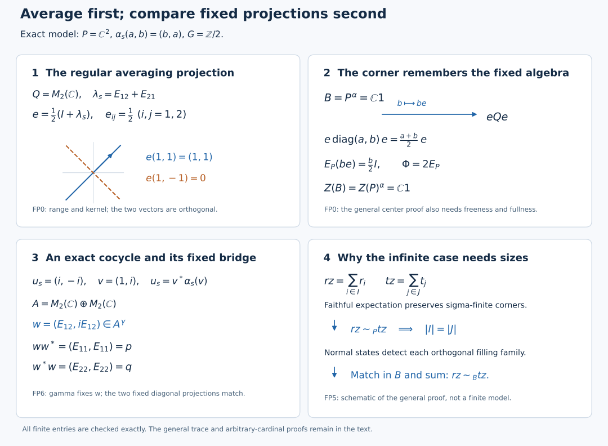

# Finite free actions and cocycle stability

*Self-checked by the writing AI.*

Every unitary cocycle for a free action of a finite group is a coboundary. We begin with the averaging projection in the regular crossed product. Its corner identifies the fixed algebra and its center. Trace transfer and a comparison of arbitrary projection families then turn the cocycle into a partial isometry between two fixed matrix corners. A second proof below develops the standard-form route and a nested-family cardinal comparison.

## Setting and earlier proofs

Throughout, finite groups act by normal star automorphisms on nonzero concrete von Neumann algebras of arbitrary Hilbert dimension. An action is **free** if, for every nonidentity group element $s$, the relation $cx=\alpha_s(x)c$ for every $x$ forces $c=0$. A **unitary cocycle** is a family $u_s\in\mathcal U(M)$ satisfying $u_{st}=u_s\alpha_s(u_t)$ and $u_e=1$. We impose no separability or countable-decomposability hypothesis. Sums of nonnegative numbers mean suprema of finite subsums; orthogonal operator sums mean strong limits of finite sums.

The regular crossed-product coefficients, their uniqueness, the faithful normal completely positive identity-coefficient expectation, and the free relative commutant are proved in [Discrete Fourier columns, finite corners and orbit MASAs](OA-FLOW-L128.md#l128-fc0), FC0–FC4. Its [regular-model transport theorem](OA-FLOW-L128.md#regular-transport) identifies the model in every faithful normal representation. [Projection comparison and the countably decomposable type III case](OA-FLOW-PC.md#oa-flow.pc.0), PC0–PC7, supplies projection joins, polar decomposition, central supports, comparison, Cantor–Bernstein, full-corner centers, finite joins, proper infiniteness and the exact faithful-normal-state criterion for countable decomposability. The cardinal tools are HF1–HF2, LC2–LC3 and CA1 of [Transport a fixed corner, then assemble its local cardinal](OA-FLOW-L120.md#oa-flow.l120.central-cardinal-partition). Those local projection lemmas apply to arbitrary algebras, without the action hypotheses used elsewhere in that lesson.

The trace input is the general finite-algebra theorem in [The normalized trace with its full center retained](OA-FLOW-FCT.md#oa-flow.fct.6), FCT6–FCT8. The trace Hilbert space and its representation are constructed in [Finite ideals and GNS spaces for arbitrary weights](OA-FLOW-GW.md#oa-flow.gw.3), GW3–GW4; their normality follows from [Order-normal positive functionals and ultraweak continuity](OA-FLOW-NF.md#oa-flow.nf.5), NF5, and the faithful normal inverse and ultrastrong topology are proved in [Concrete predual balls and faithful ultraweak representations](OA-FLOW-ST12.md#oa-flow.st.2), ST2. Normal functional supports use NF1, and the normality criterion for positive functionals uses NF1–NF4. The standard-form alternative uses [All projection corners and canonical positive-functional vectors](OA-FLOW-CR.md#oa-flow.cr.9), CR9 and its natural-cone construction, [Canonical standard-form transport and finite balanced matrix cones](OA-FLOW-MC.md#oa-flow.mc.1), MC1, and [A normal regular construction on arbitrary Hilbert spaces](OA-FLOW-NR.md#oa-flow.nr.1), NR1. A finite discrete group automatically satisfies the continuity hypotheses of NR1.

## FP0. The fixed algebra is the averaging corner

Write $P$ for the coefficient algebra, $G$ for the finite group, $n=|G|$, $B=P^\alpha$, and $Q=P\rtimes_\alpha G$ in the faithful normal regular representation. Suppress its coefficient embedding. Let $\lambda_s$ be the regular unitaries and $E_P:Q\to P$ the identity-coefficient expectation. [Discrete Fourier columns, finite corners and orbit MASAs](OA-FLOW-L128.md#l128-fc0) proves coefficient uniqueness. Because the group is finite, every element is the finite sum $\sum_s a_s\lambda_s$: that sum has all the same coefficients, so uniqueness identifies it with the original element. Define

\[
 e_G=\frac1n\sum_{s\in G}\lambda_s,
 \qquad E_B(a)=\frac1n\sum_{s\in G}\alpha_s(a).
 \tag{FP1}
\]

Counting the $n$ pairs with prescribed product proves $e_G^2=e_G$, and inverse permutation gives $e_G^*=e_G$. Both $\lambda_s e_G=e_G$ and $e_G\lambda_s=e_G$ hold. Covariance and the same reindexing give

\[
 e_G a e_G=E_B(a)e_G,
 \qquad e_G Qe_G=B e_G,
 \qquad E_P(be_G)=b/n\quad(b\in B).
 \tag{FP2}
\]

For the middle equality, compress each term $a_s\lambda_s$ and sum; its image is in $B e_G$. The opposite inclusion follows because $b$ commutes with $e_G$ for $b\in B$. Thus $b\mapsto be_G$ is a unital star isomorphism from $B$ onto the corner. Its inverse is $nE_P$ restricted to that corner. Fixed multiplication and the coefficient map are normal, so both directions are normal on their entire domains. In particular $e_G\ne0$.

Now assume the action free. [Discrete Fourier columns, finite corners and orbit MASAs](OA-FLOW-L128.md#l128-fc4) gives $P'\cap Q=Z(P)$. An element of $Z(Q)$ consequently belongs to $Z(P)$ and commutes with every $\lambda_s$, hence is fixed. The converse follows by commuting with the coefficient algebra and all regular unitaries, which generate $Q$. Therefore

\[
 Z(Q)=Z(P)^\alpha.
 \tag{FP3}
\]

If a central projection $z$ of $Q$ annihilates $e_G$, (FP3) and (FP2) give $z/n=E_P(ze_G)=0$. Thus $e_G$ has central support one in $Q$. Apply the complete PC4 normal center isomorphism to this full corner. Its map is $z\mapsto ze_G$. Under (FP2), this says that every $b\in Z(B)$ has $be_G=ze_G$ for a unique $z\in Z(P)^\alpha$. Applying $nE_P$ gives $b=z$. We have proved the literal equality of subalgebras

\[
 \boxed{Z(B)=Z(P)^\alpha\subset Z(P).}
 \tag{FP4}
\]

This argument uses the regular coefficient algebra and the averaging projection. It needs no standard representation of the original action or its commutant.

## FP1. Extend a finite corner trace on its full central support

Let $R$ be a von Neumann algebra, let $f\in R$ be a projection with central support one, and let $\tau$ be a faithful normal tracial state on $fRf$. Choose a maximal family of partial isometries $(v_i)$ with initial projections at most $f$ and pairwise orthogonal final projections, including $v_0=f$. The final projections sum to one. Indeed, a nonzero complementary projection $r$ would have $rRf\ne0$ by PC2; polar decomposition would extend the family. For $x\in R_+$ put

\[
 \operatorname{Tr}(x)=\sum_i\tau(v_i^*xv_i),
 \tag{FP5}
\]

where a sum means the supremum over finite subsets. Positivity, additivity and positive homogeneity follow from this convention; finite subsets from two sums have a common finite union. Normality follows by interchanging the two directed suprema for an increasing positive net. If this value is zero, faithfulness of $\tau$ gives $x^{1/2}v_i=0$ for every $i$; the final projections fill one, so $x=0$.

The trace identity has a positive double-sum proof. For $a\in R$, insert the increasing finite sums of $v_jv_j^*$ between $a^*$ and $a$, apply normality of $\tau$ in each corner, and then use traciality in $fRf$:

\[
 \begin{aligned}
 \operatorname{Tr}(a^*a)
 &=\sum_{i,j}\tau\big((v_j^*av_i)^*(v_j^*av_i)\big)\\
 &=\sum_{i,j}\tau\big((v_j^*av_i)(v_j^*av_i)^*\big)
 =\operatorname{Tr}(aa^*).
 \end{aligned}\tag{FP6}
\]

Every entry lies in $fRf$. No rearrangement of conditionally convergent scalar series occurs: both iterated positive sums equal the supremum over finite rectangles. Write $h_J=\sum_{i\in J}v_iv_i^*$ for a finite subset $J$. (FP6) gives $\operatorname{Tr}(h_J)=\sum_{i\in J}\tau(v_i^*v_i)\le |J|$. For bounded $x\ge0$, the positive net $x^{1/2}h_Jx^{1/2}$ increases strongly to $x$, and (FP6) bounds its trace by $\|x\|\operatorname{Tr}(h_J)$. This proves semifiniteness. Orthogonality to the distinguished final projection $f$ gives $\operatorname{Tr}(f)=\tau(f)=1$. The same orthogonality makes all other summands vanish on the positive cone of the corner, so the trace restricts exactly to the original corner trace. Thus (FP5) is a faithful normal semifinite trace with the prescribed finite-corner restriction.

## FP2. A bounded adjoint test detects finiteness

Let $R$ carry a faithful normal semifinite trace $\rho$, and let $a\in R$ satisfy $\rho(a^*a)<\infty$. If a bounded net $x_i$ tends ultrastrongly to zero, then

\[
 \|ax_i^*\|_{2,\rho}^2
 =\rho(a x_i^*x_i a^*)\longrightarrow0.
 \tag{FP7}
\]

Here $t\mapsto\rho(a t a^*)$ is a bounded normal positive functional, of value $\rho(aa^*)=\rho(a^*a)$ at one; normality follows from normality of the trace and NF1–4's finite-functional order-to-topology theorem. For a bounded finite-$L^2$ element $b$, traciality gives

\[
 \|(ax_i^*)b\|_{2,\rho}\le\|b\|\,\|ax_i^*\|_{2,\rho}.
 \tag{FP8}
\]

Indeed move $bb^*$ cyclically inside the positive trace expression and use $bb^*\le\|b\|^2 1$. Finite-$L^2$ elements are dense in the trace Hilbert space by GW3's construction. The uniformly bounded left multiplication operators of $ax_i^*$ therefore tend strongly to zero on the entire Hilbert space. GW4 proves faithfulness for a faithful semifinite weight; NF5 proves that its GNS representation is ultraweakly continuous on the entire algebra. ST2 then proves its von Neumann image, normal inverse and both directions of the intrinsic ultrastrong topology. Its explicit square-summable vector-series estimate converts bounded strong convergence into ultrastrong convergence, first on a finite sum and then with a uniform tail estimate. Pulling those normal functionals back through the inverse gives $ax_i^*\to0$ ultrastrongly in $R$.

The converse test uses a concrete sequence. If a projection $q$ is infinite, choose $w\in qRq$ with $w^*w=q$ and $ww^*<q$, and set $d=q-ww^*\ne0$. For $k\ge1$ put

\[
 d_k=w^k d(w^*)^k,
 \qquad y_k=d(w^*)^k,
 \qquad y_k^*y_k=d_k,
 \qquad y_ky_k^*=d.
 \tag{FP9}
\]

Since $dw=0$ and $w^*d=0$, the $d_k$ are pairwise orthogonal projections. For every normal positive functional their values have bounded finite partial sums, so tend to zero. Thus $y_k\to0$ ultrastrongly. A normal positive functional with nonzero value on $d$ shows that $y_k^*$ does not tend ultrastrongly to zero. Consequently continuity of the adjoint on the bounded unit ball forces the algebra finite.

## FP3. Finiteness transfers from a free finite-group fixed algebra

Keep the free action and notation of FP0. Suppose first that $B$ has a faithful normal tracial state $\tau$. FP0's corner identification and full central support let FP1 construct a faithful normal semifinite trace on $Q$, finite on $e_G$. The map

\[
 \Phi=nE_P:Q\longrightarrow P,
 \qquad \Phi(ae_Gb)=ab,
 \qquad \Phi(1)=n1
 \tag{FP10}
\]

is normal and completely positive; the formula is the identity-coefficient calculation. $\Psi=\Phi/n$ is unital completely positive. Applying its two-by-two positivity to $\begin{pmatrix}y^*y&y^*\\y&1\end{pmatrix}$ and testing the image on $(\xi,-\Psi(y)\xi)$ proves $\Psi(y)^*\Psi(y)\le\Psi(y^*y)$. Thus

\[
 \Phi(y)^*\Phi(y)\le n\Phi(y^*y).
 \tag{FP11}
\]

A bounded ultrastrongly null net $x_i\in P$ is also ultrastrongly null in $Q$: every normal positive functional on $Q$ restricts to one on its normally embedded coefficient algebra. FP2 applied with $a=e_G$ makes $e_Gx_i^*\to0$ ultrastrongly. Set $y=e_Gx_i^*$ in (FP11). Formula (FP10) gives

\[
 0\le x_ix_i^*\le n\Phi(x_i e_Gx_i^*)\longrightarrow0
 \quad\hbox{ultraweakly}.
 \tag{FP12}
\]

The positive expression inside $\Phi$ tends ultraweakly to zero by the definition of ultrastrong convergence of $e_Gx_i^*$. Normality of $\Phi$ and normal positive tests justify the last conclusion. Hence $x_i^*\to0$ ultrastrongly in $P$. (FP9) shows that $P$ is finite.

For an arbitrary finite $B$, FCT provides its faithful normal center-valued trace $T_B$. Every nonzero central corner has a nonzero normal positive functional on its abelian center. On that functional's support it is faithful. Choose a maximal orthogonal family $(z_j)$ of such central supports; it fills one, since a nonzero remaining corner would supply another. After normalizing the functionals, their compositions with $T_B$ give faithful normal tracial states on $Bz_j$. By (FP4) every $z_j$ is also central in $P$ and invariant. The restriction of the action to $Pz_j$ is free, since a corner intertwiner extended by zero would intertwine on $P$. The preceding argument makes every $Pz_j$ finite. A proper isometry in $P$ would have a proper central component in at least one $Pz_j$, so $P$ is finite. This proves

\[
 \boxed{P^\alpha\text{ finite and }\alpha\text{ free},\ |G|<\infty
 \quad\Longrightarrow\quad P\text{ finite}.}
 \tag{FP13}
\]

## FP4. Invariant corners keep freeness

Keep the free finite-group action of FP0. Let $f\in P^\alpha$ be a nonzero projection. Its ambient central support $z$ is invariant, by the defining least-central-projection property. Work first in $Pz$, where $f$ is full. Choose partial isometries $w_j$ with initial projections at most $f$, orthogonal final projections summing to $z$, and $w_0=f$. Suppose $c\in fPf$ satisfies $cx=\alpha_s(x)c$ for all $x\in fPf$, with $s\ne e$. Define

\[
 C=\sum_j\alpha_s(w_j)c w_j^*.
 \tag{FP14}
\]

The summands have orthogonal input projections $w_jw_j^*$ and orthogonal output projections $\alpha_s(w_jw_j^*)$. Finite sums and their adjoints have norm at most $\|c\|$, so PC1 supplies their strong-star sum in $Pz$. If $a\in Pz$, test on $w_k\xi$. Each $w_j^*aw_k$ lies in $fPf$ and satisfies the intertwining relation. It follows that

\[
 Caw_k=\sum_j\alpha_s(w_jw_j^*aw_k)c
 =\alpha_s(aw_k)c=\alpha_s(a)Cw_k.
 \tag{FP15}
\]

For the last equality, if $p_k=w_k^*w_k$, then $cp_k=\alpha_s(p_k)c$ and $\alpha_s(w_k)\alpha_s(p_k)=\alpha_s(w_k)$. The ranges of the $w_k$ span the whole represented $z$-space; boundedness extends (FP15) to $Ca=\alpha_s(a)C$. Extending by zero outside $z$ gives a global intertwiner. Freeness forces $C=0$, while $fCf=c$, so $c=0$. The restricted action on every invariant corner is therefore free.

Apply (FP13) inside $fPf$. Any finite invariant projection in $B$ is finite in $P$. Conversely, if $f$ is properly infinite in $P$, it is properly infinite in $B$. Otherwise PC5 gives a nonzero finite central summand of $fBf$. The corner freeness just proved and FP0's center equality, applied to $fPf$, make that summand central in $fPf$ as well. Finiteness transfer contradicts the proper infiniteness of this nonzero central summand of $fPf$.

## FP5. The comparison needed after a faithful expectation

Suppose $B\subseteq P$ is a unital inclusion with a faithful normal conditional expectation $E$, with $Z(B)\subseteq Z(P)$. If $r,t\in B$ are properly infinite projections and have the same central support in $B$, then

\[
 r\sim_P t\quad\Longrightarrow\quad r\sim_B t.
 \tag{FP16}
\]

First, a projection $f\in B$ has a faithful normal state on $fBf$ exactly when it has one on $fPf$. In one direction compose the state with the compressed expectation $x\mapsto fE(x)f$; its faithfulness follows from that of $E$. In the other direction restrict a faithful normal state. PC7 equates these conditions with countable decomposability of the respective corner.

Let $c=c_B(r)=c_B(t)$. Work in $Bc\subset Pc$, so $r,t$ are full in the smaller algebra; $c\in Z(P)$ makes this a unital inclusion with expectation. Apply [Transport a fixed corner, then assemble its local cardinal](OA-FLOW-L120.md#oa-flow.l120.central-cardinal-partition), LC3, separately to $r$ and $t$ in $Bc$. That complete earlier theorem gives central partitions on which each projection is an infinite filling homogeneous sum of sigma-finite properly infinite projections, with each summand full on its part. It is proved by constructing a full sigma-finite subprojection, making it properly infinite with countable copies, extending its family maximally, absorbing the residual with HF1–2, and assembling the central parts. No countability of $Bc$ is a hypothesis.

Intersect these two partitions and discard zero pieces. On each resulting central projection $z$, both filling families remain homogeneous, sigma-finite and properly infinite; every member is nonzero and full in $Bz$. The compressed faithful states and partial isometries establish these assertions exactly as in LC3. Write the two families as $(r_i)_{i\in I}$ and $(t_j)_{j\in J}$, with sums $rz$ and $tz$. Both index sets are infinite. Because $z\in Z(P)$, an ambient equivalence $v$ from $r$ to $t$ restricts to $vz$, from $rz$ to $tz$.

The projections $v r_i v^*$ fill $tz$ in $P$ and are sigma-finite there by the expectation argument and partial-isometry conjugation. The $t_j$ have the same ambient sigma-finiteness. [Transport a fixed corner, then assemble its local cardinal](OA-FLOW-L120.md#oa-flow.l120.covering-bound), LC2's covering bound, applied twice in $tzPtz$, therefore gives $|J|\le |I|$ and $|I|\le |J|$. For clarity, the bound uses a normal state supported faithfully on each member of one filling family. Each state detects at most countably many members of the other orthogonal family, since its finite partial sums of values are bounded by one. Together the states detect all nonzero members: zero on every supporting corner would make the square root annihilate their filling ranges. Well-ordering and L120 CA1's proved infinite-cardinal product then bound the size of the second family by the first. This argument requires no equality of the two ambient centers.

Choose a bijection $I\to J$. A matched pair $r_i,t_j$ is sigma-finite and properly infinite in $B$, with the same central support $z$. [Projection comparison and the countably decomposable type III case](OA-FLOW-PC.md#oa-flow.projection.pc7), PC7, gives subequivalence in both directions, and PC3 gives equivalence in $Bz$. PC1's arbitrary orthogonal sum of the corresponding partial isometries implements $rz\sim_{Bz}tz$. Finally sum over the orthogonal central partition of $c$ to get $r\sim_B t$, proving (FP16). The zero common support case is immediate.

This proof applies the homogeneous-family construction twice and compares the two covering cardinals. Full central support alone does not determine cardinal size. The second proof below gives another method: equations (T21a)–(T22) construct nested homogeneous families on successively smaller central pieces, absorb the residual, and compare the resulting cardinals.

## FP6. Apply the two comparisons to the matrix cocycle

Let the finite group act freely on $M$, and let $u$ be a unitary cocycle. Form $A=M\bar\otimes M_2(\mathbb C)$ and

\[
 d_s=\operatorname{diag}(1,u_s),\qquad
 \gamma_s=\operatorname{Ad}(d_s)(\alpha_s\otimes\mathrm{id}),\qquad
 F=A^\gamma,\quad p=1\otimes e_{11},\quad q=1\otimes e_{22}.
 \tag{FP17}
\]

The cocycle identity proves the action law and fixes $p,q$. Freeness follows directly: if $CX=\gamma_s(X)C$, then $d_s^*C$ intertwines $\alpha_s\otimes\mathrm{id}$. Testing scalar matrix units makes it $c\otimes1$, and testing $x\otimes e_{11}$ gives $cx=\alpha_s(x)c$, hence zero. FP0 gives $Z(F)=Z(A)^\gamma$. Thus $p$ and $q$ have central support one in $F$, as is seen by multiplying any annihilating central projection in $Z(A)$.

The largest properly infinite central summand of $A$ is invariant, by uniqueness of the PC5 finite/properly-infinite decomposition. On that summand, the diagonal projections are properly infinite in $A$. Indeed, by PC4 every central projection of $pAp$ is $zp$ for a central projection $z$ of $A$. If a nonzero such $zp$ were finite, its equivalent $zq$ would be finite also; PC6's finite-join theorem would make $z=zp+zq$ finite, contradicting the properly infinite central unit. The same reasoning applies to $q$. They are therefore properly infinite in $F$ by FP4. Averaging is a faithful normal conditional expectation from $A$ onto $F$: positivity and complete positivity are preserved by averaging, fixed elements give bimodularity, and for $x\ge0$, $E_F(x)\ge x/n$. Ambient equivalence $p\sim_A q$ and (FP16) now give equivalence in $F$.

On the finite central summand, $F$ is finite as a subalgebra of finite $A$. FCT's normalized normal center-valued trace $T_A$ satisfies $T_A\gamma_s=\gamma_sT_A$ by its proved uniqueness. Thus $T_A(F)\subset Z(A)^\gamma=Z(F)$, and its restriction is the normalized normal faithful center-valued trace of $F$. The two diagonal projections have value one-half of the central unit, because they are equivalent in $A$ and add to that unit. FCT's full projection comparison makes them equivalent in $F$ there also. Add the two central partial isometries to obtain $w\in pFq$ with $ww^*=p$, $w^*w=q$.

Write $w=e_{12}v$ with $v\in M$ unitary. Its fixedness is exactly $\alpha_s(v)u_s^*=v$, so

\[
 u_s=v^*\alpha_s(v),\qquad
 \operatorname{Ad}(u_s)\alpha_s
 =\operatorname{Ad}(v^*)\alpha_s\operatorname{Ad}(v).
 \tag{FP18}
\]

Thus every unitary cocycle for a finite free action is a coboundary, with the specified inner conjugacy (FP18). The finite and properly infinite central summands have both been treated at arbitrary cardinality.

## An averaging projection and its cocycle application

Panels 1–3 are an exact finite model of FP0 and FP6. Take $P=\mathbb C^2$ and let the nonidentity element $s$ of $G=\mathbb Z/2$ interchange the coordinates. This action is free: testing $c x=\alpha_s(x)c$ at $x=(1,0)$ forces both coordinates of $c$ to vanish. Embed $P$ as diagonal matrices and represent $\lambda_s$ by $E_{12}+E_{21}$. The four products of a diagonal basis vector with $1$ or $\lambda_s$ are the four matrix units, so coefficient uniqueness identifies the crossed product with $M_2(\mathbb C)$. Its identity-coefficient expectation is diagonal extraction. The projection $e=(1+\lambda_s)/2$ has every matrix entry $1/2$. The solid and dashed lines are its range and kernel in the real coordinate plane; they show the directions of $(1,1)$ and $(1,-1)$ with one uniform display scale. The formula beside each line gives its exact image. The arrow in panel 2 is the normal star isomorphism $B\to eQe$, $b\mapsto be$, with inverse $2E_P$. Here $B=\mathbb C1$, so the displayed scalar $b$ multiplies the identity when viewed in $P$.

In panel 3, $u_e=1$ and $u_s=(i,-i)$ form a unitary cocycle since $u_s\alpha_s(u_s)=(1,1)$. The unitary $v=(1,i)$ satisfies $u_s=v^*\alpha_s(v)$. In $A=M_2(\mathbb C)\oplus M_2(\mathbb C)$ put $D_0=\operatorname{diag}(1,i)$ and $D_1=\operatorname{diag}(1,-i)$. The action is $\gamma_s(X_0,X_1)=(D_0X_1D_0^*,D_1X_0D_1^*)$. Multiplying these matrices shows that it fixes $w=(E_{12},iE_{12})$, that $ww^*=p=(E_{11},E_{11})$, and that $w^*w=q=(E_{22},E_{22})$. Thus the bridge is a specified partial isometry, not an arbitrary map between the two projections.

Panel 4 is a schematic of the separate general proof FP5. Its $z$ is a central projection in the common-support partition, and its families consist of full sigma-finite properly infinite projections in $Bz$. A faithful normal expectation makes them sigma-finite in the ambient algebra too. Ambient equivalence transports one filling family; the exact normal-state covering bound proves equality of the two infinite cardinals. Matching the families and summing partial isometries takes place back in $B$. This panel does not model an infinite cardinal by a finite matrix. The full trace-transfer proof FP1–FP4 and arbitrary-cardinal proof FP5 remain necessary.

The general cocycle theorem's human-source antecedent is Takesaki, *Theory of Operator Algebras II*, XI.2 Proposition 2.26. Its projection antecedents are Takesaki I, V.1.34/1.39 and V.3.17; the exact programme proofs used here are PC0–7 and L120 HF1–2/LC1–3. The complete local arguments are FP0–FP6 and the second proof below.

Original exposition, diagram, caption and renderer: CC0-1.0 to the extent of rights held. Mathematical display positions are separate from the [exact model data](../assets/finite-free-action-stability/figure/averaging-corner-data.json). The bundled DejaVu font retains its accompanying [license](../assets/finite-free-action-stability/figure/FONT-LICENSE.txt). [Renderer](../assets/finite-free-action-stability/render_averaging_corner.py), [SVG](../assets/finite-free-action-stability/figure/averaging-corner.svg) and [PNG](../assets/finite-free-action-stability/figure/averaging-corner.png).

## A second proof through standard form and nested families

For a free action of a finite group, every unitary one-cocycle is a
coboundary.  The matrix trick turns that assertion into equivalence of two
fixed diagonal projections.  The finite part is settled by a center-valued
trace. On the properly infinite part, a faithful expectation transfers
countable decomposability, and homogeneous projection families control
arbitrary cardinal sizes. We prove the finiteness transfer and this comparison
explicitly, with no restriction on Hilbert dimension or the cardinality of
the projection families.

Let $M$ be a nonzero von Neumann algebra, let $G$ be a finite group with
identity $e$, and let $\alpha:G\to\operatorname{Aut}(M)$ be free in the
sense of [Discrete Fourier columns, finite corners and orbit MASAs](OA-FLOW-L128.md#l128-setting).
Let $u:G\to\mathcal U(M)$ satisfy

$$
u_{st}=u_s\alpha_s(u_t),
\qquad
u_e=1.
\tag{T1}
$$

No separability, sigma-finiteness, or countable-decomposability assumption is
made.

## A matrix cocycle turns coboundaries into fixed-corner equivalence

Put

$$
A=M\overline\otimes M_2(\mathbb C),
\qquad
d_s=\begin{pmatrix}1&0\\0&u_s\end{pmatrix},
\qquad
\gamma_s=\operatorname{Ad}(d_s)\circ(\alpha_s\otimes\operatorname{id}).
\tag{T2}
$$

Equation (T1) says

$$
d_{st}=d_s(\alpha_s\otimes\operatorname{id})(d_t),
\tag{T3}
$$

so $\gamma$ is an action.  With the standard matrix units, set

$$
F=A^\gamma,
\qquad
p=1\otimes e_{11},
\qquad
q=1\otimes e_{22}.
\tag{T4}
$$

Both $p$ and $q$ are fixed.  A partial isometry $w\in pFq$ with

$$
ww^*=p,
\qquad
w^*w=q
\tag{T5}
$$

has the form $w=e_{12}v$ for a unitary $v\in M$.  Direct multiplication
gives

$$
\gamma_s(e_{12}v)=e_{12}\alpha_s(v)u_s^*.
\tag{T6}
$$

Thus $w\in F$ precisely when

$$
u_s=v^*\alpha_s(v).
\tag{T7}
$$

Writing $a=v^*$, equation (T7) is the coboundary formula

$$
u_s=a\alpha_s(a^*).
\tag{T8}
$$

It remains to prove $p\sim q$ inside $F$, rather than merely inside the
ambient matrix algebra $A$.

## Freeness survives the matrix cocycle perturbation

Fix $s\ne e$, and suppose $C\in A$ satisfies

$$
CX=\gamma_s(X)C
\qquad(X\in A).
\tag{T9}
$$

Set $D=d_s^*C$.  Then

$$
DX=(\alpha_s\otimes\operatorname{id})(X)D.
\tag{T10}
$$

Taking $X=1\otimes b$, $b\in M_2(\mathbb C)$, shows that $D$ commutes
with the full scalar matrix algebra.  Hence $D=c\otimes1_2$ for some
$c\in M$.  Taking $X=x\otimes e_{11}$ in (T10) gives

$$
cx=\alpha_s(x)c
\qquad(x\in M).
\tag{T11}
$$

Freeness of $\alpha_s$ makes $c=0$, and therefore $C=0$.  Thus

$$
\boxed{\gamma\text{ is free}.}
\tag{T12}
$$

This calculation proves both stability operations actually used here:
matrix amplification and perturbation by the specified cocycle do not destroy
freeness.

## Standard implementation identifies the fixed center

The complete [All projection corners and canonical positive-functional vectors](OA-FLOW-CR.md#oa-flow.cr.9) construction supplies a faithful normal semifinite weight on $A$, and its natural-cone construction supplies a standard form. [Canonical standard-form transport and finite balanced matrix cones](OA-FLOW-MC.md#oa-flow.mc.1) constructs the canonical transport, and [A normal regular construction on arbitrary Hilbert spaces](OA-FLOW-NR.md#oa-flow.nr.1) proves the implementing action law and commutation with the conjugation. Thus let $U_s$ be its canonical standard unitary implementing $\gamma_s$. The finite discrete group satisfies the continuity hypothesis automatically. The induced action on $A'$ is

$$
\gamma'_s=\operatorname{Ad}(U_s)|_{A'}.
\tag{T13}
$$

It is free. Standard implementers commute with the modular conjugation
$J$. The map $\kappa:A'\to A$, $\kappa(b)=Jb^*J$, is a linear
$*$-anti-isomorphism, and $\kappa\gamma'_s=\gamma_s\kappa$.
If $bY=\gamma'_s(Y)b$ for every $Y\in A'$, set $c=\kappa(b)$.
Applying $\kappa$ reverses the products and gives

$$
Xc=c\gamma_s(X)\quad(X\in A),\qquad
c^*X=\gamma_s(X)c^*\quad(X\in A).
\tag{T13a}
$$

The second identity follows by taking adjoints in the first and then
replacing $X^*$ by $X$. Freeness in (T12) gives $c^*=0$, hence $b=0$.

The integrated representations

$$
A\rtimes_\gamma G\longrightarrow(A\cup U(G))'',
\qquad
A'\rtimes_{\gamma'}G\longrightarrow(A'\cup U(G))''
\tag{T14}
$$

are faithful. For either map, its kernel is an ultraweakly closed star ideal and hence is generated by a central projection $z$ of the crossed product. Here is the ideal fact: take the join of all support projections of its positive elements. Each support is in the ideal by bounded continuous calculus followed by a strong limit; finite joins are supports of finite positive sums, and their increasing strong limit is again in the ultraweakly closed ideal. Conjugation by any unitary preserves the ideal and this join, making the join central. Every ideal element is supported there, and every element supported there belongs to the ideal.  By the
free relative-commutant theorem of [Discrete Fourier columns, finite corners and orbit MASAs](OA-FLOW-L128.md#l128-fc4), $z$ belongs to the center of
the coefficient algebra.  The representation is the identity on that
coefficient algebra, so $z=0$.

For completeness, the maps in (T14) exist as normal maps before their
faithfulness is tested. For a finite group, the coefficient
uniqueness in [Discrete Fourier columns, finite corners and orbit MASAs](OA-FLOW-L128.md#l128-fc0) gives $x=\sum_{s\in G}x(s)u_s$ for every element of the crossed
product. Each coefficient map is normal and contractive. Thus a normal
covariant representation $(\pi,V)$ defines

$$
\Theta(x)=\sum_{s\in G}\pi(x(s))V_s,
\qquad
\|\Theta(x)\|\leq |G|\|x\|.
\tag{T14a}
$$

Covariance checks multiplication and adjoints in this finite sum.
Normality follows from normality of its finitely many coefficient maps
and of $\pi$. Apply this to the standard representations of $A$
and $A'$; the kernel argument above proves faithfulness. The faithful normal image is a von Neumann algebra by [Concrete predual balls and faithful ultraweak representations](OA-FLOW-ST12.md#oa-flow.st.2), ST2. Since every image is a finite sum of products of the displayed generators, that image is exactly the von Neumann algebra generated by $\pi(A)$ and $V(G)$.

Now

$$
F=A\cap U(G)'=(A'\cup U(G))',
\qquad
F'=(A'\cup U(G))''.
\tag{T15}
$$

Apply [Discrete Fourier columns, finite corners and orbit MASAs](OA-FLOW-L128.md#l128-fc4) to the free action $\gamma'$ in the second faithful
representation in (T14).  It gives

$$
F'\cap A
=A\cap(A'\cup U(G))''
=Z(A).
\tag{T16}
$$

Intersecting with $F$ yields the exact center formula

$$
\boxed{Z(F)=Z(A)^\gamma.}
\tag{T17}
$$

In particular, $p$ and $q$ have central support one in $F$: a central
projection of $F$ annihilating either diagonal matrix projection lies in
$Z(A)$ by (T17), and that matrix projection has full central support in
$A$.

## Finiteness transfer and arbitrary-cardinal comparison

The full projection, topology, GNS and center-valued trace proofs were specified in the opening prerequisites. In particular, [Projection comparison and the countably decomposable type III case](OA-FLOW-PC.md#oa-flow.projection.pc4) proves the full-corner center identification; [Finite ideals and GNS spaces for arbitrary weights](OA-FLOW-GW.md#oa-flow.gw.3), [Order-normal positive functionals and ultraweak continuity](OA-FLOW-NF.md#oa-flow.nf.5) and [Concrete predual balls and faithful ultraweak representations](OA-FLOW-ST12.md#oa-flow.st.2) supply the faithful normal tracial GNS representation and its bounded ultrastrong topology; and [The normalized trace with its full center retained](OA-FLOW-FCT.md#oa-flow.fct.7) proves the general finite-algebra center-valued trace and comparison. The following bounded-topology and homogeneous-family arguments state all remaining consequences explicitly.

### The bounded adjoint test

Let $R$ carry a faithful normal semifinite trace $\rho$, and let
$a\in R$ satisfy $\rho(a^*a)<\infty$. If a bounded net $x_i$ tends
ultrastrongly to zero, its tracial GNS representation tends strongly to
zero. Since $a^*$ is an $L^2$ vector, traciality gives

$$
\|ax_i^*\|_{2,\rho}
 =\|x_i a^*\|_{2,\rho}\longrightarrow0,
\qquad
\|(ax_i^*)b\|_{2,\rho}
 \leq\|b\|\,\|ax_i^*\|_{2,\rho}.
\tag{T18a}
$$

The second inequality follows by moving $bb^*$ inside the positive
trace expression and using $bb^*\leq\|b\|^2 1$. The bounded elements
of finite $L^2$ norm form a dense subspace of $L^2(R,\rho)$.
Equation (T18a), with the uniform operator bound
$\|ax_i^*\|\leq\|a\|\sup_i\|x_i\|$, therefore proves strong
convergence on the whole GNS Hilbert space. The faithful normal
representation transports the bounded ultrastrong topology, so
$ax_i^*\to0$ ultrastrongly in $R$.

Conversely, if a projection $e$ is infinite, choose $w\in eRe$ with
$w^*w=e$ and $ww^*<e$, and put $d=e-ww^*\ne0$. For $n\geq1$ set

$$
d_n=w^n d(w^*)^n,\qquad y_n=d(w^*)^n,
\qquad y_n^*y_n=d_n,\qquad y_ny_n^*=d.
\tag{T18b}
$$

The $d_n$ are mutually orthogonal projections. Every normal positive
functional has summable values on them, so $d_n\to0$ ultraweakly and
$y_n\to0$ ultrastrongly. A normal positive functional nonzero on $d$
shows that $y_n^*$ does not tend ultrastrongly to zero. Thus the
adjoint is discontinuous on the unit ball of every infinite corner.
In particular, bounded ultrastrong continuity of the adjoint on $R$
forces $R$ to be finite. This proves the two special facts from
V.2.27--2.28 used in (T20).

### Averaging has a complete-positivity bound

Let a finite group $K$ act freely on $P$, put $B=P^K$, and write
$n=|K|$. Its faithful normal expectation satisfies

$$
E(x)=\frac1n\sum_{s\in K}\alpha_s(x),
\qquad
nE-\operatorname{id}_P=\sum_{s\ne e}\alpha_s.
\tag{T18}
$$

The last map is completely positive, since every automorphism is completely
positive. This proves the bound at every matrix level with the same constant
$n$; no inference from positivity alone is being made.

We first show that $B$ finite implies $P$ finite. Suppose initially that
$B$ is countably decomposable. Choose a faithful normal tracial state
$\tau$ on $B$, and use the standard representation for
$\varphi=\tau\circ E$. The canonical implementers $U_s$ fix its cyclic
vector: the state is invariant under the group, and NR1 identifies the implementing image of its unique cone vector with the vector of the transported state, hence the same vector. By freeness, their integrated representation identifies
$Q=(P\cup U(K))''$ faithfully with $P\rtimes K$, as in (T14).
The averaging projection and coefficient map are

$$
e_B=\frac1n\sum_{s\in K}U_s,
\qquad
\Phi=nE_P:Q\longrightarrow P,
\qquad
\Phi(xe_By)=xy,\quad \Phi(1)=n1.
\tag{T19}
$$

Here $E_P$ is the normal crossed-product coefficient expectation.
The range of $e_B$ is the closure of $B\Omega_\varphi$: on the dense GNS vectors it sends $x\Omega_\varphi$ to $E(x)\Omega_\varphi$, so its range is the closure of that image. Moreover,
$e_B Qe_B=Be_B\cong B$. Its central support in $Q$ is one: a
central projection $z$ annihilating $e_B$ belongs to $Z(P)^K$ by the
free relative-commutant theorem, while $E_P(ze_B)=z/n$ makes $z=0$.

There is a faithful normal semifinite trace $\operatorname{Tr}$ on $Q$
with $\operatorname{Tr}(e_B)=1$. One can construct it directly from
$\tau$: choose partial isometries $v_i\in Q$ with mutually orthogonal
final projections summing to one, initial projections at most $e_B$,
and one member equal to $e_B$. Full central support gives such a family
by maximality. For $x\geq0$ put
$\operatorname{Tr}(x)=\sum_i\tau(v_i^*xv_i)$, using the identification
$e_B Qe_B\cong B$. Normality and faithfulness follow from this positive
sum. Inserting $\sum_jv_jv_j^*=1$ and applying the finite-corner trace
to each matrix entry gives
$\operatorname{Tr}(x^*x)=\operatorname{Tr}(xx^*)$.
The final projections have trace at most one and sum to one. Their finite
sums $h$ give positive approximants $x^{1/2}hx^{1/2}\leq x$ with trace at
most $\|x\|\operatorname{Tr}(h)$, increasing strongly to each bounded
$x\geq0$. This proves semifiniteness. The distinguished member and
orthogonality give $\operatorname{Tr}(e_B)=1$.

Let a bounded net $x_i\in P$ converge ultrastrongly to zero.
The bounded adjoint test (T18a), applied to $e_B\in L^2(Q,\operatorname{Tr})$,
gives $e_Bx_i^*\to0$ ultrastrongly. Thus
$x_i e_Bx_i^*\to0$ ultraweakly. The Schwarz inequality for
the unital completely positive map $\Phi/n$ yields

$$
x_i x_i^*
 =\Phi(e_Bx_i^*)^*\Phi(e_Bx_i^*)
 \leq n\Phi(x_i e_Bx_i^*)\longrightarrow0
\quad\hbox{ultraweakly}.
\tag{T20}
$$

Normality of $\Phi$ and testing by positive normal functionals justify
the last implication. Hence $x_i^*\to0$ ultrastrongly.
The discontinuity test (T18b) now makes $P$ finite.

For arbitrary finite $B$, decompose its center into orthogonal
projections $z_a$ such that each $Bz_a$ has a faithful normal tracial
state. To obtain them, take supports of normal positive functionals on
$Z(B)$, compose with the center-valued trace, and use maximality.
The fixed-center calculation (T17), applied to this action, gives
$Z(B)=Z(P)^K\subseteq Z(P)$. Consequently every $z_a$ is also central
in $P$. The preceding proof applies to $Pz_a$, and the central sum of
these finite algebras is finite. This proves the unrestricted assertion.

The assertion also applies to an invariant projection corner. On its
ambient central support the projection is full. Freeness passes to such a
full invariant corner: if $c$ intertwines the restricted action, choose
partial isometries $w_j$ with initial projections in the corner and
orthogonal final projections summing to its ambient central unit, including
the corner projection itself. The bounded strong sum
$C=\sum_j\alpha_s(w_j)c w_j^*$ intertwines the action on the full
algebra, as testing its matrix entries shows. Its corner entry is $c$,
so freeness gives $c=0$. Therefore a finite invariant projection in $B$
is finite in $P$.

In particular, a projection in $B$ that is **properly infinite in $P$** is
properly infinite in $B$. Indeed, apply the fixed-center identity to its free invariant corner, as proved in FP4. A nonzero finite central summand of its fixed corner is then central in its ambient corner and, by finiteness transfer, finite there. That contradicts proper infiniteness of the ambient corner. The center equality must be applied inside this corner; $Z(B)\subseteq Z(P)$ by itself would not identify the center of a noncentral corner. Full central support alone would not suffice:
a rank-one projection in $B(\mathcal H)$ has full central support and
is finite even when the identity is properly infinite.

### Why homogeneous families control the size

Here is the precise local family construction used in (T22). Start with
a nonzero countably decomposable projection $f$ in a unital corner $R$,
and first restrict to its central support $c$. Extend any given
orthogonal family of copies of $f$ to a maximal such family
$(g_i)_{i\in I}$ in $Rc$, and let $h=\sum_i g_i$ and $d=c-h$.
Projection comparison gives a central splitting of $c$ on which either
$dz\precsim fz$ or $f(c-z)\precsim d(c-z)$.
One can choose the first piece nonzero: otherwise $f\precsim d$
would add another copy of $f$ to the maximal family.
Since $f$ has full central support in $Rc$, every $g_i z$ is nonzero.

If $I$ is infinite, choose $i_0\in I$ and a bijection
$I\to I\setminus\{i_0\}$. Summing the corresponding partial
isometries makes $hz$ equivalent to
$\sum_{i\ne i_0}g_i z$. Since $dz\precsim g_{i_0}z$, their
orthogonal ranges give

$$
z=dz+hz\precsim
g_{i_0}z+\sum_{i\ne i_0}g_i z=hz\precsim z.
\tag{T21a}
$$

Cantor--Bernstein gives $z\sim hz$. Transfer the family by this
equivalence to obtain an orthogonal homogeneous family filling $z$.
The transferred members are countably decomposable, and a prescribed
subfamily is retained up to equivalence of its sum. This is why (T22)
uses equivalence for the smaller sum. If $I$ is countable, the residual
$dz\precsim fz$ is also countably decomposable, and so is $z$:
faithful normal states on its countably many orthogonal corners combine,
with positive summable coefficients, to a faithful normal state.
Consequently a corner with no nonzero countably decomposable central
compression yields an uncountable filling family.

We also spell out the countably decomposable comparison used above
(T22). Suppose the unit of $R$ is countably decomposable and
$r\in R$ is properly infinite with central support one. The splitting
in [Projection comparison and the countably decomposable type III case](OA-FLOW-PC.md#oa-flow.projection.pc5), PC5, supplies countably many orthogonal projections
$(r_n)_{n\geq1}$ below $r$, each equivalent to $r$, by iterating
two orthogonal copies inside $r$.
Choose a maximal orthogonal family of nonzero projections $(k_j)$
with $k_j\precsim r$.
Its sum is one. Indeed, if the complementary projection $k$ were
nonzero, full central support implies $kRr\ne0$, and polar
decomposition of a nonzero element of $kRr$ would add a nonzero
projection below $k$ that is subequivalent to $r$.
A faithful normal state on $R$ makes this family countable.
Match its members to distinct $r_n$ and sum the partial isometries:

$$
1=\sum_j k_j\precsim\sum_{n\geq1}r_n\leq r\leq1.
\tag{T21b}
$$

Another application of Cantor--Bernstein gives $r\sim1$.
Thus two full properly infinite projections in a countably
decomposable corner are equivalent. This argument uses countable
decomposability at the cardinal step, exactly as V.1.39 does;
the subsequent uncountable-family argument does not assume it globally.

### A faithful expectation preserves the cardinal comparison

We now prove the needed size statement without an unproved finite
module-dimension estimate. Suppose $B\subseteq P$ has a faithful normal
expectation, $Z(B)\subseteq Z(P)$, and $r,t\in B$ are properly infinite
projections with the same central support. Then

$$
r\sim_P t\quad\Longrightarrow\quad r\sim_B t.
\tag{T21}
$$

A projection $f\in B$ is countably decomposable in $B$ if and only if
it is countably decomposable in $P$. A faithful normal state on $fBf$
composed with the compressed expectation gives one on $fPf$;
conversely restrict a faithful normal state on $fPf$.
Thus the expectation preserves exactly the small projections used below.

Projection comparison splits the common center into two pieces on which
one projection is subequivalent to the other. Interchanging $r,t$ on
one piece and replacing the smaller projection by its equivalent
subprojection, we may assume $r\leq t$ and work in $tBt$.
Every central compression considered here comes from $Z(B)$ and is
therefore also central in $P$, so the ambient equivalence persists.

On any nonzero central piece where $r$ is countably decomposable,
ambient equivalence makes $t$ countably decomposable in $P$ and hence
in $B$. The countable comparison (T21b) then makes these full properly infinite
projections equivalent in the countably decomposable algebra $tBt$.

Consider instead a nonzero central piece on which no nonzero central
compression of $r$ is countably decomposable. Choose a nonzero countably
decomposable projection below $r$. The local family construction (T21a), also proved as HF1–HF2 in [Transport a fixed corner, then assemble its local cardinal](OA-FLOW-L120.md#oa-flow.l120.homogeneous-filling), in $rBr$
gives, on a smaller nonzero central piece, a homogeneous family of
countably decomposable projections filling $r$. Its index set $J$
must be uncountable; a countable family, including any smaller residual
projection, would make that central compression countably decomposable.
The infinite-family clause removes the residual.

Apply the same local construction in $tBt$, extending this family.
After a further nonzero central compression $z$, there are equivalent
countably decomposable projections $(f_i)_{i\in I}$ and a subset
$J\subseteq I$ with

$$
\sum_{i\in I}f_i=tz,\qquad
\sum_{j\in J}f_j\sim_B rz.
\tag{T22}
$$

The extension may move the original subfamily by an equivalence, which is
why the second relation is written as equivalence rather than equality.
All its members remain countably decomposable. Ambient equivalence
transports the $J$-family to a countably decomposable orthogonal family
filling $tz$ in $P$. The LC2 covering bound of [Transport a fixed corner, then assemble its local cardinal](OA-FLOW-L120.md#oa-flow.l120.covering-bound) in $tzPtz$ bounds the size of
the $I$-family by $|J|$. Explicitly, a normal state supported on each
member of the filling $J$-family is nonzero on only countably many
members of the orthogonal $I$-family; together these states detect
every nonzero $f_i$. Hence $|I|\leq\aleph_0|J|=|J|$.
Since $J\subseteq I$, the cardinals agree. Matching the two homogeneous
families by a bijection and summing their partial isometries gives
$rz\sim_B tz$.

We have found such an equivalence on a nonzero subpiece of every nonzero
central piece. A maximal orthogonal family of those central pieces
therefore fills the common central support. The bounded strong sum
of their partial isometries proves (T21) at arbitrary cardinality.

## Properly infinite summands have equivalent fixed corners

Let $z_\infty\in Z(A)$ be the maximal central projection for which
$Az_\infty$ is properly infinite.  Its defining property is invariant under
automorphisms, so $z_\infty\in Z(A)^\gamma=Z(F)$.

In $Az_\infty$, the projections $pz_\infty$ and $qz_\infty$ are
equivalent through $e_{12}z_\infty$, have full central support in
$Fz_\infty$. They are properly infinite in $Az_\infty$, as follows from the finite-join argument in FP6: a finite nonzero central compression of either diagonal corner would make the corresponding compression of the whole matrix algebra finite. Each diagonal corner is isomorphic to $Mz_\infty$.
The finiteness-transfer argument makes them properly infinite in
$Fz_\infty$ as well. Equation (T17) gives the required inclusion of centers,
and the averaging map (T18) is faithful and normal. Apply (T21) to obtain

$$
pz_\infty\sim_{Fz_\infty}qz_\infty.
\tag{T23}
$$

This is the step for which full central support alone would be insufficient.
The homogeneous-family argument (T22), together with preservation of
countable decomposability, controls the arbitrary cardinals.

## Finite summands are decided by the center-valued trace

Put $z_f=1-z_\infty$.  The algebra $Az_f$ is finite, and so is its von
Neumann subalgebra $Fz_f$.  Let

$$
T:Az_f\longrightarrow Z(A)z_f
\tag{T24}
$$

be the normalized faithful normal center-valued trace.  Naturality under
automorphisms gives

$$
T(\gamma_s(x))=\gamma_s(T(x)).
\tag{T25}
$$

For $x\in Fz_f$, the left side is $T(x)$, so (T17) shows that
$T(x)\in Z(F)z_f$.  The restriction of $T$ to $Fz_f$ is therefore its
normalized center-valued trace: it is normal, faithful, tracial, and fixes
every element of the center.  The two diagonal projections have equal value,

$$
T(pz_f)=\frac12z_f=T(qz_f).
\tag{T26}
$$

Center-valued trace comparison for finite von Neumann algebras now gives

$$
pz_f\sim_{Fz_f}qz_f.
\tag{T27}
$$

No scalar trace, finite total mass, or sigma-finite decomposition is used.

## Assemble the central pieces and recover the coboundary

Choose partial isometries in $Fz_\infty$ and $Fz_f$ implementing (T23)
and (T27), and add them.  Their central supports are orthogonal, so the sum
$w\in pFq$ satisfies (T5).  The matrix reduction then gives a unitary $v\in M$
with

$$
u_s=v^*\alpha_s(v)
\qquad(s\in G).
\tag{T28}
$$

Thus every unitary $\alpha$-cocycle is a coboundary.  If

$$
\beta_s=\operatorname{Ad}(u_s)\circ\alpha_s,
\tag{T29}
$$

then (T28) gives the exact conjugacy

$$
\boxed{
\beta_s
=\operatorname{Ad}(v^*)\circ\alpha_s\circ\operatorname{Ad}(v)
\quad(s\in G).}
\tag{T30}
$$

This derives Proposition XI.2.26 in its unrestricted von Neumann algebra
generality at the exact projection and trace foundations stated above.
The finiteness transfer and arbitrary-cardinal descent are now proved
locally; they are not assigned to an unstated induction theorem.

**Problem.** Why may one not replace the cardinal comparison by the statement that
two properly infinite projections of full central support are equivalent?

**Solution.** In $B(\ell^2(I))$ for uncountable $I$, a projection onto a
separable infinite-dimensional subspace and the identity are both properly
infinite and have central support one, but they are not equivalent because
their Hilbert dimensions differ. In (T22), the faithful expectation makes
every countably decomposable fixed-algebra projection countably decomposable
in the ambient algebra. Ambient equivalence then transports a filling family,
and the proved LC2 covering bound forces equality of the two homogeneous family sizes.
This supplies the size information that central support omits. $\square$

Further reading: Takesaki, *Theory of Operator Algebras II*, Proposition
XI.2.26.  Equations (T2)–(T12) establish the matrix
reduction and freeness, (T13)–(T17) justify the standard crossed-product and
fixed-center identifications, (T18)–(T23) prove finiteness transfer and
arbitrary-cardinal comparison, (T24)–(T27) handle the finite summand, and (T28)–(T30) recover the
specified coboundary and conjugacy. The finite-corner Schwarz argument is
related to [Jolissaint, Theorem 1.6(1)](https://doi.org/10.7146/math.scand.a-12359),
printed pages 227–228; that paper assumes countable decomposability.
Here the free crossed-product coefficient map is explicit, and the fixed
center permits the unrestricted central assembly.
