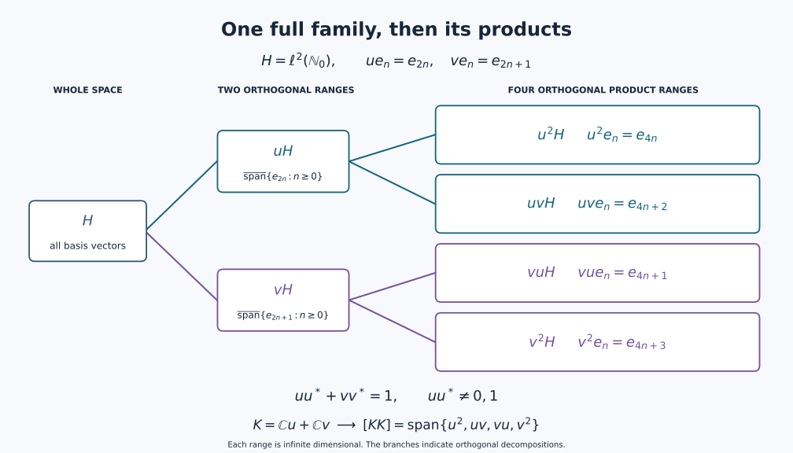

# Internal Hilbert spaces in a von Neumann algebra

*Self-checked by the writing AI.*

A scalar inner product can be encoded by multiplication inside an operator
algebra. Its orthonormal vectors then become isometries, and their ranges
record how much of the algebra the space occupies. We first identify that
support projection and recover vectors from their scalar coefficients. This
gives the topology of these spaces and the constructions by multiplication
and orthogonal placement. The final examples show why fullness matters and
why taking adjoints changes the situation.

Throughout, $M\subseteq B(H)$ is a nonzero unital von Neumann algebra on an
arbitrary Hilbert space, and inner products are linear in the first variable.
No separability or countability hypothesis is imposed. All sums indexed by
an arbitrary set mean nets over its finite subsets.

We use the maximality principle and Hilbert projection and completion proofs
in [Continuous calculus, positivity and Hilbert spaces, Sections 1, 8 and 10](OA-FLOW-CF.md#oa-flow.cf.1),
and the arbitrary orthogonal projection sums proved in
[Projection comparison and the countably decomposable type III case, PC-1](OA-FLOW-PC.md#oa-flow.projection.pc1).
The Hilbert tensor construction is proved in
[Compact topology and the Hilbert tensor construction, H0](OA-FLOW-TOPOLOGY.md#l138-h0).

## Internal Hilbert spaces are full scalar Hilbert subspaces

An **internal Hilbert space** in $M$ is a linear subspace $K\subseteq M$ with
the following properties:

1. for $x,y\in K$ there is a scalar $\langle x,y\rangle$ such that

   $$
   y^*x=\langle x,y\rangle 1;
   \tag{U1}
   $$

2. $K$ is complete for the norm defined by this inner product;
3. $K$ is left full:

   $$
   aK=\{0\},\quad a\in M
   \quad\Longrightarrow\quad
   a=0.
   \tag{U2}
   $$

The scalar in (U1) is unique since $1\ne0$. Linearity of multiplication and
the adjoint rules give sesquilinearity and conjugate symmetry. If
$x^*x=c1$, then for a unit vector $\xi\in H$ we have
$c=\langle x^*x\xi,\xi\rangle=\|x\xi\|^2\ge0$.
The C\*-identity makes $c=0$ equivalent to $x=0$. Thus the scalar form really
is an inner product, without any additional positivity assumption.

The Hilbert norm is already the ambient operator norm, because

$$
\|x\|_M^2=\|x^*x\|
=\|\langle x,x\rangle1\|
=\|x\|_K^2.
\tag{U3}
$$

Thus the inclusion $K\hookrightarrow M$ is isometric, and completeness makes
$K$ norm closed.  Condition (U2) is stronger than nondegeneracy of the inner
product: it records that the left support of the entire embedded space is the
unit of $M$.

Conversely, a norm-closed linear subspace satisfying (U1) is complete for
this Hilbert norm. We call it a **scalar Hilbert subspace** when fullness
has not been assumed. The zero space is allowed under this latter name;
it is not internal in a nonzero algebra. Every unit vector $u$ in a scalar
Hilbert subspace satisfies $u^*u=1$ and is an isometry.

## Bases determine the support and the whole space

**Basis and support theorem.** Let $K\subseteq M$ be a norm-closed scalar
Hilbert subspace. It has an orthonormal basis $(u_i)_{i\in I}$, possibly with
$I$ empty. For any such basis the projections $u_i u_i^*$ are orthogonal and
their strong sum is the same projection $p_K\in M$. It is characterized as
the least projection $p$ satisfying $px=x$ for every $x\in K$. Moreover

$$
aK=0\quad\Longleftrightarrow\quad ap_K=0
\qquad(a\in M).
\tag{U-Support}
$$

In particular, $K$ is internal exactly when $p_K=1$. Conversely, the
norm-closed span of any family $(u_i)\subset M$ with
$u_j^*u_i=\delta_{ij}1$ is a scalar Hilbert subspace, and it is internal
exactly when the strong sum of the range projections is $1$.

**Hilbert coordinates.** Here are the Hilbert-space details for arbitrary
index sets. Order the orthonormal subsets of $K$ by inclusion. The union
of a chain is orthonormal, so the
[maximality principle](OA-FLOW-CF.md#oa-flow.cf.1) supplies a maximal family.
If its closed linear span were proper, the
[Hilbert projection theorem](OA-FLOW-CF.md#oa-flow.cf.8) would give a
nonzero vector perpendicular to that span; normalizing it would enlarge
the family. Thus the family is a basis.

For $x\in K$, put $c_i=\langle x,u_i\rangle$ and
$x_F=\sum_{i\in F}c_i u_i$. Expansion gives

$$
\|x-x_F\|^2=\|x\|^2-\sum_{i\in F}|c_i|^2\ge0.
\tag{U-Bessel}
$$

The supremum of the finite sums is finite. Given $\varepsilon>0$, choose
one finite sum within $\varepsilon^2$ of that supremum. Every disjoint
finite tail then has squared norm at most $\varepsilon^2$, so $(x_F)$ is
norm Cauchy. For completeness, such a Cauchy net in a complete metric
space converges: choose increasing indices with tail diameters at most
$2^{-n}$, take their sequential limit, and use those same tail bounds
for the entire net. Its limit $k$ lies in $K$. The difference $x-k$ is
perpendicular to every $u_i$, hence to their dense span, and is zero.
It follows also that $\|x\|^2=\sum_i|c_i|^2$.

Conversely, for any scalar family $c=(c_i)$ with
$\sum_i|c_i|^2<\infty$, the same finite-tail estimate constructs
$\sum_i c_i u_i$ in norm, with squared norm $\sum_i|c_i|^2$. Each set
$\{i:|c_i|\ge1/n\}$ is finite, so the nonzero coordinates form a
countable union of finite sets, even if $I$ is uncountable. These
arguments give the unitary coefficient map $\ell^2(I)\to K$ and specify
its convergence without choosing an enumeration of $I$.

**Proof of the support assertions.** Equation (U1) gives

$$
u_j^*u_i=\delta_{ij}1.
\tag{U13}
$$

Thus each $u_i$ is an isometry. The projections $p_i=u_i u_i^*$ are
pairwise orthogonal since $p_i p_j=u_i(u_i^*u_j)u_j^*=0$ for $i\ne j$.
For a finite set $F\Subset I$ put

$$
p_F=\sum_{i\in F}u_i u_i^*.
\tag{U14}
$$

By [PC-1](OA-FLOW-PC.md#oa-flow.projection.pc1), these projections converge
strongly to their join $p\in M$. This is also immediate on each vector:
the orthogonal vectors $p_i\xi$ have bounded finite sums of squared norms,
so the same tail argument constructs their sum, the orthogonal projection
onto the closed span of their ranges. For each $j$, we have $pu_j=u_j$.
Norm density of finite basis sums gives $px=x$ for every $x\in K$.

If a projection $q$ satisfies $qx=x$ for all $x\in K$, then $qu_i=u_i$,
so $q p_i=p_i$ for every $i$. Taking the strong sum gives $qp=p$ and
$p\le q$. This least-projection characterization proves independence
of the basis; write $p=p_K$. If $aK=0$, then $au_i=0$, so $ap_F=0$;
the strong limit gives $ap_K=0$. The converse follows from $p_Kx=x$.
In particular, fullness is equivalent to $p_K=1$, because $1-p_K$
annihilates $K$. For an internal space this proves

$$
\boxed{\sum_{i\in I}u_i u_i^*=1
\quad\text{strongly over finite subsets of }I.}
\tag{U15}
$$

Finally, start with any orthogonal isometry family. On finite linear
combinations, multiplication gives

$$
\left(\sum_i d_i u_i\right)^*\left(\sum_i c_i u_i\right)
=\left(\sum_i c_i\overline{d_i}\right)1.
\tag{U-Coordinates}
$$

Its operator norm is therefore the $\ell^2$ norm of its coefficients.
Multiplication and adjoints are norm continuous, so this scalar identity
passes to the norm-closed span. That span is a scalar Hilbert subspace
by (U3), the family is its orthonormal basis, and the support result
already proved supplies the fullness criterion. $\square$

## Recovering a weak limit from its coefficients

**Closedness theorem.** Every norm-closed scalar Hilbert subspace of $M$,
including a nonfull one, is weak-operator closed and is closed in all the
stronger usual operator topologies.

**Proof.** Use the basis and support $p_K$ just constructed. Suppose
$x_\lambda\in K$ and $x_\lambda\to x\in M$ in the weak operator topology.
For every $i$,

$$
u_i^*x_\lambda\in\mathbb C1.
\tag{U16}
$$

For fixed $b\in M$, the map $z\mapsto bz$ is weak-operator continuous,
since $\langle bz\xi,\eta\rangle=\langle z\xi,b^*\eta\rangle$.
The scalar line $\mathbb C1$ is weak-operator closed: if
$c_\lambda1\to b$ weakly, a fixed unit vector $\xi_0$ gives
$c_\lambda\to c=\langle b\xi_0,\xi_0\rangle$; testing any pair
$\xi,\eta$ then gives $\langle b\xi,\eta\rangle=c\langle\xi,\eta\rangle$,
so $b=c1$. Consequently

$$
u_i^*x=\lambda_i1
\quad(i\in I)
\tag{U17}
$$

for scalars $\lambda_i$.  For each finite $F\Subset I$,

$$
\left(\sum_{i\in F}|\lambda_i|^2\right)1
=x^*p_Fx
\le x^*x.
\tag{U18}
$$

Evaluating this positive-operator inequality at any unit vector gives
$\sum_{i\in F}|\lambda_i|^2\le\|x\|^2$. Taking the supremum over finite
$F$ proves $(\lambda_i)_{i\in I}\in\ell^2(I)$.  The Hilbert-space series

$$
k=\sum_{i\in I}\lambda_i u_i
\tag{U19}
$$

converges in $K$, hence in the operator norm of $M$.  Equations (U17) and
(U19) give $u_i^*(x-k)=0$ for every $i$, and therefore
$p_F(x-k)=0$ for every finite $F$.  Since $p_Kx_\lambda=x_\lambda$, weak continuity also gives $p_Kx=x$;
and $p_Kk=k$ by definition of the support. Passing strongly to
$p_F\to p_K$ now yields $x-k=p_K(x-k)=0$. This includes the full case
$p_K=1$ of (U15), and the zero space when the basis is empty.
Thus $x\in K$.

We have shown that $K$ is weak-operator closed.  It follows that it is closed
for every stronger usual operator topology: strong, strong-star, ultraweak,
ultrastrong, and ultrastrong-star. Indeed, strong convergence implies weak
operator convergence by scalar Cauchy–Schwarz; strong-star convergence
includes strong convergence. The ultraweak seminorms include each single
vector functional, and the ultrastrong seminorms include each single-vector
norm; adjoining the adjoint seminorms only strengthens a topology.  Equation (U3) and completeness give norm
closedness as well.

$\square$

## Multiplication realizes the Hilbert tensor product internally

**Tensor theorem.** If $K,L\subseteq M$ are internal, multiplication
induces a unitary Hilbert-space map $K\otimes_2 L\to[KL]$, and $[KL]$
is internal.

**Proof.** The Hilbert tensor product for arbitrary Hilbert spaces was
constructed in [H0](OA-FLOW-TOPOLOGY.md#l138-h0): its inner product on
elementary tensors is the product of the two inner products, extended
sesquilinearly and completed. Multiplication in $M$ is bilinear, so its
linear map on the algebraic tensor product is well defined by the
defining bilinear relations. Define

$$
S:K\odot L\longrightarrow M,
\qquad
S(x\otimes y)=xy.
\tag{U26}
$$

For elementary tensors,

$$
\begin{aligned}
S(x'\otimes y')^*S(x\otimes y)
&=y'^*x'^*xy \\
&=\langle x,x'\rangle\,y'^*y \\
&=\langle x,x'\rangle\langle y,y'\rangle1.
\end{aligned}
\tag{U27}
$$

Expanding two finite sums of elementary tensors in (U27) gives
$S(\eta)^*S(\zeta)=\langle\zeta,\eta\rangle1$.
In particular the C\*-identity gives $\|S(\zeta)\|=\|\zeta\|$,
so $S$ is injective and isometric. The extension theorem in
[Hilbert completion](OA-FLOW-CF.md#oa-flow.cf.10) applies because $M$
is complete.  It extends to a unitary from
$K\otimes_2L$ onto

$$
[KL]=\overline{\operatorname{span}}^{\|\cdot\|}
\{xy:x\in K,\ y\in L\}.
\tag{U28}
$$

The extended range is complete and norm closed because the extension is
an isometry from a complete space. Its scalar inner-product identity
passes to arbitrary pairs by norm continuity of multiplication and the
adjoint. Hence $[KL]$ is a scalar Hilbert subspace.

It remains to check fullness.  If $a[KL]=0$, then for every $x\in K$,

$$
(ax)y=0
\quad\text{for all }y\in L.
\tag{U29}
$$

Fullness of $L$ gives $ax=0$.  Since this holds for all $x\in K$, fullness
of $K$ gives $a=0$.  Thus $[KL]$ is an internal Hilbert space naturally
isometric to $K\otimes_2L$.

$\square$

There is also a useful basis formula. If $(u_i)_{i\in I}$ and
$(w_j)_{j\in J}$ are orthonormal bases of $K$ and $L$, then
$(u_iw_j)_{(i,j)\in I\times J}$ is an orthonormal basis of $[KL]$:
the elementary tensor basis is orthonormal by its inner product, and
its finite span is dense by approximation in each factor and
$\|x\otimes y\|=\|x\|\|y\|$. Its images are therefore a basis under $S$.
Equivalently, the multiplication identity reads

$$
(u_{i'}w_{j'})^*(u_iw_j)=\delta_{ii'}\delta_{jj'}1,
\qquad
\sum_{i,j}u_iw_jw_j^*u_i^*=1\quad\text{strongly}.
\tag{U-ProductBasis}
$$

The strong equality follows from the basis and support theorem applied
to the full space $[KL]$. It does not require interchanging two
uncountable iterated limits.

## Full isometry families realize internal direct sums

**Direct-sum theorem.** Let $K,L\subseteq M$ be internal Hilbert spaces, and let $v,w\in M$ be
isometries satisfying

$$
vv^*+ww^*=1.
\tag{U20}
$$

Their ranges are orthogonal, so $v^*w=0$.  Define

$$
T:K\oplus L\longrightarrow M,
\qquad
T(x,y)=vx+wy.
\tag{U21}
$$

For $x,x'\in K$ and $y,y'\in L$,

$$
T(x',y')^*T(x,y)
=\bigl(\langle x,x'\rangle+
        \langle y,y'\rangle\bigr)1.
\tag{U22}
$$

Hence $T$ is an isometry and its range $vK+wL$ is complete.  If
$a(vK+wL)=0$, then $(av)K=0$ and $(aw)L=0$.  Fullness of $K$ and $L$ gives
$av=aw=0$, whence

$$
a=a(vv^*+ww^*)=0.
\tag{U23}
$$

Thus $vK+wL$ is internal and naturally isometric to $K\oplus L$.

The arbitrary-family version has an explicit size hypothesis.  Let
$(K_i)_{i\in I}$ be internal spaces and suppose $M$ contains isometries
$(v_i)_{i\in I}$ with

$$
v_i^*v_j=\delta_{ij}1,
\qquad
\sum_{i\in I}v_i v_i^*=1
\quad\text{strongly}.
\tag{U24}
$$

On finitely supported vectors define

$$
T((x_i))=\sum_i v_i x_i.
\tag{U25}
$$

Here $\bigoplus_iK_i$ is the Hilbert completion of the finitely supported
families, with squared norm $\sum_i\|x_i\|^2$; existence and unique
extension are proved in [Hilbert completion](OA-FLOW-CF.md#oa-flow.cf.10).
For any two finite families, direct multiplication gives

$$
T((y_i))^*T((x_i))
=\sum_i y_i^*x_i
=\left(\sum_i\langle x_i,y_i\rangle\right)1.
\tag{U-SumNorm}
$$

Thus $T$ extends to a linear isometry into the complete algebra $M$.
Its range is complete and therefore norm closed; the displayed scalar
product identity passes to the completion by norm continuity. The
extension is concretely the norm limit of the finite sums in (U25).
Indeed any family with $\sum_i\|x_i\|^2<\infty$ has Cauchy finite tails
in this norm, and conversely every element of the completion has such
coordinates by continuity of each coordinate and approximation by finite
families. To verify the latter assertion explicitly, for a norm-Cauchy
sequence of finite families the individual coordinates converge in
$K_i$. Bounds on every finite sum pass to the limit, and the Cauchy
bound then shows that these limiting coordinates are approached in
the sum norm. This also proves completeness of that concrete family
description. The resulting range is an internal copy of
$\bigoplus_iK_i$ once fullness is checked.  If an element
$a\in M$ annihilates this range, fullness of each $K_i$ gives $av_i=0$;
(U24) then gives $a=0$.

This proves the arbitrary-family assertion, including finite and countable
families. In the nonzero algebra the hypothesis (U24) excludes an empty
index set. $\square$

Condition (U24) is part of the construction.  It need not hold for an
arbitrary index set in an arbitrary von Neumann algebra.  For example, a
finite algebra cannot contain two isometries with orthogonal ranges and
initial projection $1$: finiteness of its unit says that an isometry with
initial projection $1$ also has final projection $1$, whereas two such
final projections cannot be orthogonal in a nonzero algebra.  Internal direct sums therefore reflect the
projection size available in $M$.

## Taking adjoints need not preserve the internal Hilbert property

The following concrete example makes the asymmetry visible. On
$\ell^2(\mathbb N_0)$, define operators on its standard orthonormal basis by

$$
u e_n=e_{2n},\qquad v e_n=e_{2n+1}\qquad(n\ge0).
\tag{U-Binary}
$$

They preserve the norms of finite basis sums, so each extends isometrically
to the whole Hilbert space. Their ranges are the closed spans of the even
and the odd basis vectors. These orthogonal subspaces sum to the whole
space, proving $u^*u=v^*v=1$ and $uu^*+vv^*=1$ in
$B(\ell^2(\mathbb N_0))$.

More generally, suppose $M$ contains isometries $u,v$ with

$$
u^*u=v^*v=1,
\qquad
uu^*+vv^*=1.
\tag{U4}
$$

The projections $uu^*$ and $vv^*$ are complements by (U4), so they are
orthogonal. Hence $u^*v=u^*(uu^*)(vv^*)v=0$, and $v^*u=0$ by taking
adjoints. Then $K=\mathbb Cu+\mathbb Cv$ is internal.  Indeed, for
$x=\lambda u+\mu v$ and $y=\lambda' u+\mu'v$,

$$
y^*x
=\bigl(\overline{\lambda'}\lambda+
       \overline{\mu'}\mu\bigr)1,
\tag{U5}
$$

The resulting norm is the Euclidean norm on two coordinates, so the space is complete;
and $aK=0$ gives $au=av=0$, hence
$a=a(uu^*+vv^*)=0$.

The adjoint space $K^*=\mathbb Cu^*+\mathbb Cv^*$ fails the scalar-product
condition.  Taking $x=y=u^*$ in the proposed analogue of (U1) gives

$$
y^*x=uu^*.
\tag{U6}
$$

The projection $uu^*$ is neither $0$ nor $1$ because its orthogonal
complement is $vv^*\ne0$.  Therefore it is not scalar.  Internal Hilbert
spaces are consequently asymmetric under the adjoint operation.

The diagram shows the exact orthogonal ranges in the example (U-Binary),
not a finite-dimensional approximation. Each row at the right denotes
the closed span of all the displayed residue-class vectors. Products
act from right to left: $uv e_n=e_{4n+2}$, whereas
$vu e_n=e_{4n+1}$. Thus $(u^2,uv,vu,v^2)$ is the orthonormal basis of
$[KK]$ supplied by (U-ProductBasis). The nontrivial projection $uu^*$
onto the even subspace is precisely the obstruction in (U6).
[Reproducible diagram source](../assets/internal-hilbert-spaces/make-binary-isometries.py).

## One-dimensional internal spaces are unitary lines

**Unitary-line theorem.** Let $K=\mathbb Cx$ be one dimensional and internal.  Normalize $x$ in its
Hilbert norm and write $u=x/\|x\|_K$.  Equation (U1) gives

$$
u^*u=1,
\tag{U7}
$$

so $u$ is an isometry.  The projection $1-uu^*$ annihilates $u$:

$$
(1-uu^*)u=0.
\tag{U8}
$$

It therefore annihilates all of $K$, and fullness forces $uu^*=1$.  Hence
$u$ is unitary and $K=\mathbb Cu$.

Conversely, if $u\in\mathcal U(M)$, then $\mathbb Cu$ satisfies (U1), is
complete, and is full: $au=0$ implies $a=0$.  Thus

$$
\boxed{\dim K=1
\quad\Longleftrightarrow\quad
K=\mathbb Cu\text{ for some }u\in\mathcal U(M).}
\tag{U9}
$$

## Two-dimensional internal spaces are full orthogonal isometry pairs

**Two-dimensional classification.** Let $K$ be a two-dimensional internal Hilbert space and choose an orthonormal basis $u,v$.  From (U1),

$$
u^*u=v^*v=1,
\qquad
u^*v=v^*u=0.
\tag{U10}
$$

Thus $u$ and $v$ are isometries, and their range projections are orthogonal:

$$
(uu^*)(vv^*)=u(u^*v)v^*=0.
\tag{U11}
$$

Put $p=uu^*+vv^*$.  Since $(1-p)u=(1-p)v=0$, the projection $1-p$
annihilates $K$.  Fullness gives $p=1$.  We have proved

$$
u^*u=v^*v=1,
\qquad
uu^*+vv^*=1.
\tag{U12}
$$

The converse is the computation in (U5): any pair satisfying (U12) spans a
two-dimensional internal Hilbert space.  In particular, the existence of a
two-dimensional internal Hilbert space already forces the unit of $M$ to
split into two equivalent orthogonal subprojections.

## Problem: closed range of the coefficient map

**Problem.** Let $(u_i)_{i\in I}$ be an orthonormal basis of an internal
Hilbert space in $M$. Show directly that
$\ell^2(I)\to M$, $(\lambda_i)\mapsto\sum_i\lambda_i u_i$,
has weak-operator closed range.

**Solution.** The finite-tail norm calculation in the basis theorem
defines this map on all of $\ell^2(I)$ and makes it an isometry. If a
net in its range converges weakly to $x$, left multiplication by $u_i^*$
extracts a scalar coefficient $\lambda_i$, because the scalar line is
weak-operator closed. Inequality (U18) makes the coefficient family
square summable, with $\sum_i|\lambda_i|^2\le\|x\|^2$. Its norm sum
$k$ lies in the range, and (U15) turns $u_i^*(x-k)=0$ for every $i$
into $x-k=\lim_F p_F(x-k)=0$. $\square$

## Mathematical source and terms

The internal Hilbert-space construction and the questions about adjoints,
topology, sums and products are due to Masamichi Takesaki,
*Theory of Operator Algebras II*, Exercise XI.2.1.
The exposition here develops those questions through the support
projection and arbitrary-index coefficient reconstruction, with complete
proofs and an explicit even–odd model. The Hilbert and projection results
used in those proofs are linked at their points of use above.

Original lesson exposition and the original diagram and its code are
dedicated to the public domain under CC0-1.0 to the extent of any rights
held in them. Cited works retain their own terms. The diagram uses
DejaVu Sans; its accompanying font license is retained with the assets.
