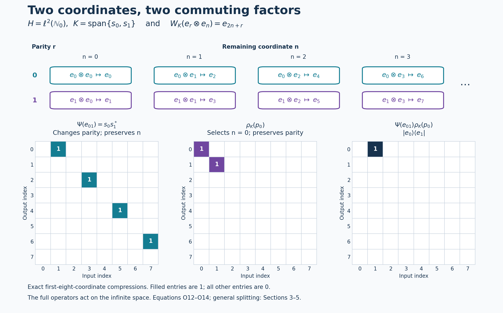

# Operator spaces and endomorphisms from internal Hilbert spaces

*Self-checked by the writing AI.*

Let \(M\subseteq B(H)\) be a faithful normal unital representation of a nonzero von Neumann algebra. An internal Hilbert space \(K\subseteq M\) is a norm-closed complex linear subspace for which
\[
 y^*x=\langle x,y\rangle1\qquad(x,y\in K),
 \tag{V1}
\]
and whose support is one. Inner products are linear in the first variable. The [definition and norm theorem](OA-FLOW-L130.md#oa-flow.intspace.definition) proves that the Hilbert norm in (V1) equals the operator norm and the [basis and support theorem](OA-FLOW-L130.md#oa-flow.intspace.basis) proves that, for any orthonormal basis \((u_i)_{i\in I}\), the projections \(u_i u_i^*\) are orthogonal and sum strongly to the support. Thus a full internal Hilbert space is nonzero, and its unit vectors are isometries. We allow arbitrary cardinalities throughout; there is no separability assumption on \(K\), \(L\), \(H\) or \(M\).

We use [Continuous calculus, positivity and Hilbert spaces](OA-FLOW-CF.md#oa-flow.cf.1), Sections [1](OA-FLOW-CF.md#oa-flow.cf.1), [8](OA-FLOW-CF.md#oa-flow.cf.8) and [10](OA-FLOW-CF.md#oa-flow.cf.10), for the maximal principle, Hilbert adjoints, projections and completion; [Concrete preduals from Hilbert tensors](OA-FLOW-CP.md#oa-flow.cp.1), CP1 and CP4–6, for the full ultraweak topology and vector-series tests; and [Norm-controlled density on arbitrary Hilbert spaces](OA-FLOW-BD.md#oa-flow.bd.5), BD5, for bounded strong convergence implying ultraweak convergence. [Order-normal positive functionals and ultraweak continuity](OA-FLOW-NF.md#oa-flow.nf.6), NF6, identifies unital algebraic star automorphisms of a von Neumann algebra as normal: an order isomorphism preserves every bounded increasing supremum, so the positive-map criterion applies to it and its inverse.

The key map is evaluation: an internal vector is already an operator on \(H\), so it can act on an external vector in \(H\). This single map will identify operator spaces, construct the endomorphism and implement the tensor splitting.

## 1. Evaluation gives the tensor coordinates

On the algebraic tensor product define
\[
 W_K:K\odot H\longrightarrow H,\qquad
 W_K(x\otimes\xi)=x\xi.
 \tag{O1}
\]
For finite sums, (V1) gives
\[
 \left\langle\sum_r x_r\xi_r,\sum_s y_s\eta_s\right\rangle_H
 =\sum_{r,s}\langle x_r,y_s\rangle_K
                  \langle\xi_r,\eta_s\rangle_H.
 \tag{O2}
\]
This is precisely the tensor-product inner product. Its positivity can also be checked without an abstract tensor theorem: choose an orthonormal basis in the finite-dimensional span of all the first tensor factors and write the sum as \(\sum_i e_i\otimes\zeta_i\). Its squared norm is \(\sum_i\|\zeta_i\|^2\). The quotient by the null space and CF10's completion give the Hilbert tensor product \(K\otimes H\). Equation (O2) extends \(W_K\) to an isometry on this completion.

Its range is the closed linear span of \(KH\). For an orthonormal basis \((u_i)\), the support theorem from the preceding lesson says \(\sum_i u_i u_i^*=1\) strongly, so the ranges \(u_iH\) span \(H\). The isometry is therefore onto: \(W_K:K\otimes H\to H\) is unitary. This definition involves no basis choice.

We will use two elementary tensor facts. For \(T:L\to K\) bounded, the map \(T\otimes1_H\) has norm \(\|T\|\). For the upper bound, expand finite tensors in an orthonormal family in the second factor and sum \(\|T\zeta_i\|^2\le\|T\|^2\|\zeta_i\|^2\). Pass to the completion. For the lower bound test \(\zeta\otimes\xi_0\) with \(\|\xi_0\|=1\), which exists because \(H\ne0\), and take the supremum over unit \(\zeta\). The same proof applies to \(1_K\otimes a\) when \(K\ne0\). Secondly, if \(T_\lambda\to T\) strongly with a common norm bound, then \(T_\lambda\otimes1_H\to T\otimes1_H\) strongly: verify convergence on finite simple tensors, then use density and the common bound. Apply this also to adjoints when strong-star convergence is available.

## 2. A product \(xy^*\) is a rank-one operator

Let \(K,L\subseteq M\) be full internal Hilbert spaces. For \(x\in K\), \(y,z\in L\),
\[
 (xy^*)z=x(y^*z)=\langle z,y\rangle x.
 \tag{V2}
\]
Thus left multiplication by \(xy^*\), restricted to \(L\), is
\[
 \theta_{x,y}:L\longrightarrow K,\qquad
 \theta_{x,y}(z)=\langle z,y\rangle x.
 \tag{V3}
\]
Every finite-rank \(T:L\to K\) is a finite sum of these maps. Indeed, choose an orthonormal basis \(x_1,\ldots,x_n\) of its range. The adjoint identity gives \(Tz=\sum_r\langle z,T^*x_r\rangle x_r\). Consequently restriction defines a surjection
\[
 \Phi_{K,L}:\operatorname{span}(KL^*)\longrightarrow\mathcal F(L,K),
 \qquad \Phi_{K,L}(t)z=tz.
 \tag{V4}
\]
It is injective. If \(tL=0\), then \(tv_j=0\) for every member of a basis of \(L\), hence \(t\sum_{j\in E}v_jv_j^*=0\). The finite sums converge strongly to one, giving \(t=0\). We have the canonical identification
\[
 \operatorname{span}(KL^*)\cong\mathcal F(L,K),
 \qquad xy^*\longleftrightarrow\theta_{x,y}.
 \tag{V5}
\]

Here is its exact relation with tensor coordinates. Choose orthonormal bases \((u_i)_{i\in I}\) and \((v_j)_{j\in J}\) of \(K,L\). Then
\[
 \sum_i u_iu_i^*=1,\qquad\sum_j v_jv_j^*=1
 \quad\text{strongly}.
 \tag{V6}
\]
Identifying these Hilbert spaces with \(\ell^2(I)\) and \(\ell^2(J)\), evaluation becomes
\[
 \begin{aligned}
 W_K:\ell^2(I)\otimes H&\longrightarrow H,&
 W_K(e_i\otimes\xi)&=u_i\xi,\\
 W_L:\ell^2(J)\otimes H&\longrightarrow H,&
 W_L(f_j\otimes\xi)&=v_j\xi.
 \end{aligned}
 \tag{V7}
\]
For \(t\in\operatorname{span}(KL^*)\), every operator
\[
 u_i^*tv_j
 \tag{V8}
\]
is a scalar multiple of \(1_H\). The scalar is the \((i,j)\) coefficient of \(T=\Phi_{K,L}(t)\). Testing elementary tensors, or first testing \(t=xy^*\), gives
\[
 W_K^*tW_L=T\otimes1_H,
 \qquad t=W_K(T\otimes1_H)W_L^*.
 \tag{V9}
\]
The norm calculation in Section 1 yields
\[
 \|t\|_M=\|T\|_{B(L,K)}.
 \tag{V10}
\]

## 3. Compact operators and the whole bounded-operator space

We first justify the compact-operator step. A bounded map between Hilbert spaces is compact when the closure of its image of the unit ball is compact. Finite-rank maps are compact by finite-dimensional bounded-set compactness. A norm limit of compact maps is compact: for any \(\varepsilon>0\), choose a compact approximant with norm error below \(\varepsilon/2\) and a finite \(\varepsilon/2\)-net for its image of the unit ball. These points form an \(\varepsilon\)-net for the limiting image. A complete totally bounded metric space is compact: successively choose finite \(2^{-n}\)-covers to obtain a Cauchy subsequence of any sequence; its limit exists by completeness. To pass from sequential compactness to compactness, any open cover has a positive Lebesgue number: otherwise choose points whose balls of radius \(1/n\) are contained in no cover member, pass to a convergent subsequence, and use a ball about the limit inside a member of the cover to obtain a contradiction. A finite net with radius less than half that Lebesgue number then supplies a finite subcover. Thus the closure of the image is compact.

Conversely, let \(T:L\to K\) be compact. A finite \(\varepsilon\)-net for the image of its unit ball spans a finite-dimensional subspace \(E\subset K\). If \(P_E\) is its orthogonal projection, the distance-minimizing property of \(P_E\) gives \(\|(1-P_E)T\|\le\varepsilon\). The maps \(P_ET\) have finite rank and approximate \(T\) in norm. Therefore (V10) extends to the isometric identification
\[
 \overline{\operatorname{span}(KL^*)}^{\|\cdot\|}
 \cong\mathcal K(L,K).
 \tag{V11}
\]

For an arbitrary bounded \(T:L\to K\), let \(P_F,Q_E\) be the finite-coordinate projections for finite \(F\subset I\), \(E\subset J\). The two-variable net
\[
 P_FTQ_E
 \tag{V12}
\]
is bounded by \(\|T\|\), has finite rank and converges strongly to \(T\). Indeed
\[
 \|(P_FTQ_E-T)\zeta\|
 \le\|T\|\|(Q_E-1)\zeta\|+\|(P_F-1)T\zeta\|.
\]
Its adjoints converge strongly by the same estimate. Section 1 then shows that
\[
 \Psi_{K,L}(T)=W_K(T\otimes1_H)W_L^*
 \tag{O3}
\]
is a bounded strong-star limit of elements of \(\operatorname{span}(KL^*)\), and therefore belongs to \(M\). BD5 also gives ultraweak convergence. Thus every bounded operator on the two internal Hilbert spaces has an actual representative in \(M\).

We verify both normality and closedness instead of inferring them from strong approximation. The ultraweak topology on the rectangular space \(B(L,K)\) is the one inherited from its corner in \(B(K\oplus L)\); equivalently its continuous tests are
\[
 T\longmapsto\sum_n\langle T\zeta_n,\eta_n\rangle,
 \qquad\sum_n\|\zeta_n\|^2<\infty,\qquad
       \sum_n\|\eta_n\|^2<\infty.
 \tag{O4}
\]
This follows from CP4–6 by inserting the two corner projections in each vector series.

Choose an orthonormal basis \((h_a)_{a\in A}\) of \(H\). A vector \(\xi\in L\otimes H\) has coordinates \(\xi_a\in L\), with \(\sum_a\|\xi_a\|^2=\|\xi\|^2\). Finite-coordinate projections prove this first on finite tensors and then on their completion. Only countably many coordinates of a given vector are nonzero: for every positive integer \(m\), only finitely many squared norms can exceed \(1/m\). For \(\eta\in K\otimes H\),
\[
 \langle(T\otimes1_H)\xi,\eta\rangle
 =\sum_a\langle T\xi_a,\eta_a\rangle,
 \qquad
 \sum_a\|\xi_a\|\|\eta_a\|\le\|\xi\|\|\eta\|.
 \tag{O5}
\]
For an ultraweak vector series, apply (O5) to each pair. The union of the resulting countable supports is countable, and the squared norms over the double index still have finite sums. Thus every ultraweak functional pulls back to a test of the form (O4). Amplification is ultraweakly continuous on its entire domain. Fixed unitary conjugation is also ultraweakly continuous, by replacing the vectors in the series. Hence \(\Psi_{K,L}\) is normal in this operator-space sense. The same computation, with the tensor factors exchanged, proves normality of \(a\mapsto1_K\otimes a\).

Its inverse on its range is normal as well. Fix a unit \(h_0\in H\). For every vector pair,
\[
 \langle T\zeta,\eta\rangle
 =\left\langle
 W_K^*\Psi_{K,L}(T)W_L(\zeta\otimes h_0),
 \eta\otimes h_0\right\rangle.
 \tag{O6}
\]
Replacing an entire vector series this way preserves the squared-norm sums. This proves ultraweak continuity of the inverse without any restriction to bounded nets.

Finally the range is ultraweakly closed. In the coordinates of (V7), it consists exactly of operators \(S:L\otimes H\to K\otimes H\) whose \((i,j)\) blocks are scalar multiples of \(1_H\). These are ultraweakly closed conditions: if \(c_{ij}=\langle S_{ij}h_0,h_0\rangle\), the condition is \(\langle S_{ij}\xi,\eta\rangle=c_{ij}\langle\xi,\eta\rangle\) for every vector pair. Conversely, a bounded \(S\) with these scalar blocks gives a bounded scalar matrix \((c_{ij})\): test its finite-coordinate vectors tensored with \(h_0\) to obtain the norm bound \(\|T\|\le\|S\|\). The bounded-form construction in CF8 extends this matrix to \(T:L\to K\), and equality of all blocks gives \(S=T\otimes1_H\). We have proved the full identification
\[
 \overline{\operatorname{span}(KL^*)}^{\,\sigma\text{-weak}}
 \cong B(L,K),
 \tag{V13}
\]
isometrically and with normal inverse. The construction is canonical because \(\Psi_{K,L}(T)z=Tz\) for every \(z\in L\); fullness makes an operator in \(M\) determined by its values on \(LH\).

For composable operator spaces the representatives also preserve composition and adjoints:
\[
 \Psi_{K,L}(S)\Psi_{L,J}(T)=\Psi_{K,J}(ST),
 \qquad\Psi_{K,L}(S)^*=\Psi_{L,K}(S^*).
 \tag{O7}
\]
Here \(J\) denotes a third full internal Hilbert space. Both equalities follow directly by canceling the evaluation unitaries in (O3). In particular
\(\mathcal B_K:=\Psi_{K,K}(B(K))\subseteq M\)
is a unital type I factor, normally isomorphic to \(B(K)\). The center of \(B(K)\) is scalar: commuting with rank-one diagonal projections makes an operator diagonal in a basis, and commuting with all rank-one matrix units makes every diagonal entry equal.

## 4. The commuting amplification is a normal endomorphism

Define the basis-free operator
\[
 \rho_K(a)=W_K(1_K\otimes a)W_K^*\qquad(a\in M).
 \tag{O8}
\]
The expression belongs to \(M\). In basis coordinates it is
\[
 \rho_K(a)=\sum_{i\in I}u_i a u_i^*,
 \tag{V14}
\]
where finite partial sums correspond to \(P_F\otimes a\). They are bounded by \(\|a\|\) and converge strongly, together with their adjoints, to (O8). Each partial sum belongs to \(M\), and \(M\) is strongly closed. Explicitly,
\[
 W_K^*\rho_K(a)W_K=1_{\ell^2(I)}\otimes a.
 \tag{V15}
\]
It follows that \(\rho_K\) is linear, multiplicative, star preserving and unital. Section 3 proves its full ultraweak continuity. Its norm equals \(\|a\|\), since \(K\ne0\); in particular it is injective. The corner formula gives a second proof and a normal inverse on its image:
\[
 u_i^*\rho_K(a)u_i=a\qquad(i\in I).
 \tag{V16}
\]
Compression is normal by the same vector-series substitution as in (O6).

Evaluation also gives a useful characterization independent of every basis:
\[
 \rho_K(a)x=xa\qquad(x\in K).
 \tag{O9}
\]
To prove it, apply (O8) to \(x\xi=W_K(x\otimes\xi)\). Conversely, if \(b\in M\) satisfies \(bx=xa\) for all \(x\in K\), then
\(b\sum_{i\in F}u_iu_i^*=\sum_{i\in F}u_i a u_i^*\).
Taking the strong limit proves \(b=\rho_K(a)\). Thus the endomorphism is the unique operator-valued map satisfying this intertwining rule.

## 5. The relative commutant and the whole tensor splitting

The operators
\[
 E_{ij}=u_i u_j^*
 \tag{V17}
\]
are matrix units. They generate \(\mathcal B_K\), since finite matrix compressions approximate every bounded operator strongly, as in Section 3. Direct multiplication gives
\[
 E_{ij}\rho_K(a)=u_i a u_j^*=\rho_K(a)E_{ij}.
 \tag{V18}
\]
Therefore \(\rho_K(M)\subseteq\mathcal B_K'\cap M\).

If \(b\in\mathcal B_K'\cap M\), its commutation with \(E_{ij}\) implies
\[
 u_i^*bu_i=u_j^*bu_j\qquad(i,j\in I).
 \tag{V19}
\]
Indeed multiply \(b u_i u_j^*=u_i u_j^* b\) on the left by \(u_i^*\) and on the right by \(u_j\). Call the common value \(a\in M\). Commutation with every \(E_{ii}\) kills off-diagonal blocks. Since the finite sums of these diagonal projections converge strongly to one, those blocks determine the operator, giving
\[
 b=\sum_i u_i a u_i^*=\rho_K(a).
 \tag{V20}
\]
Thus
\[
 \rho_K(M)=\mathcal B_K'\cap M.
 \tag{V21}
\]
This also proves directly that the endomorphism image is a von Neumann algebra.

The two commuting algebras generate \(M\). For \(b\in M\), put \(a_{ij}=u_i^*bu_j\in M\). Fix \(k\in I\), possible since \(K\ne0\). Then
\[
 u_i a_{ij}u_j^*=E_{ik}\rho_K(a_{ij})E_{kj}.
 \tag{V22}
\]
The finite rectangular sums are
\[
 \left(\sum_{i\in F}E_{ii}\right)b
 \left(\sum_{j\in E}E_{jj}\right).
 \tag{V23}
\]
They have norm at most \(\|b\|\) and converge strongly-star to \(b\), by the estimate used for (V12) and then its adjoint version. Hence every \(b\) lies in the von Neumann algebra generated by \(\mathcal B_K\) and \(\rho_K(M)\).

The product identification is spatial and normal, with no hidden tensor norm. Represent \(\mathcal B_K\) faithfully and normally on \(K\) by \(\Psi_{K,K}^{-1}\), and represent \(\rho_K(M)\) faithfully and normally on \(H\) by \(\rho_K^{-1}\), whose normality was proved in (V16). In these representations their spatial tensor product is \(B(K)\bar\otimes M\subset B(K\otimes H)\). Conjugation by \(W_K\) carries its elementary tensors to
\[
 W_K(T\otimes a)W_K^*
 =\Psi_{K,K}(T)\rho_K(a).
 \tag{O10}
\]
The image is exactly \(M\) by (V22)–(V23). Unitary conjugation and its inverse are normal on the entire ultraweak domains. Thus multiplication extends to a normal spatial isomorphism
\[
 M\cong\mathcal B_K\,\bar\otimes\,\rho_K(M).
 \tag{V24}
\]

## 6. Changing coordinates leaves the endomorphism fixed

The basis-free formula (O8), or the uniqueness in (O9), already shows that \(\rho_K\) depends only on \(K\). We can see the same fact in scalar matrix coordinates. If \((w_j)_{j\in J}\) is a second orthonormal basis, the change-of-basis unitary \(C:\ell^2(J)\to\ell^2(I)\) has coefficients \(c_{ij}\) with
\[
 w_j=\sum_i c_{ij}u_i.
 \tag{V25}
\]
These sums converge in the Hilbert norm of \(K\), hence in its operator norm. The new evaluation unitary is \(W_{(w_j)}=W_{(u_i)}(C\otimes1_H)\): prove this on basis tensors using (V25), then extend by density. Since \(C\otimes1_H\) commutes with the second-factor amplification, both bases give the same (O8).

In coordinates this is the equality
\[
 \begin{aligned}
 \sum_j w_j a w_j^*
 &=\sum_{i,k}\left(\sum_j c_{ij}\overline{c_{kj}}\right)
                       u_i a u_k^*\\
 &=\sum_i u_i a u_i^*.
 \end{aligned}
 \tag{V26}
\]
There is no unrestricted interchange of three operator sums here. The left-hand side is the strong limit of the bounded finite-coordinate compressions in the new basis. Conjugating those compressions by \(C\otimes1_H\) gives the same limit \(1\otimes a\). For a fixed old matrix entry, the scalar middle sum is absolutely convergent by Cauchy–Schwarz and equals \(\delta_{ik}\), because \(CC^*=1\). These finite-compression limits are the precise meaning of the middle expression in (V26).

## 7. Invariant spaces, fixed algebras and continuous representations

Let \(\beta\) be a unital star automorphism of \(M\) with \(\beta(K)=K\). As explained at the start, \(\beta\) and its inverse are normal. For \(x,y\in K\),
\[
 \beta(y)^*\beta(x)=\beta(y^*x)=\langle x,y\rangle1.
 \tag{V27}
\]
Thus \(\beta|_K\) is a surjective complex-linear Hilbert isometry, hence a unitary.

The full covariance identity is \(\beta\rho_K=\rho_K\beta\). Indeed normality moves \(\beta\) through the bounded ultraweak limit of (V14); the images of the basis form another orthonormal basis of \(K\), so Section 6 applies. In particular, if \(a\in M^\beta\), then
\[
 \begin{aligned}
 \beta(\rho_K(a))
 &=\sum_i\beta(u_i)\beta(a)\beta(u_i)^*\\
 &=\sum_i\beta(u_i)a\beta(u_i)^*=\rho_K(a),
 \end{aligned}
 \tag{V28}
\]
and therefore
\[
 \rho_K(M^\beta)\subseteq M^\beta.
 \tag{V29}
\]
In (V28) the notation denotes the strong sums, whose ultraweak limits agree by normality; it does not assume that a normal map preserves arbitrary unbounded strong nets.

Now let a topological group \(G\) act point-ultraweakly continuously on \(M\) by automorphisms \(\alpha_s\), with \(\alpha_s(K)=K\) for every \(s\). Define
\[
 U_s=\alpha_s|_K.
 \tag{V30}
\]
The preceding argument makes each \(U_s\) unitary, and the action law gives \(U_sU_t=U_{st}\). Its matrix coefficients satisfy
\[
 \langle U_sx,y\rangle1=y^*\alpha_s(x).
 \tag{V31}
\]
To obtain scalar continuity, fix a unit \(\xi_0\in H\) and apply the normal vector functional \(b\mapsto\langle b\xi_0,\xi_0\rangle\). Fixed left multiplication by \(y^*\) is ultraweakly continuous by CP's vector-series substitution. The assumed action continuity therefore makes the left-hand scalar in (V31) continuous. This argument uses a normal state, not a faithful normal state, so it imposes no sigma-finiteness condition on \(M\).

At the identity,
\[
 \|U_sx-x\|^2
 =2\|x\|^2-2\operatorname{Re}\langle U_sx,x\rangle
 \longrightarrow0.
 \tag{V32}
\]
The group law and the unitary norm turn continuity at the identity into continuity at every group element. Thus \(U\) is a strongly continuous unitary representation on the internal Hilbert space, for an arbitrary topological group. Covariance also gives \(\rho_K(M^\alpha)\subseteq M^\alpha\), where \(M^\alpha\) is the common fixed algebra.

## 8. What fullness supplies

**Problem.** Which conclusions require support one? Does the norm identity (V10) require it?

**Solution.** Let \(K,L\) instead be norm-closed scalar Hilbert subspaces satisfying (V1), with support projections \(p_K,p_L\), possibly proper. Evaluation still gives isometries
\(W_K:K\otimes H\to H\), \(W_L:L\otimes H\to H\),
with ranges \(p_KH,p_LH\). For \(t\in\operatorname{span}(KL^*)\), one has \(p_Ktp_L=t\). The calculation on simple tensors still yields
\[
 t=W_K(T\otimes1_H)W_L^*,\qquad
 T\otimes1_H=W_K^*tW_L,
 \qquad T=\Phi_{K,L}(t).
 \tag{O11}
\]
The two identities give both norm inequalities, so \(\|t\|=\|T\|\) even without fullness. They also show injectivity of the rank-one correspondence in this case. If either Hilbert space is zero, both operator spaces are zero and the statement has that interpretation.

For example, if \(s\in M\) is a proper isometry, then \(K=L=\mathbb Cs\) has support \(ss^*<1\). The operator \(t=\lambda ss^*\) represents multiplication by \(\lambda\) on this one-dimensional Hilbert space, and both norms are \(|\lambda|\).

Fullness makes the evaluation maps onto \(H\); in the equal-space case it makes \(\Psi_{K,K}(1)=1\) and \(\rho_K(1)=1\). It is the hypothesis that gives the relative commutant and tensor splitting of the entire ambient algebra. Without it, the same expressions live in support corners, and do not assert a unital splitting of all of \(M\). \(\square\)

## 9. An exact two-coordinate splitting of an infinite algebra

Take \(H=\ell^2(\mathbb N_0)\), \(M=B(H)\), and define
\[
 s_0e_n=e_{2n},\qquad s_1e_n=e_{2n+1}.
 \tag{O12}
\]
Then \(s_r^*s_t=\delta_{rt}1\) and \(s_0s_0^*+s_1s_1^*=1\). The two-dimensional space \(K=\operatorname{span}\{s_0,s_1\}\) is therefore full and internal. Its evaluation unitary is the exact coordinate map
\[
 W_K(e_r\otimes e_n)=e_{2n+r}\qquad(r=0,1; n\ge0).
 \tag{O13}
\]
For \(T=(T_{rt})\in M_2(\mathbb C)\), \(a\in B(H)\), their represented operators have entries
\[
 \begin{aligned}
 \langle\Psi_{K,K}(T)e_{2n+t},e_{2m+r}\rangle
 &=T_{rt}\delta_{mn},\\
 \langle\rho_K(a)e_{2n+t},e_{2m+r}\rangle
 &=\delta_{rt}\langle ae_n,e_m\rangle,\\
 \langle\Psi_{K,K}(T)\rho_K(a)e_{2n+t},e_{2m+r}\rangle
 &=T_{rt}\langle ae_n,e_m\rangle.
 \end{aligned}
 \tag{O14}
\]
Thus the internal matrix algebra acts on the parity coordinate and the endomorphism acts on the remaining coordinate. These formulas verify commutation and the tensor-product multiplication entry by entry.

Take \(T=e_{01}\) and \(a=p_0=|e_0\rangle\langle e_0|\). Then \(\Psi_{K,K}(e_{01})=s_0s_1^*\) sends every odd basis vector to the preceding even one, \(\rho_K(p_0)\) projects onto \(\operatorname{span}\{e_0,e_1\}\), and their product is \(|e_0\rangle\langle e_1|\). The following figure displays the exact compression to the first eight basis vectors. The full operators act on the infinite-dimensional space; no finite-dimensional proper isometries are asserted.

The top row shows the bijection in (O13). The three matrices are the first-eight-coordinate compressions of \(\Psi(e_{01})\), \(\rho_K(p_0)\) and their product from (O14), respectively. A filled entry equals one; every other entry is zero. Rows are output indices and columns are input indices. The first eight coordinates form four complete parity pairs, so these particular compressions commute and their displayed product is exact. The argument for arbitrary operators and cardinalities is in Sections 3–5.

[Editable figure](../assets/internal-operator-spaces/internal-operator-spaces.svg), [exact data](../assets/internal-operator-spaces/objects.json) and [reproduction source](../assets/internal-operator-spaces/render_internal_operator_spaces.py) retain the coordinates and matrix entries.

## Further reading

Masamichi Takesaki, [*Theory of Operator Algebras II*](https://doi.org/10.1007/978-3-662-10451-4), Exercises XI.2.2–3 treats the finite-rank, compact and bounded operator identifications, the basis endomorphism and its invariant-space consequences. The tensor evaluation, normality and inverse-normality arguments above give these conclusions at arbitrary Hilbert-space cardinality.

Original lesson exposition, diagram, exact data and reproduction code are dedicated to the public domain under CC0-1.0 to the extent of any rights held in them. Cited works retain their own terms. The figure uses DejaVu Sans; its font license accompanies the assets.
