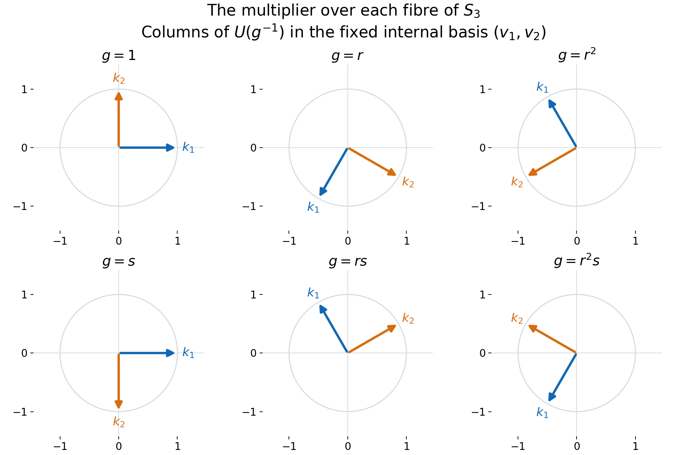

# Internal representations and irreducible multipliers

A compact action can be understood through its finite-dimensional orbit spaces. We first make those spaces ultraweakly dense, then represent each irreducible orbit by a unitary multiplier in a properly infinite fixed algebra. The key step is a two-by-two fixed algebra: homogeneity fills both central supports, and projection comparison supplies the unitary. This works for nonabelian groups as well as abelian ones.

Let $G$ be a compact Hausdorff group, let $M\ne0$ be a von Neumann algebra with separable predual, and let
$\alpha:G\to\operatorname{Aut}(M)$ be point-ultraweakly continuous and
faithful.  Put

$$
\mathscr A_\alpha
=\{\theta\in\operatorname{Aut}(M):
\theta\alpha_s=\alpha_s\theta\text{ for every }s\in G\}.
\tag{IR1}
$$

The action is **homogeneous** when

$$
M^{\mathscr A_\alpha}=\mathbb C1.
\tag{IR2}
$$

Fix also $\sigma\in\operatorname{Aut}(M)$ which commutes with every member of
$\mathscr A_\alpha$ and fixes $M^\alpha$ pointwise.  The eventual goal is to
recover $\sigma$ from one element of $G$.

*Self-checked by the writing AI. Original exposition and illustration sources: CC0-1.0 to the extent of rights held; existing component and font terms apply.*

## Earlier results and the countability consequences

We use [Internal Hilbert spaces in a von Neumann algebra](OA-FLOW-L130.md#oa-flow.intspace.definition), its [basis description](OA-FLOW-L130.md#oa-flow.intspace.basis), [internal sums](OA-FLOW-L130.md#oa-flow.intspace.sum), and [internal tensor products](OA-FLOW-L130.md#oa-flow.intspace.tensor); [Internal operator spaces and their endomorphisms](OA-FLOW-L131.md#oa-flow.intops.finite), including the [normal tensor splitting](OA-FLOW-L131.md#oa-flow.intops.splitting) and [invariant-space representation](OA-FLOW-L131.md#oa-flow.intops.invariant); [Projection comparison and proper infiniteness](OA-FLOW-PC.md#oa-flow.projection.pc5), especially [countably decomposable comparison](OA-FLOW-PC.md#oa-flow.projection.pc7); and [From an intertwiner family to tensor-product innerness](OA-FLOW-L123.md#oa-flow.l123.ic0), for normal automorphisms and tensor maps, with its [normal slices](OA-FLOW-L123.md#oa-flow.l123.ic3).

The harmonic inputs are [Haar existence and uniqueness](OA-FLOW-HR.md#hr-06), [integrated normal actions](OA-FLOW-AT.md#oa-flow.at.5), [unitarity and complete reducibility for compact groups](../../representations-of-compact-groups/reader/courses/representations-of-compact-groups/representations-of-compact-groups-unitarity-complete-reducibility-and-finite-dimension.html#result-proposition-1-2), and [Schur orthogonality](../../representations-of-compact-groups/reader/courses/representations-of-compact-groups/matrix-coefficients-and-the-peter-weyl-theorem.html#result-theorem-2-1) and [the Peter–Weyl theorem](../../representations-of-compact-groups/reader/courses/representations-of-compact-groups/matrix-coefficients-and-the-peter-weyl-theorem.html#result-theorem-4-1). The latter applies to every compact Hausdorff group. Normalize Haar measure to total mass one. It is also right invariant: a right translate is another left Haar measure with the same mass, so uniqueness gives equality.

Two elementary consequences of separable predual will keep the later countability precise. Choose a norm-dense sequence \((\varphi_n)\) in the unit sphere of \(M_*\). Each normal functional is a linear combination of four positive normal functionals by the vector-series decomposition in the tensor lesson. Normalize the nonzero positive terms and enumerate them as \((\omega_j)\). They separate positive elements: if every \(\omega_j(a)\) vanishes for \(a\ge0\), every \(\varphi_n(a)\) vanishes and norm density gives \(a=0\). A series \(\omega=\sum_j c_j\omega_j\), with \(c_j>0\) and \(\sum_j c_j=1\), is therefore a faithful normal state. Normality follows either from the concrete predual's norm closure or by summing its vector series. Its restriction to every unital von Neumann subalgebra is faithful and normal. The comparison theorem consequently makes every such unit countably decomposable.

Faithfulness of the action also forces \(G\) to be second countable. Choose \(x_n\) in the unit ball of \(M\) with \(|\varphi_n(x_n)|>1/2\). These elements separate \(M_*\): for a unit functional \(\psi\), choose \(\varphi_n\) within \(1/4\) of \(\psi\), so \(|\psi(x_n)|>1/4\). The countable family of continuous scalar functions

\[
g\longmapsto\varphi_m(\alpha_g(x_n)),\qquad m,n\ge1,
\tag{IR3}
\]

separates points of \(G\). Indeed equality for all \(n\) makes the two normal functionals \(\varphi_m\circ\alpha_g\) and \(\varphi_m\circ\alpha_h\) equal, and density in \(m\) then makes \(\alpha_g=\alpha_h\); faithfulness gives \(g=h\). Thus these coordinates continuously embed compact \(G\) into a countable product of scalar discs. A continuous injection from a compact space to a Hausdorff space is a homeomorphism onto its image: images of closed sets are compact and hence closed. The product has a countable base obtained from finitely many rational discs, so its subspace does too. No additional metrizability assumption is being imposed.

## Finite-orbit vectors form an ultraweakly dense star algebra

Define

$$
M_{\mathrm{fin}}
=\{x\in M:
\operatorname{span}\{\alpha_s(x):s\in G\}
\text{ is finite dimensional}\}.
\tag{IR4}
$$

It is a unital star algebra.  If the orbit spans of $x$ and $y$ are $V$ and
$W$, then the orbit of $xy$ lies in the finite-dimensional span of $VW$,
while the orbit of $x^*$ lies in $V^*$.

For $f\in L^1(G)$ put

$$
\alpha_f(x)=\int_G f(s)\alpha_s(x)\,ds.
\tag{IR5}
$$

When $f$ is a matrix coefficient of a finite-dimensional representation, its
left translates span a finite-dimensional space.  Formula (IR5) then shows
$\alpha_f(x)\in M_{\mathrm{fin}}$.  Here is the approximate-identity step explicitly. For each identity neighborhood \(V\), choose a nonnegative continuous \(h_V\) supported in \(V\), with integral one, using compact Hausdorff cutoffs and positivity of Haar measure on open sets. For \(0<\varepsilon<1/2\), Peter–Weyl uniform density supplies a finite coefficient sum \(p_{V,\varepsilon}\) with \(\|p_{V,\varepsilon}-h_V\|_1<\varepsilon\). Its integral \(b\) satisfies \(|b-1|<\varepsilon\). Put \(f_{V,\varepsilon}=p_{V,\varepsilon}/b\). Then

\[
\int_G f_{V,\varepsilon}=1,\qquad
\|f_{V,\varepsilon}-h_V\|_1\le\frac{2\varepsilon}{1-\varepsilon},
\qquad \|f_{V,\varepsilon}\|_1\le\frac{1+\varepsilon}{1-\varepsilon}.
\tag{IR6}
\]

Direct the pairs by shrinking \(V\) and decreasing \(\varepsilon\). For \(\varphi\in M_*\), the difference between \(\varphi(\alpha_{f_{V,\varepsilon}}(x))\) and \(\varphi(x)\) is bounded in absolute value by

\[
\frac{2\varepsilon}{1-\varepsilon}\|\varphi\|\|x\|
+\sup_{s\in V}|\varphi(\alpha_s(x)-x)|.
\tag{IR7}
\]

The integrated-action bound justifies the first term, and point-ultraweak continuity makes the second tend to zero. This also proves \(f_{V,\varepsilon}*k\to k\) in \(L^1\) for every \(k\in L^1(G)\), by the same bound and continuity of left translations; positivity of the coefficient sums is not needed. Writing this net as \((f_\lambda)\), we have

$$
\alpha_{f_\lambda}(x)\longrightarrow x
\quad\text{ultraweakly}.
\tag{IR8}
$$

Therefore

$$
\boxed{\overline{M_{\mathrm{fin}}}^{\,\sigma\text{-weak}}=M.}
\tag{IR9}
$$

## Stabilization makes the fixed algebra properly infinite

Let $\mathbb N_0=\{0,1,2,\ldots\}$, set $H_0=\ell^2(\mathbb N_0)$ and define

$$
\widetilde M=M\overline\otimes B(H_0),
\qquad
\widetilde\alpha_s=\alpha_s\otimes\operatorname{id},
\qquad
\widetilde\sigma=\sigma\otimes\operatorname{id}.
\tag{IR10}
$$

The tensor maps exist and are normal by the tensor lesson. Matrix entries in the $B(H_0)$ factor show that

$$
\widetilde M^{\widetilde\alpha}
=M^\alpha\overline\otimes B(H_0)
\tag{IR11}
$$

is properly infinite: the two isometries on $\ell^2(\mathbb N_0)$ sending its basis to the even and odd basis vectors have orthogonal ranges summing to one. The stabilized algebra has a faithful normal state. If $\omega$ is the state constructed above and $(\epsilon_n)$ the standard basis, use $\sum_{n\ge0}2^{-n-1}\omega(S_{\epsilon_n,\epsilon_n}(X))$ on positive $X$. Vanishing forces every diagonal positive slice to vanish; positivity and the quadratic-form Cauchy–Schwarz inequality then force every matrix entry to vanish. Thus the state is faithful. The stabilized predual is also separable. A normal functional has a square-summable vector-series representation on the ambient Hilbert tensor product; truncating every vector in the $H_0$ coordinate and then truncating the series approximates it in functional norm by a finite matrix-corner functional. Such a functional is a finite sum of normal functionals on $M$ applied to the matrix entries. Approximate each coefficient functional from a countable norm-dense subset of $M_*$. Finite rational combinations of these choices form a countable norm-dense subset of the stabilized predual. These are the vector-series and slice constructions of [Concrete preduals](OA-FLOW-CP.md#oa-flow.cp.6) and the tensor lesson. To retain exactly the symmetry needed below, let
$\widetilde{\mathscr A}$ be the subgroup of
$\operatorname{Aut}(\widetilde M)$ generated by

$$
\theta\otimes\operatorname{id}
\quad(\theta\in\mathscr A_\alpha),
\qquad
\operatorname{id}\otimes\operatorname{Ad}(v)
\quad(v\in\mathcal U(B(H_0))).
\tag{IR12}
$$

Every generator commutes with $\widetilde\alpha$.  The common fixed algebra of the second family is $M\otimes1$: commuting with all unitaries is equivalent to commuting with all operators (differentiate $e^{itb}$ for self-adjoint $b$), and the matrix units make an operator commuting with $1\otimes B(H_0)$ have one repeated $M$-valued diagonal entry and zero off-diagonal entries. Imposing invariance under the first family then gives

$$
\widetilde M^{\widetilde{\mathscr A}}
=M^{\mathscr A_\alpha}\otimes1
=\mathbb C1.
\tag{IR13}
$$

Moreover $\widetilde\sigma$ commutes with every generator in (IR12) and fixes
(IR11) pointwise.  Thus all later arguments may use $(\widetilde M,\widetilde\alpha,\widetilde{\mathscr A},\widetilde\sigma)$.

If the stabilized theorem gives
$\widetilde\sigma=\widetilde\alpha_g$, then restriction to $M\otimes1$ gives
$\sigma=\alpha_g$.  We may therefore work from now on under the standing
assumption

$$
M^\alpha\text{ is properly infinite},
\tag{IR14}
$$

and use a symmetry group $\mathscr A\subseteq\mathscr A_\alpha$ satisfying
$M^{\mathscr A}=\mathbb C1$ and commuting with $\sigma$.  This formulation
avoids any claim that $\widetilde\sigma$ commutes with every automorphism in
the full centralizer of the stabilized action.

## Finite internal representations move into the fixed algebra

Let $\mathcal H_\alpha$ be the collection of internal Hilbert spaces
$K\subseteq M$ satisfying $\alpha_s(K)=K$ for every $s\in G$.  By
[the invariant-space representation theorem](OA-FLOW-L131.md#oa-flow.intops.invariant),

$$
U_{\alpha,K}(s)=\alpha_s|_K
\tag{IR15}
$$

is a strongly continuous unitary representation.

Let $\mathcal R(M^\alpha,G)$ consist of pairs $(U,R)$ in which
$R\subseteq M^\alpha$ is a finite-dimensional internal Hilbert space and
$U:G\to\mathcal U(R)$ is a continuous unitary representation.  Through the
internal copy $\mathcal B(R)\subseteq M$, each $U_s$ is a unitary element of
$M^\alpha$.

Suppose $K\in\mathcal H_\alpha$ has dimension $n<\infty$.  The halving theorem for properly infinite projections, iterated finitely many times, supplies isometries $r_1,\ldots,r_n\in M^\alpha$ with

$$
r_i^*r_j=\delta_{ij}1,
\qquad
\sum_{i=1}^n r_i r_i^*=1.
\tag{IR16}
$$

Their span $R$ is an $n$-dimensional internal Hilbert space in $M^\alpha$.
The internal operator-space result of [Internal operator spaces and their endomorphisms](OA-FLOW-L131.md#oa-flow.intops.closures) embeds every unitary
$w:R\to K$ as a unitary element $w\in M$.  Define

$$
U_s=w^*\alpha_s(w).
\tag{IR17}
$$

For $r\in R$,

$$
U_s r=w^*\alpha_s(wr),
\tag{IR18}
$$

so $U_s\in\mathcal B(R)$.  Since $\alpha$ fixes $R$ pointwise, it fixes $\mathcal B(R)$ pointwise. Thus $\alpha_s(wU_t)=wU_sU_t$, and comparison with $\alpha_{st}(w)$ gives $U_{st}=U_sU_t$. The finite-dimensional matrix entries are continuous, and

$$
\alpha_s(w)=wU_s.
\tag{IR19}
$$

Thus $w$ intertwines $(U,R)$ with $(U_{\alpha,K},K)$.  Every
finite-dimensional representation carried by an invariant internal space can
therefore be transported to an internal space fixed pointwise by $\alpha$.

## Equivariant multiplier spaces encode prescribed representations

For $(U,R)\in\mathcal R(M^\alpha,G)$ define

$$
M_\alpha(U)
=\{x\in M:\alpha_s(x)=xU_s\text{ for every }s\in G\}.
\tag{IR20}
$$

This is an ultraweakly closed linear space.  It is a left module over
$M^\alpha$, and it is a right module over
$\rho_R(M^\alpha)$ because $\rho_R(M)$ commutes with $\mathcal B(R)$:

$$
M^\alpha M_\alpha(U)\subseteq M_\alpha(U),
\qquad
M_\alpha(U)\rho_R(M^\alpha)\subseteq M_\alpha(U).
\tag{IR21}
$$

If $w\in M_\alpha(U)$ is unitary, then

$$
K=wR
\tag{IR22}
$$

is internal and $\alpha$-invariant.  Indeed, left multiplication by $w$ is a
Hilbert-space unitary from $R$ onto $K$, and

$$
\alpha_s(wr)=wU_s r.
\tag{IR23}
$$

Hence $(U_{\alpha,K},K)$ is equivalent to $(U,R)$.  The remaining issue is to
turn a nonzero multiplier into a unitary.

## An irreducible nonzero multiplier space contains a unitary

Assume that $U$ is irreducible and $M_\alpha(U)\ne\{0\}$.  Put
$A=M\overline\otimes M_2(\mathbb C)$ and define

$$
d_s=
\begin{pmatrix}1&0\\0&U_s\end{pmatrix},
\qquad
\gamma_s=\operatorname{Ad}(d_s)
\circ(\alpha_s\otimes\operatorname{id}).
\tag{IR24}
$$

Because $U_t$ is fixed by $\alpha_s$, the identity $d_s(\alpha_s\otimes\mathrm{id})(d_t)=d_{st}$ proves the group law for $\gamma$. Each map is normal, and its fixed space is an ultraweakly closed unital star algebra, hence a von Neumann algebra. Writing $p=1\otimes e_{11}$ and $q=1\otimes e_{22}$, the block formula is

$$
\gamma_s
\begin{pmatrix}a&x\\y&b\end{pmatrix}
=
\begin{pmatrix}
\alpha_s(a)&\alpha_s(x)U_s^*\\
U_s\alpha_s(y)&U_s\alpha_s(b)U_s^*
\end{pmatrix}.
\tag{IR25}
$$

For $F=A^\gamma$ this gives

$$
pFq
=\left\{
\begin{pmatrix}0&x\\0&0\end{pmatrix}:
x\in M_\alpha(U)\right\}.
\tag{IR26}
$$

The diagonal corners are properly infinite.  The first is
$pFp\cong M^\alpha$.  The second contains the unital properly infinite
algebra $\rho_R(M^\alpha)$: the latter is fixed by $\alpha$, commutes with
$U_s\in\mathcal B(R)$, and is isomorphic to $M^\alpha$.

We use the following fixed-corner lemma.

**Homogeneous fixed-corner lemma.** Under $M^{\mathscr A}=\mathbb C1$, (IR14), and irreducibility of
$U$, if the corner in (IR26) is nonzero, then

$$
c_F(p)=c_F(q)=1.
\tag{IR27}
$$

Here is the central-support calculation.  For
$\theta\in\mathscr A$, the internal spaces $\theta(R)$ and $R$ carry the
equivalent representations $\theta(U)$ and $U$. Fix an orthonormal basis
$(r_i)_{i=1}^n$ of $R$ and choose the corresponding unitary by
$t_\theta=\sum_i r_i\theta(r_i)^*$. Thus

$$
t_\theta\in\mathcal B(\theta(R),R)\subseteq M^\alpha,
\qquad
t_\theta\theta(U_s)=U_st_\theta.
\tag{IR28}
$$

Then

$$
\widehat\theta
=\operatorname{Ad}
\begin{pmatrix}1&0\\0&t_\theta\end{pmatrix}
\circ(\theta\otimes\operatorname{id})
\tag{IR29}
$$

commutes with $\gamma$, fixes $p$ and $q$, and preserves the off-diagonal
space (IR26).  The joins of the left and right supports of that corner are
therefore invariant under all transported symmetries (IR29).  In the top
corner, invariance is exactly invariance under $\mathscr A$, so a nonzero join
is $1$ by $M^{\mathscr A}=\mathbb C1$.

For the lower join $r$, put $\theta_R=\operatorname{Ad}(t_\theta)\circ\theta$.
The specified basis formula makes $\theta_R$ fix $\mathcal B(R)$ pointwise
and satisfy $\theta_R(\rho_R(x))=\rho_R(\theta(x))$. In the tensor splitting
$M=\mathcal B(R)\,\overline\otimes\,\rho_R(M)$, the common fixed algebra of
these $\theta_R$ is therefore
$\mathcal B(R)\,\overline\otimes\,\rho_R(M^{\mathscr A})=\mathcal B(R)$.
This follows by taking each matrix coefficient in the finite matrix factor.
Invariance of the right support join under (IR29) now gives
$r\in\mathcal B(R)$. Since $r$ is fixed by the lower action
$\operatorname{Ad}(U_s)\circ\alpha_s$ and $\alpha_s$ fixes $\mathcal B(R)$,
it commutes with every $U_s$. Irreducibility and Schur's lemma make the
nonzero projection $r$ equal to $1$. For clarity, the central support of a projection $e\in F$ is the projection onto the closed linear span of $Fe$ in a faithful representation, equivalently the join of the left supports of all $ze$, $z\in F$. This is the central-support construction in [Projection comparison](OA-FLOW-PC.md#oa-flow.projection.pc2). Since $c_F(q)$ contains $q$, its top diagonal entry is the left-support join of $pFq$; since $c_F(p)$ contains $p$, its lower diagonal entry is the right-support join of $pFq$. Their off-diagonal entries vanish because a central element commutes with $p$. The two joins just calculated therefore prove (IR27).

The faithful normal state on $M$, tensored with the normalized matrix trace and restricted to $F$, makes both $p$ and $q$ countably decomposable. The [properly infinite comparison theorem](OA-FLOW-PC.md#oa-flow.projection.pc7) therefore applies with precisely its source-corner countability hypothesis.  The two properly infinite
projections in (IR27) are equivalent:

$$
p\sim_F q.
\tag{IR30}
$$

Choose $z\in pFq$ with $zz^*=p$ and $z^*z=q$.  By (IR26),

$$
z=
\begin{pmatrix}0&w\\0&0\end{pmatrix}
\quad\text{for some }w\in M_\alpha(U).
\tag{IR31}
$$

The support equations say $ww^*=w^*w=1$.  Thus

$$
\boxed{M_\alpha(U)\ne\{0\},\ U\text{ irreducible}
\quad\Longrightarrow\quad
M_\alpha(U)\cap\mathcal U(M)\ne\varnothing.}
\tag{IR32}
$$

Together with (IR22)–(IR23), this realizes $U$ on an
$\alpha$-invariant internal Hilbert space.

## An irreducible finite orbit produces a nonzero multiplier

Let $V\subseteq M$ be a nonzero finite-dimensional invariant subspace
carrying an irreducible representation $U$.  Average an arbitrary positive definite inner product on $V$ over $G$. It is still positive definite and becomes invariant, so choose an orthonormal basis
$a_1,\ldots,a_n$ for this inner product such that

$$
\alpha_s(a_i)=\sum_{j=1}^n a_j u_{ji}(s).
\tag{IR33}
$$

Transport $U$ to an internal fixed space $R\subseteq M^\alpha$ and choose an
orthonormal basis $e_1,\ldots,e_n$ of $R$.  With the canonical endomorphism
$\rho_R$ from [Internal operator spaces and their endomorphisms](OA-FLOW-L131.md#oa-flow.intops.endomorphism), set

$$
a=\sum_{i=1}^n e_1e_i^*\rho_R(a_i).
\tag{IR34}
$$

Since $\rho_R$ is equivariant for $\alpha$ and its range commutes with
$\mathcal B(R)$, (IR33) gives

$$
\alpha_s(a)=aU_s.
\tag{IR35}
$$

Moreover,

$$
ae_k=e_1a_k
\qquad(1\le k\le n).
\tag{IR36}
$$

Thus $a=0$ would force every $a_k=0$, contrary to the choice of a basis.
Hence

$$
0\ne a\in M_\alpha(U).
\tag{IR37}
$$

Equation (IR32) upgrades this element to a unitary multiplier.

## Nonzero multipliers also detect conjugate representations

Let $U$ be finite dimensional and suppose $M_\alpha(U)\ne\{0\}$.  Decompose
$U$ into irreducibles and choose an invariant projection
$r\in\mathcal B(R)$ such that $xr\ne0$ for some $x\in M_\alpha(U)$.
The space $rR$ has scalar inner products but its left support is $r$,
so it cannot be used as a full internal space when $r\ne1$.
Choose a full internal fixed space $R_0$ of dimension $\dim(rR)$.
If $(e_i)$ is an orthonormal basis of $rR$ and $(f_i)$ one of $R_0$,
the element $v=\sum_i e_if_i^*\in M^\alpha$ satisfies
$v^*v=1$ and $vv^*=r$. The representation
$U_{0,s}=v^*U_sv\in\mathcal B(R_0)$ is unital and irreducible.
Furthermore $xv\ne0$, since $xvv^*=xr\ne0$, and
$\alpha_s(xv)=xU_sv=xvU_{0,s}$.
By (IR32), an invariant internal space $K$ carries $U_0$.

The adjoint vector space

$$
K^*=\{k^*:k\in K\}
\tag{IR38}
$$

need not be internal, but it is a finite-dimensional invariant linear
subspace of $M$.  In adjoint basis coordinates the restricted action is the
conjugate representation $\overline{U_0}$.  Applying (IR34)–(IR37) to this
finite orbit gives a nonzero multiplier $y$ for $\overline{U_0}$ on a full
fixed internal space $S$. Let $\bar r$ be the corresponding irreducible
summand projection for $\overline U$ on its prescribed full fixed space
$\bar R$. A basis isometry $t:S\to\bar r\bar R$ belongs to $M^\alpha$,
satisfies $t^*t=1$, $tt^*=\bar r$, and intertwines the two representations:
$\overline U_s t=t\overline{U_0}_s$.
Thus $yt^*\ne0$ because $yt^*t=y$, and
$\alpha_s(yt^*)=y\overline{U_0}_s t^*=yt^*\overline U_s$.
This embeds the conjugate multiplier into the full prescribed
representation without declaring $\bar r\bar R$ full. Consequently

$$
\boxed{
M_\alpha(U)\ne\{0\}
\quad\Longrightarrow\quad
M_\alpha(\overline U)\ne\{0\}.}
\tag{IR39}
$$

**Problem.** Why is $K^*$ in (IR38) used only as an invariant linear space?

**Solution.** Internal Hilbert spaces need not remain internal after taking
adjoints, as [Internal Hilbert spaces in a von Neumann algebra](OA-FLOW-L130.md#oa-flow.intspace.adjoint) shows.  The finite-orbit construction (IR34) requires
only a finite-dimensional invariant linear subspace, so it extracts the
conjugate multiplier without making the false claim that $K^*$ is internal.
$\square$

## A nonabelian example on six translation fibres

Let \(G=S_3=\langle r,s:r^3=s^2=1,\ srs=r^{-1}\rangle\). Its standard two-dimensional representation is

\[
U(r)=\begin{pmatrix}-1/2&-\sqrt3/2\\ \sqrt3/2&-1/2\end{pmatrix},
\qquad U(s)=\begin{pmatrix}1&0\\0&-1\end{pmatrix}.
\tag{WE1}
\]

These matrices satisfy the displayed relations. They are irreducible over \(\mathbb C\): the two eigenlines of the rotation have different eigenvalues, and the reflection interchanges them, so no one-dimensional subspace is invariant under both. On \(M=\ell^\infty(G)\bar\otimes B(\ell^2(\mathbb N_0))\), let \(\alpha_h(x)(g)=x(h^{-1}g)\). Right translations and all constant inner automorphisms of the operator factor commute with \(\alpha\); their common fixed algebra is scalar. Thus this is a faithful homogeneous action with properly infinite fixed algebra of constant fields.

For \(n\in\mathbb N_0\), let \(v_1\epsilon_n=\epsilon_{2n}\) and \(v_2\epsilon_n=\epsilon_{2n+1}\). They are orthogonal isometries filling the identity. Put \(R=\operatorname{span}\{v_1,v_2\}\) and

\[
U_R(h)=\sum_{i,j=1}^2u_{ij}(h)v_iv_j^*,\qquad
w(g)=\sum_{i,j=1}^2u_{ij}(g^{-1})v_iv_j^*,\qquad
k_j(g)=w(g)v_j.
\tag{WE2}
\]

The matrix realization makes \(w(g)\) unitary. The identity \(U(g^{-1}h)=U(g^{-1})U(h)\) gives \(\alpha_h(w)=wU_R(h)\) and \(\alpha_h(k_j)=\sum_i k_i u_{ij}(h)\). At every fibre \(k_i^*k_j=\delta_{ij}1\) and \(\sum_jk_jk_j^*=1\), so \(\operatorname{span}\{k_1,k_2\}\) is the required full internal space. The inverse in \(w(g)\) is essential for the left-translation convention.

*Figure 132.1.* Each panel plots the two columns of \(U(g^{-1})\): blue is the coefficient vector of \(k_1(g)\), orange that of \(k_2(g)\), in the fixed basis \((v_1,v_2)\). The axes are coefficient coordinates, not vectors in the infinite-dimensional ambient representation. The rotation and reflection are exactly (WE1); the proof and domains are (WE2). [Reproducible vector figure](../assets/internal-compact-representations/s3-multiplier.svg) and [figure source](../assets/internal-compact-representations/render.py).

**Problem.** If \(U\) is reducible and \(0\ne x\in M_\alpha(U)\), must every component \(xr_j\) of this particular multiplier be nonzero, where \((r_j)\) are the irreducible summand projections?

**Solution.** No. For the two-dimensional trivial representation on a full fixed internal space, \(U_s=1\). Its two one-dimensional summand projections \(r_1,r_2\) lie in \(M^\alpha\). The multiplier \(x=r_1\) is nonzero and satisfies \(xr_2=0\). In general at least one \(xr_j\ne0\), because \(\sum_jr_j=1\). The conjugate argument needs only this one component and its inclusion into the prescribed conjugate representation. This says nothing against existence of different nonzero multipliers for the other summands; the next lesson proves that every irreducible is carried under the standing faithful homogeneous hypotheses.

## Mathematical attribution

The homogeneous compact-action and multiplier questions are due to Masamichi Takesaki, *Theory of Operator Algebras II*, Exercise XI.2.4, printed pp. 349–351. The compact harmonic tools are proved in the linked lessons on compact-group representations. The two-by-two support argument and the explicit translation example above explain the mechanism used here; the next lesson derives the group element from the compatible internal representations.

