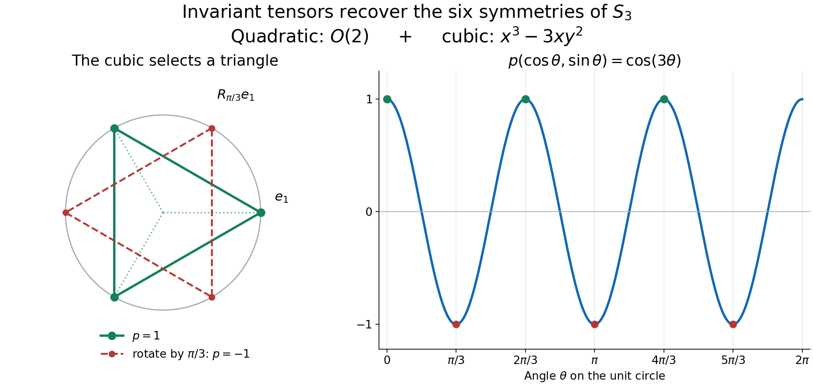

# Compact Tannaka reconstruction and centralizer rigidity

The finite representations carried inside a homogeneous compact action form
the entire rigid representation category of the group.  An automorphism that
commutes with the action centralizer and fixes the fixed algebra therefore
acts as a tensor-natural symmetry of that category.  Compact Tannaka duality
turns this categorical symmetry into one group element, and finite-orbit
density turns equality on representations into equality on the von Neumann
algebra.

Use the setting of
[Internal representations and irreducible multipliers](OA-FLOW-L132.md#oa-flow.homrep.amplify).
Thus $G$ is a second-countable compact Hausdorff group, $M$ has separable
predual, and $\alpha:G\to\operatorname{Aut}(M)$ is faithful and
point-ultraweakly continuous.  We have

$$
M^\alpha\text{ properly infinite},
\qquad
\mathscr A\subseteq\operatorname{Aut}_\alpha(M),
\qquad
M^{\mathscr A}=\mathbb C1,
\tag{TR1}
$$

and $\sigma\in\operatorname{Aut}(M)$ commutes with every member of
$\mathscr A$ and fixes $M^\alpha$ pointwise.  Second countability follows from the original compact Hausdorff, faithful, separable-predual setting by the countable-coordinate argument in that lesson. The faithful normal state there makes every orthogonal family of nonzero range projections countable, so every full internal Hilbert space has a finite or countable basis.

*Self-checked by the writing AI. Original exposition and illustration sources: CC0-1.0 to the extent of rights held; existing component and font terms apply.*

**Theorem.** Under these hypotheses there is a unique \(g\in G\) with \(\sigma=\alpha_g\). Equivalently, for the original homogeneous action, the automorphisms commuting with its full centralizer and fixing \(M^\alpha\) pointwise are exactly \(\alpha(G)\). Every \(\alpha_g\) has the two required properties by the definitions. The proof of the converse follows below. The intermediate arguments allow the smaller homogeneous symmetry group \(\mathscr A\) displayed above, which is the group needed after stabilization.

Besides the preceding two internal-space lessons, we use properly infinite halving and filling, [normal matrix slices](OA-FLOW-L123.md#oa-flow.l123.ic3), the compact polynomial-density theorem, and [Schur orthogonality](../../representations-of-compact-groups/reader/courses/representations-of-compact-groups/matrix-coefficients-and-the-peter-weyl-theorem.html#result-theorem-2-1) and [Peter–Weyl](../../representations-of-compact-groups/reader/courses/representations-of-compact-groups/matrix-coefficients-and-the-peter-weyl-theorem.html#result-theorem-4-1). All Haar integrals below use normalized compact Haar measure, with its existence and invariance proved in [Haar existence and uniqueness](OA-FLOW-HR.md#hr-06).

## The commuting automorphism preserves every internal invariant space

Let $K\in\mathcal H_\alpha$, now allowing finite or countably infinite
dimension.  Use properly infinite halving and filling to choose an internal Hilbert space $R\subseteq M^\alpha$ of the
same dimension and a unitary internal operator
$w\in\mathcal B(R,K)\subseteq M$.  Put

$$
U_s=w^*\alpha_s(w)\in\mathcal B(R),
\qquad
\alpha_s(w)=wU_s.
\tag{TR2}
$$

Fix an orthonormal basis $(r_i)$ of $R$.  For each
$\theta\in\mathscr A$, the strongly convergent sum

$$
t_\theta=\sum_i r_i\theta(r_i)^*
\tag{TR3}
$$

is a unitary from $\theta(R)$ onto $R$.  Both spaces lie in $M^\alpha$, so
$t_\theta\in M^\alpha$, and the basis formula gives

$$
t_\theta\theta(U_s)t_\theta^*=U_s.
\tag{TR4}
$$

Define $\widehat\theta=\operatorname{Ad}(t_\theta)\circ\theta$.  It fixes
$\mathcal B(R)$ pointwise.  If $\rho_R$ is the canonical endomorphism from
[Internal operator spaces and their endomorphisms](OA-FLOW-L131.md#oa-flow.intops.endomorphism), then

$$
\widehat\theta(\rho_R(x))=\rho_R(\theta(x))
\qquad(x\in M).
\tag{TR5}
$$

Under the tensor splitting
$M=\mathcal B(R)\mathbin{\overline\otimes}\rho_R(M)$, take matrix entries relative to $(r_i)$. Invariance under every $\widehat\theta$ says that each entry is fixed by every $\theta$, hence scalar by (TR1). A bounded scalar matrix represents an operator on $R$: its finite-corner norms are bounded by the norm of the original operator, so it extends from finite vectors. The normal matrix realization in the operator-space lesson then gives the exact common fixed algebra

$$
M^{\{\widehat\theta:\theta\in\mathscr A\}}
=\mathcal B(R)\mathbin{\overline\otimes}\rho_R(M^{\mathscr A})
=\mathcal B(R).
\tag{TR6}
$$

Now set

$$
b_\theta=w t_\theta\theta(w^*).
\tag{TR7}
$$

Using (TR2) and (TR4) shows $\alpha_s(b_\theta)=b_\theta$, so
$b_\theta\in M^\alpha$.  Hence $\sigma(b_\theta)=b_\theta$.  Since $\sigma$
commutes with $\theta$ and fixes $t_\theta$, the unitary

$$
h=w^*\sigma(w)
\tag{TR8}
$$

satisfies

$$
h t_\theta\theta(h^*)=t_\theta,
\qquad\text{equivalently}\qquad
h=\widehat\theta(h)
\quad(\theta\in\mathscr A).
\tag{TR9}
$$

Equation (TR6) now proves $h\in\mathcal B(R)$.  Since $\sigma$ fixes $R$
pointwise and $hR=R$,

$$
\boxed{\sigma(K)=\sigma(w)R=whR=wR=K.}
\tag{TR10}
$$

Notice that this argument never assumes that $\sigma$ commutes with
$\alpha_s$; for nonabelian $G$ that conclusion is unavailable.

## A compact group is recovered from its invariant tensors

**Compact reconstruction lemma.** Suppose a unitary $\eta_U$ is assigned to every finite-dimensional continuous unitary representation $U$ of a compact Hausdorff group $G$. Suppose the assignments commute with all intertwining maps, are compatible with direct sums and tensor products, and equal the identity on the trivial representation. Then there is a unique $g\in G$ with $\eta_U=U(g)$ for every $U$.

**Proof.** Naturality for the invariant coevaluation vector \(\sum_j e_j\otimes\overline{e_j}\) gives \((\eta_U\otimes\eta_{\overline U})\sum_j e_j\otimes\overline{e_j}=\sum_j e_j\otimes\overline{e_j}\). Since \(\eta_U\) is unitary, this identity implies \(\eta_{\overline U}=\overline{\eta_U}\).

The zero representation has its unique endomorphism, so it requires no argument. Fix \(U:G\to\mathcal U(\mathbb C^n)\), with \(n\ge1\), and put \(C_U=U(G)\). This is a compact subgroup. Suppose \(A=\eta_U\notin C_U\). On the compact matrix group \(\mathcal U(n)\), the continuous function

$$F(T)=\min_{c\in C_U}\|T-c\|_{\mathrm{HS}}^2
\quad\text{satisfies}\quad
F(Tc)=F(T),\quad F(1)=0<F(A).
\tag{TR11}$$

Polynomials in the matrix entries of \(T\) and their complex conjugates form a unital selfadjoint algebra separating points of \(\mathcal U(n)\). The complex Stone–Weierstrass theorem therefore gives a polynomial \(P\) uniformly approximating \(F\) with error less than \(F(A)/3\). Average it on the right using the normalized Haar probability measure of \(G\):

$$\overline P(T)=\int_G P(TU(s))\,ds.
\tag{TR12}$$

Right invariance of \(F\) gives the same uniform error for \(\overline P\), so \(\overline P(A)\ne\overline P(1)\).

Each monomial of \(P\) is a matrix coefficient of a representation \(V(T)=T^{\otimes r}\otimes\overline T^{\otimes q}\) of \(\mathcal U(n)\), with nonnegative integers \(r,q\); constants use the tensor unit. Its average is the coefficient obtained by replacing its first vector by

$$\Pi_V\xi=\int_G V(U(s))\xi\,ds.
\tag{TR13}$$

Haar invariance puts \(\Pi_V\xi\) in the invariant subspace for \(V\circ U\). Naturality with the intertwiner from the trivial representation carrying that vector forces \(\eta_{V\circ U}\Pi_V\xi=\Pi_V\xi\). Tensor and conjugate compatibility identify \(\eta_{V\circ U}=V(A)\). Therefore every averaged monomial takes the same value at \(A\) and at \(1\), and so does their finite sum \(\overline P\). This contradicts (TR12). We have proved \(\eta_U\in U(G)\) for every finite-dimensional \(U\).

For any finite list \(U_1,\ldots,U_m\), apply this conclusion to their direct sum. Direct-sum compatibility provides one \(g\in G\) with \(U_i(g)=\eta_{U_i}\) for every member of the list. The sets \(\{g\in G:U(g)=\eta_U\}\) are closed, nonempty and have the finite-intersection property. Compactness of \(G\) supplies one \(g\) satisfying all of them. Point separation by finite-dimensional representations, proved in Peter–Weyl, makes it unique. This proves the lemma. $\square$

## Carried representations are closed under sums, tensors, and subobjects

Let $\operatorname{Rep}_\alpha(G)$ denote the nonzero finite-dimensional unitary
representations carried by spaces $K\in\mathcal H_\alpha$ from the multiplier lesson, together with the abstract zero representation. A full internal space in the nonzero algebra $M$ is never zero; the zero object is adjoined only at the level of representations. It has its unique maps and unique unitary endomorphism. The trivial one-dimensional representation is carried by $\mathbb C1$. Empty sums, zero subobjects and tensors with the zero object are understood in this abstract sense. All internal constructions below concern nonzero objects.

For nonzero carried spaces $K_1,\ldots,K_m$, with $m\ge1$, choose isometries
$v_1,\ldots,v_m\in M^\alpha$ such that

$$
v_i^*v_j=\delta_{ij}1,
\qquad
\sum_{i=1}^m v_iv_i^*=1.
\tag{TR14}
$$

Then

$$
K=\operatorname{span}\{v_i x:1\le i\le m,\ x\in K_i\}
\tag{TR15}
$$

is an internal invariant Hilbert space.  The summands are orthogonal, and
$\alpha_s(v_ix)=v_i\alpha_s(x)$, so $K$ carries the direct sum of the
representations on the $K_i$.

For two carried spaces, [Internal Hilbert spaces in a von Neumann algebra](OA-FLOW-L130.md#oa-flow.intspace.tensor) identifies

$$
[K_1K_2]
=\overline{\operatorname{span}}\{xy:x\in K_1,\ y\in K_2\}
\cong K_1\otimes K_2.
\tag{TR16}
$$

Because $\alpha_s(xy)=\alpha_s(x)\alpha_s(y)$, this internal space carries
the tensor product representation.

Subrepresentations require one further step.  If $V$ is a nonzero invariant
subspace of a carried finite-dimensional space, decompose $V$ into
irreducibles.  Each irreducible summand is a finite-dimensional invariant
linear subspace of $M$.  The extraction formula and homogeneous fixed-corner
argument in [Internal representations and irreducible multipliers](OA-FLOW-L132.md#oa-flow.homrep.extract) give a unitary equivariant multiplier for that
summand, hence an internal invariant space carrying it.  Formula (TR15) then
combines the finitely many summands.  Therefore

$$
\boxed{\operatorname{Rep}_\alpha(G)
\text{ is closed under finite sums, tensor products, and subrepresentations}.}
\tag{TR17}
$$

## Exterior powers give the conjugate representation with the correct determinant

The zero representation is its own conjugate. Let $U$ now act on an $n$-dimensional Hilbert space $H$, with $n\ge1$, and suppose $U$ is
carried.  For $0\le k\le n$, the antisymmetrizer

$$
A_k=\frac1{k!}\sum_{\tau\in S_k}\operatorname{sgn}(\tau)P_\tau
\quad\text{on }H^{\otimes k}
\tag{TR18}
$$

commutes with $U_s^{\otimes k}$.  Thus
$\Lambda^kH=\operatorname{Ran}(A_k)$ is an invariant subrepresentation of a
tensor power.  By (TR16)–(TR17), every $\Lambda^kU$ is carried.  In particular,

$$
\Lambda^nU=\det U
\tag{TR19}
$$

is carried by a one-dimensional internal space.  Such a space has the form
$\mathbb Cu$ for a unitary $u\in M$.  Its adjoint space
$\mathbb Cu^*$ is again internal and carries
$\overline{\det U}=(\det U)^{-1}$.

The determinant correction must have this inverse orientation.  For an
orthonormal basis $e_1,\ldots,e_n$ and normalized exterior products, define

$$
J(\overline{e_j})
=(-1)^{j-1}
(e_1\wedge\cdots\wedge\widehat{e_j}\wedge\cdots\wedge e_n)
\otimes
\overline{e_1\wedge\cdots\wedge e_n}.
\tag{TR20}
$$

The wedge basis is orthonormal, so this map is unitary. Its basis-independent description sends a covector $\ell\in H^*$ to its contraction against a top-degree volume vector, tensored with the dual volume vector. Scaling the volume by $c\ne0$ scales the two factors by $c$ and $c^{-1}$, leaving the map unchanged; the identification $\overline H\cong H^*$ is the unitary inner-product identification. Contraction obeys $\iota_{\ell\circ U_s^{-1}}(\Lambda^nU_s\Omega)=\Lambda^{n-1}U_s(\iota_\ell\Omega)$, first on decomposable wedges by expanding the alternating sum. Thus

$$
J\overline{U_s}
=\bigl(\Lambda^{n-1}U_s\otimes\overline{\det U_s}\bigr)J.
\tag{TR21}
$$

For $n=1$, (TR21) uses $\Lambda^0H=\mathbb C$ and says the same thing.  Hence

$$
\boxed{\overline U
\cong\Lambda^{n-1}U\otimes\overline{\det U}}
\tag{TR22}
$$

is carried.  Together with (TR17), this proves that the carried representations
form a self-adjoint subring of the finite representation ring.

## Faithfulness and coefficient density force every irreducible to occur

Let $\mathcal C_\alpha$ be the linear span in $C(G)$ of all matrix
coefficients of carried finite-dimensional representations.  Direct sums and
tensor products make $\mathcal C_\alpha$ a unital algebra, while (TR22) makes
it self-adjoint.

We verify point separation using finite-orbit vectors.  If $s\ne t$, then
faithfulness gives $\alpha_s\ne\alpha_t$.  Choose $x\in M$ and a normal
functional $\varphi\in M_*$ such that

$$
\varphi(\alpha_s(x))\ne\varphi(\alpha_t(x)).
\tag{TR23}
$$

The functional $\varphi\circ(\alpha_s-\alpha_t)$ is ultraweakly continuous.
Since the finite-orbit algebra $M_{\mathrm{fin}}$ is ultraweakly dense by
[Internal representations and irreducible multipliers](OA-FLOW-L132.md#oa-flow.homrep.finiteorbit), one may choose $y\in M_{\mathrm{fin}}$ for which (TR23) still
holds.  On the finite-dimensional orbit space of $y$, the function

$$
r\longmapsto\varphi(\alpha_r(y))
\tag{TR24}
$$

is a matrix coefficient.  Every irreducible summand of this orbit space is
carried by irreducible extraction in the multiplier lesson, so (TR24) belongs to
$\mathcal C_\alpha$.  It separates $s$ and $t$.

The complex Stone–Weierstrass theorem now gives

$$
\overline{\mathcal C_\alpha}^{\,\|\cdot\|_\infty}=C(G).
\tag{TR25}
$$

If an irreducible representation $\pi$ were not carried, subobject closure
would imply that $\pi$ occurs in no carried representation.  Schur
orthogonality would then make every coefficient of $\pi$ orthogonal in
$L^2(G)$ to $\mathcal C_\alpha$.  This contradicts (TR25), because uniform
density implies $L^2$ density.  Therefore

$$
\boxed{\text{every irreducible unitary representation of }G\text{ is carried}.}
\tag{TR26}
$$

## The restrictions of sigma form a unitary tensor-natural family

For every finite-dimensional carried space $K$, define

$$
\eta_K=\sigma|_K:K\longrightarrow K.
\tag{TR27}
$$

It is unitary because an automorphism preserves the scalar internal inner
product.  Let $T:K\to L$ intertwine the corresponding $G$-representations.
[The internal operator-space theorem](OA-FLOW-L131.md#oa-flow.intops.finite) realizes $T$ as left multiplication by a unique element
$a_T\in\mathcal B(K,L)\subseteq M$.  Equivariance of $T$ says precisely

$$
\alpha_s(a_T)=a_T
\qquad(s\in G),
\tag{TR28}
$$

so $a_T\in M^\alpha$ and $\sigma(a_T)=a_T$.  Consequently

$$
\eta_L(Tx)=\sigma(a_Tx)=a_T\sigma(x)=T\eta_K(x).
\tag{TR29}
$$

Thus the family is natural for every intertwiner, including inclusions,
projections, and unitary equivalences between different internal models of
the same abstract representation.  Multiplicativity of $\sigma$ gives

$$
\eta_{[KL]}(xy)=\sigma(xy)=\sigma(x)\sigma(y)
\tag{TR30}
$$

under the tensor identification (TR16).  Formula (TR15) gives direct-sum
compatibility, and $\sigma(1)=1$ gives the tensor unit.  Naturality with the
evaluation and coevaluation intertwiners gives compatibility with conjugates.
By (TR26), carried spaces realize all objects of
$\operatorname{Rep}_{\mathrm{fd}}(G)$, so $(\eta_K)$ defines a unitary
monoidal natural automorphism of its forgetful functor.

The carried representations now exhaust all finite-dimensional representations. Transporting their restrictions along unitary equivalences is independent of the chosen internal model by (TR29). The compact reconstruction lemma applies.

There is a unique \(g\in G\) such that

$$
\eta_K=U_{\alpha,K}(g)=\alpha_g|_K
\qquad(K\in\mathcal H_\alpha,\ \dim K<\infty).
\tag{TR31}
$$

## Finite-orbit density completes compact centralizer rigidity

It remains to pass from internal representation spaces to all of $M$.  Let
$V\subseteq M$ be an irreducible finite-dimensional invariant linear space,
with basis $a_1,\ldots,a_n$ carrying $U$.  [Irreducible multiplier extraction](OA-FLOW-L132.md#oa-flow.homrep.extract) constructs
$0\ne a\in M_\alpha(U)$ and then supplies a unitary
$u\in M_\alpha(U)$.  The internal space $uR$ carries $U$. For each basis vector $e_i$ of $R$, (TR31) gives $\sigma(u)e_i=uU_ge_i$, because $\sigma$ fixes $e_i$. Multiply by $e_i^*$ and sum; $\sum_i e_ie_i^*=1$ gives

$$
\sigma(u)=uU_g=\alpha_g(u).
\tag{TR32}
$$

For every $x\in M_\alpha(U)$, the product $xu^*$ lies in $M^\alpha$.
Because both automorphisms fix that product, (TR32) yields

$$
\sigma(x)=\sigma(xu^*)\sigma(u)
=(xu^*)\alpha_g(u)=\alpha_g(x).
\tag{TR33}
$$

For the extracted multiplier
$a=\sum_i e_1e_i^*\rho_R(a_i)$, [Internal representations and irreducible multipliers](OA-FLOW-L132.md#oa-flow.homrep.extract) also gives

$$
a_i=e_1^*ae_i.
\tag{TR34}
$$

The vectors $e_i$ lie in $M^\alpha$, so (TR33)–(TR34) prove
$\sigma(a_i)=\alpha_g(a_i)$.  Decomposing an arbitrary finite orbit into
irreducibles shows

$$
\sigma(x)=\alpha_g(x)
\qquad(x\in M_{\mathrm{fin}}).
\tag{TR35}
$$

The algebra $M_{\mathrm{fin}}$ is ultraweakly dense, and both automorphisms
are normal.  Therefore

$$
\boxed{\sigma=\alpha_g\in\alpha(G).}
\tag{TR36}
$$

This proves the faithful compact-group target in the amplified system.
Restricting (TR36) to $M\otimes1$ gives the same conclusion for the original
system by [the stabilization argument](OA-FLOW-L132.md#oa-flow.homrep.amplify).

**Problem.** Why does preservation of every internal space alone not finish
the proof?

**Solution.** Separate unitary operators on the representation spaces need
not arise from one group element.  Equations (TR28)–(TR30) force the restrictions
to respect every intertwiner and every tensor product.  That tensor-natural
compatibility is the hypothesis used by compact Tannaka reconstruction.
$\square$

## A countable internal direct sum carries the regular representation

For completeness, second countability of compact $G$ makes $C(G)$ separable in the uniform norm. Indeed the countable separating coordinate functions from the preceding lesson, their conjugates and the rational complex constants generate a countable algebra whose complex algebraic span is uniformly dense by Stone–Weierstrass; rational coefficient approximation gives a countable dense subset. Continuous functions are dense in $L^2(G)$ by regularity of finite Haar measure, so $L^2(G)$ is separable. Schur orthogonality then makes $\widehat G$ countable: choose a nonzero normalized coefficient of each irreducible to obtain an orthonormal family, which must be countable in a separable Hilbert space.  Choose one carried
internal space $K_\pi$ for each $\pi\in\widehat G$, and put
$d_\pi=\dim\pi$.  Properly infinite halving and countable filling provide isometries indexed by this finite or countable set

$$
v_{\pi,j}\in M^\alpha
\quad(\pi\in\widehat G,\ 1\le j\le d_\pi),
\qquad
v_{\pi,j}^*v_{\rho,k}=\delta_{\pi\rho}\delta_{jk}1,
\qquad
\sum_{\pi,j}v_{\pi,j}v_{\pi,j}^*=1
\tag{TR37}
$$

with strong convergence of the last sum.  The countable internal direct sum

$$
K_{\mathrm{reg}}
=\overline{\operatorname{span}}
\{v_{\pi,j}x:x\in K_\pi,\ \pi\in\widehat G,\ 1\le j\le d_\pi\}
\tag{TR38}
$$

therefore carries $\bigoplus_{\pi\in\widehat G}d_\pi\pi$.  The Peter–Weyl
decomposition identifies this representation with the left regular
representation:

$$
\boxed{U_{\alpha,K_{\mathrm{reg}}}\cong\lambda_G
\text{ on }L^2(G).}
\tag{TR39}
$$

The multiplicity $d_\pi$ and the countability in (TR37) are both essential;
if some irreducible has dimension greater than one, one copy of each irreducible is not the regular representation. For compact abelian groups all irreducibles are one-dimensional, and one copy of each does give the regular representation.

## The quadratic and cubic tensors of the triangle

For the standard representation of \(S_3\) on \(V=\mathbb C^2\), use the rotation and reflection matrices in the preceding lesson. The tensors

\[
q=e_1\otimes e_1+e_2\otimes e_2,\qquad
c=e_1^{\otimes3}-e_1\otimes e_2\otimes e_2-e_2\otimes e_1\otimes e_2-e_2\otimes e_2\otimes e_1
\tag{XE1}
\]

are invariant. One can check the reflection on the four displayed terms. For rotations, the associated homogeneous polynomial is
\(p(x,y)=x^3-3xy^2=\operatorname{Re}(x+iy)^3\) on the real plane; rotation through \(2\pi/3\) preserves it there. This is a polynomial coefficient identity and hence also holds for complex coordinates: a polynomial vanishing for all real \(x,y\) has every coefficient zero, by applying the one-variable coefficient identity successively. Since orthogonal matrices preserve the pairing between symmetric tensors and homogeneous polynomials, this verifies invariance of \(c\) in \(V^{\otimes3}\) as well.

If a unitary matrix \(A\) fixes \(q\), its entries satisfy \(AA^{\mathsf T}=I\). Together with \(AA^*=I\), this forces \(A^{\mathsf T}=A^*\), hence real entries: \(A\in O(2)\). Write a real orthogonal map on the unit circle as \(\theta\mapsto\theta+\phi\) or \(\theta\mapsto\phi-\theta\). Preservation of \(c\) is preservation of \(\cos(3\theta)\), so respectively
\(\cos(3\theta+3\phi)=\cos(3\theta)\) or \(\cos(3\phi-3\theta)=\cos(3\theta)\) for all \(\theta\). Evaluating the coefficients of \(\cos(3\theta)\) and \(\sin(3\theta)\) gives \(3\phi\in2\pi\mathbb Z\). Exactly the three rotations and three reflections of \(S_3\) remain. Thus these two particular invariant tensors already recover this concrete compact matrix group.

*Figure 133.1.* On the unit circle, the cubic tensor in (XE1) evaluates to \(p(\cos\theta,\sin\theta)=\cos(3\theta)\). Its three maxima form the triangle preserved by the six matrices of \(S_3\). The quadratic tensor admits every real orthogonal transformation, but rotation by \(\pi/3\) sends \(p(e_1)=1\) to \(-1\), so it fails the cubic condition. This is an exact finite example of the invariant-tensor condition used in the compact reconstruction lemma, not a drawing of an arbitrary compact group. [Vector figure](../assets/compact-tannaka/invariant-tensors.svg) and [figure source](../assets/compact-tannaka/render.py).

**Problem.** Why can a separate element \(g_U\) for each representation fail to reconstruct one group element?

**Solution.** There may be no compatibility between the choices. Applying the single-representation separation argument to the direct sum of any finite list produces one element working for the whole list. Those finite simultaneous solutions give the finite-intersection property, and compactness supplies one element working for every representation.

## Mathematical attribution

The compact homogeneous-action rigidity theorem and the internal-representation questions originate in Masamichi Takesaki, *Theory of Operator Algebras II*, Exercise XI.2.4, printed pp. 349–351. The determinant identity, invariant-tensor reconstruction and regular-representation multiplicities are proved here using the earlier linked operator and compact-group lessons.

