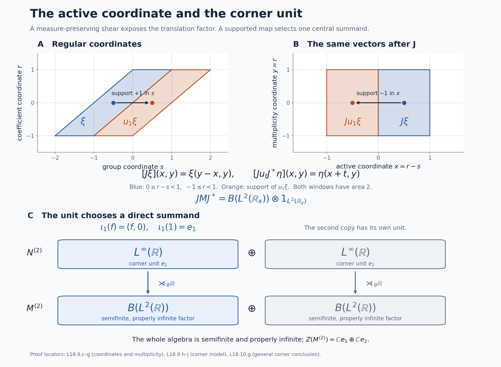

# Trace scaling, central corners and the type III criterion

*Self-checked by the writing AI. Original exposition and illustration sources: CC0-1.0; earlier and font components retain their recorded terms.*

A trace-scaling action creates an infinite crossed product, but that crossed product need not be type III. The distinction is visible in its center: a translation coordinate on a central piece produces a trace on precisely that piece. We calculate the modular action first, construct the coordinate with its normal measurable calculus, and then prove the projection-to-trace bridge needed to obtain the unrestricted type III criterion. Two concrete models show why the support of the coordinate matters.

## Setting and the question about central pieces

Let \(N\ne0\) be an arbitrary von Neumann algebra with a faithful normal semifinite trace \(\tau\). Let \(\theta:\mathbb R\to\operatorname{Aut}(N)\) be point-ultraweakly continuous and suppose
\[
 \tau\circ\theta_s=e^{-s}\tau\qquad(s\in\mathbb R).
\]
There is no assumption of a factor, a faithful state, separability or countability. Form the faithful normal regular crossed product
\[
 M=N\rtimes_\theta\mathbb R
   =\{N,u_s:s\in\mathbb R\}'',\qquad
 u_s a u_s^*=\theta_s(a).
\]
We identify the coefficient algebra with its regular image. Use Lebesgue measure \(ds\) on the original group, dual measure \(dt/(2\pi)\), and the negative dual convention
\[
 \widehat\theta_t(a)=a,\qquad
 \widehat\theta_t(u_s)=e^{-ist}u_s.
\]
Write \(\Phi=\widetilde\tau\) for the faithful normal semifinite dual weight constructed in [GDW6](OA-FLOW-GDW.md#gdw-6). A trace is called semifinite here when it is normal and semifinite on the entire positive cone; every trace used to identify a semifinite algebra is also faithful. A finite algebra means one whose unit is a finite projection, and is not assumed to carry a faithful normal state. The zero algebra has the unique zero version of the constructions, and is excluded whenever a nonzero coordinate or a proper isometry is asserted.

## 1. The modular action determines the center

The modular formula [GDW7](OA-FLOW-GDW.md#gdw-7) and the exact scalar cocycle in [BC5](OA-FLOW-BC.md#oa-flow.bc.5) give
\[
 \sigma_t^\Phi(a)=a,\qquad
 \sigma_t^\Phi(u_s)=u_s[D(\tau\circ\theta_s):D\tau]_t
                  =e^{-ist}u_s.
 \tag{L18.1.a}
\]
Here the original real group is unimodular, so there is no additional group modular factor. Both sides are normal automorphisms and agree on the generating algebra; bounded strong density extends that agreement to all of \(M\). Thus
\[
 \sigma_t^\Phi=\widehat\theta_t,\qquad M_\Phi=N.
 \tag{L18.1.b}
\]
The second equality is the full fixed-algebra theorem [DA](OA-FLOW-DA.md#da-fixed), not merely a computation on Fourier polynomials.

Every central element is fixed by the modular group, as proved using the full modular operator in [NC4](OA-FLOW-NC.md#oa-flow.nc.4). Hence \(z\in Z(M)\) belongs to \(N\). It commutes with \(N\), so lies in \(Z(N)\), and it commutes with all \(u_s\), so \(\theta_s(z)=z\). Conversely these two properties imply commutation with all generators of \(M\). Therefore
\[
 Z(M)=Z(N)^\theta.
 \tag{L18.1.c}
\]
In particular \(M\) is a factor exactly when \(Z(N)^\theta=\mathbb C1\).

If \(e\in Z(N)^\theta\) is a nonzero projection, it is central in \(M\). The regular construction restricts normally to
\[
 Me=(Ne)\rtimes_{\theta|_{Ne}}\mathbb R,
 \qquad u_s^e=u_se.
 \tag{L18.1.d}
\]
Indeed the restricted regular representation has coefficient algebra \(Ne\), the same translations on its Hilbert space, and exactly these generators. The corner theorem [CZ5](OA-FLOW-CZ.md#oa-flow.cz.5) gives a faithful normal semifinite weight \(\Phi_e=\Phi|_{(Me)_+}\), with restricted modular group and centralizer \(Ne\). This remains true when \(\Phi(e)=\infty\).

## 2. Comparing traces by a central density

Let \(P\) be any von Neumann algebra and let \(\tau_0,\rho\) be faithful normal semifinite traces on \(P\). The full-cone density theorem [TD4–6](OA-FLOW-TD.md#oa-flow.td.4) gives a unique positive self-adjoint operator \(h\), affiliated with \(P\), such that
\[
 \rho=(\tau_0)_h,
 \qquad
 (\tau_0)_h(x)=\sup_n\tau_0(h_n^{1/2}xh_n^{1/2}),
 \quad h_n=h\wedge n,\quad x\in P_+.
 \tag{L18.2.a}
\]
Semifiniteness removes the possible infinite-value part of the density, and faithfulness removes its kernel. Thus \(h\) and \(h^{-1}\) are ordinary densely defined nonsingular affiliated operators. [CZ5](OA-FLOW-CZ.md#oa-flow.cz.5) and the trace criterion [KT5](OA-FLOW-KT.md#oa-flow.kt.5) imply
\[
 a=\sigma_t^\rho(a)=h^{it}ah^{-it}\qquad(a\in P).
\]
Every \(h^{it}\) is consequently central. The spectral projections of \(\log h\), and hence of \(h\), belong to the von Neumann algebra generated by these powers, by [RF5](OA-FLOW-RF.md#oa-flow.rf.5). Thus \(h\) is affiliated with \(Z(P)\). Conversely such a nonsingular central density yields a faithful normal semifinite trace, by the same modular formula.

For a normal automorphism \(\beta\) and a positive scalar \(c\), bounded spectral transport in [CZ7](OA-FLOW-CZ.md#oa-flow.cz.7) gives
\[
 (\tau_0)_h\circ\beta
       =(\tau_0\circ\beta)_{\beta^{-1}(h)},
 \qquad (c\tau_0)_k=(\tau_0)_{ck}.
 \tag{L18.2.b}
\]
For example the first equality follows for every bounded cutoff from
\(h_n^{1/2}\beta(x)h_n^{1/2}
=\beta(\beta^{-1}(h_n)^{1/2}x\beta^{-1}(h_n)^{1/2})\);
normal spectral transport identifies these cutoffs with those of \(\beta^{-1}(h)\). Taking their increasing weight values proves the formula, including infinity. The scalar identity follows by cofinal rescaling of the cutoff parameter. It does not require multiplying undefined unbounded operator products.

In particular, if \(\tau_0\circ\beta_s=e^{-s}\tau_0\) and \(\rho\circ\beta_s=\rho\), uniqueness of the entire density in [TD5](OA-FLOW-TD.md#oa-flow.td.5) gives
\[
 h=e^{-s}\beta_s^{-1}(h),\qquad
 \beta_s(h)=e^{-s}h,\qquad
 \beta_s(h^{-it})=e^{ist}h^{-it}.
 \tag{L18.2.c}
\]
The last identity is bounded spectral calculus and fixes the phase sign used below.

## 3. Two ways to see proper infiniteness

First use the continuous eigenunitaries already constructed for arbitrary trace-scaling algebras in [L19, Sections 3–4](OA-FLOW-L19.md#l19-3). They give a strongly continuous unitary group \(v_t\in N\) satisfying
\[
 \theta_s(v_t)=e^{ist}v_t.
\]
These unitaries need not be central. Together with the crossed-product group they form the regular Weyl pair
\[
 u_s v_t u_s^*=e^{ist}v_t.
 \tag{L18.3.a}
\]
The full unitary construction [WRC](OA-FLOW-WRC.md#wr-unitary) identifies their generated algebra with
\(B(L^2(\mathbb R))\bar\otimes1_E\), with its ambient unit and an arbitrary nonzero multiplicity space \(E\). In particular there is a normal unital embedding of \(B(L^2(\mathbb R))\) into \(M\).

Here are explicit isometries in that algebra. For \(j=0,1\), \(n\in\mathbb Z\) and \(0\leq r<1\), define
\[
 (S_jf)(2n+j+r)=f(n+r),
\]
and set \(S_jf=0\) on the unit intervals with the other parity. Countable additivity of the Lebesgue integral gives \(\|S_jf\|=\|f\|\). Its range is precisely the functions supported on \(\bigcup_n[2n+j,2n+j+1)\); the inverse there is the reverse interval identification. These two supports partition \(\mathbb R\), so
\[
 S_j^*S_j=1,\qquad S_0S_0^*S_1S_1^*=0,
 \qquad S_0S_0^*+S_1S_1^*=1.
 \tag{L18.3.b}
\]
Their images in \(M\) prove that its unit is properly infinite. Multiplication by any nonzero central projection \(e\) preserves all these identities with unit \(e\). In particular a finite normal positive trace \(\psi\) on \(M\) would satisfy
\[
 \psi(1)=\psi(S_0S_0^*)+\psi(S_1S_1^*)=2\psi(1),
\]
forcing \(\psi(1)=0\) and \(\psi=0\). The notation in this equation denotes the images of the two isometries.

There is a second argument that explains the trace-density mechanism. Suppose \(\psi\ne0\) is a finite normal positive trace. Let \(e\) be its support. Its support is central because conjugation by every unitary preserves \(\psi\) and hence preserves its support. One can construct the support directly. For finitely many zero-trace projections \(p_i\), put \(a=\sum_i p_i\). The inequality \(1_{[\varepsilon,\infty)}(a)\le\varepsilon^{-1}a\) makes each of these spectral projections have zero trace. Normality gives \(\psi(s(a))=0\), and \(s(a)=\bigvee_i p_i\) because \(\ker a=\bigcap_i\ker p_i\), as follows from \(\langle a\xi,\xi\rangle=\sum_i\|p_i\xi\|^2\). Normality on the directed finite joins proves that an arbitrary join of zero-trace projections also has zero trace. If \(q\) is their join, normality gives \(\psi(q)=0\), and \(e=1-q\). Spectral cutoffs show that the restriction of \(\psi\) to \(Me\) is faithful; for \(x\geq0\) with \(\psi(x)=0\), each \(1_{[1/n,\infty)}(x)\) has zero trace and lies below \(q\).

By Section 1, \(e\in Z(N)^\theta\). The restriction \(\rho=\psi|_{Ne}\) is a faithful finite normal trace, invariant under \(\theta\) because this action is implemented by \(u_se\). The faithful normal semifinite trace \(\tau_e\) scales by \(e^{-s}\). Section 2 gives a nonsingular central density \(h\) for \(\rho\) relative to \(\tau_e\), and the group \(h^{-it}\) has the positive Weyl phase. WRC therefore embeds \(B(L^2(\mathbb R))\) with unit \(e\) in \(Me\). Choose countably many mutually orthogonal rank-one projections in that copy. Their \(\psi\)-values are equal, strictly positive by faithfulness, and their finite sums are bounded by \(e\), contradicting \(\psi(e)<\infty\).

For completeness this second argument also implies proper infiniteness: [FCT8](OA-FLOW-FCT.md#oa-flow.fct.8) supplies a nonzero finite normal scalar trace on every nonzero finite algebra. A finite central summand of \(M\) would give such a trace on \(M\), extended by zero. There are therefore no finite central summands, and the actual halving theorem [PC5](OA-FLOW-PC.md#oa-flow.pc.5) proves proper infiniteness. The first argument supplies the halving isometries directly.

## 4. A central eigenunitary group is a normal Lebesgue coordinate

Let \(A\ne0\) be a von Neumann algebra, let \(\beta\) be a point-ultraweakly continuous real action, and suppose \(v_t\in Z(A)\) is a strongly continuous unitary group with
\[
 \beta_s(v_t)=e^{ist}v_t.
 \tag{L18.4.a}
\]
We prove that there is a unique faithful normal unital homomorphism
\[
 \begin{gathered}
 \Pi:L^\infty(\mathbb R,dr)\longrightarrow Z(A),\qquad \Pi(e^{itr})=v_t,\\
 \beta_s\Pi(f)=\Pi(a_sf),\qquad a_sf(r)=f(r+s).
 \end{gathered}
 \tag{L18.4.b}
\]
Its range is \(v(\mathbb R)''\), and its inverse on that range is normal.

To obtain full normality, apply the already proved normal Haar-coordinate theorem [L31, Section 2](OA-FLOW-L31.md#l31-2) to \(u_t=v_t\) and the reversed action \(\gamma_s=\beta_{-s}\). Its negative-phase hypothesis is exact:
\(\gamma_s(u_t)=e^{-ist}u_t\).
That theorem constructs the coordinate through the faithful normal regular model and the full Fourier multiplication algebra, including its normal inverse. It gives \(\Pi(e^{itr})=v_t\). Its covariance, or equality on characters followed by their ultraweak density and normality, gives the positive translation in (L18.4.b). Centrality follows because every generating unitary is central.

It is useful to see why this coordinate uses Lebesgue null sets. By [RF5](OA-FLOW-RF.md#oa-flow.rf.5), write \(v_t=e^{itQ}\), where \(Q\) is self-adjoint and affiliated with \(Z(A)\). Uniqueness of the generator gives
\[
 \beta_s(Q)=Q+s1,\qquad
 \beta_s(E_Q(B))=E_Q(B-s)
 \tag{L18.4.c}
\]
for every Borel set \(B\). For \(\omega\in A_*^+\), the finite scalar spectral measure \(\mu_\omega(B)=\omega(E_Q(B))\) and the nonnegative interchange theorem [FF1](OA-FLOW-FF.md#oa-flow.ff.1) yield
\[
 \begin{aligned}
 \int_{\mathbb R}\omega(\beta_s(E_Q(B)))\,ds
 &=\int_{\mathbb R}\int_{\mathbb R}1_B(r+s)\,d\mu_\omega(r)\,ds\\
 &=|B|\,\omega(1).
 \end{aligned}
 \tag{L18.4.d}
\]
If \(|B|=0\), the continuous nonnegative function \(s\mapsto\omega(\beta_s(E_Q(B)))\) has integral zero, so vanishes everywhere. At zero this gives \(\omega(E_Q(B))=0\) for every positive normal functional, hence \(E_Q(B)=0\). Conversely, if \(E_Q(B)=0\), its translates are zero, and (L18.4.d) for any nonzero positive normal functional gives \(|B|=0\). This includes unbounded Borel sets and infinite integrals.

Normal transport of the scalar spectral measure by \(\Pi\) gives a projection-valued measure with imaginary powers \(v_t\). Generator uniqueness therefore identifies
\[
 \Pi(1_B)=E_Q(B),\qquad \Pi(f)=f(Q)
 \tag{L18.4.e}
\]
first for Borel simple functions and then for all bounded Borel functions. Lebesgue measurable classes have Borel representatives, and the established null-set equivalence makes this independent of the representative. The normal coordinate construction proves preservation of arbitrary bounded increasing suprema; the null-set argument alone is not being used as a substitute for that normality assertion. Characters generate the full multiplication algebra in L31, so they also prove uniqueness of \(\Pi\).

## 5. The exact criterion on a central corner

Fix \(0\ne e\in Z(N)^\theta\). The following are equivalent:

1. \(Me\) admits a faithful normal semifinite trace.
2. There is a strongly continuous unitary group \(v_t\in Z(Ne)\), with unit \(e\), such that \(\theta_s(v_t)=e^{ist}v_t\).
3. There is a normal injective homomorphism \(\Pi:L^\infty(\mathbb R)\to Z(N)e\), with \(\Pi(1)=e\), satisfying \(\theta_s\Pi(f)=\Pi(a_sf)\).

Assume first that \(T\) is a faithful normal semifinite trace on \(Me\). [TD4–6](OA-FLOW-TD.md#oa-flow.td.4) applied to the already constructed weight \(\Phi_e\) gives a nonsingular positive affiliated operator \(b\) with
\[
 \Phi_e=T_b,\qquad
 \sigma_t^{\Phi_e}=\operatorname{Ad}(b^{it}).
 \tag{L18.5.a}
\]
The modular formula is [CZ5](OA-FLOW-CZ.md#oa-flow.cz.5). For every \(r,t\), the powers of \(b\) commute, so \(b^{it}\) is fixed by \(\sigma_r^{\Phi_e}\); Section 1 puts it in \(Ne\). The modular group fixes every element of \(Ne\), so \(b^{it}\) also commutes with \(Ne\). Thus it lies in \(Z(Ne)\). On the crossed-product unitaries (L18.1.a) and (L18.5.a) give
\[
 b^{it}(u_se)b^{-it}=e^{-ist}u_se,
 \quad (u_se)b^{it}(u_se)^*=e^{ist}b^{it}.
 \tag{L18.5.b}
\]
Set \(v_t=b^{it}\). Spectral dominated convergence gives strong continuity, so condition 2 follows.

Conversely suppose condition 2 holds. The Stone generator \(Q\) of \(v\) is affiliated with \(Z(Ne)\); let \(b=e^Q\). Then \(b\) and \(b^{-1}\) are nonsingular positive self-adjoint operators affiliated with the centralizer \(Ne\) of \(\Phi_e\), and \(b^{it}=v_t\). Conjugation by \(v_t\) fixes \(Ne\). The covariance in condition 2 gives
\[
 v_t(u_se)v_t^*=e^{-ist}u_se.
\]
The two generating families and normality show \(\sigma_t^{\Phi_e}=\operatorname{Ad}(b^{it})\) on all of \(Me\). Construct
\[
 T=(\Phi_e)_{b^{-1}}.
 \tag{L18.5.c}
\]
[CZ2](OA-FLOW-CZ.md#oa-flow.cz.2) proves this is faithful normal semifinite. Explicitly, with
\(p_n=1_{[1/n,n]}(b)\uparrow e\), its entire positive cone is specified by bounded products:
\[
 T(X)=\sup_n\Phi_e(b^{-1/2}p_nXp_nb^{-1/2}),\qquad X\in(Me)_+.
 \tag{L18.5.d}
\]
The values increase by parameter order for weights, as proved in CZ; the sandwiched operators need not increase. Its modular group, by CZ5, is
\[
 \sigma_t^T(X)=b^{-it}\sigma_t^{\Phi_e}(X)b^{it}=X.
\]
[KT5](OA-FLOW-KT.md#oa-flow.kt.5) therefore proves that \(T\) is a trace. This establishes condition 1 on the whole cone, including infinite values.

Section 4 applied to \(A=Ne\) proves 2 implies 3. Conversely, under condition 3 put \(v_t=\Pi(e^{itr})\). The group law, unit and covariance follow from the homomorphism identities. To verify strong continuity, compose \(\Pi\) with any positive normal vector functional of a faithful normal representation of \(Ne\). This gives a positive normal functional on \(L^\infty(\mathbb R)\), represented by an \(L^1\) density as in [L31, Section 2](OA-FLOW-L31.md#l31-2). Scalar dominated convergence applied to \(|e^{itr}-1|^2\) proves \(\|(v_t-e)\xi\|\to0\) for every vector \(\xi\). Hence 3 implies 2 and completes all three equivalences.

## 6. The largest semifinite summand and the supported translation criterion

We first prove the general trace-existence step needed to interpret the corner criterion as a type III criterion. This step concerns an arbitrary von Neumann algebra \(P\); no trace or faithful normal state on \(P\) is assumed. A projection is finite in the Murray–von Neumann sense. A nonzero algebra is of type III when it has no nonzero finite projections.

**Extension from a full corner with a tracial state.** Suppose \(f\in P\) has central support \(1\), and \(t\) is a faithful normal tracial state on \(fPf\). By [central supports and polar bridges](OA-FLOW-PC.md#oa-flow.pc.2), choose a maximal family \((w_i)_{i\in I}\) of partial isometries such that
\[
 w_i^*w_i\le f,\qquad r_i=w_iw_i^*\text{ are pairwise orthogonal},
 \qquad w_0=f.
 \tag{L18.6.a}
\]
The maximal principle applies to families of operators in the set \(P\). Their final projections sum strongly to \(1\): if the residual projection \(r\) were nonzero, \(rPf\ne0\) because \(c(f)=1\), and polar decomposition of a nonzero element of \(rPf\) would extend the family. Initial projections need not be orthogonal.

For \(x\in P_+\), define
\[
 T(x)=\sum_{i\in I}t(w_i^*xw_i)
 :=\sup_{F\subset I\ {\rm finite}}\sum_{i\in F}t(w_i^*xw_i).
 \tag{L18.6.b}
\]
Each summand is a bounded normal positive functional. Common finite upper sets prove additivity and positive homogeneity. Interchanging the supremum over finite \(F\) with the supremum of a bounded increasing positive net proves normality. If \(T(x)=0\), faithfulness of \(t\) gives \(x^{1/2}w_i=0\) for every \(i\). The final projections fill \(1\), so \(x=0\).

For \(a\in P\), insert the finite partial sums of \(\sum_jr_j=1\) and use normality in every summand. All entries \(w_j^*aw_i\) belong to \(fPf\), so traciality there gives
\[
 \begin{aligned}
 T(a^*a)
 &=\sum_{i,j}t\bigl((w_j^*aw_i)^*(w_j^*aw_i)\bigr)\\
 &=\sum_{i,j}t\bigl((w_j^*aw_i)(w_j^*aw_i)^*\bigr)
 =T(aa^*).
 \end{aligned}
 \tag{L18.6.c}
\]
Both iterated nonnegative sums are the supremum over finite rectangles, which is also the supremum over finite subsets of \(I\times I\). Thus the calculation includes infinite values.

For finite \(F\subset I\), put \(r_F=\sum_{i\in F}r_i\). Orthogonality and \(t(f)=1\) give
\[
 T(r_F)=\sum_{i\in F}t(w_i^*w_i)\le |F|,
 \qquad
 T(x^{1/2}r_Fx^{1/2})=T(r_Fxr_F)\le\|x\|T(r_F).
 \tag{L18.6.d}
\]
The equality follows from (L18.6.c), applied to \(r_Fx^{1/2}\). These positive elements increase to \(x\), so \(T\) is semifinite. Since \(r_0=f\) and every other final projection is orthogonal to \(f\), (L18.6.b) restricts exactly to \(t\) on \((fPf)_+\). We have constructed a faithful normal semifinite trace, with no restriction on \(I\) or the ambient Hilbert space.

**Finite projections supply the required corners.** Let \(0\ne p\in P\) be finite. [FCT6–8](OA-FLOW-FCT.md#oa-flow.fct.6) constructs the normalized faithful normal center-valued trace
\[
 T_p:pPp\longrightarrow Z(pPp).
 \tag{L18.6.e}
\]
Choose a nonzero positive normal functional \(\omega\) on \(Z(pPp)\), and let \(q\) be its support there. The support construction makes \(\omega\) faithful on \(Z(pPp)q\). After dividing by \(\omega(q)>0\), the functional
\[
 t_q(x)=\frac{\omega(T_p(x))}{\omega(q)}
 \qquad(x\in(qPq)_+)
 \tag{L18.6.f}
\]
is a faithful normal tracial state on \(qPq\). Indeed \(q\) is central in \(pPp\), \(T_p(q)=q\), the center-module identity puts \(T_p(x)\) in \(Z(pPp)q\), and faithfulness of \(T_p\) followed by faithfulness of \(\omega\) proves faithfulness of \(t_q\). The trace identity and normality follow from those of \(T_p\) and \(\omega\).

The [normal center isomorphism for a full corner](OA-FLOW-PC.md#oa-flow.pc.4) writes \(q=pz\) for a unique central projection \(z\le c_P(p)\), and \(c_P(q)=z\). For the last equality, \(q\le z\), whereas a central subprojection of \(z\) annihilating \(q=pz\) also annihilates \(p\), hence is zero by the definition of \(c_P(p)\). Thus \(q\) is a full corner of \(Pz\). Apply (L18.6.a)–(L18.6.d) in \(Pz\). Every nonzero finite projection has consequently supplied a nonzero central subalgebra carrying a faithful n.s.f. trace. No faithful state on the original finite algebra was assumed.

**Assemble the entire semifinite part.** Put
\[
 z_{\rm sf}=\bigvee\{p:p\text{ is a finite projection of }P\}.
 \tag{L18.6.g}
\]
[PC8](OA-FLOW-PC.md#oa-flow.projection.pc8) proves that this projection is central and that every nonzero projection below it contains a nonzero finite subprojection. Its complementary algebra has no nonzero finite projections. That proof is a projection statement; we now supply the scalar traces.

Choose a maximal family of pairwise orthogonal nonzero central projections \(z_j\le z_{\rm sf}\) such that \(Pz_j\) has a full projection \(f_j\) whose corner admits a faithful normal tracial state \(t_j\). The construction (L18.6.e)–(L18.6.f) shows that these projections fill \(z_{\rm sf}\). In fact a nonzero residual central projection below \(z_{\rm sf}\) contains a nonzero finite \(p\), and that construction supplies another central \(z_j\) in the residual.

On each \(Pz_j\), let \(T_j\) be the trace just constructed, with orthogonal filling final projections \(r_{j,i}\) as in (L18.6.a). Define
\[
 \tau_{\rm sf}(x)=\sum_jT_j(z_jx),\qquad x\in(Pz_{\rm sf})_+.
 \tag{L18.6.h}
\]
The central supports make all summands positive. The finite-subsum argument proves additivity, homogeneity and normality, and the trace identities on each central piece prove the trace identity on the whole cone. Faithfulness follows because the \(z_j\) fill \(z_{\rm sf}\). For a finite set \(F\) of pairs \((j,i)\), the projection
\[
 R_F=\sum_{(j,i)\in F}r_{j,i}
 \quad\text{satisfies}\quad
 \tau_{\rm sf}(R_F)\le |F|,\qquad R_F\uparrow z_{\rm sf}.
 \tag{L18.6.i}
\]
Therefore \(x^{1/2}R_Fx^{1/2}\uparrow x\) and its trace is at most \(\|x\||F|\), exactly as in (L18.6.d). This proves semifiniteness of the complete arbitrary central assembly.

Conversely, suppose \(Pe\) has a faithful n.s.f. trace \(\rho\), where \(e\in Z(P)\). Every nonzero projection \(r\le e\) contains a nonzero finite-trace projection. To see this directly, density of the finite positive cone supplies \(a\ge0\) with \(\rho(a)<\infty\) and \(rar\ne0\); otherwise compression by \(r\) would annihilate a weakly dense linear space. The trace identity gives
\[
 \rho(rar)=\rho(a^{1/2}ra^{1/2})\le\rho(a)<\infty.
 \tag{L18.6.j}
\]
A nonzero spectral projection \(d=1_{[\delta,\infty)}(rar)\le r\), for some \(\delta>0\), has \(\rho(d)\le\delta^{-1}\rho(rar)<\infty\). It is finite: if \(v^*v=d\) and \(vv^*\le d\), then \(\rho(vv^*)=\rho(d)<\infty\), so additivity and faithfulness force \(d-vv^*=0\). In particular \(e(1-z_{\rm sf})=0\), since that complementary corner has no nonzero finite projection. Hence \(e\le z_{\rm sf}\).

We have proved that \(Pz_{\rm sf}\) is the largest central summand admitting a faithful normal semifinite trace, and, for nonzero \(P\),
\[
 \begin{gathered}
 P\text{ is type III}\quad\Longleftrightarrow\quad z_{\rm sf}=0\\
 \Longleftrightarrow\quad
 P\text{ has no nonzero trace-semifinite central summand}.
 \end{gathered}
 \tag{L18.6.k}
\]
The zero summand carries its unique zero trace. Neither a classification theorem nor a scalar trace on a finite non-sigma-finite algebra was a premise.

Return to \(M=N\rtimes_\theta\mathbb R\). Write \((a_sf)(r)=f(r+s)\). The [central-corner equivalence](#l18-5), the proved center equality \(Z(M)=Z(N)^\theta\), and (L18.6.k) give the exact supported form of the criterion:
A supported central translation copy means a nonzero normal injective star homomorphism
\[
 J:L^\infty(\mathbb R)\longrightarrow Z(N),\qquad \theta_sJ=Ja_s.
\]
Then
\[
 \boxed{\ M\text{ is type III}\quad\Longleftrightarrow\quad\text{no such }J\text{ exists}.\ }
 \tag{L18.6.l}
\]
Here \(J\) need not be unital into \(Z(N)\). Its unit \(e=J(1)\) is a nonzero central projection and equivariance gives \(\theta_s(e)=e\). Thus it is unital as a map into \(Z(Ne)\), and Section 5 makes \(Me\) semifinite. Conversely every nonzero semifinite central summand \(Me\) supplies such a map with unit \(e\). These implications hold on that exact central support.

More precisely, adjoining \(0\) to the set of invariant central projections \(e\ne0\) that support such a unital map into \(Z(Ne)\), its largest element is \(z_{\rm sf}(M)\in Z(N)^\theta\). When nonzero, that largest element itself supports a translation map, because (L18.6.h) supplies a faithful n.s.f. trace on its whole corner and Section 5 applies there. A proper supported copy determines a semifinite corner, without determining the type of its complementary corner.

## 7. Scaling weights on the centers of finite and type-I algebras

The remaining type consequence requires a semifinite weight on the center, not just a trace on the algebra. We give both needed constructions with their full hypotheses. Zero components carry their unique zero weights; the constructions below treat nonzero algebras.

**Finite algebras.** Let \(A\) be finite and let \(\tau_0\) be a given faithful n.s.f. trace on \(A\). Put \(Z=Z(A)\). [FCT6–8](OA-FLOW-FCT.md#oa-flow.fct.6) supplies the normalized faithful normal center-valued trace \(T_A:A\to Z\). Choose a faithful n.s.f. weight \(\nu\) on \(Z\), using [FR1](OA-FLOW-FR.md#oa-flow.fr.1); this weight is a trace since \(Z\) is commutative.

Viewed as an operator-valued weight, \(T_A\) is normal and faithful, satisfies
\[
 T_A(b^*xb)=b^*T_A(x)b\quad(b\in Z,\ x\in A_+),
 \qquad N_{T_A}=A,
 \tag{L18.7.a}
\]
and is therefore semifinite. The bimodule equation follows from the center-module identity, and the finite-domain assertion follows because \(T_A\) is bounded with values in \(Z\). [EP6's full composition theorem](OA-FLOW-EP.md#oa-flow.ep.6) shows that
\[
 \rho=\nu\circ T_A
 \tag{L18.7.b}
\]
is faithful normal semifinite. It is tracial: \(T_A(a^*a)=T_A(aa^*)\), and applying \(\nu\) preserves that equality, including infinity.

The [central trace-density comparison](#l18-2) gives a unique nonsingular positive self-adjoint \(h\) affiliated with \(Z\) such that \(\tau_0=\rho_h\). This uses [TD4–6](OA-FLOW-TD.md#oa-flow.td.4) for the two faithful n.s.f. traces on \(A\), followed by the modular argument that makes the density central. Put \(h_n=h\wedge n\). For every \(z\in Z_+\), the whole-cone cutoff formula and the center-module identity give
\[
 \begin{aligned}
 \tau_0(z)
 &=\sup_n\rho(h_n^{1/2}zh_n^{1/2})
 =\sup_n\nu\bigl(T_A(h_nz)\bigr)\\
 &=\sup_n\nu(h_nz)=\nu_h(z).
 \end{aligned}
 \tag{L18.7.c}
\]
The last weight is faithful n.s.f. on \(Z\), by [TD6](OA-FLOW-TD.md#oa-flow.td.6) applied to the ordinary nonsingular affiliated density \(h\) and the trace \(\nu\) on \(Z\). We have proved
\[
 \tau_0|_{Z(A)}\text{ is faithful normal semifinite when }A\text{ is finite}.
 \tag{L18.7.d}
\]
Every value in (L18.7.c) is a nonnegative extended value; no infinite value was subtracted or canceled. This proof requires neither a norm-closed unitary-orbit averaging assertion nor a faithful finite scalar trace on all of \(A\). If \(\beta\in\operatorname{Aut}(A)\) is normal and \(\tau_0\circ\beta=c\tau_0\), \(c>0\), then the restriction in (L18.7.d) has the same scaling, since \(\beta\) preserves \(Z(A)\).

**Type-I algebras.** A projection \(p\) is abelian if \(pPp\) is commutative. For any algebra \(P\), the join of the central supports of its abelian projections is its type-I central part. Every nonzero projection in that part contains a nonzero abelian subprojection: otherwise it has no polar bridge to any abelian projection, since such a bridge identifies a smaller corner with a subcorner of an abelian algebra. The central-support criterion would then make it orthogonal to that entire central join, a contradiction. This proves the projection formulation without a representation classification. If this part is all of \(P\), choose a maximal family of abelian projections \(p_j\) with pairwise orthogonal central supports. Those supports fill \(1\): a nonzero residual central projection meets the central support of some abelian projection, whose central cut is a nonzero abelian projection in the residual. Consequently
\[
 p=\sum_jp_j\text{ is abelian},\qquad c_P(p)=1.
 \tag{L18.7.e}
\]
The sum exists strongly. Its corner is commutative because the different central pieces have zero mixed corners and each \(p_jPp_j\) is commutative. This construction uses an arbitrary family, not a countable homogeneous decomposition.

Let \(\tau_0\) be a given faithful n.s.f. trace on such a \(P\). For every projection \(p\), its restriction to \(pPp\) is faithful normal semifinite. Indeed the finite positive cone of \(\tau_0\) has weakly dense linear span, and for each finite positive \(a\),
\[
 \tau_0(pap)=\tau_0(a^{1/2}pa^{1/2})\le\tau_0(a)<\infty.
 \tag{L18.7.f}
\]
Compression of that dense span is weakly dense in \(pPp\), so [GW4's finite-cone criterion](OA-FLOW-GW.md#oa-flow.gw.4) proves semifiniteness of the restriction; normality and faithfulness are inherited. For the full abelian \(p\) in (L18.7.e), [PC4](OA-FLOW-PC.md#oa-flow.pc.4) gives the normal star isomorphism with normal inverse
\[
 Z(P)\longrightarrow pPp,\qquad z\longmapsto zp.
 \tag{L18.7.g}
\]
Define
\[
 \nu_p(z)=\tau_0(zp),\qquad z\in Z(P)_+.
 \tag{L18.7.h}
\]
Equations (L18.7.f)–(L18.7.g) prove that \(\nu_p\) is faithful normal semifinite on the whole center.

We verify its independence of the full abelian projection. Let \(p,q\) both be full and abelian. [PC2's central comparison](OA-FLOW-PC.md#oa-flow.pc.2) splits the identity into complementary central pieces on which \(p\precsim q\) or \(q\precsim p\), respectively. On a piece \(w\) of the first kind, carry \(pw\) to a projection \(r\le qw\). Equivalence preserves central support, so \(c_P(r)=w\). Since \(qw\) is full and abelian in \(Pw\), (L18.7.g) for this corner writes \(r=qz\) for a central projection \(z\le w\). Fullness of \(q\) implies \(c_P(qz)=z\), so \(z=w\) and \(r=qw\). Thus the subequivalence is already an equivalence. Apply the same argument in reverse on the other piece. The orthogonal sum of the partial isometries gives \(v\in P\) with
\[
 v^*v=p,\qquad vv^*=q.
 \tag{L18.7.i}
\]
For \(z\in Z(P)_+\), the bounded operator \(a=vz^{1/2}p\) has \(a^*a=zp\) and \(aa^*=zq\). The trace identity on the whole positive cone therefore yields
\[
 \nu_p(z)=\tau_0(zp)=\tau_0(zq)=\nu_q(z).
 \tag{L18.7.j}
\]
In particular the equality remains valid when either value is infinite. Denote this choice-independent center weight by \(\nu\).

If a normal automorphism \(\beta\) satisfies \(\tau_0\circ\beta=c\tau_0\), \(c>0\), then \(\beta^{-1}(p)\) is again full and abelian. Using (L18.7.j), we obtain for every positive central \(z\)
\[
 \begin{aligned}
 \nu(\beta(z))
 &=\tau_0(\beta(z)p)
 =\tau_0\bigl(\beta(z\beta^{-1}(p))\bigr)\\
 &=c\,\tau_0(z\beta^{-1}(p))
 =c\nu(z).
 \end{aligned}
 \tag{L18.7.k}
\]
Thus the center weight has precisely the scalar covariance of the given trace. An invariant full abelian projection was not required.

## 8. A type III crossed product has type II∞ coefficients

Return to the given nonzero \(N\), its faithful n.s.f. trace \(\tau\), and \(\tau\circ\theta_s=e^{-s}\tau\). The converse argument in (L18.6.j) shows that every nonzero projection in \(N\) contains a nonzero finite projection. Thus \(N\) is entirely projection-semifinite.

Let \(z_{\mathrm I}\) be the central join of the supports of abelian projections in \(N\), as in Section 7. The remaining algebra \(N(1-z_{\mathrm I})\) has no nonzero abelian projection. [PC5](OA-FLOW-PC.md#oa-flow.pc.5) supplies its largest finite central summand; write its unit as \(z_{\mathrm{II},1}\), and set
\[
 z_{\mathrm{II},\infty}=1-z_{\mathrm I}-z_{\mathrm{II},1}.
 \tag{L18.8.a}
\]
The projections in (L18.8.a) are orthogonal. The last part has no nonzero finite central summand and is properly infinite by PC5's halving theorem. It has no nonzero abelian projection and is still projection-semifinite. These are the unrestricted algebraic type II∞ properties. The type II part with finite unit is the type II\(_1\) part; no factor assertion is involved.

Every automorphism of \(N\) preserves equivalence, finiteness, abelian corners and central suprema. It therefore preserves \(z_{\mathrm I}\), the largest finite central part of its complement, and the remaining projection. In particular all three are \(\theta\)-invariant.

Suppose
\[
 e=z_{\mathrm I}+z_{\mathrm{II},1}\ne0.
 \tag{L18.8.b}
\]
The restrictions of \(\tau\) to these central pieces are faithful n.s.f. traces and retain the scaling factor \(e^{-s}\). On \(Z(Nz_{\mathrm I})\), (L18.7.h)–(L18.7.k) construct a faithful n.s.f. weight \(\nu_{\mathrm I}\) with that scaling. On \(Z(Nz_{\mathrm{II},1})\), (L18.7.d) gives the faithful n.s.f. restriction \(\nu_1=\tau|_{Z(Nz_{\mathrm{II},1})}\), which has the same scaling. Omit any zero component and form their central sum. Since there are only these two components, it directly gives
\[
 \nu\text{ faithful normal semifinite on }Z(Ne),
 \qquad \nu\circ\theta_s=e^{-s}\nu.
 \tag{L18.8.c}
\]
It is a trace because the center is commutative. The restricted action is point-ultraweakly continuous, as is the restriction of a normal continuous action to an invariant von Neumann subalgebra; positive normal tests there extend to ambient normal tests by [EP1](OA-FLOW-EP.md#oa-flow.ep.1).

Apply [the trace-scaling eigenunitary theorem](OA-FLOW-L19.md#l19-4) to this commutative algebra and weight. All its hypotheses are (L18.8.c), with unit \(e\). It yields a strongly continuous unitary group
\[
 v_t\in Z(Ne),\qquad v_0=e,\qquad
 \theta_s(v_t)=e^{ist}v_t.
 \tag{L18.8.d}
\]
The [central-corner criterion](#l18-5) now makes \(Me\) semifinite. Since \(e\in Z(N)^\theta=Z(M)\) is nonzero, (L18.6.k) shows that \(M\) cannot be type III.

Consequently
\[
 \boxed{\ \begin{gathered}
 M=N\rtimes_\theta\mathbb R\text{ of type III}\\
 \Longrightarrow\quad z_{\mathrm I}=z_{\mathrm{II},1}=0\\
 \Longrightarrow\quad N\text{ of type II}_\infty.
 \end{gathered}\ }
 \tag{L18.8.e}
\]
This conclusion retains arbitrary centers and arbitrary Hilbert-space cardinality. The converse is not asserted: the obstruction is exactly the supported central translation criterion (L18.6.l), not the type II∞ label alone.

## 9. Translation gives a semifinite factor and supported copies

Let \(N=L^\infty(\mathbb R,dr)\), with
\[
 \theta_s(f)(r)=f(r+s),\qquad
 \tau(f)=\int_{\mathbb R}e^r f(r)\,dr\quad(f\in N_+).
 \tag{L18.9.a}
\]
The weight is normal: its restrictions to \([-n,n]\) have \(L^1\) densities and are bounded normal functionals by [the multiplier predual theorem](OA-FLOW-ND.md#nd-multiplication), and their increasing supremum is \(\tau\). Positivity of \(e^r\) proves faithfulness. Its finite domain is dense: for bounded \(f\geq0\), the functions \(f1_{[-n,n]}\) increase to \(f\), and their weights are at most
\(\|f\|\int_{-n}^n e^r\,dr<\infty\). Since the algebra is commutative, the weight is a trace. Substitution \(q=r+s\), with infinite integrals allowed, gives
\[
 \tau(\theta_s(f))
 =\int_{\mathbb R}e^{q-s}f(q)\,dq
 =e^{-s}\tau(f).
 \tag{L18.9.b}
\]
The preadjoint of \(\theta_s\) is \(g(q)\mapsto g(q-s)\) on \(L^1(\mathbb R)\). [The proved \(L^1\) translation continuity](OA-FLOW-FF.md#oa-flow.ff.2) therefore makes the action point-ultraweakly continuous. Thus this example meets all the action and trace hypotheses.

The identity map \(L^\infty(\mathbb R)\to Z(N)\) is already a unital central translation copy. We can determine the crossed product more precisely by solving its regular coordinates. Represent \(N\) by multiplication on \(L^2(\mathbb R_r)\). The [faithful normal regular representation](OA-FLOW-NR.md#oa-flow.nr.3) acts on \(L^2(\mathbb R_s\times\mathbb R_r)\) by
\[
 [\pi(f)\xi](s,r)=f(r-s)\xi(s,r),\qquad
 [u_t\xi](s,r)=\xi(s-t,r).
 \tag{L18.9.c}
\]
Make the change of variables
\[
 x=r-s,\qquad y=r,\qquad
 s=y-x,\quad r=y,\qquad
 [J\xi](x,y)=\xi(y-x,y).
 \tag{L18.9.d}
\]
This defines an onto unitary. Indeed, [nonnegative scalar interchange](OA-FLOW-FF.md#oa-flow.ff.1) and the one-variable substitution \(x=r-s\), with \(r\) fixed, give
\(\int|\xi(y-x,y)|^2\,dx\,dy=\int|\xi(s,r)|^2\,ds\,dr\).
The inverse is \([J^*\eta](s,r)=\eta(r-s,r)\). Thus no unverified coordinate Jacobian or merely formal change of generators is needed.

Calculating on these full Hilbert spaces gives
\[
 J\pi(f)J^*=M_f\otimes1,\qquad
 [Ju_tJ^*\eta](x,y)=\eta(x+t,y).
 \tag{L18.9.e}
\]
For the second formula, the input point \((s-t,r)\) has new coordinates
\((r-s+t,r)=(x+t,y)\). Put
\(R_t\zeta(x)=\zeta(x+t)\).
The first coordinate is the active one; \(y\) is a multiplicity coordinate.

Here is why the whole generated algebra has been identified. An operator on \(L^2(\mathbb R_x)\) commuting with all \(M_f\) is itself a multiplier, by [ND's multiplier-commutant proof](OA-FLOW-ND.md#nd-multiplication). If \(M_g\) also commutes with every \(R_t\), then \(g(\,\cdot+t)=g\) as an \(L^\infty\) class for every \(t\). [ND's convolution argument](OA-FLOW-ND.md#nd-weyl-proof) proves that such a class is constant, without choosing a common pointwise representative for all real translations. Hence the joint commutant is \(\mathbb C1\), and the bicommutant theorem gives
\[
 \{M_f,R_t:f\in L^\infty(\mathbb R),\ t\in\mathbb R\}''
   =B(L^2(\mathbb R_x)).
 \tag{L18.9.f}
\]
This is also the concrete real Weyl model. For
\(V_q=M_{e^{iqx}}\), one has \(R_tV_qR_t^*=e^{itq}V_q\).
Reflection \(x\mapsto-x\) sends \(R_t\) to the left translation \(L_t\) and \(V_q\) to \(Q_q=M_{e^{-iqx}}\), exactly the conventions of [WRC](OA-FLOW-WRC.md#wr-unitary). Its [multiplicity-unitary proof](OA-FLOW-WRC.md#wr-unitary) identifies the generated algebra with its full operator-algebra factor and retains the multiplicity.

Consequently, on the regular Hilbert space,
\[
 JMJ^*
   =B(L^2(\mathbb R_x))\otimes1_{L^2(\mathbb R_y)},
 \qquad
 M\cong B(L^2(\mathbb R)).
 \tag{L18.9.g}
\]
The amplification \(a\mapsto a\otimes1\) is a normal faithful isomorphism onto the displayed algebra. Its normality follows by testing bounded increasing nets on finite Hilbert tensors and then using their density. Its inverse is the normal compression by
\(\zeta\mapsto\zeta\otimes\eta\), for any fixed unit vector
\(\eta\in L^2(\mathbb R_y)\). Together with spatial conjugation by \(J\), this proves normality in both directions. The equality does not identify the regular image with all of
\(B(L^2(\mathbb R_x\times\mathbb R_y))\).

In particular \(M\) is a semifinite properly infinite factor. Semifiniteness follows from [the central translation criterion](OA-FLOW-L18.md#l18-5); proper infiniteness also follows directly by splitting an orthonormal basis of \(L^2(\mathbb R)\) into two infinite subsets and taking the two isometries onto their closed spans. Their orthogonal range projections sum to \(1\). Thus trace scaling can produce a semifinite factor.

For the corner model, take the direct sum of two copies:
\[
 \begin{gathered}
 N^{(2)}=L^\infty(\mathbb R)\oplus L^\infty(\mathbb R),\\
 \theta_s^{(2)}(f,g)=(\theta_s f,\theta_s g),\qquad
 \tau^{(2)}(f,g)=\tau(f)+\tau(g)\quad(f,g\geq0),\\
 e_1=(1,0),\qquad e_2=(0,1).
 \end{gathered}
 \tag{L18.9.h}
\]
Normality, faithfulness, semifiniteness and the whole-cone scaling identity pass to this finite direct sum. Both \(e_i\) are invariant central projections. They belong to the regular coefficient algebra and commute with the group generators. Compression of the regular representation by \(e_i\) gives exactly the corresponding copy of (L18.9.c). Because the generated algebra contains \(e_1,e_2\), these two compressed algebras can be chosen independently; the result is the full direct sum, not a diagonal subalgebra:
\[
 M^{(2)}=N^{(2)}\rtimes_{\theta^{(2)}}\mathbb R
 \cong B(L^2(\mathbb R))\oplus B(L^2(\mathbb R)),
 \qquad Z(M^{(2)})=\mathbb Ce_1\oplus\mathbb Ce_2.
 \tag{L18.9.i}
\]
All these identifications are normal: the two finite central compressions and the normal isomorphisms in (L18.9.g) give a normal map and normal inverse.

Now define the supported translation copy
\[
 \iota_1:L^\infty(\mathbb R)\longrightarrow Z(N^{(2)}),
 \qquad \iota_1(f)=(f,0).
 \tag{L18.9.j}
\]
It is normal, injective, multiplicative and star preserving; equivariance is immediate. Its unit is \(\iota_1(1)=e_1\). Thus it is unital into \(Z(N^{(2)})e_1\), and detects the corner \(M^{(2)}e_1\). In this particular example the second corner is semifinite too, because it has its own copy \(f\mapsto(0,f)\). The first map alone carries no information about the second corner's type.

The figure uses the exact shear (L18.9.d) and generator action (L18.9.e). The bounded support window is the test vector
\(\xi(s,r)=1_{[0,1)}(r-s)1_{[-1,1)}(r)\); the entire representation acts on \(\mathbb R^2\). For \(t=1\), \(u_1\xi\) has support shifted by \(+1\) in \(s\), and its \(J\)-image has support shifted by \(-1\) in \(x\), while \(y\) is unchanged. These are support movements; the operator evaluates its argument at \(x+1\). The algebra diagram displays (L18.9.i–j), with the unit \(e_1\) selecting the first summand. Both displayed summands are semifinite and properly infinite, and their sum has two-dimensional center. Diagnostic D states the general conclusion when the other summand is unspecified. For human-source context, see [Further reading](OA-FLOW-L18.md#l18-reading). Original diagram, renderer and exact data are CC0-1.0 to the extent of rights held; font terms are retained separately. [Editable SVG](../assets/trace-scaling-central-corners/trace-scaling-central-corners.svg), [exact data](../assets/trace-scaling-central-corners/trace-scaling-central-corners-data.json), [renderer](../assets/trace-scaling-central-corners/render_trace_scaling_central_corners.py), and font terms are included.

## 10. Six diagnostics with complete solutions

### A. Locate the sign of the central density

Suppose that \(0\ne e\in Z(N)^\theta\) and that
\(\rho=(\tau_e)_h\) is a \(\theta\)-invariant faithful normal semifinite trace on \(Ne\), with \(h\) positive, nonsingular and affiliated with \(Z(Ne)\). Determine the phase of \(h^{it}\) under \(\theta_s\), and explain the use of \(h^{-it}\) in the positive-sign Weyl relation.

**Solution.** The full-cone covariance computation in [L19, Section 3](OA-FLOW-L19.md#l19-3) gives
\[
 \rho\circ\theta_s
 =(\tau_e)_{e^{-s}\theta_{-s}(h)}.
 \tag{L18.10.a}
\]
Invariance and [TD5's uniqueness of the complete density](OA-FLOW-TD.md#oa-flow.td.5) imply
\(h=e^{-s}\theta_{-s}(h)\). Apply \(\theta_s\) to obtain
\[
 \theta_s(h)=e^{-s}h,\qquad
 \theta_s(h^{it})=e^{-ist}h^{it},\qquad
 \theta_s(h^{-it})=e^{ist}h^{-it}.
 \tag{L18.10.b}
\]
These are equalities under the transported affiliated spectral calculus; they do not move an unbounded product through a trace. The imaginary powers are strongly continuous by the spectral dominated-convergence proof in [L19, Section 4](OA-FLOW-L19.md#l19-4). Thus \(U_s=u_se\) and \(V_t=h^{-it}\) satisfy
\(U_sV_tU_s^*=e^{ist}V_t\), with unit \(e\). The power \(h^{it}\) gives the opposite phase. Reversing a parameter changes the convention consistently; changing just one phase would not.

### B. Work without a global faithful normal state

Explain why the finite-trace contradiction works even when \(M\) has no faithful normal state.

**Solution.** Suppose, solely for contradiction, that \(M\) carries a nonzero finite normal trace \(\psi\). Its support \(e\) is central: traciality makes \(\psi\) invariant under every unitary conjugation, so every unitary fixes its support. On \(Me\), the restricted trace is faithful and finite. The [center formula](OA-FLOW-L18.md#l18-1) puts \(e\) in \(Z(N)^\theta\), and
\(\rho=\psi|_{Ne}\) is a faithful finite normal trace invariant under \(\theta\), because \(\theta_s\) is implemented there by \(u_se\).

Compare \(\rho\) with \(\tau_e\) by [the trace-density result](OA-FLOW-L18.md#l18-2). It supplies a nonsingular central density \(h\); Diagnostic A gives the Weyl pair
\(U_s=u_se,\ V_t=h^{-it}\). [WRC](OA-FLOW-WRC.md#wr-unitary) produces a unital normal copy of \(B(L^2(\mathbb R))\) inside \(Me\), allowing an arbitrary multiplicity space in a faithful normal representation. Choose infinitely many mutually orthogonal rank-one projections in that scalar factor, and write their images as \(p_j\). Matrix units make them equivalent inside \(Me\); hence
\[
 a=\psi(p_1)>0,\qquad
 ka=\psi\!\left(\sum_{j=1}^k p_j\right)\leq\psi(e)<\infty
 \quad(k\geq1),
 \tag{L18.10.c}
\]
which is impossible.

Faithfulness is used only on the support corner of the hypothetical \(\psi\). No faithful state on the whole algebra has been selected. The ambient Hilbert space and the Weyl multiplicity can be nonseparable; only a countable family inside the scalar factor is needed for this contradiction.

### C. Test continuity on a spectral projection

Let \(A=\ell^\infty(\mathbb R)\) act diagonally on \(\ell^2(\mathbb R)\), and put
\[
 v_t(r)=e^{itr},\qquad
 \beta_s(f)(r)=f(r+s).
 \tag{L18.10.d}
\]
Which hypothesis of [the central translation-coordinate theorem](OA-FLOW-L18.md#l18-4) fails?

**Solution.** The unitaries \(v_t\) form a strongly continuous group. Indeed every
\(\xi\in\ell^2(\mathbb R)\) has countable support: each set
\(\{r:|\xi(r)|\geq1/n\}\) is finite, and their union contains every nonzero coordinate. Therefore
\[
 \|(v_t-v_u)\xi\|^2
 =\sum_{r\in\mathbb R}
       |e^{itr}-e^{iur}|^2|\xi(r)|^2
 \longrightarrow0\quad(t\to u)
 \tag{L18.10.e}
\]
by dominated convergence for that countable sum. The bound is \(4|\xi(r)|^2\).
The phase identity \(\beta_s(v_t)=e^{ist}v_t\) also holds.

But the action is not point-ultraweakly continuous. Evaluation \(\delta_0\) at the coordinate \(0\) is a normal functional, and for the projection \(p=1_{\{0\}}\),
\[
 \delta_0(\beta_s(p))=1_{\{0\}}(s).
 \tag{L18.10.f}
\]
This is discontinuous at zero. The generator \(Q\xi(r)=r\xi(r)\), with its full domain
\(\{\xi:\sum_r r^2|\xi(r)|^2<\infty\}\), has
\(1_{\{a\}}(Q)\ne0\) for every \(a\in\mathbb R\).
Since each singleton represents zero in Lebesgue \(L^\infty(\mathbb R,dr)\), this Borel calculus cannot descend to that quotient. In particular it cannot give the normal Lebesgue translation map asserted by the theorem. Strong continuity of \(v\) alone does not supply the required continuity of \(\beta\) on projections.

### D. Read the unit of a supported translation map

Let
\(\iota:L^\infty(\mathbb R,dr)\to Z(N)\)
be a normal injective star homomorphism satisfying
\(\theta_s\iota(f)=\iota(f(\,\cdot+s))\).
Suppose \(0<\iota(1)<1_N\). What follows about the two central corners?

**Solution.** Put \(e=\iota(1)\). Multiplicativity and the involution make \(e\) a projection; equivariance at \(1\) gives \(\theta_s(e)=e\).
Thus \(e\in Z(N)^\theta=Z(M)\), and \(\iota\) is unital relative to \(e\). The [central translation criterion](OA-FLOW-L18.md#l18-5) makes \(Me\) semifinite. The [proper-infiniteness theorem](OA-FLOW-L18.md#l18-3) applies on this nonzero invariant central corner as well: its restricted trace is faithful normal semifinite, its action is continuous, and its scaling law is still \(e^{-s}\). Hence
\[
 Me\ \text{is semifinite and properly infinite}.
 \tag{L18.10.g}
\]
This does not determine the type of \(M(1-e)\), or imply semifiniteness of all \(M\). It does rule out type III for the whole algebra, because \(Me\) is a nonzero semifinite central summand. The direct-sum model in Section 9 has two such summands; in a general application the single supplied map detects only its own support.

### E. Rescale time, including the exceptional zero rate

For \(c\in\mathbb R\setminus\{0\}\), put \(\beta_s=\theta_{cs}\).
Find the trace-scaling law and the dual-weight modular phase on
\(M_c=N\rtimes_\beta\mathbb R\). Does proper infiniteness persist, and what changes at \(c=0\)?

**Solution.** The trace and [the modular generator calculation](OA-FLOW-L18.md#l18-1) give
\[
 \tau\circ\beta_s=e^{-cs}\tau,\qquad
 \sigma_t^{\widetilde\tau}(x)=x\ (x\in N),\qquad
 \sigma_t^{\widetilde\tau}(u_s^{(c)})
       =e^{-icst}u_s^{(c)}.
 \tag{L18.10.h}
\]
Thus \(\sigma_t^{\widetilde\tau}=\widehat\beta_{ct}\). Since
\(c\mathbb R=\mathbb R\), its fixed algebra is \(N\), with the same center argument as for rate \(1\). If a nonzero finite trace existed, its support-corner density would obey
\[
 \beta_s(h)=e^{-cs}h,\qquad
 \beta_s(h^{-it/c})=e^{ist}h^{-it/c}.
 \tag{L18.10.i}
\]
The group \(t\mapsto h^{-it/c}\) is strongly continuous for either sign of \(c\). It gives the same Weyl contradiction as Diagnostic B.

There is also a direct normal comparison proving proper infiniteness without a type reduction. On the full regular spaces \(L^2(\mathbb R,\mathcal H)\) define
\[
 [S_c\xi](r)=|c|^{-1/2}\xi(r/c).
 \tag{L18.10.j}
\]
The one-variable substitution proves that \(S_c\) is unitary, including when \(c<0\). For the two regular representations,
\[
 S_c\pi_\beta(x)S_c^*=\pi_\theta(x),\qquad
 S_cu_s^{(c)}S_c^*=u_{cs}.
 \tag{L18.10.k}
\]
Indeed \(\beta_{-r/c}=\theta_{-r}\), and the translated argument is \(r-cs\).
The range contains every \(u_t\), because \(c\ne0\). Spatial conjugation therefore gives a normal onto isomorphism \(M_c\cong M\), with normal inverse. Proper infiniteness transfers.

At \(c=0\), the action \(\beta\) is trivial, the weight phase is \(1\), and the rescaling unitary above is undefined. Proper infiniteness is no longer forced. For an example retaining the original scaling system, use \(N=L^\infty(\mathbb R)\) from Section 9 and set \(\beta_s=\theta_0\). Its regular crossed product is
\[
 N\rtimes_{\mathrm{id}}\mathbb R
 =N\,\overline\otimes\,\operatorname{VN}(\mathbb R),
 \tag{L18.10.l}
\]
an abelian algebra. An abelian von Neumann algebra is finite in the projection sense: \(v^*v=1\) implies \(vv^*=1\) by commutativity, so its unit is not equivalent to a proper subprojection. Finite here does not mean that the specified semifinite trace has finite total mass. Under the zero-rate, trace-preserving hypotheses alone, the still simpler example \(N=\mathbb C\) with the trivial action has crossed product \(\operatorname{VN}(\mathbb R)\), again abelian and finite. That scalar example is not a nonzero-rate scaling system.

### F. Separate the center from the relative commutant

Why does the center proof not also prove
\(N'\cap M=Z(N)\)?

**Solution.** The key first step for \(z\in Z(M)\) is that every modular automorphism fixes \(z\). Since \(\sigma^\Phi=\widehat\theta\) and
\(M^{\widehat\theta}=N\), this puts \(z\) in \(N\). One can then use its commutation with \(N\) and with the \(u_s\) to obtain
\(z\in Z(N)^\theta\).

For \(y\in N'\cap M\), only commutation with \(N\) is known. It does not imply commutation with the \(u_s\), centrality in \(M\), or invariance under \(\sigma^\Phi\). The step placing \(y\) in \(N\) is therefore unavailable. A relative-commutant theorem needs a further argument; merely naming pointwise outerness would not supply it.

The translation model does allow an independent computation. In (L18.9.g), the coefficient algebra is \(L^\infty(\mathbb R_x)\otimes1\), and ND's multiplier-commutant result gives
\[
 N'\cap M=L^\infty(\mathbb R_x)\otimes1=Z(N),
 \qquad Z(M)=\mathbb C1.
 \tag{L18.10.m}
\]
Thus the relative commutant in this example is much larger than the center. Its calculation uses the explicit normal model and the multiplier theorem; it is not a consequence of repeating the general center proof.

## Reading and the structural conclusion

Masamichi Takesaki, *Theory of Operator Algebras II*, Chapter XII, §1, Theorem 1.1(i), printed pages 364–366, treats the structure of a crossed product by a trace-scaling real action. Lemma 1.2, printed pages 366–367, provides the continuous eigenunitaries. The latter construction is proved in [L19](OA-FLOW-L19.md#l19-1) at the arbitrary-algebra hypotheses used here. The measurable coordinate is provided by [L31](OA-FLOW-L31.md#l31-2), and the general finite trace construction by [FCT](OA-FLOW-FCT.md#oa-flow.fct.6).

The arguments above give the center, proper infiniteness, the full semifinite central-corner criterion, the type III criterion and the necessary type II\(_\infty\) condition on the coefficient algebra. The existence and uniqueness of a continuous decomposition for every type III algebra, which form Theorem 1.1(ii) in the same chapter, are a further conclusion and are not asserted by this lesson.
