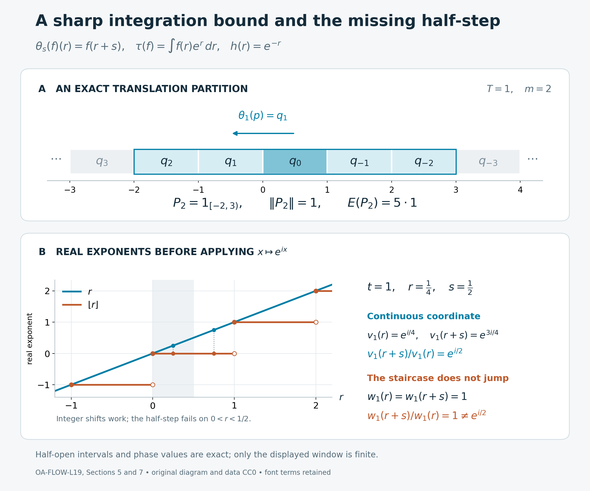

# A spectral coordinate from a trace-scaling action

*Self-checked by the writing AI. Original exposition and illustration sources: CC0-1.0; earlier and font components retain their recorded terms.*

An action that rescales a trace exponentially has a continuous spectral coordinate. We construct it by integrating the action on bounded corners. A partition by discrete translates gives an explicit bound for that integral, and trace scaling produces the partition. The resulting invariant weight has a density whose imaginary powers give the coordinate at every real time.

## Setting and conclusion

Let \(Q\) be an arbitrary von Neumann algebra, let \(\theta:\mathbb R\to\operatorname{Aut}(Q)\) be point-ultraweakly continuous, and suppose that \(\tau\) is a faithful normal semifinite trace satisfying
\[
 \tau\circ\theta_s=e^{-s}\tau\qquad(s\in\mathbb R).
\]
Trace equalities hold on the entire positive cone, including infinite values. Set \(F=Q^\theta\). All real-line integrals use Lebesgue measure. We will prove that the action integral is a faithful normal semifinite operator-valued weight from \(Q\) to \(F\), and construct a nonsingular positive self-adjoint operator \(h\) affiliated with \(Q\) such that
\[
 \theta_s(h)=e^{-s}h,\qquad
 v_t=h^{-it}\in Q,\qquad
 \theta_s(v_t)=e^{ist}v_t.
\]
The group \(t\mapsto v_t\) is strongly continuous. No factor, commutativity, finite-trace, faithful-state, or countability assumption is imposed. If \(Q=0\), every assertion has its unique zero-algebra interpretation; the proof below treats \(Q\ne0\).

The construction uses the earlier [normal integrated action](OA-FLOW-AT.md#oa-flow.at.5), [extended positive cone and weight composition](OA-FLOW-EP.md#oa-flow.ep.6), [faithful reference weight](OA-FLOW-FR.md#oa-flow.fr.1), and [tracial density theorem](OA-FLOW-TD.md#oa-flow.td.6). The particular action integral and its semifiniteness are proved here.

## 1. A bounded-corner criterion for averaging

We first work with any point-ultraweakly continuous real action on \(Q\), without using the trace. For a bounded interval \(J\), [AT5](OA-FLOW-AT.md#oa-flow.at.5) supplies the normal positive map
\[
 \begin{aligned}
 B_J(x)&=\int_J\theta_s(x)\,ds,\\
 \omega(B_J(x))&=\int_J\omega(\theta_s(x))\,ds,\\
 0\le B_J(x)&\le |J|\|x\|1
 \quad(x\in Q_+,\ \omega\in Q_*^+).
 \end{aligned}
 \tag{L19.1.a}
\]
Its preadjoint is the Bochner integral of \(s\mapsto\omega\circ\theta_s\); AT5 proves its existence in the predual without separability of that predual. Define
\[
 E(x)=\sup_{j\ge1} B_{[-j,j]}(x)\in\widehat Q_+.
 \tag{L19.1.b}
\]
Increasing suprema and normal positive-functional evaluation have their full meaning from [EP4](OA-FLOW-EP.md#oa-flow.ep.4). The maps in (L19.1.a) increase on positives as the intervals increase. A common upper index proves additivity and positive homogeneity of (L19.1.b), including infinite values.

For any bounded increasing net \(x_i\uparrow x\), normality of each bounded-interval map gives
\[
 E(x)(\omega)
 =\sup_j\sup_i\omega(B_{[-j,j]}(x_i))
 =\sup_i E(x_i)(\omega).
 \tag{L19.1.c}
\]
This interchanges two numerical suprema. It does not assume a monotone-convergence theorem for arbitrary nets of measurable scalar functions.

Translation invariance of the scalar Lebesgue integral proves both
\[
 E(\theta_r(x))=E(x),\qquad \theta_r(E(x))=E(x).
 \tag{L19.1.d}
\]
For example, evaluate either identity at a positive normal functional, use (L19.1.a), and exhaust the translated real line by bounded intervals. The action on the extended cone is the predual transport of [EP4](OA-FLOW-EP.md#oa-flow.ep.4). Uniqueness of its [spectral pair](OA-FLOW-EP.md#oa-flow.ep.2) implies that the finite spectral projections and infinite-value projection of \(E(x)\) are all fixed. Thus \(E(x)\) belongs to \(\widehat F_+\). Any positive normal functional on \(F\) extends to one on \(Q\): use its [positive vector-series representation](OA-FLOW-EP.md#oa-flow.ep.1) in the same faithful concrete Hilbert space and evaluate those vectors on \(Q\). Consequently (L19.1.c) also proves normality with target \(\widehat F_+\).

For \(b\in F\), integration gives
\[
 E(b^*xb)=b^*E(x)b.
 \tag{L19.1.e}
\]
This holds in the whole extended cone by bounded conjugation in EP4. The map is faithful: if \(E(x)=0\), each continuous nonnegative function \(s\mapsto\omega(\theta_s(x))\) has integral zero. Its value at zero must vanish. Positive normal functionals separate \(Q_+\), so \(x=0\).

**Bounded-corner criterion.** Suppose that for some \(T>0\) and projection \(p\), the projections
\[
 q_n=\theta_{nT}(p),\qquad n\in\mathbb Z,
 \qquad q_nq_k=0\ (n\ne k),\qquad
 \sum_{n\in\mathbb Z}q_n=1
 \tag{L19.1.f}
\]
form a strong partition of the identity. Put \(P_m=\sum_{|n|\le m}q_n\). Then
\[
 E(x)\le T(2m+1)\|x\|1
 \quad\bigl(x\in(P_mQP_m)_+\bigr),
 \tag{L19.1.g}
\]
and \(E:Q_+\to\widehat F_+\) is semifinite.

**Proof.** Write \(\rho=\theta_T\). In the positive strong sum
\[
 \sum_{k\in\mathbb Z}\rho^k(P_m)=(2m+1)1,
 \tag{L19.1.h}
\]
each \(q_j\) occurs exactly once for each of the \(2m+1\) possible indices \(n\) in \(P_m\). Orthogonality justifies the sum by scalar vector evaluation. Since \(0\le x\le\|x\|P_m\), the increasing net of finite sums defining
\[
 A(x)=\sum_{k\in\mathbb Z}\rho^k(x)
\]
is bounded by \((2m+1)\|x\|1\), hence has a bounded positive strong limit. Normality of \(\theta_s\), countable nonnegative scalar integration, and the disjoint intervals \([kT,(k+1)T)\) give
\[
 E(x)=\int_0^T\theta_s(A(x))\,ds
 \le T(2m+1)\|x\|1.
 \tag{L19.1.i}
\]
Here the integral on the right is again AT5's bounded normal map. The scalar interchange is the earlier [countable monotone-convergence theorem](OA-FLOW-SC.md#sc-04). No diagonal expansion of \(x\) is made; all its off-diagonal corner entries remain in the operator inequality.

For \(a\in P_mQP_m\), apply this bound to \(a^*a\). It puts \(a\) in the finite left ideal
\[
 \mathfrak n_E=\{a\in Q:E(a^*a)\in F_+\}.
 \tag{L19.1.j}
\]
The bounded strong-star limit of \(P_maP_m\) is \(a\) for every \(a\in Q\); the [bounded-topology comparison](OA-FLOW-ST12.md#oa-flow.st.2) gives ultraweak convergence too. Thus \(\mathfrak n_E\) is dense, exactly the semifiniteness criterion of [EP6](OA-FLOW-EP.md#oa-flow.ep.6). Together with the properties already proved, \(E\) is faithful normal semifinite. \(\square\)

The translation example in Section 5 attains the bound in (L19.1.g). It also shows why a partition at time \(T\) should not itself be mistaken for a spectral coordinate at every real time.

## 2. Trace scaling supplies the partition

Return to the trace \(\tau\) in the setting. Fix any \(T>0\), and write
\[
 \rho=\theta_T,\qquad \lambda=e^{-T}\in(0,1),
 \qquad\tau\circ\rho=\lambda\tau.
 \tag{L19.2.a}
\]
A projection \(q\) is wandering if all \(\rho^n(q)\), \(n\in\mathbb Z\), are pairwise orthogonal. Its saturation \(z(q)=\sum_n\rho^n(q)\) is an invariant projection; centrality is not required.

**Local construction.** Every nonzero \(\rho\)-invariant projection \(e\) contains a nonzero wandering projection.

To start, choose [finite positive contractions](OA-FLOW-GW.md#oa-flow.gw.4) \(u_i\uparrow1\) for \(\tau\). Some \(b=eu_i e\) is nonzero, since these compressions converge strongly to \(e\). The bounded trace identity gives
\[
 0<\tau(b)=\tau(u_i^{1/2}eu_i^{1/2})\le\tau(u_i)<\infty.
\]
The [spectral calculus](OA-FLOW-SF.md#oa-flow.sf1.spectral-calculus) supplies an \(\varepsilon>0\) such that \(a=1_{[\varepsilon,\infty)}(b)\ne0\). Then \(a\le e\) and \(0<\tau(a)\le\varepsilon^{-1}\tau(b)<\infty\).

Let \(f=\bigvee_{n\ge0}\rho^n(a)\). The join estimate
\[
 0<\tau(f)\le\sum_{n\ge0}\tau(\rho^n(a))
 =\frac{\tau(a)}{1-\lambda}<\infty
 \tag{L19.2.b}
\]
does not require commuting projections. Indeed, the polar join identity in [PC3](OA-FLOW-PC.md#oa-flow.pc.3) gives
\((r\vee s)-r\sim s-(r\wedge s)\le s\).
The trace takes equal values on the initial and final projections of a partial isometry, so
\(\tau(r\vee s)\le\tau(r)+\tau(s)\).
Finite induction and normality on increasing finite joins prove (L19.2.b).

We have \(\rho(f)\le f\le e\), and
\(\tau(\rho(f))=\lambda\tau(f)<\tau(f)\).
Thus \(q=f-\rho(f)\) is a nonzero projection. The projections \(f_n=\rho^n(f)\) decrease for all integer \(n\), and
\[
 \rho^n(q)=f_n-f_{n+1}.
 \tag{L19.2.c}
\]
For \(n<m\), \(f_m\le f_{n+1}\), so these two successive differences are orthogonal. Invariance of \(e\) puts their saturation below \(e\). This proves the local construction.

**Full partition.** Choose a maximal family \((p_i)_{i\in I}\) of nonzero wandering projections with pairwise orthogonal saturations. Chain unions preserve the defining condition, so the [maximal principle](OA-FLOW-CF.md#oa-flow.cf.1) applies. The strong sum
\[
 z=\sum_{i\in I}z(p_i)
\]
is an invariant projection. If \(1-z\ne0\), the local construction supplies another wandering projection whose entire saturation lies below \(1-z\), contradicting maximality. Hence \(z=1\).

Set \(p=\sum_{i\in I}p_i\). All these sums use finite subsets of the possibly uncountable index set, as in [PC1](OA-FLOW-PC.md#oa-flow.pc.1). Normality gives \(\rho^n(p)=\sum_i\rho^n(p_i)\). Terms with different \(i\) lie in orthogonal saturations; terms with equal \(i\) and different \(n\) are orthogonal by wandering. The supremum over finite subsets of pairs \((i,n)\) is \(z=1\). Consequently
\[
 q_n=\rho^n(p),\qquad q_nq_k=0\ (n\ne k),\qquad
 \sum_n q_n=1.
 \tag{L19.2.d}
\]
This is the hypothesis of Section 1. Therefore the action integral \(E\) is faithful normal semifinite. The countable time partition has been obtained without enumerating \(I\) or assuming that \(Q\) has a faithful normal state.

The partition also gives an intermediate unitary group
\[
 w_t=\sum_{n\in\mathbb Z}e^{-inTt}q_n,
 \qquad\rho(w_t)=e^{iTt}w_t.
 \tag{L19.2.e}
\]
The strong sums exist by orthogonality, have inverse \(w_{-t}\), and satisfy \(w_tw_u=w_{t+u}\). For each vector \(\xi\),
\[
 \|(w_t-w_u)\xi\|^2
 =\sum_n|e^{-inTt}-e^{-inTu}|^2\|q_n\xi\|^2.
 \tag{L19.2.f}
\]
A finite part is continuous and the remaining tail is at most four times its summable vector mass. This proves strong continuity. Reindexing proves the displayed eigenrelation, and \(w_{t+2\pi/T}=w_t\). Only the discrete times \(T\mathbb Z\) have been controlled at this stage.

## 3. An invariant weight and the exact density law

Choose a faithful normal semifinite weight \(\omega\) on \(F\), using the arbitrary-cardinality construction in [FR1](OA-FLOW-FR.md#oa-flow.fr.1), and define
\[
 \varphi(x)=\widehat\omega(E(x))\quad(x\in Q_+).
 \tag{L19.3.a}
\]
All hypotheses of [EP6's composition theorem](OA-FLOW-EP.md#oa-flow.ep.6) were checked in Section 1 and its partition was supplied in Section 2. Thus \(\varphi\) is faithful normal semifinite. Also
\[
 \varphi\circ\theta_s=\varphi\qquad(s\in\mathbb R)
 \tag{L19.3.b}
\]
by (L19.1.d). The reference \(\omega\) need not be finite. Semifiniteness follows from the proved operator-valued finite domain and composition theorem, rather than an assumption about averaging a scalar weight.

By [TD4–6](OA-FLOW-TD.md#oa-flow.td.4), there is a unique nonsingular positive self-adjoint \(h\) affiliated with \(Q\) such that \(\varphi=\tau_h\), where
\[
 \tau_h(x)=\widehat\tau(x^{1/2}h x^{1/2})
 =\sup_{j\ge1}\tau\bigl(x^{1/2}(h\wedge j)x^{1/2}\bigr),
 \qquad x\in Q_+.
 \tag{L19.3.c}
\]
Semifiniteness removes the infinite-value spectral summand; faithfulness removes the kernel, precisely as in [TD6](OA-FLOW-TD.md#oa-flow.td.6). The density is not assumed trace-measurable or central. The sandwich in (L19.3.c) is the extended-positive operation of EP4; it asserts no domain property of a formal unbounded operator product.

Here is the covariance calculation with its scalar normalization. Suppose \(\beta\) is a normal automorphism of \(Q\) and \(\tau\circ\beta=c\tau\), \(c>0\). Transport of the [spectral pair and bounded calculus](OA-FLOW-EP.md#oa-flow.ep.4) gives, for every \(j\),
\[
 \begin{aligned}
 &\tau\bigl(\beta(x)^{1/2}(h\wedge j)\beta(x)^{1/2}\bigr)\\
 &\hspace{1em}=c\,\tau\bigl(x^{1/2}(\beta^{-1}(h)\wedge j)x^{1/2}\bigr).
 \end{aligned}
 \tag{L19.3.d}
\]
Pass to the increasing limits. Positive homogeneity of the density-to-weight map, proved on the entire cone in [TD2](OA-FLOW-TD.md#oa-flow.td.2), yields
\[
 \tau_h\circ\beta=\tau_{c\beta^{-1}(h)}.
 \tag{L19.3.e}
\]
Apply this to \(\beta=\theta_s\) and \(c=e^{-s}\). Invariance (L19.3.b) and [whole-cone density uniqueness](OA-FLOW-TD.md#oa-flow.td.5) give
\[
 h=e^{-s}\theta_{-s}(h),\qquad
 \theta_s(h)=e^{-s}h.
 \tag{L19.3.f}
\]
The comparison is between equal weights on all of \(Q_+\), not between their finite values alone. It never cancels infinite values.

## 4. The continuous coordinate and the two signs

Since \(h\) has zero kernel, the [full affiliated spectral calculus](OA-FLOW-SF.md#oa-flow.sf1.spectral-calculus) defines the self-adjoint operator \(\log h\) and its bounded imaginary powers. Explicitly, if \(P_h\) is its spectral measure, then
\[
 D(\log h)=\left\{\xi:\int_{(0,\infty)}|\log r|^2\,d\langle P_h(r)\xi,\xi\rangle<\infty\right\}.
 \tag{L19.4.a}
\]
The spectral bands \(1_{[1/j,j]}(h)\) increase strongly to \(1\), proving density of that domain. Set
\[
 v_t=\exp(-it\log h)=h^{-it}.
 \tag{L19.4.b}
\]
These bounded operators belong to \(Q\) by affiliation and the commutant-unitary test, are unitary, and multiply according to \(v_tv_u=v_{t+u}\). For strong continuity, the squared vector norm of \((v_t-v_u)\xi\) is the spectral integral of \(|r^{-it}-r^{-iu}|^2\). That integrand tends pointwise to zero and is bounded by four; [scalar dominated convergence](OA-FLOW-SC.md#sc-05) applies to the finite vector spectral measure. Naturality of this calculus and (L19.3.f) now give
\[
 \theta_s(v_t)=(e^{-s}h)^{-it}=e^{ist}v_t,
 \qquad s,t\in\mathbb R.
 \tag{L19.4.c}
\]
This proves the claimed coordinate for every real time. The opposite imaginary powers satisfy
\[
 \theta_s(h^{it})=e^{-ist}h^{it}.
 \tag{L19.4.d}
\]
Thus changing the power changes the character sign; no Fourier sign is implicit.

There is a useful central application with an exact hypothesis. Suppose \(zN\) is an invariant central summand of a von Neumann algebra with a real action, and its center \(Q=Z(zN)\) carries a faithful normal semifinite weight \(\tau\) scaling by \(e^{-s}\). On this commutative algebra it is a trace, because \(a^*a=aa^*\). The theorem therefore constructs \(v_t\in Z(zN)\) with unit \(z\) and character (L19.4.c). If \(u_s\) denotes the implementing unitary of \((zN)\rtimes_\theta\mathbb R\), the [regular covariance relation](OA-FLOW-NR.md#oa-flow.nr.3) implies
\[
 u_sv_tu_s^*=e^{ist}v_t,
 \qquad v_tu_sv_t^*=e^{-ist}u_s.
 \tag{L19.4.e}
\]
The second equality follows by moving the scalar factor across the first one. Each \(v_t\) commutes with \(zN\), so its conjugation fixes the coefficient algebra and acts on \(u_s\) by the displayed negative character. All units in these relations are \(z\). The assertion assumes the scaling center weight; its existence in particular type decompositions requires a separate proof. For noncommutative \(Q\), no centrality of \(h\) or \(v_t\) follows, as Section 6 shows.

## 5. Translation attains the integration bound

Take \(Q=L^\infty(\mathbb R,dr)\), and define
\[
 [\theta_s(f)](r)=f(r+s),\qquad
 \tau(f)=\int_{\mathbb R}f(r)e^r\,dr\quad(f\geq0).
 \tag{L19.5.a}
\]
The normality of the translation automorphisms follows from [the multiplier predual](OA-FLOW-ND.md#nd-multiplication). Their predual orbits are norm continuous by [translation continuity on \(L^1\)](OA-FLOW-FF.md#oa-flow.ff.2), so this is a point-ultraweakly continuous action. The weight is a trace because the algebra is commutative. It is normal: its restrictions to bounded intervals are positive \(L^1\) functionals, and their increasing supremum is \(\tau\). It is faithful because \(e^r>0\); bounded interval cutoffs give semifiniteness. Substituting \(u=r+s\) gives the required full-cone identity
\[
 \tau(\theta_s(f))
   =\int_{\mathbb R}f(u)e^{u-s}\,du
   =e^{-s}\tau(f).
 \tag{L19.5.b}
\]

The fixed algebra is the constants. This holds for equality in \(L^\infty\), without choosing a common representative invariant at every point: [ND's convolution proof](OA-FLOW-ND.md#nd-weyl-proof) shows that a translation-fixed multiplier is constant. The complete positive action integral is
\[
 E(f)=\left(\int_{\mathbb R}f(r)\,dr\right)1.
 \tag{L19.5.c}
\]
To verify the equality as an extended-positive value, test against any positive \(L^1\) function \(g\). [Nonnegative scalar interchange](OA-FLOW-FF.md#oa-flow.ff.1) gives
\[
 \int_{\mathbb R}\int_{\mathbb R}g(r)f(r+s)\,dr\,ds
 =\left(\int_{\mathbb R}g(r)\,dr\right)
  \left(\int_{\mathbb R}f(u)\,du\right).
 \tag{L19.5.d}
\]
The product has the convention \(0\cdot\infty=0\). These tests determine the entire extended value, including infinity.

The invariant weight \(\varphi(f)=\int f(r)\,dr\) is normal semifinite and faithful by the same interval argument. Its density relative to \(\tau\) and its imaginary powers are
\[
 h(r)=e^{-r},\qquad
 v_t(r)=h(r)^{-it}=e^{itr},\qquad
 \theta_s(v_t)=e^{ist}v_t.
 \tag{L19.5.e}
\]
The density equality holds on all positives: the bounded truncations
\(\min(e^{-r},k)\) give integrands \(e^r f(r)\min(e^{-r},k)\uparrow f(r)\), so monotone convergence proves \(\tau_h(f)=\varphi(f)\). Strong continuity of \(v_t\) on \(L^2(\mathbb R)\) follows by dominated convergence, with bound \(4|\xi(r)|^2\) for the squared vector difference.

Now fix any \(T>0\). The particular projection \(p=1_{[0,T)}\) has translates and finite partial sums
\[
 q_n=\theta_{nT}(p)=1_{[-nT,(1-n)T)},\qquad
 P_m=\sum_{|n|\leq m}q_n
     =1_{[-mT,(m+1)T)}.
 \tag{L19.5.f}
\]
The half-open intervals partition the whole line. Thus
\[
 E(P_m)=T(2m+1)1,\qquad \|P_m\|=1.
 \tag{L19.5.g}
\]
The bound \(E(x)\leq T(2m+1)\|x\|1\) from [Section 1](OA-FLOW-L19.md#l19-1) is attained by \(x=P_m\); its constant cannot be reduced for this general class.

The discrete group built from this partition is
\[
 w_t(r)=\exp\!\left(iTt\left\lfloor\frac rT\right\rfloor\right),
 \qquad
 \theta_T(w_t)=e^{iTt}w_t.
 \tag{L19.5.h}
\]
Indeed \(r\in[-nT,(1-n)T)\) gives \(\lfloor r/T\rfloor=-n\), agreeing with the coefficient \(e^{-inTt}\) in the partition sum. Each \(w_t\) is unitary, the group law holds pointwise, and dominated convergence proves strong continuity in \(t\). Its period is \(2\pi/T\). When \(Tt\notin2\pi\mathbb Z\), its dependence on the spatial coordinate \(r\) is a staircase; strong continuity in the parameter \(t\) does not give covariance at every real translation time. The continuous coordinate \(v_t(r)=e^{itr}\) does have that full covariance.

The top panel specializes (L19.5.f)–(L19.5.g) to \(T=1\), \(m=2\). The selected intervals have union \([-2,3)\), so \(E(P_2)=5\,1\). The index decreases from left to right because \(\theta_1(f)(r)=f(r+1)\) moves supports to the left. The lower panel plots the real exponents \(r\) and \(\lfloor r\rfloor\) before applying \(x\mapsto e^{ix}\); it does not plot complex unitary values as real numbers. Filled and open endpoints record the half-open staircase intervals. For \(r=1/4\), \(s=1/2\), both staircase exponents are zero, whereas the continuous exponent increases by \(1/2\). Thus \(w_1(r+s)/w_1(r)=1\), while \(v_1(r+s)/v_1(r)=e^{i/2}\). These are exact formulas; the displayed window is only a finite part of the infinite partition. The proof locators are (L19.5.f)–(L19.5.h) and [Diagnostic 3](OA-FLOW-L19.md#l19-7). For human-source context on trace scaling and eigenunitaries, see Takesaki II, XII.1, Lemma 1.2, printed pp. 366–367, in [Further reading](OA-FLOW-L19.md#l19-reading). Original diagram, data and renderer: CC0-1.0 to the extent of rights held; font terms are retained separately. [Editable SVG](../assets/trace-scaling-eigenunitaries/trace-scaling-eigenunitaries.svg), [exact data](../assets/trace-scaling-eigenunitaries/trace-scaling-eigenunitaries-data.json), [renderer](../assets/trace-scaling-eigenunitaries/render_trace_scaling_eigenunitaries.py), and [font terms](../assets/trace-scaling-eigenunitaries/FONT-LICENSE.txt) are included.

## 6. A noncentral density with rotating matrix entries

The density in the general theorem need not be central. To see this without any formal manipulation of unbounded products, take
\[
 Q=L^\infty(\mathbb R)\,\overline\otimes\,M_2(\mathbb C),\qquad
 K=\begin{pmatrix}1&0\\0&-1\end{pmatrix},\qquad
 W_s=e^{isK},\qquad B=\begin{pmatrix}2&1\\1&2\end{pmatrix}.
 \tag{L19.6.a}
\]
For bounded measurable matrix fields, define
\[
 [\theta_s(f)](r)=W_s f(r+s)W_s^*,\qquad
 \tau(f)=\int_{\mathbb R}e^r\operatorname{Tr}(f(r))\,dr
 \quad(f\geq0).
 \tag{L19.6.b}
\]
The group law follows from \(W_{s+u}=W_sW_u\). Translation is normal on each matrix entry, and conjugation by \(W_s\) is normal. Translation continuity on \(L^1\), together with norm continuity of this finite matrix group, gives point-ultraweak continuity. The positive matrix trace integral is faithful, normal and semifinite: on bounded intervals it is a normal positive functional, these functionals increase to the full weight, and interval cutoffs have finite value. Pointwise matrix cyclicity proves the trace identity. The same substitution as in (L19.5.b), and invariance of the matrix trace under \(W_s\), give
\[
 \tau\circ\theta_s=e^{-s}\tau
 \quad\hbox{on }Q_+.
 \tag{L19.6.c}
\]

Put
\[
 A(r)=W_{-r}BW_r
 =\begin{pmatrix}2&e^{-2ir}\\e^{2ir}&2\end{pmatrix},
 \qquad
 \varphi(f)=\int_{\mathbb R}\operatorname{Tr}(A(r)f(r))\,dr.
 \tag{L19.6.d}
\]
The eigenvalues of \(B\), and hence of \(A(r)\), are \(1\) and \(3\). Thus \(I\leq A(r)\leq3I\). On each bounded interval the formula is a normal positive functional; their increasing supremum proves normality. The lower bound proves faithfulness, and the upper bound proves finiteness on bounded interval cutoffs, hence semifiniteness.

The identity \(A(r+s)=W_{-s}A(r)W_s\) gives invariance on the complete cone:
\[
 \begin{aligned}
 \varphi(\theta_s(f))
 &=\int_{\mathbb R}\operatorname{Tr}
       \bigl(W_{-s}A(r)W_s f(r+s)\bigr)\,dr\\
 &=\int_{\mathbb R}\operatorname{Tr}(A(u)f(u))\,du
 =\varphi(f).
 \end{aligned}
 \tag{L19.6.e}
\]
Each integrand is nonnegative; infinite values present no subtraction or integrability issue.

The affiliated density is
\[
 h(r)=e^{-r}W_{-r}BW_r.
 \tag{L19.6.f}
\]
It is nonsingular: its two pointwise eigenvalues are \(e^{-r}\) and \(3e^{-r}\). Its bounded spectral projections are measurable matrix fields and belong to \(Q\); multiplication on \(L^2(\mathbb R,\mathbb C^2)\) gives the positive self-adjoint affiliated operator. Compactly supported \(L^2\) vectors lie in its domain because the matrix norm of \(h(r)\) is bounded on each bounded interval. They form a core: for any domain vector, multiplication by \(1_{[-n,n]}\) converges both in vector norm and in the norm of its image under \(h\), by truncating the two square-integrable functions. The matrix field has a nonzero off-diagonal entry at every \(r\), so it does not commute with the constant projection \(e_{11}\). It is not central.

For every \(f\in Q_+\), finite matrix cyclicity and scalar monotone convergence give
\[
 \begin{aligned}
 &\lim_{k\to\infty}\int_{\mathbb R}e^r
   \operatorname{Tr}\bigl(f(r)^{1/2}\min(h(r),k)f(r)^{1/2}\bigr)\,dr\\
 &\hspace{4em}=\int_{\mathbb R}\operatorname{Tr}(A(r)f(r))\,dr
 =\varphi(f).
 \end{aligned}
 \tag{L19.6.g}
\]
This verifies the density on the whole positive cone in the spectral-truncation convention of [Section 3](OA-FLOW-L19.md#l19-3). It does not assume that a product of two unbounded operators is densely defined.

For an explicit formula for its imaginary powers, let
\[
 P_+=\frac12\begin{pmatrix}1&1\\1&1\end{pmatrix},\qquad
 P_-=\frac12\begin{pmatrix}1&-1\\-1&1\end{pmatrix}.
\]
These are complementary orthogonal projections, \(B=3P_++P_-\), and therefore
\[
 v_t(r)=h(r)^{-it}
       =e^{irt}W_{-r}B^{-it}W_r,\qquad
 B^{-it}=3^{-it}P_++P_-.
 \tag{L19.6.h}
\]
This is a unitary group. Its strong continuity follows by pointwise finite-dimensional continuity and dominated convergence on every \(L^2\) vector. Direct substitution gives both the density and unitary covariance:
\[
 \theta_s(h)=e^{-s}h,\qquad
 [\theta_s(v_t)](r)
 =e^{i(r+s)t}W_{-r}B^{-it}W_r
 =e^{ist}v_t(r).
 \tag{L19.6.i}
\]
Thus the eigenunitary mechanism works with noncommuting matrix coefficients. Commutativity is needed for the central conclusion in the central application, not for the general construction.

## 7. Five diagnostics with complete solutions

### 1. A different nonzero scaling rate

Suppose an arbitrary von Neumann algebra has a point-ultraweakly continuous action and a normal semifinite faithful trace satisfying
\(\tau\circ\theta_s=e^{-cs}\tau\), where \(c\ne0\). Construct a strongly continuous unitary group \(u_t\) with \(\theta_s(u_t)=e^{ist}u_t\). Explain why the zero rate is different.

**Solution.** Put \(\eta_r=\theta_{r/c}\). It is still a point-ultraweakly continuous action and scales the trace by \(e^{-r}\). Apply [the eigenunitary conclusion of Section 4](OA-FLOW-L19.md#l19-4) to get a nonsingular affiliated \(h\) with \(\eta_r(h)=e^{-r}h\). Equivalently,
\[
 \theta_s(h)=e^{-cs}h,\qquad
 u_t=h^{-it/c},\qquad
 \theta_s(u_t)=(e^{-cs}h)^{-it/c}=e^{ist}u_t.
 \tag{L19.7.a}
\]
Functional calculus supplies the group law and strong continuity. A negative \(c\) reverses the time parametrization and is fully included. At \(c=0\), take \(Q=\mathbb C\) with its usual trace and trivial action. For any fixed \(t\ne0\), the relation would require \(u_t=e^{ist}u_t\) for every \(s\), impossible for a unitary scalar \(u_t\). Thus trace preservation alone does not imply the conclusion.

### 2. An operator with off-diagonal corner entries

For the complete partition in [Section 2](OA-FLOW-L19.md#l19-2), let \(P_m=\sum_{|n|\leq m}q_n\) and let \(a\in P_mQP_m\). No commutation of \(a\) with the individual \(q_n\) is assumed. Bound \(E(a^*a)\).

**Solution.** Since \(a=P_maP_m\),
\(0\leq a^*a\leq\|a\|^2P_m\). Positivity of the complete average and [the corner estimate](OA-FLOW-L19.md#l19-1) give
\[
 E(a^*a)\leq T(2m+1)\|a\|^2\,1.
 \tag{L19.7.b}
\]
The proof applies automorphisms to this positive operator inequality and sums its translates. It keeps the full operator \(a^*a\), including every cross term; no diagonal expansion or discarded off-diagonal entry is needed. In particular \(a\) belongs to the bounded-output left ideal of \(E\). The argument works with the full arbitrary-cardinal partition construction, because only the complete orthogonal family \((q_n)_{n\in\mathbb Z}\) enters this estimate.

### 3. Why integer times do not suffice

In [the scalar model](OA-FLOW-L19.md#l19-5), take \(T=1\). Verify the discrete eigenrelation for \(w_t\), then test its proposed continuous eigenrelation at \(t=1\) and \(s=1/2\).

**Solution.** Since \(\lfloor r+1\rfloor=\lfloor r\rfloor+1\), one has
\[
 \theta_1(w_t)(r)=e^{it}w_t(r).
 \tag{L19.7.c}
\]
For every \(0<r<1/2\), however, both \(r\) and \(r+1/2\) lie in \([0,1)\), so
\[
 [\theta_{1/2}(w_1)](r)=w_1(r+1/2)=1,\qquad
 e^{i/2}w_1(r)=e^{i/2}\ne1.
 \tag{L19.7.d}
\]
The failure occurs on a set of positive measure. It cannot be repaired by changing representatives at null sets. For the actual continuous coordinate,
\(v_1(r+1/2)=e^{i/2}v_1(r)\) for all \(r\). The invariant-weight and affiliated-density steps supply the missing continuous-time covariance.

### 4. The reverse sign and the corner unit

Let \(z\) be an invariant central projection in the central application. Let \(\widetilde u_s\) implement the action in a larger crossed product, and write \(u_s=z\widetilde u_s\) for its compression to the \(z\)-corner. Suppose the constructed group in that corner satisfies
\(u_sv_tu_s^*=e^{ist}v_t\). Derive the reverse conjugation formula and identify its unit.

**Solution.** Invariance gives \(z\widetilde u_s=\widetilde u_s z\), so each compressed \(u_s\) is a unitary with unit \(z\). Multiplication of the given relation by \(u_s\) yields
\(u_sv_t=e^{ist}v_tu_s\). Rearranging this bounded identity and multiplying by \(v_t^*\) gives
\[
 v_tu_sv_t^*=e^{-ist}u_s,\qquad
 v_0=z,\qquad v_tv_t^*=v_t^*v_t=z.
 \tag{L19.7.e}
\]
The sign is negative in this reverse formula and positive in the original implementation formula. All products here take place in the corner with identity \(z\). Unless \(z=1\), these are not unitaries with identity \(1\) in the larger algebra.

### 5. A scaling density cannot be boundedly invertible

Let \(Q\ne0\), and let a nonsingular positive self-adjoint affiliated \(h\) satisfy
\(\theta_s(h)=e^{-s}h\). Prove that \(h\) is unbounded and has no strictly positive lower bound.

**Solution.** If \(h\) were bounded, the automorphisms would preserve its operator norm, whereas covariance would give
\[
 \|h\|=e^{-s}\|h\|\quad(s\in\mathbb R).
 \tag{L19.7.f}
\]
Taking any \(s\ne0\) forces \(h=0\), contrary to nonsingularity on the nonzero algebra. If \(h\geq\varepsilon1\) for some \(\varepsilon>0\), its spectral inverse would be a nonzero bounded positive operator, with
\[
 \theta_s(h^{-1})=e^s h^{-1}.
 \tag{L19.7.g}
\]
The same norm argument would force \(h^{-1}=0\), again a contradiction. Nonsingularity means a zero kernel; it supplies neither boundedness nor a spectral gap at zero. In the scalar model \(h(r)=e^{-r}\), its behavior at the two ends of the real line displays both conclusions.

## Further reading

The trace-scaling eigenunitary theorem is Takesaki, *Theory of Operator Algebras II*, Chapter XII, §1, Lemma 1.2, printed pp.366–367. Its proof uses wandering projections, integration and a tracial density. Here the bounded-corner averaging criterion is proved first and supplies integrability directly; the scalar and matrix models then distinguish the discrete intermediate group from the continuous coordinate and show how a noncentral density behaves.

For the full density theorem used in Section 3, [TD](OA-FLOW-TD.md#oa-flow.td.4) provides the programme proof on the entire extended positive cone and links its freely accessible human-source context. [EP6](OA-FLOW-EP.md#oa-flow.ep.6) gives the weight-composition proof, and [AT5](OA-FLOW-AT.md#oa-flow.at.5) gives normality of the bounded-interval maps on arbitrary preduals.
