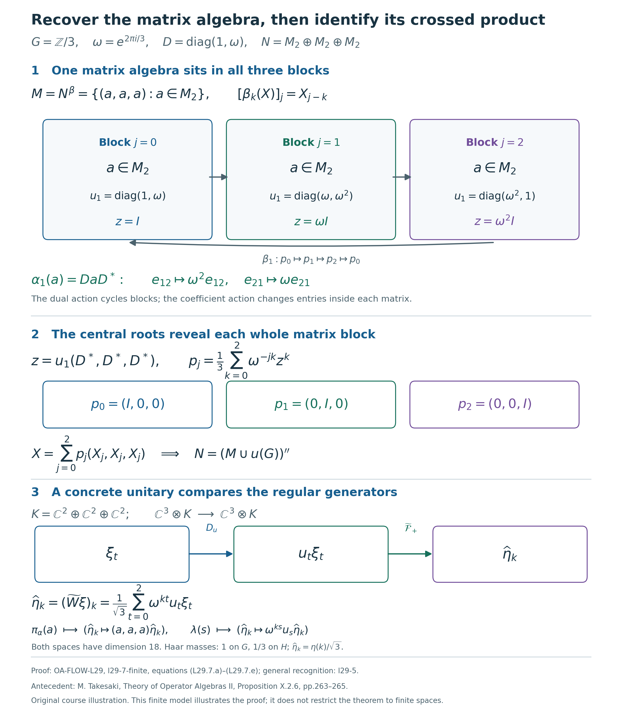

# Recovering a crossed product from its eigenunitaries

*Self-checked by the writing AI. Original exposition and illustration sources: CC0 1.0; font components retain their accompanying terms.*

A family of eigenunitaries can determine the entire algebra around it. The fixed elements supply the coefficients, conjugation by the unitaries supplies the action, and Fourier analysis recovers every element of the original algebra. We first prove this generation statement, then identify the resulting crossed product by an explicit unitary between faithful normal models.

## Setting and conclusion

Let $G$ be a locally compact Hausdorff abelian group, written additively, and let $H=\widehat G$, written multiplicatively. Haar measures on $G$ and $H$ are paired by the [scalar Plancherel theorem](OA-FLOW-PLANCHEREL.md#scalar-plancherel-p3). Integrals use the [locally determined Haar convention](OA-FLOW-L24.md#oa-flow.grp.haarconventions); neither group is assumed sigma compact.

Let $N\ne0$ be a von Neumann algebra, let $\beta:H\to\operatorname{Aut}(N)$ be a point-ultraweakly continuous action by normal star automorphisms, and let $u:G\to\mathcal U(N)$ be a strongly continuous unitary representation satisfying
\[
 \beta_\eta(u_s)=\overline{\eta(s)}u_s
 \qquad(s\in G,\ \eta\in H).
 \tag{L29.0.a}
\]
Strong continuity is intrinsic on this bounded unitary family by [faithful normal topology](OA-FLOW-ST12.md#oa-flow.st.2). Put
\[
 M=N^\beta,\qquad \alpha_s=\operatorname{Ad}(u_s)|_M.
 \tag{L29.0.b}
\]
We shall prove that $\alpha$ is a continuous normal action and that there is a unique normal star isomorphism, with normal inverse,
\[
 \Phi:M\rtimes_\alpha G\longrightarrow N,
 \qquad \Phi(\pi_\alpha(a))=a,\qquad
 \Phi(\lambda_s)=u_s.
 \tag{L29.0.c}
\]
It intertwines the dual action with $\beta$. Generation by $M$ and $u(G)$ is a conclusion. No faithful state, trace, factor, separable predual, or separable Hilbert space is assumed. The zero algebra is treated separately in Section 5.

The proof uses the earlier [continuous spectral representation](OA-FLOW-WRC.md#wr-spectral), [Fourier uniqueness](OA-FLOW-HARMONIC-LATE.md#l138-h3), [faithful normal regular construction](OA-FLOW-NR.md#oa-flow.nr.3), and [vector Plancherel theorem](OA-FLOW-DA.md#da-vector). Every additional proof input is linked at its use below.

## 1. The fixed algebra and a continuous spectral coordinate

Let \(M=N^\beta\). The eigenunitaries determine an action on this fixed algebra:
\[
 M=\{a\in N:\beta_\eta(a)=a\text{ for every }\eta\in H\},
 \qquad
 \alpha_s(a)=u_sau_s^*.
 \tag{L29.1.a}
\]
Indeed, \(M\) is an ultraweakly closed unital star subalgebra: it is the intersection of the kernels of the normal linear maps \(\beta_\eta-\mathrm{id}\), and the fixedness equations preserve products and adjoints. The eigenrelation gives, for \(a\in M\),
\[
 \beta_\eta(u_sau_s^*)
 =\overline{\eta(s)}u_sa\,\eta(s)u_s^*
 =u_sau_s^*.
 \tag{L29.1.b}
\]
Thus \(\alpha_s(M)\subset M\), and the inclusion for \(-s\) gives equality. The representation law for \(u\) gives \(\alpha_{s+t}=\alpha_s\alpha_t\), and each \(\alpha_s\) is normal.

Choose a faithful normal concrete realization \(N\subseteq B(K)\), with \(K\ne0\). There is no restriction on the dimension of \(K\). Both \(s\mapsto u_s\) and \(s\mapsto u_s^*=u_{-s}\) are strongly continuous. The estimates in [Topology checks for unitary cocycles](OA-FLOW-UC.md#oa-flow.uc.0) show that the orbit \(s\mapsto u_sau_s^*\) is strongly-star continuous. Its norm is constantly \(\|a\|\), so it is also ultraweakly continuous. The bounded intrinsic topology is independent of this realization by [Faithful normal representations and their topologies](OA-FLOW-ST12.md#oa-flow.st.2). Consequently \((M,G,\alpha)\) has all the continuity required of a normal action.

We next obtain continuous frequency measurements from \(u\). For \(s\in G\), write
\[
 e_s(\chi)=\chi(s)\quad(\chi\in H),\qquad
 (\tau_\eta f)(\chi)=f(\eta^{-1}\chi).
 \tag{L29.1.c}
\]
Topological biduality identifies \(\widehat H\) with \(G\), as proved in [Biduality from the scalar unitary and compact tests](OA-FLOW-HARMONIC-LATE.md#l138-h3). Apply [The abelian spectral representation lemma](OA-FLOW-WRC.md#wr-spectral) on the group \(H\) to the representation \(V_s=u_{-s}\) of \(\widehat H\). That lemma uses conjugate characters, so it first gives \(\overline j(\overline{e_s})=u_{-s}\). Replacing \(s\) by \(-s\) yields a nondegenerate star representation and its multiplier extension:
\[
 j:C_0(H)\longrightarrow B(K),\qquad
 \overline j:C_b(H)\longrightarrow B(K),\qquad
 \overline j(e_s)=u_s.
 \tag{L29.1.d}
\]
Nondegeneracy means that the linear span of \(j(C_0(H))K\) is dense in \(K\). The same lemma proves the exact generated-algebra identity
\[
 j(C_0(H))''=u(G)''\subseteq N.
 \tag{L29.1.e}
\]
In particular \(j(f)\in N\), and the bounded strong limits defining \(\overline j\) also belong to \(N\).

For later use, let
\[
 \mathcal C=\{f\in C_c(H):0\le f\le1\},
\]
directed by pointwise order. It is directed because \(\max(f,g)\in\mathcal C\). [Compact cutoffs on locally compact Hausdorff spaces](OA-FLOW-TOPOLOGY.md#l138-h0) give a member equal to one on any prescribed compact set. If \(h\in C_c(H)\), then
\(j(f)j(h)\xi=j(h)\xi\) as soon as \(f=1\) on \(\operatorname{supp}h\). The span of these vectors is dense: \(C_c(H)\) is uniformly dense in \(C_0(H)\), by cutting off the compact level sets of a function vanishing at infinity. Since \(\|j(f)\|\le1\), it follows that
\[
 j(f)\longrightarrow1\quad\text{strongly-star as }f\in\mathcal C.
 \tag{L29.1.f}
\]
The adjoint convergence follows because these operators are selfadjoint.

The spectral coordinate is covariant:
\[
 \beta_\eta(j(h))=j(\tau_\eta h)
 \qquad(\eta\in H,\ h\in C_0(H)).
 \tag{L29.1.g}
\]
To prove this, fix \(\eta\). The representations \(\beta_\eta\circ j\) and \(j\circ\tau_\eta\) are nondegenerate. For the first, apply the bounded strong-star continuity of the normal automorphism \(\beta_\eta\) to (L29.1.f). For the second, \(\tau_\eta\) maps \(C_0(H)\) onto itself. Their multiplier extensions agree on the characters:
\[
 \overline{\beta_\eta\circ j}(e_s)
 =\beta_\eta(u_s)=\overline{\eta(s)}u_s,
 \qquad
 \overline{j\circ\tau_\eta}(e_s)
 =\overline j(\overline{\eta(s)}e_s)
 =\overline{\eta(s)}u_s.
 \tag{L29.1.h}
\]
The first multiplier identity follows by applying \(\beta_\eta\) to the bounded strong limits \(j(e_sf)\); the second follows directly from the multiplier extension. Uniqueness in the spectral representation lemma gives (L29.1.g).

The maps constructed here have domains \(C_0(H)\) and \(C_b(H)\). We have not assumed an extension to Haar \(L^\infty(H)\), nor used any assertion that a Haar-null set has zero spectral image.

## 2. Compact averages and a dense integrable positive cone

Write \(\mu\) for the fixed Haar measure on \(H\), using the completed locally determined convention of [Haar measure and finite-exponent classes](OA-FLOW-HR.md#hr-09). Every compact restriction is a completed finite Radon measure. All compact sets below are directed by inclusion; their finite unions make this a directed set.

First construct the compact integrals we need. [Predual norm continuity for normal actions](OA-FLOW-AT.md#oa-flow.at.3) says that
\(\eta\mapsto\omega\circ\beta_\eta\) is norm continuous in \(N_*\) for every \(\omega\in N_*\). If \(L\subset H\) is compact and \(q\in C(H)\), set
\[
 B_{L,q}\omega=\int_L q(\eta)(\omega\circ\beta_\eta)\,d\eta,
 \qquad
 A_{L,q}=B_{L,q}^*:N\longrightarrow N.
 \tag{L29.2.a}
\]
This integral exists in the Banach space \(N_*\). Its integrand has compact norm image on \(L\). Finite covers of that image by balls of radius tending to zero, followed by disjoint Borel refinements of their inverse images, give finite-valued simple functions converging uniformly on \(L\). The norms of the differences of their integrals are at most \(\mu(L)\) times the uniform errors. Completeness gives the integral, independently of the approximants. In particular
\[
 \|B_{L,q}\|\le\int_L|q(\eta)|\,d\eta,\qquad
 \omega(A_{L,q}(y))
   =\int_Lq(\eta)\omega(\beta_\eta(y))\,d\eta.
 \tag{L29.2.b}
\]
Thus \(A_{L,q}\) is bounded and normal. This is the compact construction proved in [Normal averages over compact sets](OA-FLOW-DA.md#da-compact); the argument just given applies to the present action \(\beta\) without requiring that it already be a dual action.

Put \(A_L=A_{L,1}\). Positive normal tests show that \(A_L\) is positive and \(A_L(1)=\mu(L)1\). If \(x\ge0\) and \(L\subset L'\), the same tests on the integral over \(L'\setminus L\) give \(A_L(x)\le A_{L'}(x)\). Define
\[
 \mathcal I_+
 =\left\{x\in N_+:\sup_{L\subset H\ {\rm compact}}\|A_L(x)\|<\infty\right\}.
 \tag{L29.2.c}
\]
We call these the integrable positive elements. Positivity implies that this condition is equivalent to \(A_L(x)\le C1\) for all compact \(L\), with one finite constant \(C\).

**Spectral squares.** Let \(f\in\mathcal C\), and put
\[
 B_f=\int_H f(\eta)^2\,d\eta,\qquad
 b_L(\chi)=\int_L f(\eta^{-1}\chi)^2\,d\eta.
 \tag{L29.2.d}
\]
The translates of \(f^2\) vary in the uniform norm, by the finite-cover proof in [Translations and their norm continuity](OA-FLOW-L24.md#oa-flow.grp.translations). Their compact integral therefore exists in \(C_0(H)\), using the same simple-approximation argument as above, or [Banach-valued integration](OA-FLOW-L24.md#oa-flow.grp.vectorintegration). Evaluation at \(\chi\) gives the displayed formula for \(b_L\). It vanishes off the compact set \(L\operatorname{supp}f\), so \(b_L\in C_c(H)\). Since \(H\) is abelian, translation and inversion preserve Haar measure, and hence
\[
 0\le b_L(\chi)\le B_f,\qquad
 A_L(j(f)^2)=j(b_L)\le B_f1.
 \tag{L29.2.e}
\]
For the middle identity, use (L29.1.g), \(j(f)^2=j(f^2)\), and passage of a bounded linear map through the compact norm integral. Testing against \(N_*\) identifies that integral with \(A_L(j(f)^2)\). Thus \(j(f)^2\in\mathcal I_+\).

The entire average of this spectral square has a precise strong limit:
\[
 A_L(j(f)^2)\longrightarrow B_f1
 \quad\text{strongly as }L\text{ increases}.
 \tag{L29.2.f}
\]
Here is a direct proof valid for the compact-set net. Fix \(h\in C_c(H)\). If
\(L\supseteq\operatorname{supp}h\,(\operatorname{supp}f)^{-1}\), then for every \(\chi\in\operatorname{supp}h\) the support of
\(\eta\mapsto f(\eta^{-1}\chi)^2\) is contained in \(L\). Thus \(b_Lh=B_fh\) exactly, and
\[
 j(b_L)j(h)\xi=B_fj(h)\xi\qquad(\xi\in K).
 \tag{L29.2.g}
\]
The vectors in the span of \(j(C_c(H))K\) are dense, and \(\|j(b_L)\|\le B_f\). Approximation by those vectors proves (L29.2.f), including \(B_f=0\). No convergence theorem for an arbitrary net of measurable functions is needed.

**Positive sandwiches.** If \(a\in N_+\) and \(f\in\mathcal C\), then
\[
 x_f=j(f)a j(f)\ge0,\qquad
 0\le x_f\le\|a\|j(f)^2,\qquad
 A_L(x_f)\le\|a\|B_f1.
 \tag{L29.2.h}
\]
The first two statements follow from \(0\le a\le\|a\|1\) by multiplication on both sides by the selfadjoint \(j(f)\); positivity of \(A_L\) gives the last one. Hence \(x_f\in\mathcal I_+\). By (L29.1.f) and bounded strong-star multiplication,
\[
 j(f)a j(f)\longrightarrow a
 \quad\text{strongly-star and ultraweakly}.
 \tag{L29.2.i}
\]
These sandwiches have the common norm bound \(\|a\|\), but need not increase with \(f\). We have proved that every positive element of \(N\) is an ultraweak limit of elements of \(\mathcal I_+\). Approximating each positive \(a\), rather than only the identity, is the density property used below.

## 3. Bounded operator Fourier coefficients

Fix \(x\in\mathcal I_+\), and choose \(C<\infty\) such that \(A_L(x)\le C1\) for every compact \(L\). For a positive normal functional \(\omega\), the function
\(\chi\mapsto\omega(\beta_\chi(x))\) is continuous and nonnegative. Compact localization of its scalar integral gives
\[
 \int_H\omega(\beta_\chi(x))\,d\chi
 =\sup_{L\subset H\ {\rm compact}}\omega(A_L(x))
 \le C\omega(1).
 \tag{L29.3.a}
\]
The localization holds for the locally determined Haar convention without a global countable exhaustion. Indeed, [Compact inner regularity for locally determined Haar measure](OA-FLOW-HR.md#hr-09) expresses a measurable set's measure as the supremum of its compact restrictions. For a nonnegative simple lower approximant to the integrand, approximate each of its finitely many level sets by compact restrictions and take their finite union. Taking the supremum over these simple lower approximants proves the displayed integral identity. Equivalently, one can first exhaust each open sigma compact coset and then take finite coset subsums. Neither argument invokes monotone convergence for an arbitrary measurable net.

Every \(\omega\in N_*\) is a complex linear combination of four positive normal functionals, by the vector-series polarization proof in [Positive normal functionals and the predual](OA-FLOW-NF.md#oa-flow.nf.6). Write \(\omega=\sum_{k=1}^4 c_k\omega_k\) with \(\omega_k\ge0\). Then
\[
 \int_H|\omega(\beta_\chi(x))|\,d\chi
 \le C\sum_{k=1}^4|c_k|\omega_k(1)<\infty.
 \tag{L29.3.b}
\]
Thus every scalar normal-functional orbit of this \(x\) belongs to \(L^1(H)\). The finite-exponent identification in [Haar measure and finite-exponent classes](OA-FLOW-HR.md#hr-09) permits the usual \(L^1\) Fourier uniqueness theorem to be applied to this class. This proves integrability of each scalar orbit; it does not assert norm integrability of the \(N\)-valued orbit.

For \(s\in G\) and compact \(L\), define the actual bounded element
\[
 X_{s,L}=A_{L,e_s}(x)
        =\int_L\chi(s)\beta_\chi(x)\,d\chi.
 \tag{L29.3.c}
\]
All its scalar evaluations have the meaning fixed in (L29.2.b). There is a norm bound independent of \(s\) and \(L\):
\[
 \|X_{s,L}\|\le C.
 \tag{L29.3.d}
\]
To check it, the positive sesquilinear form associated with \(\beta_\chi(x)\) obeys Cauchy--Schwarz. This follows by expanding its nonnegative value on \(\xi+z\zeta\) and minimizing over the scalar \(z\), with the zero diagonal case obtained by the same quadratic inequality. Hence
\[
 \begin{aligned}
 |\langle X_{s,L}\xi,\zeta\rangle|
 &\le\int_L
  \langle\beta_\chi(x)\xi,\xi\rangle^{1/2}
  \langle\beta_\chi(x)\zeta,\zeta\rangle^{1/2}\,d\chi\\
 &\le
  \langle A_L(x)\xi,\xi\rangle^{1/2}
  \langle A_L(x)\zeta,\zeta\rangle^{1/2}\\
 &\le C\|\xi\|\,\|\zeta\|.
 \end{aligned}
 \tag{L29.3.e}
\]
The second line is scalar Cauchy--Schwarz on the compact restriction; the character has modulus one. Taking the supremum over unit vectors proves (L29.3.d).

For each fixed \(\omega\in N_*\), absolute integrability from (L29.3.b) implies
\[
 \omega(X_{s,L})\longrightarrow
 \int_H\chi(s)\omega(\beta_\chi(x))\,d\chi.
 \tag{L29.3.f}
\]
In detail, compact localization applied to the integrable absolute value gives, for any \(\varepsilon>0\), a compact \(L_0\) whose complementary integral is below \(\varepsilon\). Every \(L\supseteq L_0\) has at most that error. This proves convergence along the compact-set net by an explicit tail estimate.

The ball \(C\mathbb B_N\) is ultraweakly compact, by [Compact predual balls](OA-FLOW-ST12.md#oa-flow.st.1) and [The concrete predual](OA-FLOW-CP.md#oa-flow.cp.6). Therefore \(X_{s,L}\) has an ultraweak cluster point \(x_s\in N\), with \(\|x_s\|\le C\). Every such cluster point has the scalar values in (L29.3.f); they determine it uniquely. The scalar convergence then gives ultraweak convergence of the whole net and the formula
\[
 x_s=\operatorname*{uw-lim}_{L}X_{s,L},\qquad
 \omega(x_s)=\int_H\chi(s)\omega(\beta_\chi(x))\,d\chi
 \quad(\omega\in N_*).
 \tag{L29.3.g}
\]
Thus \(x_s\) is a bounded element of \(N\), rather than merely a formal integral.

These coefficients are eigenvectors of the action. Fix \(\eta\in H\). Apply (L29.3.g) to \(\omega\circ\beta_\eta\), which is again normal, and make the Haar-preserving substitution \(\rho=\eta\chi\). All scalar integrals are absolutely convergent by (L29.3.b), so this gives
\[
 \begin{aligned}
 \omega(\beta_\eta(x_s))
 &=\int_H\chi(s)\omega(\beta_{\eta\chi}(x))\,d\chi\\
 &=\overline{\eta(s)}
       \int_H\rho(s)\omega(\beta_\rho(x))\,d\rho
 =\overline{\eta(s)}\omega(x_s).
 \end{aligned}
 \tag{L29.3.h}
\]
Since normal functionals separate points,
\[
 \beta_\eta(x_s)=\overline{\eta(s)}x_s,\qquad
 x_su_s^*\in M,\qquad
 x_s=(x_su_s^*)u_s\in M u_s.
 \tag{L29.3.i}
\]
The fixedness assertion follows by multiplying the first identity by
\(\beta_\eta(u_s^*)=\eta(s)u_s^*\). This cancellation fixes both the Fourier sign and the side of the adjoint.

## 4. Fourier uniqueness proves generation

**Proposition.** The linear span
\[
 \mathcal S=\operatorname{span}\{a u_s:a\in M,\ s\in G\}
 \quad\text{is ultraweakly dense in }N.
 \tag{L29.4.a}
\]
Consequently
\[
 N=(M\cup u(G))''.
 \tag{L29.4.b}
\]

**Proof.** Suppose that \(\omega\in N_*\) vanishes on \(\mathcal S\). For \(x\in\mathcal I_+\), Section 3 gives \(x_s\in M u_s\), so \(\omega(x_s)=0\) for every \(s\in G\). The continuous scalar function
\[
 g_x(\chi)=\omega(\beta_\chi(x))
\]
is in \(L^1(H)\) by (L29.3.b), and (L29.3.g) says
\[
 \int_H\chi(s)g_x(\chi)\,d\chi=0
 \qquad(s\in G).
 \tag{L29.4.c}
\]
The finite-density uniqueness proof in [Biduality from the scalar unitary and compact tests](OA-FLOW-HARMONIC-LATE.md#l138-h3) uses exactly this positive-character transform on \(H=\widehat G\). It gives \(g_x=0\) almost everywhere. Continuity upgrades this to equality everywhere: a nonzero value would give a nonempty open set on which \(|g_x|\) is bounded below by a positive constant, whereas every nonempty open set has positive Haar measure, as proved in [Translations and Haar positivity](OA-FLOW-L24.md#oa-flow.grp.translations). Evaluation at the identity of \(H\) now gives \(\omega(x)=0\).

For an arbitrary \(a\in N_+\), the positive sandwiches in (L29.2.h)--(L29.2.i) belong to \(\mathcal I_+\) and converge ultraweakly to \(a\). Thus \(\omega(a)=0\). Every \(y\in N\) is a complex linear combination of positive elements: write \(y=h+ik\) with \(h,k\) selfadjoint, and use
\(h=(h+\|h\|1)-\|h\|1\), and the analogous expression for \(k\). Hence \(\omega=0\) on \(N\).

This annihilator conclusion proves the claimed density directly. If \(y\) were outside the ultraweak closure of \(\mathcal S\), there would be finitely many normal functionals \(\omega_1,\ldots,\omega_m\) and a basic neighborhood of \(y\) tested by them that misses \(\mathcal S\). For the linear map
\(T(z)=(\omega_1(z),\ldots,\omega_m(z))\), this implies
\(T(y)\notin T(\mathcal S)\). Finite-dimensional linear algebra supplies a linear functional on \(\mathbb C^m\) vanishing on \(T(\mathcal S)\) but not on \(T(y)\). Its composition with \(T\) is a nonzero normal functional annihilating \(\mathcal S\), a contradiction.

Finally \(\mathcal S\) is the unital star algebra generated by \(M\) and \(u(G)\), because
\[
 (a u_s)(b u_t)=a\alpha_s(b)u_{s+t},\qquad
 (a u_s)^*=\alpha_{-s}(a^*)u_{-s}.
 \tag{L29.4.d}
\]
Its ultraweak density proves (L29.4.b). \(\square\)

The Fourier argument fixes one normal functional and one integrable positive element at a time. It requires no common conull set, no countable separating family of functionals, and no separability of \(N\), \(G\), or \(K\). Generation has been derived from the eigenunitary data and is available for the normal-model comparison that follows.

## 5. The unitary comparison gives the whole normal isomorphism

The [generation theorem](#l29-4) identifies the algebra generated by the recovered coefficients and eigenunitaries. We now identify its actual regular representation. Throughout this section, \(G\) is the given arbitrary locally compact Hausdorff abelian group, \(H=\widehat G\), \(M=N^\beta\), and \(\alpha_s=\operatorname{Ad}(u_s)|_M\).

**Theorem.** The prescribed generator map extends to a unique normal unital star isomorphism, with normal inverse,
\[
 \Phi:M\rtimes_\alpha G\longrightarrow N,\qquad
 \Phi(\pi_\alpha(a))=a,\quad
 \Phi(\lambda_s)=u_s.
 \tag{L29.5.a}
\]
It intertwines the negative-character dual action \(\theta\) with \(\beta\):
\[
 \Phi\circ\theta_\eta=\beta_\eta\circ\Phi
 \qquad(\eta\in H).
 \tag{L29.5.b}
\]
Consequently an action of \(H\) is conjugate to a dual action precisely when it admits the strongly continuous unitary representation with the stated eigenrelation. No generation, integrability, state, factor, or separability hypothesis is added.

**Proof.** First suppose \(N\ne0\). Represent \(N\) faithfully and normally on a nonzero Hilbert space \(K\), and identify it with its represented image. The range and inverse are normal by [Concrete predual balls and faithful ultraweak representations, ST2](OA-FLOW-ST12.md#oa-flow.st.2); its bounded topology comparison also preserves the given strong continuity of \(u\) in this realization. Restriction to \(M\) is a faithful normal unital representation. The [normal regular construction, NR3](OA-FLOW-NR.md#oa-flow.nr.3), applied separately to \((M,G,\alpha)\) and \((N,H,\beta)\), therefore gives
\
 \begin{aligned}
 [\pi_\alpha(a)\xi&=u_{-t}a u_t\xi(t),
 &\lambda_s\xi&=\xi(t-s),\\
 \Pi_\beta(b)\zeta&=\beta_{\chi^{-1}}(b)\zeta(\chi),
 \end{aligned}
 \tag{L29.5.c}
\]
on \(L^2(G,K)\) and \(L^2(H,K)\), respectively. In particular, \(\Pi_\beta\) is faithful and ultraweakly continuous on all of \(N\). Its range is a von Neumann algebra and its inverse on that range is normal, again by ST2.

The function spaces in this construction use the completed, locally determined Haar convention and the arbitrary-Hilbert tensor identification proved in [Unitary representations and the two group C* completions, Sections 2–4](OA-FLOW-L24.md#oa-flow.grp.haarconventions). They require no sigma compactness of the whole group. Define, initially on \(C_c(G,K)\),
\
 [D_u\xi=u_t\xi(t),\qquad
 D_u^{-1}\xi=u_t^*\xi(t).
 \tag{L29.5.d}
\]
Both products are continuous and compactly supported. Indeed, at a fixed \(r\), continuity follows from
\[
 \|u_t\xi(t)-u_r\xi(r)\|
 \leq\|\xi(t)-\xi(r)\|+\|(u_t-u_r)\xi(r)\|.
\]
The adjoints are strongly continuous as well, since
\(\|(u_t^*-u_r^*)v\|=\|(u_r-u_t)u_r^*v\|\).
The compact ranges of these continuous vector functions are separable, so the vector measurability and integration conditions of [Section 4's Bochner and tensor proofs](OA-FLOW-L24.md#oa-flow.grp.vectorintegration) apply. Pointwise unitarity preserves the \(L^2\) norm. The two displayed maps are inverse isometries on the dense space \(C_c(G,K)\), hence extend to inverse unitaries on the full \(L^2(G,K)\). Thus no measurable field of operators, or common exceptional set for every vector of \(K\), is needed to construct \(D_u\).

Let \(\mathcal F_+\) be the positive-character Fourier unitary for the fixed paired Haar measures. Its compact-vector formula and its full arbitrary-Hilbert extension follow from [Plancherel with an arbitrary Hilbert target](OA-FLOW-DA.md#da-vector), by replacing \(\chi\) with \(\chi^{-1}\); inversion preserves the abelian dual Haar measure. Put
\
 [\mathcal F_+\xi=\int_G\chi(t)\xi(t)\,dt
 \quad(\xi\in C_c(G,K)),\qquad
 W=\mathcal F_+D_u:L^2(G,K)\longrightarrow L^2(H,K).
 \tag{L29.5.e}
\]
This is an onto unitary. Only Hilbert-vector integrals on compact supports occur in the following computations.

For \(a\in M\) and \(\xi\in C_c(G,K)\), the representation law and bounded linearity of vector integration give
\
 \begin{aligned}
 [W\pi_\alpha(a)\xi
 &=\int_G\chi(t)\,u_tu_{-t}a u_t\xi(t)\,dt\\
 &=a\int_G\chi(t)u_t\xi(t)\,dt\\
 &=\Pi_\beta(a)W\xi.
 \end{aligned}
 \tag{L29.5.f}
\]
Here \(\beta_{\chi^{-1}}(a)=a\). For a fixed \(s\in G\), Haar substitution \(t=r+s\) instead gives
\
 \begin{aligned}
 [W\lambda_s\xi
 &=\int_G\chi(t)u_t\xi(t-s)\,dt\\
 &=\chi(s)u_s\int_G\chi(r)u_r\xi(r)\,dr\\
 &=\Pi_\beta(u_s)W\xi,
 \end{aligned}
 \tag{L29.5.g}
\]
because
\(\beta_{\chi^{-1}}(u_s)=\overline{\chi^{-1}(s)}u_s=\chi(s)u_s\).
In the second line \(u_{r+s}=u_su_r\), by the representation law and commutativity of \(G\). The vector Fourier theorem makes these pointwise compact-integral calculations equalities of \(L^2\) vectors. Boundedness then extends them from the dense compact-vector space to every vector:
\[
 W\pi_\alpha(a)W^*=\Pi_\beta(a),\qquad
 W\lambda_sW^*=\Pi_\beta(u_s).
 \tag{L29.5.h}
\]

Write \(C=\{\pi_\alpha(M),\lambda(G)\}''\). The [generation theorem](#l29-4) says that the linear span of \(M u(G)\) is ultraweakly dense in \(N\). Since \(\Pi_\beta\) and its inverse are normal, its image span is ultraweakly dense in the von Neumann algebra \(\Pi_\beta(N)\). The two identities just proved therefore imply
\[
 W C W^*
 =\{\Pi_\beta(M),\Pi_\beta(u(G))\}''
 =\Pi_\beta(N).
 \tag{L29.5.i}
\]
The first equality is unitary conjugation of the generated von Neumann algebra. The second uses the full generation theorem, not merely algebraic covariance.

We can consequently define both maps on their entire algebras:
\[
 \Phi(X)=\Pi_\beta^{-1}(W XW^*)\quad(X\in C),
 \qquad
 \Phi^{-1}(b)=W^*\Pi_\beta(b)W\quad(b\in N).
 \tag{L29.5.j}
\]
They are mutual inverse unital star homomorphisms. Conjugation by a fixed unitary is ultraweakly continuous: its pullback sends each summable vector-series functional to the series obtained by applying the inverse unitary to its two vector sequences. The same holds for the inverse conjugation. Together with the already proved normality of \(\Pi_\beta\) and \(\Pi_\beta^{-1}\), this proves normality of both maps on arbitrary nets. In particular \(\Phi\) is faithful and onto, and (L29.5.h) proves its prescribed generator values.

The [normal representation-independence theorem, NR4](OA-FLOW-NR.md#oa-flow.nr.4) identifies \(C\) with the crossed product constructed from any other faithful normal coefficient representation. Its comparison maps fix the named coefficient and group generators. Composing such a comparison with (L29.5.j) thus gives the same generator map into \(N\). Two normal maps with these values agree on the unital star algebra generated by the coefficients and group unitaries, and hence on its ultraweak closure. This proves uniqueness, independence of the chosen faithful realization of \(N\), and independence of the regular model. It does not assert that the underlying faithful Hilbert-space representations are unitarily equivalent.

The [continuous spatial dual action](OA-FLOW-DA.md#da-action) fixes \(\pi_\alpha(a)\) and sends \(\lambda_s\) to \(\overline{\eta(s)}\lambda_s\). The action \(\beta_\eta\) fixes \(a\in M\) and sends \(u_s\) to \(\overline{\eta(s)}u_s\). Thus the two normal maps in (L29.5.b) agree on every generator. Their agreement on the ultraweakly dense generated star algebra proves (L29.5.b) on the whole crossing.

For necessity, start with a normal equivariant isomorphism
\(\Psi:A\rtimes_\delta G\to N\) from an already constructed dual system, and put \(u_s=\Psi(\lambda_s)\). The regular representation law and eigenrelation pass through \(\Psi\). Its unitary orbit is strongly continuous: [ST2's bounded topology comparison](OA-FLOW-ST12.md#oa-flow.st.2) transports strong-star continuity through the normal isomorphism and its inverse. The [full dual fixed-algebra theorem](OA-FLOW-DA.md#da-fixed) gives
\[
 N^\beta=\Psi(\pi_\delta(A)).
 \tag{L29.5.k}
\]
Moreover, if \(a=\Psi(\pi_\delta(b))\), covariance gives
\[
 \operatorname{Ad}(u_s)(a)
 =\Psi(\pi_\delta(\delta_s(b))).
\]
Hence the recovered coefficient algebra and action are exactly the original ones under this specified coefficient identification. This proves necessity and completes both directions.

For \(N=0\), use \(M=0\), the zero regular Hilbert spaces and the zero crossed product. The maps and unitary families are the unique ones under the convention \(1_0=0\); all displayed identities have their zero-algebra interpretation. This endpoint requires no choice of a nonzero multiplicity space. \(\square\)

## 6. Every other eigenunitary choice is a coefficient cocycle

Fix the eigenunitary representation \(u\) and its coefficient action \(\alpha\). A strongly continuous unitary \(\alpha\)-cocycle is a map \(w:G\to\mathcal U(M)\) satisfying
\[
 w_{s+t}=w_s\alpha_s(w_t)\qquad(s,t\in G).
 \tag{L29.6.a}
\]
Its identity value is automatically \(1\): setting \(s=t=0\) gives the unitary idempotent \(w_0\).

**Proposition.** All strongly continuous unitary representations \(u':G\to\mathcal U(N)\) satisfying the same eigenrelation for \(\beta\) correspond bijectively to these cocycles, by
\[
 w_s=u'_s u_s^*,\qquad u'_s=w_su_s.
 \tag{L29.6.b}
\]
The corresponding coefficient action is
\[
 \alpha'_s=\operatorname{Ad}(w_s)\circ\alpha_s.
 \tag{L29.6.c}
\]

**Proof.** Suppose first that \(u'\) is another such representation. Its character factor cancels that of \(u_s^*\):
\[
 \beta_\eta(u'_su_s^*)
 =\overline{\eta(s)}u'_s\,\eta(s)u_s^*
 =u'_su_s^*.
\]
Thus \(w_s\in\mathcal U(M)\). Products and adjoints of the bounded strongly continuous unitary families are strongly continuous; ST2's bounded topology comparison also makes this the intrinsic strong-star continuity in \(M\).

For the cocycle equation, retain the order of all factors:
\[
 \begin{aligned}
 w_s\alpha_s(w_t)
 &=(u'_su_s^*)u_s(u'_tu_t^*)u_s^*\\
 &=u'_su'_t u_t^*u_s^*\\
 &=u'_{s+t}(u_su_t)^*\\
 &=u'_{s+t}u_{s+t}^*
 =w_{s+t}.
 \end{aligned}
 \tag{L29.6.d}
\]
No element of the family \(u'\) has been commuted past an element of \(u\). Formula (L29.6.c) follows by applying \(\operatorname{Ad}(u'_s)=\operatorname{Ad}(w_su_s)\) to \(M\).

Conversely, let \(w\) satisfy (L29.6.a), and define \(u'_s=w_su_s\). Its values are unitary and the product is strongly continuous. Since \(u_sw_tu_s^*=\alpha_s(w_t)\),
\[
 u'_su'_t
 =w_su_sw_tu_t
 =w_s\alpha_s(w_t)u_su_t
 =w_{s+t}u_{s+t}
 =u'_{s+t}.
 \tag{L29.6.e}
\]
Also \(u'_0=1\), and fixedness of \(w_s\) gives
\(\beta_\eta(u'_s)=\overline{\eta(s)}u'_s\).
The two rules in (L29.6.b) are inverse, proving the asserted bijection. In particular \(\alpha'\) is a point-ultraweakly continuous action, either by applying the coefficient-action construction to \(u'\), or by the general continuity proof in [Exact cocycle transport](OA-FLOW-NR.md#oa-flow.nr.5). \(\square\)

The two recognition maps also determine the full crossed-product transport. Denote their group generators by \(\lambda_s^\alpha\) and \(\lambda_s^{\alpha'}\), and write \(\Phi_u,\Phi_{u'}\) for the maps of Section 5. Their normal composite has the exact values
\[
 \begin{aligned}
 \Xi&=\Phi_{u'}^{-1}\Phi_u:
       M\rtimes_\alpha G\longrightarrow M\rtimes_{\alpha'}G,\\
 \Xi(\pi_\alpha(a))&=\pi_{\alpha'}(a),\\
 \Xi(\lambda_s^\alpha)&=\pi_{\alpha'}(w_s^*)\lambda_s^{\alpha'}.
 \end{aligned}
 \tag{L29.6.f}
\]
Indeed, applying \(\Phi_{u'}\) to the last expression gives \(w_s^*u'_s=u_s\). The inverse sends \(\lambda_s^{\alpha'}\) to \(\pi_\alpha(w_s)\lambda_s^\alpha\).

For a direct regular-model verification, use the same faithful coefficient representation on \(K\) for both crossings. The construction of \(D_u\), now with the continuous unitary field \(w_{-t}\), gives an onto unitary
\
 [V_w\xi=w_{-t}\xi(t)\qquad(\xi\in L^2(G,K)).
 \tag{L29.6.g}
\]
Its inverse is multiplication by \(w_{-t}^*\). On compact vectors,
\
 \begin{aligned}
 V_w\pi_\alpha(a)V_w^*&=\pi_{\alpha'}(a),\\
 [V_w\lambda_s^\alpha V_w^*\xi
 &=w_{-t}w_{s-t}^*\xi(t-s)\\
 &=\alpha'_{-t}(w_s^*)\xi(t-s)\\
 &=\pi_{\alpha'}(w_s^*)\lambda_s^{\alpha'}\xi.
 \end{aligned}
 \tag{L29.6.h}
\]
The middle identity follows from
\(w_{s-t}=w_{-t}\alpha_{-t}(w_s)\);
the adjoint must remain on \(w_s\) in this direction of transport. Boundedness extends these identities to the whole Hilbert space. Their images generate the full target crossing, because they contain its coefficients and
\(\lambda_s^{\alpha'}=\pi_{\alpha'}(w_s)V_w\lambda_s^\alpha V_w^*\).
Consequently \(\operatorname{Ad}(V_w)\) is an onto normal isomorphism and, by the generator uniqueness already proved, equals \(\Xi\). This is the explicit arbitrary-group cocycle transport of [the normal regular construction, NR5](OA-FLOW-NR.md#oa-flow.nr.5), with the present additive signs.

Both maps in (L29.6.f) intertwine their negative dual actions, either by composing the equivariant recognition maps or by checking the displayed generators and then using normality. The bijection describes the choices relative to the fixed \(u\) and \(\alpha\); it does not assert that unitary \(\alpha\)-cocycles form a group under pointwise multiplication.

## 7. Three models of the recovered coefficient algebra

**Three matrix blocks with a nontrivial coefficient action.** Let \(G=\mathbb Z/3\mathbb Z\), put \(\omega=e^{2\pi i/3}\), and let \(D=\operatorname{diag}(1,\omega)\). Index both \(G\) and its dual by residues modulo three, with \(\chi_k(s)=\omega^{ks}\). Set
\[
 N=\bigoplus_{j=0}^2M_2(\mathbb C),\qquad
 [\beta_k(X)]_j=X_{j-k},\qquad
 [u_s]_j=\omega^{js}D^s.
 \tag{L29.7.a}
\]
The formulas are independent of the integer representatives because \(D^3=I\) and \(\omega^3=1\). They give unitary \(u_s\) with \(u_{s+t}=u_su_t\). Direct substitution gives
\[
 [\beta_k(u_s)]_j=\omega^{(j-k)s}D^s
   =\overline{\chi_k(s)}[u_s]_j.
\]
Continuity holds because both groups are finite. A triple is fixed by every cyclic shift exactly when it is constant. Thus the coefficient algebra is the noncommutative algebra \(M=\{(a,a,a):a\in M_2(\mathbb C)\}\), and
\[
 \alpha_s(a)=D^saD^{-s},\qquad
 \alpha_1(e_{12})=\overline\omega e_{12},\qquad
 \alpha_1(e_{21})=\omega e_{21}.
 \tag{L29.7.b}
\]
The two diagonal matrix units are fixed. These formulas follow by multiplying the diagonal entries on the corresponding row and column; they show that the recovered action is nontrivial.

Here generation is visible by a finite computation. The fixed triple \(\boldsymbol D=(D,D,D)\) gives the central unitary \(z=u_1\boldsymbol D^*\), with \(z_j=\omega^j I\). Define
\[
 p_j=\frac13\sum_{k=0}^2\omega^{-jk}z^k,
 \qquad
 X=\sum_{j=0}^2 p_j\boldsymbol{X_j},
 \qquad \boldsymbol{X_j}=(X_j,X_j,X_j).
 \tag{L29.7.c}
\]
At block \(\ell\), the polynomial for \(p_j\) is \(\frac13\sum_{k=0}^2\omega^{(\ell-j)k}I\). It is \(I\) if \(\ell=j\). Otherwise it is zero, since the nontrivial third root \(r=\omega^{\ell-j}\) satisfies \((1-r)(1+r+r^2)=1-r^3=0\). Consequently \(p_0,p_1,p_2\) are the three orthogonal central block projections, sum to \(1\), and the displayed decomposition holds for every \(X\in N\). This proves generation directly, as well as illustrating the general [generation theorem](OA-FLOW-L29.md#l29-4).

The [recognition theorem](OA-FLOW-L29.md#l29-5) therefore identifies \(M_2(\mathbb C)\rtimes_{\operatorname{Ad}D}(\mathbb Z/3)\) normally with \(N\), carrying the canonical group generator to \(u_1\). The central block index belongs to the crossed product; the recovered coefficient is the whole constant matrix triple.

We can also write the comparison unitary in finite coordinates. Represent \(N\) on \(K=\bigoplus_{j=0}^2\mathbb C^2\). Give \(G\) counting Haar measure and each dual point mass \(1/3\). The positive Fourier transform is the sum \((\mathcal F_+\zeta)(k)=\sum_t\omega^{kt}\zeta_t\). To use ordinary Euclidean coordinates in its target, set \(\widehat\eta_k=\eta(k)/\sqrt3\). The unitary \(W=\mathcal F_+D_u\) of Section 5 then has the matrix form
\[
 (\widetilde W\xi)_k
   =\frac1{\sqrt3}\sum_{t=0}^2\omega^{kt}u_t\xi_t,
 \qquad \widetilde W:\mathbb C^3\otimes K\longrightarrow\mathbb C^3\otimes K.
 \tag{L29.7.d}
\]
Multiplication by \(u_t\) is unitary. The normalized Fourier matrix is unitary because \(\frac13\sum_k\omega^{k(t-r)}\) is \(1\) for \(t=r\) and zero otherwise, by the same root sum. For a constant triple \(\boldsymbol a=(a,a,a)\), the source operators are \((\pi_\alpha(a)\xi)_t=u_{-t}\boldsymbol a u_t\xi_t\) and \((\lambda(s)\xi)_t=\xi_{t-s}\). Hence cancellation in the first case and the substitution \(t=r+s\) in the second give
\[
 \begin{aligned}
 (\widetilde W\pi_\alpha(a)\xi)_k
     &=\boldsymbol a(\widetilde W\xi)_k,\\
 (\widetilde W\lambda(s)\xi)_k
     &=\omega^{ks}u_s(\widetilde W\xi)_k.
 \end{aligned}
 \tag{L29.7.e}
\]
These are precisely the operators \(\Pi_\beta(\boldsymbol a)\) and \(\Pi_\beta(u_s)\), since \(\beta_{-k}(u_s)=\omega^{ks}u_s\). Both sides act on 18-dimensional Hilbert spaces. The finite computation illustrates the actual unitary used in the arbitrary-group proof.

*Figure 1. In the upper panel, each block is a copy of \(M_2(\mathbb C)\); the roots of unity label central coordinates. The arrows show \(\beta_1(p_j)=p_{j+1}\), while the coefficient action within each matrix is (L29.7.b). The middle panel evaluates the exact projection polynomials (L29.7.c). The lower panel shows the two unitary steps in (L29.7.d) and the generator identities (L29.7.e), using the stated Euclidean target coordinates. The proof is in [this finite model](OA-FLOW-L29.md#l29-7-finite); [Section 5](OA-FLOW-L29.md#l29-5) proves recognition for arbitrary groups and Hilbert spaces. Mathematical antecedent: M. Takesaki, Theory of Operator Algebras II, Proposition X.2.6, pp.263–265. This is original course artwork. Reproduction source, [finite diagnostic data](../assets/eigenunitary-recognition/recognition-data.json), and [component terms](../assets/eigenunitary-recognition/ASSET_TERMS.md).*

**Translations on all bounded operators.** On \(K=L^2(\mathbb R)\), define
\
 [L_q\xi=\xi(r-q),\qquad
 Q_s\xi=e^{isr}\xi(r),\qquad
 N=B(K),\quad\beta_q=\operatorname{Ad}L_q,\quad u_s=Q_s.
 \tag{L29.7.f}
\]
Translation is strongly continuous by [L24, Lemma 3.1](OA-FLOW-L24.md#oa-flow.grp.translations). For \(Q_s\), dominated convergence applied to \(|e^{isr}-e^{is_0r}|^2|\xi(r)|^2\le4|\xi(r)|^2\) proves strong continuity on every vector. These unitary representations obey
\[
 L_qQ_sL_q^*=e^{-isq}Q_s.
\]
Their conjugation action is point-ultraweakly continuous by the [bounded product and vector-series argument](OA-FLOW-UC.md#oa-flow.uc.0). Thus the hypotheses of recognition hold, with \(\chi_q(s)=e^{isq}\).

The fixed algebra is \(M=\{L_q:q\in\mathbb R\}'\). Use the positive Fourier transform \(\mathcal F_+\), with Plancherel-compatible Haar measures. Its existence and onto property follow from [scalar Plancherel](OA-FLOW-PLANCHEREL.md#scalar-plancherel-p3); dual inversion changes the negative transform there to the positive one. Substitution in the Fourier integral first on compactly supported continuous vectors gives
\
 \mathcal F_+L_q\mathcal F_+^*=M_{e^{ipq}},\qquad
 [\mathcal F_+Q_s\mathcal F_+^*\eta=\eta(p+s).
 \tag{L29.7.g}
\]
Density extends both bounded-operator equalities to all vectors. The characters generate the full multiplication algebra by [ND's character-density proof](OA-FLOW-ND.md#nd-weyl-proof), and that algebra equals its commutant by [ND's multiplication proof](OA-FLOW-ND.md#nd-multiplication). Therefore \(\mathcal F_+M\mathcal F_+^*=\{M_f:f\in L^\infty(\mathbb R)\}\). Conjugation by the second operator in (L29.7.g) sends \(M_f\) to \(M_{f(\,·+s)}\). We obtain
\
 B(L^2(\mathbb R))\cong L^\infty(\mathbb R)\rtimes_\alpha\mathbb R,
 \qquad [\alpha_s f=f(p+s).
 \tag{L29.7.h}
\]
The coordinate \(p\) describes the recovered coefficient algebra; \(r\) is the original spatial coordinate. Keeping them separate explains both the negative eigencharacter in (L29.7.f) and the positive shift in (L29.7.h). The proof uses no trace or invariant state on \(B(K)\).

**An uncountable compact dual.** Let \(J\) be any uncountable set. Put \(G=\bigoplus_{j\in J}\mathbb Z/2\mathbb Z\), with the discrete topology, and \(H=\prod_{j\in J}\{1,-1\}\), with the compact product topology and normalized Haar measure. A character on \(G\) chooses its sign independently on each summand, so this is its dual. Compact sets in the discrete group are finite; the compact-open topology on its characters therefore agrees with the product topology. Pair the groups by the finite product \(\chi(s)=\prod_{j\in\operatorname{supp}s}\chi_j^{s_j}\). On \(N=L^\infty(H)\), set
\
 [\beta_\eta f=f(\eta^{-1}\chi),\qquad
 u_s(\chi)=\chi(s).
 \tag{L29.7.i}
\]
Translations preserve Haar measure, so they induce normal star automorphisms of \(L^\infty(H)\). The functions \(u_s\) are unitaries and form a representation; it is strongly continuous because \(G\) is discrete. Their covariance is
\(\beta_\eta(u_s)(\chi)=\overline{\eta(s)}\chi(s)\).

The action is point-ultraweakly continuous. On the compact group, translations of a continuous function vary uniformly continuously. The [density and translation proof in L24](OA-FLOW-L24.md#oa-flow.grp.translations) gives density of \(C(H)=C_c(H)\) in \(L^1(H)\). Approximation and the isometry of translations then give norm-continuous \(L^1\) orbits. Pairing with each \(f\in L^\infty(H)\) proves continuity in its \(L^1\) predual, identified explicitly in [ND](OA-FLOW-ND.md#nd-multiplication).

To identify the fixed algebra, let \(f\in N^\beta\), and take \(h\in C(H)\). Fixedness and a single Haar change of variables give
\(\int_H f(\chi)h(\eta^{-1}\chi)\,d\chi=\int_H fh\)
for each fixed \(\eta\). The map \(\eta\mapsto h(\eta^{-1}\,·)\) is norm continuous in \(C(H)\). Its compact vector integral is the constant function \(\int_Hh\), by Haar invariance at each \(\chi\). The bounded functional \(g\mapsto\int_Hfg\) passes through that integral. Since Haar mass is one, this proves
\[
 \int_Hfh=\left(\int_H f\right)\left(\int_H h\right).
 \tag{L29.7.j}
\]
Density extends the equality to every \(L^1\) test. Hence \(f\) is the scalar \(\int_Hf\) as an \(L^\infty\) class. This argument uses no simultaneous pointwise representative for all translation identities. Thus \(M=\mathbb C1\), its recovered action is trivial, and recognition gives \(L^\infty(H)\cong\operatorname{VN}(G)\).

For every \(j\in J\), the coordinate character \(c_j(\chi)=\chi_j\) has \(L^2\) norm one. If \(j\ne k\), translate by the element of \(H\) that flips coordinate \(j\) and fixes the others. Haar invariance negates \(\int c_j\overline{c_k}\), forcing it to be zero. There are therefore uncountably many orthogonal unit vectors. A separable Hilbert space cannot have such a family: disjoint open balls of radius \(1/3\) around them would each contain a different member of a countable dense set. Consequently \(L^2(H)\) is nonseparable. Here the [compact-cutoff argument](OA-FLOW-L29.md#l29-2) already permits the cutoff \(1\); neither an enumeration of coordinates nor a countable family of spectral probes is needed.

## 8. Five tests with complete solutions

**1. Test both character conjugates.** Suppose \(\beta_\chi(u_s)=\overline{\chi(s)}u_s\). For full bounded ultraweak Fourier integrals as constructed above, determine the covariance of the coefficients with factors \(\chi(s)\) and \(\overline{\chi(s)}\). Which product with \(u_s\) is fixed?

**Solution.** Denote the two coefficients by \(x_s^+\) and \(x_s^-\), respectively. Apply \(\beta_\eta\) and put \(\rho=\eta\chi\). Normal functional pairings justify this substitution in the scalar integrals. Since \(\chi(s)=\overline{\eta(s)}\rho(s)\),
\[
 \beta_\eta(x_s^+)=\overline{\eta(s)}x_s^+,
 \qquad \beta_\eta(x_s^-)=\eta(s)x_s^-,
 \qquad x_s^+u_s^*\in M,
 \qquad x_s^-u_s\in M.
 \tag{L29.8.a}
\]
The fixedness assertions follow by cancellation with the character of \(u_s^*\) or \(u_s\). Pairing either coefficient with the wrong adjoint leaves the corresponding squared character, which is generally nontrivial. For characters of order two that squared factor is one; the formulas still give the correct convention uniformly for arbitrary groups.

**2. A strong limit without a norm-integrable orbit.** In the multiplication model on \(L^2(\mathbb R)\), take \(0\ne f\in C_c(\mathbb R)\), \(0\le f\le1\). Find the positive average of the translates of \(M_{f^2}\), and determine whether their orbit is Bochner integrable in operator norm over the whole line.

**Solution.** The compact averages are
\[
 A_L(M_{f^2})=M_{b_L},\qquad
 b_L(r)=\int_Lf(r-q)^2\,dq,\qquad
 0\le b_L\le\|f\|_2^2.
 \tag{L29.8.b}
\]
For \(h\in C_c(\mathbb R)\), whenever \(L\supset\operatorname{supp}(h)-\operatorname{supp}(f)\), one has \(b_Lh=\|f\|_2^2h\) exactly. Such vectors are dense in \(L^2\), and the common operator bound extends convergence to every vector. Thus the compact-average net converges strongly to \(\|f\|_2^2I\), as in [Section 2](OA-FLOW-L29.md#l29-2). On the other hand, every translated multiplier has norm \(\|f\|_\infty^2>0\), so the integral of the orbit's norms is infinite. The norm-continuous orbit is not Bochner integrable over \(\mathbb R\). Its bounded positive ultraweak average nevertheless exists. The strong-limit proof just given uses eventual equality on a dense set, without a measurable convergence theorem for arbitrary nets.

**3. Approaching the identity does not prove density.** Why does a net of integrable positive elements tending to \(1\) fail, by itself, to show that integrable positives span an ultraweakly dense subspace? What additional property does this lesson prove?

**Solution.** The set \(\{I\}\subset M_2(\mathbb C)\) contains a constant net tending to \(I\), but its linear span consists only of scalar matrices. Approximating the identity supplies no density implication for an arbitrary subset. Here the [sandwich proof](OA-FLOW-L29.md#l29-2) supplies much more: for every \(a\in N_+\), every positive compact cutoff satisfies
\[
 0\le j(f)a j(f)\le\|a\|j(f)^2,
 \qquad j(f)a j(f)\longrightarrow a
 \quad\hbox{strongly and ultraweakly}.
 \tag{L29.8.c}
\]
The order bound makes each sandwich integrable. The limit concerns the chosen \(a\), and the sandwiches are not claimed to increase. Every positive element is consequently approximated, and every algebra element is a complex linear combination of four positives. This is the density used when [Fourier uniqueness proves generation](OA-FLOW-L29.md#l29-4).

**4. Covariance does not certify a normal extension.** Let \(\mathbb Z\) act trivially on \(\mathbb C\), and use the scalar representation \(n\mapsto1\). Why can its integrated map not extend to a normal unital star homomorphism from the regular group von Neumann algebra \(L^\infty(\mathbb T)\)? What supplies normality in the recognition theorem?

**Solution.** On trigonometric polynomials the integrated map is evaluation at \(1\). The polynomials contain constants, are closed under conjugation and separate points of \(\mathbb T\). The [compact polynomial-density proof](OA-FLOW-CF.md#oa-flow.cf.5) makes them uniformly dense in \(C(\mathbb T)\). A unital star homomorphism is contractive, so an extension would send each continuous \(h\) to \(h(1)\).

Let \(d(z,1)\) be the shorter angular distance on the unit circle, in radians, and set
\[
 h_n(z)=\max\{1-n\,d(z,1),0\}\quad(n\ge1).
 \tag{L29.8.d}
\]
These continuous functions lie in \([0,1]\), equal one at \(1\), vanish outside the closed arc \(d(z,1)\le1/n\), and decrease pointwise to the singleton indicator \(1_{\{1\}}\). Haar measure of a singleton is zero: if its mass were \(c>0\), invariance would give mass \(mc\) to any \(m\) distinct points, contradicting finite total mass. Therefore \(h_n\downarrow0\) in the order of \(L^\infty(\mathbb T)\). A normal positive functional must have values decreasing to zero, by [normality and bounded monotone limits](OA-FLOW-NF.md#oa-flow.nf.4), applied to \(1-h_n\). Evaluation gives value one for every \(h_n\), a contradiction.

In [Section 5](OA-FLOW-L29.md#l29-5), the actual unitary \(W=\mathcal F_+D_u\) identifies the entire regular crossed product with the range of a faithful normal coefficient representation. That comparison supplies both normality and faithfulness. The scalar pair here also has no compatible dual action: the unit \(1\) cannot be multiplied by every nontrivial character while remaining fixed by all unital automorphisms.

**5. Periods and changes of eigenunitaries.** Could the eigenunitary condition hold if some nonidentity \(\eta\in H\) satisfies \(\beta_\eta=\mathrm{id}\)? When it does hold, how does replacing \(u_s\) by \(w_su_s\) change the recovered action and crossed product?

**Solution.** The period assumption would give
\[
 u_s=\overline{\eta(s)}u_s\quad(s\in G),
 \qquad\hbox{hence}\qquad \eta(s)=1\quad(s\in G).
 \tag{L29.8.e}
\]
But an element of \(H=\widehat G\) is precisely such a character, and the one with all values one is the identity. This contradicts the chosen \(\eta\). Thus the eigenunitary condition forces the action to be faithful; faithfulness alone is not asserted sufficient.

For the second question, [Section 6](OA-FLOW-L29.md#l29-6) proves that the other eigenunitary representations are exactly
\[
 u'_s=w_su_s,\qquad
 w_s\in\mathcal U(M),\qquad
 w_{s+t}=w_s\alpha_s(w_t),\qquad
 \alpha'_s=\operatorname{Ad}(w_s)\alpha_s,
 \tag{L29.8.f}
\]
with \(w\) strongly continuous. Indeed, the representation law for \(u'\) becomes the displayed cocycle law after moving \(u_s\) past \(w_t\); the eigencharacters cancel in \(u'_su_s^*\), proving fixedness in the reverse direction. Bounded multiplication preserves continuity. There is no centrality requirement on \(w_s\), and \(\alpha\) can be nontrivial.

Let \(\Phi_u\) and \(\Phi_{u'}\) be the two normal recognition isomorphisms onto \(N\). Their composite \(\Phi_u^{-1}\Phi_{u'}\) is the normal action-cocycle transport, explicitly
\[
 \pi_{\alpha'}(a)\longmapsto\pi_\alpha(a),\qquad
 \lambda_{\alpha'}(s)\longmapsto\pi_\alpha(w_s)\lambda_\alpha(s).
 \tag{L29.8.g}
\]
Both assignments follow by applying the maps to their defining generators. They identify the two crossed products with the same given algebra and action. Products of arbitrary cocycles for one action need not be cocycles; the order and the intermediate action remain essential.

## Further reading

The dual-system characterization is Proposition X.2.6 in Masamichi Takesaki, *Theory of Operator Algebras II*, printed pp. 263–265. The companion cocycle-conjugacy statement is Proposition X.2.5, printed p. 263. The proofs above include the generation argument, the normal model comparison and the cocycle formulas.
